## Chương 6. Các Mô Hình Đảo Chiều Quan Trọng

Trong phần thảo luận về một số khiếm khuyết của Lý thuyết Dow xét từ
góc nhìn của nhà giao dịch thực hành, chúng ta đã đề cập đến việc
rằng lý thuyết này không cho biết nên giao dịch những cổ phiếu cụ
thể nào. _(EN9: Hiển nhiên đây không còn là vấn đề nữa, vì nhà đầu
tư hiện nay có thể mua DIA và giao dịch Chỉ số như một cổ phiếu.)_
Một nhà đầu tư bảo thủ và giàu có, quan tâm đến sự an toàn hơn là
tối đa hóa lợi nhuận, có thể giải quyết vấn đề này bằng cách lập ra
một danh mục toàn diện, được đa dạng hóa kỹ lưỡng gồm các cổ
phiếu “blue chip” vững chắc, đã trưởng thành, rồi giao cho môi
giới một lệnh mua toàn bộ danh mục đó khi Lý thuyết Dow phát tín
hiệu Xu hướng Tăng. Một số lựa chọn của ông ta sẽ hoạt động tốt
hơn các lựa chọn khác; một số có thể “xuống cấp”, nhưng sự đa
dạng hóa rộng rãi sẽ đảm bảo ông ta đạt được một kết quả trung
bình chấp nhận được. Tuy nhiên, kết quả sẽ còn tốt hơn nếu chúng
ta có thể tìm ra cách lựa chọn để mua những cổ phiếu đang ở vào
vị thế thuận lợi nhất tại bất kỳ thời điểm nào, đồng thời có thể
bán chúng kịp thời và chuyển sang các mã khác ngay khi triển
vọng của những mã đầu tiên đã được thị trường chiết khấu đầy đủ.

Cũng có khả năng gia tăng lợi nhuận nếu, trong một số trường hợp,
chúng ta có thể mua một cách an toàn sớm hơn trong một xu hướng
tăng so với thời điểm mà nhà phân tích Dow hành động, và bán ra
trước khi thị trường điều chỉnh đủ sâu để phát ra một tín hiệu Gấu
theo Dow.

Chúng ta cũng đã đề cập đến thực tế rằng Lý thuyết Dow rất ít hoặc
gần như không hỗ trợ cho việc giao dịch theo các Xu hướng Trung
gian. Rõ ràng là sẽ có nhiều tiền hơn để kiếm được nếu ta có thể
hưởng trọn vẹn toàn bộ mỗi nhịp tăng mà không phải xóa bỏ một
phần lợi nhuận trong mỗi lần điều chỉnh. Hoặc nếu ta có thể kiếm
lợi theo cả hai chiều bằng cách giao dịch cả “vị thế mua” lẫn “vị
thế bán” của thị trường.

Cuối cùng, mặc dù tất cả các cổ phiếu đều có xu hướng di chuyển
cùng với “thị trường chung” như được phản ánh qua các Chỉ số,
thực tế vẫn tồn tại những khác biệt rất lớn trong quỹ đạo giá của
từng cổ phiếu riêng lẻ. Rốt cuộc, một chỉ số trung bình chỉ đơn
thuần là một công cụ để biểu đạt, bằng một con số, sự đa dạng của
nhiều con số khác. Một Thị trường Tăng Sơ cấp kết thúc trong Chỉ
số Dow–Jones Industrials vào ngày 29 tháng 5 năm 1946; nhưng
United Air Lines lại ghi nhận mức giá cao nhất vào tháng 12 năm
1945; General Motors đạt đỉnh vào tháng 1 năm 1946; Goodyear
vào tháng 4; DuPont vào tháng 6; và Schenley vào tháng 8. Liệu
có cách nào để khai thác những Sự Phân kỳ này không?

Phân tích kỹ thuật các đồ thị của từng cổ phiếu riêng lẻ trả lời một
cách dứt khoát cho vấn đề đầu tiên và quan trọng nhất trong bốn
vấn đề trên, đó là vấn đề lựa chọn. Nó thường xuyên, nhưng không
phải lúc nào cũng vậy, giúp chúng ta đi trước Lý thuyết Dow một
bước; đồng thời, ở mức độ lớn, nó cũng giải quyết được vấn đề
Xu hướng Trung gian, mặc dù vẫn tồn tại một số dè dặt về chính
sách và rủi ro liên quan đến cả hai điểm này, sẽ được bàn đến
vào thời điểm thích hợp. Cuối cùng, phân tích kỹ thuật cẩn thận
trong hầu hết mọi trường hợp sẽ giúp chúng ta thoát khỏi một
cổ phiếu đã “tạo đỉnh” sớm hơn Chỉ số chung, rất lâu trước khi
nó phải chịu bất kỳ sự sụt giảm đáng kể nào, và thường kịp thời
để chuyển vốn sang những mã khác vẫn chưa hoàn tất đà tăng
của chúng.

Cũng như các Chỉ số trung bình liên tục chiết khấu tất cả các yếu
tố đã biết và có thể dự đoán ảnh hưởng đến tương lai của giá
chứng khoán nói chung, thì hành động giá của một cổ phiếu
riêng lẻ cũng phản ánh toàn bộ các yếu tố ảnh hưởng đến tương
lai riêng của nó. Trong số những yếu tố đó, và được thể hiện
trên đồ thị của nó, bao gồm các điều kiện thị trường chung ảnh
hưởng đến mọi cổ phiếu ở mức độ nhiều hay ít, cũng như các
điều kiện đặc thù áp dụng cho chính cổ phiếu đó, bao gồm cả
các hoạt động của “người nội bộ”.

Ngay từ đầu, hãy giả định rằng bạn, người đọc, không phải là
thành viên của vòng tròn bí ẩn được biết đến trong các phòng
họp hội đồng quản trị với tên gọi “người nội bộ”. Một nhóm như
vậy — thực sự xứng đáng được gọi là nội bộ, được cung cấp đầy
đủ mọi dữ kiện, con số và diễn biến có thể quyết định vận mệnh
của một công ty nào đó — có thể tồn tại trong một số thời kỳ,
và có thể ảnh hưởng đến giá thị trường của cổ phiếu đó
_(EN9: và rồi kết thúc trong tù)_. Nhưng điều khá chắc chắn là
số lượng “người nội bộ” không nhiều như nhà giao dịch nghiệp
dư nghiệp dư vẫn tưởng, và họ cũng không gây ra đến một
phần mười những biến động thị trường mà công chúng vẫn
đổ lỗi cho họ. Càng chắc chắn hơn nữa là bản thân những
người nội bộ cũng có thể sai; trên thực tế, chính họ sẽ là
những người đầu tiên thừa nhận điều đó. Thường xuyên,
các kế hoạch của họ bị phá vỡ bởi những diễn biến mà họ
không thể dự đoán trước, hoặc bởi những lực mù quáng
đặt mọi ước tính giá trị của chuyên gia vào thế nực cười.
Dù sao đi nữa, bất kỳ thành công nào của họ cũng chỉ có
thể đạt được thông qua việc mua và bán trực tiếp trên
sàn giao dịch. _(EN9: Không còn hoàn toàn đúng nữa. Người
nội bộ từng bán cổ phiếu cho chính công ty của họ trong
bong bóng hoa tulip, và các giao dịch đó không được công
bố trong vòng tới một năm. Tuy vậy, đây chỉ là một vấn đề
cá biệt.)_ Họ không thể làm điều đó mà không làm xáo trộn
trạng thái cân bằng mong manh của cung và cầu, yếu tố
chi phối giá cả. Bất cứ điều gì họ làm, sớm hay muộn đều
được phản ánh trên đồ thị, nơi bạn — một “người ngoài” —
có thể phát hiện ra nó. Hoặc ít nhất, có thể nhận ra cách
mà phương trình cung–cầu đang bị tác động bởi các hoạt
động của người nội bộ cộng với tất cả các yếu tố thị
trường hiện hành khác. Vì vậy, bạn không cần phải là
người nội bộ để thường xuyên “đi cùng chuyến” với họ.

##### Các Mô Hình Đảo Chiều Quan Trọng

Giá cổ phiếu di chuyển theo các xu hướng. Một số xu hướng
là thẳng, một số là cong; một số ngắn hạn, một số kéo dài;
một số không đều hoặc khó xác định, trong khi những xu
hướng khác lại đều đặn hoặc “chuẩn mực” một cách đáng
kinh ngạc, được tạo thành từ một chuỗi các làn sóng hành
động và phản ứng có độ đồng nhất rất cao. Sớm hay muộn,
những xu hướng này sẽ đổi hướng; chúng có thể đảo chiều
(thí dụ, từ tăng sang giảm), hoặc có thể bị gián đoạn bởi
một giai đoạn đi ngang nào đó rồi, sau một thời gian, lại
tiếp tục theo hướng cũ.

Trong hầu hết các trường hợp, khi một xu hướng giá đang
trong quá trình Đảo chiều, dù là từ tăng sang giảm hay từ
giảm sang tăng, một khu vực hay “mô hình” đặc trưng sẽ
hình thành trên đồ thị và trở nên có thể nhận diện như
một Cấu trúc Đảo chiều. Một số hình thái đồ thị này được
xây dựng và hoàn tất rất nhanh, trong khi những hình
thái khác có thể cần đến vài tuần để đạt tới giai đoạn mà
người ta có thể chắc chắn rằng sự đảo chiều xu hướng đã
được chỉ báo một cách rõ ràng. Nói một cách khái quát,
khu vực Đảo chiều càng lớn — biên độ dao động giá bên
trong nó càng rộng, thời gian hình thành càng dài, số
lượng cổ phiếu được sang tay trong quá trình xây dựng
nó càng nhiều — thì ý nghĩa của nó càng quan trọng.
Do đó, nói một cách tương đối, một Cấu trúc Đảo chiều
lớn hàm ý một chuyển động lớn theo sau, còn một mô
hình nhỏ chỉ báo một chuyển động nhỏ.

Không cần phải nói, nhiệm vụ đầu tiên và quan trọng nhất
của nhà phân tích đồ thị kỹ thuật là học cách nhận biết
các Cấu trúc Đảo chiều quan trọng và đánh giá xem chúng
có thể hàm ý điều gì xét trên phương diện cơ hội giao
dịch.

Có một mô hình Đảo chiều được công nhận xuất hiện và
hoàn tất chỉ trong phạm vi một phiên giao dịch duy nhất,
và vì thế được gọi là “Đảo chiều Một Ngày”. Có những
thời điểm mà nó mang ý nghĩa rất lớn trong việc chặn
đứng, ít nhất là tạm thời, bất kỳ đà tăng hay giảm nào,
nhưng trong những biểu hiện thông thường của nó,
mô hình này không hàm ý nhiều về một chuyển động
ngay lập tức theo hướng ngược lại. Đây là một mô hình
hữu ích và chúng ta sẽ còn nói thêm về nó sau này.
Nhưng những cấu trúc giá mà từ đó các xu hướng mới
lớn hình thành thì cần thời gian để xây dựng. Không
ai có thể ngay lập tức dừng hẳn một chiếc xe nặng
đang chạy 70 dặm một giờ và, chỉ trong cùng một
khoảnh khắc ngắn ngủi, quay đầu nó lại rồi khiến nó
chạy ngược trở lại con đường đó với tốc độ 70 dặm
một giờ.

##### Thời Gian Cần Thiết Để Đảo Chiều Xu Hướng

Nhưng chúng ta không cần phải dựa vào phép so sánh với một chiếc xe
đua để giải thích vì sao cần có thời gian (và khối lượng và hành động giá)
để tạo ra một sự Đảo Chiều Xu Hướng quan trọng. Logic của điều đó
khá rõ ràng, nếu chúng ta chỉ dành một khoảnh khắc để xem xét nó.
Chúng ta có thể làm điều này dễ dàng nhất bằng cách mô tả những gì
có thể đã xảy ra (và, chắc chắn, nhiều lần đã xảy ra) theo các thuật ngữ
cụ thể. Giả sử một nhóm nhỏ nhất định được thông tin đầy đủ và có
nguồn vốn mạnh _(EN9: Một nhóm các quỹ tương hỗ, chẳng hạn.)_
quyết định rằng cổ phiếu của một công ty nào đó, hiện đang giao dịch
quanh mức 40, là rẻ, rằng công việc kinh doanh của công ty này đang
tiến triển thỏa đáng đến mức, trong thời gian không lâu nữa, nó sẽ thu
hút sự chú ý của nhiều nhà đầu tư và cổ phiếu của nó sẽ được săn đón
ở những mức cao hơn nhiều, có lẽ ở 60 hoặc 65. Nhóm của chúng ta
nhận ra rằng nếu họ quản lý các hoạt động thị trường của mình một
cách khéo léo, nếu không có điều gì bất ngờ can thiệp làm đảo lộn các
tính toán của họ, họ có thể “lấy” được 20 điểm từ tình huống này. Vì
vậy họ tiến hành mua vào tất cả các lệnh chào bán, thực hiện công việc
này một cách yên lặng nhất có thể, cho đến khi họ đã tích lũy được
“đường” của mình, có thể lên tới vài nghìn cổ phiếu và đại diện cho
gần như toàn bộ nguồn cung lưu hành hiện tại của mã đó. Sau đó họ
chờ đợi. Không lâu sau, các nhà chuyên nghiệp trở nên nghi ngờ và tin
đồn lan truyền rằng có “điều gì đó đang diễn ra ở PDQ,” hoặc những
người săn tìm món hời khôn ngoan khác phát hiện ra triển vọng sáng
sủa của công ty, hoặc các nhà phân tích đồ thị phát hiện các dấu hiệu
tích lũy trong hành động của cổ phiếu. Người mua giờ đây nhận thấy
rằng cổ phiếu trở nên khan hiếm; có rất ít lệnh chào bán trên sổ và họ
phải nâng giá chào mua để có được nó. Một đợt tăng bắt đầu. Chuyển
động đi lên này tích lũy động lượng khi ngày càng nhiều nhà giao dịch
bị thu hút bởi giá tăng. Nó còn được hỗ trợ bởi các báo cáo tốt (lợi
nhuận cao hơn, cổ tức tăng, v.v.) mà nhóm của chúng ta biết là sẽ được
công bố. Cuối cùng, giá tiến gần đến mức mà họ đã lên kế hoạch để
chốt lời. Nhưng hoạt động này, việc “phân phối” lượng nắm giữ của
họ, có thể đòi hỏi sự kiên nhẫn và xử lý khéo léo còn nhiều hơn so với
việc tích lũy. Giả sử họ có 20.000 cổ phiếu để bán ra. Họ không thể
ném tất cả ra thị trường cùng một lúc; làm như vậy sẽ phá hỏng mục
đích của chính họ ngay lập tức và, có lẽ, vĩnh viễn. Họ phải tung hàng
ra từng chút một, cố gắng tránh gây chú ý, dò dẫm từng bước và không
bao giờ cho phép một lượng dư cung các lệnh bán làm triệt tiêu nhu
cầu. Nếu hoạt động giao dịch của cổ phiếu đó đã đạt đến mức, giả sử,
2.000 cổ phiếu được chuyển nhượng mỗi ngày, họ có thể bán ra 500
cổ phiếu mỗi ngày từ lượng nắm giữ của mình mà không làm giá giảm
xuống. (Họ sẽ sớm hay muộn phải cạnh tranh với những người khác
đã theo chân họ, những người đã mua ở mức thấp hơn và sẽ sẵn sàng
chốt lời ngay khi đợt tăng cho thấy dấu hiệu suy yếu.) Vì vậy họ bắt
đầu bán khi Xu Hướng tăng dường như đã đạt được động lượng tối đa,
hoặc khi nó tiến gần đến mục tiêu giá của họ, nhưng khá lâu trước khi
nó chạm đến giới hạn có khả năng xảy ra, và họ đẩy cổ phiếu của mình
ra nhanh nhất có thể khi người mua còn sẵn sàng nhận.

Không lâu sau, theo quy luật — trước khi họ đã phân phối toàn bộ
“đường” của mình — một sự chững lại trong nhu cầu sẽ xảy ra. Có lẽ
những người mua tiềm năng cảm nhận được sự gia tăng của nguồn
cung. Một đợt điều chỉnh hình thành. Nhóm của chúng ta nhanh chóng
ngừng bán, rút lại các lệnh chào bán, thậm chí có thể mua lại một vài
cổ phiếu để hỗ trợ giá nếu chúng có nguy cơ giảm quá xa. Khi nguồn
cung tạm thời bị giữ ngoài thị trường, đà giảm dừng lại và đợt tăng
tiếp tục. Lần này nhóm của chúng ta để cho nó tiếp diễn cho đến khi
đưa giá lên vùng đỉnh cao mới; điều này trấn an các cổ đông khác và
thu hút thêm người mua. Ngay khi cái nồi lại một lần nữa sôi sục vui
vẻ, việc phân phối được bắt đầu lại và, nếu sự điều khiển đã được
thực hiện tốt, hoàn tất trong khoảng 2 hoặc 3 tuần, trước khi làn sóng
nhu cầu thứ hai bị cạn kiệt.

Nhóm của chúng ta giờ đây đã thoát khỏi cổ phiếu của mình với một
khoản lợi nhuận đẹp; 20.000 cổ phiếu của họ đã chuyển sang tay người
khác. Nếu họ đã đánh giá thị trường một cách chính xác và phân phối
“đường” của mình ở mức giá gần như cao nhất mà tình huống cho
phép, nhu cầu sẽ đã được thỏa mãn trong một thời gian dài sắp tới. Giá
có lẽ trước tiên sẽ trôi dạt trở lại đâu đó gần mức mà chúng đã được
hỗ trợ trong nhịp giảm trước, sau đó hồi phục yếu ớt nhờ một chút
mua mới từ các nhà giao dịch đang chờ đợi chính một Đợt Điều Chỉnh
Nhỏ như vậy, gặp phải lực bán từ các nhà giao dịch khác đã không
nắm bắt được cơ hội chốt lời ở Đỉnh khối lượng trước đó và hiện giờ
đang lo lắng muốn thoát ra, rồi sau đó phá vỡ đi xuống thành một đợt
giảm có quy mô Trung Gian hoặc Lớn.

Bây giờ bạn có thể thấy vì sao, trong một tập hợp hoàn cảnh cụ thể,
một vùng Đỉnh, một mô hình đồ thị của sự phân phối, cần thời gian và
khối lượng để hoàn tất. Nhưng, không quan trọng liệu chúng ta phải
đối mặt với các hoạt động được tổ chức chặt chẽ của một nhóm nội bộ
duy nhất hay của một nghiệp đoàn đầu tư hay, như thường xảy ra hơn,
với các hoạt động khá vô tổ chức của tất cả các nhà đầu tư với mức độ
quan tâm khác nhau đối với một mã cổ phiếu. Kết quả gần như giống
nhau. Phân phối, vốn đơn giản là cách Phố Wall diễn đạt quá trình mà
nguồn cung vượt qua nhu cầu, đòi hỏi thời gian và sự thay đổi quyền
sở hữu (vòng quay) của một số lượng lớn cổ phiếu. Và thật đáng kinh
ngạc khi thấy những mô hình phân phối này, mà từ đây về sau chúng
ta sẽ thấy đơn giản hơn khi gọi là các “Đỉnh,” có xu hướng mang những
hình thức nhất định được xác định rõ ràng. Phần lớn các dạng mô hình
tương tự cũng xuất hiện dưới dạng các “Đáy,” trong biểu hiện đó
chúng biểu thị sự tích lũy, dĩ nhiên, thay vì sự phân phối.

##### Mô Hình Vai–Đầu–Vai

Nếu bạn theo dõi sát và có thể hình dung thành công cách mà ví dụ
phân phối vừa trình bày ở trên sẽ xuất hiện trên đồ thị như thế nào,
bạn hẳn đã thấy một Cấu trúc Đỉnh Vai–Đầu–Vai. Đây là một trong
những Mô hình Đảo chiều Lớn phổ biến hơn cả và, xét trên mọi
phương diện, cũng là mô hình đáng tin cậy nhất. Có lẽ bạn đã từng
nghe nhắc đến nó, vì có rất nhiều nhà giao dịch quen thuộc với tên
gọi này, nhưng không nhiều người thực sự hiểu nó và có thể phân
biệt nó với những diễn biến giá có phần tương tự nhưng không hề
báo hiệu một sự Đảo chiều Xu hướng thực sự.

Mô hình Đỉnh Vai–Đầu–Vai điển hình, hay nếu bạn muốn gọi là
“lý tưởng”, được minh họa trong Sơ đồ 2. Bạn có thể dễ dàng
nhận ra lý do vì sao nó có tên như vậy. Nó bao gồm:

- **A**. Một đợt tăng mạnh, kết thúc một giai đoạn tăng giá kéo
dài ở mức độ nào đó, trong đó khối lượng giao dịch trở nên
rất lớn, tiếp theo là một đợt điều chỉnh nhỏ với khối lượng
giảm đi đáng kể so với những ngày tăng và so với thời điểm
tạo đỉnh. Đây là “vai trái”.

- **B**. Một đợt tăng tiếp theo với khối lượng lớn, đạt tới mức
cao hơn đỉnh của vai trái, rồi sau đó là một đợt điều chỉnh
khác với khối lượng thấp hơn, đưa giá xuống gần mức đáy
của đợt điều chỉnh trước — có thể thấp hơn đôi chút hoặc
cao hơn đôi chút, nhưng trong mọi trường hợp đều nằm
dưới đỉnh của vai trái. Đây là “đầu”.

- **C**. Một đợt tăng lần thứ ba, nhưng lần này khối lượng
rõ ràng thấp hơn so với khối lượng đi kèm quá trình hình
thành vai trái hoặc đầu, và đợt tăng này không đạt tới độ
cao của đầu trước khi một đợt giảm mới bắt đầu. Đây là
“vai phải”.

- **D**. Cuối cùng, giá giảm trong đợt điều chỉnh thứ ba này
xuống xuyên qua một đường (gọi là “đường cổ” – neckline)
được kẻ nối các đáy của những đợt điều chỉnh giữa vai
trái và đầu, cũng như giữa đầu và vai phải, và đóng cửa
dưới đường này với biên độ xấp xỉ tương đương 3% giá
thị trường của cổ phiếu. Đây là bước “xác nhận” hay
“phá vỡ”.

Lưu ý rằng từng và mọi yếu tố được nêu trong các mục A, B, C
và D đều là điều kiện thiết yếu để hình thành một Cấu trúc Đỉnh
Vai–Đầu–Vai hợp lệ. Việc thiếu bất kỳ yếu tố nào trong số đó đều
khiến giá trị dự báo của mô hình trở nên đáng nghi ngờ. Khi
đặt tên cho các thành phần, chúng tôi đã chừa không gian cho
nhiều biến thể có thể xảy ra (vì không có hai mô hình Vai–Đầu–
Vai nào hoàn toàn giống nhau), và chỉ bao gồm những đặc điểm
bắt buộc phải có nếu chúng ta muốn dựa vào mô hình này như
một tín hiệu Đảo chiều Xu hướng quan trọng. Giờ hãy xem xét
chúng một cách chi tiết hơn.

##### Khối Lượng Là Yếu Tố Quan Trọng

Trước hết là vấn đề khối lượng. Đây luôn là yếu tố phải được
theo dõi như một phần sống còn của toàn bộ bức tranh. Biểu đồ
hoạt động giao dịch cũng tạo thành một mô hình giống như biểu
đồ biên độ giá. Hai biểu đồ này song hành với nhau và mỗi bên
đều phải phù hợp với yêu cầu của từng tình huống cụ thể. Tuy
nhiên, cũng cần lưu ý rằng khối lượng mang tính tương đối.
Khi chúng ta nói đến khối lượng cao, ý của chúng ta là tốc độ
giao dịch lớn hơn một cách đáng kể so với mức thông thường
của chính cổ phiếu đó trong khoảng thời gian đang xét. Con số
chính xác về số cổ phiếu được giao dịch không phải là điều
quan trọng, và trong hầu hết các trường hợp, việc so sánh
khối lượng giao dịch hàng ngày, chẳng hạn 6.500 cổ phiếu
của Radio Corporation với 500 cổ phiếu của Bohn Aluminum
and Brass, cũng không mang nhiều ý nghĩa cho mục đích
của chúng ta. Trường hợp thứ nhất có thể là rất thấp và
trường hợp thứ hai có thể là rất cao nếu xét theo tiêu chí
kỹ thuật đúng đắn, đó là mức hoạt động trung bình gần
đây của chính cổ phiếu đó.

Trong trường hợp Đỉnh Vai–Đầu–Vai, chúng ta đã nói rằng
khối lượng cao đi kèm quá trình hình thành vai trái; điều
này có nghĩa là hoạt động giao dịch trong đợt tăng và tại
đỉnh của vai trái phải lớn hơn so với các làn sóng tăng
trước đó của cùng cổ phiếu. Sau đó là một đợt điều chỉnh
nhỏ với hoạt động giao dịch suy giảm, rồi đến một đợt
tăng mới với khối lượng lớn. Cho đến thời điểm này, hành
động giá không khác gì những gì ta kỳ vọng ở sự phát
triển làn sóng bình thường trong một xu hướng tăng đang
tiếp diễn. Xét trên những phương diện đó, như bạn có thể
thấy, bất kỳ hai làn sóng tăng liên tiếp, điển hình và cao
dần trong một đợt tăng giá cũng có thể lần lượt trở thành
vai trái và đầu của một Cấu trúc Đảo chiều Vai–Đầu–Vai.

Dấu hiệu đầu tiên cho thấy một mô hình Vai–Đầu–Vai thực
sự đang hình thành có thể xuất hiện khi dữ liệu khối lượng
cho thấy hoạt động giao dịch đi kèm với đỉnh gần nhất
thấp hơn đôi chút so với đỉnh trước đó. Nếu sự chênh lệch
khối lượng này là rõ rệt, và nếu từ cách giá đang điều
chỉnh ta có thể nhận ra rằng đợt tăng thứ hai và cao hơn
đã kết thúc, thì đồ thị nên được đánh dấu bằng một tín
hiệu “đỏ” và các diễn biến tiếp theo cần được theo dõi
một cách chặt chẽ. Tuy nhiên, dạng cảnh báo sơ bộ này
không phải lúc nào cũng xuất hiện, và ngay cả khi xuất
hiện thì cũng không nên được xem là kết luận cuối cùng.
Ước tính một cách tương đối, khoảng một phần ba số
mô hình Vai–Đầu–Vai đã được xác nhận cho thấy khối
lượng ở vai trái lớn hơn ở đầu; một phần ba khác cho
thấy khối lượng gần như bằng nhau; và một phần ba
còn lại cho thấy khối lượng ở đầu lớn hơn so với vai
trái.

Một cảnh báo khác — hoặc thường xuyên hơn, là cảnh
báo đầu tiên — xuất hiện khi giá trong quá trình điều
chỉnh lần thứ hai (tức là từ đầu) giảm xuống dưới mức
đỉnh của vai trái. Như chúng ta sẽ thấy sau này trong
phần nghiên cứu cụ thể về các mức Hỗ trợ và Kháng cự,
hành động như vậy là dấu hiệu của sự suy yếu trong
cấu trúc giá. Cho đến lúc này, đó mới chỉ là sự suy yếu
ở mức độ Nhỏ; nó có thể chỉ là tạm thời; và chắc chắn
chưa mang tính kết luận. Tuy vậy, khi điều này xảy ra,
hãy đặt một dấu cảnh báo đỏ thứ hai trên đồ thị của bạn.

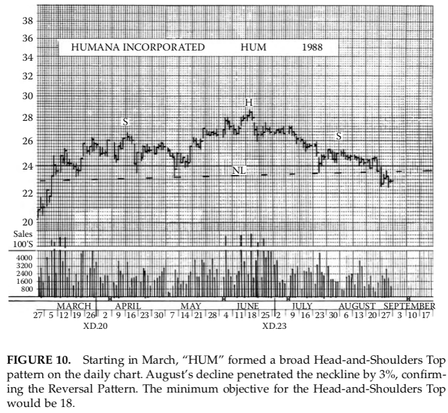

**FIGURE 10**. Starting in March, “HUM” formed a broad Head-and-Shoulders Top
pattern on the daily chart. August’s decline penetrated the neckline by 3%, confirm-
ing the Reversal Pattern. The minimum objective for the Head-and-Shoulders Top
would be 18.

##### Phá Vỡ Đường Viền Cổ

Dấu hiệu báo động thực sự xuất hiện khi hoạt động không gia tăng đáng
kể trong đợt hồi thứ ba, vai phải. Nếu thị trường vẫn trầm lắng khi giá
phục hồi (ở giai đoạn này bạn có thể vẽ một “đường viền cổ” tạm thời
trên đồ thị của mình) và nếu, khi chúng tiến gần đến mức xấp xỉ của
đỉnh vai trái và bắt đầu uốn cong xuống, khối lượng vẫn tương đối nhỏ,
mô hình Đỉnh Đầu-và-Vai của bạn đã hoàn thành ít nhất 75%. Mặc dù
việc áp dụng cụ thể các nghiên cứu mô hình này vào chiến thuật giao
dịch thuộc phạm vi của phần thứ hai của cuốn sách này, chúng ta có
thể lưu ý ở đây rằng nhiều nhà giao dịch cổ phiếu bán ra hoặc chuyển
đổi vị thế ngay khi họ chắc chắn rằng một vai phải có khối lượng thấp
đã được hoàn thành, mà không chờ đợi sự xác nhận cuối cùng mà
chúng ta đã nêu dưới mục D là việc phá vỡ đường viền cổ.
Tuy nhiên, mô hình Đầu-và-Vai chưa hoàn tất, và một sự Đảo Chiều Xu
Hướng quan trọng chưa được báo hiệu một cách dứt khoát cho đến khi
đường viền cổ bị xuyên thủng xuống phía dưới với một biên độ quyết
định. Cho đến khi đường viền cổ bị phá vỡ, một tỷ lệ nhất định các diễn
biến Đầu-và-Vai, có lẽ khoảng 20%, được “cứu”; tức là, giá không giảm
thấp hơn, mà chỉ đơn giản là loay hoay một cách uể oải trong một thời
gian trong phạm vi chung của vai phải, cuối cùng trở nên vững chắc
hơn, và nối lại đà tăng của chúng.
Cuối cùng, cần phải nói rằng, trong những trường hợp hiếm hoi, một
Đỉnh Đầu-và-Vai được xác nhận bởi một sự xuyên thủng đường viền cổ
dứt khoát nhưng giá vẫn không giảm nhiều hơn nữa. Những “chuyển
động giả” như vậy là những hiện tượng khó khăn nhất mà nhà phân
tích kỹ thuật phải đối phó. May mắn thay, trong trường hợp của mô
hình Đầu-và-Vai, chúng cực kỳ hiếm. Xác suất nghiêng áp đảo về việc
xu hướng giảm tiếp diễn một khi mô hình Đầu-và-Vai đã được xác
nhận đến mức việc tin vào bằng chứng của đồ thị là điều đáng làm,
bất kể nó có vẻ không phù hợp đến mức nào với tin tức hiện hành hay
tâm lý thị trường.
Có một điều có thể nói ra và đáng lưu ý về các Cấu Trúc Đầu-và-Vai
không hoàn thành hoặc tạo ra các xác nhận giả. Những diễn biến như
vậy hầu như không bao giờ xảy ra trong các giai đoạn đầu của một
Xu Hướng Tăng Chính. Một mô hình Đầu-và-Vai không “hoạt động”
là một lời cảnh báo rằng, mặc dù tình hình vẫn còn một ít sinh khí, một
sự đảo chiều thực sự đã ở rất gần. Lần tiếp theo khi một điều gì đó
mang tính chất của một Mô Hình Đảo Chiều bắt đầu xuất hiện trên các
đồ thị thì rất có khả năng đó sẽ là lần cuối cùng.

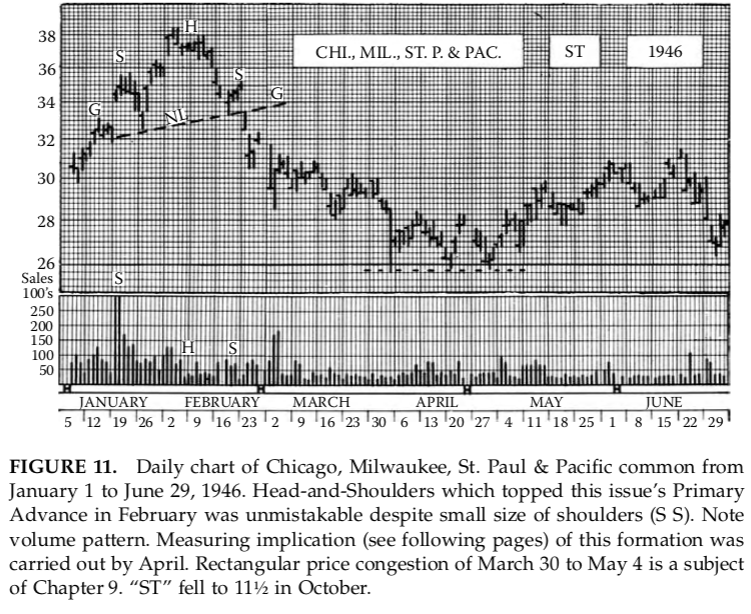

**HÌNH 11.** Đồ thị ngày của cổ phiếu phổ thông Chicago, Milwaukee,
St. Paul & Pacific từ ngày 1 tháng Giêng đến ngày 29 tháng Sáu, 1946.
Mô hình Đầu-và-Vai đã tạo đỉnh cho Xu Hướng Tăng Chính của mã
này vào tháng Hai là không thể nhầm lẫn mặc dù kích thước các vai
nhỏ (S S). Lưu ý mô hình khối lượng. Hàm ý đo lường (xem các trang
tiếp theo) của cấu trúc này đã được thực hiện vào tháng Tư. Vùng
tắc nghẽn giá hình chữ nhật từ ngày 30 tháng Ba đến ngày 4 tháng
Năm là chủ đề của Chương 9. “ST” đã giảm xuống 11½ vào tháng Mười.

##### Các Biến Thể Trong Các Đỉnh Đầu-và-Vai

Có một xu hướng, đáng ngạc nhiên khi người ta nghĩ đến tất cả những
biến động thất thường của tin tức và các dòng chảy chéo có thể ảnh
hưởng đến giao dịch hàng ngày, khiến cho các Mô Hình Đầu-và-Vai
phát triển với mức độ đối xứng cao. Đường viền cổ có xu hướng nằm
ngang và vai phải có xu hướng giống với vai trái về mặt xác nhận giá
(mặc dù dĩ nhiên không phải về khối lượng); có một kiểu cân bằng
thỏa mãn trong bức tranh tổng thể. Nhưng tính đối xứng không phải là
điều thiết yếu đối với một diễn biến Đầu-và-Vai quan trọng. Đường
viền cổ có thể dốc lên (từ trái sang phải) hoặc dốc xuống. Điều kiện duy
nhất đối với một đường viền cổ dốc lên là đáy của đợt suy giảm giữa
đầu và vai phải phải hình thành thấp hơn đáng kể so với mức chung
của đỉnh vai trái. Đôi khi người ta nói rằng một đường viền cổ dốc
xuống cho thấy một tình trạng yếu kém bất thường. Điều này quá rõ
ràng đến mức nó thường được gán cho nhiều trọng lượng hơn mức nó
xứng đáng. Cần lưu ý rằng một phần của sự yếu kém quá mức đó sẽ đã
được giải tỏa vào thời điểm mô hình dốc xuống được hình thành và
giá đã phá vỡ đường viền cổ. Công thức đo lường mà chúng ta sẽ bàn
luận sau áp dụng cho những tình huống như vậy.
Do xu hướng đối xứng trong sự phát triển của các vai, một số nhà
giao dịch, ngay khi đường viền cổ đã hình thành, sẽ vẽ trên đồ thị của
họ một đường song song với đường viền cổ, kéo dài từ đỉnh vai trái
xuyên qua đầu và sang bên phải. Điều này cung cấp một chỉ dẫn về độ
cao xấp xỉ mà đợt hồi của vai phải nên đạt tới và, do đó, một mức bán.
Nhưng bạn sẽ không thấy nhiều cấu trúc hoàn hảo và đối xứng như
hình ảnh lý tưởng của chúng ta, một thực tế mà một số ví dụ thực tế
đi kèm chương này minh họa đầy đủ. Trên thực tế, bất kỳ vai nào cũng
có thể lên cao hơn hoặc mất nhiều thời gian hơn vai kia. Một trong hai
hoặc cả hai có thể lên gần đến mức của đầu (nhưng không bằng nó,
nếu không thì sẽ không có Đầu-và-Vai) hoặc cả hai có thể thấp hơn nó
đáng kể. Nếu hoạt động đi kèm với vai phải trầm lắng một cách bất
thường, vai đó có xu hướng thấp nhưng kéo dài về mặt thời gian. Nói
chung, dường như tồn tại một mối quan hệ cân bằng giữa ba yếu tố của
mô hình giá, thời gian, và khối lượng mà gần như không thể diễn đạt
bằng lời hay con số, nhưng mà người ta với kinh nghiệm sẽ cảm nhận
được trong quá trình hình thành của nó. Tuy nhiên, không có “luật”
nào ngoài những luật đã nêu trong các mục A, B, C, và D của chúng ta;
trong những giới hạn đó, hãy chờ đợi vô số các biến thể nhỏ.

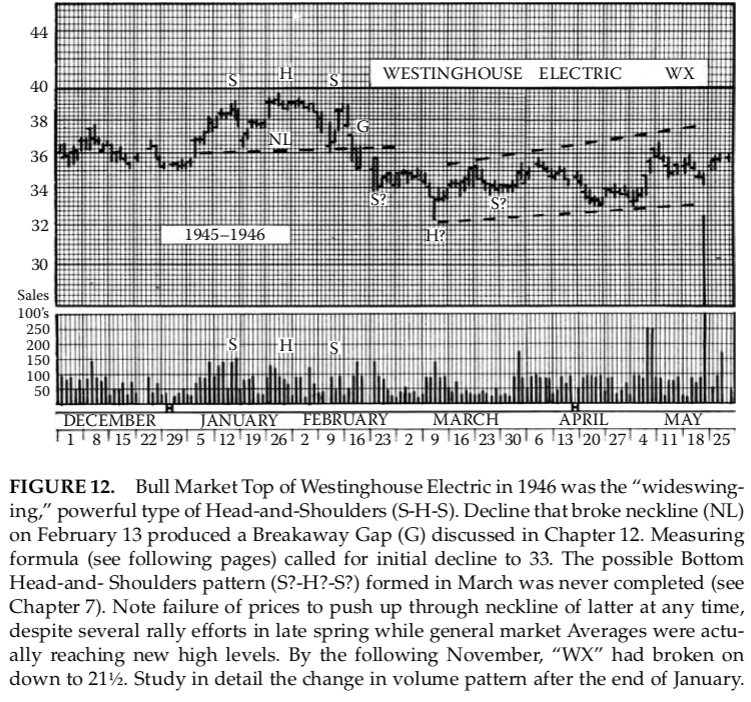

**HÌNH 12.** Đỉnh Thị Trường Giá Lên của Westinghouse Electric năm
1946 là kiểu Đầu-và-Vai mạnh mẽ, “dao động rộng” (S-H-S). Đợt giảm
đã phá vỡ đường viền cổ (NL) vào ngày 13 tháng Hai tạo ra một Khoảng
Trống Thoát Ly (G) được thảo luận trong Chương 12. Công thức đo
lường (xem các trang tiếp theo) cho thấy đợt giảm ban đầu xuống 33.
Mô hình Đầu-và-Vai Đáy có thể có (S?-H?-S?) hình thành vào tháng Ba
chưa bao giờ được hoàn tất (xem Chương 7). Lưu ý việc giá không thể
đẩy lên xuyên qua đường viền cổ của mô hình sau này vào bất kỳ thời
điểm nào, mặc dù có vài nỗ lực hồi phục vào cuối mùa xuân trong khi
các Chỉ Số thị trường chung thực sự đang đạt các mức cao mới. Đến
tháng Mười Một tiếp theo, “WX” đã phá vỡ xuống mức 21½. Hãy nghiên
cứu chi tiết sự thay đổi của mô hình khối lượng sau cuối tháng Giêng.

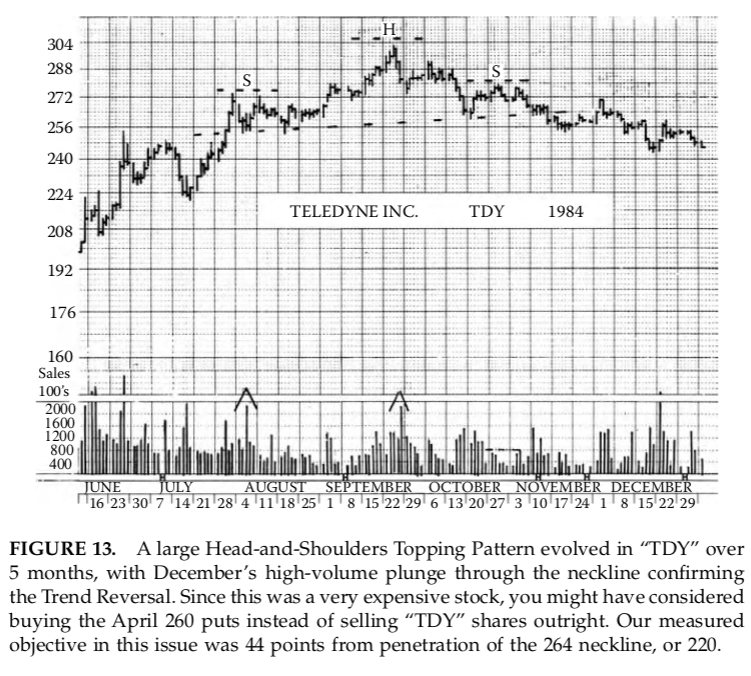

**HÌNH 13.** Một Mô Hình Đỉnh Đầu-và-Vai lớn đã phát triển ở “TDY”
trong 5 tháng, với cú lao xuống có khối lượng cao vào tháng Mười Hai
xuyên qua đường viền cổ xác nhận sự Đảo Chiều Xu Hướng. Vì đây là
một cổ phiếu rất đắt tiền, bạn có thể đã cân nhắc việc mua các quyền
bán tháng Tư ở mức 260 thay vì bán thẳng cổ phiếu “TDY”. Mục tiêu
đo lường của chúng tôi đối với mã này là 44 điểm tính từ sự xuyên thủng
đường viền cổ 264, tức là 220.

#### Hành Động Giá Sau Khi Xác Nhận:

##### Công Thức Đo Lường

Bước cuối cùng, sự xuyên thủng xuống phía dưới của đường viền cổ,
có thể đi kèm với một số gia tăng hoạt động, nhưng thường thì ban đầu
không xảy ra. Nếu khối lượng vẫn nhỏ trong vài ngày khi giá trôi dần
xuống, một đợt “Pullback” thường xuất hiện, đưa giá trở lại mức
đường viền cổ (hiếm khi vượt qua nó). Thông thường, đây là “nhịp
hơi thở cuối cùng”; giá sau đó sẽ quay xuống nhanh chóng, theo quy
luật, và phá vỡ mạnh mẽ với khối lượng giao dịch tăng vọt. Việc có
xảy ra một Pullback Rally sau khi xuyên thủng ban đầu hay không dường
như phụ thuộc vào tình trạng chung của thị trường. Nếu toàn bộ xu
hướng thị trường đang giảm đồng thời với mã cổ phiếu riêng lẻ của
chúng ta, vừa hoàn thành mô hình Đầu-và-Vai, có lẽ sẽ không có
Pullback; thay vào đó giá sẽ có xu hướng tăng tốc giảm, với hoạt
động tăng lên khi rời khỏi khu vực Đỉnh. Ngược lại, nếu thị trường
chung vẫn vững, thì một nỗ lực Pullback là có khả năng xảy ra. Ngoài
ra, xác suất có vẻ hơi nghiêng về một Pullback nếu đường viền cổ bị
phá trước khi vai phải phát triển nhiều, nhưng chắc chắn không có
quy tắc nào đảm bảo hoàn toàn. Trong mọi trường hợp, Pullback Rally
chủ yếu quan trọng đối với nhà giao dịch muốn bán khống cổ phiếu, hoặc
người đã bán khống và phải quyết định đặt lệnh dừng lỗ ở đâu.

Giờ chúng ta đến một trong những đặc điểm thú vị nhất của mô hình
Đảo Chiều cơ bản này — dấu hiệu nó cung cấp về phạm vi (tính theo
điểm) của chuyển động có khả năng xảy ra sau khi hoàn tất mô hình
Đầu-và-Vai. Đo số điểm thẳng đứng từ đỉnh đầu xuống đường viền cổ
theo như vẽ trên đồ thị. Sau đó đo cùng khoảng cách từ đường viền cổ
tại điểm giá cuối cùng xuyên thủng nó sau khi hoàn tất vai phải. Mức
giá được đánh dấu như vậy là mục tiêu tối thiểu có khả năng của đợt
giảm giá.

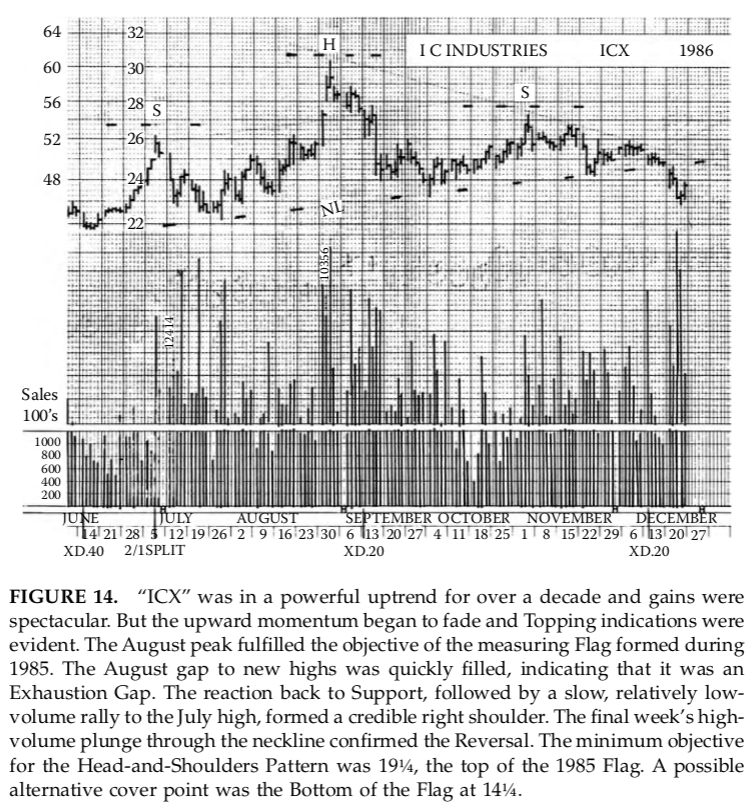

**HÌNH 14.** “ICX” đã trong một xu hướng tăng mạnh trong hơn một
thập kỷ và lợi nhuận rất ấn tượng. Nhưng động lực tăng bắt đầu suy
yếu và các dấu hiệu Topping xuất hiện rõ rệt. Đỉnh tháng Tám đã
hoàn tất mục tiêu của Lá Cờ đo lường hình thành trong năm 1985. Khoảng
trống tháng Tám lên mức cao mới nhanh chóng được lấp đầy, cho thấy
đây là một Khoảng Trống Cạn Kiệt. Đợt điều chỉnh trở về vùng Hỗ
Trợ, sau đó là một đợt hồi phục chậm, khối lượng thấp đến đỉnh tháng
Bảy, tạo thành vai phải đáng tin cậy. Cú lao xuống cuối tuần với
khối lượng cao xuyên qua đường viền cổ xác nhận sự Đảo Chiều.
Mục tiêu tối thiểu cho mô hình Đầu-và-Vai là 19¼, đỉnh của Lá Cờ
1985. Một điểm thay thế có thể là đáy của Lá Cờ ở 14¼.

Hãy nhanh chóng nêu một điều quan trọng về Công Thức Đo Lường
Đầu-và-Vai. Quay lại bộ tiêu chí gốc của chúng ta về Đầu-và-Vai.
Dưới mục A, chúng ta yêu cầu “một đợt tăng mạnh kết thúc một
xu hướng tăng tương đối rộng.” Nếu nhịp tăng trước khi hình thành
vùng Đảo Chiều nhỏ, nhịp giảm theo sau có thể, thực ra có lẽ sẽ,
cũng tương đối nhỏ. Tóm lại, một Mô Hình Đảo Chiều phải có điều
gì đó để đảo chiều. Vì vậy, chúng ta thực sự có hai mức tối thiểu, một
là phạm vi của nhịp tăng trước khi hình thành Đầu-và-Vai, và một là
phạm vi được tính theo công thức đo lường; mức nào nhỏ hơn sẽ được
áp dụng. Quy tắc đo lường được minh họa trên một số ví dụ minh họa
cho chương này. Bạn có thể thấy vì sao đường viền cổ dốc xuống
cho thấy một tình trạng “yếu” hơn so với đường viền cổ dốc lên,
và mức yếu hơn là bao nhiêu, cũng như thực tế rằng hơn một nửa
yếu tố yếu tối thiểu dự kiến đã được tiêu hao trong đợt giảm từ
đỉnh đầu đến điểm xuyên thủng đường viền cổ.

Các chỉ dẫn tối đa là vấn đề hoàn toàn khác, không có quy tắc
đơn giản nào có thể áp dụng. Các yếu tố ảnh hưởng bao gồm độ
mạnh của nhịp tăng trước đó, kích thước, khối lượng và thời gian
của mô hình Đầu-và-Vai, Xu Hướng Chính của thị trường chung
(rất quan trọng), và khoảng cách mà giá có thể giảm trước khi
đến vùng Hỗ Trợ đã xác lập. Một số vấn đề này sẽ được thảo
luận sau.

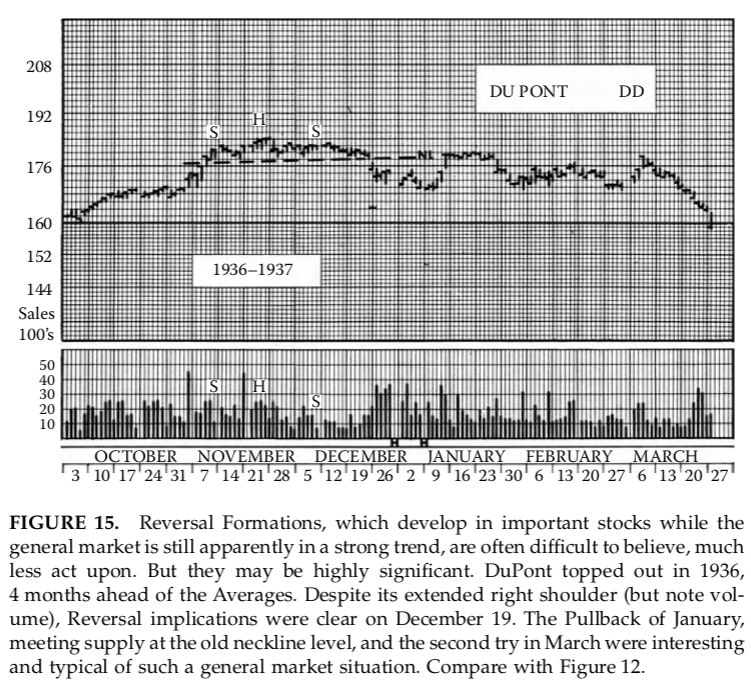

**HÌNH 15.** Các Mô Hình Đảo Chiều, phát triển ở các cổ phiếu quan
trọng trong khi thị trường chung vẫn đang trong xu hướng mạnh, thường
khó tin, chứ chưa nói đến việc hành động theo. Nhưng chúng có thể
cực kỳ quan trọng. DuPont đạt đỉnh năm 1936, trước các Chỉ Số thị
trường 4 tháng. Mặc dù vai phải kéo dài (nhưng lưu ý khối lượng),
tác động Đảo Chiều đã rõ ràng vào ngày 19 tháng Mười Hai. Pullback
tháng Một, gặp cung ở mức đường viền cổ cũ, và nỗ lực thứ hai
tháng Ba là điển hình và thú vị trong tình hình thị trường chung như
vậy. So sánh với Hình 12.

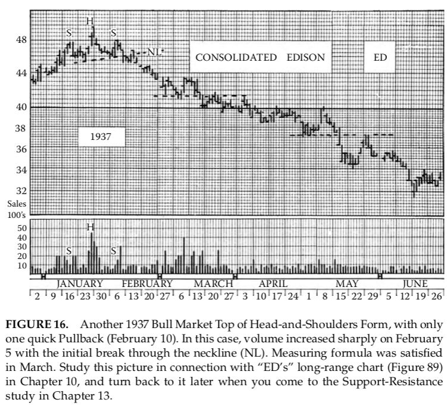

**HÌNH 16.** Một Đỉnh Thị Trường Giá Lên năm 1937 khác của mô hình
Đầu-và-Vai, với chỉ một Pullback nhanh (ngày 10 tháng Hai). Trong
trường hợp này, khối lượng tăng mạnh vào ngày 5 tháng Hai với cú
xuyên thủng đầu tiên qua đường viền cổ (NL). Công thức đo lường
được hoàn tất vào tháng Ba. Nghiên cứu hình này kết hợp với đồ
thị dài hạn của “ED” (Hình 89) trong Chương 10, và quay lại sau
khi đến phần nghiên cứu Hỗ Trợ-Kháng Cự trong Chương 13.

##### Mối quan hệ của Mô hình Vai-Đầu-Vai với Lý thuyết Dow

Không nghi ngờ gì, một số độc giả đã nghi ngờ rằng Mô hình Vai-Đầu-
Vai, theo một nghĩa nào đó, chỉ là sự điều chỉnh các nguyên tắc của Lý thuyết
Dow áp dụng cho biến động của một cổ phiếu riêng lẻ. Quả đúng như vậy. Sự
giảm giá từ đỉnh đầu đến đường cổ, sự tăng trở lại vai phải, và sau đó là sự
giảm tiếp theo phá đường cổ tạo ra một chuỗi Đỉnh và Đáy thấp hơn, tương tự
như những tín hiệu cho xu hướng giảm trong Lý thuyết Dow. Mối quan hệ
logic này giữa Vai-Đầu-Vai và Lý thuyết Dow là một lý do nữa, bên cạnh tầm
quan trọng cơ bản, tần suất và độ tin cậy của nó, khiến chúng tôi đặt nó đầu
tiên trong nghiên cứu về Các Mô hình Đảo chiều. Nhưng nó rõ ràng hơn, đưa
ra cảnh báo trước mà tương đối dễ nhận biết, và tín hiệu xuất hiện nhanh hơn
trong trường hợp đường cổ hướng lên. Hơn nữa, nó không yêu cầu thời gian tối
thiểu cụ thể cho bất kỳ chuyển động nào của các thành phần, và không cần xác
nhận từ cổ phiếu khác hay Chỉ số Trung bình.

Có cả Vai-Đầu-Vai Đáy _(EN: Thuật ngữ không mô tả rõ ràng cho một mô hình đáy mà
tôi thích gọi là “Đáy Kilroy.” Xem Hình 23.1)_ cũng như Đỉnh, với những ý nghĩa
quan trọng không kém. Các Mô hình Đáy sẽ được trình bày trong chương tiếp theo.

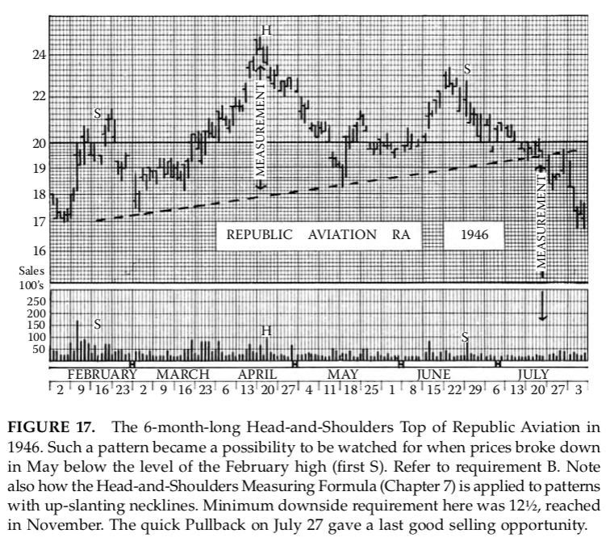

**HÌNH 17.** Mô hình Vai-Đầu-Vai Đỉnh kéo dài 6 tháng của Republic Aviation
năm 1946. Một mô hình như vậy trở thành khả năng cần theo dõi khi giá giảm
xuống dưới mức cao của tháng Hai (S đầu tiên) vào tháng Năm. Tham khảo yêu
cầu B. Lưu ý cách Công thức Đo lường Vai-Đầu-Vai (Chương 7) được áp dụng
cho các mô hình với đường cổ hướng lên. Yêu cầu giảm tối thiểu ở đây là 12½,
đạt được vào tháng Mười Một. Đợt Pullback nhanh ngày 27 tháng 7 cung cấp cơ
hội bán cuối cùng tốt.

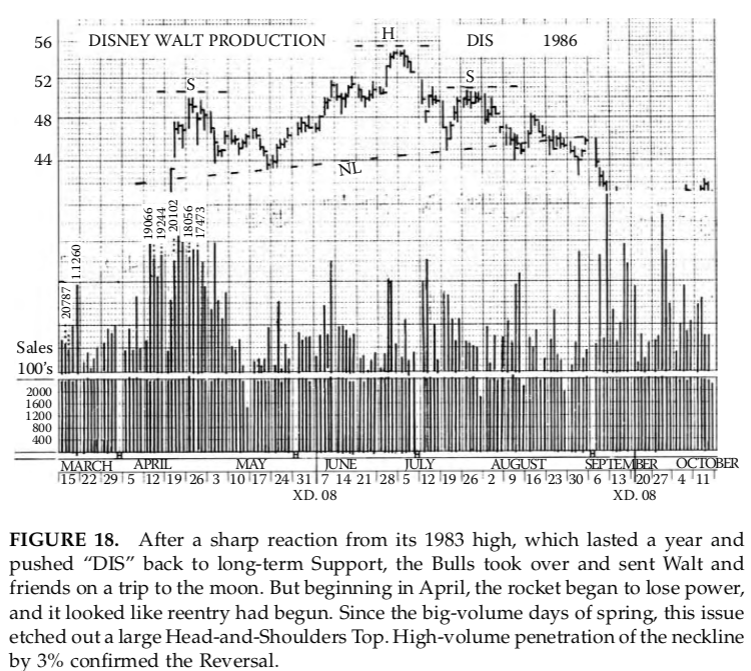

**HÌNH 18.** Sau phản ứng mạnh từ mức cao năm 1983, kéo dài một năm và
đẩy “DIS” trở lại Hỗ trợ dài hạn, phe Bò tiếp quản và đưa Walt cùng bạn bè
lên “mặt trăng”. Nhưng bắt đầu từ tháng Tư, tên lửa bắt đầu mất lực, và
có vẻ như quá trình tái nhập đã bắt đầu. Kể từ những ngày khối lượng lớn
mùa xuân, cổ phiếu này hình thành một mô hình Vai-Đầu-Vai Đỉnh lớn. Sự
xâm nhập đường cổ với khối lượng cao hơn 3% xác nhận sự Đảo chiều.

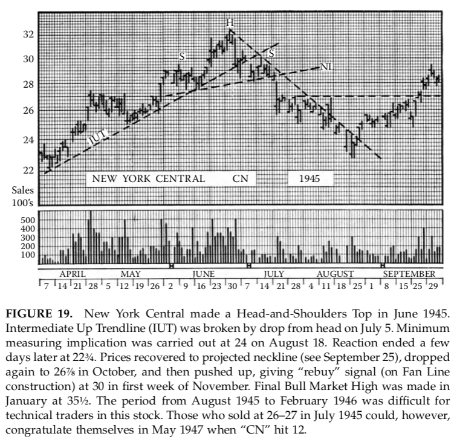

**HÌNH 19.** New York Central tạo mô hình Vai-Đầu-Vai Đỉnh vào tháng Sáu
1945. Đường xu hướng trung gian tăng (IUT) bị phá bởi sự giảm từ đỉnh ngày
5 tháng 7. Ý nghĩa đo lường tối thiểu thực hiện được ở mức 24 ngày 18 tháng
8. Phản ứng kết thúc vài ngày sau ở mức 22¾. Giá hồi về đường cổ dự kiến (xem
ngày 25 tháng 9), giảm lại xuống 26⅞ vào tháng Mười, rồi tăng trở lại, đưa
ra tín hiệu “mua lại” (trên cách dựng Fan Line) tại 30 trong tuần đầu tháng
Mười Một. Đỉnh Thị trường Bò cuối cùng hình thành vào tháng Giêng ở 35½. Giai
đoạn từ tháng 8/1945 đến tháng 2/1946 là khó khăn cho các nhà kỹ thuật
trong cổ phiếu này. Những người bán ở 26–27 vào tháng 7/1945 có thể tự chúc
mừng vào tháng 5/1947 khi “CN” chạm 12.

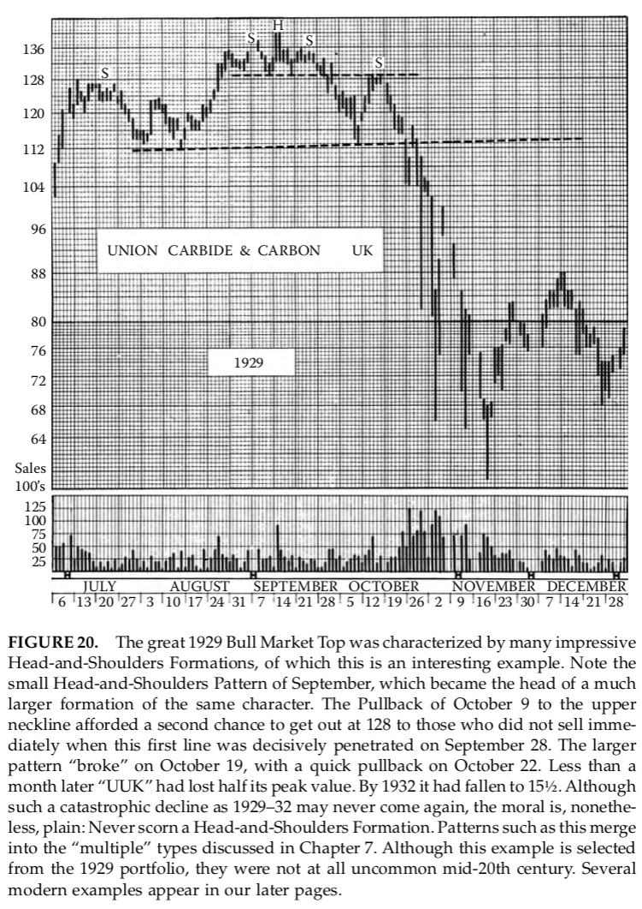

**HÌNH 20.** Đỉnh Thị trường Bò vĩ đại năm 1929 được đặc trưng bởi nhiều Mô
hình Vai-Đầu-Vai ấn tượng, trong đó đây là một ví dụ thú vị. Lưu ý Mô hình
Vai-Đầu-Vai nhỏ của tháng 9, trở thành đỉnh của một mô hình lớn hơn cùng
tính chất. Pullback ngày 9 tháng 10 về đường cổ trên cung cấp cơ hội thứ hai
để thoát ở 128 cho những ai chưa bán ngay khi đường này bị phá quyết định
ngày 28 tháng 9. Mô hình lớn hơn “phá” vào ngày 19 tháng 10, với một đợt
pullback nhanh ngày 22 tháng 10. Chưa đầy một tháng sau “UUK” đã mất một
nửa giá trị đỉnh. Đến năm 1932, nó giảm xuống 15½. Mặc dù sự sụt giảm thảm
khốc như 1929–32 có thể không xảy ra lần nữa, bài học vẫn rõ ràng: Đừng bao
giờ coi thường Mô hình Vai-Đầu-Vai. Các mô hình như vậy hòa nhập vào các
mô hình “đa dạng” được thảo luận trong Chương 7. Mặc dù ví dụ này lấy từ
danh mục năm 1929, chúng không hề hiếm vào giữa thế kỷ 20. Một số ví dụ
hiện đại xuất hiện trong các trang sau.

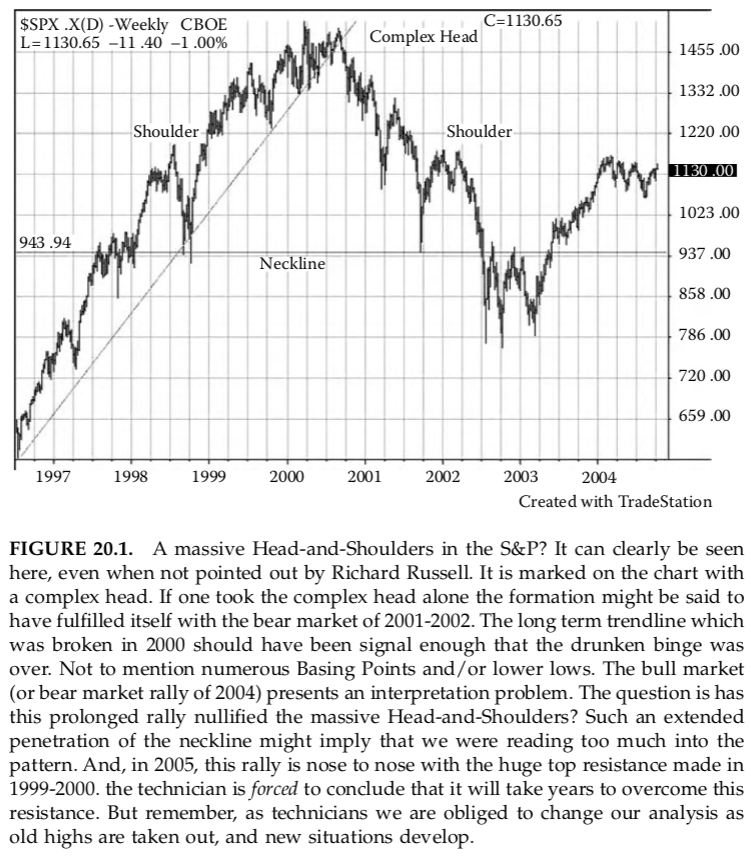

**HÌNH 20.1.** Một Vai-Đầu-Vai khổng lồ trong S&P? Có thể thấy rõ ràng
tại đây, ngay cả khi Richard Russell không chỉ ra. Nó được đánh dấu trên biểu
đồ với đầu phức tạp. Nếu chỉ lấy đầu phức tạp, mô hình có thể được cho là
hoàn tất với thị trường gấu 2001-2002. Đường xu hướng dài hạn bị phá năm
2000 lẽ ra đã là tín hiệu đủ để biết “cơn say” đã kết thúc. Chưa kể nhiều
Basing Points và/hoặc đáy thấp hơn. Thị trường bò (hoặc đợt hồi phục thị
trường gấu 2004) đặt ra vấn đề giải thích. Câu hỏi là liệu đợt hồi phục kéo
dài này đã làm vô hiệu hóa Vai-Đầu-Vai khổng lồ? Sự xâm nhập kéo dài của
đường cổ có thể ám chỉ chúng ta đang đọc quá nhiều vào mô hình. Và, năm 2005,
đợt hồi phục này sát với kháng cự đỉnh khổng lồ hình thành năm 1999-2000. Kỹ
thuật viên _bắt buộc_ kết luận rằng sẽ mất nhiều năm để vượt qua kháng cự này.
Nhưng hãy nhớ, với tư cách kỹ thuật viên, chúng ta buộc phải thay đổi phân
tích khi các đỉnh cũ bị phá và tình huống mới xuất hiện.

