## Chương 11. Các Mô Hình Tích Lũy

Một đội quân nếu tiến lên quá nhanh, xâm nhập sâu vào lãnh thổ đối phương,
chịu tổn thất và vượt quá khả năng tiếp tế, thì sớm muộn cũng phải dừng lại,
có thể lùi về một vị trí dễ phòng thủ hơn, đào hào cố thủ, bổ sung lực lượng
và xây dựng một căn cứ vững chắc để từ đó phát động đợt tấn công mới sau này.
Trong thuật ngữ quân sự mà chúng ta đã quen thuộc ít nhiều trong những năm
gần đây, quá trình đó được gọi là _củng cố_ những thành quả đã đạt được.
Dù không nên lạm dụng phép so sánh này, nhưng có rất nhiều điểm trong hành
động của thị trường chứng khoán có thể ví với một chiến dịch quân sự.

Khi một cổ phiếu tăng (hoặc giảm) quá nhanh, nó sẽ đến lúc mà các lực đẩy
tạo nên chuyển động đó bị cạn kiệt. Khi ấy, cổ phiếu hoặc đảo chiều xu hướng
(theo nghĩa Chính hay Trung gian), hoặc phản ứng tại một mức Hỗ trợ tốt,
hoặc _Tích lũy_ vị thế của mình trong một mô hình “đi ngang” nào đó, được
cấu thành bởi các Dao động Nhỏ, cho đến khi nó “theo kịp chính nó”, và sẵn
sàng tiếp tục hành trình.

Chúng ta đã nhiều lần nhắc đến các Mô hình Tích lũy khi nghiên cứu Tam giác
Cân và Hình chữ nhật. Ta thấy rằng hai dạng mô hình này có thể hoặc đảo
chiều xu hướng trước đó, hoặc tích lũy để chuẩn bị cho xu hướng tiếp diễn.
Chúng ta cũng lưu ý rằng khoảng ba trên bốn Tam giác Cân thực chất là mô
hình Tích lũy chứ không phải Đảo chiều — và Hình chữ nhật cũng có tỷ lệ
tương tự. Ngay cả một mô hình Mở rộng Đỉnh phẳng, hình thành tại đỉnh của
một xu hướng tăng Trung gian, dù thường mang hàm ý Giảm giá, vẫn có thể
được chuyển hóa thành mô hình Tích lũy hoặc Tiếp diễn nếu cạnh đỉnh phẳng
của nó bị phá vỡ dứt khoát theo hướng đi lên.

Một Đường Dow trong đồ thị của một chỉ số Trung bình có thể là mô hình
Tích lũy hoặc Đảo chiều, và xác suất cao hơn là trường hợp thứ nhất. Đường
Dow, về bản chất, là một dạng Hình chữ nhật lỏng lẻo. Thực tế là hầu như
bất kỳ mô hình giá đi ngang nào — thường được gọi là vùng “Ùn tắc” hay
khu vực giao dịch — miễn là khối lượng giao dịch có xu hướng giảm dần
trong quá trình hình thành (và không thể hiện xu hướng mở rộng rõ rệt),
thì thường đóng vai trò là một mô hình Tích lũy. Tuy nhiên, đa số các vùng
tích lũy xu hướng đều khá rõ ràng và mang hình dạng dễ nhận biết.

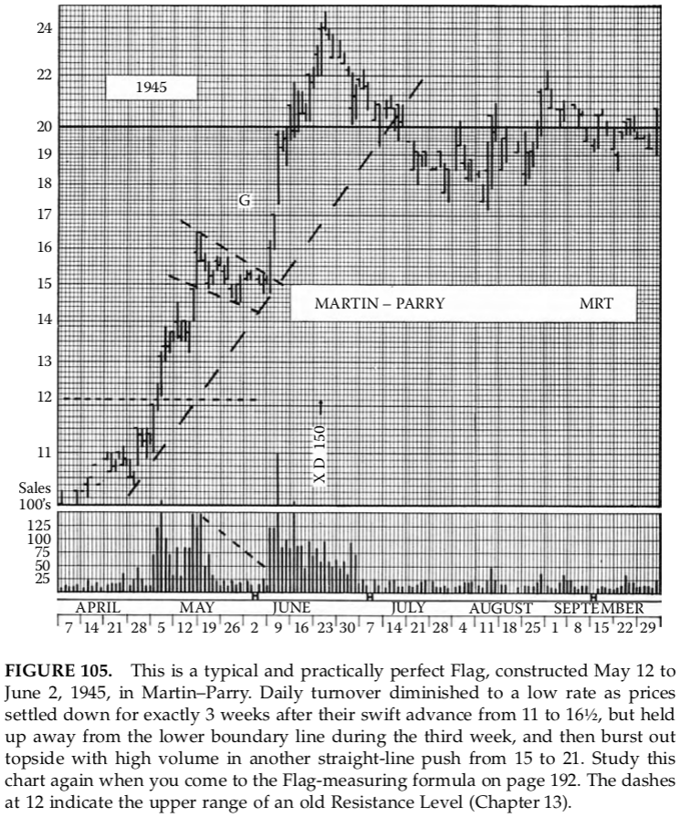

**HÌNH 105.** Đây là một mô hình Cờ điển hình và gần như hoàn hảo, hình thành
từ ngày 12 tháng 5 đến ngày 2 tháng 6 năm 1945, ở cổ phiếu Martin–Parry.
Khối lượng giao dịch hàng ngày giảm xuống mức rất thấp khi giá đi vào trạng
thái ổn định trong đúng 3 tuần sau cú tăng nhanh từ 11 lên 16½, nhưng vẫn
giữ được khoảng cách so với đường biên dưới trong tuần thứ ba, rồi bùng
nổ lên phía trên với khối lượng lớn trong một cú tăng thẳng từ 15 lên 21.
Hãy nghiên cứu lại đồ thị này khi bạn đọc đến công thức đo mục tiêu của
mô hình Cờ ở trang 192. Các nét gạch tại mức 12 cho thấy biên trên của một
Vùng Kháng cự cũ (Chương 13).

##### Cờ (Flags) và Cờ đuôi nheo (Pennants)

Chúng ta không cần dành thêm thời gian cho Tam giác và Hình chữ nhật;
chúng đã được phân tích đầy đủ, cả trong vai trò Đảo chiều lẫn Tích lũy,
ở các chương trước. Hai mô hình đầu tiên mang tính chất _chỉ_ Tích lũy
là Cờ và Cờ đuôi nheo, và chúng có mối liên hệ khá thú vị, như ta sẽ thấy,
với Tam giác, Hình chữ nhật và Nêm (Wedges).

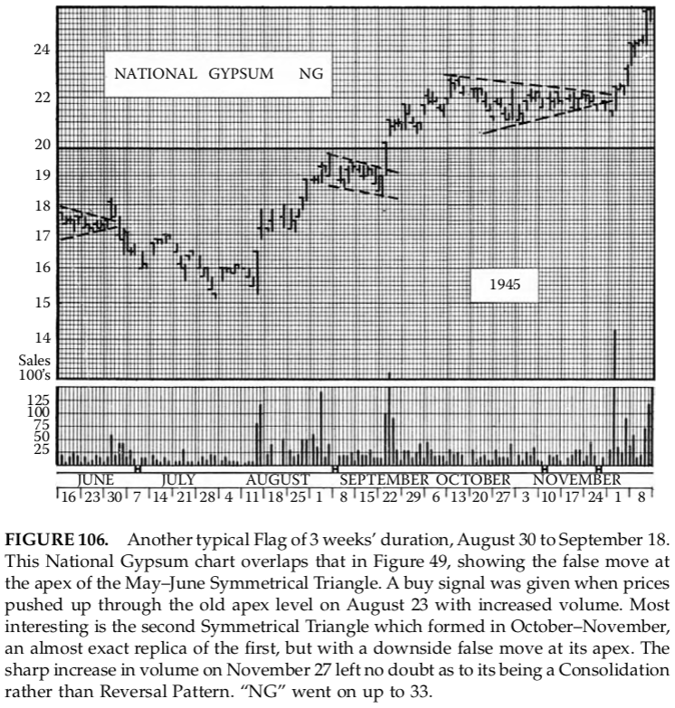

**HÌNH 106.** Một mô hình Cờ điển hình khác, kéo dài 3 tuần, từ 30 tháng 8
đến 18 tháng 9. Đồ thị National Gypsum này chồng lấp với Hình 49, cho thấy
cú phá vỡ giả tại đỉnh của Tam giác Cân tháng 5–6. Tín hiệu mua xuất hiện
khi giá vượt lên trên mức đỉnh cũ vào ngày 23 tháng 8 với khối lượng tăng.
Điều đáng chú ý nhất là Tam giác Cân thứ hai hình thành trong giai đoạn
tháng 10–11, gần như là bản sao chính xác của tam giác đầu tiên, nhưng
lại có cú phá vỡ giả theo hướng giảm tại đỉnh của nó. Sự gia tăng mạnh
về khối lượng vào ngày 27 tháng 11 đã xóa tan mọi nghi ngờ rằng đây là
một mô hình Tích lũy chứ không phải Đảo chiều. “NG” tiếp tục tăng lên 33.

Một mô hình _Cờ_ trông giống như một lá cờ trên đồ thị — điều này đúng
nếu nó xuất hiện trong một xu hướng tăng; trong xu hướng giảm, hình ảnh
đơn giản là bị lật ngược. Nó có thể được mô tả như một hình bình hành nhỏ,
gọn của các dao động giá, hoặc một Hình chữ nhật nghiêng, dốc nhẹ ngược
chiều với xu hướng chính. Trước tiên, hãy xét mô hình Cờ trong xu hướng
tăng. Nó thường hình thành sau một cú tăng nhanh và khá mạnh, tạo nên
một quỹ đạo giá gần như thẳng đứng, hoặc ít nhất là rất dốc, trên đồ thị.

Trong những đợt tăng như vậy, khối lượng giao dịch thường tăng dần cho
đến khi đạt mức rất cao. Khối lượng này (vì mỗi giao dịch vừa là mua,
vừa là bán) chính là một lời cảnh báo rằng nhiều người nắm giữ cổ phiếu
đang chốt lời. Cuối cùng, áp lực chốt lời sẽ chặn đứng đà tăng. Giá bắt
đầu “xoay vòng” mà không còn tăng thêm, rồi điều chỉnh giảm hai hoặc
ba điểm với khối lượng thấp hơn. Một nhịp hồi mới xuất hiện, nhưng không
vượt được đỉnh trước đó, cũng không đạt mức khối lượng đỉnh cũ.

Một đợt điều chỉnh khác kéo giá xuống thấp hơn đôi chút so với đáy trước,
kèm theo sự suy giảm thêm của hoạt động giao dịch. Sau đó là một chuỗi
các Dao động Nhỏ tương tự, trong đó mỗi đỉnh và đáy đều thấp hơn một chút
so với đỉnh, đáy liền trước, và khối lượng tiếp tục co lại rõ rệt và đều
đặn khi mô hình phát triển. Trên đồ thị, cú tăng dốc ban đầu, tiếp theo là
vùng giá đi ngang, gọn và hơi dốc xuống, có thể được bao quanh bởi hai
đường song song phía trên và dưới, trông giống như một cột cờ (hoặc dây
treo) với lá cờ tung bay ở đỉnh — và đó chính là nguồn gốc tên gọi của
mô hình này.

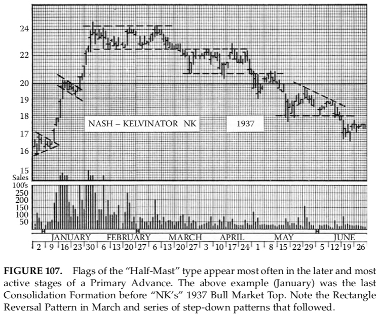

**HÌNH 107.** Các mô hình Cờ dạng “Nửa cột cờ” thường xuất hiện nhiều nhất
trong giai đoạn muộn và sôi động nhất của một xu hướng tăng Chính. Ví dụ
trên (tháng 1) là mô hình Tích lũy cuối cùng trước đỉnh Thị trường Bò
năm 1937 của “NK”. Lưu ý mô hình Hình chữ nhật Đảo chiều trong tháng 3
và chuỗi các mô hình giảm bậc hình thành sau đó.

Đôi khi, mỗi nhịp tăng và giảm trong mô hình Cờ kéo dài 3 hoặc 4 ngày,
hiếm khi lâu hơn. Trong những trường hợp khác, giá dao động qua lại giữa
biên trên và biên dưới của Cờ chỉ trong một hoặc hai ngày, khiến mô hình
trên đồ thị trông như một khối đặc các vạch biên độ giá. Mô hình càng
rộng (tính từ đỉnh xuống đáy) thì tự nhiên mỗi dao động bên trong càng
cần nhiều thời gian để hoàn tất. Quá trình các Dao động Nhỏ này có thể
chỉ kéo dài 5 ngày đến một tuần nếu Cờ hẹp, hoặc lên đến 3 tuần.

Đến lúc đó, khối lượng giao dịch hàng ngày thường đã giảm xuống mức
tương đối thấp. Rồi đột nhiên, giá bùng nổ với một đợt gia tăng hoạt động
mới từ cuối mô hình Cờ và tiếp tục tăng thẳng trong một nhịp tăng khác,
gần như sao chép chính xác “cột cờ” ban đầu mà trên đó mô hình Cờ đã
được hình thành.

Chúng ta đã nói rằng mô hình Cờ thường dốc xuống vừa phải, nhưng những
mô hình rất ngắn và “đặc” thường phát triển theo phương ngang và trông
giống như những hình vuông nhỏ. (Trong những trường hợp hiếm hoi, một
mô hình Cờ trong xu hướng tăng thậm chí còn dốc lên nhẹ.)

Các mô hình Cờ cũng hình thành trong những đợt giảm mạnh theo cách
tương tự và mang hàm ý hoàn toàn giống như trong xu hướng tăng. Cờ
trong xu hướng giảm, dĩ nhiên, có xu hướng dốc lên — tức là chỉ đơn
thuần đảo ngược hình ảnh của Cờ tăng. Khối lượng giao dịch giảm dần
trong quá trình hình thành, rồi tăng trở lại khi giá phá vỡ đi xuống
khỏi mô hình.

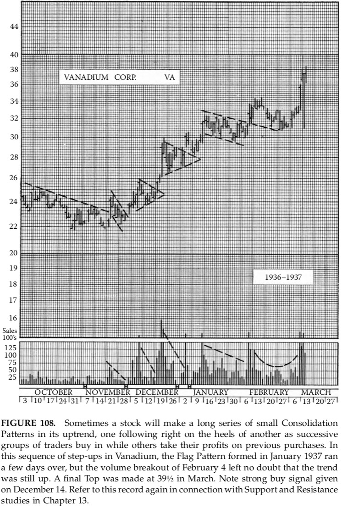

**HÌNH 108.** Đôi khi một cổ phiếu sẽ hình thành một chuỗi dài các mô hình
Tích lũy nhỏ trong xu hướng tăng của nó, mô hình này nối tiếp ngay sau
mô hình kia, khi các nhóm nhà giao dịch mới tham gia mua vào trong lúc
những người khác chốt lời từ các vị thế trước đó. Trong chuỗi các bước
tăng này của Vanadium, mô hình Cờ hình thành vào tháng 1 năm 1937 kéo
dài thêm vài ngày, nhưng cú phá vỡ kèm khối lượng vào ngày 4 tháng 2 đã
không để lại nghi ngờ nào rằng xu hướng vẫn là tăng. Một đỉnh cuối cùng
được tạo tại mức 39½ vào tháng 3. Lưu ý tín hiệu mua mạnh xuất hiện
vào ngày 14 tháng 12. Hãy tham chiếu lại đồ thị này khi nghiên cứu về
Hỗ trợ và Kháng cự trong Chương 13.

##### Pennant — Lá Cờ Nhọn

Khác biệt quan trọng duy nhất giữa _Pennant_ và _Flag_ là Pennant được giới
hạn bởi hai đường biên hội tụ thay vì song song. Nói cách khác, Pennant thông
thường là một Tam Giác nhỏ, gọn, có độ nghiêng. Nó nghiêng xuống khi xuất
hiện trong xu hướng tăng, và nghiêng lên khi xuất hiện trong xu hướng giảm.
Theo quy luật, nó hình thành sau một pha tăng (hoặc giảm) nhanh, và khối
lượng giao dịch co hẹp rõ rệt trong quá trình tạo mẫu. Thực tế, hoạt động
giao dịch trong Pennant còn giảm nhanh hơn cả Flag (điều này dễ hiểu vì các
dao động ngày càng ngắn), và đôi khi gần như cạn kiệt trước khi Pennant
hoàn tất và giá phá vỡ để bước vào một nhịp chuyển động mới, nhanh.

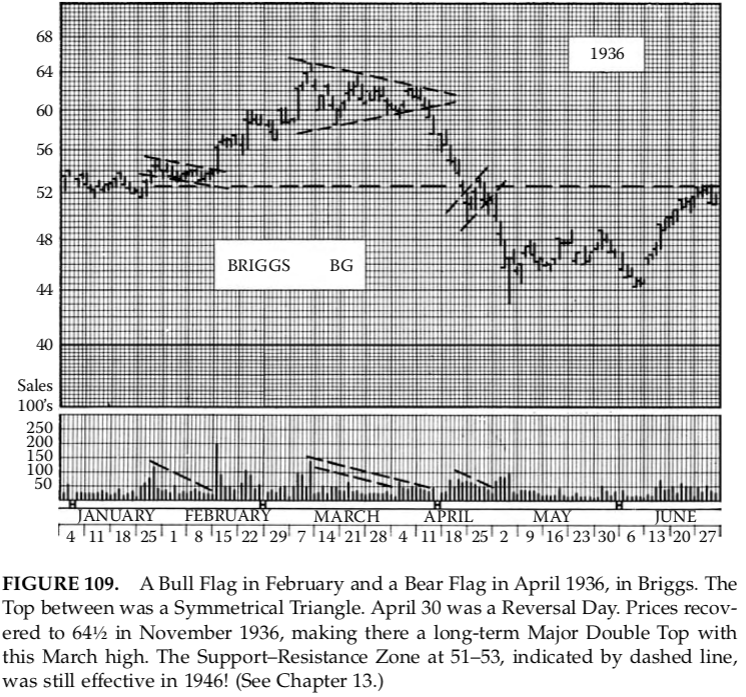

**HÌNH 109.** Một Bull Flag vào tháng 2 và một Bear Flag vào tháng 4 năm 1936
ở Briggs. Đỉnh ở giữa là một Tam Giác Cân. Ngày 30/4 là một Reversal Day.
Giá hồi phục lên 64½ vào tháng 11/1936, tạo thành một Đỉnh Đôi dài hạn
với đỉnh tháng 3. Vùng Hỗ trợ–Kháng cự 51–53 (đường gạch) vẫn còn hiệu
lực đến năm 1946! (Xem Chương 13.)

Pennant cũng có thể được xem là một Wedge ngắn, gọn, đặc trưng bởi sự
suy giảm mạnh của hoạt động giao dịch. Khi — như thường thấy — nó
nghiêng ngược lại với xu hướng trước đó, hàm ý dự báo của nó tương tự
Wedge: giá sẽ phá vỡ theo hướng ngược với độ nghiêng của mẫu hình.
Tuy nhiên, cũng tồn tại những biến thể hiếm gặp, mang tính nhỏ (Minor),
tương tự như một số Flag, trong đó vùng giá rất ngắn, “đặc”, gần như nằm
ngang (giống Tam Giác Cân), hoặc thậm chí hơi nghiêng cùng hướng với
xu hướng trước đó. Với dạng cuối này, khi giá thoát ra, thường không phải
là cú phá vỡ thẳng, dứt khoát, mà là một đường cong tăng tốc, khối lượng
tăng dần thay vì bùng nổ ngay tại điểm breakout. Toàn bộ mẫu hình khi đó
trông giống như một chiếc sừng cong kéo dài đến một mũi nhọn mảnh.
Đừng để các biến thể này làm bạn bối rối; hình dạng của chúng không hề
đánh lừa, và mối liên hệ với dạng Pennant thông thường là khá rõ ràng.

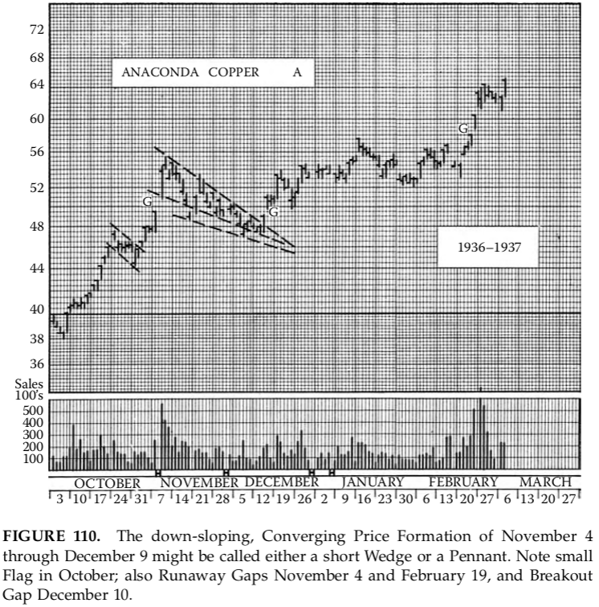

**HÌNH 110.** Mẫu hình giá hội tụ, nghiêng xuống từ 4/11 đến 9/12 có thể được
gọi là một Wedge ngắn hoặc một Pennant. Lưu ý Flag nhỏ trong tháng 10;
các Runaway Gap ngày 4/11 và 19/2; và Breakout Gap ngày 10/12.

##### Công Thức Đo Mục Tiêu

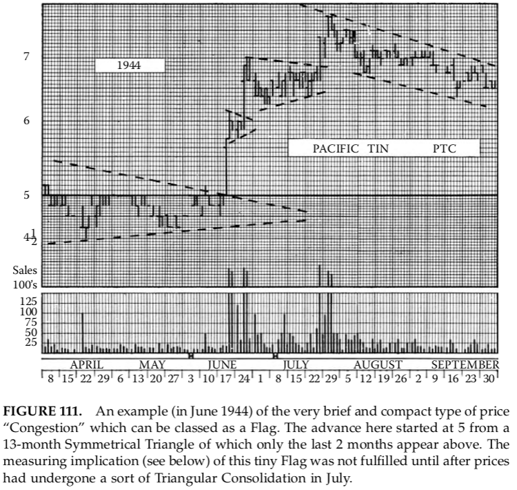

**HÌNH 111.** Ví dụ (tháng 6/1944) về dạng “nghẽn giá” rất ngắn và gọn, có thể
xếp vào loại Flag. Đà tăng bắt đầu từ mức 5, xuất phát từ một Tam Giác Cân
kéo dài 13 tháng (chỉ 2 tháng cuối được hiển thị). Mục tiêu đo lường (xem
bên dưới) của Flag nhỏ này chỉ được hoàn thành sau khi giá trải qua một
giai đoạn tích lũy dạng Tam Giác trong tháng 7.

Cùng một công thức đo mục tiêu xấp xỉ được áp dụng cho cả Pennant lẫn
Flag. Cả hai đều là các mẫu hình “Half-Mast”, thường hình thành sau một
chuyển động giá khá đều và nhanh (dốc). Khi áp dụng quy tắc đo, hãy quay
lại điểm bắt đầu của nhịp chuyển động ngay trước đó — nơi giá thoát ra
khỏi một vùng tích lũy hoặc đảo chiều trước (hoặc phá vỡ một đường xu
hướng hay mức kháng cự quan trọng). Điểm này thường nhận ra bởi sự
gia tăng đột ngột của khối lượng. Đo khoảng cách từ đó đến mức đảo chiều
nhỏ, nơi Flag hoặc Pennant bắt đầu hình thành. Sau đó, đo cùng một
khoảng cách từ điểm giá phá vỡ khỏi Flag hoặc Pennant, theo cùng hướng.
Mức giá thu được là kỳ vọng tối thiểu của dạng tích lũy này. Trên thực tế,
các nhịp tăng từ Flag hoặc Pennant trong xu hướng tăng thường đi xa hơn
nhịp trước đó (tính theo điểm hay đô la), trong khi các nhịp giảm có thể
không đi xa bằng. Do đó, công thức này áp dụng tốt nhất trên biểu đồ bán
logarit, bằng cách đo khoảng cách trực tiếp trên biểu đồ thay vì đếm điểm.
Bạn có thể kiểm chứng điều này qua các ví dụ minh họa.

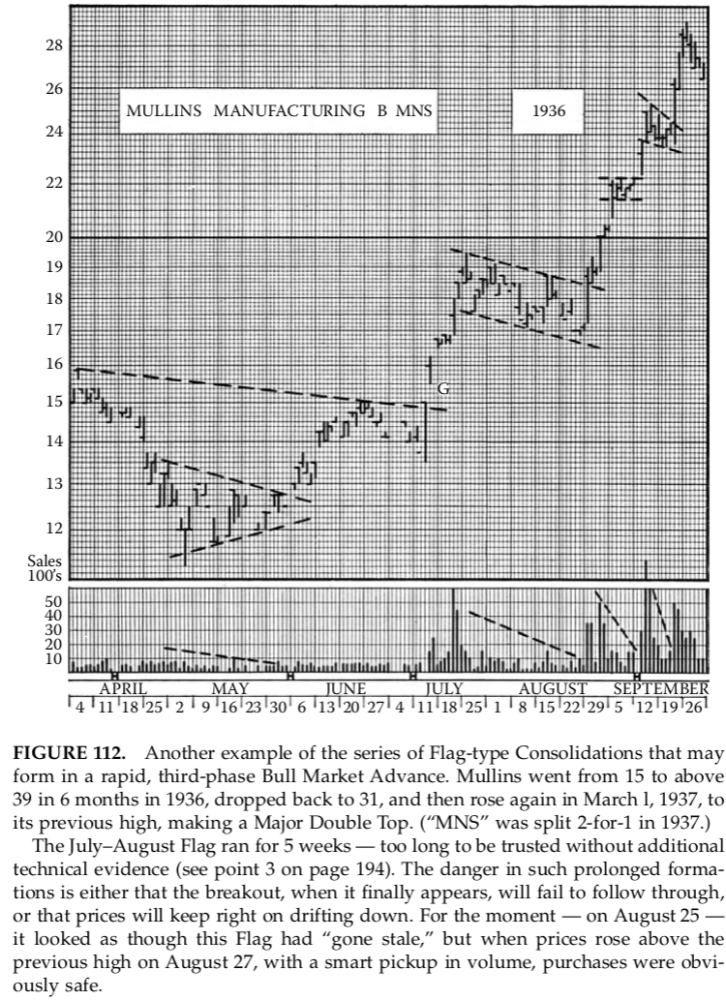

**HÌNH 112.** Một ví dụ khác về chuỗi các tích lũy dạng Flag có thể xuất hiện
trong pha thứ ba, tăng tốc của Bull Market. Mullins tăng từ 15 lên trên 39
chỉ trong 6 tháng năm 1936, giảm về 31, rồi tăng lại vào 1/3/1937 lên đỉnh
cũ, tạo thành Đỉnh Đôi lớn. (MNS chia tách 2:1 năm 1937.) Flag tháng 7–8
kéo dài 5 tuần — quá dài để tin cậy nếu không có thêm bằng chứng kỹ
thuật (xem điểm 3 trang 194). Nguy hiểm của các mẫu kéo dài là breakout
có thể không theo đà, hoặc giá tiếp tục trôi xuống. Tại thời điểm 25/8,
Flag này có vẻ đã “nguội”, nhưng khi giá vượt đỉnh cũ ngày 27/8 với
khối lượng tăng rõ, việc mua vào là an toàn.

##### Độ Tin Cậy Của Flag và Pennant

Những mẫu tích lũy nhỏ gọn, đẹp mắt này xứng đáng được xem là một
trong những dạng biểu đồ đáng tin cậy nhất, cả về hướng đi lẫn mục tiêu
giá. Chúng đôi khi vẫn thất bại, nhưng hầu như không bao giờ mà không
phát ra cảnh báo trước khi mẫu hình hoàn tất. Để phòng ngừa, chỉ cần
nghiêm ngặt áp dụng các tiêu chí xác thực đã nêu trong mô tả, bao gồm:

1. Vùng tích lũy (Flag hoặc Pennant) phải xuất hiện sau một nhịp đi
    gần như “đường thẳng”.
2. Khối lượng giao dịch phải giảm rõ rệt và liên tục trong suốt quá trình
    hình thành, và tiếp tục giảm cho đến khi giá phá vỡ.
3. Giá phải phá vỡ (theo hướng kỳ vọng) trong không quá 4 tuần. Mẫu
    kéo dài hơn 3 tuần cần được theo dõi với sự nghi ngờ.

Việc giao dịch thực tế với các mẫu hình này sẽ được trình bày ở phần hai
của sách, nói về chiến thuật. Tuy nhiên, tiêu chí thứ hai cần nhấn mạnh:
nếu một mẫu hình về giá trông giống Flag hoặc Pennant nhưng khối lượng
giao dịch vẫn cao hoặc biến động thất thường thay vì giảm, thì kết cục
nhiều khả năng là một nhịp điều chỉnh ngược xu hướng trước, chứ không
phải là tiếp diễn. Nói cách khác, các mẫu có hoạt động cao hoặc thất thường
thường là vùng đảo chiều nhỏ (Minor Reversal), không phải tích lũy thật.
Luôn theo dõi phần khối lượng trên biểu đồ.

##### Chúng Thường Xuất Hiện Ở Đâu

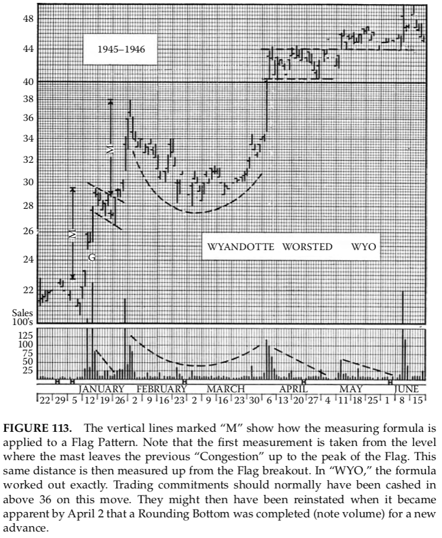

**HÌNH 113.** Các đường dọc ký hiệu “M” minh họa cách áp dụng công thức đo
cho Flag. Lần đo đầu tiên từ điểm cột cờ rời khỏi vùng “nghẽn” trước đó
lên đến đỉnh của Flag. Khoảng cách này sau đó được đo tiếp từ điểm
breakout của Flag. Với “WYO”, công thức cho kết quả chính xác. Thông
thường, vị thế giao dịch nên được chốt lời trên 36 trong nhịp này, rồi có
thể tái lập khi đến 2/4 xuất hiện Rounding Bottom hoàn chỉnh (lưu ý
khối lượng) cho một đợt tăng mới.

Flag và Pennant là đặc trưng của các chuyển động nhanh, vì vậy chúng
xuất hiện nhiều nhất trong pha sau, mang tính động lực của Bull Market,
sau khi giai đoạn tích lũy ban đầu và pha tăng đều đặn đã qua. Do đó,
sự xuất hiện của các mẫu này có thể xem như cảnh báo rằng đà tăng
đang tiến gần những tuần cuối. Ngược lại, pha tăng tốc của Bear Market
thường là giai đoạn thứ hai, với các nhịp giảm gần như “thẳng đứng”.
Các Flag và Pennant hình thành trong giai đoạn này thường rất ngắn —
hoàn tất trong 3–4 ngày thay vì vài tuần. Ở những tháng cuối của Bear
Market, các mẫu giống Flag hoặc Pennant thường kéo dài quá lâu (4 tuần
hoặc hơn), bắt đầu cho thấy khối lượng tăng trong các nhịp hồi, và sau đó
chỉ dẫn đến những phản ứng yếu và hạn chế.

Nói chung, các mẫu hình này phổ biến nhất (và đáng tin cậy nhất) trong
xu hướng tăng. Sự xuất hiện, _sau_ một đợt giảm lớn, của các hình giá ban
đầu giống Flag hoặc Pennant trong xu hướng giảm cần được xem xét
thận trọng. Trừ khi chúng tuân thủ nghiêm ngặt các tiêu chí “độ tin cậy”
nêu trên, đừng giao dịch dựa vào chúng.

##### Flag Trên Biểu Đồ Tuần và Tháng

Một trong những điều kiện của Flag (hoặc Pennant) đáng tin cậy là nó
không được kéo dài quá 4 tuần trước khi phá vỡ. Do đó, một Flag đúng
nghĩa sẽ không xuất hiện trên biểu đồ tháng, và chỉ hiếm hoi trên biểu đồ
tuần. Bạn có thể thấy các vùng giá trên biểu đồ dài hạn trông giống Flag,
nhưng được hình thành trong 8–10 tuần, vài tháng, thậm chí một–hai năm;
đừng kỳ vọng chúng hoạt động như Flag. Khi xem chi tiết trên biểu đồ
ngày, các vùng dài này hầu như luôn chứa những mẫu hình hoàn toàn
khác về ý nghĩa. Thường thì một vùng đảo chiều lớn sau một đợt tăng
mạnh sẽ trông giống Flag khi bị nén trên biểu đồ tháng. Vì vậy, đừng tin
các hình ảnh này trên biểu đồ dài hạn; đừng mặc định chúng là tích lũy
cho một nhịp tăng mới; hãy kiểm tra biểu đồ _ngày_ chi tiết của cùng
giai đoạn.

##### Tích Lũy Hình Chữ Nhật: Hiện Tượng Giai Đoạn Sớm

Trái ngược với Flag và Pennant — thường là dấu hiệu giai đoạn cuối của
Bull Market — các tích lũy dạng Rectangle lại xuất hiện nhiều hơn trong
những giai đoạn đầu của xu hướng tăng. Trong các đợt Bear Market lớn,
Rectangle có thể hình thành ở giai đoạn đầu, ngay trước một cú Panic
Decline, hoặc ở giai đoạn cuối trước một đợt bán tháo cuối cùng nhưng
giới hạn.

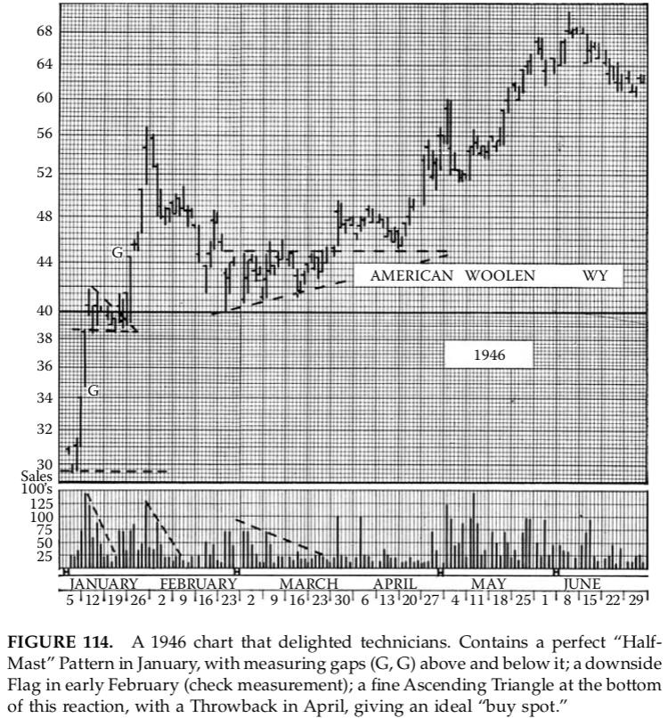

**HÌNH 114.** Biểu đồ năm 1946 làm kỹ thuật viên thích thú. Có một mẫu
“Half-Mast” hoàn hảo trong tháng 1, với các gap đo lường (G, G) phía trên
và dưới; một Flag giảm đầu tháng 2 (kiểm tra đo mục tiêu); và một Tam
Giác Tăng đẹp ở đáy nhịp điều chỉnh này, kèm Throwback tháng 4 — một
điểm mua lý tưởng.

Dạng sau có lẽ phản ánh việc tích lũy sớm của các tổ chức cho rằng giá
đã đủ thấp so với mục tiêu của họ. (Họ sẽ ổn nếu có thể nắm giữ qua phần
còn lại của Bear Market và chờ Bull Market kế tiếp đẩy giá lên mức có lãi.)

**HÌNH 114.1.** MO. Đúng là “thiên đường” của dân kỹ thuật. Altria Group
tạo ra hàng loạt tình huống hấp dẫn: breakaway gap và run days giảm,
một cột cờ giảm với flag, các pattern gap — mà là gap _đẹp_. Sau đó là
một tam giác với breakaway và một cột cờ tăng kèm flag. Người không
rành kỹ thuật hẳn sẽ thấy chóng mặt. Một tàu lượn bất ổn cho nhà đầu tư,
nhưng là tình huống giao dịch hoàn hảo cho kỹ thuật viên ngắn hạn tỉnh táo.

##### Mô Hình Tích Lũy Vai–Đầu–Vai

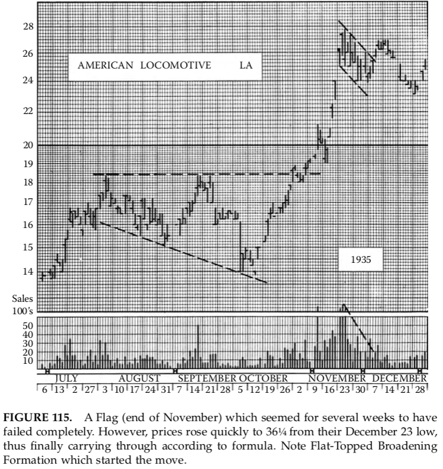

**HÌNH 115.** Một mô hình Cờ (cuối tháng 11) từng khiến người ta nghĩ trong
nhiều tuần rằng nó đã hoàn toàn thất bại. Tuy nhiên, giá sau đó tăng nhanh
lên 36¼ từ đáy ngày 23 tháng 12, và cuối cùng vẫn hoàn thành mục tiêu theo
đúng công thức. Lưu ý mô hình Mở rộng Đỉnh phẳng đã khởi đầu cho nhịp tăng.

Cho đến thời điểm này, mọi đề cập của chúng ta về mô hình Vai–Đầu–Vai
(xem Chương 6 và 7) đều xem nó như một dạng điển hình của Đảo chiều xu
hướng, và trong hình thái phổ biến cũng như thông thường, điều đó hoàn
toàn chính xác. Tuy nhiên, đôi khi giá sẽ trải qua một chuỗi dao động tạo
nên một hình ảnh Vai–Đầu–Vai _ngược_, và mô hình đó lại dẫn tới _tiếp diễn_
xu hướng trước đó.

Không có nguy cơ nhầm lẫn các mô hình Tiếp diễn hay Tích lũy này với
Vai–Đầu–Vai Đảo chiều thông thường, bởi vì, như chúng ta đã nói, chúng
bị đảo ngược hoặc bất thường so với hướng của xu hướng giá trước khi
chúng xuất hiện. Nói cách khác, một mô hình như vậy hình thành trong thị
trường tăng sẽ mang dáng dấp của một Vai–Đầu–Vai Đáy. Còn những mô
hình xuất hiện trong xu hướng giảm sẽ mang hình ảnh của một Vai–Đầu–
Vai Đỉnh.

Khi các cấu trúc giá này hoàn tất (vai trái, đầu và vai phải đã rõ ràng),
thì không còn nghi ngờ gì về ý nghĩa của chúng. Nhưng tại giai đoạn hình
thành “đầu”, trước khi vai phải xuất hiện, có thể — và thường là — tồn
tại khá nhiều nghi vấn về việc thực sự đang diễn ra điều gì.

Mô hình khối lượng trong các dạng Tích lũy Vai–Đầu–Vai không tuân
theo quy luật của Vai–Đầu–Vai Đảo chiều. Ví dụ, trong một xu hướng giảm,
mô hình Tích lũy có hình dáng giá giống Vai–Đầu–Vai Đỉnh, nhưng khối
lượng đi kèm lại giảm dần, thay vì tăng lên, ở vai trái, phần đầu và cả vai
phải. Điều tương tự cũng đúng với các mô hình “Đáy” hình thành như Tích
lũy trong thị trường tăng. Tuy nhiên, các cú phá vỡ lại hoàn toàn giống
những gì ta thấy ở các mô hình Đảo chiều.

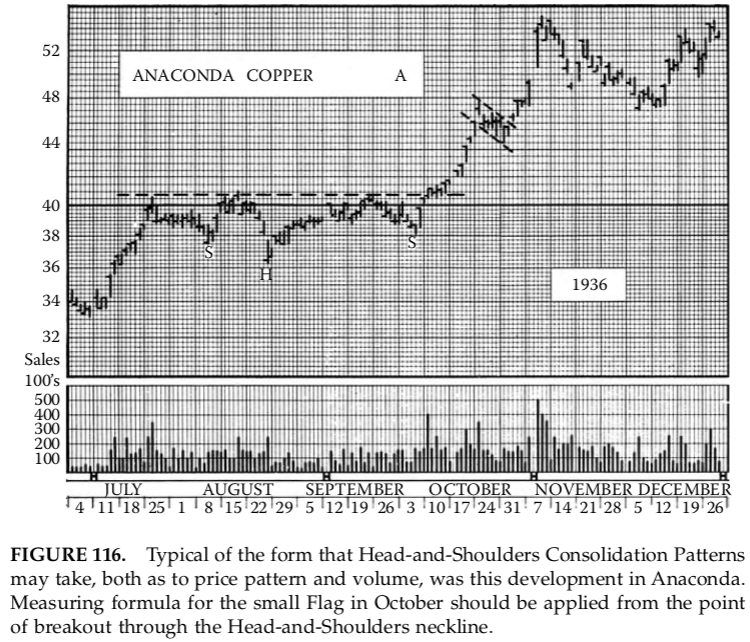

**HÌNH 116.** Đây là một ví dụ điển hình về mô hình Tích lũy Vai–Đầu–Vai,
cả về hình dạng giá lẫn khối lượng, xuất hiện ở cổ phiếu Anaconda. Công
thức đo mục tiêu cho mô hình Cờ nhỏ trong tháng 10 nên được áp dụng
từ điểm phá vỡ đi qua đường cổ (neckline) của Vai–Đầu–Vai.

Các mô hình Tích lũy Vai–Đầu–Vai dạng phức tạp hay nhiều tầng hầu
như rất hiếm xuất hiện trên đồ thị. Về mặt lý thuyết, dĩ nhiên chúng có thể
xuất hiện, và đối với nhà phân tích kỹ thuật, chúng cũng không khó xử lý
hơn các dạng đơn giản.

Công thức xác định mức dịch chuyển giá tối thiểu có khả năng xảy ra
(sau khi phá vỡ neckline) từ một mô hình Vai–Đầu–Vai Đảo chiều đã được
trình bày trong Chương 6. Với bất kỳ ai quen thuộc với bản chất của xu
hướng thị trường và sự đa dạng vô tận của các hình ảnh mà đồ thị có thể
tạo ra, thật đáng kinh ngạc khi thấy công thức đó hoạt động chính xác đến
mức nào. Rất nhiều lần, nhịp dịch chuyển quan trọng đầu tiên rời khỏi một
Vai–Đầu–Vai Đỉnh hoặc Đáy đã đi đúng đến — hoặc hơi vượt qua — mức
được hàm ý bởi phép đo của mô hình.

Tuy nhiên, cùng công thức đó khi áp dụng cho các mô hình Tích lũy
dạng Vai–Đầu–Vai lại không cho kết quả tốt như vậy. Những mô hình này
thường khá “phẳng”, và nhịp đi tiếp theo thường vượt xa mức đo được,
trong khi ở một số trường hợp khác lại không đi xa đến thế. Do đó, công
thức Vai–Đầu–Vai không thể được áp dụng cho các vùng Tích lũy với sự
đảm bảo rằng nó sẽ đưa ra một mục tiêu rõ ràng và đáng tin cậy; trong
những trường hợp này, người phân tích cần dựa vào nhiều dấu hiệu kỹ
thuật khác để đánh giá quy mô có khả năng xảy ra của nhịp đi tiếp theo.

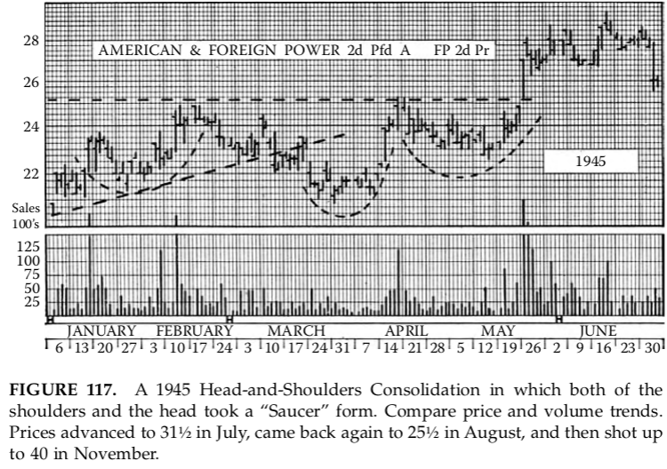

**HÌNH 117.** Một mô hình Tích lũy Vai–Đầu–Vai năm 1945, trong đó cả hai
vai và phần đầu đều mang dạng “Cái đĩa” (Saucer). So sánh xu hướng giá
và khối lượng. Giá tăng lên 31½ vào tháng 7, quay lại 25½ vào tháng 8,
rồi bứt phá lên 40 vào tháng 11.

##### Scallops – Các “Cái Đĩa” Lặp Lại

Mô hình đồ thị tiếp theo của chúng ta khác với các mô hình Tích lũy đã
bàn trước đó ở chỗ nó không tạo thành một vùng Ùn tắc hay dao động
tương đối rõ ràng để có thể vạch ra một hay nhiều đường biên quan trọng.
Có lẽ chúng ta cũng có thể đưa nó vào một chương sau, dưới tiêu đề chung
là diễn biến xu hướng thông thường. Tuy nhiên, đây là một mô hình rất
đặc trưng cho một số loại cổ phiếu và một số dạng thị trường nhất định,
và lại liên hệ rất chặt chẽ với nguyên lý Tích lũy để tiếp tục tăng, nên phù
hợp hơn khi được trình bày tại đây.

Khi một cổ phiếu có số lượng cổ phiếu lưu hành lớn, và luôn có một
thị trường giao dịch tương đối sôi động và “khít”, thoát ra khỏi một vùng
Đáy kéo dài (như lịch sử của Radio Corporation hay Socony Vacuum),
nó thường thực hiện một xu hướng tăng Chính dài hạn thông qua một
chuỗi các “Cái đĩa” (Saucers). Các mô hình kế tiếp này, mỗi mô hình đều
giống về cả giá và khối lượng với mô hình Đảo chiều được mô tả trong
Chương 7 dưới tên gọi Đáy Bo tròn (Rounding Bottom), nhưng lại hơi
nghiêng lên.

Điều đó có nghĩa là phần cuối đi lên của mỗi Cái đĩa luôn đưa giá cao
hơn một chút so với đỉnh trước đó tại điểm bắt đầu của Cái đĩa. Mức tăng
ròng đạt được trong mỗi chu kỳ Cái đĩa khác nhau giữa các cổ phiếu, nhưng
có vẻ tồn tại xu hướng mạnh cho thấy nó thường rơi vào khoảng 10 đến
15% so với giá của cổ phiếu. Tổng mức điều chỉnh từ mép trái của mỗi
Cái đĩa xuống đáy của nó thường lớn hơn, khoảng 20 đến 30%. Và thời
gian hình thành của mỗi Cái đĩa thường là từ 5 đến 7 tuần, hiếm khi ít
hơn 3 tuần.

Do đó, toàn bộ quá trình tăng giá diễn ra chậm nhưng đều đặn, theo
cách tương tự như câu chuyện về người đàn ông cuối cùng đã leo ra khỏi
giếng sâu bằng cách leo lên ba bậc cho mỗi hai bậc trượt xuống.

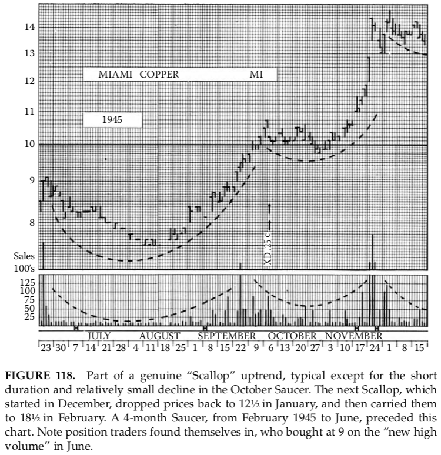

**HÌNH 118.** Một phần của xu hướng tăng “Scallop” thực sự, mang tính
điển hình, ngoại trừ thời gian ngắn và mức giảm tương đối nhỏ của Cái
đĩa trong tháng 10. Cái Scallop tiếp theo, bắt đầu từ tháng 12, kéo giá
xuống 12½ vào tháng 1, rồi đưa lên 18½ vào tháng 2. Một Cái đĩa kéo
dài 4 tháng, từ tháng 2 đến tháng 6 năm 1945, đã xuất hiện trước đó.
Lưu ý vị thế của các nhà giao dịch theo xu hướng, những người mua ở
mức 9 khi khối lượng “tạo đỉnh mới” vào tháng 6.

Đồ thị của những cổ phiếu đi theo kiểu này cho thấy một chuỗi các
“vỏ sò” tăng dần đối xứng và rất giống nhau, cái này nối tiếp cái kia với
rất ít hoặc không có khoảng nghỉ. Khối lượng giao dịch tăng lên mức cao
nhất ở giai đoạn cuối của mỗi Scallop, khi giá tiến gần và vượt qua đỉnh
trước đó, sau đó giảm dần vào trạng thái trầm lắng khi giá cong xuống và
làm phẳng tại đáy của Cái đĩa tiếp theo, rồi lại tăng trở lại khi giá cong
lên bước vào nhịp tăng mới.

Các cơ hội giao dịch do những cổ phiếu có “thói quen Cái đĩa” mang
lại hầu như không cần bình luận thêm (mặc dù chúng ta sẽ đưa ra một số
quy tắc chi tiết trong phần hai của cuốn sách này). Mức đáy của mỗi
Scallop thường khá dễ nhận biết thông qua việc quan sát xu hướng giá và
khối lượng, và việc tạo đỉnh ở cuối chu kỳ cũng vậy. Tuy nhiên, thật kỳ
lạ là phần lớn những người “xem băng giá” (tape watchers) lại xử lý những
cổ phiếu này sai cách, trở nên hứng thú và mua vào khi chúng sôi động
(“tạo đỉnh mới với khối lượng”), và hoàn toàn bỏ qua chúng khi chúng
đang ở giai đoạn trầm lắng, bo tròn của xu hướng.

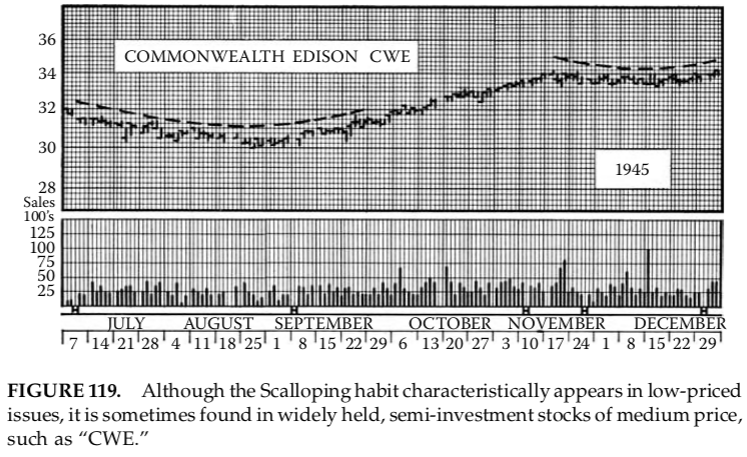

**HÌNH 119.** Mặc dù thói quen Scallop thường xuất hiện ở các cổ phiếu giá
thấp, đôi khi nó cũng được tìm thấy ở những cổ phiếu trung bình, được
nhiều người nắm giữ và mang tính bán đầu tư, chẳng hạn như “CWE”.

    (Nhiều người theo dõi băng giá trong phòng giao dịch coi thường đồ
    thị, và về lâu dài phải trả giá bằng vốn của mình. Những người đọc
    băng giá thực sự giỏi — những người có thể tạo ra lợi nhuận tương
    đối ổn định — là cực kỳ hiếm. _EN: Với “tape readers” hãy thay bằng
    “day traders”, trong đó 99% là không thành công._ Khi bạn gặp được
    một người như vậy, bạn sẽ thấy rằng hoặc là họ “mang đồ thị trong
    đầu”, hoặc là họ xem xét rất kỹ lịch sử giá trước khi mua vào chỉ vì
    bảng điện đang sôi động.)

Khi một cổ phiếu có thói quen Scallop dần tăng lên vùng giá khoảng 15
trở lên, mô hình của nó có xu hướng trở nên kém đều đặn hơn; nó bắt đầu
rời xa đường cong mượt và hẹp kiểu Cái đĩa của các mức giá thấp. Trên
20, nó thường hoàn toàn thoát khỏi chuỗi Scallop và từ đó trở đi tạo ra
những nhịp tăng thẳng nhanh hơn, xen kẽ với các đợt điều chỉnh mạnh và
các dạng mô hình Tích lũy tiêu chuẩn, vốn là đặc trưng thường thấy của
các cổ phiếu giá trung bình và cao.

(Có ngoại lệ: một số cổ phiếu ưu đãi giá cao, luôn có thị trường giao
dịch, nhưng xu hướng của chúng gần như hoàn toàn phụ thuộc vào những
thay đổi dần dần của lãi suất phổ biến và nguồn vốn đầu tư, lại duy trì
thói quen Scallop dai dẳng trong các xu hướng tăng Chính.)

Chúng ta đã nêu những mức giá khá cụ thể (15 và 20) trong đoạn trên,
nhưng dĩ nhiên giá không phải là yếu tố duy nhất quyết định việc một cổ
phiếu rời khỏi xu hướng Scallop. Giả định an toàn duy nhất là: một khi
thói quen này đã được nhận diện, nó sẽ tiếp diễn cho đến khi đồ thị cho
thấy một sự sai lệch rõ ràng khỏi nó, và sự sai lệch đó thường xuất hiện
đầu tiên dưới dạng một nhịp tăng lớn hơn mong đợi xảy ra ở cuối một
Cái đĩa.

Do đó, nếu bạn đã vào vị thế ở một điểm thuận lợi (gần đáy của một
Scallop), bạn khó có khả năng bị thiệt hại khi cổ phiếu cuối cùng thay
đổi cách vận động.

Những cổ phiếu có giá rất thấp có thể duy trì xu hướng Scallop cho
đến tận các đỉnh Thị trường Bò Chính của chúng, và thậm chí còn thử
tạo thêm một Cái đĩa nữa sau cái mà sau này được xác định là đỉnh cuối
cùng. Dĩ nhiên, nỗ lực đó sẽ thất bại trong việc duy trì mô hình đỉnh sau
cao hơn đỉnh trước. Những thất bại như vậy không khó phát hiện; sự
thay đổi so với mô hình trước đó xuất hiện trước khi bất kỳ thiệt hại
đáng kể nào xảy ra đối với một vị thế được thiết lập đúng cách.

##### Thị Trường Hiện Đại và Thị Trường Kiểu Cũ

Chúng ta đã đề cập trong phần thảo luận về các mô hình Đảo chiều rằng
một số trong số chúng xuất hiện ít hơn trên đồ thị của thập niên 1960 so
với những năm trước đó, trong khi những mô hình khác lại xuất hiện
thường xuyên hơn. Điều tương tự cũng đúng với các mô hình Tích lũy.

Những mô hình gọn gàng, được xác định chặt chẽ như Hình chữ nhật
và Tam giác Vuông hiện nay ít gặp hơn. Tam giác Cân có xu hướng lỏng
lẻo hơn so với thập niên 1920 và 1930 — không còn sắc nét và nổi bật
trên đồ thị như trước. Các mô hình chốt lời điển hình như Cờ và Cờ
đuôi nheo dường như vẫn phổ biến như xưa, trong khi các “bức tranh”
xu hướng bình thường, bao gồm những mô hình gắn liền với sự phát
triển xu hướng thông thường (như Vai–Đầu–Vai, các dạng Bo tròn,
v.v.), lại xuất hiện thường xuyên hơn.

Nguyên nhân của những thay đổi này khá rõ ràng. Các quy định của
SEC, yêu cầu ký quỹ cao hơn, mức độ hiểu biết cao hơn của công chúng,
và một cách tiếp cận thận trọng hơn — hay đúng hơn là bi quan hơn —
đối với các vấn đề đầu tư và giao dịch cổ phiếu nói chung, đều góp phần
vào sự tiến hóa này. Sự giám sát của SEC và Sở giao dịch đã loại bỏ các
hoạt động thao túng theo kiểu “pool” lộ liễu nhằm lợi dụng những “chú
cừu non” của thời trước. Ngày nay, thậm chí các hoạt động syndicate
“hợp pháp” hơn, nhằm tạo điều kiện cho việc tích lũy hay phân phối quy
mô lớn, cũng rất hiếm.

Dĩ nhiên, những “người trong cuộc” vẫn có thể trì hoãn hoặc công bố
sớm các thông tin tốt hoặc xấu liên quan đến hoạt động của một công ty
nhằm phục vụ mục đích chiến lược cá nhân trong một khoảng thời gian
hạn chế. Nhưng các giao dịch mua bán cổ phiếu của lãnh đạo, giám đốc
và cổ đông lớn hiện nay bị giám sát quá chặt chẽ để cho phép nhiều trò
“mờ ám” diễn ra. (Tuy vậy, nhà đầu tư trung bình vẫn nên giữ một chút
hoài nghi về khả năng thị trường sẽ có một đợt tăng lớn ngay sau khi một
báo cáo tốt được công bố.)

Sự thông đồng giữa các dịch vụ tư vấn đầu tư và các nhóm thao túng
đã bị cấm một cách hiệu quả. (Có thể nói rằng ngay cả trong thập niên
1920, điều này cũng chưa bao giờ tồn tại một cách lộ liễu như nhiều nhà
giao dịch nghiệp dư vẫn tưởng.) SEC, với sự hợp tác chặt chẽ của Sở giao
dịch, giám sát nghề tư vấn đầu tư một cách kỹ lưỡng, liên tục và rất hiệu
quả. Không một cố vấn đầu tư uy tín nào có thể mạo hiểm tham gia vào
các hoạt động lừa dối hay thông đồng, ngay cả khi họ có mong muốn làm
điều đó. Hầu hết còn đi xa hơn nhiều so với mức cần thiết để tự bảo vệ
mình khỏi bất kỳ mối liên hệ nào — dù vô hại hay hữu ích — nhưng có
thể bị nhìn nhận với sự nghi ngờ.

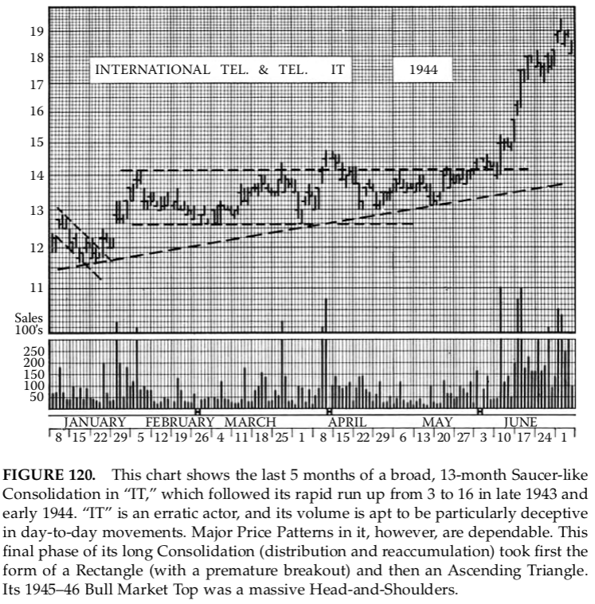

**HÌNH 120.** Đồ thị này cho thấy 5 tháng cuối của một giai đoạn Tích lũy
rộng, kéo dài 13 tháng, mang dáng dấp Cái đĩa ở “IT”, diễn ra sau cú tăng
nhanh từ 3 lên 16 vào cuối năm 1943 và đầu năm 1944. “IT” là một cổ
phiếu biến động thất thường, và khối lượng của nó dễ gây nhiễu trong
diễn biến hàng ngày. Tuy nhiên, các mô hình giá Chính của nó lại rất
đáng tin cậy. Giai đoạn cuối của quá trình Tích lũy dài này (phân phối
và tái tích lũy) ban đầu mang dạng Hình chữ nhật (với cú phá vỡ sớm),
sau đó là Tam giác Tăng. Đỉnh Thị trường Bò năm 1945–46 của nó là
một mô hình Vai–Đầu–Vai đồ sộ.

Những “tay liều” kiểu cũ chưa biến mất hoàn toàn, nhưng mức ký quỹ
cao và các quy định ngăn chặn “đánh úp giá xuống” đã khiến thị trường
chứng khoán ngày nay trở nên tương đối khó khăn và kém sinh lợi đối
với họ. Những con bạc phòng giao dịch thực thụ _(EN: Day Traders —
những người lao tới lao lui có lẽ còn làm trầm trọng thêm biến động
hàng ngày)_ vẫn xuất hiện, dù ký quỹ cao cũng đã bóp nghẹt họ phần
nào. Trong những năm gần đây, họ chỉ xuất hiện với số lượng đáng kể
ở giai đoạn cuối của các Thị trường Bò. _EN: Hãy nhớ đến cơn sốt Day
Trading đã lây lan trên thị trường vào cuối thập niên 1990._ Dĩ nhiên,
hoạt động của họ chưa bao giờ ảnh hưởng nhiều đến đồ thị, ngoại trừ
việc làm gia tăng khối lượng giao dịch.

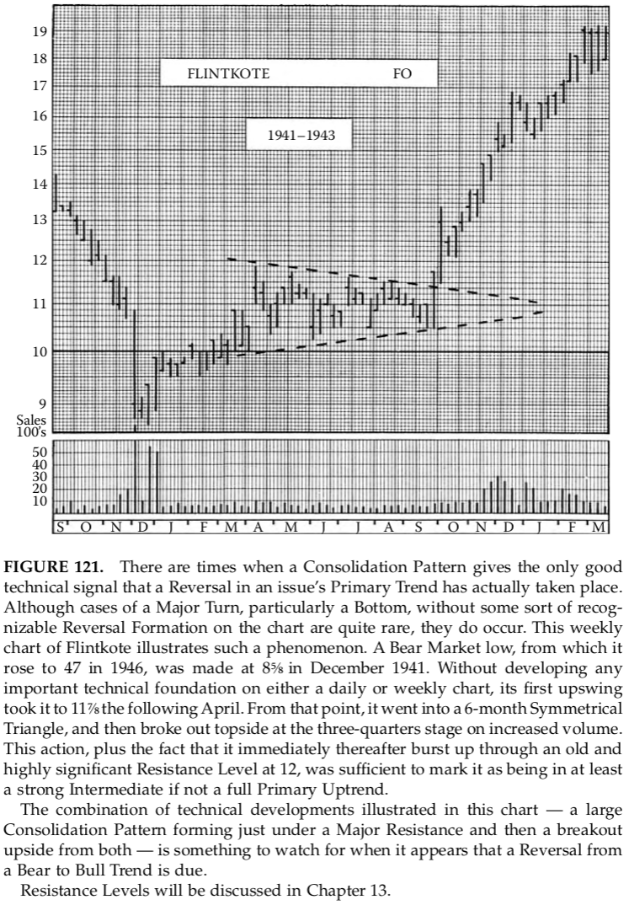

**HÌNH 121.** Có những thời điểm mà một mô hình Tích lũy lại cung cấp
tín hiệu kỹ thuật tốt duy nhất cho thấy một sự Đảo chiều trong xu hướng
Chính của một cổ phiếu thực sự đã diễn ra. Mặc dù các trường hợp đảo
chiều lớn, đặc biệt là Đáy, mà không có một mô hình Đảo chiều dễ nhận
biết nào trên đồ thị là khá hiếm, chúng vẫn có thể xảy ra.

Đồ thị tuần của Flintkote minh họa cho hiện tượng này. Một đáy Thị
trường Gấu, từ đó cổ phiếu tăng lên 47 vào năm 1946, đã được hình
thành tại mức 8⅝ vào tháng 12 năm 1941. Không hề phát triển một nền
tảng kỹ thuật quan trọng nào trên đồ thị ngày hay tuần, nhịp tăng đầu
tiên đã đưa giá lên 11⅞ vào tháng 4 năm sau. Từ đó, cổ phiếu đi vào
một Tam giác Cân kéo dài 6 tháng, rồi phá vỡ lên phía trên tại mốc ba
phần tư với khối lượng tăng. Diễn biến này, cộng với việc ngay sau đó
giá bứt phá qua một mức Kháng cự cũ và rất quan trọng tại 12, là đủ để
xác nhận rằng cổ phiếu đang ở ít nhất một xu hướng tăng Trung gian,
nếu không muốn nói là một xu hướng tăng Chính hoàn chỉnh.

Sự kết hợp các diễn biến kỹ thuật được minh họa trong đồ thị này —
một mô hình Tích lũy lớn hình thành ngay dưới một mức Kháng cự
Chính, rồi phá vỡ lên trên cả hai — là điều đáng chú ý khi có dấu hiệu
cho thấy một sự chuyển đổi từ xu hướng Gấu sang Bò sắp diễn ra.
Các mức Kháng cự sẽ được thảo luận trong Chương 13.

Ngược lại, thuế cao hơn và quy định chặt chẽ hơn chắc chắn không
mang lại những thị trường an toàn hơn, ổn định hơn hay “dễ chơi” hơn
cho nhà đầu tư nhỏ lẻ. Ký quỹ cao không ngăn chặn được các đợt sụp
đổ hoảng loạn. Nếu có gì khác, thị trường thậm chí còn “mỏng” hơn ở
chiều giảm, dễ tổn thương hơn trước những cú rơi nhanh và mạnh so
với thời kỳ trước khi có các quy định hiện đại.

Chúng ta vẫn có những Thị trường Bò và Gấu giống hệt như 50 năm
trước, và sự phát triển xu hướng thị trường cũng tương tự như vậy.
Điều đáng ngạc nhiên không phải là một vài loại mô hình đồ thị từng
được tạo ra bởi giao dịch không kiểm soát nay ít xuất hiện hơn, mà là
phần lớn các hiện tượng kỹ thuật vẫn hầu như không bị ảnh hưởng.

Một người nghiên cứu đồ thị năm 1907 sẽ cảm thấy hoàn toàn quen
thuộc với các đồ thị của năm 1966. _EN: Và cả với những đồ thị của
năm 2000. Đó là lý do tại sao rất ít thay đổi là cần thiết để cập nhật tác
phẩm kinh điển của Edwards cho thiên niên kỷ thứ ba. EN9: Ghi chú
cho một ghi chú. Các nhóm thao túng biến mất và được thay thế bằng
những hình thức mờ ám mới. Các nhà tạo lập thị trường và chuyên gia
bị đưa ra trước vành móng ngựa vì gian lận. Trong thế kỷ 21, các quỹ
phòng hộ sinh sôi như thỏ ở Úc. Với bất kỳ sự gia tăng biến động nào
mà họ gây ra, có lẽ họ bù đắp lại bằng việc cung cấp thêm thanh khoản
cho thị trường. Những mô hình giống nhau vẫn tiếp tục xuất hiện bởi
vì, bất chấp máy tính, con người cuối cùng vẫn là người bóp cò. Có
vẻ như các mô hình ngày nay thường không còn gọn gàng như “thời
xưa”. Các đường xu hướng, đặc biệt là các đường ngang, dường như
giống những “vùng” hơn là các đường cứng nhắc, và việc diễn giải
đòi hỏi nhiều phán đoán hơn. Tuy vậy, hầu hết mọi điều Edwards nói
ở đây hoàn toàn có thể đã được viết vào năm 2005 thay vì giữa thế
kỷ 20._