## Chương 15. Đường xu hướng chính (Major Trendlines)

Trong chương trước về các đường xu hướng trung hạn, chúng ta đã đề cập
đến những khác biệt đặc thù do cách vẽ theo thang số học và thang bán
logarit tạo ra, nhưng cũng đã lưu ý rằng các khác biệt đó không quan
trọng đối với các xu hướng nhỏ hay các xu hướng trung hạn có độ dài
trung bình. Tuy nhiên, khi xét tới các xu hướng chính, sự khác biệt này
lại trở nên đáng kể.

Nếu bạn xem xét một tập hợp lớn các biểu đồ tháng được vẽ theo thang
số học, bao phủ từ 10 năm lịch sử thị trường trở lên, bạn sẽ nhanh chóng
nhận ra rằng các xu hướng tăng (Bull Trends), trong đại đa số các cổ
phiếu phổ thông được giao dịch sôi động và mang tính đầu cơ ở mức
độ nào đó, có xu hướng _tăng tốc_. Chúng khởi đầu chậm rãi và tiến lên
với góc dốc ngày càng lớn khi tiến gần tới một đỉnh chính. Quỹ đạo
cong đi lên này khiến giá ngày càng rời xa bất kỳ đường xu hướng
thẳng nào được vẽ từ hai đáy trong giai đoạn đầu tăng chậm. Hệ quả
là khi tạo đỉnh, giá đã giảm khá xa trong một pha điều chỉnh có thể
mang ý nghĩa cấp độ chính, trước khi chạm lại đường xu hướng thẳng đó.

Nhiều cổ phiếu thể hiện các đường cong _tăng tốc_ điển hình trên thang
số học lại tạo ra xu hướng _thẳng_ khi được vẽ trên thang logarit. Do đó,
đường xu hướng chính theo thang logarit của chúng sẽ bị phá vỡ sớm
hơn, và thường ở mức giá cao hơn, khi xu hướng cuối cùng tạo đỉnh và
đảo chiều giảm. Trong những trường hợp như vậy, thang logarit cho
tín hiệu xu hướng tốt hơn.

Nhưng cũng có những cổ phiếu khác — chủ yếu thuộc nhóm đầu tư hoặc
bán đầu tư — có xu hướng tăng theo đường thẳng trên thang số học.
Consolidated Edison, General Motors và Libbey–Owens–Ford Glass là
những ví dụ. (Dĩ nhiên, trên thang logarit, xu hướng của chúng sẽ cho
thấy một đường cong giảm tốc.) Lại có một nhóm thứ ba, phần lớn là
các cổ phiếu ưu đãi chất lượng cao, tạo ra một đường xu hướng tăng
bo tròn hoặc giảm tốc ngay cả trên thang số học. Cuối cùng, còn có
một số mã mà đường xu hướng tăng trong thị trường bò nằm đâu đó
giữa hai loại đầu tiên; tức là chúng cong lên khỏi đường thẳng trên
thang số học, nhưng lại cong sang phải (phá vỡ đường thẳng) trên
thang logarit.  
_EN: May mắn thay, trong thời đại máy tính và dữ liệu dễ xử lý hiện nay,
đã có các phần mềm phân tích cho phép nhà phân tích chuyển đổi tức thì
giữa các thang đo. Các gói phần mềm trên máy tính để bàn có sẵn (xem
Phụ lục D, Tài nguyên) và nhiều trang Internet cũng có khả năng này._

_282 Phân tích kỹ thuật xu hướng cổ phiếu_

Tất cả những điều trên, ở thời điểm này, hẳn khiến người đọc cảm thấy
khá nản lòng. Cổ phiếu thì mỗi loại một kiểu, vậy đâu là sự trợ giúp cho
chúng ta trong mớ hỗn độn này? Câu trả lời nằm ở việc nghiên cứu lịch
sử của từng mã mà bạn quan tâm. Cổ phiếu — ít nhất là phần lớn —
không thay đổi nhiều thói quen và đặc tính kỹ thuật của chúng từ chu
kỳ Bò–Gấu này sang chu kỳ khác. Một mã như General Motors, tạo ra
đường xu hướng tăng thẳng trên biểu đồ số học trong một pha tăng
chính, rất có khả năng sẽ lặp lại hành vi đó trong pha tăng tiếp theo.

Tất nhiên, trong một khoảng thời gian rất dài, cổ phiếu đôi khi cũng
thay đổi. Những công ty từng được coi là cực kỳ đầu cơ khi cổ phiếu
lần đầu niêm yết có thể dần đạt được vị thế ngày càng quan trọng và
ổn định trong nền kinh tế chung, dẫn tới việc cổ phiếu của họ cuối
cùng mang đặc tính đầu tư vững chắc. Khi đó, các xu hướng thị trường
bò của chúng sẽ dần chuyển từ đường cong đi lên sang đường thẳng,
và cuối cùng là đường cong giảm tốc. Ngược lại, một số tập đoàn lâu
đời có thể mất vị thế và xếp hạng, chuyển từ kiểu xu hướng đầu tư
sang xu hướng mang tính đầu cơ. Tuy vậy, nhìn chung, các mô hình
chính vẫn có xu hướng lặp lại.

Nếu bạn tự vẽ các biểu đồ tháng bằng tay, bạn có thể chọn bất kỳ
thang đo nào. Nhưng phần lớn những người theo phân tích kỹ thuật
thích mua sẵn các biểu đồ dài hạn, nhờ đó có được lịch sử phong phú
hơn cho nhiều mã hơn so với khả năng tự vẽ. Vì các bộ biểu đồ tháng
toàn diện duy nhất có giá hợp lý thường được vẽ theo thang số học,
bạn có thể buộc phải dùng chúng cho mọi mục đích.  
_EN: Điều này ngày nay không còn cần thiết nữa nhờ sự sẵn có của phần
mềm tốt và các trang biểu đồ Internet. Xem Phụ lục D, Tài nguyên._  
Chỉ với một chút thử nghiệm, bạn sẽ thấy rằng một thước cong kiểu
French curve của kiến trúc sư có thể được dùng để vẽ các đường xu
hướng tăng chính khá tốt cho nhiều mã có xu hướng bò tăng tốc rời
xa đường thẳng.

Các phép kiểm tra để đánh giá ý nghĩa kỹ thuật của một đường xu
hướng chính về cơ bản giống với các phép kiểm tra đã nêu cho đường
trung hạn ở chương trước. Cần cho phép độ linh hoạt lớn hơn một
chút khi xét các cú xuyên phá — đây lại là vấn đề phán đoán — nhưng
bạn đang làm việc với dữ liệu thô và các dao động dài hạn, và điều
bạn cần từ các biểu đồ tháng, trước hết, là cái nhìn tổng thể.

Một điểm nữa liên quan đến việc xây dựng các đường xu hướng tăng
chính: những đường tốt nhất — hữu ích nhất — thường không được
vẽ từ mức đáy tuyệt đối của thị trường gấu trước đó, mà bắt đầu từ
đáy trung hạn kế tiếp. Vùng tích lũy ở đầu một thị trường bò thường
kéo dài và khá phẳng theo thời gian. Do đó, đường xu hướng đầu tiên
vẽ từ điểm đáy cực trị có thể quá ngang để phản ánh đúng xu hướng
bò thực sự bắt đầu với pha tăng giá. Các biểu đồ minh họa đường xu
hướng chính trong chương này sẽ làm rõ điểm đó.  
_EN: Đặc biệt là Hình 177._  
Điều này cũng áp dụng cho nhiều chuyển động trung hạn khởi phát từ
các mô hình vùng. Lấy mô hình Head-and-Shoulders làm ví dụ: đường
xu hướng trung hạn thực sự thường bắt đầu từ vai phải hơn là từ đầu.

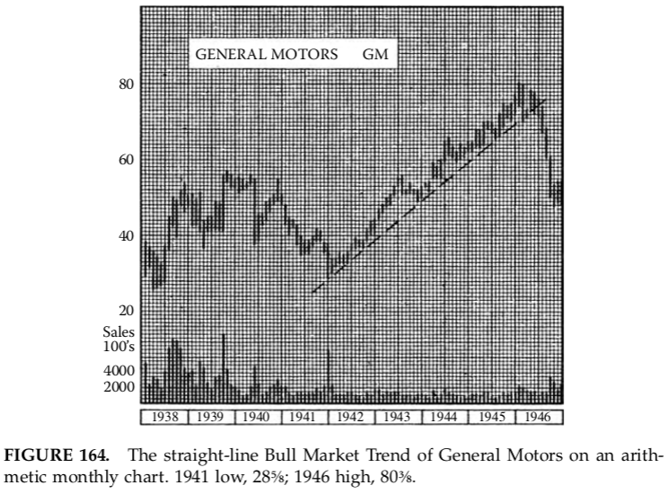

**HÌNH 164.** Xu hướng thị trường bò dạng đường thẳng của General Motors
trên biểu đồ tháng theo thang số học. Đáy năm 1941: 28⅝; đỉnh năm
1946: 80⅜.

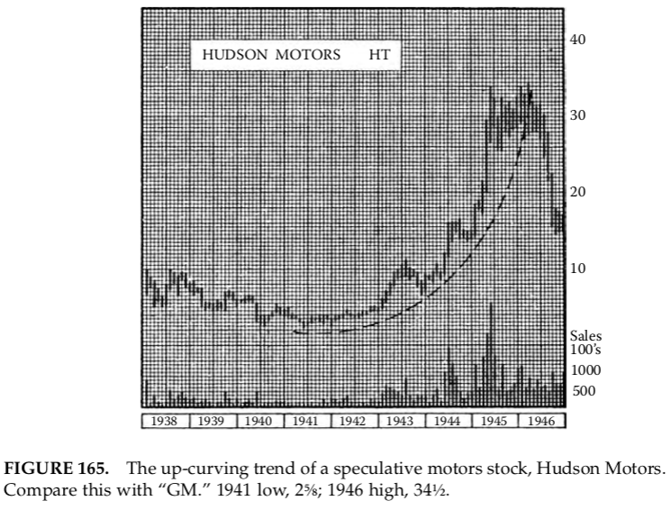

**HÌNH 165.** Xu hướng cong đi lên của một cổ phiếu đầu cơ ngành xe,
Hudson Motors. So sánh với “GM.” Đáy 1941: 2⅝; đỉnh 1946: 34½.

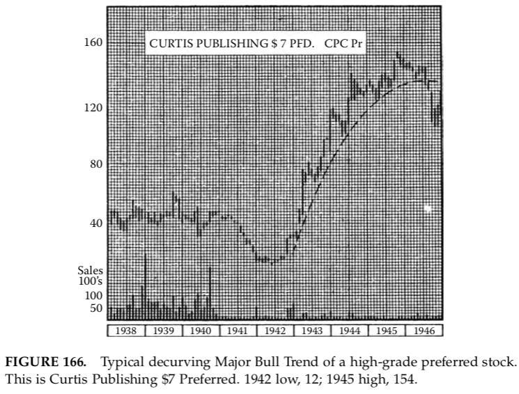

**HÌNH 166.** Xu hướng bò chính giảm tốc điển hình của một cổ phiếu
ưu đãi chất lượng cao. Curtis Publishing $7 Preferred. Đáy 1942: 12;
đỉnh 1945: 154.

**HÌNH 167.** Xu hướng tăng tốc của cổ phiếu phổ thông cùng công ty
xuất bản. Đáy 1942: ⅜; đỉnh 1946: 26.

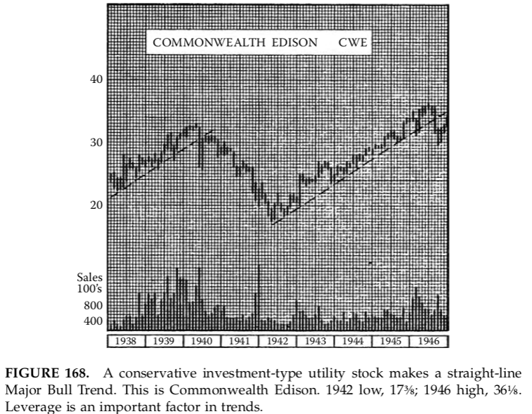

**HÌNH 168.** Một cổ phiếu tiện ích mang tính đầu tư thận trọng tạo ra
xu hướng bò chính dạng đường thẳng. Commonwealth Edison. Đáy
1942: 17⅜; đỉnh 1946: 36⅛. Đòn bẩy là yếu tố quan trọng trong xu hướng.

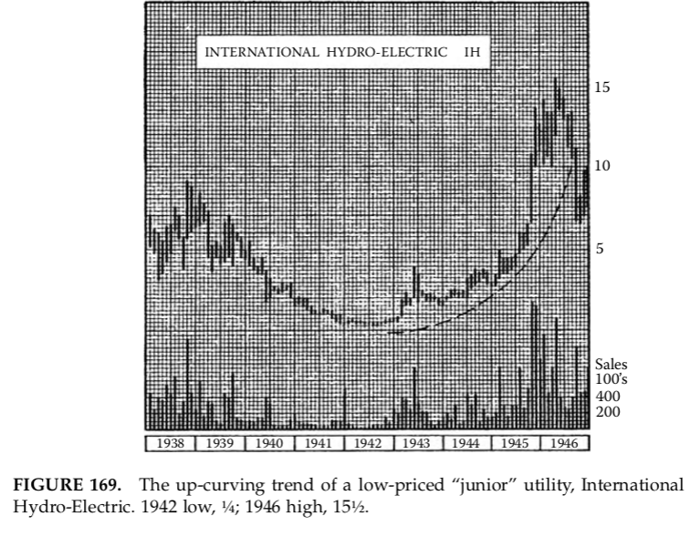

**HÌNH 169.** Xu hướng cong đi lên của một cổ phiếu tiện ích “junior”
giá thấp, International Hydro-Electric. Đáy 1942: ¼; đỉnh 1946: 15½.

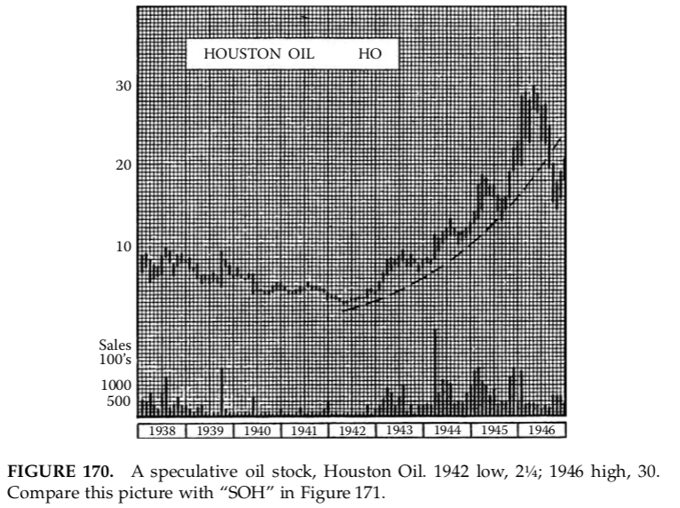

**HÌNH 170.** Một cổ phiếu dầu mỏ đầu cơ, Houston Oil. Đáy 1942: 2¼;
đỉnh 1946: 30. So sánh hình này với “SOH” trong Hình 171.

**HÌNH 171.** Xu hướng tăng dạng đường thẳng của một cổ phiếu dầu
mỏ mang tính đầu tư, Standard Oil of Ohio. Đáy 1942: 10⅛; đỉnh 1946:
30. Lưu ý: đường xu hướng không bị phá vỡ cho tới năm 1948.

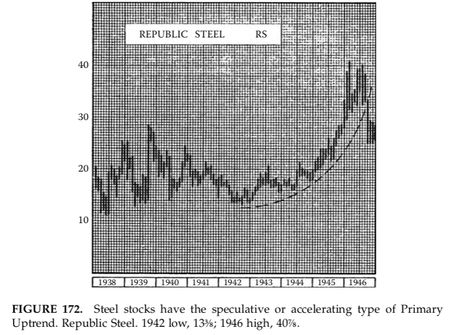

**HÌNH 172.** Cổ phiếu thép có kiểu xu hướng tăng chính mang tính
đầu cơ hoặc tăng tốc. Republic Steel. Đáy 1942: 13⅜; đỉnh 1946: 40⅞.

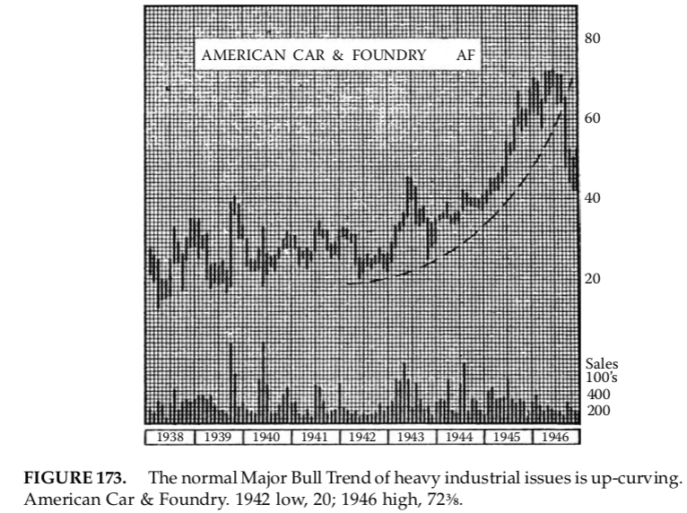

**HÌNH 173.** Xu hướng bò chính điển hình của các cổ phiếu công nghiệp
nặng là cong đi lên. American Car & Foundry. Đáy 1942: 20; đỉnh 1946:
72⅜.

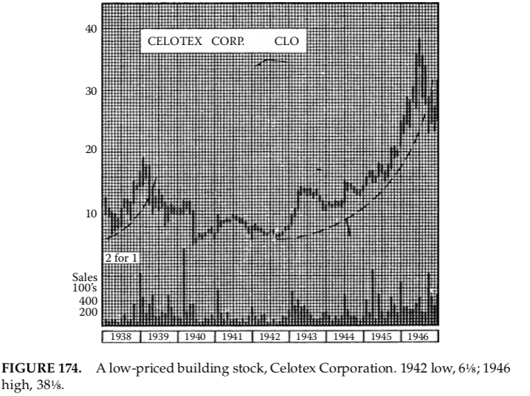

**HÌNH 174.** Một cổ phiếu xây dựng giá thấp, Celotex Corporation.
Đáy 1942: 6⅛; đỉnh 1946: 38⅛.

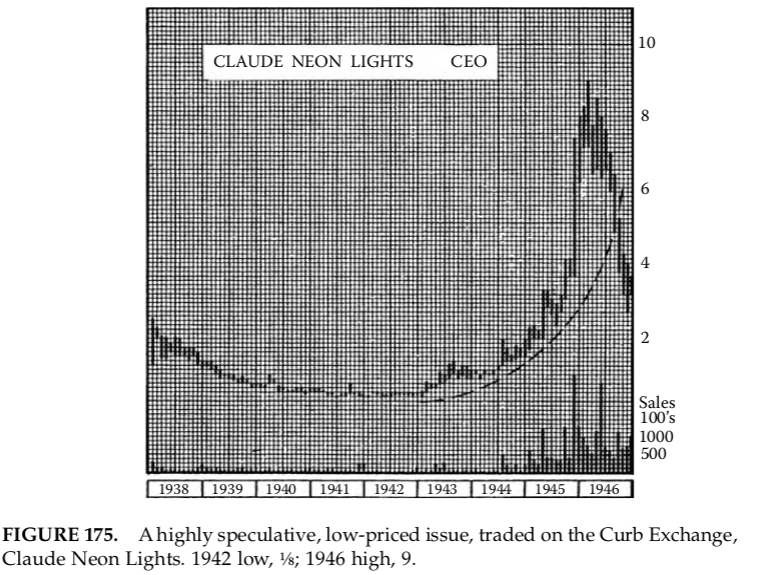

**HÌNH 175.** Một mã đầu cơ cao, giá thấp, giao dịch trên Curb Exchange,
Claude Neon Lights. Đáy 1942: ⅛; đỉnh 1946: 9.

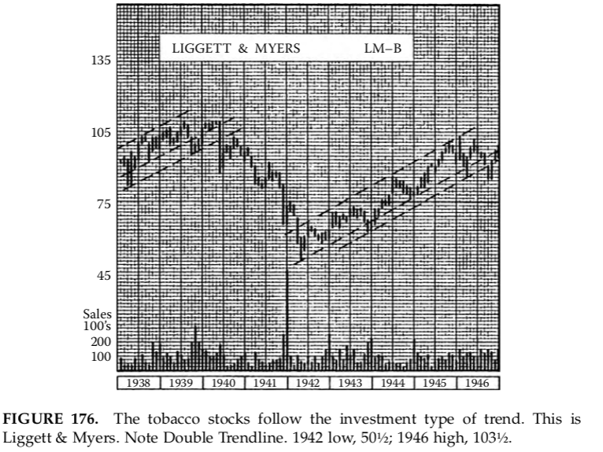

**HÌNH 176.** Nhóm cổ phiếu thuốc lá theo kiểu xu hướng đầu tư. Đây
là Liggett & Myers. Lưu ý đường xu hướng kép. Đáy 1942: 50½; đỉnh
1946: 103½.

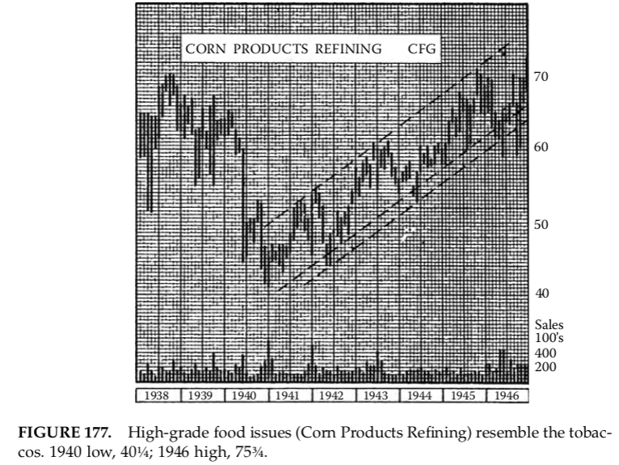

**HÌNH 177.** Các cổ phiếu thực phẩm chất lượng cao (Corn Products
Refining) có đặc điểm giống nhóm thuốc lá. Đáy 1940: 40¼; đỉnh 1946:
75¾.

##### Xu hướng giảm chính (Major Downtrends)

Từ góc nhìn của nhà phân tích kỹ thuật, thật đáng tiếc là rất ít thị trường
gấu tạo ra các đường xu hướng chính có ý nghĩa thực tiễn trên biểu đồ
của từng cổ phiếu riêng lẻ. Một ngoại lệ nổi bật là thị trường gấu kéo
dài giai đoạn 1929–32, đã tạo ra những đường xu hướng thẳng tuyệt đẹp
trên biểu đồ số học của hàng loạt mã (cũng như trên các chỉ số trung
bình, sẽ được đề cập sau). Nhưng gần như không thể tìm thấy những
trường hợp khác mà ở đó một đường xu hướng giảm có giá trị dự báo
có thể được vẽ trên cả thang số học lẫn thang bán logarit.

Xu hướng thị trường gấu chính _thông thường_ không chỉ dốc hơn xu
hướng bò (do thị trường gấu trung bình chỉ kéo dài khoảng một nửa
thời gian của thị trường bò), mà còn có tính tăng tốc hay cong xuống
trong diễn biến của nó. Đặc điểm này càng được nhấn mạnh và vì thế
càng khó chiếu hiệu quả trên thang bán logarit.

Tóm lại, nhà kỹ thuật không thể kỳ vọng nhận được nhiều, nếu có,
sự trợ giúp từ các đường xu hướng _chính_ trong việc xác định sự
chuyển đổi từ pha _giảm_ chính sang pha _tăng_ chính. Tuy nhiên,
điều này không nên được hiểu là lời khuyên không vẽ đường xu hướng
trong một pha giảm chính, hay hoàn toàn bỏ qua bất kỳ đường xu hướng
nào có vẻ mang chút thẩm quyền. Nếu bạn không kỳ vọng quá nhiều
ở chúng, chúng vẫn có thể cung cấp vài manh mối hữu ích về cách
điều kiện thị trường đang thay đổi.

Đối với người nghiên cứu hành động thị trường chứng khoán mà
không hoàn toàn đặt nặng kết quả tiền bạc, các đường xu hướng thị
trường gấu là một lĩnh vực khảo cứu hấp dẫn. Chúng có những hành
vi kỳ lạ. Dù thất bại trong chức năng thực tiễn là báo hiệu chính xác
điểm đảo chiều lớn, và có thể “bay” ra ngoài không gian, đôi khi
chúng lại tạo ra những phản ứng thú vị (hoặc ít nhất là dường như
giải thích được những hành động thị trường vốn khó hiểu) khi xu
hướng giá thực sự bắt kịp chúng sau nhiều tháng hay nhiều năm.
Nhưng những hiệu ứng đó, dù thú vị, hiện nay vẫn không chắc chắn
và không thể dự đoán.  
_EN: Thực tế này có thể còn kéo dài tới tương lai mờ xa và được nhắc
đến như Định lý cuối cùng của Fermat. Trình độ hiểu biết hiện tại của
chúng ta trong thế kỷ 21 không tiến bộ hơn so với thời của Magee._  
Chúng ta phải khép lại chủ đề kém hiệu quả này bằng việc nhắc lại
rằng một manh mối về điểm kết thúc của thị trường gấu chính được
cung cấp bởi đường xu hướng trung hạn của pha cuối, như đã nêu
ở chương trước.

##### Kênh xu hướng chính (Major Trend Channels)

Chúng ta gặp thêm một khó khăn khác khi cố vẽ các đường hồi quy
(Return Lines) và xây dựng các kênh cho xu hướng chính trên biểu
đồ số học. Do giá có xu hướng dao động với biên độ ngày càng rộng
(cả trung hạn lẫn ngắn hạn) khi tiến lên trong một thị trường bò
chính, kênh giá của chúng mở rộng dần theo thời gian. Đường hồi
quy không song song với đường xu hướng cơ bản (giả sử ta có một
đường cơ bản tốt ngay từ đầu) mà tách dần ra khỏi nó. Đôi khi,
một cổ phiếu tạo ra một mô hình kênh chính rõ ràng, nhưng đa số
thì không.

Việc sử dụng thang bán logarit, trong nhiều trường hợp, có thể
khắc phục hiệu ứng kênh mở rộng trong các xu hướng bò, nhưng
khi đó lại gặp xu hướng ngược lại trong các thị trường gấu chính,
và đối với điều này, không loại thang đo nào có thể bù đắp hoàn
toàn.

##### Đường xu hướng trong các chỉ số trung bình

Hầu như mọi điều đã trình bày trong chương trước về sự hình
thành đường xu hướng trung hạn ở từng cổ phiếu riêng lẻ cũng
áp dụng cho các chỉ số trung bình khác nhau. Thực tế, các chỉ
số rộng hoặc chỉ số thị trường tạo ra các xu hướng đều đặn hơn
và do đó, các đường xu hướng chính xác hơn. Điều này có thể
một phần là do hầu hết các chỉ số được cấu thành từ những cổ
phiếu giao dịch sôi động, được công chúng biết đến rộng rãi và
nắm giữ phổ biến, mà hành động giá riêng lẻ của chúng là “bình
thường” theo nghĩa kỹ thuật. Một lý do khác là quá trình lấy
trung bình làm mượt đi những biến động thất thường của các
cổ phiếu thành phần, khiến kết quả phản ánh đúng hơn các xu
hướng và dòng chảy kinh tế sâu và tương đối ổn định.

Dù lý do là gì, thực tế là các chỉ số như Dow–Jones Rails,
Industrials và Composite 65 cổ phiếu, _The New York Times_ 50,
và Standard & Poor’s Average gồm 90 cổ phiếu (hai chỉ số sau
có lẽ được xây dựng khoa học nhất để đại diện cho toàn bộ thị
trường rộng) _(EN: Như người đọc sẽ nhận thấy, hầu hết các chỉ
số này nay đã lỗi thời. Trong thời hiện đại, S&P 500 có lẽ đáp
ứng tốt nhất vai trò này)_ đều tạo ra những đường xu hướng rất
tốt trên biểu đồ.

Chính độ chính xác cao của các xu hướng này, đặc biệt là các
chuyển động trung hạn, cho phép chúng ta diễn giải đường xu
hướng của chúng chặt chẽ hơn. Ít cần cho phép độ linh hoạt
đối với các cú xuyên phá nghi ngờ. Do đó, trong khi ta yêu cầu
mức xuyên phá 3% đối với một cổ phiếu riêng lẻ tầm trung, thì
2% là đủ đối với các chỉ số để cho một tín hiệu phá vỡ đáng tin
cậy.

Những nhà giao dịch dày dạn kinh nghiệm đều biết rằng việc
tuân theo xu hướng của thị trường chung luôn mang lại lợi thế.
Bơi xuôi theo dòng vẫn dễ hơn là bơi ngược dòng.

##### EN: Đường xu hướng trong các chỉ số và giao dịch
##### trong các chỉ số

_Nhiều chỉ số và thước đo mới đã xuất hiện kể từ ấn bản thứ 5:
S&P 100, S&P 500, Russell 2000, v.v. Việc liệt kê đầy đủ tất cả
các chỉ số hiện có sẽ giống như làm báo hàng ngày. Chúng mọc
lên như cỏ dại sau mưa xuân. Nguyên nhân là việc tạo ra một
chỉ số được sử dụng rộng rãi có thể mang lại lợi nhuận lớn cho
người sáng lập. S&P và Dow–Jones thu phí bản quyền từ việc
“sử dụng” các chỉ số của họ bởi các sàn giao dịch. Việc liên tục
bổ sung các công cụ giao dịch mới đòi hỏi các danh sách hiện
hành phải được cập nhật trong Tài nguyên, và người đọc cũng
có thể tham khảo_ The Wall Street Journal, Barron’s _và_
The Investor’s Business Daily _nơi giá các chỉ số và trung bình
được công bố. Các công ty môi giới trực tuyến và các trang tin
tài chính cũng cung cấp danh sách và báo giá cập nhật theo
thời gian thực cho hầu như mọi công cụ giao dịch. Danh sách
và liên kết tới các trang này cũng có thể tìm thấy trong Tài
nguyên (Phụ lục D) và tại edwards-magee.com._

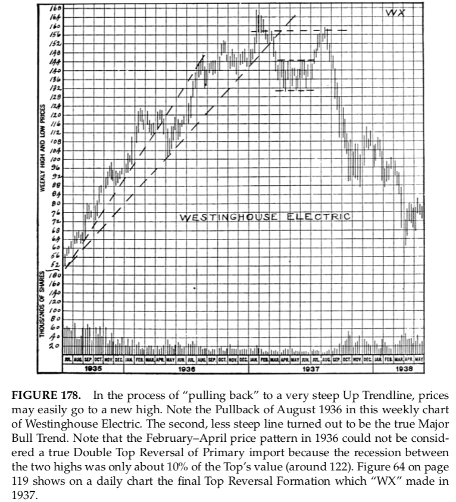

**HÌNH 178.** Trong quá trình “pullback” về một đường xu hướng tăng
rất dốc, giá hoàn toàn có thể lập đỉnh mới. Lưu ý nhịp pullback
tháng 8/1936 trên biểu đồ tuần của Westinghouse Electric. Đường
thứ hai, ít dốc hơn, cuối cùng mới là xu hướng bò chính thực sự.
Lưu ý rằng mô hình giá từ tháng 2 đến tháng 4/1936 không thể
được coi là một mô hình đảo chiều Double Top cấp độ chính,
bởi vì nhịp điều chỉnh giữa hai đỉnh chỉ khoảng 10% giá trị đỉnh
(khoảng 122). Hình 64 ở trang 119 cho thấy trên biểu đồ ngày mô
hình đảo chiều đỉnh cuối cùng mà “WX” tạo ra năm 1937.

    Một vùng đáy Rectangle lớn đã hình thành trên biểu đồ tuần
này trong các tháng 4, 5 và 6 năm 1937, nhưng hãy chú ý khối
lượng yếu đi kèm với cú bứt phá và đà tăng từ mô hình đó —
một tín hiệu cực kỳ tiêu cực cho xu hướng chính. “Mục tiêu”
của Rectangle đã được hoàn thành vào tháng 8, nhưng chỉ có vậy.
Như thường lệ, không thể vẽ được một đường xu hướng giảm
chính nào có giá trị dự báo trên biểu đồ này. Những đường xu
hướng thẳng tuyệt đẹp xuất hiện trong thị trường gấu 1929–32
đã khiến nhiều người học biểu đồ kỳ vọng các diễn biến tương
tự trong mọi thị trường gấu, nhưng thực tế là 1929–32 là trường
hợp độc nhất về phương diện đó.

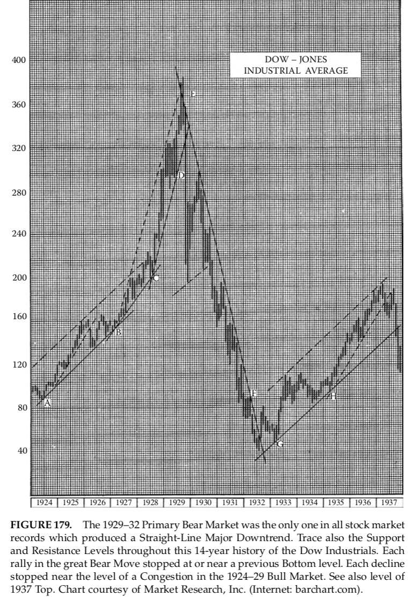

**HÌNH 179.** Thị trường gấu chính 1929–32 là trường hợp duy nhất
trong toàn bộ lịch sử thị trường chứng khoán tạo ra một xu
hướng giảm chính dạng đường thẳng. Đồng thời, hãy theo dõi
các mức hỗ trợ và kháng cự xuyên suốt 14 năm lịch sử của Dow
Industrials. Mỗi nhịp hồi trong pha gấu lớn đều dừng lại tại hoặc
gần mức đáy trước đó. Mỗi nhịp giảm đều dừng gần mức của
một vùng tích lũy trong thị trường bò 1924–29. Xem thêm mức
đỉnh năm 1937. Biểu đồ do Market Research, Inc. cung cấp
(Internet: barchart.com).

    _Tính tới thời điểm chuyển giao thế kỷ, những chỉ số quan
trọng nhất, bên cạnh Dow, có lẽ là S&P 500, S&P 100 và NASDAQ.
Thực tế, chúng có lẽ đã đủ cho mục đích phân tích và dự báo kinh
tế, và chắc chắn là những công cụ giao dịch tốt thông qua các
sản phẩm thay thế, quyền chọn và hợp đồng tương lai. Một số
người còn đưa Russell 2000 vào danh sách này. Các chỉ số và
trung bình này được tạo ra nhằm đáp ứng những nhu cầu mà
các chỉ số Dow–Jones không còn đáp ứng đầy đủ._
Với sự bùng nổ của các thước đo thị trường và từng bộ phận
của nó, một câu hỏi khác nảy sinh: liệu giá trị của riêng chỉ số
Dow trong việc chỉ báo xu hướng thị trường chung còn đáng tin
hay không. Hiện mới chỉ có ít nghiên cứu về vấn đề này. Tuy
nhiên, theo quan điểm của tôi, xu hướng thị trường chung hiện
nay cần được xác định bằng cách xem xét đồng thời Dow
Industrials, S&P 500 và NASDAQ Composite.

## Chương 15.1. Giao dịch các Chỉ số trong Thế kỷ 21

Như tôi đã đề cập trong các chương và ghi chú mới ở lần tái bản thứ tám,
khả năng giao dịch trực tiếp các Chỉ số thay vì từng cổ phiếu riêng lẻ
là một lựa chọn mạnh mẽ mà thị trường hiện đại mang lại. Magee cho rằng
các Chỉ số có độ “mượt” kỹ thuật mà nhiều cổ phiếu đơn lẻ thường thiếu.
Điều này, xét theo trực giác, có vẻ hợp lý. Rốt cuộc, cũng như đường
trung bình động làm mượt dữ liệu, thì trung bình của một rổ cổ phiếu
cũng có tác dụng làm giảm biến động giá. Dĩ nhiên, như Mandelbrot đã
chỉ ra, trong một cơn bão thị trường cỡ 10-sigma thì mọi thứ đều chìm.

Trong chương này, chúng tôi minh họa một số trường hợp chi tiết theo
gợi ý của Magee về việc giao dịch Chỉ số. Tôi cố gắng trình bày hai góc
nhìn: thứ nhất, “nỗi kinh hoàng của hiện tại”, tức là cảm giác của cú sập
và hoảng loạn khi chúng đang diễn ra; và thứ hai, cách mà cú sập và
hoảng loạn ấy trông như thế nào khi nhìn lại trong hồi tưởng. Dĩ nhiên,
tất cả chúng ta đều sống trong hiện tại — ngoại trừ những tỷ phú lớn,
những người có thể đủ khả năng “ngủ gật” xuyên qua các Thị trường Gấu
kinh hoàng. Giá trị tài sản ròng của Bill Gates đã dao động khoảng
16–17 tỷ USD vào đầu năm 2000. Điều đó, với nhà đầu tư bình thường,
chắc chắn là phá sản.

Vì vậy, nhà đầu tư bình thường — bạn và tôi — phải tôn trọng khoảng
trống mênh mông của Thị trường Gấu. Chúng ta phải bước ra ngoài lề,
để mặc con gấu “ăn thịt những trinh nữ ngu ngốc”, mượn một ẩn dụ Kinh
Thánh.

Bạn hẳn còn nhớ Magee cho rằng việc phá vỡ đường xu hướng 2% là đủ
để buộc phải thanh lý các vị thế mua khi phân tích Chỉ số. Trong các
hình minh họa kèm theo, giả thuyết này được đem ra xem xét.

_EN9: Liên quan đến việc phá vỡ đường xu hướng (2% hay 5%), cần lưu ý rằng
việc phá vỡ một đường xu hướng vừa là một_ cảnh báo _vừa là một tín hiệu
hành động. Cú phá vỡ đó, thay vì báo hiệu đảo chiều sang xu hướng ngược
lại, cũng có thể chỉ ra sự chuyển sang xu hướng đi ngang — hình thành
một mô hình đảo chiều hoặc tiếp diễn._

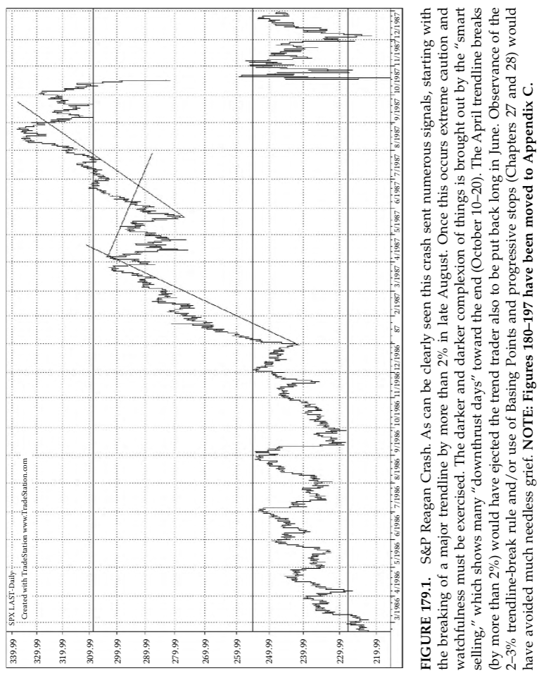

**HÌNH 179.1**. Cú sập Reagan của S&P. Có thể thấy rõ rằng cú sập này đã phát
ra nhiều tín hiệu, bắt đầu bằng việc phá vỡ một đường xu hướng chính
hơn 2% vào cuối tháng Tám. Khi điều này xảy ra, cần phải hết sức thận
trọng và quan sát chặt chẽ. Bức tranh ngày càng u ám được thể hiện qua
“bán thông minh”, với nhiều “ngày đâm xuống” xuất hiện về cuối giai đoạn
(10–20 tháng Mười). Các lần phá vỡ đường xu hướng vào tháng Tư (hơn
2%) cũng sẽ loại nhà giao dịch theo xu hướng, rồi lại đưa họ trở lại vị
thế mua vào tháng Sáu. Việc tuân thủ quy tắc phá vỡ đường xu hướng
2–3% và/hoặc sử dụng Điểm Tạo Đáy cùng các điểm dừng lũy tiến
(Chương 27 và 28) đã có thể tránh được rất nhiều đau khổ không cần
thiết. LƯU Ý: Các hình từ 180–197 đã được chuyển sang Phụ lục C.

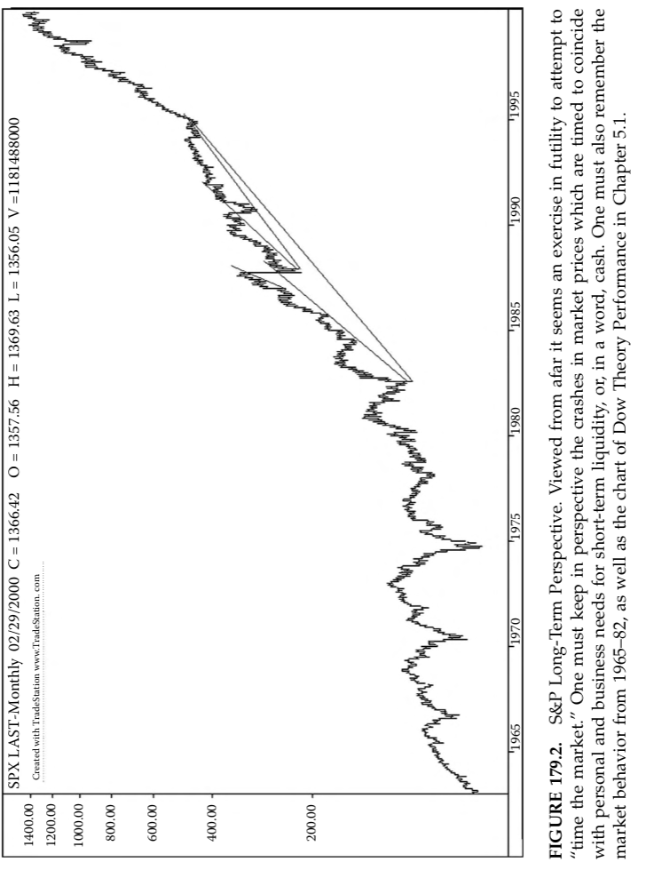

**HÌNH 179.2**. Góc nhìn dài hạn của S&P. Khi nhìn từ xa, việc cố gắng
“canh thời điểm thị trường” dường như là vô ích. Người ta cần giữ đúng
bối cảnh đối với các cú sập giá thị trường — những cú sập trùng với nhu
cầu thanh khoản ngắn hạn, hay nói cách khác là tiền mặt, của cá nhân
và doanh nghiệp. Cũng cần nhớ đến hành vi thị trường giai đoạn 1965–82,
cũng như biểu đồ hiệu suất của Lý thuyết Dow trong Chương 5.1.

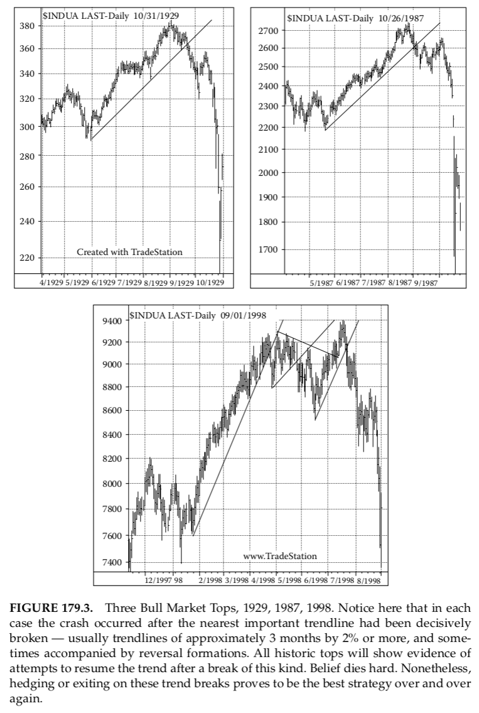

**HÌNH 179.3.** Ba đỉnh Thị trường Bò, các năm 1929, 1987 và 1998. Lưu ý
rằng trong mỗi trường hợp, cú sập đều xảy ra sau khi đường xu hướng
quan trọng gần nhất bị phá vỡ một cách dứt khoát — thường là các đường
xu hướng khoảng 3 tháng, bị phá vỡ từ 2% trở lên, và đôi khi còn kèm theo
các mô hình đảo chiều. Mọi đỉnh lịch sử đều cho thấy những nỗ lực cố
gắng nối lại xu hướng sau kiểu phá vỡ này. Niềm tin rất khó chết. Tuy
nhiên, phòng vệ hoặc thoát lệnh tại các điểm phá vỡ xu hướng này đã
chứng minh, hết lần này đến lần khác, là chiến lược tốt nhất.

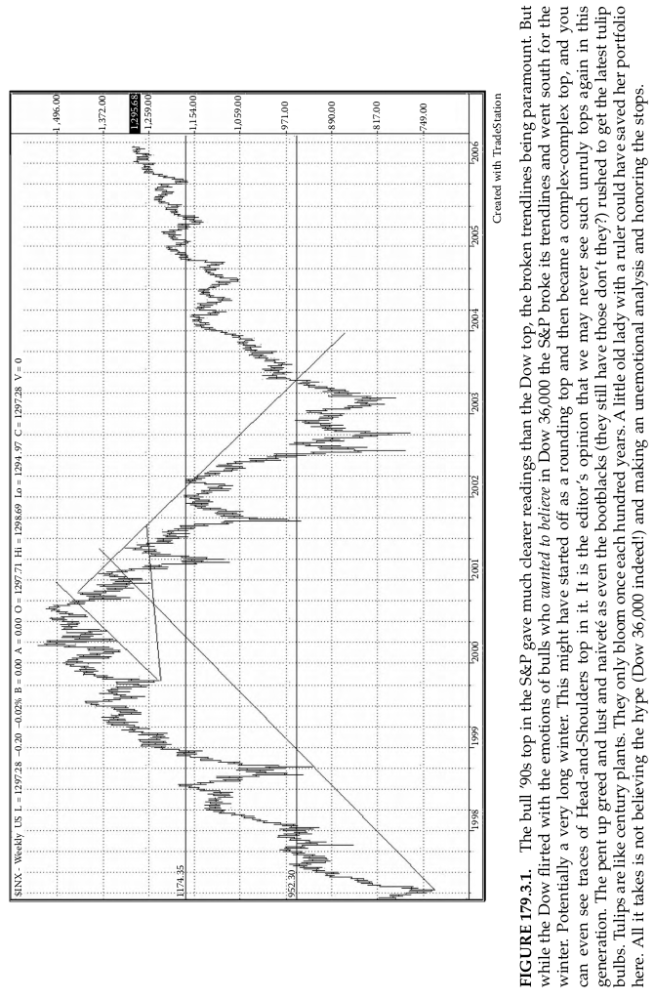

**HÌNH 179.3.1**. Đỉnh Thị trường Bò thập niên 1990 của S&P cho tín hiệu
rõ ràng hơn nhiều so với đỉnh của Dow, trong đó các đường xu hướng bị
phá vỡ đóng vai trò then chốt. Trong khi Dow trêu đùa cảm xúc của phe
bò, những người muốn tin vào Dow 36.000, thì S&P đã phá vỡ các đường
xu hướng và lao dốc cho “mùa đông”. Có thể là một mùa đông rất dài.
Mẫu hình này có thể đã bắt đầu như một đỉnh bo tròn, sau đó trở thành
một đỉnh phức hợp–phức hợp, và thậm chí còn thấy dấu vết của mô hình
Vai–Đầu–Vai. Theo quan điểm của biên tập viên, có lẽ chúng ta sẽ không
còn thấy những đỉnh hỗn loạn như vậy nữa trong thế hệ này. Lòng tham,
dục vọng và sự ngây thơ bị dồn nén — đến mức cả những người đánh giày
(giờ vẫn còn chứ?) cũng lao vào mua những củ tulip mới nhất. Tulip thì
giống như cây thế kỷ — chỉ nở hoa một lần trong trăm năm. Chỉ cần một
bà cụ với cây thước kẻ cũng có thể cứu được danh mục đầu tư của mình
ở đây. Tất cả những gì cần làm là không tin vào sự thổi phồng (Dow
36.000 ư!) và thực hiện phân tích một cách lạnh lùng, tôn trọng các điểm
dừng lỗ.

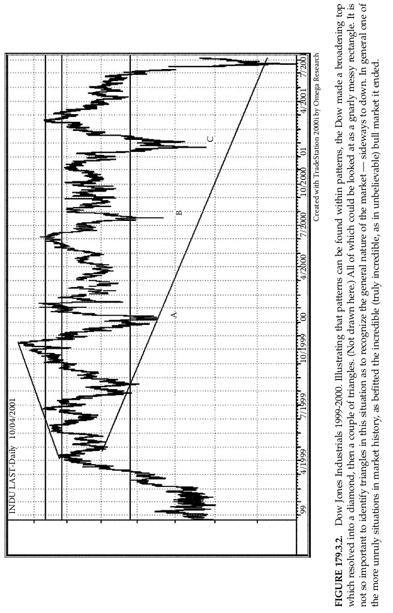

**HÌNH 179.3.2.** Dow Jones Industrials 1999–2000. Minh họa rằng các mô
hình có thể tồn tại bên trong các mô hình khác, Dow đã tạo ra một đỉnh
mở rộng, sau đó chuyển thành hình kim cương, rồi tiếp theo là một vài
tam giác (không vẽ ở đây). Tất cả những điều này cũng có thể được xem
như một hình chữ nhật lởm chởm, rối rắm. Trong bối cảnh này, việc xác
định chính xác các tam giác không quan trọng bằng việc nhận diện bản
chất chung của thị trường — đi ngang đến đi xuống. Nhìn chung, đây là
một trong những giai đoạn hỗn loạn nhất trong lịch sử thị trường, hoàn
toàn xứng đáng với Thị trường Bò khó tin (thực sự là không thể tin nổi)
mà nó đã kết thúc.
