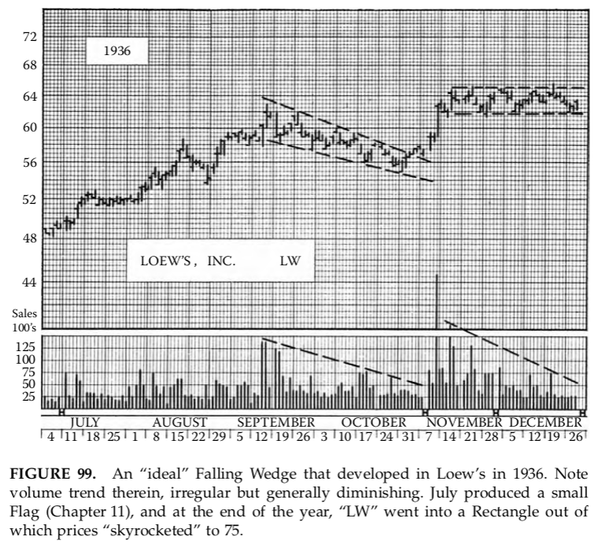
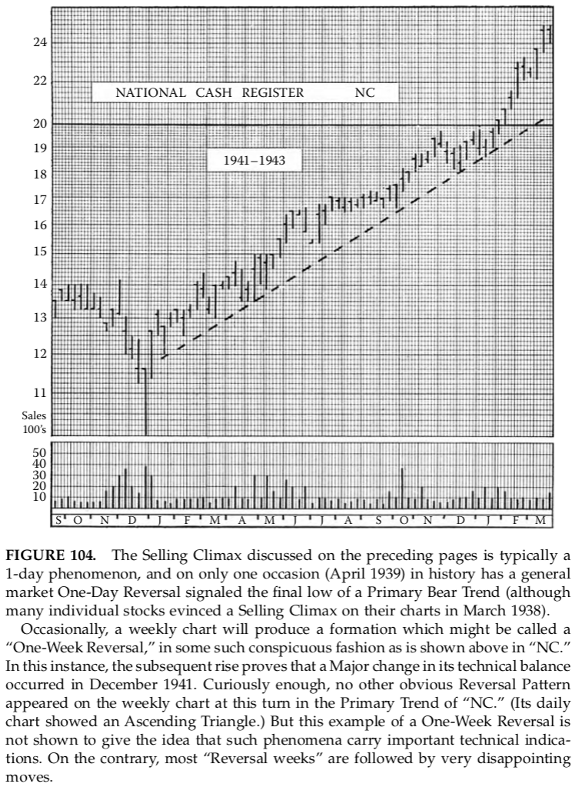

# chapter one the Technical Approach to Trading and Investing
Ít có hoạt động nào của con người đã được nghiên cứu kỹ lưỡng trong suốt
thế kỷ qua, từ nhiều góc độ và bởi rất nhiều người khác nhau, như việc mua
bán chứng khoán của các công ty. Những phần thưởng mà thị trường chứng khoán
mang lại cho những người đọc đúng là rất lớn; nhưng những hình phạt mà nó
dành cho các nhà đầu tư cẩu thả, ngủ quên hay "xui xẻo" thì lại rất thảm
khốc. Không có gì lạ khi nó đã thu hút một số kế toán viên, nhà phân tích
và các nhà nghiên cứu sáng suốt nhất thế giới, cùng với một nhóm những kẻ
kỳ quái, thần bí và những "người chơi linh cảm", cùng với một lượng lớn
những công dân bình thường đầy hy vọng. Những bộ óc tài năng đã tìm kiếm,
và vẫn luôn tìm kiếm, những phương pháp an toàn và chắc chắn để đánh giá
tình hình và xu hướng của thị trường, để phát hiện ra cổ phiếu đúng để mua
và thời điểm chính xác để mua chúng. Nghiên cứu sâu rộng này không phải là
vô ích — xa vời điều đó. Có rất nhiều nhà đầu tư và nhà đầu cơ thành công
(sử dụng từ này trong nghĩa đúng của nó, tức là không có sự phản cảm) những
người, qua một con đường này hay con đường khác, đã có được sự hiểu biết
cần thiết về các lực lượng mà họ đang đối phó và khả năng phán đoán, suy
nghĩ trước và kỷ luật tự giác quan trọng để xử lý chúng một cách có lợi.

Trong suốt nhiều năm nghiên cứu về thị trường chứng khoán, hai trường phái
tư tưởng khác biệt đã xuất hiện, hai phương pháp hoàn toàn khác nhau để đi
đến câu trả lời cho vấn đề của nhà giao dịch về _cái gì_ và _khi nào_. Trong
ngôn ngữ của "Phố Wall", một trong số đó thường được gọi là _phân tích cơ
bản_ hoặc thống kê, còn cái kia là _phân tích kỹ thuật_. (Trong những năm gần
đây, một phương pháp thứ ba, chu kỳ học, đã tiến bộ nhanh chóng và mặc dù vẫn
còn bị những "phần tử điên rồ" vây quanh, nhưng nó hứa hẹn sẽ đóng góp rất
nhiều vào sự hiểu biết của chúng ta về các xu hướng kinh tế.) Nhà đầu tư phân
tích cơ bản phụ thuộc vào các số liệu thống kê. Họ xem xét các báo cáo kiểm
toán viên, các báo cáo lãi lỗ, bảng cân đối tài chính quý, các bản ghi cổ
tức và chính sách của các công ty mà họ đang quan sát. Họ phân tích dữ liệu
bán hàng, khả năng quản lý, công suất nhà máy, sự cạnh tranh. Họ tham khảo
các báo cáo ngân hàng và kho bạc, chỉ số sản xuất, thống kê giá cả và dự báo
mùa màng để đánh giá tình hình kinh doanh chung, và đọc kỹ tin tức hàng ngày
để đưa ra ước tính về các điều kiện kinh doanh trong tương lai. Sau khi xem
xét tất cả những yếu tố này, họ đánh giá cổ phiếu của mình; nếu nó đang bán
dưới mức đánh giá của họ, họ coi đó là một cơ hội mua vào. _(EN9: Và, không có
gì ngạc nhiên, người mua tên là Warren Buffet, và ông ấy mua cả công ty, chứ
không phải cổ phiếu, vì mặc dù đây là một cách tuyệt vời để mua công ty nhưng
nó không phải là cách tốt để mua cổ phiếu.) EN: Đọc bài tổng kết phương pháp luận
phân tích cơ bản của Robert Prechter như một ghi chú thú vị vào cuối chương này._


Thực tế, ngoại trừ những người mới bắt đầu khi họ lần đầu đối mặt với vấn
đề đầu tư, và với sự thiếu kinh nghiệm, bất kỳ quan điểm nào khác không chỉ
là vô lý mà còn là không thể hiểu được, thì những người theo chủ nghĩa cơ
bản thuần túy rất hiếm. Ngay cả những chuyên gia thị trường, những người tỏ
ra khinh thường các biểu đồ và "nhà phân tích biểu đồ", cũng không hề bỏ
qua "hành động" được ghi lại trên dải băng ticker, và họ cũng không giấu
giếm sự tôn trọng đối với Lý thuyết Dow, điều mà dù họ có nhận ra hay không,
thì về bản chất, đó chính là phân tích kỹ thuật.

##### Định nghĩa Phân tích Kỹ thuật

Thuật ngữ "kỹ thuật", khi áp dụng vào thị trường chứng khoán, đã mang một
ý nghĩa rất đặc biệt, khác hẳn với định nghĩa từ điển thông thường của nó.
Nó chỉ _nghiên cứu hành động của thị trường chính nó_ trái ngược với nghiên
cứu về các hàng hóa mà thị trường giao dịch. _Phân tích kỹ thuật_ là khoa
học ghi lại, thường ở dạng đồ họa, lịch sử giao dịch thực tế (biến động giá
cả, khối lượng giao dịch, v.v.) của một cổ phiếu nhất định hoặc "các Chỉ số
Trung bình" và sau đó suy luận từ lịch sử đã vẽ ra xu hướng tương lai có thể
xảy ra.
_EN: Với sự xuất hiện của máy tính, nhiều trường phái phân tích kỹ thuật đã
ra đời. Phân tích kỹ thuật dựa trên số liệu, ví dụ, nghiên cứu trung bình động,
dao động, v.v., cố gắng khách quan hóa hoàn toàn việc phân tích thị trường.
Công trình của Edwards và Magee là hiện thân và định nghĩa của "phân tích kỹ
thuật cổ điển". Xem Phụ lục C._

Nhà phân tích kỹ thuật lập luận như sau: thật vô ích khi cố gắng gán một
giá trị nội tại cho chứng chỉ cổ phiếu. Một cổ phiếu của United States Steel,
ví dụ, có giá trị 261 đô la vào mùa thu năm 1929, nhưng bạn chỉ có thể mua
nó với giá 22 đô la vào tháng 6 năm 1932! Đến tháng 3 năm 1937, giá cổ phiếu
này đã tăng lên 126 đô la và chỉ 1 năm sau đó đã giảm xuống còn 38 đô la. Vào
tháng 5 năm 1946, giá trị của nó đã tăng trở lại lên 97 đô la, và 10 tháng
sau, vào năm 1947, giá cổ phiếu này đã rơi xuống dưới 70 đô la, mặc dù lợi
nhuận của công ty vào thời điểm đó được cho là đang ở mức cao nhất mọi thời
đại và lãi suất nói chung vẫn ở mức thấp nhất mọi thời đại. Giá trị sổ sách
của cổ phiếu này, theo bảng cân đối tài chính của công ty, là khoảng 204 đô
la vào năm 1929 (vào cuối năm); 187 đô la vào năm 1932; 151 đô la vào năm
1937; 117 đô la vào năm 1938 và 142 đô la vào năm 1946. Những sự việc như
thế này, sự khác biệt rộng lớn giữa giá trị ước tính và giá trị thực tế, không
phải là ngoại lệ; nó là quy tắc. Điều này xảy ra liên tục. Thực tế là giá trị
thực sự của một cổ phiếu của U.S. Steel được xác định vào bất kỳ thời điểm
nào hoàn toàn, chắc chắn và không thể thay đổi bởi cung và cầu, mà chúng
được phản ánh chính xác trong các giao dịch diễn ra trên sàn giao dịch chứng
khoán New York.

Dĩ nhiên, các số liệu thống kê mà các nhà phân tích cơ bản nghiên cứu cũng
đóng một vai trò trong phương trình cung-cầu — điều này được thừa nhận tự
do. Nhưng còn rất nhiều yếu tố khác ảnh hưởng đến nó. Giá thị trường không chỉ
phản ánh những quan điểm giá trị khác nhau của các nhà đánh giá chứng khoán
chính thống, mà còn phản ánh tất cả những hy vọng và lo sợ, những suy đoán
và tâm trạng, cả lý trí lẫn phi lý, của hàng trăm người mua và bán tiềm năng,
cũng như những nhu cầu và nguồn lực của họ — tổng thể, những yếu tố không thể
phân tích và không có số liệu thống kê có thể thu thập được, nhưng chúng lại
được tổng hợp, cân nhắc và cuối cùng được thể hiện trong một con số chính xác
mà ở đó người mua và người bán gặp nhau và thực hiện giao dịch (thông qua các
đại lý của họ, các môi giới chứng khoán tương ứng). Đây là con số duy nhất có
giá trị.

Hơn nữa, nhà phân tích kỹ thuật khẳng định, với lý do hoàn toàn chính đáng,
rằng phần


# Chương 2: Đồ Thị 

Biểu đồ là công cụ làm việc của nhà phân tích kỹ thuật. Chúng đã được phát
triển dưới nhiều dạng và phong cách khác nhau để biểu diễn đồ họa hầu như
mọi thứ diễn ra trên thị trường, hoặc để vẽ ra một "chỉ số" được lấy từ đó.
Chúng có thể là biểu đồ tháng, trên đó toàn bộ dữ liệu giao dịch của một
tháng được rút gọn thành một điểm duy nhất, hoặc là biểu đồ tuần, ngày,
giờ, giao dịch, "điểm và hình thức", biểu đồ nến, v.v. Chúng có thể được
xây dựng trên thang đo số học, logarit, hoặc căn bậc hai, hoặc được biểu diễn
dưới dạng "dao động". Chúng có thể miêu tả các đường trung bình động, tỷ lệ
khối lượng giao dịch so với biến động giá, giá trung bình của các cổ phiếu
"hoạt động nhất", giao dịch lô lẻ, tỷ lệ bán khống, và vô số các mối quan
hệ, tỷ lệ và chỉ số khác — tất cả đều là kỹ thuật trong ý nghĩa rằng chúng
được lấy từ, trực tiếp hay gián tiếp, những gì thực sự đã được giao dịch trên
các sàn chứng khoán.
Với hầu hết các loại biểu đồ này, may mắn thay, chúng ta không cần phải
quan tâm đến chúng nhiều; chúng chỉ có ý nghĩa với các nhà phân tích kinh
tế toàn thời gian. Nhiều trong số chúng đã xuất phát từ một nỗ lực hoàn toàn
vô ích (ít nhất là cho đến nay) nhằm phát hiện ra một chỉ số "cơ học" hoặc
sự kết hợp của các chỉ số có thể luôn luôn, tự động, mà không bao giờ thất
bại hay sai lầm, cảnh báo về sự thay đổi xu hướng; những phương pháp như
vậy, theo kinh nghiệm của chúng tôi, thường gây bối rối và đôi khi thậm chí
gây hiểu lầm vào những thời điểm quan trọng nhất. Tuy nhiên, cuốn sách này
được thiết kế cho người bình thường, cho những người kinh doanh hoặc chuyên
gia không thể dành toàn bộ thời gian cho các hoạt động đầu tư hay giao dịch,
nhưng những hoạt động này, dù sao, lại đủ quan trọng hoặc hấp dẫn để khiến
họ dành ít nhất một vài phút mỗi ngày để nghiên cứu và quản lý chúng.
_(EN9: Nhìn lại, việc đánh giá thấp tầm quan trọng của công việc này. Vào thế
kỷ 21, các chuyên gia hàng đầu đều nhận thức rõ tầm quan trọng của phân tích
xu hướng và sử dụng công trình này như một cuốn sách giáo khoa.)_ Các lý thuyết
và phương pháp được trình bày ở đây chỉ yêu cầu dạng biểu đồ cổ phiếu đơn
giản nhất — một bản ghi phạm vi giá (giá cao và thấp), giá đóng cửa, và
khối lượng cổ phiếu giao dịch mỗi ngày. Những đồ thị hàng ngày này sẽ được
bổ sung, cho các mục đích nhất định sẽ được thảo luận sau, bằng các biểu đồ
tuần hoặc tháng, mà đối với hầu hết các cổ phiếu, có thể mua sẵn và dễ dàng
tạo ra bằng hầu hết các phần mềm đầu tư có sẵn trên thị trường.

Hầu hết các minh họa trong các trang tiếp theo đều là ví dụ về các biểu đồ
hàng ngày như vậy. Chúng dễ dàng vẽ và duy trì bằng tay, chỉ cần một ít giấy
biểu đồ hoặc giấy cắt ngang (hầu như loại nào cũng có thể sử dụng), một tờ
báo hàng ngày cung cấp báo cáo đầy đủ và chính xác về giao dịch chứng khoán,
một cây bút chì sắc và vài phút thời gian. _EN: Ngoài ra, có rất nhiều dịch
vụ dữ liệu có sẵn để sử dụng với các phần mềm máy tính, chưa kể các trang web
Internet (được đề cập trong Tài nguyên). Việc sử dụng công nghệ này loại bỏ
hoàn toàn gánh nặng của việc vẽ biểu đồ thủ công. Nếu có một nhược điểm của
công nghệ này, có lẽ đó là mất đi "cảm giác" mà nhà đầu tư có được thông qua
việc vẽ biểu đồ thủ công._

Thông thường, khi chuẩn bị các biểu đồ chứng khoán hàng ngày thông thường,
người ta để trục ngang biểu thị thời gian, với các đường chéo dọc (hoặc
như một số người ưa thích, các khoảng cách giữa chúng) từ trái sang phải
tương ứng với các ngày liên tiếp. Thang đo dọc được dùng để ghi giá, với
mỗi đường chéo ngang tương ứng với một mức giá cụ thể. Không gian thường
được dành ở dưới cùng của tờ giấy để vẽ khối lượng, tức là số lượng cổ phiếu
thay đổi chủ sở hữu mỗi ngày. Các tờ báo công bố báo cáo chứng khoán đầy đủ
cung cấp doanh thu hoặc khối lượng giao dịch của ngày (không bao gồm các giao
dịch lô lẻ có thể bị bỏ qua trong mục đích hiện tại của chúng ta), mức giá
cao nhất và thấp nhất mà mỗi cổ phiếu đã bán trong ngày, giá đóng cửa (là
giá tại thời điểm giao dịch cuối cùng trong ngày), và thường là giá mở cửa
hoặc giá giao dịch đầu tiên. Trên biểu đồ của chúng ta, phạm vi giá hàng ngày
được vẽ bằng cách vẽ một đường dọc nối các điểm đại diện cho mức cao và mức
thấp. Sau đó, một dấu ngang ngắn sẽ được thêm vào, có thể cắt ngang qua đường
dọc hoặc kéo dài ra phía bên phải từ nó, ở mức giá đóng cửa. Đôi khi, tất cả
các giao dịch trong một cổ phiếu trong ngày diễn ra tại một mức giá duy nhất;
giá cao, giá thấp và giá đóng cửa do đó sẽ nằm trên cùng một mức và dấu duy
nhất trên biểu đồ của chúng ta sẽ là dấu ngang đại diện cho giá đóng cửa.

Khối lượng được thể hiện bằng cách vẽ một đường dọc từ đường cơ sở của biểu đồ.
Giá mở cửa không cần phải ghi lại.* Kinh nghiệm đã chỉ ra rằng nó hiếm khi,
nếu có, có bất kỳ ý nghĩa nào trong việc ước tính các diễn biến tương lai,
điều mà thông thường chúng ta nên quan tâm. Tuy nhiên, giá đóng cửa là rất quan
trọng. Thực tế, đây là mức giá duy nhất mà nhiều người đọc báo tài chính chỉ
chú ý đến. Nó đại diện cho sự đánh giá cuối cùng của cổ phiếu được thực hiện
bởi thị trường trong suốt ngày hôm đó. Dĩ nhiên, nó có thể được ghi nhận trong
giờ giao dịch đầu tiên, nếu không có giao dịch nào khác được thực hiện sau
đó, nhưng nó vẫn là con số mà phần lớn các nhà giao dịch tiềm năng dựa vào
để lập kế hoạch cho ngày hôm sau. Do đó, giá đóng cửa có ý nghĩa kỹ thuật, và
nó sẽ xuất hiện trong các bối cảnh khác nhau trong các chương sau.

##### Các Loại Thang Đo Khác Nhau

Nhiều gợi ý cụ thể về chi tiết vẽ biểu đồ sẽ được thảo luận ở phần hai của
cuốn sách này, nhưng có một đặc điểm biểu đồ có thể được xem xét ở đây. Cho
đến những năm gần đây, hầu hết các biểu đồ giá cổ phiếu đều được vẽ trên loại
giấy đồ thị thông thường với thang đo số học. Tuy nhiên, ngày càng có nhiều
nhà phân tích biểu đồ sử dụng loại giấy được gọi là giấy bán logarit, hoặc đôi
khi gọi là giấy tỷ lệ hoặc giấy phần trăm. Kinh nghiệm của chính chúng tôi cho
thấy rằng thang đo bán logarit có những ưu điểm rõ rệt trong công việc này;
hầu hết các biểu đồ được tái bản trong cuốn sách này đều sử dụng nó. Hai loại
thang đo này có thể dễ dàng phân biệt qua việc trên giấy số học, các khoảng cách
bằng nhau trên thang đo dọc (tức là giữa các đường ngang) đại diện cho số
tiền bằng nhau theo đô la, trong khi trên giấy bán logarit, chúng đại diện cho
các biến động phần trăm bằng nhau. Do đó, trên giấy số học, khoảng cách giữa
10 và 20 trên thang đo dọc là hoàn toàn giống với khoảng cách từ 20 đến 30 và
từ 30 đến 40. Trên thang logarit, sự khác biệt từ 10 đến 20, đại diện cho một
sự gia tăng 100%, là giống như sự khác biệt từ 20 đến 40 hoặc từ 40 đến 80,
trong mỗi trường hợp đều đại diện cho một sự gia tăng 100% khác.

Mối quan hệ phần trăm, không cần phải nói, rất quan trọng trong giao dịch cổ phiếu.
Giấy bán logarit cho phép so sánh trực tiếp giữa cổ phiếu giá cao và giá thấp,
và làm cho việc lựa chọn cổ phiếu có tỷ


# Chương 3 – Học thuyết Dow (The Dow Theory)

## Học thuyết Dow

Học thuyết Dow là “ông tổ” của mọi nghiên cứu kỹ thuật về thị trường. Mặc dù nó thường
xuyên bị chỉ trích là “đến quá muộn”, và đôi khi còn bị chế giễu (đặc biệt trong giai
đoạn đầu của một Thị trường Gấu – *Bear Market*) bởi những người không chấp nhận các
kết luận của nó, nhưng hầu như tất cả những ai từng có liên quan đến thị trường chứng
khoán đều biết đến học thuyết này, và phần lớn đều tôn trọng nó. Nhiều người vận dụng
nó ở mức độ nhiều hay ít trong việc xác định chính sách đầu tư của mình nhưng lại
không nhận ra rằng nó hoàn toàn và thuần túy là một học thuyết “kỹ thuật” (*technical*).

Học thuyết này được xây dựng dựa trên và chỉ quan tâm đến hành động của chính thị
trường chứng khoán (được thể hiện thông qua một số “chỉ số trung bình” – *averages*),
và không rút ra bất kỳ điều gì từ các số liệu kinh doanh mà các nhà phân tích cơ bản
(*fundamentalists*) phụ thuộc vào.

Trong các bài viết của người khởi xướng ban đầu là Charles H. Dow, có nhiều điểm cho
thấy ông không xem “học thuyết” của mình như một công cụ để dự báo thị trường chứng
khoán, hay thậm chí là một kim chỉ nam cho nhà đầu tư, mà đúng hơn là một phong vũ
biểu (*barometer*) phản ánh các xu hướng chung của hoạt động kinh doanh.

Dow là người sáng lập Dow–Jones Financial News Service và được ghi nhận là người
phát minh ra các chỉ số trung bình của thị trường chứng khoán. Các nguyên lý cơ bản
của học thuyết – sau này được đặt theo tên ông – đã được ông phác thảo trong các bài
xã luận mà ông viết cho *The Wall Street Journal*. Sau khi ông qua đời vào năm 1902,
người kế nhiệm ông ở vị trí biên tập viên của *Journal*, William P. Hamilton, đã tiếp
tục phát triển các nguyên lý của Dow và, trong suốt 27 năm viết về thị trường chứng
khoán, đã tổ chức, hệ thống hóa và hình thành nên Học thuyết Dow như chúng ta biết
ngày nay.

Trước khi đi vào giải thích bản thân học thuyết này, cần phải xem xét các chỉ số
trung bình (*averages*) mà nó sử dụng. Từ rất lâu trước thời của Dow, các nhà ngân
hàng và giới kinh doanh đã quen thuộc với thực tế rằng chứng khoán của hầu hết các
công ty đã được thiết lập vững chắc có xu hướng tăng hoặc giảm giá cùng nhau.

Các ngoại lệ — những cổ phiếu đi ngược lại xu thế tài chính chung — là rất hiếm,
và thông thường cũng không duy trì được xu hướng ngược đó quá vài ngày hoặc vài
tuần. Đúng là trong những giai đoạn bùng nổ (*boom*), giá của một số cổ phiếu tăng
nhanh và tăng mạnh hơn những cổ phiếu khác, và khi xu hướng chung là suy thoái,
một số cổ phiếu giảm rất nhanh trong khi những cổ phiếu khác chống chịu khá tốt
trước các lực kéo thị trường đi xuống; tuy nhiên, thực tế vẫn là phần lớn chứng
khoán có xu hướng dao động cùng nhau. (Điều này cho đến nay vẫn đúng, và dĩ nhiên
sẽ luôn đúng.)

Thực tế này, như đã nói, từ lâu đã được biết đến và chấp nhận rộng rãi — được xem
là hiển nhiên đến mức tầm quan trọng của nó thường bị bỏ qua. Nhưng nó lại cực kỳ
quan trọng — vô cùng quan trọng trên nhiều phương diện, không chỉ riêng những
phương diện thuộc phạm vi của cuốn sách này. Một trong những lý do tốt nhất để
một người nghiên cứu kỹ thuật thị trường bắt đầu với Học thuyết Dow chính là vì
học thuyết này nhấn mạnh đến *xu hướng chung của thị trường* (*general market trend*).

Charles Dow được cho là người đầu tiên đã nỗ lực một cách hệ thống nhằm biểu đạt
xu hướng chung (hay chính xác hơn là *mức độ*) của thị trường chứng khoán thông
qua *giá trung bình* của một nhóm nhỏ các cổ phiếu đại diện. Khi được thiết lập
hoàn chỉnh vào tháng 1 năm 1897 — dưới hình thức tiếp tục được duy trì cho đến
ngày nay và được Dow sử dụng trong các nghiên cứu xu hướng thị trường của ông —
đã có hai chỉ số trung bình Dow–Jones.

Một chỉ số bao gồm cổ phiếu của 20 công ty đường sắt, bởi vì đường sắt là các
doanh nghiệp chi phối nền kinh tế doanh nghiệp vào thời kỳ đó. Chỉ số còn lại,
được gọi là Chỉ số Công nghiệp (*Industrial Average*), đại diện cho tất cả các
loại hình kinh doanh khác và ban đầu chỉ bao gồm 12 cổ phiếu. Con số này được
tăng lên 20 vào năm 1916 và lên 30 vào ngày 1 tháng 10 năm 1928.

## Các chỉ số trung bình Dow (The Dow Averages)

Danh sách cổ phiếu được đưa vào hai chỉ số trung bình này đã được thay đổi theo
thời gian nhằm giữ cho chúng luôn cập nhật và đại diện sát nhất có thể cho các
nhóm tương ứng của mình. Trong số 30 cổ phiếu công nghiệp hiện tại, chỉ có General
Electric là cổ phiếu duy nhất từng được đưa vào Chỉ số Công nghiệp ban đầu; cổ
phiếu này đã từng bị loại bỏ (năm 1898) và sau đó lại được đưa trở lại.

Năm 1929, tất cả cổ phiếu của các công ty tiện ích công cộng bị loại khỏi Chỉ số
Công nghiệp và một Chỉ số Tiện ích (*Utility Average*) mới gồm 20 cổ phiếu được
thiết lập; đến năm 1938, số lượng này được giảm xuống còn 15. Hai mươi cổ phiếu
đường sắt, 30 cổ phiếu công nghiệp và 15 cổ phiếu tiện ích hiện nay được tính
trung bình chung để tạo thành Chỉ số Tổng hợp Dow–Jones (*Dow–Jones Stock Composite*).

Lịch sử của các chỉ số trung bình này, các điều chỉnh khác nhau đã được thực hiện
đối với chúng, cũng như phương pháp tính toán của chúng, là một câu chuyện thú
vị riêng mà người đọc có thể tìm hiểu ở những nguồn khác. Đối với mục đích hiện
tại, chỉ cần lưu ý rằng Học thuyết Dow không chú ý đến Chỉ số Tiện ích hay Chỉ số
Tổng hợp; các diễn giải của nó chỉ dựa trên Chỉ số Đường sắt và Chỉ số Công nghiệp.
(“Đường sắt” hiện nay được gọi là “Vận tải” – *Transportation*.)

Trong những năm gần đây, giá trị của các chỉ số trung bình Dow–Jones được tính
toán vào cuối mỗi giờ giao dịch cũng như vào cuối ngày. Các con số theo giờ này
được đăng trên *The Wall Street Journal* cũng như trên các bảng giá thị trường.
Giá đóng cửa hằng ngày của các chỉ số này cũng được đăng tải trên nhiều tờ báo
ngày lớn tại các đô thị.

## Các nguyên lý cơ bản (Basic Tenets)

Để quay trở lại với chính Học thuyết Dow, dưới đây là các nguyên lý cơ bản của nó:

### 1. Các chỉ số trung bình phản ánh (discount) mọi thứ  
*(The Averages Discount Everything — ngoại trừ “Acts of God”)*

Bởi vì các chỉ số trung bình phản ánh tổng hợp hoạt động của hàng nghìn nhà đầu tư,
bao gồm cả những người có tầm nhìn xa nhất và thông tin tốt nhất về các xu hướng và
sự kiện, nên trong các dao động hằng ngày của mình, các chỉ số trung bình đã phản
ánh trước mọi điều đã biết, mọi điều có thể dự đoán được, và mọi điều kiện có thể
ảnh hưởng đến cung hoặc cầu đối với chứng khoán doanh nghiệp.

Ngay cả những thảm họa tự nhiên không thể dự đoán trước, khi xảy ra, cũng nhanh
chóng được thị trường đánh giá và phản ánh vào giá.

---

### 2. Ba loại xu hướng  
*(The Three Trends)*

“Thị trường”, hiểu theo nghĩa là giá cổ phiếu nói chung, vận động theo các xu hướng,
trong đó quan trọng nhất là các xu hướng *Chính* (*Major* hay *Primary Trends*). Đây
là những chuyển động tăng hoặc giảm kéo dài, thường là một năm hoặc hơn, và dẫn đến
sự tăng giá hoặc giảm giá chung vượt quá 20%.

Các chuyển động theo hướng của Xu hướng Chính thường bị gián đoạn theo từng giai
đoạn bởi các dao động *Thứ cấp* (*Secondary Swings*) theo hướng ngược lại — tức các
đợt phản ứng hay “điều chỉnh” (*corrections*) xảy ra khi chuyển động Chính tạm thời
“đi trước quá xa”.

(Cả các Xu hướng Thứ cấp và các đoạn chuyển động theo Xu hướng Chính nằm giữa chúng
thường được gộp chung thành các Chuyển động Trung gian — *Intermediate Movements* —
một thuật ngữ sẽ tỏ ra hữu ích trong các thảo luận sau này.)

Cuối cùng, các Xu hướng Thứ cấp được cấu thành bởi các Xu hướng *Nhỏ* (*Minor Trends*)
hay các dao động ngày-qua-ngày, vốn không có ý nghĩa trong khuôn khổ Học thuyết Dow.

---

### 3. Xu hướng Chính  
*(The Primary Trends)*

Như đã nói, đây là những chuyển động rộng và bao quát, tăng hoặc giảm, thường (nhưng
không phải luôn luôn) kéo dài hơn một năm và có thể kéo dài trong nhiều năm.

Chừng nào mỗi đợt tăng giá kế tiếp (*rally*) đạt đến một mức cao hơn đợt trước, và mỗi
đợt phản ứng Thứ cấp kế tiếp dừng lại (tức là giá đảo chiều từ giảm sang tăng) tại một
mức cao hơn mức đáy của đợt phản ứng trước đó, thì Xu hướng Chính được xem là *tăng*
(*Up*). Trạng thái này được gọi là *Thị trường Bò* (*Bull Market*).

Ngược lại, khi mỗi đợt giảm trung gian đưa giá xuống những mức ngày càng thấp hơn,
và mỗi đợt hồi phục xen kẽ không thể đưa giá trở lại mức đỉnh của đợt hồi phục trước,
thì Xu hướng Chính là *giảm* (*Down*) và được gọi là *Thị trường Gấu* (*Bear Market*).

(Các thuật ngữ *Bull* và *Bear* thường được dùng một cách lỏng lẻo để chỉ bất kỳ chuyển
động tăng hay giảm nào, nhưng trong cuốn sách này chúng chỉ được dùng liên quan đến
các chuyển động Chính hay Lớn của thị trường theo đúng nghĩa Dow.)

Thông thường — ít nhất về mặt lý thuyết — Xu hướng Chính là xu hướng duy nhất mà nhà
đầu tư dài hạn thực sự quan tâm. Mục tiêu của ông là mua cổ phiếu sớm nhất có thể trong
một Thị trường Bò — ngay khi ông có thể chắc chắn rằng nó đã bắt đầu — và sau đó giữ
chúng cho đến (và chỉ cho đến) khi trở nên rõ ràng rằng nó đã kết thúc và một Thị
trường Gấu đã bắt đầu.

Ông hiểu rằng ông có thể an toàn bỏ qua mọi phản ứng Thứ cấp và các dao động Nhỏ xen
kẽ. Tuy nhiên, nhà giao dịch (*trader*) có thể quan tâm thêm đến các dao động Thứ cấp,
và trong phần sau của cuốn sách này sẽ cho thấy rằng ông ta có thể làm điều đó một
cách có lợi.

---

### 4. Các xu hướng Thứ cấp  
*(The Secondary Trends)*

Đây là những phản ứng quan trọng làm gián đoạn tiến trình của giá theo hướng Chính.
Chúng là các đợt giảm trung gian hay “điều chỉnh” trong Thị trường Bò, và các đợt hồi
phục trung gian trong Thị trường Gấu.

Thông thường, chúng kéo dài từ ba tuần đến nhiều tháng, và hiếm khi dài hơn. Thông
thường, chúng thoái lui (*retracement*) từ một phần ba đến hai phần ba mức tăng (hoặc
giảm, tùy trường hợp) của chuyển động trước đó theo Xu hướng Chính.

Ví dụ, trong một Thị trường Bò, giá — xét theo Chỉ số Công nghiệp — có thể tăng đều,
hoặc chỉ bị gián đoạn rất ngắn và nhỏ, với tổng mức tăng 30 (hoặc 300) điểm trước khi
một đợt điều chỉnh Thứ cấp xảy ra. Khi đó, có thể kỳ vọng đợt điều chỉnh này sẽ tạo ra
một mức giảm không dưới 10 điểm và không quá 20 điểm, trước khi một đợt tăng trung
gian mới theo Xu hướng Bò Chính hình thành.

Tuy nhiên, cần lưu ý rằng quy tắc một phần ba / hai phần ba không phải là một định luật
bất biến; nó chỉ là một phát biểu về xác suất. Phần lớn các dao động Thứ cấp nằm trong
các giới hạn này; nhiều dao động dừng rất gần mốc một nửa, tức là thoái lui 50% chuyển
động Chính trước đó. Chúng hiếm khi nhỏ hơn một phần ba, nhưng một số trường hợp có
thể xóa bỏ gần như toàn bộ mức tăng trước đó.

Do đó, ta có hai tiêu chí để nhận diện một Xu hướng Thứ cấp: bất kỳ chuyển động giá
nào đi ngược hướng với Xu hướng Chính, kéo dài ít nhất ba tuần và thoái lui ít nhất
một phần ba mức dịch chuyển ròng trước đó theo Xu hướng Chính (tính từ điểm kết thúc
của Xu hướng Thứ cấp trước đến điểm bắt đầu của Xu hướng này, bỏ qua các dao động
Nhỏ), đều được xem là một chuyển động Trung gian, tức một Xu hướng Thứ cấp thực sự.

Mặc dù có các tiêu chí này, Xu hướng Thứ cấp vẫn thường gây nhầm lẫn; việc nhận diện
và đánh giá chính xác nó tại thời điểm nó đang hình thành và đang diễn ra là bài toán
khó khăn nhất đối với người theo Học thuyết Dow. Chúng ta sẽ còn bàn thêm về vấn đề
này ở phần sau.

---

### 5. Các xu hướng Nhỏ  
*(The Minor Trends)*

Đây là các dao động ngắn hạn (hiếm khi kéo dài đến ba tuần — thường là dưới sáu ngày),
mà xét theo Học thuyết Dow thì bản thân chúng không mang ý nghĩa gì, nhưng *tổng hợp
lại* (*in toto*) thì tạo thành các Xu hướng Trung gian.

Thông thường, nhưng không phải luôn luôn, một chuyển động Trung gian — dù là một
Xu hướng Thứ cấp hay một đoạn của Xu hướng Chính nằm giữa hai Xu hướng Thứ cấp —
được cấu thành từ một chuỗi ba hoặc nhiều hơn các sóng Nhỏ có thể phân biệt được.

Những suy luận rút ra từ các dao động ngày-qua-ngày này rất dễ gây sai lệch. Xu hướng
Nhỏ là xu hướng duy nhất trong ba loại xu hướng có thể bị “thao túng” (mặc dù trên
thực tế, dưới các điều kiện hiện nay, ngay cả điều đó cũng khó có thể được thực hiện
một cách có chủ ý và ở mức độ đáng kể).

Các Xu hướng Chính và Thứ cấp thì không thể bị thao túng; để làm được điều đó, ngay
cả nguồn lực của Bộ Tài chính Hoa Kỳ cũng sẽ bị kéo căng đến mức không thể.

## So sánh ba xu hướng với thủy triều, sóng và gợn sóng  
*(Tide, Wave, and Ripple)*

Ngay tại đây, trước khi tiếp tục trình bày nguyên lý thứ sáu của Học thuyết Dow, chúng
ta nên dành một chút thời gian để làm rõ khái niệm ba loại xu hướng bằng cách đưa ra
một phép so sánh giữa các chuyển động của thị trường chứng khoán và chuyển động của
biển cả.

Các Xu hướng Lớn (Xu hướng Chính) của giá cổ phiếu giống như thủy triều. Ta có thể
so sánh một Thị trường Bò với thủy triều dâng, mang nước biển tràn ngày càng cao lên
bãi biển cho đến khi cuối cùng đạt đến mức nước cao nhất và bắt đầu quay đầu. Sau đó
là thủy triều rút, tương tự như một Thị trường Gấu.

Nhưng trong suốt quá trình triều lên cũng như triều xuống, các con sóng vẫn liên tục
xô vào bờ, vỡ ra trên bãi cát rồi rút trở lại. Khi thủy triều đang lên, mỗi con sóng kế
tiếp lại đẩy nước lên bờ xa hơn một chút, và khi rút đi, nó không kéo nước trở lại xa
như con sóng trước đó. Trong giai đoạn triều rút, mỗi con sóng tiến vào lại dừng ở
mức thấp hơn con sóng trước, và mỗi lần rút ra lại để lộ thêm một phần bãi biển.

Những con sóng này tương ứng với các Xu hướng Trung gian — là Xu hướng Chính hay
Xu hướng Thứ cấp tùy thuộc vào việc chuyển động của chúng cùng hay ngược với hướng
của thủy triều. Trong khi đó, bề mặt nước luôn bị khuấy động bởi những gợn sóng nhỏ,
những làn sóng lăn tăn và các “vết chân mèo” (*cat’s-paws*) di chuyển cùng, ngược
hoặc cắt ngang hướng của các con sóng — những hiện tượng này tương ứng với các Xu
hướng Nhỏ của thị trường, tức các dao động ngày-qua-ngày không quan trọng.

Thủy triều, sóng và gợn sóng, theo thứ tự, đại diện cho Xu hướng Chính (Lớn), Xu hướng
Thứ cấp (Trung gian) và Xu hướng Nhỏ của thị trường.

### Thủy triều, sóng và gợn sóng

Một người sống ven biển, nếu không có bảng thủy triều, có thể xác định hướng của thủy
triều bằng cách đóng một chiếc cọc xuống bãi cát tại điểm cao nhất mà một con sóng
đang lên đạt tới. Nếu con sóng tiếp theo đẩy nước vượt qua chiếc cọc đó, anh ta sẽ
biết rằng thủy triều đang lên. Nếu anh ta dịch chuyển chiếc cọc theo dấu cao nhất của
mỗi con sóng, thì đến một lúc nào đó, sẽ có một con sóng dừng lại và bắt đầu rút xuống
mà không chạm đến vị trí cọc trước đó; khi ấy anh ta sẽ biết rằng thủy triều đã đổi
chiều và bắt đầu rút.

Về bản chất (và được đơn giản hóa rất nhiều), đó chính là cách mà người theo Học
thuyết Dow thực hiện khi xác định xu hướng của thị trường chứng khoán.

Sự so sánh giữa thủy triều, sóng và gợn sóng đã được sử dụng ngay từ những ngày đầu
tiên của Học thuyết Dow. Thậm chí có thể chính chuyển động của biển cả đã gợi ý cho
Dow những yếu tố cấu thành học thuyết này. Tuy nhiên, phép so sánh này không thể bị
đẩy đi quá xa. Thủy triều và sóng của thị trường chứng khoán không hề đều đặn như của
đại dương. Người ta có thể lập bảng để dự đoán chính xác thời điểm lên xuống của thủy
triều nhiều năm trước, nhưng Học thuyết Dow không cung cấp bất kỳ bảng thời gian nào
như vậy cho thị trường chứng khoán.

Chúng ta có thể quay lại một số điểm của phép so sánh này ở phần sau, nhưng bây giờ
cần tiếp tục trình bày các nguyên lý và quy tắc còn lại của Học thuyết.

---

## Các giai đoạn của Xu hướng Chính  
*(Major Trend Phases)*

### 6. Thị trường Bò  
*(The Bull Market)*

Các Xu hướng Tăng Chính thường (nhưng không phải luôn luôn) có thể được chia thành
ba giai đoạn.

Giai đoạn thứ nhất là giai đoạn *tích lũy* (*accumulation*), trong đó các nhà đầu tư
có tầm nhìn xa, nhận thấy rằng hoạt động kinh doanh — dù đang suy yếu — sắp sửa đảo
chiều, sẵn sàng mua vào toàn bộ số cổ phiếu được chào bán bởi những người bán đang
chán nản hoặc gặp khó khăn, đồng thời từ từ nâng giá chào mua khi áp lực bán giảm
dần về khối lượng.

Trong giai đoạn này, các báo cáo tài chính vẫn còn xấu — thậm chí thường là xấu nhất.
“Công chúng” hoàn toàn chán ghét thị trường chứng khoán và đứng ngoài nó. Hoạt động
giao dịch chỉ ở mức trung bình nhưng bắt đầu gia tăng trong các đợt hồi nhỏ (*Minor
Advances*).

Giai đoạn thứ hai là giai đoạn tăng giá khá ổn định với khối lượng giao dịch ngày càng
gia tăng, khi sắc thái cải thiện của hoạt động kinh doanh và xu hướng đi lên của lợi
nhuận doanh nghiệp bắt đầu thu hút sự chú ý. Đây là giai đoạn mà nhà giao dịch “kỹ
thuật” (*technical trader*) thường có thể thu hoạch được lợi nhuận tốt nhất.

Cuối cùng là giai đoạn thứ ba, khi thị trường sôi sục với hoạt động giao dịch do “công
chúng” đổ xô vào các phòng giao dịch. Tất cả các tin tức tài chính đều tốt, các đợt tăng
giá trở nên ngoạn mục và thường xuyên xuất hiện trên trang nhất của các tờ báo hằng
ngày, và các đợt phát hành cổ phiếu mới diễn ra với số lượng ngày càng lớn.

Chính trong giai đoạn này, một người bạn của bạn sẽ gọi điện và thản nhiên nói:
“Ê, tôi thấy thị trường đang lên. Có cổ phiếu nào mua tốt không?” — hoàn toàn không
ý thức được rằng thị trường đã tăng có thể là hai năm rồi, đã tăng một quãng rất xa,
và đang tiến đến giai đoạn mà có lẽ phù hợp hơn để hỏi: “Nên bán cái gì?”

Ở giai đoạn cuối của pha này, khi đầu cơ lan tràn, khối lượng giao dịch tiếp tục tăng,
nhưng các “khoảng trống không khí” (*air pockets*) xuất hiện ngày càng thường xuyên;
các cổ phiếu “mèo chó” (*cats and dogs* — cổ phiếu giá thấp, không có giá trị đầu tư)
bị cuốn lên mạnh mẽ, trong khi ngày càng nhiều cổ phiếu chất lượng cao từ chối đi theo.

---

### 7. Thị trường Gấu  
*(The Bear Market)*

Các Xu hướng Giảm Chính cũng thường (nhưng một lần nữa, không phải luôn luôn) được
đặc trưng bởi ba giai đoạn.

Giai đoạn thứ nhất là giai đoạn *phân phối* (*distribution*), thực chất đã bắt đầu từ
những giai đoạn cuối của Thị trường Bò trước đó. Trong giai đoạn này, các nhà đầu tư
có tầm nhìn xa nhận ra rằng lợi nhuận kinh doanh đã đạt đến mức cao bất thường và bắt
đầu bán ra các khoản nắm giữ của mình với tốc độ ngày càng nhanh.

Khối lượng giao dịch vẫn ở mức cao, dù có xu hướng giảm dần trong các đợt hồi, và
“công chúng” vẫn còn tham gia tích cực nhưng bắt đầu có dấu hiệu thất vọng khi các
kỳ vọng lợi nhuận dần tan biến.

Giai đoạn thứ hai là *giai đoạn hoảng loạn* (*Panic Phase*). Người mua bắt đầu thưa
thớt, người bán trở nên ngày càng khẩn cấp; xu hướng giảm của giá đột ngột tăng tốc
thành một đợt lao dốc gần như thẳng đứng, trong khi khối lượng giao dịch tăng vọt lên
mức cao trào.

Sau giai đoạn hoảng loạn (vốn thường đi quá xa so với các điều kiện kinh doanh hiện
hữu), có thể xuất hiện một đợt hồi phục Thứ cấp khá dài hoặc một giai đoạn đi ngang,
rồi sau đó giai đoạn thứ ba bắt đầu.

Giai đoạn thứ ba được đặc trưng bởi việc bán tháo trong tâm trạng chán nản của những
nhà đầu tư đã nắm giữ cổ phiếu xuyên suốt giai đoạn hoảng loạn hoặc thậm chí đã mua
vào trong giai đoạn đó vì cổ phiếu trông có vẻ rẻ so với mức giá của vài tháng trước.

Trong giai đoạn này, các tin tức kinh doanh bắt đầu xấu đi. Khi giai đoạn thứ ba tiếp
diễn, chuyển động đi xuống trở nên ít dốc hơn, nhưng vẫn được duy trì bởi ngày càng
nhiều hoạt động bán tháo mang tính cưỡng bức từ những người cần tiền mặt cho các
nhu cầu khác.

Các cổ phiếu “mèo chó” (*cats and dogs*) có thể mất gần như toàn bộ mức tăng trước đó
trong Thị trường Bò ngay trong hai giai đoạn đầu. Các cổ phiếu chất lượng cao hơn
giảm chậm hơn, bởi vì chủ sở hữu của chúng cố gắng nắm giữ đến phút cuối cùng. Do
đó, giai đoạn cuối của một Thị trường Gấu thường tập trung chủ yếu vào các cổ phiếu
chất lượng cao này.

Thị trường Gấu kết thúc khi mọi tin xấu có thể xảy ra, mọi điều tồi tệ nhất có thể dự
đoán được, đã được phản ánh đầy đủ vào giá, và thường thì nó kết thúc trước khi tất
cả các tin xấu thực sự “lộ diện”.

Ba giai đoạn của Thị trường Gấu được mô tả ở trên không hoàn toàn giống với cách phân
chia của một số tác giả khác từng bàn về chủ đề này, nhưng những người viết công
trình này tin rằng chúng phản ánh chính xác và thực tế hơn sự phân chia của các xu
hướng giảm Chính trong 30 năm qua.

Tuy nhiên, người đọc cần được cảnh báo rằng không có hai Thị trường Gấu nào hoàn
toàn giống nhau, cũng như không có hai Thị trường Bò nào giống hệt nhau. Một số thị
trường có thể thiếu một hoặc nhiều giai đoạn điển hình trong ba giai đoạn đã nêu.

Một số Xu hướng Tăng Chính đã chuyển thẳng từ giai đoạn thứ nhất sang giai đoạn thứ
ba với chỉ một đợt tăng giá trung gian rất ngắn và nhanh. Một số Thị trường Gấu ngắn
đã không hình thành giai đoạn hoảng loạn rõ rệt, trong khi những thị trường khác lại
kết thúc ngay tại giai đoạn hoảng loạn, như trường hợp tháng 4 năm 1939.

Không thể đặt ra giới hạn thời gian cố định cho bất kỳ giai đoạn nào; ví dụ, giai đoạn
thứ ba của một Thị trường Bò — giai đoạn đầu cơ sôi động và công chúng tham gia
mạnh mẽ — có thể kéo dài hơn một năm hoặc cũng có thể kết thúc chỉ trong một hoặc
hai tháng. Giai đoạn hoảng loạn của một Thị trường Gấu thường kết thúc chỉ trong
vài tuần, nếu không muốn nói là chỉ trong vài ngày, nhưng đợt suy giảm từ năm 1929
đến 1932 đã bị ngắt quãng bởi ít nhất năm làn sóng hoảng loạn có quy mô lớn.

Dù vậy, các đặc điểm điển hình của Xu hướng Chính vẫn rất đáng ghi nhớ. Chẳng hạn,
nếu bạn hiểu rõ các triệu chứng thường đi kèm với giai đoạn cuối của một Thị trường
Bò, bạn sẽ ít có khả năng bị đánh lừa bởi bầu không khí sôi động của nó.

---

## Nguyên lý xác nhận  
*(Principle of Confirmation)*

### 8. Hai chỉ số trung bình phải xác nhận lẫn nhau  
*(The Two Averages Must Confirm)*

Đây là nguyên lý bị nghi ngờ nhiều nhất và cũng khó hợp lý hóa nhất trong tất cả các
nguyên lý của Học thuyết Dow. Tuy nhiên, nó đã đứng vững trước thử thách của thời
gian; thực tế rằng nó đã “hoạt động hiệu quả” không bị bất kỳ ai từng nghiên cứu kỹ
lưỡng các dữ liệu lịch sử phủ nhận.

Những người bỏ qua nguyên lý này trong thực hành, phần lớn đều đã có dịp phải hối
tiếc vì sự “ly giáo” của mình. Ý nghĩa của nguyên lý này là không có tín hiệu hợp lệ
nào về sự thay đổi xu hướng có thể được tạo ra chỉ bởi hành động của một chỉ số trung
bình đơn lẻ.

Hãy lấy ví dụ giả định minh họa trong Biểu đồ 1. Giả sử rằng một Thị trường Gấu đã
tồn tại trong vài tháng, và sau đó, bắt đầu tại điểm a, Chỉ số Công nghiệp tăng lên
(cùng với Chỉ số Đường sắt) trong một đợt hồi phục Thứ cấp đến điểm b.

Tuy nhiên, trong lần giảm tiếp theo, Chỉ số Công nghiệp chỉ giảm xuống đến điểm c,
cao hơn điểm a, rồi sau đó quay đầu tăng lên đến điểm d, cao hơn điểm b. Tại thời
điểm này, Chỉ số Công nghiệp đã “phát tín hiệu” về sự thay đổi xu hướng từ giảm sang
tăng.

Nhưng hãy quan sát Chỉ số Đường sắt trong cùng giai đoạn: đợt giảm từ b xuống c của
nó đã đưa giá xuống thấp hơn điểm a, và đợt tăng tiếp theo từ c lên d vẫn chưa vượt
qua điểm b. Cho đến thời điểm này, Chỉ số Đường sắt đã từ chối xác nhận tín hiệu của
Chỉ số Công nghiệp, và do đó, Xu hướng Chính của thị trường phải vẫn được xem là
đang giảm.

Chỉ khi Chỉ số Đường sắt cuối cùng tăng vượt qua điểm b của chính nó thì — và chỉ
khi đó — chúng ta mới có một tín hiệu rõ ràng về sự đảo chiều của “thủy triều”. Trước
khi điều này xảy ra, khả năng cao là Chỉ số Công nghiệp sẽ không thể tự mình tiếp tục
đà tăng, và cuối cùng sẽ bị kéo xuống trở lại bởi Chỉ số Đường sắt. Ở trạng thái tốt
nhất, hướng đi của Xu hướng Chính vẫn còn đang nghi ngờ.

Ví dụ trên chỉ minh họa một trong nhiều cách mà nguyên lý xác nhận được áp dụng.
Cũng cần lưu ý rằng tại điểm c, người ta cũng có thể nói rằng Chỉ số Công nghiệp cho
đến lúc đó vẫn chưa xác nhận Chỉ số Đường sắt trong việc tiếp tục xu hướng giảm —
nhưng điều này chỉ liên quan đến việc tiếp diễn hay tái xác nhận một xu hướng đã tồn
tại.

Không nhất thiết hai chỉ số trung bình phải xác nhận vào cùng một ngày. Thường thì
cả hai sẽ cùng nhau bước vào vùng giá cao mới (hoặc thấp mới), nhưng cũng có rất
nhiều trường hợp một chỉ số chậm hơn chỉ số kia trong nhiều ngày, nhiều tuần, hoặc
thậm chí một hoặc hai tháng.

Trong những trường hợp còn nghi ngờ như vậy, cần phải kiên nhẫn chờ đợi cho đến khi
thị trường tự bộc lộ xu hướng của mình một cách dứt khoát.

---

### 9. Khối lượng giao dịch đi theo xu hướng  
*(“Volume Goes with the Trend”)*

Cụm từ này, thường được nhắc đến với vẻ trang nghiêm mang tính nghi thức nhưng ít
được hiểu thấu đáo, là cách diễn đạt bình dân cho một chân lý chung: hoạt động giao
dịch có xu hướng mở rộng khi giá di chuyển theo hướng của Xu hướng Chính đang chi
phối.

Do đó, trong một Thị trường Bò, khối lượng giao dịch tăng khi giá tăng và giảm dần
khi giá điều chỉnh; trong Thị trường Gấu, khối lượng tăng khi giá giảm và co lại khi
giá hồi phục.

Ở mức độ thấp hơn, điều này cũng đúng đối với các Xu hướng Thứ cấp, đặc biệt trong
những giai đoạn đầu của một đợt hồi phục Thứ cấp kéo dài trong Thị trường Gấu, khi
hoạt động giao dịch có xu hướng tăng lên trong các đợt hồi Nhỏ và giảm đi trong các
đợt điều chỉnh Nhỏ.

Tuy nhiên, đối với quy tắc này cũng tồn tại những ngoại lệ, và hiếm khi có thể rút ra
kết luận hữu ích chỉ từ biểu hiện khối lượng của vài ngày, chứ chưa nói đến một phiên
giao dịch đơn lẻ. Chỉ xu hướng chung và tương đối của khối lượng trong một khoảng
thời gian đủ dài mới có thể cung cấp những chỉ dẫn có ích.

Hơn nữa, trong Học thuyết Dow, các tín hiệu *kết luận* về xu hướng thị trường, trong
phân tích cuối cùng, chỉ được tạo ra bởi chuyển động của giá. Khối lượng chỉ đóng vai
trò là bằng chứng bổ trợ, giúp diễn giải những tình huống còn mơ hồ.

---

### 10. “Đường giá đi ngang” (Lines) có thể thay thế các Xu hướng Thứ cấp  
*(“Lines” May Substitute for Secondaries)*

Một *Line* theo thuật ngữ của Học thuyết Dow là một chuyển động đi ngang (như thể hiện
trên biểu đồ) của một hoặc cả hai chỉ số trung bình, kéo dài từ hai hoặc ba tuần, hoặc
đôi khi đến vài tháng, trong suốt thời gian đó giá dao động trong một biên độ khoảng
5% hoặc ít hơn (tính theo mức giá trung bình).

Sự hình thành của một Line cho thấy áp lực mua và bán đang ở trạng thái cân bằng
tương đối. Cuối cùng, hoặc là lượng cổ phiếu được chào bán trong vùng giá đó cạn
kiệt khiến những người muốn mua buộc phải nâng giá chào mua để thuyết phục người
nắm giữ bán ra, hoặc là những người muốn bán ở vùng giá Line nhận ra rằng người
mua đã biến mất và do đó phải hạ giá để bán được cổ phiếu của mình.

Vì vậy, việc giá phá vỡ lên trên giới hạn trên của một Line đã hình thành là một tín
hiệu Tăng (*Bullish Signal*), và ngược lại, việc phá vỡ xuống dưới giới hạn dưới của
Line là một tín hiệu Giảm (*Bearish Signal*).

Nói chung, Line càng kéo dài lâu và biên độ giá của nó càng hẹp hoặc càng chặt chẽ,
thì ý nghĩa của cú phá vỡ cuối cùng càng lớn.

Các Line xuất hiện đủ thường xuyên để việc nhận diện chúng trở thành điều thiết yếu
đối với những người theo nguyên lý của Dow. Chúng có thể hình thành tại các Đỉnh
hoặc Đáy quan trọng, báo hiệu các giai đoạn phân phối hoặc tích lũy tương ứng, nhưng
chúng xuất hiện thường xuyên hơn như những khoảng nghỉ hay giai đoạn củng cố trong
tiến trình của các Xu hướng Chính đã được thiết lập.

Trong những trường hợp đó, chúng thay thế cho các sóng Thứ cấp thông thường. Một
Line có thể hình thành trong một chỉ số trung bình trong khi chỉ số còn lại đang trải
qua một phản ứng Thứ cấp điển hình.

Đáng lưu ý là một chuyển động giá thoát ra khỏi Line, theo bất kỳ hướng nào, thường
được theo sau bởi một chuyển động bổ sung cùng hướng rộng hơn so với mức có thể kỳ
vọng sau tín hiệu được tạo ra khi một sóng mới vượt qua giới hạn do một sóng Chính
trước đó thiết lập.

Không thể xác định trước hướng mà giá sẽ phá vỡ khỏi một Line cho đến khi chuyển
động đó thực sự xảy ra. Giới hạn 5% thường được gán cho Line dựa trên kinh nghiệm
và mang tính ước lệ; đã có một số chuyển động đi ngang rộng hơn đôi chút nhưng vẫn
có thể được xem là Line thực sự nhờ tính chặt chẽ và ranh giới rõ ràng của chúng.

(Ở các chương sau của cuốn sách, chúng ta sẽ thấy rằng Dow Line, ở nhiều khía cạnh,
tương tự với các mô hình được xác định chặt chẽ hơn gọi là *Rectangle* xuất hiện trên
biểu đồ của các cổ phiếu riêng lẻ.)

---

### 11. Chỉ sử dụng giá đóng cửa  
*(Only Closing Prices Used)*

Học thuyết Dow không quan tâm đến các mức cao hay thấp cực trị có thể xuất hiện trong
ngày trước khi thị trường đóng cửa, mà chỉ xét đến các con số đóng cửa — tức mức
trung bình của các giá giao dịch cuối cùng trong ngày của các cổ phiếu thành phần.

Chúng ta đã thảo luận về tầm quan trọng tâm lý của giá cuối ngày trong phần nói về
việc xây dựng biểu đồ và không cần bàn thêm chi tiết ở đây, ngoại trừ việc nhấn mạnh
rằng đây là một quy tắc khác của Dow đã đứng vững trước thử thách của thời gian.

Quy tắc này hoạt động như sau: giả sử một đợt tăng Trung gian trong một Xu hướng Tăng
Chính đạt đỉnh vào một ngày cụ thể lúc 11 giờ sáng, khi Chỉ số Công nghiệp đạt mức
152,45, rồi sau đó giảm xuống và đóng cửa ở mức 150,70. Tất cả những gì đợt tăng tiếp
theo cần làm để chỉ ra rằng Xu hướng Chính vẫn đang *tăng* là ghi nhận một mức đóng
cửa ngày cao hơn 150,70. Mức đỉnh trong ngày trước đó là 152,45 không được tính đến.

Ngược lại, nếu đợt tăng tiếp theo đưa giá lên một mức cao trong ngày là 152,60 nhưng
không thể ghi nhận một mức đóng cửa cao hơn 150,70, thì việc tiếp diễn của Xu hướng
Bò Chính vẫn còn đang bị nghi ngờ.

Trong những năm gần đây, đã xuất hiện những bất đồng quan điểm giữa các nhà nghiên
cứu thị trường về mức độ mà một chỉ số trung bình cần phải vượt qua một giới hạn
trước đó (đỉnh hoặc đáy) để phát tín hiệu (hoặc xác nhận hay tái xác nhận) một xu
hướng thị trường.

Dow và Hamilton rõ ràng cho rằng bất kỳ sự xuyên phá nào, dù chỉ là 0,01 điểm trong
giá đóng cửa, cũng là một tín hiệu hợp lệ, trong khi một số nhà bình luận hiện đại
yêu cầu phải xuyên phá ít nhất một điểm tròn (1,00).

Chúng tôi cho rằng quan điểm ban đầu có lập luận thuyết phục hơn, rằng hồ sơ lịch sử
cho thấy rất ít hoặc không có khác biệt nào về kết quả thực tế để ủng hộ các sửa đổi
được đề xuất. Một sự kiện xảy ra vào tháng 6 năm 1946, mà chúng tôi sẽ đề cập trong
chương tiếp theo, cho thấy lợi thế rõ ràng của quy tắc chính thống “xuyên phá bao
nhiêu cũng được”.

---

### 12. Xu hướng được giả định là tiếp tục cho đến khi có tín hiệu đảo chiều rõ ràng  
*(A Trend Should Be Assumed to Continue in Effect Until Its Reversal Has Been
Definitely Signaled)*

Nguyên lý này của Học thuyết Dow có lẽ là nguyên lý gây ra nhiều chỉ trích hơn bất kỳ
nguyên lý nào khác. Tuy nhiên, khi được hiểu đúng, nó cũng giống như tất cả các
nguyên lý khác đã được liệt kê, đều đứng vững trước thử thách thực tế.

Điều mà nguyên lý này thực sự phát biểu là một *xác suất*. Nó là một lời cảnh báo
chống lại việc thay đổi vị thế thị trường quá sớm, chống lại việc “nổ súng trước”.

Nó không hàm ý rằng người ta nên trì hoãn hành động dù chỉ một phút không cần thiết
khi tín hiệu đảo chiều đã xuất hiện. Nhưng nó phản ánh kinh nghiệm rằng xác suất
đứng về phía người chờ đợi cho đến khi chắc chắn, và chống lại người mua (hoặc bán)
một cách vội vàng.

Những xác suất này không thể được diễn đạt bằng các con số toán học như 2–1 hay
3–1; trên thực tế, chúng liên tục thay đổi. Thị trường Bò không tăng mãi mãi và Thị
trường Gấu rồi cũng sẽ chạm đáy sớm hay muộn.

Khi một Xu hướng Chính mới lần đầu tiên được xác nhận một cách rõ ràng bởi hành
động của hai chỉ số trung bình, xác suất để nó tiếp diễn — bất chấp các phản ứng
hay gián đoạn ngắn hạn — là lớn nhất. Nhưng khi Xu hướng Chính đó tiếp tục phát
triển, xác suất ủng hộ việc kéo dài thêm của nó dần trở nên nhỏ hơn.

Do đó, mỗi lần tái xác nhận liên tiếp của một Thị trường Bò (một mức cao Trung gian
mới ở chỉ số này được xác nhận bởi một mức cao Trung gian mới ở chỉ số kia) mang
trọng lượng tương đối thấp hơn. Động lực để mua, và triển vọng bán các khoản mua
mới với lợi nhuận, nhỏ hơn sau khi Thị trường Bò đã tồn tại trong nhiều tháng so
với thời điểm Xu hướng Tăng Chính vừa mới được nhận diện.

Tuy nhiên, nguyên lý thứ mười hai này nói rằng: “Hãy giữ vị thế của bạn cho đến khi
có lệnh ngược lại”.

Một hệ quả của nguyên lý này — tuy ban đầu có vẻ mâu thuẫn — là: một sự đảo chiều
xu hướng có thể xảy ra *bất kỳ lúc nào* sau khi xu hướng đó đã được xác nhận. Điều
này đơn giản chỉ là một lời cảnh báo rằng nhà đầu tư theo Học thuyết Dow phải theo
dõi thị trường liên tục nếu ông ta đang có vị thế trên thị trường.

---

## Ghi chú biên tập: Tầm quan trọng hiện đại của Học thuyết Dow và sự cần thiết
## phải chuyển sang một học thuyết thị trường tổng hợp mới

Học thuyết Dow có rất nhiều điểm đáng khuyến nghị. Các khái niệm được thể hiện trong
Học thuyết Dow vẫn giữ nguyên giá trị cho đến ngày nay và tiếp tục đóng vai trò nền
tảng cho tư duy phân tích kỹ thuật.

Các khái niệm về sóng, các chuyển động Chính, Thứ cấp và Nhỏ mô tả chính xác thực tế
của thị trường. Những cấu trúc khác trong Học thuyết Dow — như việc mọi thông tin đều
được phản ánh vào giá; rằng các chuyển động lớn của thị trường giống như thủy triều
và, theo cách nói hình tượng, “nâng tất cả các con thuyền”; rằng các xu hướng có xu
hướng tiếp diễn — không chỉ là những suy tư lý thuyết mà là các quan sát từ thực tế.

Ngoài giá trị kỹ thuật, Học thuyết Dow ngày nay còn mang một chiều kích mang tính
huyền thoại. Nó có một chức năng biểu tượng tương tác với mục đích ban đầu của nó.
Dow và Hamilton xem việc đo lường thị trường của họ như một phong vũ biểu kinh tế
cho toàn bộ nền kinh tế. Việc sử dụng nó như một công cụ đầu tư xuất hiện muộn hơn.

Theo quan điểm của biên tập viên này, Học thuyết Dow không còn đầy đủ để đáp ứng mục
đích ban đầu — hay thậm chí mục đích thứ cấp — của nó. Đây là một học thuyết đơn
giản được đề xuất trong một thời đại đơn giản.

Những người diễn giải Học thuyết Dow đã ngầm thừa nhận sự cần thiết phải tiến hóa của
học thuyết này thông qua việc bổ sung các chỉ số Đường sắt (nay là Vận tải) và Tiện
ích, và nhiều chỉ số khác nữa. Ba mươi cổ phiếu ban đầu có thể đã đủ để phản ánh nền
kinh tế Mỹ, nhưng không ai có thể phủ nhận rằng mô hình đơn giản đó phải thay đổi để
phản ánh một cấu trúc kinh tế đa dạng hơn theo cấp số nhân so với thời của Dow và
Hamilton.

Bước sang thế kỷ 21, nền kinh tế Mỹ và toàn cầu đòi hỏi các phương pháp kinh tế lượng
tinh vi hơn nhiều so với riêng Dow.

Vì lý do đó, biên tập viên này cho rằng để thực hiện các chức năng mà Dow từng đảm
nhận, ngày nay chúng ta phải xem xét một tập hợp đa dạng các chỉ số trung bình và
chỉ số thị trường để đo lường trạng thái của thị trường — chưa kể đến nền kinh tế,
vốn là một vấn đề khác, dù không hoàn toàn tách biệt.

Magee đã dự báo trước một số công cụ có giá trị lớn cho mục tiêu này trong các bài
viết của mình, đặc biệt là *Chỉ số Đánh giá Magee* (*Magee Evaluative Index*, Chương
38), có thể được sử dụng cho toàn bộ thị trường chứ không chỉ cho một chỉ số hay
trung bình tổng hợp duy nhất. Giá trị và sức mạnh của công cụ này cho đến nay vẫn
chưa được sử dụng và hiểu đầy đủ.

Trong thị trường thế kỷ 21, không còn chỉ có những thủy triều rộng lớn và các thị
trường chảy theo một hướng duy nhất như trên bờ biển Cape Cod của Magee. Thay vào
đó, các dòng chảy, dòng xoáy ngược và các dòng chéo giống như nền kinh tế Hoa Kỳ
đã dịch chuyển về phía Tây.

Chúng được biểu trưng bởi Thái Bình Dương gầm rú ra vào Vịnh San Francisco. Trong
khi Dow đang ở trong một Xu hướng Giảm Thứ cấp, chỉ số S&P 500 rộng hơn có thể đang
lập các đỉnh cao mới, và trong khi cả hai chỉ số này đang dao động đi ngang, NASDAQ
có thể đang tăng vọt lên không gian.

Vì lý do đó, biên tập viên này tin rằng chỉ có một tổ hợp của ba chỉ số mới có thể
biểu đạt được trạng thái thực sự của thị trường nói chung. Ngoài ra, để “mổ xẻ”
nội tạng của thị trường, Chỉ số Đánh giá Magee nên được áp dụng đồng thời cho cả ba
chỉ số này.

Học thuyết Dow yêu cầu Chỉ số Đường sắt và Công nghiệp phải vận động hài hòa để phát
tín hiệu Thị trường Bò hay Gấu. Trong thế kỷ này, cũng tồn tại một nhu cầu tương tự
về sự hội tụ hài hòa giữa các chỉ số để chỉ ra trạng thái chung của thị trường.

Khi cả ba chỉ số cùng đồng thuận về hướng xu hướng của chúng — tăng, giảm hoặc đi
ngang — thì phe Bò có thể được xem là an toàn nói chung, và điều ngược lại đúng với
phe Gấu. Việc ba chỉ số không đồng thuận rõ ràng là dấu hiệu của thị trường pha trộn
và khuyên nhà đầu tư nên sắp xếp các khoản đặt cược và danh mục của mình cho phù
hợp với sự bất định kinh tế.

Vốn nên chảy một cách tự nhiên đến những khu vực mang lại hiệu quả cao nhất. Có lý
do gì để “cưỡi” Dow đi xuống khi NASDAQ đang bùng nổ đi lên? Nếu nhà đầu tư theo
triết lý của cuốn sách này, ông ta sẽ không bao giờ thụ động ngồi yên xuyên suốt một
Xu hướng Giảm kéo dài. Ít nhất, ông ta sẽ được phòng vệ (*hedged*), nếu không muốn
nói là bán khống hoàn toàn — như Edwards và Magee ưa thích, và như biên tập viên
này cũng ưa thích.


## chương bốn
# Lý thuyết Dow trong thực hành

_EN9: Người đọc hời hợt và cẩu thả sẽ lắc đầu trước chương này và hỏi tại sao
trên đời này Biên tập viên lại không cắt bỏ nó khỏi cuốn sách. Biên tập viên
đã không xóa chương này bởi vì, giống như dầu gan cá tuyết kiểu cũ, nó là
một phương thuốc tốt. Nó sẽ hấp dẫn chủ yếu đối với sinh viên nghiêm túc
không chỉ về Lý thuyết Dow, mà còn về_ đầu tư dài hạn.
_Nếu người đọc hoàn toàn không có hứng thú với Lý thuyết Dow hoặc đầu tư dài hạn
thì anh ta có thể bỏ qua chương này và quay lại với nó khi về già, khi anh ta
khôn ngoan hơn._

Tại thời điểm này, người đọc, nếu anh ta có ít kiến thức trước đó về thị
trường chứng khoán, có thể đang chịu đựng một cơn khó tiêu tinh thần nhẹ.
Lý thuyết Dow là một liều khá lớn để nuốt trong một lần ngồi. Chúng tôi đã
cố ý rời khỏi trật tự trong chương trước, theo đó các nguyên lý của nó
thường được trình bày, nhằm cố gắng làm cho nó dễ theo dõi và hiểu hơn
một chút. Thực tế, không phải tất cả 12 nguyên lý mà chúng tôi đã nêu
đều có tầm quan trọng ngang nhau. Các quy tắc cốt yếu được chứa trong
các số 2, 3, 4, 5, 8, 10, và 11. Số 1, dĩ nhiên, là giả định cơ bản, là
sự biện minh mang tính triết học cho các quy tắc này. Các điểm còn lại
(6, 7, 9, và 12) cung cấp “tài liệu nền,” như các phóng viên tin tức có
thể nói, nhằm hỗ trợ cho việc diễn giải. Về mặt lý thuyết, người ta
nên, bằng cách tuân thủ nghiêm ngặt chỉ các quy tắc cốt yếu, đạt được
cũng nhiều như anh ta có thể đạt được với các bằng chứng phụ trợ bổ
sung.

Nhưng việc vận dụng Lý thuyết Dow, suy cho cùng, là một vấn đề của sự
diễn giải. Bạn có thể ghi nhớ các nguyên lý của nó nguyên văn và vẫn bị
bối rối khi bạn cố gắng áp dụng chúng vào một tình huống thị trường
thực tế. Chúng ta có thể tổ chức tốt hơn kiến thức của mình về lý
thuyết này và đạt được một số hiểu biết về sự diễn giải của nó bằng
cách theo dõi xuyên suốt một vài năm hành động của thị trường và xem
nó trông như thế nào vào thời điểm đó qua con mắt của một nhà lý
thuyết Dow. Vì mục đích này, chúng ta hoàn toàn có thể lấy giai đoạn
từ cuối năm 1941 đến đầu năm 1947, vì điều này bao phủ sự kết thúc của
một Thị trường Gấu, toàn bộ một Thị trường Bò dài, và một phần của
một Thị trường Gấu khác, và bao gồm các ví dụ của hầu hết các hiện
tượng thị trường mà Lý thuyết Dow phải xử lý.

## Năm năm diễn giải theo Dow

Hình 2 là một biểu đồ rút gọn về diễn biến của hai Chỉ số Dow Jones từ
ngày 1 tháng 1 năm 1941 đến ngày 31 tháng 12 năm 1946, trong đó hầu
hết các Xu hướng Nhỏ đã bị bỏ qua nhưng tất cả các Dao động Trung gian
được công nhận (Sơ cấp và Thứ cấp) đã được chỉ ra. Một số phần nhất
định của lịch sử này sẽ được bổ sung bằng các biểu đồ hàng ngày đầy
đủ liên quan đến phần thảo luận chi tiết của chúng tôi ở phần tiếp
theo.

Năm 1941 mở đầu với thị trường chứng khoán trong một Đợt hồi Nhỏ.
Một Thị trường Gấu Sơ cấp đã được báo hiệu khi giá sụp đổ vào mùa
xuân năm 1940, và Thị trường Gấu đó vẫn đang có hiệu lực. Sau khi
Cơn hoảng loạn tháng Năm kết thúc, một nhịp phục hồi Thứ cấp, kéo
dài hơn 5 tháng, đã lấy lại hơn một nửa phần điểm số đã mất trước
đó của các Chỉ số, đưa Industrials từ mức giá đóng cửa 111,84 vào
ngày 10 tháng 6 lên 138,12 vào ngày 9 tháng 11 và Rails từ 22,14
vào ngày 21 tháng 5 lên 30,29 vào ngày 14 tháng 11.

(Trong suốt nhịp Thứ cấp của Thị trường Gấu kéo dài này, nhân tiện,
khối lượng có xu hướng tăng trong các đợt hồi, điều này đã khuyến
khích nhiều người không tuân thủ nghiêm ngặt các nguyên tắc đầu
tiên tin rằng đợt tăng này là sự khởi đầu của một Xu hướng Bò
mới, minh họa cho điểm mà chúng tôi đã dẫn ra dưới mục “Khối
lượng” trong Chương 3.)

Tuy nhiên, từ các đỉnh tháng Mười Một, xu hướng lại quay đầu đi
xuống. Sau đó một Đợt hồi Nhỏ phát triển, như chúng tôi đã nói,
vào cuối năm, đạt đỉnh vào ngày 10 tháng 1 ở mức 133,59 đối với
Industrials và 29,73 đối với Rails. Từ đó, giá lại giảm xuống
còn lần lượt là 117,66 và 26,54 vào ngày 14 tháng 2.


**HÌNH 2.** Biểu đồ “Dao động” _(EN: HOẶC Sóng)_ cho thấy tất cả các
Xu hướng Trung gian và một số Xu hướng Nhỏ mở rộng hơn của các Chỉ
số Công nghiệp và Đường sắt Dow–Jones, từ tháng 1 năm 1941 đến
tháng 12 năm 1946. Thang giá Industrials bên trái, Rails bên phải.


##### Phép thử nghiêm trọng đầu tiên

Vài tháng tiếp theo sẽ đặc biệt thú vị đối với chúng ta để lần theo bởi vì
chúng đặt Lý thuyết Dow vào một phép thử thực sự. Hình 3 cho thấy biên độ
giao dịch hàng ngày và giá đóng cửa của hai Chỉ số cũng như tổng khối
lượng thị trường hàng ngày trong 7 tháng từ ngày 1 tháng 2 đến ngày
31 tháng 8 năm 1941. Tuy nhiên, trước khi chúng ta xem xét chi tiết,
trước hết hãy cùng điểm lại tình hình vào ngày 14 tháng 2. Các mức đáy
của Thị trường Gấu cho đến thời điểm đó đã được ghi nhận vào tháng
Năm–tháng Sáu năm 1940. Sau đó, một Đợt phục hồi Trung gian kéo dài
đã đẩy Chỉ số Công nghiệp tăng 26,28 điểm và Chỉ số Đường sắt tăng
8,15 điểm. Tiếp theo là một đợt suy giảm kéo dài 3 tháng với mức giảm
lần lượt là 20,46 và 3,75 điểm, và đợt giảm này, nhân tiện, đã bao gồm
ba Sóng Nhỏ được xác định rõ ràng. Xét về thời gian, và về mức độ
thay đổi giá so với nhịp dao động trước đó — 46% đối với Rails và gần
78% đối với Industrials — nhịp giảm này đủ điều kiện được xem là một
Xu hướng Trung gian, và lúc này giá đang quay đầu tăng trở lại. Các
nhà lý thuyết Dow đã ở trong trạng thái cảnh giác. Nếu cả hai Chỉ số
có thể tiếp tục tăng lên các mức cao hơn giá đóng cửa đỉnh của tháng
Mười Một trước đó (138,12 và 30,29), thì hành động đó sẽ cấu thành
một tín hiệu của một Thị trường Bò Sơ cấp mới, và việc tái đầu tư các
nguồn vốn đã rút khỏi cổ phiếu vào tháng 5 năm 1940 sẽ ngay lập tức
trở nên cần thiết. Đồng thời, khi đó cũng sẽ cần phải quay lại và
đánh dấu các mức đáy tháng Năm–tháng Sáu năm 1940 là sự kết thúc
của một Thị trường Gấu, đợt tăng lên tháng Mười Một là Nhịp Sơ cấp
đầu tiên trong Thị trường Bò mới, và đợt giảm xuống tháng Hai là
Nhịp Thứ cấp đầu tiên của nó.


**HÌNH 3.** Các mức giá đóng cửa của các Chỉ số Công nghiệp và Đường sắt
Dow–Jones, từ ngày 1 tháng 2 đến ngày 31 tháng 8 năm 1941, và tổng
khối lượng thị trường hàng ngày. Các đường thẳng đứng cho thấy mức
thay đổi ròng hàng ngày từ một mức đóng cửa sang mức kế tiếp.

Sự điều chỉnh. Nhưng hãy lưu ý rằng Quy tắc 12 của chương trước
của chúng ta được áp dụng ở đây; giả định vẫn là đó đang là một
Thị trường Gấu cho đến khi xuất hiện một tín hiệu rõ ràng ngược lại.
Giờ hãy quay lại Hình 3 và xem điều gì thực sự đã xảy ra.
Industrials đã hồi phục trong 6 tuần, đạt mức 124,65 vào ngày 3
tháng 4. Rails tăng lên 29,75 vào cùng ngày, ghi nhận mức tăng theo
tỷ lệ phần trăm gấp đôi so với Industrials, nhưng cả hai Chỉ số vẫn
ở dưới các mức đỉnh của tháng Mười Một. Sau đó, Industrials trượt
giảm trong vòng 2 tuần, phá vỡ xuống dưới mức đáy tháng Hai và trôi
xuống để đóng cửa tại 115,30 vào ngày 1 tháng 5. Do đó, Chỉ số này
vẫn đang ở trong một Xu hướng Giảm Trung gian. Nhưng trong khi đó,
Rails lại đang thể hiện một kiểu diễn biến khác. Chúng giảm trở lại
từ đỉnh ngày 3 tháng 4 trong 2 tuần, nhưng giữ được ở mức 27,72,
tăng trở lại mạnh mẽ rồi sau đó lại bị bán ra xuống 27,43 vào ngày
31 tháng 5. Bức tranh lập tức trở nên còn thú vị hơn nữa. Ở đây đã
xuất hiện một Sự phân kỳ giữa hai Chỉ số, một sự không xác nhận;
Rails, sau hai cơ hội, đã từ chối xác nhận Industrials trong xu
hướng giảm của Chỉ số sau.


##### Sự không xác nhận

Khi giá bắt đầu vận động đi lên vào tháng Sáu, nhiều nhà bình luận đã
chộp lấy “sự không xác nhận” này như một điềm báo mang tính Bò và
những kẻ suy nghĩ theo mong muốn lại một lần nữa nói về Thị trường
Bò. Có một khuynh hướng đáng tiếc trong “Phố Wall” là thổi phồng quá
mức bất kỳ sự phân kỳ nào như vậy, đặc biệt là khi nó có thể bị uốn
nắn thành một dấu hiệu thuận lợi. Sự thật là, trong Lý thuyết Dow,
việc một Chỉ số từ chối xác nhận Chỉ số kia không bao giờ có thể tạo
ra một tín hiệu tích cực dưới bất kỳ hình thức nào. Nó chỉ mang các
hàm ý tiêu cực. Các sự phân kỳ đôi khi xuất hiện tại các điểm Đảo
chiều trong Xu hướng Lớn — đã có một số trường hợp trong lịch sử
thị trường, trong đó, có lẽ, trường hợp đáng chú ý nhất đã xảy ra từ
rất lâu trước đây vào các năm 1901 và 1902, và chúng ta sẽ sớm xem
xét thêm một trường hợp khác — nhưng chúng cũng xảy ra với tần suất
tương đương vào những thời điểm khi không có sự Đảo chiều Lớn nào
đang hình thành, và trường hợp mà chúng ta đang bàn ở đây thuộc về
loại thứ hai.

Vì vậy, tình hình vào cuối tháng Năm năm 1941, đối với nhà lý thuyết
Dow, xét trên phương diện Xu hướng Lớn, hoàn toàn giống hệt như nó
đã từng là vào ngày 14 tháng 2. Đợt hồi tháng Sáu–tháng Bảy đạt đỉnh
ở Rails tại 30,88 vào ngày 1 tháng 8, và ở Industrials tại 130,06
vào ngày 28 tháng 7 (hãy so sánh các con số này với các mức đỉnh
tháng Mười Một năm 1940 của chúng), và sau đó giá đã giảm với tốc
độ ngày càng nhanh, tạm thời đạt đến cao trào trong Cơn hoảng loạn
“Trân Châu Cảng”. Điều này đã kéo Chỉ số Công nghiệp xuống dưới mức
đáy Thị trường Gấu trước đó của nó (111,84 vào ngày 10 tháng 6 năm
1940), mặc dù Rails, một lần nữa, lại không đi theo. Tuy nhiên, vào
thời điểm này, chúng đã phá vỡ xuống dưới mức đáy Trung gian trước
đó của mình (ngày 14 tháng 2) với một biên độ đáng kể.

Giai đoạn quan trọng tiếp theo bắt đầu vào tháng Tư năm 1942. Chúng
ta có thể bỏ qua bất kỳ biểu đồ chi tiết nào của các tháng giữa tháng
Mười Hai và tháng Tư bởi vì chúng không đặt ra vấn đề nào đối với
Lý thuyết Dow. Sau một Đợt hồi Nhỏ ở Rails vào tháng Giêng, giá đơn
giản là trôi xuống thấp dần, nhưng ngày càng trở nên rõ ràng rằng
khối lượng giao dịch không mở rộng trong các nhịp giảm (các Đợt
giảm Nhỏ). Áp lực bán tháo đang cạn kiệt; các phòng họp hội đồng
trống rỗng khách hàng; bầu không khí là điển hình cho các giai đoạn
cuối cùng của một Thị trường Gấu.

Hình 4 cho thấy diễn biến hàng ngày của các Chỉ số từ ngày 2 tháng 3
đến ngày 31 tháng 10 năm 1942. Các mức đáy mới (kể từ năm 1940) đã
được ghi nhận ở cả hai vào cuối tháng Tư, tại 23,72 vào ngày 24
tháng 4 ở Rails và tại 92,92 vào ngày 28 tháng 4 ở Industrials. Ngay
sau đó, một Sự phân kỳ đáng chú ý đã phát triển, khi, sau khi chỉ
hồi phục trong 7 ngày, Chỉ số Đường sắt bắt đầu trượt giảm trong khi
Chỉ số kia tiếp tục đi lên. Hoạt động giao dịch vẫn duy trì ở mức
thấp (thực tế là không có sự gia tăng khối lượng kéo dài cho đến
cuối tháng Chín). Vào ngày 1 tháng 6, Rails giảm xuống một mức đáy
mới khác và vào ngày mùng 2 đóng cửa tại 23,31. Vào ngày 22 tháng 6,
trông có vẻ như Industrials sắp bị kéo xuống trở lại, nhưng chỉ vài
ngày sau đó, đợt hồi tốt nhất trong nhiều tháng đã bắt đầu, đưa
Industrials lên các mức cao mới và phục hồi nhiều hơn toàn bộ mức
giảm của giai đoạn tháng Tư–tháng Năm ở Rails. Hoạt động giao dịch
cũng tăng tốc trong thời gian ngắn, với một ngày ghi nhận khối
lượng quay vòng lớn hơn bất kỳ phiên giao dịch nào mà thị trường
đã có kể từ đầu tháng Giêng. _EN9: Hãy lưu ý dấu hiệu cảnh báo này.
Tiếng chuông của một chiếc đồng hồ báo thức._


##### Các dấu hiệu của một bước ngoặt lớn

Một lần nữa, các nhà lý thuyết Dow lại ở trong trạng thái cảnh giác cao độ.
Một đợt tăng có quy mô Trung gian rõ ràng đang diễn ra. Cho đến khi được
chứng minh là ngược lại, nó buộc phải được gắn nhãn là một Nhịp Thứ cấp
trong Thị trường Gấu vốn vẫn được giả định là đang tồn tại,


**HÌNH 4.** Các mức giá đóng cửa hàng ngày của các Chỉ số Công nghiệp và
Đường sắt Dow–Jones từ ngày 2 tháng 3 đến ngày 31 tháng 10 năm 1942,
và tổng khối lượng thị trường hàng ngày. Giai đoạn này đã chứng kiến
sự khởi đầu của một Thị trường Bò Lớn kéo dài 4 năm.

nhưng Xu hướng Giảm Lớn đó đến lúc này đã kéo dài gần 3 năm — gần
bằng bất kỳ xu hướng nào từng được ghi nhận — và nhịp giảm cuối
cùng của nó đã không cho thấy bất kỳ áp lực bán nào, đơn giản chỉ là
một sự trôi dạt buồn tẻ. Nhịp Thứ cấp được giả định này có thể hóa ra,
thay vào đó, là một Nhịp Sơ cấp mới; những hy vọng về một kết cục như
vậy đã từng bị dập tắt 12 tháng trước đó trong những hoàn cảnh phần
nào tương tự, nhưng lần này giá thấp hơn và thị trường có một “cảm
giác” khác. Tin tức chung hầu như không mang lại sự khích lệ nào,
nhưng Lý thuyết Dow không quan tâm đến bất kỳ tin tức nào khác ngoài
những tin tức do chính thị trường tạo ra (thứ vốn chiết khấu mọi loại
tin tức khác). Trong mọi trường hợp, không có gì để làm ngoài việc
chờ đợi và quan sát — hãy để thị trường, theo thời gian và cách thức
của riêng nó, tự trình bày lập luận của mình.

Vào đầu tháng Bảy, Industrials bắt đầu “đánh dấu thời gian”; trong
11 tuần, chúng dao động trong một biên độ 5 điểm, xây dựng một
Dow Line điển hình mà từ đó chúng bứt phá lên phía trên vào cuối
tháng Chín. Rails cũng đẩy lên một mức đỉnh mới cho nhịp tăng vào
cùng thời điểm, và đến ngày 2 tháng 11, cả hai Chỉ số đều đã vượt
qua các Đỉnh hồi của tháng Giêng trước đó. Ở giai đoạn này, một số
nhà lý thuyết Dow sẵn sàng tuyên bố rằng một Thị trường Bò đã được
báo hiệu. Các lập luận của họ, ngoài các điểm mang tính phi kỹ thuật
hoặc không liên quan gì đến Lý thuyết Dow, là:

1. Mức khối lượng đặc biệt thấp tại đáy tháng Tư–tháng Sáu, điển hình
   cho sự kết thúc của một Nhịp Gấu. (Đúng và có sức thuyết phục.)
2. Chỉ số Đường sắt đã từ chối đi theo Industrials xuống các vùng đáy
   Lớn mới vào thời điểm đó. Nó đã giữ được trên mức đóng cửa của
   tháng Năm năm 1940. (Cũng đúng, nhưng ý nghĩa thì đáng nghi vấn.
   Sẽ nói thêm về điều này sau.)
3. Industrials đã xây dựng một Line và bứt phá lên khỏi nó. (Lại đúng,
   nhưng Line này có phần hơi ngắn để có thể, ngoài mọi nghi ngờ,
   mang tầm quan trọng lớn.)
4. Chỉ số Đường sắt trong 4 tháng đã tạo ra liên tiếp các Đỉnh và Đáy
   Nhỏ cao dần. (Điều này cũng đúng nhưng không cho phép phân biệt
   một cách dứt khoát với một Nhịp Thứ cấp của Thị trường Gấu.)

Những nhà lý thuyết Dow thận trọng hơn thì vẫn chưa bị thuyết phục.
Họ cho rằng xu hướng tăng này vẫn chưa trải qua phép thử — chắc
chắn sẽ xảy ra sớm hay muộn — của một Nhịp Điều chỉnh Trung gian.
Họ thừa nhận rằng bức tranh là rất đáng khích lệ, nhưng đã chỉ ra
thực tế rằng, ngoại trừ Điểm 1, nó không tốt hơn so với tháng Mười
Một năm 1940. Hãy cùng theo dõi 5 tháng tiếp theo. Hình 5 cho thấy
diễn biến thị trường hàng ngày từ ngày 1 tháng 11 năm 1942 đến
ngày 30 tháng 6 năm 1943.

##### Tín hiệu Thị trường Bò

Sau khi đạt mức 29,28 tại giá đóng cửa ngày 2 tháng 11, Rails giảm
gần như theo một đường thẳng trong 6 tuần xuống còn 26,03 vào ngày
14 tháng 12. Chuyển động này, không thể nghi ngờ, được xếp loại là
một nhịp Trung gian về mặt thời gian, và nó đã “nhường lại” hơn một
nửa toàn bộ mức tăng của Chỉ số này kể từ điểm đáy ngày 2 tháng 6.
Tuy nhiên, Chỉ số Công nghiệp đã giữ vững một cách kiên cường
trong một Line hẹp khác suốt tháng Mười Một, tháng Mười Hai, và
tháng Giêng. Kể từ ngày 14 tháng 12, Rails quay đầu đi lên, và cuối
cùng, vào ngày 1 tháng 2 năm 1943, đã đóng cửa tại 29,55, vượt lên
trên Đỉnh Trung gian trước đó là 29,28 được ghi nhận vào tháng
Mười Một trước. Đến lúc đó, Industrials cũng đã tiến vào vùng
giá cao mới. Diễn biến này cuối cùng đã thỏa mãn mọi yêu cầu
nghiêm ngặt nhất của Lý thuyết Dow; một Thị trường Bò Sơ cấp mới
đã chính thức có hiệu lực. Khối lượng giao dịch cũng đã mở rộng
trong mỗi Đợt tăng Nhỏ trong suốt các tháng mùa thu và mùa đông,
nhưng bằng chứng đó là không cần thiết; chỉ riêng hành động giá
đã mang tính kết luận. Rails đã tạo ra chuỗi cần thiết của các Đỉnh
và Đáy Trung gian cao dần. Ở Industrials, các Line đã phục vụ cho
mục đích của lý thuyết như những vật thay thế cho các Nhịp Điều
chỉnh Trung gian.

Giờ đây cần phải gắn lại nhãn cho nhịp tăng từ tháng Tư–tháng Sáu
đến tháng Mười Một năm 1942 như là Nhịp Sơ cấp đầu tiên trong một
Thị trường Bò. Đợt giảm của Rails từ ngày 2 tháng 11 đến ngày 14
tháng 12 giờ được công nhận là Nhịp Thứ cấp đầu tiên trong Xu
hướng Lớn đó.


**HÌNH 5.** Các mức giá đóng cửa hàng ngày của các Chỉ số Công nghiệp
và Đường sắt Dow–Jones từ ngày 2 tháng 11 năm 1942 đến ngày 30
tháng 6 năm 1943, và tổng khối lượng thị trường hàng ngày. Biểu đồ
này tiếp nối và nên được so sánh với Hình 4. Đợt giảm của Chỉ số
Đường sắt trong tháng Mười Một và đầu tháng Mười Hai đã tạo ra
phép thử đầu tiên của Xu hướng Lớn kể từ tháng Sáu trước đó. Khi
Chỉ số này phục hồi và, vào ngày 1 tháng 2 năm 1943, đóng cửa
trên mức đỉnh ngày 2 tháng 11 của nó, một Thị trường Bò Sơ cấp
đã được báo hiệu theo Lý thuyết Dow.

Chúng ta có thể quay lại trong chốc lát tại điểm này để bình luận
về diễn biến của Chỉ số Đường sắt vào tháng Sáu năm 1942. Bởi vì
nó khi đó đã giữ được trên mức đáy của tháng Năm năm 1940, một
số nhà bình luận cho rằng Thị trường Bò thực sự lẽ ra nên được
tính bắt đầu từ năm trước đó như là đại diện cho các mức đáy
“được xác nhận” cuối cùng. Điều này, theo chúng tôi, là một sự
bắt bẻ tiểu tiết khá thiếu thực tế. Bất chấp mức cao hơn 1,17
điểm của Chỉ số Đường sắt vào tháng Sáu năm 1942, một Đợt tăng
Bò thực sự đã không bắt đầu cho đến thời điểm đó. Chúng tôi
nghi ngờ rằng trước khi nhiều năm trôi qua, các nhà lý thuyết
Dow sẽ có dịp phải vô cùng hối tiếc về tầm quan trọng đã được
gán cho “sự không xác nhận” của Rails vào mùa xuân năm 1942.

Hãy nhớ rằng, một Sự phân kỳ như vậy không và không thể tạo ra
một tín hiệu tích cực; tại thời điểm nó xảy ra, nó chỉ có thể
phục vụ để phủ định hoặc gieo nghi ngờ lên các hàm ý của Chỉ số
kia; chỉ có hành động tiếp theo theo hướng ngược lại mới có thể
xác lập sự tồn tại của một sự thay đổi xu hướng. Nếu đợt giảm
của Rails vào tháng Năm năm 1942 đã kéo chúng xuống dưới 22,14,
nhưng hành động tiếp theo của chúng vẫn diễn ra đúng theo quỹ
đạo mà trên thực tế nó đã có, từng điểm một nhưng ở một mức
thấp hơn, thì một Tín hiệu Thị trường Bò vẫn sẽ được đưa ra vào
chính xác cùng thời điểm đó, không sớm hơn một ngày và cũng
không muộn hơn một ngày.

Hơn nữa, một Sự phân kỳ không nhất thiết ngụ ý rằng một chuyển
động có hệ quả theo hướng ngược lại sẽ tiếp diễn. Chúng ta đã
xem xét một trường hợp tương tự (vào mùa xuân năm 1941) đã cho
kết quả khác. Về mặt logic, cũng vậy, nếu một sự không xác nhận
như đã xảy ra vào năm 1942 được coi là một chỉ báo của một sự
đảo chiều xu hướng, thì điều đối lập của nó, tức là sự xác nhận
hay tái khẳng định bởi cả hai Chỉ số, cũng nên lập luận với sức
nặng tương đương chống lại một sự đảo chiều xu hướng. Tuy nhiên,
sự thật đơn giản là nhiều Đảo chiều Lớn đã xảy ra khi các Chỉ số
đồng thuận hơn là khi chúng phân kỳ. Chúng tôi không có ý định
nhấn mạnh quá mức điểm này hay lãng phí thời gian của người
đọc, nhưng chúng tôi cảm thấy rằng anh ta nên được cảnh báo
chống lại lối suy nghĩ theo mong muốn mà mọi “sự không xác
nhận” dường như đều khơi gợi khi thị trường đang ở trong một
Xu hướng Gấu.

Quay trở lại với dòng lịch sử của chúng ta, các Chỉ số đã đóng
cửa lần lượt tại 125,88 và 29,51 vào ngày ngay sau Tín hiệu
Thị trường Bò mang tính kết luận của chúng ta vào tháng Hai
năm 1943. Về mặt lý thuyết, đó là nơi mà một nhà đầu tư tuân
thủ nghiêm ngặt Lý thuyết Dow sẽ mua cổ phiếu của mình. (Những
người đã hài lòng rằng Xu hướng Sơ cấp là đi lên vào tháng
Mười Một năm 1942 đã mua với các mức Chỉ số quanh 114,60 và
29,20.) Có lý do để giả định rằng Thị trường Bò này, vốn cho
đến lúc đó mới chỉ thể hiện rất ít các đặc điểm thường thấy
của giai đoạn thứ hai và hoàn toàn chưa có đặc điểm nào của
giai đoạn thứ ba, sẽ còn tiếp tục trong một thời gian nữa.
Bốn tháng tiếp theo không tạo ra diễn biến thị trường nào đòi
hỏi sự chú ý mang tính diễn giải, và chúng ta có thể chuyển
sang các sự kiện của tháng Bảy. Hình 6 ghi lại diễn biến từ
ngày 1 tháng 7 năm 1943 đến ngày 31 tháng 1 năm 1944.


##### Đợt điều chỉnh đầu tiên

Sau khi đóng cửa tại 145,82 vào ngày 14 tháng 7 năm 1943, Chỉ số Công
nghiệp bắt đầu trôi dạt xuống. Rails đẩy lên một mức đỉnh mới (38,30)
mười ngày sau đó, nhưng Industrials từ chối tham gia vào đợt hồi này
và rồi cả hai chỉ số đều sụt giảm mạnh trong 7 phiên. Khối lượng giao
dịch tăng lên và đợt giảm này là lớn nhất đã từng xảy ra trong Thị
trường Bò cho đến thời điểm đó. Nhưng mọi người đều nhận ra rằng
thị trường, sau nhiều tháng tăng tiến khá bền bỉ, đã “xứng đáng có
một đợt điều chỉnh.” Cả về thời gian lẫn mức độ, nhịp giảm này không
thể được xếp loại cao hơn một Xu hướng Nhỏ. Tiếp theo là 3 tháng dao
động rời rạc với rất ít tiến triển ròng ở cả hai Chỉ số. Industrials kéo
lên tới 141,75 vào ngày 20 tháng 9 rồi lại trôi xuống, trong khi Rails
chật vật hồi phục lên 35,53 vào ngày 27 tháng 10. Một đợt sụt giảm
nhanh khác phát triển vào đầu tháng Mười Một, đạt cao trào trong
một cú rũ bỏ với khối lượng cao đã cắt giảm giá trị của Industrials
3,56 điểm và của Rails 1,75 điểm vào ngày 8 tháng 11. Giá hồi lên
một chút rồi lại bị bán ra, chạm các mức đáy mới (kể từ đầu mùa xuân)
vào ngày 30 tháng 11 — Industrials 129,57 và Rails 31,50.

Giờ đây không còn nghi ngờ gì nữa rằng một Nhịp Điều chỉnh Thứ cấp
đầy đủ đã hình thành. Vấn đề đối với các nhà diễn giải Dow là liệu
có điều gì nhiều hơn thế đang diễn ra hay không. Nếu cú giảm đầu
tiên trong tháng Bảy có thể được hiểu là tự thân nó đã là một Xu
hướng Trung gian, và diễn biến từ tháng Tám–tháng Mười là một Nhịp
Trung gian khác, thì cú sụt tháng Mười Một sẽ báo hiệu một Thị
trường Gấu. Trên thực tế, theo như chúng tôi biết, không có nhà lý
thuyết Dow nào đã xem xét một cách nghiêm túc cách diễn giải như
vậy. Cú sụt tháng Bảy, như đã nói, không đủ điều kiện là một nhịp
Trung gian cả về thời gian lẫn số điểm hồi lại; toàn bộ chuyển động
từ tháng Bảy đến tháng Mười Một năm 1943 phải được coi là một khối
thống nhất, tất cả chỉ là một Nhịp Điều chỉnh Thứ cấp. Phép thử
Xu hướng Lớn thực sự sẽ đến trong đợt tăng tiếp theo, bất cứ khi
nào nó hình thành; nếu đợt tăng đó không vượt được các đỉnh tháng
Bảy, và giá sau đó lại giảm xuống các mức đáy mới, thì quả thực
một Thị trường Gấu sẽ có hiệu lực.


**HÌNH 6.** Giá đóng cửa hàng ngày của các Chỉ số Công nghiệp và Đường
sắt Dow–Jones, và tổng khối lượng thị trường, từ ngày 1 tháng 7
năm 1943 đến ngày 31 tháng 1 năm 1944.

Quyết định đã bị trì hoãn trong một thời gian dài. Giá lại bắt đầu
đi lên, nhưng đà tăng của Industrials thì chậm chạp và miễn cưỡng.
Rails tiến lên nhanh hơn và vượt qua Đỉnh tháng Bảy của mình vào
ngày 17 tháng 2 năm 1944, tiếp tục lên tới một Đỉnh Nhỏ tại 40,48
vào ngày 21 tháng 3. Chỉ số Công nghiệp đạt tới 141 vào ngày 13
tháng 3, nhưng vẫn thấp hơn gần 5 điểm so với mức “tín hiệu” của
nó, rồi chùn lại và giảm trở xuống. Đây là một trường hợp nổi bật
khác của “sự không xác nhận.” Đối với những người chọn gán cho
những diễn biến như vậy một ý nghĩa nghiêm trọng, nó chỉ có thể
mang một hàm ý cực kỳ Gấu. Nhưng trên thực tế, tất cả những gì
nó có nghĩa là việc tiếp diễn của Nhịp Bò Sơ cấp vẫn chưa được
xác nhận. Chỉ khi cả hai Chỉ số giờ đây đều giảm và đóng cửa dưới
các mức đáy tương ứng của ngày 30 tháng 11 thì mức đỉnh mới do
chỉ riêng Rails ghi nhận vào tháng Hai mới phải bị bỏ qua và một
Thị trường Gấu Sơ cấp mới được tuyên bố. Nói ngắn gọn, tình hình
vào cuối tháng Ba, xét về các hàm ý đối với Xu hướng Lớn, không
khác gì so với đầu tháng Giêng trước khi Rails bứt phá lên.

##### Xu hướng Bò được tái khẳng định

Tình hình vẫn còn trong trạng thái nghi vấn (nhưng luôn luôn chịu
sự chi phối của giả định cơ bản của Lý thuyết Dow mà chúng tôi đã
nêu là Số 12 trong chương trước) cho đến ngày 15 tháng 6 năm
1944, khi Industrials cuối cùng cũng bứt phá để đóng cửa tại
145,86. Họ đã mất 4 tháng để xác nhận Rails, và gần tròn một năm
để tái khẳng định Xu hướng Tăng Sơ cấp. Tác động của “tín hiệu”
này đối với các nhà giao dịch là mang tính điện giật; khối lượng
giao dịch tăng thêm 650.000 cổ phiếu vào ngày hôm sau khi giá
tăng thêm trọn vẹn một điểm nữa.

Mười hai tháng tiếp theo không cần thảo luận chi tiết vì chúng
không tạo ra bất cứ điều gì trong hành động thị trường khiến một
nhà lý thuyết Dow phải bận tâm. Giá trôi xuống một cách không đều
trong 9 tuần sau giữa tháng Bảy nhưng mức suy giảm ròng của chúng
chỉ ở quy mô nhỏ, và sau đó chúng leo lên với chỉ những gián đoạn
ngắn ngủi tới 169,08 trên Chỉ số Công nghiệp vào ngày 29 tháng 5
năm 1945, và 63,06 trên Chỉ số Đường sắt vào ngày 26 tháng 6 năm
1945. Chúng ta nên nhìn lướt qua giai đoạn tiếp theo, không phải
vì nó minh họa điều gì mới trong nghiên cứu của chúng ta, mà bởi
vì nó bao trùm sự đầu hàng của Nhật Bản và sự kết thúc giao tranh
trong Chiến tranh Thế giới thứ Hai.

Hình 7 bao quát 7 tháng từ ngày 1 tháng 5 đến ngày 30 tháng 11
năm 1945. Industrials giữ ổn định trong 4 tuần trong khi Rails
đang tăng vọt lên Đỉnh ngày 26 tháng 6 của mình. Vào ngày 28
tháng 6, khi không có gì trong các tiêu đề báo chí để giải thích
cho sự thay đổi xu hướng đột ngột như vậy, giá đã sụt giảm mạnh
và khối lượng giao dịch leo lên gần ba triệu cổ phiếu, tổng khối
lượng trong một ngày cao nhất của Thị trường Bò cho đến thời
điểm đó. Nhưng sau đó Chỉ số Công nghiệp chỉ nhượng bộ một cách
miễn cưỡng, và đến ngày 26 tháng 7, tại mức 160,91, nó mới chỉ
mất chưa tới 5% so với mức đỉnh của mình. Tuy nhiên, Rails lại
rơi mạnh rất nhanh. Bom Hiroshima được thả vào ngày 5 tháng 8
và Nhật Bản đầu hàng vào ngày 14. Industrials lúc này đang hồi
lên từ mức đáy ngày 26 tháng 7 của mình, nhưng Rails thì không
thể giữ được và lại lao xuống, cuối cùng chạm đáy (cho nhịp
này) vào ngày 20 tháng 8 tại 51,48, với mức mất hơn 18% giá trị
đỉnh tháng Sáu của chúng.

##### Rails chững lại

Trước khi tiếp tục xem xét diễn biến thị trường tại đây, thật thú vị khi
lưu ý rằng, cho tới thời điểm này, Chỉ số Đường sắt đã là “nhân vật
anh hùng” trong câu chuyện của chúng ta. Bắt đầu từ việc nó từ chối
giảm xuống một mức đáy Thị trường Gấu mới vào tháng Sáu năm 1942,
nó đã là mũi nhọn của mỗi đợt tăng quan trọng, tạo ra những cú hồi
ngoạn mục nhất, và tăng 170% về giá trị so với mức 82% của
Industrials. Nhìn lại, lời giải thích là điều hiển nhiên: các công ty
đường sắt là những bên hưởng lợi kinh doanh chủ chốt của chiến
tranh. Họ thu lợi nhuận dồi dào, trả bớt nợ nần, và giảm các chi phí
cố định với tốc độ chưa từng thấy trong thế hệ này (và có lẽ sẽ
không bao giờ lặp lại). Trong khi con mắt của “công chúng” tập
trung vào các “ngành công nghiệp chiến tranh” truyền thống và
được quảng bá rộng rãi hơn, thì thị trường đã bắt đầu, ngay từ
sau Trân Châu Cảng, đánh giá một cách khôn ngoan và chiết khấu
trước vụ mùa lợi nhuận chưa từng có này của ngành Đường sắt.
Nhưng từ đây trở đi, bức tranh thay đổi và Rails trở thành kẻ tụt
hậu. Giờ đây nhìn lại, cũng hiển nhiên không kém rằng, với sự
khôn ngoan tương tự, thị trường đã bắt đầu từ tháng Bảy năm 1945
để chiết khấu trước một sự thay đổi trong vận mệnh của họ. Một
minh họa sáng tỏ cho giả định cơ bản (Nguyên lý số 1) của Lý
thuyết Dow!


**HÌNH 7.** Mức giá đóng cửa hàng ngày của các Chỉ số Công nghiệp và
Đường sắt Dow–Jones từ ngày 1 tháng 5 đến ngày 30 tháng 11 năm
1945, và tổng khối lượng giao dịch hàng ngày của thị trường. Giai
đoạn này, chứng kiến sự kết thúc của Chiến tranh Thế giới thứ Hai,
chỉ tạo ra một Nhịp Điều chỉnh Thứ cấp vừa phải trong Thị trường
Bò Sơ cấp, vốn đã kéo dài được 3 năm kể từ khi khởi đầu vào
tháng Tư/Tháng Sáu năm 1942.

Quay lại với biểu đồ của chúng ta, giá bắt đầu đẩy lên trở lại với
sức sống mới sau ngày 20 tháng 8. Cả hai Chỉ số đều đã trải qua
một Nhịp Điều chỉnh Thứ cấp và giờ đây các nhà lý thuyết Dow
phải theo dõi sát sao để xem liệu Xu hướng Tăng Sơ cấp có được
tái khẳng định một lần nữa bằng việc cả hai cùng lập đỉnh mới
hay không. Industrials đã “đạt chuẩn” khi đóng cửa tại 169,89
vào ngày 24 tháng 8, nhưng Rails còn rất nhiều quãng đường
phải lấy lại và liên tục gặp phải lực cung khi tiến lên, lần lượt
chạm tới từng mức Đáy Nhỏ của xu hướng giảm tháng Sáu–
tháng Tám (một hiện tượng mà chúng ta sẽ dành sự chú ý sau
này trong chương về Hỗ trợ và Kháng cự). Mãi tới đầu tháng
Mười Một năm 1945, họ mới có thể xác nhận tín hiệu của
Industrials bằng cách đóng cửa trên mức 63,06. Tại thời điểm
này, các Chỉ số lại một lần nữa tuyên bố rằng Thị trường Bò
Sơ cấp vẫn còn hiệu lực. Lúc này nó đã kéo dài được ba năm
rưỡi — lâu hơn hầu hết các Thị trường Bò, và các dấu hiệu
“giai đoạn ba” đang xuất hiện nhanh chóng. Công chúng mua
vào, các phòng môi giới đông nghịt, tin tức thị trường chứng
khoán xuất hiện trên trang nhất ngay cả của các tờ báo ở
thành phố nhỏ, “chó mèo” cũng được hò hét lao vào, kinh
doanh thì bùng nổ.

Với cả hai Chỉ số đều đang ở vùng đỉnh mới và Thị trường Bò
được tái khẳng định, tất cả các mức đáy trước đó giờ đây đều
có thể bị bỏ qua. Chẳng hạn, mức Đáy 160,91 ngày 26 tháng 7
của Industrials và mức 51,48 ngày 20 tháng 8 của Rails không
còn ý nghĩa nào thêm trong Lý thuyết Dow. Đây là một điểm
chúng ta chưa nhấn mạnh trước đây, nhưng nó rất quan trọng.
Thực vậy, nó có thể được bổ sung vào bộ quy tắc ở chương
trước nếu như nó không vốn đã hàm chứa trong các nguyên
lý cơ bản. Một khi Xu hướng Sơ cấp đã được xác nhận hoặc
tái xác nhận, quá khứ bị lãng quên và mọi thứ đều phụ thuộc
vào hành động trong tương lai. Vào cuối năm 1945, với các
triệu chứng “giai đoạn ba” lan tràn, diễn biến của thị trường
phải được theo dõi với sự cảnh giác gấp đôi. Giai đoạn ba có
thể kéo dài thêm 2 năm nữa (như đã xảy ra từ 1927 đến 1929)
hoặc có thể kết thúc vào bất cứ lúc nào. Biểu đồ tiếp theo của
chúng ta (Hình 8) đưa chúng ta đi qua tới tháng Năm năm 1946.

##### Mùa xuân năm 1946

Thị trường trải qua một Đợt Lùi Nhỏ vào cuối tháng Mười Hai,
một diễn biến đã trở thành khuôn mẫu bình thường cho tháng
này và thường được quy cho “bán vì mục đích thuế” — rồi lại
xông lên mạnh mẽ trong tháng Giêng năm 1946. Khối lượng
giao dịch hàng ngày vào ngày 18 tháng 1 vượt quá 3 triệu cổ
phiếu lần đầu tiên trong hơn 5 năm. Trong tuần đầu của tháng
Hai, giá “xoay vòng” với rất ít thay đổi ròng. Các mức đóng
cửa cao nhất trong giai đoạn này được ghi nhận ở Chỉ số
Đường sắt tại 68,23 vào ngày 5 tháng 2, và ở Chỉ số Công
nghiệp tại 206,97 vào ngày 2 tháng 2. Vào ngày 9 tháng 2,
cả hai bắt đầu trượt xuống, điều chỉnh mạnh từ ngày 13 đến
16, rồi sau đó gãy xuống trong một làn sóng bán tháo đạt
cao trào vào ngày 26 tháng 2 với các mức đóng cửa lần
lượt là 60,53 và 186,02. Mức sụt giảm của Industrials là
lớn nhất tính theo số điểm (20,95) mà họ phải chịu trong
suốt toàn bộ Thị trường Bò; ở Rails, nó chỉ bị vượt qua
bởi cú giảm tháng Bảy–tháng Tám của năm trước. Nó
tương đương với hơn 10% ở chỉ số thứ nhất và 11% ở
chỉ số thứ hai, và xóa đi chưa tới một nửa mức tăng của
chúng kể từ các đáy mùa hè năm 1945. Đợt giảm này đã
kéo dài được 3 tuần tính đến ngày 26 tháng 2. Nó là một
nhịp Trung gian không thể tranh cãi — trong Lý thuyết
Dow, đó là một Nhịp Điều chỉnh Thứ cấp, theo giả định
nằm trong Xu hướng Lớn đang tồn tại.

Các rắc rối lao động đã bám riết các ngành thép và xe hơi
trong năm 1946 ngay từ đầu tháng Giêng, và một cuộc
đình công than đá đang lờ mờ hiện ra. Cú sụt tháng Hai
được quy cho những diễn biến tin tức đó, nhưng nguyên
nhân chi phối nhiều khả năng là việc chấm dứt giao dịch
ký quỹ. Cục Dự trữ Liên bang đã thông báo vào tháng
Giêng rằng sau ngày 1 tháng 2, cổ phiếu chỉ có thể được
mua bằng tiền mặt đủ 100%. Cú bứt lên cuối tháng Giêng
được đặc trưng bởi “nhà đầu tư nhỏ lẻ” chớp lấy cơ hội
cuối cùng để mua bằng ký quỹ. (Những ai tham gia vào
cuộc tranh giành này hẳn sẽ còn hối tiếc trong một thời
gian dài.) Giới chuyên nghiệp đã chớp lấy cơ hội để xả
các vị thế giao dịch của mình, nhưng “nhà đầu tư nhỏ lẻ”
giờ đây tạm thời đã cạn vốn; tài khoản môi giới của anh
ta nhanh chóng bị “đóng băng.”

**HÌNH 8.** Mức giá đóng cửa hàng ngày của các Chỉ số Công nghiệp và
Đường sắt Dow–Jones từ ngày 1 tháng 12 năm 1945 đến ngày 31
tháng 5 năm 1946, và tổng khối lượng giao dịch hàng ngày của thị
trường. Những đặc điểm đáng chú ý của giai đoạn này bao gồm
khối lượng cực kỳ cao trong tháng Giêng và tháng Hai so với mức
thấp hơn vào tháng Tư và tháng Năm, và sự vận động tụt hậu của
Rails khi Chỉ số Công nghiệp đẩy lên mức đỉnh mới vào tháng Tư
và một lần nữa vào cuối tháng Năm. Ở thời điểm sau, các mức
đáy tháng Hai vẫn là các mức “tín hiệu” phía dưới mang tính
then chốt theo Lý thuyết Dow.


Xét trong hoàn cảnh đó, khi nhìn lại, thật đáng kinh ngạc là
một cơn Hoảng loạn lan rộng hơn đã không xảy ra.

Nhưng nhà lý thuyết Dow không bận tâm tới nguyên nhân.
Thị trường Bò đã được tái khẳng định bởi cả hai Chỉ số
vào đầu tháng Hai, hủy bỏ mọi mức “tín hiệu” trước đó.
Các lực lượng Bò rõ ràng vẫn còn hiệu lực bởi vì các đáy
ngày 26 tháng 2 đã trụ vững và giá bắt đầu hồi phục.
Industrials hồi lại nhanh chóng, và đến ngày 9 tháng 4
đã đóng cửa ở vùng đỉnh mới tại 208,03. Rails thì kéo
lê phía sau. Khi thị trường cho thấy dấu hiệu suy yếu
vào cuối tháng Tư, Chỉ số Đường sắt vẫn còn thấp hơn
gần 5 điểm so với mức đỉnh đầu tháng Hai của mình.
Liệu đây có phải là một “sự không xác nhận” nữa đáng
để lo ngại hay không?

##### Cú Thúc Đẩy Tăng Cuối Cùng

Các mức đáy cuối tháng Hai lúc này trở thành những điểm then chốt
ở phía dưới; nếu cả hai Chỉ số cùng giảm xuống dưới các mức đóng
cửa Đáy Trung gian đã được ghi nhận khi đó, trước khi Rails có thể
lập một đỉnh mới cao hơn 68,23 (trong trường hợp ấy, Tín hiệu
Tăng của Industrials sẽ bị hủy bỏ), thì một Thị trường Gấu sẽ
được phát tín hiệu. Nhưng, bất chấp một cuộc đình công của thợ
mỏ và nguy cơ đình công cận kề của công nhân đường sắt, thị
trường đã trở nên vững chắc trở lại vào giữa tháng Năm và tạo ra
một đợt hồi đáng ngạc nhiên, cuốn Chỉ số Công nghiệp lên tới
212,50 vào ngày 29 tháng 5 năm 1946 — một đỉnh Bò mới cao
hơn gần 6 điểm. Trong tháng Năm, Rails chỉ hụt 0,17 điểm so
với việc san bằng mức đóng cửa đỉnh tháng Hai của mình, trượt
lùi nhẹ, rồi cuối cùng bứt qua vào ngày 13 tháng 6 để đóng cửa
tại 68,31, qua đó xác nhận Industrials trong tuyên bố rằng (tính
tới thời điểm đó) Xu hướng Sơ cấp vẫn đang đi lên. Các mức đáy
tháng Hai (186,02 và 60,53) giờ đây không còn mang ý nghĩa
nào trong Lý thuyết Dow, nhưng hãy ghi nhớ các con số ấy vì
chúng sẽ liên quan tới một cuộc tranh luận đã kéo dài nhiều
tháng sau đó giữa các học viên Dow.

Hình 9 chồng lấn lên bức tranh trước, bắt đầu từ diễn biến thị
trường ngày 4 tháng 5 và kéo dài tới ngày 19 tháng 10 năm 1946.
Có thể lưu ý rằng khối lượng giao dịch vào cuối tháng Năm và
đầu tháng Sáu đã không đạt tới mức của cả đỉnh cuối tháng
Giêng–đầu tháng Hai lẫn đáy cuối tháng Hai; thị trường dường
như đang mất dần sinh lực, một biểu hiện đáng lo ngại, dù
chưa hẳn mang tính quyết định. Giá bắt đầu rơi nhanh ngay
sau khi Rails xác nhận vào ngày 13 tháng 6. Industrials hồi
lại trong 2 tuần đầu tháng Bảy, nhưng Rails tiếp tục suy giảm;
Industrials lại gãy xuống vào ngày 15 tháng 7 và hai Chỉ số
tiếp tục trượt cho tới khi đóng cửa tại 195,22 và 60,41 vào
ngày 23 tháng 7.

Tại đó — như sau này được xác nhận — là điểm kết thúc của
Nhịp Trung gian cụ thể ấy — một nhịp mà, phù hợp với Quy
tắc số 12 của chúng ta, buộc phải được gắn nhãn là một Nhịp
Điều chỉnh Thứ cấp trong Thị trường Bò cho tới khi có bằng
chứng ngược lại. Thị trường lại xoay chiều đi lên. Nó leo lên
chậm rãi và đều đặn, nhưng với khối lượng giao dịch thấp hơn
hẳn một triệu cổ phiếu, cho tới đúng 3 tuần sau đó, khi
Industrials ở mức 204,52 (ngày 13 tháng 8) đã lấy lại được
hơn một nửa mức mất mát tháng Sáu–tháng Bảy và Rails ở
63,12 (ngày 14 tháng 8) lấy lại được hơn một phần ba. Như
vậy, đợt tăng này đã đáp ứng các yêu cầu tối thiểu của một
Xu hướng Trung gian. Nếu giá có thể tiếp tục đi lên và cuối
cùng bứt qua các đỉnh tháng Năm–tháng Sáu, thì Xu hướng
Bò Lớn sẽ một lần nữa được tái khẳng định. Nhưng nếu giờ
đây chúng quay đầu giảm và rơi xuống dưới các mức đóng
cửa ngày 23 tháng 7, thì hành động đó sẽ phát tín hiệu cho
một sự Đảo chiều của Xu hướng Sơ cấp.

**HÌNH 9.** Mức giá đóng cửa hàng ngày của các Chỉ số Công
nghiệp và Đường sắt Dow–Jones từ ngày 4 tháng 5 đến ngày
19 tháng 10 năm 1946, cùng với tổng khối lượng giao dịch
hàng ngày của thị trường. Biểu đồ này chồng lấn lên Hình 8.
So sánh mức giá đóng cửa của Chỉ số Đường sắt vào ngày
13 tháng 6 với mức đóng cửa đỉnh của nó ngày 5 tháng 2.
Diễn biến tháng Sáu này đã làm vô hiệu hóa tầm quan trọng
trước đó, theo Lý thuyết Dow, của các mức đáy tháng Hai.
Lưu ý sự thay đổi đáng kể trong mô hình khối lượng sau
tháng Năm, đặc biệt trong đợt hồi tháng Tám.

##### Tín Hiệu Thị Trường Gấu

Việc tình hình đã trở nên then chốt thể hiện rõ trên biểu đồ
khối lượng. Kể từ cuối tháng Năm, doanh số giao dịch không
chỉ có xu hướng tăng lên trong các đợt giảm mà — điều quan
trọng hơn nhiều — còn cạn kiệt trong các đợt hồi. So sánh
Hình 9 với Hình 7 và 8, bạn có thể thấy hiện tượng này đã
trở nên nổi bật như thế nào vào giữa tháng Tám. Giá thực
sự đã quay đầu giảm, với hoạt động gia tăng trong các nhịp
gãy, và vào ngày 27 tháng 8, các mức đóng cửa 191,04 cho
Industrials và 58,04 cho Rails đã kể một câu chuyện buồn.
Các Chỉ số đã lên tiếng: một Thị trường Bò kéo dài 4 năm
đã kết thúc, và một Thị trường Gấu đang hình thành. Một
nhà đầu tư Dow lẽ ra nên bán toàn bộ cổ phiếu của mình
vào ngày hôm sau (xấp xỉ ở mức 190 và 58 xét theo hai
Chỉ số).

Để làm rõ hồ sơ, lúc này nhà lý thuyết Dow cần quay lại và
đánh dấu các đỉnh ngày 29 tháng 5 và 13 tháng 6 của
Industrials và Rails, tương ứng, là điểm kết thúc của Thị
trường Bò. Đợt giảm tháng Sáu–tháng Bảy khi đó trở thành
Nhịp Sơ cấp đầu tiên trong Xu hướng Gấu mới, và đợt tăng
từ ngày 23 tháng 7 đến 14 tháng 8 trở thành Nhịp Hồi
Thứ cấp đầu tiên trong Xu hướng Giảm Lớn. Một Nhịp
Sơ cấp thứ hai lúc này đang trong quá trình hình thành.

Bạn hẳn đã lưu ý trong phần trình bày trên rằng một Thị
trường Gấu đã được phát tín hiệu ngay khi cả hai Chỉ số
xuyên thủng các mức đáy ngày 23 tháng 7. Giờ hãy quay
lại và xem xét lập luận mà chúng ta đã nhắc tới ở trang
trước. Một số học viên Lý thuyết Dow đã từ chối công nhận
đỉnh mới ngày 13 tháng 6 của Chỉ số Đường sắt là một sự
tái khẳng định mang tính quyết định của Xu hướng Bò.
Theo họ, mức đóng cửa trước đó phải được vượt qua ít
nhất tròn một điểm (1,00) thì mới đủ để xác nhận tín hiệu
đã được Industrials đưa ra; biên độ chỉ 0,08 là không kết
luận được. Nhưng quan điểm này, nếu được chấp nhận,
lại kéo theo những hệ quả logic mà sau đó chứng tỏ là
gây khó xử. Bởi vì, nếu Thị trường Bò chưa được tái
khẳng định vào tháng Sáu, thì các mức then chốt ở phía
dưới vẫn phải là 186,02 của Industrials và 60,53 của
Rails — các đáy ngày 26 tháng 2. Do đó, một Thị trường
Gấu không thể được “tuyên bố” cho tới khi những mức
giá này bị cả hai Chỉ số xuyên thủng. Quan điểm này đã
thu hút một lượng lớn người theo, đặc biệt là những ai
không hứng thú với lý thuyết “bới lông tìm vết” mà muốn
“cho thị trường mọi cơ hội, xét tới các yếu tố cơ bản vẫn
đang cải thiện.”

Dĩ nhiên, thị trường đã tiếp tục phá vỡ các mức đáy tháng
Hai, và tới thời điểm đó thì cơn Hoảng loạn (giai đoạn hai)
đã bùng phát. Rõ ràng, trong trường hợp này, trường phái
chính thống “bất kỳ sự xuyên thủng nào cũng được tính”
đã hoàn toàn chiếm ưu thế; họ đã bán ra ở mức cao hơn ít
nhất 13 điểm xét theo Chỉ số Công nghiệp (và ít nhất 6
điểm ở Rails). Sáu tuần sau, chính xác là vào ngày 9
tháng 10 năm 1946, Nhịp Trung gian Sơ cấp thứ hai này
kết thúc tại Industrials 163,12 và Rails 44,69, và một
Nhịp Hồi Trung gian khác lại bắt đầu.

Trước khi khép lại bản lịch sử kéo dài 6 năm về việc vận
dụng Lý thuyết Dow này, chúng ta có thể lưu ý rằng đỉnh
ngày 13 tháng 6 của Chỉ số Đường sắt cung cấp một minh
họa hoàn hảo cho quy tắc cho rằng một xu hướng có thể
thay đổi vào bất cứ lúc nào sau khi nó đã được xác nhận
hoặc tái khẳng định, đồng thời cũng minh họa cho việc
xác suất tiếp diễn ngày càng suy giảm sau mỗi lần tái
khẳng định Xu hướng Sơ cấp.


# chapter 5.  The Dow Theory’s Defects
Our readers, we suspect, heaved a deep sigh of relief when they closed the
preceding chapter on a difficult, tedious, and, at times, confusing subject.
Some may even wish at this point that the Dow Theory had never been
conceived. Others doubtless spotted one or more of its real or supposed
defects and have questions to ask. Before we proceed to more interesting
chart matters, we had better devote a few pages to clearing them up.
First, let’s take up the charge of “second guessing” which is so often
flung at writers on Dow Theory. It is a charge which will continue to crop
up so long as opinions differ among Dow theorists at critical periods (which,
unfortunately, is often the case). Even the most experienced and careful Dow
analysts find it necessary occasionally to change their interpretations when
a stand first ventured is rendered untenable by some subsequent action of
the market. They would not attempt to deny it — but, they say, in the long
run, surprisingly little is lost by such temporary misinterpretations. Many
of them publish their comments regularly and can refer you to the printed
files of opinions and advice expressed before and during the event, as well
as after it. As for the preceding chapter of this book, the reader, if he cares
to check such records, will find that the interpretations given therein (aside
from the remarks made “in retrospect” and so labeled) were precisely the
interpretations published at the time by the best established Dow analysts.
_EN9: While, in the modern age Richard Russell (dowtheoryletters.com) is probably
senior in terms of reputation, a host of other Dow Theorists (actually trying to
round them up is like herding cats) inhabit the scene, among them Jack Schannep
(thedowtheory.com) and Richard Moroney (dowtheory.com) who must be taken into
account when consulting the sacred-chicken bones. Robert W. Colby (robertw-
colby.com) is currently doing interesting work in Dow Theory. Note that it is the
chicken which is sacred, and the bones only secondarily._

## The Dow Theory Is “Too Late”

This is a more valid objection. It is sometimes expressed in the rather intem-
perate statement that “the Dow Theory is a sure fire system for depriving
the investor of the first third and the last third of every Major Move, and
sometimes there isn’t any middle third!” Or, to give a specific example:

A Primary Bull Market started in 1942 with the Industrial Average at 92.92
and ended in 1946 at 212.50, for a total gain of 119.58 Average points, but
the strict Dow theorists could not buy until the Industrials were up to 125.88
and couldn’t sell until prices had already declined to 191.04, thus capturing,
at best, only about 65 points, or not much more than half of the total move.
This specific statement cannot be disputed. But the answer to the general
objection is “Try and find a man who first bought his stocks at 92.92 (or even
within 5 points of that level) and stayed 100% long throughout the interven-
ing years, and finally sold out at 212.50, or within 5 points thereof.” The
reader is welcome to try; he will, in fact, find it very difficult to locate even
a dozen who did as well as the Dow Theory.
A still better answer, since it comprehends all of the hazards of every
known kind of Bull and Bear Market to date, is the overall dollars and cents
record of the past 60 years. We are indebted to Richard Durant for permission
to reprint the following computation of what would, in theory, have resulted
if a fund of only $100 could have been invested in the stocks of the
Dow–Jones Industrial Average on July 12, 1897, when a Primary Bull Market
was signaled by the Dow Theory, and those stocks were thereafter sold and
repurchased when, and only when, the Dow Theory had definitely con-
firmed a change in the Major Trend (see Table 1).
In brief, an investment of $100 in 1897 would have become $11,236.65
in 1956 simply by buying the Industrial Average stocks each time the Dow
Theory announced a Bull Market and holding them until the Dow Theory
announced a Bear Market. During this period, the investor would have made
15 purchases and 15 sales, or about 1 transaction every 2 years on average.
The record is not perfect. It shows one losing transaction and three
instances where reinvestment would have been made at a higher level than
the preceding liquidation. But, at that, it hardly needs defending! Also, it
takes no account of commissions and transfer taxes, but neither does it
include the dividends the investor would have received during the time he
held his stocks; the latter would, needless to say, have added many more
dollars to the fund.
For the enlightenment of the man who believes in “just buying good
stocks and putting them away,” compare the above results with the best that
could have been done by buying shares only once at the lowest price
recorded by the Industrial Average during these entire 50 years and selling
them only once at the highest. $100 invested at the all-time low, 29.64 on
August 10, 1896, would have become only $1,757.93 at the all-time high,
521.05, 60 years later on April 6, 1956, as against the $11,236.65 derived from
the straight Dow Theory program.
_EN: This record of the Dow Theory is updated to the year 2006 in Chapter 5.1._

##### The Dow Theory Is Not Infallible

Of course, it isn’t. It depends on interpretation and is subject to all the
hazards of human interpretive ability. But, again, the record speaks for itself.

**Table 1.** The Dow Theory’s 60-Year Record

##### The Dow Theory Frequently Leaves the Investor in Doubt

This is true in one sense and not in another. There is never a time when the
Dow Theory does not afford a presumptive answer to the question of the
direction of the Primary Trend. That answer will be wrong for a relatively
short time at the beginning of each new Major Swing. There will also be
times when a good Dow analyst should say, “The Primary Trend is still
presumably up, but it has reached a dangerous stage, and I cannot consci-
entiously advise you to buy now. It may be too late.”
Frequently, however, the above objection simply reflects the inability of
the critic mentally to accept the fundamental concept that the Averages
discount all the news and statistics. He doubts the Dow Theory because he
cannot reconcile its message with his own ideas, derived from other sources,
of what stocks should do. The theory, needless to say, is usually more nearly
right.
This criticism in other cases reflects nothing but impatience. There may
be weeks or months (as, for example, during the formation of a Line) when
the Dow Theory cannot “talk.” The active trader quite naturally rebels. But
patience is a virtue in the stock market as elsewhere — in fact, essential if
serious mistakes are to be avoided.


##### The Dow Theory Does Not Help the Intermediate

##### Trend Investor

This is perfectly true. The theory gives little or no warning of changes in
Intermediate Trend. Yet, if a fair share of these can be captured, the profit
amounts to more than can be derived from the Primary Trend alone. Some
traders have worked out supplementary rules based on Dow principles
which they apply to Intermediate Movements, but these have not proved to
be satisfactory. The remainder of our book is devoted to a better approach
to this problem.
The Dow Theory is a mechanical device, designed to tell the direction
of the Primary Market Trend, which is important because, as we said at the
beginning of this study, most stocks tend to go with the trend. The Dow
Theory does not and cannot tell you which individual stocks to buy, aside
from those stocks which make up the averages themselves. That, again, is a
problem for the remainder of this book.
_EN: An Old Criticism, obsolete in Modern Markets. The Dow Theory does not
tell you which stocks to buy. True at the time Edwards wrote this. But in modern
markets the investor can buy substitute instruments which almost perfectly mimic
its behavior (DIA). As it is possible to trade in surrogates for the Dow Averages in
present markets, see Chapter 15.1._


## chapter 5.1. The Dow Theory in the 20th and 21st Centuries

As may be seen in the following table, replacing the table from Chapter 5,
the Dow Theory continued to provide its user an advantage over the
unaware Buy-and-Hold Investor. From its original investment of $100 in
1897 the Theory investment would have grown to $345,781.94 by December
31, 2005, with the long trade still open. The table below shows the details,
including the post-2000 bust drawdown. To my mind this table is a powerful
demonstration of the power of methodical technical investing.
By contrast, the investment of $100, if bought at the low, 29.64, and sold at
the historic high, 11762.71, in January 2000 would have grown to $39,685.03.


I am indebted to Jack Schannep of _The Dow Theory.Com_ (www.thedowtheory.
com) for the data recapitulated here. At that URL an enlightening exposition
of the Theory and its record may be found — much more complete than that
which is found here outside of Edwards’ magisterial presentation.
Minor discrepancies are acknowledged within these and others’ data, a
point which will be raised by purists. This is occasioned by disagreements
within the priestly circles of those who keep the sacred records. That is, not
all theorists are in 100% agreement as to the exact date or nature of the
signals. (Some will say the reentry date of October 1, 1956, should have been
October 7, 1957, for example.) Meaning, of course, that some judgment is
involved in interpretation of the entrails. The Dow Theory is not a 100%
objective algorithm, just as chart analysis is not reducible to an objective
algorithm. (I am allowed to jest at the priesthood as I am a junior acolyte in
these matters. It would not be seemly for the uninitiated to burlesque.)
In brief, an investment of $100 in 1897 would have become $345,781.94
simply by buying the Industrial Average stocks each time the Dow Theory
announced a Bull Market and holding them until the Dow Theory
announced a Bear Market, then selling.
The Technical Investor would have had this amount in pocket marked
to market at the end of 2005 as opposed to the $39,685.03 of his dozing
counterpart, or the Trust Department of the Rip Van Winkle Bank of Sleepy
Hollow. And, in addition, he would not have been deliquidified during Bear
Markets.
Whether or not the Dow Theory retains its validity over the market as
a whole, there can be no question that it still calls the turn for its sector of
the market, which as Jack Schannep correctly notes, has five times the cap-
italization of the NASDAQ.
As Mark Twain observed, everybody talks about the Dow Theory, but
nobody does anything about it. Perhaps that is not precisely what Twain
said, but close enough for government work. As further inquiry into the
inner workings of the Theory I have initiated a series of studies of the record
with Brian Brooker, MS Finance, Golden Gate University. Following are some
of the results of our study, from the monograph, _Dissecting Dow Theory_.

It seems obvious that the risk characteristics of Dow Theory investing
are unique, and I will belabor the obvious. The Buy-and-Hold Investor
mentioned above for comparison with the Dow Theory Investor not only
realized less profit over the period of his investment; he also experienced
greatly expanded risk over the life of the investment. At first blush all the
profits garnered by the Reversing Investor in the table above represent risk
actually experienced by the Buy-and-Hold Investor. But that is only first
blush. A little deeper thought reveals that the true extent of the
Buy-and-Hold Investor’s risk is measured by maximum drawdowns over
any given period of time. It is not necessary to theorize about this question.
The measurement is empirical.
When viewed in perspective these risks are startling. From the top in 2000
to the low in 2002 a 39% drawdown occurred. Is this disquieting? A 41%
drawdown occurred during the Reagan crash of 1987. A mere bagatelle. The
drawdown from 1929 to 1932 was 89%. Of course such things are unlikely to
happen again. The big guys would step in and support the market.
Clearly the way to reduce market risk to zero is to be out of the market.
Less obviously, or perhaps blatantly, the second most important way to
reduce risk is to be right the trend — or not to be wrong. And in fact because
of the nature of the Theory much time is spent on the sidelines by the Dow
Investor. A natural reduction of risk. In fact of the total days from 1897 to
2006, 39,493, the Dow Investor spent 14,378 (or about 37% of the time) days
at the beach or at the S&L. But his accumlated profits have not been credited
with interest as this is a “pure” study.
As will be readily apparent Table 1.2 is much richer in data than just the
duration of investments in the long side of the market. Acting on the maxim
(my own) that it is unwise to invest on only one side of the market I have
computed the accumulated profits gained by trading the Dow long and
short. After all the market goes down as well up, and for a reversing system
a liquidation of longs is a signal to go short. If the record on the long side
is impressive, showing accumulated profits to 2006 of $345,781.94, how much
more impressive is the accumulated profit of $1,902,859 garnered from trad-
ing both sides of the Dow, long and short.
The reader who listens carefully will hear the meta message here. For
the great majority of investors it is the long run which is important. In the
“right now” culture of the Internet and the computer and get rich quick one
wonders if there are still such investors, outside of the very rich and very
intelligent. Perhaps there are still a few aged readers of early editions of this
book. And, not to despair, perhaps some new converts.


In Figures 9.1 and 9.2 I practice what I preach. I post historical Dow
Theory buy and sell signals on the Dow chart. I am constantly urging stu-
dents and clients to take the chart of an issue they have done poorly (or
well) in and post their trades on it. The mere examination of this kind of
chart should be an enlightening experience. When this exercise is accom-
plished the investor may see whether in fact he is operating according to
sound methods. Sound Methods being, in the opinion of this book and this
Editor, mid- to long-term trend following methods.
Further, these charts of the Dow Theory method may be compared with
Figures 210 and 210.1 showing the use of Basing Points and the reader will
have extensive cases of two methods for following the market in addition
to the chart analysis methods prevalent thoughout the book.
Robert W. Colby (robertwcolby.com), a member of the Market Techni-
cians Association (mta.org), in a paper published by that organization (and
available at his website), explored many objective algorithms for duplicating
the performance of Dow Theory. Among these is a naturalistic channel
breakout algorithm which I find worth further investigation. I will quote the
rules here without further comment, reminding the reader that no (repeat
NO) system should EVER be backed with money until the trader has exhaus-
tively vetted it. Colby’s algorithm:

1. Enter Long (Buy) when INDU rises to a new 9-trading day high and
    TRAN rises to a new 39-trading day high.
2. Close Long (Sell) when INDU falls to a new 22-trading day low and
    TRAN falls to a new 166-trading day low.
3. Enter Short (Sell Short) when INDU falls to a new 22-trading day
    low and TRAN falls to a new 166-trading day low.
4. Close Short (Cover) when INDU rises to a new 36-trading day high
    and TRAN rises to a new 32-trading day high.

## Chapter 6. Important Reversal Patterns

In our discussion of certain deficiencies in the Dow Theory from the point
of view of the practical trader, we mentioned the fact that it did not tell us
what specific stocks to trade in. _(EN9: Obviously no longer a problem as the
investor may buy the DIA and trade the Average like a stock_. _)_ A conservative and
wealthy investor, more interested in safety than maximum profit, can solve
this problem by making up a comprehensive and thoroughly diversified list
of sound, well-seasoned “blue chip” issues and handing his broker an order
to buy the lot when the Dow Theory signals a Bull Trend. Some of his
selections will do better than others; some may “go sour,” but wide diver-
sification will ensure his getting a fair Average result. Better results should
be obtained if we can find a way to select for purchase the most favorably
situated issues at any given time, and can manage to sell them promptly
and switch to others whenever the prospects for the first have been fully
discounted.
There is the possibility, too, of increasing our gains if we can, at times,
buy with safety earlier in an uptrend than the Dow theorist does, and sell
before the market has reacted far enough to give a Dow Bear Signal.
We mentioned also the fact that the Dow Theory is of little or no assis-
tance in trading on the Intermediate Trends. There is obviously more money
to be made if we can get the benefit of all of each up move without having
to write off some of our profits in each reaction. Or if we can profit both
ways by trading on both the “long side” and “short side” of the market.
Finally, although all stocks tend to move with “the market” as typified
in the Averages, there are in fact wide variations in the price paths of indi-
vidual issues. An average, after all, is just that, a device for expressing in
one figure a diversity of other figures. A Primary Bull Market ended in the
Dow–Jones Industrial Average on May 29, 1946; but United Air Lines regis-
tered its highest price in December 1945; General Motors saw its peak in
January 1946; Goodyear in April, DuPont in June, and Schenley in August.
Is there a way of capitalizing on these Divergences?
Technical analysis of the charts of individual stocks definitely answers
the first and most important of these four problems, the matter of selection.
It frequently, but not always, gives us a running start on the Dow Theory;
it also, in large part, takes care of the question of the Intermediate Trend,
although there are certain reservations as to policy and risk in connection
with both these points which will be taken up in due course. Finally, careful
technical analysis should, in nearly every case, get us out of a stock that
“tops out” ahead of the Averages long before it has suffered any considerable
decline, often in time to transfer funds to other issues which have yet to
complete their advances.
Just as the Averages constantly discount all known and foreseeable fac-
tors affecting the future of security prices in general, in the same way does
the market action of an individual issue reflect all the factors affecting its
individual future. Among these factors, and, expressed in its chart, are the
general market conditions which influence all stocks to a greater or lesser
degree, as well as the particular conditions applying to the particular stock,
including the operations of “insiders.”
Let us assume right from the start that you, the reader, are not a member
of that mysterious inner circle known to the boardrooms as “the insiders.”
Such a group — genuinely entitled to be called insiders, thoroughly informed
on every fact, figure, and development that might determine the fortunes of
a certain corporation — may exist from time to time, may influence the
market price of its stock _(EN9: and wind up in prison)_. But it is fairly certain
that there are not nearly so many “insiders” as the amateur trader supposes,
and that they do not cause one tenth of the market movements for which
the public blames them. It is even more certain that insiders can be wrong;
they would, in fact, be the first to admit it. Frequently, their plans are upset
by some development which they could not foresee, or by some blind force
which puts to scorn all expert estimates of value. Any success they have,
however, can be accomplished only by buying and selling on the floor of
the Exchange. _(EN9: No longer strictly true. Insiders sold stock to their companies
in the tulip bubble which went unreported publicly for up to a year_. _Still, only an
isolated problem.)_ They can do neither without altering the delicate poise of
supply and demand which governs prices. Whatever they do is sooner or
later reflected on the charts where you, the “outsider,” can detect it. Or detect,
at least, the way in which the supply–demand equation is being affected by
insiders’ operations plus all other prevailing market factors. So, you don’t
need to be an insider in order frequently to ride with them.

##### Important Reversal Patterns

Stock prices move in trends. Some of those trends are straight, some are
curved; some are brief and some are long-continued; some are irregular or
poorly defined and others are amazingly regular or “normal,” produced in
a series of action and reaction waves of great uniformity. Sooner or later,
these trends change direction; they may reverse (as from up to down) or
they may be interrupted by some sort of sideways movement and then, after
a time, proceed again in their former direction.
In most cases, when a price trend is in the process of Reversal, either
from up to down or from down to up, a characteristic area or “pattern” takes
shape on the chart, becomes recognizable as a Reversal Formation. Some of
these chart pictures are built and completed very quickly, while others may
require several weeks to reach a stage where one can surely say that a reversal
of trend is definitely indicated. Speaking in broad generalities, the greater
the Reversal Area — the wider the price fluctuations within it, the longer it
takes to build, the more shares transferred during its construction — the
more important its implications. Thus, roughly speaking, a big Reversal
Formation suggests a big move to follow and a small pattern, a small move.
Needless to say, the first and most important task of the technical chart
analyst is to learn to know the important Reversal Formations and to judge
what they may signify in terms of trading opportunities.
There is one recognized Reversal Pattern which appears and is com-
pleted within a single day’s trading, and is, in consequence, named the
“One-Day Reversal.” There are times when it has great significance as calling
a halt, at least temporarily, to any up or down move, but in its ordinary
manifestations it does not imply much of an immediate move in the opposite
direction. It is a useful pattern and we shall have more to say about it later.
But the price formations from which extensive new trends proceed take time
to build. One does not bring instantly to a stop a heavy car moving at 70 miles
an hour and, all within the same split second, turn it around and get it
moving back down the road in the opposite direction at 70 miles an hour.

##### Time Required to Reverse Trend

But we do not need to lean on a racing automobile analogy to explain why
it takes time (and volume and price action) to produce an important Trend
Reversal. The logic of it is plain enough, if we take but a moment to examine
it. We can do so most easily by describing what might have (and, doubtless,
many times has) happened in specific terms. Suppose a certain
well-informed and well-financed coterie _(EN9: A congerie of mutual funds, for
example.)_ decides that the shares of a certain company, now selling around
40, are cheap, that this company’s affairs are progressing so satisfactorily
that, before long, it will attract the attention of many investors and its stock
will be in demand at much higher levels, perhaps at 60 or 65. Our group
realizes that if they manage their market operations skillfully, if nothing
unforeseen intervenes to upset their calculations, they can “take” 20 points
out of the situation. So they proceed to buy in all offerings, going about this
business as quietly as possible, until they have accumulated their “line,”
which may run to several thousand shares and represent practically all of
the current floating supply of the issue. Then they wait. Presently, profes-
sionals become suspicious and the rumor circulates that there is “something
doing in PDQ,” or other canny bargain hunters discover the company’s
bright prospects, or chart analysts detect the signs of accumulation in the
stock’s action. Buyers now find that the stock is scarce; there are few offerings
on the books and they have to raise their bids to get it. An advance starts.
The up-move gathers momentum as more and more traders are
attracted by rising prices. It is helped along by the good reports (higher
earnings, increased dividend, etc.) which our group knew were to be
expected. Eventually, prices approach the level at which they had planned
to take profits. But this operation, the “distribution” of their holdings, may
require even more patient and skillful handling than did the accumulation.
Suppose they have 20,000 shares to unload. They cannot throw all on the
market at once; to do so would defeat their own ends immediately and,
perhaps, permanently. They must feed their line out little by little, trying to
avoid attention, feeling their way along and never permitting a surplus of
offerings to kill the demand. If activity in their stock has reached a level of,
say, 2000 shares transferred daily, they may be able to dispose of 500 shares
a day from their holdings without bringing the price down. (They will be
competing, sooner or later, with others who have followed their play, who
bought lower down and will be ready to take profits as soon as the advance
shows signs of weakening.) So they start to sell when the rising Trend
appears to have attained maximum momentum, or as it nears their price
objective, but well before it has reached its probable limit, and they push
out their shares as rapidly as buyers will take them.
Before long, as a rule — before they have distributed their entire line —
a lull in demand will occur. Perhaps prospective buyers sense the increase
in supply. A reaction develops. Our group quickly ceases selling, withdraws
its offers, perhaps even buys back a few shares to support prices if they
threaten to drop too far. With supply temporarily held off the market, the
decline halts and the advance resumes. Our group lets it proceed this time
until it carries prices into new high ground; this reassures other holders and
brings in more buyers. As soon as the pot is once again merrily boiling,
distribution is started anew and, if the maneuver has been well directed,
completed in perhaps 2 or 3 weeks, before the second wave of demand has
been exhausted.
Our group is now out of its stock with a nice profit; its 20,000 shares
have passed into other hands. If they gauged the market correctly and
distributed their line at a price about as high as the situation would bear,
demand will have been satiated for a long time to come. Prices will probably
first drift back to somewhere near the level where they were supported on
the previous dip, then rally feebly on the strength of a little new buying from
traders who were waiting for just such a Minor Reaction, meet sales from
other traders who failed to seize the opportunity to take their profits on the
preceding volume Top and are now anxious to get out, and then break down
into a decline of Intermediate or Major proportions.
You can see now why, under one specific set of circumstances, a Top
area, a chart pattern of distribution, takes time and volume to complete. But,
it doesn’t matter whether we have to deal with the highly organized oper-
ations of a single group of insiders or of an investment syndicate or, as is
more often the case, with the quite unorganized activities of all the investors
variously interested in an issue. The result is pretty much the same. Distri-
bution, which is simply the Street’s way of expressing the process of supply
overcoming demand, takes time and a change in ownership (turnover) of a
large number of shares. And it is amazing to see how these patterns of
distribution, which hereafter we shall find it simpler to refer to as “Tops,”
tend to assume certain well-defined forms. Most of the same pattern forms
appear also as “Bottoms,” in which manifestation they signify accumulation,
of course, instead of distribution.

##### The Head-and-Shoulders

If you followed closely and were able successfully to visualize how the fore-
going example of distribution would appear on a chart, you saw a
Head-and-Shoulders Top Formation. This is one of the more common and, by
all odds, the most reliable of the Major Reversal Patterns. Probably you have
heard it mentioned, for there are many traders who are familiar with its name,
but not so many who really know it and can distinguish it from somewhat
similar price developments which do not portend a real Reversal of Trend.
The typical or, if you will, the ideal Head-and-Shoulders Top is illus-
trated in Diagram 2. You can easily see how it got its name. It consists of:

```
A. A strong rally, climaxing a more or less extensive advance, on which
trading volume becomes very heavy, followed by a Minor Recession
on which volume runs considerably less than it did during the days
of rise and at the Top. This is the “left shoulder.”
B. Another high-volume advance which reaches a higher level than the
top of the left shoulder, and then another reaction on less volume
which takes prices down to somewhere near the bottom level of the
preceding recession, somewhat lower perhaps or somewhat higher,
but, in any case, below the top of the left shoulder. This is the “Head.”
C. A third rally, but this time on decidedly less volume than accompa-
nied the formation of either the left shoulder or the head, which fails
to reach the height of the head before another decline sets in. This is
the “right shoulder.”
D. Finally, decline of prices in this third recession down through a line
(the “neckline”) drawn across the Bottoms of the reactions between
the left shoulder and head, and the head and right shoulder, respec-
tively, and a close below that line by an amount approximately equiv-
alent to 3% of the stock’s market price. This is the “confirmation” or
“breakout.”
```
Note that each and every item cited in A, B, C, and D is essential to a
valid Head-and-Shoulders Top Formation. The lack of any one of them casts
in doubt the forecasting value of the pattern. In naming them, we have left
the way clear for the many variations that occur (for no two Head-and-
Shoulders are exactly alike) and have included only the features which must
be present if we are to depend upon the pattern as signaling an important
Reversal of Trend. Let us examine them in greater detail.

##### Volume Is Important

First, the matter of volume. It is always to be watched as a vital part of the
total picture. The chart of trading activity makes a pattern just as does the
chart of price ranges. The two go together and each must conform to the
requirements of the case. But note also that volume is relative. When we
speak of high volume, we mean a rate of trading notably greater than has
been customary in that particular stock during that particular period under
examination. The exact number of shares traded is not important, nor will
it ordinarily signify anything for our purposes to compare a daily volume
of, say, 6500 shares in Radio Corporation with 500 in Bohn Aluminum and

**DIAGRAM 2**. A hypothetical daily stock chart — price in the upper part and
volume at bottom — drawn to show how an ideal Head-and-Shoulders Top Reversal
Formation would develop. A, B, C, and D refer to essential features listed on the
previous page.

Brass. The former may be very low and the latter very high as judged by
the proper technical criterion which is, in each case, the average recent
activity in the same issue. In the case of a Head-and-Shoulders Top, we have
said that high volume attends the making of the left shoulder; so, this means
that activity on the rise to and at the Top of the left shoulder should be
greater than on the preceding rally waves in the same issue, then a Minor
Recession on dwindling activity, and then a new advance on high volume.
The action thus far does not differ from what we should expect of normal
wave development within a continuing uptrend. In these respects, any two
typical, successively higher waves in an advance may, as you can see, become
the left shoulder and head, respectively, of a Head-and-Shoulders Reversal.
The first suggestion that a Head-and-Shoulders is really developing may
come when the volume record shows that activity accompanying the most
recent Top was somewhat less than on the one preceding it. If this volume
disparity is conspicuous, and if it becomes evident from the way prices are
receding that the second and higher rally has ended, then the chart should
be tabbed with a “red” signal and further developments closely scrutinized.
But such a preliminary warning does not always appear, nor should it be
taken as conclusive when it does appear. Roughly estimated, about one third


**FIGURE 10**. Starting in March, “HUM” formed a broad Head-and-Shoulders Top
pattern on the daily chart. August’s decline penetrated the neckline by 3%, confirm-
ing the Reversal Pattern. The minimum objective for the Head-and-Shoulders Top
would be 18.


of all confirmed Head-and-Shoulders Formations show more volume on the
left shoulder than on the head, another third show about equal volume, and
the final third show greater volume on the head than on the left shoulder.
Another warning — or, more often, the first — comes when prices drop
in the course of the second reaction (i.e., from the head) below the level of
the Top of the left shoulder. Such action, as we shall see later on in our
specific study of Support and Resistance levels, is significant of weakness in
the price structure. So far it is Minor; it may be only temporary; it is certainly
not conclusive. Nevertheless, when this occurs, put a double red tab on your
chart.

##### Breaking the Neckline

The real tip-off appears when activity fails to pick up appreciably on the
third rally, the right shoulder. If the market remains dull as prices recover
(at which stage you can draw a tentative “neckline” on your chart) and if,
as they approach the approximate level of the left shoulder Top and begin
to round over, volume is still relatively small, your Head-and-Shoulders Top
is at least 75% completed. Although the specific application of these pattern
studies in trading tactics is the province of the second part of this book, we
may note here that many stock traders sell or switch just as soon as they are
sure a low-volume right shoulder has been completed, without waiting for the
final confirmation which we named under D as the breaking of the neckline.
Nevertheless, the Head-and-Shoulders is not complete, and an impor-
tant Reversal of Trend is not conclusively signaled until the neckline has
been penetrated downside by a decisive margin. Until the neckline is broken,
a certain percentage of Head-and-Shoulders developments, perhaps 20%,
are “saved”; i.e., prices go no lower, but simply flounder around listlessly
for a period of time in the general range of the right shoulder, eventually
firm up, and renew their advance.
Finally, it must be said that, in rare cases, a Head-and-Shoulders Top is
confirmed by a decisive neckline penetration and still prices do not go down
much farther. “False moves” such as this are the most difficult phenomena
with which the technical analyst has to cope. Fortunately, in the case of the
Head-and-Shoulders, they are extremely rare. The odds are so overwhelm-
ingly in favor of the downtrend continuing once a Head-and-Shoulders has
been confirmed that it pays to believe the evidence of the chart no matter
how much it may appear to be out of accord with the prevailing news or
market psychology.
There is one thing that can be said and is worth noting about Head-and-
Shoulders Formations that fail completion or produce false confirmations.
Such developments almost never occur in the early stages of a Primary
Advance. A Head-and-Shoulders that does not “work” is a warning that,
even though there is still some life in the situation, a genuine turn is near.
The next time something in the nature of a Reversal Pattern begins to appear
on the charts it is apt to be final.


**FIGURE 11.** Daily chart of Chicago, Milwaukee, St. Paul & Pacific common from
January 1 to June 29, 1946. Head-and-Shoulders which topped this issue’s Primary
Advance in February was unmistakable despite small size of shoulders (S S). Note
volume pattern. Measuring implication (see following pages) of this formation was
carried out by April. Rectangular price congestion of March 30 to May 4 is a subject
of Chapter 9. “ST” fell to 11½ in October.

##### Variations in Head-and-Shoulders Tops

There is a tendency, surprising when one thinks of all the vagaries of news
and crosscurrents which may influence day-to-day trading, for Head-and-
Shoulders Patterns to develop a high degree of symmetry. The neckline tends
to be horizontal and the right shoulder tends to resemble the left in price
confirmation (although not, of course, in volume); there is a sort of satisfying
balance to the overall picture. But symmetry is not essential to a significant
Head-and-Shoulders development. The neckline may slope up (from left to
right) or down. The only qualification on an up-sloping neckline is that the
Bottom of the recession between the head and right shoulder must form
appreciably below the general level of the Top of the left shoulder. It is
sometimes said that a down-sloping neckline indicates an unusually weak
situation. This is so obvious that it is apt to be given even more weight than
it deserves. A share of that excessive weakness, it should be noted, will have
already been discharged by the time the down-sloping pattern is formed
and prices have broken the neckline. The measuring formula which we shall
discuss later applies to such situations.
Because of the tendency toward symmetry in shoulder development,
some traders, as soon as the neckline has formed, will draw on their charts
a line parallel to the neckline, extending from the top of the left shoulder
through the head and on to the right. This furnishes a guide as to the
approximate height that the right shoulder rally should attain and, conse-
quently, a selling level. But you will not see very many formations as perfect
and symmetrical as our ideal picture, a fact which the several actual exam-
ples accompanying this chapter amply illustrate. Either shoulder may, in
fact, go higher or take more time than the other. Either or both may come
up nearly to the level of the head (but not equal it, else no Head-and-Shoul-
ders) or both may fall considerably short of it. If activity attending the right
shoulder is abnormally dull, that shoulder is apt to be low but protracted in
time. In general, there seems to be a balanced relation between the three
elements of price pattern, time, and volume which is practically impossible
to express in words or figures, but which one comes with experience to sense
in its development. However, there are no “laws” beyond those stated in our
A, B, C, and D; within those limits, look for an infinity of minor variations.


**FIGURE 12.** Bull Market Top of Westinghouse Electric in 1946 was the “wideswing-
ing,” powerful type of Head-and-Shoulders (S-H-S). Decline that broke neckline (NL)
on February 13 produced a Breakaway Gap (G) discussed in Chapter 12. Measuring
formula (see following pages) called for initial decline to 33. The possible Bottom
Head-and- Shoulders pattern (S?-H?-S?) formed in March was never completed (see
Chapter 7). Note failure of prices to push up through neckline of latter at any time,
despite several rally efforts in late spring while general market Averages were actu-
ally reaching new high levels. By the following November, “WX” had broken on
down to 21½. Study in detail the change in volume pattern after the end of January.


**FIGURE 13.** A large Head-and-Shoulders Topping Pattern evolved in “TDY” over
5 months, with December’s high-volume plunge through the neckline confirming
the Trend Reversal. Since this was a very expensive stock, you might have considered
buying the April 260 puts instead of selling “TDY” shares outright. Our measured
objective in this issue was 44 points from penetration of the 264 neckline, or 220.


##### Price Action Following Confirmation:

##### The Measuring Formula

The final step, the downside penetration of the neckline, may be attended
by some increase in activity, but usually isn’t at first. If volume remains small
for a few days as prices drift lower, a “Pullback” move frequently ensues
which brings quotations up again to the neckline level (rarely through it).
Normally, this is the “last gasp”; prices then turn down quickly, as a rule,
and break away on a sharply augmented turnover. Whether or not a Pullback
Rally will occur after the initial penetration seems often to depend on the
condition of the market in general. If the whole market trend is turning down
at the same time as our individual issue, which has just completed its
Head-and-Shoulders, there will probably be no Pullback; prices instead will
tend to accelerate their decline, with activity increasing as they leave the
vicinity of the Top. If, on the other hand, the general market is still firm,
then an attempt at a Pullback is likely. Also, the odds seem slightly to favor
a Pullback if the neckline has been broken before much of a right shoulder
developed, but certainly no very sure rules can be laid down. In any event,
the Pullback Rally is of practical interest chiefly to the trader who wants to
sell the stock short, or who has sold it short and has then to decide where
he should place a stop-loss order.
Now we come to one of the most interesting features of this basic Rever-
sal Formation — the indication which it gives as to the extent (in points) of
the move which is likely to follow the completion of a Head-and-Shoulders.
Measure the number of points down vertically from the Top of the head to
the neckline as drawn on the chart. Then measure the same distance down
from the neckline at the point where prices finally penetrated it following
the completion of the right shoulder. The price level thus marked is the
minimum probable objective of the decline.


**FIGURE 14.** “ICX” was in a powerful uptrend for over a decade and gains were
spectacular. But the upward momentum began to fade and Topping indications were
evident. The August peak fulfilled the objective of the measuring Flag formed during
1985. The August gap to new highs was quickly filled, indicating that it was an
Exhaustion Gap. The reaction back to Support, followed by a slow, relatively low-
volume rally to the July high, formed a credible right shoulder. The final week’s high-volume plunge through the neckline confirmed the Reversal. The minimum objective
for the Head-and-Shoulders Pattern was 19¼, the top of the 1985 Flag. A possible
alternative cover point was the Bottom of the Flag at 14¼.

Let us hasten to state one important qualification to the Head-and-
Shoulders Measuring Formula. Refer back to our original set of specifications
for a Head-and-Shoulders. Under A, we required “strong rally climaxing a
more or less extensive advance.” If the up-move preceding the formation of
a Reversal Area has been small, the down-move following it may, in fact
probably will, be equally small. In brief, a Reversal Pattern has to have
something to reverse. So, we really have two minimums, one being the extent
of the advance preceding the formation of the Head-and-Shoulders and the
other that derived by our measuring formula; whichever is the smaller will
apply. The measuring rule is indicated on several of the examples that
illustrate this chapter. You can see now why a down-sloping neckline indi-
cates a “weaker” situation than an up-sloping, and just how much weaker,
as well as the fact that more than half of the minimum expected weakness
has already been expended in the decline from the Top of the head to the
penetration of the neckline.
The maximum indications are quite another matter, for which no simple
rules can be laid down. Factors that enter into this are the extent of the


**FIGURE 15.** Reversal Formations, which develop in important stocks while the
general market is still apparently in a strong trend, are often difficult to believe, much
less act upon. But they may be highly significant. DuPont topped out in 1936,
4 months ahead of the Averages. Despite its extended right shoulder (but note vol-
ume), Reversal implications were clear on December 19. The Pullback of January,
meeting supply at the old neckline level, and the second try in March were interesting
and typical of such a general market situation. Compare with Figure 12.
previous rise, the size, volume, and duration of the Head-and-Shoulders
Formation, the general market Primary Trend (very important), and the
distance that prices can fall before they come to an established Support Zone.
Some of these are topics for later discussion.


**FIGURE 16.** Another 1937 Bull Market Top of Head-and-Shoulders Form, with only
one quick Pullback (February 10). In this case, volume increased sharply on February
5 with the initial break through the neckline (NL). Measuring formula was satisfied
in March. Study this picture in connection with “ED’s” long-range chart (Figure 89)
in Chapter 10, and turn back to it later when you come to the Support-Resistance
study in Chapter 13.

##### Relation of Head-and-Shoulders to Dow Theory

Without doubt, some readers have already suspected that the Head-and-
Shoulders Pattern is, in a sense, just an adaptation of the principles of Dow
Theory to the action of an individual stock. So it is. The decline of prices
from the head to the neckline, the rally to the right shoulder, and then the
ensuing decline that breaks the neckline set up a sequence of lower Tops
and Bottoms analogous to those which signal a downtrend in Dow Theory.
This logical relation of the Head-and-Shoulders to Dow Theory is another
reason, in addition to its basic importance, frequency, and dependability,
why we have placed it first in our study of Reversal Formations. But it is
more definite, gives advance warnings which are relatively easier to detect,
and is quicker with its signals in the case of up-sloping necklines. Also, it
requires no specified minimum time for any of its component moves, and
no confirmation by another stock or Average.
There are Head-and-Shoulders Bottoms _(EN: An undescriptive term for a
bottom formation which I would prefer to call the “Kilroy Bottom.” See Figure 23.1)_
as well as Tops, with equally important implications. The Bottom Formations
will be taken up in our next chapter.


**FIGURE 17.** The 6-month-long Head-and-Shoulders Top of Republic Aviation in
1946. Such a pattern became a possibility to be watched for when prices broke down
in May below the level of the February high (first S). Refer to requirement B. Note
also how the Head-and-Shoulders Measuring Formula (Chapter 7) is applied to patterns
with up-slanting necklines. Minimum downside requirement here was 12½, reached
in November. The quick Pullback on July 27 gave a last good selling opportunity.


**FIGURE 18.** After a sharp reaction from its 1983 high, which lasted a year and
pushed “DIS” back to long-term Support, the Bulls took over and sent Walt and
friends on a trip to the moon. But beginning in April, the rocket began to lose power,
and it looked like reentry had begun. Since the big-volume days of spring, this issue
etched out a large Head-and-Shoulders Top. High-volume penetration of the neckline
by 3% confirmed the Reversal.


**FIGURE 19.** New York Central made a Head-and-Shoulders Top in June 1945.
Intermediate Up Trendline (IUT) was broken by drop from head on July 5. Minimum
measuring implication was carried out at 24 on August 18. Reaction ended a few
days later at 22¾. Prices recovered to projected neckline (see September 25), dropped
again to 26⅞ in October, and then pushed up, giving “rebuy” signal (on Fan Line
construction) at 30 in first week of November. Final Bull Market High was made in
January at 35½. The period from August 1945 to February 1946 was difficult for
technical traders in this stock. Those who sold at 26–27 in July 1945 could, however,
congratulate themselves in May 1947 when “CN” hit 12.


**FIGURE 20.** The great 1929 Bull Market Top was characterized by many impressive
Head-and-Shoulders Formations, of which this is an interesting example. Note the
small Head-and-Shoulders Pattern of September, which became the head of a much
larger formation of the same character. The Pullback of October 9 to the upper
neckline afforded a second chance to get out at 128 to those who did not sell imme-
diately when this first line was decisively penetrated on September 28. The larger
pattern “broke” on October 19, with a quick pullback on October 22. Less than a
month later “UUK” had lost half its peak value. By 1932 it had fallen to 15½. Although
such a catastrophic decline as 1929–32 may never come again, the moral is, nonethe-
less, plain: Never scorn a Head-and-Shoulders Formation. Patterns such as this merge
into the “multiple” types discussed in Chapter 7. Although this example is selected
from the 1929 portfolio, they were not at all uncommon mid-20th century. Several
modern examples appear in our later pages.


**FIGURE 20.1.** A massive Head-and-Shoulders in the S&P? It can clearly be seen
here, even when not pointed out by Richard Russell. It is marked on the chart with
a complex head. If one took the complex head alone the formation might be said to
have fulfilled itself with the bear market of 2001-2002. The long term trendline which
was broken in 2000 should have been signal enough that the drunken binge was
over. Not to mention numerous Basing Points and/or lower lows. The bull market
(or bear market rally of 2004) presents an interpretation problem. The question is has
this prolonged rally nullified the massive Head-and-Shoulders? Such an extended
penetration of the neckline might imply that we were reading too much into the
pattern. And, in 2005, this rally is nose to nose with the huge top resistance made in
1999-2000. the technician is _forced_ to conclude that it will take years to overcome this resistance. But remember, as technicians we are obliged to change our analysis as
old highs are taken out, and new situations develop.


## chapter 7. Important Reversal Patterns — Continued

### Head-and-Shoulders (EN: or Kilroy) Bottoms

A formation of the Head-and-Shoulders type may develop at an important
Reversal of Trend from down to up. In that case, it is, of course, called a
Head-and-Shoulders Bottom, and its price pattern (as compared with a Top)
is turned upside down, i.e., it stands on its head. _EN: The present Editor has
always been disturbed by the undescriptive nature of the term “Head-and-Shoulders
Bottom.” And so he has renamed it the “Kilroy Bottom.” See Figure 23.1._ The
volume pattern is somewhat the same (not turned upside down) as at a Top,
but with some important changes in the latter half of the formation, which
we shall discuss in detail. We can lay down specifications for it in much the
same words as we used for the Head-and-Shoulders Top. Here they are, with
the portions that differ in principle from the Top printed in italics.


- A. A decline, climaxing a more or less extensive downtrend, on which
trading volume increases notably, followed by a Minor Recovery on
which volume runs less than it did during the days of final decline
and at the Bottom. This is the “left shoulder.” EN9: Or left hand.
- B. Another decline that carries prices below the Bottom of the left shoul-
der, on which activity shows some increase (as compared with the
preceding recovery) but usually does not equal the rate attained on the
left shoulder decline , followed by another recovery which carries above
the Bottom level of the left shoulder and on which activity may pick
up, at any rate exceed that on the recovery from the left shoulder. This is
the “head.” EN9: Or nose.
- C. A third decline on decidedly less volume than accompanied the
making of either the left shoulder or head, which fails to reach the
low level of the head before another rally starts. This is the “right
shoulder.” EN9: Or right hand.
- D. Finally, an advance on which activity increases notably , which pushes
up through the neckline (EN9: Or fenceline) and closes above by an
amount approximately equivalent to 3% of the stock’s market price,
with a conspicuous burst of activity attending this penetration. This is the
“confirmation” or “breakout.”


**FIGURE 21.** After “rounding over” in October 1943 in the last phase of a long
decline from 41 in 1940, Lockheed made a conspicuous 2-month Head-and-Shoulders
Bottom. Note especially, on the above chart, the volume on the rally in early December
and in the first week of January with reference to points B and D on the preceding
pages. “LK” dropped back to 15 again in June 1944, then ran up quickly to 23 by
November and finally reached 45 in January 1946. One advantage of logarithmically
scaled charts is that they expand, and thus call attention to important formations
which develop at low price levels, and which would be obscured on an arithmetic
scale.

The essential difference between Top and Bottom patterns, you can see,
lies in their volume charts. Activity in Head-and-Shoulders Bottom Forma-
tion begins usually to show uptrend characteristics at the start of the head
and always to a detectable degree on the rally from the head. It is even more
marked on the rally from the right shoulder. _It must be present on the penetra-
tion of the neckline_ , else the breakout is not to be relied upon as a decisive
confirmation.
There is an important basic principle of technics involved here which
merits further discussion. Wall Street has an old saying that expresses it: “It
takes buying to put stocks up, but they can fall of their own weight.” Thus,
we trust, and regard as conclusive, any price break (by a decisive margin)
down through the neckline of a Head-and-Shoulders Top even though it
occurs on a light turnover, but we do not trust a breakout from a Head-and-
Shoulders Bottom unless it is definitely attended by high volume. A low-
volume breakout from a Bottom Pattern may only be premature, to be
followed after more “work” around the Bottom levels by a genuine advance,
or it may be a “false” move entirely. It pays generally to wait and see. This
same distinction in volume development applies to some of the other Rever-
sal Patterns we shall take up farther on.

Other differences between Top and Bottom Head-and-Shoulders do not
involve any new principles. It can be said that Bottoms are generally longer
and flatter, i.e., they take more time in relation to depth of pattern in points
than do Tops. This is particularly true when they occur at Reversals in the
Primary Trend. The overall volume at Bottoms tends to be less than at Tops,
and the turns more “rounded.” In the construction of a Head-and-Shoulders
Top the activity that goes into the left shoulder usually exceeds that on any
preceding rally in the entire uptrend. In a downtrend, on the other hand,
there may be Panic Selling in some of the earlier phases of decline, which
runs the volume chart up to a mark higher than any that is subsequently
registered in the final Bottom Formation. But none of these differences affects
our essential Head-and-Shoulders specifications.


**FIGURE 22.** Weekly charts are particularly useful for detecting Major Bottom Rever-
sals, since Bottom Formations characteristically take longer to build than Tops. Dome
Mines made a typical Head-and-Shoulders base, 13 months long, at its Primary Trend
Reversal in 1942. Note volume pattern. (Volume detail, however, is better studied on
daily charts.) Dome’s powerful Head-and-Shoulders Bottom was “high” enough to be
conspicuous on an arithmetic monthly chart. Reached 25 in 1944.

The measuring implications of the Head-and-Shoulders Bottom are the
same in all respects and are applied in the same way as with Tops. Tendency
to symmetry is again the rule, with variations as to slope of neckline, relative
size of shoulders about the same as in Tops. Reactions to the neckline fol-
lowing the initial breakout from the Bottom type appear in about the same
frequency and proportions as do the Pullback Rallies which follow initial
breakdown from the Top type.


**FIGURE 23.** With a strong movement toward lower interest rates evident since
June, the timing of the low in “FNM” is not surprising. Neither is the massive width
(from March through October) of its evolving pattern, which closely matches that of
the huge, complex Inverse Head-and-Shoulders Bottom in Treasury Bills (December
1984), September 25, 1984. Even the slight timing lag is appropriate.


##### Multiple Head-and-Shoulders Patterns

The Head-and-Shoulders Formations we have examined up to this point
have been, despite minor variations, relatively simple and clean-cut, consist-
ing of three well-defined elements. We come now to a group of related
patterns which carry much the same technical significance but have more
elements and are much less clearly defined. These are the Multiple Head-
and-Shoulders Tops and Bottoms, also known as Complex Formations. We
need not take much of our space to define them or lay down specifications
for them, since they may be described quite sufficiently as Head-and-Shoul-
ders Reversals in which either the shoulders or the head, or both, have been
doubled or proliferated into several distinct waves.


**FIGURE 23.1.** _EN: At the risk of being considered a comic (actually, a satirist), I suggest that, though the image is comical, the pattern is more descriptive of the incongruously named “Head-and-Shoulders Bottom” than the present terminology. Left hand equals left shoulder. Right hand equals right shoulder and nose equals head and neckline equals fence line, or, as easily, neckline. I am teaching all of my students to think and use this term, which makes much more sense than the absurd “upside down Head-and-Shoulders Bottom standing on its head.” One hundred years from now this contribution to the nomenclature will be accepted as totally descriptive and appropriate and the term “Head-and Shoulders Bottom” will have disappeared from the lexicon.

Almost any combination is possible, of which only a few can be illus-
trated in the actual chart examples reproduced with this chapter. Formations
of this type appear with fair frequency at Primary Bottoms and Tops, but
more often at Bottoms than at Tops. They appear less frequently at Interme-
diate Reversals.
A common form consists of two left shoulders of approximately equal
size, a single head, and then two right shoulders, again of approximately
even size and balancing the two on the left. Another is made up of two heads
with two or more shoulders on either side. Still another, of which you will
usually find several good examples at any Major Market Turn, consists of
double shoulders on either side of a head which is itself composed of a small
but quite distinguishable Head-and-Shoulders development.

##### Tendency to Symmetry

We have mentioned the tendency toward symmetry in the simple Head-and-
Shoulders Formation. Patterns of the Multiple or Complex type show an
even stronger urge toward symmetry — so strong, in fact, that it may be
counted on in determining trading policy. If there are two shoulders on the
left, there are almost always two on the right of nearly the same size and
duration. (Of course, one does not know that a Multiple is in process of
formation until its right shoulder becomes evident.) Except in volume, the
right-hand half of the pattern is, in the great majority of cases, an approxi-
mate mirror image of the left.
Necklines on Multiple Head-and-Shoulders Formations are not always
easy to draw, since the reactions between the shoulders and between shoulders
and heads may not stop at levels that all fall on a single line. Up-sloping
and down-sloping variants seldom appear in this class of patterns; necklines
are almost always very close to the horizontal. Sometimes, it is possible to
estimate by simple inspection where the critical line really lies. More often,
there are two necklines, an inner and an outer, and no price movement of
consequence is to be expected until the outer has been penetrated (which,
of course, is simply another expression of that tendency toward symmetry
referred to above).
Curiously enough, the “power” of a Multiple Head-and-Shoulders Pat-
tern is more apt to be over- than underestimated. One might think, in view
of the length of time and amount of trading entering into its construction,
that it would signal a move (in reverse direction to the trend preceding it)
of greater extent than the simple Head-and-Shoulders. Yet, in its immediate
consequences, at least, the Complex shows consistently less power. Mini-
mum measuring rules for the two types of formations are the same and are
applied in the same manner. The difference between the patterns appears in
the price action after the minimum has been reached. The first downswing
out of a plain Head-and-Shoulders Top, not counting any early Pullback
Rally, will frequently carry out the minimum measuring implications of that
pattern quickly and run well beyond it. From a Multiple Top, the first
downswing is often more leisurely, and very seldom does it exceed the bare
minimum — a probability well worth remembering when you are dealing
with an Intermediate rather than a Primary Top. Of course, if the Complex
does develop at a turn in the Primary Trend, prices will eventually go much
farther, but even then there is usually a strong recovery (or reaction, in the
case of a Bottom) from the “minimum rule” level.


**FIGURE 23.2.** A ragged Kilroy (or if from the old school a Head-and-Shoulders)
Bottom which ended the bear market (or first phase thereof) of 2001-2002. Some 7½
months in formation it threw a few knuckle balls and curves and looked right up to
March 2003 as though it were a bear market rally. Once the neckline was taken out
there was no arguing with it. It was a real bottom. It balked at the neckline for a
couple of months before becoming the full bull. Complex economic and political
realities affected the markets. The terrorist attacks of September 11, 2001, which put
paid to the tulipomania of the roaring nineties and the ill-advised tax cuts of the
Bush (II) administration. Using the Reagan formula of cut taxes and increase spend-
ing and start a war the market was sufficiently stimulated to rally exuberantly.
Although the trend line is not drawn here the reader should have no trouble seeing
that the break of the long-term down trend as well as the Kilroy Bottom demanding
a shifting of gears from bear to bull.


**FIGURE 24. “** MCA” enjoyed an excellent advance from 1980–1986. But the going
became increasingly difficult after the turn of the year, when this issue began to
challenge its 1985 high. Although the Bulls did manage to set a new high water mark
in April, a series of Pullbacks kept this issue well away from any further tests. Indeed, a large Complex Head-and-Shoulders Top appeared to be unfolding with the Major
Neckline penetrated slightly on the sell-off.

##### A Leisurely Pattern

The volume attending the construction of Multiple Head-and-Shoulders
conforms in general to the “laws” we have previously stated and explained
for simple Head-and-Shoulders Reversals. During the earlier stages of Multiple
Formation development, the volume chart may show much irregularity with
little recognizable pattern, but in the latter stages, its correspondence with
the Head-and-Shoulders Trend should be plainly seen.
There is something about Multiple Head-and-Shoulders patterns espe-
cially pleasing to technical chart followers. Because of their symmetrical
tendencies, it is fascinating to watch them evolve to completion. Once com-
pleted, however, they may try your patience by their seeming reluctance to
“get going” with a new trend. On that account, it becomes easy at times to
jump to the conclusion that they have “blown out,” i.e., produced a false
signal. Actually, except in the matter of extent of move which we have
already discussed, they are fully as reliable as the plain Head-and-Shoulders.
False moves are relatively rare with both. And in those extraordinary cases
when a Complex Formation does go wrong, it still stands, like the plain
Head-and-Shoulders, as a warning that the final Reversal is near.


**FIGURE 25.** An “ideal” Multiple Top made by Budd in 1946, with two heads.
Observe accompanying volume. Prices often break away from Complex Formations
more reluctantly than from the simple Head-and-Shoulders type. The late March
rally, which went back through the old neckline, was greater than normal in that
respect, but the general market Averages were pushing to new highs at this time.
Re-penetration of a neckline does not, of itself alone, cancel the implications of a
Reversal Formation.

##### Rounding Tops and Bottoms

The Multiple Formations we have just examined are produced by a sort of
extension or proliferation of the ordinary Head-and-Shoulders pattern. Carry
this process still further and the Complexes merge into our next class of
Reversals, known as Rounding Turns.


**FIGURE 26.** The long Multiple Head-and-Shoulders Top made by American Lo-
comotive in 1946 displays very well the sort of volume pattern — irregular, but taking
on definitely Bearish character in its latter half — that is normal to this formation.
The rounded Bear Market Rally of August (compare price and volume trends) was
unable to attain the old neckline, but was stopped at a Resistance (RL) created by
earlier Bottom levels (see Chapter 13). G and G mark Breakaway Gaps which were
not “covered” (see Chapter 12).

In our first approach to the theory of chart Reversal Patterns, we saw
why it takes time and a considerable volume of trading to swing an estab-
lished trend in prices from up to down or down to up. In the Head-and-
Shoulders type of Reversal, the trend surges, struggles, attacks again and
again before it finally gives up and retreats. During this struggle, the balance
between the forces of supply and demand fluctuates, often wildly, until
finally the one overcomes the other. In the Multiple Formations, a similar
process goes on but rather less violently and, over a period of time, the
progressive change from one force to the other becomes clearly apparent.
The Rounding Turn is a much more simple and logical manifestation of
this technical phenomenon. It pictures simply and plainly a gradual, pro-
gressive, and fairly symmetrical change in the trend direction, produced by
a gradual shift in the balance of power between buying and selling.
If, for example, the buying has been stronger than the selling for some
time past, we know that the result will have been a general upward trend
in the price of our stock, as indicated by our pictorial chart record of its
trading history. So long as the buyers of the stock remain more anxious, more
numerous, more aggressive, more powerful than the sellers, that preceding
upward trend will continue. Now, however, suppose the selling grows a
little stronger, while the buying either weakens slightly or remains stationary
at its previous strength. This slight change in the technical balance will be
indicated by a slowing up of the previous advance. As the selling increases
in relative power, it will finally become equal to the buying power, with the
result that the market level moves neither up nor down but remains for a
time quite stationary (except for Minor and insignificant fluctuations).
Assume that the new development continues and the selling pressure
grows until it is finally stronger than buying power. Now the balance is
moving the other way. There are now more sellers than buyers, and the result
will be a gradual decline in the market quotations for the stock. If this change
in the balance of power is fairly steady and continues to its logical conclusion,
we can see, even without the aid of a chart, that our picture of the price
movement for that stock would be one of a long advancing trend slowly
beginning to round off, holding in stationary suspense for a time, and then
commencing a retreat, reversing the previous upward movement into a new
and Accelerating Downward Trend.
Rounding Bottoms are commonly referred to as _Bowl_ or _Saucer_ Patterns.
Rounding Tops are sometimes called _Inverted Bowls_. Despite the logic of their
construction, neither type appears as frequently as Head-and-Shoulders For-
mations. Rounding Bottoms occur most often in low-priced stocks, in an
extended, flat-bottomed form which usually takes many months to complete.
There was a host of such developments during 1942 and 1943 among issues
selling under $10 a share. (It should be noted here that “Saucer” Bottoms of
two or three months’ duration also appear frequently, one right after another,
in the charts of low-priced issues _during_ an extended up-movement. Their
characteristics and denotations will be discussed later when we come to
_Consolidation_ .)


**FIGURE 27.** From a Head-and-Shoulders Top in February, Digital plunged sharply
lower into mid-June, retracting roughly two thirds of the 1983–85 advance. The
summer low was the head of a Broad, Complex Head-and-Shoulders _(EN: Or Kilroy)_
Bottom. “DEC”, however, had already enjoyed a high-volume penetration of the
neckline and was, therefore, in a buying position.

Tops of the Rounding type are very rare among stocks in the lower- and
medium-price ranges, but are found occasionally in the charts of those high-
priced common stocks which command an AA rating among wealthy investors
and do not ordinarily interest the general public. They also appear frequently
in the charts of high-grade preferred stocks and quite naturally, because the
demand for their shares reflects chiefly two factors — supply of funds seeking
conservative investment and interest rates — both of which tend to change
very slowly. The speculative appeal which produces wide-swinging price fluc-
tuations is absent in such issues. The same line of reasoning explains why
Rounding Tops almost never develop in lower-priced, speculative common
stocks; Bull Markets in those are topped off by excited public buying which
pays little or no heed to long-range investment considerations.


**FIGURE 28.** After testing its 1980 high in mid-1983, “ADM” turned sharply lower,
retracing roughly 40% of the 1982–83 advance by mid-1984. The summer low, how-
ever, appeared to be a Bottom. Indeed, if one looked at the volume pattern from
April to November and correlated it with price activity, it was not difficult to make
a good case for a Complex Head-and-Shoulders Bottom. A neckline through the
closes gave us a go signal on a penetration of 20⅝.


**FIGURE 29.** An Intermediate Bottom of the Complex class, abnormal in its lack of
symmetry but, nonetheless, easy to recognize. Low volume on reactions after head
was completed gave usual (and essential) Bullish Confirmation. The sluggish start
of the new trend was a common feature of Multiple Head-and-Shoulder Reversals.


**FIGURE 30.** The slide in Amdahl occupied the Bears from March–June before a
sharp rally gave notice that the Bulls were still alive. After that, a choppy sideways
trading range evolved with Support near the Pullback lows established earlier in the
year. Overall, there was a fine symmetry to this chart, including volume, which
indicated the price action from March to September was actually a Broad Head-and-
Shoulders Bottom. Entry was on a 3% breakout of the neckline with a minimum
objective of 19¾.


**FIGURE 31.** Another variant of the Head-and-Shoulders within a Major Reversal
Formation. The smaller Head-and-Shoulders pattern was easily overlooked on the
daily chart. Moreover, although it was 6 months long, this pattern in itself did not
necessarily imply Primary Reversal. But when it pushed “PJ’s” prices up in October
through the great supply which had been lodged at 12–13 the previous December,
something more than a Secondary Advance could obviously be in prospect. An up-
move of consequence was not finally signaled, however, until February 1943 when
the upper neckline was penetrated and prices closed at 14. Public Service “threw
back” to 12 in November 1943 (to the old neckline exactly), but then advanced steadily
to 30. Study this again when you take up Support and Resistance, Chapter 13. This
chart reiterates the point that, whereas Top Formations are often completed in a
relatively short time, Major Bottoms usually require many months, and call for a
great deal of patience. Allowing for the greater time needed, however, most Top
Patterns have their counterparts in Bottom Formations.

##### How Rounding Turns Affect Trading Activity

We have not, as yet, mentioned the volume half of the Rounding Turn picture.
It is interesting, as well as meaningful. In the case of Rounding Bottoms, its
pattern is usually as clean-cut and decisive as the price pattern. The first step
in the gradual conquest of supply by demand, which produces a Rounding
Bottom, appears as a lessening in selling pressure. Volume, which has been
running high, gradually decreases. Demand is still timid, but the pressure
on it less; so, while prices still decline, the pace is slower and the trend curves
more and more to the horizontal. At the Bottom, with the two forces techni-
cally in balance, relatively few transactions are recorded. Then demand
begins to increase, and as the price curve turns up, trading becomes more
active. Volume accelerates with the trend until often it reaches a sort of
climactic peak in a few days of almost “vertical” price movement on the
chart.
In such formations, the tips of the volume lines at the bottom of the
chart, when connected, will describe an arc that often roughly parallels the
arc formed by the price “Bowl” above. These patterns, when they occur _after
an extensive decline_ , are of outstanding importance, for they nearly always
denote a change in Primary Trend and an extensive advance yet to come.
That advance, however, seldom carries in a “skyrocket” effect which com-
pletes the entire Major Move in a few weeks. On the contrary, the uptrend
that follows the completion of the pattern itself is apt to be slow and subject
to frequent interruptions, tiring out the impatient trader, but yielding even-
tually a substantial profit.


**FIGURE 32.** Still another form that the Complex Reversal may take. This can be
described as a Head-and-Shoulders Pattern with two widely separated heads. Study
its volume pattern, noting breakout June 20 and subsequent Pullback. Compare it
with Bethlehem Steel’s Bottom Reversal shown in Chapter 12, Figure 123.


**FIGURE 33.** Major Top Reversal Patterns in high-priced investment issues are
frequently long and “flat.” The 1946 Top of Phillips Petroleum could be classified as
either a Multiple Head-and-Shoulders or an irregular Rounding Top. An important
trendline (Chapter 14) was broken downside in July.


**FIGURE 34.** The war-end reaction of 1945 in American & Foreign Power 2d Pre-
ferred, as well as in many other issues, took the form of a Rounding Bottom. Compare
the price and volume trends. By October 4, the implications here were plain to see.
Let us repeat that trading volume should ebb to an extreme low at the
Bottom of a Bowl Pattern if its implications are to be trusted. After prices
have passed dead center, however, and begun their first gradual climb with
as yet only a slight pickup in activity, something in the nature of a premature
breakout may occur. Without warning, a burst of buying may shoot quota-
tions straight up for a day or two. These incidents are by no means rare, but,
almost invariably, prices will quickly drop back again into their former
channel, and the gradual rounding movement is resumed. There is no par-
ticular danger for the trader in these premature bursts but, if he is tempted
to jump in on such a sudden showing of strength, he should realize that
there probably will still be need for patience. A classic example of this type
of premature break appears in one of our accompanying illustrations,
Figure 38.


**FIGURE 35.** Monthly chart, on arithmetic scale. American Safety Razor’s 1932
Major Bottom was a Head-and-Shoulders, also its 1936 Bull Top. Its 1942 to 1946 Bull
Market started from a Rounding Bottom nearly two and a half years long! Monthly
chart study pays.


**FIGURE 36.** Monthly chart of Budd Company. Note that 1942 was the first year to
produce a dull Saucer-shaped Pattern, a Rounding Bottom of Major import. “BF”
climbed from below 3 in 1942 to above 26 in 1946.


**FIGURE 37.** Similar formation in CertainTeed Products, which rose from below 2
in 1942 to above 25 in 1946. Study volume, 1940 to 1945. The up-curving type of
Major Bull Trend shown on these charts will be discussed in Chapter 15.

See Chapter 16.1 for some interesting 2005 rounding bottoms.

##### The Dormant Bottom Variation

There is one sort of Major Bottom chart picture that has been called a _Dormant
Bottom_ , but which relates logically to our Bowl Pattern, being, in effect, an
extreme development of the “extended, flat-bottomed form” to which we
have alluded above. It appears characteristically in “thin” stocks, i.e., those
in which the total number of shares outstanding or, more particularly, the
floating supply of shares is very small. In such issues, a normal day’s turn-
over may be only two or three hundred shares in an active rising market.
Finally, weeks and sometimes months will pass during which no sales will
be registered for days at a time, or only an occasional lot at a figure which
fluctuates within a fractional range. The chart appears “fly specked.”


Eventually, there may appear a sudden and usually quite inexplicable
flurry of activity. Several hundred shares appear on the tape and prices
advance sharply. This “breakout of dormancy” can be a premature move,
such as we have noted in connection with typical Rounding Bottoms, to be
followed by several more weeks of inactivity, or it can be the first lift in a
sort of step-up process with shorter and shorter intervals between each step,
until finally a consistent uptrend develops. In any event, it is a signal that
we are dealing with an important Accumulation Pattern.


What has happened to form these Dormant Bottoms is easy to guess.
With relatively few shares outstanding, and only an occasional lot put up
for sale “at the market,” investors (perhaps insiders connected with the
company) would succeed only in running the price up out of reach if they
started to bid for the stock. So they simply “hold a basket under it,” as the
saying goes, quickly picking up anything that is offered but never reaching
for it, until eventually the tree is shaken clean. Then they may raise their
bids a point or so; if that seems to bring out a lot of stock for sale, they go
back to their waiting tactics.


**FIGURE 38.** A classic example of Rounding Bottom at the Major Trend Reversal of
1932. The jump out of line on June 10 and subsequent return to the Saucer Pattern
is a common development in Rounding Bottoms.


**FIGURE 39.** An extreme case of “Dormant Bottom.” There were many days in the
first 4 months during which no shares were traded. A “buy” signal appeared on
April 26. Note volume.

##### Volume Pattern at Tops

The volume pattern on Rounding Tops is seldom as clearly defined as at
Bottoms. Indeed, it is apt to be rather high and irregular throughout the
entire rounding-over movement in prices. Under close scrutiny, one can
usually see some signs of a change from Bullish to Bearish activity in the
Minor Fluctuations after the peak has been passed, but the volume warnings
do not become conspicuous in most cases until the downtrend has begun to
accelerate toward the vertical.
We know of no measuring formula which can be applied to Rounding
Turns (except for the minimum qualifications we mentioned in connection
with Head-and-Shoulders, i.e., they cannot be counted upon to produce a
greater move than the preceding price swing in the opposite direction). But
they almost never deceive. Their implications can be roughly estimated from
the magnitude of the trends that led to them and the length of time they
take in the rounding-over process. The Rounding Turns that often appear
on weekly and monthly charts, thus, have major import.

This leads us to the general consideration of weekly and monthly chart
patterns. Thus far, we have been speaking in detail of only daily chart
developments, but all of the formations we have taken up appear, as well,
in the much larger swings into which daily movements are condensed on
weekly and monthly charts, and with identical significance. Thus, volume
record may not be quite so easy to read (climactic activity may occur on one
day of a week and the other days run dull, which would not show at all in
the week’s total figure) but is less critical — may almost be disregarded.
Head-and-Shoulders Tops are particularly plentiful on monthly charts and
should be accorded due respect. In fact, any clearly defined pattern, which
is built to completion on a weekly or monthly chart, is proportionately
significant (bearing always in mind that “a Reversal must have something
to reverse”).


**FIGURE 40.** The March 1935 reaction produced many Rounding Bottoms. This one
verges on the dormant type. The gap (G), a Breakaway through a Resistance Level,
was not closed until late 1937. (See Chapter 12.)


**FIGURE 41.** In a broad trading range (11–17½) during 1988, “APM” turned down
from Resistance in the summer. The reaction, however, was slow, forming a Saucer-
like Pattern from July through November on generally Bullish price/volume corre-
lation. Of particular note was the fact that the low point of the Saucer was above the
February low, i.e., higher lows were beginning to emerge. The High-Volume Rally
through the Short-Term Downtrend Line signaled the start of the next upleg.


**FIGURE 42.** Cray Research, a powerhouse stock for over a decade. Trading at under
one dollar in 1976, it reached 135¾ before the late April gap, through the Bottom of
a 7-week Diamond, started the decline. However, after the High-Volume Rally in
mid-January, “CYR” also managed to form an impressive Rounding Top. The concave
volume pattern, clearly evident after the high-volume decline to Support that fol-
lowed the Diamond breakdown, was particularly significant in illuminating this
Topping Pattern.


**FIGURE 43.** 1984. We love the Scalloping tendency of Northern Indiana Public
Service. Although it is obviously not a pattern portending rocket-like advance, the
technical picture brightens with the high-volume breakout through Resistance at
chart end.

## Chapter 8. Important Reversal Patterns — The Triangles

We come next to an entirely different family of technical patterns, the Triangles,
a group that has not been as well represented on the charts of the decade of
the 1940s as it was during the 1920s and 1930s. Their scarcity in that decade
is regrettable because they are an intriguing lot with excellent profit potential.
( _EN: Demonstrating that charts from the 1920s may be intermixed with charts from
the 2000s, compare Figures 269 and 269.1.)_ Before we examine them in detail,
however, a quick review of the basic theory, which gives meaning and value
to technical analysis, may be appropriate. That theory can be resummarized
in the following brief statements.

1. The market value of a security is determined solely by the interaction
    of supply and demand.
2. Supply and demand are governed at any given moment by many
    hundreds of factors, some rational and some irrational. Information,
    opinions, moods, guesses (shrewd or otherwise) as to the future
    combine with blind necessities in this equation. No ordinary man
    can hope to grasp and weigh them all, but the market does this
    automatically.
3. Disregarding Minor Fluctuations, prices move in trends that persist
    for an appreciable length of time.
4. Changes in trend, which represent an important shift in the balance
    between supply and demand, however caused, are detectable _sooner_
    _or later_ in the action of the market itself.

By this time, the fact expressed in the italicized words of the last state-
ment may have begun to raise some misgivings in your mind. The complaint
that the Dow Theory is often “late” has already been discussed. The Reversal
Patterns studied in the two preceding chapters give no certain signal until
after the trend has changed, usually “sooner” as compared with Dow Theory,
but never at the absolute top or bottom price. The man who sells a stock as
soon as, but not until, a Head-and-Shoulders Top has been completed on its
chart may cash in on no more than half of the total decline from its extreme
high to extreme bottom, since by the very terms of our measuring formula,
the first half of the decline can have taken place before the Top Reversal
Formation was finally confirmed.


Make up your mind that there is no help for it. Somebody, of course,
managed to sell his shares at the very top eighth of a point on the peak of
the “head” (and some poor devil bought them). The seller was just plain
lucky! His exploit can be truly compared with a “hole-in-one” in golf. Even
a complete duffer occasionally enjoys that thrill. But the more experienced
a player, the better satisfied he is to land safely on the green and not too far
from the cup. The more experienced an investor, the less concerned he is
with getting the last point, or even the last ten points, out of his market
commitments.
No one can ever be sure _at the time_ that he is selling at the final high.
No rules or methods have ever been devised — or ever will be — to ensure
buying within fractions of the Bottom, or selling within fractions of the Top.
Of course, a man can make certain of buying a stock at its absolute low
provided he is prepared to take at that figure every last share offered, even
to the entire outstanding issue if necessary. It might, in theory, require as
much as $3.7 billion to “put a bottom” under U.S. Steel at 70, _(EN9: ca. 1950s)_
in case you are tempted.
The reader, who at this point may think we “protest too much,” will see
more excuses for the foregoing remarks when we take up the habits of
Triangles, for these formations are not always indicative of Trend Reversal.
On the contrary, except in certain rather uncommon varieties, they are more
apt to signal what may most conveniently be termed _Consolidation_ , termi-
nating an up or down move only temporarily and setting the stage for
another strong move _in the same direction_ later on. (Schabacker called such
chart formations “Continuation Patterns.”) The reason for including Trian-
gles in this section of our studies under the general heading of Reversal
Formations is that they do, at times, develop at periods of Major Trend
change, and those are, by all odds, the periods which it is most essential for
the investor to recognize.

##### Symmetrical Triangles

The most common form of a Triangle is composed of a series of price fluc-
tuations, each of which is _smaller than its predecessor_ , each Minor Top failing
to attain the height of the preceding rally, and each Minor Recession stopping
above the level of the preceding Bottom. The result is a sort of contracting
“Dow Line” on the chart — a sideways price area or trading range whose
Top can be more or less accurately defined by a _down-slanting_ boundary line
and whose Bottom can be similarly bounded by an _up-slanting_ line. This type
of Triangle is called a Symmetrical Triangle. If we wanted to make a more
accurate application of the language of geometry, we might better call it an
Acute Triangle, since it is not at all necessary that its Top and Bottom bound-
aries be of equal length or, in other words, make the same angle with the
horizontal axis. However, there is a very strong tendency in these formations
to approximate the symmetrical form; so, the established name will do well
enough. This pattern is also sometimes referred to as a “Coil.”

While the process of contraction or coiling, which makes up the price
action of the Symmetrical Triangle Pattern, is going on, trading activity
exhibits a diminishing trend, irregularly perhaps, but nevertheless quite
noticeably as time goes on. The converging upper and lower boundary lines
of the price formation come together somewhere out to the right (the future
in the time sense) of the chart, at the apex of our Triangle. As prices work
their way along in narrower and narrower fluctuations toward the apex,
volume ebbs to an abnormally low daily turnover. Then, if we are dealing
with a typical example, comes the action which first suggested the name
“Coil.” For suddenly and without warning, as though a coil spring had been
wound tighter and tighter and then snapped free, prices break out of their
Triangle with a notable pickup in volume, and leap away in a strong move
which tends to approximate in extent the up or down move that preceded
its formation.


**FIGURE 44.** A fine Symmetrical Triangle Reversal Formation on a weekly chart.
Upper boundary sloping down from February 1942 recovery high at 21 and lower
boundary sloping up from “Pearl Harbor” Bottom at 16⅜ converge to an apex at
about 18⅝. From this Major Bottom Pattern, “HD” advanced to 45 in 1946. Note
shrinkage in volume as pattern formed, and increase as price broke out through Top
in October 1942. Breakout came not quite three quarters of the way over from first
Top to apex.


There is seldom any clue given on the one chart containing the Triangle
to tell in which direction prices are going to break out of the pattern until
that action finally occurs. Sometimes you can get a pretty good idea of what
is likely to happen by observing what is going on at the same time in the
charts of other stocks (which is an important topic for later discussion), but
often, there is nothing to do but wait until the market makes up its mind
which way to go. And “making up its mind” is just what the market seems
to be doing when it builds a Triangle; everything about this pattern appears
to exemplify doubt, vacillation, and stalling until finally a decision is reached.


**FIGURE 45.** Sear’s Roebuck made a Symmetrical Triangle Reversal at its Bull Mar-
ket Top in 1946, and then went into another long Triangle which turned out to be a
Consolidation rather than Reversal Formation. (Logarithmic volume scaling mini-
mizes volume variations.) Sell signal was given at 44½ and again at 41. Decline
continued to 30½.

##### Some Cautions About Symmetrical Triangles

A compact, clean-cut Triangle is a fascinating picture, but it has its tricky
features. The beginner in technical chart analysis is quite naturally prone to
look for Triangles constantly, and will often think he has detected them when,
in fact, something entirely different is in the process of development. Remem-
ber that it takes two points to determine a line. The top boundary line of a
price area cannot be drawn until two Minor Trend Tops have been definitely
established, which means that prices must have moved up to and then down
away from both far enough to leave the two peaks standing out clear and
clean on the chart. A bottom boundary line, by the same token, cannot be
drawn until two Minor Trend Bottoms have been definitely established.
Therefore, before you can conclude that a Symmetrical Triangle is building,
you must be able to see _four_ Reversals of Minor Trend. If it comes after an
advance in prices, you must have first a Top, next a Bottom, next a second
Top lower than the first, and finally a second Bottom higher than the first
Bottom (and prices must move up away from the second Bottom before you
can be sure it is a Bottom). Then, and only then, can you draw your boundary
lines and proceed on the assumption that you have a Symmetrical Triangle.

Another point to remember — and one which does not conform at all
to the “coil” simile — is that the farther out into the apex of the Triangle
prices push without bursting its boundaries, the less force or power the
pattern seems to have. Instead of building up more pressure, it begins to
lose its efficacy after a certain stage. The best moves (up or down) seem to
ensue when prices break out decisively at a point somewhere between half
and three quarters of the horizontal distance from the base (left-hand end)
to the apex. If prices continue to move “sideways” in narrower and narrower
fluctuations from day to day after the three quarter mark is passed, they are
quite apt to keep right on to the apex and beyond in a dull drift or ripple
which leaves the chart analyst completely at sea. The best thing to do in such
cases is go away and look for something more promising elsewhere in your
chart book.
And a third tricky point is that it becomes necessary sometimes to redraw
one or both boundaries of a Triangle before it is finally completed (i.e., before
prices break out and move away from it in a decisive fashion). This can
happen, for example, when, after the first two Rally Tops have established
a down-slanting upper boundary line, the third rally starting from the lower
boundary pushes up and _through_ the original Top line by a moderate margin
and then, without developing a recognizable breakout volume on this move,
stops short of surpassing the highest level of the preceding (second) pattern
Top. When prices subsequently drop back again into pattern, it is necessary
to abandon the original upper boundary line and draw a new one across the
highs of the first and third rally tops.

##### How Prices Break Out of a Symmetrical Triangle

Prices may move out of a Symmetrical Triangle either up or down. There is
seldom, if ever, as we have said above, any clue as to direction until the
move has actually started, i.e., until prices have broken out of their triangular
“area of doubt” in decisive fashion. In a very general way, the precepts we
have laid down for breakouts from Head-and-Shoulders Formations apply
here as well. For example, the margin by which prices should close beyond
the pattern lines is the same, roughly 3%. It is equally essential that an _upside_
break in prices be confirmed by a marked increase in trading volume; lacking
volume, do not trust the price achievement. But a _downside_ breakout, again
as in the case of the Head-and-Shoulders, does not require confirmation by
a pickup in activity. As a matter of record, volume does visibly increase in
most cases, but in a majority of down breaks, not to any notable extent until
after prices have fallen below the level of the last preceding Minor Bottom
within the Triangle, which, as you can see, may be several points lower than
the boundary line at the place (date) of the actual breakout.
The curious fact is that a downside breakout from a Symmetrical Triangle
which is attended right from the start by conspicuously heavy volume is much
more apt to be a false signal rather than the start of a genuine downtrend that
will be worth following. This is particularly true if the break occurs after
prices have worked their way well out into the apex of the Triangle; a high
volume crack then frequently — we might even say usually — develops into
a 2- or 3-day “shakeout” which quickly reverses itself and is followed by a
genuine move in the _up_ direction.
All of the above the reader will have undoubtedly found most discon-
certing. Here is a very pretty technical pattern and it cannot always be
trusted. Unfortunately, Symmetrical Triangles are subject to _false_ moves to a
far greater extent than the Head-and-Shoulders or any of the other forma-
tions we have discussed or will discuss later. Unfortunately, some of these
false moves cannot be identified as such until after a commitment has been
risked (although good trading tactics should prevent their occasioning much
more than a trivial loss). And, unfortunately again, even a typical shakeout,
such as we described in the preceding paragraph, may produce a double
cross, proceeding right on down in a genuine decline. No technical chart
formation is 100% reliable, and, of all, our present subject is the worst
offender.


**FIGURE 46.** Johns-Manville’s Primary Trend Reversal in 1942 developed out of a
Symmetrical Triangle which had also some aspects of a Head-and-Shoulders Pattern
with a long right shoulder. Although this is a weekly chart, the volume here is worthy
of detailed study in connection with the price action. “JM” (old stock) advanced more
than 100 points in the next 4 years.

But most Symmetrical Triangles — lacking an actual statistical count,
our experience would suggest more than two thirds of them — behave
themselves properly, produce no false signals which cannot be spotted before
any damage is done. Upside breakouts on high volume may be premature
in the sense that prices return to pattern and do some more “work” there
before the genuine uptrend gets under way, but they seldom are false. We
shall have a little more to say about false signals in this chapter and more
later on what we trust will be helpful in developing the experience a trader
needs to defend himself against them.


**FIGURE 47.** Logarithmic price scaling on weekly chart emphasizes important tech-
nical developments at low price levels. “DH’s” Symmetrical Triangle Bottom started
a Bull Market which reached 57 in 1945. Note Throwback to apex of Triangle, a not
uncommon development. The apex itself is a strong Support (Chapter 13).

##### A Typical Triangle Development


**FIGURE 48.** Triangles often form as a part of a larger and more important pattern
of some other type. Here a symmetrical figure constitutes the latter half of a Rounding Turn. Note premature breakout October 17, return to pattern, and then final break- away on November 8.

The several actual chart examples of Symmetrical Triangles that illustrate
this chapter will serve, we trust, to give the reader a working acquaintance
with their appearance in various manifestations. Yet it may help to clear up
some of the more important points if we describe in detail just how a typical
pattern develops step by step. Let us suppose that you are watching a stock
on your charts which has climbed, with only the normal, brief hesitations
and inconsequential reactions, from around 20 to 30, 32, 35, and is still
moving up. (Let’s hope you bought it at 20!) Lower down, its turnover ran
between 300 and 600 shares daily, but now, above 30, it has attracted quite
a following, and daily volume has increased to around 1000. As it approaches
40, activity shoots up to nearly 2000 shares, the market “churns” between
39 and 40, and then prices begin to drop. As they fall back, you (especially
if you own the stock) watch it with some concern, but you know it is hardly
likely that it is going to go straight down again to 20; stocks don’t act that
way. _(EN9: Sometimes they do now, in the 21st century.)_ If the trend of this issue
has actually been reversed, it should, nevertheless, spend some more time
and effort around its top levels, make some sort of a Distribution Pattern.
The decline continues for 10 days with the turnover also declining quite
appreciably. By the time prices have worked back to 33, volume is running
at about 700 shares daily. At 33, it may pick up again for a single day to
800 or 900 shares, but the reaction stops there, and after a day or two, prices
begin to climb again with little change in their turnover rate. In 8 or 9 days,
quotations have gotten back into the upper 30s and activity increases and
reaches, say, 1200 shares on the day 39 is reached. Instead of going on to
40 or beyond, however, a new reaction sets in and prices drift back to 37.
(Perhaps you will find this growing picture easier to visualize if you pencil
its development on a scrap of chart paper.) Now it is evident that a second
Top has formed at 39; you can now draw a tentative pattern line (there are
other names for this, as we shall see later) on your chart across the two
extreme high ranges (not closing prices) which will slant downward from
left to right. So far you have only one Bottom point so you can draw no lines
from that. But this second decline brings out even less trading activity than
the first. Volume ebbs to 400 shares and the down move halts at 34; the price
track “rounds out” and turns up again; trading is very dull, but begins to
pick up as 36 is reached.


**FIGURE 49.** Prices in this Symmetrical Triangle squeezed way out into the apex
before erupting. Breakout at that stage is unreliable; above is a fair sample of the
false moves that occur there. Real move was down.

This action defines a second Minor Bottom and now you can draw a
Bottom “tangent,” an up-slanting line across the extreme low prices regis-
tered on the two reactions, the first at 33 and the second at 34. Your two
pattern lines will converge, meeting near the 36½ level about 4 weeks ahead
(i.e., to the right) on your chart. You have a Symmetrical Triangle — _but_ you
don’t know whether prices are going to fall out of it eventually or shake off
present doubts and push up in a new advance worth following. You can
only watch further developments very closely and be prepared to take what-
ever action is, in due time, indicated.


The second rally picks up a little in activity, attains a daily turnover of
about 700 shares, and pushes up to 38 and on for part of a day to 38½. This
nudges through the previously drawn pattern line by perhaps a quarter of
a point (since each swing is shorter in points traveled and, accordingly, in
duration). But the volume on this Minor Penetration is less than on the
preceding Top (at 39), and buying again ebbs. As the price range line falls
back to 37 and 36, you had best now draw a new upper tangent across the
first Top at 40 and the last Top at 38½. There is the suggestion here in this
slight “lift” that the balance may be swinging slightly to the demand side,
but don’t count on it. Pinpoint accuracy is not to be expected; Triangles must
be allowed some leeway.


**FIGURE 50.** Recovery rallies from “Panic” Bottoms are often capped by Triangles,
for those are periods in which doubt and indecision are prevalent. The doubt in such
cases, however, is usually resolved in favor of renewed decline. “Panic” Bottoms
seldom hold. This chart shows a typical Symmetrical Pattern topping the recovery
from the famous Selling Climax of October 19, 1937. Note Pullback to apex.

On the third reaction, activity dwindles away to the lowest yet. The
up-slanting Bottom boundary will be reached at about the 35 level if prices
continue their present course. It is worth noting now if they will come all
the way down to it this time, because if they don’t — if their recession is
halted half a point or so above it — that action would give some significance
to the previous bulge through the upper boundary. But this doesn’t happen;
the drift continues right on down to 35, and now volume is running at the
rate of only 200 shares daily, less than it ran in the early stages of the original
advance above 20. This is a critical spot. The price track flattens out momen-
tarily, turns up feebly but keeps on hitching up, crosses 36½, picks up activity,
reaches the (new) upper Triangle boundary at 37½ and, on the next day,
punches through on a turnover of 1500 shares to close at 39⅛. This is a
breakout; the doubt is resolved and (barring a false move, unlikely at this
point) the trend is once again up. Note that it was not necessary for prices
to surpass the previous high at 40 to produce this signal — that is one of
the interesting things about Symmetrical Triangles.


**FIGURE 51.** A Major Symmetrical Triangle Top in which prices squeezed out into
the apex and then produced a false move upside (see Figure 49). “VEC,” as a matter
of fact, was a bad actor technically, but this particular breakout would be suspect
anyway.

##### Reversal or Consolidation


**FIGURE 52**. The other side of the story — an imposing Symmetrical Triangle which failed badly, although for the alert and experienced technician, there were warnings of something amiss in March and April. Eastern Airlines built, in late 1946and early 1947, a formation which, so far as price pattern was concerned, left little to be desired. Prices broke out topsidedecisively in late March. A Throwback in April met normal Support at the upper Triangle boundary. But the subsequentadvance fell short, weakened, and fi nally broke down, producing an “end run” around the apex. Warnings referred to were high and irregular volume, particularly on reactions, in February and March — not characteristic of valid Triangle devel-opment — and failure of prices to push up rapidly and vigorously after the April 14 Throwback.

But, we started to discuss Symmetrical Triangles as Reversal Patterns, and
our example has turned out to be, instead, a _Consolidation_ Pattern, i.e., only
a sort of resting stage in a continued uptrend. Well, three out of four of these
formations will turn out to be just that. The fourth is the dangerous one (if
you own the stock). How would it differ?
The example described might have been a Reversal instead of a Consol-
idation Formation any time up to the point of the decisive breakthrough to
39. If it had been a typical Reversal, the first change would probably have
appeared shortly after the final rally started up from the third Bottom at 35.
That rally would have petered out at about 36½, and prices would have
started to drift back again. Then, with the activity increasing slightly, the
Bottom boundary would be penetrated. As quotations dropped to 34, daily volume might mount to 600 or 700 shares. Any further decline would con-
stitute a down signal and would result in a further pickup in turnover and
an acceleration in the price decline as the stop-loss orders (to be discussed
later) spotted under 34 were “touched off.”
Before we leave our typical example, we might make some mention of
the post-breakout reactions or Pullbacks that sometimes occur. As in the case
of the Head-and-Shoulders Formation, the initial breakout move from a
Symmetrical Triangle may halt before prices are carried very far away from
the pattern and be followed by a Minor Reaction, usually lasting only 2 or
3 days, which will carry quotations back to the nearest pattern boundary.
Thus, in our first example in which the break, when it came, took our stock
up through the top side to 39⅛, the next day might have seen a push on to
40, and then prices might have backed off again in a couple of days of
decreased activity to 37½ or 38. The up-move would then normally be
resumed with greater vigor. Downside breakouts are sometimes followed in
much the same manner by pullbacks to the lower boundary of the pattern,
after which the decline is resumed with an increase in volume. However,
these post-breakout reactions occur less often with Triangles than they do
with Head-and-Shoulders patterns.


**FIGURE 53.** A weekly chart. The 7-month Consolidation area of 1944 — in “NG,”
undefinable at first, developed eventually into a typical Symmetrical Triangle. Two
months after the high-volume breakout in January 1945, prices reacted nearly to apex
level, then pushed away rapidly. Minimum measuring implications of this Triangle
were satisfied at 16.


**FIGURE 54.** A small Symmetrical Triangle which tended toward the “Ascending”
type. Note that the higher volume that developed within this pattern in early January
came on a rally. This sort of action is fairly typical of very “thin” stocks.


Another matter we might take up, before going on to study the next
formation, is the _rationale_ of the Symmetrical Triangle. It may help to fix its
characteristics in mind if we try to deduce what sequence of events might
typically produce it. Of course, any effort of this sort can result only in a
gross oversimplification which will not fit all of the Triangle’s various man-
ifestations, but it is an interesting mental speculation — and one not without
benefit to our understanding of the general theory of chart formations. Let
us turn back again to our typical example. We started with a stock that ran
up rather steadily from around 20 to 40 and then reacted. It is fairly obvious
what happened at 40: many investors had substantial paper profits,
approaching 100%, at that price. (A “round figure” such as 40, 50, 75, or 100
is apt to become a sort of mental profit objective and, hence, bring in
increased selling.) Some of them were ready to cash in and did so, tempo-
rarily swinging the technical balance from demand to supply; they sold less
freely, of course, as prices receded. Other would-be investors had been
attracted to the stock, but too late to “get aboard” below 30. Unwilling to
“chase” it up to 40, they welcomed the reaction and, by the time prices had
dropped back to 33, enough of them were now ready to buy to swing the
balance back again to the demand side of the equation.


**FIGURE 55.** An Ascending Triangle 10 months long which was the start of a Major
Bull Trend, carrying “ABN” to 45. Refusal of prices to react to the lower pattern
boundary, as here in August 1942, is a frequent development in strong formations,
a warning of near completion and breakout.

Watching the ensuing rally, however, were the owners of the stock who
had failed to grab their profits near 40 on the previous advance and had
made up their minds to be a little less greedy if given a second opportunity.
Their offerings began to come in above 37, say, and were sufficiently copious
at 39 to stem the advance at that level. Behind the scenes, we can imagine
this process repeated again and again, with new money constantly coming
in and meeting supply from owners increasingly anxious to cinch their
profits. Eventually, the offerings of the latter are all absorbed, or perhaps
withdrawn, and then professionals, as well as hopeful investors, suddenly
discover that there is no stock ahead on the books and rush to buy results.
Since the advance (or decline) that follows the completion of a Symmet-
rical Triangle usually runs to worthwhile trading proportions (we shall dis-
cuss measuring implications later), there would be evident advantage to the
trader who could tell in advance of the breakout which way prices were
going to move. The odds are, as we have already said, that the new move
will proceed in the same direction as the one prior to the Triangle’s formation.
These odds are greatest, of course, in the _early_ stages of either a Primary Bull
or Bear Market, with the chances of Reversal increasing as those Major Trends
mature. But the charts of other stocks often furnish valuable collateral evi-
dence. Thus, if at the same time you detect a Symmetrical Triangle in process
of formation in “PDQ,” a majority of your charts are showing Saucers or
Head-and-Shoulders Bottoms or Ascending Triangles or some other pattern
of typically Bullish import, it is a fair assumption that your Symmetrical
Triangle will break out topside. There are times when advance indications
of this sort are strong enough to justify taking a position on it.


**FIGURE 56.** Premature breakouts from Right-Angle Triangles, such as appeared in
Celanese in March 1946, are temporarily disappointing to the trader who buys on
them, but work out all right eventually. Celanese, before its 1946 split, was subject
to frequent and peculiar shakeouts, as here on March 9 and 26.

##### The Right-Angle Triangles

We mentioned _Ascending_ Triangles in the preceding paragraph. The Ascend-
ing and Descending are the Bullish and Bearish manifestations, respectively,
of our next class of patterns, the _Right-Angle Triangles_. In many respects, in
most in fact, they perform like their Symmetrical cousins, but with this very
gratifying difference: they give advance notice of their intentions. Hence,
their names, for the supposition always is that prices will ascend out of the
Ascending form and descend from the Descending form.
The Symmetrical Triangles, as we have seen, are constructed of a series
of successively narrower price fluctuations which can be approximately
bounded across their Tops by a down-sloping line and across their Bottoms
by an up-sloping line. Right-Angle Triangles are distinguished by the fact
that one of their boundaries is practically horizontal, while the other slants
toward it. If the top line is horizontal and the bottom line slopes up to meet
it somewhere out to the right of the chart (at the apex), the Triangle is of the
_Ascending_ persuasion. If the bottom line is horizontal and the top line slopes
down, the Triangle is _Descending_.


**FIGURE 57.** A steep recovery from a Panic Bottom (the “Pearl Harbor” selling)
flattened out into a fine Ascending Triangle. Note horizontal supply line at 19, above
a gradually rising demand line. The breakout at the end of September signaled
initiation of an advance of some consequence. It turned out to be a Primary Bull
Market which took Briggs up to 53.

These formations are perfectly logical and easy to explain. The Ascend-
ing Triangle, for instance, pictures in the simplest and most normal form
what happens when a growing demand for a certain stock meets a large
block of shares for sale at a fixed price. If the demand continues, the supply
being distributed at that price will eventually be entirely absorbed by new
owners looking for still higher levels, and prices will then advance rapidly.
A typical Ascending Pattern starts to develop in much the same way as the
“ideal” Symmetrical Triangle previously described, with an advance in our
certain stock from 20 to 40 where sufficient supply suddenly appears on the
market to fill the orders of all buyers and produce a reaction. Sensing the
temporary satiation of demand, some owners may dump their holdings on
the decline, but offerings are soon exhausted as prices drop back to, say, 34,
and renewed demand then stimulates a new rally. This runs into supply
again at 40, and again, all buyers are accommodated at that level. The second
recession, however, carries quotation down only to 36 before another
up-move develops. But the pool or inside group that is distributing at 40
still has some of its holdings left to sell, so it may take more time, another
backing away and another attack at the 40 line, before the supply there is
exhausted and the trend can push along up.


**FIGURE 58.** Sears’ 1936 Bull Market Top was a Symmetrical Triangle, out of which
it declined 15 points. An Ascending Triangle then produced an Intermediate Recovery
to the Supply Zone (see Chapter 13) at the lower side of the top Triangle. Compare
this chart with the 1946 Top in Figure 45.

##### A Planned Distribution

This type of market action evidences a planned campaign by owners of a
fairly large quantity of shares to liquidate at a predetermined price. It con-
tains little of the element of doubt that we mentioned as characterizing the
Symmetrical Pattern. So long as demand persists, the distributing pool
knows it can ultimately cash in its entire line at 40 and need not sell for less.
It is equally apparent, so long as demand keeps coming in at higher and
higher levels, that, once the supply at 40 has all been absorbed, the market
will advance rapidly and easily. As soon as prices break out above 40, those
who took over the supply at that figure will feel their judgment has been
vindicated and will not be disposed to sell until they, in turn, can register a
good profit.
The crux of the matter is, of course, contained in the two preceding
sentences. Demand must continue to come in at higher and higher levels;
otherwise, our formation will cease to be an Ascending Triangle. And the
overhead supply must eventually be absorbed, permitting an upside break-
out. If demand begins to falter any time before the Supply Line (horizontal
Top boundary) has been broken through, the ensuing reaction may drop
prices down “out of pattern,” and then the chart technician is faced with the
necessity of revising his chart picture. One might think that such a develop-
ment, blasting the earlier promise of the chart, would occur fairly often, but,
as a matter of experience, it is surprisingly rare. We say “surprisingly”
because it is obvious that in many cases of Ascending Triangle development,
the group whose selling creates its Top boundary or Supply Line must
believe that level to be just about as high as the stock has any right to go.
As holders of a large enough block to influence the market for several weeks,
and sometimes for months, their judgment is hardly to be scorned. Yet, once
it becomes evident that the lower boundary or Demand Line is slanting _up_ ,
the odds are certainly somewhere in the neighborhood of 9–1 that the new
buyers will eventually have the best of it.
On occasion, the third reaction or fourth reaction within an Ascending
Triangle Formation will break down through the previously established
up-slanting Demand Line (lower boundary), but will be halted at the same
level as the previous reaction. The pattern from there on is apt to develop
as a _Rectangle_ , a formation to be discussed in our next chapter, and should
be treated as such. (The _tactics_ of trading on Ascending and Descending
Triangles, including protection against the rare cases of collapse, will be taken
up in the second section of this book.)


**FIGURE 59.** An Ascending Triangle at an Intermediate Bottom. This chart runs
from April through August 1936. Extreme shrinkage in trading volume during this
formation indicated a very strong situation technically.


**FIGURE 60**. One of the early 1947 disappointments (to the Bulls) was the failure of “AM” to break out topside from thelong Ascending Triangle depicted above. Here is a case (see page 112) where supply at 15 finally overwhelmed demand. A pattern such as this indicates a potentially strong underlying situation for the long pull. Ordinarily, the consequence of anAscending Triangle’s “failure” of this sort is the development either of an extended Rectangular base within the generalrange of the Triangle (in this case, 10 to 15), or formation of a Double Bottom at or near the earlier low (in this case near10). However, “AM” dropped lower after several more attempts to overcome the Major Supply at the 15 level, which wasnot substantially penetrated until 1955.


##### Descending Triangles

Descending Triangles have a horizontal lower boundary or Demand Line
and a down-sloping upper boundary or Supply Line. It is evident that they
are created by market conditions just the reverse of those responsible for the
Ascending Pattern. Their implications are equally strong and their failures
equally rare. Development of a Descending Formation hinges upon a cam-
paign by a group or syndicate (often an investment trust) _(EN9: or Mutual
Fund or a takeover group)_ to acquire a large block of shares in a certain
company at a predetermined price below the market. Their orders are placed
and allowed to stand until executed at that level. If the successive rallies
therefrom, which their buying generates, are stifled by new supplies of stock
for sale at lower and lower levels (thus creating the typical Descending
picture on the chart), orders to buy are eventually all filled and quotations
break through and on down. The mere breaking of the critical line, which
many traders have seen function as a support under the market for a more
or less extended period, often shakes the confidence of holders who had not
previously considered selling. Their offerings now come on the market and
accelerate the decline.

##### Volume Characteristics Same as Symmetrical Type

The volume section of the Right-Angle Triangle’s chart requires little com-
ment. It will ordinarily present a picture practically identical with that
accompanying the development of a Symmetrical Triangle. Activity tends to
lessen as prices move out toward the apex. In the Ascending Formation,
there will usually be a pickup on each rally and an ebb in turnover on each
decline within the pattern; in the Descending Formation, the opposite is true,
but sometimes not quite so evident. These Minor fluctuations, however, do
not affect the overall diminishing trend of volume until the breakout point
is reached.


**FIGURE 61.** The 1942 Bear Market Bottom in Socony–Vacuum was an unusual
Head-and-Shoulders formation, the head consisting of an Ascending Triangle. Note
increase in volume on the breakout from the Triangle in July and again on the break
through the Head-and-Shoulders neckline in October.

As to breakouts also, practically everything we have said about the Sym-
metrical Triangle will apply as well to the Right-Angle type. Upside breakouts
(from an Ascending Pattern, of course) are attended by a conspicuous increase
in trading volume; if not, they should be treated as suspect. Downside break-
outs (from Descending Patterns) may not evince much of a pickup in activity,
but turnover usually speeds up the second or third day out of pattern. Throw-
back reactions to the pattern’s boundary line after a breakout are fairly common;
their occurrence seems to depend largely on general market conditions. Thus,
if prices break down out of a Descending Triangle in an individual stock at a
time when the rest of the market is firm, a Pullback Rally is fairly certain to
intervene before any very extensive further decline takes place.
Good, reliable breakouts from Right-Angle Triangles usually occur at
about the same stage of pattern completion as they do in Symmetrical Tri-
angles. The earlier the breakout, the less apt it is to be a false move (although
false moves from Right-Angle Formations are considerably rarer, it should
be noted, than from Symmetrical). In those infrequent cases when prices


**FIGURE 62.** Because a dividend of $1.00 went ex on March 14, the lower boundary
of this Descending Triangle Top in “BIW” had to be dropped 1 point from 33 and
redrawn at 32. Despite the added leeway thus afforded, however, the original pattern
implications were quickly carried out. Prices pulled back three times to the new lower
boundary line of this Triangle on April 4, April 16, and May 31 — unusual, but
explained by the existence of a strong general market uptrend during this period.
Whenever a stock goes ex-dividend during the formation of an Area Pattern of any
type, the lines bounding that pattern should immediately be adjusted to the new
value by lowering them a distance corresponding to the amount of the dividend.

##### Measuring Implications of Triangles

We have stated (in Chapter 6) a minimum measuring rule to apply to price
movements developing from a Head-and-Shoulders Formation, and we can
lay down a somewhat similar rule for Triangles — one that applies to both the
Symmetrical and the Right Angle species. The method of deriving the Triangle
formula is not easy to explain in words, but the reader can familiarize himself
with it quickly by studying its application on several of the actual examples
which illustrate this chapter. Assuming that we are dealing with an up-move-
ment (upside breakout), draw from the Top of the first rally that initiated the
pattern (in other words, from its upper left-hand corner) a line parallel to the
Bottom boundary. This line will slope up away from the pattern to the right.
Prices may be expected to climb until they reach this line. Also, as a rule, they
will climb, following their breakout from the pattern, at about the same angle
or rate as characterized their trend prior to their entering the pattern. This
principle permits us to arrive at an approximate time and level for them to
attain the measuring line. The same rules apply (but measuring down, of
course, from the lower left corner) to a descending move.


**FIGURE 63.** On the basis of “fundamentals,” Revere was an attractive holding in
1946, which may account for its reluctance to “give up” when the market generally
started downhill in earnest in June of that year. Its fluctuations from mid-May to late
August constructed a fine, large Descending Triangle, in which, however, Bearish
Volume Signals had already appeared in late June and on July 23. The breakout came
(with a wide Breakaway Gap) on August 27. Prices clung to the edge of the pattern
for 4 days, then collapsed. The small formations outlined in April and May are Flags,
to be discussed in Chapter 11.

Although application of the above formula does afford a fair estimate
of the extent of move to be expected from a Triangle, it is neither as definite
nor as reliable as the Head-and-Shoulders formula. Do not forget the impor-
tant qualification that the Triangle has somehow lost a part of its potential
strength if the breakout is delayed until prices are crowded into the apex.


**FIGURE 64.** The 1937 Bull Market Top in Westinghouse was this Descending Trian-
gle which started in January and broke on February 15. Prices hung at the lower
edge of the Triangle for 4 days, fell away, and then pulled back to its lower line on
March 4 at the time when the general market Averages were making their final Bull
highs.

This chart, and a number that have preceded it, illustrate an important point for
the market technician which may well be restated here: When a large number of
individual issues, after an extensive advance, make well-defined Reversal Patterns
of plainly Bearish import, break down out of them, and then succeed only in pulling
back no farther than their lower boundaries or “Resistance Lines” at a time when
the Averages are going on up to new highs, the whole market is in a dangerous
condition, and a Major Downturn is imminent. Divergences of this particular sort
between many important issues and the Averages seldom develop at Intermediate
Turns. The warning is particularly pointed when stocks of the caliber of Westing-
house, DuPont, General Motors, etc., fail to “confirm” new highs in the Averages.
Refer back to Figures 12, 15, 18, and 58, for example, and compare the “timing” in
those with the trend of the Averages for the same periods. The Saucer-like Reaction
Pattern of October to January in the above chart analyzes into a Complex
Head-and-Shoulders Consolidation, a formation which will be taken up in
Chapter 11.


**FIGURE 65.** A series of Triangles, Symmetrical and Descending, which evolved
during the 1929–32 Bear Market in Hudson Motors. Note that at no time during this
decline did anything resembling a Major Bottom appear. Note also how each Trian-
gle’s measuring implications were carried out before any temporary halt or conse-
quential rally developed. Follow your daily charts for the proper timing of your
trading operations, but keep an eye always on the longer-range pictures which evolve
on weekly and monthly projections, so as to maintain your perspective on the Major
Trend.


Incidentally, “WX” continued on down to 130 in April 1937, made a Rectangle base
there, and recovered to 158 (cf. above Descending Triangle) in August, and then fell
to 88 in November. Compare this daily chart with the monthly chart of “WX” for
1935 to 1938 in Chapter 15.


**FIGURE 66.** The curious, and in its early stages confusing, Major Bottom Formation
which American Rolling Mills constructed in 1941–43. The recovery from the “Pearl
Harbor Panic” of 1941 ran into a large Symmetrical Triangle which broke out on the
downside in April 1942. The subsequent decline satisfied the measuring requirements
of that Triangle, but did not carry below the December low. The rally of June and
reaction of August–September built the whole area out into another and larger
Symmetrical Triangle, out of which prices broke on the upside in September. Then
the reaction to the apex of the latter, in December 1942, and the following advance
built up into a 15-month Ascending Triangle which constituted the final Major Bottom
for a trend that carried prices up eventually to 42 in 1946. The low volume on the
June and August–September reactions, the increase on the October markup and, even
more, the January 1943 rise and breakout in February were unmistakably of Major
Bullish implications. It takes time, remember, to build a foundation for a Bull Market.

##### Triangles on Weekly and Monthly Charts

We have seen in preceding studies how Head-and-Shoulders Formations
may appear on the long-range (weekly or monthly) charts and will have
importance commensurate with their size. Triangles also may develop. On
weekly charts, their implications are usually clear and dependable, but the
coarse Triangular Patterns which can be found on graphs of monthly price
ranges, especially the great, loose convergences that take years to complete,
had better be dismissed as without useful significance.


**FIGURE 67.** A beautifully compact Ascending Triangle which turned out to be the
Major Bear-to-Bull Reversal in Goodrich in 1942. The breakout from this pattern (in
April) was not signaled by any extraordinary pickup in activity so far as this weekly
record shows (but remember that significant volume detail is often hard to see in a
weekly plotting). The Triangle’s measuring implications were carried out by the first
upswing which reached 18¼ at the end of May. Supply had to be absorbed in the 18
to 21 range (refer back to this chart when you study Support and Resistance in
Chapter 13), but a Major Up Signal was given in September when prices erupted
through that zone with a conspicuous increase in trading volume.

##### Other Triangular Formations

There are other patterns of price consolidation or congestion that can be
bounded by converging lines and might, therefore, be classified as Triangles.

But they deviate from the true Triangles of this chapter so markedly in one
or more important respect that they are best treated under other headings
elsewhere. Such are the Flags, Pennants, and Wedges. Still another group of
chart patterns develops between _diverging_ boundary lines, on which account
they have sometimes been called Inverted Triangles. But their causes, char-
acteristics, and forecasting implications are so radically different that we
have chosen to rename them Broadening Formations and discuss them in a
later chapter.


**FIGURE 67.1.** A real time chart from prophet.net. The volume blow out in July
2002 drew attention to Ebay and the sloping line was drawn at that time. Although
the lines are sloppy and the pattern is ragged it looked at the time like a Descending
Triangle with all its implications. But when it broke out of the pattern on emphatic
volume in October 2003 the handwriting was on the wall. Ebay was for real. So,
what’s for real? It could really make money, not just capture free eyeballs, like its
Internet brothern and sistern. It actually performed a service of economic benefit to
many people. Unlike the Internet fantasy follies. See Figure 104.4 for a longer per-
spective on Ebay. Lessons for the attentive: power of trendlines; alarm-clock nature
of unusual volume; not believing any forecast. Forecast in this case would have been
for a downtrend if, as seemed, the pattern was a descending triangle.

The reader may have become dismayed at this point by our frequent
recourse to such qualifying adverbs as _usually_ , _ordinarily_ , and the like. It
cannot be avoided if one wishes to present a true picture of what actually
happens. No two chart patterns are ever precisely alike; no two market trends
develop in quite the same way. History repeats itself in the stock market,
but never exactly. Nevertheless, the investor who familiarizes himself with
the historical pattern, with the normal market action, and refuses to be
tempted into a commitment in the belief that “this time will be different,”
will be far and away ahead of the fellow who looks for the exception rather
than the rule.
The beginner is proverbially lucky. He will find Triangles, Head-and-
Shoulders, or other significant patterns, one after the other, on his charts,
watch them develop, and see them carry through with profitable moves
according to rule. And then the exception will come along — or he will
overlook the larger picture while concentrating on some Minor Pattern
development — and suddenly awake to the fact that he is caught in a very
bad play. Hence our constant emphasis on the nonconforming movements.
Our words of qualification are necessary because technical analysis of market
action is not an exact science and never will be.

## Chapter 9. Important Reversal Patterns — Continued, The Rectangles, Double and Triple Tops

The Triangular Price Formations which we examined in the preceding chapter
can be either _Reversal_ or _Consolidation_ Patterns. In the case of the Right-Angle
Triangles, we know as soon as they have attained recognizable form in which
direction the trend will (or should) proceed. With the Symmetrical Triangles,
we have no way of knowing whether they point up or down until prices
finally break away from them, although the odds are, as we have seen, that
the previous trend will be continued rather than reversed. In this respect
and in many others, our next class of technical formations, the _Rectangles_ ,
resemble the Symmetrical Triangles. There are, in fact, so many points of
similarity between them that we can forego any long and detailed discussion.
A _Rectangle_ consists of a series of sideways price fluctuations, a “trading
area,” as it is sometimes called, which can be bounded both top and bottom
by _horizontal_ lines. A glance at any one of the examples which illustrate these
pages will show how it got its name. On rare occasions, you may discover a
chart pattern whose upper and lower boundary lines are parallel but either
slightly down-sloping or up-sloping. So long as their departure from the hor-
izontal is trivial, they may be treated as Rectangles. You will also find, on
occasion, patterns whose boundaries, while nearly horizontal, tend somewhat
to converge. These may be considered Rectangles or Symmetrical Triangles; it
doesn’t matter which, since the “prognosis” will be the same in either case.
If you will give a quick mental review also to the Head-and-Shoulders,
the Complex and the Rounding types of formations, you will see how, if you
disregard the volume part of their charts, any one of these patterns might
merge or grade into a Rectangle. As a matter of fact, however, you will
seldom be left in doubt as to proper classification because the circumstances
of trading, the type of buying and selling, which produce Rectangles are
different and that difference is usually apparent.
We characterized the Symmetrical Triangle as a “picture of doubt.” The
Rectangle might, with even greater propriety, be called a picture of conflict.
Of course, any fairly compact price formation represents conflict in the
supply–demand sense. A Head-and-Shoulders Top, for example, portrays a
conflict between “strong” sellers and “weak” buyers, with the outcome
already clearly to be seen before the combat has ended. But a Rectangle
defines a contest between two groups of approximately equal strength —
between owners of the stock who wish to dispose of their shares at a certain
price and others who wish to accumulate the stock at a certain lower figure.
They bat the ball back and forth (up and down, that is) between them until
ultimately, and usually quite suddenly, one team is exhausted (or changes
its mind) and the other then proceeds to knock the ball out of the lot. Nobody
(often, not even the contestants themselves) can tell who is going to win
until one line or the other is decisively broken.


**FIGURE 68.** Although its Bottom boundary had a slight tendency to “lift,” the
formation which put a Top on Nash–Kelvinator in 1946 was an unmistakable 4-month
distribution Rectangle. Long and rather loose Rectangular Patterns of the type shown
here may not evince constantly and noticeably diminishing volume, but note, nev-
ertheless, the general, though irregular, downtrend in volume from mid-October to
mid-February.

We speak of two groups operating in the development of a rectangular
trading area because, under present-day conditions, that is what is usually
the fact behind the scenes. This, it should be noted, does not imply “manip-
ulation” in any invidious sense. An investment trust or an estate or, in some
cases, an individual heavy stockholder has good and sufficient reasons for
selling at the top price (the “Supply Line” of the Rectangle) with no intent
to mislead the public. And another investment trust or a group of insiders
interested in the company may have equally good and, from their point of
view, wise reasons for buying at the bottom price (“Demand Line”). Such
are the forces at work in the market at the start of most Rectangular Chart
Patterns, but if the “spread” between top and bottom lines is wide enough
(say 8–10% of the market value of the stock), the situation may quickly attract
a following from quick-turn scalpers and the professional element. Thus, a
syndicate holding a large block of U.S. Steel may decide to liquidate at 76,
while another group decides to invest heavily in “Steel” at 69. The price of
X will naturally fluctuate for a time between those two levels. Traders, seeing
this, will try to “ride the play,” buying at 69 and selling at 76 (perhaps also
selling short at 76 and covering at 69). Their operations will tend to accen-
tuate or extend the Rectangle, although the number of shares involved in
such “parasitic” trading is seldom great enough to affect the final outcome.
As a matter of fact, this type of trading _inside_ a Rectangle can be quite
profitable at times, especially if protected by judicious stops (see Part Two).


**FIGURE 69.** Consolidation Rectangles in uptrends have been less common in recent
years than during the 1920s and early 1930s. The large price gap (G) in this example
is of the “last in pattern” type which we shall come to in Chapter 12. When a gap
within a pattern area is followed by breakout from that pattern, as in this case, the
gap is seldom quickly closed.


##### Pool Operations

In times past, before the SEC outlawed the practice, Rectangles were fre-
quently created by the well-organized operations of a single “pool” or syn-
dicate. Such a pool might undertake to accumulate a large block of stock in
a certain company with a view to marking it up and taking profits when
some piece of good news, of which they had inside knowledge, eventually
became public. In order to acquire the desired “line,” they would find it
necessary first to shake out shares held by other traders and uninformed
investors. They might start their campaign by suddenly selling short a few
hundred shares in order to quench any current demand and start a reaction.
Then, on that reaction to the previously determined accumulation level, they
would start to buy, scattering their orders carefully and avoiding any publicity.


Their buying would, sooner or later, engender a rally, but then they would
“plant” rumors around the boardrooms to the effect that such-and-such
insiders were selling, or that a projected merger was being called off, or a
dividend would have to be passed, and, if necessary, they would osten-
tatiously let out a few of their own recently purchased shares to give color
to the rumor. The process might be repeated several times, with the “pool”
gradually securing more and more shares on balance, until finally, it had
completed its intended line, or could shake out no more of the floating
supply. Often, what was going on was fairly evident to the alert chartist back
in the 1920s even before the operation was concluded, and perfectly evident,
of course, as soon as prices broke out topside from their Rectangle.
But such tactics are no longer permitted. “Wash sales” are strictly con-
demned. The constant policing of all exchange transactions and prompt
investigation by the SEC of any suspicious news or activity in a stock effec-
tually deters the blatant “pool” manipulations of previous years. This prob-
ably is the chief reason why Rectangles are nowhere near so common on the
charts of the 1950s as they were in the 1920s.
Perhaps we can clear up various details of the Rectangle formation most
quickly and easily by comparison with that most nearly related chart pattern,
the Symmetrical Triangle, as follows:

1. **Volume** — Follows the same rules as in the Triangles, gradually dimin-
ishing as the Rectangle lengthens. Any contrary development, unless
it be a momentary news flurry, is suspect.

2. **Breakouts** — Here also the same rules apply as with Triangles. Review
volume requirements, margin of penetration, etc., thereunder.
False Moves — Much less frequent from Rectangles than from Symmet-
rical Triangles. A clearly defined Rectangle is, in fact, almost as reli-
able as a Head-and-Shoulders, although not as powerful in its
implications.
3. **Premature Breakouts** — Slightly more frequent, perhaps, from Rectan-
gles than from Triangles.
( **Note** : both _false moves_ and _premature breakouts_ , in the sense in which we
employ these terms, are indistinguishable at the time they occur from gen-
uine breakouts. Following both false and premature breaks, prices return
inside the pattern. But, in the case of a _false_ move, the trend ultimately
proceeds out of pattern in the _opposite_ direction, while in the case of the
_premature_ move, the trend finally breaks out again and proceeds in the _same_
direction.)


**FIGURE 70.** A perfect example of Consolidation Rectangle which formed in Loew’s
near the end of the 1932–37 Bull Market. In this case, a large block of “inside” stock
was distributed at 64 to 65 but taken over around 62 by other investors who had the
satisfaction of seeing it go on up to 87 the following August. Note Throwback
following breakout in January.


4. **Pullbacks** — Return of prices to the boundary of the pattern, subsequent
to its initial penetration (breakout), takes place more frequently with
Rectangles than with Symmetrical Triangles. Our estimate would be
that a Pullback or Throwback (the first is the common term for a rally
after a downside breakout, and the second for a reaction following
an upside breakout) occurs within 3 days to 3 weeks in about 40%
of all cases.
5. **Directional Tendency** — The Rectangle is more often a Consolidation
Formation than a Reversal Formation, the ratio being about the same
as with Symmetrical Triangles. As Reversal Patterns, Rectangles ap-
pear more frequently at Bottoms (either Major or Intermediate) than
at Tops. Long, thin, dull Rectangles are not uncommon at Primary
Bottoms, sometimes grading into the type of Flat-Bottomed Saucer
or Dormancy described in Chapter 7.
6. **Measuring Implications** — A safe minimum measuring formula for the
Rectangle is given by its width. Prices should go at least as far in
points beyond the pattern as the difference in points between the top
and bottom lines of the pattern itself. They may, of course, go much
farther. Generally speaking, the brief, wide-swinging forms, which
appear nearly square in shape on the chart and in which turnover is
active, are more dynamic than the longer and narrower manifesta-
tions. Moves out of the latter almost always hesitate or react at the
“minimum” point before carrying on.


**FIGURE 71.** Here is a Rectangle in Socony–Vacuum, a low-priced stock character-
ized by fluctuations within a narrow range. After reaching a high of 18¾ in December
1945, it fell back to 15¼ and then rallied in mid-1946 as shown above. In late August,
prices broke down through an Intermediate Trendline (see Chapter 14) and 4 days
later fell out of the Rectangle. This formation, in conjunction with the earlier and
higher Top, implied lower levels for “SOV” for some time to come. See also comment
under Figure 72.


##### Relation of Rectangle to Dow Line

The resemblance of this individual stock chart formation, which we have
discussed under the name of Rectangle, to the Average formation known to
Dow theorists as a “Line” has doubtless occurred to you. Obviously, their
rationale and forecasting implications are much the same. But true Rectan-
gles with sharply delimited Top (Supply) and Bottom (Demand) boundaries
are truly characteristic only of trading in individual issues. Line formations
in the Averages are seldom rigorously defined, with successive Minor
Heights forming quite precisely at a certain horizontal tangent, and succes-
sive Bottoms at a similarly precise horizontal level. If you will examine the
separate charts of the issues composing an Average at a time when the
Average is “making a Line,” you are pretty sure to find that some of them
are showing an irregular uptrend, others an irregular downtrend, still others
may be forming Triangles, and a few may be constructing Rectangles, or
what not, but it is the algebraic sum of all these more or less divergent
pictures which makes up the Average “Line.”
To be sure, there is some tendency on the part of active traders to sell
(or buy) stocks when a certain Average reaches a certain figure, regardless
of the status of individual issues involved. An investment counsel will occa-
sionally advise his clients, for example, to “sell all speculative holdings when
the Dow Industrials reach 500 ( _EN: or 5000 or 15000_ ).” But trading commit-
ments based solely on general Average levels are so seldom followed con-
sistently that they have little effect.


**FIGURE 72.** Another long, loose Rectangle of Major Reversal implications, some-
what similar to that pictured in Figure 68. Both an Intermediate and Major Up
Trendline (to be discussed later) were decisively punctured by “YB” in August, just
before its Rectangle broke down. Under Figure 64, we discussed one sort of warning
of a Primary Downturn which may be derived from the comparison of individual
stock charts with the Averages. Here is another hint: The better-grade steels and oils
(see “SOV,” Figure 71) frequently hold up, or make stronger Secondary Recoveries,
after the Averages have turned down at Major Tops. The Street sometimes speaks of
“distribution under cover of strength in the steels.”


##### Rectangles from Right-Angle Triangles

In the preceding chapter, we referred to a type of partial “failure” in the
development of a Right-Angle Triangle which necessitates reclassifying the
Triangle as a Rectangle. Now that we have examined the latter pattern in
detail, we need say little more about this phenomenon, except to note that
the odds appear to be still somewhat in favor of ultimate breakout in the
direction originally implied by the incipient Triangle. The fact that there is
this slight presumption, however, certainly does not warrant disregard of
an opposite breakout from the rectangular reconstruction.


**FIGURE 73.** The Rectangle in early 1945 in “EAL” was actually the final stage of
a nearly 2-year Consolidation in the rise which started around 17 in 1942 and ended
above 125 in December 1945. G, G mark gaps (Chapter 12), the first a Breakaway and
the second a Measuring Gap which marked the probable objective of the move as

##### Double and Triple Tops and Bottoms

To some of the old hands in the Street, our relegation of that good old
byword, the _Double Top_ , to a Minor Position in our array of Reversal Forma-
tions may seem almost sacrilegious. It is referred to by name perhaps more
often than any other chart pattern by traders who possess a smattering of
technical “lingo” but little organized knowledge of technical facts. True
Double Tops and Double Bottoms are exceedingly rare; Triple Forms are
even rarer. And the true patterns (as distinguished from chart pictures which
might mistakenly be called such, but are really assignable to some one of
our other Reversal Formations) can seldom be positively detected until prices
have gone quite a long way away from them. They can never be foretold,
or identified as soon as they occur, from chart data alone.


**FIGURE 74**. An extraordinary, fine, long Rectangle which developed after “ZA” had broken 
down out of a Headand-Shoulders Top in February 1946. A perfect opportunity to sell this 
stock short was given by its Pullback of July 17–18 after prices had broken out of the Rectangle
on the 15th. The Multiple Head-and-Shoulders Bottom which it subsequently made from September 
to November produced a recovery to 11, but prices later fell to 6 in early 1947.


**FIGURE 75.** In this weekly chart showing Sears Roebuck’s 1942 Bear Market Bot-
tom, a Consolidation Rectangle (June to November) forms the right shoulder of a
large “unbalanced” Double Head-and-Shoulders Pattern.

But we are getting ahead of our story. We should first define what we
are talking about. A _Double Top_ is formed when a stock advances to a certain
level with, usually, high volume at and approaching the Top figure, then
retreats with diminishing activity, then comes up again to the same (or
practically the same) top price as before with some pickup in turnover, but
not as much as on the first peak, and then finally turns down a second time
for a Major or Consequential Intermediate Decline. A _Double Bottom_ is, of
course, the same picture upside down. The Triple types make three Tops (or
Bottoms) instead of two.
It isn’t difficult to skim through a book of several hundred monthly
charts and pick out two or three examples of Major Double Tops, perhaps
one or two Double Bottoms. One will find cases where stocks made two
successive Bull Market Peaks, several years apart, at almost identical levels.
Such phenomena stand out, in distant retrospect, like the proverbial sore
thumb, which undoubtedly accounts for the undue awe with which the
amateur chartist regards them. He neglects, for the moment, to consider the
fact that a thousand other issues might have done the same thing, but
didn’t — that some of these even acted, for a time, as though they were
going to Double Top, but then went on through and higher.


**FIGURE 76.** After advancing to 16 in January 1945, “BLL” dropped back to 13 and
then constructed a 15-week Rectangle. Note that the down gap (G) on April 30 was
caused by a $1.00 dividend going off. The revised bottom line of the pattern, drawn
$1.00 lower, was not violated.


Is there any practical utility for the trader or investor in the Double Top
concept? Yes, there is, but it will be easier for us to formulate it if we first
consider what is _not_ a Double Top. Refer back for a moment to the Ascending
Triangles and the Rectangles previously studied. When these start to evolve,
almost their first step is the construction of two Tops at an identical level
with an intervening recession, and with less volume on the second Top than
on the first. In the ordinary course of events, a third Top will develop there,
and ultimately, prices will break through and move on up to still higher
levels. Thus, we see we must have some rule or criterion to distinguish a
true Double Top Reversal Pattern from the Double Tops which do not imply
Reversal when they appear as a part of a Consolidation Area in an uptrend.

##### Distinguishing Characteristics


**FIGURE 77.** A brief and very “high” Rectangle formed in September 1937 in the
rapid Bear Market Decline of “KN,” followed by a Descending and then a Symmet-
rical Triangle Consolidation.

No absolute and unqualified rule can be laid down to fit all cases involving
stocks of different values and market habits, but one relative distinction
quickly suggests itself when we study these different kinds of chart forma-
tions. It is: if two Tops appear at the same level but quite close together in
time and with only a Minor Reaction between them, the chances are that
they are part of a Consolidation Area; or, if a Reversal of Trend is to ensue,
that there will first be more pattern development — more “work” done —
around those top ranges. If, on the other hand, there is a long, dull, deep,
and more or less rounding reaction after the initial peak has appeared, and
then an evident lack of vitality when prices come up again to the previous
high, we can at least be suspicious of a Double Top.

How deep is deep, and how long is long? Fair questions, to which,
unfortunately, it is impossible to give simple, definite answers. But we can
attempt approximations. Thus, if the two Tops are _more than_ a month apart,
they are not likely to belong to the same Consolidation or Congestion For-
mation. If, in addition, the reaction between the first and second high reduces
prices by 20% of their top value, the odds swing toward a Double Top inter-
pretation. But both of these criteria are arbitrary, and not without exception.


**FIGURE 78.** This formation, constructed by United Aircraft in 1942, was not com-
pleted and could not be called a Double Bottom until prices rose above 31 in February
1943. (See following pages.)

There are cases in which the two peaks have occurred only 2 or 3 weeks
apart, and others in which the “valley” between them descended only about
15%. Most true Double Tops, however, develop 2 or 3 months or more apart.
Generally speaking, the time element is more critical than the depth of the
reaction. The greater the time between the two highs, the less the need of
any extensive decline of prices in the interim.

Given the conditions we have specified, viz., two Tops at approximately
the same level but more than a month apart on the chart, with somewhat
less activity on the second advance than on the first, and a rather dull or
irregular and rounding type of recession between them, we can then be
suspicious that a Double Top Reversal has actually evolved. Should a small
Head-and-Shoulders or Descending Triangle start to develop at the second
Top, as is frequently the case, we can be on guard, to the extent of protecting
long commitments at once with a close stop or switching to something else
with a more promising chart picture.

Yet, even all these signs together are not final and conclusive. The situ-
ation can still be saved, and often is. Let us take a look at what is, presumably,
going on behind the scenes to create our chart picture up to this point. The
first Top on relatively high volume was a normal incident and tells us little
except that here, for the moment, demand met with sufficient supply to stop
the advance and produce a reaction. That supply may have represented only
traders’ profit-taking, in which event the trend is likely to push on up after
a brief setback. But, when the reaction drifts off lower and lower until it has
given up 15% and more of the stock’s peak market value, and flattens out
without any prompt and vigorous rebound, it becomes evidence that either
the demand was pretty well played out on the last advance or that the selling
there represented something more than short-term profit cashing. The ques-
tion then is: did the first high give evidence of important distribution, and
is there much more to meet at the same price range?


**FIGURE 79.** INCO quickly recovered from the Reagan Crash of 1987 and by year’s
end, it was nearly back to its 1987 high; the latter was decisively broken in April
1988. The powerful rally continued to carry “N” higher. But the August reaction,
followed by a poor rally in September, created a large Head-and-Shoulders Top. The
early September decline broke the neckline to confirm the Reversal and the subse-
quent Throwback, to Neckline Resistance, was an excellent selling point.

Nevertheless, as our chart picture shows, demand did finally come in
and absorb enough of the floating supply to turn the trend around. When
prices pushed up and began to run into selling again near the level of the
first Top, that was to be expected on “psychological” grounds; many quick-
turn operators naturally would take profits at the old high (perhaps with
the intention of jumping right back in at a still higher price if the old high
should be exceeded). Hence, a Minor Hesitation there was quite in order.
But selling in sufficient quantity to produce another extensive reaction would
be quite another matter. We have, by now, established a zone of Supply or
Resistance at the peak levels and a zone of Support or Demand at the Bottom
of the valley between. The final and decisive question now is: will the
“valley” Support reappear and stop the second decline?


**FIGURE 80**. Because of the long-time-between-Tops requirement for true Double Top Reversals, these formations can seldom
be seen to advantage on a daily chart, but here is a good 1946 example in Republic Steel. Note 5 months and 20% decline
between Tops. This chart contains many interesting lesser technical formations also. The “Broadening” Swings (see Chapter 10)
in June and July, as the second Top was made, and the rounding rally in August were extremely Bearish in their implications.

The conclusive definition of a Double Top is given by a negative answer
to that last question. If prices, on their recession from the second peak, drop
through the Bottom level of the valley, a Reversal of Trend from up to down
is signaled. And it is usually a signal of major importance. Fully confirmed
Double Tops seldom appear at turns in the Intermediate Trend; they are
characteristically a Primary Reversal phenomenon. Hence, when you are
sure you have one, do not scorn it. Even though prices may have already
receded 20%, the chances are they have very much farther to go before they
reach bottom.
As to measuring implications, the Double Top affords no formula com-
parable with that we have attributed to Head-and-Shoulders and Triangle
Formations, but it is safe to assume that the decline will continue _at least as
far_ below the valley level as the distance from peak to valley. It may not be
so, of course, in one interrupted slide; on the contrary, considerable time
may be required to carry out the full descent in a series of waves. Pullbacks
to the “valley” price range, following the first breakthrough, are not uncom-
mon. (Bear in mind the general rule that a Reversal Formation can be expected
to produce no more than a retracement of the trend which preceded it.)
One more point: we have said that the Tops need not form at precisely
the same level. Use here the 3% rule we have previously laid down as a
measuring stick for breakouts. A first Top at 50, for example, and a second
at 51½ would come within this limit. Curiously enough, the second peak
often does exceed the first by a fraction. The important points are (1) that
buying cannot push prices up into the clear _by a decisive margin_ , and (2) the
Support below is subsequently broken.

##### Double Bottoms

In identifying a Double Bottom, we can apply all of the precepts we have
formulated for the Double Top Pattern, but, of course, upside down. The
differences between the two pictures are just what you might expect them
to be, having in mind the characteristic differences between Head-and-Shoul-
ders Tops and Bottoms, for example. Thus, the second Bottom is usually
conspicuously dull (little trading volume) and is apt to be quite rounded,
whereas the second Top in a Double Top is moderately active and nearly as
sharp and “spiky” in contour as the first. The rally up from the second
Bottom shows an increase in turnover, and volume should pick up to a
marked degree as the valley level, or more properly, in this case, the _height_
between the two Bottoms, is surpassed. Double Bottoms appear just about
as frequently as do Double Tops at Primary Trend Reversals, and Double
Bottoms also occur sometimes at the end of Intermediate Corrections in a
Major Uptrend.


**FIGURE 81.** Shares of “AMR,” then selling for around 90, were split 5-for-1 in April
1946, resulting in a quick rally to a new high. But the overall aspect of a Double Top
with the high made the previous December was nevertheless apparent, and was
confirmed when prices broke down through the “valley” level on August 28. Popular
buying brought in by “splits” is usually short-lived and only temporarily distorts
the broad picture.

If you are familiar with some of the jargon of the Street, it has probably
occurred to you that the second low of a Double Bottom is an example of
the market action so often referred to as a “test.” In a sense, that is just what
it is — a test or corroboration of the Support (i.e., demand) which stemmed
the first decline at the same level. The _success_ of that test is not _proved_ ,
however — and this is a point to remember — until prices have demonstrated
their ability to rise on increasing volume above the preceding high (the height
of the rally between the two Bottoms). Until such time as that has happened,
there is always the possibility that a second test (third bottom) may be
necessary, or even a third, and that one of these will fail, with prices then
breaking on down into further decline. This thought leads us to our next
type of Reversal Formation.


**FIGURE 82.** The Major Reversal Formation in “CNR” at the start of a Primary
Advance which reached 54. Note how an attempt at an Ascending Triangle turned
into a Double Bottom.

##### Triple Tops and Bottoms

Logically, if there are Double Tops, then we might expect that there will also
be Triple Tops, which will develop in somewhat similar fashion. Fact is that
Reversal Formations, which can only be classed as Triple Tops, do occur, but
they are few and far between. Of course, there are many patterns evolved
at an important turn from up to down in the trend which contain three Top
points, but most of these fall more readily into the category of Rectangles.
For that matter, any Head-and-Shoulders Formation, particularly if it be
rather “flat,” with the head not extending much above the level of the two
shoulders, might be called a sort of Triple Top.


**FIGURE 83.** Although Trinity Industries did not have the well-formed pattern
exhibited by our other recommendations, we found the high-volume plunge, with
the low of the day the third test of the year’s low, a very beguiling technical situation.
Basically, it was a Triple Bottom with a One-Day Reversal to get the uptrend started.

The true Triple Top (as distinct, that is, from other types of three-peak
formations) carries a recognizable family resemblance to the Double Top. Its
Tops are widely spaced and with quite deep and usually rounding reactions
between them. Volume is characteristically less on the second advance than
on the first, and still less on the third, which often peters out with no
appreciable pickup in activity. The three highs need not be spaced quite so
far apart as the two which constitute a Double Top, and they need not be
equally spaced. Thus, the second Top may occur only about 3 weeks after
the first, and the third 6 weeks or more after the second. Also, the intervening
valleys need not bottom out at exactly the same level; the first may be
shallower than the second and vice versa. And the three highs may not come
at precisely the same price; our 3% tolerance rule is again useful here. Yet,
despite all these permissible variations, there should be, and generally is,
something suspiciously familiar about the overall picture, something which
immediately suggests the possibility of a Triple Top to the experienced chartist.
The _conclusive_ test, however, is a decline from the third Top which breaks
prices down through the level of the valley floor (the lower one, if the two
valleys form at different levels). Not until that has occurred can a Triple Top
be regarded as confirmed and actually in effect, since so long as demand
persists at the valley price range, the trend can be turned up again. Only in
those cases where activity is conspicuously lacking on the third peak and
then begins to show Bearish characteristics by accelerating on the ensuing
decline is one justified in “jumping the gun.”


**FIGURE 84.** Publicker made its Bull Market high only a few weeks after it was
listed on the “big board.” Then it started to build a Descending Triangle, but pulled
up out of it. Final outcome was a Triple Top, completed in August. (See Figures 60
and 82.)


Triple Bottoms are simply Triple Tops turned upside down, with the
same qualifications we noted when we were discussing Double Bottoms. The
third low should always be attended by small volume, and the rise therefrom
must show a decided increase in turnover and carry prices decisively above
the Tops of the rallies that formed between the Bottoms. One is never justified
in “jumping the gun” on a presumed Triple Bottom Formation unless nearly
every other chart in the book is in an unmistakably Bullish position. The risk
of premature buying is expressed in a saying one sometimes hears in the
boardrooms to the effect that “a Triple Bottom is always broken.” This is not
a true saying. Once a Triple Bottom has been established and confirmed by
the necessary up-side breakout, it seldom fails — almost always produces
an advance of distinctly worthwhile proportions. But an uncompleted “pos-
sible” Triple Bottom chart picture must be regarded as treacherous. Stick to
the breakout rule and you will be safe.
Triple Tops are sometimes referred to as “W” Patterns because of their
occasional resemblance to that capital letter on the chart. There is a sort of
hybrid between the Double and Triple Top, in which the middle one of the
three Tops does not attain the height of the first and third, and thus, even
more strikingly resembles a “W.” For the same reason, Double Tops are
sometimes called “M” Formations.

Because the elements in Double and Triple patterns are normally spaced
well apart in time, they are often easier to detect and appreciate on a weekly
chart than on a daily. Monthly graphs disclose numbers of widely spread
Double and Triple Bottoms but, on the other hand, are too coarse to reveal
many good Double and Triple Top Patterns.


**FIGURE 85.** In the ordinary course of events, at the time this Bottom Pattern
developed in “NG,” consisting, as it did, of fluctuations for 10 long months within
a range of only 1 full point, most traders would pay no attention to it. Certainly it
suggested very little opportunity for short-term profits. On an arithmetically scaled
chart, the pattern could hardly be seen. Logarithmic price scaling, however, as we
have remarked in an earlier chapter, has the great advantage of bringing to light the
percentage importance of significant market action at very low price levels.
Note that this formation qualifies in every detail — spacing between Bottoms,
extent in percent of intervening rallies, volume — as a Triple Bottom. Of course, its
completion, in October 1942, did not necessarily forecast that “NG” would climb to
33, as it ultimately did. But the fact that many other stocks were making sound Major
Bottom Formations at higher price levels at the same time certainly warranted the
conclusion that “NG” was on its way up, and that it was a bargain at 5.


In our foregoing discussion of the Triple Top, we referred to a sort of
intuition which comes with experience and enables a technical analyst to
recognize the potentialities for Reversal of a certain chart development,
sometimes long before it has reached a conclusive stage. This is a not uncom-
mon talent, but it is one that is seldom attained except through searching
study and long experience (in which the latter usually involves a few expen-
sive mistakes). The reader of this book need not despair of acquiring “chart
sense” and without undue cost — if he will concentrate on his study, watch,
check, and double-check every new development on his charts, and “keep
score” on himself.
It has been said that chart interpretation is not a _science_ , but an _art_. It is
not an exact science, to be sure, because it has no rules to which there are
not exceptions. Its finer points defy expression in rule or precept. It requires
judgment in appraisal of many factors, some of which may seem, at times,
to conflict radically with others. But to call it an art, which implies the need
for genius, or at least for a high degree of native talent, is certainly improper.
Say, rather, that it demands skill, but a skill that can be acquired by anyone
of ordinary intelligence.


## Chapter 10.

# Other Reversal Phenomena

We have considered so far seven classes of chart patterns which appear at
more or less important Reversals of direction in the trend of prices. They
were:

1. The Head-and-Shoulders
2. Multiple or Complex Head-and-Shoulders
3. Rounding Turns
4. Symmetrical Triangles
5. Right-Angle Triangles
6. Rectangles
7. Double and Triple Tops and Bottoms
8. One-Day Reversal

Of these, 1, 2, 3, and 7 develop most often at Major Turns, while 4, 5,
and 6 occur more frequently at Intermediate Stages. Numbers 1, 2, 3, and 5
give indication _before_ they are completed as to which way the price trend is
likely to proceed from them. Numbers 4 and 6 give no such indication and,
as we have seen, are rather more apt to signal Consolidation or Continuation
than Reversal. But all of them can, and on occasion do, appear at both Major
Tops or Bottoms. _EN: Number 8 appears typically after out of control moves, up
and down._
We have yet to take up a few other technical patterns which, because of
their limited significance, or their rarity, or their doubtful utility to the long-
term traders, have been relegated to the end of our Reversal studies.

## The Broadening Formations

In concluding our discussion of Triangles in Chapter 8, we mentioned certain
types of price congestion or trading areas which have sometimes been called
“Inverted Triangles” because, starting with very narrow fluctuations, they
widen out between diverging rather than converging boundary lines. Herein,
we have chosen to classify them instead as _Broadening Patterns_ because,
except for that inverted resemblance in superficial appearance, they are quite
different in nature and trend implications.

If the Symmetrical Triangle presents a picture of “doubt” awaiting clar-
ification, and the Rectangle a picture of controlled “conflict,” the Broadening
Formation may be said to suggest a market lacking intelligent sponsorship
and out of control — a situation, usually, in which the “public” is excitedly
committed and which is being whipped around by wild rumors. Note that
we say only that it suggests such a market. There are times when it is obvious
that those are precisely the conditions which create a Broadening Pattern in
prices, and there are other times when the reasons for it are obscure or
undiscoverable. Nevertheless, the very fact that chart pictures of this type
make their appearance, as a rule, only at the end or in the final phases of a
long Bull Market lends credence to our characterization of them.
Hence, after studying the charts for some 20 years and watching what
market action has followed the appearance of Broadening Price Patterns, we
have come to the conclusion that they are definitely Bearish in purport —
that, while further advance in price is not ruled out, the situation is, never-
theless, approaching a dangerous stage. New commitments (purchases)
should not be made in a stock which produces a chart of this type, and any
previous commitments should be switched at once, or cashed in at the first
good opportunity.


**FIGURE 86.** The Symmetrical type of Broadening Formation, which develops most
frequently in the later and more “excited” stages of a Primary Bull Market, is perfectly
exemplified in this Crane Company chart. Note that the Broadening Pattern here
started to form in December 1945 after a 10% reaction; if it had formed on Top of a
rally, it would have been suspected as a possible Broadening Top. Nevertheless, it
carried the usual Bearish implications. “CR” topped out at 49½ in June.

The Broadening Formation may evolve in any one of three forms, com-
parable, respectively, to inverted Symmetrical, Ascending, or Descending
Triangles. The “Symmetrical” type, for example, consists of a series of price
fluctuations across a horizontal axis, with each Minor Top higher and each
Minor Bottom lower than its predecessor. The pattern may thus be roughly
marked off by two diverging lines, the upper sloping up (from left to right)
and the lower sloping down. But these Broadening Patterns are characteris-
tically loose and irregular, whereas Symmetrical Triangles are normally reg-
ular and compact. The converging boundary lines of a Symmetrical Triangle
are clearly defined as a rule, and the Tops and Bottoms within the formation
tend to fall with fair precision on those boundary lines. In a Broadening
Formation, the rallies and declines usually do not all stop at clearly marked
boundary lines.

##### Volume During Broadening Formations

Another distinction between Triangle and Broadening Formation is in the
volume chart. The construction of a true Triangle is attended, as we have
seen, by diminishing activity, starting with high volume on the first Minor
Reversal which initiates the pattern, but growing less and less as prices
fluctuate in ever smaller waves out toward the apex. Then activity picks up
again after prices have broken out of the Triangle, immediately and sharply
if the breakout is through the top side. With the Broadening Formation, on
the other hand, trading activity usually remains high and irregular through-
out its construction. If it develops after an advance, as is almost always the
case, the first Minor Reversal which starts the pattern will occur on large
turnover, but so will the second rally in the pattern, and the third, and high
volume also frequently develops on one or more of its Minor Bottoms. The
whole picture — both price and volume — is, thus, one of wild and appar-
ently “unintelligent” swings.
As can easily be seen, under such circumstances, a true breakout from
the area may be difficult, if not impossible, to detect at the time it eventuates.
The volume part of the chart obviously furnishes no clue, while the very
looseness and lack of definition of the price pattern prevents the drawing of
any line which surely says, “this far and no farther.” (We are referring now
to the “Symmetrical” type only of Broadening Formation.) Of course, once
prices have run well away, either up or down, from the pattern area, it
becomes plain that a breakout has occurred, but by that time, it may be too
late to risk a trade on the situation; the move may already have gone too
far. What can we do about Broadening Formations then? Well, we have
already noted that, nine times out of ten, they carry Bearish implications.
They appear most often at or near an important topping out of the trend.
Hence, it is reasonably safe to assume that prices, when they finally break
away from the formation, will go down, or if they do go up, will very soon
turn around and come back down again. Therein lies one answer to the
problem of what to do about a Broadening Formation.


_154 Technical Analysis of Stock Trends_

In addition, the price action within the formation, in many cases, fur-
nishes an _advance_ indication of breakout direction. If the trend is going to
break down from the Broadening Area, the last rally within the area may
fail to rise as high as its predecessor, thus breaking the sequence of ever
higher Tops within the pattern. And, alternatively, if the trend is going to
emerge on the top side, the last reaction within the pattern may fail to depress
prices as low as the preceding reaction. These “failures” within the pattern
occur, as we have stated, in a majority of all Broadening Formations. But
note that one cannot be sure of such a significant development (what we
have referred to above as a failure, for lack of a better descriptive name)
until prices go on and out the other side of the formation or, more precisely,
have exceeded the last preceding move in that direction by a decisive margin
(our 3% rule again).

##### A Typical Example

No doubt the foregoing paragraph sounds rather complicated. It will be
easier to visualize the development of a “failure” signal if we cite an example
using actual price figures. Easier yet, perhaps, if the reader will sketch out
our example on a scrap of chart paper. Suppose stock XYZ, after advancing
some 30 points on gradually increasing turnover, runs into heavy selling at
62 and reacts to 58. But there is still plenty of interest in the issue; it stops
at 58 and then swings up to a new peak at 63. It “churns” there for a day or
two and drops back again, this time to 56½ before it is halted by another
burst of buying. Its third rally takes it up to 62, where it hesitates and falls
back to 59, but is then picked up again and carried on to 65. (By this time,
of course, a Broadening Formation has become evident on the chart.) At 65,
there is a great show of trading, followed by another reaction which drops
quotations quickly back to 60. Support appears there momentarily and prices
fluctuate for 3 or 4 days between 60 and 62 and then fall away again, finally
to close at 56, with volume running high all through this phase. A fourth
rally starts, but now the traders who bought in at 60 on the preceding
downswing are frightened and looking for a chance to “get out even,” and
the advance is stifled at that level. Quotations start to slip and soon are down
to 55, _below the previous pattern Bottom_. When this occurs, the “failure” of the
preceding rally is confirmed — its failure, that is, to rise above 65 and, thus,
carry on the Broadening Movement. The decline below 56, by virtue of that
failure, may be regarded as a breakout.
If you followed the foregoing example closely, you will have noted that
there can be (and very often are) Minor Fluctuations inside the pattern that
do not affect its outcome. Thus, the rise from 56½ to 65 really consisted of 3
moves, first from 56½ to 62, then from 62 back to 59, and, finally, from 59 up
to 65. The reaction from 62 had no significance so long as it stopped _above_
56 ½ and was succeeded by a new rise carrying beyond the previous pattern
high, which, in this case, had been 63.


_Chapter ten: Other Reversal Phenomena 155_

The example just detailed is one of the more common types in which
the failure occurs on a rally and the breakout eventuates on the downside.
But it could have been converted into the opposite form if the last decline
had stopped at 60, and then, instead of fluctuating for a few days between
60 and 62 and breaking down again, had pushed right back up and past 65.
That action would have given us a failure on a decline and an upside
breakout. (The odds would be, however, that the final Top was not far away.)

##### The Orthodox Broadening Top

There is one particular manifestation — a special case, as the mathematicians
might say — of the Broadening Price Formation whose general nature we
have discussed in the preceding paragraphs. This particular form appeared
at the 1929 Tops of many of the active and popular stocks of that day, but
with less frequency at Bull Market highs since 1929, and rarely at high-
volume Tops preceding extensive Intermediate Declines, as in 1933 and 1934.
It is known to market technicians under the specific name of _Broadening Top_ ,
and although it conforms to our general descriptions for all Symmetrical
Broadening Price Patterns, it has been so precisely defined, and so often cited
in technical writings, that we may well take some time to examine it.
The Orthodox Broadening Top has three peaks at successively higher
levels and, between them, two Bottoms with the second Bottom lower than
the first. The assumption has been that it is completed and in effect as an
important Reversal indication just as soon as the reaction from its third peak
carries below the level of its second Bottom.


Perhaps we can best see what this formation is like if we examine one
of the classic patterns which developed in 1929. Our chart (Figure 87) shows
the daily market action (price and volume) of Air Reduction from July 1 to
December 31 of that year. We have numbered from 1 to 5 the significant
turning points within the Broadening Top which ended that stock’s Bull
Market in October. A Broadening Price Pattern was not detectable, of course,
until prices had started to move up from the second Minor Low (point 4);
by then 3 had formed _above_ 1, and 4 _below_ 2. New highs at 5 ( _a_ and _b_ ), followed
by the definite downside breakout at B (nearly 6% under 4), completed the
pattern and, according to the rules, signaled a Major Reversal Trend. In this
case, there can be no doubt as to the importance of the Reversal indication,
since, as our chart shows, the price of Air Reduction dropped from above
220 on October 18 to below 80 on November 14, just 4 weeks later, and the
final Bottom was not seen until nearly 3 years later in 1932!


**FIGURE 87.** Although this particular Major Reversal Formation appeared on the
charts over 35 years ago, it is so perfectly developed and on such a large scale that
it may well stand as our elementary model for an Orthodox Broadening Top. This
pattern in Air Reduction is discussed in detail on previous pages. Note also the
Symmetrical Triangle Consolidation of July–August, and the examples of Runaway,
Breakout, and Exhaustion Gaps (RG, BG, and EG), which will be taken up in
Chapter 12.


There are some fine points of this classic example which should be noted.
First, a new high, i.e., a third and higher Top, was made at 5 _a_ and the
subsequent reaction was halted at 195, well above 4, and succeeded by
renewed advance. This looked like one of the advance notices (“failures”)
to which we have referred on a preceding page, portending an upside break-
out. But the example before us will serve to emphasize the warning which
we attached thereto — that such an indication is not to be trusted until prices
have decisively exceeded the previous Top. At 5 _b_ Air Reduction was traded
briefly at 223, 2 points, but less than 3%, higher than 5 _a_ , and the day closed
with quotations _below_ 5 _a._ The break on October 24 (to B) took prices more
than 3% under the level of 4. Now occurred a development typical of Broad-
ening Tops — a Pullback Rally (to B) retracing about half of the ground lost
between the last pattern Top (5 _b_ ) and the end of the initial breakout move
(B). Such a recovery (and failure) will be attempted, according to our expe-
rience, in at least four out of five Broadening Top Patterns, and may not fail
until it has regained two thirds of the preceding decline, although it usually
peters out around or even below the halfway mark.

This, as we have said, is a classic example; there were many others at
that time. The very fact that so many did evolve at the 1929 peak, which
was followed by history’s most disastrous losses, probably accounts for the
extremely Bearish implications market technicians have ascribed to the
Broadening Top Formation. We regard it now with somewhat less awe; its
measuring implications are probably no greater than those of a large, high-
volume Head-and-Shoulders, but it is a pattern characteristic of the last
stages of a Primary Uptrend.


**FIGURE 88.** A small but perfect 1946 Broadening Top that formed at the end of a
3-month chart pattern which also had overall Broadening (and, hence, Bearish) as-
pects. The five critical points of Reversal are numbered on the chart. The “breakout”
was registered on August 27. The Pullback Rally that followed immediately was
strong, but still held within normal bounds. Another interesting Broadening Top of
1946 appears in Figure 217.

The insistence that the third Top (our number 5), when followed by a
decline below the second Bottom (our number 4), _completes_ the Reversal
Pattern may be regarded, in the light of experience, as setting too strict a
limitation, since Broadening Formations do, on occasion, go on to make a
fourth and higher Top. Yet this rule may be, and usually is, justified by the
fact that the overall indications are undeniably Bearish and, hence, one
should not wait too long to get out. On the other hand, the requirement that
there be a third Top does seem to be justified on the score that Major Reversals
are seldom completed until at least three attempts have been made to push
prices on in the direction of the previous trend. This is the reason, of course,
why pioneer technical students lumped together many formations under the
classification “Five-Point Reversals.” The Broadening Top is a Five-Point
Reversal (our numbers 1 to 5) and, so, obviously is a Head-and-Shoulders.
A Broadening Top might, in fact, be called a Head-and-Shoulders with a
high right shoulder and a down-sloping neckline.


**FIGURE 89.** When they appear as plain and as compact as this example, Broadening
Tops on weekly charts carry very powerful Reversal indications. The Top of the fifth
turn in this formation was capped on the daily chart by a Head-and-Shoulders, which
was pictured in Figure 16. The dashed lines on the above chart are trendlines — to
be discussed in Chapter 14.


##### Why No Broadening Bottoms?

All of the other types of Reversal Formations we have studied thus far can
occur as either Tops or Bottoms. They can develop at the end of a decline to
turn the trend up, or at the end of an advance to turn the trend down. But
this does not seem to be true of the Broadening Formation. It has been
assumed in the past that Broadening Bottoms must exist, but the writer has
never found a good one in his examination of the charts of thousands of
individual stocks over many years, and only one or two patterns which bore
a resemblance to it in the charts of the Averages. Apparently, the circum-
stances that create Broadening Formations do not exist after a prolonged
decline in prices. This would seem to bear out our earlier characterization
of this sort of pattern as suggesting active, excited trading with much public
(and, hence, not too well informed or managed) participation. Such condi-
tions are naturally associated with the final phases of a Bull Market.


**FIGURE 90.** Broadening tendencies that appear on monthly charts, or very wide
spread (with Tops 5 or 6 months apart) like the above on weekly charts, should not
be regarded as significant technical formations. Reversal points in a true Broadening
Top should not be more than 2 months apart, as in Figure 89.

##### Right-Angled Broadening Formations

Price patterns of the “Inverted Triangle” shape, having a horizontal Top or
Bottom boundary, occur about as often as the symmetrical type, which is to
say, not nearly as often as true Triangles, Rectangles, etc. In the mid-20th
century, there were very few of them ( _EN9: Still scarce in the 2000s_ ). While
the true Right-Angle Triangle with a horizontal top line and up-slanting
bottom line is called an Ascending Triangle, just as its counterpart with a
horizontal bottom boundary and a down-slanting top boundary is called a
Descending Triangle, we cannot apply these terms to the Inverted or Broad-
ening Forms. Generally speaking, Right-Angled Broadening Formations
carry Bearish implications, regardless of which side is horizontal, in nearly
the same degree as the symmetrical manifestations.

Obviously, however, they differ essentially from Symmetrical formations
in one respect: a horizontal side indicates either accumulation or distribution
at a fixed price, depending, of course, on which side is horizontal. And it
follows, logically, that any decisive break through that horizontal side has
immediate forceful significance. Thus, if a Broadening Price Pattern _with a
flat top boundary_ develops after a good advance, and if prices finally burst
up through that top line on high volume and close above it to a conclusive
extent (roughly 3%), then it is safe to assume that the preceding uptrend will
be resumed and carried on for a worthwhile move. This does happen,
although it is rare. The odds favor the opposite, i.e., the eventual victory of
the forces of distribution which created the horizontal Top and a breakaway
into an extensive decline.


Moreover, if an advance is to ensue from a Flat-Topped Broadening
Formation, the chances are that the third reaction in the formation will be
attended by much diminished trading activity instead of the continued high
or irregular volume which is characteristic of Bearish Broadening Move-
ments, and that either it or the fourth reaction will be halted and reversed
_above_ the low point of the preceding. This turns the formation into a _Consol-
idation Head-and-Shoulders_ , a Continuation-of-Trend Pattern, which we shall
take up in Chapter 11. The message here for the trader owning a stock whose
chart begins to develop a Broadening Formation of this type is: watch the
third reaction. If it carries below the second and volume does not fall off to
a marked degree, sell out on the next rally. (You can always repurchase the
same stock if you wish, without much “loss of position” should prices finally
and, improbably, recover and push up through the Top.)
Right-Angled Broadening Formations with horizontal lower boundaries
(flat Bottoms) almost always break down. Once prices have fallen below the
lower boundary line, there is frequently a Pullback Rally to that line, either
in a few days or in 2 or 3 weeks, similar to the Pullbacks that so often follow
the break down from a Head-and-Shoulders Top.
(Note that the third or fourth rally in a pattern which starts out as a Flat-
Bottomed Broadening Formation may fail to carry prices as high as its
predecessor, in which case we have a Head-and-Shoulders to deal with. In
other words, every Head-and-Shoulders begins as a Broadening Formation.
And the statement of that relation takes us logically to our next type of
Reversal picture.)

##### The Diamond

The _Diamond_ Reversal Formation might be described either as a more or less
Complex Head-and-Shoulders with a V-shaped neckline, or as a Broadening
Formation which, after two or three “swings,” suddenly reverts into a regular
Triangle which is nearly always of the Symmetrical form. So far as the
accompanying volume pattern is concerned, the latter is possibly the better
description. Its name derives obviously from its pictorial resemblance to the
conventional diamond figure.


**FIGURE 91.** Three successive reactions in “DG” in February–March 1945 made
successively lower Bottoms, but the intervening rallies came up to the same high
(about 21¼), thus forming a Right-Angled Broadening Formation with a horizontal
Top (Supply) Line. Penetration of this technically important top line on April 16 was
a Bullish signal. The flat-topped type of pattern does not necessarily portray a Bearish
situation.


Although it is fairly conspicuous and easily detected when it appears
on the charts, the Diamond is not a common pattern. Since its development
requires fairly active markets, it rarely occurs at Bottom Reversals. Its “nat-
ural habitat” is Major Tops and the High-Volume Tops which precede exten-
sive Intermediate Reactions. Many Multiple Head-and-Shoulders Forma-
tions are borderline Diamond cases; i.e., they permit the drawing of slightly
bent necklines. The reader is cautioned, however, against trying too hard to
make Diamonds out of price patterns of the Head-and-Shoulders type. There
is a temptation to do so because a V-shaped neckline may promise to give
an earlier (and, hence, more profitable) breakout signal than the straight
neckline of the Head-and-Shoulders, but it is much safer to stick to the latter
unless the second half of the formation consists of a series of clean-cut,
converging Minor Fluctuations which plainly demands definition by con-
verging boundary lines, and unless activity shows some tendency to dimin-
ish during this period as it would in a Triangle.
The Diamond requires little further comment. Our illustrations will suf-
fice to acquaint you with its typical details. It carries a minimum measuring
implication which, having studied the Head-and-Shoulders and Triangle
formulas, you can probably deduce for yourself. Prices should move _at least
as far_ from the breakout point as the greatest width in points of the pattern
from its Top (head) to Bottom (V in neckline). This, it must be emphasized,
is a minimum rule and subject only to the usual qualification that a Reversal
Formation must have something to reverse. Generally, the new trend carries
prices eventually well beyond the minimum measurement.


**FIGURE 92.** The 1946 Top in Paramount Pictures, from which it fell to 46 a year
later, was a Right-Angled Broadening Formation with a horizontal bottom line which
was “cracked” the first week of June, but not decisively broken until June 20. (This
stock was later split 2-for-1.)


##### Wedge Formations

All of the chart formations we have discussed up to this point can and do
develop at changes in the Major Trend of prices. A few of them seldom occur
at any other than a Major Reversal. We have now to consider three patterns
which are ordinarily Minor, or, at most, only Intermediate in their trend
implications. They are useful, nevertheless, in trading operations. One of
them, the _Wedge_ , we have already alluded to (in Chapter 8) as having some
resemblance to the Triangles.


**FIGURE 93.** Another example of the Flat-Topped type of Broadening Price Pattern
that appeared near the end of 1945. “LS” went on up to 63 in 1946. Prices broke out
of this formation with a Breakout Gap (G) and another Breakout Gap appeared on
December 3. G-G marks an “Island.” See Chapter 12 for Gaps.

The Wedge is a chart formation in which the price fluctuations are
confined within converging straight (or practically straight) lines, but differ-
ing from a Triangle in that both boundary lines either slope up or slope
down. In a Symmetrical Triangle, the Top border slants down, while the
Bottom border slants up. In Right Angle Triangles, one boundary slopes
either up or down, but the other is horizontal. In a Rising Wedge, both
boundary lines slant up from left to right, but since the two lines converge,
the lower must, of course, project at a steeper angle than the upper. In a
Falling Wedge, the opposite is true.

Superficially, one might think that since an Ascending Triangle, with one
horizontal and one up-line, is a Bullish picture, the Rising Wedge, with both
of its pattern lines up, should be even more Bullish. But such is not the case.
Remember that the flat top of an Ascending Triangle signifies a supply of
shares being distributed at a fixed price; when that supply has been absorbed
(and the rising lower boundary line indicates that it will be absorbed), the
pressure is off and prices will leap forward. In a Rising Wedge, on the other
hand, there is no evident barrier of supply to be vaulted, but rather, a gradual
petering out of investment interest. Prices advance, but each new up wave
is feebler than the last. Finally, demand fails entirely and the trend reverses.
Thus, a Rising Wedge typifies a situation which is growing progressively
_weaker_ in the technical sense.

Of course, it might be said that any advance in prices, no matter what
shape it may take on the chart, weakens the technical status of the market.
Prospective buyers are — or, at least, should be — more reluctant to pay
high prices than low, and owners are more willing to sell at high prices than
at low; in other words, any sort of rise tends to increase supply and diminish
demand. (While theoretically true, the preceding statement must be qualified
by the fact that rising prices actually attract rather than discourage public
buying.) The difference between a Rising Wedge and what might be called
a normal Uptrend Channel (of which we shall have more to say later) is that
the Wedge sets a sort of limit on the advance. Its converging boundary lines
focus on a point near where the advance will halt and reaction set in.


**FIGURE 94.** The 1946 Bull Market Top in U.S. Steel was a 3-month Diamond which
might also be construed as a Head-and-Shoulders.


**FIGURE 95.** A Diamond (November) which broke out topside and thus functioned
as Consolidation rather than Reversal.


**FIGURE 96.** Diamond Reversal Formations are often easier to detect on weekly
than on daily charts. Trace out the price swings and volume in this May–June 1946
Diamond in Shell. Note also the remarkable Descending Triangle which developed
from September 1946 to February 1947, and the March Pullback to its apex, another
ideal place to sell short.

We can state most of the essential facts about the Up-Pointed Wedge
Formation in a few short sentences. It can develop either as a sort of Topping-
Out Pattern on a previously existing uptrend, or start to form right at the
Bottom of a preceding downtrend. It (the Wedge) normally takes more than
3 weeks to complete; a shorter pattern of this shape is nearly always better
classified as a Pennant, which we will discuss in the next chapter. Prices
almost always fluctuate within the Wedge’s confines for at least two thirds
of the distance from the base (beginning of convergence) to the apex; in many
cases, they rise clear to the apex, and in some, they actually go a short
distance beyond, pushing on out at the Top in a last-gasp rally before col-
lapsing. Once prices break out of the Wedge downside, they usually waste
little time before declining in earnest. The ensuing drop ordinarily retraces
all of the ground gained within the Wedge itself, and sometimes more.
Trading volume in a Wedge tends to follow the regular Triangle Pattern,
diminishing gradually as prices move up toward the apex of the Wedge.


**FIGURE 96.1.** Technicians in the future will look back with amazement at the top
which put the exclamation point on the Bull ’90s. The most amazing thing being that
what was going on at the time was recognizable and subject to analysis with a ruler
(Cf. Resources). The analysis furthermore indicated that the party was over (or at
least the fat lady was in the process of singing). As Edwards noted the Broadening
Top _which had (and has) implications of its own_ morphed into a Diamond, which threw
off a false signal, breaking out on the upside, which developed into another trian-
gular-like pattern (could be looked at as ragged triangular or ascending — only
bottom line shown here), which after a head fake broke down made a modified V-
Bottom and returned to the top of what could be looked at as a monster rectangle.
The top horizontal line, drawn in August 2000 stops the 2001 rally cold and from
there it is a slippery slide to the tragedy of September 11, 2001. It was obvious that
the investor had no business being long, and that trading strategy was in order. Was
there any prescience in recognizing the mulish sideways trend of the market? None
whatsoever. Is all this hindsight? The reader may see for himself by examining the
record of how this market was analyzed _at the time_ by the John Magee Investment
Newsletter in Resources.

##### The Falling Wedge

Except for the fact that it is pointed down, the _Falling Wedge_ appears in all
respects like the rising form we have just described. But the price trend that
follows its completion differs in character. When prices break out of a Rising
Wedge, they usually fall away rapidly, but when they move out of a Falling
Wedge, they are more apt to drift sideways or in a dull “Saucering-around”
movement before they begin to rise. The Rising Wedge may, therefore, call
for quick action to secure profits, while with a Falling Wedge, the trader
ordinarily can take his time about making his commitment for the ensuing
rise.


**FIGURE 97.** Hudson is another stock that ended its Bull Market in 1946 with a
Major Diamond which could also be taken as a Complex Head-and-Shoulders. This
formation was plain on the weekly chart but hard to see on the daily. Note how the
Diamond gave a sell signal about 2 points higher than the Head-and-Shoulders. The
14 ½ to 17½ area at the end of the year, when construed as a weak Rectangle, was
barely fulfilled in February 1947.

Both types should be well defined on the chart. Unless a trend pattern
is quite compact with frequent fluctuations, and nicely bounded by lines
which clearly converge to a point, and unless their up (or down) slant is
marked, the Wedge construction must be considered doubtful. You will find
borderline cases where one of the pattern lines so nearly approaches the
horizontal in direction that it resembles a Right-Angle Triangle, and the latter
would, of course, carry quite different implications for future trend devel-
opment. It is difficult to lay down any hard and fast rules for distinguishing
the two. If one boundary line is _nearly_ horizontal, or if the daily _closing_ prices
tend to fall at about the same level, then the formation is more safely con-
strued as a Triangle. The reader need not let this problem worry him unduly,
as he will rarely be left in doubt for long after he has acquired a little experience
with charts. One soon gets to recognize the characteristic “symptoms” of the
different formations and make correct diagnoses almost instinctively.


**FIGURE 98.** As U.S. Steel approached the Top of its Secondary Recovery in August
1937, its price fluctuations tended to grow narrower, between upward sloping but
converging boundaries, while volume diminished. This pattern — a Wedge — carried
a definitely Bearish message. The entire swing from July to the end of August was
essentially a Rounding Top. The three Gs mark Breakaway Gaps (Chapter 12), the
last (September 7) made as prices broke down through a Support Level (Chapter 13).

##### Wedges on Weekly and Monthly Charts

Most true Wedges are too short-lived (seldom longer than 3 months) to take
on a recognizable definition on a monthly chart, but they may be spotted
occasionally on the weeklies. Long continued, gradual downtrends, when
plotted on arithmetic scale, sometimes assume the Wedge form. Thus, an
entire Major Bear Decline on any arithmetic monthly chart may appear like
a giant Falling Wedge. This is due to the fact that the up and down fluctu-
ations which compose the Major Swing, while maintaining about the same
extent in _percentage_ , tend to shorten in terms of points (dollars) as prices
move from higher to lower levels. Such Major chart patterns are not, of
course, the true Wedges we have discussed herein. When plotted on semi-
logarithmic scale, these same moves would normally show a Parallel or even
slightly widening, instead of Converging, Channel.

##### Rising Wedges Common in Bear Market Rallies

As a final note, we might add that the Rising Wedge is a quite characteristic
pattern for Bear Market Rallies. It is so typical, in fact, that frequent appearance


**FIGURE 99.** An “ideal” Falling Wedge that developed in Loew’s in 1936. Note
volume trend therein, irregular but generally diminishing. July produced a small
Flag (Chapter 11), and at the end of the year, “LW” went into a Rectangle out of
which prices “skyrocketed” to 75.

of Wedges at a time when, after an extensive decline, there is some question
as to whether a new Bull Trend is in the making may be taken as evidence
that the Primary Trend is still down. When a Major Bear Swing ends in a
Head-and-Shoulders Bottom, the last Rising Wedge will often appear as
prices rally from the left shoulder to the neckline, and just before they break
down to the head (final low). A Rising Wedge on an arithmetically scaled
weekly chart is almost invariably a Bear Market phenomenon, expressing,
as it does, the diminishing vigor which is the normal property of any reaction
against a prevailing Primary Trend.

##### The One-Day Reversal

We referred in Chapter 6 to a price pattern known as the One-Day Reversal.
This particular technical Reversal indication, when taken alone, can be
accorded only temporary or strong Minor Trend significance. True, it may
appear at the very peak of a long advance, forming perhaps on the high day
of the head in a Head-and-Shoulders Pattern which will be followed by a
long decline, but it can hardly be credited with forecasting that entire decline;
all it really signaled was the turn in the “head” itself. A One-Day Reversal 
may just as well occur, for example, at the beginning (the first peak) of a
Symmetrical Triangle which only Consolidates instead of Reversing the pre-
vious uptrend. Even so, it serves, as you can see, to warn us of at least
temporary exhaustion of Bullish forces.


**FIGURE 100.** Wedges seldom appear at Major Trend Reversals, but Schenley’s Bull
high in 1946 was made at the end of an 8-month Rising Wedge, plain to see on its
weekly chart. The dashed line at 60 marks a Support Level (see Chapter 13) which
served to stem the subsequent decline for 9 weeks. 


**FIGURE 101**. There are many interesting and technically significant features in this 12-month daily chart record of
“TWA.” Note the extraordinary One-Day Reversal, December 3, which marked its Major Top. Although the next 4 weeks
produced a sort of poorly formed Descending Triangle, the Reversal Day was the only clear-cut and unmistakable signal
to sell. When you study pennants, turn back to this chart for its November Pennant. Its long Intermediate Down Trendline
was tentatively broken in August 1946 but without confirming volume (see Chapter 14). Note that at no time during the
decline did a “Buy” Pattern appear.


On the downside, a One-Day Reversal often appears in magnified and
conspicuous form at the end of a Panic Sell-Off, in which case, it usually is
referred to as a _Climax Day_ or Selling Climax. This manifestation of it has
special significance which we shall take up later. First, however, just what
is a One-Day Reversal?
It is, to begin with, a day of unusually high volume, exceeding, as a rule,
by a notable margin any trading turnover registered in any one market
session for several months past. It comes after a fairly long and steady
advance (or a similar decline), on which activity has been increasing grad-
ually. Prices push right ahead from the opening gong as if nothing could
stop them. Frequently, even the opening sales are so far beyond the previous
day’s closing level as to leave a large gap on the chart. (We shall discuss
gaps later.) The tape runs late, and before the advance (or decline) halts,
prices have been carried as far in an hour or two as three or four days would
ordinarily take them. But the halt does come finally, maybe at the end of the
first hour or perhaps not until late in the day. Then quotations “churn,”
registering only fractional changes to and fro, with the tape still “fast” and
often running late by spurts. Suddenly the trend reverses and prices move
just as rapidly in the opposite direction. The session ends with a final burst
of activity that puts the price at the close right back where it started the day.
There has been an enormous amount of activity, and quotations may have
traversed intraday a percentage range of 2 or 3%, but the net change from
the previous day at the end of trading is very small.
One-Day Reversals at Tops appear quite often in the charts of individual
stocks which are thin (relatively small floating supply of shares), which have
had an active advance and have attracted a large public following. They
develop rarely in the Averages. Selling Climaxes (One-Day Reversals at
Bottoms), on the other hand, are found conspicuously in the Averages at the
end of many abnormal or Panic Declines.
One-Day Reversals, as we have already stated, do not carry Major Trend
implications. The nimble in-and-out trader can capitalize on them — maybe
pick up several points if he has funds available and jumps in at the right
moment. But, as a rule, the new trend (i.e., the trend at the close of the day)
does not carry very far right away; prices usually “work” around in the
nearby ranges for some time and build some sort of area pattern before they
move away in a swing of Intermediate proportions. However, the One-Day
Reversal, as a phenomenon that occurs frequently within or at the start of
more pregnant technical formations, gives an important clue to probable
trend developments. In any event, it is an urgent warning to watch closely
the chart in which it has appeared to see what pattern of price action may
follow and be prepared for the worthwhile move when it comes.

It is worth noting that the type of false move or shakeout that we
described in Chapter 8 as occurring at the apex end of a Symmetrical Triangle
often takes the form of a One-Day Reversal.


**FIGURE 102.** The strong One-Day Reversal which marked Greyhound’s 1946 Bull
Market high. Note climax volume. A less conspicuous Reversal Day appeared on
August 26. It is suggested that the reader go back over all charts in preceding
chapters; he will find many Reversal Days of greater or lesser consequence. Many
gaps (G) were of measuring type — see Chapter 12.

##### The Selling Climax

In the “bad old days” when stocks could be bought by putting up as little
as 10% of their cost in cash, and there were no restrictions on short selling,
professional operators could (and tradition says they often did) organize
Bear Raids to shake out weakly margined holdings. By selling short in
quantity at a favorable moment when the “public” had gotten itself pretty
well extended on the long side, they could break prices down. Brokers then
would send out calls for more margin from their “long” accounts, many of
whom could not or would not put it up, with the result that their stocks
were dumped on the market. That, in turn, produced further declines. The
professionals could then step in, cover their shorts with a profit, and secure
a line of long stock for the next advance. Bear Raids of this sort were
effectively checked by the imposition of the SEC regulations, but margin
calls and forced selling will, of course, always exist as a market factor so
long as stocks can be bought on margin, and will come into play whenever
prices drop extensively following a spree of public buying.


**FIGURE 102.1.** Apple. 1987 Reagan Crash. Does this plunge appear to be out of
the blue? Not really. Numerous signs are given: break of major trendline; short-term
momentum down before crash in an environment of extreme top psychology; then
the crash itself, the panic selling exhibiting the typical pattern of short covering, then
further decline.

Most true Selling Climaxes, if not all, have been produced by distress
selling of the type referred to in the preceding paragraph. They have come
at the end of rapid and comprehensive declines which exhausted the margin
reserves of many speculators and necessitated the dumping of their shares
at whatever the market would bring. This process is progressive — feeding
upon itself, so to speak — with each wave of forced sales jeopardizing
another lot of margined accounts, until, at last, millions of shares are tossed
overboard, willy-nilly, in a final clean-up. Such is a Selling Climax in which
the total turnover may exceed any single day’s volume during the previous
swing up. It is a harvest time for traders who, having avoided the Bullish
infection at the top of the market, have funds in reserve to pick up stocks
available at panic prices.

Obviously, a clean-out day or Selling Climax radically reverses the tech-
nical condition of the market, for in its process, shares have passed from
weak hands into strong hands at very much lower prices. The ominous
weight of potential selling that has been overhanging the market has been
removed. And usually the Panic has carried quotations (although only temporarily, 
as a rule) well below even conservative values based on current business conditions.


**FIGURE 103.** The “Panic” selling of October 19, 1937, produced a conspicuous
Climax Reversal Day in nearly all leading stocks, as well as in the Averages. This
New York Central chart shows, beside the Selling Climax (SC), its Head-and-Shoul-
ders Recovery Top of July–August and a Consolidation Rectangle which ended as a
Triangle in early October. “CN” made a final Bear Market low the following March
at 10½. On a logarithmic price scale, its down trendline from August was not broken
until June 1938.


A Selling Climax need not be completed, and the Reversal of Trend
actually become evident, within a single day. We have classified it as a variety
of One-Day Reversal, but some of them have actually spread out over 2 days,
with the decline exhausted and coming to a halt late on the first day, too
near the end of the session to permit much recovery. The next day sees an
extensive rally right from the opening gong, as it is immediately apparent
then, if not late the preceding day, that there are no more distress offerings.

The all-time percentage record for Selling Climaxes is held by October 29,
1929. Prices in terms of the Dow–Jones Industrial Average opened that day
practically at their high, 252.38, which was more than 8 points below the
previous day’s closing level. Panic selling flooded the Exchange from the
start, and before it was over, the Industrial Average had lost 40.05 points!
From that low, 212.33, it rallied in the final 2 hours to 230.07 for a gain of
nearly 18 points, and went on up another 28 points the following day. This
1929 climax set the all-time record also for daily turnover: 16,410,000 shares
were traded in those 5 hours, more than twice as many as in any one day
during the entire preceding Bull Market. But the low level of October 29 was
broken a week later, and the bottom of that particular early phase of the
1929–32 Bear Market was not reached until November 13. _EN: See comments
on the following page on the Reagan Crash of 1987._


**FIGURE 103.1.** Dow Industrials, 1987 Reagan Crash. Rumors proliferated — iron-
ically, one that Reagan had Alzheimer’s. Proximate cause: professional panic exac-
erbated by an ill-considered portfolio insurance scheme propagated by academics.
Note that the authoritative (lower) trendline here (75 days) is broken by more than
2% (Magee’s suggestion) in early September. The broken upper trendline (25 days)
would have pulled the ripcord for the more agile trader. Savvy investors were
hedging and liquidating through September, and fund managers panicked in Octo-
ber. According to the Brady Report, Hull Trading Co. bought the bottom October 20,
thus saving American capitalism.

The Panic of 1937 ended with a classic Selling Climax on October 19,
another “Black Tuesday” in stock market annals. The Dow Industrials had
closed at 125.73 the night before. Prices had already fallen without a rally
of consequence from a high of 190 in mid-August, and margin accounts were
nearly all in a precarious situation. The telephones had been worked over-
time the preceding day by brokers demanding additional margin, most of
which was not forthcoming. When the Exchange opened on the 19th, quo-
tations hit the toboggan under a flood of offerings. By 11:30 a.m., with the
Industrial Average around 115, the selling was over and offerings disap-
peared. An hour later, prices were jumping a point between sales and the
day closed at 126.85, recovering its entire loss. Volume on that climax was
7,290,000 shares, double that of any day at the top of the preceding Bull
Market. An intraday high of 141.22 was reached 10 days later, but the Panic
Low was subsequently broken on November 20, 1937, and that Bear Market
finally ended at 98.95 (Dow–Jones Industrials’ closing level) on March 31,
1938.

_EN: Compare 1987. No wonder investors have instinctual angst on October_
_19. In 1987 the Bear returned to create another great Panic — on the very same
date. From a high of 2746.65 on August 25 the Dow bungeed to a low of 1616.21
on October 20. The actual full-blown panic took place from October 14 (high
2485.15) to October 20 (low 1616.21) with October 19 and 20 traversing a range
of 547.95 points or 25% of the market at that point. Top to bottom 1130 points were
lost comprising a percentage retracement of 41%. The more things change the more
they stay the same, as André Malraux is said to have remarked. Actually he said it
in French, which is more elegant, and expresses the same idea:_ Plus ça change,
c’est plus la meme chose. _Readers should not assume that similar crashes will
not occur in the future._


    The foregoing were _general market_ climaxes, a phenomenon which, of
course, produces (or rather is produced by) simultaneous selling in practi-
cally every actively traded individual issue. A Climax Bottom, as a matter
of fact, appears in an individual stock chart, as a rule, only as a concomitant
of a general market clean-out, although there are cases where some particular
and completely unexpected piece of bad news affects one certain company
and causes panicky liquidation of its shares alone, terminating with a One-
Day Reversal. The _Top_ Reversal Day, on the other hand, is normally a man-
ifestation of an individual stock rather than of the general market average.
    
    The two outstanding examples of Selling Climaxes that we have cited
above, and numbers of others which have appeared at the conclusion of
various Panic Sell-offs, obviously offered extraordinary opportunities for a
quick turn to the trader who was smart (or lucky) enough to get in at the
bottom. He could cash in a few days later with exceptional profits. Profes-
sional operators capitalize on such opportunities. The problem is to recog-
nize the climactic nature of the selling in time to seize the chance — and that
isn’t as easy as it may have sounded in our discussion. Just to emphasize
the possibilities of error, there was a 30-point drop, followed by a 30-point
recovery, on a turnover of nearly 13 million shares, on October 24, 1929, but
the trader who didn’t grab his profits within 48 hours never had another
chance to get out even (in terms of the Averages, that is).
    
    But it isn’t impossible to recognize a Selling Climax, if you have friends
in the Street to keep you informed on the condition of margin accounts and
the amount of necessitous selling to be expected. _EN: This information is now
not difficult to come by. It is easily obtainable in the general financial press._ The
climax comes _after_ a decline approaching Panic proportions. The day usually
opens with a substantial Downside Gap (opening prices considerably below
the previous night’s closing); offerings appear too great to be absorbed; prices
collapse; the ticker runs late; the market is exceptionally “broad” with nearly
every listed stock crowding into the record. Then, some time after 11 a.m.,
perhaps not until afternoon, the selling appears to dry up; a few issues
continue to decline while others begin to climb. Suddenly prices are jumping.
That is the time to act. Buy a stock that has been thoroughly depressed but
one which normally has at all times a good following (for example, U.S.
Steel). Don’t hang on too long; take a reasonable profit as soon as it is
available and sell, in any event, whenever the recovery shows signs of
bogging down.


**FIGURE 104.** The Selling Climax discussed on the preceding pages is typically a
1-day phenomenon, and on only one occasion (April 1939) in history has a general
market One-Day Reversal signaled the final low of a Primary Bear Trend (although
many individual stocks evinced a Selling Climax on their charts in March 1938).
Occasionally, a weekly chart will produce a formation which might be called a
“One-Week Reversal,” in some such conspicuous fashion as is shown above in “NC.”
In this instance, the subsequent rise proves that a Major change in its technical balance
occurred in December 1941. Curiously enough, no other obvious Reversal Pattern
appeared on the weekly chart at this turn in the Primary Trend of “NC.” (Its daily
chart showed an Ascending Triangle.) But this example of a One-Week Reversal is
not shown to give the idea that such phenomena carry important technical indica-
tions. On the contrary, most “Reversal weeks” are followed by very disappointing
moves.


Remember, a One-Day Reversal is not a dependable Major Trend indi-
cator. Selling Climaxes do not normally occur at the final Bottoms of Bear
Markets — weak holdings usually have been shaken out long before that
stage is reached. Only one Primary Downtrend in all the record has, in fact,
ended with the first Panic Phase, that being the 5-month Bear Market of
1938–39 which was followed by an equally short Bull Market.
One remaining Reversal Formation, the _Island Pattern_ , involves the whole
subject of _Gaps_ which we have not yet had an appropriate occasion to discuss.
Gaps will be taken up in detail in Chapter 12, and we will defer the Island
Reversal until then.

## chapter 10.1. Short-Term Phenomena of Potential Importance

Very short-term phenomena — of a one-day or a few days’ duration — can
sometimes be indicative of not only short-term direction, but also give hints
as to longer-term price behavior. Gaps (Chapter 12), and One-Day Reversals
(Chapter 10), which have been discussed, belong to this group. Other short-
term patterns of interest include _Spikes_ , _Key Reversal Days (_ sometimes called
merely _Reversal Days)_ , and _Runaway Days_ (sometimes called _Wide-Ranging
Days_ ).

## Spikes

On the day it occurs, a Spike is not immediately identifiable, for by definition
it protrudes head and shoulders above days before and after if it is at or
near a Top, and plunges much below the surrounding days if it occurs at a
Bottom. So after a day that exhibits an unusually wide range, the subsequent
days must be observed to discriminate the day from a Runaway Day. Both
are the marks of a far-ranging battle between bulls and bears, with the close
giving a clue as to whom the eventual winner will be. The importance of
the spike is highlighted by


1. The strength and length of the action which preceded it
2. The close of the day, whether up on a Bottom or down on a Top
3. Its prominence when compared to the days before and after it

An extremely wide-range day at the end of a long bull move which
closes down after making unusual new highs might even be construed as a
one-day signal. Whether one trades on it or not would depend on his par-
ticular style and taste and the nature of his trading — long range, scalping,
etc. In fact, the Spike might also be a One-Day Reversal — that pattern where
often an opening gap is followed by avid buying which collapses and closes
below the opening or at the low of the day. Such action might be compared
to an army pursuing a seemingly defeated enemy only to discover the retreat
was a ruse, then turning and fleeing the other way in a rout.

Turn this description on its head and you have a Spike Bottom. It is not
infrequent that a Spike will be followed by significant price movement in
the opposite direction. Figure 104.1 illustrates a modern Spike. Figures 1 and
35 show some spikes on Edwards’ and Magee’s charts.


**FIGURE 104.1.** A church spire top in Qualcomm. The December gap might be
mistaken for a buy signal, as might be the runaway days, but they are actually hand-
engraved invitations to leave the party with near progressive stops ⅛ off the day’s
low. Also valid—exit on the Key Reversal on day 2 after the gap. How does the trader
know this is a blow-off and not a signal to pyramid? By the age, length, state, and
slope of the market. When trendlines go vertical, blow-off management must be used.
The return to the base of the first runaway day is notification that it is a bull trap.
The first bull trap. The second bull trap is the breakout of the triangle in March. A
wonderful chart filled with fin de siècle and fin de millennium lessons.

##### Runaway Days

A Runaway Day is a day that stands out on the chart as having an unusually
long range, often opening at the low and closing at the high, or vice versa
for bear runaways. Here the enemy has retreated precipitously, or treacher-
ously to draw the bulls into a trap. The holders and sellers cannot or will
not satisfy the eager demand of the buyers and so the price transverses
perhaps two to three times the daily range. While the agile speculator may
jump on this charging train and realize a nice scalp, it is the following days
that reveal the true significance. Nice consolidation and continued volume
will confirm the day as significant while a tapering of volume and rounding
or volatile pullback will call into question its validity. While these days may
be taken as hair-trigger buy signals (or sell signals, depending) the return
of prices to the low of the Runaway Day will probably indicate that the day
was a false signal, and that a trade in the opposite direction is shaping up.
See Figure 39 for runaways complete with gaps.
Figure 104.2 showing Microsoft in 2000 was one such example where a
bull trap precipitated by a Runaway Day with a subsequent collapse foretold
the 50% decline in Microsoft stock.


**FIGURE 104.2.** Microsoft. A Key Reversal Day in March. Department of Justice
breakaway gaps: runaway gaps, exhaustion gaps. Selling climax. As usual, further
lows are achieved. A cornucopia of chartist’s delights.

##### Key Reversal Days

The Key Reversal Day pattern occurs when one sees a new high in an
upmove and then a close below the close of the previous day. As a short-
term trading signal it has much to recommend it, but like every other tech-
nical pattern, judgment and timing are required to profit from it. In a Bull
Market there will be some if not many such interim highs marked by Key
Reversal Days. On the Key Reversal Day at a major or important Top the
trader shorts the stock on the close with a stop at the high of the reversal
day, or slightly above. He may then exit on the profit side on the occurrence
of a Key Reversal Day in the opposite direction, or on a profit target, or a chart
pattern. Or he may, if adventurous, use the trade as the first of accumulating
a position for an anticipated Bear Market, adding other positions as more
significant patterns occur and as support levels are broken.
This pattern also is useful in trading range markets, as shown in some
Internet stocks from 2000, where trading with Key Reversal Days would
have allowed the trader to escape _unscathed_ in the minicrash of the NASDAQ
in early 2000. (Cf. Figures 104.3 and 104.4 on the following pages for Ebay
and Lucent.)
Of all the Very Short-Term Patterns, Gaps, One-Day Reversals, Key
Reversal Days, Spikes, and Runaway Days, it should be noted that return
of prices to the origination of the formation marks the formation as a false
signal and reason to reverse the trade direction and look for perhaps signif-
icant profits.
Clearly these are the tactics of scalpers and speculators, but it does not
hurt the long-term investor to know and understand them.


**FIGURE 104.3.** Ebay. As Ebay broke its trendline and drifted sideways, it became
a good subject for Key Reversal Day trading. Note several instances.


**FIGURE 104.3.1.** If you can’t deliver groceries electronically what good is the In-
ternet? Meg Whitman (a competent, well, more than competent, CEO) and Ebay
found a use for it: The biggest flea market ever invented (and growing every day).
Every military commander knows the axiom, Exploit Success! and Ebay exploits and
exploits and exploits. Is there a fundamental lesson here for the technician? Abso-
lutely. Although the technician should be able to take a nameless chart and trade it
competently (CEO of his own ship) no _real_ information or data should be ignored.
In this case the real information – that Ebay was an 800 pound gorilla (or flea) – fit
the chart perfectly. So Ebay separated itself from a bunch of nags to run long and
hard. Handicappers know to always keep an eye on winning jockeys: Whitman.
Ellison at Oracle. Moore at Intel. Gates at Microsoft. Jobs at Apple (and Pixar and
NEXT and etc., etc., etc...). In 2005 what’s to be done with Ebay? Draw a trendline,
raise your stops and sell it if it reverses.


**FIGURE 104.4.** Lucent. Late 20th and early 21st century schizophrenia. Runaway Days, Breakaway Gaps. Maalox is to be prescribed for the investor. Ecstasy for the trader. Reversal Days and short-term tactics win the day when the subject is insane. An excellent example of fitting the trader to the stock. Why would a rational investor own such a stock?


**FIGURE 104.4.1.** In the caption to Figure 104.4, the editor asked, apparently rhe-
torically why a rational investor would own Lucent. The picture here shows what
happens when apparently rational investors do not set a stop to protect themselves
from irrational volatility. The market knows things investors do not know. But it will
reveal these things to the most basic of investors if he reads the chart. This chart is
added for the 9th Edition to pick up the picture where the 8th left it.
