# Chương 1: Cách Tiếp Cận Kỹ Thuật Trong Giao Dịch và Đầu Tư

Ít hoạt động nào của con người được nghiên cứu kỹ lưỡng như việc mua bán cổ
phiếu trong suốt thế kỷ qua, từ nhiều góc độ và bởi nhiều loại chuyên gia khác
nhau. Lợi nhuận mà thị trường chứng khoán mang lại cho người hiểu rõ nó có
thể rất lớn; ngược lại, những người lơ là, thiếu chú ý, hay "xui xẻo" sẽ chịu
thua lỗ nặng nề. Không có gì ngạc nhiên khi thị trường thu hút các kế toán,
nhà phân tích, nhà nghiên cứu tinh anh nhất thế giới, cùng với những cá nhân
kỳ quặc, huyền bí, người theo trực giác, và vô số công dân bình thường đầy hy
vọng.

Những bộ óc sáng suốt luôn tìm kiếm và tiếp tục tìm kiếm các phương pháp
an toàn, chắc chắn để đánh giá trạng thái và xu hướng thị trường, phát hiện
cổ phiếu đúng để mua và thời điểm thích hợp. Nghiên cứu kỹ lưỡng này không
phải là vô ích. Có rất nhiều nhà đầu tư và đầu cơ thành công (ở đây dùng đúng
nghĩa từ "speculator", không mang nghĩa xấu) đã đạt được sự hiểu biết cần
thiết về các lực lượng tác động và khả năng phán đoán, suy tính trước, cùng
kỷ luật tự giác quan trọng để giao dịch có lãi.

Qua nhiều năm nghiên cứu, xuất hiện hai trường phái khác nhau hẳn nhau,
hai phương pháp căn bản để giải quyết vấn đề của trader: _mua gì_ và _khi
nào_. Trên “Phố Wall”, một bên gọi là _fundamental_ hay thống kê, còn bên
còn lại là _technical_. (Gần đây, phương pháp thứ ba — chu kỳ — phát triển
nhanh, dù còn bị coi là fringe, hứa hẹn đóng góp nhiều cho hiểu biết về xu
hướng kinh tế.)

Nhà phân tích fundamental dựa vào số liệu. Ông xem xét báo cáo kiểm toán,
bảng lãi lỗ, bảng cân đối quý, lịch sử cổ tức và chính sách công ty. Ông phân tích
doanh số, năng lực quản lý, công suất nhà máy, đối thủ cạnh tranh. Ông theo
dõi báo cáo ngân hàng, kho bạc, chỉ số sản xuất, thống kê giá cả và dự báo
nông sản để đánh giá tình hình kinh doanh tổng thể, đồng thời đọc tin tức
hằng ngày để ước lượng điều kiện kinh tế trong tương lai. Tất cả những dữ
liệu này giúp ông định giá cổ phiếu; nếu giá hiện tại thấp hơn định giá, ông
xem đó là cơ hội mua. _(EN9: Không ngạc nhiên, nhà mua là Warren Buffet,
ông mua công ty, không phải cổ phiếu, vì cách này tốt để mua công ty nhưng
không hẳn tốt để mua cổ phiếu.)_

Thực ra, ngoại trừ những người mới hoàn toàn, nhà fundamental “nguyên
chất” rất hiếm. Ngay cả các chuyên gia thị trường tỏ vẻ coi thường biểu đồ
và “chartist” cũng không bỏ qua dữ liệu từ ticker tape, và tôn trọng Dow
Theory, vốn về bản chất là phân tích kỹ thuật.

##### Định nghĩa Phân Tích Kỹ Thuật

Thuật ngữ “kỹ thuật” trong chứng khoán có nghĩa đặc biệt, khác hẳn định
nghĩa thông thường. Nó chỉ _nghiên cứu hành vi thị trường_ thay vì nghiên
cứu hàng hóa thị trường giao dịch. _Phân tích kỹ thuật_ là khoa học ghi lại,
thường bằng đồ thị, lịch sử giao dịch thực tế (thay đổi giá, khối lượng giao
dịch...) của cổ phiếu hoặc “các chỉ số” và từ đó suy ra xu hướng tương lai
có khả năng xảy ra. _EN: Với máy tính, nhiều trường phái phân tích kỹ thuật
nổi lên. Phân tích kỹ thuật dựa trên con số (ví dụ: moving average, oscillator)
cố gắng khách quan hóa hoàn toàn thị trường. Công trình Edwards và Magee
là định nghĩa “phân tích kỹ thuật cổ điển.” Xem Phụ Lục C._

Người học kỹ thuật lý luận: việc gán giá trị nội tại cho cổ phiếu là vô
ích. Một cổ phiếu United States Steel, ví dụ, giá $261 mùa thu 1929, nhưng
chỉ $22 vào tháng 6/1932! Tháng 3/1937, giá $126; một năm sau $38.
Tháng 5/1946, giá $97, 10 tháng sau xuống dưới $70, dù lợi nhuận công
ty cao kỷ lục và lãi suất vẫn thấp. Giá trị sổ sách năm 1929 là $204,
1932: $187, 1937: $151, 1938: $117, 1946: $142. Sự khác biệt lớn giữa giá
thực và giá dự đoán không phải ngoại lệ; đó là quy luật. Giá thực của cổ
phiếu U.S. Steel được xác định duy nhất bởi cung – cầu trên sàn NYSE.

Dĩ nhiên, thống kê fundamental cũng ảnh hưởng đến cung – cầu — điều
này thừa nhận. Nhưng còn nhiều yếu tố khác. Giá thị trường phản ánh cả
giá trị ước tính của các chuyên gia, cùng hy vọng, lo sợ, dự đoán, tâm trạng,
cần – vốn của hàng trăm người mua bán; tất cả được tổng hợp, cân nhắc, rồi
biểu hiện trong một con số chính xác mà giao dịch xảy ra. Con số này là
quan trọng nhất.

**HÌNH 1.** Biến động giá U.S. Steel từ Jan 1929–Dec 1946. So sánh với
giá trị sổ sách từng năm.

Hơn nữa, nhà kỹ thuật cho rằng phần lớn số liệu fundamental đã là quá
khứ, lạc hậu, vì thị trường không quan tâm quá khứ hay hiện tại, mà liên
tục dự đoán tương lai, cân nhắc tất cả dự đoán của các nhà đầu tư từ nhiều
góc nhìn khác nhau. Nói tóm lại, giá hiện hành phản ánh tất cả thông tin
fundamental có thể học được (và cả thông tin nội bộ), cùng nhiều yếu tố
khác quan trọng không kém.

Tất cả điều này sẽ ít ý nghĩa nếu không có thực tế: giá di chuyển theo xu
hướng và xu hướng tiếp tục cho đến khi cung – cầu thay đổi. Những thay
đổi này thường phát hiện qua hành vi thị trường. Một số mô hình, mức,
vùng xuất hiện trên biểu đồ có ý nghĩa, có thể giải thích về xu hướng
tương lai. Chúng không hoàn hảo, nhưng khả năng dự đoán cao. Kinh
nghiệm nhiều lần chứng minh chúng chuẩn xác hơn nhiều so với nhà
thống kê hiểu biết nhất.

Nhà phân tích kỹ thuật có thể đi xa hơn: ông có thể phân tích cổ phiếu
không biết tên, chỉ cần dữ liệu giao dịch chính xác, dài hạn để nghiên
cứu thói quen và bối cảnh thị trường. Ông có thể giao dịch có lãi chỉ
biết ticker, không biết công ty, ngành, sản phẩm hay vốn hóa. Thực tế,
không khuyến nghị làm vậy, nhưng lý thuyết ông hoàn toàn có thể làm.

Nếu người đọc thấy phương pháp kỹ thuật như trên khó chịu hoặc phản
cảm, tốt hơn nên đóng sách. Phần còn lại của sách chủ yếu xoay quanh
phân tích kỹ thuật.

##### EN: Lý Thuyết Sóng Elliott: Góc Nhìn và Nhận Xét*

_Trong tuần này chúng tôi có dịp tham dự cuộc họp tháng 12 của Market
Technicians Association of New York. Những người theo dõi lâu sẽ nhớ MTANY
vinh danh John Magee là “Man of the Year” năm 1978. Diễn giả là Robert
Prechter, xuất bản “The Elliott Wave Theorist,” một bản tin đầu tư dựa trên
giải thích công trình R.N. Elliott về thị trường..._

Điều quan trọng với người đăng ký SAS là nhận xét của Prechter về phân tích
kỹ thuật. Lý thuyết Sóng Elliott thực chất chỉ là “catalog” các biến động giá,
xếp chồng lên nhau, cho đến khi nhận thấy mẫu hình tổng thể, lâu dài; tóm lại
là phân tích kỹ thuật thuần túy. Một số định nghĩa và nhận xét của Prechter
về phân tích fundamental:

1. “Trước hết hãy phân biệt dữ liệu ‘kỹ thuật’ và ‘fundamental’... dữ liệu
    kỹ thuật là _dữ liệu sinh ra từ hành vi thị trường đang nghiên cứu._”
2. “Vấn đề chính của fundamental là chỉ số tách rời thị trường. Nhà phân tích
    cho rằng sự kiện bên ngoài gây biến động thị trường, điều gần như chắc
    chắn sai. Quan trọng nữa, fundamental thường yêu cầu dự đoán dữ liệu
    trước khi rút ra kết luận về thị trường. Nhà phân tích phải bước hai
    để kết luận sự kiện dự đoán tác động thị trường ra sao! Kỹ thuật viên
    chỉ cần bước một, có lợi thế ngay. Ưu điểm chính: không cần dự đoán
    chỉ số của mình.”
3. “Tệ hơn nữa, bước hai của fundamental cũng như đi trên cát lún.... Thường
    nhất là ước tính lợi nhuận công ty năm nay và năm sau, và khuyến nghị
    cổ phiếu dựa trên đó.... Kết quả trên cơ sở đó rất kém, Barron’s ngày
    4/6 chỉ ra sai số trung bình 18% cho 30 cổ phiếu DJIA năm đã qua và 54%
    năm tới. Yếu nhất là giả định rằng ước tính lợi nhuận đúng là cơ sở chọn
    cổ phiếu thắng. Theo bảng Barron’s, mua 10 cổ phiếu DJIA ước tính lợi
    nhuận tốt nhất 10 năm lãi 40,5%, trong khi 10 cổ phiếu ước tính kém nhất
    lãi tới 142,5%.”

_Chúng tôi thích cách trình bày kỹ thuật của Prechter khác với mình. Về
nhận xét fundamental, chúng tôi hoàn toàn đồng ý._

# Chương 2: Đồ Thị 

Biểu đồ là công cụ làm việc của nhà phân tích kỹ thuật. Chúng đã được phát
triển dưới nhiều dạng và phong cách khác nhau để biểu diễn đồ họa hầu như
mọi thứ diễn ra trên thị trường, hoặc để vẽ ra một "chỉ số" được lấy từ đó.
Chúng có thể là biểu đồ tháng, trên đó toàn bộ dữ liệu giao dịch của một
tháng được rút gọn thành một điểm duy nhất, hoặc là biểu đồ tuần, ngày,
giờ, giao dịch, "điểm và hình thức", biểu đồ nến, v.v. Chúng có thể được
xây dựng trên thang đo số học, logarit, hoặc căn bậc hai, hoặc được biểu diễn
dưới dạng "dao động". Chúng có thể miêu tả các đường trung bình động, tỷ lệ
khối lượng giao dịch so với biến động giá, giá trung bình của các cổ phiếu
"hoạt động nhất", giao dịch lô lẻ, tỷ lệ bán khống, và vô số các mối quan
hệ, tỷ lệ và chỉ số khác — tất cả đều là kỹ thuật trong ý nghĩa rằng chúng
được lấy từ, trực tiếp hay gián tiếp, những gì thực sự đã được giao dịch trên
các sàn chứng khoán.
Với hầu hết các loại biểu đồ này, may mắn thay, chúng ta không cần phải
quan tâm đến chúng nhiều; chúng chỉ có ý nghĩa với các nhà phân tích kinh
tế toàn thời gian. Nhiều trong số chúng đã xuất phát từ một nỗ lực hoàn toàn
vô ích (ít nhất là cho đến nay) nhằm phát hiện ra một chỉ số "cơ học" hoặc
sự kết hợp của các chỉ số có thể luôn luôn, tự động, mà không bao giờ thất
bại hay sai lầm, cảnh báo về sự thay đổi xu hướng; những phương pháp như
vậy, theo kinh nghiệm của chúng tôi, thường gây bối rối và đôi khi thậm chí
gây hiểu lầm vào những thời điểm quan trọng nhất. Tuy nhiên, cuốn sách này
được thiết kế cho người bình thường, cho những người kinh doanh hoặc chuyên
gia không thể dành toàn bộ thời gian cho các hoạt động đầu tư hay giao dịch,
nhưng những hoạt động này, dù sao, lại đủ quan trọng hoặc hấp dẫn để khiến
họ dành ít nhất một vài phút mỗi ngày để nghiên cứu và quản lý chúng.
_(EN9: Nhìn lại, việc đánh giá thấp tầm quan trọng của công việc này. Vào thế
kỷ 21, các chuyên gia hàng đầu đều nhận thức rõ tầm quan trọng của phân tích
xu hướng và sử dụng công trình này như một cuốn sách giáo khoa.)_ Các lý thuyết
và phương pháp được trình bày ở đây chỉ yêu cầu dạng biểu đồ cổ phiếu đơn
giản nhất — một bản ghi phạm vi giá (giá cao và thấp), giá đóng cửa, và
khối lượng cổ phiếu giao dịch mỗi ngày. Những đồ thị hàng ngày này sẽ được
bổ sung, cho các mục đích nhất định sẽ được thảo luận sau, bằng các biểu đồ
tuần hoặc tháng, mà đối với hầu hết các cổ phiếu, có thể mua sẵn và dễ dàng
tạo ra bằng hầu hết các phần mềm đầu tư có sẵn trên thị trường.

Hầu hết các minh họa trong các trang tiếp theo đều là ví dụ về các biểu đồ
hàng ngày như vậy. Chúng dễ dàng vẽ và duy trì bằng tay, chỉ cần một ít giấy
biểu đồ hoặc giấy cắt ngang (hầu như loại nào cũng có thể sử dụng), một tờ
báo hàng ngày cung cấp báo cáo đầy đủ và chính xác về giao dịch chứng khoán,
một cây bút chì sắc và vài phút thời gian. _EN: Ngoài ra, có rất nhiều dịch
vụ dữ liệu có sẵn để sử dụng với các phần mềm máy tính, chưa kể các trang web
Internet (được đề cập trong Tài nguyên). Việc sử dụng công nghệ này loại bỏ
hoàn toàn gánh nặng của việc vẽ biểu đồ thủ công. Nếu có một nhược điểm của
công nghệ này, có lẽ đó là mất đi "cảm giác" mà nhà đầu tư có được thông qua
việc vẽ biểu đồ thủ công._

Thông thường, khi chuẩn bị các biểu đồ chứng khoán hàng ngày thông thường,
người ta để trục ngang biểu thị thời gian, với các đường chéo dọc (hoặc
như một số người ưa thích, các khoảng cách giữa chúng) từ trái sang phải
tương ứng với các ngày liên tiếp. Thang đo dọc được dùng để ghi giá, với
mỗi đường chéo ngang tương ứng với một mức giá cụ thể. Không gian thường
được dành ở dưới cùng của tờ giấy để vẽ khối lượng, tức là số lượng cổ phiếu
thay đổi chủ sở hữu mỗi ngày. Các tờ báo công bố báo cáo chứng khoán đầy đủ
cung cấp doanh thu hoặc khối lượng giao dịch của ngày (không bao gồm các giao
dịch lô lẻ có thể bị bỏ qua trong mục đích hiện tại của chúng ta), mức giá
cao nhất và thấp nhất mà mỗi cổ phiếu đã bán trong ngày, giá đóng cửa (là
giá tại thời điểm giao dịch cuối cùng trong ngày), và thường là giá mở cửa
hoặc giá giao dịch đầu tiên. Trên biểu đồ của chúng ta, phạm vi giá hàng ngày
được vẽ bằng cách vẽ một đường dọc nối các điểm đại diện cho mức cao và mức
thấp. Sau đó, một dấu ngang ngắn sẽ được thêm vào, có thể cắt ngang qua đường
dọc hoặc kéo dài ra phía bên phải từ nó, ở mức giá đóng cửa. Đôi khi, tất cả
các giao dịch trong một cổ phiếu trong ngày diễn ra tại một mức giá duy nhất;
giá cao, giá thấp và giá đóng cửa do đó sẽ nằm trên cùng một mức và dấu duy
nhất trên biểu đồ của chúng ta sẽ là dấu ngang đại diện cho giá đóng cửa.

Khối lượng được thể hiện bằng cách vẽ một đường dọc từ đường cơ sở của biểu đồ.
Giá mở cửa không cần phải ghi lại.* Kinh nghiệm đã chỉ ra rằng nó hiếm khi,
nếu có, có bất kỳ ý nghĩa nào trong việc ước tính các diễn biến tương lai,
điều mà thông thường chúng ta nên quan tâm. Tuy nhiên, giá đóng cửa là rất quan
trọng. Thực tế, đây là mức giá duy nhất mà nhiều người đọc báo tài chính chỉ
chú ý đến. Nó đại diện cho sự đánh giá cuối cùng của cổ phiếu được thực hiện
bởi thị trường trong suốt ngày hôm đó. Dĩ nhiên, nó có thể được ghi nhận trong
giờ giao dịch đầu tiên, nếu không có giao dịch nào khác được thực hiện sau
đó, nhưng nó vẫn là con số mà phần lớn các nhà giao dịch tiềm năng dựa vào
để lập kế hoạch cho ngày hôm sau. Do đó, giá đóng cửa có ý nghĩa kỹ thuật, và
nó sẽ xuất hiện trong các bối cảnh khác nhau trong các chương sau.

##### Các Loại Thang Đo Khác Nhau

Nhiều gợi ý cụ thể về chi tiết vẽ biểu đồ sẽ được thảo luận ở phần hai của
cuốn sách này, nhưng có một đặc điểm biểu đồ có thể được xem xét ở đây. Cho
đến những năm gần đây, hầu hết các biểu đồ giá cổ phiếu đều được vẽ trên loại
giấy đồ thị thông thường với thang đo số học. Tuy nhiên, ngày càng có nhiều
nhà phân tích biểu đồ sử dụng loại giấy được gọi là giấy bán logarit, hoặc đôi
khi gọi là giấy tỷ lệ hoặc giấy phần trăm. Kinh nghiệm của chính chúng tôi cho
thấy rằng thang đo bán logarit có những ưu điểm rõ rệt trong công việc này;
hầu hết các biểu đồ được tái bản trong cuốn sách này đều sử dụng nó. Hai loại
thang đo này có thể dễ dàng phân biệt qua việc trên giấy số học, các khoảng cách
bằng nhau trên thang đo dọc (tức là giữa các đường ngang) đại diện cho số
tiền bằng nhau theo đô la, trong khi trên giấy bán logarit, chúng đại diện cho
các biến động phần trăm bằng nhau. Do đó, trên giấy số học, khoảng cách giữa
10 và 20 trên thang đo dọc là hoàn toàn giống với khoảng cách từ 20 đến 30 và
từ 30 đến 40. Trên thang logarit, sự khác biệt từ 10 đến 20, đại diện cho một
sự gia tăng 100%, là giống như sự khác biệt từ 20 đến 40 hoặc từ 40 đến 80,
trong mỗi trường hợp đều đại diện cho một sự gia tăng 100% khác.

Mối quan hệ phần trăm, không cần phải nói, rất quan trọng trong giao dịch cổ phiếu.
Giấy bán logarit cho phép so sánh trực tiếp giữa cổ phiếu giá cao và giá thấp,
và làm cho việc lựa chọn cổ phiếu có tỷ

# Chương 3 – Học thuyết Dow (The Dow Theory)

## Học thuyết Dow

Học thuyết Dow là “ông tổ” của mọi nghiên cứu kỹ thuật về thị trường. Mặc dù nó thường
xuyên bị chỉ trích là “đến quá muộn”, và đôi khi còn bị chế giễu (đặc biệt trong giai
đoạn đầu của một Thị trường Gấu – *Bear Market*) bởi những người không chấp nhận các
kết luận của nó, nhưng hầu như tất cả những ai từng có liên quan đến thị trường chứng
khoán đều biết đến học thuyết này, và phần lớn đều tôn trọng nó. Nhiều người vận dụng
nó ở mức độ nhiều hay ít trong việc xác định chính sách đầu tư của mình nhưng lại
không nhận ra rằng nó hoàn toàn và thuần túy là một học thuyết “kỹ thuật” (*technical*).

Học thuyết này được xây dựng dựa trên và chỉ quan tâm đến hành động của chính thị
trường chứng khoán (được thể hiện thông qua một số “chỉ số trung bình” – *averages*),
và không rút ra bất kỳ điều gì từ các số liệu kinh doanh mà các nhà phân tích cơ bản
(*fundamentalists*) phụ thuộc vào.

Trong các bài viết của người khởi xướng ban đầu là Charles H. Dow, có nhiều điểm cho
thấy ông không xem “học thuyết” của mình như một công cụ để dự báo thị trường chứng
khoán, hay thậm chí là một kim chỉ nam cho nhà đầu tư, mà đúng hơn là một phong vũ
biểu (*barometer*) phản ánh các xu hướng chung của hoạt động kinh doanh.

Dow là người sáng lập Dow–Jones Financial News Service và được ghi nhận là người
phát minh ra các chỉ số trung bình của thị trường chứng khoán. Các nguyên lý cơ bản
của học thuyết – sau này được đặt theo tên ông – đã được ông phác thảo trong các bài
xã luận mà ông viết cho *The Wall Street Journal*. Sau khi ông qua đời vào năm 1902,
người kế nhiệm ông ở vị trí biên tập viên của *Journal*, William P. Hamilton, đã tiếp
tục phát triển các nguyên lý của Dow và, trong suốt 27 năm viết về thị trường chứng
khoán, đã tổ chức, hệ thống hóa và hình thành nên Học thuyết Dow như chúng ta biết
ngày nay.

Trước khi đi vào giải thích bản thân học thuyết này, cần phải xem xét các chỉ số
trung bình (*averages*) mà nó sử dụng. Từ rất lâu trước thời của Dow, các nhà ngân
hàng và giới kinh doanh đã quen thuộc với thực tế rằng chứng khoán của hầu hết các
công ty đã được thiết lập vững chắc có xu hướng tăng hoặc giảm giá cùng nhau.

Các ngoại lệ — những cổ phiếu đi ngược lại xu thế tài chính chung — là rất hiếm,
và thông thường cũng không duy trì được xu hướng ngược đó quá vài ngày hoặc vài
tuần. Đúng là trong những giai đoạn bùng nổ (*boom*), giá của một số cổ phiếu tăng
nhanh và tăng mạnh hơn những cổ phiếu khác, và khi xu hướng chung là suy thoái,
một số cổ phiếu giảm rất nhanh trong khi những cổ phiếu khác chống chịu khá tốt
trước các lực kéo thị trường đi xuống; tuy nhiên, thực tế vẫn là phần lớn chứng
khoán có xu hướng dao động cùng nhau. (Điều này cho đến nay vẫn đúng, và dĩ nhiên
sẽ luôn đúng.)

Thực tế này, như đã nói, từ lâu đã được biết đến và chấp nhận rộng rãi — được xem
là hiển nhiên đến mức tầm quan trọng của nó thường bị bỏ qua. Nhưng nó lại cực kỳ
quan trọng — vô cùng quan trọng trên nhiều phương diện, không chỉ riêng những
phương diện thuộc phạm vi của cuốn sách này. Một trong những lý do tốt nhất để
một người nghiên cứu kỹ thuật thị trường bắt đầu với Học thuyết Dow chính là vì
học thuyết này nhấn mạnh đến *xu hướng chung của thị trường* (*general market trend*).

Charles Dow được cho là người đầu tiên đã nỗ lực một cách hệ thống nhằm biểu đạt
xu hướng chung (hay chính xác hơn là *mức độ*) của thị trường chứng khoán thông
qua *giá trung bình* của một nhóm nhỏ các cổ phiếu đại diện. Khi được thiết lập
hoàn chỉnh vào tháng 1 năm 1897 — dưới hình thức tiếp tục được duy trì cho đến
ngày nay và được Dow sử dụng trong các nghiên cứu xu hướng thị trường của ông —
đã có hai chỉ số trung bình Dow–Jones.

Một chỉ số bao gồm cổ phiếu của 20 công ty đường sắt, bởi vì đường sắt là các
doanh nghiệp chi phối nền kinh tế doanh nghiệp vào thời kỳ đó. Chỉ số còn lại,
được gọi là Chỉ số Công nghiệp (*Industrial Average*), đại diện cho tất cả các
loại hình kinh doanh khác và ban đầu chỉ bao gồm 12 cổ phiếu. Con số này được
tăng lên 20 vào năm 1916 và lên 30 vào ngày 1 tháng 10 năm 1928.

## Các chỉ số trung bình Dow (The Dow Averages)

Danh sách cổ phiếu được đưa vào hai chỉ số trung bình này đã được thay đổi theo
thời gian nhằm giữ cho chúng luôn cập nhật và đại diện sát nhất có thể cho các
nhóm tương ứng của mình. Trong số 30 cổ phiếu công nghiệp hiện tại, chỉ có General
Electric là cổ phiếu duy nhất từng được đưa vào Chỉ số Công nghiệp ban đầu; cổ
phiếu này đã từng bị loại bỏ (năm 1898) và sau đó lại được đưa trở lại.

Năm 1929, tất cả cổ phiếu của các công ty tiện ích công cộng bị loại khỏi Chỉ số
Công nghiệp và một Chỉ số Tiện ích (*Utility Average*) mới gồm 20 cổ phiếu được
thiết lập; đến năm 1938, số lượng này được giảm xuống còn 15. Hai mươi cổ phiếu
đường sắt, 30 cổ phiếu công nghiệp và 15 cổ phiếu tiện ích hiện nay được tính
trung bình chung để tạo thành Chỉ số Tổng hợp Dow–Jones (*Dow–Jones Stock Composite*).

Lịch sử của các chỉ số trung bình này, các điều chỉnh khác nhau đã được thực hiện
đối với chúng, cũng như phương pháp tính toán của chúng, là một câu chuyện thú
vị riêng mà người đọc có thể tìm hiểu ở những nguồn khác. Đối với mục đích hiện
tại, chỉ cần lưu ý rằng Học thuyết Dow không chú ý đến Chỉ số Tiện ích hay Chỉ số
Tổng hợp; các diễn giải của nó chỉ dựa trên Chỉ số Đường sắt và Chỉ số Công nghiệp.
(“Đường sắt” hiện nay được gọi là “Vận tải” – *Transportation*.)

Trong những năm gần đây, giá trị của các chỉ số trung bình Dow–Jones được tính
toán vào cuối mỗi giờ giao dịch cũng như vào cuối ngày. Các con số theo giờ này
được đăng trên *The Wall Street Journal* cũng như trên các bảng giá thị trường.
Giá đóng cửa hằng ngày của các chỉ số này cũng được đăng tải trên nhiều tờ báo
ngày lớn tại các đô thị.

## Các nguyên lý cơ bản (Basic Tenets)

Để quay trở lại với chính Học thuyết Dow, dưới đây là các nguyên lý cơ bản của nó:

### 1. Các chỉ số trung bình phản ánh (discount) mọi thứ  
*(The Averages Discount Everything — ngoại trừ “Acts of God”)*

Bởi vì các chỉ số trung bình phản ánh tổng hợp hoạt động của hàng nghìn nhà đầu tư,
bao gồm cả những người có tầm nhìn xa nhất và thông tin tốt nhất về các xu hướng và
sự kiện, nên trong các dao động hằng ngày của mình, các chỉ số trung bình đã phản
ánh trước mọi điều đã biết, mọi điều có thể dự đoán được, và mọi điều kiện có thể
ảnh hưởng đến cung hoặc cầu đối với chứng khoán doanh nghiệp.

Ngay cả những thảm họa tự nhiên không thể dự đoán trước, khi xảy ra, cũng nhanh
chóng được thị trường đánh giá và phản ánh vào giá.

---

### 2. Ba loại xu hướng  
*(The Three Trends)*

“Thị trường”, hiểu theo nghĩa là giá cổ phiếu nói chung, vận động theo các xu hướng,
trong đó quan trọng nhất là các xu hướng *Chính* (*Major* hay *Primary Trends*). Đây
là những chuyển động tăng hoặc giảm kéo dài, thường là một năm hoặc hơn, và dẫn đến
sự tăng giá hoặc giảm giá chung vượt quá 20%.

Các chuyển động theo hướng của Xu hướng Chính thường bị gián đoạn theo từng giai
đoạn bởi các dao động *Thứ cấp* (*Secondary Swings*) theo hướng ngược lại — tức các
đợt phản ứng hay “điều chỉnh” (*corrections*) xảy ra khi chuyển động Chính tạm thời
“đi trước quá xa”.

(Cả các Xu hướng Thứ cấp và các đoạn chuyển động theo Xu hướng Chính nằm giữa chúng
thường được gộp chung thành các Chuyển động Trung gian — *Intermediate Movements* —
một thuật ngữ sẽ tỏ ra hữu ích trong các thảo luận sau này.)

Cuối cùng, các Xu hướng Thứ cấp được cấu thành bởi các Xu hướng *Nhỏ* (*Minor Trends*)
hay các dao động ngày-qua-ngày, vốn không có ý nghĩa trong khuôn khổ Học thuyết Dow.

---

### 3. Xu hướng Chính  
*(The Primary Trends)*

Như đã nói, đây là những chuyển động rộng và bao quát, tăng hoặc giảm, thường (nhưng
không phải luôn luôn) kéo dài hơn một năm và có thể kéo dài trong nhiều năm.

Chừng nào mỗi đợt tăng giá kế tiếp (*rally*) đạt đến một mức cao hơn đợt trước, và mỗi
đợt phản ứng Thứ cấp kế tiếp dừng lại (tức là giá đảo chiều từ giảm sang tăng) tại một
mức cao hơn mức đáy của đợt phản ứng trước đó, thì Xu hướng Chính được xem là *tăng*
(*Up*). Trạng thái này được gọi là *Thị trường Bò* (*Bull Market*).

Ngược lại, khi mỗi đợt giảm trung gian đưa giá xuống những mức ngày càng thấp hơn,
và mỗi đợt hồi phục xen kẽ không thể đưa giá trở lại mức đỉnh của đợt hồi phục trước,
thì Xu hướng Chính là *giảm* (*Down*) và được gọi là *Thị trường Gấu* (*Bear Market*).

(Các thuật ngữ *Bull* và *Bear* thường được dùng một cách lỏng lẻo để chỉ bất kỳ chuyển
động tăng hay giảm nào, nhưng trong cuốn sách này chúng chỉ được dùng liên quan đến
các chuyển động Chính hay Lớn của thị trường theo đúng nghĩa Dow.)

Thông thường — ít nhất về mặt lý thuyết — Xu hướng Chính là xu hướng duy nhất mà nhà
đầu tư dài hạn thực sự quan tâm. Mục tiêu của ông là mua cổ phiếu sớm nhất có thể trong
một Thị trường Bò — ngay khi ông có thể chắc chắn rằng nó đã bắt đầu — và sau đó giữ
chúng cho đến (và chỉ cho đến) khi trở nên rõ ràng rằng nó đã kết thúc và một Thị
trường Gấu đã bắt đầu.

Ông hiểu rằng ông có thể an toàn bỏ qua mọi phản ứng Thứ cấp và các dao động Nhỏ xen
kẽ. Tuy nhiên, nhà giao dịch (*trader*) có thể quan tâm thêm đến các dao động Thứ cấp,
và trong phần sau của cuốn sách này sẽ cho thấy rằng ông ta có thể làm điều đó một
cách có lợi.

---

### 4. Các xu hướng Thứ cấp  
*(The Secondary Trends)*

Đây là những phản ứng quan trọng làm gián đoạn tiến trình của giá theo hướng Chính.
Chúng là các đợt giảm trung gian hay “điều chỉnh” trong Thị trường Bò, và các đợt hồi
phục trung gian trong Thị trường Gấu.

Thông thường, chúng kéo dài từ ba tuần đến nhiều tháng, và hiếm khi dài hơn. Thông
thường, chúng thoái lui (*retracement*) từ một phần ba đến hai phần ba mức tăng (hoặc
giảm, tùy trường hợp) của chuyển động trước đó theo Xu hướng Chính.

Ví dụ, trong một Thị trường Bò, giá — xét theo Chỉ số Công nghiệp — có thể tăng đều,
hoặc chỉ bị gián đoạn rất ngắn và nhỏ, với tổng mức tăng 30 (hoặc 300) điểm trước khi
một đợt điều chỉnh Thứ cấp xảy ra. Khi đó, có thể kỳ vọng đợt điều chỉnh này sẽ tạo ra
một mức giảm không dưới 10 điểm và không quá 20 điểm, trước khi một đợt tăng trung
gian mới theo Xu hướng Bò Chính hình thành.

Tuy nhiên, cần lưu ý rằng quy tắc một phần ba / hai phần ba không phải là một định luật
bất biến; nó chỉ là một phát biểu về xác suất. Phần lớn các dao động Thứ cấp nằm trong
các giới hạn này; nhiều dao động dừng rất gần mốc một nửa, tức là thoái lui 50% chuyển
động Chính trước đó. Chúng hiếm khi nhỏ hơn một phần ba, nhưng một số trường hợp có
thể xóa bỏ gần như toàn bộ mức tăng trước đó.

Do đó, ta có hai tiêu chí để nhận diện một Xu hướng Thứ cấp: bất kỳ chuyển động giá
nào đi ngược hướng với Xu hướng Chính, kéo dài ít nhất ba tuần và thoái lui ít nhất
một phần ba mức dịch chuyển ròng trước đó theo Xu hướng Chính (tính từ điểm kết thúc
của Xu hướng Thứ cấp trước đến điểm bắt đầu của Xu hướng này, bỏ qua các dao động
Nhỏ), đều được xem là một chuyển động Trung gian, tức một Xu hướng Thứ cấp thực sự.

Mặc dù có các tiêu chí này, Xu hướng Thứ cấp vẫn thường gây nhầm lẫn; việc nhận diện
và đánh giá chính xác nó tại thời điểm nó đang hình thành và đang diễn ra là bài toán
khó khăn nhất đối với người theo Học thuyết Dow. Chúng ta sẽ còn bàn thêm về vấn đề
này ở phần sau.

---

### 5. Các xu hướng Nhỏ  
*(The Minor Trends)*

Đây là các dao động ngắn hạn (hiếm khi kéo dài đến ba tuần — thường là dưới sáu ngày),
mà xét theo Học thuyết Dow thì bản thân chúng không mang ý nghĩa gì, nhưng *tổng hợp
lại* (*in toto*) thì tạo thành các Xu hướng Trung gian.

Thông thường, nhưng không phải luôn luôn, một chuyển động Trung gian — dù là một
Xu hướng Thứ cấp hay một đoạn của Xu hướng Chính nằm giữa hai Xu hướng Thứ cấp —
được cấu thành từ một chuỗi ba hoặc nhiều hơn các sóng Nhỏ có thể phân biệt được.

Những suy luận rút ra từ các dao động ngày-qua-ngày này rất dễ gây sai lệch. Xu hướng
Nhỏ là xu hướng duy nhất trong ba loại xu hướng có thể bị “thao túng” (mặc dù trên
thực tế, dưới các điều kiện hiện nay, ngay cả điều đó cũng khó có thể được thực hiện
một cách có chủ ý và ở mức độ đáng kể).

Các Xu hướng Chính và Thứ cấp thì không thể bị thao túng; để làm được điều đó, ngay
cả nguồn lực của Bộ Tài chính Hoa Kỳ cũng sẽ bị kéo căng đến mức không thể.

## So sánh ba xu hướng với thủy triều, sóng và gợn sóng  
*(Tide, Wave, and Ripple)*

Ngay tại đây, trước khi tiếp tục trình bày nguyên lý thứ sáu của Học thuyết Dow, chúng
ta nên dành một chút thời gian để làm rõ khái niệm ba loại xu hướng bằng cách đưa ra
một phép so sánh giữa các chuyển động của thị trường chứng khoán và chuyển động của
biển cả.

Các Xu hướng Lớn (Xu hướng Chính) của giá cổ phiếu giống như thủy triều. Ta có thể
so sánh một Thị trường Bò với thủy triều dâng, mang nước biển tràn ngày càng cao lên
bãi biển cho đến khi cuối cùng đạt đến mức nước cao nhất và bắt đầu quay đầu. Sau đó
là thủy triều rút, tương tự như một Thị trường Gấu.

Nhưng trong suốt quá trình triều lên cũng như triều xuống, các con sóng vẫn liên tục
xô vào bờ, vỡ ra trên bãi cát rồi rút trở lại. Khi thủy triều đang lên, mỗi con sóng kế
tiếp lại đẩy nước lên bờ xa hơn một chút, và khi rút đi, nó không kéo nước trở lại xa
như con sóng trước đó. Trong giai đoạn triều rút, mỗi con sóng tiến vào lại dừng ở
mức thấp hơn con sóng trước, và mỗi lần rút ra lại để lộ thêm một phần bãi biển.

Những con sóng này tương ứng với các Xu hướng Trung gian — là Xu hướng Chính hay
Xu hướng Thứ cấp tùy thuộc vào việc chuyển động của chúng cùng hay ngược với hướng
của thủy triều. Trong khi đó, bề mặt nước luôn bị khuấy động bởi những gợn sóng nhỏ,
những làn sóng lăn tăn và các “vết chân mèo” (*cat’s-paws*) di chuyển cùng, ngược
hoặc cắt ngang hướng của các con sóng — những hiện tượng này tương ứng với các Xu
hướng Nhỏ của thị trường, tức các dao động ngày-qua-ngày không quan trọng.

Thủy triều, sóng và gợn sóng, theo thứ tự, đại diện cho Xu hướng Chính (Lớn), Xu hướng
Thứ cấp (Trung gian) và Xu hướng Nhỏ của thị trường.

### Thủy triều, sóng và gợn sóng

Một người sống ven biển, nếu không có bảng thủy triều, có thể xác định hướng của thủy
triều bằng cách đóng một chiếc cọc xuống bãi cát tại điểm cao nhất mà một con sóng
đang lên đạt tới. Nếu con sóng tiếp theo đẩy nước vượt qua chiếc cọc đó, anh ta sẽ
biết rằng thủy triều đang lên. Nếu anh ta dịch chuyển chiếc cọc theo dấu cao nhất của
mỗi con sóng, thì đến một lúc nào đó, sẽ có một con sóng dừng lại và bắt đầu rút xuống
mà không chạm đến vị trí cọc trước đó; khi ấy anh ta sẽ biết rằng thủy triều đã đổi
chiều và bắt đầu rút.

Về bản chất (và được đơn giản hóa rất nhiều), đó chính là cách mà người theo Học
thuyết Dow thực hiện khi xác định xu hướng của thị trường chứng khoán.

Sự so sánh giữa thủy triều, sóng và gợn sóng đã được sử dụng ngay từ những ngày đầu
tiên của Học thuyết Dow. Thậm chí có thể chính chuyển động của biển cả đã gợi ý cho
Dow những yếu tố cấu thành học thuyết này. Tuy nhiên, phép so sánh này không thể bị
đẩy đi quá xa. Thủy triều và sóng của thị trường chứng khoán không hề đều đặn như của
đại dương. Người ta có thể lập bảng để dự đoán chính xác thời điểm lên xuống của thủy
triều nhiều năm trước, nhưng Học thuyết Dow không cung cấp bất kỳ bảng thời gian nào
như vậy cho thị trường chứng khoán.

Chúng ta có thể quay lại một số điểm của phép so sánh này ở phần sau, nhưng bây giờ
cần tiếp tục trình bày các nguyên lý và quy tắc còn lại của Học thuyết.

---

## Các giai đoạn của Xu hướng Chính  
*(Major Trend Phases)*

### 6. Thị trường Bò  
*(The Bull Market)*

Các Xu hướng Tăng Chính thường (nhưng không phải luôn luôn) có thể được chia thành
ba giai đoạn.

Giai đoạn thứ nhất là giai đoạn *tích lũy* (*accumulation*), trong đó các nhà đầu tư
có tầm nhìn xa, nhận thấy rằng hoạt động kinh doanh — dù đang suy yếu — sắp sửa đảo
chiều, sẵn sàng mua vào toàn bộ số cổ phiếu được chào bán bởi những người bán đang
chán nản hoặc gặp khó khăn, đồng thời từ từ nâng giá chào mua khi áp lực bán giảm
dần về khối lượng.

Trong giai đoạn này, các báo cáo tài chính vẫn còn xấu — thậm chí thường là xấu nhất.
“Công chúng” hoàn toàn chán ghét thị trường chứng khoán và đứng ngoài nó. Hoạt động
giao dịch chỉ ở mức trung bình nhưng bắt đầu gia tăng trong các đợt hồi nhỏ (*Minor
Advances*).

Giai đoạn thứ hai là giai đoạn tăng giá khá ổn định với khối lượng giao dịch ngày càng
gia tăng, khi sắc thái cải thiện của hoạt động kinh doanh và xu hướng đi lên của lợi
nhuận doanh nghiệp bắt đầu thu hút sự chú ý. Đây là giai đoạn mà nhà giao dịch “kỹ
thuật” (*technical trader*) thường có thể thu hoạch được lợi nhuận tốt nhất.

Cuối cùng là giai đoạn thứ ba, khi thị trường sôi sục với hoạt động giao dịch do “công
chúng” đổ xô vào các phòng giao dịch. Tất cả các tin tức tài chính đều tốt, các đợt tăng
giá trở nên ngoạn mục và thường xuyên xuất hiện trên trang nhất của các tờ báo hằng
ngày, và các đợt phát hành cổ phiếu mới diễn ra với số lượng ngày càng lớn.

Chính trong giai đoạn này, một người bạn của bạn sẽ gọi điện và thản nhiên nói:
“Ê, tôi thấy thị trường đang lên. Có cổ phiếu nào mua tốt không?” — hoàn toàn không
ý thức được rằng thị trường đã tăng có thể là hai năm rồi, đã tăng một quãng rất xa,
và đang tiến đến giai đoạn mà có lẽ phù hợp hơn để hỏi: “Nên bán cái gì?”

Ở giai đoạn cuối của pha này, khi đầu cơ lan tràn, khối lượng giao dịch tiếp tục tăng,
nhưng các “khoảng trống không khí” (*air pockets*) xuất hiện ngày càng thường xuyên;
các cổ phiếu “mèo chó” (*cats and dogs* — cổ phiếu giá thấp, không có giá trị đầu tư)
bị cuốn lên mạnh mẽ, trong khi ngày càng nhiều cổ phiếu chất lượng cao từ chối đi theo.

---

### 7. Thị trường Gấu  
*(The Bear Market)*

Các Xu hướng Giảm Chính cũng thường (nhưng một lần nữa, không phải luôn luôn) được
đặc trưng bởi ba giai đoạn.

Giai đoạn thứ nhất là giai đoạn *phân phối* (*distribution*), thực chất đã bắt đầu từ
những giai đoạn cuối của Thị trường Bò trước đó. Trong giai đoạn này, các nhà đầu tư
có tầm nhìn xa nhận ra rằng lợi nhuận kinh doanh đã đạt đến mức cao bất thường và bắt
đầu bán ra các khoản nắm giữ của mình với tốc độ ngày càng nhanh.

Khối lượng giao dịch vẫn ở mức cao, dù có xu hướng giảm dần trong các đợt hồi, và
“công chúng” vẫn còn tham gia tích cực nhưng bắt đầu có dấu hiệu thất vọng khi các
kỳ vọng lợi nhuận dần tan biến.

Giai đoạn thứ hai là *giai đoạn hoảng loạn* (*Panic Phase*). Người mua bắt đầu thưa
thớt, người bán trở nên ngày càng khẩn cấp; xu hướng giảm của giá đột ngột tăng tốc
thành một đợt lao dốc gần như thẳng đứng, trong khi khối lượng giao dịch tăng vọt lên
mức cao trào.

Sau giai đoạn hoảng loạn (vốn thường đi quá xa so với các điều kiện kinh doanh hiện
hữu), có thể xuất hiện một đợt hồi phục Thứ cấp khá dài hoặc một giai đoạn đi ngang,
rồi sau đó giai đoạn thứ ba bắt đầu.

Giai đoạn thứ ba được đặc trưng bởi việc bán tháo trong tâm trạng chán nản của những
nhà đầu tư đã nắm giữ cổ phiếu xuyên suốt giai đoạn hoảng loạn hoặc thậm chí đã mua
vào trong giai đoạn đó vì cổ phiếu trông có vẻ rẻ so với mức giá của vài tháng trước.

Trong giai đoạn này, các tin tức kinh doanh bắt đầu xấu đi. Khi giai đoạn thứ ba tiếp
diễn, chuyển động đi xuống trở nên ít dốc hơn, nhưng vẫn được duy trì bởi ngày càng
nhiều hoạt động bán tháo mang tính cưỡng bức từ những người cần tiền mặt cho các
nhu cầu khác.

Các cổ phiếu “mèo chó” (*cats and dogs*) có thể mất gần như toàn bộ mức tăng trước đó
trong Thị trường Bò ngay trong hai giai đoạn đầu. Các cổ phiếu chất lượng cao hơn
giảm chậm hơn, bởi vì chủ sở hữu của chúng cố gắng nắm giữ đến phút cuối cùng. Do
đó, giai đoạn cuối của một Thị trường Gấu thường tập trung chủ yếu vào các cổ phiếu
chất lượng cao này.

Thị trường Gấu kết thúc khi mọi tin xấu có thể xảy ra, mọi điều tồi tệ nhất có thể dự
đoán được, đã được phản ánh đầy đủ vào giá, và thường thì nó kết thúc trước khi tất
cả các tin xấu thực sự “lộ diện”.

Ba giai đoạn của Thị trường Gấu được mô tả ở trên không hoàn toàn giống với cách phân
chia của một số tác giả khác từng bàn về chủ đề này, nhưng những người viết công
trình này tin rằng chúng phản ánh chính xác và thực tế hơn sự phân chia của các xu
hướng giảm Chính trong 30 năm qua.

Tuy nhiên, người đọc cần được cảnh báo rằng không có hai Thị trường Gấu nào hoàn
toàn giống nhau, cũng như không có hai Thị trường Bò nào giống hệt nhau. Một số thị
trường có thể thiếu một hoặc nhiều giai đoạn điển hình trong ba giai đoạn đã nêu.

Một số Xu hướng Tăng Chính đã chuyển thẳng từ giai đoạn thứ nhất sang giai đoạn thứ
ba với chỉ một đợt tăng giá trung gian rất ngắn và nhanh. Một số Thị trường Gấu ngắn
đã không hình thành giai đoạn hoảng loạn rõ rệt, trong khi những thị trường khác lại
kết thúc ngay tại giai đoạn hoảng loạn, như trường hợp tháng 4 năm 1939.

Không thể đặt ra giới hạn thời gian cố định cho bất kỳ giai đoạn nào; ví dụ, giai đoạn
thứ ba của một Thị trường Bò — giai đoạn đầu cơ sôi động và công chúng tham gia
mạnh mẽ — có thể kéo dài hơn một năm hoặc cũng có thể kết thúc chỉ trong một hoặc
hai tháng. Giai đoạn hoảng loạn của một Thị trường Gấu thường kết thúc chỉ trong
vài tuần, nếu không muốn nói là chỉ trong vài ngày, nhưng đợt suy giảm từ năm 1929
đến 1932 đã bị ngắt quãng bởi ít nhất năm làn sóng hoảng loạn có quy mô lớn.

Dù vậy, các đặc điểm điển hình của Xu hướng Chính vẫn rất đáng ghi nhớ. Chẳng hạn,
nếu bạn hiểu rõ các triệu chứng thường đi kèm với giai đoạn cuối của một Thị trường
Bò, bạn sẽ ít có khả năng bị đánh lừa bởi bầu không khí sôi động của nó.

---

## Nguyên lý xác nhận  
*(Principle of Confirmation)*

### 8. Hai chỉ số trung bình phải xác nhận lẫn nhau  
*(The Two Averages Must Confirm)*

Đây là nguyên lý bị nghi ngờ nhiều nhất và cũng khó hợp lý hóa nhất trong tất cả các
nguyên lý của Học thuyết Dow. Tuy nhiên, nó đã đứng vững trước thử thách của thời
gian; thực tế rằng nó đã “hoạt động hiệu quả” không bị bất kỳ ai từng nghiên cứu kỹ
lưỡng các dữ liệu lịch sử phủ nhận.

Những người bỏ qua nguyên lý này trong thực hành, phần lớn đều đã có dịp phải hối
tiếc vì sự “ly giáo” của mình. Ý nghĩa của nguyên lý này là không có tín hiệu hợp lệ
nào về sự thay đổi xu hướng có thể được tạo ra chỉ bởi hành động của một chỉ số trung
bình đơn lẻ.

Hãy lấy ví dụ giả định minh họa trong Biểu đồ 1. Giả sử rằng một Thị trường Gấu đã
tồn tại trong vài tháng, và sau đó, bắt đầu tại điểm a, Chỉ số Công nghiệp tăng lên
(cùng với Chỉ số Đường sắt) trong một đợt hồi phục Thứ cấp đến điểm b.

Tuy nhiên, trong lần giảm tiếp theo, Chỉ số Công nghiệp chỉ giảm xuống đến điểm c,
cao hơn điểm a, rồi sau đó quay đầu tăng lên đến điểm d, cao hơn điểm b. Tại thời
điểm này, Chỉ số Công nghiệp đã “phát tín hiệu” về sự thay đổi xu hướng từ giảm sang
tăng.

Nhưng hãy quan sát Chỉ số Đường sắt trong cùng giai đoạn: đợt giảm từ b xuống c của
nó đã đưa giá xuống thấp hơn điểm a, và đợt tăng tiếp theo từ c lên d vẫn chưa vượt
qua điểm b. Cho đến thời điểm này, Chỉ số Đường sắt đã từ chối xác nhận tín hiệu của
Chỉ số Công nghiệp, và do đó, Xu hướng Chính của thị trường phải vẫn được xem là
đang giảm.

Chỉ khi Chỉ số Đường sắt cuối cùng tăng vượt qua điểm b của chính nó thì — và chỉ
khi đó — chúng ta mới có một tín hiệu rõ ràng về sự đảo chiều của “thủy triều”. Trước
khi điều này xảy ra, khả năng cao là Chỉ số Công nghiệp sẽ không thể tự mình tiếp tục
đà tăng, và cuối cùng sẽ bị kéo xuống trở lại bởi Chỉ số Đường sắt. Ở trạng thái tốt
nhất, hướng đi của Xu hướng Chính vẫn còn đang nghi ngờ.

Ví dụ trên chỉ minh họa một trong nhiều cách mà nguyên lý xác nhận được áp dụng.
Cũng cần lưu ý rằng tại điểm c, người ta cũng có thể nói rằng Chỉ số Công nghiệp cho
đến lúc đó vẫn chưa xác nhận Chỉ số Đường sắt trong việc tiếp tục xu hướng giảm —
nhưng điều này chỉ liên quan đến việc tiếp diễn hay tái xác nhận một xu hướng đã tồn
tại.

Không nhất thiết hai chỉ số trung bình phải xác nhận vào cùng một ngày. Thường thì
cả hai sẽ cùng nhau bước vào vùng giá cao mới (hoặc thấp mới), nhưng cũng có rất
nhiều trường hợp một chỉ số chậm hơn chỉ số kia trong nhiều ngày, nhiều tuần, hoặc
thậm chí một hoặc hai tháng.

Trong những trường hợp còn nghi ngờ như vậy, cần phải kiên nhẫn chờ đợi cho đến khi
thị trường tự bộc lộ xu hướng của mình một cách dứt khoát.

---

### 9. Khối lượng giao dịch đi theo xu hướng  
*(“Volume Goes with the Trend”)*

Cụm từ này, thường được nhắc đến với vẻ trang nghiêm mang tính nghi thức nhưng ít
được hiểu thấu đáo, là cách diễn đạt bình dân cho một chân lý chung: hoạt động giao
dịch có xu hướng mở rộng khi giá di chuyển theo hướng của Xu hướng Chính đang chi
phối.

Do đó, trong một Thị trường Bò, khối lượng giao dịch tăng khi giá tăng và giảm dần
khi giá điều chỉnh; trong Thị trường Gấu, khối lượng tăng khi giá giảm và co lại khi
giá hồi phục.

Ở mức độ thấp hơn, điều này cũng đúng đối với các Xu hướng Thứ cấp, đặc biệt trong
những giai đoạn đầu của một đợt hồi phục Thứ cấp kéo dài trong Thị trường Gấu, khi
hoạt động giao dịch có xu hướng tăng lên trong các đợt hồi Nhỏ và giảm đi trong các
đợt điều chỉnh Nhỏ.

Tuy nhiên, đối với quy tắc này cũng tồn tại những ngoại lệ, và hiếm khi có thể rút ra
kết luận hữu ích chỉ từ biểu hiện khối lượng của vài ngày, chứ chưa nói đến một phiên
giao dịch đơn lẻ. Chỉ xu hướng chung và tương đối của khối lượng trong một khoảng
thời gian đủ dài mới có thể cung cấp những chỉ dẫn có ích.

Hơn nữa, trong Học thuyết Dow, các tín hiệu *kết luận* về xu hướng thị trường, trong
phân tích cuối cùng, chỉ được tạo ra bởi chuyển động của giá. Khối lượng chỉ đóng vai
trò là bằng chứng bổ trợ, giúp diễn giải những tình huống còn mơ hồ.

---

### 10. “Đường giá đi ngang” (Lines) có thể thay thế các Xu hướng Thứ cấp  
*(“Lines” May Substitute for Secondaries)*

Một *Line* theo thuật ngữ của Học thuyết Dow là một chuyển động đi ngang (như thể hiện
trên biểu đồ) của một hoặc cả hai chỉ số trung bình, kéo dài từ hai hoặc ba tuần, hoặc
đôi khi đến vài tháng, trong suốt thời gian đó giá dao động trong một biên độ khoảng
5% hoặc ít hơn (tính theo mức giá trung bình).

Sự hình thành của một Line cho thấy áp lực mua và bán đang ở trạng thái cân bằng
tương đối. Cuối cùng, hoặc là lượng cổ phiếu được chào bán trong vùng giá đó cạn
kiệt khiến những người muốn mua buộc phải nâng giá chào mua để thuyết phục người
nắm giữ bán ra, hoặc là những người muốn bán ở vùng giá Line nhận ra rằng người
mua đã biến mất và do đó phải hạ giá để bán được cổ phiếu của mình.

Vì vậy, việc giá phá vỡ lên trên giới hạn trên của một Line đã hình thành là một tín
hiệu Tăng (*Bullish Signal*), và ngược lại, việc phá vỡ xuống dưới giới hạn dưới của
Line là một tín hiệu Giảm (*Bearish Signal*).

Nói chung, Line càng kéo dài lâu và biên độ giá của nó càng hẹp hoặc càng chặt chẽ,
thì ý nghĩa của cú phá vỡ cuối cùng càng lớn.

Các Line xuất hiện đủ thường xuyên để việc nhận diện chúng trở thành điều thiết yếu
đối với những người theo nguyên lý của Dow. Chúng có thể hình thành tại các Đỉnh
hoặc Đáy quan trọng, báo hiệu các giai đoạn phân phối hoặc tích lũy tương ứng, nhưng
chúng xuất hiện thường xuyên hơn như những khoảng nghỉ hay giai đoạn củng cố trong
tiến trình của các Xu hướng Chính đã được thiết lập.

Trong những trường hợp đó, chúng thay thế cho các sóng Thứ cấp thông thường. Một
Line có thể hình thành trong một chỉ số trung bình trong khi chỉ số còn lại đang trải
qua một phản ứng Thứ cấp điển hình.

Đáng lưu ý là một chuyển động giá thoát ra khỏi Line, theo bất kỳ hướng nào, thường
được theo sau bởi một chuyển động bổ sung cùng hướng rộng hơn so với mức có thể kỳ
vọng sau tín hiệu được tạo ra khi một sóng mới vượt qua giới hạn do một sóng Chính
trước đó thiết lập.

Không thể xác định trước hướng mà giá sẽ phá vỡ khỏi một Line cho đến khi chuyển
động đó thực sự xảy ra. Giới hạn 5% thường được gán cho Line dựa trên kinh nghiệm
và mang tính ước lệ; đã có một số chuyển động đi ngang rộng hơn đôi chút nhưng vẫn
có thể được xem là Line thực sự nhờ tính chặt chẽ và ranh giới rõ ràng của chúng.

(Ở các chương sau của cuốn sách, chúng ta sẽ thấy rằng Dow Line, ở nhiều khía cạnh,
tương tự với các mô hình được xác định chặt chẽ hơn gọi là *Rectangle* xuất hiện trên
biểu đồ của các cổ phiếu riêng lẻ.)

---

### 11. Chỉ sử dụng giá đóng cửa  
*(Only Closing Prices Used)*

Học thuyết Dow không quan tâm đến các mức cao hay thấp cực trị có thể xuất hiện trong
ngày trước khi thị trường đóng cửa, mà chỉ xét đến các con số đóng cửa — tức mức
trung bình của các giá giao dịch cuối cùng trong ngày của các cổ phiếu thành phần.

Chúng ta đã thảo luận về tầm quan trọng tâm lý của giá cuối ngày trong phần nói về
việc xây dựng biểu đồ và không cần bàn thêm chi tiết ở đây, ngoại trừ việc nhấn mạnh
rằng đây là một quy tắc khác của Dow đã đứng vững trước thử thách của thời gian.

Quy tắc này hoạt động như sau: giả sử một đợt tăng Trung gian trong một Xu hướng Tăng
Chính đạt đỉnh vào một ngày cụ thể lúc 11 giờ sáng, khi Chỉ số Công nghiệp đạt mức
152,45, rồi sau đó giảm xuống và đóng cửa ở mức 150,70. Tất cả những gì đợt tăng tiếp
theo cần làm để chỉ ra rằng Xu hướng Chính vẫn đang *tăng* là ghi nhận một mức đóng
cửa ngày cao hơn 150,70. Mức đỉnh trong ngày trước đó là 152,45 không được tính đến.

Ngược lại, nếu đợt tăng tiếp theo đưa giá lên một mức cao trong ngày là 152,60 nhưng
không thể ghi nhận một mức đóng cửa cao hơn 150,70, thì việc tiếp diễn của Xu hướng
Bò Chính vẫn còn đang bị nghi ngờ.

Trong những năm gần đây, đã xuất hiện những bất đồng quan điểm giữa các nhà nghiên
cứu thị trường về mức độ mà một chỉ số trung bình cần phải vượt qua một giới hạn
trước đó (đỉnh hoặc đáy) để phát tín hiệu (hoặc xác nhận hay tái xác nhận) một xu
hướng thị trường.

Dow và Hamilton rõ ràng cho rằng bất kỳ sự xuyên phá nào, dù chỉ là 0,01 điểm trong
giá đóng cửa, cũng là một tín hiệu hợp lệ, trong khi một số nhà bình luận hiện đại
yêu cầu phải xuyên phá ít nhất một điểm tròn (1,00).

Chúng tôi cho rằng quan điểm ban đầu có lập luận thuyết phục hơn, rằng hồ sơ lịch sử
cho thấy rất ít hoặc không có khác biệt nào về kết quả thực tế để ủng hộ các sửa đổi
được đề xuất. Một sự kiện xảy ra vào tháng 6 năm 1946, mà chúng tôi sẽ đề cập trong
chương tiếp theo, cho thấy lợi thế rõ ràng của quy tắc chính thống “xuyên phá bao
nhiêu cũng được”.

---

### 12. Xu hướng được giả định là tiếp tục cho đến khi có tín hiệu đảo chiều rõ ràng  
*(A Trend Should Be Assumed to Continue in Effect Until Its Reversal Has Been
Definitely Signaled)*

Nguyên lý này của Học thuyết Dow có lẽ là nguyên lý gây ra nhiều chỉ trích hơn bất kỳ
nguyên lý nào khác. Tuy nhiên, khi được hiểu đúng, nó cũng giống như tất cả các
nguyên lý khác đã được liệt kê, đều đứng vững trước thử thách thực tế.

Điều mà nguyên lý này thực sự phát biểu là một *xác suất*. Nó là một lời cảnh báo
chống lại việc thay đổi vị thế thị trường quá sớm, chống lại việc “nổ súng trước”.

Nó không hàm ý rằng người ta nên trì hoãn hành động dù chỉ một phút không cần thiết
khi tín hiệu đảo chiều đã xuất hiện. Nhưng nó phản ánh kinh nghiệm rằng xác suất
đứng về phía người chờ đợi cho đến khi chắc chắn, và chống lại người mua (hoặc bán)
một cách vội vàng.

Những xác suất này không thể được diễn đạt bằng các con số toán học như 2–1 hay
3–1; trên thực tế, chúng liên tục thay đổi. Thị trường Bò không tăng mãi mãi và Thị
trường Gấu rồi cũng sẽ chạm đáy sớm hay muộn.

Khi một Xu hướng Chính mới lần đầu tiên được xác nhận một cách rõ ràng bởi hành
động của hai chỉ số trung bình, xác suất để nó tiếp diễn — bất chấp các phản ứng
hay gián đoạn ngắn hạn — là lớn nhất. Nhưng khi Xu hướng Chính đó tiếp tục phát
triển, xác suất ủng hộ việc kéo dài thêm của nó dần trở nên nhỏ hơn.

Do đó, mỗi lần tái xác nhận liên tiếp của một Thị trường Bò (một mức cao Trung gian
mới ở chỉ số này được xác nhận bởi một mức cao Trung gian mới ở chỉ số kia) mang
trọng lượng tương đối thấp hơn. Động lực để mua, và triển vọng bán các khoản mua
mới với lợi nhuận, nhỏ hơn sau khi Thị trường Bò đã tồn tại trong nhiều tháng so
với thời điểm Xu hướng Tăng Chính vừa mới được nhận diện.

Tuy nhiên, nguyên lý thứ mười hai này nói rằng: “Hãy giữ vị thế của bạn cho đến khi
có lệnh ngược lại”.

Một hệ quả của nguyên lý này — tuy ban đầu có vẻ mâu thuẫn — là: một sự đảo chiều
xu hướng có thể xảy ra *bất kỳ lúc nào* sau khi xu hướng đó đã được xác nhận. Điều
này đơn giản chỉ là một lời cảnh báo rằng nhà đầu tư theo Học thuyết Dow phải theo
dõi thị trường liên tục nếu ông ta đang có vị thế trên thị trường.

---

## Ghi chú biên tập: Tầm quan trọng hiện đại của Học thuyết Dow và sự cần thiết
## phải chuyển sang một học thuyết thị trường tổng hợp mới

Học thuyết Dow có rất nhiều điểm đáng khuyến nghị. Các khái niệm được thể hiện trong
Học thuyết Dow vẫn giữ nguyên giá trị cho đến ngày nay và tiếp tục đóng vai trò nền
tảng cho tư duy phân tích kỹ thuật.

Các khái niệm về sóng, các chuyển động Chính, Thứ cấp và Nhỏ mô tả chính xác thực tế
của thị trường. Những cấu trúc khác trong Học thuyết Dow — như việc mọi thông tin đều
được phản ánh vào giá; rằng các chuyển động lớn của thị trường giống như thủy triều
và, theo cách nói hình tượng, “nâng tất cả các con thuyền”; rằng các xu hướng có xu
hướng tiếp diễn — không chỉ là những suy tư lý thuyết mà là các quan sát từ thực tế.

Ngoài giá trị kỹ thuật, Học thuyết Dow ngày nay còn mang một chiều kích mang tính
huyền thoại. Nó có một chức năng biểu tượng tương tác với mục đích ban đầu của nó.
Dow và Hamilton xem việc đo lường thị trường của họ như một phong vũ biểu kinh tế
cho toàn bộ nền kinh tế. Việc sử dụng nó như một công cụ đầu tư xuất hiện muộn hơn.

Theo quan điểm của biên tập viên này, Học thuyết Dow không còn đầy đủ để đáp ứng mục
đích ban đầu — hay thậm chí mục đích thứ cấp — của nó. Đây là một học thuyết đơn
giản được đề xuất trong một thời đại đơn giản.

Những người diễn giải Học thuyết Dow đã ngầm thừa nhận sự cần thiết phải tiến hóa của
học thuyết này thông qua việc bổ sung các chỉ số Đường sắt (nay là Vận tải) và Tiện
ích, và nhiều chỉ số khác nữa. Ba mươi cổ phiếu ban đầu có thể đã đủ để phản ánh nền
kinh tế Mỹ, nhưng không ai có thể phủ nhận rằng mô hình đơn giản đó phải thay đổi để
phản ánh một cấu trúc kinh tế đa dạng hơn theo cấp số nhân so với thời của Dow và
Hamilton.

Bước sang thế kỷ 21, nền kinh tế Mỹ và toàn cầu đòi hỏi các phương pháp kinh tế lượng
tinh vi hơn nhiều so với riêng Dow.

Vì lý do đó, biên tập viên này cho rằng để thực hiện các chức năng mà Dow từng đảm
nhận, ngày nay chúng ta phải xem xét một tập hợp đa dạng các chỉ số trung bình và
chỉ số thị trường để đo lường trạng thái của thị trường — chưa kể đến nền kinh tế,
vốn là một vấn đề khác, dù không hoàn toàn tách biệt.

Magee đã dự báo trước một số công cụ có giá trị lớn cho mục tiêu này trong các bài
viết của mình, đặc biệt là *Chỉ số Đánh giá Magee* (*Magee Evaluative Index*, Chương
38), có thể được sử dụng cho toàn bộ thị trường chứ không chỉ cho một chỉ số hay
trung bình tổng hợp duy nhất. Giá trị và sức mạnh của công cụ này cho đến nay vẫn
chưa được sử dụng và hiểu đầy đủ.

Trong thị trường thế kỷ 21, không còn chỉ có những thủy triều rộng lớn và các thị
trường chảy theo một hướng duy nhất như trên bờ biển Cape Cod của Magee. Thay vào
đó, các dòng chảy, dòng xoáy ngược và các dòng chéo giống như nền kinh tế Hoa Kỳ
đã dịch chuyển về phía Tây.

Chúng được biểu trưng bởi Thái Bình Dương gầm rú ra vào Vịnh San Francisco. Trong
khi Dow đang ở trong một Xu hướng Giảm Thứ cấp, chỉ số S&P 500 rộng hơn có thể đang
lập các đỉnh cao mới, và trong khi cả hai chỉ số này đang dao động đi ngang, NASDAQ
có thể đang tăng vọt lên không gian.

Vì lý do đó, biên tập viên này tin rằng chỉ có một tổ hợp của ba chỉ số mới có thể
biểu đạt được trạng thái thực sự của thị trường nói chung. Ngoài ra, để “mổ xẻ”
nội tạng của thị trường, Chỉ số Đánh giá Magee nên được áp dụng đồng thời cho cả ba
chỉ số này.

Học thuyết Dow yêu cầu Chỉ số Đường sắt và Công nghiệp phải vận động hài hòa để phát
tín hiệu Thị trường Bò hay Gấu. Trong thế kỷ này, cũng tồn tại một nhu cầu tương tự
về sự hội tụ hài hòa giữa các chỉ số để chỉ ra trạng thái chung của thị trường.

Khi cả ba chỉ số cùng đồng thuận về hướng xu hướng của chúng — tăng, giảm hoặc đi
ngang — thì phe Bò có thể được xem là an toàn nói chung, và điều ngược lại đúng với
phe Gấu. Việc ba chỉ số không đồng thuận rõ ràng là dấu hiệu của thị trường pha trộn
và khuyên nhà đầu tư nên sắp xếp các khoản đặt cược và danh mục của mình cho phù
hợp với sự bất định kinh tế.

Vốn nên chảy một cách tự nhiên đến những khu vực mang lại hiệu quả cao nhất. Có lý
do gì để “cưỡi” Dow đi xuống khi NASDAQ đang bùng nổ đi lên? Nếu nhà đầu tư theo
triết lý của cuốn sách này, ông ta sẽ không bao giờ thụ động ngồi yên xuyên suốt một
Xu hướng Giảm kéo dài. Ít nhất, ông ta sẽ được phòng vệ (*hedged*), nếu không muốn
nói là bán khống hoàn toàn — như Edwards và Magee ưa thích, và như biên tập viên
này cũng ưa thích.

## Chương 4. Lý thuyết Dow trong thực hành

_EN9: Người đọc hời hợt và cẩu thả sẽ lắc đầu trước chương này và hỏi tại sao
trên đời này Biên tập viên lại không cắt bỏ nó khỏi cuốn sách. Biên tập viên
đã không xóa chương này bởi vì, giống như dầu gan cá tuyết kiểu cũ, nó là
một phương thuốc tốt. Nó sẽ hấp dẫn chủ yếu đối với sinh viên nghiêm túc
không chỉ về Lý thuyết Dow, mà còn về_ đầu tư dài hạn.
_Nếu người đọc hoàn toàn không có hứng thú với Lý thuyết Dow hoặc đầu tư dài hạn
thì anh ta có thể bỏ qua chương này và quay lại với nó khi về già, khi anh ta
khôn ngoan hơn._

Tại thời điểm này, người đọc, nếu anh ta có ít kiến thức trước đó về thị
trường chứng khoán, có thể đang chịu đựng một cơn khó tiêu tinh thần nhẹ.
Lý thuyết Dow là một liều khá lớn để nuốt trong một lần ngồi. Chúng tôi đã
cố ý rời khỏi trật tự trong chương trước, theo đó các nguyên lý của nó
thường được trình bày, nhằm cố gắng làm cho nó dễ theo dõi và hiểu hơn
một chút. Thực tế, không phải tất cả 12 nguyên lý mà chúng tôi đã nêu
đều có tầm quan trọng ngang nhau. Các quy tắc cốt yếu được chứa trong
các số 2, 3, 4, 5, 8, 10, và 11. Số 1, dĩ nhiên, là giả định cơ bản, là
sự biện minh mang tính triết học cho các quy tắc này. Các điểm còn lại
(6, 7, 9, và 12) cung cấp “tài liệu nền,” như các phóng viên tin tức có
thể nói, nhằm hỗ trợ cho việc diễn giải. Về mặt lý thuyết, người ta
nên, bằng cách tuân thủ nghiêm ngặt chỉ các quy tắc cốt yếu, đạt được
cũng nhiều như anh ta có thể đạt được với các bằng chứng phụ trợ bổ
sung.

Nhưng việc vận dụng Lý thuyết Dow, suy cho cùng, là một vấn đề của sự
diễn giải. Bạn có thể ghi nhớ các nguyên lý của nó nguyên văn và vẫn bị
bối rối khi bạn cố gắng áp dụng chúng vào một tình huống thị trường
thực tế. Chúng ta có thể tổ chức tốt hơn kiến thức của mình về lý
thuyết này và đạt được một số hiểu biết về sự diễn giải của nó bằng
cách theo dõi xuyên suốt một vài năm hành động của thị trường và xem
nó trông như thế nào vào thời điểm đó qua con mắt của một nhà lý
thuyết Dow. Vì mục đích này, chúng ta hoàn toàn có thể lấy giai đoạn
từ cuối năm 1941 đến đầu năm 1947, vì điều này bao phủ sự kết thúc của
một Thị trường Gấu, toàn bộ một Thị trường Bò dài, và một phần của
một Thị trường Gấu khác, và bao gồm các ví dụ của hầu hết các hiện
tượng thị trường mà Lý thuyết Dow phải xử lý.

## Năm năm diễn giải theo Dow

Hình 2 là một biểu đồ rút gọn về diễn biến của hai Chỉ số Dow Jones từ
ngày 1 tháng 1 năm 1941 đến ngày 31 tháng 12 năm 1946, trong đó hầu
hết các Xu hướng Nhỏ đã bị bỏ qua nhưng tất cả các Dao động Trung gian
được công nhận (Sơ cấp và Thứ cấp) đã được chỉ ra. Một số phần nhất
định của lịch sử này sẽ được bổ sung bằng các biểu đồ hàng ngày đầy
đủ liên quan đến phần thảo luận chi tiết của chúng tôi ở phần tiếp
theo.

Năm 1941 mở đầu với thị trường chứng khoán trong một Đợt hồi Nhỏ.
Một Thị trường Gấu Sơ cấp đã được báo hiệu khi giá sụp đổ vào mùa
xuân năm 1940, và Thị trường Gấu đó vẫn đang có hiệu lực. Sau khi
Cơn hoảng loạn tháng Năm kết thúc, một nhịp phục hồi Thứ cấp, kéo
dài hơn 5 tháng, đã lấy lại hơn một nửa phần điểm số đã mất trước
đó của các Chỉ số, đưa Industrials từ mức giá đóng cửa 111,84 vào
ngày 10 tháng 6 lên 138,12 vào ngày 9 tháng 11 và Rails từ 22,14
vào ngày 21 tháng 5 lên 30,29 vào ngày 14 tháng 11.

(Trong suốt nhịp Thứ cấp của Thị trường Gấu kéo dài này, nhân tiện,
khối lượng có xu hướng tăng trong các đợt hồi, điều này đã khuyến
khích nhiều người không tuân thủ nghiêm ngặt các nguyên tắc đầu
tiên tin rằng đợt tăng này là sự khởi đầu của một Xu hướng Bò
mới, minh họa cho điểm mà chúng tôi đã dẫn ra dưới mục “Khối
lượng” trong Chương 3.)

Tuy nhiên, từ các đỉnh tháng Mười Một, xu hướng lại quay đầu đi
xuống. Sau đó một Đợt hồi Nhỏ phát triển, như chúng tôi đã nói,
vào cuối năm, đạt đỉnh vào ngày 10 tháng 1 ở mức 133,59 đối với
Industrials và 29,73 đối với Rails. Từ đó, giá lại giảm xuống
còn lần lượt là 117,66 và 26,54 vào ngày 14 tháng 2.

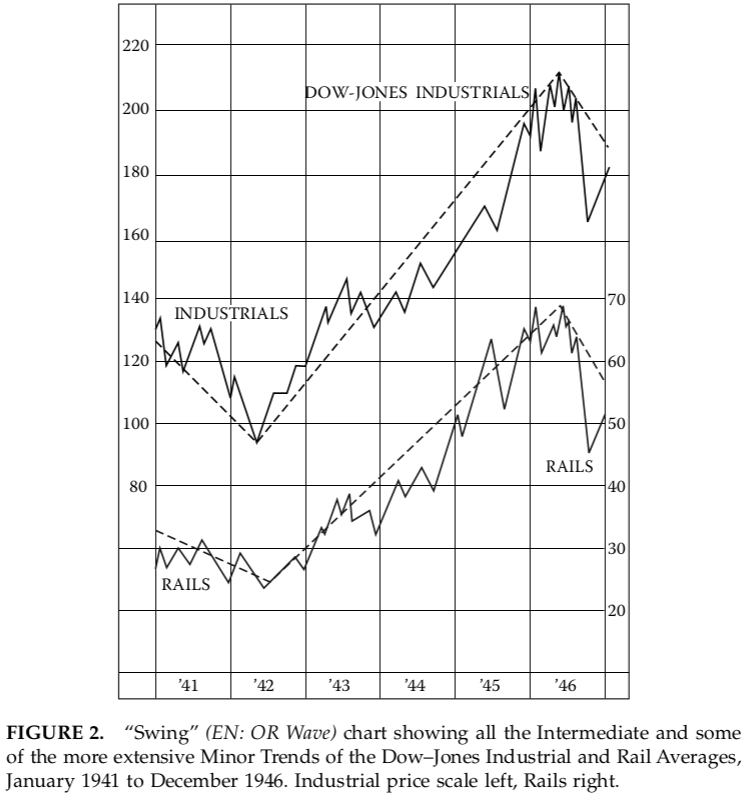

**HÌNH 2.** Biểu đồ “Dao động” _(EN: HOẶC Sóng)_ cho thấy tất cả các
Xu hướng Trung gian và một số Xu hướng Nhỏ mở rộng hơn của các Chỉ
số Công nghiệp và Đường sắt Dow–Jones, từ tháng 1 năm 1941 đến
tháng 12 năm 1946. Thang giá Industrials bên trái, Rails bên phải.

##### Phép thử nghiêm trọng đầu tiên

Vài tháng tiếp theo sẽ đặc biệt thú vị đối với chúng ta để lần theo bởi vì
chúng đặt Lý thuyết Dow vào một phép thử thực sự. Hình 3 cho thấy biên độ
giao dịch hàng ngày và giá đóng cửa của hai Chỉ số cũng như tổng khối
lượng thị trường hàng ngày trong 7 tháng từ ngày 1 tháng 2 đến ngày
31 tháng 8 năm 1941. Tuy nhiên, trước khi chúng ta xem xét chi tiết,
trước hết hãy cùng điểm lại tình hình vào ngày 14 tháng 2. Các mức đáy
của Thị trường Gấu cho đến thời điểm đó đã được ghi nhận vào tháng
Năm–tháng Sáu năm 1940. Sau đó, một Đợt phục hồi Trung gian kéo dài
đã đẩy Chỉ số Công nghiệp tăng 26,28 điểm và Chỉ số Đường sắt tăng
8,15 điểm. Tiếp theo là một đợt suy giảm kéo dài 3 tháng với mức giảm
lần lượt là 20,46 và 3,75 điểm, và đợt giảm này, nhân tiện, đã bao gồm
ba Sóng Nhỏ được xác định rõ ràng. Xét về thời gian, và về mức độ
thay đổi giá so với nhịp dao động trước đó — 46% đối với Rails và gần
78% đối với Industrials — nhịp giảm này đủ điều kiện được xem là một
Xu hướng Trung gian, và lúc này giá đang quay đầu tăng trở lại. Các
nhà lý thuyết Dow đã ở trong trạng thái cảnh giác. Nếu cả hai Chỉ số
có thể tiếp tục tăng lên các mức cao hơn giá đóng cửa đỉnh của tháng
Mười Một trước đó (138,12 và 30,29), thì hành động đó sẽ cấu thành
một tín hiệu của một Thị trường Bò Sơ cấp mới, và việc tái đầu tư các
nguồn vốn đã rút khỏi cổ phiếu vào tháng 5 năm 1940 sẽ ngay lập tức
trở nên cần thiết. Đồng thời, khi đó cũng sẽ cần phải quay lại và
đánh dấu các mức đáy tháng Năm–tháng Sáu năm 1940 là sự kết thúc
của một Thị trường Gấu, đợt tăng lên tháng Mười Một là Nhịp Sơ cấp
đầu tiên trong Thị trường Bò mới, và đợt giảm xuống tháng Hai là
Nhịp Thứ cấp đầu tiên của nó.

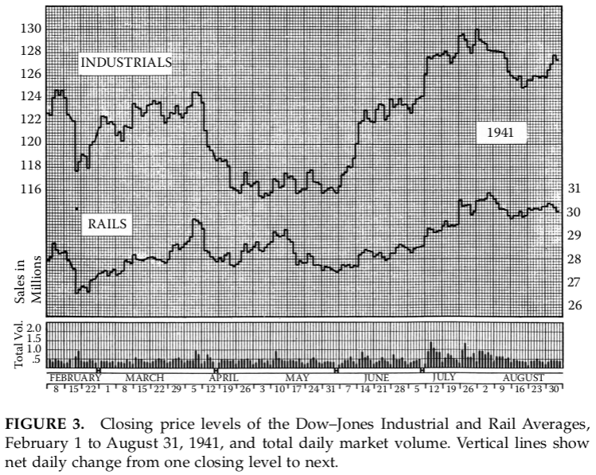

**HÌNH 3.** Các mức giá đóng cửa của các Chỉ số Công nghiệp và Đường sắt
Dow–Jones, từ ngày 1 tháng 2 đến ngày 31 tháng 8 năm 1941, và tổng
khối lượng thị trường hàng ngày. Các đường thẳng đứng cho thấy mức
thay đổi ròng hàng ngày từ một mức đóng cửa sang mức kế tiếp.

Sự điều chỉnh. Nhưng hãy lưu ý rằng Quy tắc 12 của chương trước
của chúng ta được áp dụng ở đây; giả định vẫn là đó đang là một
Thị trường Gấu cho đến khi xuất hiện một tín hiệu rõ ràng ngược lại.
Giờ hãy quay lại Hình 3 và xem điều gì thực sự đã xảy ra.
Industrials đã hồi phục trong 6 tuần, đạt mức 124,65 vào ngày 3
tháng 4. Rails tăng lên 29,75 vào cùng ngày, ghi nhận mức tăng theo
tỷ lệ phần trăm gấp đôi so với Industrials, nhưng cả hai Chỉ số vẫn
ở dưới các mức đỉnh của tháng Mười Một. Sau đó, Industrials trượt
giảm trong vòng 2 tuần, phá vỡ xuống dưới mức đáy tháng Hai và trôi
xuống để đóng cửa tại 115,30 vào ngày 1 tháng 5. Do đó, Chỉ số này
vẫn đang ở trong một Xu hướng Giảm Trung gian. Nhưng trong khi đó,
Rails lại đang thể hiện một kiểu diễn biến khác. Chúng giảm trở lại
từ đỉnh ngày 3 tháng 4 trong 2 tuần, nhưng giữ được ở mức 27,72,
tăng trở lại mạnh mẽ rồi sau đó lại bị bán ra xuống 27,43 vào ngày
31 tháng 5. Bức tranh lập tức trở nên còn thú vị hơn nữa. Ở đây đã
xuất hiện một Sự phân kỳ giữa hai Chỉ số, một sự không xác nhận;
Rails, sau hai cơ hội, đã từ chối xác nhận Industrials trong xu
hướng giảm của Chỉ số sau.

##### Sự không xác nhận

Khi giá bắt đầu vận động đi lên vào tháng Sáu, nhiều nhà bình luận đã
chộp lấy “sự không xác nhận” này như một điềm báo mang tính Bò và
những kẻ suy nghĩ theo mong muốn lại một lần nữa nói về Thị trường
Bò. Có một khuynh hướng đáng tiếc trong “Phố Wall” là thổi phồng quá
mức bất kỳ sự phân kỳ nào như vậy, đặc biệt là khi nó có thể bị uốn
nắn thành một dấu hiệu thuận lợi. Sự thật là, trong Lý thuyết Dow,
việc một Chỉ số từ chối xác nhận Chỉ số kia không bao giờ có thể tạo
ra một tín hiệu tích cực dưới bất kỳ hình thức nào. Nó chỉ mang các
hàm ý tiêu cực. Các sự phân kỳ đôi khi xuất hiện tại các điểm Đảo
chiều trong Xu hướng Lớn — đã có một số trường hợp trong lịch sử
thị trường, trong đó, có lẽ, trường hợp đáng chú ý nhất đã xảy ra từ
rất lâu trước đây vào các năm 1901 và 1902, và chúng ta sẽ sớm xem
xét thêm một trường hợp khác — nhưng chúng cũng xảy ra với tần suất
tương đương vào những thời điểm khi không có sự Đảo chiều Lớn nào
đang hình thành, và trường hợp mà chúng ta đang bàn ở đây thuộc về
loại thứ hai.

Vì vậy, tình hình vào cuối tháng Năm năm 1941, đối với nhà lý thuyết
Dow, xét trên phương diện Xu hướng Lớn, hoàn toàn giống hệt như nó
đã từng là vào ngày 14 tháng 2. Đợt hồi tháng Sáu–tháng Bảy đạt đỉnh
ở Rails tại 30,88 vào ngày 1 tháng 8, và ở Industrials tại 130,06
vào ngày 28 tháng 7 (hãy so sánh các con số này với các mức đỉnh
tháng Mười Một năm 1940 của chúng), và sau đó giá đã giảm với tốc
độ ngày càng nhanh, tạm thời đạt đến cao trào trong Cơn hoảng loạn
“Trân Châu Cảng”. Điều này đã kéo Chỉ số Công nghiệp xuống dưới mức
đáy Thị trường Gấu trước đó của nó (111,84 vào ngày 10 tháng 6 năm
1940), mặc dù Rails, một lần nữa, lại không đi theo. Tuy nhiên, vào
thời điểm này, chúng đã phá vỡ xuống dưới mức đáy Trung gian trước
đó của mình (ngày 14 tháng 2) với một biên độ đáng kể.

Giai đoạn quan trọng tiếp theo bắt đầu vào tháng Tư năm 1942. Chúng
ta có thể bỏ qua bất kỳ biểu đồ chi tiết nào của các tháng giữa tháng
Mười Hai và tháng Tư bởi vì chúng không đặt ra vấn đề nào đối với
Lý thuyết Dow. Sau một Đợt hồi Nhỏ ở Rails vào tháng Giêng, giá đơn
giản là trôi xuống thấp dần, nhưng ngày càng trở nên rõ ràng rằng
khối lượng giao dịch không mở rộng trong các nhịp giảm (các Đợt
giảm Nhỏ). Áp lực bán tháo đang cạn kiệt; các phòng họp hội đồng
trống rỗng khách hàng; bầu không khí là điển hình cho các giai đoạn
cuối cùng của một Thị trường Gấu.

Hình 4 cho thấy diễn biến hàng ngày của các Chỉ số từ ngày 2 tháng 3
đến ngày 31 tháng 10 năm 1942. Các mức đáy mới (kể từ năm 1940) đã
được ghi nhận ở cả hai vào cuối tháng Tư, tại 23,72 vào ngày 24
tháng 4 ở Rails và tại 92,92 vào ngày 28 tháng 4 ở Industrials. Ngay
sau đó, một Sự phân kỳ đáng chú ý đã phát triển, khi, sau khi chỉ
hồi phục trong 7 ngày, Chỉ số Đường sắt bắt đầu trượt giảm trong khi
Chỉ số kia tiếp tục đi lên. Hoạt động giao dịch vẫn duy trì ở mức
thấp (thực tế là không có sự gia tăng khối lượng kéo dài cho đến
cuối tháng Chín). Vào ngày 1 tháng 6, Rails giảm xuống một mức đáy
mới khác và vào ngày mùng 2 đóng cửa tại 23,31. Vào ngày 22 tháng 6,
trông có vẻ như Industrials sắp bị kéo xuống trở lại, nhưng chỉ vài
ngày sau đó, đợt hồi tốt nhất trong nhiều tháng đã bắt đầu, đưa
Industrials lên các mức cao mới và phục hồi nhiều hơn toàn bộ mức
giảm của giai đoạn tháng Tư–tháng Năm ở Rails. Hoạt động giao dịch
cũng tăng tốc trong thời gian ngắn, với một ngày ghi nhận khối
lượng quay vòng lớn hơn bất kỳ phiên giao dịch nào mà thị trường
đã có kể từ đầu tháng Giêng. _EN9: Hãy lưu ý dấu hiệu cảnh báo này.
Tiếng chuông của một chiếc đồng hồ báo thức._

##### Các dấu hiệu của một bước ngoặt lớn

Một lần nữa, các nhà lý thuyết Dow lại ở trong trạng thái cảnh giác cao độ.
Một đợt tăng có quy mô Trung gian rõ ràng đang diễn ra. Cho đến khi được
chứng minh là ngược lại, nó buộc phải được gắn nhãn là một Nhịp Thứ cấp
trong Thị trường Gấu vốn vẫn được giả định là đang tồn tại,

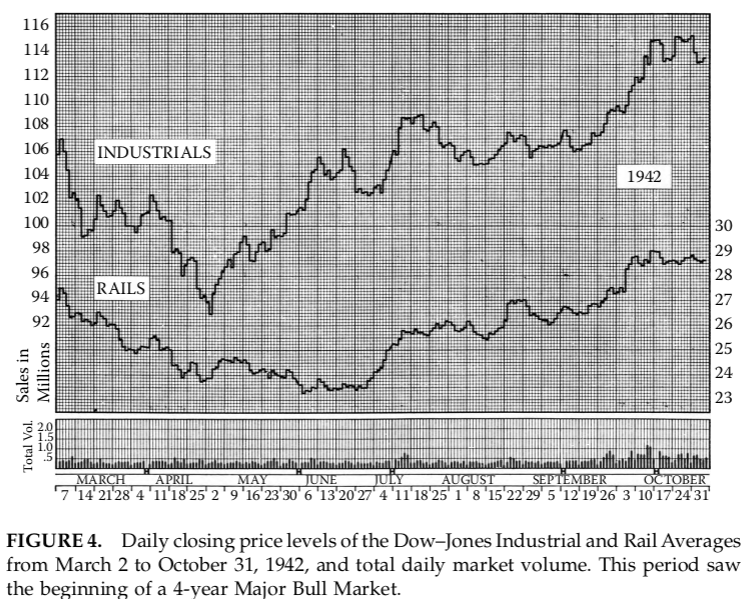

**HÌNH 4.** Các mức giá đóng cửa hàng ngày của các Chỉ số Công nghiệp và
Đường sắt Dow–Jones từ ngày 2 tháng 3 đến ngày 31 tháng 10 năm 1942,
và tổng khối lượng thị trường hàng ngày. Giai đoạn này đã chứng kiến
sự khởi đầu của một Thị trường Bò Lớn kéo dài 4 năm.

nhưng Xu hướng Giảm Lớn đó đến lúc này đã kéo dài gần 3 năm — gần
bằng bất kỳ xu hướng nào từng được ghi nhận — và nhịp giảm cuối
cùng của nó đã không cho thấy bất kỳ áp lực bán nào, đơn giản chỉ là
một sự trôi dạt buồn tẻ. Nhịp Thứ cấp được giả định này có thể hóa ra,
thay vào đó, là một Nhịp Sơ cấp mới; những hy vọng về một kết cục như
vậy đã từng bị dập tắt 12 tháng trước đó trong những hoàn cảnh phần
nào tương tự, nhưng lần này giá thấp hơn và thị trường có một “cảm
giác” khác. Tin tức chung hầu như không mang lại sự khích lệ nào,
nhưng Lý thuyết Dow không quan tâm đến bất kỳ tin tức nào khác ngoài
những tin tức do chính thị trường tạo ra (thứ vốn chiết khấu mọi loại
tin tức khác). Trong mọi trường hợp, không có gì để làm ngoài việc
chờ đợi và quan sát — hãy để thị trường, theo thời gian và cách thức
của riêng nó, tự trình bày lập luận của mình.

Vào đầu tháng Bảy, Industrials bắt đầu “đánh dấu thời gian”; trong
11 tuần, chúng dao động trong một biên độ 5 điểm, xây dựng một
Dow Line điển hình mà từ đó chúng bứt phá lên phía trên vào cuối
tháng Chín. Rails cũng đẩy lên một mức đỉnh mới cho nhịp tăng vào
cùng thời điểm, và đến ngày 2 tháng 11, cả hai Chỉ số đều đã vượt
qua các Đỉnh hồi của tháng Giêng trước đó. Ở giai đoạn này, một số
nhà lý thuyết Dow sẵn sàng tuyên bố rằng một Thị trường Bò đã được
báo hiệu. Các lập luận của họ, ngoài các điểm mang tính phi kỹ thuật
hoặc không liên quan gì đến Lý thuyết Dow, là:

1. Mức khối lượng đặc biệt thấp tại đáy tháng Tư–tháng Sáu, điển hình
   cho sự kết thúc của một Nhịp Gấu. (Đúng và có sức thuyết phục.)
2. Chỉ số Đường sắt đã từ chối đi theo Industrials xuống các vùng đáy
   Lớn mới vào thời điểm đó. Nó đã giữ được trên mức đóng cửa của
   tháng Năm năm 1940. (Cũng đúng, nhưng ý nghĩa thì đáng nghi vấn.
   Sẽ nói thêm về điều này sau.)
3. Industrials đã xây dựng một Line và bứt phá lên khỏi nó. (Lại đúng,
   nhưng Line này có phần hơi ngắn để có thể, ngoài mọi nghi ngờ,
   mang tầm quan trọng lớn.)
4. Chỉ số Đường sắt trong 4 tháng đã tạo ra liên tiếp các Đỉnh và Đáy
   Nhỏ cao dần. (Điều này cũng đúng nhưng không cho phép phân biệt
   một cách dứt khoát với một Nhịp Thứ cấp của Thị trường Gấu.)

Những nhà lý thuyết Dow thận trọng hơn thì vẫn chưa bị thuyết phục.
Họ cho rằng xu hướng tăng này vẫn chưa trải qua phép thử — chắc
chắn sẽ xảy ra sớm hay muộn — của một Nhịp Điều chỉnh Trung gian.
Họ thừa nhận rằng bức tranh là rất đáng khích lệ, nhưng đã chỉ ra
thực tế rằng, ngoại trừ Điểm 1, nó không tốt hơn so với tháng Mười
Một năm 1940. Hãy cùng theo dõi 5 tháng tiếp theo. Hình 5 cho thấy
diễn biến thị trường hàng ngày từ ngày 1 tháng 11 năm 1942 đến
ngày 30 tháng 6 năm 1943.

##### Tín hiệu Thị trường Bò

Sau khi đạt mức 29,28 tại giá đóng cửa ngày 2 tháng 11, Rails giảm
gần như theo một đường thẳng trong 6 tuần xuống còn 26,03 vào ngày
14 tháng 12. Chuyển động này, không thể nghi ngờ, được xếp loại là
một nhịp Trung gian về mặt thời gian, và nó đã “nhường lại” hơn một
nửa toàn bộ mức tăng của Chỉ số này kể từ điểm đáy ngày 2 tháng 6.
Tuy nhiên, Chỉ số Công nghiệp đã giữ vững một cách kiên cường
trong một Line hẹp khác suốt tháng Mười Một, tháng Mười Hai, và
tháng Giêng. Kể từ ngày 14 tháng 12, Rails quay đầu đi lên, và cuối
cùng, vào ngày 1 tháng 2 năm 1943, đã đóng cửa tại 29,55, vượt lên
trên Đỉnh Trung gian trước đó là 29,28 được ghi nhận vào tháng
Mười Một trước. Đến lúc đó, Industrials cũng đã tiến vào vùng
giá cao mới. Diễn biến này cuối cùng đã thỏa mãn mọi yêu cầu
nghiêm ngặt nhất của Lý thuyết Dow; một Thị trường Bò Sơ cấp mới
đã chính thức có hiệu lực. Khối lượng giao dịch cũng đã mở rộng
trong mỗi Đợt tăng Nhỏ trong suốt các tháng mùa thu và mùa đông,
nhưng bằng chứng đó là không cần thiết; chỉ riêng hành động giá
đã mang tính kết luận. Rails đã tạo ra chuỗi cần thiết của các Đỉnh
và Đáy Trung gian cao dần. Ở Industrials, các Line đã phục vụ cho
mục đích của lý thuyết như những vật thay thế cho các Nhịp Điều
chỉnh Trung gian.

Giờ đây cần phải gắn lại nhãn cho nhịp tăng từ tháng Tư–tháng Sáu
đến tháng Mười Một năm 1942 như là Nhịp Sơ cấp đầu tiên trong một
Thị trường Bò. Đợt giảm của Rails từ ngày 2 tháng 11 đến ngày 14
tháng 12 giờ được công nhận là Nhịp Thứ cấp đầu tiên trong Xu
hướng Lớn đó.

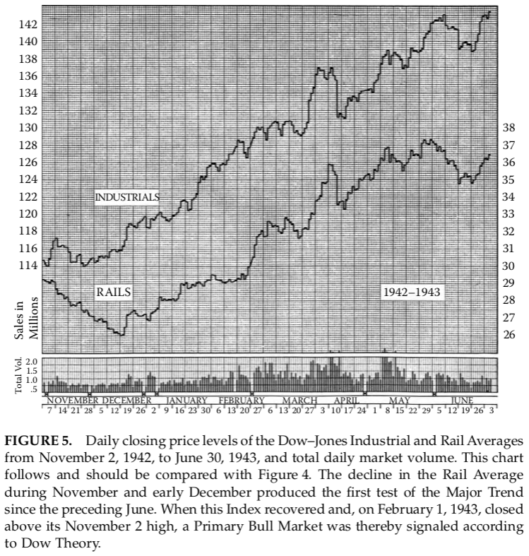

**HÌNH 5.** Các mức giá đóng cửa hàng ngày của các Chỉ số Công nghiệp
và Đường sắt Dow–Jones từ ngày 2 tháng 11 năm 1942 đến ngày 30
tháng 6 năm 1943, và tổng khối lượng thị trường hàng ngày. Biểu đồ
này tiếp nối và nên được so sánh với Hình 4. Đợt giảm của Chỉ số
Đường sắt trong tháng Mười Một và đầu tháng Mười Hai đã tạo ra
phép thử đầu tiên của Xu hướng Lớn kể từ tháng Sáu trước đó. Khi
Chỉ số này phục hồi và, vào ngày 1 tháng 2 năm 1943, đóng cửa
trên mức đỉnh ngày 2 tháng 11 của nó, một Thị trường Bò Sơ cấp
đã được báo hiệu theo Lý thuyết Dow.

Chúng ta có thể quay lại trong chốc lát tại điểm này để bình luận
về diễn biến của Chỉ số Đường sắt vào tháng Sáu năm 1942. Bởi vì
nó khi đó đã giữ được trên mức đáy của tháng Năm năm 1940, một
số nhà bình luận cho rằng Thị trường Bò thực sự lẽ ra nên được
tính bắt đầu từ năm trước đó như là đại diện cho các mức đáy
“được xác nhận” cuối cùng. Điều này, theo chúng tôi, là một sự
bắt bẻ tiểu tiết khá thiếu thực tế. Bất chấp mức cao hơn 1,17
điểm của Chỉ số Đường sắt vào tháng Sáu năm 1942, một Đợt tăng
Bò thực sự đã không bắt đầu cho đến thời điểm đó. Chúng tôi
nghi ngờ rằng trước khi nhiều năm trôi qua, các nhà lý thuyết
Dow sẽ có dịp phải vô cùng hối tiếc về tầm quan trọng đã được
gán cho “sự không xác nhận” của Rails vào mùa xuân năm 1942.

Hãy nhớ rằng, một Sự phân kỳ như vậy không và không thể tạo ra
một tín hiệu tích cực; tại thời điểm nó xảy ra, nó chỉ có thể
phục vụ để phủ định hoặc gieo nghi ngờ lên các hàm ý của Chỉ số
kia; chỉ có hành động tiếp theo theo hướng ngược lại mới có thể
xác lập sự tồn tại của một sự thay đổi xu hướng. Nếu đợt giảm
của Rails vào tháng Năm năm 1942 đã kéo chúng xuống dưới 22,14,
nhưng hành động tiếp theo của chúng vẫn diễn ra đúng theo quỹ
đạo mà trên thực tế nó đã có, từng điểm một nhưng ở một mức
thấp hơn, thì một Tín hiệu Thị trường Bò vẫn sẽ được đưa ra vào
chính xác cùng thời điểm đó, không sớm hơn một ngày và cũng
không muộn hơn một ngày.

Hơn nữa, một Sự phân kỳ không nhất thiết ngụ ý rằng một chuyển
động có hệ quả theo hướng ngược lại sẽ tiếp diễn. Chúng ta đã
xem xét một trường hợp tương tự (vào mùa xuân năm 1941) đã cho
kết quả khác. Về mặt logic, cũng vậy, nếu một sự không xác nhận
như đã xảy ra vào năm 1942 được coi là một chỉ báo của một sự
đảo chiều xu hướng, thì điều đối lập của nó, tức là sự xác nhận
hay tái khẳng định bởi cả hai Chỉ số, cũng nên lập luận với sức
nặng tương đương chống lại một sự đảo chiều xu hướng. Tuy nhiên,
sự thật đơn giản là nhiều Đảo chiều Lớn đã xảy ra khi các Chỉ số
đồng thuận hơn là khi chúng phân kỳ. Chúng tôi không có ý định
nhấn mạnh quá mức điểm này hay lãng phí thời gian của người
đọc, nhưng chúng tôi cảm thấy rằng anh ta nên được cảnh báo
chống lại lối suy nghĩ theo mong muốn mà mọi “sự không xác
nhận” dường như đều khơi gợi khi thị trường đang ở trong một
Xu hướng Gấu.

Quay trở lại với dòng lịch sử của chúng ta, các Chỉ số đã đóng
cửa lần lượt tại 125,88 và 29,51 vào ngày ngay sau Tín hiệu
Thị trường Bò mang tính kết luận của chúng ta vào tháng Hai
năm 1943. Về mặt lý thuyết, đó là nơi mà một nhà đầu tư tuân
thủ nghiêm ngặt Lý thuyết Dow sẽ mua cổ phiếu của mình. (Những
người đã hài lòng rằng Xu hướng Sơ cấp là đi lên vào tháng
Mười Một năm 1942 đã mua với các mức Chỉ số quanh 114,60 và
29,20.) Có lý do để giả định rằng Thị trường Bò này, vốn cho
đến lúc đó mới chỉ thể hiện rất ít các đặc điểm thường thấy
của giai đoạn thứ hai và hoàn toàn chưa có đặc điểm nào của
giai đoạn thứ ba, sẽ còn tiếp tục trong một thời gian nữa.
Bốn tháng tiếp theo không tạo ra diễn biến thị trường nào đòi
hỏi sự chú ý mang tính diễn giải, và chúng ta có thể chuyển
sang các sự kiện của tháng Bảy. Hình 6 ghi lại diễn biến từ
ngày 1 tháng 7 năm 1943 đến ngày 31 tháng 1 năm 1944.

##### Đợt điều chỉnh đầu tiên

Sau khi đóng cửa tại 145,82 vào ngày 14 tháng 7 năm 1943, Chỉ số Công
nghiệp bắt đầu trôi dạt xuống. Rails đẩy lên một mức đỉnh mới (38,30)
mười ngày sau đó, nhưng Industrials từ chối tham gia vào đợt hồi này
và rồi cả hai chỉ số đều sụt giảm mạnh trong 7 phiên. Khối lượng giao
dịch tăng lên và đợt giảm này là lớn nhất đã từng xảy ra trong Thị
trường Bò cho đến thời điểm đó. Nhưng mọi người đều nhận ra rằng
thị trường, sau nhiều tháng tăng tiến khá bền bỉ, đã “xứng đáng có
một đợt điều chỉnh.” Cả về thời gian lẫn mức độ, nhịp giảm này không
thể được xếp loại cao hơn một Xu hướng Nhỏ. Tiếp theo là 3 tháng dao
động rời rạc với rất ít tiến triển ròng ở cả hai Chỉ số. Industrials kéo
lên tới 141,75 vào ngày 20 tháng 9 rồi lại trôi xuống, trong khi Rails
chật vật hồi phục lên 35,53 vào ngày 27 tháng 10. Một đợt sụt giảm
nhanh khác phát triển vào đầu tháng Mười Một, đạt cao trào trong
một cú rũ bỏ với khối lượng cao đã cắt giảm giá trị của Industrials
3,56 điểm và của Rails 1,75 điểm vào ngày 8 tháng 11. Giá hồi lên
một chút rồi lại bị bán ra, chạm các mức đáy mới (kể từ đầu mùa xuân)
vào ngày 30 tháng 11 — Industrials 129,57 và Rails 31,50.

Giờ đây không còn nghi ngờ gì nữa rằng một Nhịp Điều chỉnh Thứ cấp
đầy đủ đã hình thành. Vấn đề đối với các nhà diễn giải Dow là liệu
có điều gì nhiều hơn thế đang diễn ra hay không. Nếu cú giảm đầu
tiên trong tháng Bảy có thể được hiểu là tự thân nó đã là một Xu
hướng Trung gian, và diễn biến từ tháng Tám–tháng Mười là một Nhịp
Trung gian khác, thì cú sụt tháng Mười Một sẽ báo hiệu một Thị
trường Gấu. Trên thực tế, theo như chúng tôi biết, không có nhà lý
thuyết Dow nào đã xem xét một cách nghiêm túc cách diễn giải như
vậy. Cú sụt tháng Bảy, như đã nói, không đủ điều kiện là một nhịp
Trung gian cả về thời gian lẫn số điểm hồi lại; toàn bộ chuyển động
từ tháng Bảy đến tháng Mười Một năm 1943 phải được coi là một khối
thống nhất, tất cả chỉ là một Nhịp Điều chỉnh Thứ cấp. Phép thử
Xu hướng Lớn thực sự sẽ đến trong đợt tăng tiếp theo, bất cứ khi
nào nó hình thành; nếu đợt tăng đó không vượt được các đỉnh tháng
Bảy, và giá sau đó lại giảm xuống các mức đáy mới, thì quả thực
một Thị trường Gấu sẽ có hiệu lực.

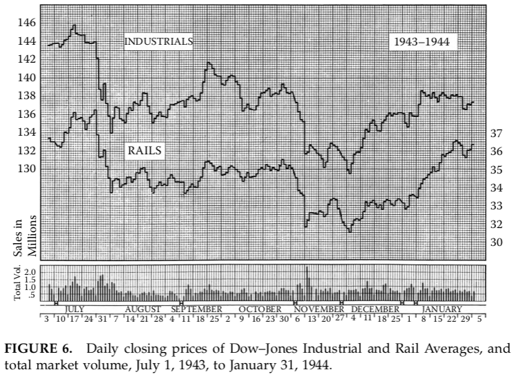

**HÌNH 6.** Giá đóng cửa hàng ngày của các Chỉ số Công nghiệp và Đường
sắt Dow–Jones, và tổng khối lượng thị trường, từ ngày 1 tháng 7
năm 1943 đến ngày 31 tháng 1 năm 1944.

Quyết định đã bị trì hoãn trong một thời gian dài. Giá lại bắt đầu
đi lên, nhưng đà tăng của Industrials thì chậm chạp và miễn cưỡng.
Rails tiến lên nhanh hơn và vượt qua Đỉnh tháng Bảy của mình vào
ngày 17 tháng 2 năm 1944, tiếp tục lên tới một Đỉnh Nhỏ tại 40,48
vào ngày 21 tháng 3. Chỉ số Công nghiệp đạt tới 141 vào ngày 13
tháng 3, nhưng vẫn thấp hơn gần 5 điểm so với mức “tín hiệu” của
nó, rồi chùn lại và giảm trở xuống. Đây là một trường hợp nổi bật
khác của “sự không xác nhận.” Đối với những người chọn gán cho
những diễn biến như vậy một ý nghĩa nghiêm trọng, nó chỉ có thể
mang một hàm ý cực kỳ Gấu. Nhưng trên thực tế, tất cả những gì
nó có nghĩa là việc tiếp diễn của Nhịp Bò Sơ cấp vẫn chưa được
xác nhận. Chỉ khi cả hai Chỉ số giờ đây đều giảm và đóng cửa dưới
các mức đáy tương ứng của ngày 30 tháng 11 thì mức đỉnh mới do
chỉ riêng Rails ghi nhận vào tháng Hai mới phải bị bỏ qua và một
Thị trường Gấu Sơ cấp mới được tuyên bố. Nói ngắn gọn, tình hình
vào cuối tháng Ba, xét về các hàm ý đối với Xu hướng Lớn, không
khác gì so với đầu tháng Giêng trước khi Rails bứt phá lên.

##### Xu hướng Bò được tái khẳng định

Tình hình vẫn còn trong trạng thái nghi vấn (nhưng luôn luôn chịu
sự chi phối của giả định cơ bản của Lý thuyết Dow mà chúng tôi đã
nêu là Số 12 trong chương trước) cho đến ngày 15 tháng 6 năm
1944, khi Industrials cuối cùng cũng bứt phá để đóng cửa tại
145,86. Họ đã mất 4 tháng để xác nhận Rails, và gần tròn một năm
để tái khẳng định Xu hướng Tăng Sơ cấp. Tác động của “tín hiệu”
này đối với các nhà giao dịch là mang tính điện giật; khối lượng
giao dịch tăng thêm 650.000 cổ phiếu vào ngày hôm sau khi giá
tăng thêm trọn vẹn một điểm nữa.

Mười hai tháng tiếp theo không cần thảo luận chi tiết vì chúng
không tạo ra bất cứ điều gì trong hành động thị trường khiến một
nhà lý thuyết Dow phải bận tâm. Giá trôi xuống một cách không đều
trong 9 tuần sau giữa tháng Bảy nhưng mức suy giảm ròng của chúng
chỉ ở quy mô nhỏ, và sau đó chúng leo lên với chỉ những gián đoạn
ngắn ngủi tới 169,08 trên Chỉ số Công nghiệp vào ngày 29 tháng 5
năm 1945, và 63,06 trên Chỉ số Đường sắt vào ngày 26 tháng 6 năm
1945. Chúng ta nên nhìn lướt qua giai đoạn tiếp theo, không phải
vì nó minh họa điều gì mới trong nghiên cứu của chúng ta, mà bởi
vì nó bao trùm sự đầu hàng của Nhật Bản và sự kết thúc giao tranh
trong Chiến tranh Thế giới thứ Hai.

Hình 7 bao quát 7 tháng từ ngày 1 tháng 5 đến ngày 30 tháng 11
năm 1945. Industrials giữ ổn định trong 4 tuần trong khi Rails
đang tăng vọt lên Đỉnh ngày 26 tháng 6 của mình. Vào ngày 28
tháng 6, khi không có gì trong các tiêu đề báo chí để giải thích
cho sự thay đổi xu hướng đột ngột như vậy, giá đã sụt giảm mạnh
và khối lượng giao dịch leo lên gần ba triệu cổ phiếu, tổng khối
lượng trong một ngày cao nhất của Thị trường Bò cho đến thời
điểm đó. Nhưng sau đó Chỉ số Công nghiệp chỉ nhượng bộ một cách
miễn cưỡng, và đến ngày 26 tháng 7, tại mức 160,91, nó mới chỉ
mất chưa tới 5% so với mức đỉnh của mình. Tuy nhiên, Rails lại
rơi mạnh rất nhanh. Bom Hiroshima được thả vào ngày 5 tháng 8
và Nhật Bản đầu hàng vào ngày 14. Industrials lúc này đang hồi
lên từ mức đáy ngày 26 tháng 7 của mình, nhưng Rails thì không
thể giữ được và lại lao xuống, cuối cùng chạm đáy (cho nhịp
này) vào ngày 20 tháng 8 tại 51,48, với mức mất hơn 18% giá trị
đỉnh tháng Sáu của chúng.

##### Rails chững lại

Trước khi tiếp tục xem xét diễn biến thị trường tại đây, thật thú vị khi
lưu ý rằng, cho tới thời điểm này, Chỉ số Đường sắt đã là “nhân vật
anh hùng” trong câu chuyện của chúng ta. Bắt đầu từ việc nó từ chối
giảm xuống một mức đáy Thị trường Gấu mới vào tháng Sáu năm 1942,
nó đã là mũi nhọn của mỗi đợt tăng quan trọng, tạo ra những cú hồi
ngoạn mục nhất, và tăng 170% về giá trị so với mức 82% của
Industrials. Nhìn lại, lời giải thích là điều hiển nhiên: các công ty
đường sắt là những bên hưởng lợi kinh doanh chủ chốt của chiến
tranh. Họ thu lợi nhuận dồi dào, trả bớt nợ nần, và giảm các chi phí
cố định với tốc độ chưa từng thấy trong thế hệ này (và có lẽ sẽ
không bao giờ lặp lại). Trong khi con mắt của “công chúng” tập
trung vào các “ngành công nghiệp chiến tranh” truyền thống và
được quảng bá rộng rãi hơn, thì thị trường đã bắt đầu, ngay từ
sau Trân Châu Cảng, đánh giá một cách khôn ngoan và chiết khấu
trước vụ mùa lợi nhuận chưa từng có này của ngành Đường sắt.
Nhưng từ đây trở đi, bức tranh thay đổi và Rails trở thành kẻ tụt
hậu. Giờ đây nhìn lại, cũng hiển nhiên không kém rằng, với sự
khôn ngoan tương tự, thị trường đã bắt đầu từ tháng Bảy năm 1945
để chiết khấu trước một sự thay đổi trong vận mệnh của họ. Một
minh họa sáng tỏ cho giả định cơ bản (Nguyên lý số 1) của Lý
thuyết Dow!

**HÌNH 7.** Mức giá đóng cửa hàng ngày của các Chỉ số Công nghiệp và
Đường sắt Dow–Jones từ ngày 1 tháng 5 đến ngày 30 tháng 11 năm
1945, và tổng khối lượng giao dịch hàng ngày của thị trường. Giai
đoạn này, chứng kiến sự kết thúc của Chiến tranh Thế giới thứ Hai,
chỉ tạo ra một Nhịp Điều chỉnh Thứ cấp vừa phải trong Thị trường
Bò Sơ cấp, vốn đã kéo dài được 3 năm kể từ khi khởi đầu vào
tháng Tư/Tháng Sáu năm 1942.

Quay lại với biểu đồ của chúng ta, giá bắt đầu đẩy lên trở lại với
sức sống mới sau ngày 20 tháng 8. Cả hai Chỉ số đều đã trải qua
một Nhịp Điều chỉnh Thứ cấp và giờ đây các nhà lý thuyết Dow
phải theo dõi sát sao để xem liệu Xu hướng Tăng Sơ cấp có được
tái khẳng định một lần nữa bằng việc cả hai cùng lập đỉnh mới
hay không. Industrials đã “đạt chuẩn” khi đóng cửa tại 169,89
vào ngày 24 tháng 8, nhưng Rails còn rất nhiều quãng đường
phải lấy lại và liên tục gặp phải lực cung khi tiến lên, lần lượt
chạm tới từng mức Đáy Nhỏ của xu hướng giảm tháng Sáu–
tháng Tám (một hiện tượng mà chúng ta sẽ dành sự chú ý sau
này trong chương về Hỗ trợ và Kháng cự). Mãi tới đầu tháng
Mười Một năm 1945, họ mới có thể xác nhận tín hiệu của
Industrials bằng cách đóng cửa trên mức 63,06. Tại thời điểm
này, các Chỉ số lại một lần nữa tuyên bố rằng Thị trường Bò
Sơ cấp vẫn còn hiệu lực. Lúc này nó đã kéo dài được ba năm
rưỡi — lâu hơn hầu hết các Thị trường Bò, và các dấu hiệu
“giai đoạn ba” đang xuất hiện nhanh chóng. Công chúng mua
vào, các phòng môi giới đông nghịt, tin tức thị trường chứng
khoán xuất hiện trên trang nhất ngay cả của các tờ báo ở
thành phố nhỏ, “chó mèo” cũng được hò hét lao vào, kinh
doanh thì bùng nổ.

Với cả hai Chỉ số đều đang ở vùng đỉnh mới và Thị trường Bò
được tái khẳng định, tất cả các mức đáy trước đó giờ đây đều
có thể bị bỏ qua. Chẳng hạn, mức Đáy 160,91 ngày 26 tháng 7
của Industrials và mức 51,48 ngày 20 tháng 8 của Rails không
còn ý nghĩa nào thêm trong Lý thuyết Dow. Đây là một điểm
chúng ta chưa nhấn mạnh trước đây, nhưng nó rất quan trọng.
Thực vậy, nó có thể được bổ sung vào bộ quy tắc ở chương
trước nếu như nó không vốn đã hàm chứa trong các nguyên
lý cơ bản. Một khi Xu hướng Sơ cấp đã được xác nhận hoặc
tái xác nhận, quá khứ bị lãng quên và mọi thứ đều phụ thuộc
vào hành động trong tương lai. Vào cuối năm 1945, với các
triệu chứng “giai đoạn ba” lan tràn, diễn biến của thị trường
phải được theo dõi với sự cảnh giác gấp đôi. Giai đoạn ba có
thể kéo dài thêm 2 năm nữa (như đã xảy ra từ 1927 đến 1929)
hoặc có thể kết thúc vào bất cứ lúc nào. Biểu đồ tiếp theo của
chúng ta (Hình 8) đưa chúng ta đi qua tới tháng Năm năm 1946.

##### Mùa xuân năm 1946

Thị trường trải qua một Đợt Lùi Nhỏ vào cuối tháng Mười Hai,
một diễn biến đã trở thành khuôn mẫu bình thường cho tháng
này và thường được quy cho “bán vì mục đích thuế” — rồi lại
xông lên mạnh mẽ trong tháng Giêng năm 1946. Khối lượng
giao dịch hàng ngày vào ngày 18 tháng 1 vượt quá 3 triệu cổ
phiếu lần đầu tiên trong hơn 5 năm. Trong tuần đầu của tháng
Hai, giá “xoay vòng” với rất ít thay đổi ròng. Các mức đóng
cửa cao nhất trong giai đoạn này được ghi nhận ở Chỉ số
Đường sắt tại 68,23 vào ngày 5 tháng 2, và ở Chỉ số Công
nghiệp tại 206,97 vào ngày 2 tháng 2. Vào ngày 9 tháng 2,
cả hai bắt đầu trượt xuống, điều chỉnh mạnh từ ngày 13 đến
16, rồi sau đó gãy xuống trong một làn sóng bán tháo đạt
cao trào vào ngày 26 tháng 2 với các mức đóng cửa lần
lượt là 60,53 và 186,02. Mức sụt giảm của Industrials là
lớn nhất tính theo số điểm (20,95) mà họ phải chịu trong
suốt toàn bộ Thị trường Bò; ở Rails, nó chỉ bị vượt qua
bởi cú giảm tháng Bảy–tháng Tám của năm trước. Nó
tương đương với hơn 10% ở chỉ số thứ nhất và 11% ở
chỉ số thứ hai, và xóa đi chưa tới một nửa mức tăng của
chúng kể từ các đáy mùa hè năm 1945. Đợt giảm này đã
kéo dài được 3 tuần tính đến ngày 26 tháng 2. Nó là một
nhịp Trung gian không thể tranh cãi — trong Lý thuyết
Dow, đó là một Nhịp Điều chỉnh Thứ cấp, theo giả định
nằm trong Xu hướng Lớn đang tồn tại.

Các rắc rối lao động đã bám riết các ngành thép và xe hơi
trong năm 1946 ngay từ đầu tháng Giêng, và một cuộc
đình công than đá đang lờ mờ hiện ra. Cú sụt tháng Hai
được quy cho những diễn biến tin tức đó, nhưng nguyên
nhân chi phối nhiều khả năng là việc chấm dứt giao dịch
ký quỹ. Cục Dự trữ Liên bang đã thông báo vào tháng
Giêng rằng sau ngày 1 tháng 2, cổ phiếu chỉ có thể được
mua bằng tiền mặt đủ 100%. Cú bứt lên cuối tháng Giêng
được đặc trưng bởi “nhà đầu tư nhỏ lẻ” chớp lấy cơ hội
cuối cùng để mua bằng ký quỹ. (Những ai tham gia vào
cuộc tranh giành này hẳn sẽ còn hối tiếc trong một thời
gian dài.) Giới chuyên nghiệp đã chớp lấy cơ hội để xả
các vị thế giao dịch của mình, nhưng “nhà đầu tư nhỏ lẻ”
giờ đây tạm thời đã cạn vốn; tài khoản môi giới của anh
ta nhanh chóng bị “đóng băng.”

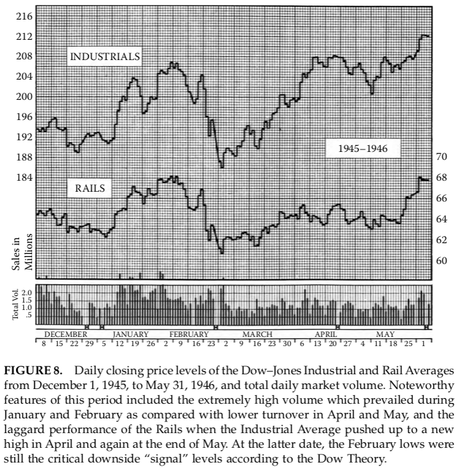

**HÌNH 8.** Mức giá đóng cửa hàng ngày của các Chỉ số Công nghiệp và
Đường sắt Dow–Jones từ ngày 1 tháng 12 năm 1945 đến ngày 31
tháng 5 năm 1946, và tổng khối lượng giao dịch hàng ngày của thị
trường. Những đặc điểm đáng chú ý của giai đoạn này bao gồm
khối lượng cực kỳ cao trong tháng Giêng và tháng Hai so với mức
thấp hơn vào tháng Tư và tháng Năm, và sự vận động tụt hậu của
Rails khi Chỉ số Công nghiệp đẩy lên mức đỉnh mới vào tháng Tư
và một lần nữa vào cuối tháng Năm. Ở thời điểm sau, các mức
đáy tháng Hai vẫn là các mức “tín hiệu” phía dưới mang tính
then chốt theo Lý thuyết Dow.

Xét trong hoàn cảnh đó, khi nhìn lại, thật đáng kinh ngạc là
một cơn Hoảng loạn lan rộng hơn đã không xảy ra.

Nhưng nhà lý thuyết Dow không bận tâm tới nguyên nhân.
Thị trường Bò đã được tái khẳng định bởi cả hai Chỉ số
vào đầu tháng Hai, hủy bỏ mọi mức “tín hiệu” trước đó.
Các lực lượng Bò rõ ràng vẫn còn hiệu lực bởi vì các đáy
ngày 26 tháng 2 đã trụ vững và giá bắt đầu hồi phục.
Industrials hồi lại nhanh chóng, và đến ngày 9 tháng 4
đã đóng cửa ở vùng đỉnh mới tại 208,03. Rails thì kéo
lê phía sau. Khi thị trường cho thấy dấu hiệu suy yếu
vào cuối tháng Tư, Chỉ số Đường sắt vẫn còn thấp hơn
gần 5 điểm so với mức đỉnh đầu tháng Hai của mình.
Liệu đây có phải là một “sự không xác nhận” nữa đáng
để lo ngại hay không?

##### Cú Thúc Đẩy Tăng Cuối Cùng

Các mức đáy cuối tháng Hai lúc này trở thành những điểm then chốt
ở phía dưới; nếu cả hai Chỉ số cùng giảm xuống dưới các mức đóng
cửa Đáy Trung gian đã được ghi nhận khi đó, trước khi Rails có thể
lập một đỉnh mới cao hơn 68,23 (trong trường hợp ấy, Tín hiệu
Tăng của Industrials sẽ bị hủy bỏ), thì một Thị trường Gấu sẽ
được phát tín hiệu. Nhưng, bất chấp một cuộc đình công của thợ
mỏ và nguy cơ đình công cận kề của công nhân đường sắt, thị
trường đã trở nên vững chắc trở lại vào giữa tháng Năm và tạo ra
một đợt hồi đáng ngạc nhiên, cuốn Chỉ số Công nghiệp lên tới
212,50 vào ngày 29 tháng 5 năm 1946 — một đỉnh Bò mới cao
hơn gần 6 điểm. Trong tháng Năm, Rails chỉ hụt 0,17 điểm so
với việc san bằng mức đóng cửa đỉnh tháng Hai của mình, trượt
lùi nhẹ, rồi cuối cùng bứt qua vào ngày 13 tháng 6 để đóng cửa
tại 68,31, qua đó xác nhận Industrials trong tuyên bố rằng (tính
tới thời điểm đó) Xu hướng Sơ cấp vẫn đang đi lên. Các mức đáy
tháng Hai (186,02 và 60,53) giờ đây không còn mang ý nghĩa
nào trong Lý thuyết Dow, nhưng hãy ghi nhớ các con số ấy vì
chúng sẽ liên quan tới một cuộc tranh luận đã kéo dài nhiều
tháng sau đó giữa các học viên Dow.

Hình 9 chồng lấn lên bức tranh trước, bắt đầu từ diễn biến thị
trường ngày 4 tháng 5 và kéo dài tới ngày 19 tháng 10 năm 1946.
Có thể lưu ý rằng khối lượng giao dịch vào cuối tháng Năm và
đầu tháng Sáu đã không đạt tới mức của cả đỉnh cuối tháng
Giêng–đầu tháng Hai lẫn đáy cuối tháng Hai; thị trường dường
như đang mất dần sinh lực, một biểu hiện đáng lo ngại, dù
chưa hẳn mang tính quyết định. Giá bắt đầu rơi nhanh ngay
sau khi Rails xác nhận vào ngày 13 tháng 6. Industrials hồi
lại trong 2 tuần đầu tháng Bảy, nhưng Rails tiếp tục suy giảm;
Industrials lại gãy xuống vào ngày 15 tháng 7 và hai Chỉ số
tiếp tục trượt cho tới khi đóng cửa tại 195,22 và 60,41 vào
ngày 23 tháng 7.

Tại đó — như sau này được xác nhận — là điểm kết thúc của
Nhịp Trung gian cụ thể ấy — một nhịp mà, phù hợp với Quy
tắc số 12 của chúng ta, buộc phải được gắn nhãn là một Nhịp
Điều chỉnh Thứ cấp trong Thị trường Bò cho tới khi có bằng
chứng ngược lại. Thị trường lại xoay chiều đi lên. Nó leo lên
chậm rãi và đều đặn, nhưng với khối lượng giao dịch thấp hơn
hẳn một triệu cổ phiếu, cho tới đúng 3 tuần sau đó, khi
Industrials ở mức 204,52 (ngày 13 tháng 8) đã lấy lại được
hơn một nửa mức mất mát tháng Sáu–tháng Bảy và Rails ở
63,12 (ngày 14 tháng 8) lấy lại được hơn một phần ba. Như
vậy, đợt tăng này đã đáp ứng các yêu cầu tối thiểu của một
Xu hướng Trung gian. Nếu giá có thể tiếp tục đi lên và cuối
cùng bứt qua các đỉnh tháng Năm–tháng Sáu, thì Xu hướng
Bò Lớn sẽ một lần nữa được tái khẳng định. Nhưng nếu giờ
đây chúng quay đầu giảm và rơi xuống dưới các mức đóng
cửa ngày 23 tháng 7, thì hành động đó sẽ phát tín hiệu cho
một sự Đảo chiều của Xu hướng Sơ cấp.

**HÌNH 9.** Mức giá đóng cửa hàng ngày của các Chỉ số Công
nghiệp và Đường sắt Dow–Jones từ ngày 4 tháng 5 đến ngày
19 tháng 10 năm 1946, cùng với tổng khối lượng giao dịch
hàng ngày của thị trường. Biểu đồ này chồng lấn lên Hình 8.
So sánh mức giá đóng cửa của Chỉ số Đường sắt vào ngày
13 tháng 6 với mức đóng cửa đỉnh của nó ngày 5 tháng 2.
Diễn biến tháng Sáu này đã làm vô hiệu hóa tầm quan trọng
trước đó, theo Lý thuyết Dow, của các mức đáy tháng Hai.
Lưu ý sự thay đổi đáng kể trong mô hình khối lượng sau
tháng Năm, đặc biệt trong đợt hồi tháng Tám.

##### Tín Hiệu Thị Trường Gấu

Việc tình hình đã trở nên then chốt thể hiện rõ trên biểu đồ
khối lượng. Kể từ cuối tháng Năm, doanh số giao dịch không
chỉ có xu hướng tăng lên trong các đợt giảm mà — điều quan
trọng hơn nhiều — còn cạn kiệt trong các đợt hồi. So sánh
Hình 9 với Hình 7 và 8, bạn có thể thấy hiện tượng này đã
trở nên nổi bật như thế nào vào giữa tháng Tám. Giá thực
sự đã quay đầu giảm, với hoạt động gia tăng trong các nhịp
gãy, và vào ngày 27 tháng 8, các mức đóng cửa 191,04 cho
Industrials và 58,04 cho Rails đã kể một câu chuyện buồn.
Các Chỉ số đã lên tiếng: một Thị trường Bò kéo dài 4 năm
đã kết thúc, và một Thị trường Gấu đang hình thành. Một
nhà đầu tư Dow lẽ ra nên bán toàn bộ cổ phiếu của mình
vào ngày hôm sau (xấp xỉ ở mức 190 và 58 xét theo hai
Chỉ số).

Để làm rõ hồ sơ, lúc này nhà lý thuyết Dow cần quay lại và
đánh dấu các đỉnh ngày 29 tháng 5 và 13 tháng 6 của
Industrials và Rails, tương ứng, là điểm kết thúc của Thị
trường Bò. Đợt giảm tháng Sáu–tháng Bảy khi đó trở thành
Nhịp Sơ cấp đầu tiên trong Xu hướng Gấu mới, và đợt tăng
từ ngày 23 tháng 7 đến 14 tháng 8 trở thành Nhịp Hồi
Thứ cấp đầu tiên trong Xu hướng Giảm Lớn. Một Nhịp
Sơ cấp thứ hai lúc này đang trong quá trình hình thành.

Bạn hẳn đã lưu ý trong phần trình bày trên rằng một Thị
trường Gấu đã được phát tín hiệu ngay khi cả hai Chỉ số
xuyên thủng các mức đáy ngày 23 tháng 7. Giờ hãy quay
lại và xem xét lập luận mà chúng ta đã nhắc tới ở trang
trước. Một số học viên Lý thuyết Dow đã từ chối công nhận
đỉnh mới ngày 13 tháng 6 của Chỉ số Đường sắt là một sự
tái khẳng định mang tính quyết định của Xu hướng Bò.
Theo họ, mức đóng cửa trước đó phải được vượt qua ít
nhất tròn một điểm (1,00) thì mới đủ để xác nhận tín hiệu
đã được Industrials đưa ra; biên độ chỉ 0,08 là không kết
luận được. Nhưng quan điểm này, nếu được chấp nhận,
lại kéo theo những hệ quả logic mà sau đó chứng tỏ là
gây khó xử. Bởi vì, nếu Thị trường Bò chưa được tái
khẳng định vào tháng Sáu, thì các mức then chốt ở phía
dưới vẫn phải là 186,02 của Industrials và 60,53 của
Rails — các đáy ngày 26 tháng 2. Do đó, một Thị trường
Gấu không thể được “tuyên bố” cho tới khi những mức
giá này bị cả hai Chỉ số xuyên thủng. Quan điểm này đã
thu hút một lượng lớn người theo, đặc biệt là những ai
không hứng thú với lý thuyết “bới lông tìm vết” mà muốn
“cho thị trường mọi cơ hội, xét tới các yếu tố cơ bản vẫn
đang cải thiện.”

Dĩ nhiên, thị trường đã tiếp tục phá vỡ các mức đáy tháng
Hai, và tới thời điểm đó thì cơn Hoảng loạn (giai đoạn hai)
đã bùng phát. Rõ ràng, trong trường hợp này, trường phái
chính thống “bất kỳ sự xuyên thủng nào cũng được tính”
đã hoàn toàn chiếm ưu thế; họ đã bán ra ở mức cao hơn ít
nhất 13 điểm xét theo Chỉ số Công nghiệp (và ít nhất 6
điểm ở Rails). Sáu tuần sau, chính xác là vào ngày 9
tháng 10 năm 1946, Nhịp Trung gian Sơ cấp thứ hai này
kết thúc tại Industrials 163,12 và Rails 44,69, và một
Nhịp Hồi Trung gian khác lại bắt đầu.

Trước khi khép lại bản lịch sử kéo dài 6 năm về việc vận
dụng Lý thuyết Dow này, chúng ta có thể lưu ý rằng đỉnh
ngày 13 tháng 6 của Chỉ số Đường sắt cung cấp một minh
họa hoàn hảo cho quy tắc cho rằng một xu hướng có thể
thay đổi vào bất cứ lúc nào sau khi nó đã được xác nhận
hoặc tái khẳng định, đồng thời cũng minh họa cho việc
xác suất tiếp diễn ngày càng suy giảm sau mỗi lần tái
khẳng định Xu hướng Sơ cấp.

# chương 5.  Những Khiếm Khuyết của Lý thuyết Dow

Chúng tôi nghi ngờ rằng các độc giả của mình đã thở phào nhẹ nhõm khi
khép lại chương trước về một chủ đề khó khăn, tẻ nhạt và đôi khi gây
bối rối. Một số người thậm chí có thể ước vào lúc này rằng Lý thuyết
Dow chưa bao giờ được hình thành. Những người khác hẳn đã nhận ra
một hoặc nhiều khiếm khuyết — thực hoặc được cho là — của nó và có
những câu hỏi muốn đặt ra. Trước khi chúng ta chuyển sang các vấn đề
biểu đồ thú vị hơn, tốt hơn hết là dành vài trang để làm sáng tỏ chúng.

Trước hết, hãy xem xét lời buộc tội về việc “đoán ngược lại” (second
guessing) vốn thường xuyên được ném vào các tác giả viết về Lý thuyết
Dow. Đây là một lời buộc tội sẽ còn tiếp tục xuất hiện chừng nào các ý
kiến giữa các nhà lý thuyết Dow vẫn còn khác nhau tại những giai đoạn
then chốt (điều mà, đáng tiếc, lại thường xảy ra). Ngay cả những nhà
phân tích Dow giàu kinh nghiệm và cẩn trọng nhất đôi khi cũng thấy
cần phải thay đổi cách diễn giải của mình khi lập trường ban đầu tỏ ra
không thể bảo vệ được trước một diễn biến tiếp theo nào đó của thị
trường. Họ sẽ không cố phủ nhận điều này — nhưng họ nói rằng, về
lâu dài, một cách đáng ngạc nhiên là rất ít bị mất mát do những cách
diễn giải sai tạm thời như vậy. Nhiều người trong số họ công bố các
bình luận của mình đều đặn và có thể dẫn bạn tới các hồ sơ in ấn về
những quan điểm và lời khuyên đã được đưa ra trước và trong sự kiện,
cũng như sau đó. Còn đối với chương trước của cuốn sách này, người
đọc, nếu muốn kiểm tra các hồ sơ như vậy, sẽ nhận thấy rằng các cách
diễn giải được đưa ra ở đó (ngoại trừ những nhận xét được thực hiện
“nhìn lại” và đã được gắn nhãn như vậy) chính xác là những cách diễn
giải đã được các nhà phân tích Dow uy tín nhất công bố vào thời điểm
xảy ra sự kiện.

_EN9: Trong thời hiện đại, Richard Russell (dowtheoryletters.com) có lẽ
là người cao niên nhất xét về danh tiếng, nhưng còn có rất nhiều nhà
Lý thuyết Dow khác (thực sự thì việc tập hợp họ lại cũng giống như
lùa mèo) đang hoạt động, trong số đó có Jack Schannep
(thedowtheory.com) và Richard Moroney (dowtheory.com) — những
người phải được tính đến khi tham khảo các “xương gà thiêng”.
Robert W. Colby (robertw-colby.com) hiện đang thực hiện những công
trình thú vị về Lý thuyết Dow. Lưu ý rằng chính con gà mới là thiêng,
còn các khúc xương thì chỉ là thứ yếu._

## Lý thuyết Dow “Quá Muộn”

Đây là một phản đối có cơ sở hơn. Đôi khi nó được diễn đạt bằng một
câu nói khá quá khích rằng “Lý thuyết Dow là một hệ thống chắc chắn
để tước đi của nhà đầu tư một phần ba đầu tiên và một phần ba cuối
cùng của mọi Chuyển động Lớn, và đôi khi thậm chí còn chẳng có
phần ba ở giữa!” Hoặc, để đưa ra một ví dụ cụ thể:

Một Thị trường Bò Sơ cấp bắt đầu vào năm 1942 khi Chỉ số Công
nghiệp ở mức 92,92 và kết thúc vào năm 1946 tại 212,50, với tổng
mức tăng là 119,58 điểm chỉ số, nhưng các nhà lý thuyết Dow tuân
thủ nghiêm ngặt không thể mua cho tới khi Industrials tăng lên
125,88 và cũng không thể bán cho tới khi giá đã giảm xuống còn
191,04, do đó, trong trường hợp tốt nhất, chỉ nắm bắt được khoảng
65 điểm, hay không nhiều hơn một nửa toàn bộ chuyển động.

Tuyên bố cụ thể này không thể bị bác bỏ. Nhưng câu trả lời cho sự
phản đối chung là: “Hãy thử tìm một người đã mua cổ phiếu của
mình ngay từ 92,92 (hoặc thậm chí trong phạm vi 5 điểm quanh
mức đó) và giữ trạng thái mua 100% xuyên suốt những năm tiếp
theo, rồi cuối cùng bán ra tại 212,50, hoặc trong phạm vi 5 điểm
quanh mức ấy.” Người đọc cứ việc thử; trên thực tế, anh ta sẽ thấy
rất khó để tìm ra dù chỉ một tá người làm được tốt như Lý thuyết
Dow.

Một câu trả lời còn tốt hơn nữa — bởi vì nó bao quát tất cả các rủi
ro của mọi loại Thị trường Bò và Gấu đã từng được biết tới cho đến
nay — là hồ sơ lãi lỗ tổng thể bằng tiền mặt của 60 năm qua. Chúng
tôi mang ơn Richard Durant vì đã cho phép tái bản phép tính sau
đây về những gì, về mặt lý thuyết, sẽ xảy ra nếu một quỹ chỉ với
100 đô la có thể đã được đầu tư vào các cổ phiếu của Chỉ số Công
nghiệp Dow–Jones vào ngày 12 tháng 7 năm 1897, khi một Thị
trường Bò Sơ cấp được Lý thuyết Dow phát tín hiệu, và các cổ
phiếu đó sau này được bán ra và mua lại khi, và chỉ khi, Lý thuyết
Dow đã xác nhận dứt khoát một sự thay đổi trong Xu hướng Lớn
(xem Bảng 1).

Tóm lại, một khoản đầu tư 100 đô la vào năm 1897 sẽ trở thành
11.236,65 đô la vào năm 1956 chỉ bằng cách mua các cổ phiếu
trong Chỉ số Công nghiệp mỗi khi Lý thuyết Dow công bố một Thị
trường Bò và giữ chúng cho tới khi Lý thuyết Dow công bố một
Thị trường Gấu. Trong giai đoạn này, nhà đầu tư sẽ thực hiện
15 lần mua và 15 lần bán, hay trung bình khoảng 1 giao dịch
mỗi 2 năm.

Thành tích này không phải là hoàn hảo. Nó cho thấy một giao
dịch thua lỗ và ba trường hợp mà việc tái đầu tư được thực hiện
ở mức cao hơn so với lần thanh lý trước đó. Nhưng dù vậy,
thành tích này hầu như không cần phải biện hộ! Ngoài ra, nó
không tính đến hoa hồng và thuế chuyển nhượng, nhưng cũng
không bao gồm các khoản cổ tức mà nhà đầu tư sẽ nhận được
trong thời gian nắm giữ cổ phiếu; những khoản sau này, dĩ
nhiên, sẽ còn bổ sung thêm nhiều đô la nữa cho quỹ.

Để làm sáng tỏ vấn đề cho người tin vào việc “chỉ mua các cổ
phiếu tốt và cất đi,” hãy so sánh các kết quả trên với kết quả
tốt nhất có thể đạt được bằng cách chỉ mua cổ phiếu một lần
duy nhất tại mức giá thấp nhất được Chỉ số Công nghiệp ghi
nhận trong toàn bộ 50 năm này và chỉ bán ra một lần duy
nhất tại mức cao nhất. 100 đô la được đầu tư tại mức đáy
mọi thời đại, 29,64 vào ngày 10 tháng 8 năm 1896, sẽ chỉ
trở thành 1.757,93 đô la tại mức đỉnh mọi thời đại 521,05,
60 năm sau đó vào ngày 6 tháng 4 năm 1956 — so với
11.236,65 đô la thu được từ chương trình Lý thuyết Dow
thuần túy.

_EN: Hồ sơ thành tích này của Lý thuyết Dow được cập nhật
tới năm 2006 trong Chương 5.1._

##### Lý thuyết Dow Không Phải Là Không Bao Giờ Sai

Dĩ nhiên là không. Nó phụ thuộc vào cách diễn giải và chịu mọi rủi ro
gắn liền với năng lực diễn giải của con người. Nhưng, một lần nữa,
thành tích thực tế tự nó đã nói lên tất cả.

**Bảng 1.** Thành tích 60 năm của Lý thuyết Dow

##### Lý thuyết Dow Thường Khiến Nhà Đầu Tư Ở Trong Tình Trạng Nghi Ngờ

Điều này đúng theo một nghĩa, nhưng lại không đúng theo nghĩa khác.
Không bao giờ có thời điểm mà Lý thuyết Dow không đưa ra một câu
trả lời mang tính giả định cho câu hỏi về hướng đi của Xu hướng Sơ
cấp. Câu trả lời đó sẽ sai trong một khoảng thời gian tương đối ngắn
ở giai đoạn đầu của mỗi Chuyển động Lớn mới. Cũng sẽ có những lúc
mà một nhà phân tích Dow giỏi nên nói rằng: “Xu hướng Sơ cấp hiện
vẫn được giả định là đang đi lên, nhưng nó đã bước vào một giai đoạn
nguy hiểm, và tôi không thể, với lương tâm nghề nghiệp, khuyên bạn
mua vào lúc này. Có thể đã quá muộn.”

Tuy nhiên, trong nhiều trường hợp, lời chỉ trích trên đơn giản phản ánh
sự bất lực của người phê phán trong việc chấp nhận về mặt tư duy khái
niệm nền tảng rằng các Chỉ số đã chiết khấu toàn bộ tin tức và số liệu
thống kê. Anh ta nghi ngờ Lý thuyết Dow vì không thể dung hòa thông
điệp của nó với những quan điểm riêng của mình — vốn được hình
thành từ các nguồn khác — về việc giá cổ phiếu “lẽ ra” phải diễn biến
như thế nào. Không cần phải nói, lý thuyết này thường gần với sự thật
hơn.

Trong những trường hợp khác, lời phê phán này chẳng phản ánh điều gì
ngoài sự thiếu kiên nhẫn. Có thể có những tuần hoặc thậm chí nhiều
tháng (ví dụ, trong quá trình hình thành một Line) mà Lý thuyết Dow
không thể “lên tiếng”. Nhà giao dịch năng động, dĩ nhiên, sẽ phản ứng.
Nhưng sự kiên nhẫn là một đức tính trong thị trường chứng khoán cũng
như ở những nơi khác — trên thực tế, là điều thiết yếu nếu muốn tránh
những sai lầm nghiêm trọng.

##### Lý thuyết Dow Không Giúp Ích Cho Nhà Đầu Tư Theo Xu Hướng Trung Gian

Điều này hoàn toàn đúng. Lý thuyết này đưa ra rất ít, hoặc hầu như
không có, cảnh báo về những thay đổi trong Xu hướng Trung gian.
Tuy nhiên, nếu có thể nắm bắt được một phần hợp lý của những
chuyển động này, lợi nhuận thu được sẽ lớn hơn nhiều so với việc
chỉ dựa vào Xu hướng Sơ cấp. Một số nhà giao dịch đã xây dựng
những quy tắc bổ trợ dựa trên các nguyên lý của Dow để áp dụng
cho các chuyển động Trung gian, nhưng những quy tắc đó không
chứng tỏ được tính thỏa đáng. Phần còn lại của cuốn sách này
được dành để trình bày một cách tiếp cận tốt hơn cho vấn đề này.

Lý thuyết Dow là một công cụ mang tính cơ học, được thiết kế để
xác định hướng đi của Xu hướng Thị trường Sơ cấp, điều vốn quan
trọng bởi vì, như chúng ta đã nói ở phần mở đầu của nghiên cứu
này, phần lớn các cổ phiếu có xu hướng đi theo thị trường chung.
Lý thuyết Dow không và cũng không thể cho bạn biết nên mua
những cổ phiếu riêng lẻ nào, ngoài các cổ phiếu cấu thành chính
những chỉ số trung bình đó. Một lần nữa, đây là vấn đề dành cho
phần còn lại của cuốn sách.

_EN: Một lời chỉ trích cũ, nay đã lỗi thời trong các thị trường hiện đại.
Lý thuyết Dow không cho bạn biết nên mua cổ phiếu nào. Điều này
đúng vào thời điểm Edwards viết tác phẩm này. Nhưng trong các
thị trường hiện đại, nhà đầu tư có thể mua những công cụ thay thế
mô phỏng gần như hoàn hảo hành vi của nó (DIA). Do hiện nay có
thể giao dịch các công cụ đại diện cho các Chỉ số Dow, hãy xem
Chương 15.1._

## Chương 5.1. Lý Thuyết Dow Trong Thế Kỷ 20 Và 21

Như có thể được thấy trong bảng sau đây, thay thế bảng từ Chương 5,
Lý Thuyết Dow tiếp tục cung cấp cho người sử dụng của nó một lợi thế so với
Nhà Đầu Tư Mua-Và-Giữ Không Hay Biết. Từ khoản đầu tư ban đầu của $100 vào
1897 khoản đầu tư Lý Thuyết sẽ đã phát triển đến $345,781.94 vào ngày 31 tháng 12,
2005, với giao dịch dài vẫn mở. Bảng dưới đây cho thấy chi tiết,
bao gồm sự sụt giảm sau bong bóng 2000. Theo ý kiến của tôi bảng này là một minh chứng
mạnh mẽ về sức mạnh của đầu tư kỹ thuật có phương pháp.
Ngược lại, khoản đầu tư $100, nếu mua ở mức thấp, 29.64, và bán ở
mức cao lịch sử, 11762.71, vào tháng 1 năm 2000 sẽ đã phát triển đến $39,685.03.

Tôi mang ơn Jack Schannep của _The Dow Theory.Com_ (www.thedowtheory.
com) vì dữ liệu được tóm tắt lại ở đây. Tại URL đó một bài trình bày
giải thích về Lý Thuyết và hồ sơ của nó có thể được tìm thấy — đầy đủ hơn nhiều so với
điều mà được tìm thấy ở đây bên ngoài bài trình bày uy nghi của Edwards.
Những sự khác biệt nhỏ được thừa nhận trong những dữ liệu này và của người khác, một
điểm mà sẽ được nêu ra bởi những người thuần túy. Điều này được gây ra bởi sự bất đồng
trong các vòng tròn giáo sĩ của những người giữ hồ sơ thiêng liêng. Đó là, không
tất cả các nhà lý thuyết đều đồng ý 100% về ngày chính xác hoặc bản chất của các
tín hiệu. (Một số sẽ nói ngày tái nhập của ngày 1 tháng 10, 1956, nên đã là
ngày 7 tháng 10, 1957, ví dụ.) Nghĩa là, tất nhiên, rằng một số phán đoán là
liên quan trong việc diễn giải nội tạng. Lý Thuyết Dow không phải là một thuật toán
khách quan 100%, giống như phân tích biểu đồ không thể giảm xuống thành một thuật toán
khách quan. (Tôi được phép đùa giỡn với giới giáo sĩ vì tôi là một trợ tế sơ cấp trong
những vấn đề này. Sẽ không phù hợp cho người chưa được khởi xướng để nhái lại.)
Tóm lại, một khoản đầu tư $100 vào năm 1897 sẽ đã trở thành $345,781.94
đơn giản bằng cách mua cổ phiếu Trung Bình Công Nghiệp mỗi lần Lý Thuyết Dow
thông báo một Thị Trường Bò và giữ chúng cho đến khi Lý Thuyết Dow
thông báo một Thị Trường Gấu, sau đó bán.
Nhà Đầu Tư Kỹ Thuật sẽ đã có số tiền này trong túi được đánh dấu
đến thị trường vào cuối năm 2005 trái ngược với $39,685.03 của người đồng nghiệp
ngủ gật của anh ta, hoặc Phòng Tin Cậy của Ngân Hàng Rip Van Winkle của Sleepy
Hollow. Và, ngoài ra, anh ta sẽ không đã bị mất thanh khoản trong Thị Trường
Gấu.
Dù Lý Thuyết Dow có giữ được tính hợp lệ của nó trên thị trường như
một toàn thể hay không, không thể có câu hỏi rằng nó vẫn gọi lượt cho lĩnh vực của
thị trường của nó, mà như Jack Schannep lưu ý đúng, có vốn hóa gấp năm lần
của NASDAQ.
Như Mark Twain quan sát, mọi người đều nói về Lý Thuyết Dow, nhưng
không ai làm gì về nó. Có lẽ đó không chính xác là những gì Twain
nói, nhưng đủ gần cho công việc chính phủ. Là cuộc điều tra thêm vào
các hoạt động bên trong của Lý Thuyết tôi đã khởi xướng một loạt nghiên cứu về hồ sơ
với Brian Brooker, MS Finance, Đại Học Golden Gate. Sau đây là một số
kết quả của nghiên cứu của chúng tôi, từ chuyên khảo, _Dissecting Dow Theory_.

Có vẻ rõ ràng rằng các đặc tính rủi ro của đầu tư Lý Thuyết Dow
là độc đáo, và tôi sẽ nhấn mạnh điều rõ ràng. Nhà Đầu Tư Mua-Và-Giữ
được đề cập ở trên để so sánh với Nhà Đầu Tư Lý Thuyết Dow không chỉ
thực hiện ít lợi nhuận hơn trong khoảng thời gian đầu tư của anh ta; anh ta cũng trải qua
rủi ro mở rộng lớn trong suốt cuộc đời của khoản đầu tư. Thoạt nhìn tất cả các
lợi nhuận thu được bởi Nhà Đầu Tư Đảo Ngược trong bảng trên đại diện cho rủi ro
thực sự trải qua bởi Nhà Đầu Tư Mua-Và-Giữ. Nhưng đó chỉ là thoạt nhìn.
Một suy nghĩ sâu hơn một chút tiết lộ rằng mức độ thực sự của
rủi ro của Nhà Đầu Tư Mua-Và-Giữ được đo lường bởi các sụt giảm tối đa trong
bất kỳ khoảng thời gian nào. Không cần thiết phải lý thuyết hóa về câu hỏi này.
Việc đo lường là thực nghiệm.
Khi xem xét trong góc nhìn những rủi ro này là đáng kinh ngạc. Từ đỉnh năm 2000
đến đáy năm 2002 một sụt giảm 39% xảy ra. Điều này có đáng lo ngại? Một sụt giảm
41% xảy ra trong vụ sụp đổ Reagan năm 1987. Chỉ là một thứ nhỏ nhặt. Sự
sụt giảm từ 1929 đến 1932 là 89%. Tất nhiên những điều như vậy không thể xảy ra lại.
Những gã lớn sẽ bước vào và hỗ trợ thị trường.
Rõ ràng cách để giảm rủi ro thị trường xuống zero là ra khỏi thị trường.
Ít rõ ràng hơn, hoặc có lẽ rõ ràng, cách quan trọng thứ hai để
giảm rủi ro là đúng xu hướng — hoặc không sai. Và trên thực tế vì
bản chất của Lý Thuyết nhiều thời gian được dành trên lề bởi Nhà Đầu Tư
Dow. Một sự giảm rủi ro tự nhiên. Trên thực tế của tổng số ngày từ 1897 đến
2006, 39,493, Nhà Đầu Tư Dow dành 14,378 (hoặc khoảng 37% thời gian) ngày
ở bãi biển hoặc ở S&L. Nhưng lợi nhuận tích lũy của anh ta chưa được ghi có
với lãi suất vì đây là một nghiên cứu “thuần túy”.
Như sẽ rõ ràng ngay lập tức Bảng 1.2 giàu dữ liệu hơn nhiều so với chỉ
thời gian đầu tư ở phía dài của thị trường. Hành động theo châm ngôn
(của tôi) rằng không khôn ngoan để đầu tư chỉ ở một phía của thị trường tôi đã
tính toán lợi nhuận tích lũy thu được bằng cách giao dịch Dow dài và
ngắn. Sau tất cả thị trường đi xuống cũng như lên, và đối với một hệ thống đảo ngược
việc thanh lý dài là tín hiệu để đi ngắn. Nếu hồ sơ ở phía dài
là ấn tượng, cho thấy lợi nhuận tích lũy đến 2006 là $345,781.94, bao nhiêu
hơn ấn tượng là lợi nhuận tích lũy $1,902,859 thu được từ giao dịch
cả hai phía của Dow, dài và ngắn.
Người đọc lắng nghe cẩn thận sẽ nghe thông điệp meta ở đây. Đối với
đa số lớn các nhà đầu tư đó là dài hạn quan trọng. Trong
văn hóa “ngay bây giờ” của Internet và máy tính và làm giàu nhanh người ta
tự hỏi nếu vẫn còn những nhà đầu tư như vậy, bên ngoài những người rất giàu và rất
thông minh. Có lẽ vẫn còn một vài độc giả lớn tuổi của các ấn bản đầu của cuốn sách này.
Và, không tuyệt vọng, có lẽ một số người chuyển đổi mới.

Trong Hình 9.1 và 9.2 tôi thực hành những gì tôi thuyết giảng. Tôi đăng các tín hiệu
mua và bán Lý Thuyết Dow lịch sử trên biểu đồ Dow. Tôi liên tục thúc giục học
sinh và khách hàng lấy biểu đồ của một vấn đề mà họ đã làm kém (hoặc
tốt) trong và đăng các giao dịch của họ trên đó. Việc kiểm tra đơn thuần của loại
biểu đồ này nên là một trải nghiệm khai sáng. Khi bài tập này được hoàn
thành nhà đầu tư có thể thấy liệu trên thực tế anh ta có đang hoạt động theo
các phương pháp lành mạnh. Các Phương Pháp Lành Mạnh là, theo ý kiến của cuốn sách này và
Biên Tập Viên này, các phương pháp theo xu hướng trung đến dài hạn.
Hơn nữa, những biểu đồ này của phương pháp Lý Thuyết Dow có thể được so sánh với
Hình 210 và 210.1 cho thấy việc sử dụng Điểm Cơ Sở và người đọc sẽ
có các trường hợp rộng rãi của hai phương pháp để theo dõi thị trường ngoài
các phương pháp phân tích biểu đồ phổ biến xuyên suốt cuốn sách.
Robert W. Colby (robertwcolby.com), một thành viên của Hiệp Hội Kỹ Thuật
Thị Trường (mta.org), trong một bài báo được xuất bản bởi tổ chức đó (và
có sẵn tại trang web của ông), đã khám phá nhiều thuật toán khách quan để nhân bản
hiệu suất của Lý Thuyết Dow. Trong số này là một thuật toán đột phá kênh
tự nhiên mà tôi thấy đáng điều tra thêm. Tôi sẽ trích dẫn các
quy tắc ở đây mà không bình luận thêm, nhắc nhở người đọc rằng không (lặp lại
KHÔNG) hệ thống nào nên BAO GIỜ được hỗ trợ bằng tiền cho đến khi nhà giao dịch đã kiểm tra
toàn diện nó. Thuật toán của Colby:

1. Vào Dài (Mua) khi INDU tăng đến một mức cao mới 9-ngày giao dịch và
    TRAN tăng đến một mức cao mới 39-ngày giao dịch.
2. Đóng Dài (Bán) khi INDU giảm đến một mức thấp mới 22-ngày giao dịch và
    TRAN giảm đến một mức thấp mới 166-ngày giao dịch.
3. Vào Ngắn (Bán Khống) khi INDU giảm đến một mức thấp mới 22-ngày giao
    dịch và TRAN giảm đến một mức thấp mới 166-ngày giao dịch.
4. Đóng Ngắn (Che) khi INDU tăng đến một mức cao mới 36-ngày giao dịch
    và TRAN tăng đến một mức cao mới 32-ngày giao dịch.

## Chương 6. Các Mô Hình Đảo Chiều Quan Trọng

Trong phần thảo luận về một số khiếm khuyết của Lý thuyết Dow xét từ
góc nhìn của nhà giao dịch thực hành, chúng ta đã đề cập đến việc
rằng lý thuyết này không cho biết nên giao dịch những cổ phiếu cụ
thể nào. _(EN9: Hiển nhiên đây không còn là vấn đề nữa, vì nhà đầu
tư hiện nay có thể mua DIA và giao dịch Chỉ số như một cổ phiếu.)_
Một nhà đầu tư bảo thủ và giàu có, quan tâm đến sự an toàn hơn là
tối đa hóa lợi nhuận, có thể giải quyết vấn đề này bằng cách lập ra
một danh mục toàn diện, được đa dạng hóa kỹ lưỡng gồm các cổ
phiếu “blue chip” vững chắc, đã trưởng thành, rồi giao cho môi
giới một lệnh mua toàn bộ danh mục đó khi Lý thuyết Dow phát tín
hiệu Xu hướng Tăng. Một số lựa chọn của ông ta sẽ hoạt động tốt
hơn các lựa chọn khác; một số có thể “xuống cấp”, nhưng sự đa
dạng hóa rộng rãi sẽ đảm bảo ông ta đạt được một kết quả trung
bình chấp nhận được. Tuy nhiên, kết quả sẽ còn tốt hơn nếu chúng
ta có thể tìm ra cách lựa chọn để mua những cổ phiếu đang ở vào
vị thế thuận lợi nhất tại bất kỳ thời điểm nào, đồng thời có thể
bán chúng kịp thời và chuyển sang các mã khác ngay khi triển
vọng của những mã đầu tiên đã được thị trường chiết khấu đầy đủ.

Cũng có khả năng gia tăng lợi nhuận nếu, trong một số trường hợp,
chúng ta có thể mua một cách an toàn sớm hơn trong một xu hướng
tăng so với thời điểm mà nhà phân tích Dow hành động, và bán ra
trước khi thị trường điều chỉnh đủ sâu để phát ra một tín hiệu Gấu
theo Dow.

Chúng ta cũng đã đề cập đến thực tế rằng Lý thuyết Dow rất ít hoặc
gần như không hỗ trợ cho việc giao dịch theo các Xu hướng Trung
gian. Rõ ràng là sẽ có nhiều tiền hơn để kiếm được nếu ta có thể
hưởng trọn vẹn toàn bộ mỗi nhịp tăng mà không phải xóa bỏ một
phần lợi nhuận trong mỗi lần điều chỉnh. Hoặc nếu ta có thể kiếm
lợi theo cả hai chiều bằng cách giao dịch cả “vị thế mua” lẫn “vị
thế bán” của thị trường.

Cuối cùng, mặc dù tất cả các cổ phiếu đều có xu hướng di chuyển
cùng với “thị trường chung” như được phản ánh qua các Chỉ số,
thực tế vẫn tồn tại những khác biệt rất lớn trong quỹ đạo giá của
từng cổ phiếu riêng lẻ. Rốt cuộc, một chỉ số trung bình chỉ đơn
thuần là một công cụ để biểu đạt, bằng một con số, sự đa dạng của
nhiều con số khác. Một Thị trường Tăng Sơ cấp kết thúc trong Chỉ
số Dow–Jones Industrials vào ngày 29 tháng 5 năm 1946; nhưng
United Air Lines lại ghi nhận mức giá cao nhất vào tháng 12 năm
1945; General Motors đạt đỉnh vào tháng 1 năm 1946; Goodyear
vào tháng 4; DuPont vào tháng 6; và Schenley vào tháng 8. Liệu
có cách nào để khai thác những Sự Phân kỳ này không?

Phân tích kỹ thuật các đồ thị của từng cổ phiếu riêng lẻ trả lời một
cách dứt khoát cho vấn đề đầu tiên và quan trọng nhất trong bốn
vấn đề trên, đó là vấn đề lựa chọn. Nó thường xuyên, nhưng không
phải lúc nào cũng vậy, giúp chúng ta đi trước Lý thuyết Dow một
bước; đồng thời, ở mức độ lớn, nó cũng giải quyết được vấn đề
Xu hướng Trung gian, mặc dù vẫn tồn tại một số dè dặt về chính
sách và rủi ro liên quan đến cả hai điểm này, sẽ được bàn đến
vào thời điểm thích hợp. Cuối cùng, phân tích kỹ thuật cẩn thận
trong hầu hết mọi trường hợp sẽ giúp chúng ta thoát khỏi một
cổ phiếu đã “tạo đỉnh” sớm hơn Chỉ số chung, rất lâu trước khi
nó phải chịu bất kỳ sự sụt giảm đáng kể nào, và thường kịp thời
để chuyển vốn sang những mã khác vẫn chưa hoàn tất đà tăng
của chúng.

Cũng như các Chỉ số trung bình liên tục chiết khấu tất cả các yếu
tố đã biết và có thể dự đoán ảnh hưởng đến tương lai của giá
chứng khoán nói chung, thì hành động giá của một cổ phiếu
riêng lẻ cũng phản ánh toàn bộ các yếu tố ảnh hưởng đến tương
lai riêng của nó. Trong số những yếu tố đó, và được thể hiện
trên đồ thị của nó, bao gồm các điều kiện thị trường chung ảnh
hưởng đến mọi cổ phiếu ở mức độ nhiều hay ít, cũng như các
điều kiện đặc thù áp dụng cho chính cổ phiếu đó, bao gồm cả
các hoạt động của “người nội bộ”.

Ngay từ đầu, hãy giả định rằng bạn, người đọc, không phải là
thành viên của vòng tròn bí ẩn được biết đến trong các phòng
họp hội đồng quản trị với tên gọi “người nội bộ”. Một nhóm như
vậy — thực sự xứng đáng được gọi là nội bộ, được cung cấp đầy
đủ mọi dữ kiện, con số và diễn biến có thể quyết định vận mệnh
của một công ty nào đó — có thể tồn tại trong một số thời kỳ,
và có thể ảnh hưởng đến giá thị trường của cổ phiếu đó
_(EN9: và rồi kết thúc trong tù)_. Nhưng điều khá chắc chắn là
số lượng “người nội bộ” không nhiều như nhà giao dịch nghiệp
dư nghiệp dư vẫn tưởng, và họ cũng không gây ra đến một
phần mười những biến động thị trường mà công chúng vẫn
đổ lỗi cho họ. Càng chắc chắn hơn nữa là bản thân những
người nội bộ cũng có thể sai; trên thực tế, chính họ sẽ là
những người đầu tiên thừa nhận điều đó. Thường xuyên,
các kế hoạch của họ bị phá vỡ bởi những diễn biến mà họ
không thể dự đoán trước, hoặc bởi những lực mù quáng
đặt mọi ước tính giá trị của chuyên gia vào thế nực cười.
Dù sao đi nữa, bất kỳ thành công nào của họ cũng chỉ có
thể đạt được thông qua việc mua và bán trực tiếp trên
sàn giao dịch. _(EN9: Không còn hoàn toàn đúng nữa. Người
nội bộ từng bán cổ phiếu cho chính công ty của họ trong
bong bóng hoa tulip, và các giao dịch đó không được công
bố trong vòng tới một năm. Tuy vậy, đây chỉ là một vấn đề
cá biệt.)_ Họ không thể làm điều đó mà không làm xáo trộn
trạng thái cân bằng mong manh của cung và cầu, yếu tố
chi phối giá cả. Bất cứ điều gì họ làm, sớm hay muộn đều
được phản ánh trên đồ thị, nơi bạn — một “người ngoài” —
có thể phát hiện ra nó. Hoặc ít nhất, có thể nhận ra cách
mà phương trình cung–cầu đang bị tác động bởi các hoạt
động của người nội bộ cộng với tất cả các yếu tố thị
trường hiện hành khác. Vì vậy, bạn không cần phải là
người nội bộ để thường xuyên “đi cùng chuyến” với họ.

##### Các Mô Hình Đảo Chiều Quan Trọng

Giá cổ phiếu di chuyển theo các xu hướng. Một số xu hướng
là thẳng, một số là cong; một số ngắn hạn, một số kéo dài;
một số không đều hoặc khó xác định, trong khi những xu
hướng khác lại đều đặn hoặc “chuẩn mực” một cách đáng
kinh ngạc, được tạo thành từ một chuỗi các làn sóng hành
động và phản ứng có độ đồng nhất rất cao. Sớm hay muộn,
những xu hướng này sẽ đổi hướng; chúng có thể đảo chiều
(thí dụ, từ tăng sang giảm), hoặc có thể bị gián đoạn bởi
một giai đoạn đi ngang nào đó rồi, sau một thời gian, lại
tiếp tục theo hướng cũ.

Trong hầu hết các trường hợp, khi một xu hướng giá đang
trong quá trình Đảo chiều, dù là từ tăng sang giảm hay từ
giảm sang tăng, một khu vực hay “mô hình” đặc trưng sẽ
hình thành trên đồ thị và trở nên có thể nhận diện như
một Cấu trúc Đảo chiều. Một số hình thái đồ thị này được
xây dựng và hoàn tất rất nhanh, trong khi những hình
thái khác có thể cần đến vài tuần để đạt tới giai đoạn mà
người ta có thể chắc chắn rằng sự đảo chiều xu hướng đã
được chỉ báo một cách rõ ràng. Nói một cách khái quát,
khu vực Đảo chiều càng lớn — biên độ dao động giá bên
trong nó càng rộng, thời gian hình thành càng dài, số
lượng cổ phiếu được sang tay trong quá trình xây dựng
nó càng nhiều — thì ý nghĩa của nó càng quan trọng.
Do đó, nói một cách tương đối, một Cấu trúc Đảo chiều
lớn hàm ý một chuyển động lớn theo sau, còn một mô
hình nhỏ chỉ báo một chuyển động nhỏ.

Không cần phải nói, nhiệm vụ đầu tiên và quan trọng nhất
của nhà phân tích đồ thị kỹ thuật là học cách nhận biết
các Cấu trúc Đảo chiều quan trọng và đánh giá xem chúng
có thể hàm ý điều gì xét trên phương diện cơ hội giao
dịch.

Có một mô hình Đảo chiều được công nhận xuất hiện và
hoàn tất chỉ trong phạm vi một phiên giao dịch duy nhất,
và vì thế được gọi là “Đảo chiều Một Ngày”. Có những
thời điểm mà nó mang ý nghĩa rất lớn trong việc chặn
đứng, ít nhất là tạm thời, bất kỳ đà tăng hay giảm nào,
nhưng trong những biểu hiện thông thường của nó,
mô hình này không hàm ý nhiều về một chuyển động
ngay lập tức theo hướng ngược lại. Đây là một mô hình
hữu ích và chúng ta sẽ còn nói thêm về nó sau này.
Nhưng những cấu trúc giá mà từ đó các xu hướng mới
lớn hình thành thì cần thời gian để xây dựng. Không
ai có thể ngay lập tức dừng hẳn một chiếc xe nặng
đang chạy 70 dặm một giờ và, chỉ trong cùng một
khoảnh khắc ngắn ngủi, quay đầu nó lại rồi khiến nó
chạy ngược trở lại con đường đó với tốc độ 70 dặm
một giờ.

##### Thời Gian Cần Thiết Để Đảo Chiều Xu Hướng

Nhưng chúng ta không cần phải dựa vào phép so sánh với một chiếc xe
đua để giải thích vì sao cần có thời gian (và khối lượng và hành động giá)
để tạo ra một sự Đảo Chiều Xu Hướng quan trọng. Logic của điều đó
khá rõ ràng, nếu chúng ta chỉ dành một khoảnh khắc để xem xét nó.
Chúng ta có thể làm điều này dễ dàng nhất bằng cách mô tả những gì
có thể đã xảy ra (và, chắc chắn, nhiều lần đã xảy ra) theo các thuật ngữ
cụ thể. Giả sử một nhóm nhỏ nhất định được thông tin đầy đủ và có
nguồn vốn mạnh _(EN9: Một nhóm các quỹ tương hỗ, chẳng hạn.)_
quyết định rằng cổ phiếu của một công ty nào đó, hiện đang giao dịch
quanh mức 40, là rẻ, rằng công việc kinh doanh của công ty này đang
tiến triển thỏa đáng đến mức, trong thời gian không lâu nữa, nó sẽ thu
hút sự chú ý của nhiều nhà đầu tư và cổ phiếu của nó sẽ được săn đón
ở những mức cao hơn nhiều, có lẽ ở 60 hoặc 65. Nhóm của chúng ta
nhận ra rằng nếu họ quản lý các hoạt động thị trường của mình một
cách khéo léo, nếu không có điều gì bất ngờ can thiệp làm đảo lộn các
tính toán của họ, họ có thể “lấy” được 20 điểm từ tình huống này. Vì
vậy họ tiến hành mua vào tất cả các lệnh chào bán, thực hiện công việc
này một cách yên lặng nhất có thể, cho đến khi họ đã tích lũy được
“đường” của mình, có thể lên tới vài nghìn cổ phiếu và đại diện cho
gần như toàn bộ nguồn cung lưu hành hiện tại của mã đó. Sau đó họ
chờ đợi. Không lâu sau, các nhà chuyên nghiệp trở nên nghi ngờ và tin
đồn lan truyền rằng có “điều gì đó đang diễn ra ở PDQ,” hoặc những
người săn tìm món hời khôn ngoan khác phát hiện ra triển vọng sáng
sủa của công ty, hoặc các nhà phân tích đồ thị phát hiện các dấu hiệu
tích lũy trong hành động của cổ phiếu. Người mua giờ đây nhận thấy
rằng cổ phiếu trở nên khan hiếm; có rất ít lệnh chào bán trên sổ và họ
phải nâng giá chào mua để có được nó. Một đợt tăng bắt đầu. Chuyển
động đi lên này tích lũy động lượng khi ngày càng nhiều nhà giao dịch
bị thu hút bởi giá tăng. Nó còn được hỗ trợ bởi các báo cáo tốt (lợi
nhuận cao hơn, cổ tức tăng, v.v.) mà nhóm của chúng ta biết là sẽ được
công bố. Cuối cùng, giá tiến gần đến mức mà họ đã lên kế hoạch để
chốt lời. Nhưng hoạt động này, việc “phân phối” lượng nắm giữ của
họ, có thể đòi hỏi sự kiên nhẫn và xử lý khéo léo còn nhiều hơn so với
việc tích lũy. Giả sử họ có 20.000 cổ phiếu để bán ra. Họ không thể
ném tất cả ra thị trường cùng một lúc; làm như vậy sẽ phá hỏng mục
đích của chính họ ngay lập tức và, có lẽ, vĩnh viễn. Họ phải tung hàng
ra từng chút một, cố gắng tránh gây chú ý, dò dẫm từng bước và không
bao giờ cho phép một lượng dư cung các lệnh bán làm triệt tiêu nhu
cầu. Nếu hoạt động giao dịch của cổ phiếu đó đã đạt đến mức, giả sử,
2.000 cổ phiếu được chuyển nhượng mỗi ngày, họ có thể bán ra 500
cổ phiếu mỗi ngày từ lượng nắm giữ của mình mà không làm giá giảm
xuống. (Họ sẽ sớm hay muộn phải cạnh tranh với những người khác
đã theo chân họ, những người đã mua ở mức thấp hơn và sẽ sẵn sàng
chốt lời ngay khi đợt tăng cho thấy dấu hiệu suy yếu.) Vì vậy họ bắt
đầu bán khi Xu Hướng tăng dường như đã đạt được động lượng tối đa,
hoặc khi nó tiến gần đến mục tiêu giá của họ, nhưng khá lâu trước khi
nó chạm đến giới hạn có khả năng xảy ra, và họ đẩy cổ phiếu của mình
ra nhanh nhất có thể khi người mua còn sẵn sàng nhận.

Không lâu sau, theo quy luật — trước khi họ đã phân phối toàn bộ
“đường” của mình — một sự chững lại trong nhu cầu sẽ xảy ra. Có lẽ
những người mua tiềm năng cảm nhận được sự gia tăng của nguồn
cung. Một đợt điều chỉnh hình thành. Nhóm của chúng ta nhanh chóng
ngừng bán, rút lại các lệnh chào bán, thậm chí có thể mua lại một vài
cổ phiếu để hỗ trợ giá nếu chúng có nguy cơ giảm quá xa. Khi nguồn
cung tạm thời bị giữ ngoài thị trường, đà giảm dừng lại và đợt tăng
tiếp tục. Lần này nhóm của chúng ta để cho nó tiếp diễn cho đến khi
đưa giá lên vùng đỉnh cao mới; điều này trấn an các cổ đông khác và
thu hút thêm người mua. Ngay khi cái nồi lại một lần nữa sôi sục vui
vẻ, việc phân phối được bắt đầu lại và, nếu sự điều khiển đã được
thực hiện tốt, hoàn tất trong khoảng 2 hoặc 3 tuần, trước khi làn sóng
nhu cầu thứ hai bị cạn kiệt.

Nhóm của chúng ta giờ đây đã thoát khỏi cổ phiếu của mình với một
khoản lợi nhuận đẹp; 20.000 cổ phiếu của họ đã chuyển sang tay người
khác. Nếu họ đã đánh giá thị trường một cách chính xác và phân phối
“đường” của mình ở mức giá gần như cao nhất mà tình huống cho
phép, nhu cầu sẽ đã được thỏa mãn trong một thời gian dài sắp tới. Giá
có lẽ trước tiên sẽ trôi dạt trở lại đâu đó gần mức mà chúng đã được
hỗ trợ trong nhịp giảm trước, sau đó hồi phục yếu ớt nhờ một chút
mua mới từ các nhà giao dịch đang chờ đợi chính một Đợt Điều Chỉnh
Nhỏ như vậy, gặp phải lực bán từ các nhà giao dịch khác đã không
nắm bắt được cơ hội chốt lời ở Đỉnh khối lượng trước đó và hiện giờ
đang lo lắng muốn thoát ra, rồi sau đó phá vỡ đi xuống thành một đợt
giảm có quy mô Trung Gian hoặc Lớn.

Bây giờ bạn có thể thấy vì sao, trong một tập hợp hoàn cảnh cụ thể,
một vùng Đỉnh, một mô hình đồ thị của sự phân phối, cần thời gian và
khối lượng để hoàn tất. Nhưng, không quan trọng liệu chúng ta phải
đối mặt với các hoạt động được tổ chức chặt chẽ của một nhóm nội bộ
duy nhất hay của một nghiệp đoàn đầu tư hay, như thường xảy ra hơn,
với các hoạt động khá vô tổ chức của tất cả các nhà đầu tư với mức độ
quan tâm khác nhau đối với một mã cổ phiếu. Kết quả gần như giống
nhau. Phân phối, vốn đơn giản là cách Phố Wall diễn đạt quá trình mà
nguồn cung vượt qua nhu cầu, đòi hỏi thời gian và sự thay đổi quyền
sở hữu (vòng quay) của một số lượng lớn cổ phiếu. Và thật đáng kinh
ngạc khi thấy những mô hình phân phối này, mà từ đây về sau chúng
ta sẽ thấy đơn giản hơn khi gọi là các “Đỉnh,” có xu hướng mang những
hình thức nhất định được xác định rõ ràng. Phần lớn các dạng mô hình
tương tự cũng xuất hiện dưới dạng các “Đáy,” trong biểu hiện đó
chúng biểu thị sự tích lũy, dĩ nhiên, thay vì sự phân phối.

##### Mô Hình Vai–Đầu–Vai

Nếu bạn theo dõi sát và có thể hình dung thành công cách mà ví dụ
phân phối vừa trình bày ở trên sẽ xuất hiện trên đồ thị như thế nào,
bạn hẳn đã thấy một Cấu trúc Đỉnh Vai–Đầu–Vai. Đây là một trong
những Mô hình Đảo chiều Lớn phổ biến hơn cả và, xét trên mọi
phương diện, cũng là mô hình đáng tin cậy nhất. Có lẽ bạn đã từng
nghe nhắc đến nó, vì có rất nhiều nhà giao dịch quen thuộc với tên
gọi này, nhưng không nhiều người thực sự hiểu nó và có thể phân
biệt nó với những diễn biến giá có phần tương tự nhưng không hề
báo hiệu một sự Đảo chiều Xu hướng thực sự.

Mô hình Đỉnh Vai–Đầu–Vai điển hình, hay nếu bạn muốn gọi là
“lý tưởng”, được minh họa trong Sơ đồ 2. Bạn có thể dễ dàng
nhận ra lý do vì sao nó có tên như vậy. Nó bao gồm:

- **A**. Một đợt tăng mạnh, kết thúc một giai đoạn tăng giá kéo
dài ở mức độ nào đó, trong đó khối lượng giao dịch trở nên
rất lớn, tiếp theo là một đợt điều chỉnh nhỏ với khối lượng
giảm đi đáng kể so với những ngày tăng và so với thời điểm
tạo đỉnh. Đây là “vai trái”.

- **B**. Một đợt tăng tiếp theo với khối lượng lớn, đạt tới mức
cao hơn đỉnh của vai trái, rồi sau đó là một đợt điều chỉnh
khác với khối lượng thấp hơn, đưa giá xuống gần mức đáy
của đợt điều chỉnh trước — có thể thấp hơn đôi chút hoặc
cao hơn đôi chút, nhưng trong mọi trường hợp đều nằm
dưới đỉnh của vai trái. Đây là “đầu”.

- **C**. Một đợt tăng lần thứ ba, nhưng lần này khối lượng
rõ ràng thấp hơn so với khối lượng đi kèm quá trình hình
thành vai trái hoặc đầu, và đợt tăng này không đạt tới độ
cao của đầu trước khi một đợt giảm mới bắt đầu. Đây là
“vai phải”.

- **D**. Cuối cùng, giá giảm trong đợt điều chỉnh thứ ba này
xuống xuyên qua một đường (gọi là “đường cổ” – neckline)
được kẻ nối các đáy của những đợt điều chỉnh giữa vai
trái và đầu, cũng như giữa đầu và vai phải, và đóng cửa
dưới đường này với biên độ xấp xỉ tương đương 3% giá
thị trường của cổ phiếu. Đây là bước “xác nhận” hay
“phá vỡ”.

Lưu ý rằng từng và mọi yếu tố được nêu trong các mục A, B, C
và D đều là điều kiện thiết yếu để hình thành một Cấu trúc Đỉnh
Vai–Đầu–Vai hợp lệ. Việc thiếu bất kỳ yếu tố nào trong số đó đều
khiến giá trị dự báo của mô hình trở nên đáng nghi ngờ. Khi
đặt tên cho các thành phần, chúng tôi đã chừa không gian cho
nhiều biến thể có thể xảy ra (vì không có hai mô hình Vai–Đầu–
Vai nào hoàn toàn giống nhau), và chỉ bao gồm những đặc điểm
bắt buộc phải có nếu chúng ta muốn dựa vào mô hình này như
một tín hiệu Đảo chiều Xu hướng quan trọng. Giờ hãy xem xét
chúng một cách chi tiết hơn.

##### Khối Lượng Là Yếu Tố Quan Trọng

Trước hết là vấn đề khối lượng. Đây luôn là yếu tố phải được
theo dõi như một phần sống còn của toàn bộ bức tranh. Biểu đồ
hoạt động giao dịch cũng tạo thành một mô hình giống như biểu
đồ biên độ giá. Hai biểu đồ này song hành với nhau và mỗi bên
đều phải phù hợp với yêu cầu của từng tình huống cụ thể. Tuy
nhiên, cũng cần lưu ý rằng khối lượng mang tính tương đối.
Khi chúng ta nói đến khối lượng cao, ý của chúng ta là tốc độ
giao dịch lớn hơn một cách đáng kể so với mức thông thường
của chính cổ phiếu đó trong khoảng thời gian đang xét. Con số
chính xác về số cổ phiếu được giao dịch không phải là điều
quan trọng, và trong hầu hết các trường hợp, việc so sánh
khối lượng giao dịch hàng ngày, chẳng hạn 6.500 cổ phiếu
của Radio Corporation với 500 cổ phiếu của Bohn Aluminum
and Brass, cũng không mang nhiều ý nghĩa cho mục đích
của chúng ta. Trường hợp thứ nhất có thể là rất thấp và
trường hợp thứ hai có thể là rất cao nếu xét theo tiêu chí
kỹ thuật đúng đắn, đó là mức hoạt động trung bình gần
đây của chính cổ phiếu đó.

Trong trường hợp Đỉnh Vai–Đầu–Vai, chúng ta đã nói rằng
khối lượng cao đi kèm quá trình hình thành vai trái; điều
này có nghĩa là hoạt động giao dịch trong đợt tăng và tại
đỉnh của vai trái phải lớn hơn so với các làn sóng tăng
trước đó của cùng cổ phiếu. Sau đó là một đợt điều chỉnh
nhỏ với hoạt động giao dịch suy giảm, rồi đến một đợt
tăng mới với khối lượng lớn. Cho đến thời điểm này, hành
động giá không khác gì những gì ta kỳ vọng ở sự phát
triển làn sóng bình thường trong một xu hướng tăng đang
tiếp diễn. Xét trên những phương diện đó, như bạn có thể
thấy, bất kỳ hai làn sóng tăng liên tiếp, điển hình và cao
dần trong một đợt tăng giá cũng có thể lần lượt trở thành
vai trái và đầu của một Cấu trúc Đảo chiều Vai–Đầu–Vai.

Dấu hiệu đầu tiên cho thấy một mô hình Vai–Đầu–Vai thực
sự đang hình thành có thể xuất hiện khi dữ liệu khối lượng
cho thấy hoạt động giao dịch đi kèm với đỉnh gần nhất
thấp hơn đôi chút so với đỉnh trước đó. Nếu sự chênh lệch
khối lượng này là rõ rệt, và nếu từ cách giá đang điều
chỉnh ta có thể nhận ra rằng đợt tăng thứ hai và cao hơn
đã kết thúc, thì đồ thị nên được đánh dấu bằng một tín
hiệu “đỏ” và các diễn biến tiếp theo cần được theo dõi
một cách chặt chẽ. Tuy nhiên, dạng cảnh báo sơ bộ này
không phải lúc nào cũng xuất hiện, và ngay cả khi xuất
hiện thì cũng không nên được xem là kết luận cuối cùng.
Ước tính một cách tương đối, khoảng một phần ba số
mô hình Vai–Đầu–Vai đã được xác nhận cho thấy khối
lượng ở vai trái lớn hơn ở đầu; một phần ba khác cho
thấy khối lượng gần như bằng nhau; và một phần ba
còn lại cho thấy khối lượng ở đầu lớn hơn so với vai
trái.

Một cảnh báo khác — hoặc thường xuyên hơn, là cảnh
báo đầu tiên — xuất hiện khi giá trong quá trình điều
chỉnh lần thứ hai (tức là từ đầu) giảm xuống dưới mức
đỉnh của vai trái. Như chúng ta sẽ thấy sau này trong
phần nghiên cứu cụ thể về các mức Hỗ trợ và Kháng cự,
hành động như vậy là dấu hiệu của sự suy yếu trong
cấu trúc giá. Cho đến lúc này, đó mới chỉ là sự suy yếu
ở mức độ Nhỏ; nó có thể chỉ là tạm thời; và chắc chắn
chưa mang tính kết luận. Tuy vậy, khi điều này xảy ra,
hãy đặt một dấu cảnh báo đỏ thứ hai trên đồ thị của bạn.

**FIGURE 10**. Starting in March, “HUM” formed a broad Head-and-Shoulders Top
pattern on the daily chart. August’s decline penetrated the neckline by 3%, confirm-
ing the Reversal Pattern. The minimum objective for the Head-and-Shoulders Top
would be 18.

##### Phá Vỡ Đường Viền Cổ

Dấu hiệu báo động thực sự xuất hiện khi hoạt động không gia tăng đáng
kể trong đợt hồi thứ ba, vai phải. Nếu thị trường vẫn trầm lắng khi giá
phục hồi (ở giai đoạn này bạn có thể vẽ một “đường viền cổ” tạm thời
trên đồ thị của mình) và nếu, khi chúng tiến gần đến mức xấp xỉ của
đỉnh vai trái và bắt đầu uốn cong xuống, khối lượng vẫn tương đối nhỏ,
mô hình Đỉnh Đầu-và-Vai của bạn đã hoàn thành ít nhất 75%. Mặc dù
việc áp dụng cụ thể các nghiên cứu mô hình này vào chiến thuật giao
dịch thuộc phạm vi của phần thứ hai của cuốn sách này, chúng ta có
thể lưu ý ở đây rằng nhiều nhà giao dịch cổ phiếu bán ra hoặc chuyển
đổi vị thế ngay khi họ chắc chắn rằng một vai phải có khối lượng thấp
đã được hoàn thành, mà không chờ đợi sự xác nhận cuối cùng mà
chúng ta đã nêu dưới mục D là việc phá vỡ đường viền cổ.
Tuy nhiên, mô hình Đầu-và-Vai chưa hoàn tất, và một sự Đảo Chiều Xu
Hướng quan trọng chưa được báo hiệu một cách dứt khoát cho đến khi
đường viền cổ bị xuyên thủng xuống phía dưới với một biên độ quyết
định. Cho đến khi đường viền cổ bị phá vỡ, một tỷ lệ nhất định các diễn
biến Đầu-và-Vai, có lẽ khoảng 20%, được “cứu”; tức là, giá không giảm
thấp hơn, mà chỉ đơn giản là loay hoay một cách uể oải trong một thời
gian trong phạm vi chung của vai phải, cuối cùng trở nên vững chắc
hơn, và nối lại đà tăng của chúng.
Cuối cùng, cần phải nói rằng, trong những trường hợp hiếm hoi, một
Đỉnh Đầu-và-Vai được xác nhận bởi một sự xuyên thủng đường viền cổ
dứt khoát nhưng giá vẫn không giảm nhiều hơn nữa. Những “chuyển
động giả” như vậy là những hiện tượng khó khăn nhất mà nhà phân
tích kỹ thuật phải đối phó. May mắn thay, trong trường hợp của mô
hình Đầu-và-Vai, chúng cực kỳ hiếm. Xác suất nghiêng áp đảo về việc
xu hướng giảm tiếp diễn một khi mô hình Đầu-và-Vai đã được xác
nhận đến mức việc tin vào bằng chứng của đồ thị là điều đáng làm,
bất kể nó có vẻ không phù hợp đến mức nào với tin tức hiện hành hay
tâm lý thị trường.
Có một điều có thể nói ra và đáng lưu ý về các Cấu Trúc Đầu-và-Vai
không hoàn thành hoặc tạo ra các xác nhận giả. Những diễn biến như
vậy hầu như không bao giờ xảy ra trong các giai đoạn đầu của một
Xu Hướng Tăng Chính. Một mô hình Đầu-và-Vai không “hoạt động”
là một lời cảnh báo rằng, mặc dù tình hình vẫn còn một ít sinh khí, một
sự đảo chiều thực sự đã ở rất gần. Lần tiếp theo khi một điều gì đó
mang tính chất của một Mô Hình Đảo Chiều bắt đầu xuất hiện trên các
đồ thị thì rất có khả năng đó sẽ là lần cuối cùng.

**HÌNH 11.** Đồ thị ngày của cổ phiếu phổ thông Chicago, Milwaukee,
St. Paul & Pacific từ ngày 1 tháng Giêng đến ngày 29 tháng Sáu, 1946.
Mô hình Đầu-và-Vai đã tạo đỉnh cho Xu Hướng Tăng Chính của mã
này vào tháng Hai là không thể nhầm lẫn mặc dù kích thước các vai
nhỏ (S S). Lưu ý mô hình khối lượng. Hàm ý đo lường (xem các trang
tiếp theo) của cấu trúc này đã được thực hiện vào tháng Tư. Vùng
tắc nghẽn giá hình chữ nhật từ ngày 30 tháng Ba đến ngày 4 tháng
Năm là chủ đề của Chương 9. “ST” đã giảm xuống 11½ vào tháng Mười.

##### Các Biến Thể Trong Các Đỉnh Đầu-và-Vai

Có một xu hướng, đáng ngạc nhiên khi người ta nghĩ đến tất cả những
biến động thất thường của tin tức và các dòng chảy chéo có thể ảnh
hưởng đến giao dịch hàng ngày, khiến cho các Mô Hình Đầu-và-Vai
phát triển với mức độ đối xứng cao. Đường viền cổ có xu hướng nằm
ngang và vai phải có xu hướng giống với vai trái về mặt xác nhận giá
(mặc dù dĩ nhiên không phải về khối lượng); có một kiểu cân bằng
thỏa mãn trong bức tranh tổng thể. Nhưng tính đối xứng không phải là
điều thiết yếu đối với một diễn biến Đầu-và-Vai quan trọng. Đường
viền cổ có thể dốc lên (từ trái sang phải) hoặc dốc xuống. Điều kiện duy
nhất đối với một đường viền cổ dốc lên là đáy của đợt suy giảm giữa
đầu và vai phải phải hình thành thấp hơn đáng kể so với mức chung
của đỉnh vai trái. Đôi khi người ta nói rằng một đường viền cổ dốc
xuống cho thấy một tình trạng yếu kém bất thường. Điều này quá rõ
ràng đến mức nó thường được gán cho nhiều trọng lượng hơn mức nó
xứng đáng. Cần lưu ý rằng một phần của sự yếu kém quá mức đó sẽ đã
được giải tỏa vào thời điểm mô hình dốc xuống được hình thành và
giá đã phá vỡ đường viền cổ. Công thức đo lường mà chúng ta sẽ bàn
luận sau áp dụng cho những tình huống như vậy.
Do xu hướng đối xứng trong sự phát triển của các vai, một số nhà
giao dịch, ngay khi đường viền cổ đã hình thành, sẽ vẽ trên đồ thị của
họ một đường song song với đường viền cổ, kéo dài từ đỉnh vai trái
xuyên qua đầu và sang bên phải. Điều này cung cấp một chỉ dẫn về độ
cao xấp xỉ mà đợt hồi của vai phải nên đạt tới và, do đó, một mức bán.
Nhưng bạn sẽ không thấy nhiều cấu trúc hoàn hảo và đối xứng như
hình ảnh lý tưởng của chúng ta, một thực tế mà một số ví dụ thực tế
đi kèm chương này minh họa đầy đủ. Trên thực tế, bất kỳ vai nào cũng
có thể lên cao hơn hoặc mất nhiều thời gian hơn vai kia. Một trong hai
hoặc cả hai có thể lên gần đến mức của đầu (nhưng không bằng nó,
nếu không thì sẽ không có Đầu-và-Vai) hoặc cả hai có thể thấp hơn nó
đáng kể. Nếu hoạt động đi kèm với vai phải trầm lắng một cách bất
thường, vai đó có xu hướng thấp nhưng kéo dài về mặt thời gian. Nói
chung, dường như tồn tại một mối quan hệ cân bằng giữa ba yếu tố của
mô hình giá, thời gian, và khối lượng mà gần như không thể diễn đạt
bằng lời hay con số, nhưng mà người ta với kinh nghiệm sẽ cảm nhận
được trong quá trình hình thành của nó. Tuy nhiên, không có “luật”
nào ngoài những luật đã nêu trong các mục A, B, C, và D của chúng ta;
trong những giới hạn đó, hãy chờ đợi vô số các biến thể nhỏ.

**HÌNH 12.** Đỉnh Thị Trường Giá Lên của Westinghouse Electric năm
1946 là kiểu Đầu-và-Vai mạnh mẽ, “dao động rộng” (S-H-S). Đợt giảm
đã phá vỡ đường viền cổ (NL) vào ngày 13 tháng Hai tạo ra một Khoảng
Trống Thoát Ly (G) được thảo luận trong Chương 12. Công thức đo
lường (xem các trang tiếp theo) cho thấy đợt giảm ban đầu xuống 33.
Mô hình Đầu-và-Vai Đáy có thể có (S?-H?-S?) hình thành vào tháng Ba
chưa bao giờ được hoàn tất (xem Chương 7). Lưu ý việc giá không thể
đẩy lên xuyên qua đường viền cổ của mô hình sau này vào bất kỳ thời
điểm nào, mặc dù có vài nỗ lực hồi phục vào cuối mùa xuân trong khi
các Chỉ Số thị trường chung thực sự đang đạt các mức cao mới. Đến
tháng Mười Một tiếp theo, “WX” đã phá vỡ xuống mức 21½. Hãy nghiên
cứu chi tiết sự thay đổi của mô hình khối lượng sau cuối tháng Giêng.

**HÌNH 13.** Một Mô Hình Đỉnh Đầu-và-Vai lớn đã phát triển ở “TDY”
trong 5 tháng, với cú lao xuống có khối lượng cao vào tháng Mười Hai
xuyên qua đường viền cổ xác nhận sự Đảo Chiều Xu Hướng. Vì đây là
một cổ phiếu rất đắt tiền, bạn có thể đã cân nhắc việc mua các quyền
bán tháng Tư ở mức 260 thay vì bán thẳng cổ phiếu “TDY”. Mục tiêu
đo lường của chúng tôi đối với mã này là 44 điểm tính từ sự xuyên thủng
đường viền cổ 264, tức là 220.

#### Hành Động Giá Sau Khi Xác Nhận:

##### Công Thức Đo Lường

Bước cuối cùng, sự xuyên thủng xuống phía dưới của đường viền cổ,
có thể đi kèm với một số gia tăng hoạt động, nhưng thường thì ban đầu
không xảy ra. Nếu khối lượng vẫn nhỏ trong vài ngày khi giá trôi dần
xuống, một đợt “Pullback” thường xuất hiện, đưa giá trở lại mức
đường viền cổ (hiếm khi vượt qua nó). Thông thường, đây là “nhịp
hơi thở cuối cùng”; giá sau đó sẽ quay xuống nhanh chóng, theo quy
luật, và phá vỡ mạnh mẽ với khối lượng giao dịch tăng vọt. Việc có
xảy ra một Pullback Rally sau khi xuyên thủng ban đầu hay không dường
như phụ thuộc vào tình trạng chung của thị trường. Nếu toàn bộ xu
hướng thị trường đang giảm đồng thời với mã cổ phiếu riêng lẻ của
chúng ta, vừa hoàn thành mô hình Đầu-và-Vai, có lẽ sẽ không có
Pullback; thay vào đó giá sẽ có xu hướng tăng tốc giảm, với hoạt
động tăng lên khi rời khỏi khu vực Đỉnh. Ngược lại, nếu thị trường
chung vẫn vững, thì một nỗ lực Pullback là có khả năng xảy ra. Ngoài
ra, xác suất có vẻ hơi nghiêng về một Pullback nếu đường viền cổ bị
phá trước khi vai phải phát triển nhiều, nhưng chắc chắn không có
quy tắc nào đảm bảo hoàn toàn. Trong mọi trường hợp, Pullback Rally
chủ yếu quan trọng đối với nhà giao dịch muốn bán khống cổ phiếu, hoặc
người đã bán khống và phải quyết định đặt lệnh dừng lỗ ở đâu.

Giờ chúng ta đến một trong những đặc điểm thú vị nhất của mô hình
Đảo Chiều cơ bản này — dấu hiệu nó cung cấp về phạm vi (tính theo
điểm) của chuyển động có khả năng xảy ra sau khi hoàn tất mô hình
Đầu-và-Vai. Đo số điểm thẳng đứng từ đỉnh đầu xuống đường viền cổ
theo như vẽ trên đồ thị. Sau đó đo cùng khoảng cách từ đường viền cổ
tại điểm giá cuối cùng xuyên thủng nó sau khi hoàn tất vai phải. Mức
giá được đánh dấu như vậy là mục tiêu tối thiểu có khả năng của đợt
giảm giá.

**HÌNH 14.** “ICX” đã trong một xu hướng tăng mạnh trong hơn một
thập kỷ và lợi nhuận rất ấn tượng. Nhưng động lực tăng bắt đầu suy
yếu và các dấu hiệu Topping xuất hiện rõ rệt. Đỉnh tháng Tám đã
hoàn tất mục tiêu của Lá Cờ đo lường hình thành trong năm 1985. Khoảng
trống tháng Tám lên mức cao mới nhanh chóng được lấp đầy, cho thấy
đây là một Khoảng Trống Cạn Kiệt. Đợt điều chỉnh trở về vùng Hỗ
Trợ, sau đó là một đợt hồi phục chậm, khối lượng thấp đến đỉnh tháng
Bảy, tạo thành vai phải đáng tin cậy. Cú lao xuống cuối tuần với
khối lượng cao xuyên qua đường viền cổ xác nhận sự Đảo Chiều.
Mục tiêu tối thiểu cho mô hình Đầu-và-Vai là 19¼, đỉnh của Lá Cờ
1985. Một điểm thay thế có thể là đáy của Lá Cờ ở 14¼.

Hãy nhanh chóng nêu một điều quan trọng về Công Thức Đo Lường
Đầu-và-Vai. Quay lại bộ tiêu chí gốc của chúng ta về Đầu-và-Vai.
Dưới mục A, chúng ta yêu cầu “một đợt tăng mạnh kết thúc một
xu hướng tăng tương đối rộng.” Nếu nhịp tăng trước khi hình thành
vùng Đảo Chiều nhỏ, nhịp giảm theo sau có thể, thực ra có lẽ sẽ,
cũng tương đối nhỏ. Tóm lại, một Mô Hình Đảo Chiều phải có điều
gì đó để đảo chiều. Vì vậy, chúng ta thực sự có hai mức tối thiểu, một
là phạm vi của nhịp tăng trước khi hình thành Đầu-và-Vai, và một là
phạm vi được tính theo công thức đo lường; mức nào nhỏ hơn sẽ được
áp dụng. Quy tắc đo lường được minh họa trên một số ví dụ minh họa
cho chương này. Bạn có thể thấy vì sao đường viền cổ dốc xuống
cho thấy một tình trạng “yếu” hơn so với đường viền cổ dốc lên,
và mức yếu hơn là bao nhiêu, cũng như thực tế rằng hơn một nửa
yếu tố yếu tối thiểu dự kiến đã được tiêu hao trong đợt giảm từ
đỉnh đầu đến điểm xuyên thủng đường viền cổ.

Các chỉ dẫn tối đa là vấn đề hoàn toàn khác, không có quy tắc
đơn giản nào có thể áp dụng. Các yếu tố ảnh hưởng bao gồm độ
mạnh của nhịp tăng trước đó, kích thước, khối lượng và thời gian
của mô hình Đầu-và-Vai, Xu Hướng Chính của thị trường chung
(rất quan trọng), và khoảng cách mà giá có thể giảm trước khi
đến vùng Hỗ Trợ đã xác lập. Một số vấn đề này sẽ được thảo
luận sau.

**HÌNH 15.** Các Mô Hình Đảo Chiều, phát triển ở các cổ phiếu quan
trọng trong khi thị trường chung vẫn đang trong xu hướng mạnh, thường
khó tin, chứ chưa nói đến việc hành động theo. Nhưng chúng có thể
cực kỳ quan trọng. DuPont đạt đỉnh năm 1936, trước các Chỉ Số thị
trường 4 tháng. Mặc dù vai phải kéo dài (nhưng lưu ý khối lượng),
tác động Đảo Chiều đã rõ ràng vào ngày 19 tháng Mười Hai. Pullback
tháng Một, gặp cung ở mức đường viền cổ cũ, và nỗ lực thứ hai
tháng Ba là điển hình và thú vị trong tình hình thị trường chung như
vậy. So sánh với Hình 12.

**HÌNH 16.** Một Đỉnh Thị Trường Giá Lên năm 1937 khác của mô hình
Đầu-và-Vai, với chỉ một Pullback nhanh (ngày 10 tháng Hai). Trong
trường hợp này, khối lượng tăng mạnh vào ngày 5 tháng Hai với cú
xuyên thủng đầu tiên qua đường viền cổ (NL). Công thức đo lường
được hoàn tất vào tháng Ba. Nghiên cứu hình này kết hợp với đồ
thị dài hạn của “ED” (Hình 89) trong Chương 10, và quay lại sau
khi đến phần nghiên cứu Hỗ Trợ-Kháng Cự trong Chương 13.

##### Mối quan hệ của Mô hình Vai-Đầu-Vai với Lý thuyết Dow

Không nghi ngờ gì, một số độc giả đã nghi ngờ rằng Mô hình Vai-Đầu-
Vai, theo một nghĩa nào đó, chỉ là sự điều chỉnh các nguyên tắc của Lý thuyết
Dow áp dụng cho biến động của một cổ phiếu riêng lẻ. Quả đúng như vậy. Sự
giảm giá từ đỉnh đầu đến đường cổ, sự tăng trở lại vai phải, và sau đó là sự
giảm tiếp theo phá đường cổ tạo ra một chuỗi Đỉnh và Đáy thấp hơn, tương tự
như những tín hiệu cho xu hướng giảm trong Lý thuyết Dow. Mối quan hệ
logic này giữa Vai-Đầu-Vai và Lý thuyết Dow là một lý do nữa, bên cạnh tầm
quan trọng cơ bản, tần suất và độ tin cậy của nó, khiến chúng tôi đặt nó đầu
tiên trong nghiên cứu về Các Mô hình Đảo chiều. Nhưng nó rõ ràng hơn, đưa
ra cảnh báo trước mà tương đối dễ nhận biết, và tín hiệu xuất hiện nhanh hơn
trong trường hợp đường cổ hướng lên. Hơn nữa, nó không yêu cầu thời gian tối
thiểu cụ thể cho bất kỳ chuyển động nào của các thành phần, và không cần xác
nhận từ cổ phiếu khác hay Chỉ số Trung bình.

Có cả Vai-Đầu-Vai Đáy _(EN: Thuật ngữ không mô tả rõ ràng cho một mô hình đáy mà
tôi thích gọi là “Đáy Kilroy.” Xem Hình 23.1)_ cũng như Đỉnh, với những ý nghĩa
quan trọng không kém. Các Mô hình Đáy sẽ được trình bày trong chương tiếp theo.

**HÌNH 17.** Mô hình Vai-Đầu-Vai Đỉnh kéo dài 6 tháng của Republic Aviation
năm 1946. Một mô hình như vậy trở thành khả năng cần theo dõi khi giá giảm
xuống dưới mức cao của tháng Hai (S đầu tiên) vào tháng Năm. Tham khảo yêu
cầu B. Lưu ý cách Công thức Đo lường Vai-Đầu-Vai (Chương 7) được áp dụng
cho các mô hình với đường cổ hướng lên. Yêu cầu giảm tối thiểu ở đây là 12½,
đạt được vào tháng Mười Một. Đợt Pullback nhanh ngày 27 tháng 7 cung cấp cơ
hội bán cuối cùng tốt.

**HÌNH 18.** Sau phản ứng mạnh từ mức cao năm 1983, kéo dài một năm và
đẩy “DIS” trở lại Hỗ trợ dài hạn, phe Bò tiếp quản và đưa Walt cùng bạn bè
lên “mặt trăng”. Nhưng bắt đầu từ tháng Tư, tên lửa bắt đầu mất lực, và
có vẻ như quá trình tái nhập đã bắt đầu. Kể từ những ngày khối lượng lớn
mùa xuân, cổ phiếu này hình thành một mô hình Vai-Đầu-Vai Đỉnh lớn. Sự
xâm nhập đường cổ với khối lượng cao hơn 3% xác nhận sự Đảo chiều.

**HÌNH 19.** New York Central tạo mô hình Vai-Đầu-Vai Đỉnh vào tháng Sáu
1945. Đường xu hướng trung gian tăng (IUT) bị phá bởi sự giảm từ đỉnh ngày
5 tháng 7. Ý nghĩa đo lường tối thiểu thực hiện được ở mức 24 ngày 18 tháng
8. Phản ứng kết thúc vài ngày sau ở mức 22¾. Giá hồi về đường cổ dự kiến (xem
ngày 25 tháng 9), giảm lại xuống 26⅞ vào tháng Mười, rồi tăng trở lại, đưa
ra tín hiệu “mua lại” (trên cách dựng Fan Line) tại 30 trong tuần đầu tháng
Mười Một. Đỉnh Thị trường Bò cuối cùng hình thành vào tháng Giêng ở 35½. Giai
đoạn từ tháng 8/1945 đến tháng 2/1946 là khó khăn cho các nhà kỹ thuật
trong cổ phiếu này. Những người bán ở 26–27 vào tháng 7/1945 có thể tự chúc
mừng vào tháng 5/1947 khi “CN” chạm 12.

**HÌNH 20.** Đỉnh Thị trường Bò vĩ đại năm 1929 được đặc trưng bởi nhiều Mô
hình Vai-Đầu-Vai ấn tượng, trong đó đây là một ví dụ thú vị. Lưu ý Mô hình
Vai-Đầu-Vai nhỏ của tháng 9, trở thành đỉnh của một mô hình lớn hơn cùng
tính chất. Pullback ngày 9 tháng 10 về đường cổ trên cung cấp cơ hội thứ hai
để thoát ở 128 cho những ai chưa bán ngay khi đường này bị phá quyết định
ngày 28 tháng 9. Mô hình lớn hơn “phá” vào ngày 19 tháng 10, với một đợt
pullback nhanh ngày 22 tháng 10. Chưa đầy một tháng sau “UUK” đã mất một
nửa giá trị đỉnh. Đến năm 1932, nó giảm xuống 15½. Mặc dù sự sụt giảm thảm
khốc như 1929–32 có thể không xảy ra lần nữa, bài học vẫn rõ ràng: Đừng bao
giờ coi thường Mô hình Vai-Đầu-Vai. Các mô hình như vậy hòa nhập vào các
mô hình “đa dạng” được thảo luận trong Chương 7. Mặc dù ví dụ này lấy từ
danh mục năm 1929, chúng không hề hiếm vào giữa thế kỷ 20. Một số ví dụ
hiện đại xuất hiện trong các trang sau.

**HÌNH 20.1.** Một Vai-Đầu-Vai khổng lồ trong S&P? Có thể thấy rõ ràng
tại đây, ngay cả khi Richard Russell không chỉ ra. Nó được đánh dấu trên biểu
đồ với đầu phức tạp. Nếu chỉ lấy đầu phức tạp, mô hình có thể được cho là
hoàn tất với thị trường gấu 2001-2002. Đường xu hướng dài hạn bị phá năm
2000 lẽ ra đã là tín hiệu đủ để biết “cơn say” đã kết thúc. Chưa kể nhiều
Basing Points và/hoặc đáy thấp hơn. Thị trường bò (hoặc đợt hồi phục thị
trường gấu 2004) đặt ra vấn đề giải thích. Câu hỏi là liệu đợt hồi phục kéo
dài này đã làm vô hiệu hóa Vai-Đầu-Vai khổng lồ? Sự xâm nhập kéo dài của
đường cổ có thể ám chỉ chúng ta đang đọc quá nhiều vào mô hình. Và, năm 2005,
đợt hồi phục này sát với kháng cự đỉnh khổng lồ hình thành năm 1999-2000. Kỹ
thuật viên _bắt buộc_ kết luận rằng sẽ mất nhiều năm để vượt qua kháng cự này.
Nhưng hãy nhớ, với tư cách kỹ thuật viên, chúng ta buộc phải thay đổi phân
tích khi các đỉnh cũ bị phá và tình huống mới xuất hiện.

## chương 7. Các Mô Hình Đảo Chiều Quan Trọng — Tiếp Theo

### Đáy Đầu-và-Vai (EN: hoặc Kilroy)

Một mô hình loại Đầu-và-Vai có thể hình thành tại một Đảo Chiều
Quan Trọng từ giảm sang tăng. Trong trường hợp đó, tất nhiên, nó được
gọi là Đáy Đầu-và-Vai, và mô hình giá của nó (so với một Đỉnh) bị
lật ngược, tức là đứng trên đầu. _EN: Biên tập viên hiện tại luôn bị
làm phiền bởi tính không mô tả của thuật ngữ “Đáy Đầu-và-Vai.”
Vì vậy ông đã đổi tên nó thành “Đáy Kilroy.” Xem Hình 23.1._ Mô hình
khối lượng tương tự (không bị lật ngược) như ở Đỉnh, nhưng với một
số thay đổi quan trọng ở nửa sau của mô hình, mà chúng ta sẽ thảo
luận chi tiết. Chúng ta có thể đặt các tiêu chí cho nó bằng gần như
những từ ngữ đã dùng cho Đỉnh Đầu-và-Vai. Dưới đây là các tiêu
chuẩn, với những phần khác biệt về nguyên tắc so với Đỉnh được in
nghiêng.

- A. Một đợt giảm, đạt cực điểm sau một xu hướng giảm tương đối
rộng, với khối lượng giao dịch tăng rõ rệt, tiếp theo là một hồi phục
nhỏ với khối lượng thấp hơn so với các ngày giảm cuối cùng và
tại đáy. Đây là “vai trái.” EN9: Hoặc tay trái.
- B. Một đợt giảm khác đưa giá xuống thấp hơn đáy của vai trái, với
hoạt động tăng lên một chút (so với hồi phục trước đó) nhưng thường
không bằng mức đạt được trong đợt giảm vai trái, tiếp theo là một
hồi phục khác đưa giá lên trên mức đáy của vai trái và trong đó
hoạt động có thể tăng, ít nhất vượt mức hồi phục từ vai trái. Đây là
“đầu.” EN9: Hoặc mũi.
- C. Một đợt giảm thứ ba với khối lượng chắc chắn thấp hơn so với đợt
hình thành vai trái hoặc đầu, không chạm mức thấp của đầu trước khi
một đợt hồi khác bắt đầu. Đây là “vai phải.” EN9: Hoặc tay phải.
- D. Cuối cùng, một đợt tăng với hoạt động tăng rõ rệt, đẩy giá lên
vượt đường viền cổ (EN9: Hoặc fenceline) và đóng cửa phía trên khoảng
tương đương 3% giá thị trường cổ phiếu, với một đợt bùng nổ hoạt
động rõ ràng kèm theo sự xuyên thủng này. Đây là “xác nhận” hoặc
“phá vỡ.”

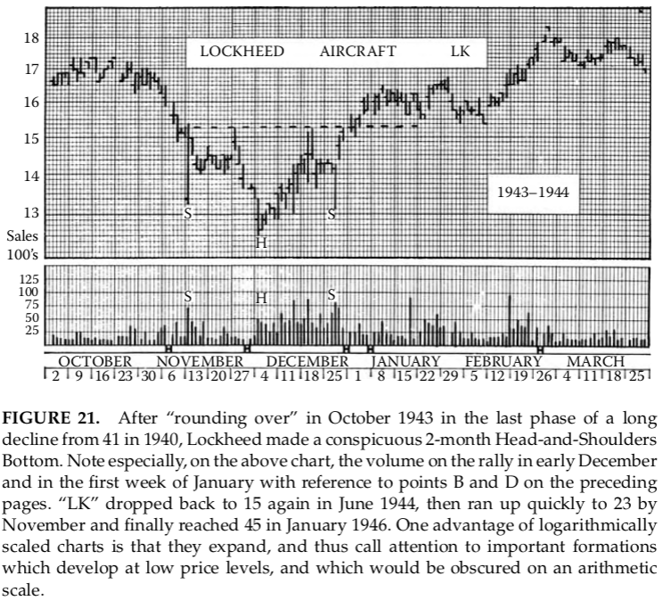

**HÌNH 21.** Sau khi “uốn cong” vào tháng Mười 1943 trong giai đoạn
cuối của một đợt giảm dài từ 41 năm 1940, Lockheed đã tạo một Đáy
Đầu-và-Vai rõ rệt trong 2 tháng. Lưu ý đặc biệt, trên đồ thị trên,
khối lượng trong đợt hồi đầu tháng Mười Hai và tuần đầu tháng Một
tham chiếu các điểm B và D ở các trang trước. “LK” lại giảm xuống 15
vào tháng Sáu 1944, sau đó tăng nhanh lên 23 vào tháng Mười Một
và cuối cùng đạt 45 vào tháng Một 1946. Một lợi thế của đồ thị
theo tỉ lệ logarit là nó mở rộng và thu hút sự chú ý đến các mô hình
quan trọng phát triển ở mức giá thấp, vốn sẽ bị che khuất trên đồ thị
tỉ lệ số học.

Sự khác biệt cơ bản giữa mô hình Đỉnh và Đáy, bạn có thể thấy,
nằm ở đồ thị khối lượng. Hoạt động trong Đáy Đầu-và-Vai thường
bắt đầu thể hiện đặc tính tăng từ đầu đầu, và luôn xuất hiện ở mức
có thể nhận thấy trên đợt hồi từ đầu. Nó còn rõ rệt hơn trên đợt
hồi từ vai phải. _Nó phải xuất hiện khi xuyên thủng đường viền cổ_,
nếu không thì đột phá không được tin cậy như một xác nhận dứt khoát.
Có một nguyên tắc cơ bản quan trọng về kỹ thuật ở đây cần được thảo
luận thêm. Phố Wall có câu nói cũ diễn đạt điều này: “Cần có việc mua
mới đẩy cổ phiếu lên, nhưng chúng có thể giảm theo trọng lượng tự
nhiên.” Vì vậy, chúng ta tin tưởng và xem là kết luận bất kỳ sự phá
vỡ giá nào (với biên độ quyết định) xuống dưới đường viền cổ của
Đỉnh Đầu-và-Vai dù xảy ra trên khối lượng nhỏ, nhưng không tin
vào đột phá từ Đáy Đầu-và-Vai trừ khi đi kèm khối lượng cao rõ rệt.
Một đột phá khối lượng thấp từ mô hình Đáy có thể chỉ là sớm,
sẽ theo sau bởi một đợt tăng thực sự sau khi “làm việc” quanh mức
Đáy, hoặc hoàn toàn là một chuyển động “giả.” Thông thường, nên
chờ xem. Phân biệt tương tự về sự phát triển khối lượng cũng áp dụng
cho một số mô hình Đảo Chiều khác mà chúng ta sẽ đề cập sau.

Các khác biệt khác giữa Đỉnh và Đáy Đầu-và-Vai không liên quan đến
nguyên tắc mới nào. Có thể nói Đáy thường dài và bằng phẳng hơn,
tức là tốn nhiều thời gian hơn liên quan đến độ sâu của mô hình
tính theo điểm so với Đỉnh. Điều này đặc biệt đúng khi chúng xuất
hiện tại các Đảo Chiều trong Xu Hướng Chính. Tổng khối lượng ở
Đáy thường ít hơn ở Đỉnh, và các nhịp quay tròn hơn. Trong việc
xây dựng Đỉnh Đầu-và-Vai, hoạt động tạo vai trái thường vượt quá
mọi đợt hồi trước đó trong toàn bộ xu hướng tăng. Trong xu hướng
giảm, ngược lại, có thể xảy ra Bán Hoảng Loạn ở một số giai đoạn
giảm trước đó, đẩy đồ thị khối lượng lên mức cao hơn bất kỳ mức
nào được ghi nhận sau đó trong Đáy cuối cùng. Nhưng không sự
khác biệt nào trong số này ảnh hưởng đến các tiêu chí cơ bản của
Đầu-và-Vai.

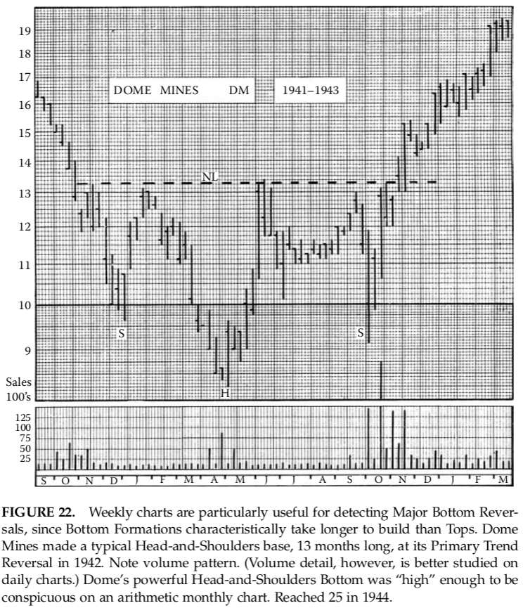

**HÌNH 22.** Đồ thị tuần đặc biệt hữu ích để phát hiện các Đảo Chiều
Đáy Quan Trọng, vì mô hình Đáy thường mất nhiều thời gian để hình
thành hơn Đỉnh. Dome Mines đã tạo một Đáy Đầu-và-Vai điển hình, kéo
dài 13 tháng, tại Đảo Chiều Xu Hướng Chính năm 1942. Lưu ý mô
hình khối lượng. (Chi tiết khối lượng, tuy nhiên, nên nghiên cứu trên
đồ thị ngày.) Đáy Đầu-và-Vai mạnh mẽ của Dome đủ “cao” để nổi bật
trên đồ thị tháng theo tỉ lệ số học. Đạt 25 năm 1944.

Các hàm ý đo lường của Đáy Đầu-và-Vai giống hệt về mọi mặt và
được áp dụng tương tự như Đỉnh. Xu hướng đối xứng vẫn là quy tắc,
với biến thể về độ dốc đường viền cổ, kích thước tương đối các vai
tương tự như ở Đỉnh. Các phản ứng với đường viền cổ sau đột phá
ban đầu từ mô hình Đáy xuất hiện với tần suất và tỷ lệ gần giống
như các Pullback Rally theo sau đột phá từ mô hình Đỉnh.

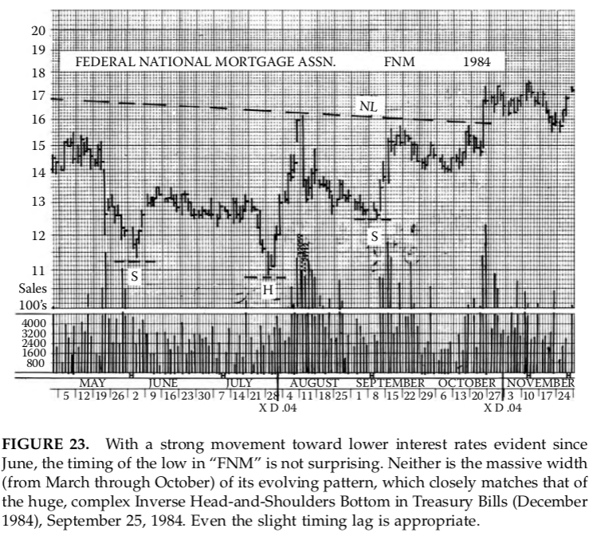

**HÌNH 23.** Với xu hướng rõ ràng hướng đến lãi suất thấp hơn kể
từ tháng Sáu, thời điểm đáy của “FNM” không gây ngạc nhiên. Cũng không
ngạc nhiên về độ rộng lớn (từ tháng Ba đến tháng Mười) của mô hình
đang hình thành, rất tương đồng với Đáy Đầu-và-Vai đảo ngược khổng
lồ và phức tạp của Trái Phiếu Kho bạc (tháng Mười Hai 1984), ngày
25 tháng Chín 1984. Ngay cả độ trễ thời gian nhỏ cũng phù hợp.

##### Các Mô hình Vai-Đầu-Vai Nhiều Lần

Các Mô hình Vai-Đầu-Vai mà chúng ta đã xem xét đến lúc này, mặc dù có
một số biến thể nhỏ, tương đối đơn giản và rõ ràng, bao gồm ba yếu tố
xác định rõ ràng. Bây giờ chúng ta chuyển sang một nhóm mô hình liên
quan, mang ý nghĩa kỹ thuật tương tự nhưng có nhiều thành phần hơn và
ít rõ ràng hơn. Đây là các Mô hình Vai-Đầu-Vai Đỉnh và Đáy Nhiều Lần,
còn được gọi là Các Mô hình Phức tạp. Chúng ta không cần dành nhiều
không gian để định nghĩa hay đưa ra các thông số cho chúng, vì chúng
có thể được mô tả đầy đủ như các Mô hình Đảo chiều Vai-Đầu-Vai mà
ở đó vai hoặc đầu, hoặc cả hai, đã được nhân đôi hoặc sinh ra thành
vài sóng riêng biệt.

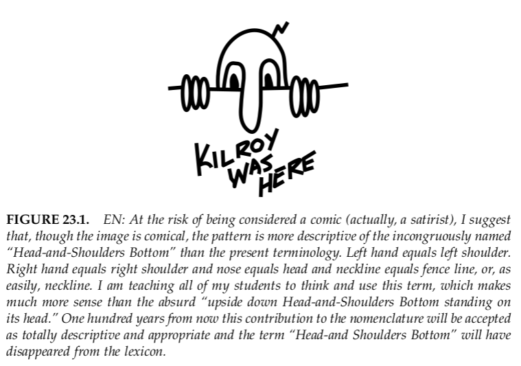

**HÌNH 23.1.** _EN: Dù có nguy cơ bị coi là hài hước (thực ra, là châm
biếm), tôi gợi ý rằng, mặc dù hình ảnh hài hước, mô hình mô tả chính xác
“Đáy Vai-Đầu-Vai” hơn là thuật ngữ hiện tại. Tay trái = vai trái. Tay
phải = vai phải, mũi = đầu, đường cổ = hàng rào, hoặc đơn giản là đường
cổ. Tôi dạy tất cả học sinh của mình nghĩ và dùng thuật ngữ này, hợp lý
hơn nhiều so với “Đáy Vai-Đầu-Vai ngược đứng trên đầu”. Một trăm năm
từ nay, đóng góp này sẽ được công nhận là mô tả đầy đủ và phù hợp, và
thuật ngữ “Đáy Vai-Đầu-Vai” sẽ biến mất khỏi từ điển._

Hầu hết mọi kết hợp đều có thể, nhưng chỉ một vài ví dụ được minh họa
trên các biểu đồ trong chương này. Các mô hình loại này xuất hiện
tương đối thường xuyên ở Đáy và Đỉnh Chính, nhưng thường xuất hiện
nhiều hơn ở Đáy so với Đỉnh. Chúng ít khi xuất hiện ở các Đảo chiều
Trung gian. Một dạng phổ biến bao gồm hai vai trái xấp xỉ bằng nhau,
một đầu duy nhất, và sau đó hai vai phải, lại xấp xỉ bằng nhau và cân
bằng hai vai bên trái. Một dạng khác gồm hai đầu với hai hoặc nhiều vai
ở mỗi bên. Một dạng nữa, mà bạn thường tìm thấy vài ví dụ tốt ở bất
kỳ Điểm Quay Thị trường Chính nào, bao gồm đôi vai ở mỗi bên của một
đầu vốn là một phát triển Vai-Đầu-Vai nhỏ nhưng khá rõ ràng.

##### Khuynh hướng Đối xứng

Chúng ta đã đề cập khuynh hướng đối xứng trong Mô hình Vai-Đầu-Vai
đơn giản. Các mô hình Nhiều Lần hoặc Phức tạp thể hiện khuynh hướng
đối xứng mạnh hơn — mạnh đến mức có thể dựa vào để xác định chính
sách giao dịch. Nếu có hai vai bên trái, gần như luôn có hai vai bên phải
có kích thước và thời gian gần như bằng nhau. (Tất nhiên, người ta không
biết mô hình Nhiều Lần đang hình thành cho đến khi vai phải rõ ràng.)
Ngoại trừ khối lượng, nửa bên phải của mô hình, trong đa số trường
hợp, là ảnh phản chiếu gần như chính xác của nửa bên trái.

Đường cổ trong các Mô hình Vai-Đầu-Vai Nhiều Lần không phải lúc nào
cũng dễ vẽ, vì phản ứng giữa các vai và giữa vai và đầu có thể không dừng
ở các mức tất cả nằm trên cùng một đường. Các biến thể đường cổ hướng lên
hoặc hướng xuống hiếm khi xuất hiện trong loại mô hình này; đường cổ
gần như luôn gần ngang. Đôi khi có thể ước lượng bằng cách quan sát
đơn giản vị trí thực sự của đường quan trọng. Thường thì có hai đường cổ,
một trong và một ngoài, và không kỳ vọng bất kỳ biến động giá nào đáng
kể cho đến khi đường ngoài bị phá (điều này, tất nhiên, chỉ là cách khác
diễn tả khuynh hướng đối xứng đã đề cập ở trên).

Thật kỳ lạ, “sức mạnh” của Mô hình Vai-Đầu-Vai Nhiều Lần thường bị đánh
giá quá cao hơn là đánh giá thấp. Người ta có thể nghĩ, xét về thời gian
và khối lượng giao dịch tham gia vào việc xây dựng mô hình, rằng nó sẽ
báo hiệu một chuyển động (ngược hướng xu hướng trước đó) lớn hơn mô
hình Vai-Đầu-Vai đơn giản. Tuy nhiên, ít nhất trong tác động tức thời,
Mô hình Phức tạp thường thể hiện sức mạnh thấp hơn. Quy tắc đo tối thiểu
cho hai loại mô hình giống nhau và được áp dụng cùng cách. Sự khác biệt
xuất hiện trong hành động giá sau khi đạt mức tối thiểu. Lần giảm đầu
tiên từ một Đỉnh Vai-Đầu-Vai đơn giản, không tính bất kỳ Pullback Rally
sớm nào, thường nhanh chóng thực hiện các hàm ý đo lường tối thiểu
và vượt xa hơn. Từ một Đỉnh Nhiều Lần, lần giảm đầu tiên thường chậm
hơn, và hiếm khi vượt quá mức tối thiểu — điều này đáng nhớ khi bạn
xử lý một Đỉnh Trung gian thay vì Đỉnh Chính. Tất nhiên, nếu Phức tạp
hình thành tại điểm quay của Xu hướng Chính, giá cuối cùng sẽ đi xa hơn,
nhưng ngay cả khi đó thường có sự hồi phục mạnh (hoặc phản ứng trong
trường hợp Đáy) từ mức “quy tắc tối thiểu”.

**HÌNH 23.2.** Một Đáy Kilroy lởm chởm (hoặc nếu từ trường phái cũ là
một Vai-Đầu-Vai) kết thúc thị trường gấu (hoặc giai đoạn đầu của nó)
2001-2002. Khoảng 7½ tháng hình thành, nó ném vài quả bóng cong và
có vẻ đến tháng 3/2003 như một đợt hồi phục thị trường gấu. Khi đường
cổ bị phá, không còn tranh cãi gì. Đó là một đáy thực sự. Nó ngần ngại
trước đường cổ vài tháng trước khi trở thành bò đầy đủ. Các yếu tố kinh
tế và chính trị phức tạp ảnh hưởng thị trường. Các vụ tấn công khủng
bố ngày 11/9/2001 chấm dứt cơn tulipomania thập niên 90 và các cắt
giảm thuế không khôn ngoan của chính quyền Bush (II). Sử dụng công thức
Reagan giảm thuế, tăng chi tiêu và bắt đầu chiến tranh, thị trường được
kích thích hồi phục mạnh. Mặc dù đường xu hướng không vẽ ở đây, người
đọc vẫn thấy rõ việc phá đường xu hướng dài hạn cũng như Đáy Kilroy
bắt buộc chuyển từ gấu sang bò.

**HÌNH 24.** “MCA” trải qua giai đoạn tăng trưởng tuyệt vời 1980–1986.
Nhưng tình hình trở nên ngày càng khó khăn sau năm mới, khi cổ phiếu
bắt đầu thách thức mức cao 1985. Mặc dù phe Bò đã tạo mức cao mới
tháng 4, nhưng một loạt Pullback giữ cổ phiếu này xa khỏi các thử nghiệm
tiếp theo. Thực tế, một Đỉnh Vai-Đầu-Vai Phức tạp dường như hình thành
với đường cổ Chính bị phá nhẹ trong đợt bán tháo.

##### Một Mô Hình Nhàn Nhã

Khối lượng đi kèm với việc hình thành Đầu-và-Vai Phức Tạp (Multiple)
về cơ bản tuân theo các “luật” mà chúng ta đã nêu và giải thích trước
đây cho các Đảo Chiều Đầu-và-Vai đơn giản. Trong giai đoạn đầu của
sự phát triển Mô Hình Phức Tạp, đồ thị khối lượng có thể rất bất
thường, với ít mẫu nhận dạng được, nhưng trong giai đoạn sau, sự
tương ứng với xu hướng Đầu-và-Vai nên được thấy rõ.

Có điều gì đó về các mô hình Đầu-và-Vai Phức Tạp đặc biệt làm hài
lòng những người theo dõi đồ thị kỹ thuật. Do xu hướng đối xứng của
chúng, thật hấp dẫn khi quan sát chúng phát triển đến hoàn tất. Tuy
nhiên, một khi hoàn tất, chúng có thể thử thách sự kiên nhẫn của bạn
bằng việc dường như “ngại” khởi động với xu hướng mới. Vì lý do đó,
đôi khi dễ nhảy đến kết luận rằng chúng đã “phá sản,” tức là tạo ra
tín hiệu giả. Thực ra, ngoại trừ về phạm vi chuyển động mà chúng
ta đã bàn, chúng hoàn toàn tin cậy như Đầu-và-Vai đơn giản. Chuyển
động giả tương đối hiếm ở cả hai. Và trong những trường hợp phi
thường khi một Mô Hình Phức Tạp xảy ra sai, nó vẫn đứng đó, giống
Đầu-và-Vai đơn giản, như một cảnh báo rằng Đảo Chiều cuối cùng
đã gần kề.

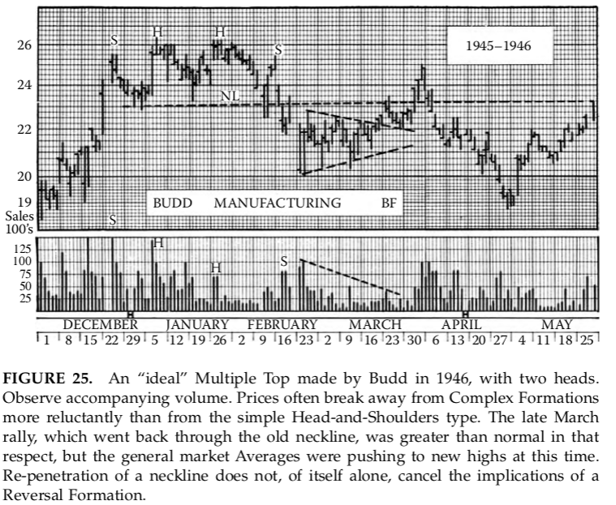

**HÌNH 25.** Một Đỉnh Multiple “lý tưởng” do Budd tạo ra năm 1946,
với hai đầu. Quan sát khối lượng đi kèm. Giá thường phá vỡ từ các
Mô Hình Phức Tạp chậm hơn so với loại Đầu-và-Vai đơn giản. Đợt
hồi cuối tháng Ba, quay trở lại đường viền cổ cũ, lớn hơn bình
thường về mặt này, nhưng Chỉ Số thị trường chung vẫn đang đẩy
lên mức cao mới lúc đó. Việc xuyên thủng lại đường viền cổ tự nó
không hủy bỏ các hàm ý của Mô Hình Đảo Chiều.

##### Đỉnh và Đáy Bo Tròn

Các Mô Hình Phức Tạp mà chúng ta vừa xem xét được tạo ra bởi một
sự mở rộng hoặc nhân bản của mô hình Đầu-và-Vai thông thường.
Tiếp tục quá trình này và các cấu trúc phức hợp hợp nhất thành
lớp Đảo Chiều tiếp theo, được gọi là Đỉnh/Đáy Bo Tròn.

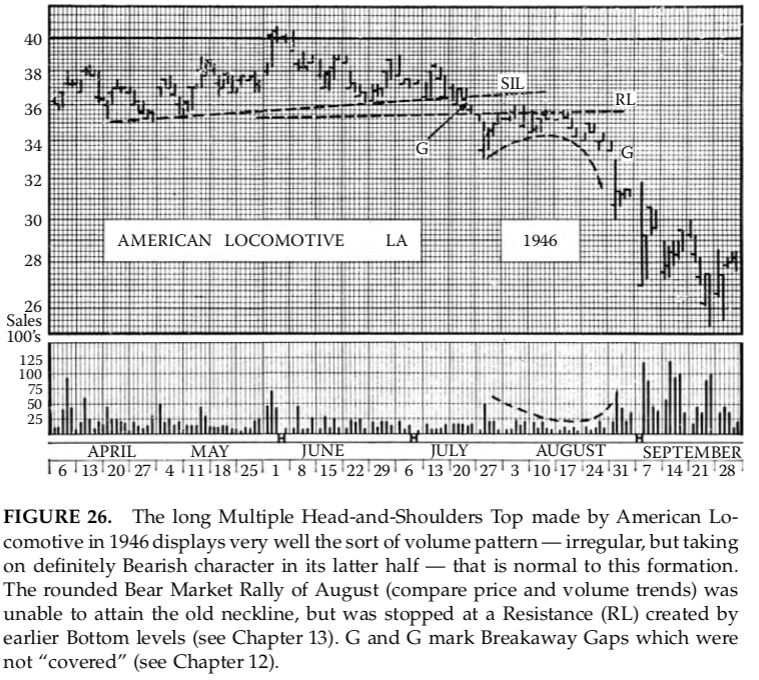

**HÌNH 26.** Đỉnh Multiple dài của American Locomotive năm 1946
hiển thị rõ ràng kiểu mô hình khối lượng — bất thường, nhưng mang
bản chất giảm trong nửa sau — vốn bình thường cho mô hình này.
Đợt hồi của Thị Trường Gấu vào tháng Tám (so sánh xu hướng giá
và khối lượng) không thể đạt tới đường viền cổ cũ, nhưng bị chặn
tại mức Kháng Cự (RL) tạo ra bởi các mức Đáy trước đó (xem
Chương 13). G và G đánh dấu các Khoảng Trống Thoát Ly chưa
“lấp đầy” (xem Chương 12).

Trong lần tiếp cận đầu tiên với lý thuyết các Mô Hình Đảo Chiều,
chúng ta thấy tại sao cần thời gian và khối lượng giao dịch đáng kể
để đảo chiều một xu hướng giá đã thiết lập từ tăng sang giảm hoặc
giảm sang tăng. Trong loại Đảo Chiều Đầu-và-Vai, xu hướng dâng,
vật lộn, tấn công lại nhiều lần trước khi cuối cùng nhường bước và
rút lui. Trong cuộc vật lộn này, cân bằng giữa cung và cầu dao
động, thường dữ dội, cho đến khi một bên vượt trội. Trong Mô Hình
Phức Tạp, quá trình tương tự xảy ra nhưng ít dữ dội hơn và, trong
một khoảng thời gian, sự thay đổi tiến triển từ lực lượng này sang
lực lượng kia trở nên rõ ràng. Đỉnh/Đáy Bo Tròn là hiện tượng
kỹ thuật đơn giản và logic hơn nhiều. Nó thể hiện một cách đơn
giản, rõ ràng sự thay đổi từ từ, tiến triển và khá đối xứng của hướng
xu hướng, do sự dịch chuyển dần dần trong cân bằng quyền lực giữa
mua và bán.

Nếu, ví dụ, việc mua mạnh hơn bán trong một thời gian trước, ta
biết rằng kết quả là xu hướng giá chung tăng, như thể hiện bởi
đồ thị lịch sử giao dịch. Miễn là người mua cổ phiếu vẫn hăng hái,
nhiều hơn, hung hăng hơn, mạnh hơn người bán, xu hướng tăng
trước đó sẽ tiếp tục. Tuy nhiên, giả sử việc bán tăng mạnh hơn
một chút, trong khi mua giảm nhẹ hoặc giữ nguyên, sự thay đổi
nhỏ này sẽ được thể hiện bằng việc nhịp tăng trước đó chậm lại.
Khi lực bán tăng lên, cuối cùng sẽ bằng lực mua, kết quả là mức
thị trường đứng yên (ngoại trừ các dao động nhỏ không quan trọng).
Giả sử diễn biến này tiếp tục và áp lực bán tăng lên vượt lực
mua, cân bằng đang chuyển hướng. Lúc này có nhiều người bán
hơn người mua, kết quả là giá cổ phiếu giảm dần. Nếu sự thay đổi
cân bằng này ổn định và tiếp tục tới kết luận logic, chúng ta có thể
thấy, ngay cả không có đồ thị, rằng hình ảnh chuyển động giá của
cổ phiếu là một xu hướng tăng dài bắt đầu bo tròn, đứng yên
một thời gian, rồi bắt đầu rút lui, đảo chiều xu hướng tăng trước
thành xu hướng giảm mới và tăng tốc.

Đáy Bo Tròn thường được gọi là _Bowl_ hoặc _Saucer_. Đỉnh Bo Tròn
đôi khi gọi là _Inverted Bowl_. Mặc dù hợp lý trong cấu tạo, cả hai
loại này xuất hiện không thường xuyên như Đầu-và-Vai. Đáy Bo Tròn
thường xuất hiện ở cổ phiếu giá thấp, dạng đáy phẳng kéo dài, thường
mất nhiều tháng để hoàn tất. Có nhiều trường hợp như vậy trong năm
1942 và 1943 ở các cổ phiếu dưới 10$/cổ phiếu. (Cần lưu ý rằng các
Đáy “Saucer” kéo dài 2–3 tháng cũng xuất hiện thường xuyên, nối
tiếp nhau, trong đồ thị cổ phiếu giá thấp _trong_ một xu hướng tăng
kéo dài. Tính chất và ký hiệu của chúng sẽ được thảo luận sau khi
chúng ta tới phần _Consolidation_.)

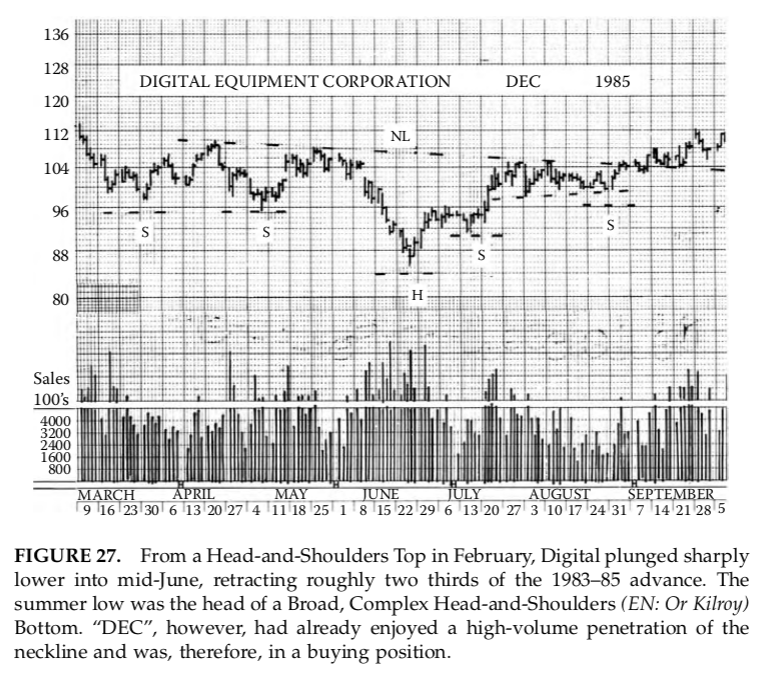

**HÌNH 27.** Từ một Đỉnh Đầu-và-Vai vào tháng Hai, Digital giảm mạnh
xuống giữa tháng Sáu, thu hồi khoảng hai phần ba đợt tăng 1983–85.
Mức thấp mùa hè là đầu của một Đáy Đầu-và-Vai Phức Tạp _(EN: Hoặc Kilroy)_. 
“DEC”, tuy nhiên, đã có một đột phá đường viền cổ với khối lượng cao, do
đó đang trong vị thế mua.

Đỉnh Bo Tròn hiếm trong các cổ phiếu giá thấp và trung bình, nhưng
thỉnh thoảng xuất hiện ở đồ thị các cổ phiếu giá cao, xếp hạng AA
trong mắt nhà đầu tư giàu có và thường không thu hút công chúng. 
Chúng cũng xuất hiện thường xuyên ở đồ thị cổ phiếu ưu đãi cao cấp, 
và tự nhiên, vì nhu cầu cổ phiếu chủ yếu phản ánh hai yếu tố — nguồn 
vốn tìm đầu tư an toàn và lãi suất — cả hai thay đổi chậm. Sức hấp 
dẫn đầu cơ gây dao động giá mạnh vắng mặt ở các cổ phiếu này. Lý luận 
tương tự giải thích tại sao Đỉnh Bo Tròn hầu như không hình thành ở 
cổ phiếu phổ thông giá thấp, đầu cơ; Thị Trường Tăng ở các mã này 
kết thúc bằng việc công chúng mua hăng hái, ít chú ý đến yếu tố đầu 
tư dài hạn.

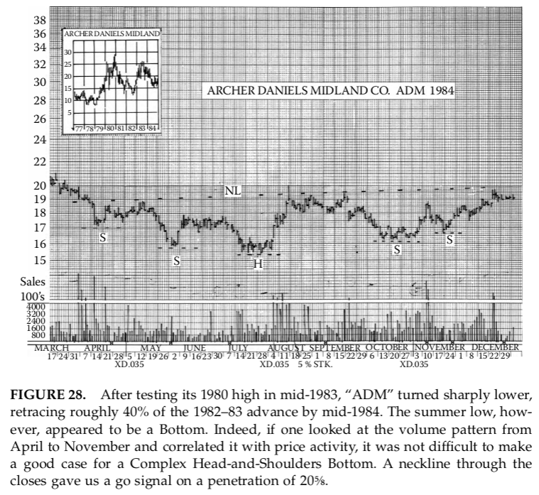

**HÌNH 28.** Sau khi kiểm tra mức cao 1980 giữa năm 1983, “ADM” giảm 
mạnh, hồi khoảng 40% đợt tăng 1982–83 đến giữa năm 1984. Tuy nhiên, mức 
thấp mùa hè có vẻ là một Đáy. Thực ra, nếu quan sát khối lượng từ tháng 
Tư đến tháng Mười Một và so với hoạt động giá, không khó để lập luận cho 
một Đáy Đầu-và-Vai Phức Tạp. Một đường viền cổ qua giá đóng cửa cho tín 
hiệu mua khi xuyên thủng 20⅝.

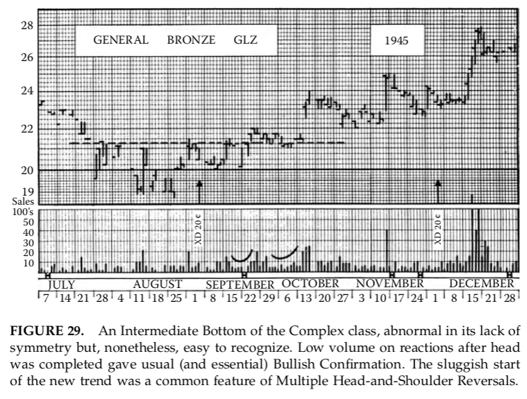

**HÌNH 29.** Một Đáy Trung Cấp loại Phức Tạp, bất thường vì thiếu đối
xứng nhưng dễ nhận ra. Khối lượng thấp trong các phản ứng sau khi đầu 
hoàn tất mang lại Xác Nhận Tăng điển hình (và cần thiết). Khởi đầu chậm
của xu hướng mới là đặc trưng chung của Đảo Chiều Đầu-và-Vai Phức Tạp.

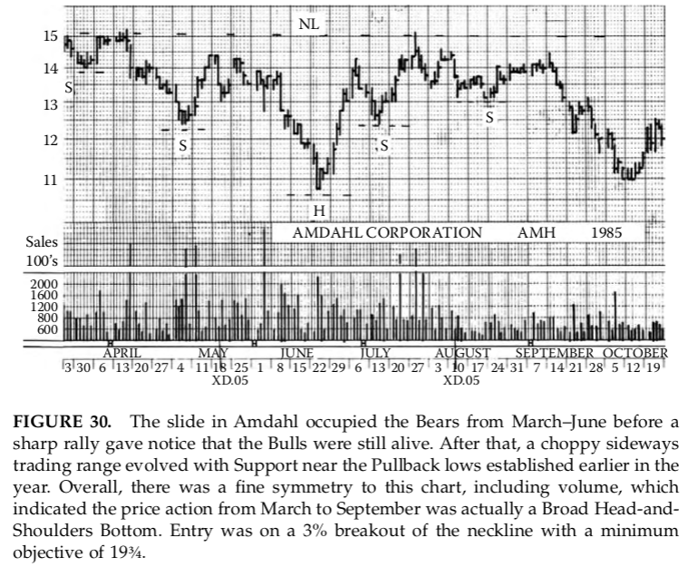

**HÌNH 30.** Sự trượt của Amdahl chiếm thời gian của phe Gấu từ tháng 
Ba–Tháng Sáu trước khi một đợt hồi mạnh báo hiệu phe Bò vẫn còn sống. 
Sau đó, một phạm vi giao dịch ngang lộn xộn hình thành với Hỗ Trợ gần mức 
Pullback thấp được thiết lập trước đó trong năm. Nhìn chung, đồ thị cân 
xứng tốt, bao gồm cả khối lượng, cho thấy hành động giá từ tháng Ba đến 
tháng Chín thực sự là một Đáy Đầu-và-Vai Phức Rộng. Vào lệnh khi đột 
phá 3% đường viền cổ với mục tiêu tối thiểu 19¾.

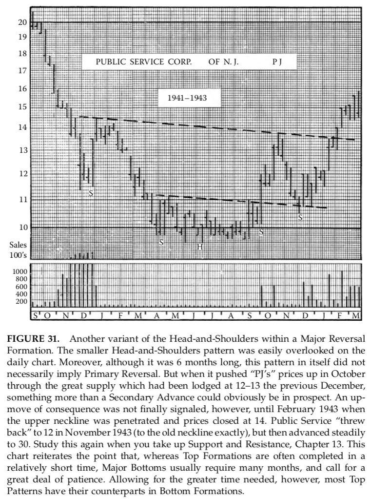

**HÌNH 31.** Một biến thể khác của Đầu-và-Vai trong một Mô Hình Đảo 
Chiều Quan Trọng. Mô hình Đầu-và-Vai nhỏ hơn dễ bị bỏ qua trên đồ thị 
ngày. Hơn nữa, mặc dù kéo dài 6 tháng, mô hình này tự nó không nhất 
thiết báo hiệu Đảo Chiều Chính. Nhưng khi nó đẩy giá “PJ” lên trong 
tháng Mười qua nguồn cung lớn đã tồn tại ở 12–13 vào tháng Mười Hai 
trước đó, rõ ràng có thể xảy ra nhiều hơn một Đợt Tăng Phụ. Một nhịp 
tăng đáng kể cuối cùng được báo hiệu vào tháng Hai 1943 khi đường 
viền cổ phía trên bị xuyên thủng và giá đóng cửa ở 14. Public Service 
“quay lại” 12 vào tháng Mười Một 1943 (vào đúng đường viền cổ cũ), 
sau đó tăng đều lên 30. Xem lại khi học phần Hỗ Trợ và Kháng Cự, 
Chương 13. Đồ thị này nhấn mạnh rằng, trong khi Đỉnh thường hoàn 
tất trong thời gian tương đối ngắn, Đáy Quan Trọng thường cần nhiều 
tháng và đòi hỏi kiên nhẫn. Với thời gian dài hơn, hầu hết các Đỉnh 
vẫn có tương ứng trong Đáy.

##### Tác Động của Các Vòng Tròn Đáy Đối với Hoạt động Giao dịch

Chúng ta chưa đề cập đến nửa khối lượng của bức tranh Vòng tròn Đáy. Điều
này vừa thú vị, vừa có ý nghĩa. Trong trường hợp Đáy Tròn, mô hình của nó
thường rõ ràng và quyết đoán như mô hình giá. Bước đầu trong việc chinh
phục dần cung bởi cầu, tạo ra Đáy Tròn, xuất hiện dưới dạng áp lực bán
giảm dần. Khối lượng, vốn đang cao, dần giảm. Cầu vẫn còn e dè, nhưng
áp lực lên nó nhẹ hơn; vì vậy, mặc dù giá vẫn giảm, tốc độ chậm hơn và xu
hướng uốn cong ngày càng gần ngang. Tại Đáy, khi hai lực cân bằng về mặt
kỹ thuật, số giao dịch ghi nhận tương đối ít. Sau đó cầu bắt đầu tăng, và
khi đường giá uốn lên, giao dịch trở nên sôi động hơn. Khối lượng tăng tốc
cùng với xu hướng cho đến khi thường đạt đỉnh gần như “thẳng đứng” trên
biểu đồ trong vài ngày.

Trong các mô hình như vậy, các đỉnh của đường khối lượng ở đáy biểu đồ,
khi nối lại, sẽ mô tả một cung thường song song gần như với cung tạo bởi
“Bowl” giá phía trên. Những mô hình này, khi xuất hiện _sau một đợt giảm
rộng_, có tầm quan trọng nổi bật, vì chúng gần như luôn báo hiệu sự thay
đổi Xu hướng Chính và một đợt tăng đáng kể sắp tới. Tuy nhiên, đợt tăng
này hiếm khi có hiệu ứng “tăng vọt” hoàn tất toàn bộ Động Thị trường Chính
trong vài tuần. Ngược lại, xu hướng tăng theo sau khi mô hình hoàn tất
thường chậm và bị gián đoạn nhiều lần, làm mệt nhà giao dịch thiếu kiên
nhẫn, nhưng cuối cùng vẫn mang lại lợi nhuận đáng kể.

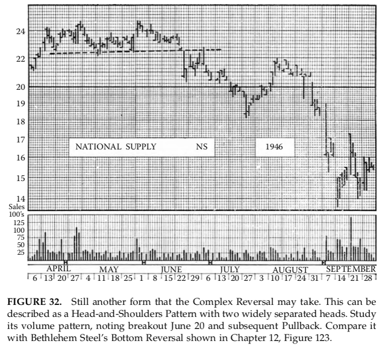

**HÌNH 32.** Một dạng khác mà Mô hình Đảo chiều Phức tạp có thể mang
lại. Nó có thể được mô tả như Mô hình Vai-Đầu-Vai với hai đầu tách biệt
rộng. Nghiên cứu mô hình khối lượng, lưu ý breakout ngày 20 tháng 6 và
Pullback tiếp theo. So sánh với Đáy Đảo chiều Bethlehem Steel trong Chương
12, Hình 123.

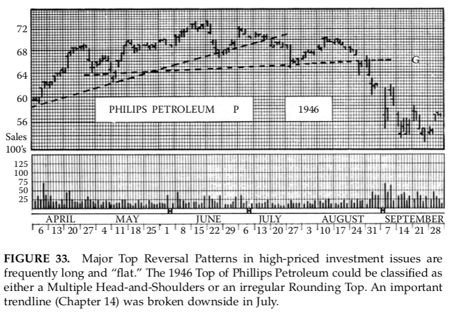

**HÌNH 33.** Các Mô hình Đảo chiều Đỉnh lớn trong các cổ phiếu đầu tư giá
cao thường kéo dài và “bằng phẳng.” Đỉnh 1946 của Phillips Petroleum có
thể được phân loại là Vai-Đầu-Vai Nhiều Lần hoặc Đỉnh Tròn bất thường.
Một đường xu hướng quan trọng (Chương 14) bị phá xuống vào tháng 7.

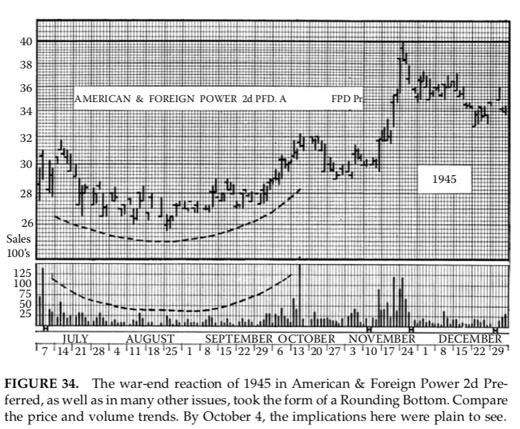

**HÌNH 34.** Phản ứng sau chiến tranh năm 1945 ở American & Foreign Power
2d Preferred, cũng như nhiều cổ phiếu khác, có dạng Đáy Tròn. So sánh
xu hướng giá và khối lượng. Đến ngày 4 tháng 10, các hàm ý đã rõ ràng.
Hãy nhắc lại rằng khối lượng giao dịch nên giảm đến cực thấp tại đáy của
một Mô hình Bowl nếu muốn tin cậy các hàm ý. Tuy nhiên, sau khi giá
vượt qua tâm, bắt đầu tăng dần với khối lượng chỉ tăng nhẹ, có thể xuất
hiện một đợt breakout sớm. Không báo trước, một cơn mua bùng nổ có thể
đẩy giá thẳng lên trong một, hai ngày. Những trường hợp này không hiếm,
nhưng gần như luôn, giá nhanh chóng giảm trở lại kênh cũ và quá trình
vòng tròn dần tiếp tục. Không có nguy hiểm đặc biệt cho nhà giao dịch từ
các đợt bùng nổ sớm, nhưng nếu bị cám dỗ tham gia, họ nên nhận ra rằng
cần vẫn phải kiên nhẫn. Một ví dụ kinh điển về breakout sớm xuất hiện
trong hình minh họa kèm theo, Hình 38.

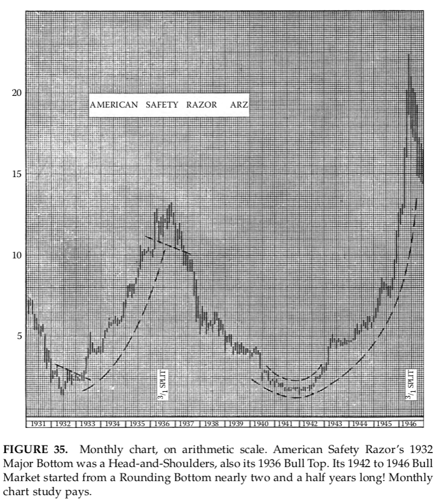

**HÌNH 35.** Biểu đồ tháng, theo thang số học. Đáy Chính 1932 của American
Safety Razor là Vai-Đầu-Vai, cũng như Đỉnh Bò 1936. Thị trường Bò 1942–
1946 bắt đầu từ Đáy Tròn kéo dài gần hai năm rưỡi! Nghiên cứu biểu đồ tháng
rất hữu ích.

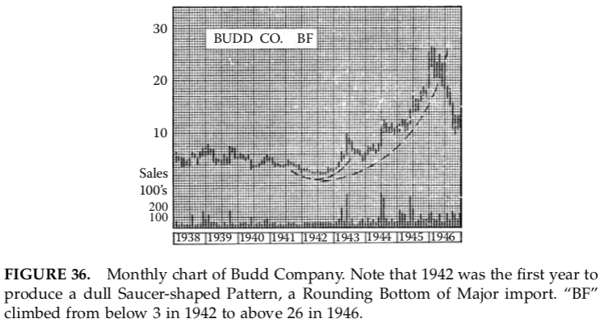

**HÌNH 36.** Biểu đồ tháng của Budd Company. Lưu ý rằng năm 1942 là năm
đầu tiên xuất hiện Mô hình hình Chén tròn, một Đáy Tròn quan trọng. “BF”
tăng từ dưới 3 năm 1942 lên trên 26 năm 1946.

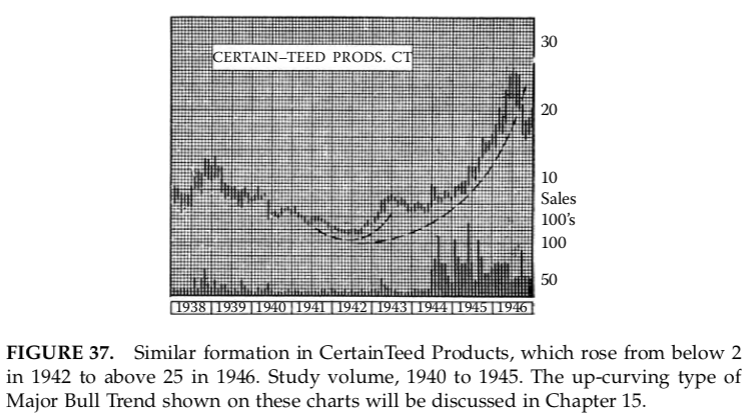

**HÌNH 37.** Mô hình tương tự ở CertainTeed Products, tăng từ dưới 2 năm
1942 lên trên 25 năm 1946. Nghiên cứu khối lượng từ 1940–1945. Dạng
xu hướng Bò lớn cong lên trên trên các biểu đồ này sẽ được bàn trong
Chương 15.

Xem Chương 16.1 cho một số Đáy Tròn 2005 thú vị.

##### Biến thể Đáy Ngủ

Có một dạng hình ảnh Đáy Chính được gọi là _Đáy Ngủ_, nhưng liên quan
logic đến Mô hình Bowl của chúng ta, về thực chất là sự phát triển cực
đại của “dạng đáy bằng, kéo dài” mà chúng ta đã nhắc ở trên. Nó xuất
hiện điển hình ở các cổ phiếu “mỏng”, tức là số cổ phiếu lưu hành tổng
thể hoặc đặc biệt là số cổ phiếu tự do rất ít. Trong các cổ phiếu này,
khối lượng giao dịch bình thường có thể chỉ hai, ba trăm cổ phiếu trong
một thị trường tăng tích cực. Cuối cùng, có thể vài tuần hoặc vài tháng
trôi qua mà không có giao dịch nào, hoặc chỉ một lô nhỏ với giá dao
động trong phạm vi rất nhỏ. Biểu đồ xuất hiện “như bẩn bởi chấm nhỏ.”

Cuối cùng, có thể xuất hiện đột ngột một làn sóng hoạt động khó giải
thích. Vài trăm cổ phiếu xuất hiện trên bảng giá và giá tăng mạnh.
“Breakout từ trạng thái ngủ” này có thể là một đợt tăng sớm, như
chúng ta đã thấy ở các Đáy Tròn điển hình, tiếp theo vài tuần ít
hoạt động, hoặc là bước đầu của quá trình tăng dần theo từng bậc với
khoảng thời gian giữa các bước ngày càng ngắn, cho đến khi xu hướng
tăng ổn định hình thành. Trong mọi trường hợp, đây là tín hiệu cho thấy
chúng ta đang xử lý một Mô hình Tích lũy quan trọng.

Nguyên nhân tạo ra các Đáy Ngủ này dễ đoán. Với số cổ phiếu lưu hành
ít, và chỉ đôi khi có lô được bán “theo thị trường”, các nhà đầu tư
(có thể là nội bộ công ty) chỉ thành công trong việc đẩy giá lên cao
nếu họ bắt đầu đặt giá thầu. Vì vậy, họ đơn giản “giữ rổ bên dưới,”
theo câu nói, nhặt nhanh bất cứ gì được đưa ra nhưng không vươn tới,
cho đến khi cây “trắng sạch.” Sau đó họ có thể nâng giá thầu thêm một
điểm; nếu thấy xuất hiện nhiều cổ phiếu để bán, họ lại trở về chiến
thuật chờ đợi.

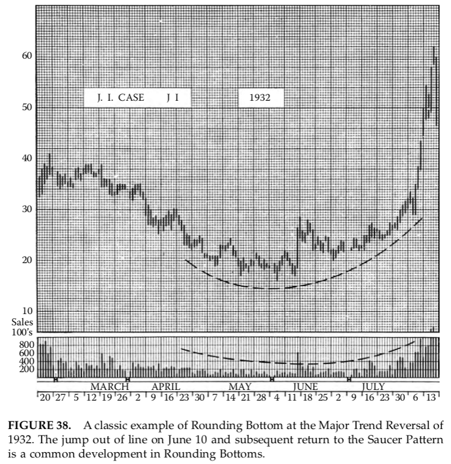

**HÌNH 38.** Ví dụ kinh điển về Đáy Tròn tại Đảo chiều Xu hướng Chính
1932. Việc nhảy ra khỏi đường ngày 10 tháng 6 và trở lại Mô hình Chén
là diễn biến phổ biến trong Đáy Tròn.

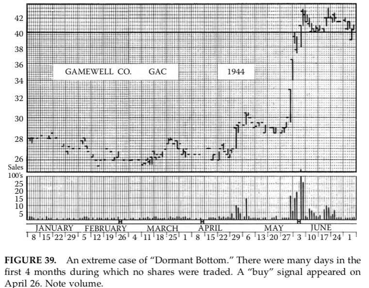

**HÌNH 39.** Trường hợp cực đoan của “Đáy Ngủ.” Có nhiều ngày trong
4 tháng đầu không giao dịch cổ phiếu nào. Tín hiệu “mua” xuất hiện ngày
26 tháng 4. Lưu ý khối lượng.

##### Mô Hình Khối Lượng tại Đỉnh

Mô hình khối lượng trên Đỉnh Bo Tròn hiếm khi được xác định rõ ràng
như ở Đáy. Thực ra, nó có xu hướng cao và bất thường trong suốt
toàn bộ chuyển động bo tròn giá. Khi quan sát kỹ, người ta thường
thấy một số dấu hiệu thay đổi từ hoạt động Tăng sang Giảm trong
các Dao Động Nhỏ sau khi đỉnh đã qua, nhưng cảnh báo về khối lượng
hầu như không trở nên rõ ràng cho đến khi xu hướng giảm bắt đầu
tăng tốc về hướng thẳng đứng.

Chúng tôi không biết công thức đo lường nào có thể áp dụng cho
Đỉnh/Đáy Bo Tròn (ngoại trừ các điều kiện tối thiểu đã nêu trong
liên quan đến Đầu-và-Vai, tức là không thể dựa vào chúng để tạo
một chuyển động lớn hơn so với dao động giá trước đó theo hướng
ngược lại). Nhưng chúng hầu như không bao giờ đánh lừa. Hàm ý
của chúng có thể ước lượng sơ bộ từ độ lớn của xu hướng dẫn đến
chúng và thời gian mà chúng mất trong quá trình bo tròn. Vì vậy, các
Đỉnh/Đáy Bo Tròn thường xuất hiện trên đồ thị tuần và tháng có
tầm quan trọng lớn.

Điều này dẫn chúng ta đến việc xem xét chung các mẫu đồ thị tuần
và tháng. Cho đến nay, chúng ta chỉ bàn chi tiết về các diễn biến
đồ thị ngày, nhưng tất cả các mô hình đã đề cập cũng xuất hiện trong
các dao động lớn hơn, nơi các chuyển động ngày được cô đặc trên
đồ thị tuần và tháng, với ý nghĩa giống hệt. Vì vậy, bản ghi khối
lượng có thể không dễ đọc (hoạt động đỉnh có thể xảy ra trong một
ngày trong tuần và các ngày còn lại trầm lắng, điều này sẽ không
hiện trong tổng khối lượng tuần) nhưng ít quan trọng — gần như có
thể bỏ qua. Đỉnh Đầu-và-Vai xuất hiện nhiều trên đồ thị tháng và
cần được coi trọng. Thực tế, bất kỳ mô hình rõ ràng nào, hoàn tất
trên đồ thị tuần hoặc tháng, đều có ý nghĩa tương xứng (luôn nhớ
rằng “một Đảo Chiều phải có cái để đảo”).

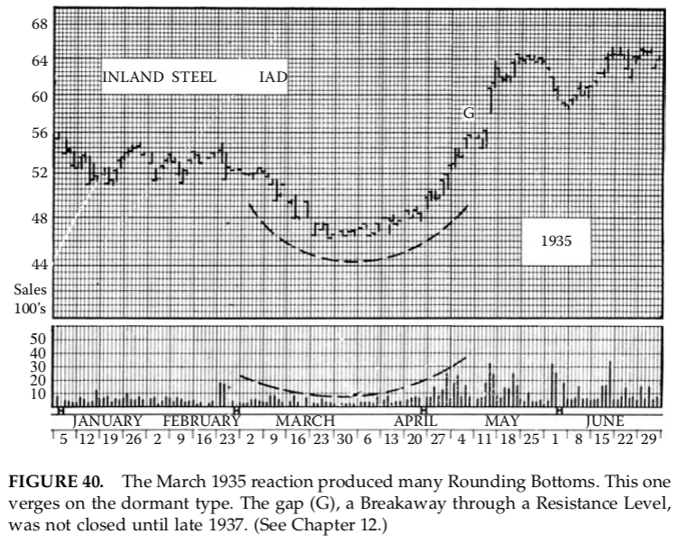

**HÌNH 40.** Phản ứng tháng Ba 1935 tạo ra nhiều Đáy Bo Tròn. Trường
hợp này gần với loại tiềm ẩn. Khoảng trống (G), một đột phá qua Mức
Kháng Cự, không được lấp đầy cho đến cuối 1937. (Xem Chương 12.)

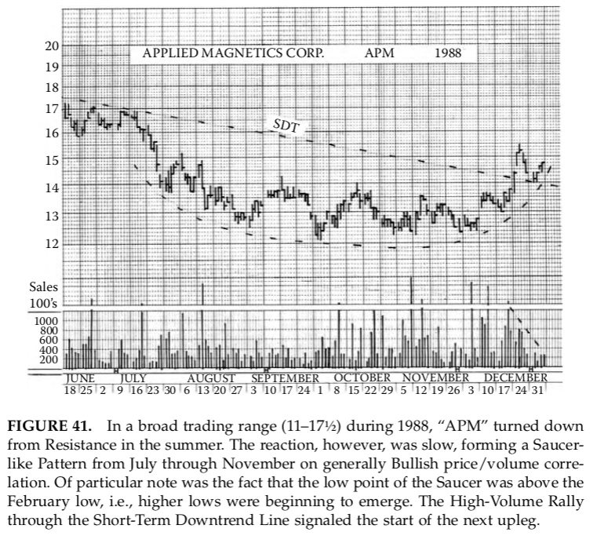

**HÌNH 41.** Trong phạm vi giao dịch rộng (11–17½) năm 1988, “APM”
giảm từ Kháng Cự vào mùa hè. Tuy nhiên, phản ứng diễn ra chậm,
tạo thành mô hình giống “Chảo” từ tháng Bảy đến tháng Mười Một
với sự tương quan giá/khối lượng chung là Tăng. Đáng chú ý là mức
thấp của Chảo cao hơn mức thấp tháng Hai, tức là các mức thấp cao
bắt đầu xuất hiện. Đợt hồi Khối Lượng Cao qua đường Xu Hướng Giảm
Ngắn Hạn báo hiệu bắt đầu nhịp tăng tiếp theo.

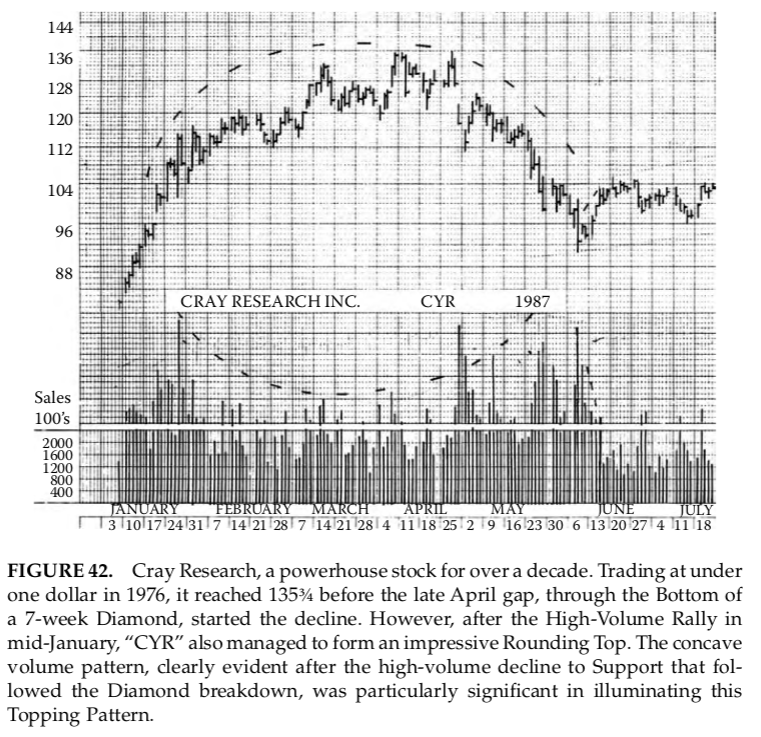

**HÌNH 42.** Cray Research, cổ phiếu mạnh mẽ trong hơn một thập kỷ.
Giao dịch dưới một đô la năm 1976, đạt 135¾ trước khoảng trống cuối
tháng Tư, qua đáy của Kim Cương 7 tuần, bắt đầu giảm. Tuy nhiên,
sau đợt hồi Khối Lượng Cao giữa tháng Một, “CYR” cũng tạo được
Đỉnh Bo Tròn ấn tượng. Mô hình khối lượng lõm, rõ ràng sau đợt giảm
khối lượng cao đến Hỗ Trợ theo sau sự phá vỡ Kim Cương, đặc biệt
quan trọng trong việc làm sáng tỏ Mô Hình Đỉnh này.

**HÌNH 43.** 1984. Chúng tôi yêu thích xu hướng Bo Tròn của Northern
Indiana Public Service. Mặc dù rõ ràng đây không phải là mô hình báo
trước đợt tăng như tên lửa, bức tranh kỹ thuật trở nên sáng sủa
hơn với đột phá khối lượng cao qua Kháng Cự ở cuối đồ thị.

## Chương 8. Các Mô hình Đảo chiều Quan trọng — Tam giác

Tiếp theo, chúng ta đến với một họ mô hình kỹ thuật hoàn toàn khác, các
Tam giác, một nhóm ít xuất hiện trên biểu đồ thập niên 1940 so với thập niên
1920 và 1930. Sự hiếm hoi trong thập niên đó thật đáng tiếc vì chúng là
một nhóm hấp dẫn với tiềm năng lợi nhuận tuyệt vời. (_EN: Minh chứng
rằng biểu đồ từ thập niên 1920 có thể được trộn lẫn với biểu đồ từ thập
niên 2000, xem so sánh Hình 269 và 269.1._) Trước khi xem xét chi tiết,
một tổng quan nhanh về lý thuyết cơ bản, cung cấp ý nghĩa và giá trị
cho phân tích kỹ thuật, có thể là cần thiết. Lý thuyết đó có thể tóm tắt
ngắn gọn như sau:

1. Giá trị thị trường của một chứng khoán được xác định duy nhất bởi sự
    tương tác giữa cung và cầu.
2. Cung và cầu tại bất kỳ thời điểm nào bị chi phối bởi hàng trăm yếu
    tố, có yếu tố hợp lý và yếu tố phi lý. Thông tin, ý kiến, tâm trạng,
    dự đoán (thông minh hay không) về tương lai kết hợp với những nhu
    cầu mù quáng trong phương trình này. Không ai có thể nắm bắt và
    cân nhắc tất cả, nhưng thị trường làm điều đó tự động.
3. Bỏ qua Dao động Nhỏ, giá di chuyển theo xu hướng kéo dài trong một
    khoảng thời gian đáng kể.
4. Thay đổi xu hướng, đại diện cho sự dịch chuyển quan trọng trong cân
    bằng cung-cầu, bất kể nguyên nhân, đều có thể được phát hiện _sớm_
    _hay muộn_ trong hành động thị trường.

Đến lúc này, thực tế được nhấn mạnh bằng chữ nghiêng trong câu cuối
có thể đã khiến bạn băn khoăn. Phàn nàn rằng Lý thuyết Dow thường
“muộn” đã được bàn. Các Mô hình Đảo chiều trong hai chương trước
không cho tín hiệu chắc chắn cho đến khi xu hướng thay đổi, thường
“sớm hơn” so với Lý thuyết Dow, nhưng không bao giờ ở mức giá đỉnh
hoặc đáy tuyệt đối. Người bán cổ phiếu ngay sau khi Đỉnh Vai-Đầu-Vai
hoàn tất trên biểu đồ có thể chỉ thu được không quá một nửa tổng
mức giảm từ đỉnh cực đại xuống đáy cực đại, vì theo công thức đo
lường của chúng ta, nửa đầu của đợt giảm có thể đã diễn ra trước khi
Mô hình Đảo chiều Đỉnh được xác nhận.

Hãy quyết định rằng không có cách nào khác. Dĩ nhiên, có người
may mắn bán cổ phiếu ở mức đỉnh tuyệt đối trên “đầu” (và một kẻ
khốn nạn mua). Người bán chỉ đơn giản là may mắn! Thành tích của
ông có thể so sánh với “hole-in-one” trong golf. Ngay cả người chơi
tệ cũng thỉnh thoảng trải nghiệm cảm giác đó. Nhưng người chơi
càng có kinh nghiệm, càng hài lòng khi hạ bóng an toàn lên green
không quá xa lỗ. Nhà đầu tư có kinh nghiệm càng ít quan tâm
đến việc kiếm điểm cuối cùng, hay thậm chí mười điểm cuối cùng,
từ cam kết thị trường của mình.

Không ai có thể chắc chắn _tại thời điểm đó_ rằng đang bán ở đỉnh cuối.
Chưa từng có quy tắc hay phương pháp nào được phát minh — hoặc sẽ
được — để đảm bảo mua gần đáy tuyệt đối, hoặc bán gần đỉnh tuyệt đối.
Dĩ nhiên, một người có thể chắc chắn mua cổ phiếu ở mức thấp tuyệt
đối nếu sẵn sàng mua tất cả cổ phiếu được chào bán, thậm chí toàn
bộ cổ phiếu lưu hành nếu cần. Lý thuyết mà nói, có thể cần tới 3,7 tỷ
USD để “đặt đáy” cho U.S. Steel ở 70, _(EN9: khoảng thập niên 1950)_
nếu bạn bị cám dỗ.

Người đọc, lúc này có thể nghĩ chúng ta “phàn nàn quá nhiều,” sẽ
thấy thêm lý do khi xem thói quen của Tam giác, vì các mô hình này
không luôn báo hiệu Đảo chiều Xu hướng. Ngược lại, ngoại trừ một
số dạng hiếm, chúng thường báo hiệu cái gọi là _Hợp nhất_, tạm
thời kết thúc một đợt lên hoặc xuống và tạo tiền đề cho một đợt
tăng hoặc giảm mạnh khác _cùng hướng_ sau này. (Schabacker gọi
các mô hình biểu đồ như vậy là “Mô hình Tiếp diễn.”) Lý do đưa
Tam giác vào phần này của nghiên cứu dưới tiêu đề chung Mô hình
Đảo chiều là vì chúng đôi khi hình thành tại các giai đoạn thay đổi
Xu hướng Chính, và đó chính là khoảng thời gian mà nhà đầu tư cần
nhận biết nhất.

##### Tam giác Đối xứng

Dạng Tam giác phổ biến nhất gồm một chuỗi dao động giá, mỗi dao
động _nhỏ hơn dao động trước_, mỗi Đỉnh Nhỏ không đạt đến mức
cao của đợt tăng trước, và mỗi Suy giảm Nhỏ dừng trên mức Đáy
trước đó. Kết quả là một “Đường Dow” co lại trên biểu đồ — một
khu vực giá ngang hoặc biên độ giao dịch mà đỉnh có thể xác định
tương đối bằng _đường biên nghiêng xuống_ và đáy được giới hạn
bằng _đường nghiêng lên_. Loại Tam giác này gọi là Tam giác Đối
xứng. Nếu muốn áp dụng chính xác ngôn ngữ hình học, có thể gọi
là Tam giác Nhọn, vì không nhất thiết đường biên Đỉnh và Đáy
bằng nhau hay tạo cùng góc với trục ngang. Tuy nhiên, các mô hình
này có khuynh hướng gần đối xứng; do đó, tên gọi hiện hành là phù
hợp. Mô hình này đôi khi còn được gọi là “Cuộn”.

Trong quá trình co lại hay cuộn, hình thành hành động giá của
Tam giác Đối xứng, hoạt động giao dịch giảm, có thể không đều
nhưng rõ rệt theo thời gian. Đường biên trên và dưới hội tụ về
phía bên phải (tương lai trên trục thời gian) tại đỉnh của Tam giác.
Khi giá dao động ngày càng hẹp về đỉnh, khối lượng giảm xuống
cực thấp. Sau đó, nếu là ví dụ điển hình, xảy ra hành động gợi
ý tên gọi “Cuộn.” Đột ngột và không báo trước, như lò xo bị siết
căng rồi bật ra, giá phá Tam giác kèm tăng khối lượng, và bật lên
trong đợt tăng mạnh tương đương khoảng di chuyển trước đó.

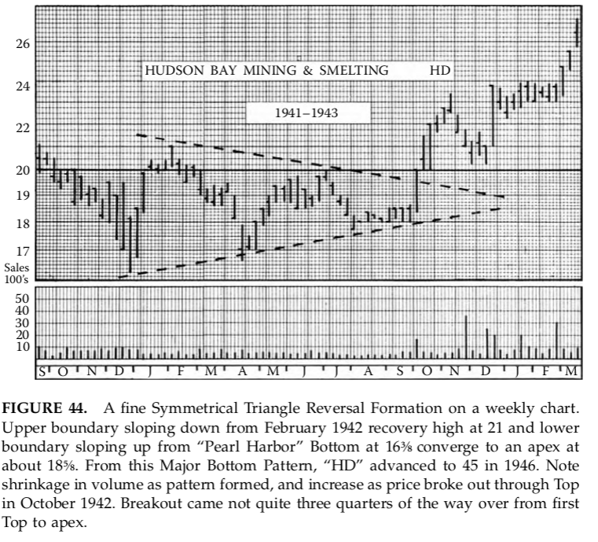

**HÌNH 44.** Mô hình Đảo chiều Tam giác Đối xứng đẹp trên biểu đồ tuần.
Đường biên trên nghiêng xuống từ đỉnh phục hồi tháng 2/1942 ở 21, đường
biên dưới nghiêng lên từ Đáy “Pearl Harbor” ở 16⅜ hội tụ tại đỉnh khoảng
18⅝. Từ Mô hình Đáy Chính này, “HD” tăng lên 45 năm 1946. Lưu ý
khối lượng giảm khi hình thành mô hình, và tăng khi giá phá đỉnh
tháng 10/1942. Breakout chưa qua ba phần tư từ đỉnh đầu tiên tới đỉnh.

Trên biểu đồ chứa Tam giác hiếm khi có manh mối cho thấy giá sẽ phá
mô hình theo hướng nào cho đến khi hành động xảy ra. Đôi khi có thể
đoán khá chính xác bằng cách quan sát biểu đồ cổ phiếu khác (một
vấn đề quan trọng sẽ bàn sau), nhưng thường thì chỉ còn cách chờ
thị trường quyết định hướng đi. Và “quyết định hướng đi” chính là
điều thị trường làm khi xây dựng Tam giác; mọi chi tiết của mô hình
dường như thể hiện sự do dự, chần chừ, trì hoãn cho đến khi quyết
định cuối cùng.

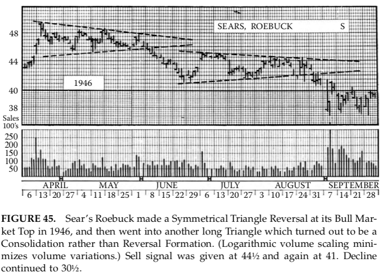

**HÌNH 45.** Sear’s Roebuck tạo Tam giác Đối xứng Đảo chiều tại Đỉnh Thị
trường Bò 1946, sau đó tiếp tục vào một Tam giác dài khác, hóa ra là
Hợp nhất hơn là Đảo chiều. (Thang khối lượng logarit giảm thiểu biến
động khối lượng.) Tín hiệu bán xuất hiện ở 44½ và 41. Giá tiếp tục giảm
xuống 30½.

##### Một số Lưu ý về Tam giác Đối xứng

Một Tam giác gọn gàng, rõ ràng là hình ảnh hấp dẫn, nhưng nó có những
tính năng khó lường. Người mới trong phân tích biểu đồ kỹ thuật thường
tự nhiên hay tìm Tam giác liên tục, và thường nghĩ đã phát hiện ra khi
thực ra là điều gì đó hoàn toàn khác đang hình thành. Hãy nhớ rằng cần
hai điểm để xác định một đường thẳng. Đường biên trên của một vùng giá
không thể vẽ được cho đến khi hai Đỉnh Xu hướng Nhỏ được xác lập rõ
ràng, tức là giá phải di chuyển lên rồi xuống đủ xa để hai đỉnh nổi bật
rõ ràng trên biểu đồ. Tương tự, đường biên dưới không thể vẽ cho đến
khi hai Đáy Xu hướng Nhỏ được xác lập rõ ràng. Do đó, trước khi kết
luận Tam giác Đối xứng đang hình thành, bạn phải thấy được _bốn_ lần
đảo chiều Xu hướng Nhỏ. Nếu xảy ra sau một đợt tăng giá, bạn phải có
đầu tiên một Đỉnh, tiếp theo một Đáy, tiếp theo Đỉnh thứ hai thấp hơn
Đỉnh đầu, và cuối cùng Đáy thứ hai cao hơn Đáy đầu (và giá phải tăng
ra khỏi Đáy thứ hai trước khi bạn chắc chắn đó là Đáy). Chỉ khi đó,
bạn mới vẽ được đường biên và giả định rằng bạn có Tam giác Đối xứng.

Một điểm khác cần nhớ — và không phù hợp với phép so sánh “cuộn” —
là càng tiến vào đỉnh Tam giác mà giá không phá đường biên, mô hình
càng có vẻ ít lực hay sức mạnh. Thay vì tạo thêm áp lực, nó bắt đầu
mất hiệu quả sau một giai đoạn nhất định. Các đợt di chuyển tốt nhất
(lên hay xuống) dường như xảy ra khi giá phá quyết đoán tại điểm
nào đó giữa nửa và ba phần tư khoảng cách ngang từ đáy (bên trái)
tới đỉnh. Nếu giá tiếp tục dao động “ngang” ngày càng hẹp sau dấu
ba phần tư, chúng thường đi thẳng tới đỉnh và vượt ra trong trôi
lờ đờ hoặc gợn sóng khiến nhà phân tích biểu đồ hoàn toàn bối
rối. Việc tốt nhất trong trường hợp này là tạm rời và tìm điều
hứa hẹn hơn ở phần khác của sổ biểu đồ.

Điểm khó khác là đôi khi cần vẽ lại một hoặc cả hai đường biên
trước khi Tam giác hoàn tất (tức là trước khi giá phá và di chuyển
ra khỏi nó một cách quyết đoán). Ví dụ, sau hai Đỉnh Tăng đầu tiên
xác lập đường biên trên nghiêng xuống, đợt tăng thứ ba từ đường
biên dưới đẩy lên _qua_ đường đỉnh ban đầu một cách vừa phải,
và sau đó, không tạo ra khối lượng breakout nhận diện, dừng lại
trước khi vượt mức cao nhất của Đỉnh mẫu thứ hai trước đó. Khi
giá rớt lại vào mô hình, cần từ bỏ đường biên trên ban đầu và vẽ
một đường mới qua các đỉnh của đợt tăng thứ nhất và thứ ba.

##### Cách Giá Phá Tam giác Đối xứng

Giá có thể phá Tam giác Đối xứng lên hoặc xuống. Như đã nói ở
trên, hiếm khi có manh mối về hướng cho đến khi giá thực sự
phá khỏi “vùng nghi ngờ” hình tam giác một cách quyết đoán.
Một cách tổng quát, các nguyên tắc đã nêu cho phá mô hình
Vai-Đầu-Vai cũng áp dụng ở đây. Ví dụ, biên độ đóng giá vượt
qua đường mô hình khoảng 3%. Cũng cần thiết là phá _lên_ phải
được xác nhận bằng khối lượng giao dịch tăng rõ; nếu không, đừng
tin vào thành tích giá. Nhưng phá _xuống_, như trong Vai-Đầu-Vai,
không yêu cầu xác nhận bằng khối lượng. Thực tế, khối lượng
thường tăng, nhưng với đa số phá xuống, không đáng kể cho đến
khi giá rơi dưới Đáy Nhỏ trước đó trong Tam giác, có thể thấp
hơn vài điểm so với đường biên tại thời điểm phá thực tế.

Điều kỳ lạ là phá xuống với khối lượng nặng ngay từ đầu
thường là tín hiệu sai hơn là bắt đầu xu hướng giảm thực sự
đáng theo. Điều này đúng đặc biệt nếu phá xảy ra khi giá
đã tiến xa tới đỉnh Tam giác; một crack khối lượng cao thường —
chúng ta có thể nói hầu như luôn luôn — phát triển thành một
“lắc 2-3 ngày” nhanh chóng đảo chiều và sau đó theo sau
bởi đợt tăng _thật sự_.

Tất cả những điều trên có thể khiến người đọc bối rối. Đây là
một mô hình kỹ thuật đẹp nhưng không luôn đáng tin. Không may,
Tam giác Đối xứng chịu nhiều _tín hiệu giả_ hơn Vai-Đầu-Vai
hoặc các mô hình khác đã bàn. Một số tín hiệu giả không thể
xác định trước khi đã cam kết rủi ro (dù chiến thuật tốt hạn
chế mất mát nhỏ). Và, một lắc điển hình như mô tả ở đoạn
trước, có thể tạo ra double cross, tiếp tục giảm thật sự.
Không mô hình kỹ thuật nào đáng tin 100%, và Tam giác Đối xứng
là trường hợp tệ nhất.

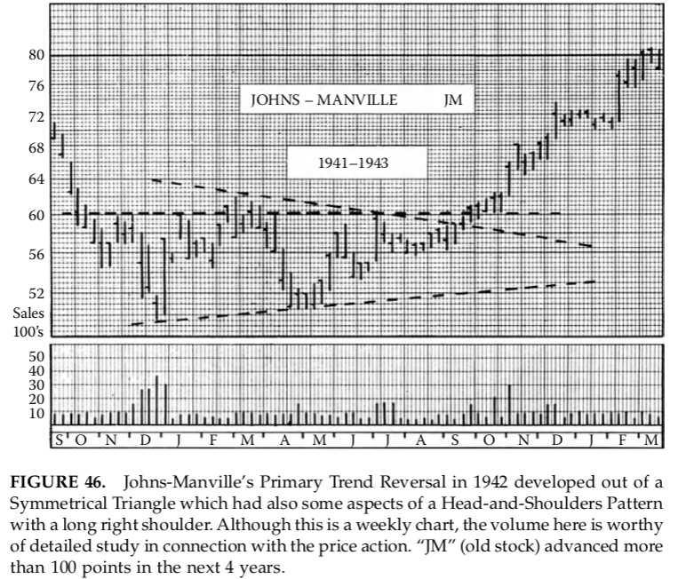

**HÌNH 46.** Đảo chiều Xu hướng Chính của Johns-Manville năm 1942 từ
Tam giác Đối xứng, cũng có vài nét của mô hình Vai-Đầu-Vai với
vai phải dài. Mặc dù đây là biểu đồ tuần, khối lượng đáng chú
ý khi nghiên cứu hành động giá. “JM” (cổ phiếu cũ) tăng hơn
100 điểm trong 4 năm tiếp theo.

Nhưng hầu hết Tam giác Đối xứng — thiếu thống kê chính xác,
kinh nghiệm gợi ý hơn hai phần ba — hoạt động đúng, không tạo
tín hiệu giả trước khi thiệt hại. Phá lên với khối lượng cao
có thể sớm, tức giá trở lại mô hình và làm thêm “công việc”
trước khi xu hướng lên thật sự bắt đầu, nhưng hiếm khi là giả.
Chúng ta sẽ bàn thêm về tín hiệu giả trong chương này và
sau về kinh nghiệm giúp trader tự bảo vệ.

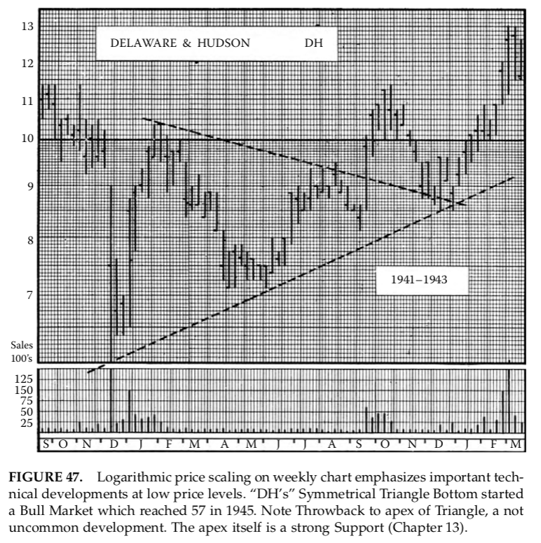

**HÌNH 47.** Thang giá logarit trên biểu đồ tuần nhấn mạnh phát triển
kỹ thuật quan trọng ở mức giá thấp. Tam giác Đáy Đối xứng của
“DH” bắt đầu Thị trường Bò, đạt 57 năm 1945. Lưu ý Throwback
về đỉnh Tam giác, phát triển không hiếm. Đỉnh là Hỗ trợ mạnh
(Chương 13).

##### Một Mô Hình Tam Giác Điển Hình

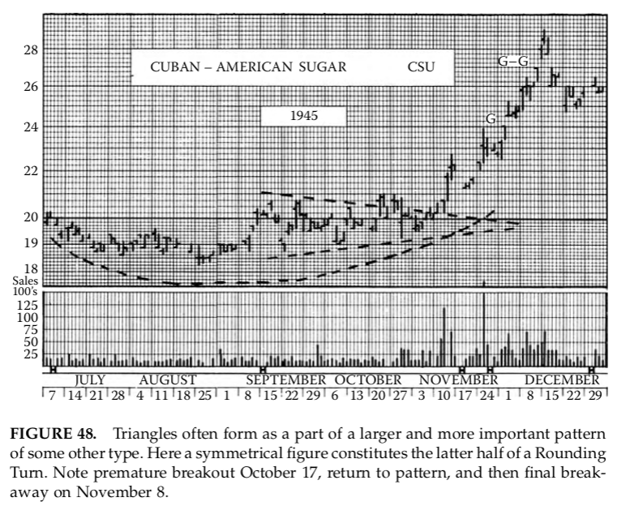

**HÌNH 48.** Tam giác thường hình thành như một phần của mô hình lớn
hơn và quan trọng hơn thuộc loại khác. Ở đây, một hình đối xứng
tạo thành nửa sau của một Đỉnh Bo Tròn. Lưu ý đột phá sớm ngày
17 tháng Mười, trở lại mô hình, và sau đó đột phá cuối cùng ngày
8 tháng Mười Một.

Một số ví dụ đồ thị thực tế về Tam Giác Đối Xứng minh họa chương
này sẽ giúp người đọc làm quen với sự xuất hiện của chúng trong
các hình thái khác nhau. Tuy nhiên, sẽ hữu ích nếu mô tả chi tiết
cách một mô hình điển hình phát triển từng bước. Giả sử bạn đang
theo dõi một cổ phiếu trên đồ thị của bạn, đã tăng, chỉ với các
trì hoãn ngắn bình thường và các phản ứng không đáng kể, từ
khoảng 20 lên 30, 32, 35, và vẫn tiếp tục đi lên. (Hy vọng bạn đã
mua nó ở mức 20!) Thấp hơn, khối lượng giao dịch dao động từ
300 đến 600 cổ phiếu mỗi ngày, nhưng bây giờ, trên 30, nó đã
thu hút khá nhiều người theo dõi, và khối lượng hằng ngày tăng
lên khoảng 1000. Khi gần 40, hoạt động nhảy lên gần 2000 cổ
phiếu, thị trường “quay cuồng” giữa 39 và 40, và sau đó giá bắt
đầu giảm. Khi giá giảm trở lại, bạn (đặc biệt nếu sở hữu cổ phiếu)
theo dõi với một số lo lắng, nhưng bạn biết khó có khả năng nó
sẽ giảm thẳng xuống 20; cổ phiếu không hành xử như vậy.
_(EN9: Đôi khi hiện nay có thể vậy, thế kỷ 21.)_ Nếu xu hướng
của cổ phiếu này thực sự đảo chiều, nó vẫn nên dành thêm thời
gian quanh mức đỉnh, tạo ra một Mô Hình Phân Phối.

Giá giảm tiếp tục trong 10 ngày với khối lượng cũng giảm khá
đáng kể. Khi giá trở lại 33, khối lượng khoảng 700 cổ phiếu
mỗi ngày. Ở mức 33, nó có thể tăng lại một ngày lên 800 hoặc
900 cổ phiếu, nhưng phản ứng dừng lại ở đó, và sau một hai
ngày, giá lại bắt đầu tăng với ít thay đổi về khối lượng. Trong
8–9 ngày, giá đã trở lại vùng 30 cao và hoạt động tăng lên,
đạt khoảng 1200 cổ phiếu khi giá chạm 39. Thay vì tiến lên 40
hoặc hơn, một phản ứng mới xuất hiện và giá trượt xuống 37.
(Có thể bạn sẽ hình dung dễ hơn nếu vẽ sự phát triển này
trên một mẩu giấy đồ thị.) Bây giờ rõ ràng Đỉnh thứ hai đã
hình thành tại 39; bạn có thể vẽ một đường mô hình tạm thời
(trong các tài liệu khác có tên khác, như sẽ thấy sau) trên
đồ thị, nối hai vùng cao cực đại (không phải giá đóng cửa),
với đường nghiêng xuống từ trái sang phải. Cho đến nay bạn
chỉ có một điểm Đáy nên chưa thể vẽ đường từ đó. Nhưng lần
giảm thứ hai này cho thấy hoạt động giao dịch còn ít hơn
lần đầu. Khối lượng giảm còn 400 cổ phiếu và giá dừng ở 34;
đường giá “bo tròn” và tăng trở lại; giao dịch trầm lắng nhưng
bắt đầu tăng khi chạm 36.

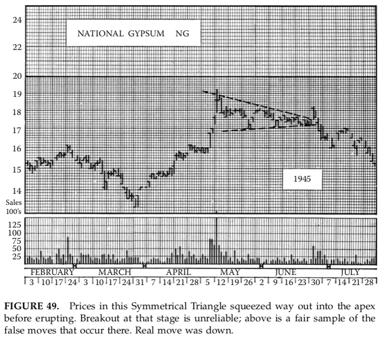

**HÌNH 49.** Giá trong Tam Giác Đối Xứng nén lại vào đỉnh
trước khi bùng phát. Đột phá ở giai đoạn này không đáng tin;
phía trên là ví dụ điển hình về các chuyển động giả xuất hiện
ở đó. Chuyển động thực là giảm.

Hành động này xác định Đáy Nhỏ thứ hai và bây giờ bạn có
thể vẽ một “tiếp tuyến đáy,” một đường nghiêng lên nối các mức
giá thấp cực đoan trong hai phản ứng, lần đầu tại 33 và lần
thứ hai tại 34. Hai đường mô hình sẽ hội tụ, gặp nhau gần mức
36½ khoảng 4 tuần sau (tức là về phía phải) trên đồ thị.
Bạn có một Tam Giác Đối Xứng — _nhưng_ bạn không biết giá
sẽ phá vỡ xuống hay vượt qua nghi ngờ hiện tại và tăng lên
trong đợt tăng mới đáng theo dõi. Bạn chỉ có thể quan sát
các diễn biến tiếp theo rất sát và sẵn sàng hành động khi
cần thiết.

Đợt hồi thứ hai tăng nhẹ khối lượng, đạt khối lượng hằng
ngày khoảng 700 cổ phiếu, và tăng lên 38, một phần ngày
tới 38½. Điều này chạm qua đường mô hình đã vẽ trước
đó khoảng ¼ điểm (vì mỗi dao động ngắn hơn về điểm và
tương ứng về thời gian). Nhưng khối lượng trong Đột phá
Nhỏ này ít hơn đỉnh trước (tại 39), và mua lại giảm. Khi
giá quay trở lại 37 và 36, bạn nên vẽ đường tiếp tuyến
trên mới nối Đỉnh đầu 40 và Đỉnh cuối 38½. Có dấu hiệu
rằng cân bằng có thể hơi nghiêng về phía cầu, nhưng
đừng trông cậy quá. Độ chính xác tuyệt đối không được
mong đợi; Tam Giác cần có một ít dung sai.

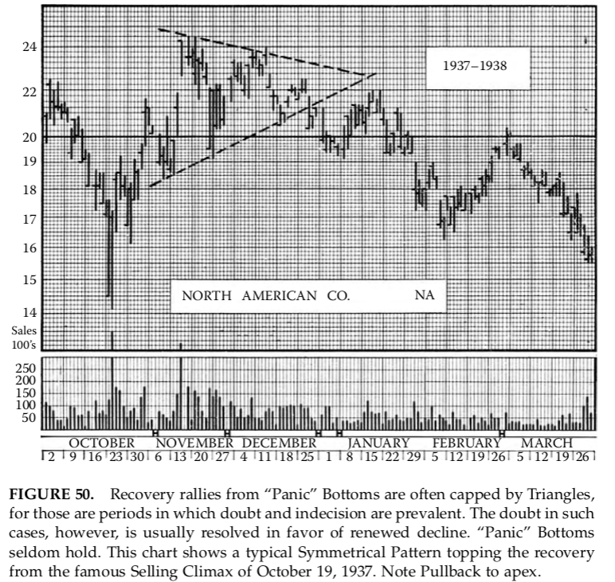

**HÌNH 50.** Các đợt hồi từ Đáy “Hoảng Loạn” thường bị Tam
Giác chặn lại, vì đó là giai đoạn nghi ngờ và phân vân.
Tuy nhiên, trong các trường hợp như vậy, nghi ngờ thường
được giải quyết theo hướng giảm mới. Đáy “Hoảng Loạn”
hiếm khi giữ được. Biểu đồ này cho thấy một Tam Giác
Đối Xứng điển hình trên đỉnh hồi từ Đỉnh Bán Cao nổi
tiếng ngày 19 tháng Mười 1937. Lưu ý Pullback về đỉnh.

Trong phản ứng thứ ba, hoạt động giảm xuống thấp nhất
từ trước đến nay. Đường biên đáy nghiêng lên sẽ đạt
khoảng mức 35 nếu giá tiếp tục xu hướng hiện tại.
Cần lưu ý xem liệu giá sẽ xuống hoàn toàn hay không,
bởi nếu không — nếu suy giảm dừng nửa điểm hoặc
hơn trên đó — hành động này sẽ làm nổi bật ý nghĩa
của sự vượt qua đường biên trên trước đó. Nhưng điều
này không xảy ra; giá tiếp tục giảm xuống 35, và khối
lượng chỉ còn khoảng 200 cổ phiếu mỗi ngày, ít hơn
giai đoạn đầu tiên của đợt tăng ban đầu trên 20. Đây là
vị trí quan trọng. Đường giá phẳng đi một lúc, tăng nhẹ
nhưng vẫn leo lên, vượt 36½, tăng khối lượng, chạm
đường biên Tam Giác trên mới tại 37½ và ngày kế,
phá vỡ với khối lượng 1500 cổ phiếu, đóng cửa 39⅛.
Đây là đột phá; nghi ngờ được giải quyết và (trừ khi
có chuyển động giả, ít khả năng ở giai đoạn này) xu
hướng lại tăng. Lưu ý không cần giá vượt đỉnh trước
40 để tạo tín hiệu này — đó là một điểm thú vị
về Tam Giác Đối Xứng.

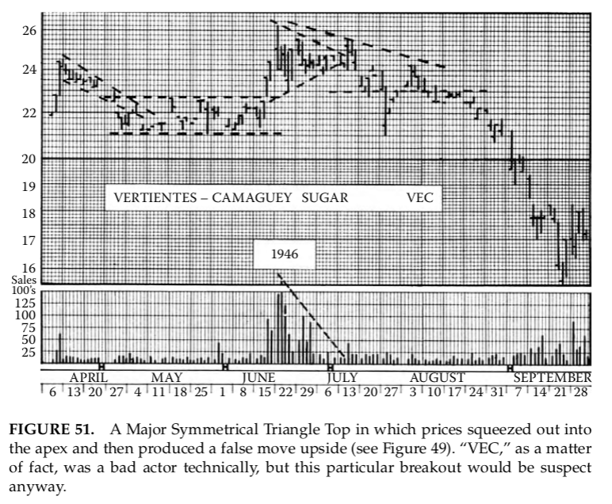

**HÌNH 51.** Một Tam Giác Đối Xứng Lớn, trong đó giá nén vào
đỉnh và sau đó tạo một chuyển động giả lên (xem Hình 49).
“VEC,” thực ra là một trường hợp kỹ thuật xấu, nhưng đột
phá này vẫn đáng nghi ngờ.

##### Đảo chiều hay Tích lũy

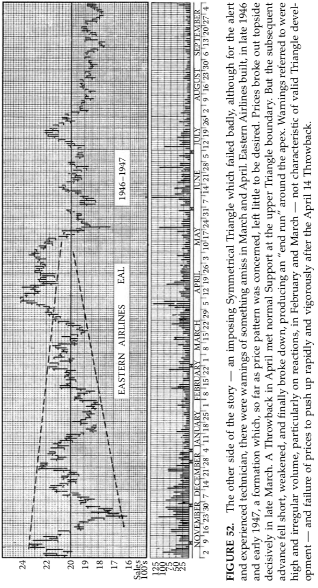

**HÌNH 52.** Mặt khác của câu chuyện — một Tam giác Đối xứng đồ sộ
thất bại nặng, dù với nhà kỹ thuật cảnh giác và có kinh nghiệm,
đã có cảnh báo điều bất thường vào tháng 3 và 4. Eastern Airlines
xây dựng, cuối 1946 và đầu 1947, một hình thành mà về mô hình giá
không còn gì để chê. Giá phá lên rõ ràng vào cuối tháng 3. Một
Throwback vào tháng 4 gặp Hỗ trợ bình thường tại đường biên trên
Tam giác. Nhưng đợt tăng sau đó yếu và cuối cùng sụp xuống,
tạo “đường vòng” quanh đỉnh. Cảnh báo liên quan đến khối lượng
cao và không đều, đặc biệt khi phản ứng, vào tháng 2 và 3 — không
đặc trưng cho phát triển Tam giác hợp lệ — và giá không tăng nhanh
và mạnh sau Throwback ngày 14 tháng 4.

Nhưng, chúng ta đã bắt đầu thảo luận Tam giác Đối xứng như Mô hình
Đảo chiều, và ví dụ này hóa ra là _Mô hình Tích lũy_, tức chỉ là giai
đoạn nghỉ trong xu hướng tăng liên tục. Thật vậy, ba trên bốn mô hình
như vậy thường là như thế. Mẫu thứ tư là nguy hiểm (nếu bạn sở hữu
cổ phiếu). Nó khác thế nào?

Ví dụ trên có thể là Đảo chiều thay vì Tích lũy bất kỳ lúc nào
trước bước phá quyết định lên 39. Nếu là Đảo chiều điển hình,
thay đổi đầu tiên sẽ xuất hiện ngay sau khi đợt tăng cuối cùng
bắt đầu từ Đáy thứ ba ở 35. Đợt tăng đó dừng khoảng 36½, giá
bắt đầu trôi ngược lại. Khi hoạt động tăng nhẹ, đường biên dưới
bị phá. Khi giá rơi về 34, khối lượng hàng ngày có thể lên 600–700
cổ phiếu. Bất kỳ giảm thêm nào sẽ là tín hiệu giảm, kích hoạt
tăng khối lượng và đẩy nhanh đà giảm khi lệnh stop-loss
(sẽ bàn sau) dưới 34 bị “kích hoạt”.

Trước khi rời ví dụ điển hình, chúng ta nên nhắc đến các phản
ứng hậu phá hay Pullback đôi khi xảy ra. Như với mô hình
Vai-Đầu-Vai, bước phá đầu tiên từ Tam giác Đối xứng có thể
dừng trước khi giá đi xa khỏi mô hình và được theo sau bởi
Phản ứng Nhỏ, thường 2–3 ngày, đưa giá trở lại gần đường
biên gần nhất. Ví dụ đầu tiên, khi phá xảy ra, đưa cổ phiếu
lên 39⅛, ngày tiếp theo có thể lên 40, rồi vài ngày sau giảm
trở lại 37½–38 do hoạt động yếu. Đợt tăng tiếp theo sẽ tiếp tục
với sức mạnh hơn. Phá xuống đôi khi cũng theo kiểu này, trở lại
biên dưới, rồi giảm tiếp với khối lượng tăng. Tuy nhiên, phản
ứng hậu phá ít gặp ở Tam giác hơn so với Vai-Đầu-Vai.

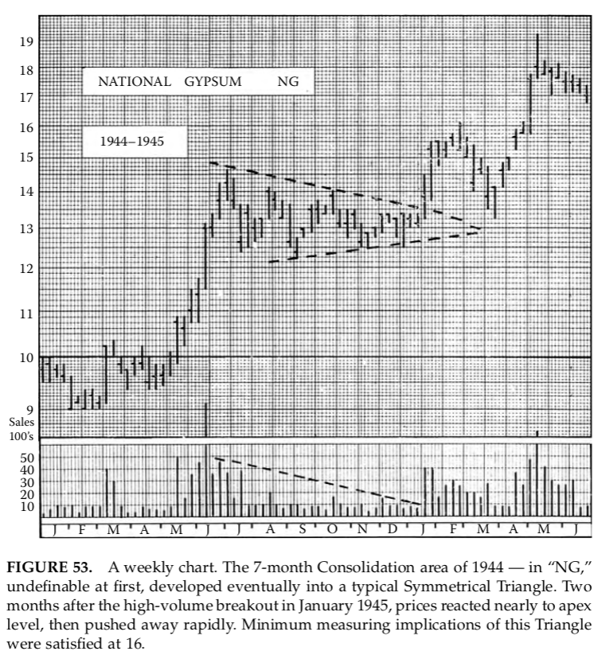

**HÌNH 53.** Biểu đồ tuần. Khu vực Tích lũy 7 tháng năm 1944 —
“NG,” ban đầu không xác định, sau cùng trở thành Tam giác Đối
xứng điển hình. Hai tháng sau phá khối lượng cao tháng 1
1945, giá phản ứng gần mức đỉnh, rồi tăng nhanh. Ý nghĩa đo
tối thiểu của Tam giác đạt 16.

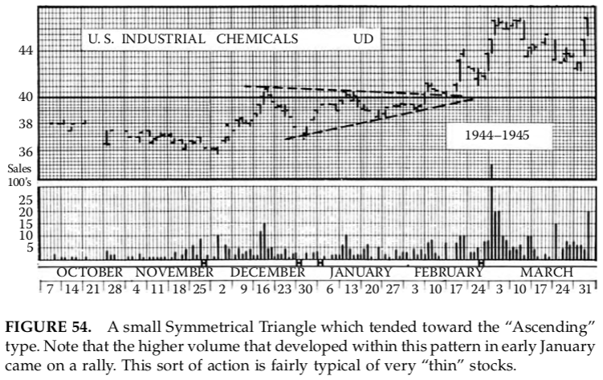

**HÌNH 54.** Một Tam giác Đối xứng nhỏ nghiêng về kiểu “Tăng”.
Lưu ý khối lượng cao xuất hiện trong mô hình đầu tháng 1
trên một đợt tăng. Hành động này khá điển hình với cổ phiếu
rất “mỏng.”

Trước khi nghiên cứu mô hình tiếp theo, chúng ta có thể bàn
về _lý do hình thành_ Tam giác Đối xứng. Việc này giúp hình
dung đặc điểm nếu thử suy ra trình tự sự kiện thường tạo ra
nó. Dĩ nhiên, nỗ lực này chỉ là đơn giản hóa quá mức, không
phù hợp tất cả biểu hiện Tam giác, nhưng hữu ích cho hiểu biết
về lý thuyết chung. Quay lại ví dụ điển hình. Chúng ta bắt
đầu với cổ phiếu tăng đều từ khoảng 20 lên 40 rồi phản ứng.
Điều gì xảy ra ở 40: nhiều nhà đầu tư có lợi nhuận giấy đáng kể,
gần 100%. (Một “con số tròn” như 40, 50, 75, 100 dễ trở thành
mục tiêu lợi nhuận tinh thần, tăng bán ra.) Một số người
thực hiện bán, tạm thời làm cân bằng kỹ thuật từ cầu sang cung;
họ bán ít hơn khi giá giảm. Những nhà đầu tư khác muốn tham
gia nhưng quá muộn để “lên tàu” dưới 30. Không muốn “đuổi”
lên 40, họ chào đón phản ứng, và khi giá về 33, đủ người sẵn
sàng mua để cân bằng lại sang phía cầu.

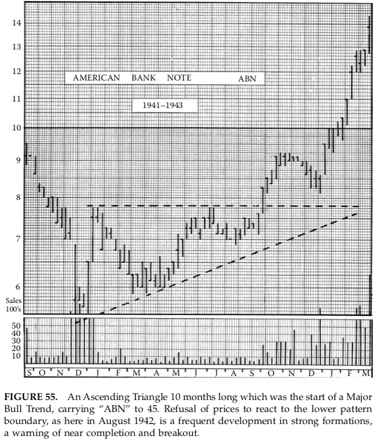

**HÌNH 55.** Tam giác Tăng 10 tháng, bắt đầu Xu hướng Bò lớn,
đưa “ABN” lên 45. Giá từ chối phản ứng tại biên dưới, như
tháng 8/1942, thường thấy trong mô hình mạnh, báo hiệu sắp
hoàn tất và phá.

Theo dõi đợt tăng, những người chưa kịp chốt lợi nhuận
gần 40 lần trước quyết định “ít tham hơn.” Họ bắt đầu bán
trên 37, đủ nhiều ở 39 để chặn đà. Quá trình lặp lại nhiều
lần, tiền mới liên tục vào gặp cung từ chủ sở hữu muốn
chốt lợi nhuận. Cuối cùng, cung được hấp thụ hoặc rút đi,
chuyên gia và nhà đầu tư nhận ra không còn cổ phiếu nào
trong sổ và đua mua. Đợt tăng (hoặc giảm) theo sau hoàn
thành Tam giác Đối xứng thường đáng giao dịch. Lợi thế
rõ ràng cho trader biết trước hướng phá. Khả năng cao
là di chuyển mới theo cùng hướng với trước Tam giác.
Khả năng cao nhất ở giai đoạn _đầu_ của Thị trường Bò hoặc
Gấu Chính, khả năng Đảo chiều tăng khi Xu hướng lớn chín.
Biểu đồ cổ phiếu khác cung cấp bằng chứng bổ sung. Ví dụ,
nếu cùng lúc bạn phát hiện Tam giác Đối xứng ở “PDQ,”
đa số biểu đồ khác cho thấy Saucers, Vai-Đầu-Vai Đáy,
Tam giác Tăng hoặc mô hình Bull điển hình, có thể giả định
Tam giác Đối xứng phá lên. Đôi khi tín hiệu sớm đủ mạnh
để mở vị thế.

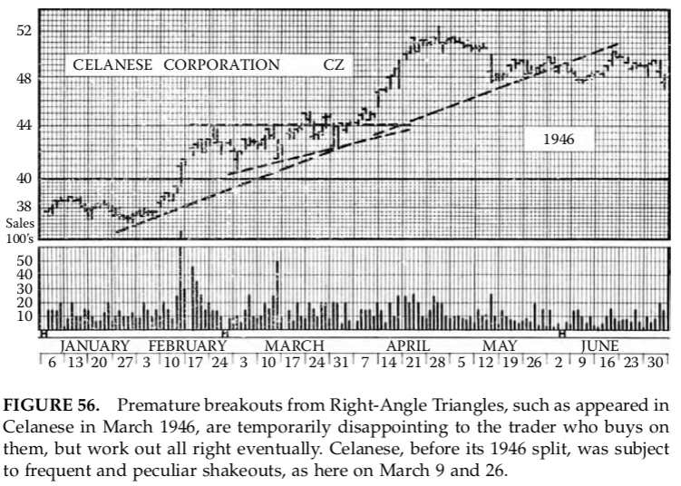

**HÌNH 56.** Phá sớm từ Tam giác Vuông, như Celanese tháng 3/1946,
thường làm trader tạm thất vọng, nhưng cuối cùng ổn. Trước
chia tách 1946, Celanese hay gặp shakeout kỳ lạ, như 9 và 26/3.

##### Tam Giác Góc Vuông

Chúng tôi đã nhắc đến Tam Giác _Tăng Dần_ trong đoạn trước. Tam Giác
Tăng và Giảm là các biểu hiện Tăng Giá và Giảm Giá, tương ứng, của lớp
mô hình tiếp theo, các _Tam Giác Góc Vuông_. Trong nhiều khía cạnh,
thực ra là hầu hết, chúng hoạt động giống như các họ hàng Đối Xứng,
nhưng với sự khác biệt rất đáng hài lòng này: chúng cảnh báo trước
ý định của mình. Do đó, tên gọi của chúng, vì giả định luôn là giá
sẽ tăng ra khỏi hình Tăng Dần và giảm từ hình Giảm Dần.

Tam Giác Đối Xứng, như chúng ta đã thấy, được tạo bởi chuỗi các dao
động giá hẹp dần, có thể giới hạn xấp xỉ ở đỉnh bởi một đường
nghiêng xuống và ở đáy bởi một đường nghiêng lên. Tam Giác Góc
Vuông được phân biệt bởi một biên gần như nằm ngang, trong khi
biên kia nghiêng về nó. Nếu đường trên nằm ngang và đường dưới
nghiêng lên gặp nó ở đâu đó về phía phải của đồ thị (đỉnh), Tam Giác
thuộc loại _Tăng Dần_. Nếu đường dưới nằm ngang và đường trên
nghiêng xuống, Tam Giác thuộc loại _Giảm Dần_.

**HÌNH 57.** Một đợt hồi mạnh từ Đáy Hoảng Loạn (bán ra “Pearl
Harbor”) bằng phẳng thành một Tam Giác Tăng Dần tuyệt vời. Lưu ý
đường cung nằm ngang tại 19, trên một đường cầu tăng dần. Đột
phá vào cuối tháng Chín báo hiệu sự khởi đầu của một đợt tăng
đáng kể. Hóa ra đó là một Thị Trường Tăng Chính, đưa Briggs
lên 53.

Những mô hình này hoàn toàn hợp lý và dễ giải thích. Ví dụ,
Tam Giác Tăng Dần minh họa theo cách đơn giản nhất những gì
xảy ra khi nhu cầu ngày càng tăng cho một cổ phiếu gặp một
khối lượng lớn cổ phiếu để bán ở mức giá cố định. Nếu nhu cầu
tiếp tục, cung được phân phối tại mức giá đó cuối cùng sẽ
bị hấp thụ hoàn toàn bởi các chủ sở hữu mới tìm mức cao hơn,
và giá sẽ tăng nhanh.

Một Mô Hình Tăng Dần điển hình phát triển tương tự như Tam Giác
Đối Xứng “lý tưởng” đã mô tả trước đây, với cổ phiếu tăng từ 20
lên 40, tại đó đủ cung xuất hiện trên thị trường để đáp ứng tất
cả người mua và tạo ra phản ứng. Nhận thấy nhu cầu tạm thời
được thỏa mãn, một số chủ sở hữu có thể bán ra trong đợt giảm,
nhưng cung nhanh chóng hết khi giá giảm xuống, ví dụ, 34, và
nhu cầu mới lại kích thích một đợt tăng mới. Giá lại gặp cung
tại 40, và tất cả người mua lại được đáp ứng. Tuy nhiên, lần
giảm thứ hai chỉ xuống 36 trước khi một đợt tăng khác phát
triển. Nhưng nhóm phân phối tại 40 vẫn còn một phần cổ phiếu
để bán, nên có thể cần thêm thời gian, một lần rút lui nữa và
một cuộc tấn công khác vào đường 40, trước khi cung ở đó
hết và xu hướng có thể tiếp tục tăng.

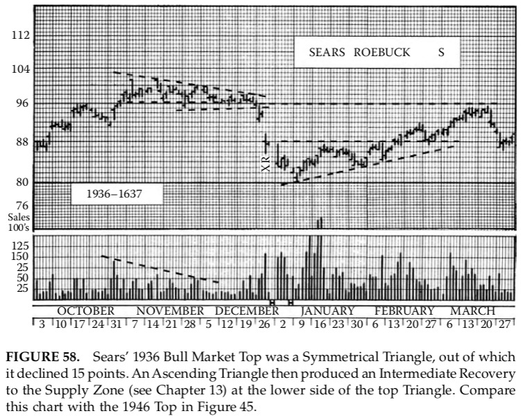

**HÌNH 58.** Đỉnh Thị Trường Tăng Sears năm 1936 là Tam Giác
Đối Xứng, từ đó giảm 15 điểm. Một Tam Giác Tăng sau đó tạo ra
Đợt Hồi Trung Gian lên Vùng Cung (xem Chương 13) ở cạnh
dưới của tam giác trên. So sánh biểu đồ này với Đỉnh năm 1946
trong Hình 45.

##### Một Phân Phối Được Lập Kế Hoạch

Loại hành động thị trường này cho thấy một chiến dịch được
lập kế hoạch bởi những người nắm giữ số lượng cổ phiếu khá lớn
để thanh lý ở giá xác định trước. Nó chứa ít yếu tố nghi ngờ mà
chúng tôi đã nhắc đến khi mô tả Mô Hình Đối Xứng. Chừng
nào nhu cầu còn duy trì, nhóm phân phối biết rằng cuối cùng
họ có thể thu hồi toàn bộ số cổ phiếu ở 40 và không cần bán
giá thấp hơn. Cũng rõ ràng rằng, chừng nào nhu cầu tiếp tục
tăng lên ở các mức cao hơn, một khi cung tại 40 được hấp thụ
hết, thị trường sẽ tăng nhanh và dễ dàng. Khi giá vượt qua
40, những người tiếp nhận cung ở mức đó sẽ thấy quyết định
của mình được chứng minh và sẽ không bán cho đến khi
họ có thể thu lợi nhuận tốt.

Điều cốt lõi, tất nhiên, nằm trong hai câu trên. Nhu cầu phải
tiếp tục xuất hiện ở mức cao hơn; nếu không, mô hình sẽ không
còn là Tam Giác Tăng Dần. Và cung phía trên cuối cùng phải
được hấp thụ, cho phép đột phá lên. Nếu nhu cầu yếu đi bất
kỳ trước khi Đường Cung (biên trên nằm ngang) bị phá vỡ,
phản ứng tiếp theo có thể hạ giá “ra ngoài mô hình,” và
kỹ thuật viên phải điều chỉnh lại bức tranh đồ thị. Người ta
có thể nghĩ rằng điều này xảy ra khá thường xuyên, nhưng theo
kinh nghiệm, điều đó hiếm thấy. Chúng tôi nói “hiếm thấy”
vì rõ ràng trong nhiều trường hợp phát triển Tam Giác Tăng,
nhóm bán tạo ra đường biên trên hoặc Đường Cung phải tin
rằng mức đó là gần mức cao nhất cổ phiếu có thể đạt được.

Là những người nắm giữ khối lượng lớn đủ để ảnh hưởng thị
trường trong vài tuần, đôi khi vài tháng, quyết định của họ
không nên bị coi thường. Tuy nhiên, khi rõ ràng rằng biên dưới
hoặc Đường Cầu nghiêng _lên_, xác suất chắc chắn khoảng 9–1
rằng các người mua mới sẽ chiếm ưu thế cuối cùng.

Đôi khi, phản ứng thứ ba hoặc thứ tư trong Tam Giác Tăng sẽ
phá xuống Đường Cầu nghiêng lên đã thiết lập trước (biên dưới),
nhưng sẽ dừng lại ở mức như phản ứng trước. Mô hình từ đó
phát triển thành _Hình Chữ Nhật_, một mô hình sẽ thảo luận
trong chương tiếp theo, và nên xem như vậy. (Chiến thuật
giao dịch trên Tam Giác Tăng và Giảm, bao gồm bảo vệ
trước các trường hợp sụp hiếm, sẽ được đề cập trong phần
thứ hai của cuốn sách.)
  
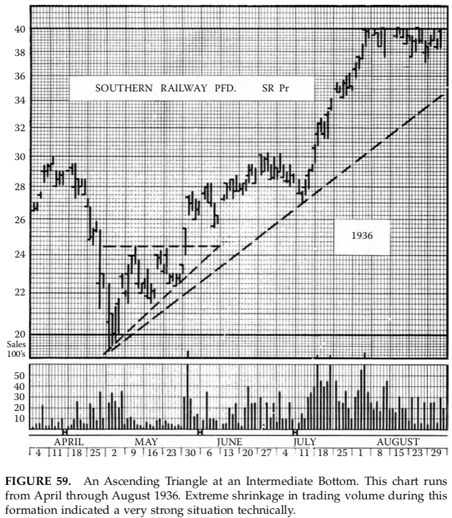

**HÌNH 59.** Tam Giác Tăng tại Đáy Trung Gian. Biểu đồ này từ
tháng Tư đến tháng Tám 1936. Sự giảm mạnh khối lượng giao
dịch trong mô hình này cho thấy tình hình kỹ thuật rất mạnh.

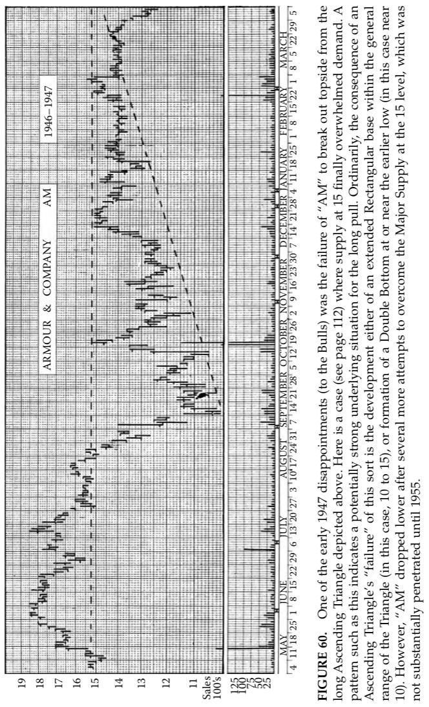

**HÌNH 60.** Một trong những thất vọng đầu năm 1947 (đối với
những nhà đầu tư tăng) là “AM” không phá được đỉnh của Tam
Giác Tăng dài mô tả trên. Đây là trường hợp (xem trang 112)
khi cung tại 15 cuối cùng áp đảo nhu cầu. Mô hình như vậy chỉ
ra một tình hình cơ bản tiềm năng mạnh cho đợt tăng dài.
Thông thường, hậu quả của “thất bại” Tam Giác Tăng loại này
là phát triển một đáy Hình Chữ Nhật mở rộng trong phạm vi
Tổng thể của Tam Giác (trong trường hợp này, 10–15), hoặc
tạo ra Đáy Kép gần mức thấp trước đó (trong trường hợp này
gần 10). Tuy nhiên, “AM” tiếp tục giảm sau vài lần thử
vượt qua Cung Chính ở mức 15, không bị phá đáng kể cho đến
1955.

##### Tam giác Giảm Dần

Tam giác Giảm Dần có đường biên dưới ngang hoặc Đường Cầu và đường
biên trên dốc xuống hoặc Đường Cung. Rõ ràng chúng được tạo ra từ
điều kiện thị trường ngược lại so với Tam giác Tăng. Ý nghĩa của chúng
cũng mạnh mẽ và thất bại cũng hiếm. Sự hình thành Tam giác Giảm Dần
phụ thuộc vào một chiến dịch của nhóm hay syndicate (thường là quỹ
đầu tư) _(EN9: hoặc Mutual Fund hoặc nhóm thâu tóm)_ nhằm mua khối
lượng lớn cổ phiếu một công ty ở giá định sẵn dưới thị trường. Lệnh
của họ được đặt và giữ cho đến khi khớp ở mức đó. Nếu các đợt
tăng liên tiếp từ việc mua này bị kìm hãm bởi nguồn cung cổ phiếu
mới thấp dần (tạo hình Tam giác Giảm điển hình), lệnh mua cuối cùng
được thực hiện hết và giá phá xuống. Việc phá đường hỗ trợ quan trọng,
mà nhiều trader thấy hiệu quả trong thời gian tương đối dài, thường
làm nản lòng những người chưa nghĩ đến bán. Lệnh bán của họ lúc này
được đưa ra thị trường và đẩy nhanh đà giảm.

##### Đặc điểm Khối lượng Giống Loại Đối xứng

Mục khối lượng của biểu đồ Tam giác Vuông hầu như không cần bàn.
Nó thường tương tự biểu đồ Tam giác Đối xứng. Hoạt động giảm dần
khi giá tiến về phía đỉnh. Trong Tam giác Tăng, thường tăng trên
mỗi đợt tăng và giảm trên mỗi đợt giảm; trong Tam giác Giảm, ngược lại,
nhưng đôi khi không rõ rệt. Các dao động nhỏ này không ảnh hưởng
xu hướng giảm chung của khối lượng cho đến khi đạt điểm phá.

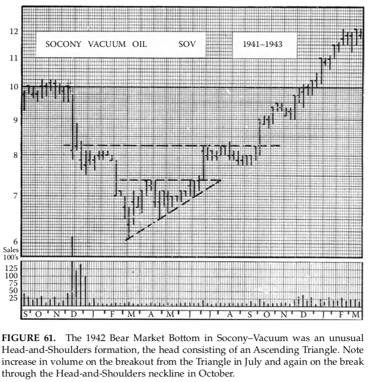

**HÌNH 61.** Đáy Thị trường Gấu 1942 của Socony–Vacuum là mô hình
Vai-Đầu-Vai bất thường, đầu gồm Tam giác Tăng. Lưu ý khối lượng tăng
khi phá Tam giác vào tháng 7 và phá đường cổ Vai-Đầu-Vai vào tháng 10.

Về phá giá, gần như mọi điều đã nói về Tam giác Đối xứng cũng áp dụng
cho loại Vuông. Phá lên (từ Tam giác Tăng) đi kèm tăng rõ rệt khối lượng;
nếu không, nên nghi ngờ. Phá xuống (Tam giác Giảm) có thể không tăng
hoạt động nhiều, nhưng khối lượng thường tăng ngày thứ hai hoặc ba
sau phá. Phản ứng Pullback về đường biên sau phá khá phổ biến, phụ
thuộc nhiều vào điều kiện chung thị trường. Ví dụ, nếu giá phá xuống
Tam giác Giảm của một cổ phiếu khi thị trường chung vững, Pullback
gần như chắc chắn xảy ra trước khi giảm sâu hơn.

Phá giá đáng tin cậy từ Tam giác Vuông thường xảy ra cùng giai đoạn
hoàn tất mô hình như Tam giác Đối xứng. Phá sớm càng ít khả năng
là giả (mặc dù phá giả từ Tam giác Vuông hiếm hơn nhiều so với
Đối xứng). Trong những trường hợp hiếm khi giá

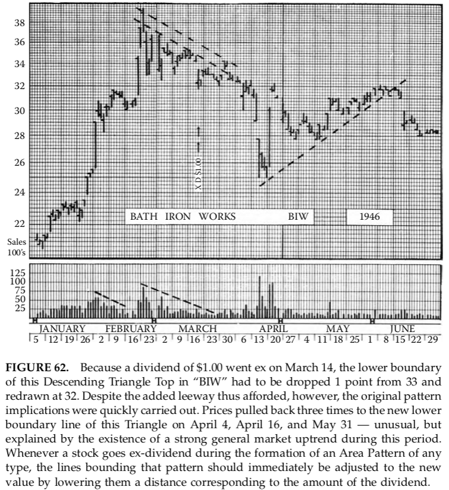

**HÌNH 62.** Vì cổ tức $1.00 trả vào 14/3, biên dưới Tam giác Giảm
“BIW” phải hạ 1 điểm từ 33 và vẽ lại tại 32. Dù có khoảng trống
thêm, mô hình vẫn được thực hiện. Giá ba lần pullback về biên mới
vào 4/4, 16/4 và 31/5 — hiếm, nhưng giải thích được nhờ xu hướng
tăng chung mạnh. Khi cổ phiếu trả cổ tức trong quá trình hình
thành bất kỳ Tam giác nào, đường biên cần điều chỉnh ngay tương
ứng số tiền cổ tức.

##### Ý nghĩa Đo lường của Tam giác

Chúng ta đã nêu (Ch.6) quy tắc đo tối thiểu cho chuyển động từ
Vai-Đầu-Vai, và có thể đặt quy tắc tương tự cho Tam giác — áp dụng
cả Đối xứng và Vuông. Phương pháp hình thành công thức Tam giác
khó giải thích bằng lời, nhưng có thể hiểu nhanh qua ví dụ minh họa.
Giả sử ta xét đợt tăng (phá lên), vẽ từ đỉnh đợt tăng đầu tiên
khởi tạo mô hình (góc trên bên trái) một đường song song với biên dưới.
Đường này dốc lên sang phải. Giá dự kiến leo đến đường này. Theo quy
tắc, sau phá, giá sẽ leo theo cùng góc hoặc tốc độ như trước khi vào
mô hình. Nguyên tắc này giúp ước lượng thời gian và mức giá. Quy tắc
tương tự áp dụng cho đợt giảm (phá xuống từ góc trái dưới).

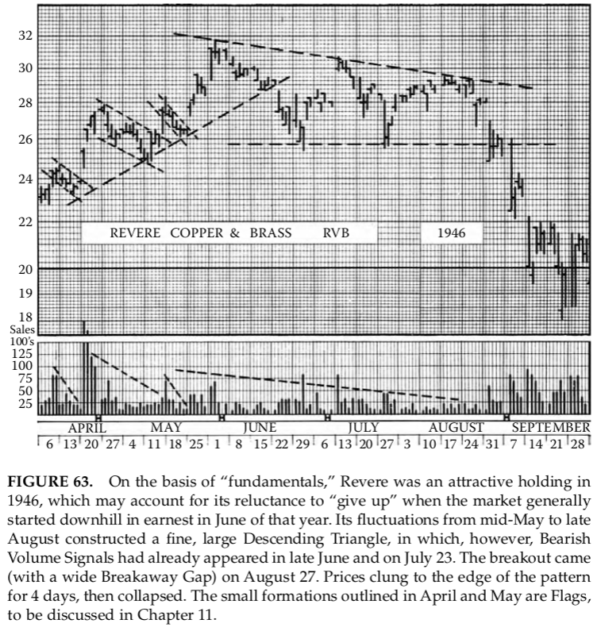

**HÌNH 63.** Dựa trên “cơ bản,” Revere hấp dẫn năm 1946, giải thích
giá khó “xuống” khi thị trường chung giảm mạnh tháng 6. Biến động
từ giữa tháng 5 đến cuối tháng 8 tạo Tam giác Giảm lớn, trong đó
tín hiệu khối lượng Bearish xuất hiện cuối tháng 6 và 23/7. Phá
với Gap lớn 27/8. Giá bám cạnh mô hình 4 ngày, rồi sụp. Các
mô hình nhỏ tháng 4 và 5 là Cờ, bàn sau Ch.11.

Áp dụng công thức trên cho phép ước lượng di chuyển từ Tam giác,
nhưng không chính xác hay tin cậy bằng công thức Vai-Đầu-Vai.
Lưu ý: Tam giác mất một phần sức mạnh nếu phá chậm đến khi giá
dồn về đỉnh.

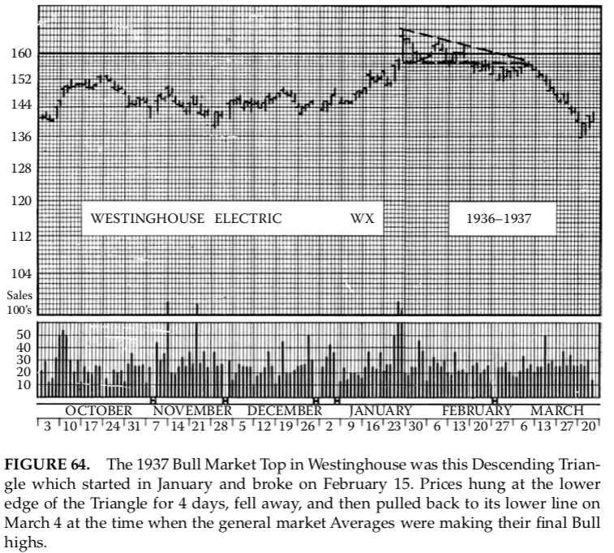

**HÌNH 64.** Đỉnh Thị trường Bò 1937 của Westinghouse là Tam giác
Giảm bắt đầu tháng 1 và phá 15/2. Giá bám biên dưới 4 ngày,
rơi, rồi pullback về biên dưới 4/3 khi chỉ số chung lập đỉnh Bò.

Biểu đồ này và nhiều biểu đồ trước minh họa điều quan trọng cho
kỹ thuật viên: Khi nhiều cổ phiếu cá nhân, sau đợt tăng mạnh,
tạo mô hình Đảo chiều Bearish rõ, phá xuống, rồi chỉ pullback
về biên dưới trong khi chỉ số chung tiếp tục lên đỉnh mới,
thị trường chung nguy hiểm, sắp xảy ra Xu hướng Giảm lớn.
Sự khác biệt kiểu này giữa nhiều cổ phiếu quan trọng và chỉ
số hiếm khi xuất hiện ở các Turn Trung gian. Cảnh báo rõ rệt
khi cổ phiếu lớn như Westinghouse, DuPont, GM… không “xác
nhận” đỉnh mới của chỉ số. Tham khảo Hình 12, 15, 18, 58 để so
sánh “thời điểm” với xu hướng chỉ số. Mô hình Saucers từ 10 đến 1
phân tích thành Vai-Đầu-Vai Phức hợp Tích lũy, bàn Ch.11.

**HÌNH 65.** Một loạt Tam giác, Đối xứng và Giảm, hình thành trong
Thị trường Gấu 1929–32 tại Hudson Motors. Chú ý không lúc nào
xuất hiện Đáy Lớn. Mỗi Tam giác thực hiện đúng ý nghĩa đo lường
trước khi tạm dừng hay pullback xảy ra. Theo dõi biểu đồ ngày
để định thời điểm giao dịch, nhưng luôn nhìn biểu đồ tuần và
tháng để giữ quan sát Xu hướng Chính.

Ngẫu nhiên, “WX” tiếp tục xuống 130 tháng 4/1937, tạo đáy Hình
Chữ nhật, hồi lên 158 (so với Tam giác Giảm trên), rồi xuống 88
tháng 11. So sánh biểu đồ ngày với biểu đồ tháng 1935–38 Ch.15.

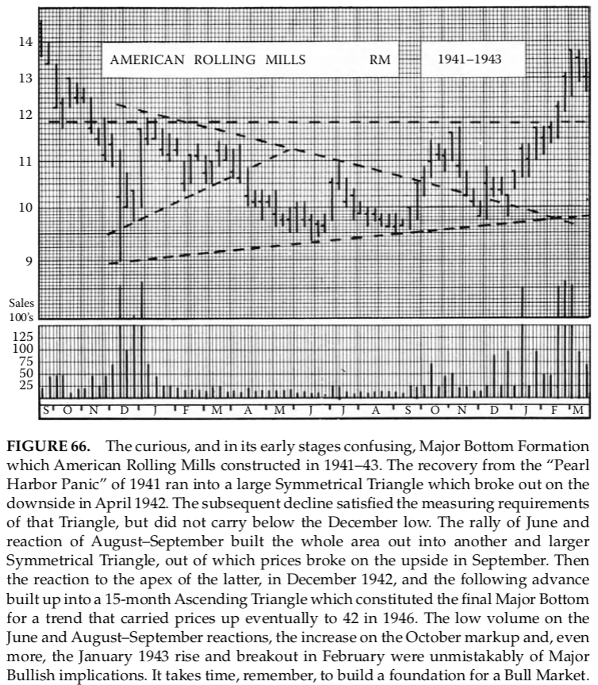

**HÌNH 66.** Đáy Chính kỳ lạ, ban đầu gây bối rối, mà American
Rolling Mills xây 1941–43. Phục hồi sau “Pearl Harbor Panic” 1941
đụng Tam giác Đối xứng lớn, phá xuống tháng 4/1942. Sự giảm tiếp
thỏa mãn yêu cầu đo Tam giác, nhưng không xuống thấp hơn đáy
tháng 12. Đợt tăng tháng 6 và phản ứng tháng 8–9 tạo Tam giác
Đối xứng lớn hơn, phá lên tháng 9. Phản ứng về đỉnh tháng 12/1942
và đợt tăng sau tạo Tam giác Tăng 15 tháng, trở thành Đáy Chính
cuối cùng, đưa giá lên 42 năm 1946. Khối lượng thấp trong các phản
ứng tháng 6 và 8–9, tăng tháng 10, và đặc biệt tăng tháng 1/1943
và phá tháng 2, rõ ràng mang ý nghĩa Bull Market. Nhớ rằng, cần
thời gian để xây nền cho Thị trường Bò.

##### Tam Giác trên Biểu Đồ Tuần và Tháng

Chúng ta đã thấy trong các nghiên cứu trước đây rằng các Mô Hình
Đầu và Vai có thể xuất hiện trên các biểu đồ dài hạn (tuần hoặc
tháng) và sẽ có tầm quan trọng tương xứng với kích thước của chúng.
Tam Giác cũng có thể phát triển. Trên biểu đồ tuần, ý nghĩa của
chúng thường rõ ràng và đáng tin cậy, nhưng các Mô Hình Tam Giác
thô ráp trên đồ thị giá tháng, đặc biệt là những hội tụ lỏng lẻo,
lớn mà cần nhiều năm mới hoàn thành, tốt nhất nên bỏ qua vì
không có ý nghĩa hữu ích.

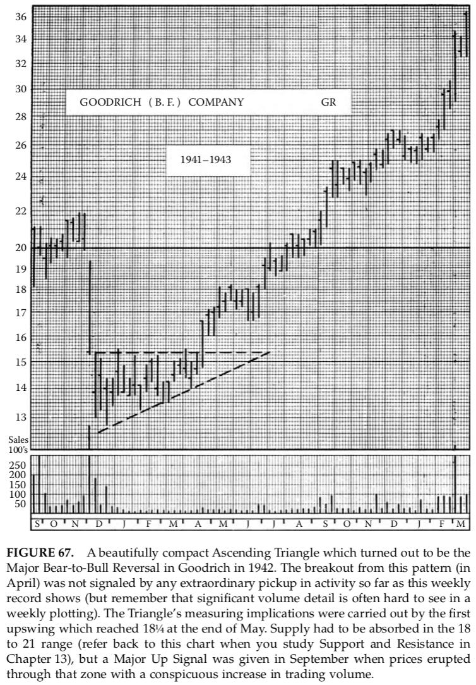

**HÌNH 67.** Một Tam Giác Tăng Dần đẹp và gọn, hóa ra là Sự
Đảo Chiều Lớn từ Giảm sang Tăng của Goodrich năm 1942. Đột phá
từ mô hình này (vào tháng Tư) không được báo trước bằng bất
kỳ sự gia tăng hoạt động nào, theo ghi chép tuần này (nhưng
hãy nhớ rằng chi tiết khối lượng quan trọng thường khó thấy
trên đồ thị tuần). Các ý nghĩa đo lường của Tam Giác được thực
hiện bởi đợt tăng đầu tiên đạt 18¼ vào cuối tháng Năm. Cung
phải được hấp thụ trong khoảng 18 đến 21 (tham khảo lại
biểu đồ này khi học về Hỗ Trợ và Kháng Cự trong Chương 13),
nhưng Tín Hiệu Tăng Lớn được đưa ra vào tháng Chín khi giá
bùng nổ qua vùng đó với sự gia tăng đáng kể trong khối lượng
giao dịch.

##### Các Mô Hình Tam Giác Khác

Còn có các mô hình hợp nhất hay tắc nghẽn giá khác có thể
giới hạn bởi các đường hội tụ, do đó có thể được xếp vào
nhóm Tam Giác.

Nhưng chúng lệch khỏi các Tam Giác thực sự trong chương
này một cách đáng kể về một hoặc nhiều khía cạnh quan trọng,
vì vậy tốt nhất nên xử lý chúng dưới các mục khác ở nơi khác.
Đó là các Cờ, Cờ Hiệu, và Nêm. Một nhóm mô hình khác
phát triển giữa các đường biên _tách ra_, vì lý do đó đôi khi
được gọi là Tam Giác Ngược. Nhưng nguyên nhân, đặc điểm,
và ý nghĩa dự báo của chúng khác biệt hoàn toàn, nên chúng
được đổi tên thành Mô Hình Mở Rộng và sẽ được bàn
trong chương sau.

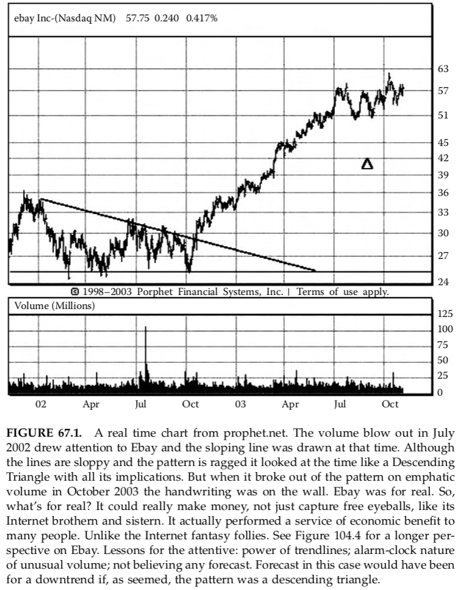

**HÌNH 67.1.** Biểu đồ thời gian thực từ prophet.net. Khối
lượng bùng nổ vào tháng Bảy 2002 đã thu hút chú ý đến Ebay
và đường nghiêng được vẽ vào thời điểm đó. Mặc dù các đường
không chính xác và mô hình lộn xộn, lúc đó nó trông giống
Tam Giác Giảm với tất cả ý nghĩa của nó. Nhưng khi nó phá vỡ
mô hình với khối lượng mạnh vào tháng Mười 2003, mọi việc
rõ ràng. Ebay thật sự. Vậy, điều gì là thật sự? Nó thực sự
tạo ra lợi nhuận, chứ không chỉ thu hút lượt xem miễn phí,
như các công ty Internet khác. Nó thực sự mang lại lợi ích
kinh tế cho nhiều người. Không giống như những trò ảo tưởng
Internet. Xem Hình 104.4 để có cái nhìn dài hạn về Ebay.
Bài học cho người chú ý: sức mạnh của các đường xu hướng;
tính cảnh báo của khối lượng bất thường; không tin tưởng
vào bất kỳ dự báo nào. Trong trường hợp này, dự báo
sẽ là xu hướng giảm nếu, như có vẻ, mô hình là Tam Giác
Giảm.

Độc giả có thể cảm thấy chán nản tại thời điểm này vì
chúng tôi thường xuyên dùng các trạng từ bổ nghĩa như
_usually_, _ordinarily_ và tương tự. Điều này không thể
tránh nếu muốn trình bày hình ảnh chính xác về những gì
thực sự xảy ra. Không có hai mô hình biểu đồ nào hoàn
toàn giống nhau; không có hai xu hướng thị trường nào
phát triển theo cùng một cách. Lịch sử lặp lại trên thị
trường chứng khoán, nhưng không bao giờ chính xác.
Tuy nhiên, nhà đầu tư làm quen với mẫu hình lịch sử,
với hành động thị trường bình thường, và từ chối bị cám
dỗ tham gia dựa trên niềm tin “lần này sẽ khác,” sẽ
vượt xa người tìm kiếm ngoại lệ hơn là quy luật.

Người mới thường may mắn. Họ sẽ tìm thấy Tam Giác,
Đầu và Vai, hoặc các mô hình quan trọng khác, lần lượt trên
biểu đồ, quan sát chúng phát triển, và thấy chúng thực hiện
các đợt di chuyển sinh lợi theo quy luật. Rồi ngoại lệ
sẽ xuất hiện — hoặc họ bỏ qua bức tranh lớn khi tập trung
vào một số mô hình nhỏ — và bất ngờ nhận ra rằng họ
bị mắc vào một trò chơi tệ hại. Do đó, chúng tôi luôn
nhấn mạnh vào các chuyển động không tuân thủ.
Các từ cảnh báo này là cần thiết vì phân tích kỹ thuật
hành động thị trường sẽ không phải là khoa học chính xác.

## Chương 9. Các Mô hình Đảo Chiều Quan Trọng — Tiếp theo, Tam giác chữ nhật, Đỉnh đôi và Ba

Các Mô hình Giá Tam giác mà chúng ta xem ở chương trước có thể là
_mô hình Đảo Chiều_ hoặc _mô hình Tích lũy_. Trong trường hợp
Tam giác Vuông, ta biết ngay khi chúng đạt dạng nhận biết được hướng
xu hướng sẽ (hoặc nên) tiến tới. Với Tam giác Đối xứng, ta không thể
biết chúng hướng lên hay xuống cho đến khi giá thực sự phá ra, mặc
dù xác suất là xu hướng trước sẽ tiếp tục thay vì đảo chiều. Về điểm
này và nhiều điểm khác, lớp tiếp theo của các mô hình kỹ thuật,
_các Tam giác chữ nhật_, giống Tam giác Đối xứng. Thực tế có nhiều
điểm tương đồng đến mức chúng ta có thể bỏ qua thảo luận dài dòng.
Một _Tam giác chữ nhật_ gồm chuỗi biến động giá ngang, một “khu vực
giao dịch,” đôi khi được gọi, có thể được giới hạn cả trên và dưới
bằng các đường _ngang_. Nhìn nhanh các ví dụ minh họa trang này sẽ
thấy tên gọi. Thỉnh thoảng, bạn có thể thấy biểu đồ với đường biên
trên và dưới song song nhưng hơi dốc xuống hoặc lên. Miễn độ lệch
từ ngang nhỏ, có thể coi là Tam giác chữ nhật. Đôi khi còn thấy mô
hình biên gần ngang nhưng hơi hội tụ; có thể coi là Tam giác chữ
nhật hoặc Tam giác Đối xứng; không sao, kết quả dự báo giống nhau.
Nếu bạn ôn lại đầu óc các mô hình Vai-Đầu-Vai, Phức hợp hay Rounding,
bạn sẽ thấy, nếu bỏ qua khối lượng, bất kỳ mô hình nào cũng có thể
trộn vào hoặc chuyển thành Tam giác chữ nhật. Thực tế, ít khi còn
nghi ngờ về phân loại đúng vì điều kiện giao dịch, loại mua bán tạo
Tam giác chữ nhật khác, và khác biệt này thường rõ ràng.

Chúng ta gọi Tam giác Đối xứng là “bức tranh của sự nghi ngờ.” Tam giác
chữ nhật còn có thể được gọi là “bức tranh của xung đột.” Tất nhiên,
bất kỳ mô hình giá nào cũng thể hiện xung đột cung-cầu. Một Vai-Đầu-Vai
Top, ví dụ, thể hiện xung đột giữa người bán mạnh và người mua yếu,
với kết quả đã rõ trước khi cuộc chiến kết thúc. Nhưng Tam giác chữ nhật
xác định cuộc chiến giữa hai nhóm có sức mạnh gần như bằng nhau —
giữa người sở hữu muốn bán ở mức giá nhất định và người khác muốn
tích lũy ở mức giá thấp hơn. Họ đẩy giá lên xuống qua lại cho tới
khi một bên mệt hoặc đổi ý và bên kia phá vỡ giá. Không ai (thậm
chí các bên) biết ai thắng cho tới khi một đường bị phá quyết định.

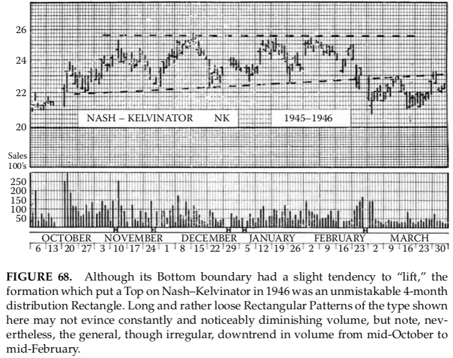

**HÌNH 68.** Dù biên dưới hơi “nâng,” mô hình tạo đỉnh cho Nash–Kelvinator
năm 1946 là Tam giác chữ nhật phân phối 4 tháng rõ rệt. Tam giác chữ
nhật dài và lỏng như ví dụ này ít khi giảm khối lượng đều, nhưng lưu ý
xu hướng giảm tổng thể, dù không đều, từ giữa tháng 10 đến giữa tháng 2.

Chúng ta nói hai nhóm vận hành trong khu vực giao dịch chữ nhật vì
thường đúng trong thực tế. Điều này không ngụ ý “thao túng.” Một quỹ
đầu tư, estate hay cổ đông cá nhân lớn có lý do chính đáng bán ở giá
cao (Đường Cung) mà không lừa công chúng. Nhóm khác có lý do tốt
và thông minh để mua ở giá thấp (Đường Cầu). Các lực này hoạt động
tại khởi đầu phần lớn mô hình chữ nhật, nhưng nếu khoảng cách
tương đối lớn (8–10% giá trị thị trường), sẽ thu hút scalper và
chuyên nghiệp. Ví dụ, syndicate nắm cổ phần lớn U.S. Steel quyết định
bán 76, nhóm khác mua 69. Giá X dao động giữa hai mức này. Trader
thấy vậy sẽ mua 69, bán 76 (có thể bán khống 76 và mua lại 69). Giao
dịch này làm Tam giác chữ nhật rõ hơn, dù số cổ phiếu ít nên không
ảnh hưởng kết quả cuối. Thực tế, giao dịch _trong_ Tam giác chữ nhật
đôi khi rất có lợi, nhất là dùng stops hợp lý (xem Phần Hai).

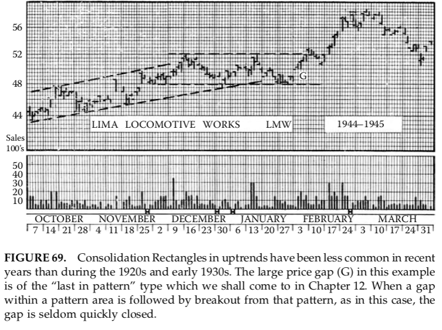

**HÌNH 69.** Tam giác chữ nhật tích lũy trong uptrend ít gặp hơn 1920–30.
Khoảng giá lớn (G) là loại “cuối mô hình” sẽ bàn Ch.12. Khi gap
trong khu vực mô hình được phá, như ví dụ, gap hiếm khi nhanh chóng
được lấp lại.

##### Hoạt động Pool

Trước khi SEC cấm, Tam giác chữ nhật thường được tạo bởi một
“pool” hoặc syndicate. Pool này tích lũy cổ phiếu lớn với mục
tiêu mark-up khi tin tốt (mà họ biết trước) công bố. Để mua đủ
cổ phiếu, họ phải shake out cổ phiếu của trader khác và nhà đầu
tư chưa biết. Họ có thể bắt đầu bằng bán khống vài trăm cổ phiếu
để giảm cầu hiện tại và bắt đầu phản ứng. Sau đó, trong phản ứng
về mức tích lũy đã định, họ mua lại, phân bổ lệnh cẩn thận, tránh
quảng cáo.

Việc mua này sớm hay muộn sẽ tạo rally, nhưng họ gieo tin xung
quanh boardroom rằng insiders bán, sáp nhập bị hủy, hay cổ tức
bị hoãn, và nếu cần, họ công khai bán một phần cổ phiếu mua gần
đây để tin thêm thực tế. Quá trình lặp đi lặp lại nhiều lần, pool
tăng tích lũy, cho tới khi hoàn tất mục tiêu hoặc không shake out
được thêm. Trước 1920s, chartist tinh mắt đã nhận ra trước khi
kết thúc, và rõ ràng khi giá phá lên Tam giác chữ nhật. Tactics này
nay không được phép; “Wash sale” bị cấm. SEC giám sát liên tục và
nghiên cứu ngay tin tức nghi ngờ, ngăn ngừa thao túng pool cũ. Do
đó, Tam giác chữ nhật ít phổ biến hơn 1950s so với 1920s.

Có thể làm rõ chi tiết hình thành Tam giác chữ nhật bằng so sánh với
Tam giác Đối xứng:

1. **Khối lượng** — Giống Tam giác, giảm dần khi Tam giác dài ra.
Mọi biến động ngược, trừ tin tức tạm thời, cần nghi ngờ.

2. **Phá mô hình** — Áp dụng như Tam giác: xem yêu cầu khối lượng,
biên độ vượt, v.v. Phá giả — ít xảy ra hơn Tam giác Đối xứng. Tam giác
chữ nhật rõ ràng gần như tin cậy bằng Vai-Đầu-Vai, dù tác động ít hơn.

3. **Phá sớm** — Có thể xảy ra nhiều hơn Tam giác. (**Lưu ý**: phá giả
và phá sớm khó phân biệt tại thời điểm, giá trở lại mô hình. Phá giả
cuối cùng đi ngược, phá sớm cuối cùng đi cùng hướng.)

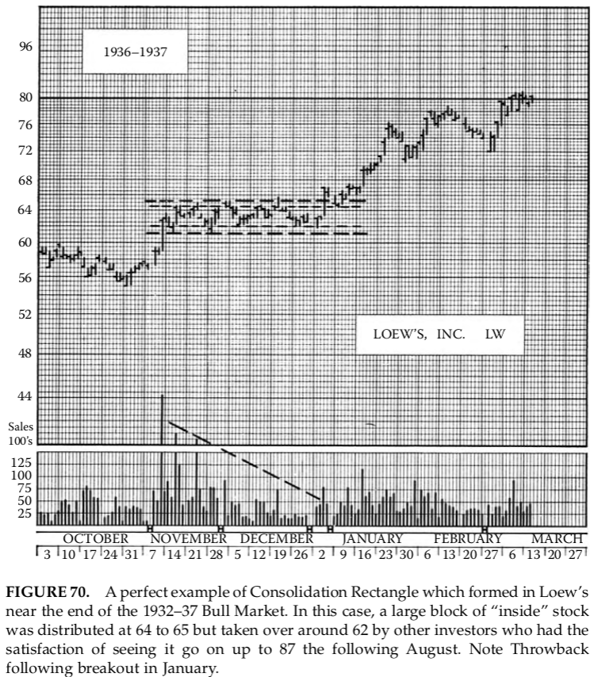

**HÌNH 70.** Ví dụ Tam giác chữ nhật tích lũy hoàn hảo ở Loew’s cuối
Bull Market 1932–37. Một khối lớn cổ phiếu “inside” phân phối 64–65,
nhưng được mua lại 62, sau đó tăng lên 87 tháng 8. Lưu ý Throwback
sau phá tháng 1.

4. **Pullback** — Giá trở lại biên sau phá xảy ra thường xuyên hơn
Tam giác Đối xứng. Ước lượng: Pullback/Throwback (rally sau phá xuống
hoặc phản ứng sau phá lên) trong 3 ngày – 3 tuần chiếm ~40%.

5. **Xu hướng hướng** — Tam giác chữ nhật thường là Tích lũy hơn
Đảo chiều, tỷ lệ như Tam giác Đối xứng. Ở đáy (Major/Intermediate)
thường gặp hơn ở đỉnh. Tam giác dài, hẹp, chậm không hiếm ở đáy
Primary, đôi khi chuyển thành Flat-Bottomed Saucer hay Dormancy
(Ch.7).

6. **Ý nghĩa đo lường** — Công thức đo an toàn dựa vào chiều rộng:
giá đi ít nhất bằng khoảng cách điểm giữa biên trên và dưới.
Các mô hình rộng ngắn, turnover cao, năng động hơn mô hình dài hẹp,
và thường ngừng hay phản ứng tại “điểm tối thiểu” trước khi tiếp tục.

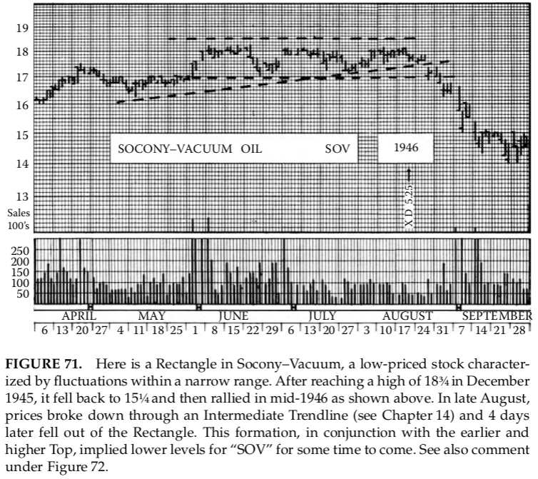

**HÌNH 71.** Tam giác chữ nhật ở Socony–Vacuum, cổ phiếu giá thấp,
dao động trong biên hẹp. Sau đỉnh 18¾ tháng 12/1945, rơi về 15¼,
rally giữa 1946. Cuối tháng 8, phá Trendline Trung gian (Ch.14) và
4 ngày sau ra khỏi Tam giác. Kết hợp với đỉnh trước cao hơn,
ngụ ý giá “SOV” thấp hơn một thời gian. Xem thêm chú thích Hình 72.

##### Mối Liên Hệ giữa Hình Chữ Nhật và Đường Dow

Sự tương đồng giữa mô hình biểu đồ cổ phiếu cá nhân, mà chúng ta
đã bàn dưới tên gọi Hình Chữ Nhật, với mô hình Trung Bình được
các nhà lý thuyết Dow gọi là “Đường” chắc hẳn đã xuất hiện
trong đầu bạn. Rõ ràng, cơ sở lý luận và ý nghĩa dự báo của chúng
rất giống nhau. Nhưng các Hình Chữ Nhật thực sự với biên trên
(Cung) và biên dưới (Cầu) rõ ràng chỉ đặc trưng cho giao dịch
của các cổ phiếu riêng lẻ. Các hình Đường trong Trung Bình hiếm
khi được xác định chính xác, với các Đỉnh Nhỏ liên tiếp hình thành
tương đối chính xác ở một đường tiếp tuyến ngang nhất định, và các
Đáy liên tiếp ở mức ngang tương tự. Nếu bạn xem xét các biểu
đồ riêng lẻ của các cổ phiếu cấu thành một Trung Bình khi Trung
Bình đó đang “vẽ Đường,” bạn chắc chắn sẽ thấy một số cổ phiếu
xuất hiện xu hướng tăng không đều, số khác giảm không đều,
vẫn số khác hình thành Tam Giác, và một vài có thể tạo Hình
Chữ Nhật, nhưng tổng đại số của tất cả các hình ảnh khá lệch
lạc này tạo thành “Đường” Trung Bình.  

Chắc chắn, có xu hướng từ các nhà giao dịch năng động là bán
(hoặc mua) cổ phiếu khi một Trung Bình đạt một con số nhất
định, bất kể tình trạng của các cổ phiếu riêng lẻ. Một cố vấn
đầu tư đôi khi sẽ khuyên khách hàng “bán tất cả các cổ phiếu
spekulative khi Dow Industrials đạt 500 (_EN: hoặc 5000 hoặc
15000_).” Nhưng các quyết định giao dịch dựa chỉ trên mức
Trung Bình nói chung hiếm khi được thực hiện nhất quán, nên
tác dụng của chúng rất nhỏ.

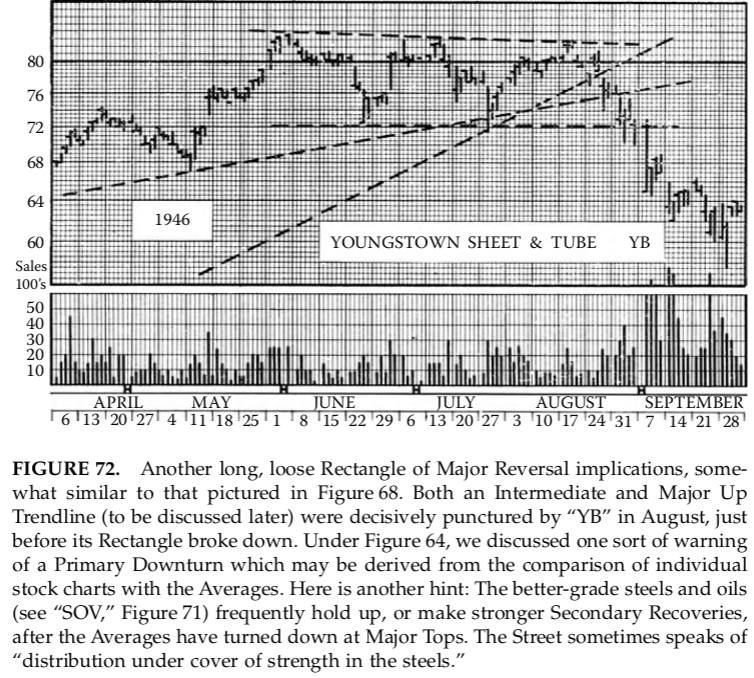

**HÌNH 72.** Một Hình Chữ Nhật dài, lỏng lẻo khác với ý nghĩa
Đảo Chiều Lớn, hơi giống hình trong Hình 68. Cả Đường Xu
Trung Gian và Xu Hướng Tăng Chính (sẽ bàn sau) đều bị “YB”
đâm thủng quyết liệt vào tháng Tám, ngay trước khi Hình Chữ Nhật
của nó sụp xuống. Trong Hình 64, chúng ta đã thảo luận một loại
cảnh báo về Suy Thoái Chính có thể rút ra từ việc so sánh biểu
đồ cổ phiếu riêng lẻ với Trung Bình. Đây là một gợi ý khác: Thép
và dầu chất lượng tốt (xem “SOV,” Hình 71) thường giữ vững
hoặc phục hồi phụ mạnh hơn sau khi Trung Bình đã giảm tại các
Đỉnh Chính. Phố Wall đôi khi gọi là “phân phối dưới lớp vỏ
sức mạnh của thép.”

##### Hình Chữ Nhật từ Tam Giác Vuông Góc

Trong chương trước, chúng tôi đã nhắc đến một loại “thất bại”
một phần trong quá trình phát triển của Tam Giác Vuông Góc
cần phải phân loại lại Tam Giác thành Hình Chữ Nhật. Bây
giờ, khi chúng ta đã xem xét kỹ mô hình này, không cần bàn
nhiều hơn về hiện tượng này, ngoại trừ việc lưu ý rằng xác
suất vẫn hơi nghiêng về khả năng đột phá cuối cùng theo
hướng ban đầu mà Tam Giác dự đoán. Tuy nhiên, xác suất
nhỏ này không đủ để bỏ qua khả năng đột phá ngược lại
từ Hình Chữ Nhật.

**HÌNH 73.** Hình Chữ Nhật đầu năm 1945 trong “EAL” thực sự
là giai đoạn cuối của một quá trình Hợp Nhất gần 2 năm trong
đợt tăng bắt đầu từ khoảng 17 năm 1942 và kết thúc trên 125
vào tháng 12 năm 1945. G, G đánh dấu các khoảng trống (Chương
12), khoảng trống đầu tiên là Breakaway và khoảng trống thứ hai
là Measuring Gap, đánh dấu mục tiêu có khả năng của đợt di
chuyển.

##### Đỉnh và Đáy Đôi, Ba

Với một số người lão luyện trên Phố Wall, việc chúng tôi
xếp câu tục ngữ cũ, _Double Top_, vào vị trí Nhỏ trong danh
sách Mô Hình Đảo Chiều có thể có vẻ gần như báng bổ. Nó
được nhắc tên có lẽ nhiều hơn bất kỳ mô hình biểu đồ nào
khác bởi các nhà giao dịch nắm một ít thuật ngữ kỹ thuật nhưng
ít kiến thức tổ chức. Đỉnh và Đáy Đôi thực sự rất hiếm;
mô hình Ba càng hiếm hơn. Và các mô hình thực sự (khác với
các biểu đồ có thể bị gọi nhầm là như vậy nhưng thực sự
thuộc các Mô Hình Đảo Chiều khác) hầu như không thể xác
định dứt khoát cho đến khi giá di chuyển khá xa. Chúng không
bao giờ có thể dự báo hoặc xác định ngay khi xuất hiện
chỉ dựa trên dữ liệu biểu đồ.

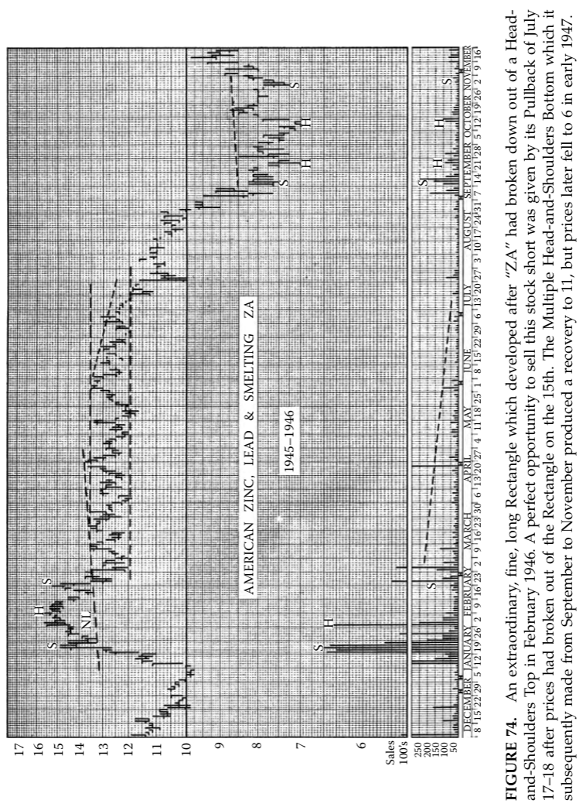

**HÌNH 74.** Một Hình Chữ Nhật dài, xuất sắc, phát triển sau khi
“ZA” phá vỡ Đầu và Vai trên vào tháng 2 năm 1946. Cơ hội hoàn
hảo để bán khống cổ phiếu được tạo ra bởi Pullback từ 17–18
tháng 7, sau khi giá phá vỡ Hình Chữ Nhật vào ngày 15. Hình
Đầu và Vai Đôi nhiều lần mà nó tạo ra từ tháng 9–11 đã tạo
phục hồi lên 11, nhưng giá sau đó giảm xuống 6 đầu năm 1947.

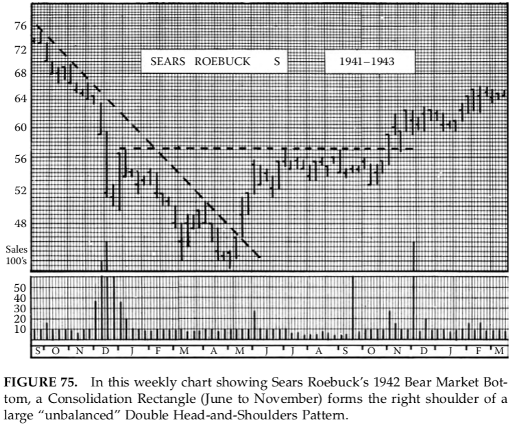

**HÌNH 75.** Biểu đồ tuần của Sears Roebuck, đáy Thị Trường Gấu
1942, Hình Chữ Nhật Hợp Nhất (tháng 6–11) tạo vai phải của
một Mô Hình Đầu và Vai Đôi “mất cân đối” lớn.

Nhưng chúng ta đang đi trước câu chuyện. Trước tiên cần
xác định điều đang nói. _Double Top_ hình thành khi một
cổ phiếu tăng đến mức nhất định với khối lượng thường
cao ở và gần Đỉnh, rồi giảm với hoạt động giảm dần, sau
đó lại tăng lên cùng mức giá đỉnh trước đó với chút tăng
khối lượng, nhưng không bằng đỉnh đầu tiên, rồi cuối cùng
giảm lần thứ hai để tạo một Suy Thoái Chính hoặc Trung Gian
Quan Trọng. _Double Bottom_ tất nhiên là hình ảnh ngược
lại. Mô hình Ba tạo ba Đỉnh (hoặc Đáy) thay vì hai.

Không khó để lướt qua một cuốn sách vài trăm biểu đồ tháng
và chọn ra hai hoặc ba ví dụ về Đỉnh Đôi Lớn, có thể một
hoặc hai Đáy Đôi. Người ta sẽ thấy trường hợp cổ phiếu tạo
hai Đỉnh Thị Trường Bò liên tiếp, cách nhau vài năm, ở
gần như cùng mức. Hiện tượng này nổi bật, nhìn lại từ xa,
giống như ngón tay cái nổi bật, giải thích phần nào sự
kính nể quá mức của các nhà phân tích nghiệp dư. Họ tạm
thời bỏ qua thực tế rằng hàng ngàn cổ phiếu khác có thể
đã làm điều tương tự, nhưng không — một số thậm chí hành
động như thể sẽ Đỉnh Đôi, nhưng rồi tiếp tục đi lên cao hơn.

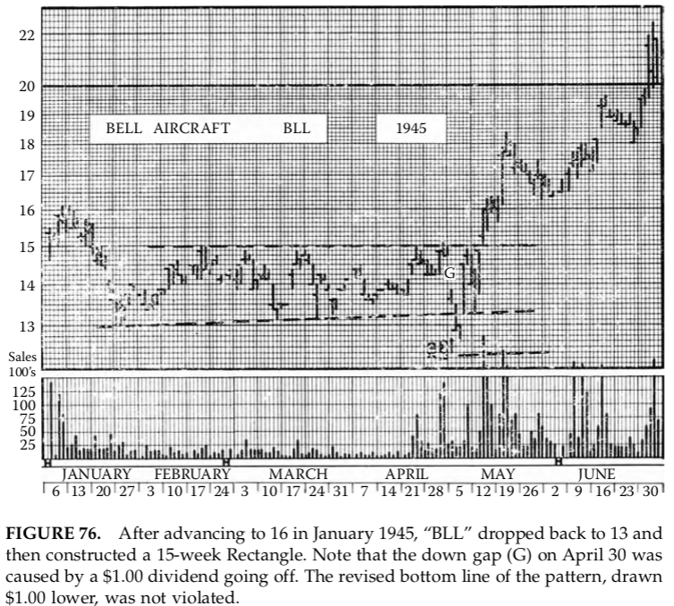

**HÌNH 76.** Sau khi tăng lên 16 vào tháng 1 năm 1945, “BLL”
giảm xuống 13 và tạo Hình Chữ Nhật 15 tuần. Lưu ý khoảng
trống giảm (G) ngày 30 tháng 4 do cổ tức $1.00. Đường đáy
mới của mô hình, vẽ thấp hơn $1.00, không bị vi phạm.

Khái niệm Đỉnh Đôi có thực sự hữu ích cho nhà giao dịch hay
nhà đầu tư không? Có, nhưng sẽ dễ hình thành hơn nếu
trước tiên chúng ta xem xét điều _không phải_ Đỉnh Đôi.
Quay lại Tam Giác Tăng Dần và Hình Chữ Nhật đã học. Khi
chúng bắt đầu phát triển, hầu như bước đầu tiên là xây dựng
hai Đỉnh ở cùng mức với một đợt giảm xen giữa, và với
khối lượng nhỏ hơn ở Đỉnh thứ hai so với Đỉnh đầu tiên. Trong
quá trình thông thường, Đỉnh thứ ba sẽ xuất hiện ở đó, và
cuối cùng giá sẽ phá vỡ và tiếp tục lên cao hơn. Vì vậy, chúng
ta cần có một quy tắc hay tiêu chí để phân biệt Mô Hình Đảo
Chiều Đỉnh Đôi thực sự với các Đỉnh Đôi không báo hiệu
Đảo Chiều khi xuất hiện trong một Vùng Hợp Nhất của xu hướng
tăng.

##### Đặc điểm Nhận dạng

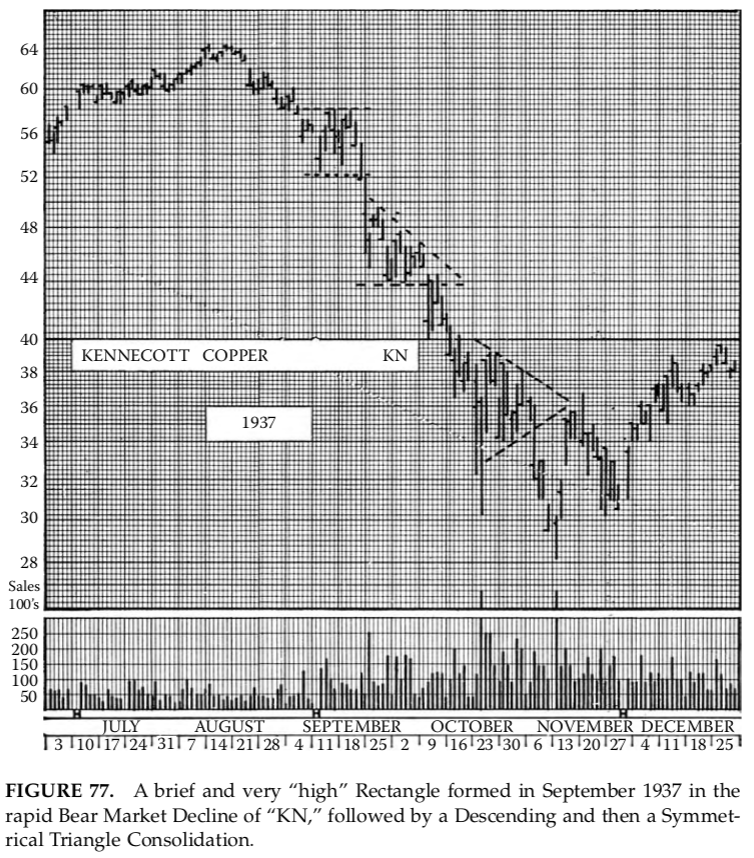

**HÌNH 77.** Một Tam giác chữ nhật ngắn và “cao” xuất hiện tháng 9/1937
trong đợt giảm nhanh của Bear Market “KN,” sau đó là sự tích lũy bằng
Tam giác Xuống và Tam giác Đối xứng.

Không có quy tắc tuyệt đối áp dụng cho tất cả các cổ phiếu với giá trị
và thói quen thị trường khác nhau, nhưng một phân biệt tương đối dễ
nhận ra khi nghiên cứu các loại mô hình này là: nếu hai đỉnh xuất hiện
ở cùng mức nhưng gần nhau về thời gian với chỉ một phản ứng nhỏ
giữa chúng, khả năng cao chúng thuộc vùng Tích lũy; hoặc nếu có
Đảo Chiều Xu hướng, sẽ có thêm phát triển mô hình — nhiều “công việc”
xung quanh các mức đỉnh đó. Nếu ngược lại, có phản ứng dài, chậm,
sâu và khá tròn sau đỉnh đầu, rồi khi giá lên lại mức cũ thiếu sinh lực,
chúng ta ít nhất nên nghi ngờ một Đỉnh Đôi.

Sâu là bao nhiêu, dài là bao lâu? Câu hỏi hợp lý, nhưng tiếc là không
thể trả lời đơn giản. Ta có thể ước lượng: nếu hai đỉnh _cách nhau_
hơn một tháng, khó có thể thuộc cùng vùng Tích lũy hay Tắc nghẽn.
Nếu thêm phản ứng giữa hai đỉnh giảm giá ~20% giá đỉnh, nghiêng
về giải thích Đỉnh Đôi. Cả hai tiêu chí này mang tính tương đối
và không phải lúc nào cũng đúng.

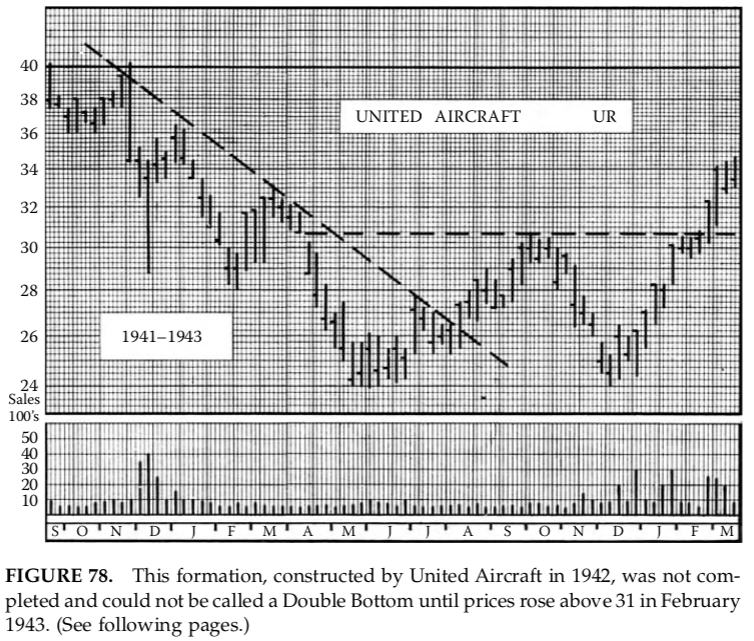

**HÌNH 78.** Mô hình này, do United Aircraft tạo ra năm 1942, chưa
hoàn tất và không thể gọi là Đáy Đôi cho tới khi giá vượt 31 vào
tháng 2/1943. (Xem các trang tiếp theo.)

Có trường hợp hai đỉnh cách nhau chỉ 2–3 tuần, hoặc “thung lũng”
giữa chúng giảm chỉ ~15%. Tuy nhiên, hầu hết Đỉnh Đôi thật sự
phát triển cách nhau 2–3 tháng hoặc hơn. Thời gian nói chung
quan trọng hơn độ sâu phản ứng. Khoảng cách giữa hai đỉnh càng lớn,
càng ít cần giảm giá nhiều giữa hai đỉnh.

Với điều kiện đã nêu: hai đỉnh gần cùng mức nhưng hơn một tháng
cách nhau, đợt tăng thứ hai yếu hơn đợt đầu, và phản ứng giữa
hai đỉnh chậm, không đều, vòng tròn, ta có thể nghi ngờ Đỉnh Đôi
thực sự hình thành. Nếu xuất hiện Vai-Đầu-Vai nhỏ hoặc Tam giác
Xuống tại đỉnh thứ hai, như thường thấy, cần cảnh giác: bảo vệ
vị thế mua bằng stop hoặc chuyển sang cổ phiếu khác với chart
tốt hơn.

Dù vậy, tất cả các dấu hiệu này chưa kết luận. Tình hình vẫn có thể
được cứu, và thường là vậy. Hãy xem xét điều có thể diễn ra phía
sau bức màn tạo biểu đồ này. Đỉnh đầu trên khối lượng tương đối cao
là hiện tượng bình thường, chỉ ra rằng cung cầu tạm thời cân bằng,
tạo phản ứng. Cung này có thể chỉ là chốt lời của trader, khi đó
xu hướng có thể tiếp tục lên sau cú lùi ngắn. Nhưng khi phản ứng
hạ dần xuống mất 15% giá đỉnh, và phẳng ra mà không hồi mạnh,
đó là bằng chứng rằng cầu gần như hết hoặc việc bán vượt ngoài
chốt lời ngắn hạn. Câu hỏi: đỉnh đầu có dấu hiệu phân phối quan
trọng không, và còn bao nhiêu phải bán ở cùng mức?

**HÌNH 79.** INCO hồi nhanh từ Crash Reagan 1987 và gần về đỉnh
cuối năm; đỉnh cũ bị phá tháng 4/1988. Rally mạnh tiếp tục đẩy
“N” cao hơn. Nhưng phản ứng tháng 8, sau đó rally yếu tháng 9,
tạo một Đỉnh Vai-Đầu-Vai lớn. Xuống sớm tháng 9 phá neckline
xác nhận Đảo Chiều, và Throwback tới Neckline Resistance là điểm
bán tốt.

Tuy nhiên, biểu đồ cho thấy cầu cuối cùng xuất hiện, hấp thụ
đủ cung nổi để đảo chiều. Khi giá tăng lại gần đỉnh đầu, điều
này dễ hiểu về tâm lý; nhiều trader lướt sóng chốt lời đỉnh cũ
với ý định mua lại nếu vượt đỉnh. Do đó, một chút chần chừ là
bình thường. Nhưng bán đủ nhiều tạo phản ứng mạnh khác. Ta đã
thiết lập vùng Cung/Kháng cự tại đỉnh và vùng Cầu/Hỗ trợ tại
đáy giữa. Câu hỏi quyết định: Hỗ trợ “thung lũng” có xuất hiện
ngăn đợt giảm thứ hai không?

**HÌNH 80.** Vì Đỉnh Đôi yêu cầu khoảng cách giữa hai đỉnh dài, các
mô hình này hiếm khi thấy rõ trên biểu đồ ngày, nhưng ví dụ tốt
năm 1946 ở Republic Steel. Lưu ý 5 tháng và giảm 20% giữa hai đỉnh.
Biểu đồ còn nhiều mô hình kỹ thuật phụ thú vị. Các dao động
“Rộng dần” (Ch.10) trong tháng 6–7, khi đỉnh thứ hai hình thành,
và rally tròn tháng 8, rất Bearish về mặt ý nghĩa.

Định nghĩa kết luận Đỉnh Đôi: nếu giá giảm qua đáy giữa hai đỉnh,
báo hiệu Đảo Chiều từ lên xuống. Đây thường là tín hiệu quan trọng
và hầu như là hiện tượng Đảo Chiều Chính (Primary). Khi chắc chắn
có Đỉnh Đôi, đừng xem thường. Dù giá giảm 20%, khả năng còn giảm
rất sâu trước khi chạm đáy.

Về đo lường, Đỉnh Đôi không có công thức tương tự Vai-Đầu-Vai
hay Tam giác, nhưng an toàn giả định: giảm ít nhất bằng khoảng cách
từ đỉnh tới đáy. Có thể không liên tục; có thể cần thời gian thực
hiện trong các sóng. Pullback về vùng đáy sau phá đầu tiên không
hiếm. (Nhớ quy tắc chung: Mô hình Đảo Chiều không tạo nhiều hơn
retracement xu hướng trước đó.)  

Một điểm nữa: đỉnh không cần chính xác cùng mức. Dùng quy tắc
3% đã nêu cho breakouts. Ví dụ đỉnh đầu 50, đỉnh hai 51½, vẫn
trong giới hạn. Thật thú vị, đỉnh thứ hai thường vượt chút so
với đỉnh đầu. Quan trọng: (1) cầu không đẩy giá lên rõ rệt,
(2) hỗ trợ dưới bị phá sau đó.

##### Đáy Đôi

Khi xác định một Đáy Đôi, chúng ta có thể áp dụng tất cả các nguyên tắc
đã nêu cho Mô Hình Đỉnh Đôi, nhưng tất nhiên là lộn ngược. Sự khác
biệt giữa hai hình ảnh chính xác là những gì bạn có thể mong đợi, dựa
vào sự khác nhau đặc trưng giữa Đầu và Vai Đỉnh so với Đáy, ví dụ. 
Do đó, đáy thứ hai thường khá tẻ nhạt (khối lượng giao dịch ít) và
thường khá tròn, trong khi đỉnh thứ hai trong Đỉnh Đôi thì tương đối
năng động và gần như sắc nhọn và “nhọn” như đỉnh đầu tiên. Đợt tăng
từ đáy thứ hai thể hiện sự gia tăng khối lượng, và khối lượng sẽ tăng
đáng kể khi mức đáy, hay chính xác hơn trong trường hợp này, là
_độ cao_ giữa hai đáy, bị vượt qua. Đáy Đôi xuất hiện gần như tần suất
bằng với Đỉnh Đôi tại các Đảo Chiều Xu Hướng Chính, và cũng xảy ra
thỉnh thoảng ở cuối các Sửa Chữa Trung Gian trong Xu Hướng Tăng Lớn.

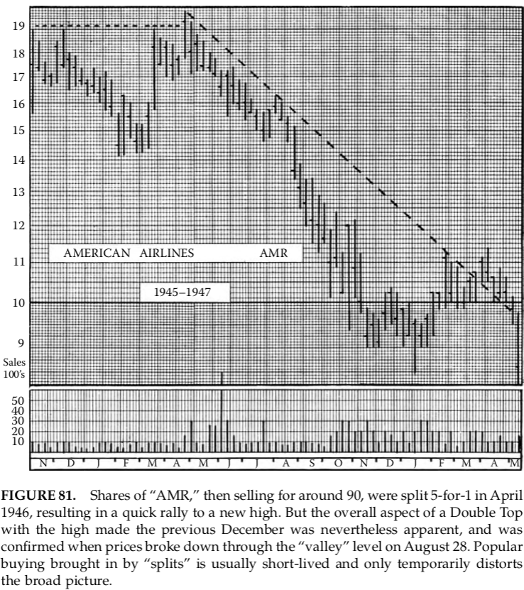

**HÌNH 81.** Cổ phiếu “AMR,” lúc đó giao dịch quanh 90, đã được chia
5-for-1 vào tháng 4 năm 1946, dẫn tới một đợt tăng nhanh lên mức cao
mới. Nhưng tổng thể của một Đỉnh Đôi với đỉnh được lập trước đó
vào tháng 12 vẫn hiển hiện, và được xác nhận khi giá giảm xuống
dưới mức “thung lũng” vào ngày 28 tháng 8. Mua vào phổ biến nhờ
“chia tách” thường chỉ tồn tại ngắn hạn và chỉ làm méo mó tạm thời
bức tranh tổng thể.

Nếu bạn quen thuộc với một số thuật ngữ trên Phố Wall, có lẽ
bạn đã nhận ra rằng đáy thứ hai của Đáy Đôi là một ví dụ về hành
động thị trường thường gọi là “thử nghiệm.” Theo nghĩa nào đó,
đó chính xác là một thử nghiệm hoặc xác nhận của Hỗ Trợ (tức cầu)
ngăn chặn đợt giảm đầu tiên ở cùng mức. Tuy nhiên, _sự thành công_
của thử nghiệm đó _không được chứng minh_ — và đây là một điểm
cần nhớ — cho đến khi giá thể hiện khả năng tăng trên khối lượng
tăng lên vượt mức đỉnh trước đó (chiều cao của đợt tăng giữa hai
đáy). Cho đến khi điều đó xảy ra, luôn có khả năng cần thử nghiệm
thứ hai (đáy thứ ba), thậm chí thứ ba, và một trong số đó có thể
thất bại, khiến giá giảm xuống thêm. Ý tưởng này dẫn tới loại Mô
Hình Đảo Chiều tiếp theo.

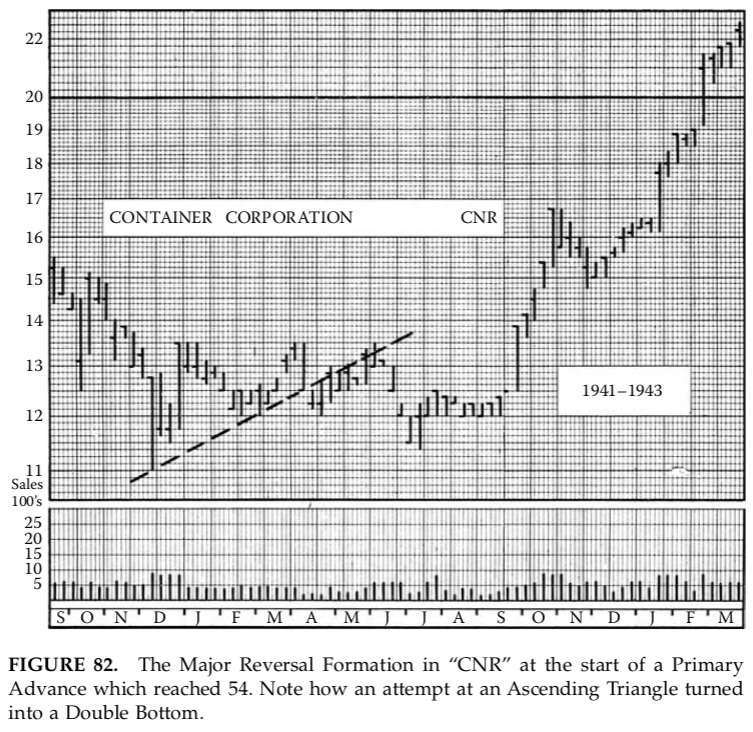

**HÌNH 82.** Mô Hình Đảo Chiều Chính trong “CNR” ở đầu một Đợt
Tăng Chính, đạt 54. Lưu ý cách một thử nghiệm Tam Giác Tăng dần
biến thành Đáy Đôi.

##### Đỉnh và Đáy Ba

Hợp lý mà nói, nếu có Đỉnh Đôi, thì có thể có Đỉnh Ba, phát triển
theo cách tương tự. Thực tế là các Mô Hình Đảo Chiều chỉ có thể
xếp vào Đỉnh Ba, nhưng rất hiếm. Tất nhiên, nhiều mô hình xuất hiện
tại một bước ngoặt quan trọng từ tăng sang giảm có ba đỉnh, nhưng
đa số thuộc loại Hình Chữ Nhật. Hơn nữa, bất kỳ Mô Hình Đầu và Vai
nào, đặc biệt nếu “bằng phẳng,” với đầu không vượt quá mức hai vai,
cũng có thể gọi là một dạng Đỉnh Ba.

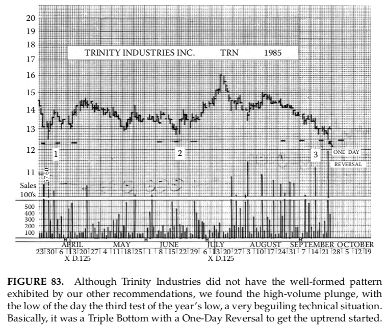

**HÌNH 83.** Mặc dù Trinity Industries không có mô hình chuẩn như
các ví dụ khác, chúng tôi nhận thấy đợt giảm khối lượng cao với đáy
trong ngày là thử nghiệm thứ ba của mức thấp năm đó, là tình huống
kỹ thuật rất hấp dẫn. Về cơ bản, đây là Đáy Ba với đảo chiều trong
một ngày để bắt đầu xu hướng tăng.

Đỉnh Ba thực sự (khác với các loại ba đỉnh khác) có sự tương đồng
rõ rệt với Đỉnh Đôi. Các đỉnh cách xa nhau với các phản ứng sâu và
thường tròn giữa chúng. Khối lượng thường ít hơn ở đợt tăng thứ hai,
và còn ít hơn ở đợt thứ ba, thường chấm dứt mà không có sự gia
tăng đáng kể. Ba đỉnh không cần cách xa nhau bằng hai đỉnh của
Đỉnh Đôi, và cũng không cần khoảng cách bằng nhau. Ví dụ, đỉnh
thứ hai có thể xuất hiện khoảng 3 tuần sau đỉnh đầu tiên, và thứ
ba 6 tuần hoặc hơn sau đỉnh thứ hai. Các thung lũng xen giữa cũng
không cần đáy ở cùng mức; đỉnh đầu có thể nông hơn đỉnh thứ hai
và ngược lại. Ba đỉnh cũng không cần cùng mức giá; quy tắc dung sai
3% lại hữu dụng ở đây. Dù có những biến thể này, tổng thể hình ảnh
vẫn phải có nét quen thuộc, khiến nhà phân tích giàu kinh nghiệm
ngay lập tức nhận ra khả năng Đỉnh Ba.  

Thử nghiệm _chắc chắn_ là sự giảm từ đỉnh thứ ba, phá mức thung
lũng (thấp hơn, nếu hai thung lũng khác nhau về mức). Chỉ khi đó
Đỉnh Ba mới được xác nhận, vì nếu cầu vẫn tồn tại ở mức thung lũng,
xu hướng có thể quay lên. Chỉ khi khối lượng ở đỉnh thứ ba thấp
rõ rệt và sau đó thể hiện đặc tính Gấu bằng tốc độ giảm, mới có
thể “vội vàng hành động.”

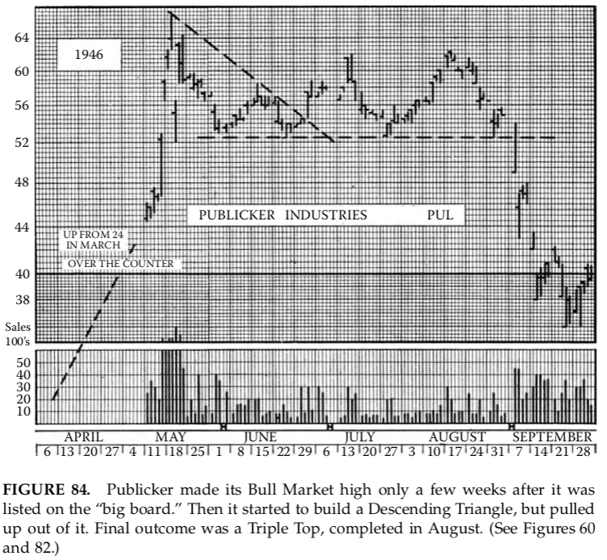

**HÌNH 84.** Publicker lập đỉnh Thị Trường Bò chỉ vài tuần sau
khi niêm yết trên “sàn lớn.” Sau đó, cổ phiếu bắt đầu tạo Tam Giác
Giảm, nhưng lại bật lên. Kết quả cuối cùng là Đỉnh Ba, hoàn tất
vào tháng 8. (Xem Hình 60 và 82.)

Đáy Ba là Đỉnh Ba lộn ngược, với các lưu ý tương tự khi thảo luận
Đáy Đôi. Đáy thứ ba luôn đi kèm khối lượng nhỏ, và đợt tăng
từ đó phải thể hiện sự gia tăng khối lượng rõ rệt, đưa giá vượt
hẳn các đỉnh của các đợt tăng hình thành giữa các đáy. Không
bao giờ vội vàng hành động trên Đáy Ba giả định nếu hầu hết
các biểu đồ khác chưa ở vị trí rõ ràng Tăng. Nguy cơ mua sớm
được thể hiện qua câu nói trên Phòng Hội đồng: “Đáy Ba luôn
bị phá.” Điều này không chính xác. Khi Đáy Ba đã được xác
lập và xác nhận bằng đột phá lên, nó hiếm khi thất bại — hầu
như luôn tạo ra một đợt tăng đáng kể. Nhưng hình ảnh “có thể”
chưa hoàn tất của Đáy Ba phải được coi là nguy hiểm. Tuân thủ
quy tắc đột phá sẽ an toàn.

Đỉnh Ba đôi khi được gọi là mô hình “W” vì đôi khi giống chữ W.
Có loại lai giữa Đỉnh Đôi và Ba, trong đó đỉnh giữa không đạt
mức của đỉnh đầu và thứ ba, càng giống chữ W. Vì lý do tương
tự, Đỉnh Đôi đôi khi gọi là M.

Các yếu tố trong Đỉnh và Đáy Đôi, Ba thường cách nhau xa theo
thời gian, nên thường dễ phát hiện và đánh giá trên biểu đồ
tuần hơn là ngày. Biểu đồ tháng tiết lộ nhiều Đáy và Đỉnh
Đôi, Ba trải rộng, nhưng lại quá thô để hiển thị nhiều Đỉnh
Đôi, Ba tốt.

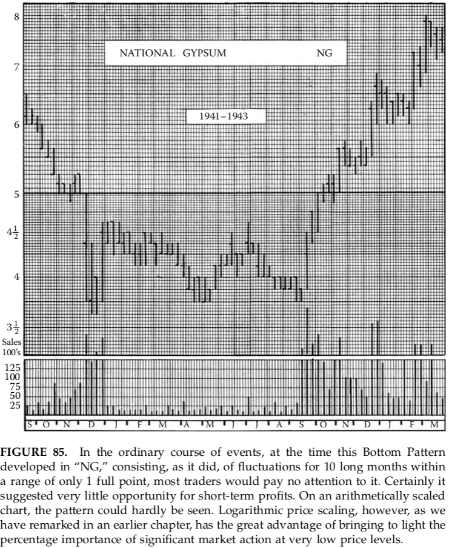

**HÌNH 85.** Trong quá trình thông thường, khi Đáy này hình
thành ở “NG,” với các dao động suốt 10 tháng dài chỉ trong
vùng 1 điểm, hầu hết nhà giao dịch sẽ không để ý. Chắc chắn
có rất ít cơ hội kiếm lợi ngắn hạn. Trên biểu đồ tỷ lệ cộng,
mô hình gần như không thấy được. Tuy nhiên, thang logarit
giá, như chúng tôi đã nhắc ở chương trước, có lợi thế
lớn là làm nổi bật tầm quan trọng phần trăm của hành
động thị trường đáng kể ở mức giá rất thấp. Lưu ý mô hình
này thỏa tất cả chi tiết — khoảng cách giữa các đáy,
tỷ lệ phần trăm của các đợt tăng xen kẽ, khối lượng — là
Đáy Ba. Dĩ nhiên, hoàn tất vào tháng 10 năm 1942 không
nhất thiết dự báo “NG” sẽ lên 33, nhưng thực tế nhiều cổ
phiếu khác đang tạo Đáy Chính vững chắc ở mức giá cao
hơn cùng thời điểm, cho thấy “NG” đang đi lên và là
một món hời ở mức 5.

Trong phần thảo luận trước về Đỉnh Ba, chúng tôi nhắc đến
một dạng trực giác từ kinh nghiệm, giúp nhà phân tích kỹ
thuật nhận biết khả năng Đảo Chiều của một biểu đồ
nào đó, đôi khi trước khi nó kết luận. Đây là một năng lực
không hiếm, nhưng hiếm khi có được nếu không nhờ nghiên
cứu kỹ lưỡng và trải nghiệm lâu dài (thường bao gồm một vài
sai lầm đắt giá). Người đọc cuốn sách này không cần tuyệt
vọng về việc phát triển “cảm giác biểu đồ,” nếu chú tâm học
tập, quan sát, kiểm tra và đối chiếu mọi diễn biến mới trên
biểu đồ, và tự “ghi điểm” với chính mình.

Người ta nói phân tích biểu đồ không phải là _khoa học_, mà
là _nghệ thuật_. Đúng, không phải khoa học chính xác, vì không
có quy tắc nào không có ngoại lệ. Những điểm tinh tế khó có
thể diễn đạt bằng quy tắc hay nguyên tắc. Nó đòi hỏi phán đoán
khi đánh giá nhiều yếu tố, đôi khi xung đột nhau. Nhưng gọi là
nghệ thuật, ám chỉ cần thiên tài hoặc tài năng bẩm sinh cao, là
không đúng. Nói đúng hơn, nó đòi hỏi kỹ năng, và kỹ năng này
có thể học được bởi bất kỳ ai có trí thông minh bình thường.

## Chương 10. Các Hiện Tượng Đảo Chiều Khác

Cho đến nay, chúng ta đã xem xét bảy loại mô hình xuất hiện ở các
điểm Đảo Chiều quan trọng của xu hướng giá. Chúng là:

1. Vai-Đầu-Vai
2. Vai-Đầu-Vai Phức tạp hoặc Đa đầu
3. Quanh Vòng Tròn (Rounding Turns)
4. Tam giác Đối xứng
5. Tam giác Góc Vuông
6. Hình chữ nhật
7. Đỉnh và Đáy Đôi hoặc Ba
8. Đảo Chiều Một Ngày

Trong số này, 1, 2, 3 và 7 xuất hiện nhiều nhất tại các Điểm Quay
Lớn, trong khi 4, 5 và 6 xuất hiện thường xuyên hơn ở Giai đoạn
Trung gian. Các số 1, 2, 3 và 5 cho tín hiệu _trước_ khi hoàn
tất về hướng xu hướng giá sẽ tiếp tục. Số 4 và 6 không cho tín
hiệu như vậy, và, như ta thấy, thường báo hiệu Tích lũy hoặc
Tiếp diễn hơn là Đảo Chiều. Nhưng tất cả đều có thể, và đôi khi
xuất hiện ở cả Đỉnh hoặc Đáy lớn. _Lưu ý: Số 8 thường xuất hiện
sau các biến động mất kiểm soát, lên hoặc xuống._

Chúng ta sẽ xem thêm vài mô hình kỹ thuật khác, vì ý nghĩa hạn
chế, hiếm gặp, hoặc ít hữu ích cho nhà đầu tư dài hạn, nên được
đưa cuối nghiên cứu Đảo Chiều.

## Mô hình Rộng Dần (Broadening Formations)

Kết thúc chương Tam giác (Ch.8), chúng ta đã nhắc tới một số
vùng tắc nghẽn hay “trading area” đôi khi gọi là “Tam giác
Ngược” vì bắt đầu từ dao động hẹp, rồi rộng dần theo các
đường biên phân kỳ thay vì hội tụ. Ở đây, chúng tôi phân loại
chúng là _Mô hình Rộng Dần_ vì ngoài sự tương đồng bề ngoài,
chúng khác về bản chất và ý nghĩa xu hướng.

Nếu Tam giác Đối xứng thể hiện “nghi ngờ” đang chờ làm sáng
tỏ, và Hình chữ nhật là “xung đột” được kiểm soát, thì Mô
hình Rộng Dần ám chỉ thị trường thiếu định hướng thông minh
và mất kiểm soát — thường khi công chúng tham gia hứng
khởi và bị dao động bởi tin đồn. Chúng ta chỉ nói “gợi ý”
thị trường như vậy. Đôi khi có thể thấy rõ đó là nguyên
nhân tạo Mô hình Rộng Dần, đôi khi lý do mờ nhạt hoặc không
phát hiện được. Dù sao, các biểu đồ kiểu này thường xuất hiện
ở cuối hoặc giai đoạn cuối của Bull Market lâu dài, củng cố
nhận định Bearish.  

Sau 20 năm quan sát biểu đồ, chúng tôi kết luận Mô hình
Rộng Dần thường Bearish — dù giá có thể tăng tiếp, nhưng
tình hình đã nguy hiểm. Không nên mua mới, và các vị thế
trước nên chuyển đổi hoặc chốt lời ngay cơ hội tốt đầu tiên.

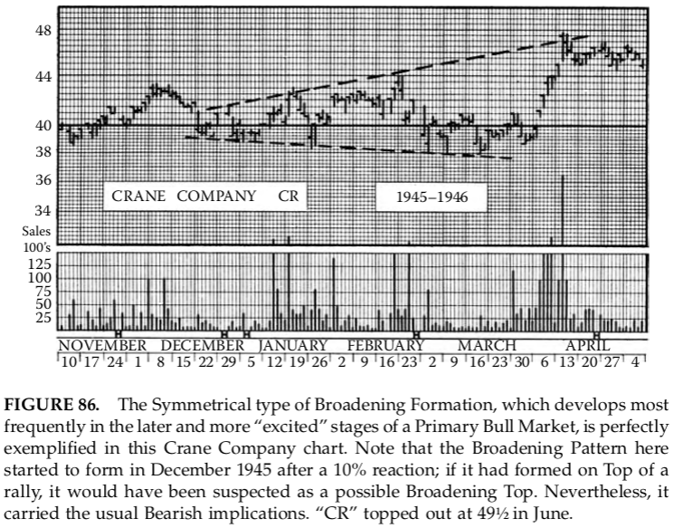

**HÌNH 86.** Mô hình Rộng Dần Đối xứng, xuất hiện nhiều nhất
ở giai đoạn cuối Bull Market, minh họa bởi biểu đồ Crane Company.
Chú ý Broadening bắt đầu hình thành tháng 12/1945 sau phản
ứng 10%; nếu hình thành trên đỉnh rally, sẽ nghi ngờ là Broadening
Top. Tuy nhiên, vẫn mang ý nghĩa Bearish. “CR” đạt đỉnh 49½
tháng 6.

Mô hình Rộng Dần có thể phát triển theo ba dạng, tương ứng
Tam giác Ngược, Tam giác Tăng, hoặc Tam giác Giảm. Dạng
“Đối xứng” gồm các dao động quanh trục ngang, mỗi đỉnh nhỏ
cao hơn, đáy nhỏ thấp hơn trước đó. Biểu đồ có thể vẽ bằng
hai đường phân kỳ, trên đi lên (trái sang phải), dưới đi xuống.
Nhưng Broadening thường lỏng lẻo, không đều, trong khi Tam
giác Đối xứng đều và gọn. Đường hội tụ của Tam giác Đối xứng
rõ ràng, đỉnh đáy rơi đúng đường biên. Trong Broadening,
rallies và declines thường không dừng tại đường biên xác định.

##### Khối lượng trong Mô hình Rộng Dần

Một khác biệt nữa giữa Tam giác và Broadening là khối lượng.
Tam giác thật sự đi kèm hoạt động giảm dần: khối lượng cao
ở Minor Reversal đầu, rồi giảm khi giá dao động nhỏ dần về
đỉnh. Hoạt động tăng lại sau breakout, đặc biệt qua top.
Trong Broadening, khối lượng thường cao và không đều suốt
mô hình. Nếu xuất hiện sau tăng giá, Minor Reversal đầu
có khối lượng lớn, và cả rally thứ hai, thứ ba, hoặc đáy
cũng có khối lượng cao. Toàn cảnh — giá và khối lượng —
cho thấy dao động “hoang dã” và dường như “ngu ngốc.”

Dưới hoàn cảnh đó, breakout thật có thể khó nhận ra. Khối
lượng không cung cấp dấu hiệu, và tính lỏng lẻo của giá không
cho phép vẽ đường xác định: “đến đây thôi.” Chỉ khi giá
di chuyển xa khỏi mô hình, mới rõ breakout, nhưng lúc đó
có thể quá trễ để giao dịch; chuyển động đã đi xa.  

Như đã nói, 9/10 lần Broadening Bearish. Xuất hiện gần đỉnh
quan trọng. Khi breakout, giá sẽ giảm, hoặc nếu tăng, sẽ sớm
đảo chiều trở lại. Đây là một phần câu trả lời cho việc xử lý
Broadening.

Hành động giá trong mô hình, nhiều khi báo hiệu hướng breakout.
Nếu sẽ breakout xuống, rally cuối cùng có thể không cao bằng
rally trước, phá chuỗi đỉnh cao dần. Nếu breakout lên, phản ứng
cuối không hạ giá thấp bằng phản ứng trước. Các “thất bại” này
xảy ra trong phần lớn Broadening. Tuy nhiên, không chắc chắn
cho tới khi giá vượt đỉnh/trough trước đó theo biên quyết định
(quy tắc 3%).

##### Ví dụ điển hình

Ví dụ trên có thể phức tạp. Dễ hình dung hơn nếu vẽ biểu đồ.
Giả sử cổ phiếu XYZ, sau khi tăng 30 điểm với khối lượng tăng,
gặp bán mạnh tại 62, giảm về 58. Vẫn còn nhiều quan tâm; giá
dừng tại 58 rồi lên 63, dao động 1–2 ngày rồi rơi 56½ nhờ
mua đỡ. Rally thứ ba lên 62, chần chừ, giảm 59, rồi tăng 65.
(Lúc này Broadening đã rõ.) Tại 65, giao dịch mạnh, phản ứng
giảm giá về 60. Hỗ trợ xuất hiện, giá dao động 60–62 vài ngày,
sau đó xuống 56 với khối lượng cao. Rally thứ tư bắt đầu, nhưng
người mua 60 lo sợ, không tăng thêm; giá giảm xuống 55, _dưới
đáy trước_. Khi đó, “thất bại” của rally trước được xác nhận —
không vượt 65 và ngừng Broadening. Giảm dưới 56, do thất bại,
xem như breakout.

Nếu theo sát ví dụ, sẽ thấy dao động nhỏ trong mô hình không
ảnh hưởng kết quả. Chẳng hạn, từ 56½ lên 65 gồm 3 bước:
56½ → 62, 62 → 59, 59 → 65. Phản ứng từ 62 không quan trọng
miễn là dừng _trên_ 56½ và được tiếp bởi đợt tăng mới vượt đỉnh
trước đó (63).

Ví dụ này là loại phổ biến, thất bại xảy ra trên rally, breakout
xuống. Ngược lại, nếu đợt giảm dừng 60, rồi dao động 60–62 rồi
tăng vượt 65, sẽ là thất bại trên giảm và breakout lên. (Khả năng
đỉnh cuối gần kề.)

##### Đỉnh Mở Rộng Chính Thống

Có một dạng đặc biệt — một trường hợp riêng, như các nhà toán học có thể nói — của Mô Hình Giá Mở Rộng mà chúng ta đã bàn trong các đoạn trước. Dạng đặc biệt này xuất hiện tại các đỉnh năm 1929 của nhiều cổ phiếu phổ biến và sôi động lúc bấy giờ, nhưng ít xảy ra hơn tại các đỉnh Thị Trường Bò sau 1929, và hiếm khi xuất hiện ở các Đỉnh có khối lượng cao trước các Đợt Sửa Chữa Trung Gian mở rộng, như năm 1933 và 1934. Nó được các kỹ thuật viên thị trường biết đến với tên gọi cụ thể là _Đỉnh Mở Rộng (Broadening Top)_, và mặc dù phù hợp với mô tả chung của tất cả các Mô Hình Giá Mở Rộng Đối Xứng, nó đã được định nghĩa rất chính xác và được trích dẫn nhiều lần trong các tài liệu kỹ thuật, nên chúng ta nên dành thời gian xem xét.  

Đỉnh Mở Rộng Chính Thống có ba đỉnh tăng dần về mức giá, và giữa chúng có hai đáy, với đáy thứ hai thấp hơn đáy đầu tiên. Giả định là nó hoàn tất và có hiệu lực như một tín hiệu Đảo Chiều quan trọng ngay khi phản ứng từ đỉnh thứ ba hạ xuống dưới mức đáy thứ hai.

Có lẽ ta sẽ thấy rõ hình dạng của mô hình này nếu xem một trong những ví dụ kinh điển xuất hiện năm 1929. Biểu đồ của chúng tôi (Hình 87) thể hiện diễn biến hàng ngày (giá và khối lượng) của Air Reduction từ ngày 1/7 đến 31/12 năm đó. Chúng tôi đã đánh số từ 1 đến 5 các điểm quay quan trọng trong Đỉnh Mở Rộng, kết thúc Thị Trường Bò của cổ phiếu này vào tháng 10. Một Mô Hình Giá Mở Rộng không thể nhận thấy trước đó cho đến khi giá bắt đầu tăng từ đáy Nhỏ thứ hai (điểm 4); lúc này điểm 3 đã hình thành _trên_ 1, và 4 _dưới_ 2. Mức cao mới tại 5 (_a_ và _b_), theo sau là đột phá giảm rõ rệt tại B (gần 6% dưới 4), hoàn tất mô hình và, theo quy tắc, báo hiệu một Xu Hướng Đảo Chiều Chính. Trong trường hợp này, không thể nghi ngờ tầm quan trọng của tín hiệu Đảo Chiều, bởi giá Air Reduction giảm từ trên 220 vào 18/10 xuống dưới 80 vào 14/11, chỉ sau 4 tuần, và đáy cuối cùng không xuất hiện cho đến gần 3 năm sau, vào 1932!

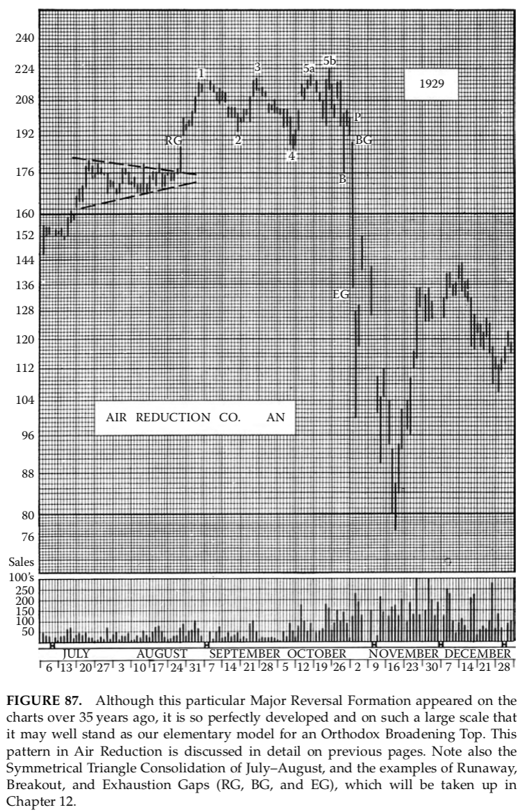

**HÌNH 87.** Mặc dù Mô Hình Đảo Chiều Chính này xuất hiện trên biểu đồ hơn 35 năm trước, nó được phát triển hoàn hảo và quy mô lớn, nên có thể xem là mô hình cơ bản cho Đỉnh Mở Rộng Chính Thống. Mô hình này trên Air Reduction đã được bàn chi tiết ở các trang trước. Lưu ý cả Sự Hội Tụ của Tam Giác Đối Xứng tháng 7–8, và các ví dụ về Gap Chạy Mạnh, Gap Đột Phá và Gap Kiệt Sức (RG, BG, EG), sẽ được đề cập trong Chương 12.

Một số điểm tinh tế của ví dụ kinh điển này cần lưu ý. Trước hết, một đỉnh mới, tức đỉnh thứ ba cao hơn, hình thành tại 5 _a_, và phản ứng sau đó dừng ở 195, cao hơn 4, rồi tăng trở lại. Đây giống như một trong các tín hiệu cảnh báo (“thất bại”) mà chúng ta đã nhắc trước đó, báo hiệu khả năng bứt phá lên. Nhưng ví dụ này nhấn mạnh cảnh báo trước đó — tín hiệu như vậy không đáng tin cho đến khi giá vượt đỉnh trước đó một cách quyết liệt. Tại 5 _b_, Air Reduction giao dịch ngắn ở 223, cao hơn 5 _a_ chỉ 2 điểm (<3%), và đóng cửa _dưới_ 5 _a_. Đợt phá vào 24/10 (tới B) đưa giá xuống hơn 3% dưới mức 4. Lúc này xuất hiện hiện tượng điển hình của Đỉnh Mở Rộng — một Đợt Tăng Hồi (Pullback Rally) tới B, hồi khoảng nửa quãng đường đã mất giữa đỉnh mô hình cuối cùng (5 _b_) và cuối đợt phá ban đầu (B). Theo kinh nghiệm, hiện tượng hồi và thất bại như vậy xảy ra ít nhất 4/5 mô hình Đỉnh Mở Rộng, và thường không thất bại cho tới khi hồi khoảng hai phần ba mức giảm trước đó, dù thường kết thúc quanh hoặc dưới mức giữa.

Đây là ví dụ kinh điển; còn nhiều ví dụ khác thời đó. Việc nhiều mô hình xuất hiện tại đỉnh 1929, sau đó dẫn tới thua lỗ thảm khốc nhất trong lịch sử, có lẽ lý giải tại sao các kỹ thuật viên gán ý nghĩa cực kỳ Gấu cho Đỉnh Mở Rộng. Ngày nay, chúng ta đánh giá nó ít kinh hãi hơn; ý nghĩa đo lường của nó có lẽ không lớn hơn Đầu và Vai khối lượng cao lớn, nhưng nó là mô hình đặc trưng giai đoạn cuối của Xu Hướng Tăng Chính.

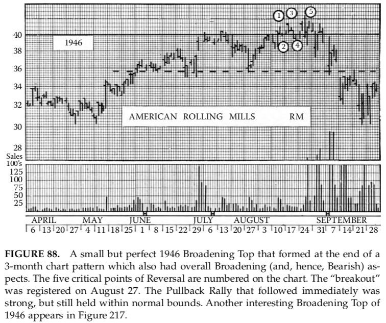

**HÌNH 88.** Một Đỉnh Mở Rộng nhỏ nhưng hoàn hảo năm 1946, hình thành kết thúc một mô hình biểu đồ 3 tháng cũng có tổng thể Mở Rộng (và do đó, Gấu). Năm điểm quan trọng báo Đảo Chiều được đánh số trên biểu đồ. Đợt “bứt phá” được ghi nhận ngày 27/8. Đợt Tăng Hồi ngay sau đó mạnh, nhưng vẫn trong giới hạn bình thường. Một Đỉnh Mở Rộng 1946 thú vị khác xuất hiện trong Hình 217.

Việc khẳng định đỉnh thứ ba (số 5) và sự giảm xuống dưới đáy thứ hai (số 4) _hoàn tất_ Mô Hình Đảo Chiều có thể được coi là quá nghiêm ngặt, vì đôi khi các Đỉnh Mở Rộng tiếp tục tạo đỉnh thứ tư cao hơn. Tuy nhiên, quy tắc này thường được áp dụng vì tín hiệu tổng thể hiển nhiên là Gấu, nên không nên chần chừ rút lui. Ngược lại, yêu cầu có đỉnh thứ ba có cơ sở vì các Đảo Chiều Chính hiếm khi hoàn tất trước ít nhất ba lần thử đẩy giá theo xu hướng trước. Đây là lý do tại sao các nhà tiên phong xếp nhiều mô hình vào “Đảo Chiều Năm Điểm.” Đỉnh Mở Rộng là Đảo Chiều Năm Điểm (số 1 đến 5), và do đó, rõ ràng là một Đầu và Vai. Thực tế, Đỉnh Mở Rộng có thể gọi là Đầu và Vai với vai phải cao và đường cổ dốc xuống.

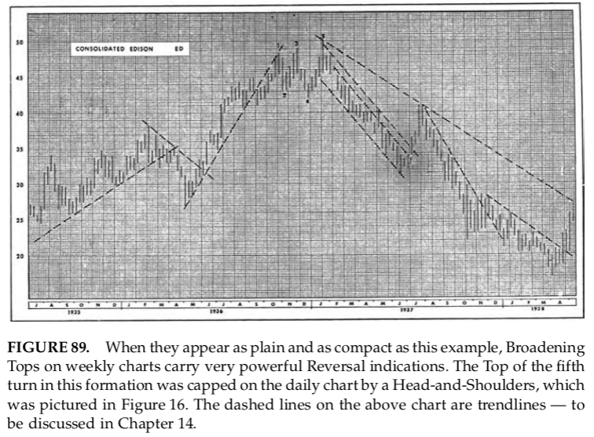

**HÌNH 89.** Khi xuất hiện rõ ràng và gọn như ví dụ này, Đỉnh Mở Rộng trên biểu đồ tuần mang tín hiệu Đảo Chiều cực mạnh. Đỉnh lần thứ năm của mô hình này được giới hạn trên biểu đồ ngày bởi một Đầu và Vai, đã được minh họa trong Hình 16. Các đường nét đứt trên biểu đồ trên là các đường xu hướng — sẽ được thảo luận trong Chương 14.

##### Tại sao không có Broadening Bottoms?

Tất cả các loại Mô hình Đảo Chiều khác mà chúng ta đã nghiên cứu
có thể xuất hiện ở cả Đỉnh và Đáy. Chúng có thể phát triển
khi kết thúc một xu hướng giảm để đổi chiều lên, hoặc khi kết
thúc xu hướng tăng để đảo xuống. Nhưng điều này dường như
không đúng với Mô hình Rộng Dần. Trước đây, người ta cho rằng
Broadening Bottoms phải tồn tại, nhưng tác giả chưa bao giờ
tìm thấy một mô hình tốt trong hàng ngàn biểu đồ cổ phiếu
cá nhân qua nhiều năm, và chỉ một hoặc hai trường hợp tương
tự trong biểu đồ Averages. Có vẻ như các điều kiện tạo ra
Broadening không tồn tại sau một đợt giảm kéo dài. Điều này
củng cố nhận định trước đó rằng mô hình này gợi ý giao dịch
tích cực, sôi động với sự tham gia của công chúng nhiều (và
không quá hiểu biết hay kiểm soát). Những điều kiện này
thường xuất hiện ở giai đoạn cuối của Bull Market.

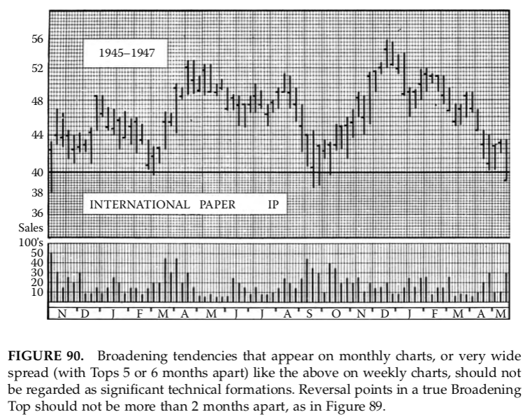

**HÌNH 90.** Xu hướng Broadening xuất hiện trên biểu đồ tháng,
hoặc phạm vi rộng (Đỉnh cách nhau 5–6 tháng) như trên biểu
đồ tuần, không nên coi là mô hình kỹ thuật quan trọng.
Điểm đảo chiều trong Broadening Top thực sự không quá 2 tháng,
như trong Hình 89.

##### Mô hình Rộng Dần Góc Vuông (Right-Angled Broadening)

Các mô hình giá hình “Tam giác Ngược” với biên trên hoặc
dưới ngang xuất hiện gần như bằng tần suất dạng đối xứng,
tức là không nhiều như Tam giác, Hình chữ nhật… Thế kỷ 20,
rất ít xuất hiện (_EN9: Vẫn hiếm trong thập niên 2000_). Trong
Tam giác Góc Vuông thật sự với đường trên ngang và đường
dưới dốc lên gọi là Tam giác Tăng (Ascending), còn ngược lại
với đáy ngang và đỉnh dốc xuống gọi là Tam giác Giảm
(Descending), chúng ta không áp dụng những tên này cho
Broadening. Nói chung, Broadening Góc Vuông mang ý nghĩa
Bearish, bất kể biên ngang ở phía nào, gần giống dạng đối xứng.

Tuy nhiên, chúng khác Tam giác Đối xứng ở một điểm: biên
ngang cho thấy tích lũy hoặc phân phối ở mức giá cố định,
tùy biên ngang ở trên hay dưới. Do đó, bất kỳ breakout quyết
định qua biên ngang đều có ý nghĩa mạnh. Nếu Broadening
_đỉnh ngang_ xuất hiện sau một đợt tăng, và giá cuối cùng
vượt lên biên này với khối lượng cao và đóng cửa vượt 3%,
có thể giả định xu hướng tăng trước đó sẽ tiếp tục. Tuy nhiên,
xác suất thường ngược lại: lực phân phối tạo đỉnh ngang thắng,
giá giảm mạnh.

Hơn nữa, nếu xu hướng tăng xuất hiện từ Broadening đỉnh
ngang, khả năng rally thứ ba sẽ kèm khối lượng giảm đáng
kể thay vì cao không đều như Broadening Bearish, và
rally thứ ba hoặc thứ tư bị dừng và đảo chiều _trên_ đáy
trước. Điều này biến mô hình thành _Consolidation Head-and-
Shoulders_, mô hình Tiếp diễn xu hướng (xem Ch.11). Thông
điệp cho nhà đầu tư có cổ phiếu đang hình thành Broadening
đỉnh ngang: theo dõi phản ứng thứ ba. Nếu xuống dưới thứ hai
và khối lượng không giảm nhiều, bán ra ở rally tiếp theo.
(Bạn có thể mua lại sau nếu giá bất ngờ hồi phục và vượt đỉnh.)

Broadening Góc Vuông với đáy ngang gần như luôn giảm.
Khi giá xuống dưới biên dưới, thường có Pullback Rally về
biên này trong vài ngày hoặc 2–3 tuần, tương tự Pullback
sau Head-and-Shoulders Top.  
(Lưu ý: rally thứ ba hoặc thứ tư trong Flat-Bottomed Broadening
có thể không lên cao như trước, khi đó sẽ hình thành Head-and-
Shoulders. Mọi Head-and-Shoulders đều bắt đầu từ Broadening.)

##### Kim Cương (Diamond)

Mô hình Đảo Chiều _Diamond_ có thể xem như Head-and-Shoulders
phức tạp với neckline hình V, hoặc Broadening sau 2–3 “swing”
đột ngột biến thành Tam giác gần như Đối xứng. Về khối lượng,
cách sau có vẻ phù hợp hơn. Tên gọi xuất phát từ hình ảnh
giống viên kim cương.

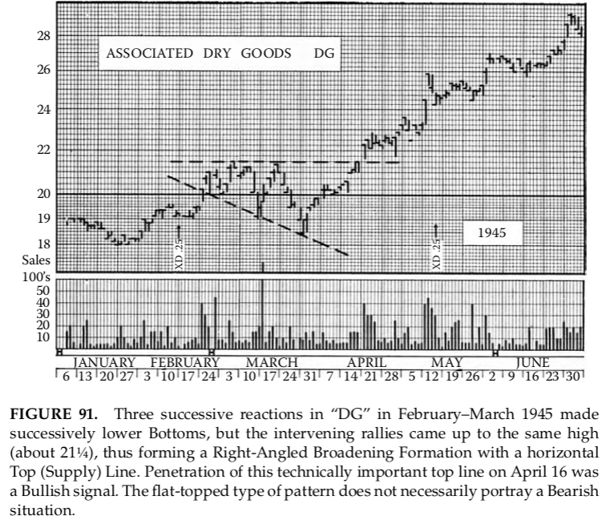

**HÌNH 91.** Ba phản ứng liên tiếp trong “DG” tháng 2–3/1945 tạo
đáy thấp dần, nhưng rally xen ngang tới đỉnh giống nhau (~21¼),
tạo Broadening Góc Vuông với đường Top ngang (Supply). Vượt
đỉnh kỹ thuật 16/4 là tín hiệu Bullish. Mô hình đỉnh ngang không
nhất thiết Bearish.

Diamond khá nổi bật và dễ nhận biết, nhưng hiếm gặp.
Do phát triển trong thị trường hoạt động, hiếm khi xuất hiện
ở Đáy. “Môi trường tự nhiên” là Đỉnh lớn và Đỉnh khối lượng
cao trước các Intermediate Reactions lớn. Nhiều Multiple
Head-and-Shoulders là trường hợp biên Diamond, tức
neckline hơi cong. Tuy nhiên, không nên cố tạo Diamond từ
Head-and-Shoulders bình thường. Neckline V có thể hứa hẹn
breakout sớm hơn, nhưng an toàn hơn là giữ nguyên Head-and-
Shoulders trừ khi nửa sau mô hình gồm dao động nhỏ hội tụ
rõ ràng, và khối lượng giảm dần như Tam giác.

Diamond ít cần giải thích thêm. Hình minh họa đủ để hiểu
chi tiết điển hình. Nó có độ đo tối thiểu: giá ít nhất đi xa
bằng biên độ lớn nhất (đỉnh → đáy V). Đây là quy tắc tối
thiểu, với điều kiện Reversal phải có cái để đảo. Xu hướng
mới thường vượt mức tối thiểu này.

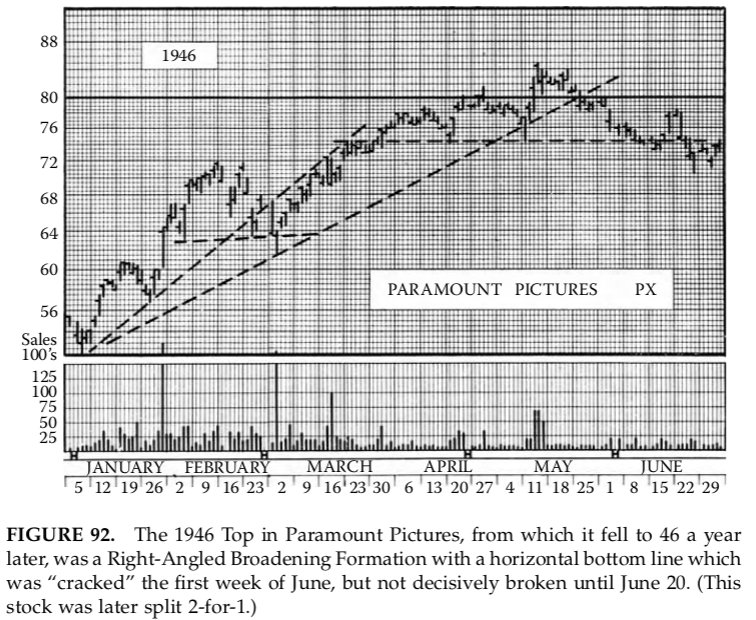

**HÌNH 92.** Đỉnh Paramount Pictures 1946, giá giảm về 46 sau
một năm, là Broadening Góc Vuông với đáy ngang bị “crack”
tuần đầu tháng 6, nhưng không bị phá quyết định cho tới 20/6.
(Cổ phiếu sau này chia 2-for-1.)

##### Mô hình Wedge (Nêm)

Tất cả các mô hình biểu đồ chúng ta đã thảo luận tới nay đều có thể
xuất hiện ở các Thay đổi Xu hướng Chính (Major Trend) của giá. Một số
ít khi xuất hiện ở nơi khác ngoài Đỉnh/Đáy Quan trọng. Giờ đây,
chúng ta xem xét ba mô hình thường là Nhỏ (Minor) hoặc Tối đa
ở mức Trung gian (Intermediate) về ý nghĩa xu hướng. Chúng vẫn
hữu ích trong giao dịch. Một trong số đó, _Wedge_ (Nêm), chúng
ta đã đề cập (Ch.8) do có phần giống Tam giác.

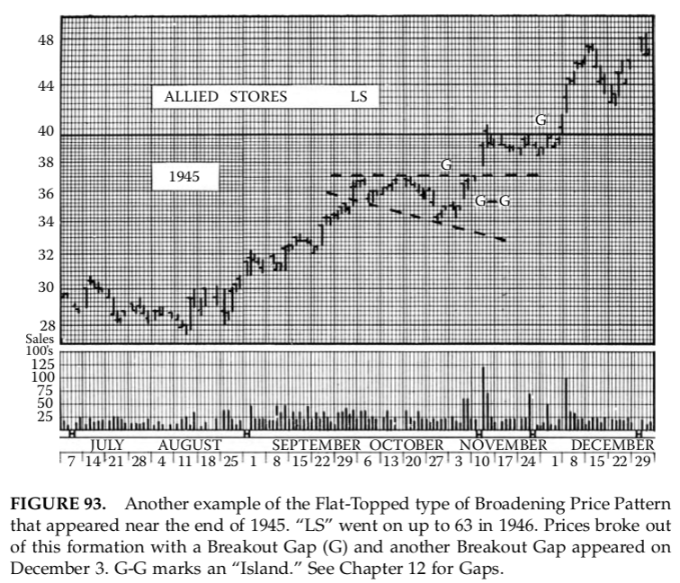

**HÌNH 93.** Ví dụ khác của Broadening đỉnh ngang cuối 1945. “LS”
tăng lên 63 năm 1946. Giá phá mô hình với Breakout Gap (G); G tiếp
theo xuất hiện 3/12. G-G đánh dấu “Island”. Xem Ch.12 về Gap.

Nêm là mô hình trong đó dao động giá nằm trong các đường
thẳng hội tụ, nhưng khác Tam giác ở chỗ cả hai biên đều dốc lên
hoặc dốc xuống. Trong Tam giác Đối xứng, biên trên dốc xuống,
biên dưới dốc lên. Trong Tam giác Góc Vuông, một biên dốc,
biên kia ngang. Trong Rising Wedge, cả hai biên dốc lên, nhưng
do hội tụ, biên dưới dốc mạnh hơn biên trên. Ngược lại với Falling
Wedge.

Nhìn sơ qua, có thể tưởng Rising Wedge dốc lên giống Tam giác
Tăng, nên Bullish hơn. Nhưng không phải. Tam giác Tăng: đỉnh
ngang cho thấy cổ phiếu phân phối cố định; khi đã hấp thụ,
giá bật mạnh. Rising Wedge: không có rào cản supply, mà quan
tâm đầu tư giảm dần. Giá tăng, nhưng mỗi nhịp tăng yếu hơn
trước, cuối cùng cầu cạn, xu hướng đảo chiều. Rising Wedge
thể hiện thị trường yếu dần về mặt kỹ thuật.

Tất nhiên, bất kỳ tăng giá nào cũng làm thị trường yếu đi
theo nghĩa kỹ thuật: người mua lưỡng lự trả giá cao, người
bán sẵn sàng ở giá cao. Tuy lý thuyết đúng, thực tế giá tăng
thu hút người mua. Khác với Uptrend Channel bình thường,
Nêm đặt giới hạn tăng. Các biên hội tụ báo điểm kết thúc
tăng và bắt đầu phản ứng.

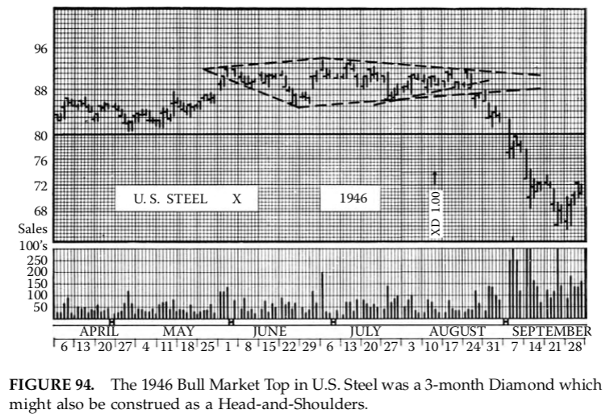

**HÌNH 94.** Đỉnh Bull 1946 U.S. Steel là Diamond 3 tháng, cũng
có thể xem như Head-and-Shoulders.

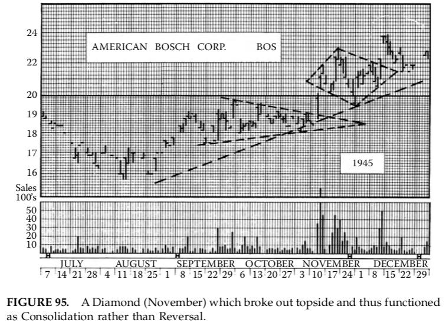

**HÌNH 95.** Diamond (tháng 11) breakout lên trên, nên là
Consolidation chứ không Reversal.

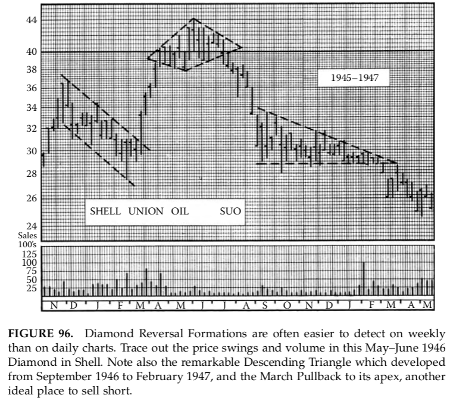

**HÌNH 96.** Diamond dễ nhận thấy trên tuần hơn ngày. Quan sát
swing và volume Diamond May–June 1946 Shell. Lưu ý Descending
Triangle Sep 1946–Feb 1947, Pullback Mar, nơi lý tưởng để short.

Up-Pointed Wedge có thể hình thành ở Đỉnh xu hướng tăng trước
hoặc đáy xu hướng giảm trước. Mô hình thường >3 tuần; ngắn
hơn là Pennant (Ch. tiếp theo). Giá dao động trong Wedge ít
nhất 2/3 khoảng từ đáy (bắt đầu hội tụ) tới đỉnh; nhiều trường hợp
vượt apex trong nhịp cuối. Khi phá đáy Wedge, giá thường
giảm mạnh, retrace toàn bộ dao động trong Wedge, thỉnh thoảng hơn.
Volume giảm dần như Tam giác.

**HÌNH 96.1.** Kỹ thuật viên tương lai sẽ ngạc nhiên trước đỉnh
Bull ’90s. Broadening Top (vốn có ý nghĩa riêng) biến thành Diamond,
breakout lên giả, thành mô hình tam giác không đều, sau head fake
phá xuống thành modified V-Bottom, rồi trở lại đỉnh rectangle.
Đường ngang vẽ tháng 8/2000 chặn rally 2001, từ đó trượt tới
thảm họa 11/9/2001. Chiến lược trading rõ ràng: không nắm dài.
Không có tiên tri gì, chỉ là phân tích thực thời.

##### Falling Wedge

Ngoại trừ hướng chỉ xuống, _Falling Wedge_ giống Rising Wedge.
Nhưng xu hướng sau khi hoàn thành khác. Rising Wedge: phá
xuống nhanh; Falling Wedge: đi ngang hoặc lờ đờ trước khi tăng.
Rising Wedge cần hành động nhanh; Falling Wedge cho trader
thời gian chuẩn bị trước nhịp tăng.

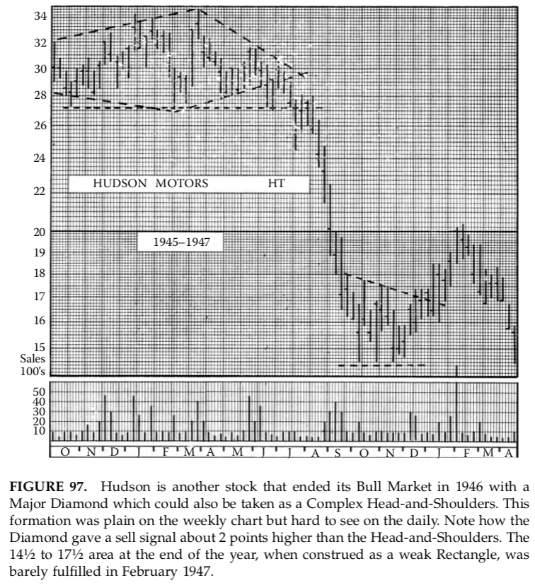

**HÌNH 97.** Hudson kết thúc Bull 1946 với Diamond lớn, cũng
là Complex Head-and-Shoulders. Trên tuần rõ, ngày khó thấy.
Diamond cho tín hiệu bán ~2 điểm cao hơn Head-and-Shoulders.
Vùng 14½–17½ cuối năm, nếu xem như Rectangle yếu, gần như
không hoàn thành tới Feb 1947.

Cả hai loại Wedge cần rõ ràng trên biểu đồ. Nếu mô hình
không compact, dao động ít, không hội tụ rõ, hoặc dốc không
đáng kể, mô hình Wedge đáng nghi. Biên gần ngang hay đóng
cửa hằng ngày gần nhau → Triangle an toàn hơn. Không nên
lo quá, kinh nghiệm sẽ giúp nhận dạng triệu chứng và chẩn đoán
gần như bản năng.

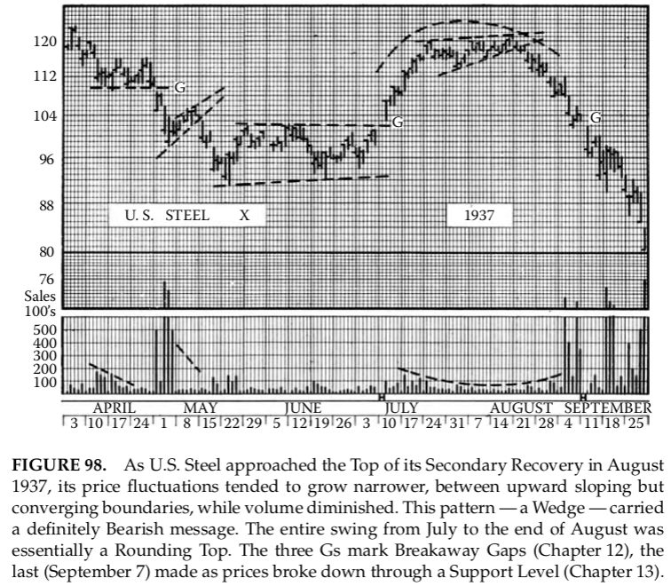

**HÌNH 98.** U.S. Steel Top Secondary Recovery Aug 1937, dao động
hẹp dần, biên hội tụ dốc lên, volume giảm. Đây là Wedge Bearish.
Toàn bộ swing Jul–End Aug là Rounding Top. 3 G đánh dấu
Breakaway Gap (Ch.12); G cuối (7/9) phá Support (Ch.13).

##### Wedges trên biểu đồ tuần và tháng

Hầu hết Wedge thực quá ngắn (<3 tháng) để nhận dạng trên
biểu đồ tháng, nhưng có thể thấy trên tuần. Xu hướng giảm
dài, vẽ theo thang số học, đôi khi thành Wedge. Một
Major Bear Decline trên monthly arithmetic có thể giống
Falling Wedge khổng lồ. Trên semi-log, sẽ thành Channel
song song hoặc hơi rộng, không hội tụ.

##### Rising Wedges phổ biến trong Bear Market Rallies

Rising Wedge đặc trưng cho Bear Market Rally. Xuất hiện
nhiều khi sau đợt giảm lớn, câu hỏi Bull Trend mới bắt đầu
hay không → Primary Trend vẫn giảm. Khi Major Bear Swing
kết thúc Head-and-Shoulders Bottom, Rising Wedge cuối
xuất hiện khi giá rally từ vai trái tới neckline, ngay trước
phá xuống head. Rising Wedge trên weekly arithmetic gần
như luôn là hiện tượng Bear Market, biểu hiện sức bật giảm
của phản ứng chống lại Primary Trend.

##### Đảo chiều Một Ngày (One-Day Reversal)

Chúng ta đã nhắc trong Ch.6, One-Day Reversal. Khi đứng
một mình, chỉ báo này có ý nghĩa tạm thời hoặc Minor Trend.
Có thể xuất hiện ở đỉnh dài, ví dụ đỉnh đầu Head-and-Shoulders
trước khi giảm dài, nhưng không dự báo toàn bộ đợt giảm,
chỉ báo turn ở “đầu”. One-Day Reversal cũng có thể xuất hiện
ở đầu (đỉnh đầu) Tam giác Đối xứng, chỉ Consolidate, không Reversal.
Dù sao, cảnh báo tạm thời sức Bullish cạn kiệt.

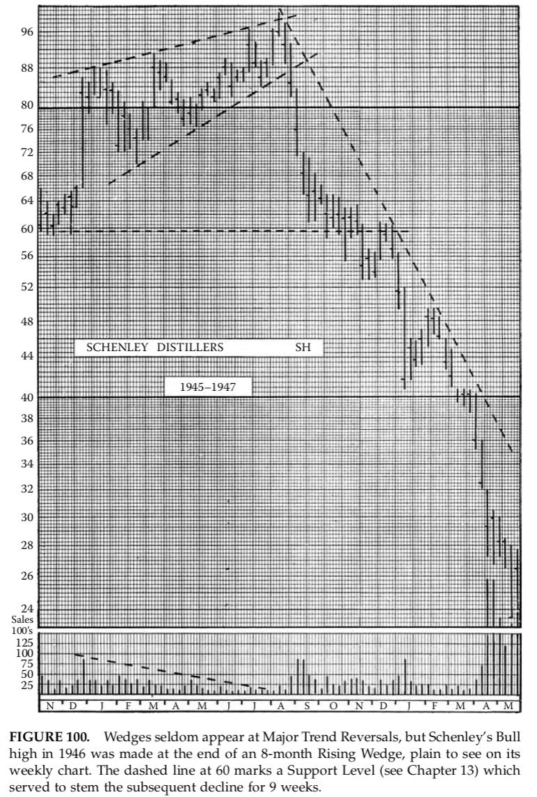

**HÌNH 100.** Wedges hiếm ở Major Reversal, nhưng Schenley Bull
1946 là kết thúc Rising Wedge 8 tháng, rõ trên weekly chart.
Đường đứt 60 là Support (Ch.13) giữ giảm 9 tuần.

**HÌNH 101.** Biểu đồ daily 12 tháng “TWA” có nhiều điểm kỹ thuật
quan trọng. One-Day Reversal 3/12 đánh dấu Major Top. 4 tuần sau
có Descending Triangle yếu, nhưng Reversal Day là tín hiệu bán
rõ rệt. Khi học Pennants, xem chart này cho Pennant tháng 11.
Down Trendline trung gian bị phá tạm tháng 8/1946, không khối
lượng xác nhận (Ch.14). Trong toàn bộ giảm giá, không có Buy Pattern.

Ở chiều giảm, một **Đảo Chiều Một Ngày (One-Day Reversal)** thường xuất hiện rõ 
ràng và nổi bật vào cuối một đợt **Panic Sell-Off** (bán tháo hoảng loạn), và khi 
đó nó thường được gọi là **Ngày Đỉnh Bán (Climax Day)** hoặc **Đỉnh Bán Hoảng 
Loạn (Selling Climax)**. Hình thức xuất hiện này mang ý nghĩa đặc biệt, sẽ được 
bàn chi tiết sau. Trước hết, **Đảo Chiều Một Ngày là gì?**

Trước tiên, đây là một ngày có **khối lượng giao dịch cực kỳ cao**, vượt đáng kể 
so với mọi phiên giao dịch trong vài tháng gần đây. Nó xuất hiện sau một đợt 
tăng hoặc giảm khá dài và ổn định, với hoạt động giao dịch tăng dần. Giá mở 
cửa ngay từ đầu phiên như thể không gì có thể cản trở. Thường thì giá mở cửa 
cũng vượt xa mức đóng cửa ngày trước, tạo ra một khoảng trống (gap) trên biểu đồ. 
Băng ghi (ticker tape) chạy chậm, và trước khi đợt tăng hoặc giảm dừng lại, giá 
đã di chuyển xa trong một hoặc hai giờ như thể cần ba hoặc bốn ngày bình thường. 
Cuối cùng, đợt tăng hoặc giảm dừng lại, có thể sau giờ đầu hoặc muộn hơn trong 
ngày. Lúc này, giá **dao động mạnh**, thay đổi nhỏ qua lại, băng vẫn chạy nhanh 
và thường muộn từng đoạn. Bất ngờ, xu hướng đảo chiều và giá di chuyển nhanh theo 
hướng ngược lại. Phiên kết thúc với một đợt hoạt động mạnh cuối ngày đưa giá 
đóng cửa gần với mức mở cửa ban đầu. Mặc dù khối lượng giao dịch rất lớn, mức 
thay đổi ròng so với ngày trước rất nhỏ.

**Đảo Chiều Một Ngày** xuất hiện thường xuyên ở các cổ phiếu cá nhân có **cung 
cổ phiếu nổi (floating supply) ít**, đã tăng mạnh và thu hút đông đảo công chúng. 
Ngược lại, chúng hiếm khi xuất hiện trong các chỉ số trung bình (Averages). Trong 
khi đó, các **Đỉnh Bán Hoảng Loạn (Selling Climaxes)** lại thường thấy rõ trong 
các chỉ số trung bình vào cuối các đợt giảm bất thường hoặc bán tháo hoảng loạn.

Như đã nói, **Đảo Chiều Một Ngày** không mang ý nghĩa của **Xu Hướng Chính (Major 
Trend)**. Nhà giao dịch linh hoạt có thể tận dụng để kiếm lời — có thể vài điểm 
nếu nhảy vào đúng lúc. Nhưng thông thường, xu hướng mới (tại đóng cửa) không 
di chuyển xa ngay lập tức; giá thường dao động quanh vùng gần đó, hình thành 
một mô hình khu vực trước khi diễn ra một đợt dao động cỡ trung gian. Tuy nhiên, 
hiện tượng **Đảo Chiều Một Ngày**, thường xuất hiện trong hoặc ở đầu các mô hình 
kỹ thuật quan trọng hơn, cung cấp manh mối quan trọng về khả năng phát triển xu 
hướng tiếp theo. Trong mọi trường hợp, đó là cảnh báo cần **theo dõi biểu đồ** nơi 
hiện tượng xuất hiện để sẵn sàng cho cơ hội di chuyển đáng kể.

Cần lưu ý rằng loại **di chuyển giả hoặc shakeout** mô tả trong Chương 8, xảy ra 
tại đỉnh của **Tam Giác Cân (Symmetrical Triangle)**, thường xuất hiện dưới dạng 
**Đảo Chiều Một Ngày**.

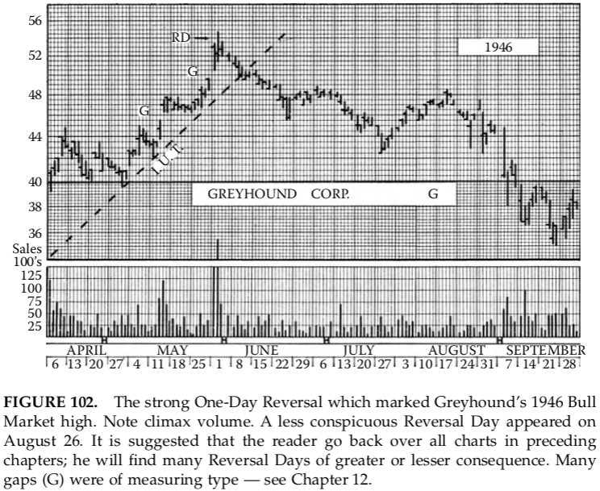  

**Hình 102.** Đảo Chiều Một Ngày mạnh, đánh dấu đỉnh Bull Market của Greyhound 
năm 1946. Chú ý đến khối lượng cao đỉnh. Một Đảo Chiều ít rõ ràng hơn xuất hiện 
ngày 26/8. Người đọc nên xem lại các biểu đồ ở các chương trước, sẽ thấy nhiều 
Ngày Đảo Chiều với mức quan trọng khác nhau. Nhiều gap (G) là loại đo lường — 
xem Chương 12.

### Đỉnh Bán Hoảng Loạn (Selling Climax)

Ngày xưa, khi cổ phiếu có thể mua với chỉ 10% giá trị tiền mặt và không giới hạn 
bán khống, các nhà giao dịch chuyên nghiệp có thể tổ chức **Bear Raids** để làm 
yếu các tài khoản ký quỹ. Bằng cách bán khống số lượng lớn khi công chúng đã mua 
quá nhiều, họ có thể hạ giá. Sau đó, môi giới yêu cầu thêm ký quỹ từ các nhà đầu 
tư, nhiều người không thể hoặc không muốn đáp ứng, dẫn đến bán tháo. Điều này tạo 
ra đợt giảm tiếp theo, và các chuyên gia có thể mua lại cổ phiếu với lợi nhuận và 
tích lũy cho đợt tăng tiếp theo. Các Bear Raid kiểu này bị kiểm soát nhờ quy định 
SEC, nhưng các lệnh ký quỹ và bán ép vẫn tồn tại khi mua ký quỹ, và xuất hiện khi 
giá giảm mạnh sau mua của công chúng.

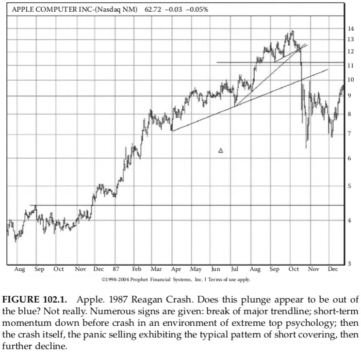  

**Hình 102.1.** Apple, Khủng hoảng Reagan 1987. Đợt giảm không hoàn toàn bất ngờ: 
phá trendline chính, momentum giảm ngắn hạn, bán hoảng loạn, bán khống, và giảm 
tiếp theo.

Hầu hết **Đỉnh Bán Hoảng Loạn**, nếu không phải tất cả, được tạo ra bởi **bán khẩn 
cấp** kiểu này. Chúng xuất hiện sau các đợt giảm nhanh và toàn diện, cạn kiệt 
dự trữ ký quỹ của nhiều nhà đầu tư, dẫn đến bán tháo. Quá trình này tự tăng tiến — 
mỗi đợt bán ép đe dọa các tài khoản khác — cho đến khi hàng triệu cổ phiếu bị bán ồ 
ạt. Đây là **Selling Climax**, khi tổng khối lượng vượt mọi ngày giao dịch trong 
đợt tăng trước đó. Đây là cơ hội cho người tránh mua ở đỉnh, có vốn để mua cổ 
phiếu giá hoảng loạn.

Một **Ngày Bán Hoảng Loạn** làm thay đổi tình hình kỹ thuật thị trường: cổ phiếu 
từ tay yếu sang tay mạnh với giá thấp, áp lực bán tiềm ẩn được loại bỏ, giá 
thường xuống dưới giá trị hợp lý tạm thời.

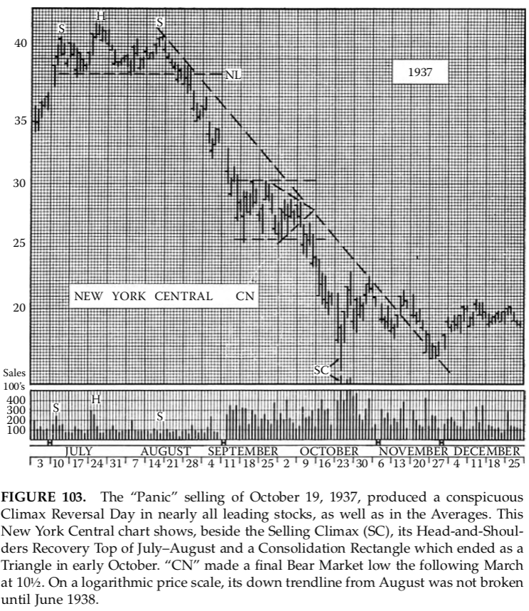  

**Hình 103.** Bán hoảng loạn 19/10/1937 tạo **Ngày Đỉnh Bán** trên hầu hết cổ phiếu 
dẫn đầu và các chỉ số trung bình. Biểu đồ New York Central cho thấy, ngoài **SC**, 
còn có Top hồi phục Head-and-Shoulders và Rectangle kết thúc thành Tam giác đầu 
tháng 10. CN lập đáy Bear Market cuối cùng tháng 3 với 10½. Trendline logarithmic 
từ tháng 8 không bị phá cho tới tháng 6/1938.

Một **Selling Climax** không cần kết thúc trong một ngày duy nhất. Một số trải 
ra hai ngày: giảm cạn kiệt ngày đầu, gần cuối phiên; ngày hôm sau bật tăng ngay 
từ mở cửa, cho thấy không còn cổ phiếu bán khẩn cấp.

Kỷ lục **Selling Climax** theo tỷ lệ phần trăm thuộc 29/10/1929: mở cửa gần đỉnh 252,38, 
thấp hơn 8 điểm so với đóng cửa trước đó. Bán hoảng loạn làm Dow-Jones giảm 40,05 
điểm, hồi 18 điểm trong 2 giờ cuối, tăng thêm 28 điểm ngày hôm sau. Khối lượng kỷ 
lục: 16.410.000 cổ phiếu, gấp đôi bất kỳ ngày nào trong Bull Market.

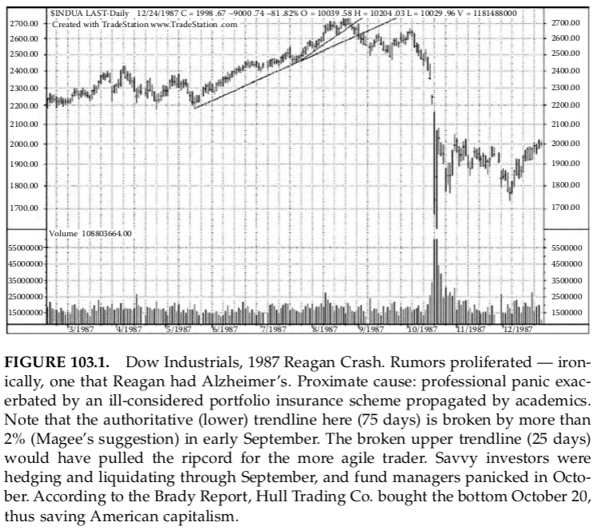  

**Hình 103.1.** Dow Industrials, Khủng hoảng Reagan 1987. Tin đồn, hoảng loạn, 
bán hoảng loạn, giảm tiếp. Trader thông minh mua đáy 20/10, cứu vãn tình hình.

Panic 1937 kết thúc với **Selling Climax** ngày 19/10. Dow đóng 125,73 đêm trước, 
mở cửa với áp lực bán, phiên kết thúc 126,85, hồi phục hoàn toàn. Khối lượng 7.290.000 
cổ phiếu, gấp đôi ngày cao trước đó.

Nhớ rằng, **Đảo Chiều Một Ngày** không phải chỉ báo xu hướng chính đáng tin. 
Các **Selling Climax** hiếm khi xảy ra ở đáy cuối Bear Market — các cổ phiếu yếu 
đã bị bán lâu trước đó. Chỉ còn lại một hình đảo chiều, **Island Pattern**, liên quan 
đến Gap, sẽ bàn trong Chương 12.

## chương 10.1. Hiện tượng Ngắn Hạn Có Ý Nghĩa Tiềm Ẩn

Các hiện tượng cực ngắn hạn — kéo dài một ngày hoặc vài ngày — đôi khi
không chỉ chỉ ra hướng ngắn hạn mà còn gợi ý về hành vi giá dài hạn.
Gaps (Ch.12) và One-Day Reversals (Ch.10) đã thảo luận thuộc nhóm này.
Các mẫu ngắn hạn khác gồm _Spikes_, _Key Reversal Days_ (đôi khi chỉ gọi
_là Reversal Days_), và _Runaway Days_ (đôi khi gọi _Wide-Ranging Days_).

## Spikes

Vào ngày xuất hiện, Spike chưa thể nhận diện ngay, vì định nghĩa là nó
nhô cao hơn hẳn các ngày trước và sau nếu ở hoặc gần Đỉnh, và rơi thấp
hơn hẳn các ngày xung quanh nếu ở Đáy. Sau một ngày dao động rộng
bất thường, các ngày tiếp theo cần quan sát để phân biệt Spike với
Runaway Day. Cả hai đều là dấu hiệu trận chiến rộng giữa bulls và bears,
với đóng cửa cung cấp manh mối người chiến thắng. Tầm quan trọng của
Spike phụ thuộc vào:

1. Sức mạnh và độ dài hành động trước đó
2. Đóng cửa ngày hôm đó, tăng ở Đáy hay giảm ở Đỉnh
3. Độ nổi bật so với các ngày trước và sau

Một ngày dao động cực rộng cuối đợt bull dài, đóng cửa giảm sau khi
tạo đỉnh mới bất thường, có thể được coi là tín hiệu một ngày.
Việc giao dịch dựa trên nó phụ thuộc phong cách, sở thích và loại
giao dịch — dài hạn, scalping, v.v. Spike cũng có thể là One-Day
Reversal — mở gap, mua mạnh, sau đó sụp và đóng dưới mở hoặc
đáy ngày. Hành động này như quân đội truy đuổi kẻ thua giả rồi bị
phản công.

Đảo ngược mô tả trên thành Spike Bottom. Không hiếm khi Spike
theo sau là chuyển động giá ngược chiều. Hình 104.1 minh họa Spike
hiện đại. Hình 1 và 35 cho thấy một số Spike trên biểu đồ Edwards
và Magee.

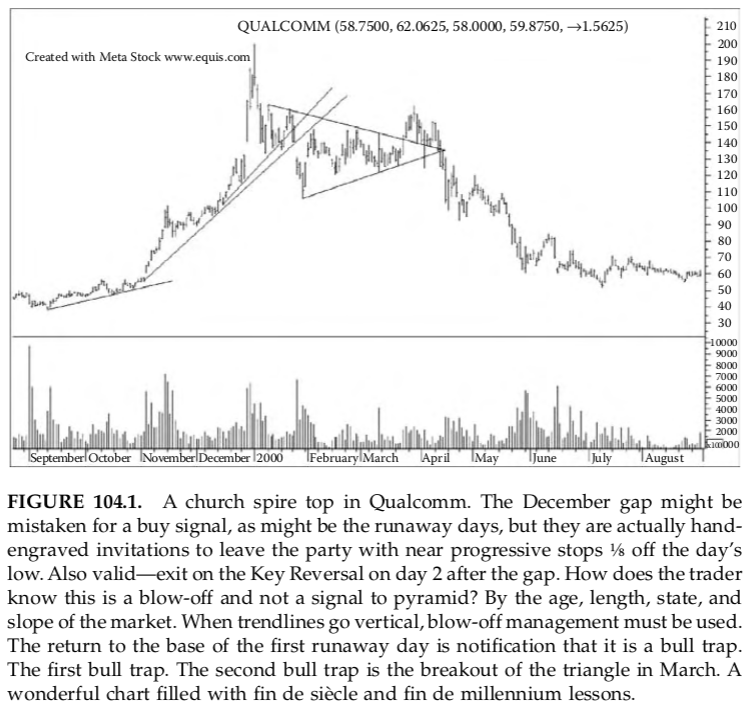

**HÌNH 104.1.** Đỉnh church spire Qualcomm. Gap tháng 12 có thể
nhầm là tín hiệu mua, như Runaway Days, nhưng thực chất là dấu
hiệu thoát với stops gần 1/8 dưới đáy ngày. Cũng hợp lý — thoát
Key Reversal ngày 2 sau gap. Trader nhận biết blow-off hay không
qua tuổi, độ dài, trạng thái, dốc thị trường. Khi trendline đứng
thẳng, cần quản lý blow-off. Trở lại đáy Runaway Day là bull trap.
Bull trap đầu tiên. Bull trap thứ hai: breakout tam giác tháng 3.
Biểu đồ tuyệt vời, đầy bài học fin de siècle và fin de millennium.

##### Runaway Days

Runaway Day là ngày nổi bật trên biểu đồ với dao động dài bất thường,
thường mở tại đáy và đóng tại đỉnh, hoặc ngược lại với bear runaways.
Đây là khi phe bán rút lui nhanh hoặc đánh lừa, kéo bulls vào bẫy.
Người giữ và bán không thể hoặc không muốn thỏa cầu mua. Giá đi
khoảng 2–3 lần biên ngày. Nhà đầu cơ nhanh có thể scalp, nhưng các
ngày sau mới xác định ý nghĩa thật. Consolidation tốt và volume tiếp
tục xác nhận, còn volume giảm hoặc pullback biến động nghi vấn tín hiệu.
Nếu giá trở lại đáy Runaway Day, có thể là tín hiệu giả, và trade
ngược chiều đang hình thành. Hình 39 minh họa Runaway với gaps.
Hình 104.2 Microsoft 2000 là ví dụ: bull trap do Runaway Day, collapse
dự báo giảm 50% cổ phiếu.

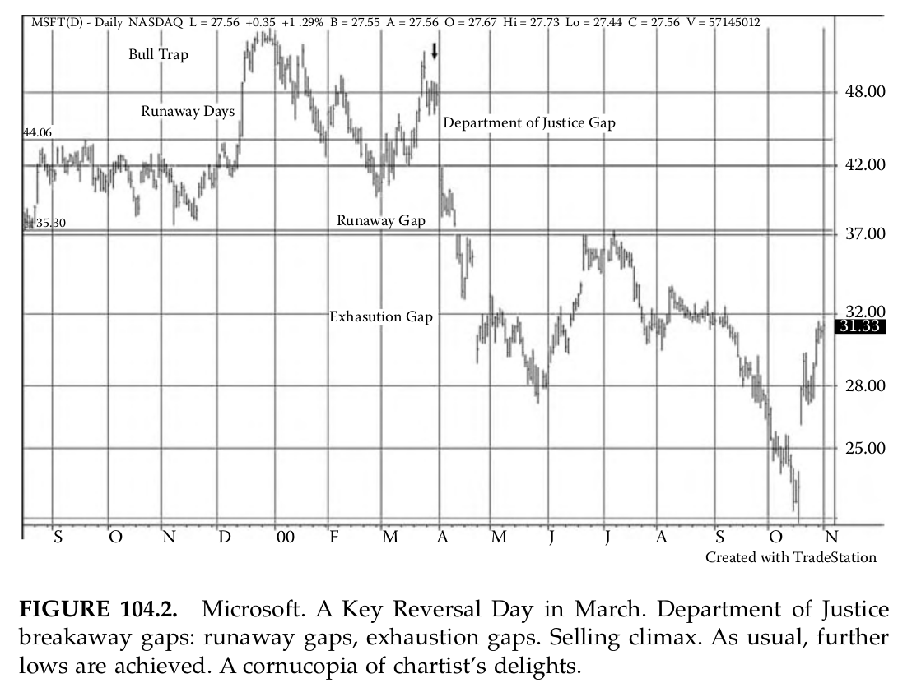

**HÌNH 104.2.** Microsoft. Key Reversal Day tháng 3. DOJ breakaway gaps:
runaway gaps, exhaustion gaps. Selling climax. Thường tiếp tục tạo đáy
mới. Biểu đồ tuyệt vời cho chartist.

##### Key Reversal Days

Key Reversal Day xảy ra khi giá tạo đỉnh mới trong upmove nhưng
đóng cửa dưới ngày trước. Là tín hiệu giao dịch ngắn hạn đáng giá,
nhưng cần phán đoán và timing để sinh lời. Trong Bull Market sẽ có
một số đỉnh tạm thời với Key Reversal Days. Ở Top quan trọng, trader
short cổ phiếu lúc đóng cửa với stop trên đỉnh ngày reversal, hoặc cao
hơn chút. Có thể thoát khi Key Reversal Day ngược chiều, hoặc đạt
target, hoặc theo mô hình. Nếu mạo hiểm, dùng trade làm bước đầu
tích lũy cho Bear Market, thêm vị thế khi mô hình quan trọng xuất hiện
và mức hỗ trợ phá. Mẫu này cũng hữu ích trong trading range, như cổ
phiếu Internet 2000, giúp thoát an toàn minicrash NASDAQ đầu 2000.
(Hình 104.3–104.4 Ebay, Lucent.)

Trong các Mẫu Ngắn Hạn, Gaps, One-Day Reversals, Key Reversal Days,
Spikes, Runaway Days, nếu giá trở về xuất phát, là tín hiệu giả và lý
do đảo chiều trade, có thể thu lợi đáng kể. Đây là chiến thuật của
scalpers và speculators, nhưng nhà đầu tư dài hạn cũng nên biết.

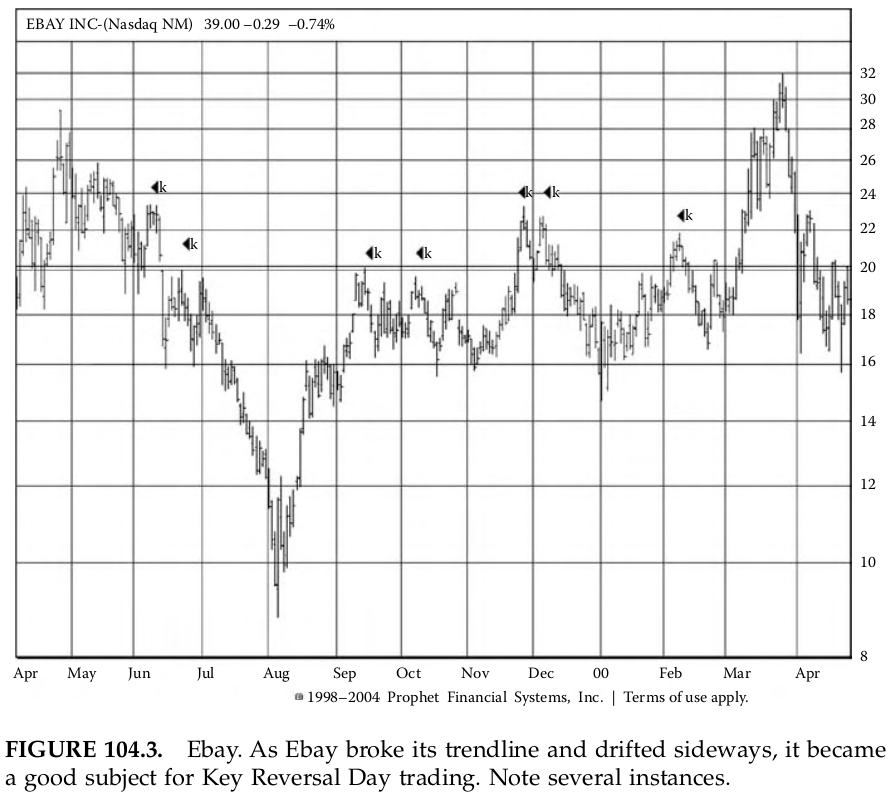

**HÌNH 104.3.** Ebay. Khi Ebay phá trendline và đi ngang, là đối tượng
tốt cho Key Reversal Day. Lưu ý vài trường hợp.

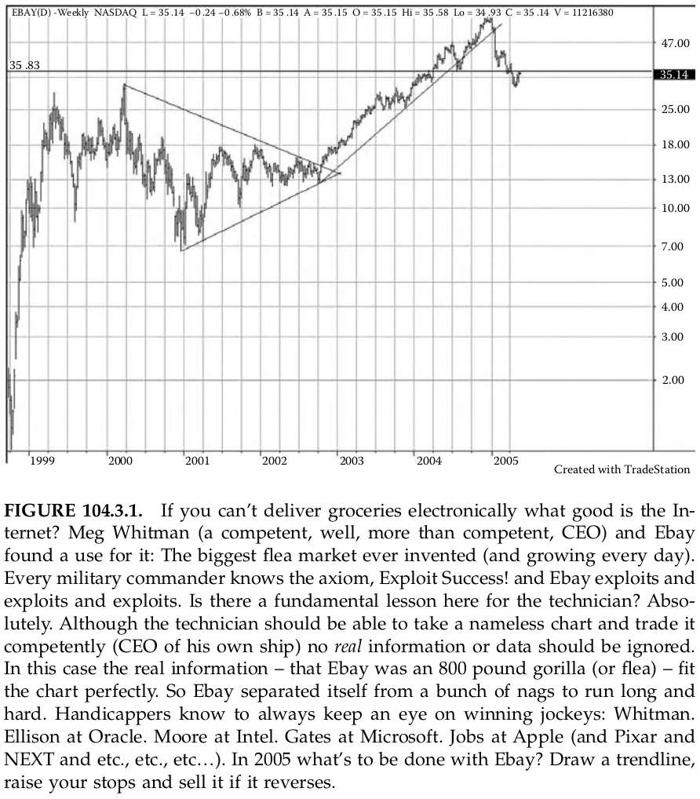

**HÌNH 104.3.1.** Nếu không giao hàng điện tử, Internet để làm gì?
Meg Whitman (CEO tài năng) và Ebay tìm ra: chợ trời lớn nhất (và
tăng hằng ngày). Quân đội biết châm ngôn: Exploit Success! Ebay khai
thác triệt để. Bài học cơ bản cho kỹ thuật viên? Chắc chắn. Kỹ thuật
viên nên giao dịch trên biểu đồ vô danh, không bỏ thông tin thực tế.
Ebay là “gorilla 800 pound”, phù hợp biểu đồ, vượt các đối thủ chạy
dài. Nhà handicap theo dõi jockey thắng: Whitman, Ellison (Oracle),
Moore (Intel), Gates (Microsoft), Jobs (Apple, Pixar, NEXT…). 2005,
Ebay: vẽ trendline, nâng stops, bán nếu đảo chiều.

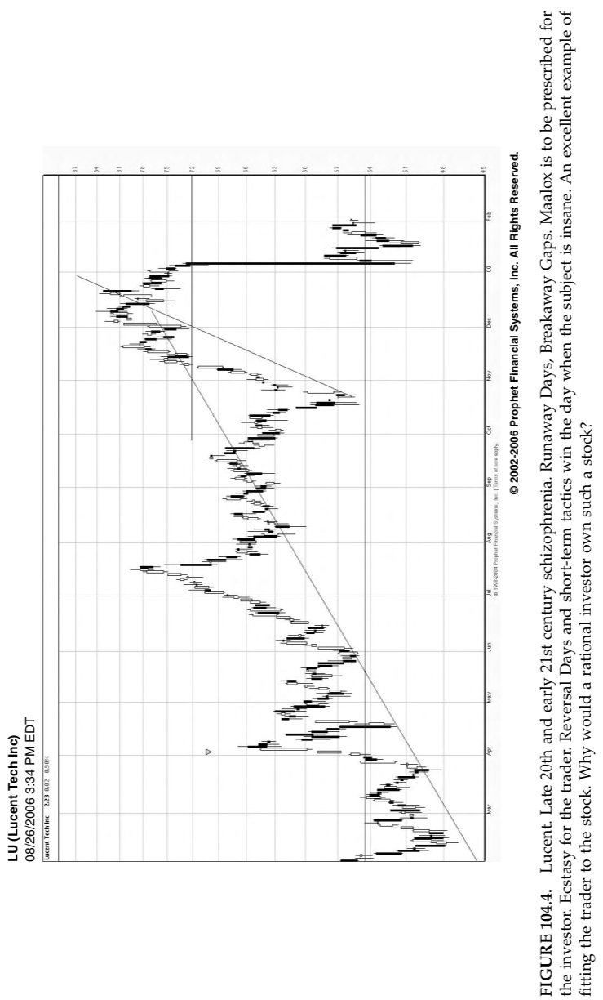

**HÌNH 104.4.** Lucent. Cuối 20th, đầu 21st century: Runaway Days,
Breakaway Gaps. Nhà đầu tư cần Maalox, trader phấn khích. Reversal
Days và tactics ngắn hạn thắng thế khi thị trường “điên”. Ví dụ xuất sắc
cho việc phù hợp trader với cổ phiếu. Nhà đầu tư hợp lý sao sở hữu?

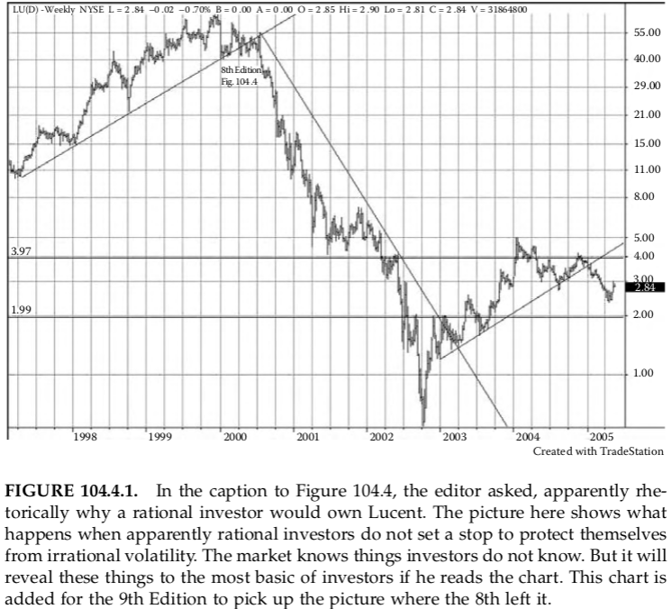

**HÌNH 104.4.1.** Trong chú thích Hình 104.4, biên tập hỏi vì sao nhà
đầu tư hợp lý sở hữu Lucent. Hình cho thấy hậu quả khi nhà đầu tư
hợp lý không đặt stop để bảo vệ khỏi biến động phi lý. Thị trường biết
những gì nhà đầu tư không biết, nhưng sẽ tiết lộ cho nhà đầu tư cơ
bản nếu đọc biểu đồ. Hình này thêm cho ấn bản 9, nối tiếp ấn bản 8.

