# PART 1. Technical Theory

## Chapter 1. The Technical Approach to Trading and Investing
Few human activities have been so exhaustively studied during the past
century, from so many angles and by so many different sorts of people, as
has the buying and selling of corporate securities. The rewards which the
stock market holds out to those who read it right are enormous; the penalties
it exacts from careless, dozing, or “unlucky” investors are calamitous. No
wonder it has attracted some of the world’s most astute accountants, ana-
lysts, and researchers, along with a motley crew of eccentrics, mystics, and
“hunch players,” and a multitude of just ordinary hopeful citizens.
Able brains have sought, and continue constantly to seek, for safe and
sure methods of appraising the state and trend of the market, of discovering
the right stock to buy and the right time to buy it. This intensive research
has not been fruitless — far from it. There are a great many successful
investors and speculators (using the word in its true sense, which is without
opprobrium) who, by one road or another, have acquired the necessary
insight into the forces with which they deal and the judgment, the fore-
thought, and the all important self-discipline to deal with them profitably.
In the course of years of stock market study, two quite distinct schools
of thought have arisen, two radically different methods of arriving at the
answers to the trader’s problem of _what_ and _when_. In the parlance of “the
Street,” one of these is commonly referred to as the _fundamental_ or statistical,
and the other as the _technical_. (In recent years a third approach, the cyclical,
has made rapid progress and, although still beset by a “lunatic fringe,” it
promises to contribute a great deal to our understanding of economic trends.)
The stock market fundamentalist depends on statistics. He examines the
auditors’ reports, the profit-and-loss statements, the quarterly balance sheets,
the dividend records, and policies of the companies whose shares he has
under observation. He analyzes sales data, managerial ability, plant capacity,
the competition. He turns to bank and treasury reports, production indexes,
price statistics, and crop forecasts to gauge the state of business in general,
and reads the daily news carefully to arrive at an estimate of future business
conditions. Taking all these into account, he evaluates his stock; if it is selling
currently below his appraisal, he regards it as a buy. _(EN9: And, no surprise,
the buyer’s name is Warren Buffet, and he buys the company, not the stock, for
while this is an excellent way to buy companies it is not a very good way to buy
stocks.) EN: Read Robert Prechter’s summation of the fundamental methodology as
an amusing endnote at the end of this chapter._


As a matter of fact, aside from the greenest of newcomers when they
first tackle the investment problem, and to whom, in their inexperience, any
other point of view is not only irrational but incomprehensible, your pure
fundamentalist is a very rare bird. Even those market authorities who pre-
tend to scorn charts and “chartists” utterly are not oblivious to the “action”
chronicled by the ticker tape, nor do they conceal their respect for the Dow
Theory which, whether they realize it or not, is, in its very essence, purely
technical.

##### Definition of Technical Analysis

The term “technical,” in its application to the stock market, has come to have
a very special meaning, quite different from its ordinary dictionary defini-
tion. It refers to _the study of the action of the market itself_ as opposed to the
study of the goods in which the market deals. _Technical Analysis_ is the science
of recording, usually in graphic form, the actual history of trading (price
changes, volume of transactions, etc.) in a certain stock or in “the Averages”
and then deducing from that pictured history the probable future trend.
_EN: With the advent of the computer, many schools of technical analysis have arisen.
Number-driven technical analysis, e.g., moving average studies oscillators, etc.,
attempts to completely objectify the analysis of the markets. The work of Edwards
and Magee is the embodiment and definition of “classical technical analysis.” See
Appendix C._
The technical student argues thus: it is futile to assign an intrinsic value
to a stock certificate. One share of United States Steel, for example, was worth
$261 in the early fall of 1929, but you could buy it for only $22 in June of
1932! By March 1937, it was selling for $126 and just 1 year later for $38. In
May of 1946, it had climbed back up to $97, and 10 months later, in 1947,
had dropped below $70, although the company’s earnings on this last date
were reputed to be nearing an all-time high and interest rates in general
were still near an all-time low. The book value of this share of U.S. Steel,
according to the corporation’s balance sheet, was about $204 in 1929 (end of
the year); $187 in 1932; $151 in 1937; $117 in 1938, and $142 in 1946. This
sort of thing, this wide divergence between presumed value and actual price,
is not the exception; it is the rule. It is going on all the time. The fact is that
the real value of a share of U.S. Steel common is determined at any given
time solely, definitely, and inexorably by supply and demand, which are
accurately reflected in the transactions consummated on the floor of the New
York Stock Exchange.
Of course, the statistics which the fundamentalists study play a part in
the supply–demand equation — that is freely admitted. But there are many
other factors affecting it. The market price reflects not only the differing
value opinions of many orthodox security appraisers, but also all the hopes
and fears and guesses and moods, rational and irrational, of hundreds of
potential buyers and sellers, as well as their needs and their resources — in
total, factors which defy analysis and for which no statistics are obtainable,
but which are nevertheless all synthesized, weighed, and finally expressed
in the one precise figure at which a buyer and a seller get together and make
a deal (through their agents, their respective stock brokers). This is the only
figure that counts.


**FIGURE 1.** Monthly price ranges of U.S. Steel common from January 1929 to
December 1946. Compare the great swings in the market price for this stock — from
1929 (extreme high, 261¾) to 1932 (extreme low, 21¼), from 1932 to 1937, from 1937
to 1938, from 1942 to 1946 — with its book values for those years as cited on the
previous page.


Moreover, the technician claims, with complete justification, that the
bulk of the statistics which the fundamentalists study are past history,
already out of date and sterile, because the market is not interested in the
past or even in the present! It is constantly looking ahead, attempting to
discount future developments, weighing and balancing all the estimates and
guesses of hundreds of investors who look into the future from different
points of view and through glasses of many different hues. In brief, the going
price, as established by the market itself, comprehends all the fundamental
information which the statistical analyst can hope to learn (plus some that
is perhaps secret from him, known only to a few insiders) and much else
besides of equal or even greater importance.
All of which, admitting its truth, would be of little significance were it
not for the fact, which no one of experience doubts, that prices move in
trends and trends tend to continue until something happens to change the
supply–demand balance. Such changes are usually detectable in the action
of the market itself. Certain patterns or formations, levels or areas, appear
on the charts which have a meaning, and can be interpreted in terms of
probable future trend development. They are not infallible, it must be noted,
but the odds are definitely in their favor. Time after time, as experience has
amply proved, they are far more prescient than the best-informed and most
shrewd of statisticians.
The technical analyst may go even further in his claims. He may offer
to interpret the chart of a stock whose name he does not know, so long as
the record of trading is accurate and covers a long enough term to enable
him to study its market background and habits. He may suggest that he
could trade with profit in a stock knowing only its ticker symbol, completely
ignorant of the company, the industry, what it manufactures or sells, or how
it is capitalized. Needless to say, such practice is not recommended, but if
your market technician is really experienced at his business, he could, in
theory, do exactly what he claims.
Should the reader, at this point, find the technical approach to trading
or investing, as explained in the foregoing, completely abhorrent, perhaps
he had better close the book now. For it is primarily the technical approach,
the science of technical analysis, with which the remainder of the book deals.

##### EN: The Elliott Wave Theory: Perspective and Comments*

_This week we had the pleasure of attending the December meeting of the Market
Technicians Association of New York.
Long-term subscribers will remember the MTANY as the organization which
honored John Magee with its “Man of the Year” award in 1978. The speaker was
Robert Prechter, publisher of “The Elliott Wave Theorist,” an investment advisory
which bases its forecasts on interpretations of R.N. Elliott’s work on the stock
market....
Of primary interest to SAS subscribers are Prechter’s comments on technical
analysis itself. The Elliott Wave Theory, it must be remembered, is really no more
than a “catalog” of stock market price movements, laid one on top of the other, so_
_to speak, until a grand, underlying, and enduring pattern is observed; in short, pure
technical analysis. Among Prechter’s definitions and observations regarding funda-
mental analysis are the following:_

1. “First let’s define ‘technical’ versus ‘fundamental’ data...technical data is_
    _that which is generated by the action of the market under study.”
2. “The main problem with fundamental analysis is that its indicators are_
    _removed from the market itself. The analyst assumes causality between_
    _external events and market movements, a concept which is almost certainly_
    _false. But, just as important, and less recognized, is that fundamental_
    _analysis almost always requires a forecast of the fundamental data itself_
    _before conclusions about the market are drawn. The analyst is then forced_
    _to take a second step in coming to a conclusion about how those forecasted_
    _events will affect the markets! Technicians only have one step to take, which_
    _gives them an edge right off the bat. Their main advantage is that they don’t_
    _have to forecast their indicators.”
3. “What’s worse, even the fundamentalists’ second step is probably a process_
    _built on quicksand.... The most common application of fundamental anal-_
    _ysis is estimating companies’ earnings for both the current year and next_
    _year, and recommending stocks on that basis.... And the record on that basis_
    _alone is very poor, as Barron’s pointed out in a June 4 article, which showed_
    _that earnings estimates averaged 18% error in the 30 DJIA stocks for any_
    _year already completed and 54% error for the year ahead. The weakest link,_
    _however, is the assumption that correct earnings estimates are a basis for_
    _choosing stock market winners. According to a table in the same Barron’s_
    _article, a purchase of the 10 DJIA stocks with the best earnings estimates_
    _would have produced a 10-year cumulative gain of 40.5%, while choosing_
    _the 10 DJIA with the worst earnings estimates would have produced a_
    _whopping 142.5% gain.”_

_We enjoyed Prechter’s polished exposition of a technical approach different from
our own. As for his observations about fundamental analysis, we simply couldn’t
agree more._

## Chapter 2. Charts

Charts are the working tools of the technical analyst. They have been devel-
oped in a multitude of forms and styles to represent graphically almost
anything and everything that takes place in the market, or to plot an “index”
derived therefrom. They may be monthly charts on which an entire month’s
trading record is condensed into a single entry, or weekly, daily, hourly,
transaction, “point-and-figure,” candlestick, etc. They may be constructed
on arithmetic, logarithmic, or square-root scale, or projected as “oscillators.”
They may delineate moving averages, proportion of trading volume to price
movement, average price of “most active” issues, odd-lot transactions, the
short interest, and an infinitude of other relations, ratios, and indexes — all
technical in the sense that they are derived, directly or indirectly, from what
has actually been transacted on the exchanges.
With most of these, fortunately, we shall not need to concern ourselves
at all; they are of interest only to the full-time economic analyst. Many of
them have derived from a completely futile (so far, at least) endeavor to
discover some one “mechanical” index or combination of indexes which will
always, automatically, without ever failing or going wrong, give warning of
a change in trend; such, in our experience, are often confusing and sometimes
downright deceptive at a most critical juncture. This book, however, is
designed for the layman, the business or professional man who cannot spend
all his hours on his investing or trading operations, but to whom these
operations are, nevertheless, of sufficient importance or interest to warrant
his devoting at least a few minutes a day to their study and management.
_(EN9: In retropsect an underestimation of the importance of the work. In the 21st
century the best professionals are acutely aware of the importance of trend analysis
and use this work as their text book.)_ The theories and methods outlined herein
will require only the simplest form of stock chart — a record of the price
range (high and low), closing price, and volume of shares traded each day.
These daily graphs will be supplemented, for certain purposes which will
be discussed farther on, by weekly or monthly charts, which for most stocks
can be purchased ready-made and which are easily generated by almost all
commercially available investment software.
Nearly all the illustrations throughout the following pages are examples
of such daily charts. They are easy to make and maintain manually, requiring
only a supply of graph or cross-section paper (almost any kind can serve),
a daily newspaper which gives full and accurate reports on stock exchange
dealings, a sharp pencil, and a few minutes of time. _EN: Alternatively, numer-
ous data services are available for use with computer software packages, not to
mention Internet sites (which are mentioned in Resources). The use of this technol-
ogy eliminates the burden of manual chart keeping altogether. If there is a drawback
to this technology it might be in the loss of the “feel” the investor gets through
manual charting._
It is customary in preparing ordinary daily stock charts to let the hori-
zontal axis represent time, with the vertical cross-lines (or as some prefer,
the spaces between them) from left to right thus standing for successive days.
The vertical scale is used for prices, with each horizontal cross-line then
representing a specific price level. Space is usually provided at the bottom
of the sheet to plot volume, i.e., the number of shares which change hands
each day. The newspapers publishing complete stock market reports give
the day’s turnover or volume (exclusive of odd-lot transactions which may
for our present purpose be disregarded), the highest and lowest price at
which each stock sold during the day, the closing price (which is the price
at which the last sale effected during the day was made), and usually the
opening or first sale price. On our charts, the daily price range is plotted by
drawing a vertical line connecting the points representing the high and the
low. Then a short horizontal “tick” is added, either crossing the vertical range
line or extending out to the right from it, at the level of the closing price.
Sometimes all transactions in a stock during a day take place at one and the
same price; the high, low, and close are thus all on a level and the only mark
on our chart will then be the horizontal dash representing the closing figure.
Volume is depicted by drawing a vertical line up from the base line of the
chart.
The opening price need not be recorded.* Experience has shown that it
seldom, if ever, has any significance in estimating future developments,
which is all that ordinarily should interest us. The closing price is important,
however. It is, in fact, the only price which many casual readers of the
financial pages ever look at. It represents the final evaluation of the stock
made by the market during the day. It may, of course, be registered in the
first hour of trading, provided no other sales are subsequently effected, but,
it becomes, nevertheless, the figure upon which a majority of prospective
traders base their plans for the following day. Hence, its technical signifi-
cance, which will appear in various contexts in later chapters.

##### Different Types of Scales

Many specific suggestions as to the details of charting are deferred for
discussion in the second section of this book, but there is one chart feature
which may well be considered here. Until recent years, nearly all stock price

_* EN: Edwards considered the opening price unimportant. Some technicians, myself included, do observe
it to be of use. And in some charting systems it is indispensable, for example, candlestick charting where
it is accorded enormous importance._

charts were kept on the common form of graph paper ruled to what is known
as plain or arithmetic scale. But more and more chartists have now come to
use what is known as semilogarithmic paper, or sometimes as ratio or per-
centage paper. Our own experience indicates that the semilogarithmic scale
has definite advantages in this work; most of the charts reproduced in this
book employ it. The two types of scale may be distinguished at a glance by
the fact that on arithmetic paper, equal distances on the vertical scale (i.e.,
between horizontal lines) represent equal amounts in dollars, whereas on
the semilogarithmic paper, they represent equal percentage changes. Thus,
on arithmetic paper the distance between 10 and 20 on the vertical scale is
exactly the same as that from 20 to 30 and from 30 to 40. On the logarithmic
scale the difference from 10 to 20, representing an increase of 100%, is the
same as that from 20 to 40 or from 40 to 80, in each case representing another
100% increase.
Percentage relations, it goes without saying, are important in trading in
securities. The semilogarithmic scale permits direct comparison of high- and
low-priced stocks and makes it easier to choose the one offering the greater
(percentage) profit on the funds to be invested. It facilitates the placing of
stop-loss orders. Area patterns appear much the same on either type of paper
but certain trendlines develop more advantageously on the ratio scale.
Almost anyone can quickly become accustomed to making entries on semi-
logarithmic paper. We recommend its use. However, its advantages are not
so great as to require one to change, one who, because of long familiarity
and practice, prefers an arithmetic sheet. Such percentage calculations, as
may seem to be required, can, after all, be made on another sheet or in the
head and the results then entered on the arithmetic chart if a record is desired.
Several firms specializing in the manufacture of graph paper and other
engineers’ and architects’ supplies now offer sheets specifically designed for
stock charting, on which heavier lines to define the business week mark each
sixth day on the time scale, and the price scale is subdivided into eighths to
represent the standard fractions of the dollar in which stocks are traded on
all American exchanges. _(EN9: Eighths went the way of the New Haven and now
decimals reign_ .) These sheets are available in various sizes and with either
arithmetic or logarithmic price and volume scales. _EN: This paper of course is
only of interest to the manual chartist, as modern software, as detailed in Appendix
D on Resources, enables the computer chartist to easily switch between price scales
and methods of charting. References to such paper are also found there._
On weekly charts, each vertical line represents a week’s trading. The
price range for the week is plotted thereon and usually the total volume, but
the closing price may or may not be omitted. The range extends, of course,
from the highest price at which the stock sold on any day during the week
to the lowest price at which it sold on any day; these two extremes might,
and sometimes do, occur on the same day, but the weekly chart makes no
distinction as to day. Monthly charts are prepared in the same way but do
not, as a rule, record volume. These two — often referred to as long-term or
major charts — are used chiefly for determining important Support and
Resistance Levels and marking long-term trends. Weekly charts — if the
reader prefers to keep his own — can be posted easily from the Sunday
morning editions of those daily newspapers (e.g., _The New York Times_ or
_Barron’s Business and Financial Weekly_ ) that publish a summary of the previous
week’s transactions.
In concluding this chapter on the construction of the charts that we shall
study in succeeding chapters, it can well be said that there is no special
virtue, certainly no magic, in the chart itself. It is simply a pictorial record
of the trading history of the stock or stocks in which we may be interested.
To the man possessed of a photographic memory, no chart work is necessary;
his mind records all the necessary data — he carries his charts in his head.
Many of the expert “tape-readers” who have no use for charts are gifted
with that rare memory talent which renders reference to graphic records
unnecessary. But most of us are not so blessed; to use the chart is necessary
and useful because it lends itself conveniently to the type of analysis which
indicates future probabilities.
There is a saying on Wall Street to the effect that “there is nothing wrong
with charts — the trouble is with the chartists,” which is simply another
way of expressing the truth that it is not the chart itself but its interpretation
that is important. Chart analysis is certainly neither easy nor foolproof. Yet,
it is not at all uncommon for some casual investor who has no idea whatever
of market technics to pick up a chart by chance and see in it something which
he had not hitherto suspected, something perhaps which saves him from
making an unfavorable commitment.
If you have never used stock charts, never paid much attention to them,
you may be surprised at some of the significant things you will quickly
detect as soon as you begin to study them seriously.


_EN9: Surprise and astonishment are the words to describe the reactions of even
professionals when they are fully exposed to a coherent presentation of the methods
of Edwards and Magee. I have often commented that no understanding of other
(non-chart) methods of technical analysis is possible without a firm grasp of the
concepts and principles of this book.
Some other comments are worth noting relevant to Edwards’ discussion above.
For manual charting semi-log remains the superior scale. Given the ease of changing
scale and time frames on Internet sites (e.g., prophet.net and stockcharts.com) and
in the stand alone software one may switch from a close up of a month to a long
range perspective of years. In this process it is important to maintain perspective.
Multiyear log charts of large ranges lose graphic importance at the top as chart
intervals shrink. This distortion must be countered by breaking the time frame into
smaller increments. So instead of 5 years of a chart which spans a range of 10 to
200 we look at five charts of a year each as well as the 5-year chart.

## Chapter 3. The Dow Theory

The Dow Theory is the granddaddy of all technical market studies. Although
it is frequently criticized for being “too late,” and occasionally derided (par-
ticularly in the early stages of a Bear Market) by those who rebel at accepting
its verdicts, it is known by name to nearly everyone who has had any
association with the stock market, and respected by most. Many who heed
it in greater or lesser degree in determining their investment policies never
realize that it is purely and simply “technical.” It is built upon and concerned
with nothing but the action of the stock market itself (as expressed in certain
“averages”), deriving nothing from the business statistics on which the fun-
damentalists depend.
There is much in the writings of its original promulgator, Charles H.
Dow, to suggest that he did not think of his “theory” as a device for fore-
casting the stock market, or even as a guide for investors, but rather as a
barometer of general business trends. Dow founded the Dow–Jones Financial
News Service and is credited with the invention of stock market averages.
The basic principles of the theory, which was later named after him, were
outlined by him in editorials he wrote for _The Wall Street Journal_. Upon his
death in 1902 his successor, as editor of the _Journal_ , William P. Hamilton,
took up Dow’s principles and, in the course of 27 years of writing on the
stock market, organized them and formulated them into the Dow Theory as
we know it today.
Before we proceed to an explanation of the theory itself, it will be nec-
essary to examine the stock _averages_ which it employs. Long before the time
of Dow, the fact was familiar to bankers and businessmen that the securities
of most established companies tended to go up or down in price together.
Exceptions — stocks that moved against the general financial tide — were
rare, nor did they as a rule persevere in that contrary course for more than
a few days or weeks at a time. It is true that when a boom was on, the prices
of some issues rose faster and farther than others, and when the trend was
toward depression, some stocks declined rapidly while others would put up
considerable resistance to the forces that were dragging the market down,
but the fact remained that most securities tended to swing together. (They
still do, needless to say, and always will.)

This fact, as we have said, has long been commonly known and
accepted — so completely taken for granted that its importance is usually
overlooked. For it is important — tremendously important from many angles
in addition to those which come within the province of this volume. One of
the best of all reasons for a student of market technics to start with the Dow
Theory is because that theory stresses the _general market trend_.
Charles Dow is believed to have been the first to make a thorough effort
to express the general trend (or, more correctly, level) of the securities market
in terms of the _average price_ of a selected few representative stocks. As finally
set up in January of 1897, in the form which has continued to date, and used
by Dow in his studies of market trends, there were two Dow–Jones Averages.
One was composed of the stocks of 20 railroad companies only, for the
railroads were the dominant corporate enterprises of his day. The other,
called the Industrial Average, represented all other types of business, and
was made up, at first, of only 12 issues. This number was increased to 20 in
1916 and to 30 on October 1, 1928.

##### The Dow Averages

The stocks included in these two Averages have been changed from time to
time in order to keep the lists up to date and as nearly representative as
possible of their respective groups. Only General Electric, of the present
30 industrial stocks, was included in the original Industrial Average, and
that was dropped at one time (in 1898) and subsequently reinserted. In 1929,
all stocks of public utility companies were dropped from the Industrial
Average and a new Utility Average of 20 issues was set up; in 1938 its number
was reduced to 15. The 20 rail, 30 industrial, and 15 utility stocks are now
averaged together to make what is known as the Dow–Jones Stock Compos-
ite. The history of these Averages, the various adjustments that have been
made in them and their method of computation, is an interesting story in
itself which the reader may want to look up elsewhere. _EN: Cf. Resources for
references. Note also that there is now a proliferation of Dow–Jones Averages._ For
our present purpose, it remains only to add that the Dow Theory pays no
attention to the Utility or Composite Averages; its interpretations are based
on the Rail and Industrial Averages only. _EN: “Rails” now known as “Trans-
portation.”_
In recent years, the values of the Dow–Jones Averages have been com-
puted for the end of each hour of trading as well as the end of the day.
_EN: Now computed in real time and available over the Internet. These hourly figures
are published in_ The Wall Street Journal _as well as on all market tickers. In fact
presently the Averages are computed in real time, a necessity for options and futures
trading which takes place based on them._ The Wall Street Journal also prints in
each issue a summary of the important highs and lows of each average by
date for the preceding two or three years. Their daily closing prices are
reported in many other metropolitan daily newspapers.


_Chapter three: The Dow Theory 15_

##### Basic Tenets

To get back to the Dow Theory itself here are its basic tenets:

1. **The Averages Discount Everything (except “Acts of God”)** — Be-
    cause they reflect the combined market activities of thousands of
    investors, including those possessed of the greatest foresight and the
    best information on trends and events, the Averages in their
    day-to-day fluctuations discount everything known, everything fore-
    seeable, and every condition which can affect the supply of or the
    demand for corporate securities. Even unpredictable natural calam-
    ities, when they happen, are quickly appraised and their possible
    effects discounted.
2. **The Three Trends** — The “market,” meaning the price of stocks in
general, swings in trends, of which the most important are its _Major_
or _Primary_ Trends. These are the extensive up or down movements
which usually last for a year or more and result in general appreci-
ation or depreciation in value of more than 20%. Movements in the
direction of the Primary Trend are interrupted at intervals by _Second-
ary_ Swings in the opposite direction — reactions or “corrections” that
occur when the Primary Move has temporarily “gotten ahead of
itself.” (Both Secondaries and the intervening segments of the Pri-
mary Trend are frequently lumped together as Intermediate Move-
ments — a term which we shall find useful in subsequent discus-
sions.) Finally, the Secondary Trends are composed of _Minor_ Trends
or day-to-day fluctuations which are unimportant to Dow Theory.
3. **The Primary Trends** — These, as aforesaid, are the broad, overall,
up and down movements which usually (but not invariably) last for
more than a year and may run for several years. So long as each
successive rally (price advance) reaches a higher level than the one
before it, and each Secondary Reaction stops (i.e., the price trend
reverses from down to up) at a higher level than the previous reac-
tion, the Primary Trend is _Up_. This is called a _Bull Market_. Conversely,
when each Intermediate Decline carries prices to successively lower
levels and each intervening rally fails to bring them back up to the
top level of the preceding rally, the Primary Trend is _Down_ and that
is called a _Bear Market_. (The terms _Bull_ and _Bear_ are frequently used
loosely with reference, respectively, to any sort of up or down move-
ments, but we shall use them in this book only in connection with
the Major or Primary Movements of the market in the Dow sense.)
Ordinarily — theoretically, at least — the Primary is the only one of
the three trends with which the true long-term investor is concerned.
His aim is to buy stocks as early as possible in a Bull Market — just
as soon as he can be sure that one has started — and then hold them
until (and only until) it becomes evident that it has ended and a Bear


```
Market has started. He knows that he can safely disregard all the
intervening Secondary Reactions and Minor Fluctuations. The trader,
however, may well concern himself also with the Secondary Swings,
and it will appear later on in this book that he can do so with profit.
```
4. **The Secondary Trends** — These are the important reactions that
    interrupt the progress of prices in the Primary Direction. They are
    the Intermediate Declines or “corrections” which occur during Bull
    Markets, the Intermediate Rallies or “recoveries” which occur in Bear
    Markets. Normally, they last for 3 weeks to many months, and rarely
    longer. Normally, they retrace from one third to two thirds of the
    gain (or loss, as the case may be) in prices registered in the preceding
    swing in the Primary Direction. Thus, in a Bull Market, prices in
    terms of the Industrial Average might rise steadily, or with only brief
    and minor interruptions, for a total gain of 30 (or 300) points before
    a Secondary Correction occurred. That correction might then be
    expected to produce a decline of not less than 10 points and not more
    than 20 points before a new Intermediate Advance in the Primary
    Bull Trend developed.
       Note, however, that the one third/two thirds rule is not an
    unbreakable law; it is simply a statement of probabilities. Most Sec-
    ondaries are confined within these limits; many of them stop very
    close to the halfway mark, retracing 50% of the preceding Primary
    Swing. They seldom run less than one third, but some of them cancel
    nearly all of it.
       Thus we have two criteria by which to recognize a Secondary
    Trend. Any price movement contrary in direction to the Primary
    Trend that lasts for at least 3 weeks and retraces at least one third of
    the preceding net move in the Primary Direction (from the end of
    the preceding Secondary to the beginning of this one, disregarding
    Minor Fluctuations) is labeled as of Intermediate Rank, i.e., a true
    Secondary. Despite these criteria, however, the Secondary Trend is
    often confusing; its recognition, its correct appraisal at the time it
    develops and while it is in process, poses the Dow theorist’s most
    difficult problem. We shall have more to say about this later.
5. **The Minor Trends** — These are the brief (rarely as long as 3 weeks —
    usually less than 6 days) fluctuations which are, so far as the Dow
    Theory is concerned, meaningless in themselves, but which, _in toto_ ,
    make up the Intermediate Trends. Usually, but not always, an Inter-
    mediate Swing, whether a Secondary or the segment of a Primary
    between successive Secondaries, is made up of a series of three or
    more distinguishable Minor Waves. Inferences drawn from these
    day- to-day fluctuations are quite apt to be misleading. The Minor
    Trend is the only one of the three trends which can be “manipulated”
    (although it is, in fact, doubtful if under present conditions even that
    can be purposely manipulated to any important extent). Primary and


_Chapter three: The Dow Theory 17_

```
Secondary Trends cannot be manipulated; it would strain the resourc-
es of the U.S. Treasury to do so.
```
Right here, before we go on to state a sixth Dow tenet, we may well take
time out for a few minutes to clarify the concept of the three trends by
drawing an analogy between the movements of the stock market and the
movements of the sea. The Major (Primary) Trends in stock prices are like
the tides. We can compare a Bull Market to an incoming or flood tide which
carries the water farther and farther up the beach until finally it reaches
high-water mark and begins to turn. Then follows the receding or ebb tide,
comparable to a Bear Market. But all the time, during both ebb and flow of
the tide, the waves are rolling in, breaking on the beach, and then receding.
While the tide is rising, each succeeding wave pushes a little farther up onto
the shore and, as it recedes, does not carry the water quite so far back as did
its predecessor. During the tidal ebb, each advancing wave falls a little short
of the mark set by the one before it, and each receding wave uncovers a little
more of the beach. These waves are the Intermediate Trends, Primary or
Secondary, depending on whether their movement is with or against the
direction of the tide. Meanwhile, the surface of the water is constantly agi-
tated by wavelets, ripples, and “cat’s-paws” moving with or against or across
the trend of the waves — these are analogous to the market’s Minor Trends,
its unimportant day-to-day fluctuations. The tide, the wave, and the ripple
represent, respectively, the Primary or Major, the Secondary or Intermediate,
and the Minor Trends of the market.

##### Tide, Wave, and Ripple

A shore dweller who had no tide table might set about determining the
direction of the tide by driving a stake in the beach at the highest point
reached by an incoming wave. Then if the next wave pushed the water up
beyond his stake he would know the tide was rising. If he shifted his stake
with the peak mark of each wave, a time would come when one wave would
stop and start to recede short of his previous mark; then he would know
that the tide had turned, had started to ebb. That, in effect (and much
simplified), is what the Dow theorist does in defining the trend of the stock
market.
The comparison with tide, wave, and ripple has been used since the
earliest days of the Dow Theory. It is even possible that the movements of
the sea may have suggested the elements of the theory to Dow. But the
analogy cannot be pushed too far. The tides and waves of the stock market
are nothing like as regular as those of the ocean. Tables can be prepared
years in advance to predict accurately the time of every ebb and flow of the
waters, but no timetables are provided by the Dow Theory for the stock
market. We may return to some points of this comparison later, but we must
proceed now to take up the remaining tenets and rules of the Theory.


_18 Technical Analysis of Stock Trends_

##### Major Trend Phases

6. **The Bull Market** — Primary Uptrends are usually (but not invari-
    ably) divisible into three phases. The first is the phase of _accumulation_
    during which farsighted investors, sensing that business, although
    now depressed, is due to turn up, are willing to pick up all the shares
    offered by discouraged and distressed sellers, and to raise their bids
    gradually as such selling diminishes in volume. Financial reports are
    still bad — in fact, often at their worst — during this phase. The
    “public” is completely disgusted with the stock market — out of it
    entirely. Activity is only moderate but beginning to increase on the
    rallies (Minor Advances).
       The second phase is one of fairly steady advance and increasing
    activity as the improved tone of business and a rising trend in corporate
    earnings begin to attract attention. It is during this phase that the “tech-
    nical” trader normally is able to reap his best harvest of profits.
       Finally, comes the third phase when the market boils with activity
    as the “public” flocks to the boardrooms. All the financial news is
    good, price advances are spectacular and frequently “make the front
    page” of the daily papers, and new issues are brought out in increas-
    ing numbers. It is during this phase that one of your friends will call
    up and blithely remark, “Say, I see the market is going up. What’s a
    good buy?” — all oblivious to the fact that it has been going up for
    perhaps two years, has already gone up a long ways, and is now
    reaching the stage where it might be more appropriate to ask, “What’s
    a good thing to sell?” In the last stage of this phase, with speculation
    rampant, volume continues to rise, but “air pockets” appear with
    increasing frequency; the “cats and dogs” (low-priced stocks of no
    investment value) are whirled up, but more and more of the
    top-grade issues refuse to follow.
7. **The Bear Market** — Primary Downtrends are also usually (but again,
not invariably) characterized by three phases. The first is the _distribution_
period (which really starts in the later stages of the preceding Bull
Market). During this phase, farsighted investors sense the fact that
business earnings have reached an abnormal height and unload their
holdings at an increasing pace. Trading volume is still high, though
tending to diminish on rallies, and the “public” is still active but begin-
ning to show signs of frustration as hoped-for profits fade away.
The second phase is the Panic Phase. Buyers begin to thin out and
sellers become more urgent; the downward trend of prices suddenly
accelerates into an almost vertical drop, while volume mounts to
climactic proportions. After the Panic Phase (which usually runs too
far relative to then-existing business conditions), there may be a fairly
long Secondary Recovery or a sideways movement, and then the
third phase begins.


_Chapter three: The Dow Theory 19_

```
This is characterized by discouraged selling on the part of those
investors who held on through the Panic or, perhaps, bought during
it because stocks looked cheap in comparison with prices which had
ruled a few months earlier. The business news now begins to dete-
riorate. As the third phase proceeds, the downward movement is less
rapid, but is maintained by more and more distress selling from those
who have to raise cash for other needs. The “cats and dogs” may
lose practically all their previous Bull Advance in the first two phases.
Better-grade stocks decline more gradually, because their owners
cling to them to the last. And, the final stage of a Bear Market, in
consequence, is frequently concentrated in such issues. The Bear
Market ends when everything in the way of possible bad news, the
worst to be expected, has been discounted, and it is usually over
before all the bad news is “out.”
The three Bear Market phases described in the preceding para-
graph are not the same as those named by others who have discussed
this subject, but the writers of this study feel that they represent a
more accurate and realistic division of the Primary down moves of
the past 30 years. The reader should be warned, however, that no
two Bear Markets are exactly alike, and neither are any two Bull
Markets. Some may lack one or another of the three typical phases.
A few Major Advances have passed from the first to the third stage
with only a very brief and rapid intervening markup. A few short
Bear Markets have developed no marked Panic Phase and others
have ended with it, as in April 1939. No time limits can be set for
any phase; the third stage of a Bull Market, for example, the phase
of excited speculation and great public activity, may last for more
than a year or run out in a month or two. The Panic Phase of a Bear
Market is usually exhausted in a very few weeks if not in days, but
the 1929 through 1932 decline was interspersed with at least five
Panic Waves of major proportions. Nevertheless, the typical charac-
teristics of Primary Trends are well worth keeping in mind. If you
know the symptoms which normally accompany the last stage of a
Bull Market, for example, you are less likely to be deluded by its
exciting atmosphere.
```
##### Principle of Confirmation

8. **The Two Averages Must Confirm** — This is the most-often ques-
    tioned and the most difficult to rationalize of all the Dow principles.
    Yet it has stood the test of time; the fact that it has “worked” is not
    disputed by any who have carefully examined the records. Those
    who have disregarded it in practice have, more often than not, had
    occasion to regret their apostasy. What it means is that no valid signal
    of a change in trend can be produced by the action of one Average


_20 Technical Analysis of Stock Trends_

```
alone. Take, for example, the hypothetical case shown in Diagram 1.
In this, we assume that a Bear Market has been in effect for several
months and then, starting at a , the Industrial Average rises (along
with the Rails) in a Secondary Recovery to b. On their next decline,
however, the Industrials drop only to c , which is higher than a , and
then turn up to d , which is higher than b. At this point, the Industrials
have “signaled” a change in trend from down to up. But note the
Rails during this period: their decline from b to c carried them lower
than a , and their subsequent advance from c to d has not taken them
above b. They have (so far) refused to confirm the Industrials and,
hence, the Major Trend of the market must be regarded as still down.
Should the Rails go on to rise eventually above their b , then, and
then only, would we have a definite signal of a turn in the tide. Until
such a development, however, the chances remain that the Industrials
```
**DIAGRAM 1.** A hypothetical daily market chart to show how one average may
fail to confirm the other’s Dow signal. Closing prices, indicated by short horizontal
dashes, are connected with vertical lines to make the day-to-day trend easier to follow.

```
will not be able to continue their upward course alone, that they will
ultimately be dragged down again by the Rails. At best, the direction
of the Primary Trend is still in doubt.
The above illustrates only one of the many ways in which the
principle of Confirmation applies. Note also that at c , it might have
been said that the Industrials had thus far not confirmed the Rails in
continuing the downtrend — but this had to do only with the con-
tinuation or reaffirmation of an existing trend. It is not necessary that
the two Averages confirm on the same day. Frequently, both will
move into new high (or low) ground together, but there are plenty
of cases in which one or the other lags behind for days, weeks, or
even a month or two. One must be patient in these doubtful cases
and wait until the market declares itself in definite fashion.
```
9. **“Volume Goes with the Trend”** — Those words, which you may
    often hear spoken with ritual solemnity but little understanding, are
    the colloquial expression for the general truth that trading activity
    tends to expand as prices move in the direction of the prevailing
    Primary Trend. Thus, in a Bull Market, volume increases when prices
    rise and dwindles as prices decline; in Bear Markets, turnover in-
    creases when prices drop and dries up as they recover. To a lesser
    degree, this holds for Secondary Trends also, especially in the early
    stages of an extended Secondary Recovery within a Bear Market,
    when activity may show a tendency to pick up on the Minor Rallies
    and diminish on the Minor Set-backs. But to this rule, again, there
    are exceptions, and useful conclusions can seldom be drawn from
    the volume manifestations of a few days, much less a single trading
    session; it is only the overall and relative volume trend over a period
    of time that may produce helpful indications. Moreover, in Dow
    Theory, _conclusive_ signals as to the market’s trend are produced in
    the final analysis only by price movement. Volume simply affords
    collateral evidence which may aid interpretation of otherwise doubt-
    ful situations. (We shall have much more to say in later chapters
    about volume in specific relation to other technical phenomena.)
10. **“Lines” May Substitute for Secondaries** — A _Line_ in Dow Theory
parlance is a sideways movement (as it appears on the charts) in one
or both of the Averages, which lasts for 2 or 3 weeks or, sometimes,
for as many months, in the course of which prices fluctuate within
a range of approximately 5% or less (of their mean figure). The
formation of a Line signifies that pressure of buying and selling is
more or less in balance. Eventually, of course, either the offerings
within that price range are exhausted and those who want to buy
stocks have to raise their bids to induce owners to sell, or else those
who are eager to sell at the “Line” price range find that buyers have
vanished and that, in consequence, they must cut their prices in order
to dispose of their shares. Hence, an advance in prices through the
upper limits of an established Line is a Bullish Signal and, conversely,


_22 Technical Analysis of Stock Trends_

```
a break down through its lower limits is a Bearish Signal. Generally
speaking, the longer the Line (in duration) and the narrower or more
compact its price range, the greater the significance of its ultimate
breakout.
Lines occur often enough to make their recognition essential to
followers of Dow’s principles. They may develop at important Tops
or Bottoms, signaling periods of distribution or of accumulation,
respectively, but they come more frequently as interludes of rest or
Consolidation in the progress of established Major Trends. Under
those circumstances, they take the place of normal Secondary Waves.
A Line may develop in one Average while the other is going through
a typical Secondary Reaction. It is worth noting that a price move-
ment out of a Line, either up or down, is usually followed by a more
extensive additional move in the same direction than can be counted
on to follow the “signal” produced when a new wave pushes beyond
the limits set by a preceding Primary Wave. The direction in which
prices will break out of a Line cannot be determined in advance of
the actual movement. The 5% limit ordinarily assigned to a Line is
arbitrarily based on experience; there have been a few slightly wider
sideways movements which, by virtue of their compactness and well-
defined boundaries, could be construed as true Lines. (Further on in
this book, we shall see that the Dow Line is, in many respects, similar
to the more strictly defined patterns known as Rectangles which
appear on the charts of individual stocks.)
```
11. **Only Closing Prices Used** — Dow Theory pays no attention to any
    extreme highs or lows which may be registered during a day and
    before the market closes, but takes into account only the closing
    figures, i.e., the average of the day’s final sale prices for the compo-
    nent issues. We have discussed the psychological importance of the
    end-of-day prices under the subject of chart construction and need
    not deal with it further here, except to say that this is another Dow
    rule which has stood the test of time. It works thus: suppose an
    Intermediate Advance in a Primary Uptrend reaches its peak on a
    certain day at 11 a.m., at which hour the Industrial Average figures
    at, say, 152.45, and then falls back to close at 150.70. All that the next
    advance will have to do in order to indicate that the Primary Trend
    is still _up_ is register a daily close above 150.70. The previous intraday
    high of 152.45 does not count. Conversely, using the same figures for
    our first advance, if the next upswing carries prices to an intraday
    high at, say, 152.60, but fails to register a closing price above 150.70,
    the continuation of the Primary Bull Trend is still in doubt.
       In recent years, differences of opinion have arisen among market
    students as to the extent to which an Average should push beyond
    a previous limit (Top or Bottom figure) in order to signal (or confirm
    or reaffirm, as the case may be) a market trend. Dow and Hamilton
    evidently regarded any penetration, even as little as 0.01, in closing


_Chapter three: The Dow Theory 23_

```
price as a valid signal, but some modern commentators have required
penetration by a full point (1.00). We think that the original view has
the best of the argument, that the record shows little or nothing in
practical results to favor any of the proposed modifications. One
incident in June of 1946, to which we shall refer in the following
chapter, shows a decided advantage for the orthodox “any-penetra-
tion-whatever” rule.
```
12. **A Trend Should Be Assumed to Continue in Effect Until Such Time**
    **as Its Reversal Has Been Definitely Signaled** — This Dow Theory
    tenet is one which, perhaps more than any other, has evoked criti-
    cism. Yet, when correctly understood, it, like all the others we have
    enumerated, stands up under practical test. What it states is really a
    _probability_. It is a warning against changing one’s market position too
    soon, against “jumping the gun.” It does not imply that one should
    delay action by one unnecessary minute once a signal of change in
    trend has appeared. But it expresses the experience that the odds are
    in favor of the man who waits until he is sure, and against the other
    fellow who buys (or sells) prematurely. These odds cannot be stated
    in mathematical language such as 2–1 or 3–1; as a matter of fact, they
    are constantly changing. Bull Markets do not climb forever and Bear
    Markets always reach a Bottom sooner or later. When a new Primary
    Trend is first definitely signaled by the action of the two Averages,
    the odds that it will be continued, despite any near-term reactions or
    interruptions, are at their greatest. But as this Primary Trend carries
    on, the odds in favor of its further extension grow smaller. Thus, each
    successive reaffirmation of a Bull Market (new Intermediate high in
    one average confirmed by a new Intermediate high in the other)
    carries relatively less weight. The incentive to buy, the prospect of
    selling new purchases at a profit, is smaller after a Bull Market has
    been in existence for several months than it was when the Primary
    Uptrend was first recognized, but this twelfth Dow tenet says, “Hold
    your position pending contrary orders.”
       A corollary to this tenet, which is not so contradictory as it may
    at first seem, is: a Reversal in trend can occur _any time_ after that trend
    has been confirmed. This can be taken simply as a warning that the
    Dow Theory investor must watch the market constantly if he has any
    commitment in it.

##### EN: Modern Market Importance of Dow Theory and

##### Necessity for Moving to a New Composite Market Theory

_Dow Theory has much to recommend it. Concepts embodied within Dow Theory retain
their validity to the present day, and retain their importance as the foundation thinking
for technical analysis. Concepts of waves, major secondary and minor movements are
absolutely descriptive of the reality of the market. Other constructs within Dow Theory_


_24 Technical Analysis of Stock Trends_

_are similarly important — that all information is discounted; that major market move-
ments are like the tide and, as it were, raise all boats; that trends tend to continue.
These are not just theoretical musings, but observations of reality.
In addition to its technical validity the Dow has now taken on a mythic
dimension. It now has a symbolic function which interacts with its originally
intended purpose. Dow and Hamilton saw their measurement of the market as an
economic barometer for the entire economy. Its use as a tool for investing in the
market came later.
In the opinion of this editor, the Dow Theory is no longer adequate to its original
purpose — or even to its secondary purpose. It is a simple theory propounded in a
simple time. Expounders of Dow Theory have implicitly recognized the necessity
for evolutionary changes to the doctrine with the addition of the Rails (now Trans-
portations) and the Utilities ad infinitum. Thirty stocks may have been sufficient
originally to reflect the American economy. No one would deny that simple paradigm
must be changed to reflect an economic structure geometrically more diverse than
that of Dow and Hamilton. Entering the 21st century, the American and Global
economy require more sophisticated econometrics than the Dow alone.
For that reason I now consider that in order to fulfill the functions of the old
Dow we now must consider a variety of averages and indexes to measure the state
of the market — not to mention the economy, which is another question, although
not altogether another question, but at least another question. Magee foreshadowed
some instruments of great value to this end in his writings, specifically on the Magee
Evaluative Index (Chapter 38), which may be used for the entire market, and not
just for one summary index or average. The value and power of this tool are still
little used and understood.
In 21st century markets, there are not just broad tides and markets flowing in
one direction as they might on Magee’s Cape Cod. Instead the currents, rip tides,
and cross currents are like the economy of the country, moved West. They are now
symbolized by the Pacific Ocean roaring in and out of San Francisco Bay. While
the Dow is in a secondary Downtrend, the broader S&P 500 is going to new highs,
and while they are both whipping sideways, the NASDAQ is rocketing into space.
For this reason, I now believe that only a composite of the three indexes can express
the true state of the markets as a whole. And, in addition, to dissect the entrails of
the market, the Magee Evaluative Index should be run across the three indexes.
The Dow Theory required that the Rails and Industrials move in harmony in order
to signal Bull or Bear Markets. In this century, there is a similar need for harmonic
convergence among the averages to indicate to us the state of the markets as a whole.
When all three indexes agree in the direction of their trends, up or down or
sideways, Bulls may assumed to be safe in general, and vice versa for Bears. Failure
of the three to be in harmony is a clear sign of mixed markets and advises one to
arrange his bets and portfolio to correspond with economic uncertainty. Capital
should flow naturally to the area which is most productive. What reason is there to
ride the Dow down when the NASDAQ is raging up? If the investor follows the
philosophy of this book, he will never sit passively through an extended Downtrend.
At the very least, he will be hedged, if not outright short. (As Edwards and Magee
preferred and as this editor prefers.)_


## Chapter 4.  The Dow Theory in Practice

_EN9: The casual and careless reader will shake his head at this chapter and ask why
on earth the Editor has not excised it from the book. The Editor has not deleted the
chapter because, like old-fashioned cod liver oil, it is good medicine. It will appeal
mainly to the serious student of not just Dow Theory, but of_ long-term investing.
_If the reader has absolutely no interest in Dow Theory or long-term investing he
may skip over this chapter and return to it in his old age, when he is wiser._

At this point, the reader, if he has little previous knowledge of the stock
market, may be suffering a mild attack of mental indigestion. The Dow
Theory is a pretty big dose to swallow at one sitting. We departed deliber-
ately in the foregoing chapter from the order in which its principles are
usually stated in an effort to make it a little easier to follow and understand.
Actually, not all of the 12 tenets we named are of equal import. The essential
rules are contained in 2, 3, 4, 5, 8, 10, and 11. Number 1 is, of course, the
basic assumption, the philosophical justification for these rules. The other
points (6, 7, 9, and 12) furnish “background material,” as the news reporters
might put it, which aid in interpretation. Theoretically, one should, by strict
adherence to the essential rules alone, accomplish just as much as he could
with the added collateral evidence.
But the utilization of Dow Theory is, after all, a matter of interpretation.
You may memorize its principles verbatim and yet be confounded when you
attempt to apply them to an actual market situation. We can better organize
our knowledge of the theory and acquire some understanding of its inter-
pretation by following through a few years of market action and seeing how
it looked at the time through the eyes of a Dow theorist. For this purpose,
we may well take the period from late 1941 to the beginning of 1947, since
this covers the end of one Bear Market, an entire long Bull Market, and part
of another Bear Market, and includes examples of most of the market phe-
nomena with which the Dow Theory has to deal.

## Five Years of Dow Interpretation

Figure 2 is a condensed chart of the course of the two Dow Jones Averages
from January 1, 1941, to December 31, 1946, on which most of the Minor
Trends have been disregarded but all the recognized Intermediate Swings
(Primary and Secondary) have been indicated. Certain portions of this his-
tory will be supplemented by complete daily charts in connection with our
detailed discussion which follows.


The year 1941 opened with the stock market in a Minor Rally. A Primary
Bear Market had been signaled when prices collapsed in the spring of 1940,
and that Bear Market was still in effect. After the May Panic had ended, a
Secondary Recovery swing, which lasted for more than 5 months, had
regained more than half of the ground previously lost by the Averages,
carrying the Industrials from their closing price of 111.84 on June 10 to 138.12
on November 9 and the Rails from 22.14 on May 21 to 30.29 on November 14.
(During this long Bear Market Secondary, incidentally, volume tended to
increase on rallies, which encouraged many who did not hold strictly to first
principles to believe that this rise was the beginning of a new Bull Trend,
illustrating the point we cited under “Volume” in Chapter 3.) From the
November highs, however, the trend turned down again. Then a Minor Rally
developed, as we have said, at the end of the year, reaching its peak on
January 10 at 133.59 in the Industrials and 29.73 in the Rails. From there,
prices fell again to 117.66 and 26.54, respectively, on February 14.


**FIGURE 2.** “Swing” _(EN: OR Wave)_ chart showing all the Intermediate and some
of the more extensive Minor Trends of the Dow–Jones Industrial and Rail Averages,
January 1941 to December 1946. Industrial price scale left, Rails right.


##### The First Severe Test

The next few months will be particularly interesting for us to trace because
they put the Dow Theory to a real test. Figure 3 shows the daily ranges and
closing prices of the two Averages and total daily market volume for the
7 months from February 1 to August 31, 1941. Before we examine it in detail,
however, let us first review the situation on February 14. The Bear Market
lows to date had been registered in May–June, 1940. Thereafter, an extended
Intermediate Recovery had advanced the Industrial Average 26.28 points
and the Rail Average 8.15 points. This had been followed by a 3-month
decline of 20.46 and 3.75 points, respectively, and this decline, incidentally,
had consisted of three well-defined Minor Waves. In duration, and in extent
of price change with respect to the previous swing — 46% in the Rails and
nearly 78% in the Industrials — this downswing qualified as an Intermediate
Trend, and now prices were turning up again. Dow theorists were on the
alert. If both Averages could continue their rise to levels above their high
closes of the previous November (138.12 and 30.29), that action would con-
stitute a signal of a new Primary Bull Market, and reinvestment of funds
withdrawn from stocks in May 1940 would be at once in order. Also, it would
then be necessary to go back and label the May–June lows of 1940 as the
end of a Bear Market, the advance to November as the first Primary Swing
in the new Bull Market, and the decline to February as its first Secondary


**FIGURE 3.** Closing price levels of the Dow–Jones Industrial and Rail Averages,
February 1 to August 31, 1941, and total daily market volume. Vertical lines show
net daily change from one closing level to next.


Reaction. But note that Rule 12 of our preceding chapter applied here; the
presumption was that it was still a Bear Market until a definite signal to the
contrary appeared.
Let us now turn again to Figure 3 and see what actually did happen.
The Industrials rallied for 6 weeks, reaching 124.65 on April 3. The Rails got
up to 29.75 on the same date, registering double the percentage gain of the
Industrials, but both Averages were still below their November highs. Then
the Industrials slipped off within 2 weeks, and had broken down below their
February low and drifted down to close at 115.30 on May 1. This Average
was, therefore, still in an Intermediate Downtrend. But the Rails, meanwhile,
were staging a different sort of performance. They dropped back from their
April 3 high for 2 weeks, but held at 27.72, rallied smartly and then sold off
again to 27.43 on May 31. The picture became at once even more interesting.
Here was a Divergence between the two Averages, a failure to confirm; the
Rails, after two opportunities, were refusing to confirm the Industrials in the
latter’s downtrend.

##### Failure to Confirm

When prices began to work upward in June, many commentators seized
upon this “failure to confirm” as a Bullish omen and the wishful thinkers
again talked Bull Market. There is an unfortunate tendency in “the Street”
to overstress any such divergence, particularly when it can be twisted into
a favorable sign. The fact is that, in Dow Theory, the refusal of one Average
to confirm the other can never produce a positive signal of any sort. It has
only negative connotations. Divergences sometimes occur at Reversals in the
Major Trend — there have been several instances in market history, in which,
perhaps, the most remarkable occurred way back in 1901 and 1902, and we
shall soon inspect another — but they also occur with equal frequency at
times when no Major Reversal is developing, and the instance we are dis-
cussing here was one of the latter.
So the situation at the end of May in 1941 was precisely the same to the
Dow theorist, insofar as the Major Trend was concerned, as it had been on
February 14. The June–July rally topped out in the Rails at 30.88 on August
1, and in the Industrials at 130.06 on July 28 (compare these figures with
their 1940 November highs) and prices then declined at an accelerating pace
which culminated, temporarily, in the “Pearl Harbor” Panic. This took the
Industrial Average below its previous Bear Market low (111.84 on June 10,
1940), although the Rails, again, did not follow. They had, however, by this
time, broken below their previous (February 14) Intermediate Bottom by a
liberal margin.
The next period of importance began in April 1942. We can skip any
detailed chart of the months between December and April because they
posed no Dow Theory problems. After a Minor Rally in the Rails in January,
prices simply drifted lower and lower, but it was increasingly evident that
trading volume did not expand on the dips (Minor Declines). Liquidation


_Chapter four: The Dow Theory in Practice 29_

was drying up; the boardrooms were void of customers; the atmosphere was
typical of the last stages of a Bear Market.
Figure 4 shows the daily action of the Averages from March 2 to
October 31, 1942. New lows (since 1940) were registered in both in late April,
at 23.72 on April 24 in the Rails and at 92.92 on April 28 in the Industrials.
Shortly thereafter, a notable Divergence developed, when, after rallying for
only 7 days, the Railroad Index began to slip off while the other Average
kept right on going up. Trading activity remained at a low ebb (there was
no sustained volume increase, in fact, until late September). On June 1, the
Rails dropped to another new low and on the 2nd closed at 23.31. On June
22, it looked as though the Industrials were going to be pulled down again,
but only a few days later, the best rally in months got started, taking the
Industrials to new highs and more than recovering all of the April–May loss
in the Rails. Activity also speeded up briefly, with one day registering a
greater turnover than the market had enjoyed in any session since early
January. _EN9: Note this warning sign. The ringing of an alarm clock._

##### Signs of Major Turn

Again the Dow theorists were very much on the alert. An advance of Inter-
mediate proportions was obviously under way. Until proved otherwise, it had
to be labeled a Secondary within the Bear Market which was still presumably


**FIGURE 4.** Daily closing price levels of the Dow–Jones Industrial and Rail Averages
from March 2 to October 31, 1942, and total daily market volume. This period saw
the beginning of a 4-year Major Bull Market.

in effect, but that Major Downtrend had by now run for nearly 3 years —
nearly as long as any on record — and its last decline had shown no selling
pressure whatever, simply a dull drift. This presumed Secondary might turn
out to be, instead, a new Primary; hopes for such a denouement had been
blighted 12 months earlier under somewhat similar circumstances, but this
time prices were lower and there was a different “feel” to the market. The
general news offered little encouragement, but the Dow Theory does not
concern itself with any news other than that made by the market itself (which
discounts all other kinds of news). In any event, there was nothing to do but
wait and see — let the market, in its own time and way, state its own case.
In early July, the Industrials started to “mark time”; for 11 weeks, they
fluctuated within a 5-point range, building a typical Dow Line from which
they emerged on the upside in late September. The Rails pushed up to a new
high for the move at the same time, and by November 2, both Averages had
surpassed their Rally Tops of the preceding January. At this stage, some Dow
theorists were willing to announce that a Bull Market had been signaled.
Their arguments, aside from points of a nontechnical nature or having noth-
ing to do with Dow Theory, were:

1. The conspicuously low level of volume at the April–June Bottom,
    typical of the end of a Bear Swing. (True and cogent.)
2. The Rail Average had refused to follow the Industrials into new Major
    low ground at that time. It had held above its closing level of May
    1940. (Also true, but of questionable significance. More about this
    later.)
3. The Industrials had constructed a Line and gone up out of it. (Again
    true, but the Line was somewhat short to have, beyond a doubt,
    major import.)
4. The Rail Average had for 4 months produced successively higher
    Minor Tops and Bottoms. (And this also was true but did not permit
    of positive differentiation from a Bear Market Secondary.)

The more conservative Dow theorists were not yet convinced. They
maintained that this uptrend had yet to undergo the test, bound to occur
sooner or later, of an Intermediate Reaction. They admitted that the picture
was most encouraging, but called attention to the fact that, except for Point
1, it was no better than that of November 1940. Let’s follow along through
the next 5 months. Figure 5 shows the daily market action from November
1, 1942, to June 30, 1943.

##### The Bull Signal

After reaching 29.28 at their close on November 2, the Rails declined in
almost a straight line for 6 weeks to 26.03 on December 14. This move
indubitably rated as an Intermediate in duration, and it had “given up” more
than half of that Average’s entire advance from the June 2 low point. The
Industrial Index, however, held stoutly in another narrow Line throughout
November, December, and January. From December 14, the Rails turned up,
and finally, on February 1, 1943, closed at 29.55, out above their previous
Intermediate Top of 29.28 recorded the previous November. By then, the
Industrials had also moved up into new high ground. This development at
last satisfied every strictest requirement of Dow Theory; a new Primary Bull
Market was in force. Trading volume had also been expanding on each Minor
Advance during the fall and winter months, but its evidence was not needed;
the price action alone was conclusive. The Rails had produced the necessary
sequence of higher Intermediate Tops and Bottoms. In the Industrials, Lines
had served the purposes of the theory as substitutes for Intermediate Reactions.
It was necessary now to relabel the up-move from April–June to Novem-
ber of 1942 as the first Primary Swing in a Bull Market. The decline of the
Rails from November 2 to December 14 was now recognized as the first
Secondary within that Major Trend.


**FIGURE 5.** Daily closing price levels of the Dow–Jones Industrial and Rail Averages
from November 2, 1942, to June 30, 1943, and total daily market volume. This chart
follows and should be compared with Figure 4. The decline in the Rail Average
during November and early December produced the first test of the Major Trend
since the preceding June. When this Index recovered and, on February 1, 1943, closed
above its November 2 high, a Primary Bull Market was thereby signaled according
to Dow Theory.

We may turn back for a moment at this point to comment on the per-
formance of the Rail Index in June 1942. Because it held then above its low
of May 1940, some commentators have maintained that the Bull Market
should really have been dated from that former year as representing the last
“confirmed” lows. This strikes us as rather impractical hair-splitting. Regard-
less of the 1.17 higher level in the Rail Average in June 1942, a genuine Bull
Move did not start until that time. We suspect that before many years have
passed, Dow theorists will have occasion greatly to regret the importance
which has since been assigned to the Rails’ “failure to confirm” in the spring
of 1942. Remember, such a Divergence does not and cannot produce a pos-
itive signal; at the time of its occurrence, it can serve merely to negate or
cast in doubt the implications of the other Average; only subsequent action
in the opposite direction can establish the existence of a change in trend. If
the Rails’ decline in May 1942 had carried them below 22.14, but their
subsequent action had followed the course which it actually did, point for
point but at a lower level, a Bull Market Signal would nevertheless have
been given at the very same time, not one day later and not one day sooner.
Moreover, a Divergence does not necessarily imply that a move of con-
sequence in the opposite direction will ensue. We have already examined
one comparable instance (in the spring of 1941) which resulted otherwise.
Logically, also, if a failure to confirm such as occurred in 1942 is to be taken
as an indication of a turn in trend, then its opposite, i.e., confirmation or
reaffirmation by both Averages, should argue with equal force against a turn
in trend. Yet the simple truth is that many more Major Reversals have come
when the Averages were in agreement than when they were divergent. We
have no wish to belabor the point or waste the reader’s time, but we do feel
that he should be warned against the wishful thinking that every “failure to
confirm” seems to inspire when the market is in a Bear Trend.
To return to our history, the Averages closed at 125.88 and 29.51, respec-
tively, on the day following our conclusive Bull Market Signal in February
1943. Theoretically, there is where an investor who followed the Dow Theory
strictly would have bought his stocks. (Those who were satisfied that the
Primary Trend was up in November 1942 bought with Averages around
114.60 and 29.20.) It was reasonable to assume that this Bull Market, which
as yet showed few of the usual characteristics of the second phase and none
whatever of the third phase, would continue for some time to come. The
next 4 months produced no market developments that required interpreta-
tive attention, and we can move on to the events of July. Figure 6 charts the
action from July 1, 1943, to January 31, 1944.

##### The First Correction

After closing at 145.82 on July 14, 1943, the Industrial Average drifted off.
The Rails pushed up to a new high (38.30) 10 days later, but the Industrials
refused to join in the rally and then both indexes cracked down sharply for
7 sessions. Turnover increased and the decline was the greatest that had
occurred in the Bull Market up to that date. But, everyone realized that the
market, after several months of quite persistent advance, was “entitled to a
correction.” In neither duration nor extent could this down move be qualified
as more than a Minor Trend. Next ensued 3 months of desultory fluctuation
with little net progress in either Average. The Industrials pulled up to 141.75
on September 20 and then drifted off again, while the Rails struggled back
to 35.53 on October 27. Another quick break developed in early November,
culminating in a high-volume shakeout which cut the value of the Industrials
by 3.56 points and the Rails by 1.75 on November 8. Prices rallied a little and
sold off again, reaching new lows (since early spring) on November 30 —
Industrials 129.57 and Rails 31.50.
There was no question now but that a full-fledged Secondary Reaction
had developed. The problem for Dow interpreters was whether more than
that was involved. If the first drop in July could be construed as an Inter-
mediate Trend in itself, and the August–October action as another Interme-
diate Swing, then the November break would signal a Bear Market. As a
matter of fact, no Dow theorist, so far as we know, gave very serious con-
sideration to any such interpretation. The July break, as aforesaid, did not
rate as an Intermediate in either duration or points retraced; the whole move
from July to November 1943 had to be regarded as all-of-a-piece, all one
Secondary Reaction. The real Major Trend test would come on the next
advance, whenever that should develop; if that failed to top the July peaks,
and prices thereafter declined to new lows, a Bear Market would indeed be
in effect.


**FIGURE 6.** Daily closing prices of Dow–Jones Industrial and Rail Averages, and
total market volume, July 1, 1943, to January 31, 1944.

The decision was long deferred. Prices began again to move up, but the
advance in the Industrials was slow and grudging. The Rails forged ahead
more rapidly and pushed through their July Top on February 17, 1944, going
on to a Minor Peak at 40.48 on March 21. The Industrial Average attained
141 on March 13, but still nearly 5 points below its “signal” level, faltered
and fell back. Here was another striking case of “failure to confirm.” For
those who chose to assign grave significance to such developments, it could
have only a very Bearish meaning. But all it did mean, in fact, was that
continuation of the Primary Bull Move had not as yet been confirmed. Only
if both Averages now declined and closed below their respective November
30 Bottoms would the new high registered by the Rails alone in February
have to be disregarded and a Primary Bear Market announced. In brief, the
situation at the end of March was no different, so far as its Major Trend
implications were concerned, from what it had been in early January before
the Rails pushed through.

##### Bull Trend Reaffirmed

The situation remained in doubt (but subject always to that basic presump-
tion of the Dow Theory which we named as Number 12 in the preceding
chapter) until June 15, 1944, when the Industrials finally came through to
close at 145.86. It had taken them 4 months to confirm the Rails, almost a
full year to reaffirm the Primary Uptrend. The effect of this “signal” on
traders was electric; trading volume increased by 650,000 shares on the
following day as prices jumped another full point.
The following 12 months need no detailed discussion as they produced
nothing in the way of market action to give a Dow theorist any concern.
Prices drifted off irregularly for 9 weeks after mid-July but their net loss was
of minor proportions, and they then climbed with only brief interruptions
to 169.08 in the Industrial Index on May 29, 1945, and 63.06 in the Rail Index
on June 26, 1945. We should take a brief look at the period which followed,
not because it illustrates anything new in our study, but because it takes in
the surrender of Japan and the end of fighting in World War II.
Figure 7 covers the 7 months from May 1 to November 30, 1945. The
Industrials held steady for 4 weeks while the Rails were making the spurt
to their June 26 Top. On June 28, with nothing in the newspaper headlines
to account for such a radical trend change, prices broke sharply and turnover
climbed to nearly three million shares, the highest day’s total for the Bull
Market up to that time. But the Industrial Average gave ground reluctantly
thereafter, and by June 26, at 160.91 had given up less than 5% of its top
price. The Rails shook down rapidly, however. The Hiroshima bomb was
dropped on August 5 and Japan surrendered on the 14th. The Industrials
were now rallying up from their July 26 low, but the Rails couldn’t hold and
plunged again, hitting bottom finally (for this move) on August 20 at 51.48,
for a loss of more than 18% of their June peak value.

##### The Rails Falter

Before we go on with our examination of the market action here, it is inter-
esting to note that, up to this point, the Rail Average had been the “hero”
of our story. Starting with its refusal to go down to a new Bear Market low
in June of 1942, it was the spearhead of each important advance, had staged
the most spectacular rallies, had gained 170% in value as compared with the
Industrials’ 82%. In retrospect, the explanation is obvious: the railroads were
the chief business beneficiaries of the war. They were rolling up profits,
paying off indebtedness, and reducing their fixed charges at a rate unheard
of in this generation (and probably never to be seen again). While the “pub-
lic’s” eye was on the traditional and better publicized “war industries,” the
market began, as far back as Pearl Harbor, to shrewdly appraise and discount
this unprecedented harvest for the Rails. But from here on, the picture
changes and the Rails become the laggards. As we look back now, it is just
as obvious that, with equal shrewdness, the market began in July of 1945 to
discount a change in their fortunes. An illuminating demonstration of the
basic assumption (Tenet Number 1) in Dow Theory!


**FIGURE 7.** Daily closing price levels of the Dow–Jones Industrial and Rail Averages
from May 1 to November 30, 1945, and total daily market volume. This period, which
saw the end of World War II, produced only a moderate Secondary Correction in the
Primary Bull Market, which had already run for 3 years from its beginnings in April/
June, 1942.
Turning back to our chart, prices began to push up again with renewed
vigor after August 20. Both Averages had experienced a Secondary Reaction
and now Dow theorists had to watch closely to see if the Primary Uptrend
would again be reaffirmed by their going to new highs. The Industrials
“made the grade” when they closed at 169.89 on August 24, but the Rails
had much more ground to recover and were running into offerings as they
came up in succession to each of the Minor Bottom levels of their
June–August downtrend (a phenomenon to which we shall devote some
attention later on in the chapter on Support and Resistance). Not until early
November 1945 were they able to confirm the signal of the Industrials by
closing above 63.06. At this point, the Averages had, once again, announced
that the Primary Bull Market was still in force. It had now lasted for three
and a half years — longer than most Bull Markets, and “third phase” signs
were rapidly appearing. The public was buying, the boardrooms were
crowded, stock market news was making the front pages of even small city
newspapers, the “cats and dogs” were being whooped up, business was
booming.
With both Averages in new high ground and the Bull Market reaffirmed,
all previous low points could now be disregarded. For example, the 160.91
Bottom of July 26 in the Industrials and the 51.48 of August 20 in the Rails
had no further significance in Dow Theory. This is a point we have not
stressed heretofore, but it is important. It might, indeed, be added to our set
of rules in the preceding chapter were it not implicit in the basic tenets. Once
a Primary Trend has been confirmed or reconfirmed, the past is forgotten
and everything hinges on future action. At the end of 1945, with “third
phase” symptoms rife, the action of the market had to be followed with
redoubled vigilance. The third phase could last for 2 more years (as it did
in 1927 to 1929) or be concluded at any moment. Our next chart (Figure 8)
carries us through May 1946.

##### The Spring of 1946

The market went through a Minor Setback in late December, a development
which has come to be expected as the normal pattern for that month and
which is usually attributed to “tax selling” — and stormed ahead again in
January 1946. Daily volume on January 18 exceeded 3 million shares for the
first time in more than 5 years. During the first week of February, prices
“churned” with little net change. Extreme high closes were registered during
this period by the Rail Average at 68.23 on February 5, and by the Industrial
Average at 206.97 on February 2. On February 9, both started to slide off,
pulled back sharply from the 13th to the 16th, and then broke in a selling
wave that ran to a climax on February 26 with closings at 60.53 and 186.02,
respectively. The loss in the Industrials was the greatest in points (20.95) they
had suffered during the entire Bull Market; in the Rails, it was exceeded only
by their July–August decline of the previous year. It amounted to a little
more than 10% in the former and 11% in the latter, and gave up a little less
than half of their advances from the 1945 summer lows. The decline was
3 weeks old on February 26. It was an unqualified Intermediate — in Dow
Theory a Secondary Reaction presumptively within the still existing Major
Uptrend.
Labor troubles were dogging the steel and motor industries in 1946 from
early January on, and a coal strike was looming. The February break was
attributed to those news developments, but the ruling cause was more likely
the discontinuance of margin trading. The Federal Reserve Board had
announced in January that after February 1, stocks could be bought only for
full 100% cash. The late January up-fling was featured by the “little fellow”
seizing his last chance to buy on margin. (Those who participated in this
scramble will doubtless regret it for a long time yet to come.) Professionals
seized the opportunity to unload their trading commitments, but the “little
fellow” was now temporarily out of funds; his brokerage account was quickly “frozen.” Under the circumstances, as we look back, it is amazing that a more extensive Panic did not then eventuate.


**FIGURE 8.** Daily closing price levels of the Dow–Jones Industrial and Rail Averages
from December 1, 1945, to May 31, 1946, and total daily market volume. Noteworthy
features of this period included the extremely high volume which prevailed during
January and February as compared with lower turnover in April and May, and the
laggard performance of the Rails when the Industrial Average pushed up to a new
high in April and again at the end of May. At the latter date, the February lows were
still the critical downside “signal” levels according to the Dow Theory.


But the Dow theorist was not concerned with causes. The Bull Market
had been reaffirmed by both Averages in early February, canceling all pre-
vious “signal” levels. Bullish Forces were still evidently in effect because the
February 26 lows held and prices began to recover. The Industrials came
back quickly, and by April 9 had closed in new high ground at 208.03. The
Rails dragged. When the market showed signs of weakening at the end of
April, the Rail Average was still nearly 5 points below its early February
high. Was this another “failure to confirm” to worry about?

##### Final Up Thrust

The late February Bottoms were now the critical points on the downside; if
both Averages should decline below the Intermediate Low closes then
recorded, before the Rails could make a new high above 68.23 (in which
event the Bullish Signal of the Industrials would be canceled), a Bear Market
would thereby be signaled. But, despite a miner’s strike and an imminent
rail workers’ strike, the market turned firm again in mid-May and put forth
a surprising rally which swept the Industrial Index up to 212.50 on May 29,
1946 — a new Bull high by nearly 6 points. The Rails failed in May by only
0.17 to equal their February high close, slid back a trifle, and then pushed
through at last on June 13 to close at 68.31, thereby confirming the Industrials
in their announcement that (as of that date) the Primary Trend was still up.
The February lows (186.02 and 60.53) now ceased to signify in Dow Theory,
but keep those figures in mind because they are involved in an argument
which raged among Dow students for months thereafter.
Figure 9 overlaps the preceding picture, taking up the market’s action
on May 4 and carrying it forward to October 19, 1946. Trading volume, it
may be noted, in late May and early June did not come up to the levels of
either the late January to early February Top or the late February Bottom;
the market appeared to be losing vitality, an ominous, although by no means,
decisive manifestation. Prices began to fall off rapidly immediately after the
Rail Confirmation on June 13. The Industrials rallied for 2 weeks in early
July, but the Rails continued to decline; the Industrials broke again on July 15
and the two Averages continued their slide until they stood at 195.22 and
60.41 at the close on July 23.
There, as it subsequently developed, was the end of that particular
Intermediate Swing — one which in accord with our Rule 12 had to be
labeled a Secondary Reaction in a Bull Market until proved otherwise. The
market swung up again. It climbed slowly and steadily, but with turnover
running well under a million shares, until exactly 3 weeks later, the Indus-
trials at 204.52 (August 13) had regained a little more than half of their
June–July loss and the Rails at 63.12 (August 14) a little more than a third
of theirs. This advance, therefore, had met the minimum requirements of an
Intermediate Trend. If prices could continue to rise and eventually push through their May–June Tops, the Major Bull Trend once again would be reaffirmed. But if they should now turn down and fall below the July 23 closing levels, that action would signal a Reversal of the Primary Trend.


**FIGURE 9.** Daily closing price levels of the Dow–Jones Industrial and Rail Averages
from May 4 to October 19, 1946, and total daily market volume. This chart overlaps
Figure 8. Compare the closing price of the Rail Average on June 13 with its February 5
high close. This June action nullified the previous Dow Theory importance of the
February lows. Note significant change in volume pattern after May, especially dur-
ing the August rally.

##### The Bear Market Signal

That the situation was critical was evident in the volume chart. Ever since
the end of May, turnover had tended not only to increase on the declines
but, what was much more important, to dry up on the rallies. Compare
Figure 9 with 7 and 8, and you can see how conspicuous this phenomenon
had become by mid-August. Prices did turn down, with activity increasing
on the breaks, and on August 27, the closing prices, 191.04 for the Industrials
and 58.04 for the Rails, told a sad story. The Averages had spoken: a 4-year
Bull Market had ended, and a Bear Market was under way. A Dow investor
should have sold all his stocks on the following day (at approximately
190 and 58 in terms of the two Averages).
To clear the record, it was necessary for the Dow theorist now to go back
and mark the May 29 and June 13 highs in the Industrials and Rails, respec-
tively, as the end of the Bull Market. The June–July decline then became the
first Primary Swing in the new Bear Trend, and the July 23 to August 14
advance became the first Secondary Recovery within the Major Downtrend.
A second Primary Swing was now in process of development.
You will have noted in the foregoing that a Bear Market was signaled
as soon as both Averages penetrated their July 23 lows. Let us return now
and take up that argument which we mentioned on the preceding page.
Some students of Dow Theory refused to recognize the new high of June 13
in the Rail Average as a decisive reaffirmation of the Bull Trend. The previous
close should be bettered by at least a full point (1.00), many argued, in order
to confirm the signal previously given by the Industrials; the margin of only
0.08 was inconclusive. But this opinion, if accepted, had logical consequences
which later proved embarrassing. For, if the Bull Market had not been reaf-
firmed in June, then the critical levels on the downside remained at 186.02
in the Industrials and 60.53 in the Rails, the February 26 Bottoms. Therefore,
a Bear Market could not be “called” until those prices had been penetrated
downside by both Averages. This view acquired a large following, especially
among those who were not interested in “hair splitting” theory but wanted “to
give the market every chance in view of the still improving fundamentals.”
The market did, of course, proceed to break its February lows, and by
that time, the Panic (second phase) was on. Obviously, in this case, the
orthodox “any-penetration-whatever” school had all the best of it; they had
sold out at least 13 points higher up in terms of the Industrial Index (at least
6 in the Rails). Six weeks later, on October 9, 1946, to be exact, this second
Primary Intermediate Swing ended at Industrials 163.12, Rails 44.69, and
another Intermediate Recovery Move started.
Before closing this history of 6 years of Dow Theory interpretation, we
might note that the June 13 high in the Rail Average furnishes a perfect
illustration of the rule that a trend can change any time after it has been
confirmed or reaffirmed, also of the diminishing odds in favor of continuance
with each successive reaffirmation of the Primary Trend.


## Chapter 3. The Dow Theory

The Dow Theory is the granddaddy of all technical market studies. Although
it is frequently criticized for being “too late,” and occasionally derided (par-
ticularly in the early stages of a Bear Market) by those who rebel at accepting
its verdicts, it is known by name to nearly everyone who has had any
association with the stock market, and respected by most. Many who heed
it in greater or lesser degree in determining their investment policies never
realize that it is purely and simply “technical.” It is built upon and concerned
with nothing but the action of the stock market itself (as expressed in certain
“averages”), deriving nothing from the business statistics on which the fun-
damentalists depend.
There is much in the writings of its original promulgator, Charles H.
Dow, to suggest that he did not think of his “theory” as a device for fore-
casting the stock market, or even as a guide for investors, but rather as a
barometer of general business trends. Dow founded the Dow–Jones Financial
News Service and is credited with the invention of stock market averages.
The basic principles of the theory, which was later named after him, were
outlined by him in editorials he wrote for _The Wall Street Journal_. Upon his
death in 1902 his successor, as editor of the _Journal_ , William P. Hamilton,
took up Dow’s principles and, in the course of 27 years of writing on the
stock market, organized them and formulated them into the Dow Theory as
we know it today.
Before we proceed to an explanation of the theory itself, it will be nec-
essary to examine the stock _averages_ which it employs. Long before the time
of Dow, the fact was familiar to bankers and businessmen that the securities
of most established companies tended to go up or down in price together.
Exceptions — stocks that moved against the general financial tide — were
rare, nor did they as a rule persevere in that contrary course for more than
a few days or weeks at a time. It is true that when a boom was on, the prices
of some issues rose faster and farther than others, and when the trend was
toward depression, some stocks declined rapidly while others would put up
considerable resistance to the forces that were dragging the market down,
but the fact remained that most securities tended to swing together. (They
still do, needless to say, and always will.)


_14 Technical Analysis of Stock Trends_

This fact, as we have said, has long been commonly known and
accepted — so completely taken for granted that its importance is usually
overlooked. For it is important — tremendously important from many angles
in addition to those which come within the province of this volume. One of
the best of all reasons for a student of market technics to start with the Dow
Theory is because that theory stresses the _general market trend_.
Charles Dow is believed to have been the first to make a thorough effort
to express the general trend (or, more correctly, level) of the securities market
in terms of the _average price_ of a selected few representative stocks. As finally
set up in January of 1897, in the form which has continued to date, and used
by Dow in his studies of market trends, there were two Dow–Jones Averages.
One was composed of the stocks of 20 railroad companies only, for the
railroads were the dominant corporate enterprises of his day. The other,
called the Industrial Average, represented all other types of business, and
was made up, at first, of only 12 issues. This number was increased to 20 in
1916 and to 30 on October 1, 1928.

##### The Dow Averages

The stocks included in these two Averages have been changed from time to
time in order to keep the lists up to date and as nearly representative as
possible of their respective groups. Only General Electric, of the present
30 industrial stocks, was included in the original Industrial Average, and
that was dropped at one time (in 1898) and subsequently reinserted. In 1929,
all stocks of public utility companies were dropped from the Industrial
Average and a new Utility Average of 20 issues was set up; in 1938 its number
was reduced to 15. The 20 rail, 30 industrial, and 15 utility stocks are now
averaged together to make what is known as the Dow–Jones Stock Compos-
ite. The history of these Averages, the various adjustments that have been
made in them and their method of computation, is an interesting story in
itself which the reader may want to look up elsewhere. _EN: Cf. Resources for
references. Note also that there is now a proliferation of Dow–Jones Averages._ For
our present purpose, it remains only to add that the Dow Theory pays no
attention to the Utility or Composite Averages; its interpretations are based
on the Rail and Industrial Averages only. _EN: “Rails” now known as “Trans-
portation.”_
In recent years, the values of the Dow–Jones Averages have been com-
puted for the end of each hour of trading as well as the end of the day.
_EN: Now computed in real time and available over the Internet. These hourly figures
are published in_ The Wall Street Journal _as well as on all market tickers. In fact
presently the Averages are computed in real time, a necessity for options and futures
trading which takes place based on them._ The Wall Street Journal also prints in
each issue a summary of the important highs and lows of each average by
date for the preceding two or three years. Their daily closing prices are
reported in many other metropolitan daily newspapers.


##### Basic Tenets

To get back to the Dow Theory itself here are its basic tenets:

1. **The Averages Discount Everything (except “Acts of God”)** — Be-
    cause they reflect the combined market activities of thousands of
    investors, including those possessed of the greatest foresight and the
    best information on trends and events, the Averages in their
    day-to-day fluctuations discount everything known, everything fore-
    seeable, and every condition which can affect the supply of or the
    demand for corporate securities. Even unpredictable natural calam-
    ities, when they happen, are quickly appraised and their possible
    effects discounted.

2. **The Three Trends** — The “market,” meaning the price of stocks in
general, swings in trends, of which the most important are its _Major_
or _Primary_ Trends. These are the extensive up or down movements
which usually last for a year or more and result in general appreci-
ation or depreciation in value of more than 20%. Movements in the
direction of the Primary Trend are interrupted at intervals by _Second-
ary_ Swings in the opposite direction — reactions or “corrections” that
occur when the Primary Move has temporarily “gotten ahead of
itself.” (Both Secondaries and the intervening segments of the Pri-
mary Trend are frequently lumped together as Intermediate Move-
ments — a term which we shall find useful in subsequent discus-
sions.) Finally, the Secondary Trends are composed of _Minor_ Trends
or day-to-day fluctuations which are unimportant to Dow Theory.

3. **The Primary Trends** — These, as aforesaid, are the broad, overall,
up and down movements which usually (but not invariably) last for
more than a year and may run for several years. So long as each
successive rally (price advance) reaches a higher level than the one
before it, and each Secondary Reaction stops (i.e., the price trend
reverses from down to up) at a higher level than the previous reac-
tion, the Primary Trend is _Up_. This is called a _Bull Market_. Conversely,
when each Intermediate Decline carries prices to successively lower
levels and each intervening rally fails to bring them back up to the
top level of the preceding rally, the Primary Trend is _Down_ and that
is called a _Bear Market_. (The terms _Bull_ and _Bear_ are frequently used
loosely with reference, respectively, to any sort of up or down move-
ments, but we shall use them in this book only in connection with
the Major or Primary Movements of the market in the Dow sense.)
Ordinarily — theoretically, at least — the Primary is the only one of
the three trends with which the true long-term investor is concerned.
His aim is to buy stocks as early as possible in a Bull Market — just
as soon as he can be sure that one has started — and then hold them
until (and only until) it becomes evident that it has ended and a Bear
Market has started. He knows that he can safely disregard all the
intervening Secondary Reactions and Minor Fluctuations. The trader,
however, may well concern himself also with the Secondary Swings,
and it will appear later on in this book that he can do so with profit.

4. **The Secondary Trends** — These are the important reactions that
    interrupt the progress of prices in the Primary Direction. They are
    the Intermediate Declines or “corrections” which occur during Bull
    Markets, the Intermediate Rallies or “recoveries” which occur in Bear
    Markets. Normally, they last for 3 weeks to many months, and rarely
    longer. Normally, they retrace from one third to two thirds of the
    gain (or loss, as the case may be) in prices registered in the preceding
    swing in the Primary Direction. Thus, in a Bull Market, prices in
    terms of the Industrial Average might rise steadily, or with only brief
    and minor interruptions, for a total gain of 30 (or 300) points before
    a Secondary Correction occurred. That correction might then be
    expected to produce a decline of not less than 10 points and not more
    than 20 points before a new Intermediate Advance in the Primary
    Bull Trend developed.
       Note, however, that the one third/two thirds rule is not an
    unbreakable law; it is simply a statement of probabilities. Most Sec-
    ondaries are confined within these limits; many of them stop very
    close to the halfway mark, retracing 50% of the preceding Primary
    Swing. They seldom run less than one third, but some of them cancel
    nearly all of it.
       Thus we have two criteria by which to recognize a Secondary
    Trend. Any price movement contrary in direction to the Primary
    Trend that lasts for at least 3 weeks and retraces at least one third of
    the preceding net move in the Primary Direction (from the end of
    the preceding Secondary to the beginning of this one, disregarding
    Minor Fluctuations) is labeled as of Intermediate Rank, i.e., a true
    Secondary. Despite these criteria, however, the Secondary Trend is
    often confusing; its recognition, its correct appraisal at the time it
    develops and while it is in process, poses the Dow theorist’s most
    difficult problem. We shall have more to say about this later.

5. **The Minor Trends** — These are the brief (rarely as long as 3 weeks —
    usually less than 6 days) fluctuations which are, so far as the Dow
    Theory is concerned, meaningless in themselves, but which, _in toto_ ,
    make up the Intermediate Trends. Usually, but not always, an Inter-
    mediate Swing, whether a Secondary or the segment of a Primary
    between successive Secondaries, is made up of a series of three or
    more distinguishable Minor Waves. Inferences drawn from these
    day- to-day fluctuations are quite apt to be misleading. The Minor
    Trend is the only one of the three trends which can be “manipulated”
    (although it is, in fact, doubtful if under present conditions even that
    can be purposely manipulated to any important extent). Primary and


Right here, before we go on to state a sixth Dow tenet, we may well take
time out for a few minutes to clarify the concept of the three trends by
drawing an analogy between the movements of the stock market and the
movements of the sea. The Major (Primary) Trends in stock prices are like
the tides. We can compare a Bull Market to an incoming or flood tide which
carries the water farther and farther up the beach until finally it reaches
high-water mark and begins to turn. Then follows the receding or ebb tide,
comparable to a Bear Market. But all the time, during both ebb and flow of
the tide, the waves are rolling in, breaking on the beach, and then receding.
While the tide is rising, each succeeding wave pushes a little farther up onto
the shore and, as it recedes, does not carry the water quite so far back as did
its predecessor. During the tidal ebb, each advancing wave falls a little short
of the mark set by the one before it, and each receding wave uncovers a little
more of the beach. These waves are the Intermediate Trends, Primary or
Secondary, depending on whether their movement is with or against the
direction of the tide. Meanwhile, the surface of the water is constantly agi-
tated by wavelets, ripples, and “cat’s-paws” moving with or against or across
the trend of the waves — these are analogous to the market’s Minor Trends,
its unimportant day-to-day fluctuations. The tide, the wave, and the ripple
represent, respectively, the Primary or Major, the Secondary or Intermediate,
and the Minor Trends of the market.

##### Tide, Wave, and Ripple

A shore dweller who had no tide table might set about determining the
direction of the tide by driving a stake in the beach at the highest point
reached by an incoming wave. Then if the next wave pushed the water up
beyond his stake he would know the tide was rising. If he shifted his stake
with the peak mark of each wave, a time would come when one wave would
stop and start to recede short of his previous mark; then he would know
that the tide had turned, had started to ebb. That, in effect (and much
simplified), is what the Dow theorist does in defining the trend of the stock
market.
The comparison with tide, wave, and ripple has been used since the
earliest days of the Dow Theory. It is even possible that the movements of
the sea may have suggested the elements of the theory to Dow. But the
analogy cannot be pushed too far. The tides and waves of the stock market
are nothing like as regular as those of the ocean. Tables can be prepared
years in advance to predict accurately the time of every ebb and flow of the
waters, but no timetables are provided by the Dow Theory for the stock
market. We may return to some points of this comparison later, but we must
proceed now to take up the remaining tenets and rules of the Theory.


##### Major Trend Phases

6. **The Bull Market** — Primary Uptrends are usually (but not invari-
    ably) divisible into three phases. The first is the phase of _accumulation_
    during which farsighted investors, sensing that business, although
    now depressed, is due to turn up, are willing to pick up all the shares
    offered by discouraged and distressed sellers, and to raise their bids
    gradually as such selling diminishes in volume. Financial reports are
    still bad — in fact, often at their worst — during this phase. The
    “public” is completely disgusted with the stock market — out of it
    entirely. Activity is only moderate but beginning to increase on the
    rallies (Minor Advances).
       The second phase is one of fairly steady advance and increasing
    activity as the improved tone of business and a rising trend in corporate
    earnings begin to attract attention. It is during this phase that the “tech-
    nical” trader normally is able to reap his best harvest of profits.
       Finally, comes the third phase when the market boils with activity
    as the “public” flocks to the boardrooms. All the financial news is
    good, price advances are spectacular and frequently “make the front
    page” of the daily papers, and new issues are brought out in increas-
    ing numbers. It is during this phase that one of your friends will call
    up and blithely remark, “Say, I see the market is going up. What’s a
    good buy?” — all oblivious to the fact that it has been going up for
    perhaps two years, has already gone up a long ways, and is now
    reaching the stage where it might be more appropriate to ask, “What’s
    a good thing to sell?” In the last stage of this phase, with speculation
    rampant, volume continues to rise, but “air pockets” appear with
    increasing frequency; the “cats and dogs” (low-priced stocks of no
    investment value) are whirled up, but more and more of the
    top-grade issues refuse to follow.

7. **The Bear Market** — Primary Downtrends are also usually (but again,
not invariably) characterized by three phases. The first is the _distribution_
period (which really starts in the later stages of the preceding Bull
Market). During this phase, farsighted investors sense the fact that
business earnings have reached an abnormal height and unload their
holdings at an increasing pace. Trading volume is still high, though
tending to diminish on rallies, and the “public” is still active but begin-
ning to show signs of frustration as hoped-for profits fade away.
The second phase is the Panic Phase. Buyers begin to thin out and
sellers become more urgent; the downward trend of prices suddenly
accelerates into an almost vertical drop, while volume mounts to
climactic proportions. After the Panic Phase (which usually runs too
far relative to then-existing business conditions), there may be a fairly
long Secondary Recovery or a sideways movement, and then the
third phase begins.

This is characterized by discouraged selling on the part of those
investors who held on through the Panic or, perhaps, bought during
it because stocks looked cheap in comparison with prices which had
ruled a few months earlier. The business news now begins to dete-
riorate. As the third phase proceeds, the downward movement is less
rapid, but is maintained by more and more distress selling from those
who have to raise cash for other needs. The “cats and dogs” may
lose practically all their previous Bull Advance in the first two phases.
Better-grade stocks decline more gradually, because their owners
cling to them to the last. And, the final stage of a Bear Market, in
consequence, is frequently concentrated in such issues. The Bear
Market ends when everything in the way of possible bad news, the
worst to be expected, has been discounted, and it is usually over
before all the bad news is “out.”
The three Bear Market phases described in the preceding para-
graph are not the same as those named by others who have discussed
this subject, but the writers of this study feel that they represent a
more accurate and realistic division of the Primary down moves of
the past 30 years. The reader should be warned, however, that no
two Bear Markets are exactly alike, and neither are any two Bull
Markets. Some may lack one or another of the three typical phases.
A few Major Advances have passed from the first to the third stage
with only a very brief and rapid intervening markup. A few short
Bear Markets have developed no marked Panic Phase and others
have ended with it, as in April 1939. No time limits can be set for
any phase; the third stage of a Bull Market, for example, the phase
of excited speculation and great public activity, may last for more
than a year or run out in a month or two. The Panic Phase of a Bear
Market is usually exhausted in a very few weeks if not in days, but
the 1929 through 1932 decline was interspersed with at least five
Panic Waves of major proportions. Nevertheless, the typical charac-
teristics of Primary Trends are well worth keeping in mind. If you
know the symptoms which normally accompany the last stage of a
Bull Market, for example, you are less likely to be deluded by its
exciting atmosphere.

##### Principle of Confirmation

8. **The Two Averages Must Confirm** — This is the most-often ques-
    tioned and the most difficult to rationalize of all the Dow principles.
    Yet it has stood the test of time; the fact that it has “worked” is not
    disputed by any who have carefully examined the records. Those
    who have disregarded it in practice have, more often than not, had
    occasion to regret their apostasy. What it means is that no valid signal
    of a change in trend can be produced by the action of one Average


alone. Take, for example, the hypothetical case shown in Diagram 1.
In this, we assume that a Bear Market has been in effect for several
months and then, starting at a , the Industrial Average rises (along
with the Rails) in a Secondary Recovery to b. On their next decline,
however, the Industrials drop only to c , which is higher than a , and
then turn up to d , which is higher than b. At this point, the Industrials
have “signaled” a change in trend from down to up. But note the
Rails during this period: their decline from b to c carried them lower
than a , and their subsequent advance from c to d has not taken them
above b. They have (so far) refused to confirm the Industrials and,
hence, the Major Trend of the market must be regarded as still down.
Should the Rails go on to rise eventually above their b , then, and
then only, would we have a definite signal of a turn in the tide. Until
such a development, however, the chances remain that the Industrials

will not be able to continue their upward course alone, that they will
ultimately be dragged down again by the Rails. At best, the direction
of the Primary Trend is still in doubt.
The above illustrates only one of the many ways in which the
principle of Confirmation applies. Note also that at c , it might have
been said that the Industrials had thus far not confirmed the Rails in
continuing the downtrend — but this had to do only with the con-
tinuation or reaffirmation of an existing trend. It is not necessary that
the two Averages confirm on the same day. Frequently, both will
move into new high (or low) ground together, but there are plenty
of cases in which one or the other lags behind for days, weeks, or
even a month or two. One must be patient in these doubtful cases
and wait until the market declares itself in definite fashion.

**DIAGRAM 1.** A hypothetical daily market chart to show how one average may
fail to confirm the other’s Dow signal. Closing prices, indicated by short horizontal
dashes, are connected with vertical lines to make the day-to-day trend easier to follow.


9. **“Volume Goes with the Trend”** — Those words, which you may
    often hear spoken with ritual solemnity but little understanding, are
    the colloquial expression for the general truth that trading activity
    tends to expand as prices move in the direction of the prevailing
    Primary Trend. Thus, in a Bull Market, volume increases when prices
    rise and dwindles as prices decline; in Bear Markets, turnover in-
    creases when prices drop and dries up as they recover. To a lesser
    degree, this holds for Secondary Trends also, especially in the early
    stages of an extended Secondary Recovery within a Bear Market,
    when activity may show a tendency to pick up on the Minor Rallies
    and diminish on the Minor Set-backs. But to this rule, again, there
    are exceptions, and useful conclusions can seldom be drawn from
    the volume manifestations of a few days, much less a single trading
    session; it is only the overall and relative volume trend over a period
    of time that may produce helpful indications. Moreover, in Dow
    Theory, _conclusive_ signals as to the market’s trend are produced in
    the final analysis only by price movement. Volume simply affords
    collateral evidence which may aid interpretation of otherwise doubt-
    ful situations. (We shall have much more to say in later chapters
    about volume in specific relation to other technical phenomena.)
10. **“Lines” May Substitute for Secondaries** — A _Line_ in Dow Theory
parlance is a sideways movement (as it appears on the charts) in one
or both of the Averages, which lasts for 2 or 3 weeks or, sometimes,
for as many months, in the course of which prices fluctuate within
a range of approximately 5% or less (of their mean figure). The
formation of a Line signifies that pressure of buying and selling is
more or less in balance. Eventually, of course, either the offerings
within that price range are exhausted and those who want to buy
stocks have to raise their bids to induce owners to sell, or else those
who are eager to sell at the “Line” price range find that buyers have
vanished and that, in consequence, they must cut their prices in order
to dispose of their shares. Hence, an advance in prices through the
upper limits of an established Line is a Bullish Signal and, conversely,
a break down through its lower limits is a Bearish Signal. Generally
speaking, the longer the Line (in duration) and the narrower or more
compact its price range, the greater the significance of its ultimate
breakout.
Lines occur often enough to make their recognition essential to
followers of Dow’s principles. They may develop at important Tops
or Bottoms, signaling periods of distribution or of accumulation,
respectively, but they come more frequently as interludes of rest or
Consolidation in the progress of established Major Trends. Under
those circumstances, they take the place of normal Secondary Waves.
A Line may develop in one Average while the other is going through
a typical Secondary Reaction. It is worth noting that a price move-
ment out of a Line, either up or down, is usually followed by a more
extensive additional move in the same direction than can be counted
on to follow the “signal” produced when a new wave pushes beyond
the limits set by a preceding Primary Wave. The direction in which
prices will break out of a Line cannot be determined in advance of
the actual movement. The 5% limit ordinarily assigned to a Line is
arbitrarily based on experience; there have been a few slightly wider
sideways movements which, by virtue of their compactness and well-
defined boundaries, could be construed as true Lines. (Further on in
this book, we shall see that the Dow Line is, in many respects, similar
to the more strictly defined patterns known as Rectangles which
appear on the charts of individual stocks.)

11. **Only Closing Prices Used** — Dow Theory pays no attention to any
    extreme highs or lows which may be registered during a day and
    before the market closes, but takes into account only the closing
    figures, i.e., the average of the day’s final sale prices for the compo-
    nent issues. We have discussed the psychological importance of the
    end-of-day prices under the subject of chart construction and need
    not deal with it further here, except to say that this is another Dow
    rule which has stood the test of time. It works thus: suppose an
    Intermediate Advance in a Primary Uptrend reaches its peak on a
    certain day at 11 a.m., at which hour the Industrial Average figures
    at, say, 152.45, and then falls back to close at 150.70. All that the next
    advance will have to do in order to indicate that the Primary Trend
    is still _up_ is register a daily close above 150.70. The previous intraday
    high of 152.45 does not count. Conversely, using the same figures for
    our first advance, if the next upswing carries prices to an intraday
    high at, say, 152.60, but fails to register a closing price above 150.70,
    the continuation of the Primary Bull Trend is still in doubt.
       In recent years, differences of opinion have arisen among market
    students as to the extent to which an Average should push beyond
    a previous limit (Top or Bottom figure) in order to signal (or confirm
    or reaffirm, as the case may be) a market trend. Dow and Hamilton
    evidently regarded any penetration, even as little as 0.01, in closing
    price as a valid signal, but some modern commentators have required
    penetration by a full point (1.00). We think that the original view has
    the best of the argument, that the record shows little or nothing in
    practical results to favor any of the proposed modifications. One
    incident in June of 1946, to which we shall refer in the following
    chapter, shows a decided advantage for the orthodox “any-penetra-
    tion-whatever” rule.

12. **A Trend Should Be Assumed to Continue in Effect Until Such Time**
    **as Its Reversal Has Been Definitely Signaled** — This Dow Theory
    tenet is one which, perhaps more than any other, has evoked criti-
    cism. Yet, when correctly understood, it, like all the others we have
    enumerated, stands up under practical test. What it states is really a
    _probability_. It is a warning against changing one’s market position too
    soon, against “jumping the gun.” It does not imply that one should
    delay action by one unnecessary minute once a signal of change in
    trend has appeared. But it expresses the experience that the odds are
    in favor of the man who waits until he is sure, and against the other
    fellow who buys (or sells) prematurely. These odds cannot be stated
    in mathematical language such as 2–1 or 3–1; as a matter of fact, they
    are constantly changing. Bull Markets do not climb forever and Bear
    Markets always reach a Bottom sooner or later. When a new Primary
    Trend is first definitely signaled by the action of the two Averages,
    the odds that it will be continued, despite any near-term reactions or
    interruptions, are at their greatest. But as this Primary Trend carries
    on, the odds in favor of its further extension grow smaller. Thus, each
    successive reaffirmation of a Bull Market (new Intermediate high in
    one average confirmed by a new Intermediate high in the other)
    carries relatively less weight. The incentive to buy, the prospect of
    selling new purchases at a profit, is smaller after a Bull Market has
    been in existence for several months than it was when the Primary
    Uptrend was first recognized, but this twelfth Dow tenet says, “Hold
    your position pending contrary orders.”
       A corollary to this tenet, which is not so contradictory as it may
    at first seem, is: a Reversal in trend can occur _any time_ after that trend
    has been confirmed. This can be taken simply as a warning that the
    Dow Theory investor must watch the market constantly if he has any
    commitment in it.

##### EN: Modern Market Importance of Dow Theory and

##### Necessity for Moving to a New Composite Market Theory

_Dow Theory has much to recommend it. Concepts embodied within Dow Theory retain
their validity to the present day, and retain their importance as the foundation thinking
for technical analysis. Concepts of waves, major secondary and minor movements are
absolutely descriptive of the reality of the market. Other constructs within Dow Theory_
_are similarly important — that all information is discounted; that major market move-
ments are like the tide and, as it were, raise all boats; that trends tend to continue.
These are not just theoretical musings, but observations of reality.
In addition to its technical validity the Dow has now taken on a mythic
dimension. It now has a symbolic function which interacts with its originally
intended purpose. Dow and Hamilton saw their measurement of the market as an
economic barometer for the entire economy. Its use as a tool for investing in the
market came later.
In the opinion of this editor, the Dow Theory is no longer adequate to its original
purpose — or even to its secondary purpose. It is a simple theory propounded in a
simple time. Expounders of Dow Theory have implicitly recognized the necessity
for evolutionary changes to the doctrine with the addition of the Rails (now Trans-
portations) and the Utilities ad infinitum. Thirty stocks may have been sufficient
originally to reflect the American economy. No one would deny that simple paradigm
must be changed to reflect an economic structure geometrically more diverse than
that of Dow and Hamilton. Entering the 21st century, the American and Global
economy require more sophisticated econometrics than the Dow alone.
For that reason I now consider that in order to fulfill the functions of the old
Dow we now must consider a variety of averages and indexes to measure the state
of the market — not to mention the economy, which is another question, although
not altogether another question, but at least another question. Magee foreshadowed
some instruments of great value to this end in his writings, specifically on the Magee
Evaluative Index (Chapter 38), which may be used for the entire market, and not
just for one summary index or average. The value and power of this tool are still
little used and understood.
In 21st century markets, there are not just broad tides and markets flowing in
one direction as they might on Magee’s Cape Cod. Instead the currents, rip tides,
and cross currents are like the economy of the country, moved West. They are now
symbolized by the Pacific Ocean roaring in and out of San Francisco Bay. While
the Dow is in a secondary Downtrend, the broader S&P 500 is going to new highs,
and while they are both whipping sideways, the NASDAQ is rocketing into space.
For this reason, I now believe that only a composite of the three indexes can express
the true state of the markets as a whole. And, in addition, to dissect the entrails of
the market, the Magee Evaluative Index should be run across the three indexes.
The Dow Theory required that the Rails and Industrials move in harmony in order
to signal Bull or Bear Markets. In this century, there is a similar need for harmonic
convergence among the averages to indicate to us the state of the markets as a whole.
When all three indexes agree in the direction of their trends, up or down or
sideways, Bulls may assumed to be safe in general, and vice versa for Bears. Failure
of the three to be in harmony is a clear sign of mixed markets and advises one to
arrange his bets and portfolio to correspond with economic uncertainty. Capital
should flow naturally to the area which is most productive. What reason is there to
ride the Dow down when the NASDAQ is raging up? If the investor follows the
philosophy of this book, he will never sit passively through an extended Downtrend.
At the very least, he will be hedged, if not outright short. (As Edwards and Magee
preferred and as this editor prefers.)_


# Chapter 4. The Dow Theory in Practice

_EN9: The casual and careless reader will shake his head at this chapter and ask why
on earth the Editor has not excised it from the book. The Editor has not deleted the
chapter because, like old-fashioned cod liver oil, it is good medicine. It will appeal
mainly to the serious student of not just Dow Theory, but of_ long-term investing.
_If the reader has absolutely no interest in Dow Theory or long-term investing he
may skip over this chapter and return to it in his old age, when he is wiser._

At this point, the reader, if he has little previous knowledge of the stock
market, may be suffering a mild attack of mental indigestion. The Dow
Theory is a pretty big dose to swallow at one sitting. We departed deliber-
ately in the foregoing chapter from the order in which its principles are
usually stated in an effort to make it a little easier to follow and understand.
Actually, not all of the 12 tenets we named are of equal import. The essential
rules are contained in 2, 3, 4, 5, 8, 10, and 11. Number 1 is, of course, the
basic assumption, the philosophical justification for these rules. The other
points (6, 7, 9, and 12) furnish “background material,” as the news reporters
might put it, which aid in interpretation. Theoretically, one should, by strict
adherence to the essential rules alone, accomplish just as much as he could
with the added collateral evidence.
But the utilization of Dow Theory is, after all, a matter of interpretation.
You may memorize its principles verbatim and yet be confounded when you
attempt to apply them to an actual market situation. We can better organize
our knowledge of the theory and acquire some understanding of its inter-
pretation by following through a few years of market action and seeing how
it looked at the time through the eyes of a Dow theorist. For this purpose,
we may well take the period from late 1941 to the beginning of 1947, since
this covers the end of one Bear Market, an entire long Bull Market, and part
of another Bear Market, and includes examples of most of the market phe-
nomena with which the Dow Theory has to deal.

## Five Years of Dow Interpretation

Figure 2 is a condensed chart of the course of the two Dow Jones Averages
from January 1, 1941, to December 31, 1946, on which most of the Minor
Trends have been disregarded but all the recognized Intermediate Swings
(Primary and Secondary) have been indicated. Certain portions of this his-
tory will be supplemented by complete daily charts in connection with our
detailed discussion which follows.


The year 1941 opened with the stock market in a Minor Rally. A Primary
Bear Market had been signaled when prices collapsed in the spring of 1940,
and that Bear Market was still in effect. After the May Panic had ended, a
Secondary Recovery swing, which lasted for more than 5 months, had
regained more than half of the ground previously lost by the Averages,
carrying the Industrials from their closing price of 111.84 on June 10 to 138.12
on November 9 and the Rails from 22.14 on May 21 to 30.29 on November 14.
(During this long Bear Market Secondary, incidentally, volume tended to
increase on rallies, which encouraged many who did not hold strictly to first
principles to believe that this rise was the beginning of a new Bull Trend,
illustrating the point we cited under “Volume” in Chapter 3.) From the
November highs, however, the trend turned down again. Then a Minor Rally
developed, as we have said, at the end of the year, reaching its peak on
January 10 at 133.59 in the Industrials and 29.73 in the Rails. From there,
prices fell again to 117.66 and 26.54, respectively, on February 14.


**FIGURE 2.** “Swing” _(EN: OR Wave)_ chart showing all the Intermediate and some
of the more extensive Minor Trends of the Dow–Jones Industrial and Rail Averages,
January 1941 to December 1946. Industrial price scale left, Rails right.


##### The First Severe Test

The next few months will be particularly interesting for us to trace because
they put the Dow Theory to a real test. Figure 3 shows the daily ranges and
closing prices of the two Averages and total daily market volume for the
7 months from February 1 to August 31, 1941. Before we examine it in detail,
however, let us first review the situation on February 14. The Bear Market
lows to date had been registered in May–June, 1940. Thereafter, an extended
Intermediate Recovery had advanced the Industrial Average 26.28 points
and the Rail Average 8.15 points. This had been followed by a 3-month
decline of 20.46 and 3.75 points, respectively, and this decline, incidentally,
had consisted of three well-defined Minor Waves. In duration, and in extent
of price change with respect to the previous swing — 46% in the Rails and
nearly 78% in the Industrials — this downswing qualified as an Intermediate
Trend, and now prices were turning up again. Dow theorists were on the
alert. If both Averages could continue their rise to levels above their high
closes of the previous November (138.12 and 30.29), that action would con-
stitute a signal of a new Primary Bull Market, and reinvestment of funds
withdrawn from stocks in May 1940 would be at once in order. Also, it would
then be necessary to go back and label the May–June lows of 1940 as the
end of a Bear Market, the advance to November as the first Primary Swing
in the new Bull Market, and the decline to February as its first Secondary


**FIGURE 3.** Closing price levels of the Dow–Jones Industrial and Rail Averages,
February 1 to August 31, 1941, and total daily market volume. Vertical lines show
net daily change from one closing level to next.

Reaction. But note that Rule 12 of our preceding chapter applied here; the
presumption was that it was still a Bear Market until a definite signal to the
contrary appeared.
Let us now turn again to Figure 3 and see what actually did happen.
The Industrials rallied for 6 weeks, reaching 124.65 on April 3. The Rails got
up to 29.75 on the same date, registering double the percentage gain of the
Industrials, but both Averages were still below their November highs. Then
the Industrials slipped off within 2 weeks, and had broken down below their
February low and drifted down to close at 115.30 on May 1. This Average
was, therefore, still in an Intermediate Downtrend. But the Rails, meanwhile,
were staging a different sort of performance. They dropped back from their
April 3 high for 2 weeks, but held at 27.72, rallied smartly and then sold off
again to 27.43 on May 31. The picture became at once even more interesting.
Here was a Divergence between the two Averages, a failure to confirm; the
Rails, after two opportunities, were refusing to confirm the Industrials in the
latter’s downtrend.

##### Failure to Confirm

When prices began to work upward in June, many commentators seized
upon this “failure to confirm” as a Bullish omen and the wishful thinkers
again talked Bull Market. There is an unfortunate tendency in “the Street”
to overstress any such divergence, particularly when it can be twisted into
a favorable sign. The fact is that, in Dow Theory, the refusal of one Average
to confirm the other can never produce a positive signal of any sort. It has
only negative connotations. Divergences sometimes occur at Reversals in the
Major Trend — there have been several instances in market history, in which,
perhaps, the most remarkable occurred way back in 1901 and 1902, and we
shall soon inspect another — but they also occur with equal frequency at
times when no Major Reversal is developing, and the instance we are dis-
cussing here was one of the latter.
So the situation at the end of May in 1941 was precisely the same to the
Dow theorist, insofar as the Major Trend was concerned, as it had been on
February 14. The June–July rally topped out in the Rails at 30.88 on August
1, and in the Industrials at 130.06 on July 28 (compare these figures with
their 1940 November highs) and prices then declined at an accelerating pace
which culminated, temporarily, in the “Pearl Harbor” Panic. This took the
Industrial Average below its previous Bear Market low (111.84 on June 10,
1940), although the Rails, again, did not follow. They had, however, by this
time, broken below their previous (February 14) Intermediate Bottom by a
liberal margin.
The next period of importance began in April 1942. We can skip any
detailed chart of the months between December and April because they
posed no Dow Theory problems. After a Minor Rally in the Rails in January,
prices simply drifted lower and lower, but it was increasingly evident that
trading volume did not expand on the dips (Minor Declines). Liquidation
was drying up; the boardrooms were void of customers; the atmosphere was
typical of the last stages of a Bear Market.
Figure 4 shows the daily action of the Averages from March 2 to
October 31, 1942. New lows (since 1940) were registered in both in late April,
at 23.72 on April 24 in the Rails and at 92.92 on April 28 in the Industrials.
Shortly thereafter, a notable Divergence developed, when, after rallying for
only 7 days, the Railroad Index began to slip off while the other Average
kept right on going up. Trading activity remained at a low ebb (there was
no sustained volume increase, in fact, until late September). On June 1, the
Rails dropped to another new low and on the 2nd closed at 23.31. On June
22, it looked as though the Industrials were going to be pulled down again,
but only a few days later, the best rally in months got started, taking the
Industrials to new highs and more than recovering all of the April–May loss
in the Rails. Activity also speeded up briefly, with one day registering a
greater turnover than the market had enjoyed in any session since early
January. _EN9: Note this warning sign. The ringing of an alarm clock._

##### Signs of Major Turn

Again the Dow theorists were very much on the alert. An advance of Inter-
mediate proportions was obviously under way. Until proved otherwise, it had
to be labeled a Secondary within the Bear Market which was still presumably


**FIGURE 4.** Daily closing price levels of the Dow–Jones Industrial and Rail Averages
from March 2 to October 31, 1942, and total daily market volume. This period saw
the beginning of a 4-year Major Bull Market.

in effect, but that Major Downtrend had by now run for nearly 3 years —
nearly as long as any on record — and its last decline had shown no selling
pressure whatever, simply a dull drift. This presumed Secondary might turn
out to be, instead, a new Primary; hopes for such a denouement had been
blighted 12 months earlier under somewhat similar circumstances, but this
time prices were lower and there was a different “feel” to the market. The
general news offered little encouragement, but the Dow Theory does not
concern itself with any news other than that made by the market itself (which
discounts all other kinds of news). In any event, there was nothing to do but
wait and see — let the market, in its own time and way, state its own case.
In early July, the Industrials started to “mark time”; for 11 weeks, they
fluctuated within a 5-point range, building a typical Dow Line from which
they emerged on the upside in late September. The Rails pushed up to a new
high for the move at the same time, and by November 2, both Averages had
surpassed their Rally Tops of the preceding January. At this stage, some Dow
theorists were willing to announce that a Bull Market had been signaled.
Their arguments, aside from points of a nontechnical nature or having noth-
ing to do with Dow Theory, were:

1. The conspicuously low level of volume at the April–June Bottom,
    typical of the end of a Bear Swing. (True and cogent.)
2. The Rail Average had refused to follow the Industrials into new Major
    low ground at that time. It had held above its closing level of May
    1940. (Also true, but of questionable significance. More about this
    later.)
3. The Industrials had constructed a Line and gone up out of it. (Again
    true, but the Line was somewhat short to have, beyond a doubt,
    major import.)
4. The Rail Average had for 4 months produced successively higher
    Minor Tops and Bottoms. (And this also was true but did not permit
    of positive differentiation from a Bear Market Secondary.)

The more conservative Dow theorists were not yet convinced. They
maintained that this uptrend had yet to undergo the test, bound to occur
sooner or later, of an Intermediate Reaction. They admitted that the picture
was most encouraging, but called attention to the fact that, except for Point
1, it was no better than that of November 1940. Let’s follow along through
the next 5 months. Figure 5 shows the daily market action from November
1, 1942, to June 30, 1943.

##### The Bull Signal

After reaching 29.28 at their close on November 2, the Rails declined in
almost a straight line for 6 weeks to 26.03 on December 14. This move
indubitably rated as an Intermediate in duration, and it had “given up” more
than half of that Average’s entire advance from the June 2 low point. The
Industrial Index, however, held stoutly in another narrow Line throughout
November, December, and January. From December 14, the Rails turned up,
and finally, on February 1, 1943, closed at 29.55, out above their previous
Intermediate Top of 29.28 recorded the previous November. By then, the
Industrials had also moved up into new high ground. This development at
last satisfied every strictest requirement of Dow Theory; a new Primary Bull
Market was in force. Trading volume had also been expanding on each Minor
Advance during the fall and winter months, but its evidence was not needed;
the price action alone was conclusive. The Rails had produced the necessary
sequence of higher Intermediate Tops and Bottoms. In the Industrials, Lines
had served the purposes of the theory as substitutes for Intermediate Reactions.
It was necessary now to relabel the up-move from April–June to Novem-
ber of 1942 as the first Primary Swing in a Bull Market. The decline of the
Rails from November 2 to December 14 was now recognized as the first
Secondary within that Major Trend.


**FIGURE 5.** Daily closing price levels of the Dow–Jones Industrial and Rail Averages
from November 2, 1942, to June 30, 1943, and total daily market volume. This chart
follows and should be compared with Figure 4. The decline in the Rail Average
during November and early December produced the first test of the Major Trend
since the preceding June. When this Index recovered and, on February 1, 1943, closed
above its November 2 high, a Primary Bull Market was thereby signaled according
to Dow Theory.

We may turn back for a moment at this point to comment on the per-
formance of the Rail Index in June 1942. Because it held then above its low
of May 1940, some commentators have maintained that the Bull Market
should really have been dated from that former year as representing the last
“confirmed” lows. This strikes us as rather impractical hair-splitting. Regard-
less of the 1.17 higher level in the Rail Average in June 1942, a genuine Bull
Move did not start until that time. We suspect that before many years have
passed, Dow theorists will have occasion greatly to regret the importance
which has since been assigned to the Rails’ “failure to confirm” in the spring
of 1942. Remember, such a Divergence does not and cannot produce a pos-
itive signal; at the time of its occurrence, it can serve merely to negate or
cast in doubt the implications of the other Average; only subsequent action
in the opposite direction can establish the existence of a change in trend. If
the Rails’ decline in May 1942 had carried them below 22.14, but their
subsequent action had followed the course which it actually did, point for
point but at a lower level, a Bull Market Signal would nevertheless have
been given at the very same time, not one day later and not one day sooner.
Moreover, a Divergence does not necessarily imply that a move of con-
sequence in the opposite direction will ensue. We have already examined
one comparable instance (in the spring of 1941) which resulted otherwise.
Logically, also, if a failure to confirm such as occurred in 1942 is to be taken
as an indication of a turn in trend, then its opposite, i.e., confirmation or
reaffirmation by both Averages, should argue with equal force against a turn
in trend. Yet the simple truth is that many more Major Reversals have come
when the Averages were in agreement than when they were divergent. We
have no wish to belabor the point or waste the reader’s time, but we do feel
that he should be warned against the wishful thinking that every “failure to
confirm” seems to inspire when the market is in a Bear Trend.
To return to our history, the Averages closed at 125.88 and 29.51, respec-
tively, on the day following our conclusive Bull Market Signal in February
1943. Theoretically, there is where an investor who followed the Dow Theory
strictly would have bought his stocks. (Those who were satisfied that the
Primary Trend was up in November 1942 bought with Averages around
114.60 and 29.20.) It was reasonable to assume that this Bull Market, which
as yet showed few of the usual characteristics of the second phase and none
whatever of the third phase, would continue for some time to come. The
next 4 months produced no market developments that required interpreta-
tive attention, and we can move on to the events of July. Figure 6 charts the
action from July 1, 1943, to January 31, 1944.

##### The First Correction

After closing at 145.82 on July 14, 1943, the Industrial Average drifted off.
The Rails pushed up to a new high (38.30) 10 days later, but the Industrials
refused to join in the rally and then both indexes cracked down sharply for
7 sessions. Turnover increased and the decline was the greatest that had
occurred in the Bull Market up to that date. But, everyone realized that the
market, after several months of quite persistent advance, was “entitled to a
correction.” In neither duration nor extent could this down move be qualified
as more than a Minor Trend. Next ensued 3 months of desultory fluctuation
with little net progress in either Average. The Industrials pulled up to 141.75
on September 20 and then drifted off again, while the Rails struggled back
to 35.53 on October 27. Another quick break developed in early November,
culminating in a high-volume shakeout which cut the value of the Industrials
by 3.56 points and the Rails by 1.75 on November 8. Prices rallied a little and
sold off again, reaching new lows (since early spring) on November 30 —
Industrials 129.57 and Rails 31.50.
There was no question now but that a full-fledged Secondary Reaction
had developed. The problem for Dow interpreters was whether more than
that was involved. If the first drop in July could be construed as an Inter-
mediate Trend in itself, and the August–October action as another Interme-
diate Swing, then the November break would signal a Bear Market. As a
matter of fact, no Dow theorist, so far as we know, gave very serious con-
sideration to any such interpretation. The July break, as aforesaid, did not
rate as an Intermediate in either duration or points retraced; the whole move
from July to November 1943 had to be regarded as all-of-a-piece, all one
Secondary Reaction. The real Major Trend test would come on the next
advance, whenever that should develop; if that failed to top the July peaks,
and prices thereafter declined to new lows, a Bear Market would indeed be
in effect.


**FIGURE 6.** Daily closing prices of Dow–Jones Industrial and Rail Averages, and
total market volume, July 1, 1943, to January 31, 1944.

The decision was long deferred. Prices began again to move up, but the
advance in the Industrials was slow and grudging. The Rails forged ahead
more rapidly and pushed through their July Top on February 17, 1944, going
on to a Minor Peak at 40.48 on March 21. The Industrial Average attained
141 on March 13, but still nearly 5 points below its “signal” level, faltered
and fell back. Here was another striking case of “failure to confirm.” For
those who chose to assign grave significance to such developments, it could
have only a very Bearish meaning. But all it did mean, in fact, was that
continuation of the Primary Bull Move had not as yet been confirmed. Only
if both Averages now declined and closed below their respective November
30 Bottoms would the new high registered by the Rails alone in February
have to be disregarded and a Primary Bear Market announced. In brief, the
situation at the end of March was no different, so far as its Major Trend
implications were concerned, from what it had been in early January before
the Rails pushed through.

##### Bull Trend Reaffirmed

The situation remained in doubt (but subject always to that basic presump-
tion of the Dow Theory which we named as Number 12 in the preceding
chapter) until June 15, 1944, when the Industrials finally came through to
close at 145.86. It had taken them 4 months to confirm the Rails, almost a
full year to reaffirm the Primary Uptrend. The effect of this “signal” on
traders was electric; trading volume increased by 650,000 shares on the
following day as prices jumped another full point.
The following 12 months need no detailed discussion as they produced
nothing in the way of market action to give a Dow theorist any concern.
Prices drifted off irregularly for 9 weeks after mid-July but their net loss was
of minor proportions, and they then climbed with only brief interruptions
to 169.08 in the Industrial Index on May 29, 1945, and 63.06 in the Rail Index
on June 26, 1945. We should take a brief look at the period which followed,
not because it illustrates anything new in our study, but because it takes in
the surrender of Japan and the end of fighting in World War II.
Figure 7 covers the 7 months from May 1 to November 30, 1945. The
Industrials held steady for 4 weeks while the Rails were making the spurt
to their June 26 Top. On June 28, with nothing in the newspaper headlines
to account for such a radical trend change, prices broke sharply and turnover
climbed to nearly three million shares, the highest day’s total for the Bull
Market up to that time. But the Industrial Average gave ground reluctantly
thereafter, and by June 26, at 160.91 had given up less than 5% of its top
price. The Rails shook down rapidly, however. The Hiroshima bomb was
dropped on August 5 and Japan surrendered on the 14th. The Industrials
were now rallying up from their July 26 low, but the Rails couldn’t hold and
plunged again, hitting bottom finally (for this move) on August 20 at 51.48,
for a loss of more than 18% of their June peak value.


##### The Rails Falter

Before we go on with our examination of the market action here, it is inter-
esting to note that, up to this point, the Rail Average had been the “hero”
of our story. Starting with its refusal to go down to a new Bear Market low
in June of 1942, it was the spearhead of each important advance, had staged
the most spectacular rallies, had gained 170% in value as compared with the
Industrials’ 82%. In retrospect, the explanation is obvious: the railroads were
the chief business beneficiaries of the war. They were rolling up profits,
paying off indebtedness, and reducing their fixed charges at a rate unheard
of in this generation (and probably never to be seen again). While the “pub-
lic’s” eye was on the traditional and better publicized “war industries,” the
market began, as far back as Pearl Harbor, to shrewdly appraise and discount
this unprecedented harvest for the Rails. But from here on, the picture
changes and the Rails become the laggards. As we look back now, it is just
as obvious that, with equal shrewdness, the market began in July of 1945 to
discount a change in their fortunes. An illuminating demonstration of the
basic assumption (Tenet Number 1) in Dow Theory!


**FIGURE 7.** Daily closing price levels of the Dow–Jones Industrial and Rail Averages
from May 1 to November 30, 1945, and total daily market volume. This period, which
saw the end of World War II, produced only a moderate Secondary Correction in the
Primary Bull Market, which had already run for 3 years from its beginnings in April/
June, 1942.


Turning back to our chart, prices began to push up again with renewed
vigor after August 20. Both Averages had experienced a Secondary Reaction
and now Dow theorists had to watch closely to see if the Primary Uptrend
would again be reaffirmed by their going to new highs. The Industrials
“made the grade” when they closed at 169.89 on August 24, but the Rails
had much more ground to recover and were running into offerings as they
came up in succession to each of the Minor Bottom levels of their
June–August downtrend (a phenomenon to which we shall devote some
attention later on in the chapter on Support and Resistance). Not until early
November 1945 were they able to confirm the signal of the Industrials by
closing above 63.06. At this point, the Averages had, once again, announced
that the Primary Bull Market was still in force. It had now lasted for three
and a half years — longer than most Bull Markets, and “third phase” signs
were rapidly appearing. The public was buying, the boardrooms were
crowded, stock market news was making the front pages of even small city
newspapers, the “cats and dogs” were being whooped up, business was
booming.
With both Averages in new high ground and the Bull Market reaffirmed,
all previous low points could now be disregarded. For example, the 160.91
Bottom of July 26 in the Industrials and the 51.48 of August 20 in the Rails
had no further significance in Dow Theory. This is a point we have not
stressed heretofore, but it is important. It might, indeed, be added to our set
of rules in the preceding chapter were it not implicit in the basic tenets. Once
a Primary Trend has been confirmed or reconfirmed, the past is forgotten
and everything hinges on future action. At the end of 1945, with “third
phase” symptoms rife, the action of the market had to be followed with
redoubled vigilance. The third phase could last for 2 more years (as it did
in 1927 to 1929) or be concluded at any moment. Our next chart (Figure 8)
carries us through May 1946.

##### The Spring of 1946

The market went through a Minor Setback in late December, a development
which has come to be expected as the normal pattern for that month and
which is usually attributed to “tax selling” — and stormed ahead again in
January 1946. Daily volume on January 18 exceeded 3 million shares for the
first time in more than 5 years. During the first week of February, prices
“churned” with little net change. Extreme high closes were registered during
this period by the Rail Average at 68.23 on February 5, and by the Industrial
Average at 206.97 on February 2. On February 9, both started to slide off,
pulled back sharply from the 13th to the 16th, and then broke in a selling
wave that ran to a climax on February 26 with closings at 60.53 and 186.02,
respectively. The loss in the Industrials was the greatest in points (20.95) they
had suffered during the entire Bull Market; in the Rails, it was exceeded only
by their July–August decline of the previous year. It amounted to a little
more than 10% in the former and 11% in the latter, and gave up a little less
than half of their advances from the 1945 summer lows. The decline was
3 weeks old on February 26. It was an unqualified Intermediate — in Dow
Theory a Secondary Reaction presumptively within the still existing Major
Uptrend.
Labor troubles were dogging the steel and motor industries in 1946 from
early January on, and a coal strike was looming. The February break was
attributed to those news developments, but the ruling cause was more likely
the discontinuance of margin trading. The Federal Reserve Board had
announced in January that after February 1, stocks could be bought only for
full 100% cash. The late January up-fling was featured by the “little fellow”
seizing his last chance to buy on margin. (Those who participated in this
scramble will doubtless regret it for a long time yet to come.) Professionals
seized the opportunity to unload their trading commitments, but the “little
fellow” was now temporarily out of funds; his brokerage account was
quickly “frozen.” Under the circumstances, as we look back, it is amazing
that a more extensive Panic did not then eventuate.
But the Dow theorist was not concerned with causes. The Bull Market
had been reaffirmed by both Averages in early February, canceling all pre-
vious “signal” levels. Bullish Forces were still evidently in effect because the
February 26 lows held and prices began to recover. The Industrials came
back quickly, and by April 9 had closed in new high ground at 208.03. The
Rails dragged. When the market showed signs of weakening at the end of
April, the Rail Average was still nearly 5 points below its early February
high. Was this another “failure to confirm” to worry about?


**FIGURE 8.** Daily closing price levels of the Dow–Jones Industrial and Rail Averages
from December 1, 1945, to May 31, 1946, and total daily market volume. Noteworthy
features of this period included the extremely high volume which prevailed during
January and February as compared with lower turnover in April and May, and the
laggard performance of the Rails when the Industrial Average pushed up to a new
high in April and again at the end of May. At the latter date, the February lows were
still the critical downside “signal” levels according to the Dow Theory.


##### Final Up Thrust

The late February Bottoms were now the critical points on the downside; if
both Averages should decline below the Intermediate Low closes then
recorded, before the Rails could make a new high above 68.23 (in which
event the Bullish Signal of the Industrials would be canceled), a Bear Market
would thereby be signaled. But, despite a miner’s strike and an imminent
rail workers’ strike, the market turned firm again in mid-May and put forth
a surprising rally which swept the Industrial Index up to 212.50 on May 29,
1946 — a new Bull high by nearly 6 points. The Rails failed in May by only
0.17 to equal their February high close, slid back a trifle, and then pushed
through at last on June 13 to close at 68.31, thereby confirming the Industrials
in their announcement that (as of that date) the Primary Trend was still up.
The February lows (186.02 and 60.53) now ceased to signify in Dow Theory,
but keep those figures in mind because they are involved in an argument
which raged among Dow students for months thereafter.
Figure 9 overlaps the preceding picture, taking up the market’s action
on May 4 and carrying it forward to October 19, 1946. Trading volume, it
may be noted, in late May and early June did not come up to the levels of
either the late January to early February Top or the late February Bottom;
the market appeared to be losing vitality, an ominous, although by no means,
decisive manifestation. Prices began to fall off rapidly immediately after the
Rail Confirmation on June 13. The Industrials rallied for 2 weeks in early
July, but the Rails continued to decline; the Industrials broke again on July 15
and the two Averages continued their slide until they stood at 195.22 and
60.41 at the close on July 23.
There, as it subsequently developed, was the end of that particular
Intermediate Swing — one which in accord with our Rule 12 had to be
labeled a Secondary Reaction in a Bull Market until proved otherwise. The
market swung up again. It climbed slowly and steadily, but with turnover
running well under a million shares, until exactly 3 weeks later, the Indus-
trials at 204.52 (August 13) had regained a little more than half of their
June–July loss and the Rails at 63.12 (August 14) a little more than a third
of theirs. This advance, therefore, had met the minimum requirements of an
Intermediate Trend. If prices could continue to rise and eventually push
through their May–June Tops, the Major Bull Trend once again would be
reaffirmed. But if they should now turn down and fall below the July 23
closing levels, that action would signal a Reversal of the Primary Trend.


**FIGURE 9.** Daily closing price levels of the Dow–Jones Industrial and Rail Averages
from May 4 to October 19, 1946, and total daily market volume. This chart overlaps
Figure 8. Compare the closing price of the Rail Average on June 13 with its February 5
high close. This June action nullified the previous Dow Theory importance of the
February lows. Note significant change in volume pattern after May, especially dur-
ing the August rally.


##### The Bear Market Signal

That the situation was critical was evident in the volume chart. Ever since
the end of May, turnover had tended not only to increase on the declines
but, what was much more important, to dry up on the rallies. Compare
Figure 9 with 7 and 8, and you can see how conspicuous this phenomenon
had become by mid-August. Prices did turn down, with activity increasing
on the breaks, and on August 27, the closing prices, 191.04 for the Industrials
and 58.04 for the Rails, told a sad story. The Averages had spoken: a 4-year
Bull Market had ended, and a Bear Market was under way. A Dow investor
should have sold all his stocks on the following day (at approximately
190 and 58 in terms of the two Averages).
To clear the record, it was necessary for the Dow theorist now to go back
and mark the May 29 and June 13 highs in the Industrials and Rails, respec-
tively, as the end of the Bull Market. The June–July decline then became the
first Primary Swing in the new Bear Trend, and the July 23 to August 14
advance became the first Secondary Recovery within the Major Downtrend.
A second Primary Swing was now in process of development.
You will have noted in the foregoing that a Bear Market was signaled
as soon as both Averages penetrated their July 23 lows. Let us return now
and take up that argument which we mentioned on the preceding page.
Some students of Dow Theory refused to recognize the new high of June 13
in the Rail Average as a decisive reaffirmation of the Bull Trend. The previous
close should be bettered by at least a full point (1.00), many argued, in order
to confirm the signal previously given by the Industrials; the margin of only
0.08 was inconclusive. But this opinion, if accepted, had logical consequences
which later proved embarrassing. For, if the Bull Market had not been reaf-
firmed in June, then the critical levels on the downside remained at 186.02
in the Industrials and 60.53 in the Rails, the February 26 Bottoms. Therefore,
a Bear Market could not be “called” until those prices had been penetrated
downside by both Averages. This view acquired a large following, especially
among those who were not interested in “hair splitting” theory but wanted “to
give the market every chance in view of the still improving fundamentals.”
The market did, of course, proceed to break its February lows, and by
that time, the Panic (second phase) was on. Obviously, in this case, the
orthodox “any-penetration-whatever” school had all the best of it; they had
sold out at least 13 points higher up in terms of the Industrial Index (at least
6 in the Rails). Six weeks later, on October 9, 1946, to be exact, this second
Primary Intermediate Swing ended at Industrials 163.12, Rails 44.69, and
another Intermediate Recovery Move started.
Before closing this history of 6 years of Dow Theory interpretation, we
might note that the June 13 high in the Rail Average furnishes a perfect
illustration of the rule that a trend can change any time after it has been
confirmed or reaffirmed, also of the diminishing odds in favor of continuance
with each successive reaffirmation of the Primary Trend.


# chapter 5.  The Dow Theory’s Defects
Our readers, we suspect, heaved a deep sigh of relief when they closed the
preceding chapter on a difficult, tedious, and, at times, confusing subject.
Some may even wish at this point that the Dow Theory had never been
conceived. Others doubtless spotted one or more of its real or supposed
defects and have questions to ask. Before we proceed to more interesting
chart matters, we had better devote a few pages to clearing them up.
First, let’s take up the charge of “second guessing” which is so often
flung at writers on Dow Theory. It is a charge which will continue to crop
up so long as opinions differ among Dow theorists at critical periods (which,
unfortunately, is often the case). Even the most experienced and careful Dow
analysts find it necessary occasionally to change their interpretations when
a stand first ventured is rendered untenable by some subsequent action of
the market. They would not attempt to deny it — but, they say, in the long
run, surprisingly little is lost by such temporary misinterpretations. Many
of them publish their comments regularly and can refer you to the printed
files of opinions and advice expressed before and during the event, as well
as after it. As for the preceding chapter of this book, the reader, if he cares
to check such records, will find that the interpretations given therein (aside
from the remarks made “in retrospect” and so labeled) were precisely the
interpretations published at the time by the best established Dow analysts.
_EN9: While, in the modern age Richard Russell (dowtheoryletters.com) is probably
senior in terms of reputation, a host of other Dow Theorists (actually trying to
round them up is like herding cats) inhabit the scene, among them Jack Schannep
(thedowtheory.com) and Richard Moroney (dowtheory.com) who must be taken into
account when consulting the sacred-chicken bones. Robert W. Colby (robertw-
colby.com) is currently doing interesting work in Dow Theory. Note that it is the
chicken which is sacred, and the bones only secondarily._

## The Dow Theory Is “Too Late”

This is a more valid objection. It is sometimes expressed in the rather intem-
perate statement that “the Dow Theory is a sure fire system for depriving
the investor of the first third and the last third of every Major Move, and
sometimes there isn’t any middle third!” Or, to give a specific example:

A Primary Bull Market started in 1942 with the Industrial Average at 92.92
and ended in 1946 at 212.50, for a total gain of 119.58 Average points, but
the strict Dow theorists could not buy until the Industrials were up to 125.88
and couldn’t sell until prices had already declined to 191.04, thus capturing,
at best, only about 65 points, or not much more than half of the total move.
This specific statement cannot be disputed. But the answer to the general
objection is “Try and find a man who first bought his stocks at 92.92 (or even
within 5 points of that level) and stayed 100% long throughout the interven-
ing years, and finally sold out at 212.50, or within 5 points thereof.” The
reader is welcome to try; he will, in fact, find it very difficult to locate even
a dozen who did as well as the Dow Theory.
A still better answer, since it comprehends all of the hazards of every
known kind of Bull and Bear Market to date, is the overall dollars and cents
record of the past 60 years. We are indebted to Richard Durant for permission
to reprint the following computation of what would, in theory, have resulted
if a fund of only $100 could have been invested in the stocks of the
Dow–Jones Industrial Average on July 12, 1897, when a Primary Bull Market
was signaled by the Dow Theory, and those stocks were thereafter sold and
repurchased when, and only when, the Dow Theory had definitely con-
firmed a change in the Major Trend (see Table 1).
In brief, an investment of $100 in 1897 would have become $11,236.65
in 1956 simply by buying the Industrial Average stocks each time the Dow
Theory announced a Bull Market and holding them until the Dow Theory
announced a Bear Market. During this period, the investor would have made
15 purchases and 15 sales, or about 1 transaction every 2 years on average.
The record is not perfect. It shows one losing transaction and three
instances where reinvestment would have been made at a higher level than
the preceding liquidation. But, at that, it hardly needs defending! Also, it
takes no account of commissions and transfer taxes, but neither does it
include the dividends the investor would have received during the time he
held his stocks; the latter would, needless to say, have added many more
dollars to the fund.
For the enlightenment of the man who believes in “just buying good
stocks and putting them away,” compare the above results with the best that
could have been done by buying shares only once at the lowest price
recorded by the Industrial Average during these entire 50 years and selling
them only once at the highest. $100 invested at the all-time low, 29.64 on
August 10, 1896, would have become only $1,757.93 at the all-time high,
521.05, 60 years later on April 6, 1956, as against the $11,236.65 derived from
the straight Dow Theory program.
_EN: This record of the Dow Theory is updated to the year 2006 in Chapter 5.1._

##### The Dow Theory Is Not Infallible

Of course, it isn’t. It depends on interpretation and is subject to all the
hazards of human interpretive ability. But, again, the record speaks for itself.

**Table 1.** The Dow Theory’s 60-Year Record

##### The Dow Theory Frequently Leaves the Investor in Doubt

This is true in one sense and not in another. There is never a time when the
Dow Theory does not afford a presumptive answer to the question of the
direction of the Primary Trend. That answer will be wrong for a relatively
short time at the beginning of each new Major Swing. There will also be
times when a good Dow analyst should say, “The Primary Trend is still
presumably up, but it has reached a dangerous stage, and I cannot consci-
entiously advise you to buy now. It may be too late.”
Frequently, however, the above objection simply reflects the inability of
the critic mentally to accept the fundamental concept that the Averages
discount all the news and statistics. He doubts the Dow Theory because he
cannot reconcile its message with his own ideas, derived from other sources,
of what stocks should do. The theory, needless to say, is usually more nearly
right.
This criticism in other cases reflects nothing but impatience. There may
be weeks or months (as, for example, during the formation of a Line) when
the Dow Theory cannot “talk.” The active trader quite naturally rebels. But
patience is a virtue in the stock market as elsewhere — in fact, essential if
serious mistakes are to be avoided.


##### The Dow Theory Does Not Help the Intermediate

##### Trend Investor

This is perfectly true. The theory gives little or no warning of changes in
Intermediate Trend. Yet, if a fair share of these can be captured, the profit
amounts to more than can be derived from the Primary Trend alone. Some
traders have worked out supplementary rules based on Dow principles
which they apply to Intermediate Movements, but these have not proved to
be satisfactory. The remainder of our book is devoted to a better approach
to this problem.
The Dow Theory is a mechanical device, designed to tell the direction
of the Primary Market Trend, which is important because, as we said at the
beginning of this study, most stocks tend to go with the trend. The Dow
Theory does not and cannot tell you which individual stocks to buy, aside
from those stocks which make up the averages themselves. That, again, is a
problem for the remainder of this book.
_EN: An Old Criticism, obsolete in Modern Markets. The Dow Theory does not
tell you which stocks to buy. True at the time Edwards wrote this. But in modern
markets the investor can buy substitute instruments which almost perfectly mimic
its behavior (DIA). As it is possible to trade in surrogates for the Dow Averages in
present markets, see Chapter 15.1._


## Chapter 5.1. The Dow Theory in the 20th and 21st Centuries

As may be seen in the following table, replacing the table from Chapter 5,
the Dow Theory continued to provide its user an advantage over the
unaware Buy-and-Hold Investor. From its original investment of $100 in
1897 the Theory investment would have grown to $345,781.94 by December
31, 2005, with the long trade still open. The table below shows the details,
including the post-2000 bust drawdown. To my mind this table is a powerful
demonstration of the power of methodical technical investing.
By contrast, the investment of $100, if bought at the low, 29.64, and sold at
the historic high, 11762.71, in January 2000 would have grown to $39,685.03.


I am indebted to Jack Schannep of _The Dow Theory.Com_ (www.thedowtheory.
com) for the data recapitulated here. At that URL an enlightening exposition
of the Theory and its record may be found — much more complete than that
which is found here outside of Edwards’ magisterial presentation.
Minor discrepancies are acknowledged within these and others’ data, a
point which will be raised by purists. This is occasioned by disagreements
within the priestly circles of those who keep the sacred records. That is, not
all theorists are in 100% agreement as to the exact date or nature of the
signals. (Some will say the reentry date of October 1, 1956, should have been
October 7, 1957, for example.) Meaning, of course, that some judgment is
involved in interpretation of the entrails. The Dow Theory is not a 100%
objective algorithm, just as chart analysis is not reducible to an objective
algorithm. (I am allowed to jest at the priesthood as I am a junior acolyte in
these matters. It would not be seemly for the uninitiated to burlesque.)
In brief, an investment of $100 in 1897 would have become $345,781.94
simply by buying the Industrial Average stocks each time the Dow Theory
announced a Bull Market and holding them until the Dow Theory
announced a Bear Market, then selling.
The Technical Investor would have had this amount in pocket marked
to market at the end of 2005 as opposed to the $39,685.03 of his dozing
counterpart, or the Trust Department of the Rip Van Winkle Bank of Sleepy
Hollow. And, in addition, he would not have been deliquidified during Bear
Markets.
Whether or not the Dow Theory retains its validity over the market as
a whole, there can be no question that it still calls the turn for its sector of
the market, which as Jack Schannep correctly notes, has five times the cap-
italization of the NASDAQ.
As Mark Twain observed, everybody talks about the Dow Theory, but
nobody does anything about it. Perhaps that is not precisely what Twain
said, but close enough for government work. As further inquiry into the
inner workings of the Theory I have initiated a series of studies of the record
with Brian Brooker, MS Finance, Golden Gate University. Following are some
of the results of our study, from the monograph, _Dissecting Dow Theory_.

It seems obvious that the risk characteristics of Dow Theory investing
are unique, and I will belabor the obvious. The Buy-and-Hold Investor
mentioned above for comparison with the Dow Theory Investor not only
realized less profit over the period of his investment; he also experienced
greatly expanded risk over the life of the investment. At first blush all the
profits garnered by the Reversing Investor in the table above represent risk
actually experienced by the Buy-and-Hold Investor. But that is only first
blush. A little deeper thought reveals that the true extent of the
Buy-and-Hold Investor’s risk is measured by maximum drawdowns over
any given period of time. It is not necessary to theorize about this question.
The measurement is empirical.
When viewed in perspective these risks are startling. From the top in 2000
to the low in 2002 a 39% drawdown occurred. Is this disquieting? A 41%
drawdown occurred during the Reagan crash of 1987. A mere bagatelle. The
drawdown from 1929 to 1932 was 89%. Of course such things are unlikely to
happen again. The big guys would step in and support the market.
Clearly the way to reduce market risk to zero is to be out of the market.
Less obviously, or perhaps blatantly, the second most important way to
reduce risk is to be right the trend — or not to be wrong. And in fact because
of the nature of the Theory much time is spent on the sidelines by the Dow
Investor. A natural reduction of risk. In fact of the total days from 1897 to
2006, 39,493, the Dow Investor spent 14,378 (or about 37% of the time) days
at the beach or at the S&L. But his accumlated profits have not been credited
with interest as this is a “pure” study.
As will be readily apparent Table 1.2 is much richer in data than just the
duration of investments in the long side of the market. Acting on the maxim
(my own) that it is unwise to invest on only one side of the market I have
computed the accumulated profits gained by trading the Dow long and
short. After all the market goes down as well up, and for a reversing system
a liquidation of longs is a signal to go short. If the record on the long side
is impressive, showing accumulated profits to 2006 of $345,781.94, how much
more impressive is the accumulated profit of $1,902,859 garnered from trad-
ing both sides of the Dow, long and short.
The reader who listens carefully will hear the meta message here. For
the great majority of investors it is the long run which is important. In the
“right now” culture of the Internet and the computer and get rich quick one
wonders if there are still such investors, outside of the very rich and very
intelligent. Perhaps there are still a few aged readers of early editions of this
book. And, not to despair, perhaps some new converts.


In Figures 9.1 and 9.2 I practice what I preach. I post historical Dow
Theory buy and sell signals on the Dow chart. I am constantly urging stu-
dents and clients to take the chart of an issue they have done poorly (or
well) in and post their trades on it. The mere examination of this kind of
chart should be an enlightening experience. When this exercise is accom-
plished the investor may see whether in fact he is operating according to
sound methods. Sound Methods being, in the opinion of this book and this
Editor, mid- to long-term trend following methods.
Further, these charts of the Dow Theory method may be compared with
Figures 210 and 210.1 showing the use of Basing Points and the reader will
have extensive cases of two methods for following the market in addition
to the chart analysis methods prevalent thoughout the book.
Robert W. Colby (robertwcolby.com), a member of the Market Techni-
cians Association (mta.org), in a paper published by that organization (and
available at his website), explored many objective algorithms for duplicating
the performance of Dow Theory. Among these is a naturalistic channel
breakout algorithm which I find worth further investigation. I will quote the
rules here without further comment, reminding the reader that no (repeat
NO) system should EVER be backed with money until the trader has exhaus-
tively vetted it. Colby’s algorithm:

1. Enter Long (Buy) when INDU rises to a new 9-trading day high and
    TRAN rises to a new 39-trading day high.
2. Close Long (Sell) when INDU falls to a new 22-trading day low and
    TRAN falls to a new 166-trading day low.
3. Enter Short (Sell Short) when INDU falls to a new 22-trading day
    low and TRAN falls to a new 166-trading day low.
4. Close Short (Cover) when INDU rises to a new 36-trading day high
    and TRAN rises to a new 32-trading day high.

## Chapter 6. Important Reversal Patterns

In our discussion of certain deficiencies in the Dow Theory from the point
of view of the practical trader, we mentioned the fact that it did not tell us
what specific stocks to trade in. _(EN9: Obviously no longer a problem as the
investor may buy the DIA and trade the Average like a stock_. _)_ A conservative and
wealthy investor, more interested in safety than maximum profit, can solve
this problem by making up a comprehensive and thoroughly diversified list
of sound, well-seasoned “blue chip” issues and handing his broker an order
to buy the lot when the Dow Theory signals a Bull Trend. Some of his
selections will do better than others; some may “go sour,” but wide diver-
sification will ensure his getting a fair Average result. Better results should
be obtained if we can find a way to select for purchase the most favorably
situated issues at any given time, and can manage to sell them promptly
and switch to others whenever the prospects for the first have been fully
discounted.
There is the possibility, too, of increasing our gains if we can, at times,
buy with safety earlier in an uptrend than the Dow theorist does, and sell
before the market has reacted far enough to give a Dow Bear Signal.
We mentioned also the fact that the Dow Theory is of little or no assis-
tance in trading on the Intermediate Trends. There is obviously more money
to be made if we can get the benefit of all of each up move without having
to write off some of our profits in each reaction. Or if we can profit both
ways by trading on both the “long side” and “short side” of the market.
Finally, although all stocks tend to move with “the market” as typified
in the Averages, there are in fact wide variations in the price paths of indi-
vidual issues. An average, after all, is just that, a device for expressing in
one figure a diversity of other figures. A Primary Bull Market ended in the
Dow–Jones Industrial Average on May 29, 1946; but United Air Lines regis-
tered its highest price in December 1945; General Motors saw its peak in
January 1946; Goodyear in April, DuPont in June, and Schenley in August.
Is there a way of capitalizing on these Divergences?
Technical analysis of the charts of individual stocks definitely answers
the first and most important of these four problems, the matter of selection.
It frequently, but not always, gives us a running start on the Dow Theory;
it also, in large part, takes care of the question of the Intermediate Trend,
although there are certain reservations as to policy and risk in connection
with both these points which will be taken up in due course. Finally, careful
technical analysis should, in nearly every case, get us out of a stock that
“tops out” ahead of the Averages long before it has suffered any considerable
decline, often in time to transfer funds to other issues which have yet to
complete their advances.
Just as the Averages constantly discount all known and foreseeable fac-
tors affecting the future of security prices in general, in the same way does
the market action of an individual issue reflect all the factors affecting its
individual future. Among these factors, and, expressed in its chart, are the
general market conditions which influence all stocks to a greater or lesser
degree, as well as the particular conditions applying to the particular stock,
including the operations of “insiders.”
Let us assume right from the start that you, the reader, are not a member
of that mysterious inner circle known to the boardrooms as “the insiders.”
Such a group — genuinely entitled to be called insiders, thoroughly informed
on every fact, figure, and development that might determine the fortunes of
a certain corporation — may exist from time to time, may influence the
market price of its stock _(EN9: and wind up in prison)_. But it is fairly certain
that there are not nearly so many “insiders” as the amateur trader supposes,
and that they do not cause one tenth of the market movements for which
the public blames them. It is even more certain that insiders can be wrong;
they would, in fact, be the first to admit it. Frequently, their plans are upset
by some development which they could not foresee, or by some blind force
which puts to scorn all expert estimates of value. Any success they have,
however, can be accomplished only by buying and selling on the floor of
the Exchange. _(EN9: No longer strictly true. Insiders sold stock to their companies
in the tulip bubble which went unreported publicly for up to a year_. _Still, only an
isolated problem.)_ They can do neither without altering the delicate poise of
supply and demand which governs prices. Whatever they do is sooner or
later reflected on the charts where you, the “outsider,” can detect it. Or detect,
at least, the way in which the supply–demand equation is being affected by
insiders’ operations plus all other prevailing market factors. So, you don’t
need to be an insider in order frequently to ride with them.

##### Important Reversal Patterns

Stock prices move in trends. Some of those trends are straight, some are
curved; some are brief and some are long-continued; some are irregular or
poorly defined and others are amazingly regular or “normal,” produced in
a series of action and reaction waves of great uniformity. Sooner or later,
these trends change direction; they may reverse (as from up to down) or
they may be interrupted by some sort of sideways movement and then, after
a time, proceed again in their former direction.
In most cases, when a price trend is in the process of Reversal, either
from up to down or from down to up, a characteristic area or “pattern” takes
shape on the chart, becomes recognizable as a Reversal Formation. Some of
these chart pictures are built and completed very quickly, while others may
require several weeks to reach a stage where one can surely say that a reversal
of trend is definitely indicated. Speaking in broad generalities, the greater
the Reversal Area — the wider the price fluctuations within it, the longer it
takes to build, the more shares transferred during its construction — the
more important its implications. Thus, roughly speaking, a big Reversal
Formation suggests a big move to follow and a small pattern, a small move.
Needless to say, the first and most important task of the technical chart
analyst is to learn to know the important Reversal Formations and to judge
what they may signify in terms of trading opportunities.
There is one recognized Reversal Pattern which appears and is com-
pleted within a single day’s trading, and is, in consequence, named the
“One-Day Reversal.” There are times when it has great significance as calling
a halt, at least temporarily, to any up or down move, but in its ordinary
manifestations it does not imply much of an immediate move in the opposite
direction. It is a useful pattern and we shall have more to say about it later.
But the price formations from which extensive new trends proceed take time
to build. One does not bring instantly to a stop a heavy car moving at 70 miles
an hour and, all within the same split second, turn it around and get it
moving back down the road in the opposite direction at 70 miles an hour.

##### Time Required to Reverse Trend

But we do not need to lean on a racing automobile analogy to explain why
it takes time (and volume and price action) to produce an important Trend
Reversal. The logic of it is plain enough, if we take but a moment to examine
it. We can do so most easily by describing what might have (and, doubtless,
many times has) happened in specific terms. Suppose a certain
well-informed and well-financed coterie _(EN9: A congerie of mutual funds, for
example.)_ decides that the shares of a certain company, now selling around
40, are cheap, that this company’s affairs are progressing so satisfactorily
that, before long, it will attract the attention of many investors and its stock
will be in demand at much higher levels, perhaps at 60 or 65. Our group
realizes that if they manage their market operations skillfully, if nothing
unforeseen intervenes to upset their calculations, they can “take” 20 points
out of the situation. So they proceed to buy in all offerings, going about this
business as quietly as possible, until they have accumulated their “line,”
which may run to several thousand shares and represent practically all of
the current floating supply of the issue. Then they wait. Presently, profes-
sionals become suspicious and the rumor circulates that there is “something
doing in PDQ,” or other canny bargain hunters discover the company’s
bright prospects, or chart analysts detect the signs of accumulation in the
stock’s action. Buyers now find that the stock is scarce; there are few offerings
on the books and they have to raise their bids to get it. An advance starts.
The up-move gathers momentum as more and more traders are
attracted by rising prices. It is helped along by the good reports (higher
earnings, increased dividend, etc.) which our group knew were to be
expected. Eventually, prices approach the level at which they had planned
to take profits. But this operation, the “distribution” of their holdings, may
require even more patient and skillful handling than did the accumulation.
Suppose they have 20,000 shares to unload. They cannot throw all on the
market at once; to do so would defeat their own ends immediately and,
perhaps, permanently. They must feed their line out little by little, trying to
avoid attention, feeling their way along and never permitting a surplus of
offerings to kill the demand. If activity in their stock has reached a level of,
say, 2000 shares transferred daily, they may be able to dispose of 500 shares
a day from their holdings without bringing the price down. (They will be
competing, sooner or later, with others who have followed their play, who
bought lower down and will be ready to take profits as soon as the advance
shows signs of weakening.) So they start to sell when the rising Trend
appears to have attained maximum momentum, or as it nears their price
objective, but well before it has reached its probable limit, and they push
out their shares as rapidly as buyers will take them.
Before long, as a rule — before they have distributed their entire line —
a lull in demand will occur. Perhaps prospective buyers sense the increase
in supply. A reaction develops. Our group quickly ceases selling, withdraws
its offers, perhaps even buys back a few shares to support prices if they
threaten to drop too far. With supply temporarily held off the market, the
decline halts and the advance resumes. Our group lets it proceed this time
until it carries prices into new high ground; this reassures other holders and
brings in more buyers. As soon as the pot is once again merrily boiling,
distribution is started anew and, if the maneuver has been well directed,
completed in perhaps 2 or 3 weeks, before the second wave of demand has
been exhausted.
Our group is now out of its stock with a nice profit; its 20,000 shares
have passed into other hands. If they gauged the market correctly and
distributed their line at a price about as high as the situation would bear,
demand will have been satiated for a long time to come. Prices will probably
first drift back to somewhere near the level where they were supported on
the previous dip, then rally feebly on the strength of a little new buying from
traders who were waiting for just such a Minor Reaction, meet sales from
other traders who failed to seize the opportunity to take their profits on the
preceding volume Top and are now anxious to get out, and then break down
into a decline of Intermediate or Major proportions.
You can see now why, under one specific set of circumstances, a Top
area, a chart pattern of distribution, takes time and volume to complete. But,
it doesn’t matter whether we have to deal with the highly organized oper-
ations of a single group of insiders or of an investment syndicate or, as is
more often the case, with the quite unorganized activities of all the investors
variously interested in an issue. The result is pretty much the same. Distri-
bution, which is simply the Street’s way of expressing the process of supply
overcoming demand, takes time and a change in ownership (turnover) of a
large number of shares. And it is amazing to see how these patterns of
distribution, which hereafter we shall find it simpler to refer to as “Tops,”
tend to assume certain well-defined forms. Most of the same pattern forms
appear also as “Bottoms,” in which manifestation they signify accumulation,
of course, instead of distribution.

##### The Head-and-Shoulders

If you followed closely and were able successfully to visualize how the fore-
going example of distribution would appear on a chart, you saw a
Head-and-Shoulders Top Formation. This is one of the more common and, by
all odds, the most reliable of the Major Reversal Patterns. Probably you have
heard it mentioned, for there are many traders who are familiar with its name,
but not so many who really know it and can distinguish it from somewhat
similar price developments which do not portend a real Reversal of Trend.
The typical or, if you will, the ideal Head-and-Shoulders Top is illus-
trated in Diagram 2. You can easily see how it got its name. It consists of:

```
A. A strong rally, climaxing a more or less extensive advance, on which
trading volume becomes very heavy, followed by a Minor Recession
on which volume runs considerably less than it did during the days
of rise and at the Top. This is the “left shoulder.”
B. Another high-volume advance which reaches a higher level than the
top of the left shoulder, and then another reaction on less volume
which takes prices down to somewhere near the bottom level of the
preceding recession, somewhat lower perhaps or somewhat higher,
but, in any case, below the top of the left shoulder. This is the “Head.”
C. A third rally, but this time on decidedly less volume than accompa-
nied the formation of either the left shoulder or the head, which fails
to reach the height of the head before another decline sets in. This is
the “right shoulder.”
D. Finally, decline of prices in this third recession down through a line
(the “neckline”) drawn across the Bottoms of the reactions between
the left shoulder and head, and the head and right shoulder, respec-
tively, and a close below that line by an amount approximately equiv-
alent to 3% of the stock’s market price. This is the “confirmation” or
“breakout.”
```
Note that each and every item cited in A, B, C, and D is essential to a
valid Head-and-Shoulders Top Formation. The lack of any one of them casts
in doubt the forecasting value of the pattern. In naming them, we have left
the way clear for the many variations that occur (for no two Head-and-
Shoulders are exactly alike) and have included only the features which must
be present if we are to depend upon the pattern as signaling an important
Reversal of Trend. Let us examine them in greater detail.

##### Volume Is Important

First, the matter of volume. It is always to be watched as a vital part of the
total picture. The chart of trading activity makes a pattern just as does the
chart of price ranges. The two go together and each must conform to the
requirements of the case. But note also that volume is relative. When we
speak of high volume, we mean a rate of trading notably greater than has
been customary in that particular stock during that particular period under
examination. The exact number of shares traded is not important, nor will
it ordinarily signify anything for our purposes to compare a daily volume
of, say, 6500 shares in Radio Corporation with 500 in Bohn Aluminum and

**DIAGRAM 2**. A hypothetical daily stock chart — price in the upper part and
volume at bottom — drawn to show how an ideal Head-and-Shoulders Top Reversal
Formation would develop. A, B, C, and D refer to essential features listed on the
previous page.

Brass. The former may be very low and the latter very high as judged by
the proper technical criterion which is, in each case, the average recent
activity in the same issue. In the case of a Head-and-Shoulders Top, we have
said that high volume attends the making of the left shoulder; so, this means
that activity on the rise to and at the Top of the left shoulder should be
greater than on the preceding rally waves in the same issue, then a Minor
Recession on dwindling activity, and then a new advance on high volume.
The action thus far does not differ from what we should expect of normal
wave development within a continuing uptrend. In these respects, any two
typical, successively higher waves in an advance may, as you can see, become
the left shoulder and head, respectively, of a Head-and-Shoulders Reversal.
The first suggestion that a Head-and-Shoulders is really developing may
come when the volume record shows that activity accompanying the most
recent Top was somewhat less than on the one preceding it. If this volume
disparity is conspicuous, and if it becomes evident from the way prices are
receding that the second and higher rally has ended, then the chart should
be tabbed with a “red” signal and further developments closely scrutinized.
But such a preliminary warning does not always appear, nor should it be
taken as conclusive when it does appear. Roughly estimated, about one third


**FIGURE 10**. Starting in March, “HUM” formed a broad Head-and-Shoulders Top
pattern on the daily chart. August’s decline penetrated the neckline by 3%, confirm-
ing the Reversal Pattern. The minimum objective for the Head-and-Shoulders Top
would be 18.


of all confirmed Head-and-Shoulders Formations show more volume on the
left shoulder than on the head, another third show about equal volume, and
the final third show greater volume on the head than on the left shoulder.
Another warning — or, more often, the first — comes when prices drop
in the course of the second reaction (i.e., from the head) below the level of
the Top of the left shoulder. Such action, as we shall see later on in our
specific study of Support and Resistance levels, is significant of weakness in
the price structure. So far it is Minor; it may be only temporary; it is certainly
not conclusive. Nevertheless, when this occurs, put a double red tab on your
chart.

##### Breaking the Neckline

The real tip-off appears when activity fails to pick up appreciably on the
third rally, the right shoulder. If the market remains dull as prices recover
(at which stage you can draw a tentative “neckline” on your chart) and if,
as they approach the approximate level of the left shoulder Top and begin
to round over, volume is still relatively small, your Head-and-Shoulders Top
is at least 75% completed. Although the specific application of these pattern
studies in trading tactics is the province of the second part of this book, we
may note here that many stock traders sell or switch just as soon as they are
sure a low-volume right shoulder has been completed, without waiting for the
final confirmation which we named under D as the breaking of the neckline.
Nevertheless, the Head-and-Shoulders is not complete, and an impor-
tant Reversal of Trend is not conclusively signaled until the neckline has
been penetrated downside by a decisive margin. Until the neckline is broken,
a certain percentage of Head-and-Shoulders developments, perhaps 20%,
are “saved”; i.e., prices go no lower, but simply flounder around listlessly
for a period of time in the general range of the right shoulder, eventually
firm up, and renew their advance.
Finally, it must be said that, in rare cases, a Head-and-Shoulders Top is
confirmed by a decisive neckline penetration and still prices do not go down
much farther. “False moves” such as this are the most difficult phenomena
with which the technical analyst has to cope. Fortunately, in the case of the
Head-and-Shoulders, they are extremely rare. The odds are so overwhelm-
ingly in favor of the downtrend continuing once a Head-and-Shoulders has
been confirmed that it pays to believe the evidence of the chart no matter
how much it may appear to be out of accord with the prevailing news or
market psychology.
There is one thing that can be said and is worth noting about Head-and-
Shoulders Formations that fail completion or produce false confirmations.
Such developments almost never occur in the early stages of a Primary
Advance. A Head-and-Shoulders that does not “work” is a warning that,
even though there is still some life in the situation, a genuine turn is near.
The next time something in the nature of a Reversal Pattern begins to appear
on the charts it is apt to be final.


**FIGURE 11.** Daily chart of Chicago, Milwaukee, St. Paul & Pacific common from
January 1 to June 29, 1946. Head-and-Shoulders which topped this issue’s Primary
Advance in February was unmistakable despite small size of shoulders (S S). Note
volume pattern. Measuring implication (see following pages) of this formation was
carried out by April. Rectangular price congestion of March 30 to May 4 is a subject
of Chapter 9. “ST” fell to 11½ in October.

##### Variations in Head-and-Shoulders Tops

There is a tendency, surprising when one thinks of all the vagaries of news
and crosscurrents which may influence day-to-day trading, for Head-and-
Shoulders Patterns to develop a high degree of symmetry. The neckline tends
to be horizontal and the right shoulder tends to resemble the left in price
confirmation (although not, of course, in volume); there is a sort of satisfying
balance to the overall picture. But symmetry is not essential to a significant
Head-and-Shoulders development. The neckline may slope up (from left to
right) or down. The only qualification on an up-sloping neckline is that the
Bottom of the recession between the head and right shoulder must form
appreciably below the general level of the Top of the left shoulder. It is
sometimes said that a down-sloping neckline indicates an unusually weak
situation. This is so obvious that it is apt to be given even more weight than
it deserves. A share of that excessive weakness, it should be noted, will have
already been discharged by the time the down-sloping pattern is formed
and prices have broken the neckline. The measuring formula which we shall
discuss later applies to such situations.
Because of the tendency toward symmetry in shoulder development,
some traders, as soon as the neckline has formed, will draw on their charts
a line parallel to the neckline, extending from the top of the left shoulder
through the head and on to the right. This furnishes a guide as to the
approximate height that the right shoulder rally should attain and, conse-
quently, a selling level. But you will not see very many formations as perfect
and symmetrical as our ideal picture, a fact which the several actual exam-
ples accompanying this chapter amply illustrate. Either shoulder may, in
fact, go higher or take more time than the other. Either or both may come
up nearly to the level of the head (but not equal it, else no Head-and-Shoul-
ders) or both may fall considerably short of it. If activity attending the right
shoulder is abnormally dull, that shoulder is apt to be low but protracted in
time. In general, there seems to be a balanced relation between the three
elements of price pattern, time, and volume which is practically impossible
to express in words or figures, but which one comes with experience to sense
in its development. However, there are no “laws” beyond those stated in our
A, B, C, and D; within those limits, look for an infinity of minor variations.


**FIGURE 12.** Bull Market Top of Westinghouse Electric in 1946 was the “wideswing-
ing,” powerful type of Head-and-Shoulders (S-H-S). Decline that broke neckline (NL)
on February 13 produced a Breakaway Gap (G) discussed in Chapter 12. Measuring
formula (see following pages) called for initial decline to 33. The possible Bottom
Head-and- Shoulders pattern (S?-H?-S?) formed in March was never completed (see
Chapter 7). Note failure of prices to push up through neckline of latter at any time,
despite several rally efforts in late spring while general market Averages were actu-
ally reaching new high levels. By the following November, “WX” had broken on
down to 21½. Study in detail the change in volume pattern after the end of January.


**FIGURE 13.** A large Head-and-Shoulders Topping Pattern evolved in “TDY” over
5 months, with December’s high-volume plunge through the neckline confirming
the Trend Reversal. Since this was a very expensive stock, you might have considered
buying the April 260 puts instead of selling “TDY” shares outright. Our measured
objective in this issue was 44 points from penetration of the 264 neckline, or 220.


##### Price Action Following Confirmation:

##### The Measuring Formula

The final step, the downside penetration of the neckline, may be attended
by some increase in activity, but usually isn’t at first. If volume remains small
for a few days as prices drift lower, a “Pullback” move frequently ensues
which brings quotations up again to the neckline level (rarely through it).
Normally, this is the “last gasp”; prices then turn down quickly, as a rule,
and break away on a sharply augmented turnover. Whether or not a Pullback
Rally will occur after the initial penetration seems often to depend on the
condition of the market in general. If the whole market trend is turning down
at the same time as our individual issue, which has just completed its
Head-and-Shoulders, there will probably be no Pullback; prices instead will
tend to accelerate their decline, with activity increasing as they leave the
vicinity of the Top. If, on the other hand, the general market is still firm,
then an attempt at a Pullback is likely. Also, the odds seem slightly to favor
a Pullback if the neckline has been broken before much of a right shoulder
developed, but certainly no very sure rules can be laid down. In any event,
the Pullback Rally is of practical interest chiefly to the trader who wants to
sell the stock short, or who has sold it short and has then to decide where
he should place a stop-loss order.
Now we come to one of the most interesting features of this basic Rever-
sal Formation — the indication which it gives as to the extent (in points) of
the move which is likely to follow the completion of a Head-and-Shoulders.
Measure the number of points down vertically from the Top of the head to
the neckline as drawn on the chart. Then measure the same distance down
from the neckline at the point where prices finally penetrated it following
the completion of the right shoulder. The price level thus marked is the
minimum probable objective of the decline.


**FIGURE 14.** “ICX” was in a powerful uptrend for over a decade and gains were
spectacular. But the upward momentum began to fade and Topping indications were
evident. The August peak fulfilled the objective of the measuring Flag formed during
1985. The August gap to new highs was quickly filled, indicating that it was an
Exhaustion Gap. The reaction back to Support, followed by a slow, relatively low-
volume rally to the July high, formed a credible right shoulder. The final week’s high-volume plunge through the neckline confirmed the Reversal. The minimum objective
for the Head-and-Shoulders Pattern was 19¼, the top of the 1985 Flag. A possible
alternative cover point was the Bottom of the Flag at 14¼.

Let us hasten to state one important qualification to the Head-and-
Shoulders Measuring Formula. Refer back to our original set of specifications
for a Head-and-Shoulders. Under A, we required “strong rally climaxing a
more or less extensive advance.” If the up-move preceding the formation of
a Reversal Area has been small, the down-move following it may, in fact
probably will, be equally small. In brief, a Reversal Pattern has to have
something to reverse. So, we really have two minimums, one being the extent
of the advance preceding the formation of the Head-and-Shoulders and the
other that derived by our measuring formula; whichever is the smaller will
apply. The measuring rule is indicated on several of the examples that
illustrate this chapter. You can see now why a down-sloping neckline indi-
cates a “weaker” situation than an up-sloping, and just how much weaker,
as well as the fact that more than half of the minimum expected weakness
has already been expended in the decline from the Top of the head to the
penetration of the neckline.
The maximum indications are quite another matter, for which no simple
rules can be laid down. Factors that enter into this are the extent of the


**FIGURE 15.** Reversal Formations, which develop in important stocks while the
general market is still apparently in a strong trend, are often difficult to believe, much
less act upon. But they may be highly significant. DuPont topped out in 1936,
4 months ahead of the Averages. Despite its extended right shoulder (but note vol-
ume), Reversal implications were clear on December 19. The Pullback of January,
meeting supply at the old neckline level, and the second try in March were interesting
and typical of such a general market situation. Compare with Figure 12.
previous rise, the size, volume, and duration of the Head-and-Shoulders
Formation, the general market Primary Trend (very important), and the
distance that prices can fall before they come to an established Support Zone.
Some of these are topics for later discussion.


**FIGURE 16.** Another 1937 Bull Market Top of Head-and-Shoulders Form, with only
one quick Pullback (February 10). In this case, volume increased sharply on February
5 with the initial break through the neckline (NL). Measuring formula was satisfied
in March. Study this picture in connection with “ED’s” long-range chart (Figure 89)
in Chapter 10, and turn back to it later when you come to the Support-Resistance
study in Chapter 13.

##### Relation of Head-and-Shoulders to Dow Theory

Without doubt, some readers have already suspected that the Head-and-
Shoulders Pattern is, in a sense, just an adaptation of the principles of Dow
Theory to the action of an individual stock. So it is. The decline of prices
from the head to the neckline, the rally to the right shoulder, and then the
ensuing decline that breaks the neckline set up a sequence of lower Tops
and Bottoms analogous to those which signal a downtrend in Dow Theory.
This logical relation of the Head-and-Shoulders to Dow Theory is another
reason, in addition to its basic importance, frequency, and dependability,
why we have placed it first in our study of Reversal Formations. But it is
more definite, gives advance warnings which are relatively easier to detect,
and is quicker with its signals in the case of up-sloping necklines. Also, it
requires no specified minimum time for any of its component moves, and
no confirmation by another stock or Average.
There are Head-and-Shoulders Bottoms _(EN: An undescriptive term for a
bottom formation which I would prefer to call the “Kilroy Bottom.” See Figure 23.1)_
as well as Tops, with equally important implications. The Bottom Formations
will be taken up in our next chapter.


**FIGURE 17.** The 6-month-long Head-and-Shoulders Top of Republic Aviation in
1946. Such a pattern became a possibility to be watched for when prices broke down
in May below the level of the February high (first S). Refer to requirement B. Note
also how the Head-and-Shoulders Measuring Formula (Chapter 7) is applied to patterns
with up-slanting necklines. Minimum downside requirement here was 12½, reached
in November. The quick Pullback on July 27 gave a last good selling opportunity.


**FIGURE 18.** After a sharp reaction from its 1983 high, which lasted a year and
pushed “DIS” back to long-term Support, the Bulls took over and sent Walt and
friends on a trip to the moon. But beginning in April, the rocket began to lose power,
and it looked like reentry had begun. Since the big-volume days of spring, this issue
etched out a large Head-and-Shoulders Top. High-volume penetration of the neckline
by 3% confirmed the Reversal.


**FIGURE 19.** New York Central made a Head-and-Shoulders Top in June 1945.
Intermediate Up Trendline (IUT) was broken by drop from head on July 5. Minimum
measuring implication was carried out at 24 on August 18. Reaction ended a few
days later at 22¾. Prices recovered to projected neckline (see September 25), dropped
again to 26⅞ in October, and then pushed up, giving “rebuy” signal (on Fan Line
construction) at 30 in first week of November. Final Bull Market High was made in
January at 35½. The period from August 1945 to February 1946 was difficult for
technical traders in this stock. Those who sold at 26–27 in July 1945 could, however,
congratulate themselves in May 1947 when “CN” hit 12.


**FIGURE 20.** The great 1929 Bull Market Top was characterized by many impressive
Head-and-Shoulders Formations, of which this is an interesting example. Note the
small Head-and-Shoulders Pattern of September, which became the head of a much
larger formation of the same character. The Pullback of October 9 to the upper
neckline afforded a second chance to get out at 128 to those who did not sell imme-
diately when this first line was decisively penetrated on September 28. The larger
pattern “broke” on October 19, with a quick pullback on October 22. Less than a
month later “UUK” had lost half its peak value. By 1932 it had fallen to 15½. Although
such a catastrophic decline as 1929–32 may never come again, the moral is, nonethe-
less, plain: Never scorn a Head-and-Shoulders Formation. Patterns such as this merge
into the “multiple” types discussed in Chapter 7. Although this example is selected
from the 1929 portfolio, they were not at all uncommon mid-20th century. Several
modern examples appear in our later pages.


**FIGURE 20.1.** A massive Head-and-Shoulders in the S&P? It can clearly be seen
here, even when not pointed out by Richard Russell. It is marked on the chart with
a complex head. If one took the complex head alone the formation might be said to
have fulfilled itself with the bear market of 2001-2002. The long term trendline which
was broken in 2000 should have been signal enough that the drunken binge was
over. Not to mention numerous Basing Points and/or lower lows. The bull market
(or bear market rally of 2004) presents an interpretation problem. The question is has
this prolonged rally nullified the massive Head-and-Shoulders? Such an extended
penetration of the neckline might imply that we were reading too much into the
pattern. And, in 2005, this rally is nose to nose with the huge top resistance made in
1999-2000. the technician is _forced_ to conclude that it will take years to overcome this resistance. But remember, as technicians we are obliged to change our analysis as
old highs are taken out, and new situations develop.


## Chapter 7. Important Reversal Patterns — Continued

### Head-and-Shoulders (EN: or Kilroy) Bottoms

A formation of the Head-and-Shoulders type may develop at an important
Reversal of Trend from down to up. In that case, it is, of course, called a
Head-and-Shoulders Bottom, and its price pattern (as compared with a Top)
is turned upside down, i.e., it stands on its head. _EN: The present Editor has
always been disturbed by the undescriptive nature of the term “Head-and-Shoulders
Bottom.” And so he has renamed it the “Kilroy Bottom.” See Figure 23.1._ The
volume pattern is somewhat the same (not turned upside down) as at a Top,
but with some important changes in the latter half of the formation, which
we shall discuss in detail. We can lay down specifications for it in much the
same words as we used for the Head-and-Shoulders Top. Here they are, with
the portions that differ in principle from the Top printed in italics.


- A. A decline, climaxing a more or less extensive downtrend, on which
trading volume increases notably, followed by a Minor Recovery on
which volume runs less than it did during the days of final decline
and at the Bottom. This is the “left shoulder.” EN9: Or left hand.
- B. Another decline that carries prices below the Bottom of the left shoul-
der, on which activity shows some increase (as compared with the
preceding recovery) but usually does not equal the rate attained on the
left shoulder decline , followed by another recovery which carries above
the Bottom level of the left shoulder and on which activity may pick
up, at any rate exceed that on the recovery from the left shoulder. This is
the “head.” EN9: Or nose.
- C. A third decline on decidedly less volume than accompanied the
making of either the left shoulder or head, which fails to reach the
low level of the head before another rally starts. This is the “right
shoulder.” EN9: Or right hand.
- D. Finally, an advance on which activity increases notably , which pushes
up through the neckline (EN9: Or fenceline) and closes above by an
amount approximately equivalent to 3% of the stock’s market price,
with a conspicuous burst of activity attending this penetration. This is the
“confirmation” or “breakout.”


**FIGURE 21.** After “rounding over” in October 1943 in the last phase of a long
decline from 41 in 1940, Lockheed made a conspicuous 2-month Head-and-Shoulders
Bottom. Note especially, on the above chart, the volume on the rally in early December
and in the first week of January with reference to points B and D on the preceding
pages. “LK” dropped back to 15 again in June 1944, then ran up quickly to 23 by
November and finally reached 45 in January 1946. One advantage of logarithmically
scaled charts is that they expand, and thus call attention to important formations
which develop at low price levels, and which would be obscured on an arithmetic
scale.

The essential difference between Top and Bottom patterns, you can see,
lies in their volume charts. Activity in Head-and-Shoulders Bottom Forma-
tion begins usually to show uptrend characteristics at the start of the head
and always to a detectable degree on the rally from the head. It is even more
marked on the rally from the right shoulder. _It must be present on the penetra-
tion of the neckline_ , else the breakout is not to be relied upon as a decisive
confirmation.
There is an important basic principle of technics involved here which
merits further discussion. Wall Street has an old saying that expresses it: “It
takes buying to put stocks up, but they can fall of their own weight.” Thus,
we trust, and regard as conclusive, any price break (by a decisive margin)
down through the neckline of a Head-and-Shoulders Top even though it
occurs on a light turnover, but we do not trust a breakout from a Head-and-
Shoulders Bottom unless it is definitely attended by high volume. A low-
volume breakout from a Bottom Pattern may only be premature, to be
followed after more “work” around the Bottom levels by a genuine advance,
or it may be a “false” move entirely. It pays generally to wait and see. This
same distinction in volume development applies to some of the other Rever-
sal Patterns we shall take up farther on.

Other differences between Top and Bottom Head-and-Shoulders do not
involve any new principles. It can be said that Bottoms are generally longer
and flatter, i.e., they take more time in relation to depth of pattern in points
than do Tops. This is particularly true when they occur at Reversals in the
Primary Trend. The overall volume at Bottoms tends to be less than at Tops,
and the turns more “rounded.” In the construction of a Head-and-Shoulders
Top the activity that goes into the left shoulder usually exceeds that on any
preceding rally in the entire uptrend. In a downtrend, on the other hand,
there may be Panic Selling in some of the earlier phases of decline, which
runs the volume chart up to a mark higher than any that is subsequently
registered in the final Bottom Formation. But none of these differences affects
our essential Head-and-Shoulders specifications.


**FIGURE 22.** Weekly charts are particularly useful for detecting Major Bottom Rever-
sals, since Bottom Formations characteristically take longer to build than Tops. Dome
Mines made a typical Head-and-Shoulders base, 13 months long, at its Primary Trend
Reversal in 1942. Note volume pattern. (Volume detail, however, is better studied on
daily charts.) Dome’s powerful Head-and-Shoulders Bottom was “high” enough to be
conspicuous on an arithmetic monthly chart. Reached 25 in 1944.

The measuring implications of the Head-and-Shoulders Bottom are the
same in all respects and are applied in the same way as with Tops. Tendency
to symmetry is again the rule, with variations as to slope of neckline, relative
size of shoulders about the same as in Tops. Reactions to the neckline fol-
lowing the initial breakout from the Bottom type appear in about the same
frequency and proportions as do the Pullback Rallies which follow initial
breakdown from the Top type.


**FIGURE 23.** With a strong movement toward lower interest rates evident since
June, the timing of the low in “FNM” is not surprising. Neither is the massive width
(from March through October) of its evolving pattern, which closely matches that of
the huge, complex Inverse Head-and-Shoulders Bottom in Treasury Bills (December
1984), September 25, 1984. Even the slight timing lag is appropriate.


##### Multiple Head-and-Shoulders Patterns

The Head-and-Shoulders Formations we have examined up to this point
have been, despite minor variations, relatively simple and clean-cut, consist-
ing of three well-defined elements. We come now to a group of related
patterns which carry much the same technical significance but have more
elements and are much less clearly defined. These are the Multiple Head-
and-Shoulders Tops and Bottoms, also known as Complex Formations. We
need not take much of our space to define them or lay down specifications
for them, since they may be described quite sufficiently as Head-and-Shoul-
ders Reversals in which either the shoulders or the head, or both, have been
doubled or proliferated into several distinct waves.


**FIGURE 23.1.** _EN: At the risk of being considered a comic (actually, a satirist), I suggest that, though the image is comical, the pattern is more descriptive of the incongruously named “Head-and-Shoulders Bottom” than the present terminology. Left hand equals left shoulder. Right hand equals right shoulder and nose equals head and neckline equals fence line, or, as easily, neckline. I am teaching all of my students to think and use this term, which makes much more sense than the absurd “upside down Head-and-Shoulders Bottom standing on its head.” One hundred years from now this contribution to the nomenclature will be accepted as totally descriptive and appropriate and the term “Head-and Shoulders Bottom” will have disappeared from the lexicon.

Almost any combination is possible, of which only a few can be illus-
trated in the actual chart examples reproduced with this chapter. Formations
of this type appear with fair frequency at Primary Bottoms and Tops, but
more often at Bottoms than at Tops. They appear less frequently at Interme-
diate Reversals.
A common form consists of two left shoulders of approximately equal
size, a single head, and then two right shoulders, again of approximately
even size and balancing the two on the left. Another is made up of two heads
with two or more shoulders on either side. Still another, of which you will
usually find several good examples at any Major Market Turn, consists of
double shoulders on either side of a head which is itself composed of a small
but quite distinguishable Head-and-Shoulders development.

##### Tendency to Symmetry

We have mentioned the tendency toward symmetry in the simple Head-and-
Shoulders Formation. Patterns of the Multiple or Complex type show an
even stronger urge toward symmetry — so strong, in fact, that it may be
counted on in determining trading policy. If there are two shoulders on the
left, there are almost always two on the right of nearly the same size and
duration. (Of course, one does not know that a Multiple is in process of
formation until its right shoulder becomes evident.) Except in volume, the
right-hand half of the pattern is, in the great majority of cases, an approxi-
mate mirror image of the left.
Necklines on Multiple Head-and-Shoulders Formations are not always
easy to draw, since the reactions between the shoulders and between shoulders
and heads may not stop at levels that all fall on a single line. Up-sloping
and down-sloping variants seldom appear in this class of patterns; necklines
are almost always very close to the horizontal. Sometimes, it is possible to
estimate by simple inspection where the critical line really lies. More often,
there are two necklines, an inner and an outer, and no price movement of
consequence is to be expected until the outer has been penetrated (which,
of course, is simply another expression of that tendency toward symmetry
referred to above).
Curiously enough, the “power” of a Multiple Head-and-Shoulders Pat-
tern is more apt to be over- than underestimated. One might think, in view
of the length of time and amount of trading entering into its construction,
that it would signal a move (in reverse direction to the trend preceding it)
of greater extent than the simple Head-and-Shoulders. Yet, in its immediate
consequences, at least, the Complex shows consistently less power. Mini-
mum measuring rules for the two types of formations are the same and are
applied in the same manner. The difference between the patterns appears in
the price action after the minimum has been reached. The first downswing
out of a plain Head-and-Shoulders Top, not counting any early Pullback
Rally, will frequently carry out the minimum measuring implications of that
pattern quickly and run well beyond it. From a Multiple Top, the first
downswing is often more leisurely, and very seldom does it exceed the bare
minimum — a probability well worth remembering when you are dealing
with an Intermediate rather than a Primary Top. Of course, if the Complex
does develop at a turn in the Primary Trend, prices will eventually go much
farther, but even then there is usually a strong recovery (or reaction, in the
case of a Bottom) from the “minimum rule” level.


**FIGURE 23.2.** A ragged Kilroy (or if from the old school a Head-and-Shoulders)
Bottom which ended the bear market (or first phase thereof) of 2001-2002. Some 7½
months in formation it threw a few knuckle balls and curves and looked right up to
March 2003 as though it were a bear market rally. Once the neckline was taken out
there was no arguing with it. It was a real bottom. It balked at the neckline for a
couple of months before becoming the full bull. Complex economic and political
realities affected the markets. The terrorist attacks of September 11, 2001, which put
paid to the tulipomania of the roaring nineties and the ill-advised tax cuts of the
Bush (II) administration. Using the Reagan formula of cut taxes and increase spend-
ing and start a war the market was sufficiently stimulated to rally exuberantly.
Although the trend line is not drawn here the reader should have no trouble seeing
that the break of the long-term down trend as well as the Kilroy Bottom demanding
a shifting of gears from bear to bull.


**FIGURE 24. “** MCA” enjoyed an excellent advance from 1980–1986. But the going
became increasingly difficult after the turn of the year, when this issue began to
challenge its 1985 high. Although the Bulls did manage to set a new high water mark
in April, a series of Pullbacks kept this issue well away from any further tests. Indeed, a large Complex Head-and-Shoulders Top appeared to be unfolding with the Major
Neckline penetrated slightly on the sell-off.

##### A Leisurely Pattern

The volume attending the construction of Multiple Head-and-Shoulders
conforms in general to the “laws” we have previously stated and explained
for simple Head-and-Shoulders Reversals. During the earlier stages of Multiple
Formation development, the volume chart may show much irregularity with
little recognizable pattern, but in the latter stages, its correspondence with
the Head-and-Shoulders Trend should be plainly seen.
There is something about Multiple Head-and-Shoulders patterns espe-
cially pleasing to technical chart followers. Because of their symmetrical
tendencies, it is fascinating to watch them evolve to completion. Once com-
pleted, however, they may try your patience by their seeming reluctance to
“get going” with a new trend. On that account, it becomes easy at times to
jump to the conclusion that they have “blown out,” i.e., produced a false
signal. Actually, except in the matter of extent of move which we have
already discussed, they are fully as reliable as the plain Head-and-Shoulders.
False moves are relatively rare with both. And in those extraordinary cases
when a Complex Formation does go wrong, it still stands, like the plain
Head-and-Shoulders, as a warning that the final Reversal is near.


**FIGURE 25.** An “ideal” Multiple Top made by Budd in 1946, with two heads.
Observe accompanying volume. Prices often break away from Complex Formations
more reluctantly than from the simple Head-and-Shoulders type. The late March
rally, which went back through the old neckline, was greater than normal in that
respect, but the general market Averages were pushing to new highs at this time.
Re-penetration of a neckline does not, of itself alone, cancel the implications of a
Reversal Formation.

##### Rounding Tops and Bottoms

The Multiple Formations we have just examined are produced by a sort of
extension or proliferation of the ordinary Head-and-Shoulders pattern. Carry
this process still further and the Complexes merge into our next class of
Reversals, known as Rounding Turns.


**FIGURE 26.** The long Multiple Head-and-Shoulders Top made by American Lo-
comotive in 1946 displays very well the sort of volume pattern — irregular, but taking
on definitely Bearish character in its latter half — that is normal to this formation.
The rounded Bear Market Rally of August (compare price and volume trends) was
unable to attain the old neckline, but was stopped at a Resistance (RL) created by
earlier Bottom levels (see Chapter 13). G and G mark Breakaway Gaps which were
not “covered” (see Chapter 12).

In our first approach to the theory of chart Reversal Patterns, we saw
why it takes time and a considerable volume of trading to swing an estab-
lished trend in prices from up to down or down to up. In the Head-and-
Shoulders type of Reversal, the trend surges, struggles, attacks again and
again before it finally gives up and retreats. During this struggle, the balance
between the forces of supply and demand fluctuates, often wildly, until
finally the one overcomes the other. In the Multiple Formations, a similar
process goes on but rather less violently and, over a period of time, the
progressive change from one force to the other becomes clearly apparent.
The Rounding Turn is a much more simple and logical manifestation of
this technical phenomenon. It pictures simply and plainly a gradual, pro-
gressive, and fairly symmetrical change in the trend direction, produced by
a gradual shift in the balance of power between buying and selling.
If, for example, the buying has been stronger than the selling for some
time past, we know that the result will have been a general upward trend
in the price of our stock, as indicated by our pictorial chart record of its
trading history. So long as the buyers of the stock remain more anxious, more
numerous, more aggressive, more powerful than the sellers, that preceding
upward trend will continue. Now, however, suppose the selling grows a
little stronger, while the buying either weakens slightly or remains stationary
at its previous strength. This slight change in the technical balance will be
indicated by a slowing up of the previous advance. As the selling increases
in relative power, it will finally become equal to the buying power, with the
result that the market level moves neither up nor down but remains for a
time quite stationary (except for Minor and insignificant fluctuations).
Assume that the new development continues and the selling pressure
grows until it is finally stronger than buying power. Now the balance is
moving the other way. There are now more sellers than buyers, and the result
will be a gradual decline in the market quotations for the stock. If this change
in the balance of power is fairly steady and continues to its logical conclusion,
we can see, even without the aid of a chart, that our picture of the price
movement for that stock would be one of a long advancing trend slowly
beginning to round off, holding in stationary suspense for a time, and then
commencing a retreat, reversing the previous upward movement into a new
and Accelerating Downward Trend.
Rounding Bottoms are commonly referred to as _Bowl_ or _Saucer_ Patterns.
Rounding Tops are sometimes called _Inverted Bowls_. Despite the logic of their
construction, neither type appears as frequently as Head-and-Shoulders For-
mations. Rounding Bottoms occur most often in low-priced stocks, in an
extended, flat-bottomed form which usually takes many months to complete.
There was a host of such developments during 1942 and 1943 among issues
selling under $10 a share. (It should be noted here that “Saucer” Bottoms of
two or three months’ duration also appear frequently, one right after another,
in the charts of low-priced issues _during_ an extended up-movement. Their
characteristics and denotations will be discussed later when we come to
_Consolidation_ .)


**FIGURE 27.** From a Head-and-Shoulders Top in February, Digital plunged sharply
lower into mid-June, retracting roughly two thirds of the 1983–85 advance. The
summer low was the head of a Broad, Complex Head-and-Shoulders _(EN: Or Kilroy)_
Bottom. “DEC”, however, had already enjoyed a high-volume penetration of the
neckline and was, therefore, in a buying position.

Tops of the Rounding type are very rare among stocks in the lower- and
medium-price ranges, but are found occasionally in the charts of those high-
priced common stocks which command an AA rating among wealthy investors
and do not ordinarily interest the general public. They also appear frequently
in the charts of high-grade preferred stocks and quite naturally, because the
demand for their shares reflects chiefly two factors — supply of funds seeking
conservative investment and interest rates — both of which tend to change
very slowly. The speculative appeal which produces wide-swinging price fluc-
tuations is absent in such issues. The same line of reasoning explains why
Rounding Tops almost never develop in lower-priced, speculative common
stocks; Bull Markets in those are topped off by excited public buying which
pays little or no heed to long-range investment considerations.


**FIGURE 28.** After testing its 1980 high in mid-1983, “ADM” turned sharply lower,
retracing roughly 40% of the 1982–83 advance by mid-1984. The summer low, how-
ever, appeared to be a Bottom. Indeed, if one looked at the volume pattern from
April to November and correlated it with price activity, it was not difficult to make
a good case for a Complex Head-and-Shoulders Bottom. A neckline through the
closes gave us a go signal on a penetration of 20⅝.


**FIGURE 29.** An Intermediate Bottom of the Complex class, abnormal in its lack of
symmetry but, nonetheless, easy to recognize. Low volume on reactions after head
was completed gave usual (and essential) Bullish Confirmation. The sluggish start
of the new trend was a common feature of Multiple Head-and-Shoulder Reversals.


**FIGURE 30.** The slide in Amdahl occupied the Bears from March–June before a
sharp rally gave notice that the Bulls were still alive. After that, a choppy sideways
trading range evolved with Support near the Pullback lows established earlier in the
year. Overall, there was a fine symmetry to this chart, including volume, which
indicated the price action from March to September was actually a Broad Head-and-
Shoulders Bottom. Entry was on a 3% breakout of the neckline with a minimum
objective of 19¾.


**FIGURE 31.** Another variant of the Head-and-Shoulders within a Major Reversal
Formation. The smaller Head-and-Shoulders pattern was easily overlooked on the
daily chart. Moreover, although it was 6 months long, this pattern in itself did not
necessarily imply Primary Reversal. But when it pushed “PJ’s” prices up in October
through the great supply which had been lodged at 12–13 the previous December,
something more than a Secondary Advance could obviously be in prospect. An up-
move of consequence was not finally signaled, however, until February 1943 when
the upper neckline was penetrated and prices closed at 14. Public Service “threw
back” to 12 in November 1943 (to the old neckline exactly), but then advanced steadily
to 30. Study this again when you take up Support and Resistance, Chapter 13. This
chart reiterates the point that, whereas Top Formations are often completed in a
relatively short time, Major Bottoms usually require many months, and call for a
great deal of patience. Allowing for the greater time needed, however, most Top
Patterns have their counterparts in Bottom Formations.

##### How Rounding Turns Affect Trading Activity

We have not, as yet, mentioned the volume half of the Rounding Turn picture.
It is interesting, as well as meaningful. In the case of Rounding Bottoms, its
pattern is usually as clean-cut and decisive as the price pattern. The first step
in the gradual conquest of supply by demand, which produces a Rounding
Bottom, appears as a lessening in selling pressure. Volume, which has been
running high, gradually decreases. Demand is still timid, but the pressure
on it less; so, while prices still decline, the pace is slower and the trend curves
more and more to the horizontal. At the Bottom, with the two forces techni-
cally in balance, relatively few transactions are recorded. Then demand
begins to increase, and as the price curve turns up, trading becomes more
active. Volume accelerates with the trend until often it reaches a sort of
climactic peak in a few days of almost “vertical” price movement on the
chart.
In such formations, the tips of the volume lines at the bottom of the
chart, when connected, will describe an arc that often roughly parallels the
arc formed by the price “Bowl” above. These patterns, when they occur _after
an extensive decline_ , are of outstanding importance, for they nearly always
denote a change in Primary Trend and an extensive advance yet to come.
That advance, however, seldom carries in a “skyrocket” effect which com-
pletes the entire Major Move in a few weeks. On the contrary, the uptrend
that follows the completion of the pattern itself is apt to be slow and subject
to frequent interruptions, tiring out the impatient trader, but yielding even-
tually a substantial profit.


**FIGURE 32.** Still another form that the Complex Reversal may take. This can be
described as a Head-and-Shoulders Pattern with two widely separated heads. Study
its volume pattern, noting breakout June 20 and subsequent Pullback. Compare it
with Bethlehem Steel’s Bottom Reversal shown in Chapter 12, Figure 123.


**FIGURE 33.** Major Top Reversal Patterns in high-priced investment issues are
frequently long and “flat.” The 1946 Top of Phillips Petroleum could be classified as
either a Multiple Head-and-Shoulders or an irregular Rounding Top. An important
trendline (Chapter 14) was broken downside in July.


**FIGURE 34.** The war-end reaction of 1945 in American & Foreign Power 2d Pre-
ferred, as well as in many other issues, took the form of a Rounding Bottom. Compare
the price and volume trends. By October 4, the implications here were plain to see.
Let us repeat that trading volume should ebb to an extreme low at the
Bottom of a Bowl Pattern if its implications are to be trusted. After prices
have passed dead center, however, and begun their first gradual climb with
as yet only a slight pickup in activity, something in the nature of a premature
breakout may occur. Without warning, a burst of buying may shoot quota-
tions straight up for a day or two. These incidents are by no means rare, but,
almost invariably, prices will quickly drop back again into their former
channel, and the gradual rounding movement is resumed. There is no par-
ticular danger for the trader in these premature bursts but, if he is tempted
to jump in on such a sudden showing of strength, he should realize that
there probably will still be need for patience. A classic example of this type
of premature break appears in one of our accompanying illustrations,
Figure 38.


**FIGURE 35.** Monthly chart, on arithmetic scale. American Safety Razor’s 1932
Major Bottom was a Head-and-Shoulders, also its 1936 Bull Top. Its 1942 to 1946 Bull
Market started from a Rounding Bottom nearly two and a half years long! Monthly
chart study pays.


**FIGURE 36.** Monthly chart of Budd Company. Note that 1942 was the first year to
produce a dull Saucer-shaped Pattern, a Rounding Bottom of Major import. “BF”
climbed from below 3 in 1942 to above 26 in 1946.


**FIGURE 37.** Similar formation in CertainTeed Products, which rose from below 2
in 1942 to above 25 in 1946. Study volume, 1940 to 1945. The up-curving type of
Major Bull Trend shown on these charts will be discussed in Chapter 15.

See Chapter 16.1 for some interesting 2005 rounding bottoms.

##### The Dormant Bottom Variation

There is one sort of Major Bottom chart picture that has been called a _Dormant
Bottom_ , but which relates logically to our Bowl Pattern, being, in effect, an
extreme development of the “extended, flat-bottomed form” to which we
have alluded above. It appears characteristically in “thin” stocks, i.e., those
in which the total number of shares outstanding or, more particularly, the
floating supply of shares is very small. In such issues, a normal day’s turn-
over may be only two or three hundred shares in an active rising market.
Finally, weeks and sometimes months will pass during which no sales will
be registered for days at a time, or only an occasional lot at a figure which
fluctuates within a fractional range. The chart appears “fly specked.”


Eventually, there may appear a sudden and usually quite inexplicable
flurry of activity. Several hundred shares appear on the tape and prices
advance sharply. This “breakout of dormancy” can be a premature move,
such as we have noted in connection with typical Rounding Bottoms, to be
followed by several more weeks of inactivity, or it can be the first lift in a
sort of step-up process with shorter and shorter intervals between each step,
until finally a consistent uptrend develops. In any event, it is a signal that
we are dealing with an important Accumulation Pattern.


What has happened to form these Dormant Bottoms is easy to guess.
With relatively few shares outstanding, and only an occasional lot put up
for sale “at the market,” investors (perhaps insiders connected with the
company) would succeed only in running the price up out of reach if they
started to bid for the stock. So they simply “hold a basket under it,” as the
saying goes, quickly picking up anything that is offered but never reaching
for it, until eventually the tree is shaken clean. Then they may raise their
bids a point or so; if that seems to bring out a lot of stock for sale, they go
back to their waiting tactics.


**FIGURE 38.** A classic example of Rounding Bottom at the Major Trend Reversal of
1932. The jump out of line on June 10 and subsequent return to the Saucer Pattern
is a common development in Rounding Bottoms.


**FIGURE 39.** An extreme case of “Dormant Bottom.” There were many days in the
first 4 months during which no shares were traded. A “buy” signal appeared on
April 26. Note volume.

##### Volume Pattern at Tops

The volume pattern on Rounding Tops is seldom as clearly defined as at
Bottoms. Indeed, it is apt to be rather high and irregular throughout the
entire rounding-over movement in prices. Under close scrutiny, one can
usually see some signs of a change from Bullish to Bearish activity in the
Minor Fluctuations after the peak has been passed, but the volume warnings
do not become conspicuous in most cases until the downtrend has begun to
accelerate toward the vertical.
We know of no measuring formula which can be applied to Rounding
Turns (except for the minimum qualifications we mentioned in connection
with Head-and-Shoulders, i.e., they cannot be counted upon to produce a
greater move than the preceding price swing in the opposite direction). But
they almost never deceive. Their implications can be roughly estimated from
the magnitude of the trends that led to them and the length of time they
take in the rounding-over process. The Rounding Turns that often appear
on weekly and monthly charts, thus, have major import.

This leads us to the general consideration of weekly and monthly chart
patterns. Thus far, we have been speaking in detail of only daily chart
developments, but all of the formations we have taken up appear, as well,
in the much larger swings into which daily movements are condensed on
weekly and monthly charts, and with identical significance. Thus, volume
record may not be quite so easy to read (climactic activity may occur on one
day of a week and the other days run dull, which would not show at all in
the week’s total figure) but is less critical — may almost be disregarded.
Head-and-Shoulders Tops are particularly plentiful on monthly charts and
should be accorded due respect. In fact, any clearly defined pattern, which
is built to completion on a weekly or monthly chart, is proportionately
significant (bearing always in mind that “a Reversal must have something
to reverse”).


**FIGURE 40.** The March 1935 reaction produced many Rounding Bottoms. This one
verges on the dormant type. The gap (G), a Breakaway through a Resistance Level,
was not closed until late 1937. (See Chapter 12.)


**FIGURE 41.** In a broad trading range (11–17½) during 1988, “APM” turned down
from Resistance in the summer. The reaction, however, was slow, forming a Saucer-
like Pattern from July through November on generally Bullish price/volume corre-
lation. Of particular note was the fact that the low point of the Saucer was above the
February low, i.e., higher lows were beginning to emerge. The High-Volume Rally
through the Short-Term Downtrend Line signaled the start of the next upleg.


**FIGURE 42.** Cray Research, a powerhouse stock for over a decade. Trading at under
one dollar in 1976, it reached 135¾ before the late April gap, through the Bottom of
a 7-week Diamond, started the decline. However, after the High-Volume Rally in
mid-January, “CYR” also managed to form an impressive Rounding Top. The concave
volume pattern, clearly evident after the high-volume decline to Support that fol-
lowed the Diamond breakdown, was particularly significant in illuminating this
Topping Pattern.


**FIGURE 43.** 1984. We love the Scalloping tendency of Northern Indiana Public
Service. Although it is obviously not a pattern portending rocket-like advance, the
technical picture brightens with the high-volume breakout through Resistance at
chart end.

## Chapter 8. Important Reversal Patterns — The Triangles

We come next to an entirely different family of technical patterns, the Triangles,
a group that has not been as well represented on the charts of the decade of
the 1940s as it was during the 1920s and 1930s. Their scarcity in that decade
is regrettable because they are an intriguing lot with excellent profit potential.
( _EN: Demonstrating that charts from the 1920s may be intermixed with charts from
the 2000s, compare Figures 269 and 269.1.)_ Before we examine them in detail,
however, a quick review of the basic theory, which gives meaning and value
to technical analysis, may be appropriate. That theory can be resummarized
in the following brief statements.

1. The market value of a security is determined solely by the interaction
    of supply and demand.
2. Supply and demand are governed at any given moment by many
    hundreds of factors, some rational and some irrational. Information,
    opinions, moods, guesses (shrewd or otherwise) as to the future
    combine with blind necessities in this equation. No ordinary man
    can hope to grasp and weigh them all, but the market does this
    automatically.
3. Disregarding Minor Fluctuations, prices move in trends that persist
    for an appreciable length of time.
4. Changes in trend, which represent an important shift in the balance
    between supply and demand, however caused, are detectable _sooner_
    _or later_ in the action of the market itself.

By this time, the fact expressed in the italicized words of the last state-
ment may have begun to raise some misgivings in your mind. The complaint
that the Dow Theory is often “late” has already been discussed. The Reversal
Patterns studied in the two preceding chapters give no certain signal until
after the trend has changed, usually “sooner” as compared with Dow Theory,
but never at the absolute top or bottom price. The man who sells a stock as
soon as, but not until, a Head-and-Shoulders Top has been completed on its
chart may cash in on no more than half of the total decline from its extreme
high to extreme bottom, since by the very terms of our measuring formula,
the first half of the decline can have taken place before the Top Reversal
Formation was finally confirmed.


Make up your mind that there is no help for it. Somebody, of course,
managed to sell his shares at the very top eighth of a point on the peak of
the “head” (and some poor devil bought them). The seller was just plain
lucky! His exploit can be truly compared with a “hole-in-one” in golf. Even
a complete duffer occasionally enjoys that thrill. But the more experienced
a player, the better satisfied he is to land safely on the green and not too far
from the cup. The more experienced an investor, the less concerned he is
with getting the last point, or even the last ten points, out of his market
commitments.
No one can ever be sure _at the time_ that he is selling at the final high.
No rules or methods have ever been devised — or ever will be — to ensure
buying within fractions of the Bottom, or selling within fractions of the Top.
Of course, a man can make certain of buying a stock at its absolute low
provided he is prepared to take at that figure every last share offered, even
to the entire outstanding issue if necessary. It might, in theory, require as
much as $3.7 billion to “put a bottom” under U.S. Steel at 70, _(EN9: ca. 1950s)_
in case you are tempted.
The reader, who at this point may think we “protest too much,” will see
more excuses for the foregoing remarks when we take up the habits of
Triangles, for these formations are not always indicative of Trend Reversal.
On the contrary, except in certain rather uncommon varieties, they are more
apt to signal what may most conveniently be termed _Consolidation_ , termi-
nating an up or down move only temporarily and setting the stage for
another strong move _in the same direction_ later on. (Schabacker called such
chart formations “Continuation Patterns.”) The reason for including Trian-
gles in this section of our studies under the general heading of Reversal
Formations is that they do, at times, develop at periods of Major Trend
change, and those are, by all odds, the periods which it is most essential for
the investor to recognize.

##### Symmetrical Triangles

The most common form of a Triangle is composed of a series of price fluc-
tuations, each of which is _smaller than its predecessor_ , each Minor Top failing
to attain the height of the preceding rally, and each Minor Recession stopping
above the level of the preceding Bottom. The result is a sort of contracting
“Dow Line” on the chart — a sideways price area or trading range whose
Top can be more or less accurately defined by a _down-slanting_ boundary line
and whose Bottom can be similarly bounded by an _up-slanting_ line. This type
of Triangle is called a Symmetrical Triangle. If we wanted to make a more
accurate application of the language of geometry, we might better call it an
Acute Triangle, since it is not at all necessary that its Top and Bottom bound-
aries be of equal length or, in other words, make the same angle with the
horizontal axis. However, there is a very strong tendency in these formations
to approximate the symmetrical form; so, the established name will do well
enough. This pattern is also sometimes referred to as a “Coil.”

While the process of contraction or coiling, which makes up the price
action of the Symmetrical Triangle Pattern, is going on, trading activity
exhibits a diminishing trend, irregularly perhaps, but nevertheless quite
noticeably as time goes on. The converging upper and lower boundary lines
of the price formation come together somewhere out to the right (the future
in the time sense) of the chart, at the apex of our Triangle. As prices work
their way along in narrower and narrower fluctuations toward the apex,
volume ebbs to an abnormally low daily turnover. Then, if we are dealing
with a typical example, comes the action which first suggested the name
“Coil.” For suddenly and without warning, as though a coil spring had been
wound tighter and tighter and then snapped free, prices break out of their
Triangle with a notable pickup in volume, and leap away in a strong move
which tends to approximate in extent the up or down move that preceded
its formation.


**FIGURE 44.** A fine Symmetrical Triangle Reversal Formation on a weekly chart.
Upper boundary sloping down from February 1942 recovery high at 21 and lower
boundary sloping up from “Pearl Harbor” Bottom at 16⅜ converge to an apex at
about 18⅝. From this Major Bottom Pattern, “HD” advanced to 45 in 1946. Note
shrinkage in volume as pattern formed, and increase as price broke out through Top
in October 1942. Breakout came not quite three quarters of the way over from first
Top to apex.


There is seldom any clue given on the one chart containing the Triangle
to tell in which direction prices are going to break out of the pattern until
that action finally occurs. Sometimes you can get a pretty good idea of what
is likely to happen by observing what is going on at the same time in the
charts of other stocks (which is an important topic for later discussion), but
often, there is nothing to do but wait until the market makes up its mind
which way to go. And “making up its mind” is just what the market seems
to be doing when it builds a Triangle; everything about this pattern appears
to exemplify doubt, vacillation, and stalling until finally a decision is reached.


**FIGURE 45.** Sear’s Roebuck made a Symmetrical Triangle Reversal at its Bull Mar-
ket Top in 1946, and then went into another long Triangle which turned out to be a
Consolidation rather than Reversal Formation. (Logarithmic volume scaling mini-
mizes volume variations.) Sell signal was given at 44½ and again at 41. Decline
continued to 30½.

##### Some Cautions About Symmetrical Triangles

A compact, clean-cut Triangle is a fascinating picture, but it has its tricky
features. The beginner in technical chart analysis is quite naturally prone to
look for Triangles constantly, and will often think he has detected them when,
in fact, something entirely different is in the process of development. Remem-
ber that it takes two points to determine a line. The top boundary line of a
price area cannot be drawn until two Minor Trend Tops have been definitely
established, which means that prices must have moved up to and then down
away from both far enough to leave the two peaks standing out clear and
clean on the chart. A bottom boundary line, by the same token, cannot be
drawn until two Minor Trend Bottoms have been definitely established.
Therefore, before you can conclude that a Symmetrical Triangle is building,
you must be able to see _four_ Reversals of Minor Trend. If it comes after an
advance in prices, you must have first a Top, next a Bottom, next a second
Top lower than the first, and finally a second Bottom higher than the first
Bottom (and prices must move up away from the second Bottom before you
can be sure it is a Bottom). Then, and only then, can you draw your boundary
lines and proceed on the assumption that you have a Symmetrical Triangle.

Another point to remember — and one which does not conform at all
to the “coil” simile — is that the farther out into the apex of the Triangle
prices push without bursting its boundaries, the less force or power the
pattern seems to have. Instead of building up more pressure, it begins to
lose its efficacy after a certain stage. The best moves (up or down) seem to
ensue when prices break out decisively at a point somewhere between half
and three quarters of the horizontal distance from the base (left-hand end)
to the apex. If prices continue to move “sideways” in narrower and narrower
fluctuations from day to day after the three quarter mark is passed, they are
quite apt to keep right on to the apex and beyond in a dull drift or ripple
which leaves the chart analyst completely at sea. The best thing to do in such
cases is go away and look for something more promising elsewhere in your
chart book.
And a third tricky point is that it becomes necessary sometimes to redraw
one or both boundaries of a Triangle before it is finally completed (i.e., before
prices break out and move away from it in a decisive fashion). This can
happen, for example, when, after the first two Rally Tops have established
a down-slanting upper boundary line, the third rally starting from the lower
boundary pushes up and _through_ the original Top line by a moderate margin
and then, without developing a recognizable breakout volume on this move,
stops short of surpassing the highest level of the preceding (second) pattern
Top. When prices subsequently drop back again into pattern, it is necessary
to abandon the original upper boundary line and draw a new one across the
highs of the first and third rally tops.

##### How Prices Break Out of a Symmetrical Triangle

Prices may move out of a Symmetrical Triangle either up or down. There is
seldom, if ever, as we have said above, any clue as to direction until the
move has actually started, i.e., until prices have broken out of their triangular
“area of doubt” in decisive fashion. In a very general way, the precepts we
have laid down for breakouts from Head-and-Shoulders Formations apply
here as well. For example, the margin by which prices should close beyond
the pattern lines is the same, roughly 3%. It is equally essential that an _upside_
break in prices be confirmed by a marked increase in trading volume; lacking
volume, do not trust the price achievement. But a _downside_ breakout, again
as in the case of the Head-and-Shoulders, does not require confirmation by
a pickup in activity. As a matter of record, volume does visibly increase in
most cases, but in a majority of down breaks, not to any notable extent until
after prices have fallen below the level of the last preceding Minor Bottom
within the Triangle, which, as you can see, may be several points lower than
the boundary line at the place (date) of the actual breakout.
The curious fact is that a downside breakout from a Symmetrical Triangle
which is attended right from the start by conspicuously heavy volume is much
more apt to be a false signal rather than the start of a genuine downtrend that
will be worth following. This is particularly true if the break occurs after
prices have worked their way well out into the apex of the Triangle; a high
volume crack then frequently — we might even say usually — develops into
a 2- or 3-day “shakeout” which quickly reverses itself and is followed by a
genuine move in the _up_ direction.
All of the above the reader will have undoubtedly found most discon-
certing. Here is a very pretty technical pattern and it cannot always be
trusted. Unfortunately, Symmetrical Triangles are subject to _false_ moves to a
far greater extent than the Head-and-Shoulders or any of the other forma-
tions we have discussed or will discuss later. Unfortunately, some of these
false moves cannot be identified as such until after a commitment has been
risked (although good trading tactics should prevent their occasioning much
more than a trivial loss). And, unfortunately again, even a typical shakeout,
such as we described in the preceding paragraph, may produce a double
cross, proceeding right on down in a genuine decline. No technical chart
formation is 100% reliable, and, of all, our present subject is the worst
offender.


**FIGURE 46.** Johns-Manville’s Primary Trend Reversal in 1942 developed out of a
Symmetrical Triangle which had also some aspects of a Head-and-Shoulders Pattern
with a long right shoulder. Although this is a weekly chart, the volume here is worthy
of detailed study in connection with the price action. “JM” (old stock) advanced more
than 100 points in the next 4 years.

But most Symmetrical Triangles — lacking an actual statistical count,
our experience would suggest more than two thirds of them — behave
themselves properly, produce no false signals which cannot be spotted before
any damage is done. Upside breakouts on high volume may be premature
in the sense that prices return to pattern and do some more “work” there
before the genuine uptrend gets under way, but they seldom are false. We
shall have a little more to say about false signals in this chapter and more
later on what we trust will be helpful in developing the experience a trader
needs to defend himself against them.


**FIGURE 47.** Logarithmic price scaling on weekly chart emphasizes important tech-
nical developments at low price levels. “DH’s” Symmetrical Triangle Bottom started
a Bull Market which reached 57 in 1945. Note Throwback to apex of Triangle, a not
uncommon development. The apex itself is a strong Support (Chapter 13).

##### A Typical Triangle Development


**FIGURE 48.** Triangles often form as a part of a larger and more important pattern
of some other type. Here a symmetrical figure constitutes the latter half of a Rounding Turn. Note premature breakout October 17, return to pattern, and then final break- away on November 8.

The several actual chart examples of Symmetrical Triangles that illustrate
this chapter will serve, we trust, to give the reader a working acquaintance
with their appearance in various manifestations. Yet it may help to clear up
some of the more important points if we describe in detail just how a typical
pattern develops step by step. Let us suppose that you are watching a stock
on your charts which has climbed, with only the normal, brief hesitations
and inconsequential reactions, from around 20 to 30, 32, 35, and is still
moving up. (Let’s hope you bought it at 20!) Lower down, its turnover ran
between 300 and 600 shares daily, but now, above 30, it has attracted quite
a following, and daily volume has increased to around 1000. As it approaches
40, activity shoots up to nearly 2000 shares, the market “churns” between
39 and 40, and then prices begin to drop. As they fall back, you (especially
if you own the stock) watch it with some concern, but you know it is hardly
likely that it is going to go straight down again to 20; stocks don’t act that
way. _(EN9: Sometimes they do now, in the 21st century.)_ If the trend of this issue
has actually been reversed, it should, nevertheless, spend some more time
and effort around its top levels, make some sort of a Distribution Pattern.
The decline continues for 10 days with the turnover also declining quite
appreciably. By the time prices have worked back to 33, volume is running
at about 700 shares daily. At 33, it may pick up again for a single day to
800 or 900 shares, but the reaction stops there, and after a day or two, prices
begin to climb again with little change in their turnover rate. In 8 or 9 days,
quotations have gotten back into the upper 30s and activity increases and
reaches, say, 1200 shares on the day 39 is reached. Instead of going on to
40 or beyond, however, a new reaction sets in and prices drift back to 37.
(Perhaps you will find this growing picture easier to visualize if you pencil
its development on a scrap of chart paper.) Now it is evident that a second
Top has formed at 39; you can now draw a tentative pattern line (there are
other names for this, as we shall see later) on your chart across the two
extreme high ranges (not closing prices) which will slant downward from
left to right. So far you have only one Bottom point so you can draw no lines
from that. But this second decline brings out even less trading activity than
the first. Volume ebbs to 400 shares and the down move halts at 34; the price
track “rounds out” and turns up again; trading is very dull, but begins to
pick up as 36 is reached.


**FIGURE 49.** Prices in this Symmetrical Triangle squeezed way out into the apex
before erupting. Breakout at that stage is unreliable; above is a fair sample of the
false moves that occur there. Real move was down.

This action defines a second Minor Bottom and now you can draw a
Bottom “tangent,” an up-slanting line across the extreme low prices regis-
tered on the two reactions, the first at 33 and the second at 34. Your two
pattern lines will converge, meeting near the 36½ level about 4 weeks ahead
(i.e., to the right) on your chart. You have a Symmetrical Triangle — _but_ you
don’t know whether prices are going to fall out of it eventually or shake off
present doubts and push up in a new advance worth following. You can
only watch further developments very closely and be prepared to take what-
ever action is, in due time, indicated.


The second rally picks up a little in activity, attains a daily turnover of
about 700 shares, and pushes up to 38 and on for part of a day to 38½. This
nudges through the previously drawn pattern line by perhaps a quarter of
a point (since each swing is shorter in points traveled and, accordingly, in
duration). But the volume on this Minor Penetration is less than on the
preceding Top (at 39), and buying again ebbs. As the price range line falls
back to 37 and 36, you had best now draw a new upper tangent across the
first Top at 40 and the last Top at 38½. There is the suggestion here in this
slight “lift” that the balance may be swinging slightly to the demand side,
but don’t count on it. Pinpoint accuracy is not to be expected; Triangles must
be allowed some leeway.


**FIGURE 50.** Recovery rallies from “Panic” Bottoms are often capped by Triangles,
for those are periods in which doubt and indecision are prevalent. The doubt in such
cases, however, is usually resolved in favor of renewed decline. “Panic” Bottoms
seldom hold. This chart shows a typical Symmetrical Pattern topping the recovery
from the famous Selling Climax of October 19, 1937. Note Pullback to apex.

On the third reaction, activity dwindles away to the lowest yet. The
up-slanting Bottom boundary will be reached at about the 35 level if prices
continue their present course. It is worth noting now if they will come all
the way down to it this time, because if they don’t — if their recession is
halted half a point or so above it — that action would give some significance
to the previous bulge through the upper boundary. But this doesn’t happen;
the drift continues right on down to 35, and now volume is running at the
rate of only 200 shares daily, less than it ran in the early stages of the original
advance above 20. This is a critical spot. The price track flattens out momen-
tarily, turns up feebly but keeps on hitching up, crosses 36½, picks up activity,
reaches the (new) upper Triangle boundary at 37½ and, on the next day,
punches through on a turnover of 1500 shares to close at 39⅛. This is a
breakout; the doubt is resolved and (barring a false move, unlikely at this
point) the trend is once again up. Note that it was not necessary for prices
to surpass the previous high at 40 to produce this signal — that is one of
the interesting things about Symmetrical Triangles.


**FIGURE 51.** A Major Symmetrical Triangle Top in which prices squeezed out into
the apex and then produced a false move upside (see Figure 49). “VEC,” as a matter
of fact, was a bad actor technically, but this particular breakout would be suspect
anyway.

##### Reversal or Consolidation


**FIGURE 52**. The other side of the story — an imposing Symmetrical Triangle which failed badly, although for the alert and experienced technician, there were warnings of something amiss in March and April. Eastern Airlines built, in late 1946and early 1947, a formation which, so far as price pattern was concerned, left little to be desired. Prices broke out topsidedecisively in late March. A Throwback in April met normal Support at the upper Triangle boundary. But the subsequentadvance fell short, weakened, and fi nally broke down, producing an “end run” around the apex. Warnings referred to were high and irregular volume, particularly on reactions, in February and March — not characteristic of valid Triangle devel-opment — and failure of prices to push up rapidly and vigorously after the April 14 Throwback.

But, we started to discuss Symmetrical Triangles as Reversal Patterns, and
our example has turned out to be, instead, a _Consolidation_ Pattern, i.e., only
a sort of resting stage in a continued uptrend. Well, three out of four of these
formations will turn out to be just that. The fourth is the dangerous one (if
you own the stock). How would it differ?
The example described might have been a Reversal instead of a Consol-
idation Formation any time up to the point of the decisive breakthrough to
39. If it had been a typical Reversal, the first change would probably have
appeared shortly after the final rally started up from the third Bottom at 35.
That rally would have petered out at about 36½, and prices would have
started to drift back again. Then, with the activity increasing slightly, the
Bottom boundary would be penetrated. As quotations dropped to 34, daily volume might mount to 600 or 700 shares. Any further decline would con-
stitute a down signal and would result in a further pickup in turnover and
an acceleration in the price decline as the stop-loss orders (to be discussed
later) spotted under 34 were “touched off.”
Before we leave our typical example, we might make some mention of
the post-breakout reactions or Pullbacks that sometimes occur. As in the case
of the Head-and-Shoulders Formation, the initial breakout move from a
Symmetrical Triangle may halt before prices are carried very far away from
the pattern and be followed by a Minor Reaction, usually lasting only 2 or
3 days, which will carry quotations back to the nearest pattern boundary.
Thus, in our first example in which the break, when it came, took our stock
up through the top side to 39⅛, the next day might have seen a push on to
40, and then prices might have backed off again in a couple of days of
decreased activity to 37½ or 38. The up-move would then normally be
resumed with greater vigor. Downside breakouts are sometimes followed in
much the same manner by pullbacks to the lower boundary of the pattern,
after which the decline is resumed with an increase in volume. However,
these post-breakout reactions occur less often with Triangles than they do
with Head-and-Shoulders patterns.


**FIGURE 53.** A weekly chart. The 7-month Consolidation area of 1944 — in “NG,”
undefinable at first, developed eventually into a typical Symmetrical Triangle. Two
months after the high-volume breakout in January 1945, prices reacted nearly to apex
level, then pushed away rapidly. Minimum measuring implications of this Triangle
were satisfied at 16.


**FIGURE 54.** A small Symmetrical Triangle which tended toward the “Ascending”
type. Note that the higher volume that developed within this pattern in early January
came on a rally. This sort of action is fairly typical of very “thin” stocks.


Another matter we might take up, before going on to study the next
formation, is the _rationale_ of the Symmetrical Triangle. It may help to fix its
characteristics in mind if we try to deduce what sequence of events might
typically produce it. Of course, any effort of this sort can result only in a
gross oversimplification which will not fit all of the Triangle’s various man-
ifestations, but it is an interesting mental speculation — and one not without
benefit to our understanding of the general theory of chart formations. Let
us turn back again to our typical example. We started with a stock that ran
up rather steadily from around 20 to 40 and then reacted. It is fairly obvious
what happened at 40: many investors had substantial paper profits,
approaching 100%, at that price. (A “round figure” such as 40, 50, 75, or 100
is apt to become a sort of mental profit objective and, hence, bring in
increased selling.) Some of them were ready to cash in and did so, tempo-
rarily swinging the technical balance from demand to supply; they sold less
freely, of course, as prices receded. Other would-be investors had been
attracted to the stock, but too late to “get aboard” below 30. Unwilling to
“chase” it up to 40, they welcomed the reaction and, by the time prices had
dropped back to 33, enough of them were now ready to buy to swing the
balance back again to the demand side of the equation.


**FIGURE 55.** An Ascending Triangle 10 months long which was the start of a Major
Bull Trend, carrying “ABN” to 45. Refusal of prices to react to the lower pattern
boundary, as here in August 1942, is a frequent development in strong formations,
a warning of near completion and breakout.

Watching the ensuing rally, however, were the owners of the stock who
had failed to grab their profits near 40 on the previous advance and had
made up their minds to be a little less greedy if given a second opportunity.
Their offerings began to come in above 37, say, and were sufficiently copious
at 39 to stem the advance at that level. Behind the scenes, we can imagine
this process repeated again and again, with new money constantly coming
in and meeting supply from owners increasingly anxious to cinch their
profits. Eventually, the offerings of the latter are all absorbed, or perhaps
withdrawn, and then professionals, as well as hopeful investors, suddenly
discover that there is no stock ahead on the books and rush to buy results.
Since the advance (or decline) that follows the completion of a Symmet-
rical Triangle usually runs to worthwhile trading proportions (we shall dis-
cuss measuring implications later), there would be evident advantage to the
trader who could tell in advance of the breakout which way prices were
going to move. The odds are, as we have already said, that the new move
will proceed in the same direction as the one prior to the Triangle’s formation.
These odds are greatest, of course, in the _early_ stages of either a Primary Bull
or Bear Market, with the chances of Reversal increasing as those Major Trends
mature. But the charts of other stocks often furnish valuable collateral evi-
dence. Thus, if at the same time you detect a Symmetrical Triangle in process
of formation in “PDQ,” a majority of your charts are showing Saucers or
Head-and-Shoulders Bottoms or Ascending Triangles or some other pattern
of typically Bullish import, it is a fair assumption that your Symmetrical
Triangle will break out topside. There are times when advance indications
of this sort are strong enough to justify taking a position on it.


**FIGURE 56.** Premature breakouts from Right-Angle Triangles, such as appeared in
Celanese in March 1946, are temporarily disappointing to the trader who buys on
them, but work out all right eventually. Celanese, before its 1946 split, was subject
to frequent and peculiar shakeouts, as here on March 9 and 26.

##### The Right-Angle Triangles

We mentioned _Ascending_ Triangles in the preceding paragraph. The Ascend-
ing and Descending are the Bullish and Bearish manifestations, respectively,
of our next class of patterns, the _Right-Angle Triangles_. In many respects, in
most in fact, they perform like their Symmetrical cousins, but with this very
gratifying difference: they give advance notice of their intentions. Hence,
their names, for the supposition always is that prices will ascend out of the
Ascending form and descend from the Descending form.
The Symmetrical Triangles, as we have seen, are constructed of a series
of successively narrower price fluctuations which can be approximately
bounded across their Tops by a down-sloping line and across their Bottoms
by an up-sloping line. Right-Angle Triangles are distinguished by the fact
that one of their boundaries is practically horizontal, while the other slants
toward it. If the top line is horizontal and the bottom line slopes up to meet
it somewhere out to the right of the chart (at the apex), the Triangle is of the
_Ascending_ persuasion. If the bottom line is horizontal and the top line slopes
down, the Triangle is _Descending_.


**FIGURE 57.** A steep recovery from a Panic Bottom (the “Pearl Harbor” selling)
flattened out into a fine Ascending Triangle. Note horizontal supply line at 19, above
a gradually rising demand line. The breakout at the end of September signaled
initiation of an advance of some consequence. It turned out to be a Primary Bull
Market which took Briggs up to 53.

These formations are perfectly logical and easy to explain. The Ascend-
ing Triangle, for instance, pictures in the simplest and most normal form
what happens when a growing demand for a certain stock meets a large
block of shares for sale at a fixed price. If the demand continues, the supply
being distributed at that price will eventually be entirely absorbed by new
owners looking for still higher levels, and prices will then advance rapidly.
A typical Ascending Pattern starts to develop in much the same way as the
“ideal” Symmetrical Triangle previously described, with an advance in our
certain stock from 20 to 40 where sufficient supply suddenly appears on the
market to fill the orders of all buyers and produce a reaction. Sensing the
temporary satiation of demand, some owners may dump their holdings on
the decline, but offerings are soon exhausted as prices drop back to, say, 34,
and renewed demand then stimulates a new rally. This runs into supply
again at 40, and again, all buyers are accommodated at that level. The second
recession, however, carries quotation down only to 36 before another
up-move develops. But the pool or inside group that is distributing at 40
still has some of its holdings left to sell, so it may take more time, another
backing away and another attack at the 40 line, before the supply there is
exhausted and the trend can push along up.


**FIGURE 58.** Sears’ 1936 Bull Market Top was a Symmetrical Triangle, out of which
it declined 15 points. An Ascending Triangle then produced an Intermediate Recovery
to the Supply Zone (see Chapter 13) at the lower side of the top Triangle. Compare
this chart with the 1946 Top in Figure 45.

##### A Planned Distribution

This type of market action evidences a planned campaign by owners of a
fairly large quantity of shares to liquidate at a predetermined price. It con-
tains little of the element of doubt that we mentioned as characterizing the
Symmetrical Pattern. So long as demand persists, the distributing pool
knows it can ultimately cash in its entire line at 40 and need not sell for less.
It is equally apparent, so long as demand keeps coming in at higher and
higher levels, that, once the supply at 40 has all been absorbed, the market
will advance rapidly and easily. As soon as prices break out above 40, those
who took over the supply at that figure will feel their judgment has been
vindicated and will not be disposed to sell until they, in turn, can register a
good profit.
The crux of the matter is, of course, contained in the two preceding
sentences. Demand must continue to come in at higher and higher levels;
otherwise, our formation will cease to be an Ascending Triangle. And the
overhead supply must eventually be absorbed, permitting an upside break-
out. If demand begins to falter any time before the Supply Line (horizontal
Top boundary) has been broken through, the ensuing reaction may drop
prices down “out of pattern,” and then the chart technician is faced with the
necessity of revising his chart picture. One might think that such a develop-
ment, blasting the earlier promise of the chart, would occur fairly often, but,
as a matter of experience, it is surprisingly rare. We say “surprisingly”
because it is obvious that in many cases of Ascending Triangle development,
the group whose selling creates its Top boundary or Supply Line must
believe that level to be just about as high as the stock has any right to go.
As holders of a large enough block to influence the market for several weeks,
and sometimes for months, their judgment is hardly to be scorned. Yet, once
it becomes evident that the lower boundary or Demand Line is slanting _up_ ,
the odds are certainly somewhere in the neighborhood of 9–1 that the new
buyers will eventually have the best of it.
On occasion, the third reaction or fourth reaction within an Ascending
Triangle Formation will break down through the previously established
up-slanting Demand Line (lower boundary), but will be halted at the same
level as the previous reaction. The pattern from there on is apt to develop
as a _Rectangle_ , a formation to be discussed in our next chapter, and should
be treated as such. (The _tactics_ of trading on Ascending and Descending
Triangles, including protection against the rare cases of collapse, will be taken
up in the second section of this book.)


**FIGURE 59.** An Ascending Triangle at an Intermediate Bottom. This chart runs
from April through August 1936. Extreme shrinkage in trading volume during this
formation indicated a very strong situation technically.


**FIGURE 60**. One of the early 1947 disappointments (to the Bulls) was the failure of “AM” to break out topside from thelong Ascending Triangle depicted above. Here is a case (see page 112) where supply at 15 finally overwhelmed demand. A pattern such as this indicates a potentially strong underlying situation for the long pull. Ordinarily, the consequence of anAscending Triangle’s “failure” of this sort is the development either of an extended Rectangular base within the generalrange of the Triangle (in this case, 10 to 15), or formation of a Double Bottom at or near the earlier low (in this case near10). However, “AM” dropped lower after several more attempts to overcome the Major Supply at the 15 level, which wasnot substantially penetrated until 1955.


##### Descending Triangles

Descending Triangles have a horizontal lower boundary or Demand Line
and a down-sloping upper boundary or Supply Line. It is evident that they
are created by market conditions just the reverse of those responsible for the
Ascending Pattern. Their implications are equally strong and their failures
equally rare. Development of a Descending Formation hinges upon a cam-
paign by a group or syndicate (often an investment trust) _(EN9: or Mutual
Fund or a takeover group)_ to acquire a large block of shares in a certain
company at a predetermined price below the market. Their orders are placed
and allowed to stand until executed at that level. If the successive rallies
therefrom, which their buying generates, are stifled by new supplies of stock
for sale at lower and lower levels (thus creating the typical Descending
picture on the chart), orders to buy are eventually all filled and quotations
break through and on down. The mere breaking of the critical line, which
many traders have seen function as a support under the market for a more
or less extended period, often shakes the confidence of holders who had not
previously considered selling. Their offerings now come on the market and
accelerate the decline.

##### Volume Characteristics Same as Symmetrical Type

The volume section of the Right-Angle Triangle’s chart requires little com-
ment. It will ordinarily present a picture practically identical with that
accompanying the development of a Symmetrical Triangle. Activity tends to
lessen as prices move out toward the apex. In the Ascending Formation,
there will usually be a pickup on each rally and an ebb in turnover on each
decline within the pattern; in the Descending Formation, the opposite is true,
but sometimes not quite so evident. These Minor fluctuations, however, do
not affect the overall diminishing trend of volume until the breakout point
is reached.


**FIGURE 61.** The 1942 Bear Market Bottom in Socony–Vacuum was an unusual
Head-and-Shoulders formation, the head consisting of an Ascending Triangle. Note
increase in volume on the breakout from the Triangle in July and again on the break
through the Head-and-Shoulders neckline in October.

As to breakouts also, practically everything we have said about the Sym-
metrical Triangle will apply as well to the Right-Angle type. Upside breakouts
(from an Ascending Pattern, of course) are attended by a conspicuous increase
in trading volume; if not, they should be treated as suspect. Downside break-
outs (from Descending Patterns) may not evince much of a pickup in activity,
but turnover usually speeds up the second or third day out of pattern. Throw-
back reactions to the pattern’s boundary line after a breakout are fairly common;
their occurrence seems to depend largely on general market conditions. Thus,
if prices break down out of a Descending Triangle in an individual stock at a
time when the rest of the market is firm, a Pullback Rally is fairly certain to
intervene before any very extensive further decline takes place.
Good, reliable breakouts from Right-Angle Triangles usually occur at
about the same stage of pattern completion as they do in Symmetrical Tri-
angles. The earlier the breakout, the less apt it is to be a false move (although
false moves from Right-Angle Formations are considerably rarer, it should
be noted, than from Symmetrical). In those infrequent cases when prices


**FIGURE 62.** Because a dividend of $1.00 went ex on March 14, the lower boundary
of this Descending Triangle Top in “BIW” had to be dropped 1 point from 33 and
redrawn at 32. Despite the added leeway thus afforded, however, the original pattern
implications were quickly carried out. Prices pulled back three times to the new lower
boundary line of this Triangle on April 4, April 16, and May 31 — unusual, but
explained by the existence of a strong general market uptrend during this period.
Whenever a stock goes ex-dividend during the formation of an Area Pattern of any
type, the lines bounding that pattern should immediately be adjusted to the new
value by lowering them a distance corresponding to the amount of the dividend.

##### Measuring Implications of Triangles

We have stated (in Chapter 6) a minimum measuring rule to apply to price
movements developing from a Head-and-Shoulders Formation, and we can
lay down a somewhat similar rule for Triangles — one that applies to both the
Symmetrical and the Right Angle species. The method of deriving the Triangle
formula is not easy to explain in words, but the reader can familiarize himself
with it quickly by studying its application on several of the actual examples
which illustrate this chapter. Assuming that we are dealing with an up-move-
ment (upside breakout), draw from the Top of the first rally that initiated the
pattern (in other words, from its upper left-hand corner) a line parallel to the
Bottom boundary. This line will slope up away from the pattern to the right.
Prices may be expected to climb until they reach this line. Also, as a rule, they
will climb, following their breakout from the pattern, at about the same angle
or rate as characterized their trend prior to their entering the pattern. This
principle permits us to arrive at an approximate time and level for them to
attain the measuring line. The same rules apply (but measuring down, of
course, from the lower left corner) to a descending move.


**FIGURE 63.** On the basis of “fundamentals,” Revere was an attractive holding in
1946, which may account for its reluctance to “give up” when the market generally
started downhill in earnest in June of that year. Its fluctuations from mid-May to late
August constructed a fine, large Descending Triangle, in which, however, Bearish
Volume Signals had already appeared in late June and on July 23. The breakout came
(with a wide Breakaway Gap) on August 27. Prices clung to the edge of the pattern
for 4 days, then collapsed. The small formations outlined in April and May are Flags,
to be discussed in Chapter 11.

Although application of the above formula does afford a fair estimate
of the extent of move to be expected from a Triangle, it is neither as definite
nor as reliable as the Head-and-Shoulders formula. Do not forget the impor-
tant qualification that the Triangle has somehow lost a part of its potential
strength if the breakout is delayed until prices are crowded into the apex.


**FIGURE 64.** The 1937 Bull Market Top in Westinghouse was this Descending Trian-
gle which started in January and broke on February 15. Prices hung at the lower
edge of the Triangle for 4 days, fell away, and then pulled back to its lower line on
March 4 at the time when the general market Averages were making their final Bull
highs.

This chart, and a number that have preceded it, illustrate an important point for
the market technician which may well be restated here: When a large number of
individual issues, after an extensive advance, make well-defined Reversal Patterns
of plainly Bearish import, break down out of them, and then succeed only in pulling
back no farther than their lower boundaries or “Resistance Lines” at a time when
the Averages are going on up to new highs, the whole market is in a dangerous
condition, and a Major Downturn is imminent. Divergences of this particular sort
between many important issues and the Averages seldom develop at Intermediate
Turns. The warning is particularly pointed when stocks of the caliber of Westing-
house, DuPont, General Motors, etc., fail to “confirm” new highs in the Averages.
Refer back to Figures 12, 15, 18, and 58, for example, and compare the “timing” in
those with the trend of the Averages for the same periods. The Saucer-like Reaction
Pattern of October to January in the above chart analyzes into a Complex
Head-and-Shoulders Consolidation, a formation which will be taken up in
Chapter 11.


**FIGURE 65.** A series of Triangles, Symmetrical and Descending, which evolved
during the 1929–32 Bear Market in Hudson Motors. Note that at no time during this
decline did anything resembling a Major Bottom appear. Note also how each Trian-
gle’s measuring implications were carried out before any temporary halt or conse-
quential rally developed. Follow your daily charts for the proper timing of your
trading operations, but keep an eye always on the longer-range pictures which evolve
on weekly and monthly projections, so as to maintain your perspective on the Major
Trend.


Incidentally, “WX” continued on down to 130 in April 1937, made a Rectangle base
there, and recovered to 158 (cf. above Descending Triangle) in August, and then fell
to 88 in November. Compare this daily chart with the monthly chart of “WX” for
1935 to 1938 in Chapter 15.


**FIGURE 66.** The curious, and in its early stages confusing, Major Bottom Formation
which American Rolling Mills constructed in 1941–43. The recovery from the “Pearl
Harbor Panic” of 1941 ran into a large Symmetrical Triangle which broke out on the
downside in April 1942. The subsequent decline satisfied the measuring requirements
of that Triangle, but did not carry below the December low. The rally of June and
reaction of August–September built the whole area out into another and larger
Symmetrical Triangle, out of which prices broke on the upside in September. Then
the reaction to the apex of the latter, in December 1942, and the following advance
built up into a 15-month Ascending Triangle which constituted the final Major Bottom
for a trend that carried prices up eventually to 42 in 1946. The low volume on the
June and August–September reactions, the increase on the October markup and, even
more, the January 1943 rise and breakout in February were unmistakably of Major
Bullish implications. It takes time, remember, to build a foundation for a Bull Market.

##### Triangles on Weekly and Monthly Charts

We have seen in preceding studies how Head-and-Shoulders Formations
may appear on the long-range (weekly or monthly) charts and will have
importance commensurate with their size. Triangles also may develop. On
weekly charts, their implications are usually clear and dependable, but the
coarse Triangular Patterns which can be found on graphs of monthly price
ranges, especially the great, loose convergences that take years to complete,
had better be dismissed as without useful significance.


**FIGURE 67.** A beautifully compact Ascending Triangle which turned out to be the
Major Bear-to-Bull Reversal in Goodrich in 1942. The breakout from this pattern (in
April) was not signaled by any extraordinary pickup in activity so far as this weekly
record shows (but remember that significant volume detail is often hard to see in a
weekly plotting). The Triangle’s measuring implications were carried out by the first
upswing which reached 18¼ at the end of May. Supply had to be absorbed in the 18
to 21 range (refer back to this chart when you study Support and Resistance in
Chapter 13), but a Major Up Signal was given in September when prices erupted
through that zone with a conspicuous increase in trading volume.

##### Other Triangular Formations

There are other patterns of price consolidation or congestion that can be
bounded by converging lines and might, therefore, be classified as Triangles.

But they deviate from the true Triangles of this chapter so markedly in one
or more important respect that they are best treated under other headings
elsewhere. Such are the Flags, Pennants, and Wedges. Still another group of
chart patterns develops between _diverging_ boundary lines, on which account
they have sometimes been called Inverted Triangles. But their causes, char-
acteristics, and forecasting implications are so radically different that we
have chosen to rename them Broadening Formations and discuss them in a
later chapter.


**FIGURE 67.1.** A real time chart from prophet.net. The volume blow out in July
2002 drew attention to Ebay and the sloping line was drawn at that time. Although
the lines are sloppy and the pattern is ragged it looked at the time like a Descending
Triangle with all its implications. But when it broke out of the pattern on emphatic
volume in October 2003 the handwriting was on the wall. Ebay was for real. So,
what’s for real? It could really make money, not just capture free eyeballs, like its
Internet brothern and sistern. It actually performed a service of economic benefit to
many people. Unlike the Internet fantasy follies. See Figure 104.4 for a longer per-
spective on Ebay. Lessons for the attentive: power of trendlines; alarm-clock nature
of unusual volume; not believing any forecast. Forecast in this case would have been
for a downtrend if, as seemed, the pattern was a descending triangle.

The reader may have become dismayed at this point by our frequent
recourse to such qualifying adverbs as _usually_ , _ordinarily_ , and the like. It
cannot be avoided if one wishes to present a true picture of what actually
happens. No two chart patterns are ever precisely alike; no two market trends
develop in quite the same way. History repeats itself in the stock market,
but never exactly. Nevertheless, the investor who familiarizes himself with
the historical pattern, with the normal market action, and refuses to be
tempted into a commitment in the belief that “this time will be different,”
will be far and away ahead of the fellow who looks for the exception rather
than the rule.
The beginner is proverbially lucky. He will find Triangles, Head-and-
Shoulders, or other significant patterns, one after the other, on his charts,
watch them develop, and see them carry through with profitable moves
according to rule. And then the exception will come along — or he will
overlook the larger picture while concentrating on some Minor Pattern
development — and suddenly awake to the fact that he is caught in a very
bad play. Hence our constant emphasis on the nonconforming movements.
Our words of qualification are necessary because technical analysis of market
action is not an exact science and never will be.

## Chapter 9. Important Reversal Patterns — Continued, The Rectangles, Double and Triple Tops

The Triangular Price Formations which we examined in the preceding chapter
can be either _Reversal_ or _Consolidation_ Patterns. In the case of the Right-Angle
Triangles, we know as soon as they have attained recognizable form in which
direction the trend will (or should) proceed. With the Symmetrical Triangles,
we have no way of knowing whether they point up or down until prices
finally break away from them, although the odds are, as we have seen, that
the previous trend will be continued rather than reversed. In this respect
and in many others, our next class of technical formations, the _Rectangles_ ,
resemble the Symmetrical Triangles. There are, in fact, so many points of
similarity between them that we can forego any long and detailed discussion.
A _Rectangle_ consists of a series of sideways price fluctuations, a “trading
area,” as it is sometimes called, which can be bounded both top and bottom
by _horizontal_ lines. A glance at any one of the examples which illustrate these
pages will show how it got its name. On rare occasions, you may discover a
chart pattern whose upper and lower boundary lines are parallel but either
slightly down-sloping or up-sloping. So long as their departure from the hor-
izontal is trivial, they may be treated as Rectangles. You will also find, on
occasion, patterns whose boundaries, while nearly horizontal, tend somewhat
to converge. These may be considered Rectangles or Symmetrical Triangles; it
doesn’t matter which, since the “prognosis” will be the same in either case.
If you will give a quick mental review also to the Head-and-Shoulders,
the Complex and the Rounding types of formations, you will see how, if you
disregard the volume part of their charts, any one of these patterns might
merge or grade into a Rectangle. As a matter of fact, however, you will
seldom be left in doubt as to proper classification because the circumstances
of trading, the type of buying and selling, which produce Rectangles are
different and that difference is usually apparent.
We characterized the Symmetrical Triangle as a “picture of doubt.” The
Rectangle might, with even greater propriety, be called a picture of conflict.
Of course, any fairly compact price formation represents conflict in the
supply–demand sense. A Head-and-Shoulders Top, for example, portrays a
conflict between “strong” sellers and “weak” buyers, with the outcome
already clearly to be seen before the combat has ended. But a Rectangle
defines a contest between two groups of approximately equal strength —
between owners of the stock who wish to dispose of their shares at a certain
price and others who wish to accumulate the stock at a certain lower figure.
They bat the ball back and forth (up and down, that is) between them until
ultimately, and usually quite suddenly, one team is exhausted (or changes
its mind) and the other then proceeds to knock the ball out of the lot. Nobody
(often, not even the contestants themselves) can tell who is going to win
until one line or the other is decisively broken.


**FIGURE 68.** Although its Bottom boundary had a slight tendency to “lift,” the
formation which put a Top on Nash–Kelvinator in 1946 was an unmistakable 4-month
distribution Rectangle. Long and rather loose Rectangular Patterns of the type shown
here may not evince constantly and noticeably diminishing volume, but note, nev-
ertheless, the general, though irregular, downtrend in volume from mid-October to
mid-February.

We speak of two groups operating in the development of a rectangular
trading area because, under present-day conditions, that is what is usually
the fact behind the scenes. This, it should be noted, does not imply “manip-
ulation” in any invidious sense. An investment trust or an estate or, in some
cases, an individual heavy stockholder has good and sufficient reasons for
selling at the top price (the “Supply Line” of the Rectangle) with no intent
to mislead the public. And another investment trust or a group of insiders
interested in the company may have equally good and, from their point of
view, wise reasons for buying at the bottom price (“Demand Line”). Such
are the forces at work in the market at the start of most Rectangular Chart
Patterns, but if the “spread” between top and bottom lines is wide enough
(say 8–10% of the market value of the stock), the situation may quickly attract
a following from quick-turn scalpers and the professional element. Thus, a
syndicate holding a large block of U.S. Steel may decide to liquidate at 76,
while another group decides to invest heavily in “Steel” at 69. The price of
X will naturally fluctuate for a time between those two levels. Traders, seeing
this, will try to “ride the play,” buying at 69 and selling at 76 (perhaps also
selling short at 76 and covering at 69). Their operations will tend to accen-
tuate or extend the Rectangle, although the number of shares involved in
such “parasitic” trading is seldom great enough to affect the final outcome.
As a matter of fact, this type of trading _inside_ a Rectangle can be quite
profitable at times, especially if protected by judicious stops (see Part Two).


**FIGURE 69.** Consolidation Rectangles in uptrends have been less common in recent
years than during the 1920s and early 1930s. The large price gap (G) in this example
is of the “last in pattern” type which we shall come to in Chapter 12. When a gap
within a pattern area is followed by breakout from that pattern, as in this case, the
gap is seldom quickly closed.


##### Pool Operations

In times past, before the SEC outlawed the practice, Rectangles were fre-
quently created by the well-organized operations of a single “pool” or syn-
dicate. Such a pool might undertake to accumulate a large block of stock in
a certain company with a view to marking it up and taking profits when
some piece of good news, of which they had inside knowledge, eventually
became public. In order to acquire the desired “line,” they would find it
necessary first to shake out shares held by other traders and uninformed
investors. They might start their campaign by suddenly selling short a few
hundred shares in order to quench any current demand and start a reaction.
Then, on that reaction to the previously determined accumulation level, they
would start to buy, scattering their orders carefully and avoiding any publicity.


Their buying would, sooner or later, engender a rally, but then they would
“plant” rumors around the boardrooms to the effect that such-and-such
insiders were selling, or that a projected merger was being called off, or a
dividend would have to be passed, and, if necessary, they would osten-
tatiously let out a few of their own recently purchased shares to give color
to the rumor. The process might be repeated several times, with the “pool”
gradually securing more and more shares on balance, until finally, it had
completed its intended line, or could shake out no more of the floating
supply. Often, what was going on was fairly evident to the alert chartist back
in the 1920s even before the operation was concluded, and perfectly evident,
of course, as soon as prices broke out topside from their Rectangle.
But such tactics are no longer permitted. “Wash sales” are strictly con-
demned. The constant policing of all exchange transactions and prompt
investigation by the SEC of any suspicious news or activity in a stock effec-
tually deters the blatant “pool” manipulations of previous years. This prob-
ably is the chief reason why Rectangles are nowhere near so common on the
charts of the 1950s as they were in the 1920s.
Perhaps we can clear up various details of the Rectangle formation most
quickly and easily by comparison with that most nearly related chart pattern,
the Symmetrical Triangle, as follows:

1. **Volume** — Follows the same rules as in the Triangles, gradually dimin-
ishing as the Rectangle lengthens. Any contrary development, unless
it be a momentary news flurry, is suspect.

2. **Breakouts** — Here also the same rules apply as with Triangles. Review
volume requirements, margin of penetration, etc., thereunder.
False Moves — Much less frequent from Rectangles than from Symmet-
rical Triangles. A clearly defined Rectangle is, in fact, almost as reli-
able as a Head-and-Shoulders, although not as powerful in its
implications.
3. **Premature Breakouts** — Slightly more frequent, perhaps, from Rectan-
gles than from Triangles.
( **Note** : both _false moves_ and _premature breakouts_ , in the sense in which we
employ these terms, are indistinguishable at the time they occur from gen-
uine breakouts. Following both false and premature breaks, prices return
inside the pattern. But, in the case of a _false_ move, the trend ultimately
proceeds out of pattern in the _opposite_ direction, while in the case of the
_premature_ move, the trend finally breaks out again and proceeds in the _same_
direction.)


**FIGURE 70.** A perfect example of Consolidation Rectangle which formed in Loew’s
near the end of the 1932–37 Bull Market. In this case, a large block of “inside” stock
was distributed at 64 to 65 but taken over around 62 by other investors who had the
satisfaction of seeing it go on up to 87 the following August. Note Throwback
following breakout in January.


4. **Pullbacks** — Return of prices to the boundary of the pattern, subsequent
to its initial penetration (breakout), takes place more frequently with
Rectangles than with Symmetrical Triangles. Our estimate would be
that a Pullback or Throwback (the first is the common term for a rally
after a downside breakout, and the second for a reaction following
an upside breakout) occurs within 3 days to 3 weeks in about 40%
of all cases.
5. **Directional Tendency** — The Rectangle is more often a Consolidation
Formation than a Reversal Formation, the ratio being about the same
as with Symmetrical Triangles. As Reversal Patterns, Rectangles ap-
pear more frequently at Bottoms (either Major or Intermediate) than
at Tops. Long, thin, dull Rectangles are not uncommon at Primary
Bottoms, sometimes grading into the type of Flat-Bottomed Saucer
or Dormancy described in Chapter 7.
6. **Measuring Implications** — A safe minimum measuring formula for the
Rectangle is given by its width. Prices should go at least as far in
points beyond the pattern as the difference in points between the top
and bottom lines of the pattern itself. They may, of course, go much
farther. Generally speaking, the brief, wide-swinging forms, which
appear nearly square in shape on the chart and in which turnover is
active, are more dynamic than the longer and narrower manifesta-
tions. Moves out of the latter almost always hesitate or react at the
“minimum” point before carrying on.


**FIGURE 71.** Here is a Rectangle in Socony–Vacuum, a low-priced stock character-
ized by fluctuations within a narrow range. After reaching a high of 18¾ in December
1945, it fell back to 15¼ and then rallied in mid-1946 as shown above. In late August,
prices broke down through an Intermediate Trendline (see Chapter 14) and 4 days
later fell out of the Rectangle. This formation, in conjunction with the earlier and
higher Top, implied lower levels for “SOV” for some time to come. See also comment
under Figure 72.


##### Relation of Rectangle to Dow Line

The resemblance of this individual stock chart formation, which we have
discussed under the name of Rectangle, to the Average formation known to
Dow theorists as a “Line” has doubtless occurred to you. Obviously, their
rationale and forecasting implications are much the same. But true Rectan-
gles with sharply delimited Top (Supply) and Bottom (Demand) boundaries
are truly characteristic only of trading in individual issues. Line formations
in the Averages are seldom rigorously defined, with successive Minor
Heights forming quite precisely at a certain horizontal tangent, and succes-
sive Bottoms at a similarly precise horizontal level. If you will examine the
separate charts of the issues composing an Average at a time when the
Average is “making a Line,” you are pretty sure to find that some of them
are showing an irregular uptrend, others an irregular downtrend, still others
may be forming Triangles, and a few may be constructing Rectangles, or
what not, but it is the algebraic sum of all these more or less divergent
pictures which makes up the Average “Line.”
To be sure, there is some tendency on the part of active traders to sell
(or buy) stocks when a certain Average reaches a certain figure, regardless
of the status of individual issues involved. An investment counsel will occa-
sionally advise his clients, for example, to “sell all speculative holdings when
the Dow Industrials reach 500 ( _EN: or 5000 or 15000_ ).” But trading commit-
ments based solely on general Average levels are so seldom followed con-
sistently that they have little effect.


**FIGURE 72.** Another long, loose Rectangle of Major Reversal implications, some-
what similar to that pictured in Figure 68. Both an Intermediate and Major Up
Trendline (to be discussed later) were decisively punctured by “YB” in August, just
before its Rectangle broke down. Under Figure 64, we discussed one sort of warning
of a Primary Downturn which may be derived from the comparison of individual
stock charts with the Averages. Here is another hint: The better-grade steels and oils
(see “SOV,” Figure 71) frequently hold up, or make stronger Secondary Recoveries,
after the Averages have turned down at Major Tops. The Street sometimes speaks of
“distribution under cover of strength in the steels.”


##### Rectangles from Right-Angle Triangles

In the preceding chapter, we referred to a type of partial “failure” in the
development of a Right-Angle Triangle which necessitates reclassifying the
Triangle as a Rectangle. Now that we have examined the latter pattern in
detail, we need say little more about this phenomenon, except to note that
the odds appear to be still somewhat in favor of ultimate breakout in the
direction originally implied by the incipient Triangle. The fact that there is
this slight presumption, however, certainly does not warrant disregard of
an opposite breakout from the rectangular reconstruction.


**FIGURE 73.** The Rectangle in early 1945 in “EAL” was actually the final stage of
a nearly 2-year Consolidation in the rise which started around 17 in 1942 and ended
above 125 in December 1945. G, G mark gaps (Chapter 12), the first a Breakaway and
the second a Measuring Gap which marked the probable objective of the move as

##### Double and Triple Tops and Bottoms

To some of the old hands in the Street, our relegation of that good old
byword, the _Double Top_ , to a Minor Position in our array of Reversal Forma-
tions may seem almost sacrilegious. It is referred to by name perhaps more
often than any other chart pattern by traders who possess a smattering of
technical “lingo” but little organized knowledge of technical facts. True
Double Tops and Double Bottoms are exceedingly rare; Triple Forms are
even rarer. And the true patterns (as distinguished from chart pictures which
might mistakenly be called such, but are really assignable to some one of
our other Reversal Formations) can seldom be positively detected until prices
have gone quite a long way away from them. They can never be foretold,
or identified as soon as they occur, from chart data alone.


**FIGURE 74**. An extraordinary, fine, long Rectangle which developed after “ZA” had broken 
down out of a Headand-Shoulders Top in February 1946. A perfect opportunity to sell this 
stock short was given by its Pullback of July 17–18 after prices had broken out of the Rectangle
on the 15th. The Multiple Head-and-Shoulders Bottom which it subsequently made from September 
to November produced a recovery to 11, but prices later fell to 6 in early 1947.


**FIGURE 75.** In this weekly chart showing Sears Roebuck’s 1942 Bear Market Bot-
tom, a Consolidation Rectangle (June to November) forms the right shoulder of a
large “unbalanced” Double Head-and-Shoulders Pattern.

But we are getting ahead of our story. We should first define what we
are talking about. A _Double Top_ is formed when a stock advances to a certain
level with, usually, high volume at and approaching the Top figure, then
retreats with diminishing activity, then comes up again to the same (or
practically the same) top price as before with some pickup in turnover, but
not as much as on the first peak, and then finally turns down a second time
for a Major or Consequential Intermediate Decline. A _Double Bottom_ is, of
course, the same picture upside down. The Triple types make three Tops (or
Bottoms) instead of two.
It isn’t difficult to skim through a book of several hundred monthly
charts and pick out two or three examples of Major Double Tops, perhaps
one or two Double Bottoms. One will find cases where stocks made two
successive Bull Market Peaks, several years apart, at almost identical levels.
Such phenomena stand out, in distant retrospect, like the proverbial sore
thumb, which undoubtedly accounts for the undue awe with which the
amateur chartist regards them. He neglects, for the moment, to consider the
fact that a thousand other issues might have done the same thing, but
didn’t — that some of these even acted, for a time, as though they were
going to Double Top, but then went on through and higher.


**FIGURE 76.** After advancing to 16 in January 1945, “BLL” dropped back to 13 and
then constructed a 15-week Rectangle. Note that the down gap (G) on April 30 was
caused by a $1.00 dividend going off. The revised bottom line of the pattern, drawn
$1.00 lower, was not violated.


Is there any practical utility for the trader or investor in the Double Top
concept? Yes, there is, but it will be easier for us to formulate it if we first
consider what is _not_ a Double Top. Refer back for a moment to the Ascending
Triangles and the Rectangles previously studied. When these start to evolve,
almost their first step is the construction of two Tops at an identical level
with an intervening recession, and with less volume on the second Top than
on the first. In the ordinary course of events, a third Top will develop there,
and ultimately, prices will break through and move on up to still higher
levels. Thus, we see we must have some rule or criterion to distinguish a
true Double Top Reversal Pattern from the Double Tops which do not imply
Reversal when they appear as a part of a Consolidation Area in an uptrend.

##### Distinguishing Characteristics


**FIGURE 77.** A brief and very “high” Rectangle formed in September 1937 in the
rapid Bear Market Decline of “KN,” followed by a Descending and then a Symmet-
rical Triangle Consolidation.

No absolute and unqualified rule can be laid down to fit all cases involving
stocks of different values and market habits, but one relative distinction
quickly suggests itself when we study these different kinds of chart forma-
tions. It is: if two Tops appear at the same level but quite close together in
time and with only a Minor Reaction between them, the chances are that
they are part of a Consolidation Area; or, if a Reversal of Trend is to ensue,
that there will first be more pattern development — more “work” done —
around those top ranges. If, on the other hand, there is a long, dull, deep,
and more or less rounding reaction after the initial peak has appeared, and
then an evident lack of vitality when prices come up again to the previous
high, we can at least be suspicious of a Double Top.

How deep is deep, and how long is long? Fair questions, to which,
unfortunately, it is impossible to give simple, definite answers. But we can
attempt approximations. Thus, if the two Tops are _more than_ a month apart,
they are not likely to belong to the same Consolidation or Congestion For-
mation. If, in addition, the reaction between the first and second high reduces
prices by 20% of their top value, the odds swing toward a Double Top inter-
pretation. But both of these criteria are arbitrary, and not without exception.


**FIGURE 78.** This formation, constructed by United Aircraft in 1942, was not com-
pleted and could not be called a Double Bottom until prices rose above 31 in February
1943. (See following pages.)

There are cases in which the two peaks have occurred only 2 or 3 weeks
apart, and others in which the “valley” between them descended only about
15%. Most true Double Tops, however, develop 2 or 3 months or more apart.
Generally speaking, the time element is more critical than the depth of the
reaction. The greater the time between the two highs, the less the need of
any extensive decline of prices in the interim.

Given the conditions we have specified, viz., two Tops at approximately
the same level but more than a month apart on the chart, with somewhat
less activity on the second advance than on the first, and a rather dull or
irregular and rounding type of recession between them, we can then be
suspicious that a Double Top Reversal has actually evolved. Should a small
Head-and-Shoulders or Descending Triangle start to develop at the second
Top, as is frequently the case, we can be on guard, to the extent of protecting
long commitments at once with a close stop or switching to something else
with a more promising chart picture.

Yet, even all these signs together are not final and conclusive. The situ-
ation can still be saved, and often is. Let us take a look at what is, presumably,
going on behind the scenes to create our chart picture up to this point. The
first Top on relatively high volume was a normal incident and tells us little
except that here, for the moment, demand met with sufficient supply to stop
the advance and produce a reaction. That supply may have represented only
traders’ profit-taking, in which event the trend is likely to push on up after
a brief setback. But, when the reaction drifts off lower and lower until it has
given up 15% and more of the stock’s peak market value, and flattens out
without any prompt and vigorous rebound, it becomes evidence that either
the demand was pretty well played out on the last advance or that the selling
there represented something more than short-term profit cashing. The ques-
tion then is: did the first high give evidence of important distribution, and
is there much more to meet at the same price range?


**FIGURE 79.** INCO quickly recovered from the Reagan Crash of 1987 and by year’s
end, it was nearly back to its 1987 high; the latter was decisively broken in April
1988. The powerful rally continued to carry “N” higher. But the August reaction,
followed by a poor rally in September, created a large Head-and-Shoulders Top. The
early September decline broke the neckline to confirm the Reversal and the subse-
quent Throwback, to Neckline Resistance, was an excellent selling point.

Nevertheless, as our chart picture shows, demand did finally come in
and absorb enough of the floating supply to turn the trend around. When
prices pushed up and began to run into selling again near the level of the
first Top, that was to be expected on “psychological” grounds; many quick-
turn operators naturally would take profits at the old high (perhaps with
the intention of jumping right back in at a still higher price if the old high
should be exceeded). Hence, a Minor Hesitation there was quite in order.
But selling in sufficient quantity to produce another extensive reaction would
be quite another matter. We have, by now, established a zone of Supply or
Resistance at the peak levels and a zone of Support or Demand at the Bottom
of the valley between. The final and decisive question now is: will the
“valley” Support reappear and stop the second decline?


**FIGURE 80**. Because of the long-time-between-Tops requirement for true Double Top Reversals, these formations can seldom
be seen to advantage on a daily chart, but here is a good 1946 example in Republic Steel. Note 5 months and 20% decline
between Tops. This chart contains many interesting lesser technical formations also. The “Broadening” Swings (see Chapter 10)
in June and July, as the second Top was made, and the rounding rally in August were extremely Bearish in their implications.

The conclusive definition of a Double Top is given by a negative answer
to that last question. If prices, on their recession from the second peak, drop
through the Bottom level of the valley, a Reversal of Trend from up to down
is signaled. And it is usually a signal of major importance. Fully confirmed
Double Tops seldom appear at turns in the Intermediate Trend; they are
characteristically a Primary Reversal phenomenon. Hence, when you are
sure you have one, do not scorn it. Even though prices may have already
receded 20%, the chances are they have very much farther to go before they
reach bottom.
As to measuring implications, the Double Top affords no formula com-
parable with that we have attributed to Head-and-Shoulders and Triangle
Formations, but it is safe to assume that the decline will continue _at least as
far_ below the valley level as the distance from peak to valley. It may not be
so, of course, in one interrupted slide; on the contrary, considerable time
may be required to carry out the full descent in a series of waves. Pullbacks
to the “valley” price range, following the first breakthrough, are not uncom-
mon. (Bear in mind the general rule that a Reversal Formation can be expected
to produce no more than a retracement of the trend which preceded it.)
One more point: we have said that the Tops need not form at precisely
the same level. Use here the 3% rule we have previously laid down as a
measuring stick for breakouts. A first Top at 50, for example, and a second
at 51½ would come within this limit. Curiously enough, the second peak
often does exceed the first by a fraction. The important points are (1) that
buying cannot push prices up into the clear _by a decisive margin_ , and (2) the
Support below is subsequently broken.

##### Double Bottoms

In identifying a Double Bottom, we can apply all of the precepts we have
formulated for the Double Top Pattern, but, of course, upside down. The
differences between the two pictures are just what you might expect them
to be, having in mind the characteristic differences between Head-and-Shoul-
ders Tops and Bottoms, for example. Thus, the second Bottom is usually
conspicuously dull (little trading volume) and is apt to be quite rounded,
whereas the second Top in a Double Top is moderately active and nearly as
sharp and “spiky” in contour as the first. The rally up from the second
Bottom shows an increase in turnover, and volume should pick up to a
marked degree as the valley level, or more properly, in this case, the _height_
between the two Bottoms, is surpassed. Double Bottoms appear just about
as frequently as do Double Tops at Primary Trend Reversals, and Double
Bottoms also occur sometimes at the end of Intermediate Corrections in a
Major Uptrend.


**FIGURE 81.** Shares of “AMR,” then selling for around 90, were split 5-for-1 in April
1946, resulting in a quick rally to a new high. But the overall aspect of a Double Top
with the high made the previous December was nevertheless apparent, and was
confirmed when prices broke down through the “valley” level on August 28. Popular
buying brought in by “splits” is usually short-lived and only temporarily distorts
the broad picture.

If you are familiar with some of the jargon of the Street, it has probably
occurred to you that the second low of a Double Bottom is an example of
the market action so often referred to as a “test.” In a sense, that is just what
it is — a test or corroboration of the Support (i.e., demand) which stemmed
the first decline at the same level. The _success_ of that test is not _proved_ ,
however — and this is a point to remember — until prices have demonstrated
their ability to rise on increasing volume above the preceding high (the height
of the rally between the two Bottoms). Until such time as that has happened,
there is always the possibility that a second test (third bottom) may be
necessary, or even a third, and that one of these will fail, with prices then
breaking on down into further decline. This thought leads us to our next
type of Reversal Formation.


**FIGURE 82.** The Major Reversal Formation in “CNR” at the start of a Primary
Advance which reached 54. Note how an attempt at an Ascending Triangle turned
into a Double Bottom.

##### Triple Tops and Bottoms

Logically, if there are Double Tops, then we might expect that there will also
be Triple Tops, which will develop in somewhat similar fashion. Fact is that
Reversal Formations, which can only be classed as Triple Tops, do occur, but
they are few and far between. Of course, there are many patterns evolved
at an important turn from up to down in the trend which contain three Top
points, but most of these fall more readily into the category of Rectangles.
For that matter, any Head-and-Shoulders Formation, particularly if it be
rather “flat,” with the head not extending much above the level of the two
shoulders, might be called a sort of Triple Top.


**FIGURE 83.** Although Trinity Industries did not have the well-formed pattern
exhibited by our other recommendations, we found the high-volume plunge, with
the low of the day the third test of the year’s low, a very beguiling technical situation.
Basically, it was a Triple Bottom with a One-Day Reversal to get the uptrend started.

The true Triple Top (as distinct, that is, from other types of three-peak
formations) carries a recognizable family resemblance to the Double Top. Its
Tops are widely spaced and with quite deep and usually rounding reactions
between them. Volume is characteristically less on the second advance than
on the first, and still less on the third, which often peters out with no
appreciable pickup in activity. The three highs need not be spaced quite so
far apart as the two which constitute a Double Top, and they need not be
equally spaced. Thus, the second Top may occur only about 3 weeks after
the first, and the third 6 weeks or more after the second. Also, the intervening
valleys need not bottom out at exactly the same level; the first may be
shallower than the second and vice versa. And the three highs may not come
at precisely the same price; our 3% tolerance rule is again useful here. Yet,
despite all these permissible variations, there should be, and generally is,
something suspiciously familiar about the overall picture, something which
immediately suggests the possibility of a Triple Top to the experienced chartist.
The _conclusive_ test, however, is a decline from the third Top which breaks
prices down through the level of the valley floor (the lower one, if the two
valleys form at different levels). Not until that has occurred can a Triple Top
be regarded as confirmed and actually in effect, since so long as demand
persists at the valley price range, the trend can be turned up again. Only in
those cases where activity is conspicuously lacking on the third peak and
then begins to show Bearish characteristics by accelerating on the ensuing
decline is one justified in “jumping the gun.”


**FIGURE 84.** Publicker made its Bull Market high only a few weeks after it was
listed on the “big board.” Then it started to build a Descending Triangle, but pulled
up out of it. Final outcome was a Triple Top, completed in August. (See Figures 60
and 82.)


Triple Bottoms are simply Triple Tops turned upside down, with the
same qualifications we noted when we were discussing Double Bottoms. The
third low should always be attended by small volume, and the rise therefrom
must show a decided increase in turnover and carry prices decisively above
the Tops of the rallies that formed between the Bottoms. One is never justified
in “jumping the gun” on a presumed Triple Bottom Formation unless nearly
every other chart in the book is in an unmistakably Bullish position. The risk
of premature buying is expressed in a saying one sometimes hears in the
boardrooms to the effect that “a Triple Bottom is always broken.” This is not
a true saying. Once a Triple Bottom has been established and confirmed by
the necessary up-side breakout, it seldom fails — almost always produces
an advance of distinctly worthwhile proportions. But an uncompleted “pos-
sible” Triple Bottom chart picture must be regarded as treacherous. Stick to
the breakout rule and you will be safe.
Triple Tops are sometimes referred to as “W” Patterns because of their
occasional resemblance to that capital letter on the chart. There is a sort of
hybrid between the Double and Triple Top, in which the middle one of the
three Tops does not attain the height of the first and third, and thus, even
more strikingly resembles a “W.” For the same reason, Double Tops are
sometimes called “M” Formations.

Because the elements in Double and Triple patterns are normally spaced
well apart in time, they are often easier to detect and appreciate on a weekly
chart than on a daily. Monthly graphs disclose numbers of widely spread
Double and Triple Bottoms but, on the other hand, are too coarse to reveal
many good Double and Triple Top Patterns.


**FIGURE 85.** In the ordinary course of events, at the time this Bottom Pattern
developed in “NG,” consisting, as it did, of fluctuations for 10 long months within
a range of only 1 full point, most traders would pay no attention to it. Certainly it
suggested very little opportunity for short-term profits. On an arithmetically scaled
chart, the pattern could hardly be seen. Logarithmic price scaling, however, as we
have remarked in an earlier chapter, has the great advantage of bringing to light the
percentage importance of significant market action at very low price levels.
Note that this formation qualifies in every detail — spacing between Bottoms,
extent in percent of intervening rallies, volume — as a Triple Bottom. Of course, its
completion, in October 1942, did not necessarily forecast that “NG” would climb to
33, as it ultimately did. But the fact that many other stocks were making sound Major
Bottom Formations at higher price levels at the same time certainly warranted the
conclusion that “NG” was on its way up, and that it was a bargain at 5.


In our foregoing discussion of the Triple Top, we referred to a sort of
intuition which comes with experience and enables a technical analyst to
recognize the potentialities for Reversal of a certain chart development,
sometimes long before it has reached a conclusive stage. This is a not uncom-
mon talent, but it is one that is seldom attained except through searching
study and long experience (in which the latter usually involves a few expen-
sive mistakes). The reader of this book need not despair of acquiring “chart
sense” and without undue cost — if he will concentrate on his study, watch,
check, and double-check every new development on his charts, and “keep
score” on himself.
It has been said that chart interpretation is not a _science_ , but an _art_. It is
not an exact science, to be sure, because it has no rules to which there are
not exceptions. Its finer points defy expression in rule or precept. It requires
judgment in appraisal of many factors, some of which may seem, at times,
to conflict radically with others. But to call it an art, which implies the need
for genius, or at least for a high degree of native talent, is certainly improper.
Say, rather, that it demands skill, but a skill that can be acquired by anyone
of ordinary intelligence.


## Chapter 10.

# Other Reversal Phenomena

We have considered so far seven classes of chart patterns which appear at
more or less important Reversals of direction in the trend of prices. They
were:

1. The Head-and-Shoulders
2. Multiple or Complex Head-and-Shoulders
3. Rounding Turns
4. Symmetrical Triangles
5. Right-Angle Triangles
6. Rectangles
7. Double and Triple Tops and Bottoms
8. One-Day Reversal

Of these, 1, 2, 3, and 7 develop most often at Major Turns, while 4, 5,
and 6 occur more frequently at Intermediate Stages. Numbers 1, 2, 3, and 5
give indication _before_ they are completed as to which way the price trend is
likely to proceed from them. Numbers 4 and 6 give no such indication and,
as we have seen, are rather more apt to signal Consolidation or Continuation
than Reversal. But all of them can, and on occasion do, appear at both Major
Tops or Bottoms. _EN: Number 8 appears typically after out of control moves, up
and down._
We have yet to take up a few other technical patterns which, because of
their limited significance, or their rarity, or their doubtful utility to the long-
term traders, have been relegated to the end of our Reversal studies.

## The Broadening Formations

In concluding our discussion of Triangles in Chapter 8, we mentioned certain
types of price congestion or trading areas which have sometimes been called
“Inverted Triangles” because, starting with very narrow fluctuations, they
widen out between diverging rather than converging boundary lines. Herein,
we have chosen to classify them instead as _Broadening Patterns_ because,
except for that inverted resemblance in superficial appearance, they are quite
different in nature and trend implications.

If the Symmetrical Triangle presents a picture of “doubt” awaiting clar-
ification, and the Rectangle a picture of controlled “conflict,” the Broadening
Formation may be said to suggest a market lacking intelligent sponsorship
and out of control — a situation, usually, in which the “public” is excitedly
committed and which is being whipped around by wild rumors. Note that
we say only that it suggests such a market. There are times when it is obvious
that those are precisely the conditions which create a Broadening Pattern in
prices, and there are other times when the reasons for it are obscure or
undiscoverable. Nevertheless, the very fact that chart pictures of this type
make their appearance, as a rule, only at the end or in the final phases of a
long Bull Market lends credence to our characterization of them.
Hence, after studying the charts for some 20 years and watching what
market action has followed the appearance of Broadening Price Patterns, we
have come to the conclusion that they are definitely Bearish in purport —
that, while further advance in price is not ruled out, the situation is, never-
theless, approaching a dangerous stage. New commitments (purchases)
should not be made in a stock which produces a chart of this type, and any
previous commitments should be switched at once, or cashed in at the first
good opportunity.


**FIGURE 86.** The Symmetrical type of Broadening Formation, which develops most
frequently in the later and more “excited” stages of a Primary Bull Market, is perfectly
exemplified in this Crane Company chart. Note that the Broadening Pattern here
started to form in December 1945 after a 10% reaction; if it had formed on Top of a
rally, it would have been suspected as a possible Broadening Top. Nevertheless, it
carried the usual Bearish implications. “CR” topped out at 49½ in June.

The Broadening Formation may evolve in any one of three forms, com-
parable, respectively, to inverted Symmetrical, Ascending, or Descending
Triangles. The “Symmetrical” type, for example, consists of a series of price
fluctuations across a horizontal axis, with each Minor Top higher and each
Minor Bottom lower than its predecessor. The pattern may thus be roughly
marked off by two diverging lines, the upper sloping up (from left to right)
and the lower sloping down. But these Broadening Patterns are characteris-
tically loose and irregular, whereas Symmetrical Triangles are normally reg-
ular and compact. The converging boundary lines of a Symmetrical Triangle
are clearly defined as a rule, and the Tops and Bottoms within the formation
tend to fall with fair precision on those boundary lines. In a Broadening
Formation, the rallies and declines usually do not all stop at clearly marked
boundary lines.

##### Volume During Broadening Formations

Another distinction between Triangle and Broadening Formation is in the
volume chart. The construction of a true Triangle is attended, as we have
seen, by diminishing activity, starting with high volume on the first Minor
Reversal which initiates the pattern, but growing less and less as prices
fluctuate in ever smaller waves out toward the apex. Then activity picks up
again after prices have broken out of the Triangle, immediately and sharply
if the breakout is through the top side. With the Broadening Formation, on
the other hand, trading activity usually remains high and irregular through-
out its construction. If it develops after an advance, as is almost always the
case, the first Minor Reversal which starts the pattern will occur on large
turnover, but so will the second rally in the pattern, and the third, and high
volume also frequently develops on one or more of its Minor Bottoms. The
whole picture — both price and volume — is, thus, one of wild and appar-
ently “unintelligent” swings.
As can easily be seen, under such circumstances, a true breakout from
the area may be difficult, if not impossible, to detect at the time it eventuates.
The volume part of the chart obviously furnishes no clue, while the very
looseness and lack of definition of the price pattern prevents the drawing of
any line which surely says, “this far and no farther.” (We are referring now
to the “Symmetrical” type only of Broadening Formation.) Of course, once
prices have run well away, either up or down, from the pattern area, it
becomes plain that a breakout has occurred, but by that time, it may be too
late to risk a trade on the situation; the move may already have gone too
far. What can we do about Broadening Formations then? Well, we have
already noted that, nine times out of ten, they carry Bearish implications.
They appear most often at or near an important topping out of the trend.
Hence, it is reasonably safe to assume that prices, when they finally break
away from the formation, will go down, or if they do go up, will very soon
turn around and come back down again. Therein lies one answer to the
problem of what to do about a Broadening Formation.


_154 Technical Analysis of Stock Trends_

In addition, the price action within the formation, in many cases, fur-
nishes an _advance_ indication of breakout direction. If the trend is going to
break down from the Broadening Area, the last rally within the area may
fail to rise as high as its predecessor, thus breaking the sequence of ever
higher Tops within the pattern. And, alternatively, if the trend is going to
emerge on the top side, the last reaction within the pattern may fail to depress
prices as low as the preceding reaction. These “failures” within the pattern
occur, as we have stated, in a majority of all Broadening Formations. But
note that one cannot be sure of such a significant development (what we
have referred to above as a failure, for lack of a better descriptive name)
until prices go on and out the other side of the formation or, more precisely,
have exceeded the last preceding move in that direction by a decisive margin
(our 3% rule again).

##### A Typical Example

No doubt the foregoing paragraph sounds rather complicated. It will be
easier to visualize the development of a “failure” signal if we cite an example
using actual price figures. Easier yet, perhaps, if the reader will sketch out
our example on a scrap of chart paper. Suppose stock XYZ, after advancing
some 30 points on gradually increasing turnover, runs into heavy selling at
62 and reacts to 58. But there is still plenty of interest in the issue; it stops
at 58 and then swings up to a new peak at 63. It “churns” there for a day or
two and drops back again, this time to 56½ before it is halted by another
burst of buying. Its third rally takes it up to 62, where it hesitates and falls
back to 59, but is then picked up again and carried on to 65. (By this time,
of course, a Broadening Formation has become evident on the chart.) At 65,
there is a great show of trading, followed by another reaction which drops
quotations quickly back to 60. Support appears there momentarily and prices
fluctuate for 3 or 4 days between 60 and 62 and then fall away again, finally
to close at 56, with volume running high all through this phase. A fourth
rally starts, but now the traders who bought in at 60 on the preceding
downswing are frightened and looking for a chance to “get out even,” and
the advance is stifled at that level. Quotations start to slip and soon are down
to 55, _below the previous pattern Bottom_. When this occurs, the “failure” of the
preceding rally is confirmed — its failure, that is, to rise above 65 and, thus,
carry on the Broadening Movement. The decline below 56, by virtue of that
failure, may be regarded as a breakout.
If you followed the foregoing example closely, you will have noted that
there can be (and very often are) Minor Fluctuations inside the pattern that
do not affect its outcome. Thus, the rise from 56½ to 65 really consisted of 3
moves, first from 56½ to 62, then from 62 back to 59, and, finally, from 59 up
to 65. The reaction from 62 had no significance so long as it stopped _above_
56 ½ and was succeeded by a new rise carrying beyond the previous pattern
high, which, in this case, had been 63.


_Chapter ten: Other Reversal Phenomena 155_

The example just detailed is one of the more common types in which
the failure occurs on a rally and the breakout eventuates on the downside.
But it could have been converted into the opposite form if the last decline
had stopped at 60, and then, instead of fluctuating for a few days between
60 and 62 and breaking down again, had pushed right back up and past 65.
That action would have given us a failure on a decline and an upside
breakout. (The odds would be, however, that the final Top was not far away.)

##### The Orthodox Broadening Top

There is one particular manifestation — a special case, as the mathematicians
might say — of the Broadening Price Formation whose general nature we
have discussed in the preceding paragraphs. This particular form appeared
at the 1929 Tops of many of the active and popular stocks of that day, but
with less frequency at Bull Market highs since 1929, and rarely at high-
volume Tops preceding extensive Intermediate Declines, as in 1933 and 1934.
It is known to market technicians under the specific name of _Broadening Top_ ,
and although it conforms to our general descriptions for all Symmetrical
Broadening Price Patterns, it has been so precisely defined, and so often cited
in technical writings, that we may well take some time to examine it.
The Orthodox Broadening Top has three peaks at successively higher
levels and, between them, two Bottoms with the second Bottom lower than
the first. The assumption has been that it is completed and in effect as an
important Reversal indication just as soon as the reaction from its third peak
carries below the level of its second Bottom.


Perhaps we can best see what this formation is like if we examine one
of the classic patterns which developed in 1929. Our chart (Figure 87) shows
the daily market action (price and volume) of Air Reduction from July 1 to
December 31 of that year. We have numbered from 1 to 5 the significant
turning points within the Broadening Top which ended that stock’s Bull
Market in October. A Broadening Price Pattern was not detectable, of course,
until prices had started to move up from the second Minor Low (point 4);
by then 3 had formed _above_ 1, and 4 _below_ 2. New highs at 5 ( _a_ and _b_ ), followed
by the definite downside breakout at B (nearly 6% under 4), completed the
pattern and, according to the rules, signaled a Major Reversal Trend. In this
case, there can be no doubt as to the importance of the Reversal indication,
since, as our chart shows, the price of Air Reduction dropped from above
220 on October 18 to below 80 on November 14, just 4 weeks later, and the
final Bottom was not seen until nearly 3 years later in 1932!


**FIGURE 87.** Although this particular Major Reversal Formation appeared on the
charts over 35 years ago, it is so perfectly developed and on such a large scale that
it may well stand as our elementary model for an Orthodox Broadening Top. This
pattern in Air Reduction is discussed in detail on previous pages. Note also the
Symmetrical Triangle Consolidation of July–August, and the examples of Runaway,
Breakout, and Exhaustion Gaps (RG, BG, and EG), which will be taken up in
Chapter 12.


There are some fine points of this classic example which should be noted.
First, a new high, i.e., a third and higher Top, was made at 5 _a_ and the
subsequent reaction was halted at 195, well above 4, and succeeded by
renewed advance. This looked like one of the advance notices (“failures”)
to which we have referred on a preceding page, portending an upside break-
out. But the example before us will serve to emphasize the warning which
we attached thereto — that such an indication is not to be trusted until prices
have decisively exceeded the previous Top. At 5 _b_ Air Reduction was traded
briefly at 223, 2 points, but less than 3%, higher than 5 _a_ , and the day closed
with quotations _below_ 5 _a._ The break on October 24 (to B) took prices more
than 3% under the level of 4. Now occurred a development typical of Broad-
ening Tops — a Pullback Rally (to B) retracing about half of the ground lost
between the last pattern Top (5 _b_ ) and the end of the initial breakout move
(B). Such a recovery (and failure) will be attempted, according to our expe-
rience, in at least four out of five Broadening Top Patterns, and may not fail
until it has regained two thirds of the preceding decline, although it usually
peters out around or even below the halfway mark.

This, as we have said, is a classic example; there were many others at
that time. The very fact that so many did evolve at the 1929 peak, which
was followed by history’s most disastrous losses, probably accounts for the
extremely Bearish implications market technicians have ascribed to the
Broadening Top Formation. We regard it now with somewhat less awe; its
measuring implications are probably no greater than those of a large, high-
volume Head-and-Shoulders, but it is a pattern characteristic of the last
stages of a Primary Uptrend.


**FIGURE 88.** A small but perfect 1946 Broadening Top that formed at the end of a
3-month chart pattern which also had overall Broadening (and, hence, Bearish) as-
pects. The five critical points of Reversal are numbered on the chart. The “breakout”
was registered on August 27. The Pullback Rally that followed immediately was
strong, but still held within normal bounds. Another interesting Broadening Top of
1946 appears in Figure 217.

The insistence that the third Top (our number 5), when followed by a
decline below the second Bottom (our number 4), _completes_ the Reversal
Pattern may be regarded, in the light of experience, as setting too strict a
limitation, since Broadening Formations do, on occasion, go on to make a
fourth and higher Top. Yet this rule may be, and usually is, justified by the
fact that the overall indications are undeniably Bearish and, hence, one
should not wait too long to get out. On the other hand, the requirement that
there be a third Top does seem to be justified on the score that Major Reversals
are seldom completed until at least three attempts have been made to push
prices on in the direction of the previous trend. This is the reason, of course,
why pioneer technical students lumped together many formations under the
classification “Five-Point Reversals.” The Broadening Top is a Five-Point
Reversal (our numbers 1 to 5) and, so, obviously is a Head-and-Shoulders.
A Broadening Top might, in fact, be called a Head-and-Shoulders with a
high right shoulder and a down-sloping neckline.


**FIGURE 89.** When they appear as plain and as compact as this example, Broadening
Tops on weekly charts carry very powerful Reversal indications. The Top of the fifth
turn in this formation was capped on the daily chart by a Head-and-Shoulders, which
was pictured in Figure 16. The dashed lines on the above chart are trendlines — to
be discussed in Chapter 14.


##### Why No Broadening Bottoms?

All of the other types of Reversal Formations we have studied thus far can
occur as either Tops or Bottoms. They can develop at the end of a decline to
turn the trend up, or at the end of an advance to turn the trend down. But
this does not seem to be true of the Broadening Formation. It has been
assumed in the past that Broadening Bottoms must exist, but the writer has
never found a good one in his examination of the charts of thousands of
individual stocks over many years, and only one or two patterns which bore
a resemblance to it in the charts of the Averages. Apparently, the circum-
stances that create Broadening Formations do not exist after a prolonged
decline in prices. This would seem to bear out our earlier characterization
of this sort of pattern as suggesting active, excited trading with much public
(and, hence, not too well informed or managed) participation. Such condi-
tions are naturally associated with the final phases of a Bull Market.


**FIGURE 90.** Broadening tendencies that appear on monthly charts, or very wide
spread (with Tops 5 or 6 months apart) like the above on weekly charts, should not
be regarded as significant technical formations. Reversal points in a true Broadening
Top should not be more than 2 months apart, as in Figure 89.

##### Right-Angled Broadening Formations

Price patterns of the “Inverted Triangle” shape, having a horizontal Top or
Bottom boundary, occur about as often as the symmetrical type, which is to
say, not nearly as often as true Triangles, Rectangles, etc. In the mid-20th
century, there were very few of them ( _EN9: Still scarce in the 2000s_ ). While
the true Right-Angle Triangle with a horizontal top line and up-slanting
bottom line is called an Ascending Triangle, just as its counterpart with a
horizontal bottom boundary and a down-slanting top boundary is called a
Descending Triangle, we cannot apply these terms to the Inverted or Broad-
ening Forms. Generally speaking, Right-Angled Broadening Formations
carry Bearish implications, regardless of which side is horizontal, in nearly
the same degree as the symmetrical manifestations.

Obviously, however, they differ essentially from Symmetrical formations
in one respect: a horizontal side indicates either accumulation or distribution
at a fixed price, depending, of course, on which side is horizontal. And it
follows, logically, that any decisive break through that horizontal side has
immediate forceful significance. Thus, if a Broadening Price Pattern _with a
flat top boundary_ develops after a good advance, and if prices finally burst
up through that top line on high volume and close above it to a conclusive
extent (roughly 3%), then it is safe to assume that the preceding uptrend will
be resumed and carried on for a worthwhile move. This does happen,
although it is rare. The odds favor the opposite, i.e., the eventual victory of
the forces of distribution which created the horizontal Top and a breakaway
into an extensive decline.


Moreover, if an advance is to ensue from a Flat-Topped Broadening
Formation, the chances are that the third reaction in the formation will be
attended by much diminished trading activity instead of the continued high
or irregular volume which is characteristic of Bearish Broadening Move-
ments, and that either it or the fourth reaction will be halted and reversed
_above_ the low point of the preceding. This turns the formation into a _Consol-
idation Head-and-Shoulders_ , a Continuation-of-Trend Pattern, which we shall
take up in Chapter 11. The message here for the trader owning a stock whose
chart begins to develop a Broadening Formation of this type is: watch the
third reaction. If it carries below the second and volume does not fall off to
a marked degree, sell out on the next rally. (You can always repurchase the
same stock if you wish, without much “loss of position” should prices finally
and, improbably, recover and push up through the Top.)
Right-Angled Broadening Formations with horizontal lower boundaries
(flat Bottoms) almost always break down. Once prices have fallen below the
lower boundary line, there is frequently a Pullback Rally to that line, either
in a few days or in 2 or 3 weeks, similar to the Pullbacks that so often follow
the break down from a Head-and-Shoulders Top.
(Note that the third or fourth rally in a pattern which starts out as a Flat-
Bottomed Broadening Formation may fail to carry prices as high as its
predecessor, in which case we have a Head-and-Shoulders to deal with. In
other words, every Head-and-Shoulders begins as a Broadening Formation.
And the statement of that relation takes us logically to our next type of
Reversal picture.)

##### The Diamond

The _Diamond_ Reversal Formation might be described either as a more or less
Complex Head-and-Shoulders with a V-shaped neckline, or as a Broadening
Formation which, after two or three “swings,” suddenly reverts into a regular
Triangle which is nearly always of the Symmetrical form. So far as the
accompanying volume pattern is concerned, the latter is possibly the better
description. Its name derives obviously from its pictorial resemblance to the
conventional diamond figure.


**FIGURE 91.** Three successive reactions in “DG” in February–March 1945 made
successively lower Bottoms, but the intervening rallies came up to the same high
(about 21¼), thus forming a Right-Angled Broadening Formation with a horizontal
Top (Supply) Line. Penetration of this technically important top line on April 16 was
a Bullish signal. The flat-topped type of pattern does not necessarily portray a Bearish
situation.


Although it is fairly conspicuous and easily detected when it appears
on the charts, the Diamond is not a common pattern. Since its development
requires fairly active markets, it rarely occurs at Bottom Reversals. Its “nat-
ural habitat” is Major Tops and the High-Volume Tops which precede exten-
sive Intermediate Reactions. Many Multiple Head-and-Shoulders Forma-
tions are borderline Diamond cases; i.e., they permit the drawing of slightly
bent necklines. The reader is cautioned, however, against trying too hard to
make Diamonds out of price patterns of the Head-and-Shoulders type. There
is a temptation to do so because a V-shaped neckline may promise to give
an earlier (and, hence, more profitable) breakout signal than the straight
neckline of the Head-and-Shoulders, but it is much safer to stick to the latter
unless the second half of the formation consists of a series of clean-cut,
converging Minor Fluctuations which plainly demands definition by con-
verging boundary lines, and unless activity shows some tendency to dimin-
ish during this period as it would in a Triangle.
The Diamond requires little further comment. Our illustrations will suf-
fice to acquaint you with its typical details. It carries a minimum measuring
implication which, having studied the Head-and-Shoulders and Triangle
formulas, you can probably deduce for yourself. Prices should move _at least
as far_ from the breakout point as the greatest width in points of the pattern
from its Top (head) to Bottom (V in neckline). This, it must be emphasized,
is a minimum rule and subject only to the usual qualification that a Reversal
Formation must have something to reverse. Generally, the new trend carries
prices eventually well beyond the minimum measurement.


**FIGURE 92.** The 1946 Top in Paramount Pictures, from which it fell to 46 a year
later, was a Right-Angled Broadening Formation with a horizontal bottom line which
was “cracked” the first week of June, but not decisively broken until June 20. (This
stock was later split 2-for-1.)


##### Wedge Formations

All of the chart formations we have discussed up to this point can and do
develop at changes in the Major Trend of prices. A few of them seldom occur
at any other than a Major Reversal. We have now to consider three patterns
which are ordinarily Minor, or, at most, only Intermediate in their trend
implications. They are useful, nevertheless, in trading operations. One of
them, the _Wedge_ , we have already alluded to (in Chapter 8) as having some
resemblance to the Triangles.


**FIGURE 93.** Another example of the Flat-Topped type of Broadening Price Pattern
that appeared near the end of 1945. “LS” went on up to 63 in 1946. Prices broke out
of this formation with a Breakout Gap (G) and another Breakout Gap appeared on
December 3. G-G marks an “Island.” See Chapter 12 for Gaps.

The Wedge is a chart formation in which the price fluctuations are
confined within converging straight (or practically straight) lines, but differ-
ing from a Triangle in that both boundary lines either slope up or slope
down. In a Symmetrical Triangle, the Top border slants down, while the
Bottom border slants up. In Right Angle Triangles, one boundary slopes
either up or down, but the other is horizontal. In a Rising Wedge, both
boundary lines slant up from left to right, but since the two lines converge,
the lower must, of course, project at a steeper angle than the upper. In a
Falling Wedge, the opposite is true.

Superficially, one might think that since an Ascending Triangle, with one
horizontal and one up-line, is a Bullish picture, the Rising Wedge, with both
of its pattern lines up, should be even more Bullish. But such is not the case.
Remember that the flat top of an Ascending Triangle signifies a supply of
shares being distributed at a fixed price; when that supply has been absorbed
(and the rising lower boundary line indicates that it will be absorbed), the
pressure is off and prices will leap forward. In a Rising Wedge, on the other
hand, there is no evident barrier of supply to be vaulted, but rather, a gradual
petering out of investment interest. Prices advance, but each new up wave
is feebler than the last. Finally, demand fails entirely and the trend reverses.
Thus, a Rising Wedge typifies a situation which is growing progressively
_weaker_ in the technical sense.

Of course, it might be said that any advance in prices, no matter what
shape it may take on the chart, weakens the technical status of the market.
Prospective buyers are — or, at least, should be — more reluctant to pay
high prices than low, and owners are more willing to sell at high prices than
at low; in other words, any sort of rise tends to increase supply and diminish
demand. (While theoretically true, the preceding statement must be qualified
by the fact that rising prices actually attract rather than discourage public
buying.) The difference between a Rising Wedge and what might be called
a normal Uptrend Channel (of which we shall have more to say later) is that
the Wedge sets a sort of limit on the advance. Its converging boundary lines
focus on a point near where the advance will halt and reaction set in.


**FIGURE 94.** The 1946 Bull Market Top in U.S. Steel was a 3-month Diamond which
might also be construed as a Head-and-Shoulders.


**FIGURE 95.** A Diamond (November) which broke out topside and thus functioned
as Consolidation rather than Reversal.


**FIGURE 96.** Diamond Reversal Formations are often easier to detect on weekly
than on daily charts. Trace out the price swings and volume in this May–June 1946
Diamond in Shell. Note also the remarkable Descending Triangle which developed
from September 1946 to February 1947, and the March Pullback to its apex, another
ideal place to sell short.

We can state most of the essential facts about the Up-Pointed Wedge
Formation in a few short sentences. It can develop either as a sort of Topping-
Out Pattern on a previously existing uptrend, or start to form right at the
Bottom of a preceding downtrend. It (the Wedge) normally takes more than
3 weeks to complete; a shorter pattern of this shape is nearly always better
classified as a Pennant, which we will discuss in the next chapter. Prices
almost always fluctuate within the Wedge’s confines for at least two thirds
of the distance from the base (beginning of convergence) to the apex; in many
cases, they rise clear to the apex, and in some, they actually go a short
distance beyond, pushing on out at the Top in a last-gasp rally before col-
lapsing. Once prices break out of the Wedge downside, they usually waste
little time before declining in earnest. The ensuing drop ordinarily retraces
all of the ground gained within the Wedge itself, and sometimes more.
Trading volume in a Wedge tends to follow the regular Triangle Pattern,
diminishing gradually as prices move up toward the apex of the Wedge.


**FIGURE 96.1.** Technicians in the future will look back with amazement at the top
which put the exclamation point on the Bull ’90s. The most amazing thing being that
what was going on at the time was recognizable and subject to analysis with a ruler
(Cf. Resources). The analysis furthermore indicated that the party was over (or at
least the fat lady was in the process of singing). As Edwards noted the Broadening
Top _which had (and has) implications of its own_ morphed into a Diamond, which threw
off a false signal, breaking out on the upside, which developed into another trian-
gular-like pattern (could be looked at as ragged triangular or ascending — only
bottom line shown here), which after a head fake broke down made a modified V-
Bottom and returned to the top of what could be looked at as a monster rectangle.
The top horizontal line, drawn in August 2000 stops the 2001 rally cold and from
there it is a slippery slide to the tragedy of September 11, 2001. It was obvious that
the investor had no business being long, and that trading strategy was in order. Was
there any prescience in recognizing the mulish sideways trend of the market? None
whatsoever. Is all this hindsight? The reader may see for himself by examining the
record of how this market was analyzed _at the time_ by the John Magee Investment
Newsletter in Resources.

##### The Falling Wedge

Except for the fact that it is pointed down, the _Falling Wedge_ appears in all
respects like the rising form we have just described. But the price trend that
follows its completion differs in character. When prices break out of a Rising
Wedge, they usually fall away rapidly, but when they move out of a Falling
Wedge, they are more apt to drift sideways or in a dull “Saucering-around”
movement before they begin to rise. The Rising Wedge may, therefore, call
for quick action to secure profits, while with a Falling Wedge, the trader
ordinarily can take his time about making his commitment for the ensuing
rise.


**FIGURE 97.** Hudson is another stock that ended its Bull Market in 1946 with a
Major Diamond which could also be taken as a Complex Head-and-Shoulders. This
formation was plain on the weekly chart but hard to see on the daily. Note how the
Diamond gave a sell signal about 2 points higher than the Head-and-Shoulders. The
14 ½ to 17½ area at the end of the year, when construed as a weak Rectangle, was
barely fulfilled in February 1947.

Both types should be well defined on the chart. Unless a trend pattern
is quite compact with frequent fluctuations, and nicely bounded by lines
which clearly converge to a point, and unless their up (or down) slant is
marked, the Wedge construction must be considered doubtful. You will find
borderline cases where one of the pattern lines so nearly approaches the
horizontal in direction that it resembles a Right-Angle Triangle, and the latter
would, of course, carry quite different implications for future trend devel-
opment. It is difficult to lay down any hard and fast rules for distinguishing
the two. If one boundary line is _nearly_ horizontal, or if the daily _closing_ prices
tend to fall at about the same level, then the formation is more safely con-
strued as a Triangle. The reader need not let this problem worry him unduly,
as he will rarely be left in doubt for long after he has acquired a little experience
with charts. One soon gets to recognize the characteristic “symptoms” of the
different formations and make correct diagnoses almost instinctively.


**FIGURE 98.** As U.S. Steel approached the Top of its Secondary Recovery in August
1937, its price fluctuations tended to grow narrower, between upward sloping but
converging boundaries, while volume diminished. This pattern — a Wedge — carried
a definitely Bearish message. The entire swing from July to the end of August was
essentially a Rounding Top. The three Gs mark Breakaway Gaps (Chapter 12), the
last (September 7) made as prices broke down through a Support Level (Chapter 13).

##### Wedges on Weekly and Monthly Charts

Most true Wedges are too short-lived (seldom longer than 3 months) to take
on a recognizable definition on a monthly chart, but they may be spotted
occasionally on the weeklies. Long continued, gradual downtrends, when
plotted on arithmetic scale, sometimes assume the Wedge form. Thus, an
entire Major Bear Decline on any arithmetic monthly chart may appear like
a giant Falling Wedge. This is due to the fact that the up and down fluctu-
ations which compose the Major Swing, while maintaining about the same
extent in _percentage_ , tend to shorten in terms of points (dollars) as prices
move from higher to lower levels. Such Major chart patterns are not, of
course, the true Wedges we have discussed herein. When plotted on semi-
logarithmic scale, these same moves would normally show a Parallel or even
slightly widening, instead of Converging, Channel.

##### Rising Wedges Common in Bear Market Rallies

As a final note, we might add that the Rising Wedge is a quite characteristic
pattern for Bear Market Rallies. It is so typical, in fact, that frequent appearance


**FIGURE 99.** An “ideal” Falling Wedge that developed in Loew’s in 1936. Note
volume trend therein, irregular but generally diminishing. July produced a small
Flag (Chapter 11), and at the end of the year, “LW” went into a Rectangle out of
which prices “skyrocketed” to 75.

of Wedges at a time when, after an extensive decline, there is some question
as to whether a new Bull Trend is in the making may be taken as evidence
that the Primary Trend is still down. When a Major Bear Swing ends in a
Head-and-Shoulders Bottom, the last Rising Wedge will often appear as
prices rally from the left shoulder to the neckline, and just before they break
down to the head (final low). A Rising Wedge on an arithmetically scaled
weekly chart is almost invariably a Bear Market phenomenon, expressing,
as it does, the diminishing vigor which is the normal property of any reaction
against a prevailing Primary Trend.

##### The One-Day Reversal

We referred in Chapter 6 to a price pattern known as the One-Day Reversal.
This particular technical Reversal indication, when taken alone, can be
accorded only temporary or strong Minor Trend significance. True, it may
appear at the very peak of a long advance, forming perhaps on the high day
of the head in a Head-and-Shoulders Pattern which will be followed by a
long decline, but it can hardly be credited with forecasting that entire decline;
all it really signaled was the turn in the “head” itself. A One-Day Reversal 
may just as well occur, for example, at the beginning (the first peak) of a
Symmetrical Triangle which only Consolidates instead of Reversing the pre-
vious uptrend. Even so, it serves, as you can see, to warn us of at least
temporary exhaustion of Bullish forces.


**FIGURE 100.** Wedges seldom appear at Major Trend Reversals, but Schenley’s Bull
high in 1946 was made at the end of an 8-month Rising Wedge, plain to see on its
weekly chart. The dashed line at 60 marks a Support Level (see Chapter 13) which
served to stem the subsequent decline for 9 weeks. 


**FIGURE 101**. There are many interesting and technically significant features in this 12-month daily chart record of
“TWA.” Note the extraordinary One-Day Reversal, December 3, which marked its Major Top. Although the next 4 weeks
produced a sort of poorly formed Descending Triangle, the Reversal Day was the only clear-cut and unmistakable signal
to sell. When you study pennants, turn back to this chart for its November Pennant. Its long Intermediate Down Trendline
was tentatively broken in August 1946 but without confirming volume (see Chapter 14). Note that at no time during the
decline did a “Buy” Pattern appear.


On the downside, a One-Day Reversal often appears in magnified and
conspicuous form at the end of a Panic Sell-Off, in which case, it usually is
referred to as a _Climax Day_ or Selling Climax. This manifestation of it has
special significance which we shall take up later. First, however, just what
is a One-Day Reversal?
It is, to begin with, a day of unusually high volume, exceeding, as a rule,
by a notable margin any trading turnover registered in any one market
session for several months past. It comes after a fairly long and steady
advance (or a similar decline), on which activity has been increasing grad-
ually. Prices push right ahead from the opening gong as if nothing could
stop them. Frequently, even the opening sales are so far beyond the previous
day’s closing level as to leave a large gap on the chart. (We shall discuss
gaps later.) The tape runs late, and before the advance (or decline) halts,
prices have been carried as far in an hour or two as three or four days would
ordinarily take them. But the halt does come finally, maybe at the end of the
first hour or perhaps not until late in the day. Then quotations “churn,”
registering only fractional changes to and fro, with the tape still “fast” and
often running late by spurts. Suddenly the trend reverses and prices move
just as rapidly in the opposite direction. The session ends with a final burst
of activity that puts the price at the close right back where it started the day.
There has been an enormous amount of activity, and quotations may have
traversed intraday a percentage range of 2 or 3%, but the net change from
the previous day at the end of trading is very small.
One-Day Reversals at Tops appear quite often in the charts of individual
stocks which are thin (relatively small floating supply of shares), which have
had an active advance and have attracted a large public following. They
develop rarely in the Averages. Selling Climaxes (One-Day Reversals at
Bottoms), on the other hand, are found conspicuously in the Averages at the
end of many abnormal or Panic Declines.
One-Day Reversals, as we have already stated, do not carry Major Trend
implications. The nimble in-and-out trader can capitalize on them — maybe
pick up several points if he has funds available and jumps in at the right
moment. But, as a rule, the new trend (i.e., the trend at the close of the day)
does not carry very far right away; prices usually “work” around in the
nearby ranges for some time and build some sort of area pattern before they
move away in a swing of Intermediate proportions. However, the One-Day
Reversal, as a phenomenon that occurs frequently within or at the start of
more pregnant technical formations, gives an important clue to probable
trend developments. In any event, it is an urgent warning to watch closely
the chart in which it has appeared to see what pattern of price action may
follow and be prepared for the worthwhile move when it comes.

It is worth noting that the type of false move or shakeout that we
described in Chapter 8 as occurring at the apex end of a Symmetrical Triangle
often takes the form of a One-Day Reversal.


**FIGURE 102.** The strong One-Day Reversal which marked Greyhound’s 1946 Bull
Market high. Note climax volume. A less conspicuous Reversal Day appeared on
August 26. It is suggested that the reader go back over all charts in preceding
chapters; he will find many Reversal Days of greater or lesser consequence. Many
gaps (G) were of measuring type — see Chapter 12.

##### The Selling Climax

In the “bad old days” when stocks could be bought by putting up as little
as 10% of their cost in cash, and there were no restrictions on short selling,
professional operators could (and tradition says they often did) organize
Bear Raids to shake out weakly margined holdings. By selling short in
quantity at a favorable moment when the “public” had gotten itself pretty
well extended on the long side, they could break prices down. Brokers then
would send out calls for more margin from their “long” accounts, many of
whom could not or would not put it up, with the result that their stocks
were dumped on the market. That, in turn, produced further declines. The
professionals could then step in, cover their shorts with a profit, and secure
a line of long stock for the next advance. Bear Raids of this sort were
effectively checked by the imposition of the SEC regulations, but margin
calls and forced selling will, of course, always exist as a market factor so
long as stocks can be bought on margin, and will come into play whenever
prices drop extensively following a spree of public buying.


**FIGURE 102.1.** Apple. 1987 Reagan Crash. Does this plunge appear to be out of
the blue? Not really. Numerous signs are given: break of major trendline; short-term
momentum down before crash in an environment of extreme top psychology; then
the crash itself, the panic selling exhibiting the typical pattern of short covering, then
further decline.

Most true Selling Climaxes, if not all, have been produced by distress
selling of the type referred to in the preceding paragraph. They have come
at the end of rapid and comprehensive declines which exhausted the margin
reserves of many speculators and necessitated the dumping of their shares
at whatever the market would bring. This process is progressive — feeding
upon itself, so to speak — with each wave of forced sales jeopardizing
another lot of margined accounts, until, at last, millions of shares are tossed
overboard, willy-nilly, in a final clean-up. Such is a Selling Climax in which
the total turnover may exceed any single day’s volume during the previous
swing up. It is a harvest time for traders who, having avoided the Bullish
infection at the top of the market, have funds in reserve to pick up stocks
available at panic prices.

Obviously, a clean-out day or Selling Climax radically reverses the tech-
nical condition of the market, for in its process, shares have passed from
weak hands into strong hands at very much lower prices. The ominous
weight of potential selling that has been overhanging the market has been
removed. And usually the Panic has carried quotations (although only temporarily, 
as a rule) well below even conservative values based on current business conditions.


**FIGURE 103.** The “Panic” selling of October 19, 1937, produced a conspicuous
Climax Reversal Day in nearly all leading stocks, as well as in the Averages. This
New York Central chart shows, beside the Selling Climax (SC), its Head-and-Shoul-
ders Recovery Top of July–August and a Consolidation Rectangle which ended as a
Triangle in early October. “CN” made a final Bear Market low the following March
at 10½. On a logarithmic price scale, its down trendline from August was not broken
until June 1938.


A Selling Climax need not be completed, and the Reversal of Trend
actually become evident, within a single day. We have classified it as a variety
of One-Day Reversal, but some of them have actually spread out over 2 days,
with the decline exhausted and coming to a halt late on the first day, too
near the end of the session to permit much recovery. The next day sees an
extensive rally right from the opening gong, as it is immediately apparent
then, if not late the preceding day, that there are no more distress offerings.

The all-time percentage record for Selling Climaxes is held by October 29,
1929. Prices in terms of the Dow–Jones Industrial Average opened that day
practically at their high, 252.38, which was more than 8 points below the
previous day’s closing level. Panic selling flooded the Exchange from the
start, and before it was over, the Industrial Average had lost 40.05 points!
From that low, 212.33, it rallied in the final 2 hours to 230.07 for a gain of
nearly 18 points, and went on up another 28 points the following day. This
1929 climax set the all-time record also for daily turnover: 16,410,000 shares
were traded in those 5 hours, more than twice as many as in any one day
during the entire preceding Bull Market. But the low level of October 29 was
broken a week later, and the bottom of that particular early phase of the
1929–32 Bear Market was not reached until November 13. _EN: See comments
on the following page on the Reagan Crash of 1987._


**FIGURE 103.1.** Dow Industrials, 1987 Reagan Crash. Rumors proliferated — iron-
ically, one that Reagan had Alzheimer’s. Proximate cause: professional panic exac-
erbated by an ill-considered portfolio insurance scheme propagated by academics.
Note that the authoritative (lower) trendline here (75 days) is broken by more than
2% (Magee’s suggestion) in early September. The broken upper trendline (25 days)
would have pulled the ripcord for the more agile trader. Savvy investors were
hedging and liquidating through September, and fund managers panicked in Octo-
ber. According to the Brady Report, Hull Trading Co. bought the bottom October 20,
thus saving American capitalism.

The Panic of 1937 ended with a classic Selling Climax on October 19,
another “Black Tuesday” in stock market annals. The Dow Industrials had
closed at 125.73 the night before. Prices had already fallen without a rally
of consequence from a high of 190 in mid-August, and margin accounts were
nearly all in a precarious situation. The telephones had been worked over-
time the preceding day by brokers demanding additional margin, most of
which was not forthcoming. When the Exchange opened on the 19th, quo-
tations hit the toboggan under a flood of offerings. By 11:30 a.m., with the
Industrial Average around 115, the selling was over and offerings disap-
peared. An hour later, prices were jumping a point between sales and the
day closed at 126.85, recovering its entire loss. Volume on that climax was
7,290,000 shares, double that of any day at the top of the preceding Bull
Market. An intraday high of 141.22 was reached 10 days later, but the Panic
Low was subsequently broken on November 20, 1937, and that Bear Market
finally ended at 98.95 (Dow–Jones Industrials’ closing level) on March 31,
1938.

_EN: Compare 1987. No wonder investors have instinctual angst on October_
_19. In 1987 the Bear returned to create another great Panic — on the very same
date. From a high of 2746.65 on August 25 the Dow bungeed to a low of 1616.21
on October 20. The actual full-blown panic took place from October 14 (high
2485.15) to October 20 (low 1616.21) with October 19 and 20 traversing a range
of 547.95 points or 25% of the market at that point. Top to bottom 1130 points were
lost comprising a percentage retracement of 41%. The more things change the more
they stay the same, as André Malraux is said to have remarked. Actually he said it
in French, which is more elegant, and expresses the same idea:_ Plus ça change,
c’est plus la meme chose. _Readers should not assume that similar crashes will
not occur in the future._


    The foregoing were _general market_ climaxes, a phenomenon which, of
course, produces (or rather is produced by) simultaneous selling in practi-
cally every actively traded individual issue. A Climax Bottom, as a matter
of fact, appears in an individual stock chart, as a rule, only as a concomitant
of a general market clean-out, although there are cases where some particular
and completely unexpected piece of bad news affects one certain company
and causes panicky liquidation of its shares alone, terminating with a One-
Day Reversal. The _Top_ Reversal Day, on the other hand, is normally a man-
ifestation of an individual stock rather than of the general market average.
    
    The two outstanding examples of Selling Climaxes that we have cited
above, and numbers of others which have appeared at the conclusion of
various Panic Sell-offs, obviously offered extraordinary opportunities for a
quick turn to the trader who was smart (or lucky) enough to get in at the
bottom. He could cash in a few days later with exceptional profits. Profes-
sional operators capitalize on such opportunities. The problem is to recog-
nize the climactic nature of the selling in time to seize the chance — and that
isn’t as easy as it may have sounded in our discussion. Just to emphasize
the possibilities of error, there was a 30-point drop, followed by a 30-point
recovery, on a turnover of nearly 13 million shares, on October 24, 1929, but
the trader who didn’t grab his profits within 48 hours never had another
chance to get out even (in terms of the Averages, that is).
    
    But it isn’t impossible to recognize a Selling Climax, if you have friends
in the Street to keep you informed on the condition of margin accounts and
the amount of necessitous selling to be expected. _EN: This information is now
not difficult to come by. It is easily obtainable in the general financial press._ The
climax comes _after_ a decline approaching Panic proportions. The day usually
opens with a substantial Downside Gap (opening prices considerably below
the previous night’s closing); offerings appear too great to be absorbed; prices
collapse; the ticker runs late; the market is exceptionally “broad” with nearly
every listed stock crowding into the record. Then, some time after 11 a.m.,
perhaps not until afternoon, the selling appears to dry up; a few issues
continue to decline while others begin to climb. Suddenly prices are jumping.
That is the time to act. Buy a stock that has been thoroughly depressed but
one which normally has at all times a good following (for example, U.S.
Steel). Don’t hang on too long; take a reasonable profit as soon as it is
available and sell, in any event, whenever the recovery shows signs of
bogging down.


**FIGURE 104.** The Selling Climax discussed on the preceding pages is typically a
1-day phenomenon, and on only one occasion (April 1939) in history has a general
market One-Day Reversal signaled the final low of a Primary Bear Trend (although
many individual stocks evinced a Selling Climax on their charts in March 1938).
Occasionally, a weekly chart will produce a formation which might be called a
“One-Week Reversal,” in some such conspicuous fashion as is shown above in “NC.”
In this instance, the subsequent rise proves that a Major change in its technical balance
occurred in December 1941. Curiously enough, no other obvious Reversal Pattern
appeared on the weekly chart at this turn in the Primary Trend of “NC.” (Its daily
chart showed an Ascending Triangle.) But this example of a One-Week Reversal is
not shown to give the idea that such phenomena carry important technical indica-
tions. On the contrary, most “Reversal weeks” are followed by very disappointing
moves.


Remember, a One-Day Reversal is not a dependable Major Trend indi-
cator. Selling Climaxes do not normally occur at the final Bottoms of Bear
Markets — weak holdings usually have been shaken out long before that
stage is reached. Only one Primary Downtrend in all the record has, in fact,
ended with the first Panic Phase, that being the 5-month Bear Market of
1938–39 which was followed by an equally short Bull Market.
One remaining Reversal Formation, the _Island Pattern_ , involves the whole
subject of _Gaps_ which we have not yet had an appropriate occasion to discuss.
Gaps will be taken up in detail in Chapter 12, and we will defer the Island
Reversal until then.

## Chapter 10.1. Short-Term Phenomena of Potential Importance

Very short-term phenomena — of a one-day or a few days’ duration — can
sometimes be indicative of not only short-term direction, but also give hints
as to longer-term price behavior. Gaps (Chapter 12), and One-Day Reversals
(Chapter 10), which have been discussed, belong to this group. Other short-
term patterns of interest include _Spikes_ , _Key Reversal Days (_ sometimes called
merely _Reversal Days)_ , and _Runaway Days_ (sometimes called _Wide-Ranging
Days_ ).

## Spikes

On the day it occurs, a Spike is not immediately identifiable, for by definition
it protrudes head and shoulders above days before and after if it is at or
near a Top, and plunges much below the surrounding days if it occurs at a
Bottom. So after a day that exhibits an unusually wide range, the subsequent
days must be observed to discriminate the day from a Runaway Day. Both
are the marks of a far-ranging battle between bulls and bears, with the close
giving a clue as to whom the eventual winner will be. The importance of
the spike is highlighted by


1. The strength and length of the action which preceded it
2. The close of the day, whether up on a Bottom or down on a Top
3. Its prominence when compared to the days before and after it

An extremely wide-range day at the end of a long bull move which
closes down after making unusual new highs might even be construed as a
one-day signal. Whether one trades on it or not would depend on his par-
ticular style and taste and the nature of his trading — long range, scalping,
etc. In fact, the Spike might also be a One-Day Reversal — that pattern where
often an opening gap is followed by avid buying which collapses and closes
below the opening or at the low of the day. Such action might be compared
to an army pursuing a seemingly defeated enemy only to discover the retreat
was a ruse, then turning and fleeing the other way in a rout.

Turn this description on its head and you have a Spike Bottom. It is not
infrequent that a Spike will be followed by significant price movement in
the opposite direction. Figure 104.1 illustrates a modern Spike. Figures 1 and
35 show some spikes on Edwards’ and Magee’s charts.


**FIGURE 104.1.** A church spire top in Qualcomm. The December gap might be
mistaken for a buy signal, as might be the runaway days, but they are actually hand-
engraved invitations to leave the party with near progressive stops ⅛ off the day’s
low. Also valid—exit on the Key Reversal on day 2 after the gap. How does the trader
know this is a blow-off and not a signal to pyramid? By the age, length, state, and
slope of the market. When trendlines go vertical, blow-off management must be used.
The return to the base of the first runaway day is notification that it is a bull trap.
The first bull trap. The second bull trap is the breakout of the triangle in March. A
wonderful chart filled with fin de siècle and fin de millennium lessons.

##### Runaway Days

A Runaway Day is a day that stands out on the chart as having an unusually
long range, often opening at the low and closing at the high, or vice versa
for bear runaways. Here the enemy has retreated precipitously, or treacher-
ously to draw the bulls into a trap. The holders and sellers cannot or will
not satisfy the eager demand of the buyers and so the price transverses
perhaps two to three times the daily range. While the agile speculator may
jump on this charging train and realize a nice scalp, it is the following days
that reveal the true significance. Nice consolidation and continued volume
will confirm the day as significant while a tapering of volume and rounding
or volatile pullback will call into question its validity. While these days may
be taken as hair-trigger buy signals (or sell signals, depending) the return
of prices to the low of the Runaway Day will probably indicate that the day
was a false signal, and that a trade in the opposite direction is shaping up.
See Figure 39 for runaways complete with gaps.
Figure 104.2 showing Microsoft in 2000 was one such example where a
bull trap precipitated by a Runaway Day with a subsequent collapse foretold
the 50% decline in Microsoft stock.


**FIGURE 104.2.** Microsoft. A Key Reversal Day in March. Department of Justice
breakaway gaps: runaway gaps, exhaustion gaps. Selling climax. As usual, further
lows are achieved. A cornucopia of chartist’s delights.

##### Key Reversal Days

The Key Reversal Day pattern occurs when one sees a new high in an
upmove and then a close below the close of the previous day. As a short-
term trading signal it has much to recommend it, but like every other tech-
nical pattern, judgment and timing are required to profit from it. In a Bull
Market there will be some if not many such interim highs marked by Key
Reversal Days. On the Key Reversal Day at a major or important Top the
trader shorts the stock on the close with a stop at the high of the reversal
day, or slightly above. He may then exit on the profit side on the occurrence
of a Key Reversal Day in the opposite direction, or on a profit target, or a chart
pattern. Or he may, if adventurous, use the trade as the first of accumulating
a position for an anticipated Bear Market, adding other positions as more
significant patterns occur and as support levels are broken.
This pattern also is useful in trading range markets, as shown in some
Internet stocks from 2000, where trading with Key Reversal Days would
have allowed the trader to escape _unscathed_ in the minicrash of the NASDAQ
in early 2000. (Cf. Figures 104.3 and 104.4 on the following pages for Ebay
and Lucent.)
Of all the Very Short-Term Patterns, Gaps, One-Day Reversals, Key
Reversal Days, Spikes, and Runaway Days, it should be noted that return
of prices to the origination of the formation marks the formation as a false
signal and reason to reverse the trade direction and look for perhaps signif-
icant profits.
Clearly these are the tactics of scalpers and speculators, but it does not
hurt the long-term investor to know and understand them.


**FIGURE 104.3.** Ebay. As Ebay broke its trendline and drifted sideways, it became
a good subject for Key Reversal Day trading. Note several instances.


**FIGURE 104.3.1.** If you can’t deliver groceries electronically what good is the In-
ternet? Meg Whitman (a competent, well, more than competent, CEO) and Ebay
found a use for it: The biggest flea market ever invented (and growing every day).
Every military commander knows the axiom, Exploit Success! and Ebay exploits and
exploits and exploits. Is there a fundamental lesson here for the technician? Abso-
lutely. Although the technician should be able to take a nameless chart and trade it
competently (CEO of his own ship) no _real_ information or data should be ignored.
In this case the real information – that Ebay was an 800 pound gorilla (or flea) – fit
the chart perfectly. So Ebay separated itself from a bunch of nags to run long and
hard. Handicappers know to always keep an eye on winning jockeys: Whitman.
Ellison at Oracle. Moore at Intel. Gates at Microsoft. Jobs at Apple (and Pixar and
NEXT and etc., etc., etc...). In 2005 what’s to be done with Ebay? Draw a trendline,
raise your stops and sell it if it reverses.


**FIGURE 104.4.** Lucent. Late 20th and early 21st century schizophrenia. Runaway Days, Breakaway Gaps. Maalox is to be prescribed for the investor. Ecstasy for the trader. Reversal Days and short-term tactics win the day when the subject is insane. An excellent example of fitting the trader to the stock. Why would a rational investor own such a stock?


**FIGURE 104.4.1.** In the caption to Figure 104.4, the editor asked, apparently rhe-
torically why a rational investor would own Lucent. The picture here shows what
happens when apparently rational investors do not set a stop to protect themselves
from irrational volatility. The market knows things investors do not know. But it will
reveal these things to the most basic of investors if he reads the chart. This chart is
added for the 9th Edition to pick up the picture where the 8th left it.


## Chapter 11. Consolidation Formations

An army, which has pushed forward too rapidly, penetrated far into enemy
territory, suffered casualties, and outrun its supplies, must halt eventually,
perhaps retreat a bit to a more easily defended position and dig in, bring up
replacements, and establish a strong base from which later to launch a new
attack. In the military parlance with which we have all become more or less
familiar these past few years, that process is known as _consolidating_ one’s
gains. Although it will not do to overwork the analogy, there is much in the
action of the stock market which may be compared to a military campaign.
When a stock pushes ahead (up or down) too fast, it reaches a point where
the forces that produced its move are exhausted. Then it either reverses its
trend (in a Major or Intermediate sense), reacts to a good Support Level, or
_Consolidates_ its position, in some sort of “sideways” chart pattern composed
of Minor Fluctuations, until it has caught up with itself, so to speak, and is
ready to go on again.
We already have had occasion to refer to Consolidation Formations in
our study of Symmetrical Triangles and Rectangles. We saw how those two
chart formations might either reverse the previous trend or Consolidate it
in preparation for its continuation. We noted that about three out of four
Symmetrical Triangles will turn out to be Consolidations rather than Rever-
sals — and Rectangles in about the same proportion. Even a Flat-Topped
Broadening Pattern, constructed at the Top of an Intermediate Advance, may,
despite its normally Bearish implications, be converted into a Consolidation
or Continuation Formation if its Flat Top is decisively penetrated on the
upside.
A Dow Theory Line in the chart of one of the Averages may be either a
Consolidation or Reversal Formation, and is rather more likely to be the
former than the latter. A Dow Line is, of course, a sort of loose Rectangle.
The fact is that almost any sort of sideways price pattern, such as is often
termed a “Congestion” or trading area, provided trading volume tends to
diminish during its construction (and provided it does not show definite
broadening tendencies), usually functions as a Consolidation. But most areas
of Trend Consolidation are fairly well defined, taking on a recognizable
pattern.


**FIGURE 105.** This is a typical and practically perfect Flag, constructed May 12 to
June 2, 1945, in Martin–Parry. Daily turnover diminished to a low rate as prices
settled down for exactly 3 weeks after their swift advance from 11 to 16½, but held
up away from the lower boundary line during the third week, and then burst out
topside with high volume in another straight-line push from 15 to 21. Study this
chart again when you come to the Flag-measuring formula on page 192. The dashes
at 12 indicate the upper range of an old Resistance Level (Chapter 13).

##### Flags and Pennants

We do not need to spend more time here on the Triangles and Rectangles;
they have been examined in both their Reversal and Consolidation manifes-
tations in previous chapters. Our first two formations, which are character-
istic of Consolidation _only_ , are the Flags and Pennants, and they are curiously
related in certain aspects, as we shall see, to Triangles, Rectangles, and
Wedges.


**FIGURE 106.** Another typical Flag of 3 weeks’ duration, August 30 to September 18.
This National Gypsum chart overlaps that in Figure 49, showing the false move at
the apex of the May–June Symmetrical Triangle. A buy signal was given when prices
pushed up through the old apex level on August 23 with increased volume. Most
interesting is the second Symmetrical Triangle which formed in October–November,
an almost exact replica of the first, but with a downside false move at its apex. The
sharp increase in volume on November 27 left no doubt as to its being a Consolidation
rather than Reversal Pattern. “NG” went on up to 33.

A _Flag_ looks like a flag on the chart. That is, it does if it appears in an
uptrend; the picture is naturally turned upside down in a downtrend. It
might be described as a small, compact parallelogram of price fluctuations,
or a tilted Rectangle which slopes back moderately against the prevailing
trend. Let us consider the Uptrend Flag first. It usually forms after a rapid
and fairly extensive advance which produces a nearly vertical, or at least
quite steep price track on the charts. On such moves, volume normally shows
a progressive increase until it reaches a high rate. This volume (since every
transaction signifies a sale, as well as a purchase) is a warning, of course,
that many holders of the stock are taking profits. Eventually the pressure of
profit-taking halts the markup. Prices “churn” without further gain and then
react two or three points on reduced turnover. A new rally occurs, but fails
to equal the previous high or attain the previous top volume. Another reac-
tion carries quotations slightly below the preceding Bottom with further
diminution of activity. Then follows a series of similar Minor Fluctuations,
each of whose Tops and Bottoms are successively a trifle lower than its
predecessor, and with volume shrinking markedly and constantly as the
pattern develops. On the chart, the initial, steep up-move followed by the
compact, sideways, and slightly down-sloping price Congestion Area, which
can be roughly bounded, top and bottom, by parallel lines, takes on the
appearance of a mast (or halyard) with a flag flying from its peak. Hence,
of course, the name of the formation.


**FIGURE 107.** Flags of the “Half-Mast” type appear most often in the later and most
active stages of a Primary Advance. The above example (January) was the last
Consolidation Formation before “NK’s” 1937 Bull Market Top. Note the Rectangle
Reversal Pattern in March and series of step-down patterns that followed.

Sometimes each rally and setback within the Flag takes 3 or 4 days,
rarely more. In other cases, prices will skip back and forth between the upper
and lower Flag boundaries in a single day or two, in which event the pattern
on the chart consists of an almost solid block of price range lines. The wider
the pattern (from top to bottom) the longer time, naturally, it should take
for each swing within it to be completed. This process of Minor Fluctuations
may continue for only 5 days to a week if the Flag is narrow, or go on for
as much as 3 weeks. Daily turnover by that time usually will have shrunk
to a relatively low ebb. Then suddenly, prices will erupt with a new burst
of activity from the end of the Flag and push straight up again in another
advance that practically duplicates the original “mast” atop which the Flag
was constructed.


We have spoken of the Flag pattern as being moderately down-slanting,
but the very short and “solid” ones will frequently develop horizontally and
look like small squares. (On rare occasions a pattern of the Flag type in an
uptrend will even slope up a trifle.)


Flags form on steep down moves in much the same manner and with
precisely the same implications as they do in uptrends. Down Flags, of
course, tend to slope up; i.e., they simply invert the picture presented by an
up Flag. Trading volume diminishes during their formation and increases
again as prices break down away from them.


**FIGURE 108.** Sometimes a stock will make a long series of small Consolidation
Patterns in its uptrend, one following right on the heels of another as successive
groups of traders buy in while others take their profits on previous purchases. In
this sequence of step-ups in Vanadium, the Flag Pattern formed in January 1937 ran
a few days over, but the volume breakout of February 4 left no doubt that the trend
was still up. A final Top was made at 39½ in March. Note strong buy signal given
on December 14. Refer to this record again in connection with Support and Resistance
studies in Chapter 13.


##### The Pennant — A Pointed Flag

The only important difference between a _Pennant_ and a _Flag_ is that the former
is bounded by converging boundary lines rather than parallel. The normal
Pennant, in other words, is a small, compact, sloping Triangle. It slants down
when it appears in an uptrend, and up in a downtrend. It forms, as a rule,
after a rapid advance (or decline), and trading volume shrinks notably dur-
ing its construction. In fact, activity tends to diminish even more rapidly in
a Pennant than in a Flag (which we naturally would expect on account of
the progressively shorter fluctuations which compose it), and may drop
almost to nothing before the Pennant is completed and prices break away
from it in a new and rapid move.


**FIGURE 109.** A Bull Flag in February and a Bear Flag in April 1936, in Briggs. The
Top between was a Symmetrical Triangle. April 30 was a Reversal Day. Prices recov-
ered to 64½ in November 1936, making there a long-term Major Double Top with
this March high. The Support–Resistance Zone at 51–53, indicated by dashed line,
was still effective in 1946! (See Chapter 13.)


The Pennant might also be described as a short, compact Wedge, char-
acterized by marked diminution of activity. When, as is usual, it slants back
against the preceding trend, its forecasting implications are similar to those
of the Wedge, in that prices break out of it in a direction opposite to its slant.
But there are rarer Minor variations of the Pennant, comparable with those
sometimes found in the Flag, in which the price area is very short and “solid”
and practically horizontal (like a Symmetrical Triangle), or in which the slope
is actually slightly in the same direction as the preceding trend instead of
against it. When prices move out of the last named type, they ordinarily do
so not in a sudden straight-line breakaway but rather in an accelerating curve
with volume increasing gradually instead of abruptly at the break. The whole
pattern then resembles a curved horn which runs to a long, slender point.
Don’t let these variations worry you; there is nothing deceptive about their
appearance; their kinship to the more common, normal form is quite apparent.


**FIGURE 110.** The down-sloping, Converging Price Formation of November 4
through December 9 might be called either a short Wedge or a Pennant. Note small
Flag in October; also Runaway Gaps November 4 and February 19, and Breakout
Gap December 10.

##### The Measuring Formula


**FIGURE 111.** An example (in June 1944) of the very brief and compact type of price
“Congestion” which can be classed as a Flag. The advance here started at 5 from a
13-month Symmetrical Triangle of which only the last 2 months appear above. The
measuring implication (see below) of this tiny Flag was not fulfilled until after prices
had undergone a sort of Triangular Consolidation in July.


The same approximate measuring formula applies to the Pennant as to the
Flag. They are both “Half-Mast” Patterns which ordinarily form after a fairly
steady and rapid (steep) price movement. In applying the measuring rule,
go back to the beginning of that immediately preceding move, to the point
where it broke away from a previous Consolidation of Reversal Formation
(or through a significant trendline or Resistance Level, with which later
chapters are concerned), a point recognizable as a rule by a quick spurt in
activity, and measure from there to the Minor Reversal level at which the
Flag or Pennant started to form. Then measure the same distance from the
point where prices break out of the Flag or Pennant, and in the same direc-
tion. The level thus arrived at is the minimum expectation of this type of
Consolidation Pattern. As a matter of fact, advances from Flags or Pennants
in an uptrend generally go farther (in terms of points or dollars) than the
preceding move, while declines may not carry quite so far. Hence, the for-
mula is best applied on a semilogarithmic chart by measuring actual chart
distance rather than by counting points. You can check this by referring to
the examples illustrating this study.


**FIGURE 112.** Another example of the series of Flag-type Consolidations that may
form in a rapid, third-phase Bull Market Advance. Mullins went from 15 to above
39 in 6 months in 1936, dropped back to 31, and then rose again in March l, 1937, to
its previous high, making a Major Double Top. (“MNS” was split 2-for-1 in 1937.)
The July–August Flag ran for 5 weeks — too long to be trusted without additional
technical evidence (see point 3 on page 194). The danger in such prolonged forma-
tions is either that the breakout, when it finally appears, will fail to follow through,
or that prices will keep right on drifting down. For the moment — on August 25 —
it looked as though this Flag had “gone stale,” but when prices rose above the
previous high on August 27, with a smart pickup in volume, purchases were obvi-
ously safe.

##### Reliability of Flags and Pennants


These pretty little patterns of Consolidation are justly regarded as among the
most dependable of chart formations, both as to directional and measuring
indications. They do fail occasionally, but almost never without giving warn-
ing before the pattern itself is completed. All that is necessary to guard
against such failures is to strictly apply the tests as to authenticity of pattern
which we already have incorporated in their description. These are

1. The Consolidation (Flag or Pennant) should occur after a “straight-
    line” move.
2. Activity should diminish appreciably and constantly during the pat-
    tern’s construction, and continue to decline until prices break away
    from it.
3. Prices should break away (in the expected direction) in not more than
    4 weeks. A pattern of this type which extends beyond 3 weeks should
    be watched with suspicion.

The matter of practical trading on these particular formations will be
taken up in the second section of this book, devoted to tactics. But our second
test deserves some further comment here. If a pattern begins to develop on
the chart which, so far as the price picture alone is concerned, qualifies as a
Flag or Pennant, but during which trading volume remains high or obviously
irregular instead of diminishing, the outcome is more apt to be a quick
reaction against, rather than continuation of, the previous trend. In other
words, such high or irregular activity formations are characteristically _Minor_
Reversal Areas rather than true Consolidations. Watch the volume half of
your chart at all times.

##### Where They May Be Expected


**FIGURE 113.** The vertical lines marked “M” show how the measuring formula is
applied to a Flag Pattern. Note that the first measurement is taken from the level
where the mast leaves the previous “Congestion” up to the peak of the Flag. This
same distance is then measured up from the Flag breakout. In “WYO,” the formula
worked out exactly. Trading commitments should normally have been cashed in
above 36 on this move. They might then have been reinstated when it became
apparent by April 2 that a Rounding Bottom was completed (note volume) for a new
advance.

Flag and Pennant Consolidations are characteristic of fast moves. Therefore,
they show up most frequently in the later, dynamic phase of Bull Markets,
after the first accumulation and the more orderly early markup stages have
passed. Hence, the appearance of these patterns may be taken as a warning
that an advance is approaching its final weeks. The rapid phase of a Major
Bear Trend, on the other hand, is its second stage, often characterized by
almost “vertical” Panic Declines. The Flags and Pennants which develop
therein are usually short — completed in a matter of 3 or 4 days rather than
weeks. In the late months of a Bear Market, formations that evolve on the
charts in the Flag or Pennant similitude often will run too long (4 weeks or
more), begin to show an increase in volume on the rallies, and be succeeded
by only dull and limited reactions.
In general, it may be said that these particular chart patterns are most
common (and most dependable) in uptrends. The appearance, _after_ a Major
Decline, of price pictures which, at the start, assume the downtrend Flag or
Pennant form must be regarded with caution. Unless such developments
hold strictly to the limitations we have stated above under the heading of
“reliability,” do not trade on them.


##### Flag Pictures on Weekly and Monthly Charts

One of our requisites for a dependable Flag (or Pennant) was that it should
not take more than 4 weeks to complete its pattern and break out in a new
move. It stands to reason, therefore, that a true Flag cannot show up at all
on a monthly chart and barely appears on a weekly chart. You will find price
areas on long-range charts, patterns which have taken 8 or 10 weeks to as
many months, and sometimes a year or two, in their construction, which
assume the shape of a Flag, but do not expect them to function as Flags.
Examined in detail on a daily chart, these same long areas almost always
will be found to contain price formations having entirely different signifi-
cance. Frequently, what is really a Major _Reversal_ Area following a long, rapid
advance will look something like a Flag when it is condensed on a monthly
chart. So, do not trust such pictures on long-range charts; do not take it for
granted that they represent Consolidation for a new rise; find out what the
detailed _daily_ plotting for the same period says.

##### Rectangular Consolidations: An Early Phase Phenomenon

In contrast with Flags and Pennants, which are typically last stage Bull
Market Concomitants, Consolidations of the Rectangle class are found more
often in the earlier phases of Bull Trend evolution. In Major Bear Moves,
Rectangles may develop in the first stage just before a Panic Decline, or in


**FIGURE 114.** A 1946 chart that delighted technicians. Contains a perfect “Half-
Mast” Pattern in January, with measuring gaps (G, G) above and below it; a downside
Flag in early February (check measurement); a fine Ascending Triangle at the bottom
of this reaction, with a Throwback in April, giving an ideal “buy spot.”
the last stage preceding a strictly limited final sell-off. The latter manifesta-
tion presumably betokens premature accumulation by interests who feel that
prices have already gone low enough to suit their purposes. (They come out
all right, of course, if they are able to hold on through the remainder of the
Bear Swing and long enough for the next Bull Market to put prices back up
again to profitable levels.)


**FIGURE 114.1.** MO. Talk about your technician’s delights. Altria Group throws off
some pretty good delights here. A breakaway gap and run days to the downside. A
down flagpole with flag. Pattern gaps. But _good_ pattern gaps, really interesting. Then
a triangle complete with a breakaway and an up flagpole with flag. Of course the
nontechnician probably is suffering from nausea at this point. It’s an ill roller coaster
which bodes ill for everyone. And note well, a completely tradable situation for the
alert short-term technician.


##### Head-and-Shoulders Consolidations


**FIGURE 115.** A Flag (end of November) which seemed for several weeks to have
failed completely. However, prices rose quickly to 36¼ from their December 23 low,
thus finally carrying through according to formula. Note Flat-Topped Broadening
Formation which started the move.

All our references to the Head-and-Shoulders Formations up to this point
(see Chapters 6 and 7) have considered that pattern as typifying a Reversal
of Trend, and, in its normal and common manifestation, that is most defi-
nitely the Head-and-Shoulders function. But, occasionally, prices will go
through a series of fluctuations which construct a sort of inverted Head-and-
Shoulders picture, which in turn leads to _continuation_ of the previous trend.
There is no danger of confusing such Continuation or Consolidation
Formations with regular Head-and-Shoulders Reversals because, as we have
said, they are inverted or abnormal with respect to the direction of the price
trend prior to their appearance. In other words, one of these patterns that
develops in a rising market will take the form of a Head-and-Shoulders
Bottom. Those that appear in decline assume the appearance of a Head-and-
Shoulders Top. By the time these price formations are completed (left shoul-
der, head and right shoulder evident), there is no question as to their impli-
cations. But at the head stage, before the right shoulder is constructed, there
may be — usually is — considerable doubt as to what is really going on.
The volume pattern in Consolidations of this type does not follow the
rule for Reversal Head-and-Shoulders. In a downtrend, for example, the
Consolidation Formation resembled in its price contour a Head-and-Shoul-
ders Top, but the attendant volume will diminish instead of increase on the
left shoulder and head, as well as on the right shoulder. The same holds true
for the “Bottom” Patterns that develop as Consolidation in an advance
market. Breakouts, however, resemble in all respects those arising from
Reversal Formations.


**FIGURE 116.** Typical of the form that Head-and-Shoulders Consolidation Patterns
may take, both as to price pattern and volume, was this development in Anaconda.
Measuring formula for the small Flag in October should be applied from the point
of breakout through the Head-and-Shoulders neckline.


Head-and-Shoulders Consolidations of the Complex or Multiple-type
very seldom appear on the charts. Theoretically, they might, of course, and
should be as easy for the chart technician to handle as the simple forms.
The formula for determining the probable minimum price move (beyond
the neckline) from a Head-and-Shoulders Reversal Formation was discussed
in Chapter 6. To anyone familiar with the verities of stock market trends and
the endless variety of pictures that the charts can present, it is amazing how
accurately that formula works out, how often the first consequential move
away from a Head-and-Shoulders Top or Bottom will carry through to the
point (or a little beyond) implied by the measurement of the formation. But,
the same formula applied to Consolidation Patterns of the Head-and-Shoul-
ders form does not work out as well. Such patterns are usually quite “flat,”
and the ensuing move generally extends well beyond the measurement
implied thereby, while, in some cases, it may not go quite as far. Conse-
quently, the Head-and-Shoulders formula cannot be applied to Consolida-
tion Areas with assurance that it sets up a definite and dependable objective;
one has to look, in these cases, to a variety of other chart indications in order
to appraise the probable proportions of the move to follow.


**FIGURE 117.** A 1945 Head-and-Shoulders Consolidation in which both of the
shoulders and the head took a “Saucer” form. Compare price and volume trends.
Prices advanced to 31½ in July, came back again to 25½ in August, and then shot up
to 40 in November.

##### Scallops–Repeated Saucers

Our next chart picture differs from the Consolidation Formations previously
discussed, in that it does not constitute a more or less definite area of Con-
gestion or fluctuation to which one or more critical boundary lines can be
affixed. We could, perhaps, take it up as well in a subsequent chapter under
the general heading of normal trend action. Yet it is a pattern so characteristic
of certain types of stocks and certain types of markets, and so nearly related
to the principle of Consolidation for further advance, that it may better be
treated here.
When a stock in which there is a large number of shares outstanding,
and in which there is, at all times, a fairly active and “close” market emerges
from a long-time Bottom (as exemplified by the past history of Radio Cor-
poration and Socony Vacuum), it will often make a long Major Advance in
a series of “Saucers.” These successive patterns, each of which resembles, in
both price and volume action, the Reversal Formation described in Chapter 7
as a Rounding Bottom, are slightly uptilted. That is, the rising end always
carries price a little higher than the preceding Top at the beginning of the
Saucer. The net gain accomplished by each Saucering movement will vary
from stock to stock, but there seems to be a strong tendency for it to amount
to about 10 to l5% of the price of the issue. The total reaction from the left-
hand lip of each Saucer to its Bottom level is usually a little greater, from
20 to 30%. And the length (duration) of the Saucers is normally 5 to 7 weeks,
rarely less than 3. Thus, overall advance is slow but steady, in much the
same sense as the progress of the man who eventually got out of the deep
well by climbing three steps for each two that he slipped back.


**FIGURE 118.** Part of a genuine “Scallop” uptrend, typical except for the short
duration and relatively small decline in the October Saucer. The next Scallop, which
started in December, dropped prices back to 12½ in January, and then carried them
to 18½ in February. A 4-month Saucer, from February 1945 to June, preceded this
chart. Note position traders found themselves in, who bought at 9 on the “new high
volume” in June.

The charts of stocks that take this sort of course show a picture of strikingly
similar and Symmetrical Rising Scallops, one succeeding another with little or
no pause between. Trading activity runs up to a peak at the latter stage of each
Scallop, as the previous high is approached and exceeded, then diminishes into
dullness as prices curve down and flatten out at the Bottom of the next Saucer,
and picks up again as prices curve up into their next rise.

The trading opportunities afforded by stocks of the Saucering habit hardly
require extended comment (although we shall set down some detailed speci-
fications in the second section of this book). The Bottom level of each Scallop
is usually easy to detect by watching price trend and volume, and so is the
topping out at the end. Yet it is curiously a fact that most “tape watchers”
handle such stocks in the wrong way, becoming interested in them and buying
when they show activity (“make a new high on volume”) and neglecting them
entirely when they are in the dull, rounding-out stage of their trends.


**FIGURE 119.** Although the Scalloping habit characteristically appears in low-priced
issues, it is sometimes found in widely held, semi-investment stocks of medium price,
such as “CWE.”

    (Many boardroom tape watchers scorn charts with unfortunate conse-
quences to their capital in the long run. Genuinely expert tape readers —
those who are able to show fairly consistent profits in their trades — are
really extremely rare. _EN: For “tape readers” substitute “day traders,” 99% of
whom are unsuccessful._ When you do meet such an individual, you will find
that he either, in effect, “carries charts in his head” or else takes a careful
look at the record before he buys on a ticker showing activity.)
As a stock with the Scalloping habit finally works up in price to 15 or
so, its pattern tends to become less regular; it begins to depart from the
smooth, narrow Saucer-like curve of the lower levels. Above 20, it is apt to
break away entirely from the Scallop sequence and produce, from there on,
more rapid straight-line advances, interspersed with sharp reactions and
standard types of Consolidation Formations, which are characteristic at all
times of medium- and higher-priced issues. (There are exceptions: Some
high-priced preferred stocks for which there is always a market, but whose
trends depend almost entirely on the gradual changes in prevailing interest
rates and supply of funds for investment, have a persistent Scallop habit in
their Primary Upswings.)
We have named rather specific price levels (15 and 20) in the preceding
paragraph, but price is not, of course, the sole factor determining the depar-
ture of a stock from a Scallop Trend. The only safe assumption is that, once
such a habit is detectable, it will be continued until the chart shows a definite
divergence from it, and such divergence usually takes first the form of a
greater-than-wanted advance arising at the end of one of the Saucers. Con-
sequently, if you have previously taken a position in it at a favorable point
(near the Bottom of a Scallop), you will unlikely be hurt when the stock
finally alters its action.

Very low-priced issues may persist in a Scalloping Trend right up to
their Major Bull Tops, and even attempt another Saucer Movement following
what turns out to have been the final high, which attempt then fails, of
course, to carry out the previous successively higher and higher pattern.
Such failures are not difficult to detect; the change from previous pattern
appears before any appreciable damage is done to a properly assumed
commitment.

##### Modern vs. Old-Style Markets

We have mentioned in our discussion of Reversal Formations that some of
them have appeared less frequently in the charts of the 1960s than they did
in prior years, and others more frequently. The same is true of Consolidation
Formations. Patterns of the compact, strictly defined sort such as Rectangles
and Right Angle Triangles are less common now. Symmetrical Triangles are
apt to be somewhat looser than they were in the 1920s and 1930s — not as
clean-cut and conspicuous on the charts. Typical profit-taking patterns such
as Flags and Pennants seem to be as common as ever, while “normal” trend
pictures, including those formations associated with normal trend development
(such as Head-and-Shoulders, Rounding Turns, etc.), are more common.
The reasons for these changes are fairly apparent. SEC regulations,
higher margin requirements, greater public sophistication, and a more
conservative — we might better say more pessimistic — approach to the
problems of investment and stock trading generally have all played a part
in this evolution. SEC and Stock Exchange vigilance have done away with
the flagrant pool manipulations designed to take advantage of the “lambs”
of former years. Nowadays, there is even very little of the more “legitimate”
sort of syndicate operation planned to facilitate large-scale accumulation or
distribution.
It is still possible, of course, for “insiders” to hold back for a limited
time, or to prematurely release announcements of good or bad portent with
regard to the affairs of a particular corporation, in order to serve their
personal strategic purposes. But the stock purchase and sales of officers,
directors, and principal owners are now too closely watched to allow a great
deal of “skullduggery.” (Nevertheless, the average investor had better still
be a trifle skeptical as to the probability of any great advance in the market
following publication of a good report.)
Collusion between investment advisory services and trading pools has
been effectively outlawed. (It is safe to say that it never did exist as flagrantly,
even in the 1920s, as many amateur traders seem to think.) The SEC (with
the thorough cooperation of the Stock Exchange) polices the investment
counsel profession thoroughly, constantly, and most effectively. No well-
established investment counsel can afford to indulge in deceptive or collu-
sive practices even if the desire were there. Most of them go far beyond the
most reasonable needs to safeguard themselves against any contacts which,
however innocent or useful, might be viewed with suspicion.


**FIGURE 120.** This chart shows the last 5 months of a broad, 13-month Saucer-like
Consolidation in “IT,” which followed its rapid run up from 3 to 16 in late 1943 and
early 1944. “IT” is an erratic actor, and its volume is apt to be particularly deceptive
in day-to-day movements. Major Price Patterns in it, however, are dependable. This
final phase of its long Consolidation (distribution and reaccumulation) took first the
form of a Rectangle (with a premature breakout) and then an Ascending Triangle.
Its 1945–46 Bull Market Top was a massive Head-and-Shoulders.

The old-time “plunger” hasn’t disappeared entirely, but high margins
and regulations preventing “Bear Raiding” have made present-day stock
markets relatively difficult and unprofitable for him. The out-and-out board-
room gamblers _(EN: Day Traders — whose rushing to and fro probably exacerbates
daily volatility.)_ still come in, although high margins have cramped them too.
In recent years, they have appeared in numbers only in the final stages of
Bull Markets. _EN: Note the Day Trading craze that infected the markets in the late
1990s._ Of course, their operations never did affect the charts much except to
augment activity.


**FIGURE 121.** There are times when a Consolidation Pattern gives the only good
technical signal that a Reversal in an issue’s Primary Trend has actually taken place.
Although cases of a Major Turn, particularly a Bottom, without some sort of recog-
nizable Reversal Formation on the chart are quite rare, they do occur. This weekly
chart of Flintkote illustrates such a phenomenon. A Bear Market low, from which it
rose to 47 in 1946, was made at 8⅝ in December 1941. Without developing any
important technical foundation on either a daily or weekly chart, its first upswing
took it to 11⅞ the following April. From that point, it went into a 6-month Symmetrical
Triangle, and then broke out topside at the three-quarters stage on increased volume.
This action, plus the fact that it immediately thereafter burst up through an old and
highly significant Resistance Level at 12, was sufficient to mark it as being in at least
a strong Intermediate if not a full Primary Uptrend.
The combination of technical developments illustrated in this chart — a large
Consolidation Pattern forming just under a Major Resistance and then a breakout
upside from both — is something to watch for when it appears that a Reversal from
a Bear to Bull Trend is due.
Resistance Levels will be discussed in Chapter 13.


On the other hand, higher taxes and greater regulation have most cer-
tainly not provided safer, closer, or more stable markets for the small investor.
Higher margins have not prevented Panic Collapses. If anything, markets
have been “thinner” on the downside, more vulnerable to rapid and drastic
decline, than they were prior to modern regulation. We still have the very
same sort of Bull and Bear Markets, and much the same sort of market trend
development, that we had 50 years ago. The surprising thing is not that a
few types of chart patterns that were, on occasion, produced by unregulated
trading are now less common, but that the great majority of technical phe-
nomena have been practically unaffected. The chart student of 1907 would
be quite at home with the charts of 1966. _EN: And with those of 2000. That is_
_why so little change has been necessary to bring Edwards’ classic account current
to the third millennium. EN9: A note to a note. Pools and manipulators disappear
and are replaced by some new pernicious form of skullduggery. Specialists and
market makers are hauled before the bar of justice for cheating. In the 21st century
hedge funds proliferate like rabbits in Australia. For any exacerbation of volatility
they cause they probably make up for in additional market liquidity. The same
patterns keep appearing because, computers to the contrary notwithstanding,
humans are eventually responsible for pulling the trigger. It does seem that fre-
quently patterns are not so neat as they were “in the old days.” Trend lines, especially
horizontal lines seem to be more “zones” than hard and fast lines and more judgment
might be necessary in interpretation. But everything which Edwards says here might
have been written in 2005 instead of in the mid-20th century._

## Chapter 12. Gaps

A _gap_ , in the language of the chart technician, represents a price range at
which (at the time it occurred) no shares changed hands. This is a useful
concept to keep in mind, because it helps to explain some of their technical
consequences.
Gaps on daily charts are produced when the lowest price at which a
certain stock is traded on any one day is higher than the highest price at
which it was traded on the preceding day. When the ranges of any two such
days are plotted, they will not overlap or touch the same horizontal level on
the chart. There will be a price gap between them. For a gap to develop on
a weekly chart, it is necessary that the lowest price recorded at any time in
one week be higher than the highest recorded during any day of the pre-
ceding week. This can happen, of course, and does, but for obvious reasons
not as often as daily gaps. Monthly chart gaps are rare in actively traded
issues; their occurrence is confined almost entirely to those few instances
where a Panic Decline commences just before the end of a month and con-
tinues through the first part of the succeeding month.

## Which Gaps Are Significant?

From the earliest days of stock charting, gaps attracted attention. These
“holes” in the price trend graph were conspicuous. It was only natural that
observers should attach importance to them, should try to assign some
special significance to their occurrence. But the result was unfortunate, for
there soon accumulated a welter of “rules” for their interpretation, some of
which have acquired an almost religious force and are cited by the superficial
chart reader with little understanding as to why they work when they work
(and, of course, as is always the case with any superstition, an utter disregard
of those instances where they don’t work). We refer to this situation as
unfortunate not so much because the gap “rules” are wrong, but rather
because their blind acceptance has barred the way to a real understanding
of a gap’s implications and the establishment of a more logical basis for its
uses in trading.
The most common superstition is that “a gap must be closed.” Some-
times it is stated more cautiously in such words as: “If a gap isn’t closed in
three days, it will be closed in three weeks, and if it isn’t closed in three
weeks, it will be closed in three months, etc.” There are numerous variations,
but they all add up to the belief that a gap must be closed, and that the trend
is not to be trusted until the gap has been covered. It is the latter inference
which leads to error.

##### Closing the Gap

But first, what is meant by “closing” or “covering” a gap? Suppose a stock
in an Advancing Trend moves up day after day, from 20 to 21, 22, 23, 24,
and closes one night at the top of its range for that day, at 25. The next
morning it opens at 26 and keeps right on moving up from there. This action
leaves a 1-point gap, between 25 and 26, on the chart. Then suppose the rise
continues to 28, halts there and is followed by a reaction in the course of
which prices slip to 28, halts there and is followed by a reaction in the course
of which prices slip back to 27, 26, and finally to 25. The return move has
carried prices back through the gap area (25–26); the gap has thereby been
covered or closed. In brief, a gap is closed when a subsequent price trend
comes back and retraces the range of the gap.
Must a gap be closed before prices move very far away from it? Certainly
not! Will it be closed eventually? Probably yes. If it is not closed by the next
Minor Reaction, there is a chance it will be covered by the next Intermediate
Retracement, and if not then, pretty surely by the next great Major Swing in
the opposite trend. But that may be years later — hardly a matter of interest
to the ordinary trader. The investor who bought Chesapeake and Ohio shares
at 260 on October 21, 1929, counting on the closing of the gap which that
issue had made on the preceding Friday, 2 points down from 266 to 264, had
to wait nearly _7 years_ to get out even! Not until it neared the Top of the next
Major Bull Market did CO attain an equivalent market value (65, since it
was split 4-for-1 in 1930). In the meantime, he saw his investment shrink in
1932 to less than a sixth of his purchase price. As a matter of fact, there were
hundreds of gaps made in the charts of the 1929 to 1930 markets which never
have been covered since then, and many of them, it is safe to say, never will
be closed.

If you will think the matter over for a moment, you will see that the
probabilities we have stated above for a gap’s being closed apply just as well
to a stock’s returning to _any_ price range at which it has once been traded,
gap or no gap.

Another point: there are thousands of price gaps made in trading —
some of them quite wide — which do not appear at all on the standard daily
range charts because they are made _during_ a single day and not between one
day’s closing and the next day’s opening. Such intraday gaps are ordinarily
overlooked entirely; the gap theorists are oblivious of them, although their
significance is often greater than that of many _interday_ gaps. Practically every
emphatic breakout move from a strictly defined Rectangle or Right-Angle
Triangle is attended by a gap, but only those few show up on the charts that
occur at the day’s opening gong.


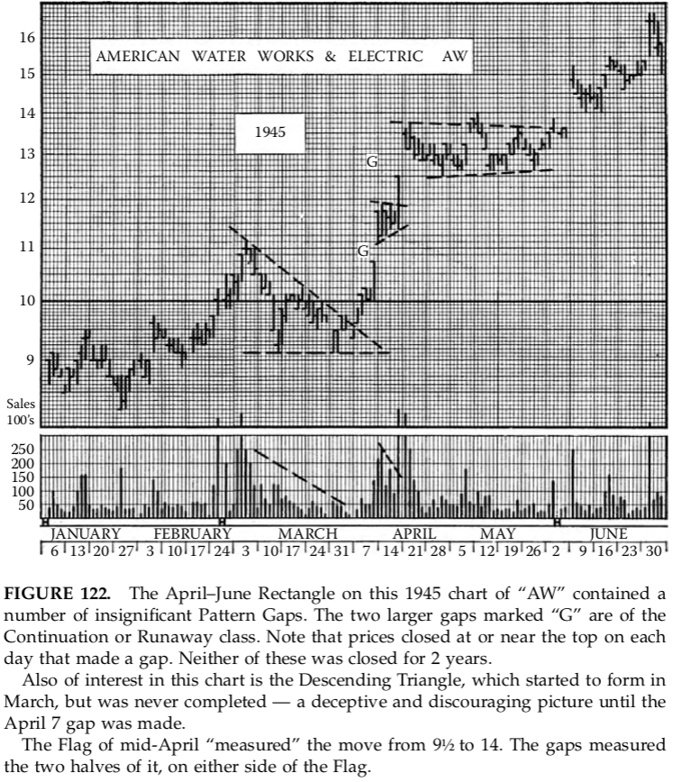

**FIGURE 122.** The April–June Rectangle on this 1945 chart of “AW” contained a
number of insignificant Pattern Gaps. The two larger gaps marked “G” are of the
Continuation or Runaway class. Note that prices closed at or near the top on each
day that made a gap. Neither of these was closed for 2 years.
Also of interest in this chart is the Descending Triangle, which started to form in
March, but was never completed — a deceptive and discouraging picture until the
April 7 gap was made.

If we seem to have “protested too much” in the foregoing, it is only
because we want our readers to study this topic with an open mind, free
from preconceived notions as to any mystic qualities which gaps may pos-
sess. Turning to the other side of the picture, gaps — some gaps — have
technical import. Some gaps are useful to the chart analyst in appraising
trend possibilities. Let us see what we can make of them.

##### Ex-Dividend Gaps

First, however, we must eliminate from consideration the gaps that do _not_
mean anything. An eighth-point gap obviously has no technical significance

The Flag of mid-April “measured” the move from 9½ to 14. The gaps measured
the two halves of it, on either side of the Flag.
as it represents only the minimum permitted change in price. By the same
token, a gap of a quarter of a point or even a half point in a high-priced
stock, such as Norfolk & Western (before the split), represents only a normal,
in fact close, spread between successive bids. In brief, to carry interest for
the chart technician, a gap must be wider than the usual changes in price
that occur under normal or prevailing trading conditions. A second class of
gaps that have no forecasting implications are those formed consistently and
habitually by “thin” issues in the medium- and higher-price brackets. You
can spot them easily. If your chart of a certain issue shows numerous gaps
as a regular thing, then no one of them is apt to mean anything special.
Finally, gaps that appear on the charts when a stock goes ex-dividend
(whether the dividend be in cash, stock, rights, or warrants) possess no trend
implications. They are occasioned not by a change in the Supply–Demand
relation which governs the trend, but by a sudden and irreversible alteration
in the actual book value of the issue.
Eliminating the technically meaningless types named above, we are left
with the gaps which occur infrequently (and which are not occasioned by
an ex-dividend change in value) in issues that are so closely and actively
traded as ordinarily to produce “solid” charts. A 1-point gap, for example,
in the chart of New York Central would be an unusual event; it would
demand attention; it would presumably have some forecasting significance.
Such gaps, for the purposes of our study, may be divided into four
classes: Common or Area Gaps, Breakout Gaps, Continuation or Runaway
Gaps, and Exhaustion Gaps.

##### The Common or Area Gap

This type of gap gets its name from its tendency to occur within a trading
area or Price Congestion Pattern. All of the Congestion Formations that we
have studied in the preceding chapters — both Reversal and Consolidation
types — are attended by a diminution in trading turnover. The more strictly
defined sorts — the Triangles and Rectangles — show this characteristic most
conspicuously. Moreover, activity in these patterns tends to be concentrated
pretty much at or near the top and bottom edges, their Supply and Demand
Lines, while the area in between is a sort of “no-man’s land.” It is easy to
see, therefore, why gaps develop frequently within such areas. You will find
numbers of good examples of Pattern Gaps in the charts illustrating
Chapters 8 and 9.
Such Pattern Gaps are usually closed within a few days, and for obvious
reasons, before the Congestion Formation in which they have appeared is
completed and prices break away from it. But not always. Sometimes a gap
will develop in the _last_ traverse of prices across the pattern area just before
a breakout, and in such cases, it is not closed for a long time, nor is there
any reason why it should be.

The forecasting significance of Common or Pattern Gaps is practically
nil. They have some use to the technician simply because they help him
recognize an Area Pattern — that is, their appearance implies that a Con-
gestion Formation is in process of construction. If, for example, a stock moves
up from 10 to 20, drops back to 17, and then returns to 20, making a gap in
the course of that rally, it is a fair assumption that further pattern develop-
ment will take place between approximately 17 and 20. This is a convenient
thing to know and may, on occasion, be turned to profit in short-term trading
policy.
Pattern Gaps are more apt to develop in Consolidation than in Reversal
Formations. Thus, the appearance of many gaps within an evolving Rectan-
gle or Symmetrical Triangle reinforces the normal expectation that the pat-
tern in question will turn out to be a Consolidation rather than a Reversal
Area.

##### Breakaway Gaps

The Breakaway type of gap also appears in connection with a Price Conges-
tion Formation, but it develops at the _completion_ of the formation in the move
which breaks prices away. Any breakout through a _horizontal_ pattern bound-
ary, such as the Top of an Ascending Triangle, is likely to be attended by a
gap. In fact, it is safe to say that most of them are. And, if we consider what
goes on in the market to create a Flat-Topped Price Formation, it is easy to
see why Breakaway Gaps should be expected. An Ascending Triangle, for
example, is produced by persistent demand for a stock meeting a large
supply of it for sale at a fixed price. Suppose that supply is being distributed
at 40. Other holders of the stock, who may have intended originally to
liquidate at 40½ or 41, see quotations come up to 40 time after time, stop
there and turn back. They tend, in consequence, either to join the crowd
selling at 40, or else to figure that once through 40, prices will go much
higher; they may either lower or raise their selling price. The result is a
“vacuum” on the books, a dearth of offerings in the price range immediately
above the pattern. Hence, when the supply at 40 in our Ascending Triangle
example is finally all absorbed, the next buyer of the stock finds none offered
at 40⅛ or 40¼ and he has to bid up a point or more to get his shares, thus
creating a Breakaway Gap.
As we remarked earlier in this chapter, gaps of this type actually occur
on almost every decisive breakout from a Horizontal Congestion, although
many of them do not show on the charts because they occur _during_ a day
and not between one day’s close and the following day’s opening. Break-
away Gaps also develop at times when prices move out of other types of
Reversal or Consolidation Formations; they are not uncommon in connection
with Head-and-Shoulders Patterns, for instance, and they even occur on the
penetration of trendlines, which we shall discuss in a subsequent chapter.


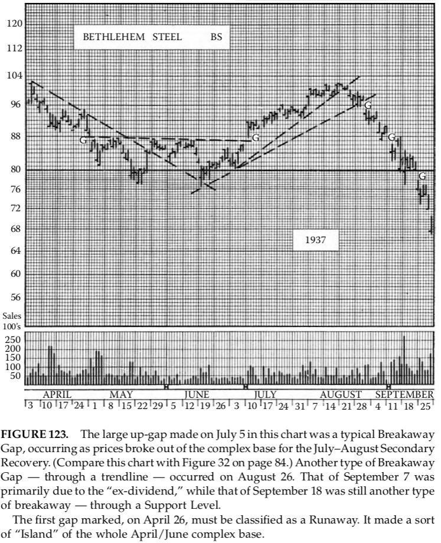

**FIGURE 123.** The large up-gap made on July 5 in this chart was a typical Breakaway
Gap, occurring as prices broke out of the complex base for the July–August Secondary
Recovery. (Compare this chart with Figure 32 on page 84.) Another type of Breakaway
Gap — through a trendline — occurred on August 26. That of September 7 was
primarily due to the “ex-dividend,” while that of September 18 was still another type
of breakaway — through a Support Level.
The first gap marked, on April 26, must be classified as a Runaway. It made a sort
of “Island” of the whole April/June complex base.


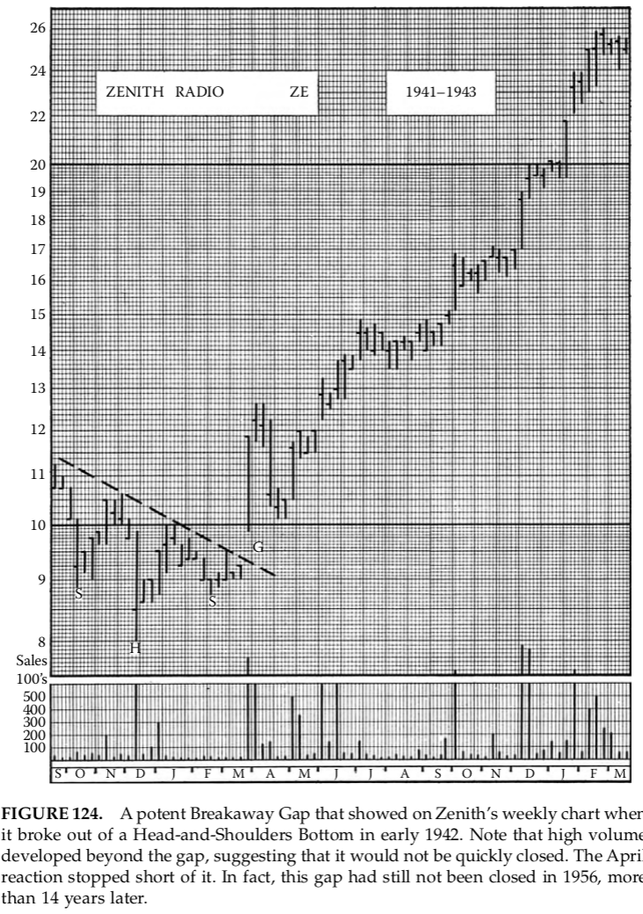

**FIGURE 124.** A potent Breakaway Gap that showed on Zenith’s weekly chart when
it broke out of a Head-and-Shoulders Bottom in early 1942. Note that high volume
developed beyond the gap, suggesting that it would not be quickly closed. The April
reaction stopped short of it. In fact, this gap had still not been closed in 1956, more
than 14 years later.

What forecasting value can we ascribe to them? First, they serve to call
attention to, and emphasize the fact of, a breakout. There can be little doubt
that a genuine breakout has eventuated when prices jump out of a pattern
with a conspicuous gap. False moves are seldom attended by gaps. Second,
they carry the suggestion that the buying demand (or selling pressure, as
the case may be) that produced the gap is _stronger_ than would be indicated
by a gapless breakout. Hence, it may be inferred that the ensuing move will
carry prices farther or faster, or both. It does not do to make too much of
this point; it is a logical inference and one which has been borne out in the
majority of cases, but it has its exceptions and may prove most disappointing
on occasion. Nevertheless, _other things being equal_ , of two stocks which
emerged from Ascending Triangles at the same time, we should choose to
buy the one that gapped out over the one that pushed its way out by small
fractional steps.

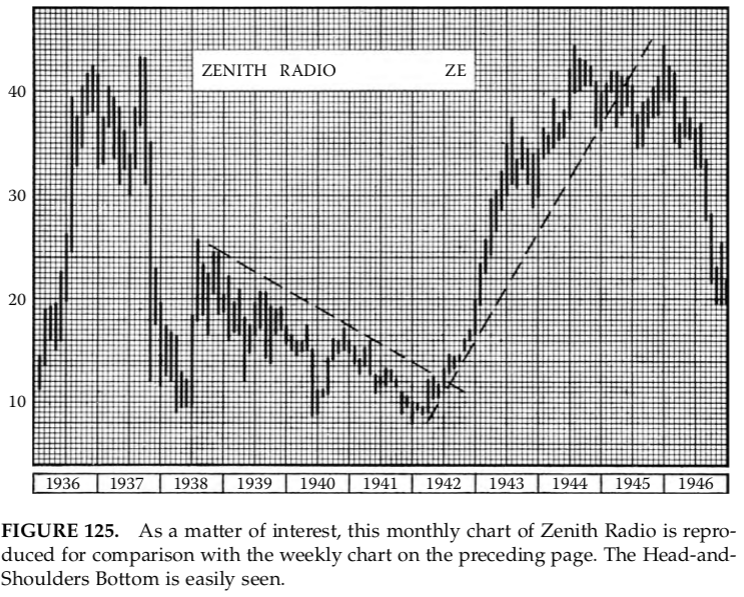

**FIGURE 125.** As a matter of interest, this monthly chart of Zenith Radio is repro-
duced for comparison with the weekly chart on the preceding page. The Head-and-
Shoulders Bottom is easily seen.

Except for the presumption of somewhat greater “steam” behind the
move, the Breakaway Gap carries no particular measuring implication, nor
any other forecasting significance. The next question is: should we expect a
Breakaway Gap to be closed within a relatively short time? Or, to put the
question in more practical and pragmatic terms: should we defer buying in
the expectation that it will be closed before any worthwhile move develops?
In order to give a fair answer to that question, it is necessary to scrutinize
closely the volume of transactions before _and after_ the gap. If a great many
sales were recorded at the takeoff level from which prices jumped the gap,
but relatively few as prices moved away from the far side of the gap, then
there is a chance — perhaps about 50–50 — that the next Minor Reaction
will carry prices back to the edge of the pattern of origin, thus filling the
gap. On the other hand, if high volume developed at the _far_ side of the gap,
and a great many transactions took place there as prices moved on away
from the gap, then the chances are remote that any near-term Throwback
will close the gap. In such cases, a Throwback reaction is almost always
stopped at the _outside_ of the gap.
(One is constantly tempted in a work of this sort to employ the words
_always_ or _never_ without qualification. Unfortunately, the authors have _never_
been able to discover a rule of techniques to which the market did not, on
rare occasion, produce an exception. It is _always_ necessary to be on guard
against such exceptional developments. Many of them are caused by general
market conditions which counteract the technical trend in individual issues.
Keep an eye on the charts of the “Averages,” as well as the particular issues
in which you are interested.)

Where Breakaway Gaps develop intraday, the daily chart cannot, of
course, indicate how the day’s volume was distributed. In that event, it may
be necessary to examine the ticker tape or ask your broker to refer to the
published record of individual transactions to which most brokerage firms
subscribe. _EN: This data may now be easily obtained. See Appendix D, Resources.
EN9: Candlestick charts, now much in use, will allow the analyst to see the intraday
breakaway gap._ Lacking any clear-cut volume clue, it is safest to figure that a
Breakaway Gap will not be filled until long after the full move implied by
the pattern of origin (usually a move of Intermediate Extent in the Dow
sense) has been carried out.

##### Continuation or Runaway Gaps

Less frequent in their appearance than either of the two forms we have
discussed above, gaps of the Continuation or Runaway type are of far greater
technical significance because they afford a rough indication of the probable
extent of the move in which they occur. For that reason they have sometimes
been called “Measuring” Gaps.
Both the Common or Pattern Gap and the Breakout Gap develop in
association with Price Formations of the Area or Congestion type, the former
within the formation and the latter as prices move out of it. The Runaway
Gap, on the other hand, as well as the Exhaustion Gap, which we will take
up later, is not associated with Area Patterns, but occurs in the course of
rapid, straight-line advances or declines.
When a dynamic move starts from an area of accumulation, the upward
trend of prices will seem often to gather “steam,” to accelerate for a few
days, perhaps a week or more, and then begin to lose momentum as supply
increases when the very extent of the advance invites more and more profit-
taking. Trading volume jumps to a peak on the initial breakout, tapers off
somewhat in the middle of the advance, and then leaps up again to a terrific
turnover as the move is finally halted. In such moves — and in rapid declines
of corresponding character — a wide gap is quite likely to appear at the time
when the Runaway is at its height, when quotations are moving most rapidly
and easily with relation to the volume of transactions. That period comes
normally at just about the halfway point between the breakout which inau-
gurated the move and the Reversal Day or Congestion Pattern which calls
an end to it. Hence, a Continuation or Runaway Gap affords an approximate
measurement of the move in which it develops. Its inference is that _prices
will go as much farther beyond the gap as they already have gone between_ the
beginning of the move and the gap, as measured directly (and vertically) on
the chart.

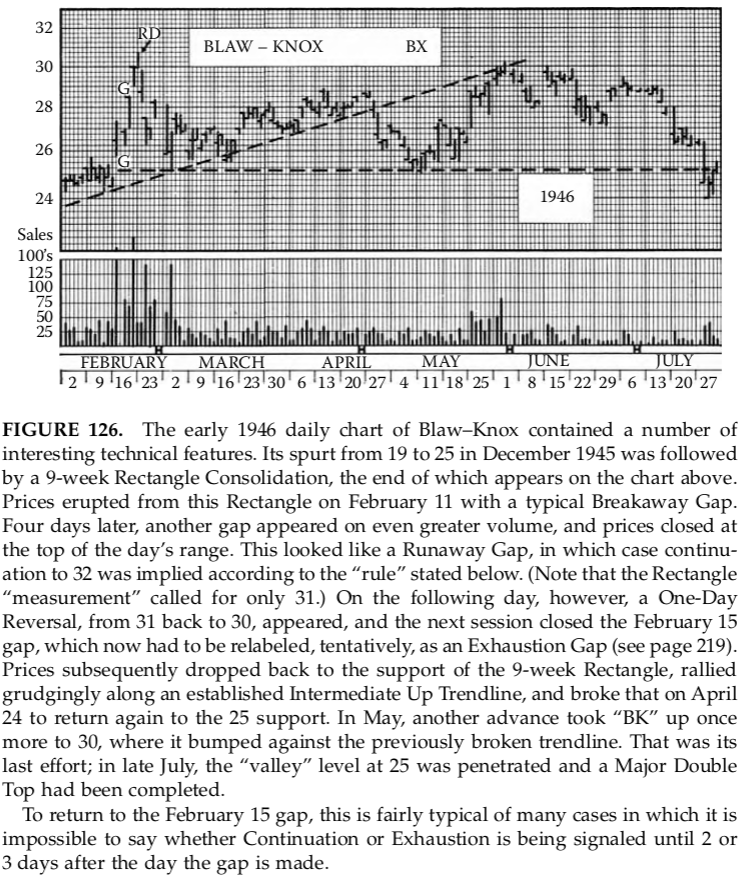

**FIGURE 126.** The early 1946 daily chart of Blaw–Knox contained a number of
interesting technical features. Its spurt from 19 to 25 in December 1945 was followed
by a 9-week Rectangle Consolidation, the end of which appears on the chart above.
Prices erupted from this Rectangle on February 11 with a typical Breakaway Gap.
Four days later, another gap appeared on even greater volume, and prices closed at
the top of the day’s range. This looked like a Runaway Gap, in which case continu-
ation to 32 was implied according to the “rule” stated below. (Note that the Rectangle
“measurement” called for only 31.) On the following day, however, a One-Day
Reversal, from 31 back to 30, appeared, and the next session closed the February 15
gap, which now had to be relabeled, tentatively, as an Exhaustion Gap (see page 219).
Prices subsequently dropped back to the support of the 9-week Rectangle, rallied
grudgingly along an established Intermediate Up Trendline, and broke that on April
24 to return again to the 25 support. In May, another advance took “BK” up once
more to 30, where it bumped against the previously broken trendline. That was its
last effort; in late July, the “valley” level at 25 was penetrated and a Major Double
Top had been completed.
To return to the February 15 gap, this is fairly typical of many cases in which it is
impossible to say whether Continuation or Exhaustion is being signaled until 2 or
3 days after the day the gap is made.


Since there is a tendency for advances to run, in terms of points, beyond
the price levels arithmetically implied by this rule, and for declines to be
more strictly limited, the gap-measuring rule works out particularly well
when applied directly on semilogarithmic scale charts. On arithmetic charts,
look for a trifle more on the upside and a trifle less on the downside. (In any
event, you will be wise to “bank” on something short of the theoretical goal.)
Runaway Gaps are easy to find and identify in retrospect, but our task
is to recognize them as such at the time they appear. Of course, there is,
obviously, no danger of confusing them with Pattern or Breakout Gaps. With
those aside, any gap which shows up in a fast advance or decline _after_ prices
have moved well away from an Area Formation (or the penetration of an
important trendline or break through a potent Support or Resistance Level,
which we shall discuss later) may be a Runaway Gap. What then becomes
necessary is to distinguish it from our next type, the _Exhaustion Gap_. Usually,
the price and volume action on the day following the gap furnishes the
evidence required for a safe diagnosis.

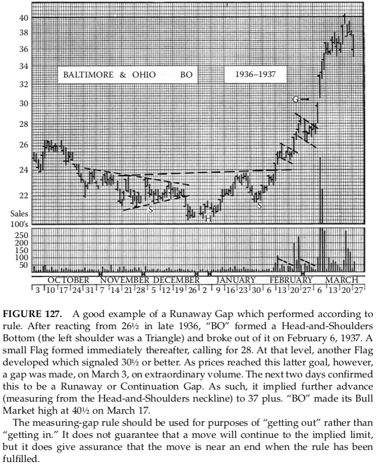

**FIGURE 127.** A good example of a Runaway Gap which performed according to
rule. After reacting from 26½ in late 1936, “BO” formed a Head-and-Shoulders
Bottom (the left shoulder was a Triangle) and broke out of it on February 6, 1937. A
small Flag formed immediately thereafter, calling for 28. At that level, another Flag
developed which signaled 30½ or better. As prices reached this latter goal, however,
a gap was made, on March 3, on extraordinary volume. The next two days confirmed
this to be a Runaway or Continuation Gap. As such, it implied further advance
(measuring from the Head-and-Shoulders neckline) to 37 plus. “BO” made its Bull
Market high at 40½ on March 17.
The measuring-gap rule should be used for purposes of “getting out” rather than
“getting in.” It does not guarantee that a move will continue to the implied limit,
but it does give assurance that the move is near an end when the rule has been
fulfilled.


##### Two or More Runaway Gaps


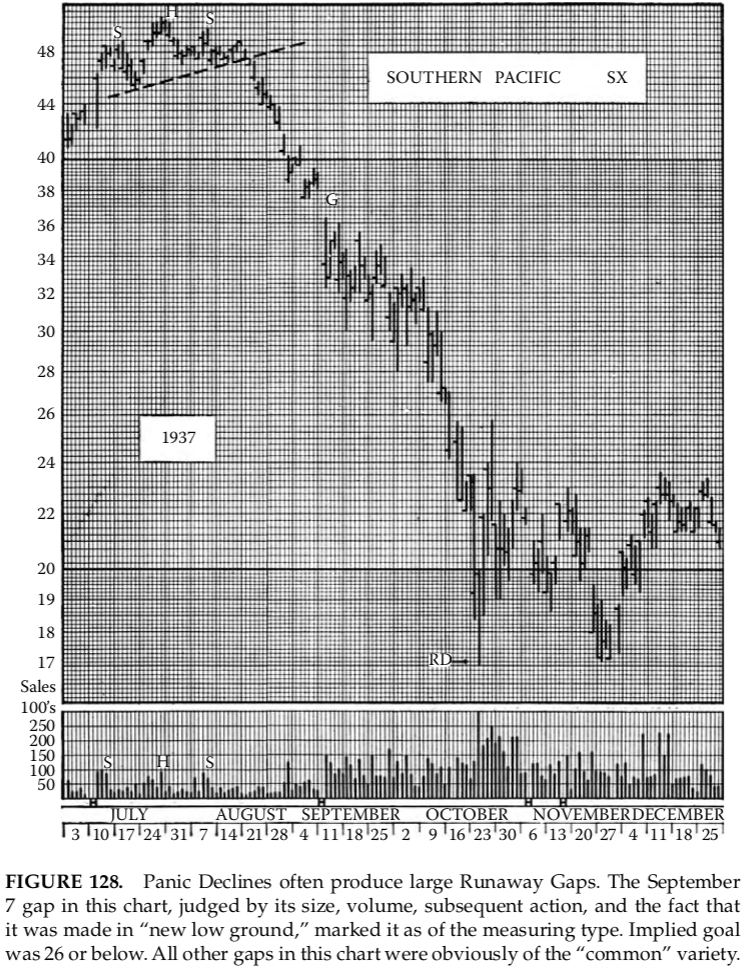

**FIGURE 128.** Panic Declines often produce large Runaway Gaps. The September
7 gap in this chart, judged by its size, volume, subsequent action, and the fact that
it was made in “new low ground,” marked it as of the measuring type. Implied goal
was 26 or below. All other gaps in this chart were obviously of the “common” variety.


But it will be much easier to bring out the characteristics distinguishing
Runaway and Exhaustion Gaps when we take up the latter in detail. Before
doing so, we must mention those cases where two, and, rarely, even three,
gaps intervene in a fast move and are evidently all classifiable as of the
Continuation or Runaway breed. It doesn’t happen often, and is particularly
unlikely to appear in the chart of a fairly large and active issue, but one of
the thinner stocks in the midst of a “skyrocket” move may go skipping along
for 3 or 4 days making gaps between each successive pair. The only question
of practical importance that arises in such cases is: where should the halfway
measuring point be located? No quick and easy rule can be laid down, but
studious inspection of the chart, especially of the volume trend, will usually
afford an answer. Remember that halfway in these fast moves tends to come
at the stage where prices are moving most easily and rapidly with respect
to number of transactions recorded (whence the tendency to gap). If there
are _two_ gaps, the halfway stage may very likely have been reached some-
where between them. Inspect your chart carefully and try to “average” the
picture mentally; look for what appears to be the center of “thinness” and
use that for your measuring level. But remember also that each successive
gap brings the move inevitably nearer to Exhaustion, so let your judgment
lean to the conservative side; do not expect too much of the second or third
gap.

##### Exhaustion Gaps

The Breakout Gap signals the start of a move; the Runaway Gap marks its
rapid continuation at or near its halfway point; the Exhaustion Gap comes
at the end. The first two of these are easily distinguished as to type by their
location with respect to the preceding price pattern, but the last is not always
immediately distinguishable from the second.
Exhaustion Gaps, like Runaway Gaps, are associated with rapid, exten-
sive advances or declines. We have described the Runaway type as the sort
that occurs in the midst of a move that accelerates to high velocity, then
slows down again and finally stops as increasing Resistance overcomes its
momentum. Sometimes, however, “skyrocket” trends evidence no such
gradual increase of Resistance as they proceed, showing no tendency to lose
momentum, but rather continue to speed up until, suddenly, they hit a stone
wall of supply (or, in cases of a decline, demand) and are brought to an
abrupt end by a day of terrific trading volume. In such moves, a wide gap
may appear at the very end, i.e., between the next to the last and the last
day of the move. This gets the name of Exhaustion Gap because the trend
seems thereby to have exhausted itself in one final leaping spurt.
The best test of whether a gap formed in a rapid, straight-line advance
or decline is of the Continuation or Exhaustion type comes on the day after
the gap (more precisely, the day which makes the gap), although there are
frequently other clues in the preceding chart picture. If trading activity
mounts to an extraordinary height during the session following the gap, and
particularly if the previous trend in prices does not appear to be carried
along at a pace commensurate with that day’s activity, the gap is probably
of the Exhaustion class. This interpretation is reinforced, in fact, made a
virtual certainty, if the day after, the gap develops into a Reversal Day (as
described in Chapter 10) with the closing price registered back near the edge
of the gap.
Evidence that may be derived from the chart anteceding the gap may
be enumerated as follows. If the trend has already carried out the full impli-
cations of the price formation or Congestion Area from which it emerged,
Exhaustion is more likely than Continuation. By the same token, if the
reasonable measuring implications of the pattern of origin are still far short
of attainment, the gap is probably of the Continuation type. An Exhaustion
Gap is seldom the first gap in a runaway move; it is usually preceded by at
least one Continuation Gap. Thus, you may ordinarily assume (unless the
contrary appears from other and more weighty indications) that the first gap
in a rapid advance or decline is a Continuation Gap. But each succeeding
gap must be regarded with more and more suspicion, especially if it is wider
than its predecessor.


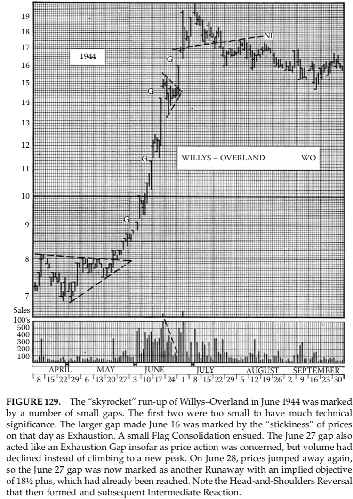

**FIGURE 129.** The “skyrocket” run-up of Willys–Overland in June 1944 was marked
by a number of small gaps. The first two were too small to have much technical
significance. The larger gap made June 16 was marked by the “stickiness” of prices
on that day as Exhaustion. A small Flag Consolidation ensued. The June 27 gap also
acted like an Exhaustion Gap insofar as price action was concerned, but volume had
declined instead of climbing to a new peak. On June 28, prices jumped away again,
so the June 27 gap was now marked as another Runaway with an implied objective
of 18½ plus, which had already been reached. Note the Head-and-Shoulders Reversal
that then formed and subsequent Intermediate Reaction.


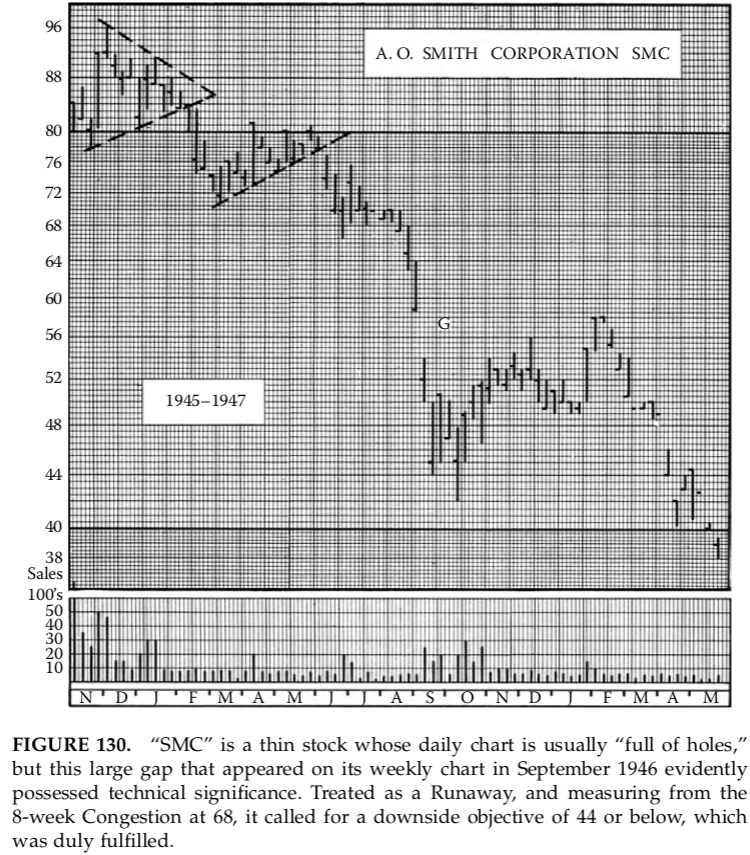

**FIGURE 130.** “SMC” is a thin stock whose daily chart is usually “full of holes,”
but this large gap that appeared on its weekly chart in September 1946 evidently
possessed technical significance. Treated as a Runaway, and measuring from the
8-week Congestion at 68, it called for a downside objective of 44 or below, which
was duly fulfilled.


We have referred to Exhaustion Gaps as _wide_ gaps. Width is, of necessity,
relative in this study; it is impossible to lay down any exact rules to define
wide or narrow. Do not let this bother you too much. Recognition of what
constitutes an unusually wide gap for the particular stock you have under
observation soon comes with a little charting experience.
Runaway Gaps are usually not covered for a considerable length of time,
not, as a rule, until the market stages a swing of Major or full Intermediate
proportions in the opposite direction. But Exhaustion Gaps are quickly
closed, most often within 2 to 5 days, a fact which furnishes a final clue to
distinguish Exhaustion from Continuation, if it should still be needed at that
stage. (This, incidentally, upsets the common superstition that all gaps must
be closed before the trend can be trusted to continue very far. In the case of
the Runaway Gap, it is not closed, but the trend moves right along never-
theless, and often for a surprising distance. In the case of the Exhaustion
Gap, the closing of it actually contributes to the signal that the trend has run
out.)


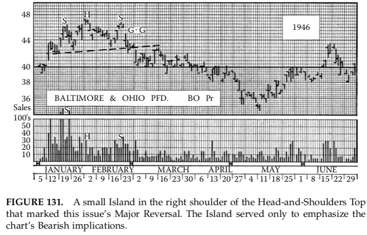

**FIGURE 131.** A small Island in the right shoulder of the Head-and-Shoulders Top
that marked this issue’s Major Reversal. The Island served only to emphasize the
chart’s Bearish implications.

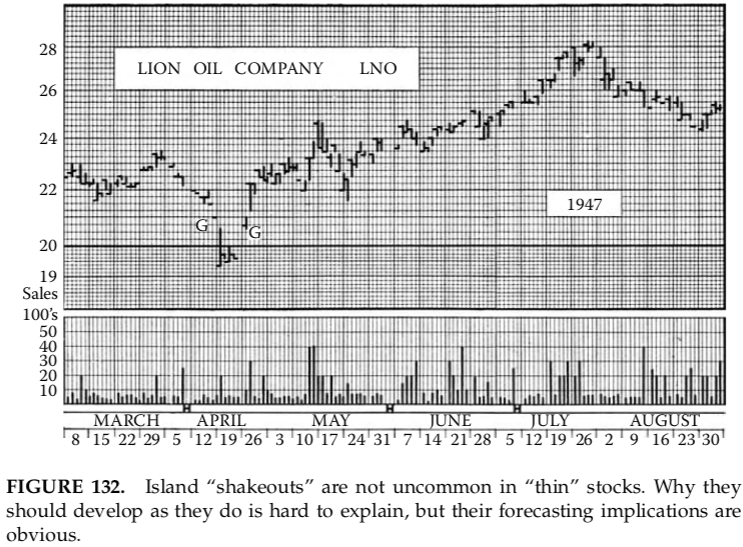

**FIGURE 132.** Island “shakeouts” are not uncommon in “thin” stocks. Why they
should develop as they do is hard to explain, but their forecasting implications are
obvious.


An Exhaustion Gap, taken by itself, should not be read as a sign of
Reversal, nor even, necessarily, of Reversal at all. It calls “stop,” but the halt
is ordinarily followed by some sort of area pattern development which may,
in turn, lead to either Reversal or Continuation of the move prior to the gap.
However, in practically every case, enough of a Minor Reaction or delay
ensues from the formation of an Exhaustion Gap, before a new trend is
established, to warrant closing out commitments at once. (One can always
reenter if it subsequently appears that the previous trend is to be resumed.)

##### The Island Reversal

We mentioned (at the end of Chapter 10) a Reversal Pattern, the Island, which
was to be taken up under the general study of gaps. The Island Pattern is
not common, and it is not, in itself, of major significance, in the sense of
denoting a long-term Top or Bottom, but it does, as a rule, send prices back
for a complete retracement of the Minor Move which preceded it.
An Island Reversal might be described as a compact trading range sep-
arated from the move which led to it (and which was usually fast) by an
Exhaustion Gap, and from the move in the opposite direction which follows
it (and which is also equally fast, as a rule) by a Breakaway Gap. The trading
range may consist of only a single day, in which event it normally develops
as a One-Day Reversal, or it may be made up of from several days to a week
or so of Minor Fluctuations within a compact price zone. It is characterized,
as might be expected, by relatively high volume. The gaps at either end occur
at approximately the same level (they should overlap to some extent) so that
the whole area stands out as an Island on the chart, isolated by the gaps
from the rest of the price path.
We have said that an Island does not, of itself, appear as a _Major_ Reversal
Formation, but Islands frequently develop within the larger patterns at turn-
ing points of Primary or important Intermediate consequence, as for example
in the head of a dynamic Head-and-Shoulders Top. By the same token, they
appear occasionally at the extremes of the Minor Swings which compose a
Triangle or a Rectangle (in which event, of course, the gaps that set them off
are really better classified as Common or Pattern Gaps).
The reasons why Islands can and do develop — in other words, why
gaps can and do repeat at the same price level — will be more apparent
when we take up the general subject of Support and Resistance in a later
chapter. Suffice it to repeat at this point that prices can move most rapidly
and easily, either up or down, through a range where little or no stock
changed hands in the past, where, in other words, previous owners have no
“vested interest.”


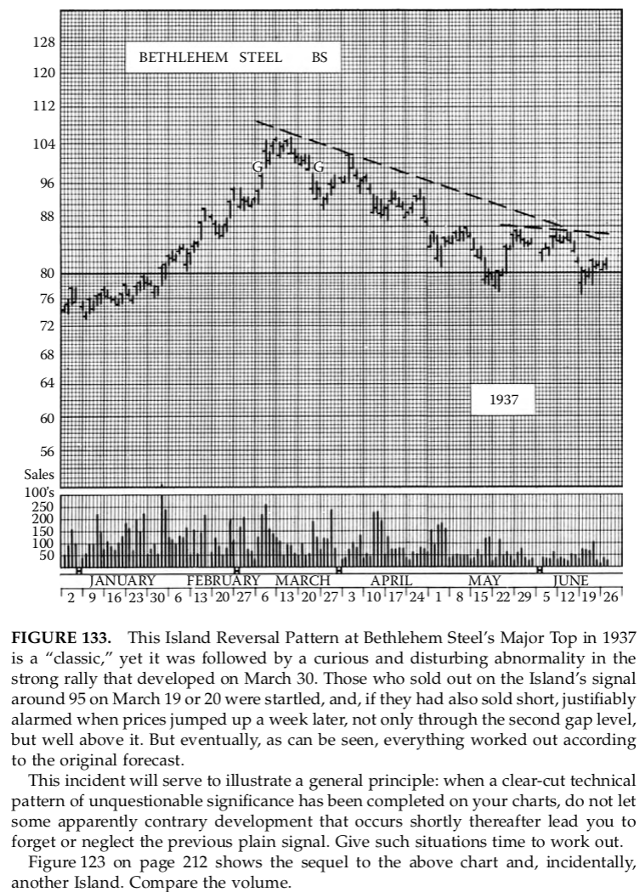

**FIGURE 133.** This Island Reversal Pattern at Bethlehem Steel’s Major Top in 1937
is a “classic,” yet it was followed by a curious and disturbing abnormality in the
strong rally that developed on March 30. Those who sold out on the Island’s signal
around 95 on March 19 or 20 were startled, and, if they had also sold short, justifiably
alarmed when prices jumped up a week later, not only through the second gap level,
but well above it. But eventually, as can be seen, everything worked out according
to the original forecast.
This incident will serve to illustrate a general principle: when a clear-cut technical
pattern of unquestionable significance has been completed on your charts, do not let
some apparently contrary development that occurs shortly thereafter lead you to
forget or neglect the previous plain signal. Give such situations time to work out.
Figure 123 on page 212 shows the sequel to the above chart and, incidentally,
another Island. Compare the volume.


Sometimes the second gap — the Breakaway that completes the Island —
is closed a few days later by a quick Pullback or reaction. More often it is
not. Rarely, the first gap — the Exhaustion Gap that starts the Island — is
covered in a few days before the second gap appears, in which event the
Island Congestion takes on a sort of V-Shape (if it is a Top), and there is no
clear “open water” across the chart horizontally between the Island and the
trends preceding and following it. In any of these variations, however, the
interpretation remains the same: the preceding Minor Move should be prac-
tically retraced.
An Island Pattern is not easy to trade on, unless it be for a short-term
“scalp,” as, obviously, a good share of the retracement may already have
been accomplished by the time the Island is charted and an order to buy or
sell on its indications can be executed. Of course, if the entering gap is
recognized as an Exhaustion Gap, the trader who is interested in the stock
presumably will take action before the second gap forms and before the
Island is in evidence. Perhaps, the greatest utility that Islands have for the
chart analyst is that of calling attention to a situation, of putting him on the
alert as to its potentialities.


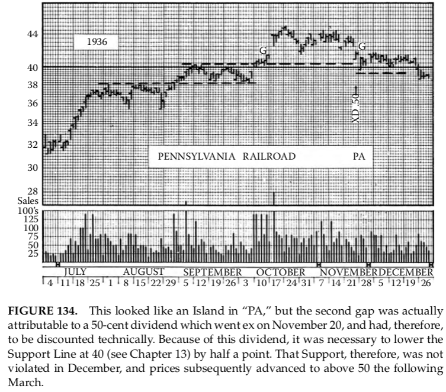

**FIGURE 134.** This looked like an Island in “PA,” but the second gap was actually
attributable to a 50-cent dividend which went ex on November 20, and had, therefore,
to be discounted technically. Because of this dividend, it was necessary to lower the
Support Line at 40 (see Chapter 13) by half a point. That Support, therefore, was not
violated in December, and prices subsequently advanced to above 50 the following
March.


##### Gaps in the Averages

Gaps appear also in nearly all Averages but, for obvious reasons, with rather
less frequency than in the charts of individual issues. While it is not necessary
for all of the stocks composing an average to make a gap simultaneously in
order to produce a gap in the Average figures, a majority of them must. As
might therefore be expected, Common or Pattern Gaps are particularly rare
in Average charts, but Breakaway and Runaway types are not uncommon,
although small as compared with the size of such gaps in single stocks.
Exhaustion Gaps, and, in consequence, Islands, again are rare. The conditions
that create an Exhaustion Gap seldom develop in a sufficient number of
individual issues at any one time to produce a counterpart in the Averages.
The technical interpretation of gaps in Averages is, in the main, the same
as in single stocks. The authors have not found that an Average gap possesses
any peculiar potency or significance over and above that attributable to a
gap in the chart of any actively and closely traded single issue.
The broader, and hence, most representative market indexes show the
fewest and smallest gaps. _EN: On the other hand, the NASDAQ is quite volatile
and a good gap producer._
(It is suggested that the reader review this chapter after he has finished
studying the principles of Support and Resistance in Chapter 13.)
_EN9: The truth is there is nothing more that need be said about gaps, and the
truth also is that no modern examples need be added. But gaps are fun, so see Figure
114.1 and Chapter 16.1 for modern examples._

## Chapter thirteen

# Support and Resistance

The phenomena that we shall study in this chapter are markedly different
in kind from those discussed in preceding sections. We shall look now at the
stock market from a new angle, and in so doing may find it possible to
develop some very practical additional rules to guide us in selecting stocks
for purchase or sale, in estimating their potential moves, in foreseeing where
they are likely to “run into trouble.” As a matter of fact, some experienced
traders have built their “systems” almost entirely on the principles of what
we here call Support and Resistance, paying no attention to the specific
pictorial patterns of price and volume action we have been investigating in
preceding pages.
But Support and Resistance phenomena are not, by any means, unrelated
to the various patterns and formations previously studied. We have already
had occasion to hint at a basic principle of Support and Resistance in our
explanation of gaps, and, as you read on, you will find that a number of the
other patterns of price behavior are explained thereby, or at least become
more readily understood.
The term _Support_ is commonly used in the Street. In one or more of its
connotations, it must be fairly familiar to the reader. For example, we hear
that such-and-such a crowd is supporting XYZ at 50, or is prepared to
support the market by buying all stock offered on any 5-point concession.
For the purposes of this chapter, we may define _Support_ as buying, actual or
potential, sufficient in volume to halt a downtrend in prices for an appre-
ciable period. _Resistance_ is the antithesis of Support; it is selling, actual or
potential, sufficient in volume to satisfy all bids and, hence, stop prices from
going higher for a time. Support and Resistance, as thus defined, are nearly
but not quite synonymous with demand and supply, respectively.
A _Support_ Level is a price level at which sufficient demand for a stock
appears to hold a downtrend temporarily at least, and possibly reverse it,
i.e., start prices moving up again. A _Resistance_ Zone, by the same token, is
a price level at which sufficient supply of a stock is forthcoming to stop, and
possibly turn back, its uptrend. There is, theoretically, a certain amount of
supply and a certain amount of demand at any given price level. (The relative
amount of each will vary according to circumstances and determine the
trend.) But a Support Range represents a _concentration_ of demand, and a
Resistance Range represents a _concentration_ of supply.

According to the foregoing definitions, you can see that the top boundary
of a Horizontal Congestion Pattern such as a Rectangle is a Resistance Level,
and its bottom edge a Support Level; the top line of an Ascending Triangle
is unmistakably a Resistance Level, etc. But we are more interested now in
the reasons why Support or Resistance, as the case may be, can be _anticipated_
to appear at certain price ranges. Within reasonable limits, and with a certain
few exceptions which we will examine later, it is quite possible to do this.
Expert chart readers are able frequently to make some amazingly accurate
predictions as to where an advance will encounter Resistance (supply) or
where a declining trend will meet Support.

The basis for such predictions — the elementary data from which Sup-
port and Resistance theories are derived — is that turnover in any given
issue tends to be concentrated at the several price levels where a large
number of shares changed hands in times past. Since any level at which a
great volume of transactions takes place usually becomes a Reversal point
(Major, Intermediate, or Minor) in that stock’s trend, it follows naturally that
Reversal Levels tend to “repeat.” But, here is the interesting and the impor-
tant fact which, curiously enough, many casual chart observers appear never
to grasp: these critical price levels constantly switch their roles from Support
to Resistance and from Resistance to Support. A former Top, once it has been
surpassed, becomes a Bottom zone in a subsequent downtrend; and an old
Bottom, once it has been penetrated, becomes a Top zone in a later advancing
phase.

##### Normal Trend Development

Perhaps we can make this plainer by citing a typical example of normal
trend development. Suppose a stock in a Bull Trend moves up from 12 to
24, and there runs into a large volume of selling. The result is a reaction that
may take the form of a full Intermediate Correction to, say, 18, or a series of
Minor Fluctuations forming a Consolidation Pattern between, say, 24 and
21, the effect being the same in either case. Following this Correction or
Consolidation, a new advance gets under way and carries price on up to 30
before running again into supply in sufficient concentration to stifle the
move. Now another reaction is evidently due. Again, it may take the form
of a sideways Consolidation Pattern or an Intermediate Correction. If the
latter, where will that corrective setback be reversed; where, in other words,
will it meet Support? The answer is at 24, the level of the first Top in the
trend. That is the level (below current quotations) where a large turnover
had previously occurred. Then it functioned as Resistance, producing a halt
or Reversal in the first upswing; now it functions as Support, stemming and
reversing, at least in a Minor sense, the latest downswing.
Why should this be? It will be easier to suggest an answer to that
question if we first go on with a similar example of typical action in a
downtrend. This time, suppose our stock makes a Major Top and declines
from, say, 70 to 50. There, at 50, a temporary Selling Climax occurs; there is
a large turnover, prices rally, perhaps slip back for a “test” of 50, and then
stage a good recovery to 60. At 60, buying peters out, the trend rounds over,
turns down, and accelerates in renewed decline which carries to a new low
at 42. Again a wave of buying comes in, and a second recovery swing gets
under way. We can confidently expect that this recovery (from 42) will run
into strong Resistance at 50. The price level which functioned as a _Support_
for the first phase of decline, now that it has been broken through downside
by the second phase, will reverse its role and function as _Resistance_ to the
second recovery move. The former Bottom level will now become a Top level.
Here, we may ask again why this should be so, and now we can suggest
an answer. In the example of downtrend action cited in the preceding para-
graph, our stock first dropped to 50, ran into considerable volume there,
reversed its trend and rallied to 60 with activity dwindling on the rise. A lot
of shares changed hands at 50, and for every seller, there was, of course, a
buyer. A few of those buyers may have been covering short positions and,
having done so, had no further interest in the issue. Others, short-term
traders and professionals, may have purchased simply because they sensed
a temporary Bottom in the making and hoped to scalp a few points on the
ensuing rally; presumably, they (or at least some of them) took their profits
and were out before prices broke very far on the next decline But a majority
of those who acquired shares at 50, it is safe to say, did so because they
thought the stock was cheap at that price, because they figured it had gone
low enough. Only a few months ago, it was selling above 70; surely it was
a bargain at 50 and could be picked up and put away “for the long term.”

##### The Explanation

Imagine yourself, for the moment, in the place of those new owners. They
see prices turn up, reach 55, 58, 60. Their judgment appears to have been
vindicated. They hang on. Then the rally peters out, and prices start to drift
off again, slipping to 57, 55, 52, finally 50. They are mildly concerned but
still convinced that the stock is a bargain at that price. Probably there is
momentary hesitation in the decline at 50, and then prices break on down.
Briefly, there is hope that the break is only a shakeout to be recovered quickly,
but that hope vanishes as the downtrend continues. Now our new owners
begin to worry. Something has gone wrong. When the stock gets down below
45, the former bargain doesn’t look so good. “Well, I guess I picked a lemon
that time, but I won’t take a loss in it. I’ll just wait until it gets back up to
50 some day where I can get out even (except for expenses), and then they
can have it.” (Does it sound familiar, by any chance?)
Take the opposite side of the picture — the uptrend process. You, along
with many others, bought XYZ at 12, carried it up to 24, decided that was
plenty high for it, and cashed in. Thereupon XYZ reacted to 20, and you
congratulate yourself on your astuteness. But then, unexpectedly, it turns
around and rushes up to 30. Now you don’t feel so smart; that was a better
stock than you gave it credit for being. You wish you had it back. You will
not pay more for it, but if it comes back down to 24, the price at which you
sold, you’ll “reinstate your position.”
Perhaps you have never been in either of these situations. Perhaps your
own reactions wouldn’t, in such cases, have been the same as those we have
indicated. But, if you have had a fair amount of experience in the market —
have some knowledge of the psychology of the “average investor” — you
know that the pictures we have described are typical.

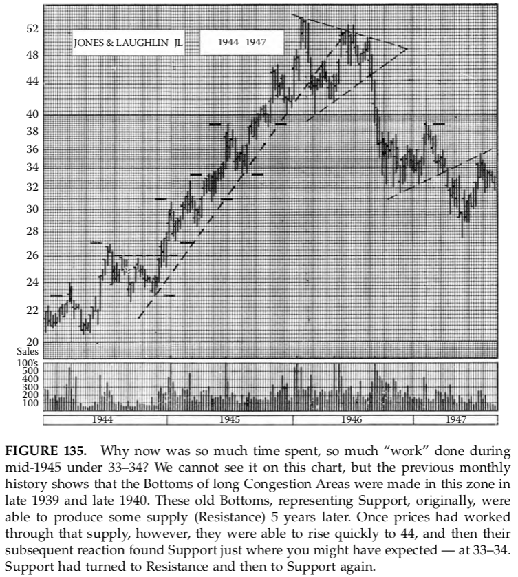

**FIGURE 135.** Why now was so much time spent, so much “work” done during
mid-1945 under 33–34? We cannot see it on this chart, but the previous monthly
history shows that the Bottoms of long Congestion Areas were made in this zone in
late 1939 and late 1940. These old Bottoms, representing Support, originally, were
able to produce some supply (Resistance) 5 years later. Once prices had worked
through that supply, however, they were able to rise quickly to 44, and then their
subsequent reaction found Support just where you might have expected — at 33–34.
Support had turned to Resistance and then to Support again. We can skip over the next few swings which “followed the rules” and go on to the change in the picture which came with the first notable violation of a Support
Level in 1946. Prices had pushed up the first of February nearly to 54, well out above
the Tops around 46, formed the previous November. The late February reaction
should have “caught Support” around 46 — but it didn’t; it crashed on down to the
“round figure” 40. This was an ominous (although not necessarily “fatal”) develop-
ment. Thereafter, a massive Symmetrical Triangle was formed and broke downside
in September. The first Panic Decline in the Bear Market is no respecter of Support Levels. This
one was no exception, although it is noteworthy that prices “bounced” several times
from the important old 33–34 zone. By November, the Top Triangle’s measurement
had been exactly fulfilled. You should turn back to this record and study it again after you have read the
next 10 or 11 pages.


At this point you may not be satisfied that we have succeeded in giving
an adequate explanation for our basic principle of Support and Resistance
Levels. Remember, however, that the supply and demand balance in the
market is nearly always a delicate thing. Only a moderate oversupply at any
one price will suffice to stifle an advance; only a little extra demand concen-
trated at a certain level will stem a decline. And remember, further, that other
traders are watching the tape — will be quick to sense any change in the
situation, and quick to join the parade whenever a change in trend appears
to be developing. Consequently, orders to buy or sell a few hundred shares
may induce the transfer of several thousand.
Another point worth bearing in mind is that the traders and investors
who (because, as we have presumed, of their previous mistakes in either
selling or buying prematurely) created Support and Resistance Levels are
not necessarily ignorant or inexperienced. On the contrary, we must list them
among the wiser and more alert of those who operate in the market. To make
one more use of our previous theoretical example of typical downtrend
action, those who bought at 50 were certainly smarter than those who bought
at the top (70) or on the way down to 50, even though the latter price was
broken later on. Giving them credit for somewhat superior judgment, it
follows that they may be expected to appraise later developments pretty
carefully and display something better than a wooden and stubborn deter-
mination to “get out even” when it comes to selling on a Recovery Move.
Hence, in a marked Bear Trend “overhanging supply”; i.e., stock bought
at higher levels by holders now waiting for a good chance to unload, will
begin to come on the market _below_ the theoretical Resistance Level. Wise
owners will be willing to sacrifice a point or so to avoid getting caught in
a worse loss.
By the same token, “sold-out Bulls,” when a Major Uptrend is under
way, may be willing to pay a point or two more in order to replace the shares
they had previously cashed in too soon. Thus, it is characteristic of reactions
in well-established (second phase) Bull Markets to drop back only to the
very uppermost limits of a Support Range — and for recoveries in estab-
lished Bear Markets to reach only the lowest edges of Resistance Zones, or
perhaps even fail of that by an appreciable margin. We shall have more of
this sort of thing to point out later on, but first we must take up two other
matters — how to estimate the potential importance of Support and Resis-
tance Zones, and how to locate, more exactly, the centers of axes of such
zones.


##### Estimating Support–Resistance Potential

To go back to first principles, we have seen that the Resistance that an upward
move may meet at any given level depends on the quantity of stock over-
hanging there — the number of shares previously bought at that price by
owners who now would like to get out without loss. Obviously then, _volume_
is our first criterion in estimating the power of a Resistance Range. An old
Minor Bottom level at which only four or five hundred shares changed hands
cannot set up much Resistance to a subsequent advance, but a Selling Climax
Bottom where several thousand shares were bought will provide a lot of
potential supply after prices, at some later date, have dropped well below
it, and then attempt to rise up through it again.


A long Rectangle or a Descending Triangle has a number of Bottoms at
the same level. We can get a crude approximation of the amount of Resistance
there by summing up the volume of trading on all its Bottoms, but then
some discount must be taken for the shares that may have been bought at
the Bottom of the pattern in its early stages and then sold near the Top before
it was completed. In brief, a single, sharp, high-volume Bottom offers some-
what more Resistance than a series of Bottoms with the same volume spread
out in time and with intervening rallies.


Another criterion is the extent of the subsequent decline. Or, to put it
another way, how far prices will have to climb before they encounter the old
Bottom zone whose Resistance potential we are attempting to appraise.
Generally speaking, the greater the distance, the greater the Resistance.
Suppose PDQ sells off from 30 to 20, “churns” at that level for several days,
rallies to 24, and then drifts back down to 19. Investors who picked it up at
20 will not be greatly concerned at that stage. If a rally now develops from
19, there will be little or no disappointed selling at 20. Should prices dip
to 18 before the rally starts, there may be some supply forthcoming at 20,
but still not a formidable quantity. From 17, Resistance will become evident.
In brief, prices have to break far enough below the price at which a trader
bought his stock to convince him that he made a bad investment and,
hence, that he should sell when he gets a chance to do so without too great
a loss.


It is impossible to formulate any precise rule or equation to define how
far a decline must proceed to set up Resistance above it. However, do not
look for much supply to come out of a Bottom level in the low-middle price
ranges (20 to 35) unless the trend later takes quotations more than 10% under
it. This 10% rule cannot be applied to very low-priced issues. A man may
buy a stock at 5 and see it drop to 4 or 3½ with considerable equanimity
despite the fact that he stands a loss of 30% at the latter figure. His “dollar”
loss looks small, and he still thinks it will be easy for his stock to get back
up to 6 or 7; he is willing to wait.

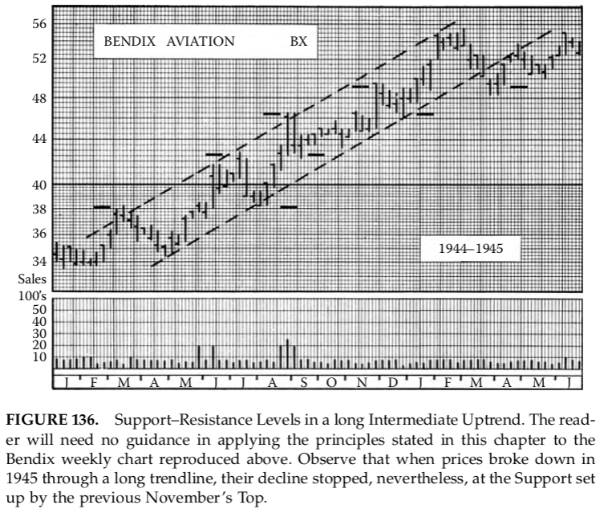

**FIGURE 136.** Support–Resistance Levels in a long Intermediate Uptrend. The read-
er will need no guidance in applying the principles stated in this chapter to the
Bendix weekly chart reproduced above. Observe that when prices broke down in
1945 through a long trendline, their decline stopped, nevertheless, at the Support set
up by the previous November’s Top.

Another factor enters into and reinforces the “extent of decline” criterion.
If our PDQ rallies, as before, from 20 to 24 and then drops rapidly to 12, not
only will many of the old owners at 20 be thoroughly disgusted and glad
to get out at that price, given an opportunity, but the new owners at 12 will
also be pleased to take 20 (66⅔% profit) and quick to do so if they detect
any signs of trouble there. New buyers at 18, needless to say, would not be
quite so ready to sell at 20.


A third criterion for appraising the Resistance potential at an old Bottom
level is the length of time that has elapsed since it was formed and the nature
of general market developments in the interim. You will, no doubt, find it
reasonable to suppose that an Intermediate Bottom formed in the early stages
of a Bear Market will offer relatively little Resistance after prices have fallen
far below it, have taken perhaps the better part of a year to make a Major
base, and then have gradually climbed up to it again 4 or 5 years later. To
some small extent, this is true. A supply only a year or two old is apt to be
more effective than one that is 4 or 5 years old, but the latter does not lose
all of its potency by any means. In fact, it is often surprising how effective
the Resistance will be at a very old Bottom zone, provided it has not been
“attacked” in the interim, and provided no changes have been made in the
capitalization of the company which might obscure, in the mind of the owner,
the original cost of his stock. Under the latter heading, we would put split-
ups and large stock dividends, or even an unusually generous cash “melon.”


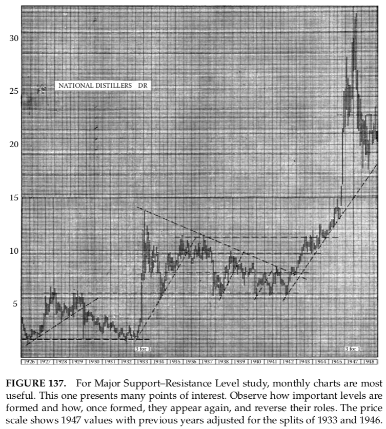

**FIGURE 137.** For Major Support–Resistance Level study, monthly charts are most
useful. This one presents many points of interest. Observe how important levels are
formed and how, once formed, they appear again, and reverse their roles. The price
scale shows 1947 values with previous years adjusted for the splits of 1933 and 1946.


We do not mean to imply that an investor is ever actually deceived as to the
actual cost of his shares, no matter how they may have been split, or what
dividend distribution has been made, but his disappointment (and desire to
get out even) may be abated.
If, however, a Resistance Zone has once been attacked — if prices have
come back up to it, hit it, and then retreated — some of its power has
obviously been removed. Some of its overhanging supply has been used up
in repelling the first attack. The next advance, therefore, will have less stock
to absorb at that level. Here again, the volume chart may be looked to for
some approximation of the amount of Resistance consumed. In any event,
it is an odds-on assumption that a third attack at a Resistance Level will
succeed in penetrating it.


We have named three criteria — volume, distance away, and time
elapsed — to be used in assessing the amount of Resistance to be expected
at any given level. At this point, it must be apparent to the reader (and
perhaps disappointing) that his own judgment must play a large role in
applying them. This cannot be helped. It is impossible to set up an exact
mathematical formula for any of them.
But, after all, the problem is not too complicated. The general principles
are simple enough and, we believe, easy to understand. We can look back
at the charted history and see where, in the last preceding downtrend, a
Bottom formed that may produce more or less Resistance when the current
advance reaches back up to its range. We have to estimate how much supply
resides there, how many shares were bought originally at that price and are
still held by owners who may welcome a chance to get out even.
The greatest danger in applying judgment to the measuring of these
factors lies in underestimating the amount of Resistance to be expected.
Guard against that effort; it is safer always to overestimate it. You may be
Bullishly disposed yourself; you may say, “Those fellows who were hung
up there in this stock must realize that conditions have improved, and they
will not be so anxious now to sell.” Don’t count on it. Remember that they
have been “hung up” for a long time. Even if they are mildly Bullish on the
market in general, they may be so disappointed with this particular stock
that they want to switch out of it and try something else. (The stubborn and
often costly refusal of the average American investor to “take a loss” operates
even against timely switching.)
Everything we have said in the foregoing paragraphs about estimating
potential Resistance applies as well — but in a reverse direction, of course —
to estimating potential Support. The principles are precisely the same, even
though the underlying rationale may be less easy to grasp.

##### Locating Precise Levels

Our next problem to consider is how, in practical day-to-day chart analysis,
we can locate as exactly as possible the limits of a Support or Resistance
Range, and in many cases, the specific price figure representing the core or
axis of such a range. In the theoretical examples we have made up so far to
illustrate basic principles, we have used even figures, but in actual trading,
the levels are seldom so nicely marked. Even the sharp and relatively pat-
ternless Bottom of a Recession may consist of a week of price fluctuations
within a narrow range. Perhaps the lowest day of that week’s Congestion
will appear on the chart as a One-Day Reversal, or there will be 2 or 3 days
which “spike” down below the general mass. Here again, although no math-
ematical rule can be laid down, it is easy to relate the price and volume
patterns visually, and by simple inspection, arrive at a near estimate of the
figure at which supply in quantity is likely to be forthcoming. Look partic-
ularly at the closing levels of the days making up the Bottom Congestion,
and average them mentally; this figure is apt to be pretty close to the “center
of gravity” of the entire Resistance Area.


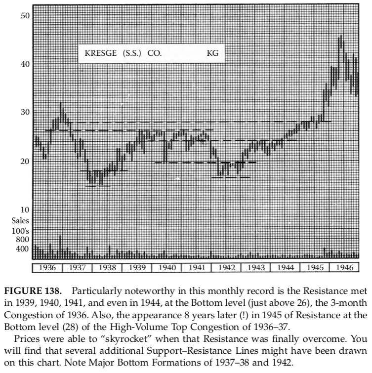

**FIGURE 138.** Particularly noteworthy in this monthly record is the Resistance met
in 1939, 1940, 1941, and even in 1944, at the Bottom level (just above 26), the 3-month
Congestion of 1936. Also, the appearance 8 years later (!) in 1945 of Resistance at the
Bottom level (28) of the High-Volume Top Congestion of 1936–37.
Prices were able to “skyrocket” when that Resistance was finally overcome. You
will find that several additional Support–Resistance Lines might have been drawn
on this chart. Note Major Bottom Formations of 1937–38 and 1942.


Of course, some supply is likely to start coming in as soon as a subse-
quent advance reaches the bottommost fraction of the Resistance Zone, and
more and more will appear as the move pushes up into it. Sometimes, it is
possible to predict “to a hair” just how far prices will penetrate a Resistance
Range by carefully comparing the vigor (volume of trading) on the advance
with the volume registered at various levels in the original formation of the
Resistance. This takes experience, but it is experience which you will find
quite easy and not at all costly to gain. However, in most cases, it is neither
necessary nor particularly desirable to be so exacting.
Nearly every chart in this book shows some example of Support and
Resistance phenomena, and the reader should make it a point, when he has
finished this chapter, to go back over them and study them all in detail. The
practical application of the rules we have been discussing will be greatly
clarified. Equally instructive, if you can manage to obtain such a collection,
is a study of the Support and Resistance Levels appearing in the monthly
charts of all actively traded stocks over a period of 10 years or more. _EN:
Easily generated by most currently available software and on the Internet at
prophet.net and stockcharts.com._ You will undoubtedly be amazed to see how
Tops, Bottoms, and Sideways Congestions tend to form at the same approx-
imate levels in successive Major Swings, while prices move freely and rap-
idly, up or down, through the ranges between such levels. It is hardly
necessary to dwell on the practical dollars-and-cents value of such informa-
tion which may be derived from the chart history.
And that brings up a matter that we may as well pause to consider
here — the kind of charts most useful for locating and appraising Support
and Resistance Levels. For near-term Minor Moves, the daily chart is natu-
rally the only source of information, and a daily chart record that extends
back for a year or more may, if necessary, be used in the location of levels
of Intermediate Trend importance. The writers have found, however, that a
daily chart does not give the perspective on the long range which one really
needs to determine Major and Intermediate Support and Resistance Zones.
It is apt to overemphasize the potential of a recently set up Minor Support
(or Resistance) Zone and obscure the importance of a true Intermediate
Level. For true perspective, a weekly chart, showing volume as well as price
ranges, and covering at least the whole previous Major Bull and Bear cycle,
is most desirable. Also, very good results can be obtained with a little study
and experience from monthly charts.
To return to our study of Support phenomena, we have had several
occasions to refer in previous chapters to a “normal” trend. What we have
had in mind might perhaps be better called an “ideal” trend, since, like so
many other so-called normal things, it represents a pattern from which the
facts of experience frequently deviate. In stock trends, nevertheless, this
normal or ideal appears as a fairly common pattern. If it is an uptrend, it
consists of a series of zigzags, each “zig” carrying prices to a new high and
each “zag” taking them back to the approximate top of the preceding “zig.”
To illustrate with figures, up to 10, back to 6, up to 15, back to 10, up to 20,
back to 15, up to 26, back to 20, etc. Such a move is what technicians refer
to as “self-correction” and regard as particularly sound and, hence, likely to
be continued. You can see that what it really represents is reaction to the
nearest Minor Support Level following each step forward. If you become
interested in an issue with such a trend pattern, the normal return to a
Support produces a good place to buy.

##### Significance of Support Failure

Sooner or later, however, a normal Minor Wave Pattern is bound to be broken
up. This generally occurs in one of two ways (although there is an infinity
of possible variations). In one, prices spurt away in an advance out of all
proportion to the previous succession of up waves. Such a move is seldom
followed by a reaction to the Support now left far behind, but rather, by the
construction of some sort of Area Pattern — which may be either Consoli-
dation or Reversal.


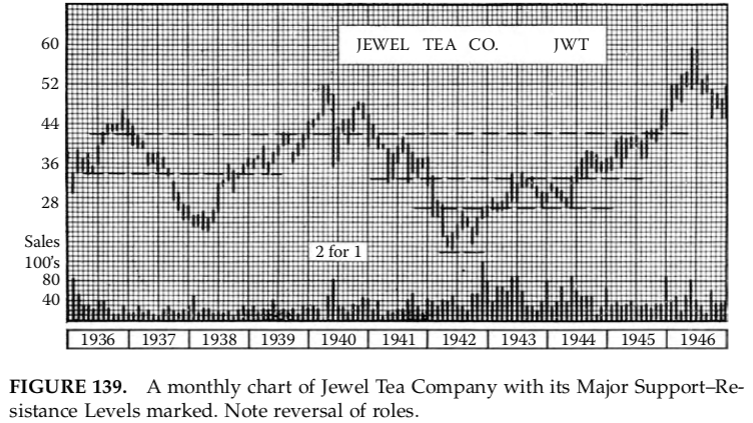

**FIGURE 139.** A monthly chart of Jewel Tea Company with its Major Support–Re-
sistance Levels marked. Note reversal of roles.


The other type of disruption appears when a reaction does _not_ halt and
reverse at the level of the previous Minor Top, but sifts on down through
that zone, perhaps to the level of the preceding Minor Bottom. This move
has “broken its Support,” and any such action carries a distinct warning of
a change in trend, a particularly emphatic warning if activity shows a ten-
dency to increase as or after the Support is violated. Note that we said _change_
in trend rather than Reversal, since the puncturing of a Minor Support Level
may signify only a halt for sideways Consolidation. But it may also foretoken
an impending Reversal. Either of these is a change.
If you will now call to mind the picture of a typical Head-and-Shoulders
Top, you will see that the decline from the head constitutes just such a break
in Minor Support since it comes down through the level of the top of the
left shoulder, and you will recall that this decline is often the first intimation
we have that something in the nature of a Reversal Formation is developing.
Thus, even the violation of a nearby Support Level has a practical mean-
ing in technical chart analysis. The breaking of a Minor Support should
always be regarded as the first step in the Reversal of the Intermediate Trend.
(If it turns out to be Consolidation only, there will be an opportunity later
to reenter an abandoned commitment if desired.) By the same token, the
breaking of an _Intermediate_ Support Range is frequently the first sign of a
Reversal in the _Major_ Trend. We do not believe it is necessary to expatiate
further on this principle. Recommended trading tactics based thereon are
discussed in the second part of this book; Support and Resistance Levels are
particularly useful as basing points for stop-loss orders which are discussed
there.


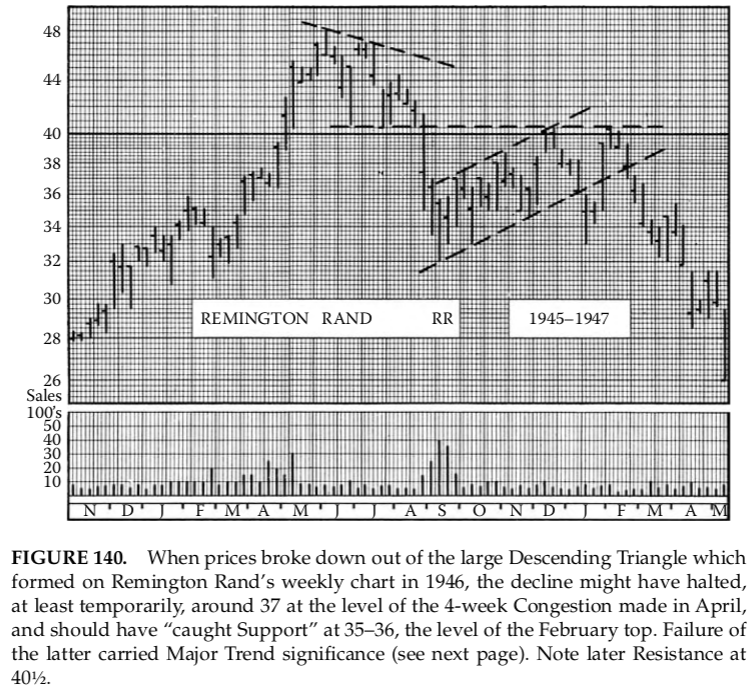

**FIGURE 140.** When prices broke down out of the large Descending Triangle which
formed on Remington Rand’s weekly chart in 1946, the decline might have halted,
at least temporarily, around 37 at the level of the 4-week Congestion made in April,
and should have “caught Support” at 35–36, the level of the February top. Failure of
the latter carried Major Trend significance (see next page). Note later Resistance at
40 ½.


##### Popular Misconceptions


The reader will understand, of course, that all we have said here about the
breaking of Supports applies, as well, but in reverse direction, to the pene-
tration of Resistance Levels. One more point may well be mentioned before
we leave this subject. If you happen to have spent much time in boardrooms,
you will have noticed that the concepts of Support and Resistance that are
prevalent there are somewhat different from those outlined in this chapter.
For example, if X has advanced to 62, reacted to 57, then pushed on to 68,
many traders will speak of 57 as being the Support Level, presumably
because that was the last price at which X was supported in sufficient
strength to turn its trend from down to up. We, however, as you have seen,
would name the vicinity of 62 as the Support Range. The distinction is
important to grasp, and sometimes extremely important in practical results.
Admittedly, it does not come easy to think of a former Top as denoting
the level at which a later Bottom should form, or vice versa; it would seem
superficially to be much more logical to relate Top to Top and Bottom to
Bottom. Moreover, it is perfectly true, to use our X example again, that some
of the investors who wanted to buy it at 57 might not have succeeded in
getting it before the second advance to 68 took it away, and that their buy
orders might still stand at 57 or might be reentered on any return to that
price. Nevertheless, there is certainly no assurance that such is the case; there
is no “vested interest” in X at 57 that will “automatically” bring in new
buying. On the other hand, we have seen how there is a sort of vested interest
set up at an old Bottom which produces selling (Resistance), and thereby
creates a new Top, and at an old Top which produces buying (Support) and
thereby creates a new Bottom.

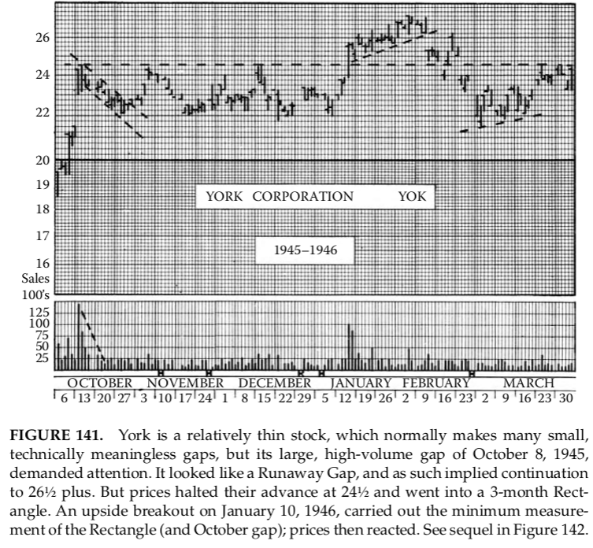

**FIGURE 141.** York is a relatively thin stock, which normally makes many small,
technically meaningless gaps, but its large, high-volume gap of October 8, 1945,
demanded attention. It looked like a Runaway Gap, and as such implied continuation
to 26½ plus. But prices halted their advance at 24½ and went into a 3-month Rect-
angle. An upside breakout on January 10, 1946, carried out the minimum measure-
ment of the Rectangle (and October gap); prices then reacted. See sequel in Figure 142.


The reader is urged to keep this concept well in mind. Any analytical
study of the chart records will quickly show that it is much easier for prices
to push up through a former Top level than through the Resistance set up
at a previous volume Bottom (and vice versa, of course, with respect to
declines). You will find that a little selling may come in at a former high, but
usually only enough to cause a brief halt rather than the more or less exten-
sive reactions or Consolidations that develop when the trend comes up
against a real Resistance Zone.


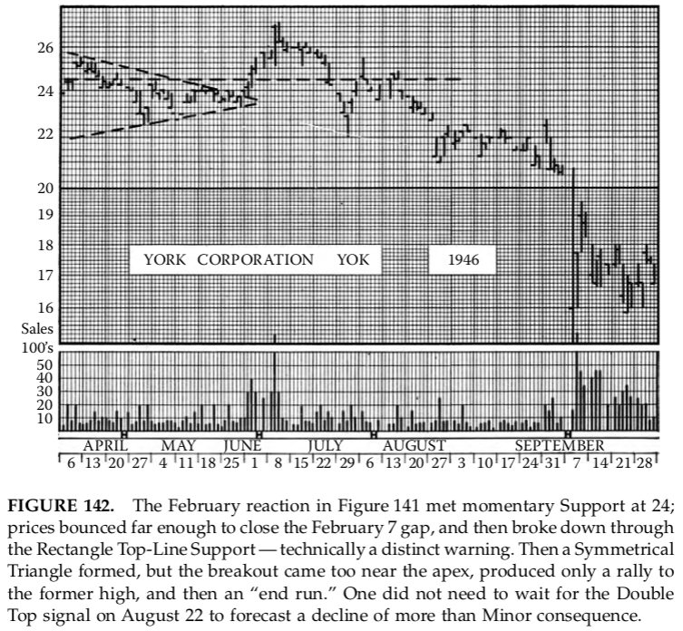

**FIGURE 142.** The February reaction in Figure 141 met momentary Support at 24;
prices bounced far enough to close the February 7 gap, and then broke down through
the Rectangle Top-Line Support — technically a distinct warning. Then a Symmetrical
Triangle formed, but the breakout came too near the apex, produced only a rally to
the former high, and then an “end run.” One did not need to wait for the Double
Top signal on August 22 to forecast a decline of more than Minor consequence.


##### The Round Figures

There are certain other levels that may, at times, evidently produce consid-
erable Resistance or Support without any reference to a previous “vested
interest.” We have in mind the “round” Figures 20, 30, 50, 75, 100, etc. In
setting a goal for taking profits when we buy a stock, it is natural for us to
think in terms of such round prices. If a low-priced stock has advanced
steadily from around 10, it is pretty certain on this account to meet with
profit-taking sales at 20, _especially if that figure represents a new high for it for
several years_. In fact, any time an issue gets out into new all-time high ground,
where there is nothing in its chart history to indicate otherwise, it is a fairly
safe bet that Resistance will appear at the round figures. In old and actively
traded stocks, such as U.S. Steel _(EN: Or IBM and GE)_ , the round figures
diminish in importance.

##### Repeating Historical Levels


If, once they had been set up, important Support and Resistance Levels
always “worked,” we should see Intermediate Tops and Bottoms form at
exactly the same ranges year after year in one Bull and Bear cycle after
another. As a matter of fact, there is a well-marked tendency for this to occur
in old-line, actively traded stock. In General Electric, for example, the 22–24,
34–35, 40–42, and 48–50 zones have been characterized by large turnover
(and, consequently, by many Intermediate Reversals of trend), throughout
the 1920s to 1950s. In Southern Pacific, there are historical Support and
Resistance Zones at 21–22, 28–30, 38–40, and 55–56. In U.S. Steel, 42–45,
55–58, 69–72, 78–80, and 93–96 are conspicuously marked as Reversal
Ranges. And many other stocks might be cited. _EN9: While the particular stocks
are dead or transmogrified the principle is alive and well._
Over long periods, however, such Support and Resistance Levels do tend
to be gradually modified, broadened, or “blurred,” and new ones created.
One source of many important new Supply Zones is a Bear Market Panic.
For this is the one type of decline that can be counted on to pay no heed
whatever to previous underlying Support Zones. Panics (which, as we have
seen in our earlier study of Primary Swings in connection with Dow Theory,
typify the second phase of Bear Markets), once they get under way, seem to
sweep away all potential Support in their calamitous plunges until they
exhaust themselves in a general market Selling Climax. And that climax may
or may not come at a level that bears a relation to some previously estab-
lished Support. To use U.S. Steel again as an example, the 1937 Panic Decline
took the stock down through its 93–96 range, hesitated briefly at the 78–80
level, and then plunged through 69–72 and 55–58 to stop just above 50. In
the 1946 Panic, X again broke swiftly through 78–80 and 69–72 to halt at 66.
When there is a large turnover at a Panic Bottom in any given stock, that
level acquires a strong “vested interest” for the future, and will usually
furnish conspicuous Resistance to a subsequent advance (after another Bear
Market Decline has taken quotations below the Panic Level).
This discussion of Panics brings us back to a consideration of Support
and Resistance performance at other stages of the Primary Trend — a matter
on which we stated early in this chapter we should have more to say. Bearing
in mind the relation of Resistance to volume, it is easy to see why in a long
drawn out, but otherwise typical Bear Swing, in which trading interest
diminishes to a very low ebb as the final low is approached, the next to the
last Intermediate Bottom may produce relatively little supply, and conse-
quently, only a small reaction when the new uptrend reaches its level. Add
to this the fact that many of the buyers in the last stages of a Major Decline
are deliberate scale-down investors who fully expect prices will go lower
and, hence, are not easily shaken out. The slow progress so often seen in the
first part of a new Primary Bull Market is due not so much to overhead
Resistance as to lack of impatient public bidding.
The Recovery Trends that follow precipitous Bear Market Panics usually
exhaust themselves, for obvious reasons, long before they get back up to the
last Resistance Level left behind in that Primary Downswing (which is usu-
ally the Bottom of the first Intermediate Decline from the extreme Top of the


_Chapter thirteen: Support and Resistance 247_

cycle), but they often meet supply at a lower Resistance Zone set up _in the
preceding Bull Market_. Look way back on your charts, therefore, when sizing
up the prospective advance in such situations.
A further thought along that line is: there is no law that requires an
advancing trend to keep right on climbing until it reaches a distant overhead
Supply Zone. It is true, as a corollary which we have already mentioned to
our Support and Resistance Theory, that prices can and do rise easily through
a price range where no Bottoms or Congestion Areas have formed in previ-
ous downtrends, but if the first established Resistance Level is a long ways
above, the advance may exhaust itself before it gets there. Heavy supply _may_
come in for other reasons at a lower level. Think, then, of a distant Resistance
Level as a maximum possibility rather than as a certain goal. However,
between two stocks whose purchase you are considering, you should select
the one which, other things being equal, has the “thinner” track overhead,
can rise farther before it encounters a charted Supply Zone.

##### Pattern Resistance

We can revert now to some of the Minor phenomena discussed in connection
with Reversal and Consolidation Patterns in earlier chapters. Take gaps, for
instance. You will now see why it is easy and, hence, quite in order for a
reaction that comes soon after a gap has been made to slip back and close
that gap. There is no “vested interest” whatever in the range through which
prices skipped to form the gap on the chart. You will also see why such a
reaction may stop short and reverse as soon as it has closed the gap, _provided_
there was a high-volume turnover in the price range immediately preceding
the gap. Such is usually the case with a Breakaway Gap.
Any gap, for the same reason, is easy to close once a reaction starts prices
moving back in that direction, if it is not too far away and if there are no
intervening Resistance Levels to stop the reaction before it gets there. In the
case of a Runaway Gap, however, there is no reason why a reaction should
halt as soon as it has covered the gap range; on the contrary, it will probably
continue on through the “thin” price track that preceded the gap.
Pullbacks and Throwbacks — the quick return moves which we noted
as developing so often shortly after a breakout from a Head-and-Shoulders
or other Area Pattern — exemplify the principles of Support and Resistance.
When prices break down, for example, out of a Descending Triangle, the
horizontal lower boundary of the formation, which was originally a Demand
Line, promptly reverses its role and becomes a Resistance Level. Any attempt
to put prices back up through it, therefore, after a decisive breakout, is
stopped by supply at or near the line. By the same token, the neckline of a
Head-and-Shoulders Top, which was a Demand Line, becomes a Resistance
Level after it has been broken. The Top or Supply Line of a Rectangle becomes
a Support after prices have pushed above it on volume and by a decisive
margin.


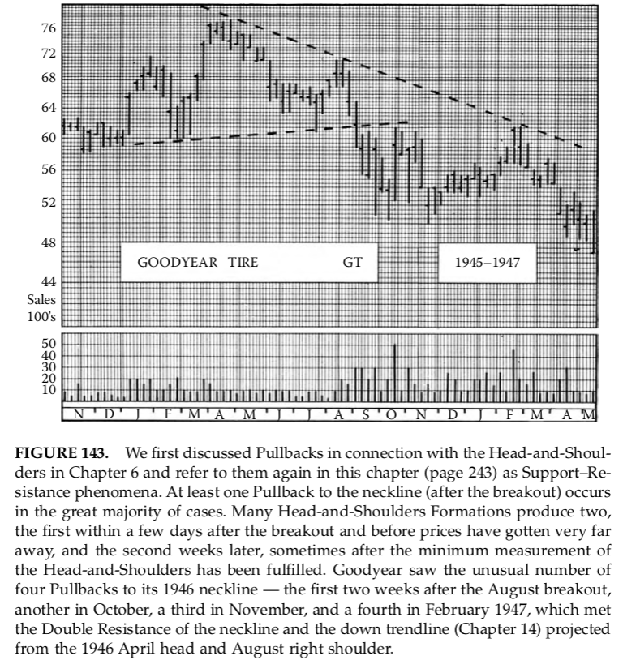

**FIGURE 143.** We first discussed Pullbacks in connection with the Head-and-Shoul-
ders in Chapter 6 and refer to them again in this chapter (page 243) as Support–Re-
sistance phenomena. At least one Pullback to the neckline (after the breakout) occurs
in the great majority of cases. Many Head-and-Shoulders Formations produce two,
the first within a few days after the breakout and before prices have gotten very far
away, and the second weeks later, sometimes after the minimum measurement of
the Head-and-Shoulders has been fulfilled. Goodyear saw the unusual number of
four Pullbacks to its 1946 neckline — the first two weeks after the August breakout,
another in October, a third in November, and a fourth in February 1947, which met
the Double Resistance of the neckline and the down trendline (Chapter 14) projected
from the 1946 April head and August right shoulder.


Earlier in this chapter, in our discussion of the three criteria for apprais-
ing the amount of Resistance to be expected at a former Bottom level, we
named “distance away” as one of them and stated as a general rule that
prices should have gone at least 10% beyond that level in a medium-priced
stock before much Resistance would be set up. This 10%-away rule does not
apply, however, in the case of a Throwback to a well-defined area formation,
when it follows shortly after a breakout. All that is necessary to establish
strong Resistance to such moves at the pattern boundary is a conclusive
breakout.

The Symmetrical Triangle has a different sort of Support and Resistance
“field.” You will recall that the first Reversal point in the formation of a
Symmetrical Triangle (a Top, if it forms on a rising trend, or a Bottom if on
a decline) is normally accompanied by high trading volume, but that activity
diminishes rapidly on succeeding fluctuations within its converging bound-
aries. Consequently, once prices have broken out of the Triangle and have
proceeded well beyond the level of the pattern’s first Reversal point, that
level, because of the volume of shares traded there, becomes a Support (or
Resistance) against a subsequent reaction. But, if the breakout move does
not carry beyond the Triangle’s first Reversal Level by a clear margin, any
Throwback will probably bring quotations back to the extended (sloping)
pattern boundary, and if the reaction does not occur until the trend has
worked out to or beyond the Triangle’s apex, then the Throwback usually
will not meet Support (or Resistance) until it has carried back to the level of
the apex. The apex, in brief, represents the concentration level or _axis_ of the
Triangle’s Support and Resistance.

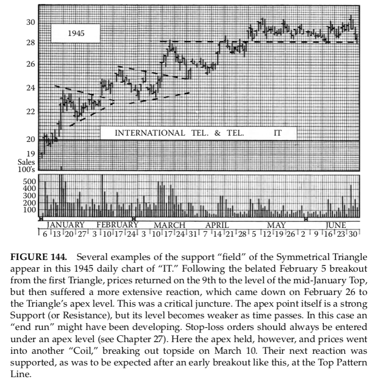

**FIGURE 144.** Several examples of the support “field” of the Symmetrical Triangle
appear in this 1945 daily chart of “IT.” Following the belated February 5 breakout
from the first Triangle, prices returned on the 9th to the level of the mid-January Top,
but then suffered a more extensive reaction, which came down on February 26 to
the Triangle’s apex level. This was a critical juncture. The apex point itself is a strong
Support (or Resistance), but its level becomes weaker as time passes. In this case an
“end run” might have been developing. Stop-loss orders should always be entered
under an apex level (see Chapter 27). Here the apex held, however, and prices went
into another “Coil,” breaking out topside on March 10. Their next reaction was
supported, as was to be expected after an early breakout like this, at the Top Pattern
Line.


The price track from mid-March to the end of April fell into an Ascending Triangle
Pattern, the top boundary of which functioned as Support in June but was broken
in July. Refer back to Figure 120, page 204.

The intersection of the two converting boundary lines of a Symmetrical
Triangle has sometimes been called a “cradle.” The axis Support (or Resis-
tance) is strongest near the cradle point and gets weaker as the axis line
(apex level) is extended out to the right on the chart (i.e., as time passes).
Thus, if a late breakout move fails to carry prices very far from the Triangle
area, and the trend then peters out, flattens, and begins to react _after_ the
cradle point has been passed in terms of time, its action, as it reaches the
axis line, must be closely watched. (A stop-loss order may be indicated here.)
Should the axis Support fail to hold, the reaction may plunge through and
accelerate in a more extensive swing, which has aptly been termed an “end
run around the line.”


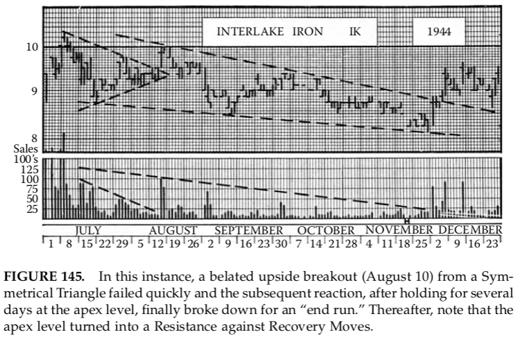

**FIGURE 145.** In this instance, a belated upside breakout (August 10) from a Sym-
metrical Triangle failed quickly and the subsequent reaction, after holding for several
days at the apex level, finally broke down for an “end run.” Thereafter, note that the
apex level turned into a Resistance against Recovery Moves.


##### Volume on Breaks Through Support

On those occasions when prices fail to retreat when they hit a Resistance (or
Support) Range, but, after perhaps holding there for several days, push on
through, there is nearly always a sudden acceleration and a marked pickup
in volume. This may be taken as confirmatory evidence of a decisive break
and, consequently, an indication that the move will carry on. The reasons
for this volume increase are obscure. Some say, “It takes volume to overcome
Resistance,” which is true enough, but the volume usually comes _after_ the
Resistance has been penetrated. Therefore, others say, “The volume is evi-
dence that technicians see what has happened and are now jumping in.” But
that line of thought, in the authors’ opinions, also has little to substantiate
it. (We shall have more to say about the questionable influence of technicians
on the trend later on.) Many of the arguments over volume change vs. price
change savor of the old hen-or-egg riddle. In any event, causes for many
technical phenomena, such as this one, may be left to the academicians,
provided the practical implications are clear.


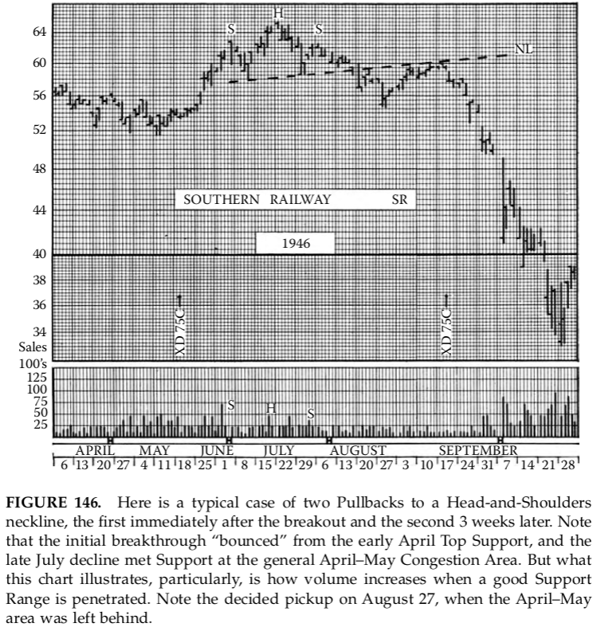

**FIGURE 146.** Here is a typical case of two Pullbacks to a Head-and-Shoulders
neckline, the first immediately after the breakout and the second 3 weeks later. Note
that the initial breakthrough “bounced” from the early April Top Support, and the
late July decline met Support at the general April–May Congestion Area. But what
this chart illustrates, particularly, is how volume increases when a good Support
Range is penetrated. Note the decided pickup on August 27, when the April–May
area was left behind.

##### Support and Resistance in the Averages

As has been the case with nearly every other technical phenomenon we have
studied, the principles of Support and Resistance apply, with suitable allow-
ances, to Averages as well as to individual stocks. Since an Average reflects
the combined charts of the majority of the issues that compose it, but with
a minority of them frequently evincing quite divergent patterns, it follows
naturally that Support and Resistance Zones in the Averages cannot be as
sharply and narrowly construed. Minor Tops and Bottoms in the Averages,
particularly, are less dependable as Resistance Levels. Clearly defined and
important Intermediate Reversals, however, since they nearly always repre-
sent Reversals in the entire market (practically all stocks), will normally
produce strong Resistance (or Support, as the case may be) in the subsequent
Average Trend.

When the Averages break down through a Support Level, but one or
more stocks, at the same time, hold firm at or above their corresponding
individual Supports, there is a presumption that those particular stocks are
in a stronger position than others to participate in the next recovery. The
phrase “other things being equal” should be added, however, for there are
qualifications to this presumption which must be considered. For instance,
it may be that the stock that has resisted decline will, for that very reason,
be less attractive to new buyers than one which broke drastically and is,
therefore, now purchasable at a more “attractive” price.
Many of the claims made regarding future prospects for stocks that have,
by one criterion or other, previously evinced “better-than-Average” or
“worse-than-Average” market performance permit argument either way. It
is safest to treat all such relative performance indications as only one minor
factor to be appraised in the overall chart picture.


## Chapter 14. Trendlines and Channels

One of our basic tenets in this system of technical stock chart analysis —
indeed, a fact which any neophyte can quickly verify for himself by inspec-
tion of the market records for whatever period he chooses — is that _prices
move in trends_. The market in general, and the many stocks which compose
it, do not jump up and down in an altogether random fashion; on the
contrary, they show definite organization and pattern in their charted course.
Prices move in trends. These trends may be either up or down or side-
ways (horizontal). They may be brief or of long duration. They may be
classified as Major (Primary), Intermediate (Secondary), or Minor, according
to the rules of Dow Theory, or as Horizontal Line Formations. (The distinc-
tion between a short Intermediate and an extended Minor Trend is often
more difficult to make with individual stocks than it is with the Averages,
but it is not so important.) But sooner or later, trends change; they may
change by reversing from up to down or down to up, and they may also
change direction without reversing as, for example, from up to sideways
and then perhaps to up again, or from a moderate slope to a steep slope,
and vice versa.
Profits are made by capitalizing on up or downtrends, by following them
until they are reversed. The investor’s problem is to recognize a profitable
trend at the earliest possible stage of its development and then later to detect,
again as quickly as possible, its end and Reversal. The Reversal of any
important trend is usually characterized, as we have already seen, by the
construction of some sort of joint price and volume pattern — in brief, of a
Reversal Formation.

## The Trendline

All of the foregoing statements regarding trends have been expressed or
implied in earlier chapters of this text. It is our purpose now to examine
trends, as such, more closely, to see how they may be plotted most effectively
on the charts, and determine to what extent they can be used to reinforce or
supplement the technical forecasts derived from our other chart formation
and Support–Resistance studies — sometimes to furnish even earlier fore-
casts or warnings of change.

One of the first discoveries a new student is likely to make when he
begins to inspect stock charts with a critical eye is that nearly all Minor and
most Intermediate Trends follow nearly straight lines. A few readers will,
perhaps, dismiss this as perfectly natural, something to be taken for granted.
But the majority become increasingly amazed and excited as they delve
deeper. Not only the smaller fluctuations, but, frequently, also the great
Primary Swings of several years’ duration appear on the charts as though
their courses had been plotted with a straight-edge ruler. This phenomenon
is, in truth, the most fascinating, impressive, and mysterious of all that the
stock charts exhibit.
If we actually apply a ruler to a number of charted price trends, we
quickly discover that the line which most often is really straight in an uptrend
is a line connecting the lower extremes of the Minor Recessions within those
trends. In other words, an advancing wave in the stock market is composed
of a series of ripples, and the Bottoms of each of these ripples tend to form
on, or very close to, an upward slanting straight line. The Tops of the ripples
are usually less even; sometimes, they also can be defined by a straight line,
but more often, they vary slightly in amplitude, and so any line connecting
their upper tips would be more or less crooked.
On a Descending Price Trend, the line most likely to be straight is the
one that connects the _Tops_ of the Minor Rallies within it, while the Minor
Bottoms may or may not fall along a straight edge.

These two lines — the one that slants up along the successive wave
Bottoms within a broad up-move and the one that slants down across suc-
cessive wave Tops within a broad down-move — are the basic trendlines.
It is unfortunate that a more distinctive name for them has never been
devised than the threadbare word “line,” which has so many other uses and
connotations. A few analysts have called them “tangents,” a term that has
the advantage of novelty, but, because it is a distinct perversion of the true
meaning of the word _tangent_ , confuses many readers even more. Perhaps
tangent will eventually become established in this new sense. However, we
shall be satisfied herein with the overworked “line,” but can give it some
distinctiveness in its present context by joining it to trend in the one word
“trendline.”

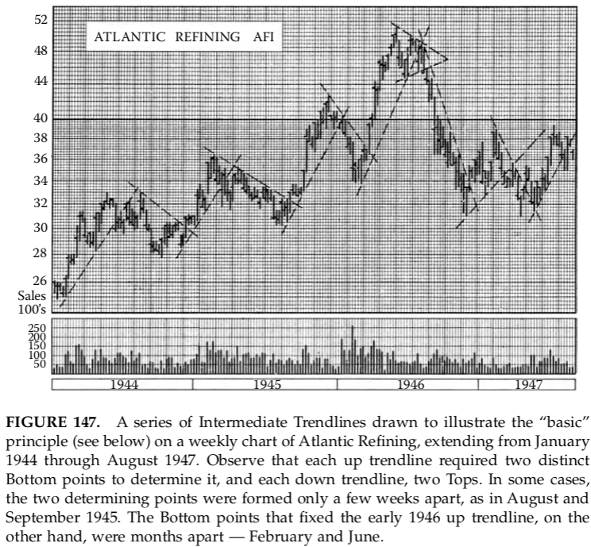

**FIGURE 147.** A series of Intermediate Trendlines drawn to illustrate the “basic”
principle (see below) on a weekly chart of Atlantic Refining, extending from January
1944 through August 1947. Observe that each up trendline required two distinct
Bottom points to determine it, and each down trendline, two Tops. In some cases,
the two determining points were formed only a few weeks apart, as in August and
September 1945. The Bottom points that fixed the early 1946 up trendline, on the
other hand, were months apart — February and June.
Many other experimental lines might have been drawn on this chart originally,
including several uptrends whose Intermediate authority was questionable because
they were “too steep” — as in early 1944, late 1945, and early 1946.
Only final trendlines are shown here.
There are here also some interesting examples of Pullbacks (after trendline pene-
tration) which are discussed on the following pages. Note July 1944, April 1945,
September 1945, and May 1947.


Trendlines, you may have heard it said, “are made to be broken,” but
that is one of those exasperatingly sententious remarks which fails to clarify
anything. Of course they are broken; they are all always broken, ultimately,
and some very shortly after they are set up. The problem is to decide which
breaks (i.e., penetrations by a price movement) are of important technical
significance and which are of no practical consequence, requiring possibly
only a Minor Correction in the drawing of the original trendline. There are
no 100% certain, quick answers to this problem; the significance of some
penetrations cannot be determined as soon as they appear, but must await
confirmatory indications from other chart developments. In a great majority
of instances, however, an important break — one that requires a prompt
review and possibly a revision of trading policy — is easy to recognize.


##### How Trendlines Are Drawn

But first, how are trendlines drawn? A straight line is mathematically deter-
mined by any two points along it. In order to draw a trendline, therefore,
we require two determining points — two established Top Reversal points
to fix a Down Trendline and two established Bottom Reversal points to fix
an Up Trendline. The principle here is the same as the one we laid down in
our specifications for drawing Triangle boundary lines in Chapter 8. The fact
is that boundary lines of Triangles and Rectangles, as well as necklines of
Head-and-Shoulders Formations, are simply special types of trendlines.

Suppose we start with a Major Bottom point and describe how a series
of Up Trendlines might develop therefrom. To make this first illustration
simple, let us assume that the Bear Market Bottom in our stock consisted of
a Rectangle area between 6½ and 8, and that the last move in this formation
arose from the 6½ level, broke through the pattern’s Top at 8, and proceeded
to 9. From 9, prices reacted to 8 and then headed back up again. As soon as
this last rally had gone far enough to leave the dip to 8 showing in the clear
as a Minor Bottom, we could draw our first Up Trendline because we then
had two Bottom points, the second (8) higher than the first (6½), to fix its
slope. This would be a Minor Up Trendline. We would rule it in lightly on
our chart in pencil, and extend it on up and ahead for, perhaps, a week or
more. (It will help you to visualize our example if you sketch it on a scrap
of chart paper.)
To proceed, suppose prices push up to 10, then move sideways for a few
days, or dip slightly, until they have approached and touched, once more,
our extended Minor Trendline. Then they start to move up in a third advance,
but run into supply again without making much progress, quickly make a
fourth contact with the trendline, hesitate, and then break down through it.
If prices now close clearly below the line, and if, in addition, there has been
some pickup in trading volume evident on the penetration, we may conclude
that our first Minor Trend is completed, and that our stock either will build
some sort of Consolidation Pattern before it stages another advance, or will
suffer a more extensive “Correction” than any of the brief dips it registered
during its first Minor Upswing.
The whole Minor Uptrend we have described as an example in the
foregoing paragraphs might well have run its course in 2 weeks, and our
first trendline would then have been very steep — too steep, obviously, to
hold for any very long period of time. Now, let us assume that a series of
downward fluctuations produces the more extensive correction which we
have foreseen as one probability following the trendline break, and that this
carries prices back to the Support Level set up at the Top of the original
Rectangle, i.e., at 8. (From our previous Support–Resistance studies, we
would recognize this as a prime “buy spot.”) Assuming that subsequent
developments pursue a normal course, prices should not linger long at 8,
but should start promptly on a new series of advancing fluctuations. As soon
as this becomes evident and the new Bottom at 8 is “in the clear,” we can
rule in a new trendline across the original base point at 6½ and the new
point at 8. This should be, and probably is, an _Intermediate_ Up Trendline
which will not be penetrated for several weeks, and maybe for several
months, until the Intermediate Advance tops out.

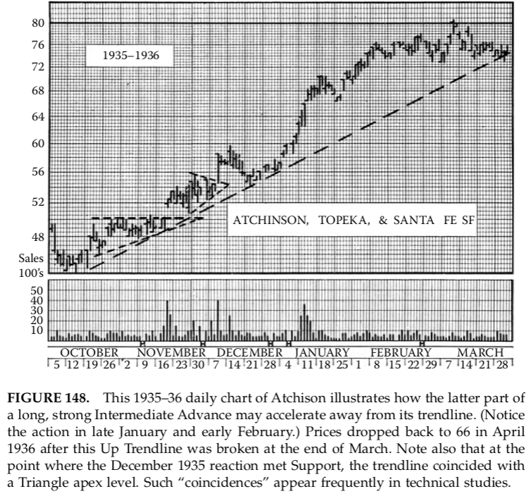

**FIGURE 148.** This 1935–36 daily chart of Atchison illustrates how the latter part of
a long, strong Intermediate Advance may accelerate away from its trendline. (Notice
the action in late January and early February.) Prices dropped back to 66 in April
1936 after this Up Trendline was broken at the end of March. Note also that at the
point where the December 1935 reaction met Support, the trendline coincided with
a Triangle apex level. Such “coincidences” appear frequently in technical studies.


Then, if that Intermediate Top takes the form of a Head-and-Shoulders
Reversal Pattern, our Intermediate Up Trendline may be broken by the
recession from the top of the head to the neckline. As a rule, however, the
final advance in a strong Intermediate Move accelerates far enough away
from the extended trendline to leave room (to the right on the chart) for
considerable pattern construction before the line is again touched and pen-
etrated. Hence, the actual puncturing of the trendline is more apt to occur
either on the decline from the right shoulder to the neckline, or at about the
same time as prices break down through the neckline to complete the Head-
and-Shoulders signal. It is surprising to see how often the two lines, neckline
and trendline, are broken _simultaneously_. In other instances, and there are
many of them also, in which the trendline is the first to be punctured, perhaps
shortly after prices turn down from the right shoulder, we do not have to
wait for a neckline break but can take action at once. Here is one type of
trendline indication which produces a working signal a little earlier, and
often at a much more favorable price level, than is given by the completion
of a Reversal Formation.


##### Arithmetic vs. Logarithmic Scale

By this time, the more mathematically inclined among our readers must have
begun to ponder the difference between trendlines projected on the ordinary
or arithmetic scale and on the logarithmic or ratio scale. A series of points
which fall on a perfectly straight, up-sloping line on arithmetic chart paper
will, when transferred to a semilogarithmic sheet, produce a curved line that
rises sharply at first and then gradually rounds over. And points which fall
on a straight line on a semilogarithmic sheet will produce an accelerating
curve on an arithmetic sheet, a line which slants up more and more steeply
the farther it is projected.
As a matter of fact, this variance is of little or no importance in defining
Minor Trends, since they seldom run far enough for the dissimilar charac-
teristics of the two types of scales to become effective. And the same holds
true for average Intermediate Moves of normal slope. But when it comes to
very long and strong Intermediates, the divergence may become marked,
may make a considerable difference in the time and level of ultimate
trendline penetration. Therein lies one of the strongest reasons for using
semilogarithmic paper in charting stocks for technical analysis. But let us
postpone further discussion of this point until we take up Major Trends, and
go on now with the Intermediate Lines which are much the same on either
type of scale. And, for the present, let us concentrate on Intermediate
_Uptrends_. (Intermediate Moves are emphasized rather than Minor for the
obvious reason that the latter are of little practical importance in either
trading or investing.)
To go back to first principles, and granting that price advances trend up
in more or less straight lines, it follows that if we can find and draw the lines
that accurately define those trends, they will serve two purposes, as follows:

1. When the trendline is broken (i.e., when prices drop down through
    it in decisive fashion), it signals that the advance has run out. It calls
    time for the intermediate-term trader to sell out that issue, and look
    for reinvestment opportunities elsewhere.
2. When a small Top Reversal Pattern forms on the chart of an issue
    well up and away from that issue’s Intermediate Up Trendline, so
    that there apparently is room for the downside implications of the
    Reversal Formations to be carried out _before_ the trendline is violated,
    then the intermediate-trend trader may well decide to ignore the
    small Reversal Pattern. He can hold on so long as the trendline holds.

The advantages of the first-named trendline function are obvious. Those
of the second, though less obvious to the inexperienced, are equally impor-
tant to the investor who has learned that it is an expensive practice to switch
out of every holding as soon as it shows evidence of a Minor Setback,
provided the chance of further Intermediate Advance still exists.
To accomplish these purposes it is necessary, as we have said, to find
and draw the line that accurately defines the Intermediate Trend, and then
to recognize when that line has been broken in decisive fashion. Our earlier
quick review of how a trendline is constructed did not attempt to cover these
points thoroughly.

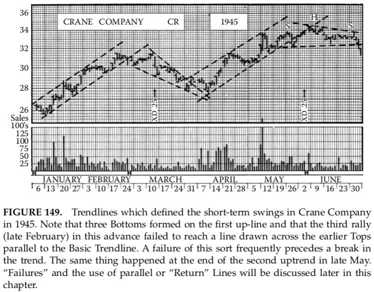

**FIGURE 149.** Trendlines which defined the short-term swings in Crane Company
in 1945. Note that three Bottoms formed on the first up-line and that the third rally
(late February) in this advance failed to reach a line drawn across the earlier Tops
parallel to the Basic Trendline. A failure of this sort frequently precedes a break in
the trend. The same thing happened at the end of the second uptrend in late May.
“Failures” and the use of parallel or “Return” Lines will be discussed later in this
chapter.
The downtrend in March assumed Wedge form. Observe how the April 6 reaction
met Support at its previously penetrated Top line. In June, a rally met Resistance at
the previously broken Up Trendline. Such Pullbacks are common. The small Complex
Head-and-Shoulders in June was never completed, since prices did not break down
out of it by the required margin.


##### Tests of Authority

Here are some of the tests which may be applied to judge the technical
validity, the authority, of an Up Trendline:


- **A**. The greater the number of Bottoms that have developed at (or very
near) a trendline in the course of a series of Minor Up Waves, the
greater the importance of that line in the technical sense. With each
successive “test,” the significance of the line is increased. A first and
tentative Up Trendline can be drawn as soon as two Bottoms have
formed, the second higher than the first, but if prices move back to
that line a third time, make a third Bottom there and start a renewed
advance, then the validity of that line as a true definition of the trend
has been confirmed by the action of the market. Should a fourth
Bottom later form on it, and prices move up away from it again, its
value as a trend criterion is very considerably enhanced, etc.

- **B**. The length of the line, i.e., the longer it has held without being
penetrated downside by prices, the greater its technical significance.
This principle, however, requires some qualification. If your trendline
is drawn from two original Bottoms which are very close together in
time — say, less than a week apart — it is subject to error; it may be
too steep or (more often) too flat. If the latter, prices may move away
from it and stay high above it for a long time; they may then turn
down and have declined well along in an Intermediate Correction
before the trendline thus drawn is reached. But if the trendline has
been drawn from Bottoms which are far enough apart to have devel-
oped as independent wave components of the trend you are trying
to define, with a good rally and “open water” between them, then it
is more apt to be the true trendline. Greater weight should be given
to the number of Bottoms that have formed on a trendline (Test 1)
than to its length alone (Test 2).

- **C**. The angle of the trendline (to the horizontal) is also, to some degree,
a criterion of its validity as a true delimiter of Intermediate Trend. A
very steep line can easily be broken by a brief sideways Consolidation
move — as, for example, by a compact Flag forming on an advance
of the “mast” type — only to have prices shoot up again in another
extensive advance. Such steep lines are of little forecasting value to
the technician. The flatter, more nearly horizontal the trendline, the
more important it is technically and, in consequence, the greater the
significance of any downside break through it.

But “steep,” as applied to stock trends, is a relative term, and one which,
we must frankly confess, defies exact definition. Experience, which can only
be gained by studying many charts and by actually building and working
with them over a period of many months, brings an almost intuitive ability
to distinguish between a trendline which is “too steep to hold” and one
whose angle of rise is reasonable and should be maintained until such time
as the trend is actually reversed from Intermediate Up to Intermediate Down.
Trend slopes will vary from stock to stock according to their characteristic
market habits. They will vary also according to the stages of the Primary
Cycle — tending to become somewhat steeper in its later phases. The more
chart history you have on any particular issue in which you are interested,
the better able you will be to judge its present trend.
(The foregoing statement, we might remark, applies to the interpretation
of most other technical patterns and phenomena as well as to trendlines.)


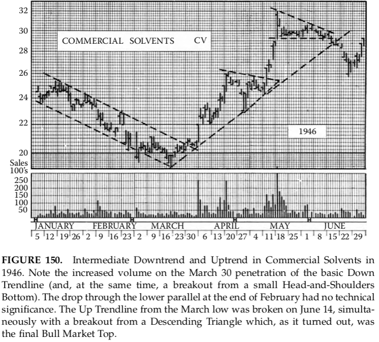

**FIGURE 150.** Intermediate Downtrend and Uptrend in Commercial Solvents in
1946. Note the increased volume on the March 30 penetration of the basic Down
Trendline (and, at the same time, a breakout from a small Head-and-Shoulders
Bottom). The drop through the lower parallel at the end of February had no technical
significance. The Up Trendline from the March low was broken on June 14, simulta-
neously with a breakout from a Descending Triangle which, as it turned out, was
the final Bull Market Top.


One clue to relative steepness is afforded to those who employ the
TEKNIPLAT semilogarithmic chart sheet, which has been used for most of
the illustrations in this book. When projected on this scale, Intermediate
Uptrends on the daily charts, in the great majority of issues selling in the
10 to 50 range, rise at an angle of approximately 30 degrees to the horizontal.
Some will be a trifle flatter, some a trifle steeper, but it is surprising to see
how often the trendline falls very close to the 30-degree slope in stocks of
average volatility and activity. Thin, highly speculative issues and heavy
investment stocks offer exceptions, the former usually steeper and the latter
flatter. The semilogarithmic scale has the virtue, of course, of reducing all
movements, regardless of price level, to a ratio or percentage basis. On a
straight arithmetic scale, the trendline will ordinarily be steeper on a stock
trading in the 50 range, for example, than on an issue selling around 15.
On weekly charts employing the same price scale, the angle of Interme-
diate Advance will, of course, be much steeper than on the daily plotting.
Different scaling will produce different angles. It is pure happenstance that
the TEKNIPLAT sheets tend to produce the 30-degree ascending line.


##### Validity of Penetration

We have these three criteria, then, for appraising the authority or accuracy
of an Intermediate Up Trendline: (1) the number of times it has been “tested”
or contacted without breaking, (2) its length or duration, and (3) its angle of
ascent. Given a trendline which, by the application of one or more of these
criteria (preferably by at least two of them), appears to be a reasonably
accurate delimiter of the trend, our next problem is to determine when it
has been finally and definitely broken.
Again, we can set up three tests or criteria, two of which are practically
identical with the rules laid down in earlier chapters for determining decisive
breakouts from Reversal or Consolidation Formations. The first is _extent of
penetration_. To be decisive, prices must not only push through the line, but
close beyond it by a margin equal to about 3% of the stock’s price. This does
not need to be accomplished in a single day, although it often is. The 3%
penetration may come as a result of 2 or 3 days of gradual decline.
The second is _volume of trading_. We saw how activity should always be
expected to rise notably on a genuine upside breakout from an Area Pattern,
but need not increase to confirm a downside break. We have seen how, in
many cases, volume does not show much increase on the first day of down-
break from Descending Triangles, for example, but usually picks up rapidly
as the decline proceeds. In our present discussion, we are dealing with _Up_
Trendlines, and their penetration is, therefore, analogous to a downside
breakout. We should expect the same rules to apply, and in general, they do.
Given a close beyond the line by a price margin of 3%, it is not necessary
for volume to have expanded much at that point to confirm the validity of
the penetration.
The fact is, however, that the breaking of an Intermediate Up Trendline,
much more often than not, is attended by some visible intensification of
trading activity. To that extent, then, an increase in volume may be regarded
as confirmation of a decisive penetration. It is a particularly useful adjunct
in borderline cases. If, for example, prices start to decline from a point
somewhat above the trendline, move down through it on _conspicuously
expanding_ turnover, and close beyond it, say, only 2% of the price but at or
near the bottom of the day’s range, our 3% margin rule has not been satisfied,
but the lesser margin _plus_ the volume action may be construed as decisive.
Beware, however, and do not be stampeded into a hasty commitment
by the shakeout move which cracks down through a trendline with a great
flurry of activity — perhaps several minutes of late tape — and then turns
up again to close the day back above the trend or at least very close to it.
This may very well be — in fact, usually is — a false move so far as that
particular moment is concerned. But watch the next few days’ performance
very closely; the technical situation is evidently critical, else a shakeout could
not have been easily staged.


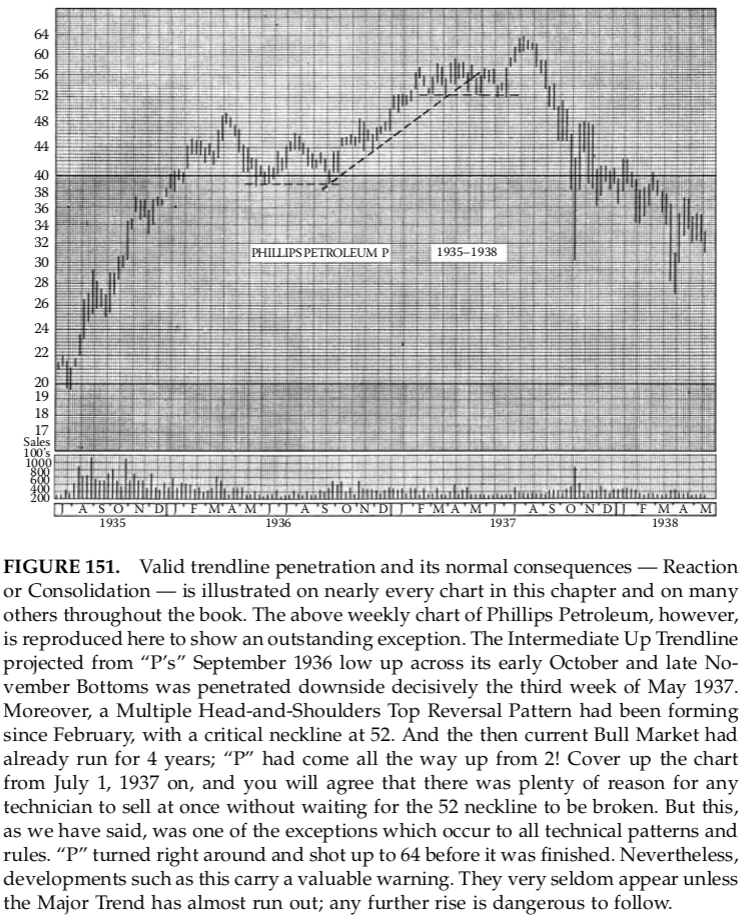

**FIGURE 151.** Valid trendline penetration and its normal consequences — Reaction
or Consolidation — is illustrated on nearly every chart in this chapter and on many
others throughout the book. The above weekly chart of Phillips Petroleum, however,
is reproduced here to show an outstanding exception. The Intermediate Up Trendline
projected from “P’s” September 1936 low up across its early October and late No-
vember Bottoms was penetrated downside decisively the third week of May 1937.
Moreover, a Multiple Head-and-Shoulders Top Reversal Pattern had been forming
since February, with a critical neckline at 52. And the then current Bull Market had
already run for 4 years; “P” had come all the way up from 2! Cover up the chart
from July 1, 1937 on, and you will agree that there was plenty of reason for any
technician to sell at once without waiting for the 52 neckline to be broken. But this,
as we have said, was one of the exceptions which occur to all technical patterns and
rules. “P” turned right around and shot up to 64 before it was finished. Nevertheless,
developments such as this carry a valuable warning. They very seldom appear unless
the Major Trend has almost run out; any further rise is dangerous to follow.


The third test is also one that applies particularly to breaks which are
borderline so far as margin of penetration is concerned. Suppose a stock
which is quoted in the neighborhood of 40 declines through a well-estab-
lished Intermediate Up Trendline and closes 1 or 1⅛ points below it — a
margin which is only slightly less than our specified 3% — without much,
if any, enlargement in trading volume. Suppose it fluctuates there for a day
or two in a dull and narrow market, and then starts to rally. If there is no
pickup in activity on this recovery move — if prices simply edge up feebly
to the underside of the trendline and tend to “round over” there without
being able to close clearly above it — then the situation is indeed critical,
and the slightest sign of renewed selling pressure may be taken as a signal
that the uptrend has been decisively broken.
Such a return move as we have described in the preceding paragraph is
known as a Throwback or Pullback. We have previously described analogous
developments which follow breakouts from Head-and-Shoulders and other
patterns, and will have more to say about them in connection with trendlines
later on.

The three tests we have been discussing, which help to establish the
validity of a trendline penetration, cannot, unfortunately, be applied inflex-
ibly and without a modicum of judgment. The majority of Intermediate
Trendlines can hardly be said to possess the precision of pattern boundary
lines, and even in the latter, some leeway must be allowed. There are excep-
tions, as we have taken occasion to remark several times before, to every
technical rule of price action. But judgment in the establishing of significant
trendlines and in interpreting their penetrations does come with experience.

##### Amendment of Trendlines

When a trendline is broken by a margin less than decisive, and prices sub-
sequently rally back up through it again, doubt naturally arises as to the
continued authority of the original line. Should it be discarded, revised, or
allowed to stand as is?
Here again, judgment and experience must be called into play, but a few
general principles are helpful in deciding. If the original trendlines depended
on only two points, i.e., on the first two Bottoms across which it was pro-
jected, and the indecisive penetration occurred when prices returned to it
for the third time, the line had better be redrawn across the original first and
the new third Bottoms. (Of course, you will not do this until prices have
moved up from the third Bottom point and it has become clearly established
as a Minor Bottom.) Or, you may find in such cases that a new line drawn
across the _second_ and third Bottoms works better; if the first Bottom was a
Reversal Day with its _closing_ level well above the low of its range, you may
find that this new line, when extended back, strikes just about at that closing
level.
If, on the other hand, the original trendline has been “tested” one or
more times after it was drawn — if, that is, a third and perhaps a fourth
Bottom have formed on it without penetrating it and have thus “confirmed”
it — then the subsequent indecisive penetration may be disregarded and the
original line considered to be still in effect.
An intraday break through an established trendline that, however, does
not result in prices closing beyond the line may be disregarded and the line
left as is. In fact, as has already been suggested, the closing prices frequently
make a better trendline than the extreme intraday lows of successive
Bottoms, and this is most apt to be true with “thin” stocks subject to erratic
swings. A bit of experimenting with different lines often pays. A thin, trans-
parent ruler is especially useful for trendline study.


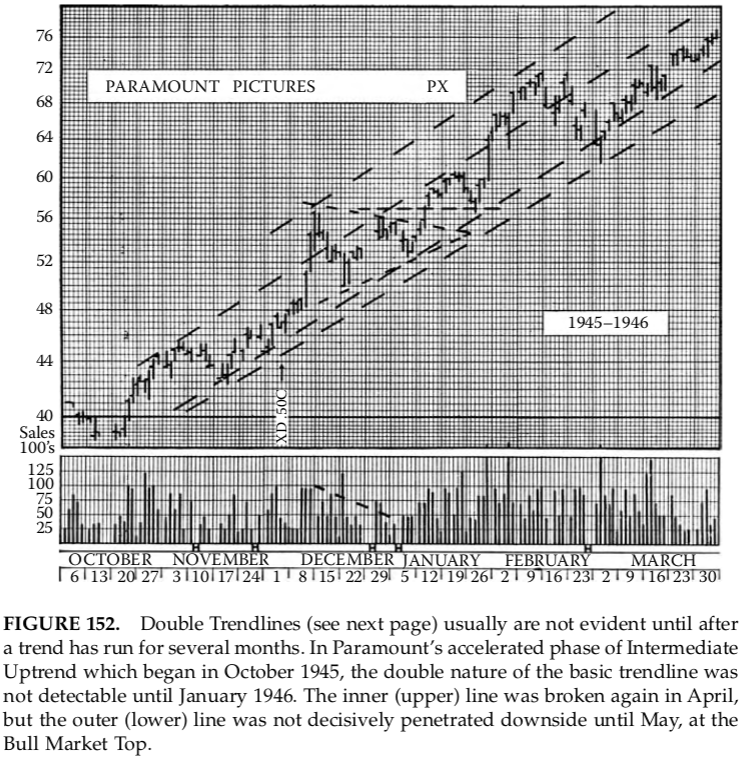

**FIGURE 152.** Double Trendlines (see next page) usually are not evident until after
a trend has run for several months. In Paramount’s accelerated phase of Intermediate
Uptrend which began in October 1945, the double nature of the basic trendline was
not detectable until January 1946. The inner (upper) line was broken again in April,
but the outer (lower) line was not decisively penetrated downside until May, at the
Bull Market Top.

There is another type of price action that may require redrawing a
trendline. Sometimes, after a line has been projected up across the first two
Minor Bottoms in an advancing trend, a third Minor Bottom will form, not
on that line, but well above it. In such cases, let the original line stand, but
draw in a new one across the second and third Bottom points, and watch
developments. If the rally from the third Bottom peters out quickly, and the
new trendline, as a consequence, is soon broken, then the original trendline
is probably the correct one. But, if the third Bottom turns out to be a “strong”
one, and the new line stands up well for several weeks (and if it was not,
patently, too steep to begin with), then the old line may be abandoned and
the new one regarded as the better trend definer.


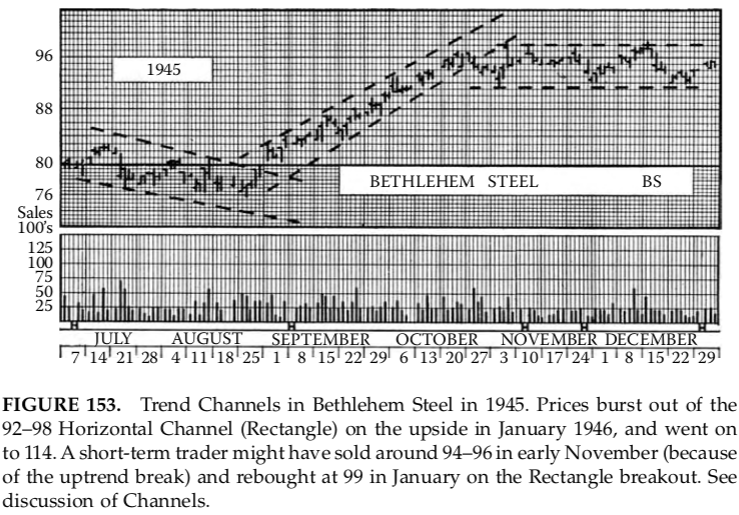

**FIGURE 153.** Trend Channels in Bethlehem Steel in 1945. Prices burst out of the
92–98 Horizontal Channel (Rectangle) on the upside in January 1946, and went on
to 114. A short-term trader might have sold around 94–96 in early November (because
of the uptrend break) and rebought at 99 in January on the Rectangle breakout. See
discussion of Channels.


##### Double Trendlines and Trend Ranges

In the course of your “cutting and trying” in an effort to fit a good line to
an Intermediate Uptrend, you may find that _two parallel lines_ , perhaps a point
or so apart in a stock selling in the thirties, will define the true trend pattern
much better than any single line that can be drawn. Sharp Bottoms and
shakeout thrusts in such cases will often fall along the outer or lower line,
while the duller, more rounded reactions will stop at or near the upper or
inner line. Or the two lines will mark off a _range_ somewhere within which
successive Minor Down Waves tend to halt and reverse.
Such Double Trendlines are really plentiful, although the majority of
chart technicians seem to be quite unaware of them. It pays to develop an
eye for them — to watch constantly for trends to which they can be applied.
They will clear up many situations in which attempts to find a single critical
line lead only to frustration and in finally giving up in disgust.
Trends that you find are best defined by Double Trendlines (or by a very
Broad Trendline, if you prefer) cannot be regarded as ended until the outer,
lower line has been decisively penetrated. In that connection, note what we
said at the beginning of this topic: sharp, shakeout Bottoms tend to fall on
the outer line. The recoveries from such Bottoms are usually just as sharp,
and prices, therefore, rally back above the upper, inner line quickly. Warning
of an impending break in the trend is given when prices come down to the
outer line steadily, rather than by the quick “shake” type of reaction, and


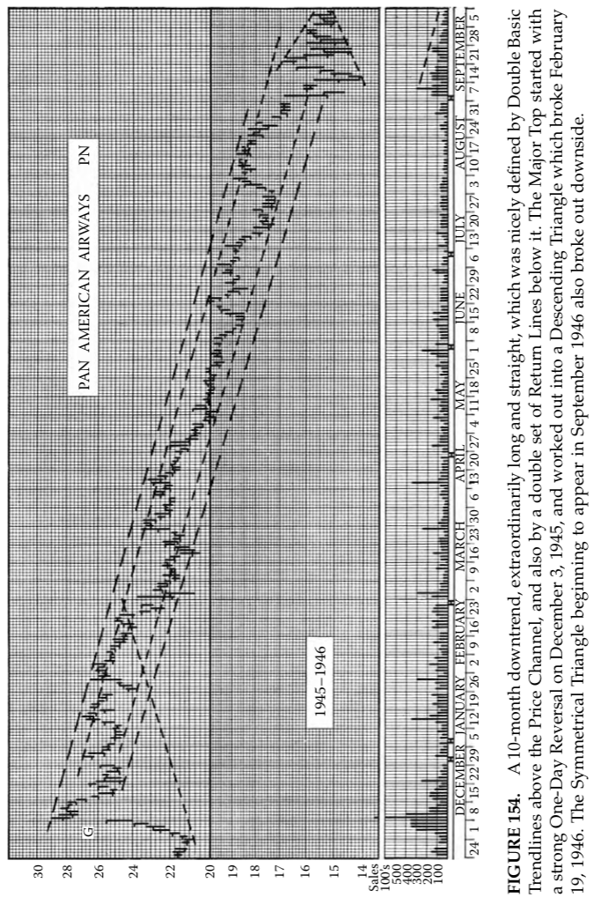

**FIGURE 154**. A 10-month downtrend, extraordinarily long and straight, which was nicely defined by Double Basic
Trendlines above the Price Channel, and also by a double set of Return Lines below it. The Major Top started with
a strong One-Day Reversal on December 3, 1945, and worked out into a Descending Triangle which broke February
19, 1946. The Symmetrical Triangle beginning to appear in September 1946 also broke out downside


##### Trend Channels

At the start of this trend study, we applied the term Basic Trendline to the
line which slopes up across the Wave Bottoms in an advance, and to the line
which slopes down across the Wave _Tops_ in a decline. And we noted that
the opposite Reversal Points, i.e., the wave crests in an advance and the wave
troughs in a decline, were, as a rule, less clearly delimited. That is one of the
reasons why all of our discussion up to this point has been devoted to Basic
Trendlines. Another reason is, of course, that the technician’s most urgent
task is to determine when a trend has run out, and for that purpose, the
Basic Line is all important.
In a fair share of normal trends, however, the Minor Waves are suffi-
ciently regular to be defined at their other extremes by another line. That is,
the _Tops_ of the rallies composing an Intermediate Advance sometimes
develop along a line which is approximately parallel to the Basic Trendline
projected along their Bottoms. This parallel might be called the _Return Line_ ,
since it marks the zone where reactions (return moves against the prevailing
trend) originate. The area between Basic Trendline and Return Line is the
_Trend Channel._
Nicely defined Trend Channels appear most often in actively traded
stocks of large outstanding issue — least often in the less popular and the
relatively thin equities which receive only sporadic attention from investors.
The value of the Trend Channel concept for the technical trader would hardly
seem to require extended comment here; its tactical utilization is discussed
in the second half of this book.
Its greatest utility, however, is not what usually appeals to the beginner
when he first makes its acquaintance, viz., the determination of good profit-
taking levels. Experienced technicians find it more helpful in a negative
sense. Thus, once a Trend Channel appears to have become well established,
any failure of a rally to reach the Return Line (top parallel of the channel in
an Intermediate Advance) is taken as a sign of deterioration in the trend.
Further, the margin by which a rally fails to reach the Return Line (before
turning down) frequently equals the margin by which the Basic Trendline
is penetrated by the ensuing decline before a halt or Throwback in the latter
occurs.
By the same token, given an established Trend Channel, when a reaction
from the Return Line fails to carry prices all the way back to the Basic
Trendline but bottoms out somewhere above it, the advance from that Bot-
tom will usually push up out of the channel on the top side (through the
Return Line) by a margin approximately equal to the margin by which the
reaction failed to reach the bottom of the channel (Basic Trendline).


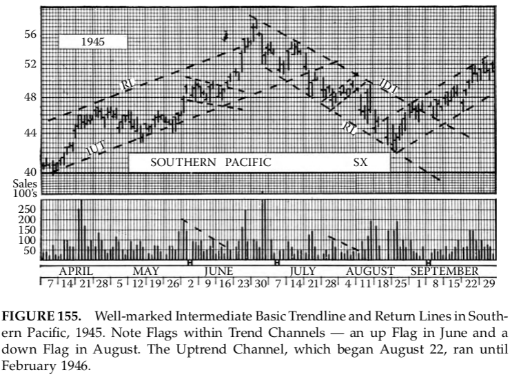

**FIGURE 155.** Well-marked Intermediate Basic Trendline and Return Lines in South-
ern Pacific, 1945. Note Flags within Trend Channels — an up Flag in June and a
down Flag in August. The Uptrend Channel, which began August 22, ran until
February 1946.


**FIGURE 156.** Note that the extent by which prices failed to come down to their
Return Line in late November measured the distance by which they advanced
through and above the Basic Down Trendline in early December. This rule is stated
on the preceding page.

##### Experimental Lines

Your experienced technician, in fact, is constantly drawing trendlines of all
sorts — Minor, Intermediate, and Major — on his charts. He will put them
in at first very lightly penciled wherever he can find an excuse to draw one.
Many will quickly prove to be of no significance, and those he may erase.
Others will “stand up” — will show evidence of technical authority — and
those he will make heavier, or color as suggested later on. He will be con-
stantly on the watch for Double Trendlines and will draw tentative Return
Lines to mark off possible channels at every opportunity. As soon as he has
what appears to be a Basic Up Trendline projected from two Bottoms, for
example, he will go back to the Top of the rally between those two Bottoms
and draw from that parallel to the Bottom Trendline. If the next rally comes
up to that parallel, stops there and turns down, he has a probable Return
Line and channel established.
This practice of drawing in and experimenting with every trendline,
which the price action permits or suggests, is earnestly recommended to the
reader of this book, particularly if the technical approach is new to him. It
is the quickest way — in fact, the only way — of acquiring the experience
we have stressed as essential to recognition, judgment, and utilization of
trendline implications in trading.
Perhaps we should add here one “don’t” for the beginner. You will have
noted that nowhere have we mentioned a line projected from a Bottom to a
Top, or vice versa. Trendlines are _always_ drawn across two or more Bottoms,
or two or more Tops. They should never be drawn to cross through the price
track. (Prices may cross their extensions later, but this should not have
happened at the time the lines are first drawn.) If you did not know better,
you might, for example, put in a line from the Top of the left shoulder to
the Top of the right shoulder of a Head-and-Shoulders Formation, thus
cutting through the head, but such a line would have no technical validity.

##### Consequences of Trendline Penetration — Throwbacks

At the beginning of this chapter, we mentioned the probable consequences
of a break down through an Intermediate Up Trendline. To repeat, if an
Intermediate Up Trendline has been constructed, has qualified as technically
significant by the tests previously discussed, and has then been decisively
broken, the inference is that uptrend is finished. And the consequences to
be expected are either a full Intermediate Recession or a period of Consoli-
dation (usually becoming a recognizable Area Formation). Technical indica-
tions of other sorts may be seen on the chart, which will suggest to you
which of these two consequences is the more likely. In either event, the
Intermediate Trend trader will certainly look twice before attempting to find
further profit in that particular situation at that time.


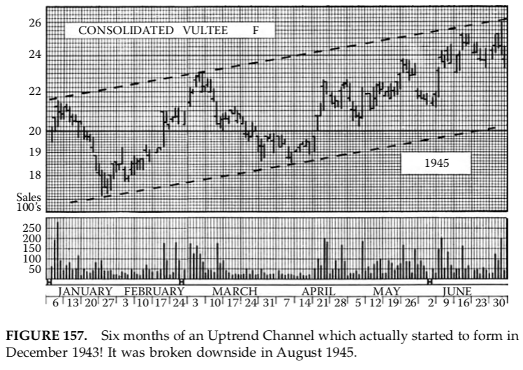

**FIGURE 157.** Six months of an Uptrend Channel which actually started to form in
December 1943! It was broken downside in August 1945.


A more immediate but less important probable consequence of trendline
penetration has also been mentioned — the “Pullback.” This deserves further
discussion. Pullbacks that follow breakouts from Reversal and Consolidation
Formations have been described in our earlier studies of those price patterns.
It is easy to understand why a rally which develops after prices break out
through the lower boundary of a Rectangle, for example, will be stopped
when it gets back to that boundary by the Resistance (supply) now residing
there. Support–Resistance Theory enables us to rationalize most of the
Throwback moves which occur after prices have broken out of other types
of Reversal or Consolidation Areas. The Pullbacks which follow trendline
penetrations cannot be thus rationalized; yet they occur much more fre-
quently, and they appear to be stopped much more exactly at the old
trendline level than is the case with Area Formations. Why should prices,
after they have thrust down through a rising trendline, perhaps for several
points, turn back up and ascend to or very near the old trendline, stop there
and then go off in renewed decline? The Top of that Pullback Rally may be
2 or 3 points above the original penetration level, since the trendline is
sloping up all the time; nevertheless, there it stops, falters, gives up. No one
knows why supply should overcome demand, why Resistance should be so
plainly evident at that particular point whose level is determined by _two_
variants, the _slope_ of the line and the _time_ it is reached.
Of course, you cannot reasonably expect a Pullback Rally to climb all
the way back to a trendline that is ascending at a very steep angle, which
may mean the attainment of a new high price for the entire Intermediate
Uptrend; yet even that happens in more than just a few cases. What can be
counted on in the great majority of typical Up Trendlines (those which slant
up at a normal or fairly flat angle) is that after the line has been broken, a
Pullback Rally will develop, either in a few days or in the usual Minor Wave
tempo, and will carry prices back up to the projected trendline.
Throwbacks do not occur, it should be noted, when prices erupt through
a _Return_ Line, i.e., break out of the top side of an Uptrend Channel. Or, more
correctly stated, the Return Line does not function as a Support against a
Throwback after prices have gone through it. An unusually strong upswing
in a Rising Trend Channel may carry beyond the top of the channel as defined
by its Return Line, but the next reaction may go right back down through
it without evidencing any hesitation at its level.

The Throwback is one of the mysteries in trendline price action to which
we alluded at the outset. The technical analyst who studies trends and
trendlines over any considerable period will discover many other even more
mysterious phenomena which cannot find space in this treatise, because no
way has yet been found to put them to practical use in trading and investing.
They are extraordinarily interesting in retrospect, but are not subject to
forecast.

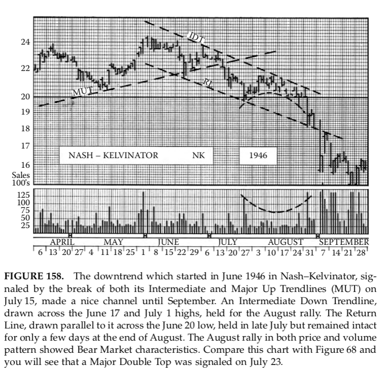

**FIGURE 158.** The downtrend which started in June 1946 in Nash–Kelvinator, sig-
naled by the break of both its Intermediate and Major Up Trendlines (MUT) on
July 15, made a nice channel until September. An Intermediate Down Trendline,
drawn across the June 17 and July 1 highs, held for the August rally. The Return
Line, drawn parallel to it across the June 20 low, held in late July but remained intact
for only a few days at the end of August. The August rally in both price and volume
pattern showed Bear Market characteristics. Compare this chart with Figure 68 and
you will see that a Major Double Top was signaled on July 23.


**FIGURE 159.** The decline that took Macy down through an Intermediate Up
Trendline (IUT) in June 1946 turned out to be also the drop from the head of a “Flat-
Shouldered” Head-and-Shoulders Top, which was, in turn, part of a larger Complex.
The upper neckline was broken June 19 and the lower on July 16. Note Pullbacks to
each. F1, F2, and F3 are tentative Fan Lines. Prices were finally able to clear F3 in
December, but by that time a Primary Bear Market had been signaled; so, the Fan
Rule no longer applied. Fans call the turn only on Secondary (Corrective) Moves.


##### Intermediate Downtrends

In all of the foregoing discussion of trends and trendlines we have concen-
trated on _uptrends_ ; we have, in fact, had in mind specifically Intermediate
Advances in the direction of the Primary Trend, i.e., within a Major Bull
Market. Those particular trends are most apt to develop “normally,” are most
amenable to trendline definition. Intermediate _Down_ Moves in a Major Bear
Market may well be taken up next. Before we discuss the respects in which
they differ from Primary Advances, we should recall that the _Basic Trendline_
on a down-move is the line projected across the _Tops_ of the rallies within it.
The Trend Channel will be to the left of that trendline and below it on the
chart. The _Return_ Line (if any) will define the _Bottom_ of the channel.


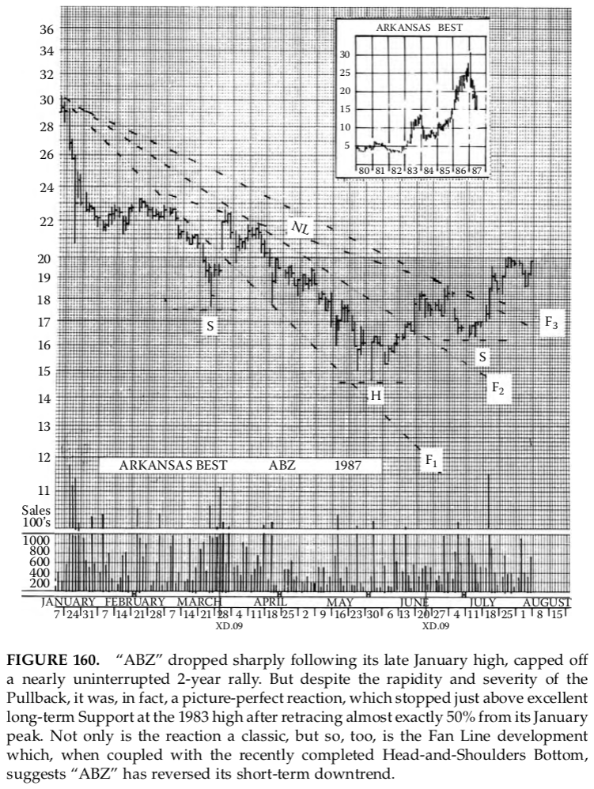

**FIGURE 160.** “ABZ” dropped sharply following its late January high, capped off
a nearly uninterrupted 2-year rally. But despite the rapidity and severity of the
Pullback, it was, in fact, a picture-perfect reaction, which stopped just above excellent
long-term Support at the 1983 high after retracing almost exactly 50% from its January
peak. Not only is the reaction a classic, but so, too, is the Fan Line development
which, when coupled with the recently completed Head-and-Shoulders Bottom,
suggests “ABZ” has reversed its short-term downtrend.

Intermediate (Bear Market) Downtrends are far less regular and uniform
in their development than Bull Market Advances. Their angles of decline are
characteristically steeper, and this is particularly true, of course, of the Panic
Moves which are typical of the second phase of a Bear Market, as we saw
in our discussion of Major Trends in Chapter 3. Moreover, prices have a
tendency to drop away from any trendline which is drawn across the first
two Rally Tops; in other words, to curve down or accelerate as the move
proceeds. This shows plainly on an arithmetically scaled chart and, even
more conspicuously on a semilogarithmic sheet.

The _practical_ results of this down-curving tendency are not so important,
insofar as it delays the penetration of the original trendline and, hence, the
giving of a signal of trend change. The fact is that prices tend to thrash
around for some time, making a base at the Bottom of one of these precipitous
declines. In so doing, they work out sideways on the chart, and the trend
frequently does not turn up visibly until after the trendline has finally been
reached and broken through on the upside after all. Thus, there is justification
for drawing down trendlines and keeping them in view even though they
may seem, for some time, simply to travel off into space with no apparent
relevance to the actual trend of prices.
It naturally follows from the above that Return Lines on most Bear
Market Declines have little practical utility; they are, more often than not,
very quickly broken downside. Good channels are hard to find.
However, and this is of considerable practical importance, the very last
Intermediate Downswing in a Major Bear Market, i.e., the last Primary Move
which leads to the final, long-term Bottom, is usually cleaner, more regular,
less precipitous — in other words, a more nearly normal trend of the sort
we expect to find in most Intermediate Advances in a Bull Market (except,
of course, that it slants down instead of up). This interesting habit is, as we
said, of practical importance. Knowing it, we have an additional and very
useful clue to the end of a Bear Market.
When, after a Major Bear Trend has proceeded for some time and dis-
tance, and has experienced at least one Panic Sell-Off, it then goes off in
another but less active and more orderly decline, and this decline develops
and follows a good trendline. Watch it closely. If this Intermediate holds to
its steady and not-too-steep downward course — if its trendline is contacted
several times by Minor Rallies — if it produces a fairly consistent channel,
and prices do not “fall out of bed” down through its parallel Return Line,
then the eventual upside penetration of this trendline may well signal a
_Major_ Turn, the inception of a new Bull Market.

##### Corrective Trends — The Fan Principle

In this study of Intermediate Trendlines, we have left to be taken up last the
subject of Secondary or Corrective Trends. These are the Intermediate Declines
which interrupt the Primary Advances in a Bull Market, and the Intermediate
Recoveries which alternate with Primary Declines in Bear Markets.
Intermediate Reactions against the Major Direction of the market take a
variety of forms. Sometimes, as we have seen in our earlier study of chart
patterns, they run out into Consolidation Formations — Triangles, Rectan-
gles, etc. — in which the net price reaction is of minor consequence, but time
is consumed in backing and filling before the Primary Trend can be resumed.
In such cases, of course, there is no basis for drawing an Intermediate
Trendline, nor is one needed for any practical purpose.

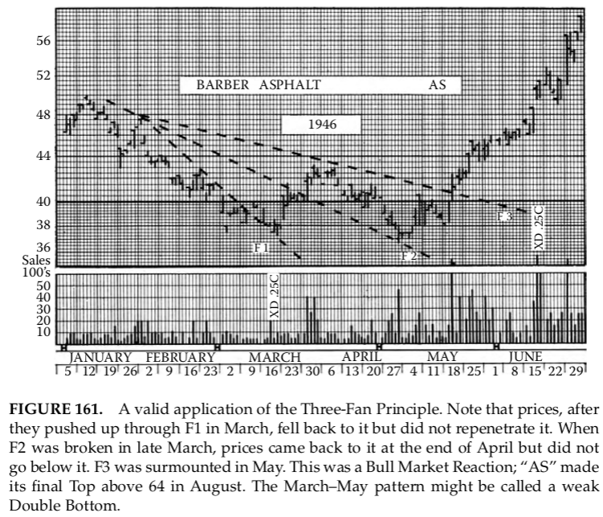

**FIGURE 161.** A valid application of the Three-Fan Principle. Note that prices, after
they pushed up through F1 in March, fell back to it but did not repenetrate it. When
F2 was broken in late March, prices came back to it at the end of April but did not
go below it. F3 was surmounted in May. This was a Bull Market Reaction; “AS” made
its final Top above 64 in August. The March–May pattern might be called a weak
Double Bottom.


At the other extreme, so to speak, we find Corrective Swings which
develop as a more or less orderly straight-line return of moderate slope to
the nearest good Intermediate Support or Resistance Level, retracing perhaps
a third to a half of the preceding Primary Swing. These reactions produce
good trendlines, as a rule, and the eventual penetration of their trendlines
is a good technical signal of Reversal. Intermediate Corrections clearly of
this type, it may be added, are relatively rare.


A third form taken by Intermediate Corrections is nearly as common as
the first named above (Consolidation Pattern) and much more common on
the charts than the second. In a Bull Market, it starts with a sharp reaction
which proceeds for several days — perhaps for as much as 2 weeks —
producing a steep Minor Trendline. This line is broken upside by a quick
Minor Rally, after which prices slide off again in a duller and less precipitate
trend. A second Minor Trendline may now be drawn from the original high
point across the Top of the upthrust that broke the first trend. This second
trendline is broken by another partial recovery thrust, and a third and still
duller and flatter sell-off ensues. A third trendline can now be drawn from
the original high across the Top of the second upthrust. The whole move,
by this time, has taken roughly and irregularly a “Saucering-out” form. The
three trendlines drawn from the original Reversal points from which the
Corrective Decline started, each at a flatter angle than its predecessor, are
known as _Fan Lines_. And the rule is that when the _third_ Fan Line is broken
upside, the low of the Intermediate Correction has been seen.


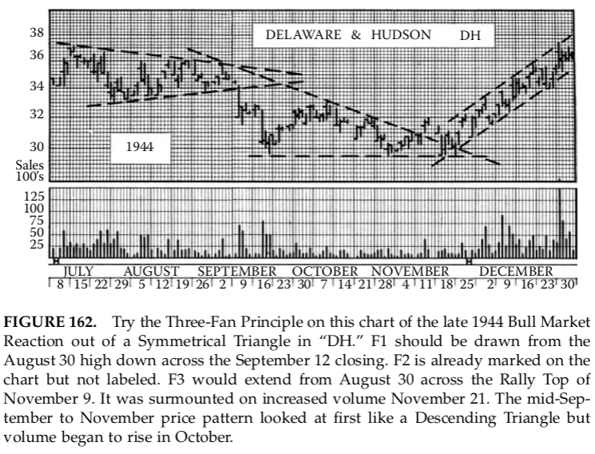

**FIGURE 162.** Try the Three-Fan Principle on this chart of the late 1944 Bull Market
Reaction out of a Symmetrical Triangle in “DH.” F1 should be drawn from the
August 30 high down across the September 12 closing. F2 is already marked on the
chart but not labeled. F3 would extend from August 30 across the Rally Top of
November 9. It was surmounted on increased volume November 21. The mid-Sep-
tember to November price pattern looked at first like a Descending Triangle but
volume began to rise in October.


There are exceptions to this rule — as there are to every so-called rule
of technical chart analysis. Rarely, a correction of this type will go on to make
another dip to a new low for the whole corrective move before prices really
start to round up again. But the Three-Fan Principle works in the great
majority of cases. Moreover, it offers the trader an opportunity to take a
position at a point where he can logically employ a very near stop order
and, thus, limit his loss to a controlled amount if the rule does not work out.
It is interesting to note that prices consistently Throwback in these move-
ments to the preceding Fan Line after each upthrust. The new Primary Swing,
once the low has been passed, usually starts slowly and carries out for a
time the Saucer picture.
The Three-Fan Rule works just as well in calling the turn on Intermediate
Recoveries in a Bear Market, the majority of which take the rounding form
which is adapted to its use.
Note, however, that the Fan Principle is normally applied only to cor-
rective moves, i.e., to determine the end of Intermediate Reactions in a Bull
Market and of Intermediate Recoveries in a Bear Market.


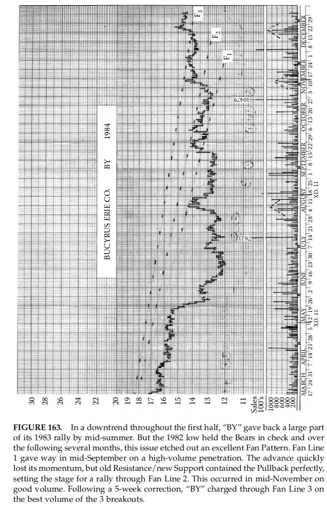

**FIGURE 163.** In a downtrend throughout the first half, “BY” gave back a large part
of its 1983 rally by mid-summer. But the 1982 low held the Bears in check and over
the following several months, this issue etched out an excellent Fan Pattern. Fan Line
1 gave way in mid-September on a high-volume penetration. The advance quickly
lost its momentum, but old Resistance/new Support contained the Pullback perfectly,
setting the stage for a rally through Fan Line 2. This occurred in mid-November on
good volume. Following a 5-week correction, “BY” charged through Fan Line 3 on
the best volume of the 3 breakouts.

We shall take up Major Trendlines in the following chapter, but, before
we leave this study of Intermediate Trends, it will be well to state again that
the practical application of trendlines in actual trading requires experience,
and the good judgment to be attained only therefrom. Some technical ana-
lysts depend largely on trendline studies; a few attempt to use trendlines
almost exclusively; but the majority have found that they are best employed
as an adjunct to other technical data.


Technical analysis of a stock chart is something like putting together a
jigsaw puzzle. There are many items to be considered, among them volume,
pattern, and the measurements derived therefrom, Support and Resistance
Levels, trendlines, general market prospects — and all fitted into place to
get the complete picture.


## Chapter 15. Major Trendlines

In the preceding chapter on Intermediate Trendlines, mention was made of
the distinctive effects produced by arithmetic and semilogarithmic plotting,
but it was noted that these differences were unimportant in connection with
Minor Trends or Intermediate Trends of average duration. When we come
to Major Trends, however, we find the difference does become important.
If you will examine a large collection of arithmetically scaled monthly
charts covering 10 years or more of market history, you will quickly see that
Bull Trends, in the great majority of actively traded, more or less speculative
common stocks, tend to _accelerate_. They start slowly and push up at a steeper
and steeper angle as they approach a Major Top. This up-curving path takes
them farther and farther away from any straight trendline drawn from two
Bottom points in the first, slow-moving stage of advance. As a consequence,
they top out and have gone down a long way in a recession which may be
of Major consequence before their straight trendline is again touched.
Many of the stocks that show such typical _accelerating_ curves in their
advance (Major) Trends on arithmetic paper produce _straight_ trends on a
logarithmic scale. As a consequence, their logarithmic Major Trendlines are
broken more quickly, and usually at a higher price level, when at last their
trends do top out and turn down. In the case of such stocks, then, the
logarithmic scale gives a better trend signal.
But there are other stocks — mostly of the more substantial investment
or semi-investment type — which tend to advance in straight arithmetic
trends. Consolidated Edison, General Motors, and Libbey–Owens–Ford
Glass are examples. (The trends of these on a logarithmic scale show a
decelerating curve, of course.) Still a third class, made up largely of high-
grade preferred stocks, produces a rounding over or decelerating Bull
Trendline even on the arithmetic scale. And, finally, there are a number of
issues whose normal Bull Market Trendlines fall somewhere between our
first two types; that is, they curve up away from a straight path on the
arithmetic scale, but curve over to the right (breaking through a straight line)
on the logarithmic scale. _EN: Fortunately, in this age of computers and easily
processed data, there is analytical software which allows the analyst to instanta-
neously switch between the scales. Desktop packages are available (see Appendix D,
Resources) and a number of Internet sites have these capabilities._


_282 Technical Analysis of Stock Trends_

All of which, the reader, at this point, no doubt finds most discouraging.
Some stocks do this and some stocks do that, and what help is there for us
in such a mix-up? The answer lies in studying the history of each issue in
which you may be interested. Stocks — most of them, at least — do not
change their habits and their technical characteristics much from one Bull
and Bear cycle to the next. An issue which, like General Motors, produces
a straight-line Bull Trend on an arithmetic chart in one Primary Upswing is
likely to repeat that performance in the next.
As a matter of interest, stocks do sometimes change, of course, over a
long period of years. Companies which were regarded as extremely specu-
lative when their shares were first listed may attain a more and more impor-
tant and stable position in the general economy, with the result that, even-
tually, their stock acquires a solid investment rating. Their Bull Market
Trends will then gradually change from an up-curve to a straight-line and,
finally, to a decelerating curve. Other old, established corporations may lose
position and rating, shift from the investment type of trendline to the spec-
ulative. But, it is true in general, nevertheless, that Major Patterns do repeat.
If you are keeping your own set of manual monthly charts, you can
choose whichever scale you please. But most technical chart followers prefer
to buy their long-range pictures ready made, thereby getting a much more
extensive history of many more issues than they could hope to chart them-
selves. Since the only comprehensive portfolios of monthly charts that are
available at reasonable cost are arithmetically scaled, you will possibly have
to make these serve all purposes. _EN: No longer necessary because of availability
of good software and also Internet chart sites. See Appendix D, Resources._ You will
find with a little experimentation that an architect’s French curve can be
used to plot good Major Uptrend Lines on many of the issues whose normal
Bull Trends accelerate away from a straight line.
The tests for the technical significance of a Major Trendline are substan-
tially the same as those specified for Intermediate Lines in the preceding
chapter. A little more leeway must be allowed on penetrations — again, a
matter of judgment — but you are dealing with coarse data and long swings
here, and what you want from your monthly charts, primarily, is perspective
on the broad picture.
One more point regarding the construction of Major Bull Trendlines: the
best lines — the most useful — are drawn, as a rule, not from the absolute low
of the preceding Bear Market, but starting, rather, from the next Intermediate
Bottom. The accumulation area at the beginning of a Bull Market is usually
long and drawn out in time, and relatively flat. The first trendline that can be
drawn from the extreme low point may, therefore, be too nearly horizontal to
express the genuine Bull Trend which starts with the markup phase. The several
charts showing Major Trendlines which illustrate this chapter will demonstrate
this point. _EN: Especially Figure 177._ It applies as well, we might add, to many
Intermediate Moves which start from Area Formations. Take the
Head-and-Shoulders Pattern for example: the true Intermediate Trendline usu-
ally starts from the right shoulder rather than from the head.


**FIGURE 164.** The straight-line Bull Market Trend of General Motors on an arith-
metic monthly chart. 1941 low, 28⅝; 1946 high, 80⅜.


**FIGURE 165.** The up-curving trend of a speculative motors stock, Hudson Motors.
Compare this with “GM.” 1941 low, 2⅝; 1946 high, 34½.


**FIGURE 166.** Typical decurving Major Bull Trend of a high-grade preferred stock.
This is Curtis Publishing $7 Preferred. 1942 low, 12; 1945 high, 154.


**FIGURE 167.** The accelerating uptrend of the common stock of the same publishing
company. 1942 low, ⅜; 1946 high, 26.


**FIGURE 168.** A conservative investment-type utility stock makes a straight-line
Major Bull Trend. This is Commonwealth Edison. 1942 low, 17⅜; 1946 high, 36⅛.
Leverage is an important factor in trends.


**FIGURE 169.** The up-curving trend of a low-priced “junior” utility, International
Hydro-Electric. 1942 low, ¼; 1946 high, 15½.


**FIGURE 170.** A speculative oil stock, Houston Oil. 1942 low, 2¼; 1946 high, 30.
Compare this picture with “SOH” in Figure 171.


**FIGURE 171.** Straight-line uptrends in an investment oil, Standard Oil of Ohio.
1942 low, 10⅛; 1946 high, 30. Note: trendline unbroken until 1948.


**FIGURE 172.** Steel stocks have the speculative or accelerating type of Primary
Uptrend. Republic Steel. 1942 low, 13⅜; 1946 high, 40⅞.


**FIGURE 173.** The normal Major Bull Trend of heavy industrial issues is up-curving.
American Car & Foundry. 1942 low, 20; 1946 high, 72⅜.


**FIGURE 174.** A low-priced building stock, Celotex Corporation. 1942 low, 6⅛; 1946
high, 38⅛.


**FIGURE 175.** A highly speculative, low-priced issue, traded on the Curb Exchange,
Claude Neon Lights. 1942 low, ⅛; 1946 high, 9.


**FIGURE 176.** The tobacco stocks follow the investment type of trend. This is
Liggett & Myers. Note Double Trendline. 1942 low, 50½; 1946 high, 103½.


**FIGURE 177.** High-grade food issues (Corn Products Refining) resemble the tobac-
cos. 1940 low, 40¼; 1946 high, 75¾.


##### Major Downtrends

From the technical analyst’s point of view, it is to be regretted that few Bear
Markets have produced Major Trendlines of any practical significance on the
charts of individual stocks. A notable exception was the long Bear Market
of 1929–32 which produced magnificently straight trendlines on the arith-
metic plotting of a host of issues (as well as in the Averages, to which we
shall refer later). But it is almost impossible to find other instances where a
Bear Trendline having any forecasting value can be drawn on either arith-
metic or semilogarithmic scale.
The _normal_ Major Bear Market Trend is not only steeper than the normal
Bull Trend (because Bear Markets last, on the average, only about half as
long as Bull Markets), but it is also accelerating or down-curving in its course.
This feature is accentuated and, hence, particularly difficult to project effec-
tively on the semilogarithmic scale.
The net of it is that the technician cannot expect to obtain much, if any,
help from his _Major_ Trendlines in determining the change from a Primary
_Down_ to a Primary _Upswing_. This should not be taken, however, as advice
to draw no trendlines on a Major Down Move, or to disregard entirely any
trendlines which may develop with some appearance of authority. If you do
not expect too much of them, they may, nevertheless, afford some useful
clue as to the way in which conditions are tending to change.
The student of stock market action who is not altogether concerned with
dollars and cents results from his researches will find Bear Market Trendlines
a fascinating field of inquiry. They do some strange things. Even though they
fail in the practical function of calling the actual Major Turn, and go shooting
off into space, they sometimes produce curious reactions (or, at least, appear
to produce what would be otherwise inexplicable market action) when the
real price trend catches up with them months or years later. But such effects,
interesting as they may be, are, in our present state of knowledge, uncertain
and unpredictable. _EN: This fact may persist into the mists of the future and be
thought of like Fermat’s Last Theorem. Our present state of knowledge in the 21st
century is no further advanced than it was in Magee’s time._
We must dismiss this rather unfruitful topic with the reminder that one
clue to the end of a Primary Bear Market is afforded by the Intermediate
Trendline of its final phase, which we cited in the preceding chapter.

##### Major Trend Channels

We run into another difficulty when we try to draw Return Lines and con-
struct channels for Major Trends on an arithmetic chart. Owing to the marked
tendency for prices to fluctuate in ever wider swings (both Intermediate and
Minor) as they work upward in a Primary Bull Market, their channel grows
progressively broader. The Return Line does not run parallel to the Basic
Trendline (assuming that we have a good Basic Trendline to begin with) but
diverges from it. Occasionally, a stock produces a clear-cut Major Channel
Pattern, but the majority do not.
Semilogarithmic scaling will, in many cases, correct for the Widening
Channel effect in Bull Trends, but then we run into the opposite tendency
in Primary Bear Markets, and for that, neither type of scaling will compen-
sate.

##### Trendlines in the Averages

Practically everything stated in the preceding chapter regarding Intermedi-
ate Trendline development in individual stocks applies, as well, to the var-
ious Averages. The broad Averages or Indexes, in fact, produce more regular
trends and, in consequence, more exactly applicable trendlines. This may be
due, in part, to the fact that most Averages are composed of active, well-pub-
licized, and widely owned issues whose market action individually is “nor-
mal” in the technical sense. Another reason is that the process of averaging
smooths out vagaries of component stocks, and the result, thus, more truly
reflects the deep and relatively steady economic trends and tides.
In any event, it is a fact that such averages as the Dow–Jones Rails,
Industrials and 65-Stock Composite, _The New York Times_ 50, and Standard &
Poor’s Average of 90 stocks (the last two named being probably the most
scientifically composed to typify the entire broad market) _(EN: As the reader
will note most of these are obsolete. In the modern age, the S&P 500 probably best
fulfills this function)_ do propagate excellent trendlines on their charts.
The very accuracy of their trends, particularly their Intermediate Moves,
permits us to construe their trendlines more tightly. Less leeway need be
allowed for doubtful penetrations. Thus, while we ask for a 3% penetration
in the case of an individual stock of medium range, 2% is ample in the
Averages to give a dependable break signal.
Experienced traders know that it pays to heed the Broad Market Trend.
It is still easier to swim with the tide than against it.

##### EN: Trendlines in the Averages, and Trading

##### in the Averages

_Numerous averages and indexes have come online since the 5th edition: S&P 100,
S&P 500, Russell 2000, and so on. It would be an exercise in daily journalism to
attempt to list all the indexes now available. New ones spring up like weeds after
the spring rain. This is because the invention of a widely adopted index can be very
lucrative for its creator. S&P and Dow–Jones collect licensing fees from the “use”
of their indexes by the exchanges. The constant addition of new trading instruments
requires that current lists be kept in Resources_ , _and the reader may also consult_ The
Wall Street Journal, Barron’s, _and_ The Investor’s Business Daily _where prices
of indexes and averages are reported. Online brokerages and financial news sites_
_also offer up-to-the-minute lists and quotes on virtually all trading instruments. A
list and links to these sites may also be found in Resources (Appendix D) and at
edwards-magee.com_.


**FIGURE 178.** In the process of “pulling back” to a very steep Up Trendline, prices
may easily go to a new high. Note the Pullback of August 1936 in this weekly chart
of Westinghouse Electric. The second, less steep line turned out to be the true Major
Bull Trend. Note that the February–April price pattern in 1936 could not be consid-
ered a true Double Top Reversal of Primary import because the recession between
the two highs was only about 10% of the Top’s value (around 122). Figure 64 on page
119 shows on a daily chart the final Top Reversal Formation which “WX” made in
1937.

    A large Rectangle base was made on this weekly chart in April, May, and June
1937, but observe the poor volume which accompanied the breakout and rise from
that formation — an extremely Bearish indication for the Major Trend. The “mea-
surement” of the Rectangle was carried out by August, but that was all.
As is usually the case, it was impossible to draw a Major Down Trendline which
had any forecasting value on this chart. The beautiful straight trendlines which
appeared in the 1929–32 Primary Bear Market led many chart students to expect
similar developments in every Bear Market, but the fact is that 1929–32 was unique
in that respect.


**FIGURE 179.** The 1929–32 Primary Bear Market was the only one in all stock market
records which produced a Straight-Line Major Downtrend. Trace also the Support
and Resistance Levels throughout this 14-year history of the Dow Industrials. Each
rally in the great Bear Move stopped at or near a previous Bottom level. Each decline
stopped near the level of a Congestion in the 1924–29 Bull Market. See also level of
1937 Top. Chart courtesy of Market Research, Inc. (Internet: barchart.com).

    _As of the turn of the century, the most important of these indexes, joining the
Dow, are probably the S&P 500, the S&P 100, and the NASDAQ. In fact these are
probably sufficient for economic analysis and forecasting purposes, and certainly_
good trading vehicles by means of surrogate instruments, options, and futures. Some
would include the Russell 2000 in this list. These indexes and averages have been
created to fill needs not filled adequately by the Dow–Jones Averages.
With this proliferation of measures of the market and various parts of it a
different question arises. That is, the value of the Dow alone in indicating the Broad
Market Trend is now questionable. Limited research has been done on this question.
It is, however, my opinion that the Broad Market Trend must now be determined
by examining the Dow Industrials, the S&P 500, and the NASDAQ Composite.


## Chapter 15.1. Trading the Averages in the 21st Century

As I have pointed out in other new chapters and notes in the eighth edition,
the ability to trade the Averages instead of individual stocks is a powerful
choice offered by modern markets. Magee was of the opinion that the Aver-
ages offered technical smoothness often lacking in individual issues. This
would seem to be true intuitively. After all, just as a moving average smooths
data, the average of a basket of stocks should dampen price volatility. Of
course, as Mandelbrot pointed out, in a 10-sigma market storm everything
sinks.
Illustrated in this chapter are several detailed cases following Magee’s
suggestion of Average trading. I attempt to demonstrate here two perspec-
tives: one, the horror of the immediate, that is, what the crash and panic
look like as they occur, and two, what the crash and panic look like in
retrospect. Of course we all live in the present, except for the great billion-
aires, who can afford to doze through horrific Bear Markets. Bill Gates’ net
worth varied by $16B (billion) or $17B in early 2000. This, of course, would
put the ordinary investor out of business.
So the ordinary investor, you and I, have to respect the great yawning
Bear Market. We must step to the sidelines and let the bear eat the foolish
virgins, to borrow a Biblical metaphor.
You will remember that Magee opined that a trendline break of 2% was
sufficient to cause liquidation of longs when analyzing the Averages. In the
accompanying figures, this hypothesis is examined.
_EN9: In respect to the breaking of trendlines (by 2% or 5%) I should note that
the breaking of a trendline is as much a_ warning _as a signal to act. The break,
instead of a change of trend to the reverse, may indicate a change of trend to the
sideways – into a reversal or continuation pattern._


**FIGURE 179.1**. S&P Reagan Crash. As can be clearly seen this crash sent numerous signals, starting with
the breaking of a major trendline by more than 2% in late August. Once this occurs extreme caution and
watchfulness must be exercised. The darker and darker complexion of things is brought out by the “smart
selling,” which shows many “downthrust days” toward the end (October 10–20). The April trendline breaks
(by more than 2%) would have ejected the trend trader also to be put back long in June. Observance of the
2–3% trendline-break rule and/or use of Basing Points and progressive stops (Chapters 27 and 28) would
have avoided much needless grief. NOTE: Figures 180–197 have been moved to Appendix C.


**FIGURE 179.2**. S&P Long-Term Perspective. Viewed from afar it seems an exercise in futility to attempt to
“time the market.” One must keep in perspective the crashes in market prices which are timed to coincide
with personal and business needs for short-term liquidity, or, in a word, cash. One must also remember the
market behavior from 1965–82, as well as the chart of Dow Theory Performance in Chapter 5.1.


**FIGURE 179.3.** Three Bull Market Tops, 1929, 1987, 1998. Notice here that in each
case the crash occurred after the nearest important trendline had been decisively
broken — usually trendlines of approximately 3 months by 2% or more, and some-
times accompanied by reversal formations. All historic tops will show evidence of
attempts to resume the trend after a break of this kind. Belief dies hard. Nonetheless,
hedging or exiting on these trend breaks proves to be the best strategy over and over
again.


**FIGURE 179.3.1**. The bull ’90s top in the S&P gave much clearer readings than the Dow top, the broken trendlines being paramount. But
while the Dow flirted with the emotions of bulls who wanted to believe in Dow 36,000 the S&P broke its trendlines and went south for the
winter. Potentially a very long winter. This might have started off as a rounding top and then became a complex-complex top, and you
can even see traces of Head-and-Shoulders top in it. It is the editor’s opinion that we may never see such unruly tops again in this
generation. The pent up greed and lust and naiveté as even the bootblacks (they still have those don’t they?) rushed to get the latest tulip
bulbs. Tulips are like century plants. They only bloom once each hundred years. A little old lady with a ruler could have saved her portfolio
here. All it takes is not believing the hype (Dow 36,000 indeed!) and making an unemotional analysis and honoring the stops.


**FIGURE 179.3.2.** Dow Jones Industrials 1999-2000. Illustrating that patterns can be found within patterns, the Dow made a broadening top
which resolved into a diamond, then a couple of triangles. (Not drawn here.) All of which could be looked at as a gnarly messy rectangle. It is
not so important to identify triangles in this situation as to recognize the general nature of the market — sideways to down. In general one of
the more unruly situations in market history, as befitted the incredible (truly incredible, as in unbelievable) bull market it ended.


## Chapter 16.1 Technical Analysis of Commodity Charts


_(EN9: Following the practice of allowing the reader to discriminate between the
work of Edwards and Magee and that of the Editor, a chapter on commodity trading,
Chapter 16.1, has been added to the 9th Edition. See same.)_

A little thought suggests that the variously interesting and significant pat-
terns which we have examined in the foregoing chapters on stock charts
should logically appear as well in the charts of any other equities and
commodities that are freely, constantly, and actively bought and sold on
organized public exchanges. And this, in general, is true. The price trends
of anything where market value is determined solely (or for all practical
purposes within very wide limits) by the free interplay of supply and
demand will, when graphically projected, show the same pictorial phenom-
ena of rise and fall, accumulation and distribution, congestion, consolidation,
and reversal that we have seen in stock market trends. Speculative aims and
speculators’ psychology are the same whether the goods dealt in be corporate
shares or contracts for the future delivery of cotton bales.
It should be possible in theory, therefore, to apply our principles of technical
analysis to any of the active commodity futures (wheat, corn, oats, cotton, cocoa,
hides, eggs, etc.) for which accurate daily price and volume data are published.
It should be, that is, if proper allowance is made for the intrinsic differences
between commodity futures contracts and stocks and bonds.
In previous editions of this book _(EN9: Up to the 8th)_ , traders who cast
longing eyes on the big, quick profits apparently available in wheat, for exam-
ple, were warned that commodity charts were “of very little help,” as of 1947.
It was pointed out that successful technical analysis of commodity
futures charts had been possible up to about 1941 or 1942. But that the
domination of these markets thereafter by government regulations, loans,
and purchases completely subject to the changing (and often conflicting)
policies and acts of the several governmental agencies concerned with grains
and other commodities had seriously distorted the normal evaluative
machinery of the market. At that time, radical reversals of trend could and
did happen overnight without any warning so far as the action of the market
could show. The ordinary and orderly fluctuations in supply–demand bal-
ance, which create significant definite patterns for the technician to read, did
not exist. And while fortunes were made (and lost) in wheat, corn, and cotton
futures during the World War II period, it is safe to say they were not made
from the charts.


However, during the past 5 or 6 years the application of technical meth-
ods to commodity trading has been reexamined. Under 1956 conditions, it
appears that charts can be a most valuable tool for the commodity trader.
The effects of present government regulation have apparently resulted in
“more orderly” markets without destroying their evaluative function. And
allowing for the various essential differences between commodities and
stocks, the basic technical methods can be applied.
It may be in order here to discuss briefly some of the intrinsic differences
between commodity futures and stocks referred to above, and some of the
special traits of commodity charts. To begin with, the most important differ-
ence is that the contracts for future delivery, which are the stock-in-trade of
the commodity exchange, have a limited life. For example, the October cotton
contract for any given year has a trading life of about 18 months. It comes
“on the board” as a “new issue,” is traded with volume increasing more or
less steadily during that period, and then vanishes. Theoretically, it is a
distinct and separate commodity from all other cotton deliveries. Practically,
of course, it seldom gets far out of line with such other deliveries as are
being bought and sold during the same period, or with the “cash” price of
the physical cotton in warehouses. Nevertheless, it has this special quality
of a limited independent life, as a consequence of which long-term Support
and Resistance Levels have no meaning whatever.
Second, a very large share of the transactions in commodity futures —
as much as 80% certainly in normal times — represents commercial hedging
rather than speculation. (It is, in fact, entered into to obviate risk, to avoid
speculation.) Hence, even near-term Support and Resistance Levels have
relatively less potency than with stocks. Also, since hedging is to a consid-
erable degree subject to seasonal factors, there are definite seasonal influ-
ences on the commodity price trends which the commodity speculator must
keep in mind, even if only to weigh the meaning of their apparent absence
at any given period.


A third difference is in the matter of volume. The interpretation of
volume with respect to trading in stocks is relatively simple. But it is greatly
complicated in commodities by the fact that there is, in theory, no limit to
the number of contracts for a certain future delivery which may be sold in
advance of the delivery date. In the case of any given stock, the number of
shares outstanding is always known. As this is written, there are in the hands
of stockholders 13,700,203 common shares of Consolidated Edison, and that
quantity has not varied for many years nor is it likely to change for several
years to come. Every transaction in Consolidated Edison involves an actual
transfer of one or more of those existing shares. In the case of commodity
future contracts, however — say, September wheat — trading begins long
before anyone knows how many bushels of wheat will exist to be delivered
that coming September, and the open interest at some time during the life
of the contract may exceed the potential supply many times over — and all
quite legitimately. _EN9: Appendix C contains some material on the interpretation
of futures volume data. As always volume data is a supplementary indicator to price.
No one makes a profit on it._


One more important difference may be mentioned. Certain kinds of
news — news about weather, drought, floods, etc., that affect the growing
crop, if we are dealing with an agricultural commodity — can change the
trend of the futures market immediately and drastically and are not foresee-
able given the present stage of our weather knowledge. Analogous devel-
opments in the stock market are extremely rare. _EN: Except for acts of God
and Alan Greenspan_.


Under what might be called normal market conditions, those chart pat-
terns which reflect trend changes in most simple and logical fashion work
just as well with commodities as with stocks. Among these we would list
Head-and-Shoulders formations, Rounding Tops and Bottoms, and basic
trendlines. Trendlines, in fact, are somewhat better defined and more useful
in commodities than in stocks. Other types of chart formations which are
associated with stocks with short-term trading or with group distribution
and accumulation, such as the Triangles, Rectangles, Flags, etc., appear less
frequently in commodities and are far less reliable as to either direction or
extent of the ensuing move. Support and Resistance Levels, as we have
already noted, are less potent in commodities than in stocks; sometimes they
seem to work to perfection, but just as often they don’t. For similar reasons,
gaps have relatively less technical significance.


It is not the purpose of this book to explain the operation of commodity
futures markets, nor to offer instruction to those who wish to trade therein.
This brief chapter is included only as a starter for readers who may want to
pursue the study further. They should be advised that successful speculation
in commodities requires far more specialized knowledge, demands more
constant daily and hourly attention. The ordinary individual can hope to
attain a fair degree of success in investing in securities by devoting only his
spare moments to his charts, but he might better shun commodity specula-
tion entirely unless he is prepared to make a career of it.


_EN: The Editor has been, during his checkered career, a registered Commodity
Trading Advisor. At the beginning of that career, I discussed these subjects with
Magee and received essentially the above comments which are here reproduced from
the fifth edition. Subsequently, I observed among my associates and partners, and
on my own, that futures are eminently tradable with the_ adaptation _of techniques
and methods described in this book. It is also true, as Magee says, that futures
trading is so different in tempo, leverage, and character that the novice risks life,
limb, and capital in entering the area unescorted. Resource references are essential
reading but the beginner is urged to educate himself_ before _beginning trading with
extensive study and paper trading._

**Note that Figures 180-197 as well as Chapter 16 from the 7th edition
are now found in Appendix C.**


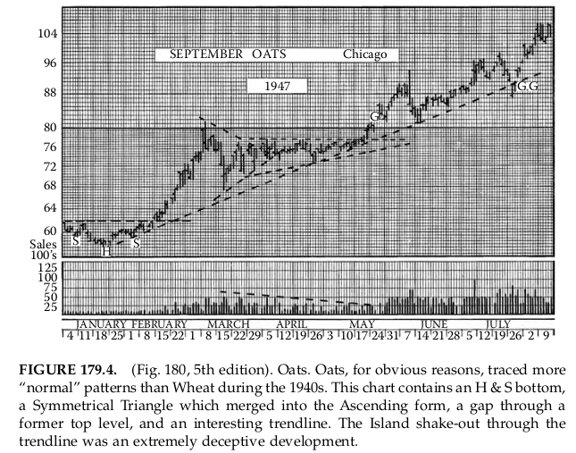

**FIGURE 179.4.** (Fig. 180, 5th edition). Oats. Oats, for obvious reasons, traced more
“normal” patterns than Wheat during the 1940s. This chart contains an H & S bottom,
a Symmetrical Triangle which merged into the Ascending form, a gap through a
former top level, and an interesting trendline. The Island shake-out through the
trendline was an extremely deceptive development.

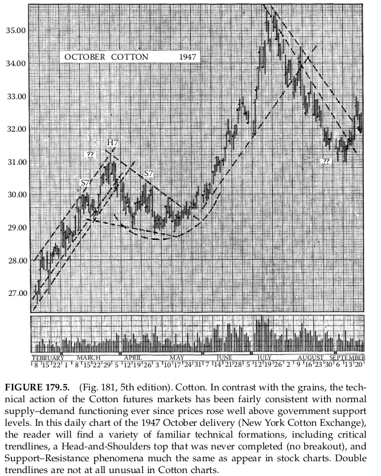

**FIGURE 179.5.** (Fig. 181, 5th edition). Cotton. In contrast with the grains, the tech-
nical action of the Cotton futures markets has been fairly consistent with normal
supply–demand functioning ever since prices rose well above government support
levels. In this daily chart of the 1947 October delivery (New York Cotton Exchange),
the reader will find a variety of familiar technical formations, including critical
trendlines, a Head-and-Shoulders top that was never completed (no breakout), and
Support–Resistance phenomena much the same as appear in stock charts. Double
trendlines are not at all unusual in Cotton charts.

## Chapter 16.1  Technical Analysis of Commodity Charts, Part 2

# A 21st Century Perspective

In the search for the Philosopher’s Stone more sweat and money have been
put into the area of commodities and futures than were ever expended in
the securities arena. There is a simple reason for this. Great fortunes are
made and lost with much greater rapidity in the futures area than in secu-
rities. Of all the great dramatic moments in stock market history few are so
memorable as the great Hunt silver market, or Soros facing off against the
Bank of England, or of gold soaring to $1000 an ounce. And the saga con-
tinues in 2005. $50 oil? $60? $70? $100? And the effects, economic and psy-
chological! In dimly lit garrets and brightly lit computer rooms thousands
of researchers concoct systems to trade these markets — corn, soybeans,
silver, copper...

## Rocket Scientists

At times individual traders and groups of traders have plundered (har-
vested?) these markets for fairy tale profits. I know whereof I speak, having
been a principal in California’s first licensed commodity trading advisor
which was founded by the NASA rocket scientist R.T. Wieckowicz. During
the 1970s as the stock markets ground futilely around the 1000 level on the
Dow the futures markets returned yearly gains in the 100% range. Consis-
tently. For years. Those were the years of the California systems traders and
the beginning of computerized trading. From the primeval slime of NASA
the rocket scientists emerged to create a renaissance in market technology.
At the time it seemed clear that science and genius had at last conquered
the markets and that clients would come buzzing from the world over like
bees to a honey pot and that the rivers of profits would last forever. They
did last for some time, and then the markets changed. Mechanical systems
which cut through the markets like a reaper in a wheat field in bull markets
grind up capital like sausage in sideways markets. Science and genius were
revealed as the happy combination of man, moment, system, and market.


_308 Technical Analysis of Stock Trends_

##### Turtles?

During the 1980s from the sea came crawling the Turtles. Progeny of the
protean trading wizard, Richard Dennis, the Turtles again harvested outsize
profits from the markets, running it is said in the 80% yearly range. The so-
called Turtles got their name from a comment that Dennis is reported to
have made that traders were made not born and he was going to raise traders
like turtles. Additional reading about the Turtles is available in Jack Schwa-
ger’s fascinating book and books, _Market Wizards,_ et al. Schwager’s books
are required reading for aspiring traders. And, the trading manual of the
Turtles will be found in Appendix E of this ninth edition. This workbook,
written by Curtis Faith, an original Turtle, contains virtually all of the ele-
ments necessary in a trader’s systems and procedures manual. The manual
was prepared according to the training Dennis gave his Turtles. Serious
traders do not operate without some such document. Certainly all of the
serious traders I have known (a considerable number) have had fully devel-
oped manuals like the Turtle workbook. I have attached the Turtle workbook
as an appendix rather than others in my possession because it is publicly
available at originalturtles.org and because it is beautifully articulated.
In the late ’90s the Turtles were made into turtle soup in the futures
markets as the majority of systems traders wound up as hamburger meat.
_Is there a moral? Yes. The markets giveth and the markets taketh away. Science and
genius are again revealed to be the happy combination of man, method, moment,
and market._
The Turtle system is basically an adaptation of Richard Donchian’s chan-
nel breakout system. In the Donchian system the trader goes long when the
20 day high is broken and sells and goes short when the 20 day low is broken.
In the 1970s Dunn and Hargitt evaluated a number of mechanical trading
systems and found that Donchian’s system was superior to the others eval-
uated at that time. Will Donchian’s system still work? Yes, in broadly trend-
ing markets. Will the Turtle system still work? Yes, in broadly trending
markets. And, like virtually all mechanical systems they don’t know whether
they are in a broadly trending market or not. They are blind. All they see
are ones and zeros. The addition to these systems of prudently applied chart
analysis will immeasurably improve their performance and risk characteristics.

##### The Application of Edwards and Magee’s Methods

##### to 21st Centur y Futures Markets

During my career as a Commodity Trading Advisor I have known a number
of successful traders and advisors who used what I would describe as Magee
type chart analysis to make their trades. Often there were other elements
input into their decision making process, but manual charting was a key
factor in their operations. Some of these traders used simple trendline anal-
ysis with price or volume filters and some used a combination of trendlines
and support and resistance. _All were trend followers._


_Chapter 16.1: A 21st Century Perspective 309_

Having looked at the futures markets with some attention over the past
several years it seems to me that there is no reason why chart analysis should
not work as well now as it has always worked. Essentially the questions
raised by securities trading are the same as those presented by futures
trading in the analysis of a chart. Is there a trend? Where are support and
resistance? Is there a breakout? Are there waves and wavelets? How do you
enter and how do you exit?
The great bug-a-boo of securities traders coming to the futures trading
is the speed of the game. Like college football players stepping up to the
NFL there is a brutal learning curve and rookies are the most likely to get
killed. I am not going to make any effort here to present a primer for new
futures traders. Rather I will look at some futures charts at the end of this
chapter in order to show the journeyman that chart analysis can be used as
a decision making method in these dramatic markets. Again, chart analysis
has the weakness (or strength) of being a qualitative process. It will not make
decisions for the average trader, as a mechanical system will.
On the other hand a breakout is a breakout. A gap is a gap, leaving aside
the question of limit move gaps for the moment. A trend is a trend. And here
is the great advantage that a firm grasp of charting methods can give the
practitioner. _It can give him the perspective to recognize the essential nature of the
market at hand and choose to wait or to enter._ Mechanical methods not having the
qualitative discrimination of an experienced chartist will blindly take every
trade until they are out of money. The experienced chart analyst can sit back
and say, this market has not yet made a bottom and the time to begin trading
it long has not yet come. Or, he can recognize the essential differences between
a trading and a trending market and adjust his tactics accordingly.


As Magee noted in Chapter 16:

_Under what might be called normal market conditions, those
chart patterns which reflect trend changes in most simple and
logical fashion work just as well with commodities as with stocks.
Among these we would list Head-and-Shoulders formations,
Rounding Tops and Bottoms, and basic trendlines. Trendlines, in
fact, are somewhat better defined and more useful in commodities
than in stocks. Other types of chart formations which are associ-
ated with stocks with short-term trading or with group distribu-
tion and accumulation, such as the Triangles, Rectangles, Flags,
etc., appear less frequently in commodities and are far less reliable
as to either direction or extent of the ensuing move. Support and
Resistance Levels, as we have already noted, are less potent in
commodities than in stocks; sometimes they seem to work to
perfection, but just as often they don’t. For similar reasons, gaps
have relatively less technical significance._


These words remain true today, as do virtually all the principles enun-
ciated in this book by Edwards and Magee and myself. In fact most futures
charts if given to an analyst without issue identification and dates would
not be identifiable as commodity charts. Of course when limit moves appear
the difference slaps one in the face. And on this point I might differ from
Magee slightly as regards gaps. Obviously limit move gaps have breath
taking significance. But all in all it seems to me that gaps often say the same
thing to futures analysts that they say to stock analysts.
Another mathematical reason might be adduced for the practicality of
using simple chart analysis to trade futures. That is the tautalogical nature of
the method. A trend is a trend, and a trendline is a trendline. If you enter a
suspected trend (setting a protective stop at a technically analyzed place) and
follow the trend using Basing Points or observing the trendline and exiting on
a break and reversal there will be no difference from doing the same with a
stock. Well, some difference. Due to the leverage you will be required to be
hyper aware of risk. In futures the penalty for holding a position through “a
normal reaction” can be extremely harsh. That is why stops are so important.

##### Stops

Some traders set their stops using money management rules rather than
technically identified points. I believe it is always better to find the technical
point using a basing point, or support and resistance. To me it makes better
sense to adjust position size to control risk as I described in Chapter 26. And
the use of money management stops has been very successful for many
traders. _If some logical and disciplined method of setting and observing stops is
not installed the trader is assured of failure._

    A money management stop is, simply enough, a stop calculated by
deciding to risk 2% (or 3 or 4 or x%) of capital on a trade. For example,
William O’Neil says that when a stock trader enters a position he should set
a stop 8% under his entry price. This is a little crude, and not strictly speaking
a money management stop, but is better than no risk calculation at all. In a
stricter sense, if we said that we wanted to limit the risk of the trade to 3%
of capital we would use the 8% rule to set the stop and the Scott Procedure
in Chapter 26 to determine the number of shares or contracts. The Turtle
system in Appendix E contains similar procedures. Numerous studies have
proven that the size of the risk per trade — 1%, 2%, 3% — is directly
correlated to equity volatility.

###### A Variety of Methods

As noted above a competent chart analyst may, in my opinion (and in Magee’s
opinion), perform profitably in the futures markets. There are other questions,
of course, namely of character, temperament, intelligence, judgment, etc..., Let
us leave those questions to Dr. Elder and confine ourselves to the method
question. Chart analysts proved their abilities in the futures markets long before
computers existed. In fact long before in the case of Japanese rice traders,
enlightening their efforts with candlesticks in the 18th century.


In the 1970s I saw point and figure chartists enjoy great success at Dean
Witter and Merrill Lynch and other major firms in futures. I have seen least
squares curve fitters, moving average calculators and abstruse statistical
analysts all enjoy profitable outings in commodities. Not to speak of the
Turtles who, using naturalistic high low systems, harvested good profits in
the markets. As the saying goes, gateless is the gate and many are the ways
to the great Dow. Although I have enjoyed great success myself using
mechanical number-driven systems over the years I have become more and
more attracted to “natural” systems. Chart analysis is essentially natural, as
is the Turtle system. The Dow Theory is a natural system. In a natural system
no mathematical algorithm comes between the analyst and the data. The
essential, more, quintessential, weakness of all number-driven systems is
their blindness. They do not have the ability to discriminate between the
forest and the trees. The experienced human chartist can _see_ (and hear) the
changing rhythms of the market and respond to them, responding to factors
too subtle (and even subconscious) to program. But even natural systems,
like the Turtle systems, can fall into this trap. When the markets learn that
a lot of capital is waiting just above the 20 day high they will set a trap for
it. For “markets” you may read “they.” If you apply the knowledge of this
book to such situations you may avoid the trap.

###### Everything You Need to Know as a Chart Analyst Trading Futures

Jack be nimble. Jack be quick. Jack jump over the Candlestick. Yes, it is true,
as the leverage is 10 times greater the speed is 10 times faster. I have illus-
trated in Figure 179.5.3 the combination of a very tight trendline with a run
day which it seems to me is a good current (21st century) combination.
Otherwise the same qualities which make a good security trader make a
good futures trader once the great leap to leveraged quick-fire markets is
made. If you have been successful trading stocks you will probably be
successful trading futures. And you probably should practice on stocks while
studying futures. A sobering fact which I often recount to my graduate
students is that Richard Wyckoff worked in the securities business for 8 years
before making his first investment. He studied the markets an additional 6
years before _trading._

The Magee methodology will serve as a valuable cornerstone of your
futures operations, and you must never cease studying. Mechanical systems
have their attractions, especially when seasoned with experienced chart
analysis. And no method will survive unless practiced with diligence, per-
sistence, judgment, and patience. Time and again you will hear famous
traders say, when asked the secret of their success, “discipline.” What they
mean by discipline is their ability to measure and contain the risk, set a stop
based on technical or money management procedures and _then honor the stop._
The most important lesson the futures trader has to learn from Edwards
and Magee is the ability to see the character of the market, trading or
trending, and then _to adjust his tactics accordingly._


###### The Return of the Great Markets of the ’70s

In the next great bull market in commodities, which may be about to occur
as this book goes to press in 2006 (cf. following charts this chapter), these
methods and systems derived from them will once again reap windfall
profits.

I have attempted in this ninth edition of this classic book to show the
book’s usefulness to the intelligent futures trader. Simple classical chart
analysis alone can be successful in the futures markets in the hands of an
experienced competent analyst. Natural mechanical systems such as the
Turtle system have been effective and will be again, perhaps with some
tweaking (such as imposing a chart analysis super-structure). Wave analysis
methods such as the Basing Points procedure of Chapter 28 can be used.
Even number driven systems, such as moving averages, can be successful
especially if combined with chart analysis.


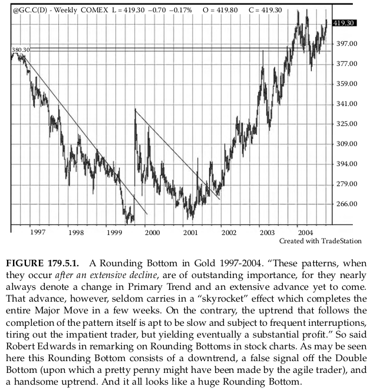

**FIGURE 179.5.1.** A Rounding Bottom in Gold 1997-2004. “These patterns, when
they occur _after an extensive decline_ , are of outstanding importance, for they nearly
always denote a change in Primary Trend and an extensive advance yet to come.
That advance, however, seldom carries in a “skyrocket” effect which completes the
entire Major Move in a few weeks. On the contrary, the uptrend that follows the
completion of the pattern itself is apt to be slow and subject to frequent interruptions,
tiring out the impatient trader, but yielding eventually a substantial profit.” So said
Robert Edwards in remarking on Rounding Bottoms in stock charts. As may be seen
here this Rounding Bottom consists of a downtrend, a false signal off the Double
Bottom (upon which a pretty penny might have been made by the agile trader), and
a handsome uptrend. And it all looks like a huge Rounding Bottom.


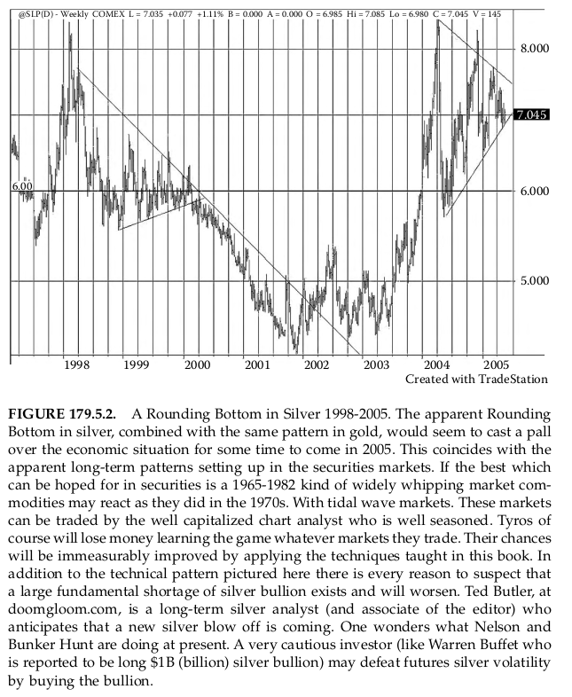

**FIGURE 179.5.2.** A Rounding Bottom in Silver 1998-2005. The apparent Rounding
Bottom in silver, combined with the same pattern in gold, would seem to cast a pall
over the economic situation for some time to come in 2005. This coincides with the
apparent long-term patterns setting up in the securities markets. If the best which
can be hoped for in securities is a 1965-1982 kind of widely whipping market com-
modities may react as they did in the 1970s. With tidal wave markets. These markets
can be traded by the well capitalized chart analyst who is well seasoned. Tyros of
course will lose money learning the game whatever markets they trade. Their chances
will be immeasurably improved by applying the techniques taught in this book. In
addition to the technical pattern pictured here there is every reason to suspect that
a large fundamental shortage of silver bullion exists and will worsen. Ted Butler, at
doomgloom.com, is a long-term silver analyst (and associate of the editor) who
anticipates that a new silver blow off is coming. One wonders what Nelson and
Bunker Hunt are doing at present. A very cautious investor (like Warren Buffet who
is reported to be long $1B (billion) silver bullion) may defeat futures silver volatility
by buying the bullion.


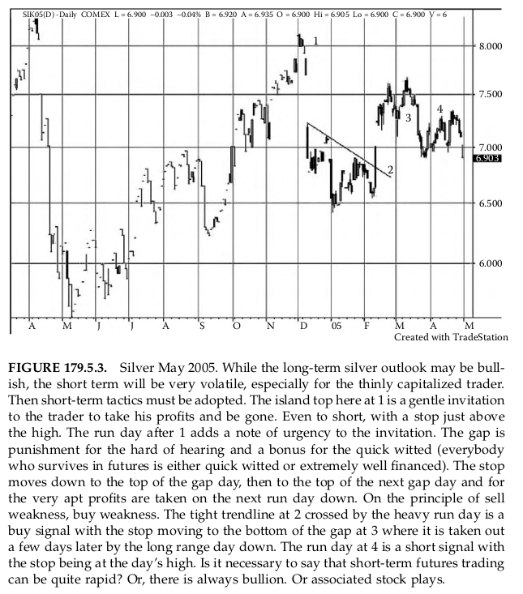

**FIGURE 179.5.3.** Silver May 2005. While the long-term silver outlook may be bull-
ish, the short term will be very volatile, especially for the thinly capitalized trader.
Then short-term tactics must be adopted. The island top here at 1 is a gentle invitation
to the trader to take his profits and be gone. Even to short, with a stop just above
the high. The run day after 1 adds a note of urgency to the invitation. The gap is
punishment for the hard of hearing and a bonus for the quick witted (everybody
who survives in futures is either quick witted or extremely well financed). The stop
moves down to the top of the gap day, then to the top of the next gap day and for
the very apt profits are taken on the next run day down. On the principle of sell
weakness, buy weakness. The tight trendline at 2 crossed by the heavy run day is a
buy signal with the stop moving to the bottom of the gap at 3 where it is taken out
a few days later by the long range day down. The run day at 4 is a short signal with
the stop being at the day’s high. Is it necessary to say that short-term futures trading
can be quite rapid? Or, there is always bullion. Or associated stock plays.

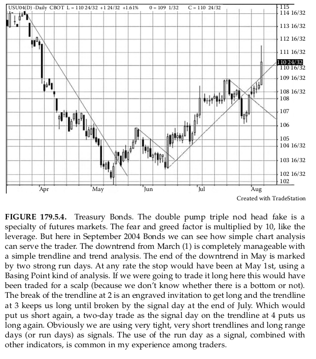

**FIGURE 179.5.4.** Treasury Bonds. The double pump triple nod head fake is a
specialty of futures markets. The fear and greed factor is multiplied by 10, like the
leverage. But here in September 2004 Bonds we can see how simple chart analysis
can serve the trader. The downtrend from March (1) is completely manageable with
a simple trendline and trend analysis. The end of the downtrend in May is marked
by two strong run days. At any rate the stop would have been at May 1st, using a
Basing Point kind of analysis. If we were going to trade it long here this would have
been traded for a scalp (because we don’t know whether there is a bottom or not).
The break of the trendline at 2 is an engraved invitation to get long and the trendline
at 3 keeps us long until broken by the signal day at the end of July. Which would
put us short again, a two-day trade as the signal day on the trendline at 4 puts us
long again. Obviously we are using very tight, very short trendlines and long range
days (or run days) as signals. The use of the run day as a signal, combined with
other indicators, is common in my experience among traders.

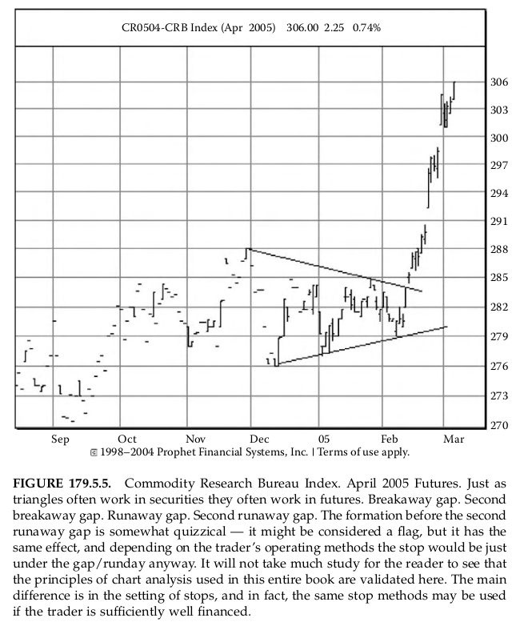

**FIGURE 179.5.5.** Commodity Research Bureau Index. April 2005 Futures. Just as
triangles often work in securities they often work in futures. Breakaway gap. Second
breakaway gap. Runaway gap. Second runaway gap. The formation before the second
runaway gap is somewhat quizzical — it might be considered a flag, but it has the
same effect, and depending on the trader’s operating methods the stop would be just
under the gap/runday anyway. It will not take much study for the reader to see that
the principles of chart analysis used in this entire book are validated here. The main
difference is in the setting of stops, and in fact, the same stop methods may be used
if the trader is sufficiently well financed.


**FIGURE 179.5.6.** Commodity Research Bureau. Long-term view. It does not take
much analysis of this 10 year CRB chart to see a huge double bottom, and to consider
its implications. If China and India are going to compete with us for natural resources
we could see an entirely new economic paradigm, if the reader will excuse the term.
Clearly there is a bull market in commodities. In Chapter 42, Pragmatic Portfolio
Management, it is suggested that capital should flow to markets that are moving,
rather than remaining committed to markets which are mired in mulish trends.
Furthermore it is suggested in that chapter that a good natural hedge is to go long
the uptrend of an index and short the components of it which are in downtrends.
The CRB is somewhat thin but might lend itself to this strategy.

## Chapter 17. A Summary and Some Concluding Comments

We began our study of technical stock chart analysis in Chapter 1 with a
discussion of the _philosophy_ underlying the technical approach to the prob-
lems of trading and investing. We could ask that the reader turn back now
and review those few pages to recapture a perspective on the subject which
must have been dimmed by the many pages of more or less arduous reading
that have intervened.
It is easy, in a detailed study of the many and fascinating phenomena
which stock charts exhibit, to lose sight of the fact that they are only the
rather imperfect instruments by which we hope to gauge the relative strength
of supply and demand, which, in turn, exclusively determines what way,
how fast, and how far a stock will go.
Remember that, in this work, it doesn’t matter what creates the supply
and the demand. The fact of their existence and the balance between them
are all that count. No man, no organization (and we mean this _verbatim et
literatim_ ) can hope to know and accurately appraise the infinity of factual
data, mass moods, individual necessities, hopes, fears, estimates, and
guesses which, with the subtle alterations ever proceeding in the general
economic framework, combine to generate supply and demand. But the
summation of all these factors is reflected virtually instantaneously in the
market.
The technical analyst’s task, then, is to interpret the action of the market
itself — to read the flux in supply and demand mirrored therein. For this
task, charts are the most satisfactory tools thus far devised. Lest you become
enrapt, however, with the mechanics of the chart — the minutiae of daily
fluctuations — ask yourself constantly, “What does this action really mean
in terms of supply and demand?”
Judgment is required, and perspective, and a constant reversion to first
principles. A chart, as we have said and should never forget, is not a perfect
tool; it is not a robot; it does not give all the answers quickly, easily, and
positively, in terms that anyone can read and translate at once into certain
profit.
We have examined and tested exhaustively many technical theories,
systems, indexes, and devices which have not been discussed in this book,
chiefly because they tend to short-circuit judgment, to see the impossible by
a purely mechanical approach to what is far from a purely mechanical
problem. The methods of chart analysis that have been presented are those
which have proved most useful, because they are relatively simple and, for
the most part, easily rationalized; because they stick closely to first principles;
because they are of a nature that does not lead us to expect too much of
them; because they supplement each other and work well together.
Let us review these methods briefly. They fall roughly into four categories.

1. The Area Patterns or formations of price fluctuation which, with their
    concomitant volume, indicate an important change in the supply–de-
    mand balance. They can signify Consolidation, a recuperation or
    gathering of strength for renewed drive in the _same direction_ as the
    trend which preceded them. Or they can indicate Reversal, the play-
    ing out of the force formerly prevailing, and the victory of the op-
    posing force, resulting in a new drive in the _reverse direction_. In either
    case, they may be described as periods during which energy is
    brewed or pressure built up to propel prices in a move (up or down)
    which can be turned to profit. Some of them provide an indication
    as to how far their pressure will push prices. These chart formations,
    together with volume, furnish the technician with most of his “get
    in” and many of his “get out” signals.
       Volume, which has not been discussed in this book as a feature
    apart from price action, and which cannot, in fact, be utilized as a
    technical guide by itself, deserves some further comment. Remember
    that it is _relative_ , that it tends to naturally run higher near the top of
    a Bull Market than near the bottom of a Bear Market. Volume “follows
    the trend,” i.e., it increases on rallies and decreases on reactions in
    an overall uptrend, and vice versa. But use this rule judiciously; do
    not place too much dependence on the showing of a few days, and
    bear in mind that even in a Bear Market (except during Panic Moves),
    there is always a slight tendency for activity to pick up on rises.
    (“Prices can fall of their own weight, but it takes buying to put them
    up.”)
       A notable increase in activity, as compared with previous days or
    weeks, may signify either the beginning (breakout) or the end (cli-
    max) of a move, temporary or final. (More rarely, it may signify a
    “shakeout.”) Its meaning, in any given case, can be determined by
    its relation to the price pattern.
2. Trend and trendline studies supplement Area Patterns as a means of
    determining the general direction in which prices are moving and of
    detecting changes in direction. Although lacking, in many cases, the
    nice definition of Area Formations, they may frequently be used for
    “get in” and “get out” purposes in short-term trading, and they
    provide a defense against premature relinquishment of profitable
    long-term positions.


**FIGURE 198**. Spiegel’s Bear Market started in April 1946 from a Symmetrical Triangle which changed into a
Descending Triangle. Note the Pullback in June, and two Flags. This history is carried on in Figure 199.


**FIGURE 199**. Overlapping Figure 198, this chart shows the move which ensued from the wide Descending Triangle
of early 1947, culminating in a Reversal Day on May 19. Note various Minor and Intermediate Resistance Levels


3. Support and Resistance Levels are created by the previous trading
    and investment commitments of others. They may serve to indicate
    where it should pay to take a position, but their more important
    technical function is to show where a move is likely to slow down
    or end, and at what level it should encounter a sudden and important
    increase in supply or demand.
       Before entering a trade, look both to the pattern of origin for an
    indication of the power behind the move, and to the history of Sup-
    port–Resistance for an indication as to whether it can proceed with-
    out difficulty for a profitable distance. Support–Resistance studies
    are especially useful in providing “cash-in” or “switch” signals.
4. Broad market background, including the Dow Theory, should not be
    scorned. This time-tested device designates the (presumed) prevail-
    ing Major Trend of the market. Its signals are “late,” but, with all its
    faults (and one of these is the greatly augmented following it has
    acquired in recent years, resulting in a considerable artificial stimu-
    lation of activity at certain periods), it is still an invaluable adjunct
    to the technical trader’s Toolkit.

The general characteristics of the various stages in the stock market’s
great Primary Bull and Bear cycles, which were discussed in our Dow Theory
chapters, should never be lost to view. This brings us back to the idea of
_perspective_ , which we emphasized as essential to successful technical analysis
at the beginning of our summary. That stock which does not, to some degree,
follow the Major Trend of the market as a whole is an extraordinary excep-
tion. More money has been lost by buying perfectly good stocks in the later
and most exciting phases of a Bull Market, and then selling them, perhaps
from necessity, in the discouraging conditions prevailing in a Bear Market,
than from all other causes combined!
So keep your perspective on the broad market picture. The basic eco-
nomic tide is one of the most important elements in the supply–demand
equation for each individual stock. It may pay to buck “the public,” but it
does not ever pay to buck the real underlying trend.
Major Bull and Bear Markets have recurred in fairly regular patterns
throughout all recorded economic history, and there is no reason to suppose
that they will not continue to recur for as long as our present system exists.
It is well to keep in mind that caution is in order whenever stock prices are
at historically high levels, and that purchases will usually work out well
eventually when they are at historically low levels.
If you make known your interest in your charts, you will be told that
the chart analyst (like the Dow theorist) is always late — that he buys after
prices have already started up, maybe not until long after the “smart money”
has completed its accumulation, and that he sells after the trend has unmis-
takably turned down. Partly true, as you have no doubt already discovered
for yourself. But the secret of success lies not in buying at the very lowest
possible price and selling at the absolute top. It is in the _avoidance of large_
_losses_. (Small losses you will have to take, and as quickly as possible as
warranted by the situation.)
One of the most successful “operators” Wall Street has ever seen, a
multimillionaire and a nationally respected citizen today, is reputed to have
said that never in his entire career had he succeeded in buying within
5 points of the bottom or selling within 5 points of the top! _EN: Bernard
Baruch, if I am not mistaken. And for perspective, the 5 points mentioned constituted
roughly 10% of the market at that time_.
Before we leave this treatise on theory and proceed to the more practical
matters of application and market tactics which are the province of the
second part of this book, the reader will, we hope, forgive one more admo-
nition. There is nothing in the science of technical analysis that requires one
always to have a position in the market. There is nothing that dictates that
something must happen every day. There are periods — sometimes long
months — when the conservative trader’s best policy is to stay out entirely.
And there is nothing in technical analysis to compel the market to go ahead
and complete (in a few days) a move that the charts have foretold; it will
take its own good time. Patience is as much a virtue in stock trading as in
any other human activity.


## Chapter 17.1. Technical Analysis and Technology in the 21st Century: The Computer and the Internet, Tools of the Investment/Information Revolution

The purpose of this chapter is to put computer and information technology
into proper context and perspective for chart-oriented technical analysts.
In John Magee’s time, in his office in Springfield, MA, there was a chart
room — a room filled with all-age chartists from teenagers to senior citizens.
These people spent all their time keeping charts and assisting Magee in
interpretation. These were wonderful and intelligent people who developed
marvelous insights into the stocks they charted. They created the manual
charts which adorn this book.
Today that room and all those technicians have been replaced by a beige
(sometimes lime) box which sits crowded on our desktops and which is often
worshipped as a fount of insight and wisdom: “Computer, analyze my
stocks.”
Unfortunately the computer does not have the discrimination and pat-
tern recognition ability of the people in that chart room. Undeterred by this
weakness in computer technology, traders and investors have poured incal-
culable money and effort into computer-aided research attempting to dis-
cover the keys to market success. More money has been spent in this effort
than was ever put into the search for the philosopher’s stone. Much of it
was wasted, but it has not all been spent in vain. In some areas it has been
quite productive. But no fail-safe algorithm has, in spite of all this effort,
been found for investment success, and certainly not for stock trading. The
research _has_ demonstrated that even the algorithm of “buy low sell high”
has fatal flaws in it.

In order to fully understand the importance of the computer, the reader
should appreciate some basic differences in participants’ approach to the
markets. Or, we might say, schools of analysts/investors. We will not bother
with fundamental analysts here, as they are of a different religious persua-
sion. Chart analysts, or we could say, Magee-type technical analysts, pretty
much confine their analysis of the market to the interpretation of bar charts.
(This does not mean that their minds must be closed to other inputs. On the
contrary — anything which works.) Another chart analyst school uses point
and figure charts, and another candlestick charts. Another breed of technical
analysts takes basic market data, price and volume, and uses them as the
input to statistical routines which calculate everything from moving aver-
ages to mystically designated indicators like %R or Bollinger Bands
(cf. Appendix C). These are called statistical or number-driven technical
analysts. All these analysts, or what have you, attempt to invest or trade
stocks and other financial instruments (not including options) using some
form of what is called technical analysis — that is they all take, as input to
their analysis, hard data, data which people cannot lie about, misrepresent,
and manipulate, unlike the data which are input to fundamental analysis
(earnings, cash flow, sales, etc.).

Using number-driven or, if you will, statistical technical analysis, these
latter schools attempt, just as chart analysts do, to predict market trends and
trading opportunities. This can be more than a little difficult since the stock
and bond markets are behavioral markets. That is, the stock markets are
driven by human emotion, as perhaps the most important of many variables
influencing price. And human emotion and behavior, its manic and its
depressive elements, have not yet been quantified. But some chart analysts
believe that they can recognize it when they see it on the charts.
In another area, the computer has yielded much more dramatic and
profitable results. But that is in a model-driven market, namely the options
markets. Quantitative analysts, those who investigate and trade the options
markets, are a breed apart from technical analysts. In an interesting irony,
emotion-driven markets, the stock markets, are used as the basis for deriv-
atives, or options whose price is determined largely by the operation of
algorithms called models. Quantitative analysts believe, as does this editor,
that the options markets can be successfully gamed through quantitative
analysis. Results of skilled practitioners indicate this belief is accurate.
Alas, life is not so simple for the simple stock trader. Stock prices having
nothing to do with mathematics, except for being expressed as natural num-
bers, are not susceptible to easy prediction as to their future direction. Not
even with Magee chart analysis or any other form of analysis — technical,
fundamental, or psychic. (From a theoretical point of view each trade made
based on a chart analysis should be looked at as an experiment made to
confirm a probability. The experiment is ended quickly if the trend does not
develop.) The fact that chart analysis is not mechanizable is important. It is
one reason chart analysis continues to be effective in the hands of a skilled
practitioner. Not being susceptible to mechanization, counter-strategies can-
not be brought against it, except in situations whose meaning is obvious to
everyone, for instance, a large important Support or Resistance Level or a
glaringly obvious chart formation. These days everyone looks at charts to
trade even if they don’t believe in their use. In these obvious cases some
market participants will attempt to push prices through these levels in order
to profit from volatility and confusion. Indeed, human nature has not
changed much since Jay Gould and Big Jim Fisk.
When these manipulations of price occur, they create false signals —
bull and bear traps. Interestingly, the failure of these signals may constitute
a reliable signal in itself — but in the direction opposite to the original signal.

##### The Importance of Computer Technology

Of what use and importance then is this marvelous tool — the most inter-
esting tool man ( _homo_ ) has acquired since papyrus? (Numerous computer
software packages are available which are capable of executing the functions
described in the following discussion.) If the computer can’t definitively
identify profitable opportunities, what good is it?
Probably the most important function the computer has for the Magee
Analyst is the automation of rote detail work. Data can be gathered by
downloading from database servers. Charts can be called up in an instant.
Portfolio accounting and maintenance and tax preparation can be disposed
of with one hand while drinking coffee with the other. All in all this might
make it sound as though the computer is a great tool, but with a pretty dull
edge. Not strictly true. There is at least one great leap forward for Magee
Analysts with this tool, leaving aside the rote drudgery it saves. This great
advantage is portfolio analysis. In _Resources (Appendix D)_ , a complex portfolio
analysis of the kind used by professional traders (Blair Hull and Options
Research Inc.) is illustrated. Even simpler portfolios of the average investor
can benefit from the facilities afforded by most portfolio programs, either on
the net or in commercial software packages (locations and software identified
in _Resources_ ).
Another advantage is the ability to see basic data displayed in many
different forms: point and figure charts, candlestick charts, close-only
charts — these are prepared in the flick of an eyelash, and may indeed
contribute to understanding the particular situation under the magnifying
glass. The effortless quantification of some aspects of analysis may be
useful — volume studies, for instance, and given the popularity of moving
averages, seeing the 50- and 200-day moving averages can be interesting.
These moving averages are considered significant by many market partici-
pants — even fundamental analysts. The analysis of any of these should be
considered in relation to the current state of the market as understood by
the careful chart analyst.
But what about (the strangely named) stochastics, Bollinger Bands, %R,
MACD, Moving Averages (plain vanilla, exponential, crossover, etc.),
price/volume divergence, RSI (plain vanilla and Wilder), VP Trend, TCI,
OBV, Upper/Lower Trading Bands, ESA Trading Bands, and AcmDis? Well,
there is a certain whiff of alchemy to some of them, and some have some
usefulness sometimes. And, all systems work beautifully at least twice in
their lives: in research, and in huge monumental Bull Markets. These number
driven indicators are also the times when trading genius is most likely to be
discovered. These are briefly explored by a former editor in Appendix C.
_EN9: It is also true, as I have said, that you can drive a nail with a screwdriver.
And the inventor of a tool may be fabulously successful with it while its adopters
lose their assets._

It is also possible that the excess of technical information created by these
indicators may be like the excess of fundamental information — another
shell to hide the pea under, another magician’s trick to keep the investor
from seeing what is truly important, and what is necessary and sufficient to
know to trade well. Perhaps the investor would be better off with a behav-
ioral model, since the markets are behavioral. Number-driven technical anal-
ysis can do many things, some like Dr. Johnson’s dog which walked on its
hind legs, but they cannot put the market in perspective. Only the human
mind can do that. Number-driven models after all do not consider skirt
lengths, moon cycles, sun spots, the length of the economic cycle, the bullish
or bearish state of the market (if Bear Markets still exist) _EN9: A wry ironical
comment written before the market crash of the 2000s_. In the end, the human
brain is still the only organ capable of synthesizing all this quantitative and
qualitative information and assessing those elements which cannot be
reduced to ones and zeros. The educated mind is still the best discriminator
of patterns and their contexts.

###### Summary 1

The computer is a tool, a powerful tool, but a tool nonetheless. It is not an
intelligent problem solver or decision maker. We use a mechanical ditch
digger to dig a ditch, but not to figure out where the ditch should be.
The multitude of indicators and systems should be viewed with a skep-
tical eye and evaluated within the context of informed chart analysis. Some-
times an indicator or technique will work for one user or its inventor but
strangely mislead the chart analyst who tries to use it — or buys it, even
based on a verified track record.
So the experienced investor keeps his methods and analysis simple until
he has definitive knowledge of any technique, method, or indicator he would
like to add to his repertoire. And, most of all, he depends on his own
observations and experience to evaluate his own and others trading tech-
niques.

##### Other Technological Developments of Importance to the Technical Magee Analyst and All Investors

The computer is not the only technological development of interest to the
technical investor. A number of information revolution technologies need to
be put in perspective. These are, in broad categories, the Internet and all its
facilities, developments in electronic markets, and advances in finance and
investment theory and practice. This last is treated in Chapter 17.2.

Due to the enormous body of material on these subjects, no attempt will
be made to explore these subjects exhaustively, but the general investor will
be given the information he needs to know to put these subjects in their
proper perspective. Resources will point the analyst to avenues for further
investigation if the need is felt.
But first of all, are there any technological developments of whatever
sort which have made charting obsolete? No. Are there any developments
which have made trading a guaranteed success? No. The only sure thing is
that some huckster will claim to have a sure thing. Those who believe such
claims are the victims of their own naivete.

##### The Internet — the Eighth Wonder of the Modern World (EN9: Resources Appendix for the 9th Edition has been
##### enormously expanded and is of paramount importance to
##### modern investors.)

The Internet has been called the most complex project ever built by man.
And that is probably true. Complex, sprawling, idiosyncratic, it has some-
thing for everyone, especially the investor. Every form of investment creature
known to man has set up a site on the Internet, and waits like the hungry
arachnid for the casual surfer. Brokers. Advisors — technical and fundamen-
tal. Newspapers. News magazines. Newsgroups. Touts. Mutual funds.
Mutual fund advisories. Critics and evaluators of all the above. Database
vendors. Chat rooms. Electronic marketplaces and exchanges. ECNs. The
only unfilled niche that seems to exist is investment pornography. Perhaps
naked options will be able to satisfy this need.
This is a bewildering array of resources. How does one sort them out?
The implications of all this for the electronic or cyberinvestor may be further
expanded to indicate the services and facilities available: quotes and data;
portfolio management and accounting; online interactive charting; automatic
alerts to PBDAs (personal body digital assistants or gizmos carried on the
body, e.g., cell phone and handheld computer, etc.); analysis and advice;
electronic boardrooms; electronic exchanges where trading takes place with-
out intermediaries. _Resources (Appendix D)_ supplies specifics on these cate-
gories. This chapter supplies perspective. It is one thing to contemplate this
cornucopia of facilities and another thing to appreciate the importance and
priority of its elements. What good are real time quotes if you are only
interested in reviewing your portfolio once a week, except for special occa-
sions? What good are satellite alerts and virtual reality glasses to a long-term
investor? It is easy for the investor with no philosophy or method to be
drawn into the maelstrom of electronic wonders and stagger out of it little
wiser and much poorer.

Observe then the goods and services of all this which are of importance
to the level-headed investor with his feet on the ground and his head out of
the clouds. This hopefully not abstract investor, object of our attention here,
needs what? He needs _data_ , _charts_ , and _a connection to a trading place_. Data
are available at the click of a mouse. A chart occupies the screen in another
click. Another click and a trade is placed. In the Internet Age it would be
tautological to attempt to describe this process in prose when live demon-
strations are as close as the desktop computer and an Internet connection.
A demonstration of this rather simple process (easy to say when one does
it without thinking) may be seen at locations linked in _Resources (Appendix D)_.
The trade will be made, of necessity, through a broker of some sort. Perhaps
an electronic broker, or even a nonvirtual broker who communicates via
telephone. And shortly, if not already, an electronic pit where one matches
wits with a computer instead of a market maker or specialist.
How long brokers will be necessary is a question that is up in the air in
the new century. (The broker who earns his keep will always be with us,
and welcome, too.) Electronic marketplaces where investors meet without
the necessity of a broker or specialist are already proliferating (see _Resources_ ),
and will continue to gain the advantage for the investor over the trading pit,
which is one of the last remaining edges the professionals hold over off-floor
traders. Suffice it to say that their initial phases will undoubtedly be periods
of dislocation, of risk and opportunity as their glitches are ironed out.
Placing electronic orders, whether to an electronic exchange or to the
NYSE, has certain inherent advantages over oral orders. No one can quarrel
about a trade registered electronically as opposed to orally where the poten-
tial for disagreement exists. In addition, the trader has only handled the data
once — rather than making an analysis, calling a broker, recording the trade,
passing it to the portfolio. If he just hits the trade button and the transaction
is routed through his software package, no one will have any doubt as to
where an error might lie. The manual method presents an opportunity for
error at each step. And rest assured, errors occur and can be disastrous to
trading.
The efficiency and ease of the process with a computer has much to
recommend it — automation of trade processing, elimination of confusion
and ambiguities, audit tracks, automation of portfolio maintenance, and,
perhaps most important of all, automatic mark-to-market of the portfolio.
(Marking-to-market is the practice of valuing a portfolio at its present market
value whether trades are open or closed.)

##### Marking-to-Market

This book might have been entitled _Zen and the Art of Technical Analysis_ if
that title were not so hackneyed and threadbare. It conveys, nonetheless, the
message of Zen in the art of archery, that of direct attachment to reality and
the importance of the present moment. In his seminal book _The General
Semantics of Wall Street_ (now _Winning the Mental Game on Wall Street_ ) John
Magee inveighed at some length against the very human tendency to keep
two sets of books in the head — one recording profits, open and closed, and
another recording losses, but only closed losses. Open losses were not losses
until booked. Having an electronic portfolio accountant which refuses to
participate in such self-deception has much to recommend it. If the portfolio
is always marked to the market when the computer communicates with the
data vendor, or the trade broker, it is difficult not to see red ink, and to see
that the equity of the account reflects all trades, open and closed.

##### Separating the Wheat from the Chaff

It requires a gimlet-eyed investor to pick his way through the minefield of
temptations in electronic investing and number-driven technical analysis.
Playing with the toys, seeing what the pundits have to say, and fiddling with
“research” can subtly replace profitable trading as the activity. Actually,
almost all the research the Magee Analyst _must_ do is addressed in this book.

##### Chaff

Chat rooms. Touts. News. Predictions. Punditry. Brokerage House buy, sell,
hold, strong hold, weak buy, strong buy, and any other species of Brokerage
House recommendation taken at face value. Remember brokerage firms
survive by selling securities and make their money in general on activity.
Actually, much of their money is made servicing their institutional clients
and distributing their clients’ shares to their retail cleintele – a blatant conflict
of interest which blew up in their faces in the early 2000s resulting in many
fines and some jail terms ( _plus ça change...)._ In the surging Clinton–Gore Bull
Markets of the 1990s, all of these worked. In a serious Bear Market none of
them will work. _(EN9: A serious bear market started in earnest in 2000 and was
correctly identified with Magee chart analysis as may be seen from the John Magee
Letters at the edwards-magee.com web site._

###### Summary 2

Never in the history of the markets have so many facilities for private
investors been available. The computer is necessary to take advantage of
those facilities.
Data may be acquired automatically via Internet or dial-up sites at little
or no cost.
A (as they say) plethora of web sites offer cyberinvestors everything
from portfolio accounting to alerts sent to their personal body-carried
devices (pagers, handheld PDAs, etc.).
Some of these even offer real-time data, which is a way for the unso-
phisticated trader to go broke in real time.
Many of these sites offer every kind of analysis from respectable tech-
nical analysis (usually too complicated) to extraterrestrial channeling.

Internet chat rooms will provide real-time touting and numerous rumors
to send the lemmings and impressionable scurrying hither and yon. But, one
expects, not the readers of this book.
Of more importance, the info-revolution and the computer will:

1. Relieve the analyst of manual drudgery, accelerate all the steps of
    analysis: data gathering, chart preparation, portfolio accounting, and
    analysis and tax preparation.
2. Give the analyst virtually effortless portfolio accounting and mark-
    to-market prices — a valuable device to have to keep the investor
    from mixing his cash and accrual accounting, as Magee says.
3. Enable processing of a hitherto unimaginable degree. An unlimited
    number of stocks may be analyzed. Choosing those to trade with a
    computer will be dealt with in Chapter 21, _Selection of Stocks to Chart_.
4. Allow the investor to trade on ECNs or in electronic marketplaces
    where there are no pit traders or locals to fiddle with prices.


## Chapter 17.2 Advancements in Investment Technology

### Part 1. Developments in Finance Theory and Practice

Numerous pernicious and useless inventions, services, and products litter
the Internet and the financial industry marketplace; but modern finance
theory and technology is important and must be taken into consideration
by the general investor. This chapter will explore the minimum the moder-
ately advanced investor needs to know about advances in theory and prac-
tice. And it will point the reader to further resources if he desires to continue
more advanced study.
Instruments of limited (or non-) availability during the time of Edwards
and Magee included exchange traded options on stocks, futures on averages
and indices, options on futures and indices, securitized indices and averages,
as the most important and as a partial list only. Undoubtedly one of the most
important developments of the modern era is the creation of trading instru-
ments which allow the investor to trade and hedge the major indexes. Of
these, the instruments created by the Chicago Board of Trade are of singular
importance. These are the CBOT® DJIASM Futures and the CBOT® DJIASM
Futures Options, which are discussed in greater detail in Part 2 of this
chapter. _(EN9: Not so singular, perhaps. Probably of greater importance to readers
of this book are the AMEX ishares, particularly DIA, SPY and QQQQ, instruments
which offer the investor direct participation in the major indices as though they were
stocks.)_
General developments of great importance in finance theory and practice
are found in the following sections.

###### Options

From the pivotal moment in 1973 when Fischer Black and his partner, Myron
Scholes, published their — excuse the usage — paradigm-setting Model to
the third millennium, the options/derivatives markets have grown from
negligible to trillions of dollars a year. The investor who is not informed
about options is playing with half a deck. The subject, however, is beyond
the scope of this book, which hopes only to offer some perspective on the
subject and guides to the further study necessary for most traders and many
investors.


Something in the neighborhood of 30% or more of options expire worth-
less. This is probably the most important fact to know about options. (There
is a rule of thumb about options called the 60–30–10 rule: 60% are closed out
before expiration, 10% are exercised, and 30% are “long at expiration,” mean-
ing they are worthless.) Another fact to know about options is: in the Reagan
Crash of 1987, out of the money puts bought at $.625 on October 16 were
worth hundreds of dollars on October 19 — if you could get the broker to
pick up the telephone and trade them. (The editor had a client at Options
Research, Inc. during that time who lost $57MM in 3 days and almost
brought down a major Chicago bank. He had sold too many naked puts.)
The most sophisticated and skilled traders in the world make their livings
(quite sumptuous livings, thank you) trading options. Educated estimates have
been made that as many as 90% of retail options traders lose money. That
combined with the fact that by far it is the general public which buys (rather
than sells) options should suggest some syllogistic reasoning to the reader.
With these facts firmly fixed in mind, let us put options in their proper
perspective for the general investor. Options have a number of useful func-
tions. They offer the trader powerful leverage. With an option he can control
much more stock than by the direct purchase of stock — his capital stretches
much further. So options are an ideal speculative instrument. (Exaggerated
leverage is almost always a characteristic of speculative instruments.) But
they can also be used in a most conservative way — that is, as an insurance
policy. For example, a position on the long security side may be hedged by
the purchase of a put on the option side. (This is not a specific recommen-
dation to do this. Every specific situation should be evaluated by the prudent
investor as to its monetary consequences.)
The experienced investor may also use options to increase yield on his
portfolio of securities. He may write covered calls, or write naked puts on
a stock in order to acquire it at a lower cost (e.g., he sells out of the money
options. This is a way of being long with the stock. If the stock comes back
to the exercise price, he acquires the stock. If not, he pockets the premium.)
There are numerous tactics of this sort which may be played with
options. Note, _played_. Played because, for the general investor, the options
game can be disastrous, as professionals are not playing. They are seriously
practicing skills the amateur can never hope to master. Many floor traders,
indeed, would qualify as idiot savants — they can compute the “fair value”
of options in their heads and make money on price anomalies of $.625, or,
as they call it, a “teenie.” For perspective, the reader may contemplate a
conversation the editor had with one of the most important options traders
in the world. This market maker remarked casually that his fortune was
built on teenies. The reader may imagine at some length what would be
necessary for the general investor to make a profit on $.625.
This does not mean the general investor should never touch options. It
just means he should be thoroughly prepared before he goes down to play
that game. In options trading traders speak of bull spreads, bear spreads,
and alligator spreads. The alligator spread is an options strategy which eats
the customer’s capital _in toto_.
Among these strategies is covered call writing. This is a strategy which
is touted as being an income producer on a stock portfolio. There is no
purpose in writing a call on a stock in which the investor is long — unless
that stock is stuck in a clear congestion phase which is not due to expire
before the option expires. And if the stock is in a downtrend it should be
liquidated. But to write a call on a stock in a clear uptrend is to make oneself
beloved of the broker, whose good humor improves markedly with account
activity and commission income. The outcome of a covered call on an ascending
stock, of course, is that the writer (you, dear reader) has the stock called at the
exercise price, losing his position and future appreciation, not to mention costs.
The income is actually small consolation, a sort of booby prize — a way of
cutting your profits while increasing your costs.

###### Quantitative Analysis

The investor should be aware of another area of computer and investment
technology that has yielded much more dramatic and profitable results, but
that is in a model-driven market — namely the options markets. Quantitative
analysts, those who investigate and trade the options markets, are a breed
apart from technical analysts. In an interesting irony, behavioral markets,
the stock markets, are used as the basis for derivatives, or options whose
price is determined largely by the operation of algorithms called models.
The original model which for all intents and purposes created the modern
world of options trading was the Black–Scholes options analysis model,
which assumed that the “fair value” of an option could be determined by
entering five parameters into the formula: the strike price of the option; the
price of the stock; the “risk free” interest rate; the time to expiration; and the
volatility of the stock.
The eventual universal acceptance of this model resulted in the deriva-
tives industry we have today. To list all the forms of derivatives available
for trading today would be to expand this book by many pages, and it is
not the purpose of this book anyway. The purpose of this paragraph of the
book is to sternly warn general investors who are thinking of “beating the
derivatives markets” that they should undergo rigorous training first. The
alternative could be extremely expensive.
At first the traders who saw the importance of this model and used it
to price options virtually skinned older options traders and the public, who
traded pretty much by the seat of the pants or the strength of their convic-
tions, meaning human emotion. But professional losers learn fast, and now
all competent options traders use some sort of model or antimodel, or anti-
antimodel to trade. And true to form, options sellers, who are largely pro-
fessionals, take most of the public’s (who are buyers) money. This is the way
of the world.


###### Options Pricing Models and Their Importance

After the introduction of the Black–Scholes Model numerous other models
followed, among them the Cox–Ross–Rubinstein, the Black Futures, etc. For
the general investor, the message is this: he must be acquainted with these
models and what their functions are if he intends to use options. Remember
that the model computes the “fair value” of the option. One way profession-
als make money off amateurs is by selling overpriced options and buying
underpriced options to create a relatively lower risk spread (for themselves).
Not knowing what these values are for the private investor is like not
knowing where the present price is for a stock. It is a piece of ignorance for
which the professional will charge him a premium to be educated about.
Unfortunately, many private options traders never get educated in spite of
paying tuition over and over again. But ignorance is not bliss. It is expensive.
Technology and knowledge works its way from innovators and creative
geniuses through the ranks of professionals and sooner or later is dissemi-
nated to the general public. Of course by that time the innovators have devel-
oped new technology. Nonetheless, even assuming that professionals have
superior tools and technology, the general investor must thoroughly educate
himself before using options. As it is not the province of this book to dissect
options trading, the reader may find references in _Resources (Appendix D)_.
Here it would not be untoward to mention one of the better books on
options as a starting point for the moderately advanced and motivated
trader. Lawrence McMillan’s _Options as a Strategic Investment_ is necessary
reading. In addition the newcomer may contact the Chicago Board Options
Exchange, the CBOE, at [http://www.cboe.com,](http://www.cboe.com,) which has tutorial software.

###### Futures on Indexes

Futures, like options, offer the speculator intense leverage — the ability to
control a comparatively large position with much less capital than the pur-
chase of the underlying commodity or index. Futures salesmen are fond of
pointing out the fact that, if you are margined at 5% or 10% of the contract
value, a similar move in the price of the index will double your money. They
are often not so conscientious about pointing out that a similar move against
your position will wipe out your margin (actually earnest money). Unlike
(long) options, a mishap in the market can result in more than the loss of
margin. It can result in a deficit account and debts to the broker — in other
words, losses of more than 100%. For this among other reasons, it is wise
not to plunge into futures without considerable preparation.
This preparation might well begin, for the adroit investor, with the
reading of Schwager’s _Technical Analysis, Schwager on Futures_ , currently one
of the better books on the subject.
But let us say that instead of using futures to speculate that we want
to use them as a hedge for our portfolio of Dow–Jones DIAMONDS or
portfolio of Dow–Jones stocks. Now we are purchasing insurance, rather
than speculating. As an oversimplified example, the investor might see the
failure of the DJIA to break through a top as the beginning of a congestion
zone (a consolidation or reversal pattern). He could then hedge his position
by shorting the Dow–Jones futures. Now he is both long and short — long
the cash, short the futures. He would place a stop on the futures above his
purchase price to close the trade if the market continued rising. If the market
fell, he would maintain the futures position until he calculated that the
reaction had passed its worst point, or until it were definitely analyzed to
have reversed. He would then take his profits on the futures position (tax-
able) but his cash position would be intact, and presumably the greater
capital gains on those positions would be safe from taxation, and also safe
from the costs and slippage and difficulties of reestablishing the stock position.

###### Options on Futures and Indexes

Conservative as well as speculative use may be made of options. For exam-
ple, the investor might, after a vigorous spike upwards, feel that the S&P
500, or the SPDRs which he is long, were overbought. He might then buy
an index put on the S&P as a hedge against the expected decline. If it occurs,
he collects his profit on the option and his cash position in the S&P is
undisturbed. If the Index continues to climb he loses the option premium —
an insurance policy he took out to protect his stock portfolio.
**Note well:** The tactics described here are for the reader’s conceptual
education. Before executing tactics of this kind, or any other unfamiliar
procedure, the investor should thoroughly inform himself and rehearse the
procedure, testing outcomes through paper trading before committing real
capital. _He must, in short, figure out how you lose_. A number of web sites offer
facilities of this kind, and the investor may also build on his own computer
a research or paper trading portfolio segregated from his actual transactions.
The trader might also choose to buy an option on a future. At the CBOT,
the trader can trade both options and futures on the DJIA. These can be used
as the above examples for speculating or hedging, except in this case the
successful option buyer might wind up owning a futures contract instead
of the cash position. This could be disconcerting to one not accustomed to
the futures market, especially if large price anomalies between futures and
cash occurred, as happened in 1987 and 1989 when futures prices went to
huge discounts to cash. A primary reason for employing the futures would
be for leverage. And the reason for using the options on futures would be
the analysis that uncertainty was in store and the wish to only risk the
amount of the options premium.
Obviously, a speculator can choose to forget the stock or futures part of
the portfolio and trade only options. Before taking such a step the trader
should pass a postgraduate course. The proportion of successful amateur
option traders to successful professional traders is extremely skewed. In fact
one might say that all successful options traders are professionals.

###### Modern Portfolio Theory (MPT)

MPT is a procedure and process whereby a portfolio manager may classify and
analyze the components of his portfolio in such a way as to, hopefully, be aware
of and control risk and return. It attempts to quantify the relationship between
risk and return. Rather than analyzing only the individual instruments within
a portfolio, MPT attempts to determine the statistical relationships among the
members of the portfolio and their relationships to the market.
The processes involved in MPT analysis are (1) portfolio valuation, or
describing the portfolio in terms of expected risk and expected return;
(2) asset allocation, determining how capital is to be allocated among the
classes of instruments (bonds, stocks, etc.); (3) optimization, or finding the
trade-offs between risk and return in selecting the components of the port-
folio; and (4) performance measurement, or the division of each stock’s risk
into systematic and security-related classes.
How important is this for the general investor? Not very. And there is
a large question among pragmatic analysts, such as the editor, as to its
pragmatic usefulness for professionals, although they cling to it as to a life
ring in a shipwreck. Mandelbrot observed in articles (“A Multifractal Walk
Down Wall Street”) and letters in the _Scientific American_ (February 1999 and
June 1999) that MPT discards about 5% of statistical experience as if it didn’t
exist. (Although it [the experience] does.) And he observed that the ignored
experience includes “10 sigma” market storms which are blamed for portfolio
failures as though it is the fault of the data instead of the fault of the process.

###### The Wonders and Joys of Investment Technology

Are there any other innovations in finance and investment theory of which
the general investor should be aware? (See Chapter 42 for discussion of
VAR.) Well, it never hurts to know everything, and the very best profession-
als not only are aware of everything, but are in the constant process of finding
new wrinkles and glitches and anomalies. But, as Magee would say, what
is necessary and sufficient to know (see _Winning the Mental Game on Wall
Street_ )? Absolute certainty is the hallmark of religious extremists and the
naive, who do not know what they do not know. So I will remark that _probably_
this book contains either what is necessary and sufficient for the investor to
know about these matters, and/or guides the reader to further study.
And, _nota bene_ , any number of little old ladies with a chart, a pencil, and
previous editions of this book have beaten the pants off professional stock
pickers with supercomputers and MPT and Nobel Laureates and who knows
what other resources. I personally know investment groups which have thrown
enormous resources into the development of real-time systems which were in
research 100% successful in beating the market. The only reality glitch was that
the systems required so much computer power they could not be run quickly
enough in real time to actually trade in the markets. Philosopher’s stone _redux._


##### Part 2. Futures and Options on Futures on the Dow–Jones Industrial Index at the Chicago Board of Trade

##### (EN9: The general investor MUST be aware that the
##### methods and techniques described in this chapter are
##### for advanced practitioners. Careless use of the described
##### instruments can be extremely damaging to a portfolio.)
###### Investment and Hedging Strategies Using the Chicago Board
###### of Trade DJIASM Futures Contract

A futures contract is the obligation to buy or sell a specific commodity on
or by some specified date in the future. For example, if one went long corn
futures he would be obligated to accept delivery of corn on the delivery
date, unless he sold the contract prior to the settlement date. Shorting the
contract would obligate the seller to deliver corn unless he offset (by repur-
chase) the contract. The “commodity” in our present case is the basket of
stocks represented by the DJIA Futures index. All futures contracts specify
the date by which the transaction must conclude, known as the “settlement
date,” and how the transaction will be implemented, known as “delivery.”
The DJIA futures contract price closely tracks the price of the Dow Jones
Industrials as computed from stock market values.
The value of the future is found by multiplying the index price of the
futures contract by $10. For example, if the futures index price is 10000, the
value of the contract is 10000 ⋅ $10 = $100,000. So the buyer or seller of the
futures contract is trading approximately $100,000 worth of stocks at that
Dow Futures level. The value may be higher or lower owing to several
factors, for example, cost of carry, which I will discuss below.

###### Settlement of Futures Contracts

All futures contracts must be “settled.” Some futures are settled by delivery.
This is the famous nightmare of finding 5000 bushels of soybeans delivered
on your front lawn. Dow Index futures “settle” (are delivered) in cash. The
short does not dump a basket of Dow stocks on the yard of the long. Thus
on the settlement date of the contract the settlement price is $10 times a
figure called the “Special Opening Quotation,” a value calculated from the
opening prices of the member stocks of the Dow Future following the last
day of trading in the futures contract. This value is compared to the price
paid for the contract when the trade initiated. For example, if the Dow Future
is 10000 at expiration, a long who bought the contract at 9000 receives $10,000
($10 ⋅ 1000) from the short.


###### Marking to Market

This $10,000, however, is paid daily over the life of the contract, rather than
in one payment upon expiration of the contract. It is paid as successive daily
“margin” payments. These payments are not really margin, but are in effect
“earnest money” or a performance bond. And the practice of squaring up
accounts at the end of every day’s trading is called “marking to market.”
These daily payments are determined based on the difference between the
previous day’s settlement price and the contract settlement price at the close
of trading each day.
As a practical example, if the settlement price of June Dow Index futures
increases from 9800 to 9840 from May 17 to May 18, the short pays $400
($10 ⋅ 40) and the long’s account is credited $400. If the futures settlement
price decreases 10 points the following day, the long pays $100 to the short’s
account — and so on each day until expiration of the contract, when the
futures price and the index price achieve parity.
At any time the trader can close his position by offsetting the contract,
that is, by selling to close an open long, or buying to close an open short.
At the expiration date open contracts are settled in cash at the final settlement
price.

###### Fungibility

One of the great contributions of the great established exchanges like the
Chicago Board of Trade and the Chicago Mercantile Exchange is their insti-
tutionalization of contract terms and relationships. This, of course, is “fun-
gibility.” Any one futures contract for corn, or an Index, or any other com-
modity is substitutable for another of the same commodity. Similarly, the
Exchange has negated counterparty risk by placing a Clearing Corporation
between all parties to trades. So even if the other party to a trade went broke,
the Clearing Corporation would assume his liability. And, using the mech-
anism of daily settlement, whereby losers pay winners daily, the danger of
major default is avoided.
Futures “margins” (or “earnest money”) are deposited with the broker
on opening a trade. The leverage obtainable is quite extreme for a stock
trader. Initial margin is usually 3–5% of the total value of the contract. Each
day thereafter margins vary according to the process described above of
marking to market.
As the reader can easily see, the purchase or sale of a Dow Future is the
equivalent of a fairly large portfolio transaction, with the understanding that
it is a transaction which must be closed in the future, unlike a stock purchase
which may be held indefinitely.

###### Differences between Cash and Futures

The main two differences between the cash and the futures transactions are


1. In cash, the value of the portfolio must be paid up front, or financed
    in a stock margin account.
2. The owner of the cash portfolio receives cash dividends.

These are not the only differences of course. The leverage employed in
the futures transaction is a two-edged sword. If the trader has no reserves,
a minor move in the index wipes him out. Such a minor move would be
barely noticed by the owner of a cash portfolio.

###### Dow Index Future

The price of the future and the price of the index are closely linked (cf.
Figure 199.1). Any price anomaly is quickly corrected by arbitragers. On any
significant price difference, arbitragers will buy the underpriced and sell the
overpriced, bringing the relationship back in line. Their prices are not exactly
the same because the futures contract value must reflect the costs of short-
term financing of stocks and the dividends paid by index stocks until futures
expiration. This is known as the “cost of carry.” The “theoretical value” of
the future should equal the price of the index plus the carrying cost. This is
what is called the “fair” or “theoretical” value.

###### Using Stock Index Futures to Control Exposure to the Market

The owner of a cash portfolio in the Dow, or of DIAMONDS, can control
his exposure, his risk, by using futures to hedge. If, for example, he is
pessimistic about the market, or more to the point, a lot of uptrend lines
have been broken and the technical situation seems to be deteriorating, he
can sell a futures contract equivalent to his portfolio and be flat the market.
Readers will immediately recognize the advantages of this strategy. Tax
consequences on the cash portfolio are avoided, as are the other negative
consequences of trading — slippage, errors, etc. Long-term positions are
better left alone. By flattening his position the investor has now insured the
future value of his portfolio _and_ the capital involved is now earning the
money market rate of return.
What happens if the forecast market decline occurs? The portfolio is
protected from loss, and the capital earns the market rate of return. _And_ the
investor should monitor his hedge closely, lifting it when he calculates that
the correction has run its course. Taxes will, of course, then be due on the
profits on the hedge.
In monitoring the hedge, the possibility must be considered that the
market rises instead of falling. In planning the hedge in the first place, the
investor must plan for this eventuality and determine where he will lift the
hedge on the losing side. At worst, of course, the investor has surrendered
portfolio appreciation. Not considering cash flow implications, of course.
It is worth emphasizing, in fact _strongly_ emphasizing, that these tech-
niques require knowledge, expertise, and study. Careless use of techniques
of this nature can bloody the amateur investor. So it is probably best to have
a professional guide for the first several of these expeditions, and to execute
a number of paper transactions first.
The canny investor can increase his exposure to the market and the risk
to his capital by buying index futures. But the canny investor must be careful
not to turn into a burned speculator. Futures trading, because of the extreme
leverage, is an area for dedicated and experienced speculators.
A Dow Futures transaction costs less than if you had to buy or sell a
whole basket of stocks. Professional fund managers — as well as other
professionals — regularly use futures for asset allocation and reallocation.
In all likelihood, they are not using the extreme leverage afforded by futures.
In other words, if they have a million dollar cash portfolio, they don’t buy
10 million dollars worth of futures. It is not the leverage they are interested
in, but the extreme convenience and agility offered by doing short-term
allocations in futures. The ability to almost instantaneously move in and out
of the market without disturbing the underlying portfolio is a powerful
feature of these “proxy markets.”


**FIGURE 199.1.** Diamonds and Futures. The 2% plus break at the arrow of an 11-
month trendline is an unmistakable invitation to hedge the DIAMONDS by shorting
the futures. Profits on the short would have offset losses in the DIAMONDS. This
convenient drill would have preserved liquidity, postponed capital gains taxes and
avoided loss of equity. Notice the return to the trendline after the break. More of the
foolish virgin syndrome?


###### Investment Uses of Dow Index Futures

In the following examples, I describe the basic mechanics of using Dow
Futures contracts. These can be used to adjust equity exposure in anticipation
of volatile market cycles and to rebalance portfolios among different asset


classes. The futures may also be used for other purposes not illustrated here.
The following examples are not intended to be absolutely precise, but only
to illustrate the mechanics involved. For the sake of simplicity, mark-to-
market payments and cost of carry have been eliminated from the examples.

```
Situation 1: Portfolio Protection
```

You are a long-term Magee-type investor and you have old and profitable
positions with which you are satisfied. But you have seen the broadening
top of the Dow Jones ( _circa anno_ 2000) and it is almost October and you
would not be surprised to see a little bloodshed. You have $400,000 in the
Dow and $100,000 in money market instruments. You decide to reverse this
ratio. But you don’t want to liquidate the Dow portfolio, as there is no sign
of a confirmed downtrend, only that of consolidation. So you sell $300,000
of index futures, leaving yourself with a $100,000 kicker in case you are
wrong about the market’s declining. At the time, the market is 10000 and
the futures are 10500, meaning the cost of carry is approximately 0.5%
(10,500/10,000 – 1).
You sell three futures contracts ($300,000/($10 ⋅ 10,000)). You now have
reversed your position and are long $100,000 Dow stocks and long $400,000
money market equivalents.
Validating your technical analysis, the market has begun to swing in
broad undulations and, at the expiration of the futures, the Dow is at 10000.
On your stocks you have a return of –0.5%, and the money market position
has a rate of return of 0.5%.

What would have been the situation had you not hedged?

How the futures position affects the portfolio:

Value of portfolio with reallocation of assets in cash market:

By hedging in the futures market, you now have the equivalent of a
$100,000 investment in Dow Future stocks and a $400,000 investment in the
money market instrument. The stock market decline now affects only
$100,000 of your stock portfolio rather than $400,000; in addition, you earn
a money market rate of return of 0.5% on the $300,000 difference.

```
Stock Portfolio: $400,000 ⋅ 0.95 $380,000
Money Market + 100,000 ⋅ 1.005 $100,500
Total $480,500
```
```
Short 3 futures 3 ⋅ $10 ⋅ (10,000 – 9500) +$15,000
Total $495,000
```
```
Stocks $100,000 ⋅ 0.95 $95,000
Money market + $400,000 ⋅ 1.005 $402,000
Total $497,000
```

_344 Technical Analysis of Stock Trends_

Without the futures transaction, the portfolio is worth $480,500. The
$15,000 profit on the short futures position offsets the loss on the $300,000
of the portfolio that was moved out of equities by the short futures position.
In brief, by selling futures, you are able to protect $300,000 of your initial
portfolio value from a stock price decline, nearly breaking even, an achieve-
ment given these market conditions. Of course, had you been more confident
of the market decline, you might have completely neutralized the equity risk
on the portfolio by selling more futures contracts. This would have converted
the entire stock position to a $400,000 investment in the money market. The
amount of protection you should obtain depends on your assessment of the
market and your tolerance for risk.

```
Situation 2: Increasing Exposure with Futures
```
Now let us look at the other side of the coin. The market has come off its
highs in a predictable and controlled secondary reaction and your technical
analysis is that the Bull Market will continue. At 10000, it appears headed
for 11000 and you want to increase your commitment. Your portfolio is as
previously described, split 80/20 between Dow stocks and money markets.
It is time to go whole hog, you decide. You are acutely aware of the market
maxim that bulls make money and bears make money and hogs wind up
slaughtered, but there is also a market maxim that no market maxim is true
100% of the time, which is also true of this maxim.
Rather than liquidate your money market holdings, you buy one futures
contract, which puts you long another $100,000 of stocks. The rate of return
on the money markets in your portfolio is 0.5%. To get a $500,000 exposure
in blue chips, you buy the following number of contracts: $100,000/($10 ⋅
10000) = 1 contract.
Results: Your technical analysis of the direction of the market is correct,
and the Dow Future rises to 11000 at the September expiration, or by 10%.

Value of portfolio with passive management:

Value of portfolio with futures position:

Value of portfolio with reallocation of assets in cash market:

```
Stocks $400,000 × 1.10 $440,000
Money market + $100,000 × 1.005 $100,500
Total $540,500
```
```
Long DJIA futures 1 ⋅ $10 × (11000 – 10000) $10,000
Total $550,500
```
```
Stocks $500,000 × 1.10 $550,000
Money market $0
Total $550,000
```

In buying Dow Index futures, you are able to “equitize” $100,000 of your
money market investment, effectively increasing your return from the money
market rate of 0.5% to 10%. If you had not bought futures, the total value
of your portfolio at the September expiration would have been $540,500
instead of $550,500. Not only do you have a $10,000 extra gain in your
portfolio, but you have taken advantage of the market’s continuing upward
climb without having to adjust your portfolio.

```
Situation 3: Using Bond and Index Futures for Asset Allocation
```
Speculation in bonds can be quite profitable notwithstanding David
Dreman’s assertion that long-term investments in bonds are net losers. ( _EN9:
An oversimplification of a sophisticated thesis by an important figure_. _)_ So it is not
unusual for an investor to have both bonds and stocks in his portfolio. In
this event, the portfolio can be managed with facility by using both Index
futures and Treasury bond futures.
Many investors consider it prudent to reallocate their capital commit-
ments based on inflation rates, interest rates, and the reported expression on
Alan Greenspan’s face before Congressional testimony.
An efficient and inexpensive way to reallocate assets between stocks and
bonds is to put on spreads of Treasury bond futures and Dow Index futures.
Analysis of recent long- and medium-term trends in the market, how-
ever, has led you to consider increasing your equity portfolio and decreasing
your bond portfolio. You have $200,000 invested in Dow stocks and $200,000
invested in Treasury bonds. You would like to take advantage of the sus-
tained market rally by increasing your equities exposure to 75% and decreas-
ing your bond holdings to 25%.
As for tactics, you can reallocate both sides of your portfolio — buying
$100,000 of stocks and selling $100,000 of bonds — with the sale of Treasury
bond futures and the purchase of Dow Index futures.
The Treasury bonds in your portfolio have a market price of 103-20. The
price of September Treasury bond futures is 102-20 per $100 of face value,
and $100,000 of face value must be delivered against each contract. The value
of the Dow Future is 10000, and the price of the Dow Index futures contract
is 10000 (ignoring the cost of carry, of course).
The number of T-bond futures to sell is: short T-bond futures:
$100,000/(102-20 ⋅ $1,000) = 1 (number of futures is rounded to the nearest
whole number). The number of stock index futures to buy is: long stock
index futures: $100,000/($10 ⋅ 10000) = 1 (number of futures is rounded to
the nearest whole number).
Results: at the September futures expiration, the value of the Dow Future
is 11000, a rate of return of 10%, and the market value of the bonds is 101-
08, a rate of return of –1%.


**FIGURE 199.2.** Dow Jones Futures and Options. A put purchased at the arrow on
the break would have protected patiently won gains over the previous 11 months.
Increase in value of put can be seen as futures track declining Dow cash. A theoretical
drill, but theoretical drills precede actual tactics in the market.


Portfolio value with no market action taken:

```
Stocks $200,000 × 1.10 $220,000
Money market $200,000 × 0.99 $198,000
Total $418,000
```

Value of futures positions:

```
Long Dow futures $10 × 1 × (11000 – 10000) $10,000
Short bond futures +$1000 × 1 × (102-20 – 101-08) $1375
Total $11,375
Grand total $429,375
```


Value of portfolio had transaction been done in cash market:

```
Stocks $300,000 × 1.10 $330,000
Bonds + $100,000 × 0.99 $99,000
Total $429,000
```


By this simple maneuver you have quickly and easily changed your
market posture to add an additional $100,000 exposure to stocks and subtract
$100,000 exposure to bonds. Having correctly analyzed market trends, your
action results in an increase in portfolio value from $418,000 to $429,375. You
could have accomplished the same result by buying and selling bonds and
stocks, but not without tax consequences and the attendant transaction head-
aches. The use of futures to accomplish your goals allowed you to implement
your trading plan without disturbing your existing portfolio.


###### Perspective

While there can be no argument about the importance of CBOT® DJIASM
Index futures — they are markets of enormous usefulness and importance —
there can also be no doubt that the futures novice should thoroughly prepare
himself before venturing into these pits. In such a highly leveraged environ-
ment, mistakes will be punished much more severely than an error in the
stock market. By the same token, ignorance of this vital tool is the mark of
an investor who is not serious about his portfolio, or who is less intense in
his investment goals. “They” (the infamous “they”) use all the weapons at
their disposal. So should “we.”

###### Options on Dow Index Futures

The buyer of this instrument has the choice, or the right, to assume a position.
It is his _option_ to do so — unlike a futures contract in which he has an
_obligation_ once entered. There are two kinds of options: calls (the right to buy
the underlying instrument) and puts (the right to sell). And options can be
bought (long) or sold (short) like futures contracts.
A long call option on Dow Index futures gives the buyer the right to
buy one futures contract at a specified price which is called the “exercise,”
or “strike” price. A long put option on Dow Index futures gives the buyer
the right to sell one futures contract at the strike price. For example, a call
at a strike price of 10000 entitles the buyer to be long one futures contract
at a price of 10000 when he exercises the option. A put at the same strike
price entitles the buyer to be short one futures contract at 10000. The strike
prices of Dow Index futures options are listed in increments of 100 index
points, giving the trader the flexibility to express his opinions about upward
or downward movement of the market.
The seller, or writer, of a call or put is short the option. Effectively selling
a call makes the writer short the market, just as selling a put makes the writer
long the market. As in a futures contract, the seller is obligated to fulfill the
terms of the option if the buyer exercises. If you are short a call, and the long
exercises, you become short one futures contract at 10000. If you are short one
put and the long exercises, you become long one futures contract at 10000.
Buyers of options enjoy fixed risk. They can lose no more than the
premium they pay to go long an option. On the other hand, sellers of options
have potentially unlimited risk. Catastrophic moves in the markets often
bankrupt imprudent option sellers.

###### Option Premiums

The purchase price of the option is called the option premium. The option
premium is quoted in points, each point being worth $100. The premium
for a Dow Index option is paid by the buyer at initiation of the transaction.
The underlying instrument for one CBOT futures option is one CBOT
DJIASM futures contract; so the option contract and the futures contract are
essentially different expressions of the same instrument, and both are based
on the Dow–Jones Index.

Options premiums consist of two elements: intrinsic value and time
value. The difference between the futures price and strike price is the intrinsic
value of the option. If the futures price is greater than the strike price of a
call, the call is said to be “in-the-money.” In fact, you can be long the futures
contract at less than its current price. For example, if the futures price is
10020 and the strike price is 10000, the call is in-the-money and immediate
exercise of the call pays $10 times the difference between the futures and
strike price, or $10 ⋅ 20 = $200. If the futures price is smaller than the strike
price, the call is “out-of-the-money.” If the two are equal, the call is “at-the-
money.” A put is in-the-money if the futures price is less than the strike price
and out-of-the-money if the futures price is greater than the strike price. It
is at-the-money when these two prices are equal.
Because a Dow Index futures option can be exercised at any date until
expiration, and exercise results in a cash payment equal to the intrinsic value,
the value of the option must be at least as great as its intrinsic value. The
difference between the option price and the intrinsic value represents the
time value of the option. The time value reflects the possibility that exercise
will become more profitable if the futures price moves farther away from
the strike price. Generally, the more time until expiration, the greater the
time value of the option, because the likelihood of the option becoming
profitable to exercise is greater. At expiration, the time value is zero and the
option price equals the intrinsic value.

###### Volatility

The degree of fluctuation in the price of the underlying futures contract is
known as “volatility” (cf. _Resources_ , Appendix D, for formula). The greater
the volatility of the futures, the higher the option premium. The price of a
futures option is a function of the _futures price, the strike price, the time left to
expiration, the money market rate, and the volatility of the futures price._ Of these
variables, volatility is the only one that cannot be observed directly. Since
all the other variables are known, however, it is possible to infer from option
prices an estimate of how the market is gauging volatility. This estimate is
called the “implied volatility” of the option. It measures the market’s average
expectation of what the volatility of the underlying futures return will be
until the expiration of the option. Implied volatility is usually expressed in
annualized terms. Implied volatility is suggested as an input to stop calcu-
lation in Chapter 27. The significance and use of implied volatility is poten-
tially complex and confusing for the general investor, professionals having
a decided edge in this area. Their edge can be removed by serious study.

###### Exercising the Option

At expiration, the rules of optimal exercise are clear. The call owner should
exercise the option if the strike price is less than the underlying futures price.


The value of the exercised call is the difference between the futures price
and the strike price. Conversely, the put owner should exercise the option
if the strike price is greater than the futures price. The value of the exercised
put is the difference between the strike price and the futures price.
To illustrate, if the price of the expiring futures contract is 7600, a call
struck at 7500 should be exercised, but a put at the same or lower strike
price should not. The value of the exercised call is $1000. The value of the
unexercised put is $0. If the price of the expiring futures contract is 7500, a
7600 put should be exercised but not a call at 7600 or a higher strike. The
value of the exercised put is $1000 and that of the unexercised call is $0.
The profit on long options is the difference between the expiration value
and the option premium. The profit on short options is the expiration value
plus the option premium. The expiration values and profits on call and put
options can often be an important tool in an investment strategy. Their payoff
patterns and risk parameters make options quite different from futures. Their
versatility makes them good instruments to adjust a portfolio to changing
expectations about stock market conditions. Moreover, these expectations
can range from very general to very specific predictions about the future
direction and volatility of stock prices. Effectively, there is an option strategy
suited to virtually every set of market conditions.

###### Using Futures Options to Participate in Market Movements

Traders must often react to rapid and surprising events in the market. The
transaction costs and price impact of buying or selling a portfolio’s stocks
on short notice inhibit many investors from reacting to short-term market
developments. Shorting stocks is an even less palatable option for average
investors because of the margin and risks involved and semantical pre-
judices.
The flexibility that options provide can allow one to take advantage of
the profits from market cycles quickly and conveniently. A long call option
on Dow Index futures profits at all levels above its strike price. A long put
option similarly profits at all levels below its strike price. Let us examine
both strategies.

###### Profits in Rising Markets

In August, the Dow Index is 10000 and the Dow Index September future is

10050. You expect the current Bull Market to continue, and you would like
to take advantage of the trend without tying up too much capital and also
undertake only limited risk.
    You buy a September call option on Dow Index futures. These options
will expire simultaneously with September futures, and the futures price
will be the same as the cash index at expiration.
    Your analysis is bullish, so the 10500 call (out-of-the-money strike price)
is a reasonable alternative at a quoted premium of 10.10. You pay $1,010 for
the call ($100 ⋅ 10.10).


The payoff: at the September expiration, the value of the Dow Future is
10610. Now, your call is in-the-money, and you exercise it and garner the
exercise value less the premium, or `$90 = $10 ⋅ (10610 – 10500) – $100 ⋅ (10.10)
= $1,100 – $1,010`. If the Dow Future stays at or below 10500, you let the call
expire worthless and simply lose the premium. This is the maximum possible
loss on the call. If the Dow Future increases by 101 points above the strike
price, you break even.
    Instead of buying the call option, the trader could have invested $100,500
directly in the Dow stocks. Given a value of the Dow Future of 10110 in
September, he would have had a gain of $3,030. If he had invested directly in
the stocks, however, an unexpected market decline would have led to a loss.

###### Exploiting Market Reversals

The trader expects a reversal of the Bull Market now at 7800 and would like
some downside protection.
He buys a put with a strike price of 7700 (out-of-the-money). The put
premium is 9.80, for a total cost of $980 = $100 ⋅ 9.80. If the Index decreases
to 7600, with a corresponding decrease in the futures contract in September,
the put is worth $1,000. The maximum loss is the premium cost, which is
lost if the Dow Future is above 7700 at expiration. The trader breaks even if
the Dow Future decreases by 98 points below the strike price.

###### Using Puts to Protect Profits in an Appreciated Portfolio

During a sustained Bull Market, investors often search for ways of protecting
their paper profits from a possible market break. Even when fundamental
economic factors tend to support a continued market upside, investors have
to guard against unpredictable “technical market corrections” and market
over-reactions to news.
Selling stocks to reduce downside risk is costly in fees and taxwise and
sacrifices potential price gains. What is desirable in a sideways market envi-
ronment is an instrument that protects the value of a portfolio against a
market drop but does not constrain upside participation. This is precisely
what put options are designed to do.

```
Situation 1
```
The market is in an uptrend in August. And the market lives in anxiety that
the Federal Reserve will tighten short-term interest rates further in the com-
ing months. The trader has $78,000 invested in the Dow portfolio, and the
Dow Future is at 7800.
In order to hedge his portfolio, he purchases a put option on September
futures against a possible market downturn. He buys a 7600 put at a pre-
mium of 6.60, cost $100 ⋅ 6.60 = $660.
Buying the put places a floor on the value of the portfolio at the strike
price. Buying a put with a strike price of 7600 effectively locks in the value
of the portfolio at $76,000. Above its strike price, a put is not exercised and
the portfolio value is unconstrained. If the trader is wrong, and the market
goes up, he loses the premium paid for the put. Depending on which strike
price he chooses, he increases or decreases downside risk. He breaks even
when the Dow Future reaches a value of 7534 = 7600 – 66, the strike price
less the put premium. At this level, the unprotected and put-protected port-
folio are equally profitable.
The similarity to life insurance is striking. If you don’t die, the premium
is wasted. But if you do....

###### Improving Portfolio Yields

```
Situation 2
```
All markets, as the reader is perhaps aware, are not trending. Days, weeks,
months (sometimes years) can pass while the markets grind up and down
in what are euphemistically known as trading range markets. When the
astute technician identifies one of these market doldrums and judges that it
will continue so he can reap other returns on his portfolio by selling puts
and calls on Dow Index futures.
For example, when the Dow Index is 10000 and the trader calculates that
it will not break out for the next month above 10200, he sells calls at a strike
price of 10200. The quoted premium of the 10200 call is, say, 10.10; selling a
10200 call generates $1010 income.
The trader pockets the entire premium as a profit if the index remains
below 10200 at the September expiration. The downside of this trade is that
the trader gives up price appreciation above 10200. Above 10200, the combined
value of the portfolio and short call premium is $101,010. The break-even
point is 10301, where the Dow Future is equal to the sum of the strike price
and call premium. Above this point the covered call portfolio becomes less
profitable than the original portfolio. Since the short call is covered by the
portfolio, this strategy is not exposed to the risk represented by a naked call.
The main risk is that the trader gives up the profit potential above the strike
price of the call. As is obvious to the technician, this is a bad strategy in
trending markets. Only in clearly range-bound markets would an enlight-
ened trader want to write covered calls. The call premium collected is some
compensation for this risk, but cold comfort when the trader has misana-
lyzed the market. The best strike price of the call depends on the probabilities
you have assigned to future increases and behavior of the Dow.

###### Using Option Spreads in High- or Low-Volatility Markets

Long and short stock positions reflect definite market opinions or analyses.
The market will go up or the market will go down and the moderately
competent technician should be right about this more often than the
unwashed general public. In markets of coiling volatility (i.e., lower than
average volatility and declining), it is sometimes possible to exploit uncer-
tainty by putting on a long straddle. The long straddle combines a long put
and a long call at the same strike price. This spread generates a return over
two ranges of market values: values below the strike price of the put and
values above the strike price of the call. It is a profitable strategy given
sufficient volatility. The Editor ’s company used such a strategy immediately
before the crash of 1987 for managed accounts and collected disproportionate
profits on a very low risk position. Experienced speculators and traders
generally sell high-volatility markets and try to backspread (go long) in
chosen less volatile markets, expecting volatility to return to the mean.
Sometimes they do this by writing a short straddle, a position with a short
put and a short call at the same strike price.

```
Situation 3
```

In August, a technical analysis predicts that volatility will increase, and the
market is in a coiling process. The direction of prices is uncertain but poten-
tially explosive. The trader buys a straddle of a long put at 7800 and a long
call at 7800. The quoted call premium is 18.90 and the quoted put premium
is 13.90. The total cost of the straddle is $3280 = $100 ⋅ 32.80. This is the
maximum loss if the Dow Future stalls at 7800.
The straddle makes a profit when the Dow Future moves enough to
recover the cost of the straddle, either below 7472 = 7800 – 328 or above
8128 = 7800 + 328. The potential upside profit is unlimited. The maximum
profit on the downside is $10 ⋅ (7800 – 328), or $74,720, if the Dow Future
goes to zero (somewhat unlikely, but one never knows what Chicken Little
the investor will do if he thinks the sky is falling).

```
Situation 4
```

In August, the investor calculates that options are overvalued and that vol-
atility will be lower than implied volatility. He expects a dormant market to
continue through the end of the summer. He decides to sell the September
put and call at 7800, collecting $3280. The return on this short straddle will
turn negative if the Dow Future in September goes below 7472 or above
8128. The maximum loss on the downside is $10 ⋅ (7800 – 328), or $74,720,
and the loss on the upside is unlimited. The investor, however, perceives the
risk as limited, because he believes that the Dow Future will neither increase
nor decrease to these levels within the next month when the options expire.
Of course, in these cases, the trader must also consider catastrophic risk —
as, for example, the Editor’s client who was short puts in the crash of 1987
and lost $57MM.


###### Perspective (EN9: Once again, do not practice the methods and
###### techniques described in this chapter without complete confidence
###### in their use. A course in futures and options is recommended, or
###### professional consultation.)

I like to tell these stories so that prospective options traders and general
investors are made dramatically aware of the potential dangers, as well as
the potential profits. As I have said elsewhere in this book, the novice should
work to achieve competence and experience before attempting advanced
tricks in futures and options. On the other hand, the investment use of these
instruments for prudent hedging and insurance is recommended to the
investor willing to do his homework, acquire competence, and grow in
investment skills.
Dow Index futures and futures options present new techniques of port-
folio protection and profit-making for the general investor. Numerous strat-
egies can be practiced by the moderately competent investor using these
instruments. Keep in mind always that all the methods of analytical investing
espoused in this book are the base discipline: that is, knowledge of the
instruments and their use; prudent trade management; and stop loss disci-
pline; and close attention to the dynamics of the situation.
Above all, the existence of these instruments allows the most conserva-
tive of investors insurance and hedging techniques not previously available.
In sum, knowledge of the DJIA Futures and Options on Futures is
absolutely essential for the competent technical investor and trader.

###### Recommended Further Study

In view of the importance of this chapter, I note here references to advanced
material, which will also be found in _Resources_ (Appendix D). For more
information:

```
Options as a Strategic Investment by Lawrence Macmillan.
(www.optionstrategist.com)
Chicago Board Options Exchange: http://www.cboe.com
Chicago Board of Trade, 312-435-3558 or 800-THE-CBOT.
Fax: 312-341-3168; http://www.cbot.com
```


# PART 2. Trading Tactics

## Midword

As a kind of foreword to the second part of this book, we might mention a
commentary, “On Understanding Science: An Historical Approach,” by
James Bryant Conant, president emeritus of Harvard.
Dr. Conant points out that, in school, we learn that science is a systematic
collection of facts, which are then classified in orderly array, broken down,
analyzed, examined, synthesized, and pondered; and then lo! a Great Prin-
ciple emerges, pat, perfect, and ready for use in industry, medicine, or
what-have-you.
He further points out that all of this is a mistaken point of view which
is held by most laymen. Discovery takes form little by little, shrouded in
questioning, and only gradually assumes the substance of a clear, precise,
well-supported theory. The neat tabulation of basic data, forming a series of
proofs and checks, does not come at the start, but much later. In fact, it may
be the work of other men entirely, men who, being furnished with the
conclusions, are then able to construct a complete, integrated body of evi-
dence. Theories of market action are not conceived in a flash of inspiration;
they are built, step by step, out of the experience of traders and students, to
explain the typical phenomena that appear over and over again through the
years.
In market operations, the practical trader is not concerned with theory
as such. The neophyte’s question, “What is the method?” probably means,
actually, “What can I buy to make a lot of money easily and quickly?” If
such a trader reads this book, he may feel that there is “something in it.” He
may feel “It’s worth a try” (a statement, incidentally, that reflects little credit
on his own previous tries). And he may start out quite optimistically, without
any understanding of theory, without any experience in these methods, and
without any basis for real confidence in the method.


_356 Technical Analysis of Stock Trends_

In such cases, the chances are great that he will not immediately enjoy
the easy success he hopes for. His very inexperience in a new approach will
result in mistakes and failures. But even with the most careful application
of these methods, in correctly entered commitments, he may encounter a
series of difficult market moves which may give him a succession of losses.
Whereupon, having no solid confidence in what he is doing, he may sigh,
put the book back on the shelf, and say, “Just as I thought. It’s no damn
good.”
Now if you were about to go into farming for the first time, you might
be told (and it would be true) that the shade tobacco business offers spec-
tacular profits. But you would not expect to gain these profits without invest-
ing capital, without studying how shade tobacco is grown, in what kinds of
soils, in what localities, nor without some experience with the crop.
Furthermore, you would need confidence — faith in the opportunity
and also in the methods you were using. If your first season’s crop were
blighted (and these things do happen), you would naturally be disappointed.
If it should happen that your second year’s crop were destroyed by a hail-
storm, you would be hurt and understandably despondent. And if your third
season’s crop were to be a total loss due to drought, you would probably be
very gloomy indeed (and who could blame you?). But you would not say,
“There’s nothing to it. It’s no damn good.”
You would know (if you had studied the industry and the approved
cultivation methods) that you were right, regardless of any combination of
unfavorable circumstances, and you would know that the ultimate rewards
would justify your continuation no matter how hard the road, rather than
turn to some easier but less potentially profitable crop.
So it is with technical methods in the stock market. Anyone may encoun-
ter bad seasons. The Major Turns inevitably will produce a succession of
losses to Minor Trend operators using the methods suggested in this book.
And there will be times when a man who has no understanding of basic
theory will be tempted to give up the method entirely and look for a “sys-
tem” that will fit into the pattern of recent market action nicely, so that he
can say, “If I had only averaged my trades.... If I had followed the Dream
Book.... If I had taken Charlie’s tip on XYZ.... If I had done it this way or
that way, I would have come out with a neat profit.”
It would be better, and safer, to understand at the start that no method
that has ever been devised will unfailingly protect you against a loss, or
sometimes even a painful succession of losses. You should realize that what
we are looking for is the probability inherent in any situation. And just as
you would be justified in expecting to draw a white bean from a bag which
you knew contained 700 white beans and 300 black beans (even though you
had just drawn out 10 black beans in succession!), so you are justified in
continuing to follow the methods which, over long periods, seem most surely
and most frequently to coincide with the mechanism of the market.
So this book should not be given a quick “once-over” and adopted
straightaway as a sure and easy road to riches. It should be read over and


_Part two: Trading Tactics 357_

over, a number of times, and it should be consulted as a reference work.
Furthermore, and most important, you will need the experience of your own
successes and failures so that you will know that what you are doing is the
only logical thing you can do under a given set of circumstances. In such a
frame of mind, you will have your portion of successes; and your failures,
which you can take in stride as part of the business, will not ruin either your
pocketbook or your morale.
In short, the problem stated and analyzed through this whole volume
is not so much a matter of “systems” as it is a matter of philosophy. The end
result of your work in technical analysis is a deep understanding of what is
going on in the competitive free auction, what is the mechanism of this
auction, and what is the meaning of it all. And this philosophy does not
grow on trees. It does not spring full-bodied from the sea foam. It comes
gradually from experience and from sincere, intelligent, hard work.
The second section of this book, which follows, is concerned with tactics.
Up to this point, we have been studying the technical formations and their
consequences. We should have a good general understanding of what is
likely to happen after certain manifestations on the charts. Knowing that,
however, we will still need a more definite set of guides as to when and how
it is best to execute this or that sale.
This section is based on one man’s experience and his analysis of thou-
sands of specific cases. It takes up questions of method, of detail, and of
application, and should provide you with a workable basis for your actual
market operations. As time goes on, you will very likely adopt refinements
of your own, or modify some of the suggested methods according to your
own experience. But the authors feel that the suggestions made here will
enable you to use technical analysis in an intelligent and orderly way that
should help to protect you from losses and increase your profits.

```
John Magee
```


```
359
```
## Chapter eighteen

# The Tactical Problem

_EN: Magee in this chapter addresses the question of tactics for the “speculator” who
follows short- and medium-term trends. Chapter 18.1 addresses the question of
strategy and tactics for the long-term investor. See Chapter 18.1 for a discussion of
the term “speculator.”_
It is possible (as many traders have discovered) to lose money in a Bull
Market — and, likewise, to lose money trading short in a Bear Market. You
may be perfectly correct in judging the Major Trend; your long-term strategy,
let us say, may be 100% right. But without tactics, without the ability to shape
the details of the campaign on the field, it is not possible to put your knowl-
edge to work to your best advantage.
There are several reasons why traders, especially inexperienced traders,
so often do so poorly. At the time of buying a stock, if it should go up, they
have no objectives and no idea of what policy to use in deciding when to
sell and take a profit. If it should go down, they have no way of deciding
when to sell and take a loss. Result: they often lose their profits; and their
losses, instead of being nipped off quickly, run heavily against them. Also,
there is this psychological handicap: the moment a stock is bought (or sold
short), commissions and costs are charged against the transaction. The trader
knows that the moment he closes the trade, there will be another set of
charges. Also, since he is not likely to catch the extreme top of a rally or the
extreme bottom of a reaction, he is bound, in most cases, to see the stock
running perhaps several points against him after he has made his commit-
ment. Even on a perfectly sound, wise trade, he may see a 10% or more
paper loss, before the expected favorable move gets under way. Obviously,
if he weakens and runs for cover without sufficient reason before the stock
has made the profitable move he looked for, he is taking an unnecessary loss
and forfeiting entirely his chance to register a gain.
The long-term investor who buys in near the bottom and remains in the
market to a point near the top, and then liquidates and remains in cash or
bonds until (perhaps several years later) there is another opportunity to buy
in at the bottom, does not face the continual problem of when to buy and
when to sell. This assumes that one can tell precisely when such a bottom
has been reached, and that one can also tell when the trend has reached its
ultimate top (and those are very broad assumptions indeed). The long-term
investment problem for large gains over the Major Trends is by no means


_360 Technical Analysis of Stock Trends_

as simple as it sounds when you say, “Buy them when they’re low, and sell
them near the top.” However, such large gains have been made over the
long pull, and they are very impressive. _EN: Note the record of the Dow Theory
in Chapters 5 and 5.1._
This section of the book is concerned more particularly with the specu-
lative purchase and sale of securities.
There are some basic differences between the “investment” point of view
and the “speculative.” It is a good thing to know these differences and make
sure that you know exactly where you stand. Either viewpoint is tenable
and workable, but you can create serious problems for yourself, and sustain
heavy losses, if you confuse them.
One difference is that, as a speculator, you are dealing with stocks as
such. A stock, to be sure, represents ownership in a company. But the stock
is not the same thing as the company. The securities of a strong company
are often weak; and sometimes the securities of a very weak concern are


**FIGURE 200.** It is possible to lose money owning stocks in a Bull Market. Notice
that this Major Top Formation did not occur in 1929, but in the summer of 1928. For
more than a year after this, a majority of stocks and the Averages continued the Bull
Market Advance. But Cudahy declined steadily, reaching a price below 50 well before
the 1929 Panic, and continued in its Bearish course for over 4 years, ultimately selling
at 20. Except for the somewhat unusual volume on the head on August 21, this is a
typical Head-and-Shoulders Pattern with a perfect Pullback Rally in mid-November.
It underscores what we have mentioned before; that a Head-and-Shoulders Top in
a stock, even when other stocks look strong, cannot safely be disregarded.
The Head-and-Shoulders Pattern, either in its simple form or with multiple heads
or shoulders, is likely to occur at Major and Intermediate Tops, and in reverse position
at Major and Intermediate Bottoms. It has the same general characteristics as to
volume, duration, and breakout as the Rectangles, and the Ascending and Descend-
ing Triangles. In conservative stocks, it tends to resemble the Rounding Turns.

```
CUDAHY PACKING CUX
```
```
1928
```
```
S S
```
```
S S
```
```
H
```
```
H
```
```
JULY AUGUST SEPTEMBER OCTOBER NOVEMBER DECEMBER
```
```
76
72
68
64
```
```
60
Sales
100’s
125
100
75
50
25
```
```
7 14 21 28 4 11 18 25 1 8 15 22 29 6 13 20 27 3 10 17 24 1 8 15 22 29
```

_Chapter eighteen: The Tactical Problem 361_

exceedingly strong. It is important to realize that the company and the stock
are not precisely identical. The technical method is concerned only with the
value of the stock as perceived by those who buy, sell, or own it.


**FIGURE 201.** What would you have done with Hudson Motors? The great Panic
Move of October–November 1929 carried the Dow–Jones Industrial Average down
from its September all-time high of 386.10 to a November low of 198.69. A rally,
bringing the Average back to 294.07 in April 1930, recovered 95 points or 51% of the
ground lost, a perfectly normal correction.
Suppose you had bought HT after the decline from its 1929 high of 93½, say at 56,
in the belief that the 37 point drop had brought it into a “bargain” range. On your
daily chart, you would have seen the pattern shown above (which you will now
recognize as a Descending Triangle) taking shape in the early months of 1930. Would
you have had a protective stop at 51? Would you have sold at the market the day
after HT broke and closed below 54? Or would you have hoped for a rally, perhaps
even bought more “bargains” at 50, at 48, at 40? Would you still have been holding
onto your “good long-term investment” when HT reached 25½ in June? Would you
still have been holding HT when it reached its ultimate 1932 bottom at less than 3?
(See Figure 65.) _EN: See Figure 201.1 for a recaptiulation of the lesson from the 2000s._

```
HUDSON MOTORS HT
```
```
1930
```
```
JANUARY FEBRUARY MARCH APRIL MAY JUNE
```
```
60
56
```
```
52
```
```
48
```
```
44
```
```
40
38
36
34
32
30
```
```
28
```
```
26
Sales
100’s
50
40
30
20
10
```
```
4 11 18 25 1 8 1522 1 8 15 22 29 5 12 19 26 3 10 17 24 317 14 21 28
```

_362 Technical Analysis of Stock Trends_

A second difference is in the matter of dividends. The “pure investor,”
who, by the way, is a very rare person, is supposed to consider only the
“income” or potential income from stocks — the return on his investment
in cash dividends. _EN: This_ rara avis _is largely extinct now._ But there are many
cases of stocks which have maintained a steady dividend while losing as
much as 75% or more of their capital value. There are other cases where
stocks have made huge capital gains while paying only nominal dividends
or none at all. If the dividend rate were as important as some investors
consider it, the only research tool one would need would be a calculator to
determine the percentage yields of the various issues, and hence their
“value.” And, on this basis, stocks paying no dividends would have no value
at all.
From the technical standpoint, “income,” as separate from capital gains
and losses, ceases to have any meaning. The amount realized in the sale of
a stock, less the price paid and plus total dividends received, is the total
gain. Whether the gain is made entirely in capital increase, or entirely in
dividends, or in some combination of these, makes no difference. In the case
of short sales, the short seller must pay the dividends. But, here again, this
is simply one factor to be lumped with the capital gain or loss in determining
the net result of the transaction.
There is a third source of confusion. Very often, the “pure investor” will
insist that he has no loss in the stock he paid $30 for, which is now selling
at $22, because he has not sold it. Usually he will tell you that he has
confidence in the company and that he will hold the stock until it recovers.
Sometimes he will state emphatically that he never takes losses.
How such an investor would justify his position if he had bought Stude-
baker at over $40 in 1953 and still held Studebaker Packard at around $5 in
1956 _(EN: Or Osborne at $25 and $0 in the 1980s or Visacalc at similar prices in
the same decade. EN9: Or Enron and WorldCom in the 2000s.)_ is hard to say. But
for him, the loss does not exist until it becomes a “realized” loss.
Actually, his faith that the stock will eventually be worth what he paid
for it may be no more than a speculative hope; and a forlorn one at that.
Furthermore, one may question whether his reasoning is always consis-
tent. For example, suppose another stock this investor had bought at $30
was now selling at $45. Would he tell you that he did not consider a profit
or loss until the stock was sold? Or would he be tempted to speak of the
“profit” he had in this purchase?
It is all right to consider gains or losses either on the basis of “realized”
or completed transactions, or on the basis of the market values “accrued” at
a particular time. But it is not being honest with yourself to use one method
to conceal your mistakes and the other method to accentuate your successes.
The confusion of these concepts is responsible for many financial tragedies.
_EN: One might almost say, in the modern context, that such confusion amounts to
willful or neurotic behavior. Given the easy availability of portfolio software which
“marks to market” positions, avoidance of this knowledge can only be regarded as
self-defeating._


_Chapter eighteen: The Tactical Problem 363_

As a trader using technical methods, you will probably find the most
realistic view is to consider your gains and losses “as accrued.” In other
words, your gain or loss at a given time will be measured with reference to
the closing pricing of the stock on that day.
Recapitulating, it is important: (1) to avoid regarding a stock and the
company it represents as identical or equivalent; (2) to avoid the conscious
or unconscious attribution of “value” to a stock on the basis of dividend
yield, without regard to market prices; and (3) to avoid confusing “realized”
and “accrued” gains or losses.*
The technical trader is not committed to a “buy and hold” policy. There
are times when it is clearly advantageous to retain a position for many
months or for years. But there are also times when it will pay to get out of
a stock, either with a profit or with a loss. The successful technician will
never, for emotional causes, remain in a situation which, on the evidence at
hand, is no longer tenable.
An experienced trader using technical methods can take advantage of
the shorter Intermediate Trends, and it can be shown that the possible net
gains are larger than the entire net gains on the Major Trend, even after
allowing for the greater costs in commissions and allowing for the greater
income tax liability on short-term operations.
But it should be understood that any such additional profits are not
easily won. They can be obtained only by continual alertness and adherence
to systematic tactical methods. For the market, regarded as a gambling
machine, compares very poorly with stud poker or roulette, and it is not
possible to “beat the market” by the application of any simple mathematical
system. If you doubt this, it would be best to stop at this point and make a
careful study of any such “system” that may appeal to you, checking it
against a long record of actual market moves. Or ask yourself whether you
have ever known anyone who followed such a system alone, as a guide to
market operations, and was successful. _EN: After Magee wrote this, many
successful traders, aided by computer technology and advances in finance theory,
have created objective systems which have been successful in the financial markets.
However, the markets usually become aware of the success of these systems and
develop counterstrategies to defeat them. So there is a tendency for the performance
of mechanical systems to degenerate or totally fail over time. In fine it is the happy
combination of_ the system with markets hospitable to it _which makes mechanical
systems successful over defined periods of time._
The practice of technical analysis, on the other hand, is not a mathemat-
ical process, although it does, of course, involve mathematics. It is intended
to search out the significance of market moves in the light of past experience
in similar cases, by means of charts, with a full recognition of the fact that

* Some of the most serious and dangerous “traps and pitfalls” of the market are tied up with
difficulties of perception on the part of the investor, and consequent misevaluations and faulty
identifications. For a particular study of these psychological problems, see _The General Semantics
of Wall Street_ by John Magee. _EN: Now in its second edition as_ Winning the Mental Game on Wall
Street, _a title chosen by a computer, as edited by the present Editor._


_364 Technical Analysis of Stock Trends_

the market is a sensitive mechanism by which all of the opinions of all
interested persons are reduced by a competitive democratic auction to a
single figure, representing the price of the security at any particular moment.
The various formations and patterns we have studied are not meaningless
or arbitrary. They signify changes in real values, the expectations, hopes,
fears, developments in the industry, and all other factors that are known to
anyone. It is not necessary that we know, in each case, what particular hopes,
fears, or developments are represented by a certain pattern. It is important
that we recognize the pattern and understand what results may be expected
to emerge from it.
The shorter-term profits are, you might say, payment for service in the
“smoothing out” of inequalities of trends, and for providing liquidity in the
market. As compared to the long-term investor, you will be quicker to make
commitments, and quicker to take either profits or (if necessary) losses. You
will not concern yourself with maintaining “position” in a market on any
particular stocks (although, as you will see, we will try to maintain a certain
“total Composite Leverage” [or risk and profit exposure] according to the
state of the market, which accomplishes the same result). You will have
smaller gains on each transaction than the longer-term investor, but you will
have the advantage of being able to frequently step aside and review the
entire situation before making a new commitment.
Most particularly, you will be protected against Panic Markets. There
are times (and 1929 was by no means the only time) _(EN: 1987 and 1989 also
come to mind. EN9: Add 2001-2, if you please: 5/21/01, Dow 11350; 9/17/01, 8062;
and 3/18/02, 10673; 7/22/02, 7532)_ , when the long-term investor stands to see
a large part of his slowly accumulated gains wiped out in a few days. The
short-term trader, in such catastrophes, will be taken out by his stop–loss
orders, or his market orders, with only moderate losses, and will still have
his capital largely intact to use in the new trend as it develops. _EN: The best
technical analysts’ opinion in “modern times” is that even long-term investors
should not grin and bear a Bear Market. This is a necessity only for bank trust
departments and large Wall Street firms which cannot afford to offend their invest-
ment banking clients by suggesting that their retail clients should sell their holdings._
Finally, before we get on with the subject of tactics, the operations we
are speaking of are those of the small- and medium-sized trader. The meth-
ods suggested here, either for getting into a market or getting out of it, will
apply to the purchase or sale of odd lots, 100 shares, 200 shares, and some-
times up to lots of thousands of shares or more of a stock, depending on the
activity and the market for the particular issue. The same methods would
not work for the trader who was dealing in 10,000-share blocks (except in
the largest issues), since in such cases, his own purchases or sales would
seriously affect the price of the stock. Such large-scale operations are in a
special field which is governed by the same basic trends and strategy, but
which requires a different type of market tactics. _EN: Or, put another way, as
Magee said to me one time, a mouse can go where an elephant can’t_.


_Chapter eighteen: The Tactical Problem 365_


**FIGURE 201.0.** If an investor only learned one thing from this book, and it were
this one thing, that one thing might be the salvation of his portfolio, or his retirement
plan (if all his assets in the investment plan were shares of Enron). Instead, the
employees of Enron made a major mistake in not having a diversified retirement
portfolio – they had all their eggs in one basket, their income and savings came from
one source. But diversification is not even the crucial lesson here. The lesson is get
out of the stock when it reverses. The corollary of that lesson is, never buy a stock
in a downtrend. And there is even a more important lesson: Never buy a stock when
it is in a swan dive. So obvious you say. Not so obvious at the time for portfolio
managers for the University of Miami who continued to accumulate Enron stock
even as it neared earth at 100 miles an hour. Of course they had sophisticated (?)
company. The Motley Fools had a death grip on the stock all the way to the bottom.

```
90 ENE LAST-Weekly 01/11/2002
```
(^7050)
40
30
20
10
1998 1999 2000 2001
Created with TradeStation 2000i by Omega Research 1999


```
367
```
## Chapter 18.1

# Strategy and Tactics

# for the Long-Term Investor

## What’s a Speculator, What’s an Investor?

In the years since Magee wrote Chapter 18, some different connotations have
attached themselves to the terms “speculator” and “investor.” A great cul-
tural shift has also occurred. The days when the New Haven (New York,
New Haven and Hartford Railroad) was a beacon of respectability (and lent
luster to its investor) and paid good dividends are gone forever. And so is
the New Haven. In fact, after the turn of the century, corporations saw a
change in investor sentiment about dividends. Investors wanted capital
appreciation and cared less for dividends. In fact it has lately been considered
the mark of a “growth stock” not to pay dividends. Evidently, the days of
the New Haven are gone forever, when an “investor” was one who bought,
held, and collected dividends, and “speculators” were slightly suspect men
like Magee who played the medium-term trends and bought “unchic,”
“speculative” stocks. It all has a sepia tone to it.
Yesterday’s speculator might be called a medium-term investor today.
While the term “speculator” could still be applied to anyone who
“trades” the market, today that old-time speculator and his kind would more
likely be called traders than speculators. Commodity traders who have no
business interest in the contracts they exchange are always referred to as
_speculators_ , as opposed to _commercials_ , who are hedgers and users of the
commodities they trade. Now “day traders” might be considered the equiv-
alent of the old-time speculators. And only the passive, in the opinion of
this editor, never trade at all and sit on their holdings during Bear Markets.
On the spectrum of investors, from investor to gambler, the old “New
Haven Investor” who “wants his dividends” is pretty rare these days, and,
again, may be one of those trust departments which doesn’t want to get sued
and so stays out of stocks which go up. After all, prudent men don’t “trade
in volatile stocks” but “invest in safe issues, like bonds,” which only lose
about 1.5–2.0% of their purchasing value per year, but preserve the illusion
of having “preserved principal.”


_368 Technical Analysis of Stock Trends_

##### One Definition of the Long-Term Investor

Let us take as a long-term investor now one who expects to at least track
market returns, for it has been demonstrated over a relatively long period
of time that this can be done by passive indexing. At the turn of the century,
as this is written, it would seem neither long-term nor medium-term nor
short-term investors think about the risks involved in matching the market
since, entering the third millennium, it has been so many years since we
have had a really vicious Bear Market. Dow 36000? This is a passing phase.
As each Bull Market reaches higher and higher, the odds are lower and lower
that it will continue — historic Bull Markets of the 1990s notwithstanding.
What then are the strategy and tactics for the long-term investor to
achieve a goal of matching the market? _(EN9: Is it necessary to remind the
reader of Chapter 5.1 and the Dow Theory?)_
Let us remark immediately that the tactics Magee described for the
speculator — or trader if you will — are not at all in conflict with the
short-term tactics used occasionally by the long-term investor. As buying or
selling time approaches the stops of the long-term investor, that investor
becomes a trader. Then he can and should adopt the trader’s tactics. Sooner
or later the focus even narrows to real time at the moment of trade execution.
Interestingly, the charting techniques we have described here work on
tick-by-tick data in real time also. So if the trader wants to enter into the
real-time environment, he can attempt to time his trade right down to the
real-time chart formations. Of course, only the really active and skilled
long-term investor will be concerned with squeezing the last half point or
points out of his position. But this illustration of the time focus is addressed
to any investor or trader or speculator to demonstrate the fractal nature of
both price data and the applicability of Magee-type technical analysis to it.

##### The Strategy of the Long-Term Investor

The strategy of the long-term investor is to catch the long trends — to
participate in trades which last months and years. But this strategy does not
intend to be sucked into long Bear Markets. Rather, portfolios are liquidated
or hedged when Bear Market signals are received. As has been previously
seen in examples of the performance of (more or less) mechanical Dow
Theory (Chapter 5), this kind of performance can be quite satisfactory —
better indeed than buy-and-hold strategies which have come much into
vogue because of the Clinton–Gore Bull Markets of the 1990s.
If the goal is to beat not only the markets but the mutual funds (only
20% of which outperform the market over the long term anyway), then
passive indexing is the most likely strategy. This may be done in a number
of ways — index funds, buying the basket, buying the futures, etc. But the
most attractive method might be the use of the SPDRs and DIAMONDS and
the like. The tactics may be calibrated to the risk tolerance and character of
the investor. He might hedge or sell on Dow Theory signals, or on breaks


_Chapter 18.1: Strategy and Tactics for the Long-Term Investor 369_

of the 200-day moving average, or on breaks of the long-term or intermediate
trends lines with a filter (Magee recommended 2%, and this might be cali-
brated to the character of the markets, and increased to 3% or a factor relevant
to actual market volatility). Instruments we have previously discussed —
SPDRs, DIAMONDS, index futures, and options — can be used to execute
these tactics.
Suffice it to say that every strategy must provide for the plan gone wrong,
in other words the dreaded Bear Market. Bear Markets would not be so
fearsome if the average investor did not insist on seeing only the long side
of the market. Long-term strategies go out the window quickly when blood
runs on the floor of the NYSE. The well-prepared technical investor has a
plan which provides for the liquidation of positions gone bad and presum-
ably the discipline to execute it.
This involves the regular recomputation of stops as markets go in the
planned direction, and ruthless liquidation of losers which do not perform.
One may think of a portfolio as a fruit tree. Weak branches must be pruned
to improve the yield. Stop computation is treated in a number of places in
this book (cf. Chapter 27). For the investor trading long term, this may be,
as an example only and not as a recommendation, the breaking of the 200-day
moving average and/or the breaking of a long-term trendline. The 200-day
moving average is widely believed to be the long-term trend indicator, and
believing will sometimes make it come true. _EN9: Let me emphasize here that_
“200” _is a parameter and an example. Personal research may fit a better parameter
to the actual market._
In reality, more than the 200-day or a manually drawn trendline should be
looked at. The chart patterns comprising the portfolio should be considered
also, as well as charts of major indexes and averages. Also consider the condi-
tion of the averages and their components — their technical state — whether
they are topping, consolidating, trending as indicated by their charts.

##### Rhythmic Investing

In addition, if Chapter 31 on “Not All in One Basket” is weighed seriously,
one might be rolling a portfolio from long to short gradually in natural
rhythm with the markets and in harmony with the Magee Evaluative Index
described there. That is the preferred strategy of the authors and editor of
this book.
These things all depend on the goals, temperament, and character of the
investor. If he is going to spend full time on the markets, he is probably not
a long-term investor. Such men eat well and sleep soundly at night. The
trader is lean and hungry — not necessarily for money, but for activity. It
behooves one to know his type as a trader or investor. And knowing one’s
type or character is best established before finding it out in the markets, as
the markets can be an expensive place to search for self-knowledge.
There is no inherent conflict in holding long-term positions and also
attempting to profit from intermediate trends, depending on the amount of


_370 Technical Analysis of Stock Trends_

capital in hand. It depends on how much time and energy and capital the
investor wants to put into trading. A long-term strategy can be imple-
mented with a modicum of time and energy, as follows. Pay attention to
the major indexes and averages and buy on breakouts, at the bottoms of
consolidations and on pullbacks. Sell or hedge on the breaking of
trendlines, calculated on basing points (see Chapter 28) and the penetration
of support zones.
The long-term investor will accept greater swings against his position
than the intermediate-term trader or speculator. As an example with the
method of using basing points in Chapter 28, the speculator is using a
“3-day-away rule,” whereas a long-term investor might be using a 4-week
basing point or some such analogy. And, if interested, when he suspects or
analyzes that a long Bull Market is approaching a climax, he might adopt
the 3-day rule also, or even begin following his stock with a daily stop just
under the market. Beware though. Professionals look for stops just under
the close of the previous day in situations such as these.
It would be wise not to confuse long term investing with “buy and hold”
or as it was expressed in one investment fad in the 1970s, “one decision
investing.” As an example of this misguided thinking, in 1972, the “best and
brightest” investment analysts (fundamental) on the Street picked a portfolio
of stocks for the generation, or twenty years. The companies would be
difficult to argue with as the crème de la crème of American business. After
all who could qvetch at Avon, Eastman Kodak, IBM, Polaroid (unless he
happened to look at Figure 253), Sears Roebuck, and Xerox? Even today if
you didn’t have a close eye on the market, you would immediately respond,
“blue chips.” Here is a table showing the stocks and the results achieved
over the long term.

Charts showing activity for IBM and Xerox appear on the following
pages.

```
Price Price Percent
Stock 4/14/72 12/31/92 Change
Avon Products 61.00 27.69 (54.6)%
Eastman Kodak 42.47 32.26 (24.0)%
IBM 39.50 25.19 (36.2)%
Polaroid 65.75 31.13 (52.7)%
Sears Roebuck 21.67 17.13 (21.0)%
Xerox 47.37 26.42 (44.2)%
```

_Chapter 18.1: Strategy and Tactics for the Long-Term Investor 371_


**FIGURE 201.1.** The questionable—even bizarre—results of “one-decision invest-
ing” are amply illustrated by this chart. First of all, the “best and brightest” recom-
mended IBM at a decade high to see it decline by more than 50%. It subsequently
recovered to double from their original recommendation. Ah, sweet justification!
Only, unfortunately, at the end of 20 years to see it rest approximately 40% beneath
the recommendation. The analytical lines give some hint of how a technician might
have traded the issue. I like to say that there are bulls, bears, and ostriches, and
anyone who followed this one-decision investment proves my case.

```
45
40
35
```
```
30
```
```
25
```
```
20
```
```
15
```
```
10
1970 1975 1980 1985 1990
```
```
IBM LAST-Monthly 02/26/1993
```

_372 Technical Analysis of Stock Trends_

##### Summary

The long-term investor attempts to catch major market moves — those
lasting hundreds, if not thousands of Dow points and stay in trades for many
months if not years.
Within this time frame he expects to take secondary trends against his
position. Depending on his temperament and inclination, he may attempt
to hedge his portfolio upon recognizing secondary market moves against
his primary direction.
His preference for stocks and portfolio will be for market leaders, for
baskets that reproduce the major indexes (or Index Shares) as the ballast for
his portfolio, and he may choose some speculative stocks to add spice to his
portfolio.

**Figure 201.1.1** Like IBM in the previous figure, Xerox was recommended at a place
where it should have been sold instead of bought. The comments there might apply
to the chart here. The foolishness of “buy and hold” or “one decision investing” is
amply illustrated by observing the long term swings of the stock and thus of the
investor's equity. Technical analysis is intended to be an antidote to such foolishness.


_Chapter 18.1: Strategy and Tactics for the Long-Term Investor 373_

In spite of his penchant for long-lasting trades he will not tolerate weak,
losing, or underperforming stocks. They are the shortest of his trades. He
will cut losses and let profits run, the truest of the market maxims and the
least understood by unsuccessful investors. The other maxim least under-
stood by investors is “buy strength, sell weakness.”
Truly sophisticated investors attempt to participate in Bear Market
trends also. This is the greatest difference between professional and general
investors — professionals have no bias against the short side.
For the convenience of day traders, the URL of Gamblers Anonymous
is noted: [http://www.gamblersanonymous.org.](http://www.gamblersanonymous.org.)


```
375
```
## Chapter nineteen

# The All-Important Details

In this chapter and the one following, we take up a number of elementary
suggestions which are intended largely for the benefit of those who have
never kept charts before. Much of this will seem obvious and repetitive to
the advanced student, although even he may find some thoughts that will
simplify his work. The beginner should read these chapters carefully and
use them for later reference.
The details of how and when you keep the charts will not guarantee
you profits. But if you fail to work out these details in such a way as to make
your work easy, as part of a regular systematic routine, you cannot expect
to keep up your charts properly, or to make any profits either.
Charting, and analyzing your charts, is not a difficult process, nor will
it take too much of your time if you have determined on a reasonable number
of charts, and if you have arranged for doing the work regularly, meaning
every day without fail.
You will need a source of data — the day’s market prices and volume.
If you live in a big city, your evening paper will carry the complete list, and
you can plan to set aside a certain period before dinner, or after dinner, or
during the evening. If you cannot allot such a period and keep it sacred
against all other social or business obligations, then plan to do the charting
in the morning. But set a definite time and let nothing interfere, ever, or you
are lost. _EN: Of course, this process is radically simplified by automated computer
downloading procedures and access to data sources and Internet sites._ But the
principle is the same.
You should have a suitable place to work and keep your charts. If it is
at home, in the dining room or living room, other members of the family
should understand that what you are doing is important. You should be able
to shut the door and work without interruption. The light should be bright
and as free from shadows as possible. (It makes a big difference, especially
if you are keeping a large number of charts.) The ordinary desk lamp throws
a reflected glare directly across the paper and into the eyes. It can be a strain
if you are doing much of this close work. Better to have an overhead light,
placed just a few inches in front of your head and a convenient distance
above; and if this light can be a fluorescent fixture using two 40-watt lamps,
you will get almost perfect shadowless lighting. These suggestions apply, of
course, in case you are not working by daylight.


_376 Technical Analysis of Stock Trends_

Have plenty of room. A big desk top, a dining room table, with a large
clear space for chart books, extra sheets, pencils, scratch paper, ruler, calcu-
lator, computer equipment, and anything else you need. If your working
surface is fairly low, say 28 or 29 inches from the floor, it will be less tiring
than the usual 30-inch desk height.
Whether you are working in ink or in pencil, pick out the writing tool
that is easiest for you to use. If you are using pencils, try several different
makes and degrees of hardness. Find one that is hard enough not to smudge
too easily, and yet is not so hard that you have to bear down to make a clean
black mark. The wrong kind of pencil can tire you and irritate you more
than you realize. Also, have plenty of pencils, a dozen at least, well-sharp-
ened, so that as soon as one becomes a trifle dull and you are not getting a
clean, fine line, you can simply lay it aside and continue at once with another
fresh-sharpened pencil.
Keep your charts in loose-leaf books, with big enough rings to make
turning the pages easy. Don’t overcrowd the books. Get new books if a
volume is too crowded. Finished charts may be kept in file folders. The only
ones that need to be in the books are the current sheets and the sheets for
the immediately preceding period. If possible, use a seven-ring binder. Pages
are easily torn loose from two- and three-ring binders, but seven rings will
hold the pages safely and you will seldom have one tear out.
The charts you keep will become increasingly valuable to you as the
chart history builds up. The old chart sheets will be very helpful to you for
reference. Provide a file or space where they can be indexed and kept in
chronological order, and also file folders for brokers’ slips, dividend notices,
corporate reports, clippings and articles, notes on your own methods, and
analyses and special studies of the work you are doing.
In this connection you will, of course, keep a simple but complete record
of each purchase, sale, dividend, etc., on stocks you have bought or sold.
This record will make your work much easier when the time comes to figure
out income taxes. It will also give you all the statistical information you need
to judge the results of your trading operations.
_EN: At the beginning of my investment career, and often in the middle of it, I
thought the above was cracker-barrel wisdom. The longer I last the more I think that
homespun wisdom might be the best kind to have in investing — somewhat like
Mark Twain, who was astounded at how much his father increased in wisdom the
older Twain himself got.
We may restate the modest homilies above: Be serious. Be methodical. Be dis-
ciplined. Be business-like. Anyone who succeeds in investing without these qualities
is the recipient of blind luck and will be fortunate not to fall into a hole before his
career is over.
These thoughts occur when one is wondering how Magee would have viewed the
advent of the microcomputer and its impact on technical analysis and investing. Might
he have said, “What hath this tool wrought?! — Wonders and abominations!!”
Given the possibilities for complicating analysis and operations when confronted
with all the bells and whistles of the average computer software package, the investor_


_Chapter nineteen: The All-Important Details 377_

_must maintain perspective. What, then, are the all-important details in practicing
technical analysis with the aid of a computer?_

##### The Simplest and Most Direct Way to Use a Computer

##### for Charting Analysis

_In reality, the computer can be used as a simple tool to do a simple job. There is
nothing inherently complicated about keeping a chart on a computer. All computer
software packages enable bar charting. And many, if not most, enable many other
kinds of charting, from candlesticks to oscillator charting. The process, in almost all
commercially available packages, is so simple that explaining it here would be
superfluous (cf. Resources, Appendix D, for demonstrations), except to say, in
general, it consists of retrieving data, updating the program’s price database, and
clicking an icon to run a chart. The software packages themselves explain their
features better than can be done here. What is important here is to give perspective.
In this respect, charting can be done with quite expensive programs and also
on publicly available free programs, or freeware. Charting can also be done with
interactive charting programs on many Internet sites. The basic bar chart can be
enhanced with an unending number of technical studies — moving averages, oscil-
lators, etc., etc. Therein lies the danger. Chart analysis in itself is a qualitative
process. Decorating graphic charts with number-driven information and studies can
lead the general investor astray — and into confusion and indecision.
So the first preference of this analyst is to keep the process as simple as possible.
Get the data. Draw a chart. Analyze the patterns. Consider the volume. Draw the
appropriate analytical lines. This can usually be done by the program on the screen.
Often a better graphic picture may be obtained by printing the chart and hand-
drawing the analytical lines. And this brings to the fore one of the main problems
of almost all the software packages — that screen graphics are poor and, at least to
old chartists, disorienting. They are especially disorienting to analysts who are
accustomed to working on Tekniplat chart paper. With passing editions of Resources,
this problem will be dealt with._ (EN9: In the intervening years since the 8th
Edition two things have occurred: the Editor adjusted to modern technology
and the technology achieved a level of excellence acceptable to a carping
analyst. Internet technical analysis sites such as stockcharts.com and
prophet.net improved to be surprisingly valuable resources at unbelievably
low prices – even free.)
_The question of graphic representation of the facts is worth noting as a persistent
one. To a certain extent, the individual analyst will solve this conundrum by
adapting his eye and mind to a graphic environment, using one graphic method
consistently and seeing how it relates to the facts in the market. John Magee-oriented
solutions to this problem will be available on the web site, [http://www.edwards-magee.com.](http://www.edwards-magee.com.)
In Resources, the reader may see some examples of very simple and inexpensive
software packages and Internet sites which are quite adequate to the required tasks
of charting technical analysis, as well as more complex number-driven analysis._


_378 Technical Analysis of Stock Trends_

##### Summary

The computer is an invaluable tool for analysis. Use of it will enable the
following:

- _Data may be acquired automatically via Internet or dial-up sites at little or_
    _no cost. Some of these even offer real-time data, which is a way for the_
    _unsophisticated trader to go broke in real time; but which the general_
    _investor may desire on the day of executing a trade. Many of these sites_
    _offer every kind of analysis from respectable technical analysis (usually too_
    _complicated) to extraterrestrial channeling._
- _A computer package and Internet portfolio sites will give the analyst vir-_
    _tually effortless portfolio accounting and mark to the market prices — a_
    _valuable device to have to keep the investor from mixing his cash and accrual_
    _accounting, as Magee says._
- _The computer will enable processing of a hitherto unimaginable degree. An_
    _unlimited number of stocks may be analyzed. Choosing those to trade with_
    _a computer will be dealt with in Chapters 20 and 21._
- _Resources (Appendix D) contains information on software packages which_
    _the reader may try and purchase at quite reasonable prices. In all likelihood,_
    _the least expensive of these will be adequate to the needs of most general_
    _investors. In addition, I present a brief discussion of Internet sites and_
    _resources._


```
379
```
## Chapter twenty

# The Kind of Stocks We Want —

# The Speculator’s Viewpoint

The specifications of the kind of stock we want to chart are fairly simple,
and they are few. We want a stock which will enable us to make a profit
through trading operations. That means a stock whose price will move over
a wide enough range to make trading worthwhile. There are those who are
concerned mainly with safety of principal and the assurance of income from
a stock. For them, there are _(EN9: Or were.)_ stocks which afford a very
considerable degree of stability. You may (and probably will) want to keep
a substantial part of your total capital in stocks of this type. They move in
a narrow price range. They are extremely resistant to downside breaks in
the market. They are also (and necessarily) unresponsive to fast upside
moves in the market as a whole. These stocks are highly desirable for the
conservative investor. However, they are not the most suitable issues for
trading operations, since their swings are small, and commissions would
tend to diminish the narrow trading profits that could be taken. Also, they
do not make the sharp, clear chart patterns of the more speculative issues,
but move in rounding, sluggish undulations. _(EN9: These remarks reflect a
bygone time. The described stocks by and large went the way of the Dodo. When T
can disappear from the market as a factor there is no place to hide, except in bonds,
which, when stagnant, only lose real value at the rate of inflation and loss of
purchasing power of the dollar. And even bonds should be subject to frequent
reevaluation using the tools described in this book.)_
To amplify this comment and explain a bit about what underlies what
we are doing, let us assume a certain company has two issues of stock, a
preferred and a common. Since (we will assume) the concern has a certain
steady minimum profit which it has earned for years, sufficient to pay the
preferred dividend, the continuance of these dividends seems practically
assured. But the dividends on the preferred are fixed at, let us say, 6%. Now
the common stock gets all that is left. In one year, there may be 50 cents a
share for the common stockholders. The next year, there may be $2.00 a share
or four times as much. In a case like this, if there are no other factors, you
would expect the preferred stock to sell at a fairly steady price without much
change, whereas the common stock is subject to a “leverage” and might
shoot up to four times its former value. The more speculative issues represent


_380 Technical Analysis of Stock Trends_

either a business which is, by its nature, uncertain as to net profit from year
to year, where the volume of business or the profit margin fluctuates widely,
or one in which the majority of the “sure” net profit has been sheared off
for the benefit of senior obligations. There are also other factors that affect
the speculative swing of a stock, and, as a result, one issue may be very
sensitive and another extremely conservative; and between them there
would be all shades and degrees of sensitivity or risk. It is enough here to
note briefly that the nature of the business itself does not always account for
the habits of the stock, since the other factors may be very important. But
most stocks have a fairly well-defined “swing” power, and you can usually
determine by past performance how a stock will behave in the future as to
the extent of its swing. _(EN9: Or we might say, short-term volatility and long-term
range.)_
Incidentally, for short-term trading _(EN9: Amusing in the modern context.
By short-term trading Magee means trading of trends of shorter length than Dow
Waves)_ , we are thinking about the habits of the stock which are only partly
determined by the business it represents. Purchase of stock in one company
which has a somewhat uncertain or fluctuating profit record may be more
conservative than purchase of a highly leveraged stock of another company
whose basic business is steadier and more conservative. We will take up the
matter of determining these risk constants a little later.
One should also understand that the short sale of a stock does not imply
any feeling that the country is going to the dogs or even that the concern
represented is going to the dogs. Such a sale merely indicates your belief
that the stock may be temporarily overpriced; that earnings or dividends
may have been abnormal in recent years and are likely to be reduced; or
that for one reason or another, the stock of the company may be worth a bit
less than it has been worth.
For technical trading, we want a fairly speculative stock, one which will
make sizable swings up in a Bullish Trend, and down in a Bearish Trend.
The very factors which tend to make a stock safe and desirable to the investor
may make it entirely unsuitable for trading. And with certain reservations,
which we will take up, the more speculative the stock the better it is for our
purposes.
_EN: Entering the third millennium (since we Anglo-Saxons started counting —
the fourth or fifth by other measures) the distinctions between “speculative” stocks
and every other kind of stock has grown increasingly blurry. Rather than apply a
perhaps pejorative (in the minds of some readers) term like “speculative” to otherwise
innocent stocks, we would do better to describe stocks as wide ranging or narrow
ranging, as volatile or nonvolatile. Stocks may then be evaluated one against another
by their betas and historical volatilities, statistical data easy to obtain. “Betas” and
“volatilities” are dealt with in Chapters 24 and 42.
In line with this more current thinking, there is another question for readers of
this book and that is the choice of trading (or investment) instruments for the long-
term investor. That question is taken up by the editor in Chapter 20.1._


_Chapter twenty: The Speculator’s Viewpoint 381_

**FIGURES 202 and 203.** Opportunity vs. security. Here (at left) is Goodyear Com-
mon, representing the residual interest in all profits after senior obligations have been
met, compared (at right) with the Goodyear $5.00 Preferred, which carries a high
degree of assurance that the $5.00 dividend will be met, but no promise of further
participation in profits. Monthly range of each stock for the same 54-month period
is shown on a ratio scale. As the Common makes an advance of over 300%, the
Preferred advances about 25%, leveling off at a point which represents the maximum
price investors are willing to pay for the sure $5.00 dividend.

```
GOOD YEAR TIRE
COMMON
```
```
1943 1944 1945 1946 1947
```
```
76
72
68
64
60
56
52
48
44
40
36
32
28
```
```
GOOD YEAR TIRE
1 ST PREFERRED
```
```
1943 1944 1945 1946 1947
```
```
120
112
104
96
88
80
```


```
383
```
## Chapter 20.1

# The Kind of Stocks We Want —

# The Long-Term Investor’s

# Viewpoint

## Changing Opinions About Conservative Investing

Virtually no one invests like the conservative investor described above in
Chapter 20 — except perhaps trust departments of antediluvian banks. There
may be some investors still out there who are so risk averse that they still
follow the method described. Bank trust departments may be still doing it.
They used to do it so the trust beneficiaries couldn’t sue them. Of course,
they should be sued for incompetence. But that is the reason trust depart-
ments exist, in order to give legal cover (the so-called “prudent man rule”)
to trustees in case of suit by beneficiaries. Most enlightened trust depart-
ments and trustees now probably follow indexing or other more productive
strategies in order to cater to new understandings of the prudent man rule.
A beneficiary of a trust which has been mismanaged or has radically under-
performed the market should certainly seek redress.
“Indexing” refers to the practice of constructing a portfolio so as to
replicate or closely reproduce the behavior of a widely followed index such
as the S&P 500 or the Dow–Jones Industrials. These portfolios never track
the Indexes exactly because the advisors and funds who manage them take
management fees and expenses. These fees are generally less than fees and
expenses on actively managed funds, but in fact are not necessary for the
private investor to pay. Unnecessary because even the tyro investor can now
use “Index Shares” (e.g., DIA, SPY, QQQQ, etc....) or other proxy instruments
to do what the funds and professionals do. Essentially what indexing does
is track the Averages, a strategy which was impossible or difficult (expensive)
when Magee examined it, as in Chapter 15. _(EN9: In the opinion of this editor
hiring a management company to run an indexing strategy is imprudent and a
waste of capital. Much better for the investor to invest directly AND to exit the
market when uptrends end and reverse. This is a much better strategy than “passive
indexing”which cleverly manages to capture both lossses and profits in the
Averages.)_


_384 Technical Analysis of Stock Trends_

##### The Kinds of Stocks Long-Term Investors Want

Perhaps one of the most important actualizations of this eighth edition is to
bring current this book’s treatment of the Averages, noting that it is now
possible to trade the Averages in stock-like instruments. This fact deserves
to be marked as an vitally important development in modern markets. The
importance, if it is not obvious, was explained in detail in Strategies and Tactics
for the Long-Term Investor, Chapter 18.1. This chapter will confine itself to
describing facilities for trading and investing in the Averages and Indexes.
In 1993 the American Stock Exchange (AMEX) introduced trading in
SPDRs™ or Standard & Poor’s Depositary Receipts, an Exchange-traded
unit investment trust based on the S&P 500 Composite Stock Price Index.
The AMEX calls these securities Index Shares™, a name they also use for
other similar instruments. As noted above, large investors and funds have
long traded “baskets” of stocks representing the S&P 500, obviously an
activity requiring large capital. And in fact a certain class of investment
managers and funds have practiced “passive investing” meaning indexing,
primarily for large clients.
The purchase and liquidation of these and other “baskets” is one form
of “program trading.”
Recognizing the utility of this investment practice, the AMEX created
the SPDR as a proxy instrument to allow the smaller investor to practice the
same strategy. The effectiveness of this product introduction may be mea-
sured by public participation in the trading of the SPDR (SPY). By 2000,
almost $15 billion was invested in SPDRs with more than 100,000,000 shares
outstanding. These units allow the investor to buy or sell the entire portfolio
or basket of the S&P 500 stocks just as he would an individual stock. But
the capital required to do so is radically reduced.
In 1998, the AMEX introduced DIAMONDS™ (DIA), Index Shares on
the Dow–Jones Industrial Average™, which is analogous in every way to
the SPDRs. Thus an investor may “buy the Dow–Jones Industrial Average.”
So in current financial markets, it is possible to “buy the market,” unlike
those conditions under which Edwards and Magee operated.

##### Construction of the Index Shares and Similar Instruments

The AMEX unit investment trusts are constructed to replicate the composi-
tion of their base instrument. The SPDR, for example, is an instrument which
represents^1 / 10 of the full value of a basket of the S&P stocks and trades on
the AMEX, just like a stock. Other characteristics of stocks are also repro-
duced. Long life: the SPDR Trust lasts into the 22nd century. Quarterly
dividends: quarterly cash dividends are paid on the SPDRs reproducing
dividends accumulated on the stocks of the S&P 500. Even dividend rein-
vestment is possible, and the units may be traded on the AMEX during
regular trading hours. Under normal conditions, there should be little vari-
ance in the price of the SPDR relative to the S&P 500.


_Chapter 20.1: The Long-Term Investor’s Viewpoint 385_

These elements, as discussed for SPDRs, are common to all the Index
Shares — DIAMONDS, WEBs, etc. There are, of course, some expenses and
costs to using the Index Shares — a small price to pay for the use of the
instrument, and generally less than the costs of a fund. Index Shares are also
much more flexible for the independent investor. Among other advantages
the private investor can control the tax consequences of his investment,
which is not possible in funds.
Other Exchanges have created similar security instruments or deriva-
tives or futures to replicate or track the well-known averages and indexes.
Among these are tracking shares or index shares or futures (let us call them
“instruments”) on other indexes (Russell, Nikkei, etc.) or options on the
futures or indexes until there is a bewildering array of instruments available
for trading, investing, and hedging. Among the more important exchanges
and instruments traded are the Chicago Board of Trade (futures and options
on futures on the Dow); the Chicago Mercantile Exchange (futures on the
S&P, Nikkei 225, Mini S&P 500, S&P Midcap 400, Russell 2000, and
NASDAQ 100); Chicago Board Options Exchange (S&P 100 and 500
options).... This, by no means, is an exhaustive list. All the futures and
options which matter will be found listed in _The Wall Street Journal_ under
Futures Prices, or Futures Options Prices.
This book does not deal in comprehensive detail with futures and
options. But it is worth mentioning these exchanges and their futures and
options products because of the facility that they offer the investor and trader
for hedging portfolios in Index shares and Average trading, not to mention
opportunities for speculating.
Briefly, hedging is the practice of being neutral in the market. That is,
one might be long the DIAMONDS and buy a put option on the DJIA at the
Chicago Board of Trade, meaning that advances in the DJIA would result in
profits in the DIAMONDS, and a loss of premium in the put. Conversely, a
decline in the Dow would result in profits in the put and losses in the
DIAMONDS. As this area is not the province of this book, this is a highly
simplified description of a hedge. Nevertheless, the reader should see and
understand that hedging can be a very important strategy. Hedging can take
the place of liquidation of a portfolio when the analyst recognizes a change
of trend or unstable conditions but does not wish to incur taxes, or wishes
to defer them.

##### An Outline of Instruments Available

##### for Trading and Investing

It would be herculean to attempt to list the entire panoply of averages,
indexes, futures and options available for trading — herculean due to the
fact that new trading instruments are constantly in creation, and due to the
fact that, now operating at Internet speed, we may expect the rate of change
to accelerate. In addition to those listed above, there are WEBS (World Equity
Benchmarks — meaning that exposure to world markets may be arranged).


_386 Technical Analysis of Stock Trends_

In all, approximately 30 or more Index Share units or instruments were
available for trading on the AMEX at the turn of the century, in addition to
DIAMONDS and SPDRs. Similar instruments exist on the Philadelphia and
in Chicago, and others are being created daily. In order to reduce the con-
fusion, the general investor will probably find the major indexes of the most
importance. The more instruments one deals with the more complicated
become the strategy and tactics. Therefore, the Dow, the S&P 500, and the
NASDAQ composite (DIA, SPY, QQQQ) are probably sufficient for the pur-
poses of the gentleman (or gentlelady) investor. The Mid-Caps, the Nikkei,
etc., etc., begin to come into play when the trader begins to try to catch sector
rotation, fads, short-term cycles, etc.

##### The Importance of These Instruments: Diversification,

##### Dampened Risks, Tax, and, Most Important,

##### Technical Regularity

It would be difficult to underestimate the importance of these new trading
instruments. First of all, they afford the private investor what was previously
reserved for the large capital trader — the ultimate in market diversification.
The S&P 500 represents stocks comprising 69% of the value of stocks on the
NYSE. Buying it is literally buying the American economy. The 30 Dow
Industrial stocks represent the most important symbol in the American econ-
omy — and perhaps in the world. Investors are well advised to pay attention
to both averages if they would fare well in the markets. Note the plural:
_markets_. These two averages now have the influence or clout that once the
Dow alone had to express the state of the markets and stocks in general.
Buying the SPDR or DIAMOND then represents the immediate acqui-
sition of a diversified portfolio. And buying the NASDAQ or QQQQ gives
one immediate exposure to the more speculative and volatile sector of the
American economy. Given the long-term bullish bias of the averages and
the American economy, it is difficult to argue with this as both strategy and
tactics for the long-term investor. This does not mean that positions should
be taken blindly without thought, or that positions should not be monitored.
On the contrary, recall if you will the record of the Dow Theory. Even for
the long-term investor, Bear Markets should not be allowed to destroy liquid-
ity and equity value. These questions are discussed at greater length in
Chapter 18.1.
While we believe these instruments are good vehicles, it is wise to
remember Magee’s frequent admonition (less important now than when
spoken) that it is a market of stocks, not a stock market. Meaning that when
the tide is flowing down with the Dow and S&P, prudence and care must
be used in taking long positions in stocks which are in doubt as to direction.
And it is worth noting that investments in these instruments will be less
profitable than an astutely chosen individual stock. For example, Qualcomm
appreciated approximately 240% (temporarily) in 1999–2000 compared to


_Chapter 20.1: The Long-Term Investor’s Viewpoint 387_

about 24% in the S&P over the same period. Those who bought Qualcomm
at its top and sold it at the bottom of its reaction lost about 75% or about
$148 a share. Traders in Qualcomm tended to obsess and pay hyperattention
to the stock, while investors in the SPDRs reviewed it once a week or less,
or told their computers or their brokers to give them a call if it broke the
trendline, or entered stops. Then they slept at night and had eupeptic digestion.
Other advantages accrue to the trading of the SPDRs. Ownership of a
fund can result in tax liabilities as managers adjust portfolios to reflect
changing membership in the fund or withdrawals in capital by irate stock-
holders. Since Index Shares last into the 22nd century the long-term investor
has no need to realize gains and pay taxes. Bear markets may be dealt with
by hedging with other instruments — futures, options, or proxy baskets of
stock, or individual stocks, and accepting the tax consequences of these
trades.
John Magee aptly observed before the direct trading of the averages was
possible that the Dow–Jones Industrials were very regular and dependable
from the technical point of view. This observation is annotated at some length
in comments on Dow Theory in Chapters 5.1 and 36. So the investor in the
Index Shares may have a smoother time technically than a trader of an
individual stock.

##### Summary

The long-term investor and mid-term speculator attempt to capture long
secular (as well as cyclical) trends in the markets. They shun frequent trading
and capital-eroding transactions.
They recognize that risk fluctuates with time and trend and they know
that frequent turnover benefits mainly the broker. The strategy of the
long-term investor may be to match the market by using funds or SPDRs or
baskets. But he does not like to participate in bear trends. He hedges or
liquidates his positions on major trend shifts. And in fact he may even short
the indices if his analysis indicates major bear markets.
If he desires to outperform the market (which will happen automatically
if he follows the methods of this work), he finds some individual speculative
stocks to trade in addition to his foundation portfolio. Depending on his risk
tolerance, he may always be somewhat hedged. When long the indices, he
finds some stocks in downtrends to short. When he is short the indices he
finds some strong stocks to hold long. There is no excuse for a moderately
skilled and reasonably capitalized investor to lose money over the long term
in the market.


_388 Technical Analysis of Stock Trends_


**FIGURE 203.1.** S&P. Here the benefits of relaxed long-term investing may be seen,
buttressed, of course, by the longest and handsomest Bull Market in American history
in the Clinton–Gore years. At the end of this record, the effects of public enthusiasm
(or as Chairman Greenspan of the Fed said, “irrational exuberance” _vide tulipomania)_
can be seen in the wide undisciplined swings (best seen in Figure 203.2). Dotted line
represents 150-day (approximately) Moving Average.

```
SPX LAST-Monthly
Created with TradeStation http://www.TradeStation.com
```
```
88 89 90 91 92 93 94 95 96 97 98 99 00
```
```
1500
1400
1300
1200
1100
1000
900
800
700
600
```
```
500
```
```
400
```
```
300
```

_Chapter 20.1: The Long-Term Investor’s Viewpoint 389_


**FIGURE 203.2.** SPDR. For illustration, here is a chart of the AMEX Index Share, the
SPYDR, or share based on the S&P 500. The costs and benefits of this instrument as
an investment vehicle are explored in the text of Chapter 20.1. After the, what shall
we call it, crash?, of 1998 (the Asian Economic Flu crash), the fan lines tell a story,
as does the last phase of the chart where the market whips in what appears a
Broadening Top. _EN9: Note that this Broadening Top was identified in 1999–2000, before
the crash. See Figure 203.3._

```
SPY LAST-Daily
Created with TradeStation http://www.TardeStation.com 144.999
139.999
134.999
129.999
124.999
119.999
114.999
109.999
104.999
99.999
94.999
2400000
2000000
1600000
1200000
8000000
4000000
5/19986/19987/19988/19989/1998 10/1998 11/1998 12/1998 99 2/19993/19994/1999 5/1999 6/1999 7/1999 8/1999 9/1999 10/1999 11/1999 12/1999 00
```

_390 Technical Analysis of Stock Trends_


**FIGURE 203.3.** The S&P 500 in all its glory and tragedy. An especially good portrait
by Holbein, the younger. The Broadening Top pointed out in Figure 203.2 in 2000
foretold the decline of the S&P to below 790 – not quite 50% but close enough to
catch the eye. Especially fine lessons here, besides the Broadening Top lesson. All of
them _screaming_ for action. The broken trendline at A, the broken trendline at B, the
broken “neckline” or horizontal line at C. Notice the close correspondence of the
break at B and C. The next lesson is not to buy down trends until a clear bottom is
made in a major bear market. And clearly no bottom is made until the Kilroy Bottom
at 1 – 2 – 3. Even then the least risky trade for the long term investor is when the
Kilroy Fenceline (Neckline) is broken at D. All of this was knowable at the time.

```
$INX - Weekly US
A B C D 1 2
```
```
3
```
```
1193.03
```
```
1077.90
```
```
938.57
```
```
1464 .00
```
```
1356.00
```
```
1255.00
```
```
1156.851100 .00
```
```
1076.00
```
```
996.00
```
```
922.00
```
```
854.00
```
```
790.00
```
```
1998 1999 2000 2001 2002 2003 2004 2005
Created with TradeStation
```

```
391
```
## Chapter twenty-one

# Selection of Stocks to Chart

The trader who operates on the “fundamental” basis, making his commit-
ments on his analysis of earnings, dividends, corporate management, pros-
pects for the industry, etc., will usually (of necessity) confine himself to a
few stocks or a single group of stocks in the same field.
To the contrary, the technical trader, using daily charts, should have a
large portfolio of issues. Since he is primarily interested in the technical chart
patterns, he will not try to make an exhaustive study of the background of
each company. In fact, the characteristics of the stocks themselves, as they
act in the market, are more important to him than what these companies
make or what they are earning. This is because, although the stocks represent
ownership in the company, the capital structure, “leverage,” and floating
supply of the stock may (and very often does) mean fluctuations in the stock
price that are not directly in proportion to changes in the affairs of the
business.
You will also find many cases where the stock of a well-regarded, well-
managed, long-established concern, whose latest earnings report shows
increased profits, and with a long record of dividends paid, would not be a
good buy at the market price. It may be overpriced and due for a serious
depreciation. You will find other cases where a stock, which apparently
represents no great promise of either earnings or dividends, suddenly starts
a series of spectacular moves upward, and is indicated clearly as a buy. Of
course, the answer, in each case, is that the records available apply to the
past, not the future; and very often, chart action will indicate the inside
knowledge of those who are in possession of facts the public has not yet
received.
To change our example to something more easily visualized: there are
two houses for sale. One is a fine, well-built, modern home in an attractive
part of town at, say, $200,000 — and the other property, a somewhat shabby
six-family tenement in a less attractive section, at the same price of $200,000.
There is no question which is the “better” house. But in a case like this, the
market for well-built single homes at this price may be poor, while the
demand for apartments may be good. The six-family house may be the better
investment.
And then again, we have the question of what is conservative and what
is highly speculative. It is not always enough to judge from the type of
business of the company itself. You may have a highly conservative concern,


_392 Technical Analysis of Stock Trends_

carrying on a stable volume of business, with a long record of successful
operation. And yet, if there are bonds, debentures, preferred stocks, and
other senior obligations, the common stock may be subject to wide fluctua-
tions. Also, if the issue is small, or if a large part of it is closely held, you
will have a “leverage” effect which results in wide swings in the stock.
Therefore, in choosing your stock to chart, you will want to consider the
kind of stock and its character and habits in the market, rather than the
business of the concern it represents. We will come back to this point and
show you how you can shape up a list that will give you the kind of stocks
you want for trading.
Meanwhile, the question “How Many Charts?” has been left hanging.
One answer to this is that the more stocks you chart, the more good oppor-
tunities you will have. Many stocks, even of active issues, will go through
long periods when the chart tells nothing — when, indeed, there is nothing
much to tell. In a period of stability, the chart simply indicates that it is a
period of stability, and the only possible trading activity would be purchases
and sales at the Bottoms and Tops of its undulations. The charts are more
informative when a change in the situation occurs; they will signal a change
of trend as soon as (and usually before) the news of the changed conditions
has come out. If you have enough charts, you will always have some stocks
making decisive and clear-cut moves either up or down, at any time.
You should, therefore, keep as many charts as you can. Don’t bite off
more than you can chew, however. A man with only 15 minutes to half an
hour a day for this work might have to confine himself to 20 or 30 charts. It
would be much better if he could have 100. And if he is in a position to give
a major part of his time to the work, he could very well run as many as
300 charts. A most important word of caution is indicated here. Don’t start
anything you can’t finish. It is better to have too few at the beginning than
too many. Then, if you find that you can add others, you will be in a better
position, from your experience, to pick out the ones you want to include.
But if you start with too many charts, begin to run behind with your analyses,
you will not be getting the best use from your portfolio, and it would be
better to cut down at once. _EN: Magee’s admonitions are still in effect for the
manual chartist. The modern computer-equipped investor has a different problem.
He can chart every issue in the market every day. The question becomes, how many
can he effectively study and analyze? There is even a computer answer to this
question. Namely, the cybertrader can program the computer to report stocks on an
exception basis. For example, “Computer, show me all the stocks which are above
their 50-day moving average and which have unusual volume.”_
From what we have already been over, you know that it is possible to
chart anything that is sold in identical units in a free competitive market.
This includes, of course, all kinds of commodities, bonds, debentures, when-
issued contracts, etc., as well as stocks. You may have some special interest
which will call for charting something outside the field of stocks. Well and
good.


_Chapter twenty-one: Selection of Stocks to Chart 393_

In general, however, you will want to chart active, listed stocks of well-
established corporations. There is no reason an unlisted stock cannot be
charted, but ordinarily, the only figures you can obtain on it are the bid and
offer prices. On these stocks, you do not have a published statement of the
volume of sales each day or any record of prices at which sales actually took
place, and those are essential to the charting of daily technical action. There-
fore, you will usually be charting stocks which are listed on some exchange.
This is also an advantage, since concerns listed on the larger exchanges are
required to meet certain conditions, publish certain information, and comply
with definite rules and practices. In this book, most of the examples have
been taken from stocks listed on the New York Stock Exchange. There are
thousands of issues traded on the NYSE, and these stocks represent every
type of security, from the most conservative to the most speculative, from
the cheapest to the most expensive, and they include every principal type
of industry and business. However, there is no reason that stocks should not
be chosen from the American Stock Exchange, the NASDAQ, or from any
other exchange in this country, or for that matter, in some other country. _So
far as the chart action is concerned, the patterns and their meanings will be the
same. (Editor’s italics.)
EN9: In general the stocks to watch, or chart, will tend to leap out of the haystack
of stocks. For stock pickers_ Investors Business Daily _is in the constant process of
sifting the markets for nuggets with its CANSLIM system. (Not a recommendation
to use that system, only a recommendation to examine every tool that might be of
use.) Stocks which appear suddenly on the most active lists of prophet.net and
stockcharts.com might bear examination by the chart analyst. Optionable stocks
which suddenly show a radical change in implied volatility. Stocks which pop up
with suspicious volume spikes compared to average volume. And with Internet and
software packages one might construct a filter to be informed by the computer of
stocks breaking their 14, 44, 150, and 200 day moving averages. 14 because some
professionals think the public thinks in this time frame; 44 because some think funds
think in 44 day time frames. The others because everyone thinks they are important._


```
395
```
## Chapter twenty-two

# Selection of Stocks to

# Chart — Continued

In choosing your stocks, you will probably look for the greatest diversity in
the _kind_ of industry. Since you are not specializing in the detailed study of
a single group, you will try to get stocks from as many different groups as
possible. You will want to include mines and oils, rails and chemicals, liquors
and amusements, airlines, utilities, techs, Internets, biotechs, _ad infinitum_ ....
The reason for this is simply that, very often, many stocks in a particular
industrial group will show the same or similar patterns, as the entire industry
is affected by certain Major conditions. You will often find, for instance, that
when Allis-Chalmers _(EN: or Dell)_ makes a Triangle or other Area Pattern,
followed by a sharp upward move, Deere _(EN: or Compaq)_ , Minneapolis-
Moline, Harvester, and Case will make similar Triangles, or possibly Rect-
angles or some other Consolidation Pattern, followed by a similar upward
move. When Schenley is moving in a long downtrend, you will very likely
find that Distillers — Seagrams, National Distillers, Publicker, and American
Distilling — are also moving in a long downtrend. _EN: Metaphorical names,
like the names of Greek gods. Or Ulysses and Leopold Bloom. The present-day reader
may read Intel, Fairchild, and National Semiconductor or 3COM. The idea is the
same._
Therefore, unless you plan to keep enough charts to include several
stocks of _each_ important group, it is best to pick your stocks to make up as
widely diversified a list as possible. In this way, during times when certain
groups are moving indecisively, or are inactive, you will have some repre-
sentation in other groups which may be active. (Do not infer from this that
all stocks of a group move together at all times. Individual concerns will
frequently move according to special influences that bear on a single com-
pany. But where the Major influence is some industry-wide condition, the
group will move more or less as a unit.)
We, therefore, choose stocks representing a wide variety of groups or
basic industries. But, suppose we are limited as to the number of charts, and
we must choose one stock from a group; which stock to choose? Suppose,
for instance, we must choose one stock from the transportation group. _EN:
Or Biotech, or Internets._ As a matter of fact, you would probably want more
than one because this particular group is so important and so large. But for


_396 Technical Analysis of Stock Trends_

the moment, let us choose just one. _EN9: Or, even better, why not_ one _of the
indexes for the desired group. An example of betting on all the horses rather than
trying to pick the winner, and there is no conflict between making both bets._
Should it be a high-priced stock or a low-priced stock? Let us examine
that point first.
If you examine the past records of stocks you will find that, in general,
the lower-priced issues make much larger _percentage_ moves than the higher-
priced stocks. It is not unusual for a stock selling around 5 to make a rise of
100%, moving up to 10 sometimes within a few weeks. On the other hand,
you do not find 100% moves in days or weeks among the stocks selling at
100 or 200. The same industry-wide move which carries your $5 stock from
5 to 10 might carry your $100 stock from 100 to 140. Obviously, if you had
put $1000 into outright purchase of the stock at 5, the move would have
increased the value of your stock 100% or $1000. In the other case, if you
had put the same amount into a stock at 100, the move to 140 (although
many more points) would have increased your capital to only $1400. The
gain in the lower-priced stock would be about two- and one-half times as
great.
The authors have worked out and tabulated the percentage moves of
large groups of stocks over long periods of time (cf. Appendix A), and have
set up a table which shows the _relative_ average sensitivity of stocks at dif-
ferent price levels. This table pertains only to the price level of stocks; thus,
the same stock which today sells at 5 and makes wide percentage swings
will not swing so widely when it has moved up to a price level of 20 to 30.
Several questions may come to your mind at this point. Do not the costs
of trading low-priced stocks relative to higher-priced issues have to be taken
into account? _EN: Yes, they do. Given the extreme changeability in these costs in
the Internet economy, calculation of those costs here would be tantamount to wasting
trees. This cost question may be researched quickly and easily given availability of
google.com and the Internet._
In selecting the price level of the stocks you prefer to trade in, you cannot
set too arbitrary a limit, since there are other factors to consider, and you
may have to make some compromises on one score in order to get what you
want in some other direction. Stocks from 20 to 30 are in a good trading
price range. Very often, you will find stocks in the 10 to 20 range which are
so interesting you will want to chart them, and trade in them. You will find
good situations in stocks selling at 30 to 40. Furthermore, you will under-
stand, of course, that the stocks which are now selling at 10 may be selling
next year at 40, or vice versa. And since you cannot be changing your
portfolio of charts all the time, you must not be too “choosy” in picking the
price range of your stocks. However, you would not ordinarily pick out a
stock that was selling far above the price range of most stocks of its group,
say at 150, when several others in the same industry were selling at 15, 28,
or 37. For the high-priced stock, as we have said, is likely to be sluggish as


_Chapter twenty-two: Selection of Stocks to Chart — Continued 397_

**FIGURES 204 and 205.** Low-priced stocks move faster than high-priced stocks.
Here are weekly charts of two rail stocks, charted on ratio scale over the same
6-month period. Baltimore and Ohio during this time advanced from 12⅜ to 28⅞, a
gain of 16½ points, while Union Pacific moved up from 109 to 137, a gain of 28 points.
The advance in “UP,” however, compared to its price, is much less than the advance
in “BO.” A thousand dollars used for outright purchase of “UP” would show you a
capital increase of 25%. On the other hand, if you had put a thousand dollars into
outright purchase of “BO,” your increase would have been 133%, or more than
five times as much.
Bear in mind that low-priced stocks not only go _up_ much faster, but also come
_down_ much faster than high-priced stocks. When you own a low-priced stock, you
cannot safely “put it away in the box and forget it.” For security and stability, you
would do better to buy a few shares of a high-priced, gilt-edge security. But, for
trading purposes, you will want to strike a compromise between the rather sluggish
“blue chips” and the extremely erratic “cats and dogs” in the lowest price bracket.

```
BALTIMORE & OHIO BO
```
```
1945
```
```
UNION PACIFIC UP
```
```
1945
```
```
JAN FEB MAR APR JUNEMAY JAN FEB MAR APR JUNEMAY
```
```
34
32
30
28
```
```
26
```
```
24
```
```
22
```
```
20
19
18
17
16
```
```
15
14
```
```
13
```
```
12
```
```
136
128
120
112
```
```
104
```
```
96
```
```
88
```
```
80
```

_398 Technical Analysis of Stock Trends_

a trading medium. On the other hand, you would not take the very lowest-
priced issues of the group, selling at, say, 4 or 2 when others were in the
10 to 30 bracket. You would not only be faced with erratic and tricky chart
action, and much higher percentage costs for commissions; but you might
not be able to operate on margin at all. There are, from time to time, limita-
tions on the amount of margin on stocks at all levels. In the lower-priced
issues, these limits are often more stringent. And in the lowest-priced
stocks, you are sometimes not permitted to trade on margin. _EN: Because
these requirements are subject to the vagaries of the Federal Reserve Board, the
investor must inform himself at his personal broker or ECN. For quite some years
the general margin requirement has been 50%. The Fed came in for some sharp
criticism for not dampening speculation in the_ fin de siècle _bubble by raising
margin rates to 100%, and its lack of action exacerbated the blow off of 2000. A
change in margin rates should get the immediate attention of the tecnical analyst.
Something will be up._
Ordinarily, you will get the greatest effective leverage at some point in
the 20s, considering all these factors. And your trading can run down
through the teens and up through the 40s. Above 40 and below 10, you will
have to have strong reasons for trading, which might be, of course, ample
capital. It would therefore be best for the moderately financed investor to
choose a majority of his stocks from the middle price range (10 to 40), plus
only those special situations you are particularly interested in watching
among the very low and very high brackets.
However, if you will go back to the long-time past record of any group
of stocks, you will find that even among stocks moving at nearly the same
price levels today, there are widely different behavior patterns. You will find
that some stocks respond to a severe market setback by reacting, let us say,
20% — that is, if they were selling at 30, they would move down to around

24. And you will find others that will respond to the same setback in the
general market by a reaction of 50% — that is, if they were selling at 30, they
would end up at around 15. And you will notice, if you examine the records,
that the same stocks which make these relatively different reactions in one
setback will make about the same moves, relative to each other, in other
setbacks. Furthermore, the same ones which make only moderate corrections
on declines will make only moderate advances on rises. And the ones that
go down sharply on setbacks will also skyrocket in a Bullish Market. This
has nothing to do with the phenomenon we discussed earlier, by which we
saw that cheap stocks move faster than expensive stocks. This is due to the
habits of particular stocks, and these habits seem to be quite stable over
periods of many years.
    We will find, for instance, volatile and speculative issues which make
larger percentage swings than most other stocks at their price level. And, on
the other hand, we will find a stock, selling for much less, that has smaller
percentage swings than most stocks at its price level. This fact may be
obscured, as the comparatively low-priced stock may actually make larger
swings than the higher priced. It is only when we have taken the price level


_Chapter twenty-two: Selection of Stocks to Chart — Continued 399_

into account that we can see what the individual habit of the stock really is.
Knowing this, we can project that habit to other price levels.
We are not too interested, as we have said before, in stocks which do
not ordinarily make substantial moves. We are very much interested in those
which make the wider moves. We can compute the basic swing power of a
stock, which we call the Sensitivity Index, and will outline the method for
doing this in Appendix A. _EN: The procedure Magee speaks of here, of computing
a “Sensitivity Index,” may be regarded as the historical predecessor of what are now
called “betas.” The beta of a stock compares its relative volatility to that of the market
as a whole, so that if the beta of the market is 1.00 and the beta of the stock in
question is 1.50 a move of $1 in the market will probably be matched by a move of
$1.50 in the higher beta stock. The formula for beta will be found in Resources, and
calculated betas at_ finance.yahoo.com.
So, you will have eliminated from your list stocks at the wrong price
level and stocks without enough swing power (for you want to chart only
those stocks in which you can trade profitably). Of the ones that are left, you
will eliminate others. You will find that some stocks, which make wide price
moves and apparently offer large opportunities for profit, may be very
“thin.” The charts will be spotty, filled with gaps, days of “no sale,” and
moves of several points on only a few hundred shares of business. These
stocks are thin because of a small issue, because of ownership of a large
block of shares by some corporation or by insiders, or for other reasons.
They are difficult to trade in because they are hard to buy and hard to sell;
you stand to lose heavily on the “spread” between bid and offer. It might
be hard to liquidate even 500 shares without driving the price down badly,
to your loss, and sometimes you will see changes of 1 or 2 full points between
sales of single hundreds. These you will want to eliminate, and if you do
not know the habits before you choose your portfolio, you will probably
find it worthwhile to drop any stocks that prove too thin, substituting new
and more dependable choices.
After you have culled the list from all these angles you will find you
have left a choice of a number of stocks, all of them selling in a price range
that is attractive, all of them sufficiently active and responsive to market
trends, and all of them available in sufficient supply to provide a good
trading medium. The final choice of any one (or several) of these stocks is
then a matter of personal preference.
After you pick out your stocks from one group, study the other groups —
the motors group, the amusements, the computers _(EN: the Internets)_ and so
forth, until you have finally made up your selection of stocks to follow. Try
to get as complete and balanced a representation of groups as the number
of your charts will allow. _EN: In this context, the process described here is made
infinitely simpler by available software and by the proliferation of group indexes
and indicators. In fact, if the investor desires, rather than trading an individual
stock in an industry group, he may often choose to trade the average or index itself
and cushion his risks. This will almost never be as profitable as a well-chosen
individual issue, but will always be better than a badly chosen individual issue._


_400 Technical Analysis of Stock Trends_

In this connection, if you are not planning to represent all groups, there
are some groups that are more likely to provide good trading stocks than
others. The foods and tobaccos, for example, are generally less responsive
to market swings than the rails, liquors, and airlines, which are very respon-
sive. Do not worry too much, however, about exactly which stocks to choose.
For even if you took the first 50 or 100 stocks in the listed issues, you would
have among them at least 25 good trading stocks. You can start with almost
any list, and, as time goes on, you will drop some and add others, improving
your portfolio and tailoring it to your own needs.
_EN: As additional commentary here it is worth noting that “techs,” “biotechs”
(or whatever the mania of the moment is — probably space hotels and intergalactic
travel in this millennium) will present areas of risk and reward sufficient to excite
the 17th century tulip trader. The centered investor and trader will consider vogues
and manias as he chooses his active portfolio and choose to participate (or not)
depending on his appetite for risk and excitement. Or as the popular maxim has it,
one man’s champagne is another man’s poison. This question is pursued in greater
detail in Chapter 23.
By way of further simplification, the investor may choose to follow only one or
two issues — the SPDRs (SPY) or DIAMONDS (DIA). If it were not only bought,
but also sold, or hedged, the market would be outperformed. This would be a simple
investor’s life indeed._


```
401
```
## Chapter twenty-three

# Choosing and Managing

# High-Risk Stocks: Tulip

# Stocks, Internet Sector,

# and Speculative Frenzies

Nothing could more vividly illustrate the timeless nature of chart patterns
and situations than the Internet stocks which bloomed at the turn of the
century. These stocks repeated that eternal pattern — the tulipomania, the
gold rush, the can’t-fail-opportunity-to-get-rich-quick.
It is almost impossible to resist comparing the speculative frenzy which
took place in the Internets and technology issues to the famous 17th century
mania which Holland experienced in the famous tulipomania. In MacKay’s
undying classic account ( _Extraordinary Popular Delusions and the Madness of
Crowds_ ), the trading of tulip bulbs replaced sober commerce and business
as the occupation of the country, and enormous fortunes were made trading
the tubers. Blocks of real estate, breweries, assets of real and large value were
traded for one tulip bulb. And MacKay produced my favorite paragraph in
the literature of finance: “A golden bait hung temptingly out before the
people, and one after the other, they rushed to tulip-marts, like flies around
a honey pot. Every one imagined that the passion for tulips would last
forever, and that the wealthy from every part of the world would send to
Holland, and pay whatever prices were asked for them.”
That mania ended in ruin. A better long-term prospect may be in store
for the Internets as there is a basis of technology and economic substance to
the sector. You could not, after all, use your tulip to check the market for
prices. And, in fact there were those, admittedly a small number, who struck
it rich in the California gold rush of 1849. It’s an ill wind, etc....
But as an exercise in rueful perspective, the seventh edition of this book
remarked, in the words of Richard McDermott, “Companies like Lotus or
Microsoft went public and grew into business giants in a short period of
time.... A significant theme stock for the 1990s has been Internet stocks.
Names like America Online, CompuServe, and Netscape have provided
important products and services that allow individuals to ‘surf the net’ for
information around the world.” Young students of the market will search in
vain for Lotus, CompuServe, and Netscape in the lists of stock symbols. The


_402 Technical Analysis of Stock Trends_

giant Lotus was swallowed by IBM, in part because Microsoft, a ruthless
competitor, disemboweled it. CompuServe and Netscape disappeared into
the belly of a larger fish, AOL, with some of the same factors involved. Later
Microsoft got its comeuppance — halving in value as the U.S. Justice Depart-
ment brought successful antitrust action against it.
There are those who fault the great Wall Street investment banks for having
brought half-baked potatoes (or unblooming tulips) to market. The Street firms,
cashing in on the mania, were willing to sell the public every immature prof-
itless idea and company named “dot.com inc” that venture capitalists floated
on a sea of seed money. Mining engineers will recognize the phenomenon of
“salting the mine.” It was the finest moment for the great old firms of the Street
since the investment trusts of the 1920s. The reader is most recommended to
look into _The Great Crash 1929_ by John Kenneth Galbraith to compare the Street
firms’ behavior from one mania to the next. It will be found most edifying. At
the pinnacle of great manias, no one can be trusted.

##### Managing Tulipomanias and Internet Frenzies

In a time of excess, the centered investor maintains his composure and focus.
Probably easier said than done. Nonetheless, many investors and traders
profited from the Internet boom or were not severely damaged. Many man-
agers and traders watched with envy from the sidelines, and with _schaden-
freude_ when the bubble burst.
For technical analysts speculating and trading according to the principles
of this book, important opportunities arise in speculative frenzies and buying
panics — namely important profits may be made by remaining calm and
methodical while the uninformed and naive cause speculative blow-offs.
And, speculative blow-offs have some things in common with the ends of
great bull trends in substantive issues.
So the question becomes that of realizing some of the profits to be made
in these exciting times. Of course, the first thing to do is not get excited.
These manias come and go — sometimes they are called biotechs, sometimes
computers, sometimes Internets, and probably, at some point, human
genome miracle drugs or Martian real estate. It should be emphasized that
these profits are to made on both sides, long and short. The crowd will only
think of the riches to be made long. Professionals and skilled technicians,
professional or not, will take the profits on the short side.
Here is the most important concept in trading these runaway issues: _all
of the techniques and methods described in this book remain valid for dealing with
these kinds of stocks._ In addition, here are some other points which should be
taken into consideration. The sector in question, tech-tech, web-tech, bio-
tech, Internet, space travel, whatever, will be a market unto itself, and special
technical factors will apply to it. The phases of market lives, accumulation,
attraction, mark up, mania, blow-off will occur in compressed time spans —
much shorter than the cyclical life of an issue with fundamental data to
attach it to reality (cf. Figure 205.2 of Palm Computing).


_Chapter twenty-three: Choosing and Managing High-Risk Stocks 403_

By the time the IPO occurs, the insiders are already prepared to begin the
distribution phase. For example, when Palm Computing was spun off from
3Com in 2000, only 3% of the shares were sold — creating an artificial scarcity
and propelling it to absurd heights — so that Palm attained an instant market
value greater than that of 3Com which owned most of its stock. _EN9: We have,
since The Fall, learned of “laddering.” In order to let their inside clients in on the IPO
some of the underwriters required the clients to buy more of the stock in the open market
after the IPO at higher prices. A clever way to throw gasoline on a raging bonfire.
Whether Palm was laddered or not is not known._
These issues must be traded with the utmost care and attention. For
example, it is the height of foolishness to enter a market order to buy on the
issue of the IPO. An issue going public at 12 might trade on the opening at
50 in these frenzies — a sign to the savvy technician that the sheep are headed
for the shearing shed.
Certain factors must be kept in mind. Some IPOs collapse shortly after
going public. Others rocket off before distribution is complete. So stops must
be carefully computed. Once it is clear that the rocket is taking off, as
indicated by price and volume, some discreet pyramiding might be possible
for the experienced and skilled speculator.


**FIGURE 205.1.** Multitudinous lessons in Microsoft. But short-lived joy. The top
rounds over, price makes another attempt, and then the momentum is clearly, if
puzzlingly down. The cancellation of the runaway day in January definitely marked
this move as a bull trap, and the short-term trendline from October would also have
taken the trader out of the trap. Use of basing points technique (Chapter 28) would
also have allowed escape from the trap. Failed signals, as this one, often are excellent
signals for a trade in the other direction.

```
MSFT(D) - Daily NASDAQ L = 27.56 +0.35 +1 .29% B = 27.55 A = 27.56 O = 27.67 Hi = 27.73 Lo = 27.44 C = 27.56 V = 57145012
Bull Trap
```
```
Runaway Days
```
```
Runaway Gap
```
```
Exhasution Gap
```
```
Department of Justice Gap
```
```
48.00
```
```
42.00
```
```
37.00
```
```
31.3332.00
```
```
28.00
```
```
25.00
```
```
44.06
```
```
35.30
```
```
S O N D 00 F M A M J J A S O N
Created with TradeStation
```

_404 Technical Analysis of Stock Trends_

##### Detailed Techniques for Management

##### of the Runaway Issues

The technique described in Chapter 28 for progressive stops is certainly one
way of dealing with these stocks. There the method for finding basing points
and raising stops based on the 3-days-away rule is detailed. Also, especially
in the case of these rocket stocks, the practice of raising stops based on new
percentage highs should be implemented. Since these are “game” situations,
and irrational, one may employ tactics that he might not ordinarily use with
his serious capital — some light pyramiding and some scaling out of the
position based on continuous new highs. Additionally in the blow-off phase
when close monitoring is necessary, one might want to exit on a long reversal
day, or on a key reversal pattern (see Chapter 10.1), and then go to the beach.
Or, if from Texas, one might want to short the issue.

**FIGURE 205.1.1.** MSFT Monthly. It is easy to lose perspective when looking at a
daily chart of a bull trap in which one has lost a leg. A monthly long-term look at
Microsoft can help restore perspective. Unfortunately, the Dow–Jones Company was
looking at this chart, not the nearby, when they added Microsoft to the Dow 30 in

2000. Expert timing? At the time the John Magee Newsletter observed that it was a
negative indicator of a major top in the Industrials.

```
Microsoft Corporation-(Nasdaq NM) 26.86 0.03 0.11%
```
```
52
44
36
28
```
(^2420)
16
12
8
4
0.07
(^87888990919293) 1998-2004 Prophet Financial System, Inc. Term of use apply. 94 95 96 97 98 99 00 01 02 03 04 05 06 07


_Chapter twenty-three: Choosing and Managing High-Risk Stocks 405_

Essentially, I view these stocks as interesting aberrations in the early part
of their lives. So I would not look for long-term investment type trades. Take
the money and run. In all likelihood, these stocks will explode like fireworks
and then expire. There will, of course, be the Microsoft and — it remains to be
seen — the Yahoo. After the fireworks show, the patient technician may return
to the scene of the crime to see if there are any burning embers. Once they have
blown off, crashed, and made reasonable bottoms, then one begins to look for
investment possibilities, which there will definitely be. The technology of the

**FIGURE 205.1.2.** The editor learns a lesson. Never leave a chart unanalyzed, even
if the implications are obvious. And never be afraid to belabor the obvious. Obviously
Figure 205.1.1 should have had a long-term trendline drawn on it. No monumental
bull market should be ignored. Why give the market its money back? It should have
been obvious from Figure 205.1 that the Microsoft party was over and not just the
fat lady but the entire chorus was beating on anvils. And. The protective line must
be drawn. Here the broken line at A is the most important and saves a bit of capital
rather than waiting for the plaintive signal at C. Given the robust bull market in
Microsoft the long-term investor might have been justified in waiting until the C
trendline was broken. A matter of investing style and philosophy. There appears to
be some long-term support at 18. And the 5 year sideways market appears to be
resolving itself into a macro triangle which might breakout one way or the other in

2005. This is a case in which an investor might make a fundamental analysis to guide
his position (always confirming with the chart analysis). Microsoft is beset with
howling wolves on all sides. Linux, Unix, sales of only one copy of Windows in
China, hackers playing hob with security holes in its software. Can it rise again?
Only the chart knows for sure, and it is silent at this recording.

```
MSFT(D) - Weekly NASDAQ L = 25.27 +0.82 +3.35% B = 24.27 A = 26.28 O = 24.88 Hi = 25.30 Lo = 24.79 C = 25.30 V = 98849923
48.00
41.00
```
```
35.00
30.00
```
```
22.00
```
```
25.30
```
```
18.00
16.00
```
```
13.00
```
```
11.00
10.00
```
```
26.96
```
```
21.34
```
```
1998 1999 2000 2001 2002 2003 2004 2005
```
```
B A
C
```
```
Created with TradeStation
```

_406 Technical Analysis of Stock Trends_

Internet — and biotech, and the human genome — there is too much poten-
tial in all of them for some phoenix not to rise from the ashes.
_And_ , in the beginning it behooves the trader to regard them as specula-
tive instruments of exceptional risk and opportunity.
Several caveats are in order.

```
One, that the prudent speculator does not commit too much of his capital
to such enterprises. Probably no more than 5–10%.
Two, when selling them short, one should not be early. A definite top
should be seen, because there might be a second stage of the rocket.
Three, emotional involvement with tulips and Internet stocks — or
stocks of any kind actually — can lead to a broken heart. In the charts,
note the success in a number of cases of trading the key reversal day.
EN9: Reviewing charts from the apocalypse is a sobering experience. So many
rash and mad adventures. So much capital sucked into the black hole of
underwriters and 21-year-old huckster CEO wallets. Better than the South
Seas Bubble. And, as definite proof that man is directly descended from geese
and sees no farther ahead than the next feeding bowl the ghost of the mania
oozes from the closet in 2005, reborn as Google mania. Man (or goose if you
will) never learns. That’s why he’s so much fun to watch. Honk.
```


**FIGURE 205.2.** PALM. Fool’s gold. Fool’s gold with naivete writ large on it. Here
is a spike reversal day on the initial day of trading. The accumulation, markup, and
most of the distribution occurred behind closed doors before this trick was perpe-
trated. After the _matanza_ , the continuation takes on the shape of a rounding bottom.
Perhaps there is some real gold there — but only over the long term.

```
PALM
Created with MetaStock http://www.equis.com
```
```
2000 April May June July August September
2 13 20 27 3 10 17 24 1 8 15 22 30 5 12 19 26 3 10 17 24 31 7 14 21 28 4 11
```
```
170
160
150
140
130
120
110
100
90
80
70
60
50
40
30
20
10
35000
30000
25000
20000
15000
10000
```
(^5000) X10


_Chapter twenty-three: Choosing and Managing High-Risk Stocks 407_

Google. What a creature is man! What a game is the market! Google, a
wonderful company, and a great concept goes public in 2004 after world
class (World class? Intergalactic class!) hype. Floated as a red herring at 135
it eventually goes IPO at 85 in an innovative public offering. Then the fun
starts. Future readers of this book may observe the mark up made as of the
date of writing (November 2004) and judge whether the method worked. A
company on roller blades, impossible to dislike as a company. Remember,
unless you are Warren Buffet you are buying the stock, not the company.

**FIGURE 205.2.1.** Dealers palmed all the missing capital in PALM? Somebody made
the money disappear up a shirt sleeve. What makes you think the deck was stacked?
Or that the IPO was laddered? Maybe it was just fools chasing tulips. Those investors
(gamblers) playing the shell game with PALM found themselves playing with 6 shells
instead of three as like an insidious amoeba PALM divided into two tulips PLMO
and PSRC. Keep you eye on the magician closely. For the analyst all the smoke and
mirrors could not hide the fact that gravity took PALM in all its manifestations down.
The downtrend lines are broken in 2003 and 2004 and a respectable Kilroy Bottom
is made. But. The implications of the bottom may have already been carried out. A
continuing story for speculators or astute (very astute) investors who know some-
thing fundamental and have very long-term vision.

```
PLMO(D) - Weekly NASDAQ L = 21.40 –0.40 –1.03% O = 21.36 C = 21.43
```
```
2001 2002 2003 2004 2005
```
```
18.23
```
```
1610.00
1010.00
633.00
397.00
249.00
156.00
98.00
61.00
39.00
```
```
21.4324.00
15.00
10.00
```
```
Created with TradeStation
```

_408 Technical Analysis of Stock Trends_

**FIGURE 205.2.2.** PSRC in its amoeba-like glory. The failure of what might have
been a rounding bottom, especially with the breakdown gap in October and the
failure to rally back to the neckline left no doubt as to the fate of PALM by any other
symbol. Broken trendlines are also indicative. Remember that any large pattern can
be broken down into smaller patterns susceptible to short trend line analysis, as in
this case. Sooner or later a palm-size computer, PDA, widget device is going to be
the wave of the future. The canny investor will not mistake the company for the
stock, and will also not venture capital until there is a better chart story.

```
PSRC(D) -Daily NASDAQ L = 8.89 +0.02 +0.23% O = 8.85 C = 8.89
42.00
```
```
35.00
```
```
29.00
```
```
24.00
```
```
20.00
```
```
17.00
```
```
14.00
12.00
```
```
10.00
8.89
O D 04 F M A M J J A S O N D 05 F M A M
Created with TradeStation
```

_Chapter twenty-three: Choosing and Managing High-Risk Stocks 409_

```
FIGURE 205.3.
```
```
COMS. Underwriters cleverly only three 3% of 3Com-owned Palm stock onto the market at the IPO. Palm wound up
```
```
“worth” more than 3Com for a short time. Here the lesson of tulipomania is vivid. The contrast in before and after volume. The necessityof analysis to deal with tulips in bloom. The fatal lesson of heeding (or not heeding) gaps across horizontal trendlines. Impossible tomanage for the buy and hold investor.
```
```
3com Corporation-(Nasdaq NM) 3.71 0.10 2.77% Volume (Millions)
```
```
1998=2004 Prophet Financial Systems, Inc. I Terms of use apply.
```
```
Apr Jul Oct 97 Apr Jul Oct 98 Apr Jul Oct
```
```
Apr Jul
```
```
Oct 00 Apr Jul Oct 01 Apr Jul Oct
```
```
99
```
```
2422201816141210 8 6 4 2 540480420360300240180120600
```

_410 Technical Analysis of Stock Trends_

```
FIGURE 205.4.
```
```
ORCL. True to the character of stocks during the tulipomania, Oracle was dif
```
```
ficult to handle without careful analysis. Stock
```
```
splits preceded a number of the sell offs (note gaps post splits). Bullish gaps are also frequent here, and the tulip top is obvious, and wasat the time. An excellent trading vehicle. A wreck for the casual investor.
```
```
Oracle Corporation-(Nasdaq NM) 12.28 –0.04 –0.32%
```
```
453936333027242118 15 12 9 6 3 2
```
```
96 Apr Jul Oct 97 Apr Jul Oct 98 Apr Jul Oct 99 Apr Jul Oct 00 Apr Jul Oct
```
```
01 Apr
```

_Chapter twenty-three: Choosing and Managing High-Risk Stocks 411_

```
FIGURE 205.5.
```
```
INKT. The pleasures and delights (and disappointments) of Internet stocks. The last trendline, in conjunction with the
```
```
second horizontal trendline, clearly marks the end of the party (AND WILL FOR ANY STOCK WHATSOEVER). The break of the longterm trendline is the last exit signal, as if the previous signals weren’t clear enough. Is it not obvious that this issue was (and is) manageablewith technical analysis?
```
```
Inktomi Corp-(OTC)
```
```
260 220 180 160 140 120 100 80 60 40 20 2
```
```
Jul
```
```
Oct
```
```
99
```
```
Apr
```
```
Jul
```
```
Oct
```
```
00
```
```
Apr
```
```
Jul
```
```
Oct
```
```
01
```
```
Apr
```
```
1999–2004 Prophet Financial Systems, Inc. Terms of use apply.
```

_412 Technical Analysis of Stock Trends_

```
FIGURE 205.6.
```
```
EMULEX. (ELX) The message of 2000, a severe drubbing, and precipitous at that, would have been lost on the non-
```
```
technician. Those who continued to ride the roller coaster relearned a lesson technicians know, that stocks often repeat the same behavior(or misbehavior). The lesson of monster breakaway gaps (or air gaps) may have needed relearning also. Oh well, after such a gap thedamage is done, the unenlightened investor says, only to see the damage continue down to 10 (from 110!). These are signals of suchmagnitude that disaster awaits him who denies its signi
```
```
ficance. The air gap here nicely complements those of Figure 130 and Figure 269.
```
Emulex Corp 19.74 0.01 0.05%

```
1201008070605040 30 20 10 0.6
```
```
96
```
```
Apr Jul
```
```
Oct
```
```
Apr Jul Oct 97
```
```
98
```
```
Apr Jul Oct 99 Apr Jul Oct 00 Apr Jul Oct 01 Apr Jul
```
```
© 1999–2004 Prophet Financial Systems, Inc. Terms of use apply.
```

_Chapter twenty-three: Choosing and Managing High-Risk Stocks 413_


**FIGURE 205.7.** Amazon weekly. Amazing Amazon dances in the Internet follies.
The breathtaking plunges are the direct result of the breathtaking speculative excess.
See the daily chart (Figure 205.7.1) for a closer look at the details of the blow-off.

```
Amazon.com Inc.-(Nasdaq NM) 47.15 –0.84 –1.75%
```
```
Volume (Millions)
```
(^120100)
80
60
50
40
30
20
10
1
Jul Oct 98 Apr Jul Oct 99 Apr Jul Oct 00 Apr Jul Oct 01 Apr Jul
1999-2004 Prophet Financial Systems, Inc. I Terms of use apply.
120
100
80
60
40
20
0


_414 Technical Analysis of Stock Trends_

**FIGURE 205.7.1.** Amazon daily. In cases of speculative blow-off, trendlines are of
little use. A dozing trader (presumably it was obvious that this was not an investment
issue) would have been mauled in the plunge. An alert trader, knowing that in blow-
offs the procedure is to sell strength, might have avoided it. Other techniques include
recognition of the second exhaustion gap and exit. Also a trader using the techniques
described in Chapter 28, setting progressively tight stops, might have avoided the
fall.

```
AMZN (Amazon.com, Inc.)
08/26/2006 5:51 PM EDT
```
```
© 2002-2006 Prophet Financial Systems, Inc. All Rights Reserved.
```

_Chapter twenty-three: Choosing and Managing High-Risk Stocks 415_

**FIGURE 205.7.2.** The wild frontier of the Internet and of the gunslinger speculators
(gamblers?). Amazon bucks on. Give us a slug of rotgut whiskey and get out the
ruler. A clear top for the rational analyst with clear broken trendlines and broken
horizontal lines and then a clear bear market with a clear bottom resembling a Kilroy
Bottom and then a clear breakout and another bull market and then another down-
trend. Talk about your fearless bull riders down at the rodeo. But this bull/bear is
ridable with a little technical analysis. Without technical analysis it’s like being the
target in a shooting gallery. A sitting duck.

```
AMZN(D) - Weekly NASDAQ L = 32.31 –0.21 –0.65% O = 32.85 C = 32.36
```
```
42.04
```
```
18.35
```
```
88.00
62.00
44.00
32.36
22.00
15.00
11.00
8.00
```
```
5.00
4.00
3.00
2.00
```
```
1998 1999 2000 2001 2002 2003 2004 2005
Created with TradeStation
```

_416 Technical Analysis of Stock Trends_


**FIGURE 205.8** CISCO. (CSCO) While the first long term trendline beautifully inter-
cepts the downtrend in progress at a gap (a coincidence of indicators which occurs
too often to be a coincidence), the trendlines drawn later are of such strength that
even the novice analyst should know how to exit. And, in fact, one of my students,
an employee of Cisco, did just that, saving himself thousands of paper dollars in this
very case.

```
Cisco Systems Inc.-(Nasdaq NM) 17.29 0.08 0.46%
```
```
18
17
16
15
14
13
12
11
10
9
```
```
8
```
```
7
```
```
6
```
```
5
```
```
97 Feb Mar Apr MayJun Jul AugSep Oct Nov Dec 98Feb Mar Apr MayJun Jul AugSep Oct Nov^4
© 1999–2004 Prophet Financial Systems, Inc. Terms of use apply.
```

_Chapter twenty-three: Choosing and Managing High-Risk Stocks 417_

```
FIGURE 205.8.1
```
```
Is there any way the trader (investors keep away) could avoid stepping off this cliff?
```
```
Extreme paranoia is one way. Another way is by being acutely conscious of the pattern of behaviormanifested by Cisco in Figure 205.8.
```
```
CSCO LAST-Daily 08/22/2001
```
```
75706560555045 40 35 30 25 20 15
```
```
4/2000 5/2000 6/2000 7/2000 8/2000 9/2000 10/2000 11/2000 12/2000 01
```
```
2/2001 3/2001 4/2001 5/2001 6/2001 7/2001
Created with TradeStation 2000i by Omega Research
```
```
1999
```

_418 Technical Analysis of Stock Trends_

**FIGURE 205.8.2.** You thought all the tulips and bulls had been exhausted in the
tulipomania in 2000? Silly you. There is an inexhaustible supply. All you need is a
company and a story and an underwriter to peddle it. Sometimes there are even
earnings. Sometimes the earnings are even real. Sometimes the earnings are skating
uphill on roller blades. And sometimes the characters are so appealing that you are
almost willing to buy the IPO at face value. But not if you are a cynic as all technical
analysts are. Google was rumored at $200 or more on the IPO. The editor offered to
sell all of it at that price and throw in the Brooklyn Bridge for free. This offer (well,
there may have been other factors also) knocked the IPO down to $85 (still an arrant
speculation), but only insane, not unreasonable. The oversubscription in an innova-
tive offering revealed that the tulip virus was not dead, but very much alive and
infecting not just the same old suspects, but many new ones. We love a horse race
and this is a great one. Notice the obvious defensive lines and support and resistance.
How long Google can defy gravity (a galactic P/E ratio) remains to be seen. Prudent
gamblers will have a stop identified. On this chart, for the long-term gambler it might
be in the 182 area. For the more agile gambler it might be failure of the support
around 204, or closing of the breakaway gap there. No opprobrium is attached to
the-term gambler. In fact bolder investors (competent readers of this book) should
take a flyer from time to time with about 5% of their capital. This, of course, is the
flyer which should have been taken. The breakaway gaps in October and April,
operating against disbelief, were signals of enormous technical strength. And Google
went to 475!! The lesson here, which must be learned and relearned and... _ad infini-
tum_ ... is: Trust the chart. Ignore the story.

```
GOOG(D) - Daily NASDAQ L = 219.75 +0.30 +0 14% O = 221.91 C = 220.00
```
```
204.79
```
```
163.99
```
```
220.00216.00
204.00
193.00
182.00
171.00
162.00
153.00
144.00
136.00
128.00
121.00
114.00
108.00
101.00
Aug Sep Oct Nov Dec 05 Feb Mar Apr May
Created with TradeStation
```

```
419
```
## Chapter twenty-four

# The Probable Moves

# of Your Stocks

At first glance, all stocks appear to move helter-skelter without rhyme or
reason, all over the lot. All stocks go up at times, and all go down at times —
not always at the same time. But we already have seen that in these rises
and falls stocks do follow trends, make various typical patterns, and behave
in a not completely disorderly manner.
It is also true that each stock has its own habits and characteristics, which
are more or less stable from year to year. Certain stocks normally respond
to a Bullish Phase of the market with a very large upsurge, while others,
perhaps in the same price class, will make only moderate moves. You will
find that the same stocks which make wide upward swings are also the ones
which make large declines in Bear Markets, whereas the ones that make less
spectacular up-moves are more resistant to downside breaks in the market.
In Appendix A you will find in a discussion of Composite Leverage that
there are stocks which ordinarily move many, many times as fast as others.
We do not know, for example, whether a year from now Glenn Martin
_(EN: Read, Microsoft, Ebay)_ will be moving up or down, but we do know, and
it is one of the most dependable things we know, that whichever way it is
going, it will be covering ground much faster than American Telephone and
Telegraph. _(EN9: Even T accelerated into hyperspace after its ill-advised divestment
of local Bells. And, unlike the leopard, completely changed its spots.)_ These differ-
ences of habit, of course, are due to the size of issue, floating supply, nature
of business, and leverage in the capital structure, matters we have touched
on briefly before. As a matter of fact, we are not especially concerned with
why the differences exist. We are interested mainly in what the differences
are, and how we can determine them.
This is important: stocks which habitually move in a narrow range,
although excellent for investment purposes where stability and income are
the chief desiderata, are not good trading stocks. A fairly high degree of
sensitivity _(EN: volatility)_ , with wide percentage moves, is necessary in order
to make possible profitable commitments that will cover costs and leave a
net gain. In order to be in a position to make a profit, you should see the
probability of at least a 15% move in your stock.
How then are you going to tell which stocks are most sensitive and
potentially most profitable?


```
420 Technical Analysis of Stock Trends
```
**FIGURES 206 and 207.** Some stocks move faster than others. We have already
noticed that low-priced stocks have much larger percentage moves than high-priced
issues. But even between two stocks, which may, at a particular time, be selling at
the same price, there are enormous differences in their habits. Furthermore, these
habits change very little from year to year.
Here we have a weekly chart of Corn Products Refining Company (left), covering
an 18-month period in the years 1945 and 1946. Also a chart of Schenley Distillers
(right) for the same period. The average price between the high and low on these
charts is about 64½,the same for both stocks.
However, during this period, we see “CFG” moving between a low of 58½ and a
high of 71, a range of 12½ points, while at the same time, “SH” has moved between
28 ½ and 100, a range of 71½. A thousand dollars put into outright purchase of “CFG”
at its extreme low would have grown to $1210 at its extreme high, whereas the same
amount used for outright purchase of “SH” at its low would have grown to $3510.
Your gain of $2510 in “SH” would be more than 10 times the gain of $210 in “CFG,”
and this without using margin.
It is not likely, of course, that you would actually purchase either stock at the
extreme low, nor sell at the extreme high. The point we are bringing out here is that
there are enormous differences in the swing habits of stocks.
Individual stocks have their characteristic habits, and so do some entire industries.
In general, the food stocks, of which “CFG” is one, are stable and slow-moving. On
the other hand, liquor stocks make wide moves on any general advance or decline
of the market. At this time “CFG” had a Sensitivity Index _(EN9: Or beta equivalent)_ of
0.58, whereas Schenley’s was 2.05.

```
CORN PRODUCTS REF. CFG
```
```
1945 1946
```
```
80
76
72
68
64
60
56
```
```
M J JA SO N D JF M A M J J ASO
```
```
SCHENLEY DIST. SH
```
```
1945 1946
```
```
M J JASO NDJ F M AM J JA S O
```
(^10096)
92
88
84
80
76
72
68
64
60
56
52
46
44
40
36
32
28


_Chapter twenty-four: The Probable Moves of Your Stocks 421_

```
FIGURES 208 and 209.
```
```
Another example of the difference in swings between stocks. In this case also, the stocks show the same
```
```
average price between the high and low of the period, and both stocks are plotted for the same 18 months in 1945 and 1946.Although in a lower price range and even though the disparity in their Sensitivity Indexes is less, there is a considerable differencein their actions. Cuban–American Sugar (left), a food stock, shows a range of 76% from its low of 16
```
```
½
```
```
to its high of 29, whereas
```
```
Electric Boat (right), a shipbuilding concern, advances more than 140%.
```
```
CUBAN - AMERICAN SUGAR
```
```
CSU
```
```
1945
```
```
1946
```
```
363432 3028 26 24 22 20 18 16 14
```
```
M
```
```
J
```
```
J
```
```
A
```
```
S
```
```
O
```
```
N
```
```
D
```
```
J
```
```
F
```
```
M
```
```
A
```
```
M
```
```
J
```
```
J
```
```
A
```
```
S
```
```
O
```
```
ELECTRIC BOAT
```
```
EB
```
```
1945
```
```
1946
```
```
363432 3028 26 24 22 20 18 16 14
```
```
M
```
```
J
```
```
J
```
```
A
```
```
S
```
```
O
```
```
N
```
```
D
```
```
J
```
```
F
```
```
M
```
```
A
```
```
M
```
```
J
```
```
J
```
```
A
```
```
S
```
```
O
```

_422 Technical Analysis of Stock Trends_

By examining the record of a certain stock for a number of years back,
and comparing the percentage moves it has made with the percentage moves
of the market as a whole, you can obtain a fair picture of that stock’s habits.
You will not be able to say, at any particular moment, “This stock is now
going to move up 25%,” but you can say, with a good deal of confidence,
“If the market as a whole makes an advance of 10%, this stock will probably
advance about 25%.” Or, conversely, of course, “If the market goes down
10%, this stock will very likely go down at least 25%.”
Many methods have been used for measuring and checking these per-
centage-move habits, differing only in detail. Indexes on several hundred
important stocks listed on the New York Stock Exchange have been com-
puted by the authors and are presented in Appendix A.
_EN: Current day betas may be compared with these and/or substituted for them
in other computations suggested in this book, for example in Composite Leverage
formulas. The reader may read in the following text “beta” for “Sensitivity Index”
and avoid the annoyance of excessive notation by the editor._
The Indexes are relative. They show that stocks with a high Sensitivity
Index _(EN: beta)_ will move much faster in either Bull Markets or Bear Markets
than stocks with low Indexes, and about how much faster, relative to the
other stocks.
_EN: As is obvious to the experienced reader, and new to the inexperienced,
Magee’s method predates the compilation of_ betas. Beta _measures the_ systematic
risk _of a stock, or for those who are not into financial industry jargon, the sensitivity
of a stock to the market. Thus, if the market moves one point, a stock with beta of
1.5 will move 1.5 points. And a stock with a beta of .5 will move a half a point.
Approximately. Or more or less. For readers who like to roll their own, I offer here
the formula for computing the beta of a stock, which is somewhat more sophisticated
than Magee’s method:_

_where
N = the number of observations
X = rate of return for the S&P 500 Index
Y = Rate of return for stock or fund._

_The general investor may not be avidly interested in this calculation, especially
when the beta is readily available at Value Line and is published regularly by Merrill
Lynch.
Of equal or greater importance is the individual risk of a stock which profes-
sionals like to determine by computing its volatility. Somewhat akin to Magee’s
“normal range for price,” volatility measures the variability of a stock’s returns
(price movement). The general investor should be informed that the study of vola-
tility is an extremely sophisticated subject, and that professionals expend enormous_

### ()()() N Sum of XY −()()() Sum of X Sum of Y


_Chapter twenty-four: The Probable Moves of Your Stocks 423_

_resources dealing with the question. Numerous methods are used to derive volatil-
ities, but these mainly come into play in options arbitrage and professional trading
on exchange floors.
For the private investor it is sufficient to know of the dangers of this arcane
area. Before venturing into “volatility plays,” the newcomer should take a postgrad-
uate course. For the general investor who wants to know enough to calculate his
own volatilities (not recommended or necessary), I note the formula here:_

_To calculate the volatility of a portfolio, first find the difference between each return
and the average. Then square each difference and add them together. Divide the sum
by the number of returns minus one. This result is known as the variance. Finally,
take the square root of the variance to get the volatility. Combining these steps into
a formula:_

_- Step 1: Calculate the average return.
- Step 2: Calculate the deviation of each return.
- Step 3: Square each period’s deviation.
- Step 4: Add them together.
- Step 5: Divide the sum by the number of periods – 1. This is the variance.
- Step 6: Take the square root._

_The less punctilious investor may find volatilities at optionstrategist.com,
cboe.com, as well as other locations findable at google.com._

```
σ
```
```
μ
=
```
#### ()−

```
−
```
```
=
```
## ∑R

```
n
```
```
i
i
```
```
n
2
```
```
1
1
```


```
425
```
## Chapter twenty-five

# Two Touchy Questions

This chapter is directed largely to the new trader, to the investor who has
followed other analytical methods, and to the investor type who is now, for
the first time, taking up the technical trading of stocks for the shorter term.
The first question here is the use of margin. There are many people who,
knowing of the disastrous margin calls of 1929 and the staggering way losses
can be multiplied against one in a margined account during a sharp break
in the market, take the attitude that the use of margin is intrinsically bad,
dangerous, foolish, and unsound. They will tell you that they are willing to
risk their own money, but they never speculate on borrowed funds. They
will tell you that by buying securities outright, they are safe against any kind
of break in the market.
There is something to this line of argument, although very often you
will find that the arguer has not really thought the case through all the way.
If he had, he might realize that, in buying outright stocks which are sensitive
or highly leveraged, he is accomplishing almost exactly the same thing as
someone else who buys more conservative stocks on a margin basis. Very
often, despite his feeling that outright purchase is more conservative than
margin buying, he is a speculator at heart. He is not really interested in
dividends and a stable investment. Rather, he is looking for “something with
appreciation opportunity.” And because he is not facing the issue squarely,
he may fall into expensive errors.
To be thoroughly consistent here, a man who shuns the risks inherent
in margin trading should shun the risks of leverage and volatility. He should
avoid risk, forget “opportunity for appreciation,” and confine himself to
sound, income-producing stocks of a sort that will not fluctuate widely.
If we are looking for stability, we do not want excessive fluctuation. And
there are securities that provide stability. In this work, however, we are
looking for “swing power.” We want the highest degree of fluctuation we
can handle safely. We can secure this by buying outright a stock that is
normally subject to fairly broad swings; that is, a stock with a high Sensitivity
Index _(EN: beta)_. We can get the same effect by trading in a stock of more
conservative habits, but increasing the Composite Leverage _(EN: or simple
leverage)_ by using margin. (The method of computing and comparing Com-
posite Leverages in various situations is covered in Appendix A.)
Let us assume, for example, that we will buy 100 shares of a rather
speculative stock, which we will call UVW, on an outright basis. It has a


_426 Technical Analysis of Stock Trends_

Sensitivity Index of 1.50, and now sells (let us say) at 20. At the same time,
we buy a somewhat less speculative stock, XYZ, also selling at 20; but in
this case, we buy on 70% margin, putting up only three quarters of the value
of the stock. In a general advance affecting both of these stocks, the proba-
bilities would favor a somewhat greater percentage move in UVW than in
XYZ. If such a general rise should bring UVW to 30, we might expect XYZ
to rise to a lesser degree, say to 28. Now the advance of 10 points on the
$2000 invested in outright purchase of LVW will represent a gain of $1000
or 50%. The advance of XYZ to 28 on the $1400 invested at 70% margin will
mean a gain of $800 or 57%. In other words, we have, by the use of margin,
increased the effective leverage of XYZ; made it, in fact, slightly more spec-
ulative than UVW.
The effect of margin use is simply to accentuate or increase the sensitivity
of a situation. It is a mechanism for assuming more risks and, therefore, more
opportunities for faster gains. Assuming you are willing to assume risk (as
you must be if you intend to make speculative commitments), it is simply
a matter of knowing approximately what risks you are taking and whether
you can afford to take them. The danger in margin lies in cases where the
customer grossly overextends himself, taking on a risk far beyond his ability
to protect himself. This will not happen if he sets a reasonable limit to his
total leverage _(EN: put another way, his portfolio risk)_.
The margin transaction is simply a matter of buying (or selling short)
more stock than you have money to pay for in full. The purchase of a home
on a mortgage is essentially a margin transaction. The financing of business
operations, using borrowed money for part of the capital, is the same. The
buying of anything where the purchaser puts up part of the capital and
borrows the rest, using the value of the purchased property as security for
the loan, is exactly similar to the trading of stocks on margin. In each case,
any change in the value of the property will cause a larger net change in the
value of the _margin_ capital. Thus, if a man buys a home for $100,000, paying
$50,000 cash, and later sells it for $150,000 (an increase of 50% in the value
of his property), he will benefit to the extent of $50,000 profit, or 100% on
his invested capital.
The question of margin calls, being “wiped out” on margin transactions,
will seldom, if ever, come up if you protect yourself properly by maintaining
stops at all times or by closing out the transaction when it has violated certain
predetermined danger points. Needless to say, if you have allowed a trade
to go so bad that it has reached the minimum margin maintenance range,
the best thing is to take your loss and forget it; not try to meet the margin
call. But again — this need not ever happen.
As we will see in discussions of sensitivity and leverage, stop levels, etc.,
there are certain limits which can be fairly well defined, beyond which you
cannot safely venture. If you could buy stock on a 10% margin, as you could
at one time, you might have visions of highballing a thousand dollars up to
a million in one Bull Market. But that is not a reasonable hope, and it is not


_Chapter twenty-five: Two Touchy Questions 427_

safe to risk your capital on a 10% margin, since, in many cases, your perfectly
logical purchase would sag enough to wipe you out entirely before going
ahead to the normal advance you expected. _EN: In a nutshell, the risk of trading
commodities and futures._ In judging how much margin you can or should use,
within the limits of margin trading laid down by law, you must take into
account the method of trading you are using, the amount of adverse fluctu-
ation you must expect in the normal operation of your method, the nature
of the stock you are dealing with, that is, its Sensitivity Index and Normal
Range-for-Price _(EN: at the risk of being repetitive, beta and volatility)_ at the time
you make the original commitment.

##### Short Selling

The other touchy question is that of short sales. A majority of traders avoid
the short side of the market. Six out of seven you meet, who have bought
or sold stocks, will tell you that they would never sell a stock short under
any conditions, at any time. In fact, short selling is limited, very largely, to
skilled professionals. _EN: The private investor, because of his fears and prejudices,
voluntarily grants this “edge” or advantage to professionals. Magee dealt with this
subject at length in_ Winning the Mental Game on Wall Street, _which I whole-
heartedly recommend to the reader_. _EN9: The widespread proliferation of hedge funds
in the new century attests to the frustration of professional managers with mutual
fund rules requiring them to maintain only long positions. Even with this develop-
ment short selling by the general investor remains a limited technique — to the
disadvantage of the nonprofessional._
Now, if you have studied long-term charts (weekly and monthly), and
the daily charts in this book, you will recognize several facts about the action
of markets. Most stocks go up most of the time. There are almost always
more advances than declines in the list of most active stocks published each
day. Stocks, in general, advance about two thirds of the time, and go down
only about one third of the time. _(EN9: Probably a truth over the long term, but
in the modern context ample short opportunities exist.)_
Furthermore, most of the news releases, rumors, and comments in the
press related to stocks and corporate affairs have to do with the brighter side
of industry. It is only natural that executives, public relations people, and
the reporters themselves should be interested in forward-looking develop-
ments, new processes, expansion of facilities, increased earnings, and the
like; and that such items should prove more newsworthy than less optimistic
reports.
These various factors may explain why “the public” is always Bullish.
The public is always hoping and expecting stocks to go up _all the time_. If
stocks are rising and in a Bullish Phase, the public expects them to go still
higher. If stocks have declined sharply, the public will argue that they are
now better buys than before and must surely go up soon. But it is _up, up UP_ ,
always up, in the mind of the public.


_428 Technical Analysis of Stock Trends_

And, yet, examination of the long-term charts, covering the action of the
Averages over many years, will show you that through these long periods,
the levels rise and fall about the same amount.*
This being the case, it must follow that stocks come down as far as they
go up, and since they go up about two thirds of the time, they must come
down much faster than they go up. This you will find is true. The angles of
decline in the Averages and also in individual stocks are usually steeper in
Bear Market Moves than the advances are in Bull Market Moves. A corollary
to that is that profits _can be made faster on the downside_ of the market than on
the upside.
Such profits are made by _selling short_. It is important if you are a trader
that you understand the meaning of a short sale. When you sell a stock short,
you borrow that stock from someone who owns it, and then you turn around
and sell it to someone else, agreeing with the original owner to replace his
shares at some unspecified time in the future. All of the detail of this trans-
action is, of course, handled by your broker. Shares of most stocks of large
outstanding issue are available for loan at all times in the hands of brokers,
and your own broker has access to them. The mechanics of this borrowing
and sale are interesting; you may wish to get from your broker the whole
story of how these operations are carried out. For all practical purposes,
however, all you need to do is tell your broker what you wish to sell and
leave the rest to him.
He will advise you if, by any chance, the stock you have selected for
short sale is not available for loan. Another practical point, although of minor
consequence, is that a slight additional tax is assessed against short sales.
_EN: In that gains on short sales are not eligible for long-term capital gains tax._
It is important also, if you are a trader, that you accept opportunities to
sell short as readily as you go long stock. Unfortunately, there are psycho-
logical barriers to short selling. There are, for example, the unintelligent and
entirely irrelevant slogans about “selling America short.” There is the feeling
on the part of many who are poorly informed that short selling is the
somewhat unethical trick of the manipulator. Others have the impression
that, in selling short, one is hoping to profit by the misfortunes of others at
times of disaster and Panic. It is not the purpose of this book to persuade
anyone to sell stocks short, any more than it is our purpose to advise anyone
who shouldn’t to speculate on the long side of the market. But so many
questions are constantly raised, even by fairly sophisticated investors, about

* This principle probably still holds even after the extension of the Dow Industrial Average into
new all-time high ground since late in 1954. _EN: And into the economic stratosphere at the turn of
the millennium with predictions — we will not assess their credibility — being made that the Dow will
in good time reach 36000._ In spite of the long-term “secular trend” and the history of these recent
years _(EN: 1950s and 1960s)_ in the Average, it seems safe to assume that there will continue to
be major general declines in the future as there have been in the past. As a matter of fact, a
number of important stocks have been in Major Downtrends throughout the past few years of
the mid-20th century Bull Market: Celanese, for example, Kresge, Lorillard, Schenley, and
Studebaker–Packard. _EN: Compare the historic Bull Markets of the 1990s and Kodak, Avon, Xerox,
General Motors, and IBM, all of which were under their 1990 benchmarks in 2000._


_Chapter twenty-five: Two Touchy Questions 429_

the ethics, as well as the practical procedure of short selling, that we may
perhaps be pardoned for saying a few more words in its defense.
All of the popular ideas about short selling mentioned in the preceding
paragraph may be branded as so much nonsense. There is nothing more
reprehensible about selling short than buying long. Each is a speculation in
relative values. The truth is that money is a commodity, just as much as a
share of stock. There is no moral or practical difference between borrowing
money to buy stock because you believe that the latter will go up in value
in terms of the former, and borrowing stock in order to “buy” money because
you believe the latter is going to go up in value in terms of the former. In
each case, you are obligated eventually to repay the loan whether it be money
or stock. In each case, you are taking a risk on the basis of your considered
forecast as to the future trend of _relative_ values.
There are, in fact, many common business practices which are more or
less analogous to selling stocks short. For example, every time the publisher
of a magazine accepts cash in advance for a subscription he is making
something like a short sale. His ultimate profit or loss will depend on what
the magazines he will eventually supply have cost him by the time the
subscription runs out.
When you sell stocks short, you (or rather your broker) receives the
proceeds of the sale at once but you are obligated to turn back an equal
number of the same shares at some future date to the man from whom the
stock certificates were borrowed. _EN: One of the advantages or edges that pro-
fessionals enjoy over private investors is the credit of short sales to their accounts
and the payment of interest thereon. While the proceeds are credited to the private
investor, no interest is generally paid on it, unless the investor has influence with
the broker. A favorable situation is created, however, in that, if a short sale of
$100,000 were made on, say, 50% margin, a credit of $150,000 would be made to
his account, and no interest would be charged. Any dividends the trader paid on
the transaction would be expensible._ Consequently, sooner or later, you have to
go into the market again and buy those shares. When you buy them, you
(or rather your broker) returns the shares to the original lender, thus dis-
charging your obligation. If the cost of your purchase was less than the
proceeds of the earlier sale, the difference is your profit. If it costs you more
to buy in the shares — or as it is termed, cover your short — then the
difference represents a loss. Of course, you do not enter into a short-side
transaction unless you expect the price of the stock to go down and, hence,
show you a profit.
One of the little-appreciated results of a large volume of short selling is
actually to strengthen the market. Every short seller is a potential buyer.
Most short sellers are glad to cover and take their profits on a relatively
Minor Decline. Consequently, if there is a big short interest at any given time
in a particular issue, that means that there are many people waiting to buy
that stock when it goes down. This situation tends to “cushion” bad breaks.
Some astute operators will actually buy a stock when they learn that there
is a very large short interest in it (that is, that a great many shares of it have


_430 Technical Analysis of Stock Trends_

been sold short and not yet covered) because they realize that competition
among the short sellers to buy the stock whenever it has a small decline may
result in a very fast and profitable Short-Covering Rally. Any stock is stron-
ger, technically, if there is a good-sized short interest in it.
There is one further objection raised against short selling. It will be
pointed out that when you buy stock, your loss, if worse comes to worst,
can be no more than the total amount you paid for it. But in the case of a
short sale, the price of your stock could, theoretically, rise against you to $50,
$100, $1000, $10,000 a share; in other words, could rise without limit. This
argument sounds much more alarming than it really is. Certainly there is no
occasion to lose sleep over it. Stocks do not go up without limit all of a
sudden. It is just as easy to set a stop on the loss you are willing to take on
a short-side transaction as it is on a long purchase. Such situations as the
famous 1901 corner in Northern Pacific are not likely ever to occur again
under present regulations. _EN: The famous “short squeeze.” Short squeezes still
occur but extremely rarely in big liquid issues. A famous short squeeze occurred in
the silver markets of the 1980s when the Hunt brothers trapped Exchange members
and almost bankrupted them. The Members, of course, being in control, retaliated
by quintupling margin requirements and bankrupted the Hunts._ The authors
realize that nothing they can say, and probably no amount of cold-blooded
analysis on the part of the reader himself, will remove entirely the trepidation
which most nonprofessional traders experience when they sell short. The
mental hazards will always be slightly greater than in buying long. Never-
theless, from every practical angle, a short sale is exactly the same thing
(although in a reverse direction) as a long purchase, with no greater risk,
with actually somewhat greater chance of quick profit, and differing only in
details of execution.
A commitment in commodity futures contracts, whether long or short,
though quite different in theory, has some similarities to a short sale of stock.
In making a contract, no actual sale takes place, and no loan of either cash
or the commodity is involved. Such a contract is simply a binding legal
agreement to accept delivery or to deliver a certain commodity at a certain
price at a certain time. In this respect, it is _different_ from a short sale of stock.
It is also different in that it must be closed out on or before a definite date.
But the purchase or sale of a commodity contract is similar to a stock short
sale in that: (1) it is necessarily a margin transaction, and (2) it creates an
“open” or incomplete transaction which must eventually be liquidated.
A short sale of stock must always and necessarily be a margin transac-
tion. Thus, if you buy 100 shares of stock outright at 20, it can sink to 15 and
you cannot be called for more margin. You have lost $500, but the stock is
still yours. If you sell, you get back $1500, disregarding commissions. On
the other hand, if you sell a stock short at 20, putting up a margin of 100%,
and the stock rises to 25, you will also have lost $500. The broker, under
certain conditions, such as the 100% margin requirements in effect at one
time, might call on you for $500 additional margin. Or, if the transaction
were to be closed out at that point, you would receive back $1500 less


_Chapter twenty-five: Two Touchy Questions 431_

commissions, the same as in the long transaction. In the case of this short
sale, had the price dropped to 15, your profit would have been $500.
On short-term moves, the effect of short selling is exactly the same as
the buying of long stock, but in the opposite direction. You simply apply the
same methods here in reverse, during a Bear Market, that you would use in
a Bull Market. As we have already seen, the various technical indications
that point to upward moves in a Bullish Phase have their counterparts in
downside signals during a Bearish Phase.
Execution of short sales cannot be made at any time and at any price
you wish. A short sale must be made in a rising market. You are not permitted
to sell a stock short on the New York Stock Exchange during a market break
when each regular sale is at a lower price than the one before it _(EN9: the
uptick rule)_. However, this need not bother you much since, ordinarily, you
would make such a sale on the rally as it reached your price, and this would
naturally fill the requirement of a rising market. Your broker can give you,
in detail, the special rules and regulations that apply to short sales. It will
pay you to study these so that you can place your orders correctly when the
proper time comes to make such sales. _EN9: At the AMEX short sales on ETFs
and some HOLDRS are exempt from the uptick rule as are futures contracts on the
futures exchanges._


```
433
```
## Chapter twenty-six

# Round Lots or Odd Lots?

## (EN: Or, Put Another Way, Size?)

One of the minor tactical questions bound to plague you is whether to trade
in round lots of 100 shares or odd lots (less than 100 shares in active stocks).
_EN: In Internet Age markets this question has virtually lost its relevancy. In
Magee’s time, there was a distinct disadvantage to trading odd lots, and one only
traded odd lots if hampered by limited capital. Now that an investor can achieve
full diversification_ in an odd lot position _by buying odd lots of SPDRs and
DIAMONDs there seems little point in discussing it. There is, of course, always
the question of broker commission — if the broker has a fixed commission rate
regardless of the size of the trade, then the small investor gets nicked. It would seem
that this follows the old adage that the rich get richer. But now the small investor
can strike back by finding a broker who does not charge commissions. At first I
thought that commission-free brokers were making up their profit on volume. But
there are in fact other ways to make a profit on trades than charging a commission —
for example, directing the execution of the orders to a trader who needs “order flow.”
In the Internet Age, the question of what size a trade or investment should be
is different from the question which confronted traders of, as it were, ancient times.
Now it is not so much a matter of cost disadvantage in trading odd lots as it is a
much deeper question — that of risk and portfolio management. So how does the
aware investor determine the size of any individual trade?
I am indebted to a longtime friend, colleague and broker, and fellow trader,
William Scott, for articulating the common sense procedure here for calculating
trade size and controlling risk.
First, we determine the percentage of our capital we want to risk on any given
trade. Among many professional traders of our acquaintance, this figure is often
2 or 3%. For the sake of illustration, using round numbers, if we have $100,000
capital this means we will be risking $3000 on a trade. Let us say that we are going
to buy a $20 stock and defend our position with a stop-loss order $5 away. Our
formula for computing position size is_

```
3000 5 n number of shares, or 600 shares =
```

_434 Technical Analysis of Stock Trends_

_If we were going to accept a $10 risk, our trade size would be 3000/10 =
300 shares. Thus we adjust our trade size to fit our risk parameters.
This is a simple, practical, elegant way to implement risk control at the indi-
vidual trade level._


```
435
```
## Chapter twenty-seven

# Stop Orders

We are going to take up two kinds of stop orders, or, rather, two entirely
different uses of the mechanism of stop orders.
First, let us look at the protective stop order. At best, it is not a happy
subject. Stop orders of this type are like fire extinguishers. The occasions
when they are put into operation are not times of rejoicing. Stop orders are
used for emergency rescue when things get so bad that there seems no
reasonable hope for a situation.
Wherever you set your protective stop, it is likely to be touched off at
what seems to be the worst possible moment. You will set it at a safe distance
under a certain bottom. The stock will break through, catch your stop, and
then proceed to build a new bottom at this level for the next rise, or to rally
at once and make new highs. No matter. You had your reasons for setting
the stop. The stock did not act the way it should have. The situation is not
working out according to Hoyle, and certainly not the way you hoped it
would. Better to be out of it, even at a loss, rather than face a period of
uncertainty and worry. If the stock has started to act badly, you cannot tell
how much worse it is going to behave. If you fail to set a stop, you may go
on day after day hoping for a rally that never comes, while your stock sinks
lower and lower, and eventually you may find (as millions have found) that
what started to be a small reaction, and an annoying but trivial loss, has
turned out to be a ruinous catastrophe. Stop orders cannot always be placed.
In certain cases in active stocks, the exchanges may even restrict the use of
stop orders.
The question is where and when to set the stop, realizing that there is
no perfect and absolutely satisfactory rule. If the stop is too close, you will,
of course, take unnecessary losses; you will lose your holdings of stocks that
eventually forge ahead and complete the profitable rise you hoped for. If
stops are too wide (too far away), you will take larger losses than necessary
in those cases where your stock definitely has broken out of pattern.
Now it will be obvious that the setting of stop orders depends on the
price of the stock and its habits. You would not place your stop level at the
same percentage distance under a Bottom in a conservative, high-priced
stock when it is selling at 80 that you would to protect a speculative issue
at a time when it is selling at 8.
The higher-priced stocks, as we already have seen, make smaller per-
centage moves. Conversely, the lower-priced stocks make wider percentage


_436 Technical Analysis of Stock Trends_

moves. Therefore, the lower-priced stocks should have more leeway for their
gyrations. We will need a wider stop for them than we will for the less
volatile “blue chips.”
Similarly, we can take our Sensitivity Indexes _(EN: Betas in considering a
stock relative to the market, and Volatilities for absolute measure of one stock against
another)_ to give us a picture of the individual habits of the stock. Although
two stocks may be selling at the same price at a given moment, you would
expect a high-beta, high-volatility stock to make wider swings than a
low-beta, low-volatility stock; therefore, you will set your stops wider on
the higher-volatility stock.
We must take these factors into account and work out some sort of simple
rule of thumb that we can follow. Let us arbitrarily assume an imaginary
stock of “average” habits and a price of 25. Let us further assume that we
will be satisfied, in this particular case, with stop protection 5% below the
last established Minor Bottom.
For a stock of the same sensitivity selling at 5, we would need about
half again as much stop leeway (on a percentage basis). That is, the stop
would be placed 7.5% below the last Bottom _(EN9: Significant low)_. We arrive
at this by taking the normal expected range of an average stock at price 25,
which is represented by the Index Figure 15.5, and comparing it with the
normal range of a stock selling at 5, which is 24. These are merely relative
indexes and mean only that the stock selling at 5 will normally move about
24%, while the stock selling at 25 is making a move of about 15.5%. We
multiply the basic stop distance of 5% by the fraction 24/15.5, and we get
approximately 7.5%.
In exactly the same way, we introduce the relative sensitivity of the stock,
using the Sensitivity Index. If this Index should be 1.33, we multiply the stop
distance again by this figure and get 10%. In the case of a stock having a
sensitivity of 2.00 at this same price, our stop distance would be 15%. If the
sensitivity of the stock were only 0.66, we would get 5%.
In any case, the stop distance, expressed as a percentage, is obtained by
dividing the Normal Range-for-Price by 15.5, then multiplying by the Sen-
sitivity Index, and multiplying this result by 5%. (This operation can be done
most easily and quickly with a calculator or computer routine.)
All of the foregoing may seem needlessly complicated to the average
reader. We realize that many will not care to take the time and trouble to
work out an exact, scientific stop level for each of their occasional commit-
ments. However, the method of determining where stops should be placed
in a systematic and consistent way has been given in some detail here, so
that the principles involved will be perfectly clear, and so that you can change
or adapt the various factors if you feel your experience justifies changes.
For most ordinary purposes, a simplified table of stop distances will be
sufficient. This table, which follows, gives you the approximate stop distance
you would get by the method outlined above, for stocks in various price
classifications and of various degrees of sensitivity.


_Chapter twenty-seven: Stop Orders 437_

_EN: The informed reader may consider an alternative to Magee’s Sensitivity
Index which I have conjectured here — that is, basing the stop distance on implied
volatility, which would present a dynamic method of adjustment. Implied volatility
is produced from, for instance, the Black–Scholes Model when the model is solved
for volatility rather than price, taking the market price as the given._
The stop level should be marked on your chart as a horizontal line as
soon as an actual or theoretical transaction has been entered into, and it
should be maintained until the transaction is closed, or until progressive
stops (which we will explain in a moment) have been started in order to
close it out. In the case of purchases, the stop level ordinarily will be at the
indicated distance below the last previous Minor Bottom. In the case of short
sales, it ordinarily would be at the indicated distance above the last Minor
Top.
To determine the position of this stop level, simply figure what the
percentage distance would amount to at the price of the stock. If you are
dealing with a stock selling at 30 and the stop distance comes out 10%, then
allow 3 points under your last Minor Bottom.
To make this even easier, if you are using the TEKNIPLAT paper, you
will see that it is possible to divide each of the two cycles making up a chart
sheet into five spaces. If the center of the paper were numbered 10, then
these spaces would be from 10 to 12, 12 to 14, 14 to 16, 16 to 18, and 18 to

20. Each of these “jumps” is made up of 16 of the smallest vertical spaces.
In the lowest section, it will take about four of these small spaces to make
5%. It will take five in the second position, six in the third position, seven
in the fourth, and eight in the top position. You will soon learn to count out
an approximate stop interval of 15% or 8% or 12% at any price level, without
a moment’s hesitation.

```
Table of Stop Distances
(Expressed in Percent of the Price of the Stock)
```
```
Price
```
```
Conservative Median Speculative
Sensitivity Sensitivity Sensitivity
under 0.75 0.75 to 1.25 over 1.25
Implied
Volatility
```
```
Implied
Volatility
```
```
Implied
Volatility
under 0.40 0.41–0.79 over 0.79
Over 100 5% 5% 5%
40 to 100 5% 5% 6%
20 to 40 5% 5% 8%
10 to 20 5% 6% 10%
5 to 10 5%a 7% 12%
Under 5 5%a 10% 15%
a Note: Ordinarily, stocks in these price ranges would not be in the
conservative group.
```

_438 Technical Analysis of Stock Trends_

In no case would we ever set a protective stop level at less than a 5%
interval, even for the most conservative, high-priced stocks.
These questions remain: “What constitutes a Minor Bottom? What makes
an established Minor Top? How do we know how to choose the _basing point
(EN9: cf. Chapter 28)_ from which to measure off our stop level interval?”
What constitutes a Bottom or a Top will be taken up in the next chapter. For
the present, let us accept the proposition that we will determine the correct
basing point and that we will always, always set our stop level at the moment
we make the commitment.
It is understood, of course, that protective stops under long stock are
never moved down, nor are protective stops over shorts ever moved up. As
soon as the stock has moved in the right direction far enough to establish a
new basing point, the stop level is moved up (on longs) or down (on shorts),
using the same rules for determining the new stop level as were used in
fixing the original level.

##### The Progressive Stop

There is another use of the stop which is properly considered here. This is
the progressive stop, used to close out a stock that has made a profitable
move, or in some cases where a stock has given a danger signal before either
completing a profitable move or violating a previous Minor Bottom.
You will find that on many moves, the stock will progress in the primary
direction for several days, and then may develop exceptional volume. Often,
this occurs just as the stock reaches an important trendline or pattern border
or Resistance Area. This heavy volume means one of two things. Usually it
means that the Minor Move has come to an end, that this is the top of the
rise for the moment. Occasionally, however, the volume may signal the start
of a breakaway move that may run up several (and perhaps many) points,
almost vertically. (The reverse situation, of course, may develop on downside
moves.)
If, noticing the heavy volume following a good rise, and assuming that
this day marks the end of the move, you sell the stock at the market or at a
limit, you are going to be dreadfully disappointed if this should be one of
those rare cases where the stock opens next day on an upside gap and
continues 3, 5, or 20 points up in the following days. On the other hand,
experience will have shown you that it will not pay to expect that sort of
move very often. You will know that, nine times out of ten, you will be better
off out of the stock.
Very well. After such a day when volume is exceptionally high (provided
this is not the first day of breakout into new high ground beyond the last
previous Minor Top), cancel your protective stop and set a stop order for
the day only, just ⅛ point under the closing price. For example, you have
bought a stock at 21. It goes up on moderate volume, smashes through the
old Minor Top one day at 23 on very heavy volume, the next day continues
to 23¾ on moderate volume, the third day advances on moderate volume


_Chapter twenty-seven: Stop Orders 439_

to 24¼, and, finally, the fourth day makes a rise to 25 on much heavier volume
than it has shown on any day of the rise except the day it broke through 23.
The morning after this close at 25, you will notice the volume signal. You
will cancel your protective stop, which may be at 18, and you will place a
stop order, for the day only, to sell on stop at 24⅞. In most cases, this will
mean that your stock will be stopped out on the first sale of the day. And
you may get a slightly lower price than you would get with a straight market
order. On the other hand, after a day of high volume activity, you are not
likely to be left in a thin market; there should be bids enough, near the top,
to get you out at or near your stop price.
Meanwhile, you are protected against losing the stock if there should be
a continued move in the right direction. Suppose the opening the morning
after you set your stop at 24⅞ should be a gap at 25¼, and that prices then
move up further, closing at 26. (On “runaway” moves of this sort, the closing
for the day during the move is likely to be at the top.) You will then set your
stop, again for a single day only, at 25⅞. If the stock then opens at 26⅜ and
moves up to 28, you will set another day stop at 27⅞, which, let us assume,
is caught at the opening the following day at 27⅝. In this example, you risked
only ⅛ point on the first day, and eventually netted an extra gain of 2⅝
points. This, it should be pointed out, is all net gain, since your commissions
are approximately the same in either case.
A progressive stop of this sort can be indicated on the chart by any mark
you choose to use; for example, a band of short diagonal lines. When a stock
moves for several days in a runaway move, you may repeat this mark each
day, indicating a tight stop ⅛ point under the close for each successive day,
until finally, one of these stops is caught. In the case of short sales, a buy
stop is used in precisely the same way as the selling stop we have discussed,
to follow the stock down on a sharp runaway dive.*
This use of stop orders is indicated wherever a stock has reached its
reasonable objective on high volume, or where it has exceeded its objective
and is moving out of the Trend Channel in free air, so to speak, and in some
cases, where the stock has failed to reach its objective.
If your stock, for instance, is rising in a Trend Channel, and, about
halfway between the lower and upper trendlines, suddenly develops great
volume, then a progressive tight stop will protect you against the threatened
failure of the move. Extreme volume in such a case, before there has been a
breakout to a new high above the last Minor High, is definitely a warning
and a threat. This would be especially true if there were also a gap or a One-
Day Reversal at this point.

* In the case of a stock which has presumably completed its profitable move and has given a
Minor Top signal by volume, you may place a near _(EN: or “Hair-trigger” Stop)_ (⅛ point) stop
the first day. If the stock moves up the next day, without abnormal volume, you may leave the
stop at this same point each day until another “blowoff” or Top signal appears; that is, until
you see another day of heavy volume, a gap, or a One-Day Reversal, and then move the stop
up to ⅛ point below the close of that day. This method often works out somewhat better than
the continuously progressive near stop.


_440 Technical Analysis of Stock Trends_

The one day on which a tight stop would not be applied after heavy
volume had appeared would be the day the stock made a new high, running
entirely through the previous Minor Top and closing above it. This action
generally means the move is not yet completed. However, should the move
continue higher and again show heavy volume, even if it is the very next
day, we would then protect with a progressive stop.
In this chapter, as throughout the book, the expression “heavy volume”
means heavy only with respect to the recent volume of sale in the stock you
are watching. A thousand shares may be significantly heavy volume in some
thin issues, whereas 10,000 shares would be no more than a normal turnover
in more actively traded stocks. The volume chart itself will show, by a market
peak, when a day of abnormally heavy volume occurs.
It should be understood that the progressive stops we have been dis-
cussing are intended to take short-term gains, or to close out an exceptionally
profitable runaway move terminating in an Intermediate Climax. While the
extreme conditions that call for this type of operation are by no means rare,
they are not the usual, everyday action of the market. In the case of ordinary
Minor Tops, even when they are fairly apparent on the basis of Trend Chan-
nels, volume peak, and other indications, many traders and investors will
prefer to wait out the expected reaction rather than pay additional commis-
sions and lose a position that is still presumably in a favorable Major Trend.
In short, the progressive stop is a device which may be very useful on
occasion, but it is intended to cope with a special and somewhat unusual move.
The protective stops, on the other hand, offer the average trader, the
man who is not able to spend his entire time studying the market, or who
has not had long experience, a device by which he can limit his possible loss.
He will be protected from his own unwillingness to close out the bad holding,
and so, he will avoid the ruinous condition of becoming frozen into a hope-
less situation. Since he will be taken out automatically, regardless of whether
he has an ultimate gain or loss, he will have the capital to use in better-look-
ing issues and will not have to worry about the prospects of recovery in his
stock after it has gone many points against him.
However, if one has sufficient knowledge and sufficient determination to
get out as soon as the trend has shown convincing evidence on a turn, there is
less need for the stop orders. _EN: This editor believes that only the proven
trader-investor should trade without a stop in the market. The reader may determine
if he meets this criterion by examining his portfolio to see if he has ever let a loss run,
or allowed a significant profit to slip away. If so he, or she, or they, or it, is not proven._
It is possible for such a person to operate successfully without them; and there
are some advantages in doing this, since a stop order will occasionally be caught
by a false move or an extended dull reaction. There are also advantages in not
using stop orders for the experienced technician who is looking toward a
possible long-term gain and who is willing to wait out a Secondary reaction.
But it is a thousand times better for the person who is not sure of his methods
to be stopped out early, then to be left holding a stock bought at, say 60, when
it has declined to 29 — or to 5!


```
441
```
## Chapter twenty-eight

# What Is a Bottom — What

# Is a Top?

_EN9: In this extremely important chapter I have left intact Magee’s usage of “Tops
and Bottoms.” It will be less potentially confusing for the reader to think of “highs
and lows” as that terminology is commonly used in the business in the modern era.
Also, thinking in terms of highs and lows is an important concept in itself. Thus,
for a bull trend, higher highs, higher lows. And when this pattern is broken in an
important way the trader should be alert for a trend change. And, as the use of
eighths is of the essence in Figure 210, I have left the discussion in eighths while
the reader knows that decimals are now used in the markets._

In this chapter, we are not talking about what makes a Major Top or Bottom,
nor what makes an _Intermediate_ Top or Bottom. We are speaking of the Minor
Tops and Bottoms that give us important hooks on which to hang our
technical operations. Stop-order levels, trendlines, objectives, Supports and
Resistances are determined by these _Minor_ Tops and Bottoms. They are of
prime importance to us as traders.
Usually, these Minor Tops and Bottoms are well marked and perfectly
clear. Often they are not. Sometimes, it is not possible to say definitely that
this or that place is or is not a Top or Bottom. But it is possible to set certain
standards, practical working rules, that will help us in making these points;
and these rules will not fail us too often.
A good rule for setting stop levels is to consider that a Bottom has been
made when the stock has moved “three days away” from the day marking
the suspected low of the Bottom. If a stock reacts for some days and finally
makes a low at 24, with a high for that day at 25, then we will not have an
established Bottom until we have had _3 days_ in which the stock sells at no
lower than 25⅛. The entire price range for 3 full days must be entirely above
the top price for the day making the low. This is the “three days away” rule,
and it would apply in reverse in declining markets, where the range for
3 days must be entirely below the entire range of the day making the high.
This gives a rule for setting an original stop order. It also gives a rule
for changing the stop order. As soon as the stock has moved 3 days away
from a new Bottom, we move the stop order to a position below that Bottom.
(We have already explained in Chapter 27 how we determine the distance
this stop level should be below the Bottom.)


_442 Technical Analysis of Stock Trends_


**FIGURE 210.** Advance of a protective stop order in a long commitment. The daily
chart of American Cable and Radio in the summer of 1945 made a Rounded Bottom,
part of a long period of Consolidation following the advance which ended in July

1944. A breakout on heavy volume occurred September 12, and purchases were then
possible on any Minor Reactions.
    The first protective stop would immediately be placed 6% below the previous
Minor Bottom of August 21, using the table given in Chapter 27. This would put the
stop level at 9⅞. On September 19 and 20, we would have 2 days of market action
entirely “away” from the September 17 Minor Bottom, and, on September 28, a third
day. We would then move the stop up to 6% under the September 17 Bottom, or to
10 ⅝. The next move would come after the new high closing of October 11, which is
more than 3% higher than the October 1 Minor Peak. The stop would now be placed
at 11⅞. On November 2, a new high close was registered more than 3% over the
October 15 Minor Peak; the stop would be raised to 12¾. On November 15, another
high closing topped by over 3% the Minor Peak made on November 7. The stop
would be moved up again, this time to 13½. November 29 made the third day the
entire range was “three days away” from the November 26 Bottom, and the stop
was upped to 13¾. The closing on December 5 gave us a 3% advance over the
November 17 high, and again we moved the stop, raising it to 14⅞. Finally, on January
3, 1946, this stop was caught as shown on the chart. In a Bear Market, protective
stops would be moved down in exactly the same manner to protect a short sale. _EN9:
A number of inconsistencies exist in this figure and caption which are clarified later in the text._

```
AMERICAN CABLE & RADIO ACR
```
```
1945–1946
```
```
JULY AUGUST SEPTEMBER OCTOBER NOVEMBER DECEMBER
```
```
17
16
15
```
```
14
```
```
13
```
```
12
```
```
11
```
```
10
```
```
Sales
100’s
250
200
150
100
50
```
```
7 14 21 28 4 11 18 25 1 8 15 22 29 6 13 20 27 3 1017 24 1 8 15 22 29 5
```

_Chapter twenty-eight: What Is a Bottom — What Is a Top? 443_

Protective stops for _long_ stocks can move only up. A stop level, once
established, is never to be moved down except when the stock goes ex-div-
idend or ex-rights; then the stop may be dropped the amount of the dividend
or rights. Similarly, protective stops for short sales are to be moved only
down, and may not be raised. (In the case of ex-dividends and ex-rights, the
short-sale stop would be dropped the amount of the dividend or rights.)
There are certain situations where it is difficult to determine Bottoms
and Tops; where, indeed, it seems as though a Consolidation or Correction
had been made without any significant move in the Secondary Direction. In
such cases (as contrasted to the obvious situation where the stock moves up
or down in series of well-marked steps and reactions, like a staircase), you
will need all your judgment and experience to determine where the Minor
Basing Points actually occur.

##### Basing Points

Let us call the levels which determine where stops should be placed _Basing
Points_. In a Bull Market Move, we will consider the Bottom of each Minor
Reaction as a Basing Point, from which we will figure our stop-order level
as soon as the stock has moved up to “three days away.” We will also use
each Minor Top as a Basing Point in a Bull Move. In a Bear Market, we will
consider the Tops of each rally and also each Minor Bottom as Basing Points
for the protective stops, in the same way.
Where a stock makes a substantial move in the Primary Direction, say
a move of 15% or more, and then moves back at least 40% of the distance
covered from the previous Basing Point to the end of the Primary Move, that
surely gives us a Basing Point as soon as the stock again starts off in the
Primary Direction. However, if the stock reacts less than 40%, perhaps even
marks time at the same level for a week or more, that should also be con-
sidered a Basing Point as soon as the move in the Primary Direction is
continued (provided the volume indications are right).
The daily volume, as we have seen, is like the trained nurse’s clinical
thermometer; it tells a great deal about what is happening in a stock, more
than the superficial symptoms of price alone. There are three times at which
you may look for exceptionally heavy volume: (1) on the day of breakout
from a pattern or a period of inaction, especially if the breakout is on the
upside; (2) on the day on which the stock goes into new ground in the
Primary or Intermediate Direction, that is, goes above the last Minor Top in
a Bull Market, or below the last Minor Bottom in a Bear Market; and (3) the
day on which the Minor Move is completed or nearly completed, that is, the
new Minor Top in a Bull Market and the Minor Bottom in a Bear Market.
To this we might add that extra heavy volume on any _other_ day during a
move in the Primary Direction is likely to indicate that the move is at an
end and will not complete the hoped-for advance or decline.


_444 Technical Analysis of Stock Trends_

Now, after a Minor Top has occurred, the stock now being in new high
ground, and the Top having been made on very heavy volume, we may look
for the corrective move. Ordinarily, that would be a decline of several days,
a week, sometimes longer. Occasionally, the correction, as we said a few
paragraphs back, will take the form of a horizontal hesitation lasting a week
or more without any particular corrective move in the downward direction.
Where there is a downward correction, it is likely to come down to or near
the Top of the last previous Minor High (support). Also, and often at the
same time, the corrective move will carry down to the Basic Trendline drawn
through two or more previous Minor Bottoms; or to the “parallel”; or to a
trendline drawn through the last two or more previous Minor Tops. If the
corrective move is horizontal, it is likely to run out until it meets one of these
lines.
In any case, the thing to watch for is the decline of volume. If the trading
shrinks, perhaps irregularly, but on the whole, steadily, for some days after
a new Top has been made, during which time the stock either reacts or, at
any rate, makes no progress in the Primary Direction, then you are justified
in considering this as a Minor Correction. If the stock now continues the
Primary Move and gets to a point that is “three days away,” you can consider
the Bottom (that is, the point you draw your trendline through, not neces-
sarily the extreme low point in the case of horizontal moves) as a new Basing
Point.
Where a stock is starting what appears to be a new move, a breakout
from a period of vacillating moves, it is sometimes hard to say precisely
what point should be considered the Bottom. There may be several small
and indecisive moves on low volume preceding the real breakout. In such
a case, we would consider the appearance of high volume as the breakout
signal, and set our Basing Point at the low point immediately preceding this
signal. There will usually be such a point on one of the low-volume days in
the 3 or 4 days just before the breakout.
All that has been said about Basing Points in a Bull Market would also
be true, in reverse, in a Bear Market, except that heavy volume does not
always accompany a downside breakout.
Now there comes the difficult and distressing situation where the stock,
having made a long runaway move (let us assume it is an upward move),
starts out, apparently, to make a Flag, and is bought after a sufficient cor-
rection of 40% with a decline of volume, and then continues to go down
steadily, without any rallies and without any clear volume indications. This
is an unusual situation, but it does happen on both the upside and the
downside, from time to time. In the case we have just mentioned, we would
look for Support Levels (Consolidation Patterns, Multiple Tops, etc.) formed
on the way _down_ in the previous trend, and lying below the level at which
we purchased the stock. We would use these supports as Basing Points rather
than hold a stop under the extreme Bottom of the vertical move.
In many cases of this type, you will not be able to find adequate Basing
Points. Therefore, it seems unwise to try to get in on corrections after long


_Chapter twenty-eight: What Is a Bottom — What Is a Top? 445_

runaway moves except: (1) where the stock has risen well above good Sup-
port that can serve as a Basing Point, or (2) where the stock is completely
above all prices for several years and is moving “in the clear.” (The reverse,
of course: in Bear Markets, the stock should have fallen below a strong
Resistance Area, or must be in new low ground for the past several months
before you consider a short sale.) And in any case of this sort where you are
thinking of a trade in a stock that appears to be making a Consolidation
after a fast, long, vertical move, you _must_ have pronounced and conspicuous
drying up of volume throughout the formation of the Flag or Pennant Cor-
rection.
There is one more word of caution needed here regarding trading in an
Intermediate Trend. A series of moves in a trend will often take place in very
regular form. There may be a good trendline, and the reactions may be about
40% to 50% and may come back to the previous Minor Tops. The volume
on the Corrections may shrink, with increasing volume on the new Tops. It
is easy to start trading on such a “staircase” in the expectation that the moves
will continue to be regular and consistent. But trends do not go on forever.
Any Minor Top may be the last. The importance of finding your Basing
Points is to enable you to get out, at best, on any closing violation of one of
these points, and at worst, on your protective stop order. The volume may
again come to your aid in this question of when to stop trading on a trend.
Although you look for high volume on the Tops, you will be exceedingly
suspicious of volume that is _much_ higher than that on any of the preceding
Minor Tops (or Bottoms in a Bear Market). The final, or the next-to-final,
“blow-off” of a trend will usually show more volume than any of the Minor
blow-offs along the way; and when you see such climactic volume, you
should prepare to retire into your shell and wait for a full Correction of the
entire series of moves making up your Intermediate Trend. Later, weeks later,
or perhaps months later, you may find the stock has corrected 40% or more
of the whole Intermediate Move and is resting quietly with very little activity.
Then is the time to watch it for new opportunities and a new trend in the
Primary Direction.

_EN9: In a book composed of nothing but important chapters this Chapter 28 might
not get the emphasis it deserves from the unwary reader. In fact the procedure
outlined here is of absolutely basic importance in analyzing and trading trends. In
Chapter 28.1 I have added to it material which has been of great importance to my
trading and to the trading of my students._


## Chapter 28.1

# Basing Points – A Case Analyzed

The longer one thinks about the chart so casually tossed off in Figure 210
the more he realizes that it embodies a profound and natural understanding
of trends and the market. Consider — wave up, wave recedes; wave up,
wave recedes, and so on. As long as the trader or investor is not chased from
his position by the corrective wave he will under normal circumstances ride
the trend to its natural end. But locals and hedge funds and those who profit
from volatility know that the previous low is where investors and traders
set their stops. So in the ordinary flow of trading if they see an opportunity
to take out an important low they will do it. If possible. And it is sometimes
possible. And the low sometimes falls from the natural flow of trading.
Bruce Kovner, on being interviewed by Jack Schwager ( _Market Wizards_ ),
was asked where he set his stops. “Where they’re hard to get to,” he said.
A stop set on a basing point with a prudently calculated filter is hard to get
to, unless the market has truly reversed direction. In fact, what is a long-term
moving average but a lagging stop with a filter built in?
And what are Basing Points but the marking of highs and lows in full
realization that a pattern of higher highs and higher lows is a bull trend,
and when that pattern changes to one of lower highs and lower lows the
trend is changing, or has changed. This is the principle behind Dow Theory,
and it is the principle behind trading trends of lesser duration than Dow
trends. And, as is quickly realized, a pattern of lower highs and lower lows
means inevitably _that the trendline has been broken._
As for Figure 210, Mark Twain had some cogent comments on it. He
said that anyone trying to make sense of it would go crazy, and anyone
trying to justify the prices with the chart would be shot. Figure 210 preserves
unexplainable conundrums and conflicts carefully preserved since the ear-
liest editions. The reader is urged to take it as a concept rather than using
it as a lesson. And see Figure 210.1. Therefore let me codify the rules implic-
itly presented in the Figure:

1. A high is made, being recognized by no higher prices occurring for
    the moment.
2. Prices recede and a low is made. This low is found by watching each
    day after the previous high until no lower prices are made. As prices
    begin to rise again we note each day on which prices are completely
    outside the range of our low day candidate.


_Chapter 28.1: Basing Points – A Case Analyzed 447_

3. When three such days are observed before a new low is made we
    mark the candidate day as a Basing Point and raise our stop to 6%
    (or x%) under the low of the basing point day. (See Chapter 27).
4. If a new high is 3% greater than the previous high a new Basing Point
    is found at the low of the new high day.

##### The Basing Points Paradigm

By no means will every issue be amenable to this kind of analysis. But the
method is so paradigmatic that it is worth examining at greater length. And
like virtually every other method of classical chart analysis it must be used
with caution and good and thoughtful judgement. Sometimes on some
stocks it will seem to work as smooth as silicon lubricant and on other issues
it will appear to be useless. However, even on recalcitrant issues the princi-
ples underlying the method will be of use, if not the actual method itself.
With this in mind Figure 210.1 is presented. The careful reader will see that
the chart in this example uses only bottoms or lows in stop setting and does
not advance stops on the making of new highs as in Figure 210. This is done
for instructional purposes and to keep the example simple for the general
investor. More advanced traders will want to study and perhaps utilize the
techniques in Figure 210.
Figure 210.1 actually serves more than one instructional purpose. It
illustrates a picture perfect case of the use of Basing Points, and it also
illustrates a complete analysis of a bull market from entry to exit with keys
marking events in the life of the market. Thus, the observation of Basing
Points, the setting of the stops, the tracking of potentially false turns are all
noted. The chart is accompanied by the keys. Originally the marked and
keyed chart was used in graduate seminars at Golden Gate University for
instructional purposes. Shortly it became obvious that marking the chart in
this manner was extremely useful in trading. So it is suggested to the reader
as a way of making his charts more communicative and more useful.


_448 Technical Analysis of Stock Trends_

```
FIGURE 210.1
```
```
Apple Computer, bull market of 1987. A near perfect example of the use of Basing Points for
```
```
trading of a reasonably regular and smooth bull market. Only low wave Basing Points are illustrated.
```

_Chapter 28.1: Basing Points – A Case Analyzed 449_

**KEY TO FIGURE 210.1 ANALYSIS**

**1.** A rounding bottom, or perhaps a scallop.
    **2.** Resistance or breakout line.
**3**. Wake up call on volume.
**4.** Run Day, big volume. Breakout through line 2. Sure entry signal.
**5.** First Basing Point (BP) Notice prior volume fall off in consolidation, and surge
    on run-day. A stop was entered before this BP using the low of the formation
    before the entry.
**6.** BP
**7.** A weak BP (because of shallowness of retracement)
**8.** BP
**9.** Test of BP at 8.
**10.** A trendline drawn after point 9.
**11.** BP
**12.** BP candidate which fails 3 day rule.
**13.** BP
**14.** A potential BP but not a very good one because new high has not been made
from 13.
**15.** A support/resistance line.
**16**. BP.
**17.** BP
**18.** A resistance/support line.
**19.** Flag which becomes BP.
**20.** TL, but too steep to last.
**21.** Trendline.
**22.** BP
**23.** Trendline.
**24.** BP
**25.** BP
**26.** Horizontal trendline.
**27.** BP at 26.75 (stop 25.41). Stopped out at 25.41.

**A Narrative of the events in the Chart
1,2,3.** Had we been asleep the event at number 3 should have awakened us. A volume
day like this should catch the attention, and we begin paying attention to the stock
and note the pattern that has been developing—the rounding bottom, or scallop.

**4.** And at number 4 we see a ‘run day’ on heavy volume. A good signal for entry
with the breaking of the horizontal line at 2. When we enter we set our stop 5%
under the recent low. After entering on strength there is every possibility that some
profit taking will occur as well as probing by locals to chase out _arrivistes_.
**5.** We watch with interest for the first reaction. Each day we observe as a candidate
for a possible ‘Basing Point.’ This occurs at 5 and we now begin to count ‘days away’
from the Basing Point, that is, days whose range is entirely outside the range of the
candidate day, and which occur before a lower low is made. When the Basing Point
at 5 is confirmed we raise our stop to 5% under the low of 5.
**6.** A higher high is made after 5 with a subsequent reaction to 6, which proves to
be another Basing Point. So we raise our stop to 5% under 6.
**7.** Prices continue to climb and another Basing Point is made at 7. The procedure is
becoming clear: Find a Basing Point and establish a stop a prudent distance under
it. If a new Basing Point is made raise the stop. Watch with interest the reactions
against the trend. Either they allow you to establish a new higher Basing Point, or
they end your trade.


_450 Technical Analysis of Stock Trends_

**8,9.** We find a new Basing Point at 9, raise our stop and draw the trendline at 10.
At 9 we have a lower low than 8, but our ‘filter,’ our 5% padding keeps our position
intact. We do not lower our stops using 9 as a new Basing Point. One of the inviolable
rules is that stops are never lowered. The filter is important, since traders try to take
out nearby lows and exacerbate volatility. It is called the running of the sheep.

**11.** At 11 we find a new, if tenuous Basing Point. An advance with a thin higher high.
**12.** At 12 we have a candidate for a Basing Point which fails the 3 day rule.
**13.** At 13 we find the Basing Point that is good and raise our stop.
**14.** And at 14 we are confronted with a marginal situation. It is potential Basing
Point. But a marginal one because a higher high was not made after 13.
**15.** At 15 we are able to draw a line defining resistance — a line which will become
a support line.
**16.** At 16 a new Basing Point which would have tested a point at 14.
**17.** At 17 we find a new Basing Point and at 18 we can identify a resistance line. The
spurt across this line is both gratifying and a warning. Because it becomes a flagpole
from which the flag at 19 flies. Flags and flagpoles are messages that the market has
heated up and now wants close watching. A flag can serve as a Basing Point, so we
move our stop again, fully aware that the end may be approaching. The trendline at
20 is further confirmation of this environment due to its steepness. But we see two
good anchor points in 16 and 17 and draw trendline 21 — a better line to defend.
**22.** A good reaction finally occurs at 22 giving a strong Basing Point and good
rationale for raising the stop. Notice the interesting fact that points 22 and 24 have
come back to rest on the trendline we drew at 10.
**24.** As the tempo has increased and the volatility 24 furnishes us another valid Basing
Point.
**25.** Even 25 is a valid point and we can now see the clear support line at 26.
**27.** When this line is pierced at 27 upon extraordinary volume, and in the process
takes out our Basing Point stop from 25, it is clearly time to exit the train.

The Basing Point concept is even more thoroughly explored in the paper titled “Stair
Stops” on the John Magee Technical Analysis website: [http://www.edwards-magee.com](http://www.edwards-magee.com)


```
451
```
## Chapter twenty-nine

# Trendlines in Action

From what has already been said in Part One of this book, you will be familiar
with the characteristic single-line trends of stocks, and the numerous excep-
tions and deviations that come into the picture from time to time. We know
that stocks often move in parallel trends, sometimes for months, occasionally
even for years. We also know that they may, and do, break out of trend or
change the direction of their trends without notice.
Most of the pattern formations we have studied can be considered as
manifestations of trend action, that is, as Continuations or Reversals of a
trend.
Thus, a Symmetrical Triangle is simply the meeting of two trends. During
the formation of the Triangle, the stock is following both trends in a narrow-
ing pattern, until finally, the dominant trend asserts itself. An Ascending
Triangle is following an upward trend, but has encountered a Resistance
Level at the Top. A Head-and-Shoulders shows the end of an upward trend
and the beginning of a downward trend. A Rectangle is a Parallel Trend
Channel running in a horizontal direction. And so on.
We can project a Parallel Trend, and, in the case of stocks which happen
to continue moving in that trend, we can buy and sell at almost the precise
points of contact with the trendline. Unfortunately, long and perfect straight-
line trends of this sort are the exception rather than the rule. For actual
trading purposes we will project our trends more or less continuously on
the basis of the most _recently established data_.
From the standpoint of tactics, let’s consider the trends as they are
indicated by the successive Minor Tops and Minor Bottoms. For illustration
of this, and as a guide to what we are leading up to, we will consider
simplified, ideal situations (see diagram examples on the next page).
To avoid confusion, mark the top trendline in blue and the bottom
trendline in red. This can be done on daily charts easily by using colored
pencils. We will refer to the upper trendline as the Blue Trend, and the lower
trendline as the Red Trend. From time to time, we will also want to draw a
line parallel to a Blue Trend across the Bottom of the trend so as to include
a segment of the Trend Channel between two Tops within parallel lines. This
we will call the Blue Parallel, and we will mark it with a dotted or broken
blue line. Conversely, we may wish to draw a parallel to the Red Trend so
as to include the segment of the Trend Channel between two Bottoms; and
this dotted red line we will call the Red Parallel.


_452 Technical Analysis of Stock Trends_

**DIAGRAM 3 (Left, above).** Here is a rising trend showing the Basic Trendline
across two Bottoms, which we call the Red Trendline, and its parallel (indicated by
a broken line) through the Top of the intervening peak. The parallel suggests the
approximate objective of the next move if the stock continues in trend.

**DIAGRAM 4 (Right, above).** The same rising trend with the Return Line, which
we call the Blue Trendline, drawn through two Tops. Broken line represents its
parallel through the intervening Bottom. This Blue Parallel is useful in determining
a buying point, especially in trends of rapidly changing form when the stock may
not react to its Basic Trendline.

**DIAGRAM 5 (Left, above).** This is a declining trend showing the Basic Trendline
across two Tops, which we call the Blue Trendline, and its parallel (indicated by a
broken line) through the Bottom of the intervening decline. The parallel suggests the
approximate objective of the next move if the stock continues in trend.

**DIAGRAM 6 (Right, above).** The same declining trend with the Return Line, which
we call the Red Trendline, drawn through two Bottoms. Broken line represents its
parallel through the intervening Top. This Red Parallel is useful in determining a
point at which to make short sales, especially in trends of rapidly changing form
when the stock may not rally to its Basic Trendline.


_Chapter twenty-nine: Trendlines in Action 453_

**DIAGRAM 7.** Simplified diagram of a stock chart showing trend action. Basic
Trendlines are marked with heavy lines; Return Lines are marked lightly.
At the start, the stock declines in a Parallel Trend Channel. Blue Trendline is basic
here. A short sale on a rally to the Red Parallel at point A will find its objective on
the Blue Parallel at B. Another short sale on the Red Parallel at C would be followed
by failure to reach the objective. Chances are good, however, that increased volume
would develop at the Double Bottom and give warning to get out of short commit-
ments. The upside penetration of the basic Blue Trendline at E, alone, is not sufficient
reason to reverse position and go long. Trendlines set up during formation of the
Rectangle would be marked in the regular way, but are indicated here by broken
lines to emphasize the pattern. Another short sale, if tried on the sixth point of contact
with the Rectangle at F, would be stopped out on the breakout.
The trend is now rising, although we cannot yet draw a Basic (Red) Trendline. The
first buy would be made on a 40–50% correction of the breakout move from the
Rectangle, or on a return to the Top (Support) level at H.
A trendline would be drawn to the first Bottom established in the Triangle. This
is not shown, as it would ultimately be replaced by the line shown through the
outermost point in the Triangle. We have indicated by broken lines the trendlines set
up during the formation of the pattern.
The objective of the breakout move from the Triangle would be the Red Parallel
to our now rising Basic Trendline. This objective is reached at J. A Return Line (Blue)
would be drawn from the first Reversal Top of the Triangle at G through the Top of
the breakout move at J, and the parallel to this through point I would indicate about
where to make the next purchase. As a matter of fact, the stock does not actually get
back to that point; in practice, the purchase would probably be made at K on the
basis of a 40–50% correction, or on a reaction to the Support Level G.
The subsequent upward move would not carry through to the Red Parallel marked
W. However, the alarm would probably be sounded clearly by a day of heavy volume,
a One-Day Reversal, or a gap. Since the trend is now obviously convergent, no further
purchases would be considered. The next move fails to make such headway and falls
far short of the objective set by the Red Parallel marked Y. Soon after, the Wedge
breaks out downside.

```
A
```
```
B D
```
```
C E F
```
```
G
```
```
H I
```
```
K
```
```
J
```
```
W Y
```

_454 Technical Analysis of Stock Trends_

Since, ordinarily, a Top will be formed after a Bottom and a Bottom after
a Top, we will expect to draw, alternately, a Blue Trendline and then a Red
Trendline, these lines being drawn as soon as the new Top or Bottom is
established. (In some cases, a light pencil line may be drawn to indicate
suspected Tops or Bottoms, until developments confirm their validity.)
We have already taken up the important and rather difficult question of
determining the Minor Tops and Bottoms. Very often, these points will be
clear and obvious. Sometimes they will be obscure, and you will be able to
draw trendlines with confidence, in such cases, only after considerable expe-
rience covering many types of action. The most difficult times to determine
Minor Trends are during Reversals, especially where these are of the rounded
and irregular types. However, in these cases (of Reversal), we will not
depend so much on the trendlines to determine buying and selling points.
So long as a stock persists in a Parallel Trend Channel, it is perfectly
clear that you should buy near the Bottom of the channel and sell near the
Top. From the geometry of the situation (see examples), you will see at a
glance that it is not likely to be profitable to sell short in an upward-moving
trend (since the reactions are necessarily smaller than the advances), nor to
buy stock in a downward-moving trend.
Therefore, a trend must show that it is presumably an uptrend before
you are justified in buying stock. And you must have what is presumably a
downtrend to justify a short sale.
You will notice from the simplified examples shown here that pattern
formations indicate trends. The breaking of a Rectangle on the upside results
in an upward slope of the Blue Trend. The move up out of an Ascending
Triangle confirms the rising Red Trend and creates a rising Blue Trend. The
downside breaking of a Head-and-Shoulders neckline confirms a descending
Blue Trend and sets up a descending Red Trend. And so on.
From studies of these patterns and various trend actions, we arrive at a
compact set of trading rules based on these Red and Blue trendlines. These
rules are summarized below.

##### Buying Stock, “Going Long”

- **Preparatory Buying Signals** (indicating that a buying opportunity
    may be in the making). Penetration of Blue Trend to a new high
    closing (in most cases). (The simple breaking of a descending Blue
    Trendline, where no other pattern or indication is present, is not
    sufficiently conclusive evidence of Reversal to justify commitments.)
    - Contact with the ascending Blue Trend if Red Trend is also as-
       cending, provided the trends do not converge (Parallel or Diver-
       gent Trend Channel).


_Chapter twenty-nine: Trendlines in Action 455_

- Contact with horizontal Blue Trend if Red Trend is also horizontal
    or ascending (Rectangle, Ascending Triangle).
- Penetration of descending Blue Trend on volume if Red Trend is
    ascending (Symmetrical Triangle).
- **Execution of Buys** (after preparatory buying signal).
- In case the previous Blue Trend has been ascending, draw the
Blue Parallel and buy at or near this line.
- In case the previous Blue Trend has been horizontal or descending
(that is to say, emerging from Rectangles, Triangles, and various
Reversal Patterns), buy on a reaction of 40 to 45% of the distance
from the last previous Minor Bottom to the extreme Top of the
most recent move.

##### Liquidating, or Selling a Long Position

Immediately on execution of the buy order, determine the stop level (see
Chapter 27 on Stop Orders), and place your protective stop. Penetration of
this stop level will automatically close out your transaction. The stop level
may be moved up according to the “three days away” rule, but may never
be moved down (except to adjust for ex-dividend or ex-rights). If the stock
closes below a previous Minor Bottom (thus setting up a descending Red
Trend), sell on tight _(EN: or hair-trigger)_ progressive stops.
If the stock advances on moderate volume and then develops unusually
high volume on any day during the advance before either the Blue Trend is
broken (with a close above that trendline) or before the stock has made a
new high closing over the last Minor Top, close out the transaction on tight
progressive stops.
If the stock develops high volume on the day on which it either tops
and closes above the Blue Trend or makes a new high closing over the
previous Minor Top, hold it. If heavy volume again occurs on the following
day or any subsequent day, however, sell on tight progressive stops.
You will find that, in many cases, the heavy volume signal will develop
(sometimes with also a One-Day Reversal or an Exhaustion Gap) on or near
the Red Parallel. You will watch especially for this volume indication as a
sign of a good profit-taking point. If the volume signal does not show up,
your selling objective is this Red Parallel, at a limit or on tight progressive
stops. In case there is no such volume signal at the top of the move and the
move does not reach the Blue Trend nor make a new high, you are very
likely running into a Triangle situation. In that case, you will have to wait
for a breakout one way or the other. Meanwhile, maintain your stop protec-
tion underneath.


_456 Technical Analysis of Stock Trends_

**DIAGRAM 8.** Preparatory buying signals shown by trend action.
(A) Penetration of an ascending Blue Trendline.
(B) Penetration of a horizontal Blue Trendline.
(C) The penetration of a descending Blue Trendline without other technical indica-
tions is not conclusive evidence of a change in trend, and does not justify long
commitments.
(D) Contact with the Blue Trendline of an Ascending Parallel Trend Pattern.
(E) Contact with the Blue Trendline of an Ascending Divergent Trend Pattern.
(F) In this case, contact with the Blue Trendline does not suggest a buy on the next
reaction, since the trend appears to be converging; a possible Wedge in the making,
with Bearish implications.
(G) Contact with the Blue Trendline of a Rectangle at its fifth point of Reversal.
(H) Contact with the Blue Trendline of an Ascending Triangle.
(I) Penetration on volume of descending Blue Trendline when Red Trendline is as-
cending (Symmetrical Triangle).
In rising trends, the Blue Trendline is a Return Line, and purchases will be made
on reactions to a line parallel to the new Blue Trendline established at the Top of the
signal move, and drawn through the intervening Bottom. Note that in the case of
decisive breakouts from patterns such as Rectangles and Triangles, a purchase may
also be made on the basis of a computed 40–50% correction of the breakout move,
or on a return to Support.

```
A B C
```
```
D E F
```
```
G H I
```

_Chapter twenty-nine: Trendlines in Action 457_

**DIAGRAM 9.** Preparatory signals for short sales shown by trend action.
(J) Penetration of a descending Red Trendline.
(K) Penetration of a horizontal Red Trendline.
(L) The penetration of an ascending Red Trendline without other technical indications
is not conclusive evidence of a change in trend, and does not justify short commitments.
(M) Line of a Descending Parallel Trend Channel.
(N) Contact with the Red Trendline of a Descending Divergent Trend Pattern.
(O) In this case, contact with the Red Trendline does not suggest a short sale on the
next rally, since the trend appears to be converging; a possible Wedge in the making,
with Bullish implications.
(P) Contact with the Red Trendline of a Rectangle at its fifth point of Reversal.
(Q) Contact with the Red Trendline of a Descending Triangle.
(R) Penetration of ascending Red Trendline (with or without volume) when Blue
Trendline is descending (Symmetrical Triangle).
In descending trends, the Red Trendline is a return Line, and short sales will be
made on rallies to a line parallel to the new Red Trendline established at the Bottom
of the signal move and drawn through the intervening peak. Note that in the case
of decisive breakouts from patterns such as Rectangles and Triangles, a short sale
might also be made on the basis of a computed 40–50% correction of the breakout
move, or on a return to Resistance.

```
J K L
```
```
M N O
```
```
P Q R
```

_458 Technical Analysis of Stock Trends_

##### Selling Stock Short

- **Preparatory Selling Signals** (indicating that an opportunity for short
    sales may be in the making).
    - Penetration of Red Trend to a new low closing (in most cases).
       (The simple breaking of an ascending Red Trendline where _no_
       _other_ pattern or indication is present is not sufficiently conclusive
       evidence of Reversal to justify commitments.)
    - Contact with descending Red Trend if Blue Trend is also de-
       scending, provided the trends do not converge (Parallel or Di-
       vergent Trend Channel).
    - Contact with horizontal Red Trend if Blue Trend is also horizontal
       or descending (Rectangle, Descending Triangle).
    - Penetration of ascending Red Trend (with or without volume
       increase) if Blue Trend is descending (Symmetrical Triangle).
- **Execution of Short Sales** (after preparatory selling signal).
    - In case the previous Red Trend has been descending, draw the
       Red Parallel and sell at or near this line.
    - In case the previous Red Trend has been horizontal or ascending
       (that is to say, emerging from Rectangles, Triangles, and various
       Reversal Patterns), sell on a rally of 40 to 45% of the distance from
       the last previous Minor Top to the extreme Bottom of the most
       recent move.

##### Covering Short Sales

Immediately on execution of the short sale, determine the stop level (see
Chapter 27 on Stop Orders), and place your protective stop. Penetration of
this stop level will automatically close out your transaction. The stop level
may be moved down according to the “three days away” rule, but may never
be moved up.
If the stock closes above a previous Minor Top (thus setting up an
ascending Blue Trend), buy to cover on tight progressive stops.
If the stock declines on moderate volume and then develops unusually
high volume on any day during the decline before either the Red Trend is
broken (with a close below that trendline), or before the stock has made a
new low closing under the last Minor Bottom, close out the transaction on
tight progressive stops.
If the stock develops high volume on the day on which it either breaks
and closes below the Red Trend or makes a new low closing under the
previous Minor Bottom, hold it short. If heavy volume again occurs on the
following day or any subsequent day, however, buy to cover on tight pro-
gressive stops.
You will find that in many cases the heavy volume signal will develop
(sometimes with also a One-Day Reversal or an Exhaustion Gap) on or near
the Blue Parallel. You will watch especially for this volume indication as a


_Chapter twenty-nine: Trendlines in Action 459_

sign of a good profit-taking point. If the volume signal does not show up,
your buying objective is the Blue Parallel, at a limit or on tight progressive
stops. In case there is no such volume signal at the bottom of the move and
the move does not reach the Red Trend nor make a new low, you are very
likely running into a Triangle situation. In that case, you will have to wait
for a breakout one way or the other, meanwhile maintaining your stop
protection overhead.

##### Additional Suggestions

When a level is reached which appears to be either a Minor Bottom on a
reaction or a Minor Top on a rally, and when the stock continues to stall and
remain at this point, moving in a very narrow range for 3 weeks or more
without giving any signal either by way of price change or volume action
as to its next move, it is wise to assume that this congestion is definitely a
key area, should be considered a Minor Top or Bottom, and protective stops
adjusted to it as a Basing Point, instead of the previously established Top or
Bottom, as against the possibility that the move out of this area, when it
comes, _may_ be in the wrong direction.
After a series of moves in a trend, with each move in the Primary
Direction marked by heavier volume than the retreats or Corrective Moves
against the trend, you are likely to have a move in the Primary Direction,
which is marked by _extraordinary_ volume; that is to say, by much larger
volume than the normal increase for a Primary Move. On such a move, after
taking your profits on previous commitments, you would ordinarily begin
to plan the next commitment on the Correction. But in this particular case,
noting the extreme volume, you would cancel any immediate plans for
further commitments in the Primary Direction.
The reason for this is that such _climactic_ volume normally indicates the
final “blow-off” of the Intermediate Trend, to be followed either by a Rever-
sal, or at least by a period of stagnation, or formation of Consolidation
Patterns, or Intermediate Correction. In such a case, it is not safe to make
any further commitments on this trend pending further developments and
the positive reassertion of the trend.
If you examine daily charts of various stocks, covering long and impor-
tant trends, you will find that the series of Minor Moves making up the
Intermediate Trend is likely to culminate in a Minor Move marked by tre-
mendous volume. This is more true of Tops than Bottoms, although at the
end of the Panic Phase of a Bear Market, we very often see climactic volume.
The climax indicates, on the other hand, the sale of large amounts of stock
by strong investors to weak traders, near the top; on the other hand, the
liquidation of holdings by weak traders occurs near the bottom, into the
hands of strong investors who will hold them for the next Major Move.
One of the most common errors, and one of the easiest to fall into, is to
mistake a Climactic Top or Bottom for a normal confirmation or preparatory
signal for a new commitment in line with the preceding trend.


_460 Technical Analysis of Stock Trends_

It is similar in nature to the error often made by novices in the market
of buying on the Minor Tops (becoming dazzled with the rapid price advance
and the great volume of activity). However, in the case of these final “blow-
off” moves, the volume is greater and the adverse portent far more serious.

##### General Outline of Policy for Trading in the Major Trend

```
A. Always trade in the direction of the Major or Primary Dow Trend
(EN: See the editor’s comments in Chapter 3) as it is indicated at the time.
B. If the two component Averages of the Dow Theory (Industrials and
Rails EN9: Transportations ) are not in agreement, trade in the direction
of the last established Primary Trend but only in the component
which is still following that trend.
C. Examine charts of group Averages covering groups of businesses in
the same or related lines; trade in the Primary Direction when the
trend of the group corresponds.
D. Trade in any particular stock when its own individual chart indicates
a trend in the same direction as the Primary Trend, and when the
technical picture has indicated a probable move in that direction.
```
Make all new commitments on the reactions or rallies following the
signaling move in the Primary direction, except in the case of Primary Rever-
sals from Bull Market to Bear Market, when short sales may be made at the
market immediately following the Reversal.
Exception: after an extended move or a series of moves in the Primary
Direction, when signs of exhaustion and Reversal appear in individual
charts, commitments in the opposite direction may be made with objectives
limited to a correction of the preceding Intermediate Move in the Primary
Direction.
_EN9: Now the reader’s head is spinning and the color blind are completely
confused. As this book is unfortunately printed in black and white the reader without
colored pencils will be at sea. But the principles articulated here by Magee are of
great value to a Trader and are worth study. Technology rides to the rescue. A color
PDF of this chapter will be found in the distant future on the John Magee Techical
Analysis website at [http://www.edwards-magee.com.](http://www.edwards-magee.com.)_


```
461
```
## Chapter thirty

# Use of Support and

# Resistance

We know that after many breakouts from well-defined Reversal and Con-
solidation Patterns, we get a short countermove back to the edge of the
pattern, and that the checking of this move at that point is an example of
Support or Resistance, as the case may be. Also, we should be familiar by
now with the tendency of stocks to move up or down in a series of zigzag
steps. If the move is upward, the reaction after each advance tends to stop
at the level of the preceding peak. If the move is downward, the rally after
each decline tends to stop at the level of the preceding bottom. This is again
a matter of Support and Resistance, and provides the basis for buying on
reactions or selling on rallies.
It has also been pointed out that Intermediate Secondary Moves will
frequently stop at or close to the previous Intermediate Top or Bottom.
It is necessary to evaluate the importance of these phenomena of Support
and Resistance, and apply them in market practice, for they are among the
most important tools we have. Unfortunately it is not easy to reduce this
particular subject to a neat formula or body of rules. _(EN9: And the effort will
be made. See endnote of this chapter for an interesting effort to do just that.)_ Here
you will depend very largely on experience and observation. You will have
to be alert in spotting the levels where Resistance or Support is likely to be
encountered, and some judgment is needed in balancing the various factors
that will affect the situation.
For example, there is a stock which has broken up out of a well-defined
Rectangle of considerable duration. Should the heavy volume of the breakout
move give way to a dull reaction, you will look for an opportunity to buy
this stock at a point a little above the top level of the Rectangle. It will
probably not penetrate very far below that level and, indeed, will often fail
to react all the way to the Support. If the stock should then advance to a
new high, and once more decline on low volume, you may look for another
buying point at about the level of the peak reached on the original breakout.
Another advance may be followed by reaction to the second peak, and this
process may be repeated a number of times, each reaction carrying back to
the level of the preceding high.


_462 Technical Analysis of Stock Trends_

Now we all know that this sort of thing does not continue indefinitely.
When the stock first breaks out, moving from, say, 15 to 19, we may buy
rather confidently on the reaction to 17, if that is the Support Level. If we
did not buy on this move, we may buy with considerable assurance on the
reaction to Support after the next advance. This advance might have carried
the price to 21 and our buying point would, of course, be at the previous
peak of 19. However, as the stock moves up to 25, 30, 40, it must be clear
that we are approaching a real Top; that although we cannot say where that
Top will be reached, we can be sure that it is becoming increasingly tempting
to long-time holders of this stock to sell and take their substantial gains. The
series of steps is bound to come to an end. To be sure, the Major course of
the stock and of the market may continue up for months or years, but after
a series of sharp rises, we may reasonably expect a Reversal and a rather
substantial Intermediate Decline before the upward move is continued.
Therefore, we must regard each successive step of advance with increas-
ing suspicion, and it is a fair rule that after a stock has made three such
moves in the Primary Direction, it is time to look for an Intermediate Cor-
rection, or at least an important period of Consolidation.
Thus, we have the rough shape of a rule. Buy on the reaction to Support
after the first breakout. Buy on the reaction to the first Minor Peak after the
next move. But do not buy on the reaction to the second Minor Peak.
Let us say, then, that we have been successful in two short-term moves,
buying on the reaction to Support and selling on the climax after a new Top
has been made. But we have decided not to attempt a third such trade. What,
then, may we expect next? We may see a period of Consolidation, we may
see the beginning of an Intermediate Decline, or we may see the stock
actually go right on moving up. No matter. We will wait for the Intermediate
Reaction. We will wait until the stock makes a very substantial decline, and
this may take many weeks. Then, if the Major Trend has not reversed itself,
we will again look for a buying opportunity at (or somewhat above) the
Intermediate Support, which will usually be the top level of the advance
preceding the one just completed, for this is the level from which the next
Primary Advance is likely to proceed and is a good buying point.
Of course, we find the same situation in Bear Markets. A breakout is
likely to be followed by one, two, three, or more steps of decline, with
intervening rallies to Minor Resistance. Sooner or later (and we would count
on no more than three such steps in a series), we will get a turn and an
Intermediate Recovery. We will then wait for this rally, which may itself be
made up of several Minor steps, to reach or approach closely the preceding
Intermediate Bottom, at which point we may look for substantial Resistance.
Here is the place again to put out shorts.
Questions will come to your mind. One of them, and one of the most
important is: how do we decide when an expected Support or Resistance
has failed us, and at what point do we then abandon our position?
It will be clear that this question can be a very painful one. Let us suppose
you have seen a stock rise to 25 and have placed an order to buy it at 23½


_Chapter thirty: Use of Support and Resistance 463_

on the basis of expected Support at 23, the level of a previous Minor Peak.
The order is executed during a dull reaction. The next day, the stock slips
down to 22½, on perhaps only two or three sales. The next day, it continues
down to 21½, still on low volume. And during the next week, it goes down
steadily, without much volume, nearly every sale being at a lower price, as
though no new bids were being received, and as though no substantial
number of bids were standing on the book at any point. A decline of this
sort can eventually assume the magnitude of an Intermediate Reaction. The
move may carry down to 15 before it turns. Obviously this was not what
you expected, and you should be out of the stock.
The painful part of these drifting moves is that you do not want to sell
your stock (which you bought at 23½) on just a slight move down, say to
22 ¾, since the probability is strong that it will shoot up at any moment to
new high levels. And yet, at some point during a continued decline, you
must decide, “This has gone through the Support; I should sell and take a
small loss now, rather than risk a more serious loss.” And the most painful
part of all is that sometimes, the moment you have sold and taken your loss,
the stock will come to life and complete what would have been an extremely
profitable move.
You might just as well prepare yourself for this sort of disappointment;
for it will happen to you. But to avoid nights of pacing the floor and days
of worry, you should decide, _at the time you make the original commitment,_ just
how much leeway you are prepared to give the stock. Then you will not be
tempted to put off a decision from day to day if things are not going the
way you hoped.
In the case of purchases or short sales made against Minor Peaks or
Bottoms, as the case may be, you might set up the following rule. Measuring
from the extreme high of the previous (Supporting) Minor Top, or the
extreme low of the previous (resisting) Minor Bottom, set a stop using the
method we have outlined in Chapter 27. _(EN9: See also Chapter 28. And
consider the risk limitation procedures in Chapter 42.)_ This would often be the
intraday high or low, not necessarily the closing price. Penetration to that
extent should be presumptive evidence that your expected Support or Resis-
tance is not going to function.
Where you are buying against Major or Intermediate Support, or selling
short against Major or Intermediate Resistance, you can allow a little more
leeway for penetration. In such cases, examine the Support or Resistance
Area, and estimate visually its core or axis; in other words, try to gauge the
“center of gravity” of this area, the point which is most nearly the mean
price of sales occurring there, taking into account the volume, since the
important thing is to determine the approximate price level at which a great
many shares changed hands. Having determined this point, set your stop
beyond it, according to the methods specified in Chapter 27.
Up to this point we have concerned ourselves (reversing the usual order)
with how to get out of situations which have gone bad. We have said nothing
about where, precisely, to get in, nor where, precisely, to take profits.


_464 Technical Analysis of Stock Trends_

In the matter of getting in, i.e., making the original commitment, you
will feel, perhaps, that there is a conflict between acting on Support or
Resistance, and acting on either trendline action or a computed reaction of
40% to 50% after a previous move. At times there is such conflict, and it is
not possible to state any exact rule which will reconcile these three different
trading indications. However, in a great number of cases, you will be
delighted to observe that a reaction of about 45% will bring your stock to
the trendline, and will also bring it near to the Support or Resistance Level.
After a move to a new Minor Top, a stock may be expected to react: (1) about
40% to 50% of that move, (2) to the Basic Trendline, and (3) to the previous
supporting Minor Top. Your purchase, then, will be based on a consider-
ation of all three factors. If you have bought “early,” on the basis of one
factor alone, you may expect the stock to react a bit further without spoiling
the triple indications to the extent of catching your stop. It would be best
to make your purchases on the basis of whichever factor indicates the
smallest reaction, and to place your stop beyond the greatest reaction
indicated by any of the three. Ordinarily, there will not be too much
difference between these three points. As usual, the method applies in
reverse to short sales.
Where you are buying after an Intermediate Decline, or selling after an
Intermediate Rally, you will lean somewhat more heavily on Support and
Resistance than on either a computed percentage for the Secondary Move
or a trendline. You will, of course, examine the history of the stock, preferably
on weekly or monthly charts first, to see its Major Trend, to locate important
Support or Resistance Areas, and to estimate roughly the extent of the Cor-
rective Move, the termination of which you are trying to gauge. You will
then check these data in the more detailed picture you can get from your
daily charts. As the Intermediate Corrective Move approaches within 4% or
5% of the Support or Resistance Level, you may come to a day of extremely
heavy volume; and this day may also be a One-Day Reversal. If so, your
commitment should be made at once, protected, of course, by a stop. Oth-
erwise, you may make your commitment whenever the chart begins to
hesitate or flatten out, or, lacking other indications, when it has come to
within 3% of the Support or Resistance.
Now in this case, your problem in taking profits is a bit more difficult
than in the case of Minor Moves. You are expecting a Reversal of the Inter-
mediate Corrective Move and the establishment of a new Intermediate Trend
in the Primary Direction. You are at a point where the course of the market
is uncertain. You must realize that prices may stay at the Support (or Resis-
tance) Level, forming a Line or Rectangle, and finally penetrate that level,
establishing Reversal of the Major Trend. Or they may be stopped and turned
at the Support or Resistance Level, only to make a small move away and
then return for another, and possibly successful, attempt at penetration. Or
(and this is what you hope, of course) a continuation of the Major Trend
may develop, with a sharp move on increased volume in the favorable
direction, to be followed, perhaps, by a Minor Corrective Move and another


_Chapter thirty: Use of Support and Resistance 465_

thrust in the Primary direction; perhaps a new series of Minor Moves car-
rying the entire Primary Trend into new ground.
Taking these cases one by one, if the stock remains at the Support or
Resistance Level for many days or several weeks, and then penetrates that
level, closing at a price that is clearly through it, get out at once. If the stock
makes a small move in the right direction and returns to the Support or
Resistance, prepare to get out if there is a definite penetration. If, however,
the move is in the right direction, watch for volume indications, and prepare
to set tight stops to take your profits as soon as heavy volume appears (except
on a day of breakout). Of course, once such a signal has appeared, you are
then justified in continuing to make new commitments on the following
Minor Correction, and the one following that, for you are again moving in
the Major Trend.
There is one other situation that should be mentioned here. Up to this
point, we have assumed that all of your commitments have been made to
take advantage of a move in the direction of the Major Trend. Let us suppose,
however, that a move which has carried a stock up to new high levels in a
series of Minor steps proceeds to form and then breaks out of a Reversal
Pattern. We must now look for a Secondary Move of Intermediate extent.
We may sell short on the rally to the Minor Resistance, and, if the move
continues down, we may make a second and even (more cautiously) a third
commitment against successive Minor Bottoms. But, in this case, we will be
looking for the decline to end somewhere in the vicinity of the last previous
Intermediate Top, which is now a Support Level. Similarly, following a
recognized Reversal Pattern and upward breakout on volume during a Bear
Market, we may expect an Intermediate Rally which can be used for trading
up to the previous Intermediate Bottom where strong Resistance is likely to
show up. A skillful trader can turn these Secondary Moves into profits during
periods when it is not possible to trade along the indicated Primary Trend;
but it should be remembered that, ordinarily, such moves cannot be expected
to go as far as will those in the Primary Direction.
We might close this chapter by reminding you again that, while Support
and Resistance action in the Minor Trend is shown clearly in daily charts,
the Intermediate and Major Supports and Resistances are most easily recog-
nized on weekly or monthly charts.
_EN9: It seems to this editor that Magee’s discussion here of the use of Support
and Resistance is really most pertinent to position building and pyramiding. Alter-
natively the method applies to an issue which has just caught the analyst’s attention,
and he has missed the breakout, which is usually obvious (at least in hindsight). I
feel strongly that the serious trader should not miss the original breakout. Chasing
moving trains is never a helathy activity. Does this appear an impossible occupation,
watch thousands of stocks? Impossible for your average analyst, but not for your
average computer. For example the computer may be programmed to alert you when
a stock is gapping on volume or trading at volumes which are suspiciously large.
And given the plethora of services and user groups the trader stands a good chance
of spotting an issue to put on his watch list before it takes off._


_466 Technical Analysis of Stock Trends_

_Investors should, in theory, never miss a breakout, because they should be
watching a much more limited group of issues. In my opinion these are primarily
indices and ishares. Of course an investor’s portfolio might include a few well chosen
individual issues, but these would be of obvious visibility to the individual, e.g.,
biotechs for an investor with some knowledge of the area, or Internets for an engineer,
etc.
The unending effort to remove ambiguity from market interpretation extends
to identifying areas of support and resistance. Metastock (metastock.com), an excel-
lent software package, has a number of value added packages. One of the more
interesting of these, Powerstrike™ by John Slauson of Adaptick, Inc. (adaptick.com)
attempts to mathematically define support and resistance zones. Slauson’s package
is interesting, and the reasoning and observation behind it are interesting. Market
analysis is rooted in one thing: the intelligent observation of the operation of the
market. Dow watched the markets for years and came to the understanding of waves
which led to Dow Theory. Schabacker and Edwards, equipped with these observations
and comments, collated and observed more data and recognized the persistent pat-
terns which occurred over and over in the markets, and added Magee for his practical
engineer’s approach to solving the tactical and strategic questions. In the 1980s one
of my friends, a Chicago market maker in the options pit, noticed that there was a
90 second delay on data coming out of the futures pits to the options pit. He set up
a “human ticker” with a direct phone connection to his pit and enjoyed a 90 second
advantage over other market makers until the glitch was noticed and corrected.
Slauson (among others) noticed that important trading and support and resis-
tance in optionable stocks tended to cluster around important option strike price
levels. In fact these levels influence stock prices and may be said to determine where
“important” buying and selling occur. Obviously support and resistance levels are
set by concentrated face offs between buyers and sellers. A battleground metaphor
is appropriate: Since the time of the Greeks battles have occurred time and again in
the same physical locations. The reason is obvious. You need physical space to deploy
an army. So commanders will be attracted to the plain or open ground for face offs,
and to the high ground for defensive purposes. Option strike prices have the same
attractiveness for traders that a good battleground has for a military commander. A
good place to test the enemy.
Powerstrike™ analyzes the instrument price and volume around the nearby
option strike prices and determines whether support or resistance is stronger. All
in all a clever application of number-driven analysis to the support and resistance
question. The chart analyst may supplement his analysis with a routine like this._


```
467
```
## Chapter thirty-one

# Not All in One Basket

_EN: As diversification for the small investor is nowadays infinitely easier, an inter-
esting endnote follows Magee’s text._
Diversification is important because technical patterns do not always
carry out their original promise. If all your capital is tied up in one stock, or
in a few stocks of the same group or line of business, you may be hurt by a
false move affecting only your holdings, even though the rest of the market
may continue to hold firm or even to move farther along the Primary Trend.
By diversifying, you are protected by the law of averages against all of your
holdings going the wrong way, except of course, in the case of some Reversal
that affects the entire market or a large segment of it.
Intelligent diversification calls for study of the costs of buying and selling
stocks, especially in small quantities. You might wish to have a portfolio of
stocks representing the entire Dow–Jones Averages, or a selection that
includes at least one stock of every major group. But if your capital is limited,
this might mean buying only a half-dozen shares of each stock, and the
minimum commission charges would make this an expensive operation,
entirely too costly for short-term trading. The short-term trader must always
think of these costs. They are more important to him than to the long-term
investor who may intend to hold the same stock for many months or years.
To you as a trader, a quarter point or a half point may mount up to serious
proportions when it is multiplied through a number of transactions.
Your broker can give you a schedule showing commission and tax costs,
and in case there are any important changes in the rates, you should study
them to see what effect they will have on your costs of trading in stocks at
various prices. _EN: You may also evaluate these charges at gomez.com and by
checking websites of scottrade.com, etrade.com and tdameritrade.com. google.com is
as ever an important price checking resource, and Barron’s publishes a yearly edition
evaluating brokerage houses. In general this editor believes that the investor who
does it the “old-fashioned way,” i.e., by phone and human broker operates at a
disadvantage unless the broker’s value added can be quantified and proven._
You will find that your round-trip costs are a higher percentage of the
capital invested in low-priced stocks than in high-priced stocks. Also, that
the percentage costs will be higher on a smaller number of shares than on
a round lot, and increasing as the number of shares decreases. Also, that the
percentage costs rise as the total amount of capital used is less.
If your capital is, say $1000 or $2000, you might do well to divide it into
units of about $500 each and confine your trading to odd lots of stocks selling


_468 Technical Analysis of Stock Trends_

at 40 or higher. With larger capital, you could use larger trading units and
extend the range of trading into somewhat lower-priced stock. In any case,
it is important to diversify your holdings. By dividing your capital and using
it in such a way as to avoid unnecessary penalties in high costs, you will
have greater protection against freak moves and sudden changes that might
affect a single stock very seriously.
On the other hand, if you have sufficient capital to secure plenty of
diversification (8 or 10 stocks should be a maximum for an active trading
account), you can increase the size of the trading units. The whole question
here is as to the minimum amounts to be invested in a single commitment,
and if these amounts were doubled or tripled, it would not increase costs,
but would, in many cases, reduce them.

##### EN: Diversification and Costs

_In this original chapter, Magee discussed the necessity for considering costs while
striving for diversification. In present-day markets, diversification may be achieved
through the use of SPDRs and DIAMONDS and similar instruments at compara-
tively reasonable costs. Index funds and mutual funds also represent diversification
and cost control for the general investor. Mutual funds will not control costs and
expenses as efficiently as the Index Shares. This is because mutual funds create costs
that the Index Shares do not: management fees and expenses, slippage, the spread,
turnover, and taxes resulting from realized gains. These costs may be avoided by
the careful independent investor.
An internationally prominent trader has told me, on more than one occasion,
that his respectable trading fortune amounts to what brokers and specialists would
have made off him if he had been a member of the general public. The most important
weapon in_ his _quiver was seats in Chicago, New York, and San Francisco.
The message is extremely clear. The general investor must control his costs. The
more frequently he trades the greater his chances of having his capital ground to
hamburger meat by brokers, specialists, floor traders, market makers, tax authorities,
Exchanges, etc. Etcetera, because there is undoubtedly another party out there taking
a chunk as the capital changes hands. The phone company maybe.
Trading costs are the last item brokerage firms want to focus on (see the book_
Where are the Customer’s Yachts? _). For years the Street firms and Exchanges
controlled commission costs, but entering the Internet Age a different ethos rules —
Cutthroat (and cutfees) competition, reluctantly brought to the old-line exchanges
by upstart competitors, and not suppressed by the SEC and CFTC.
It would be misleading to attempt to analyze costs in this book because of the
mercurial nature of cost figures as firms compete in the Internet Age.
The SEC, runs a mutual fund calculator for computing costs of mutual funds.
Mutual funds are among those that manage somehow to not be overly punctilious
in estimating (read, disclosing) their costs to investors. (See Resources, Appendix
D.) morningstar.com is also a good resource for researching mutual funds.
But let me emphasize once again that ishares and etfs have really made mutual
funds obsolete if the investor uses the simple procedures outlined in this book._


```
469
```
## Chapter thirty-two

# Measuring Implications

# in Technical Chart Patterns

If you show one of your charts to a friend and tell him it looks Bullish, he
will reply immediately, “How far do you think it will go?” This is an auto-
matic response; you can count on it.
The question is a good one. How far is this expected move likely to go?
You don’t know. Nobody knows. Very often you can say, with a fair degree
of assurance, “This stock, which has just made such-and-such an advance,
is likely to react to around such-and-such a price.” _That_ you can estimate
fairly closely seven or eight times out of ten, by referring to the Basic
Trendline, the parallel projection of the top trendline, or the Support Level.
These rules work out fairly well as applied to reactions in the Bull Trend,
and similarly, we can estimate rallies in a Bear Trend. Not so with the move
in the direction of the trend itself. A Bullish Move may, and often does,
overrun the upper trendline by running up as far again as the move to the
trendline. A Bearish Move may exceed the downtrend, dropping apparently
without limit. (That is one reason we have protective stops — to prevent
disaster in case the trend suddenly reverses itself.) And that is why we prefer
the use of nearby progressive stops as a method of taking profits, rather than
using limit orders placed at a trendline, Resistance Level, or at some other
definite point. Very often, to be sure, a stock _will_ check its advance at one of
these indicated points, but the cases where a move carries beyond its objec-
tives are fairly common, and in such cases, no one can make even a reason-
able guess as to what limit the stock will reach on the move.
This follows because the move itself is an unreasonable one. It is an
example of public participation, the surge of uncontrolled speculation (and
very often, it is the final surge of that particular trend).
In exactly the same way, and often more violently, the uncontrolled
falling out of trend in a downward move is an example of Panic, and being
completely beyond reason, it follows no rule and knows no predetermined
limits.
There are, however, certain patterns and certain situations where we can
make some estimate of the probable extent of a move in the Primary Direc-
tion — usually an estimate of its minimum extent. In these cases, we have
a guide to help us in making the decision as to whether the situation offers


_470 Technical Analysis of Stock Trends_

enough potential gain to be worth the risks involved. Also, the indicated
measurement gives us _at least_ a hint of about where we might reasonably
begin to look for the volume which will indicate the Top.
For example, a decisive breakout from a Symmetrical Triangle is likely
to carry _at least_ as far as the height of the Triangle measured along its first
reaction. This is a conservative measurement. The move may go much far-
ther. In fact, the trend implications of the Triangle would suggest a contin-
uation equal to the move preceding the Triangle and leading into it, for if
the trend continues valid, the move should run up to the upper limit of the
channel. In the case of a Reversal, we would also use the height of the first
reaction as a minimum measure. With Right-Angle Triangles, we also can
take the long side (formed by the first reaction) as a rough measure of the
minimum expected move.
And with Rectangles, the minimum we may reasonably expect after a
breakout is a distance equal to the height of the Rectangle. The Head-and-
Shoulders Pattern carries a good measuring stick. The height of the formation
from the extreme Top of the head down to the point directly beneath where
the neckline crosses represents the minimum probable move from the neck-
line down. Again, this is a matter of Trend Channels, and most emphatically
this is only a minimum move. Some Head-and-Shoulders Patterns, repre-
senting an implied move of no more than three or four points, have marked
the start of a decline eventually running to hundreds of points.
The rather unusual breakout which takes the form of an almost vertical
“mast” running up (or down) many points before arriving at a stopping
point, where some Consolidation Pattern is made, carries with it a most
explicit measuring rule, and one which works out with amazing accuracy.
The Flag or Pennant Consolidation will occur at the halfway point — “the
Flag flies at half mast.” The speculation move leading up to the Flag very
likely will be duplicated by another rise, at least equal to the first, in the
near future. Following this rise, there may be another Consolidation and
other rises, or there may not. After two surges of this sort, it is best to stand
back and let someone else carry the ball. If you keep enough charts, and for
a long enough time, you will see many perfect examples of this beautiful
formation. You will also see some imperfect examples, some failures. And
because the move is so spectacularly profitable when it works out, you will
be tempted to buy on every Consolidation Pattern formed after a sharp rise.
It would be best to wait until the example is clear — a nearly vertical, almost
unbelievable rise, followed by several days of congestion with practically
no volume. If the congestion continues or sags off for more than about
3 weeks, sell the stock; it is probably not the real thing.
Needless to say, this same pattern appears in reverse in downtrends and
can be traded on accordingly.
The questions relating to the measuring attributes of gaps have been
reviewed in detail in Chapter 12. The only type of gap which carries sub-
stantial implications as to the extent of the move to follow is the Runaway
or Continuation Gap. The appearance of such a gap during a rapid price


_Chapter thirty-two: Measuring Implications in Technical Chart Patterns 471_

move is likely to mark approximately the halfway point; and two or more
such gaps can be weighed, in connection with volume and total extent of
the move, to estimate the probable mid-point of the move, and thus to predict
a probable ultimate objective.
Measuring properties have been ascribed to other patterns and occasion-
ally work out according to plan. In general, however, the best measuring
devices are your trendlines, Support-and-Resistance Levels, and the all-
important signals of increased volume.
_EN9: I have always been extremely chary of measuring moves. If the measure-
ment does not lead the trader to indulge in expectations which distract him from
the_ crucial nature of the moment at hand _it might be quite all right. So as an
off hand casual tool it might serve some use. Always better to observe closely what
the situation is when the price arrives at the measured point. Decisions should
always be made in the here and now, not in the I measured it then._


```
473
```
## Chapter thirty-three

# Tactical Review

# of Chart Action

## The Dow Theory

The record shows that an investor who had bought a representative group
of stocks on every Major Bull Market signal according to the Dow Theory
as outlined in Chapters 3, 4, and 5, and had sold all his stocks on every Major
Bear Market signal, since the start of the Dow Averages, would have come
out very well indeed over the years _(EN: See tables, Chapters 5 and 5.1)._
Although this tabulation does not take short sales into account, _(EN9: Now
taken into account in the 9th Edition)_ it would be perfectly consistent to add
that a representative group of stocks might be sold short on every Major
Bear Market signal and covered at the next Bull Market signal. And if the
figures for such short sales, based on the level of the Industrial Average,
were included, the total profits on these theoretical transactions, both long
and short, would be enormous. _(EN9: Buy and Hold to 2004: $39,685.03. Dow
Theory, long only: $347,895.51. Dow Theory, long and short: $1,914,490.)_
We believe that this record carries some weighty implications which
have a bearing on the operations of every trader and investor. We will
comment on these shortly.
But before doing so, it should be pointed out that few, if any, investors
have actually followed the long-time Dow signals, buying or selling 100%
on every Major signal.
In the first place, to do so would require a long market lifetime, and
would presuppose that the investor had accepted the Dow Theory in its
classic form _in toto_ from the start, and that he had never wavered, never
altered the definitions nor his method of trading, and that he had never
withdrawn any of his capital during the entire period.
In the second place, we would have to assume that our ideal investor
had an extraordinary degree of courage in order to stand firm in periods
during which the Major Trend appeared to be making dangerous threats
against his position, and an extraordinary degree of patience in order to wait
out the many months of stagnation when the trend seemed to be getting
nowhere at all.
And in the third place, we would have to make the assumption that the
group of stocks actually bought or sold really represented a fair cross-section


_474 Technical Analysis of Stock Trends_

of the Averages in that they would make about the same moves as the
Average itself. As a matter of fact, if the group were well diversified, the
chances are good that its moves might approximate those of the Averages.
But it is taking a lot for granted to suppose that an investor could meet
all these conditions over a period of years, which he would have to do in


**FIGURE 211.** Head-and-Shoulders Top. The Bull Market that carried Southern Pa-
cific from 8 to 70 in the years 1941 through 1946 culminated in June 1946 with this
formation. Notice the heavy volume on the left shoulder, lower volume on the head,
and small volume on the right shoulder. The breakout signal, which was decisive on
July 15, served notice on holders of long commitments to sell at the market the next
day (at about 63) instead of waiting for the protective stop, which would have been
set at 61, to be caught. Volume eventually developed at the Bottom of the breakout
move at about 58½, which move, incidentally, carried out the minimum measure of
the Head-and-Shoulders prediction.
From this point, however, a weak rally on low volume started, and continued up
for 4 weeks. The weakness of this picture would justify a short sale on a rally of 40
to 50% of the move from the left shoulder to the bottom, or on a return to the neckline,
say, at 63. The rally actually extended to the neckline at 64, broke away on a gap
with volume, and continued down in a move that led, in the next 3 months, to prices
below 40, and later even lower.
An extraordinary feature of Head-and-Shoulders Tops is the frequency with which
a comparatively small formation, such as the one shown here, will herald a Major
Move, changing the course of the stock for months or even years to come. Not all
patterns of this type will lead to such big moves as this, but no Head-and-Shoulders
should be regarded lightly, ever.

```
SOUTHERN PACIFIC SX 1946
```
```
APRIL MAY JUNE JULY AUGUST SEPTEMBER
```
```
72
68
64
```
```
60
```
```
56
```
```
52
```
```
48
```
```
44
Sales
100’s
125
100
75
50
25
```
```
XD 1.00 XD 1.00
```
```
S H S
```
```
S
H S
```
```
NL
```
```
6 13 20 27 4 11 18 25 1 8 15 22 29 6 1320 27 3 10 17 24 31 7 14 21 28
```

_Chapter thirty-three: Tactical Review of Chart Action 475_

order to operate strictly as a “Dow Theory” trader. It is not seriously sug-
gested that anybody try to follow any such plan literally. _EN: Well, in retro-
spect, why not? Given, in the Internet Age, the availability of trading instruments
and markets, (DIA, SPY) it might not be such a bad idea. The implementation of
such a plan in Magee’s time would have been extremely cumbersome and expensive,
but it is eminently practicable in modern markets._
The important implications of which we spoke are these: if the record
of the Averages shows that on these Major Signals it is possible to take
substantial theoretical profits over the long term, and if the Averages are
composed of the prices of individual stocks, then the probabilities favor
buying or selling a majority of stocks in line with the Major Trend of the
Averages. The evidence shows that Major Trends normally continue for
months or years. The line of “most probable gain,” therefore, is the line of
the Major Trend.
On this basis, we would be on safe ground to say that when a trend of
sufficient importance gives a Major Signal that the Averages are under way,
there will be a greater likelihood of finding profitable situations among
individual stocks moving in that trend than among those moving in the
reverse trend.
It is suggested that you read this preceding paragraph again, carefully.
It means that we do not try to sell stocks “at the Top” in a Bull Market. We
do not try to “pick up bargains at the Bottom” in a Bear Market. We do not
deliberately buck the kind of trend that history shows is likely to continue
for an undetermined and possibly long time.
What we have said here is stated with a little different emphasis than
in previous editions of this book. You will notice we have not said that you
will never sell a stock short during a Major Bull Market, nor buy a stock in
a Bear Market. There will be, and often are, cases of stocks which are moving
against the Major Trend, and which, on the basis of their individual technical
behavior, may justify a commitment against the trend of the Averages.
But we feel such trades should be made cautiously and with a full realiza-
tion that the majority of stocks are moving in a contrary manner. Such trades
might be made, for example, in particular cases as indicated by the charts of
the stocks involved, as partial hedges to reduce overall risk. For example, if a
Bull Market had persisted for several years and was still presumably in effect,
but certain stocks had broken badly and showed individual weakness, a trader
might continue to hold three quarters of his capital in good long positions, but
might make a limited number of short sales in the weaker stocks. If, then, the
Bull Market continued, he might eventually have to close out the shorts for
losses, which could be regarded as the reasonable cost of “insurance.” On the
other hand, if the general weakness became greater and eventually reversed
the Major Trend, then the short sales would cushion the depreciation of the
longs up to the time of the Reversal signal. _(EN9: An extremely wise observation
which the present Editor has developed at greater length in the theory of “natural
hedging.” And, given the complexity of modern markets profits may be made on both
sides of the hedge, and this should be the objective.)_


_476 Technical Analysis of Stock Trends_

By using an Evaluative Index (see Chapter 38) instead of, or in addition
to, the Averages, it is possible to say, “The market appears to be about 60%
Bullish,” or “55% Bullish,” instead of merely Bullish or Bearish. This takes
account of the fact that some markets are more Bullish or more Bearish than
others; and it enables the investor to “roll with the punch” instead of having
to take an all-out position one way or the other. _(EN9: I have called this
“Rhythmic Trading.”)_
It should be noted, however, that while he may take such a partial
position against the (presumed) Major Trend, he will continue to use the
bulk of his capital in situations which accord with the main trend. He will
never risk the larger part of his assets in opposition to the trend, and he will
make any countermoves with a clear understanding that they are of the
nature of insurance and serve this purpose even though they ultimately may
be closed out as small losses.
Summarizing all these implications of the Dow Theory: do not make a
majority of your commitments against the Major Trend. During periods of
potential Reversal, gradually reduce your long holdings, and make short
sales to a limited amount in weak stocks; but do not attempt to anticipate
either a Major Top or Major Bottom in the Averages by making an all-out
commitment counter to the main trend.
_EN: Regarding specific formations, the following suggestions are made:_

##### Head-and-Shoulders Top

```
A. If you are long a stock, should a breakout down through the neckline
occur, with a closing at least 3% below the neckline, next morning
place a stop ⅛ point below the last close. Continue to place such
“tight stops” if not caught the first day, ⅛ point under each day’s
close until one is caught.
B. Short sales may be made after a breakout, on a recovery of 40% of
the distance from the top of the right shoulder to the bottom of the
breakout move, or on a recovery to a line drawn down across the
top of the head and right shoulder, or on a Pullback to the neckline,
whichever point is reached first. If the breakout move continues
down another day, or for several days, the 40% recovery would be
based on the entire move from the top of the right shoulder to the
lowest point reached.
```
##### Head-and-Shoulders Bottom

_EN: The editor, long distressed by the paradox of the term “Head-and-Shoulders
Bottom,” proposes that this formation be renamed in technician’s nomenclature to
“the Kilroy Bottom.” See Figure 23.1._


_Chapter thirty-three: Tactical Review of Chart Action 477_

```
A. If you are short a stock, should a breakout on increased volume occur,
penetrating the neckline and closing at least 3% above it, place a stop
next morning to cover at ⅛ point higher than the close. If such a stop
is not caught, continue each day to place a stop ⅛ point higher than
the previous day’s close until one is caught.
B. New purchases may be made after a breakout, on a reaction of 40%
of the distance from the bottom of the right shoulder to the top of
the breakout move (which reaction must be on decreasing volume),
or on a reaction to a line drawn across the bottom of the head and
the right shoulder, or on a Throwback to the neckline, whichever is
reached first. As in the case of the Top Formation, this 40% reaction
is figured on the entire distance of the breakout move if it should
continue up for several days.
```
##### Complex or Multiple Head-and-Shoulders

The same tactical suggestions apply to these as to the simple Head-and-
Shoulders. Definitions and special features of these formations are covered
in Chapter 7.

##### Rounding Tops and Bottoms

It is difficult to set precise rules for trading on these gradual changes of
trend. In the case of Rounding Tops, if one is long the stock, the general
appearance of a Rounding Formation, extending over a period of several
weeks, leveling off from the rise and then turning down, very likely with a
tapering off of volume nearing the top of the rise and a pick-up of volume
as the turn starts down, would suggest getting out of the stock at the market
as soon as the picture looks more or less definite. A short sale of a Rounding
Top could be very profitable; but no exact rule could be stated except that,
in the absence of fixed Basing Points, one would want to be very certain that
the formation was unmistakably a Rounding Top. It would need to be well
formed and following a long rise, and extending over a period of some weeks
in its formation. It would also need to be protected with a stop above the
Top of the curve, as explained in the chapter on stops.
You would not be likely to be short a stock on a Rounding Bottom. The
long and gradual rounding appearance with dull volume, followed by a
sudden revival on greatly increased volume, would be signal enough to
cover if you should find yourself in this uncomfortable position. Purchases
would be justified in a stock whose chart showed a Rounded Bottom or
Saucer, after the first spasm of activity following a long, dull period of
dormancy. You would buy, according to the rules we have given for pur-
chases on reactions, not on the breakout, but on the reaction following it,
which would almost surely come.


_478 Technical Analysis of Stock Trends_


**FIGURE 212.** Head-and-Shoulders _(or Kilroy)_ Bottom in Braniff Airways, 1945.
Strictly speaking, a Continuation Head-and-Shoulders after a Secondary Correction
in the Bull Market. A Major Bottom, reversing a long Bear Market, would normally
take much longer to form.
Here we see heavy volume on the left shoulder, somewhat less on the head, and
very little on the right shoulder, with a sharp increase, as required, on the breakout
move of September 21. The breakout was followed by a Throwback to the neckline
on diminishing volume, providing a good opportunity for purchases at 23. The
upward move was resumed, and again there was a reaction to the neckline Support.
A second reaction of this sort is not unusual. The closing at 22¾ on October 19, below
the previous Minor Bottom, and on increased volume, was mildly disturbing. But in
view of the strength of the pattern and breakout, we would not have sold the stock,
and the protective stop at 21⅞ was not even threatened. On October 25, the advance
was resumed with a Breakaway Gap and continued up to 29½, where the move was
signed off with a One-Day Reversal and Exhaustion Gap.
Notice that on reaching 29½, “BNF” went into a Consolidation Pattern for over 3
weeks, making an Ascending Triangle, before leaping to 37½. Notice also (we might
as well get all we can out of these examples) that the Ascending Triangle takes shape
at approximately the halfway point of the whole advance. We are already familiar
with this tendency of stocks in fast moves to form “halfway” patterns.

```
BRANIFF AIRWAYS BNF
```
```
1945
```
```
JULY AUGUST SEPTEMBER OCTOBER NOVEMBER DECEMBER
```
```
S
S
```
```
S
```
```
S
```
```
H
```
```
H
```
```
36
34
```
```
32
```
```
30
```
```
28
```
```
26
```
```
24
```
```
22
```
```
20
```
```
125
100
75
50
25
```
```
7 14 21 28 4 11 18 25 1 8 15 22 29 6 1320 27 3 10 17 24 1 8 15 22 29
```
```
Sales
100’s
```

_Chapter thirty-three: Tactical Review of Chart Action 479_


**FIGURE 213.** Associated Dry Goods winds up its Bull Market Trend with a Round-
ing Top. This is a daily chart for the first 6 months of 1946.
The advance in “DG” from 4 to above 72 in just 3½ years, when seen on monthly
charts, is a smooth, accelerating curve which emerged from a long Bottom Formation
that had lasted 5 years from 1938 through 1942.
As we enter the final 6 months leading up to the ultimate peak, note first the action
during January and February. “DG” had just completed a fast run-up in the last
quarter of 1945, and was about due for a Consolidation or a Secondary Correction.
On reaching 48, it turned back to 45, advanced to 50½, to 51, and finally to 52, and
then reacted to 44 at the end of February. Had the move on January 22 gone a little
lower and closed below the January 3 low, and then been followed by an even lower
closing on February 26, we would have had to consider this January–February pattern
a completed Broadening Top, a definite Reversal signal. However, the pattern was
not perfect, and, therefore, not valid, but the erratic price action shows incipient
weakness.
It is not unusual in these last stages, when public participation is running high,
for the climactic advances to be spectacular and fast. And that is what we see here.
A 5-point Breakaway Gap occurred on March 25, followed by an advance which
petered off at 63½, reacted, and then ran up to over 68.
From here on, the move advanced slowly, with suggestions of a Convergent Trend
and a succession of “heads” and “shoulders,” and volume dropped off as the Top
was reached. The drop on June 4 to below the May 7 Minor Bottom on increased
volume would complete the Rounding Top and call for immediate sale if we were
still long; and the penetration of the “neckline” on June 18 was a conclusive break.

```
ASSOCIATED DRY GOODS DG
```
```
1946
```
```
JANUARY FEBRUARY MARCH APRIL MAY JUNE
```
```
72
68
64
60
```
```
56
```
```
52
```
```
48
```
```
44
```
```
50
40
30
20
10
```
```
5 12 19 26 2 9 16 23 2 9 16 23 30 6 13 20 27 4 11 18 25 1 8 15 22 29
```
```
Sales
100’s
```

_480 Technical Analysis of Stock Trends_


**FIGURE 214.** Greyhound: a Rounding Bottom in 1945. A Continuation Pattern after
the May run-up to over 29 and reaction to Support at 24, the 1944 high.
In July, volume ran fairly high on downside days, drying up as we entered August.
August 10 showed a spurt of volume on the upside, then more dullness.
The various small moves through August and September would not give us any
basis for trading operations. The move to a new high in the pattern on August 31
suggested an upturn, and again on September 19–20, we see another little push up
to the 26 level. Still not conclusive, however.
The move which got under way in the week ending October 13 is more definite.
This decisive move with good volume carries right out of the “Bowl” in an almost
vertical ascent. Not a big move, but a clear indication of the probable trend. We would
look for a point to buy “G” on a correction of 40–50% of the entire move up from
the Bottom, or on a return to near the Support Level around 26. The purchase would
probably be made around 26½. Notice the drying up of volume on this reaction.
The advance from here to 30, marking an entirely new Bull Market high, came
almost immediately. On November 3, with very heavy volume for a Saturday, “G”
closed at 30, and since this volume was not on the day of breakout, we would have
closed out the transaction on a tight stop at 29⅞ on Monday (unless we had elected
to wait out the next Minor Reaction for a further advance).
Two weeks later, on the basis of the reaction to good Support, we would have
bought “G” again at about 29 (you cannot figure on getting the extreme low price
on any reaction). The following advance carried up to 34¼ in 2 days. At that point,
profits could have been taken or the stock held for the longer term. “G,” it might be
noted, continued up eventually to 54.

```
GREYHOUND CORP G
```
```
1945
```
```
JULY AUGUST SEPTEMBER OCTOBER NOVEMBER DECEMBER
```
```
G
```
```
34
32
```
```
30
```
```
28
```
```
26
```
```
24
```
```
22
```
```
125
100
75
50
25
```
```
7 14 21 28 4 11 18 25 1 8 15 22 29 6 1320 27 3 10 17 24 1 8 15 22 29
```
```
Sales
100’s
```

_Chapter thirty-three: Tactical Review of Chart Action 481_

##### Symmetrical Triangles

```
A. If you already have a position in the stock. During the formation of a
Symmetrical Triangle, you may be unable to make any change in
your holdings. Let us say you have bought the stock on a reaction
after a Bullish Move. The next upsurge fails to make a new high and
gives no sufficient volume signal to cause you to sell out. The next
reaction fails to carry below the previous one. You are “locked” into
the Triangle, and you cannot safely sell, since the Triangle that has
formed may eventually break out in the original direction and show
you a good profit (in fact, the odds favor that it will break out in that
direction). In case of a breakout move (which, of course, must be on
increased volume on the upside), you can close it out for a profit
(according to rules for trading we have already given), and immedi-
ately mark it as a rebuy on the next reaction. If the breakout is down
(whether or not on increased volume), with a closing outside the
Triangle, you should protect yourself with a tight (⅛ point) stop the
next day, and continue to set such tight progressive stops under each
day’s close until it is sold.
If you are short the stock, the same rules in reverse would apply,
except that the breakout in the right direction (down) would require
no volume confirmation, and the adverse breakout (up) would need
such increased volume.
B. If you do not have a position in the stock. Stay away from any stocks
making Symmetrical Triangles until a clear and definite breakout
close has been made. After such a breakout, if on the upside, buy on
the next reaction if the Major Trend is up, or if on the downside, sell
short on the next rally if the Major Trend is down. Rules for making
such commitments have already been given.
```
**_Note:_** avoid breakouts from Symmetrical Triangles of the type which have
continued to narrow until the breakout point comes far out toward the apex.
The most reliable breakouts occur about two thirds along the Triangle.

##### Right-Angle Triangles

The same rules would apply to Right-Angle Triangles as to Symmetrical
Triangles (see Chapter 8 on Triangles). Early breakouts are more dependable
here, as in the case of Symmetrical Triangles. Volume confirmation is more
important on upside breakouts from Ascending Triangles and is not strictly
required on downside breakouts from Descending Triangles. Commitments
already made are retained until the breakout and then closed out in the same
way as any transaction that shows a gain.


_482 Technical Analysis of Stock Trends_


**FIGURE 215.** Symmetrical Triangle in Allied Stores, a Consolidation in the 1946
decline. Notice heavy volume as “LS” crashed to the first Reversal point of the pattern
on September 10, and the drying up of volume during the successive swings of the
Triangle. In Point-and-Figure charts, this type of pattern is known as a Pendulum
Swing, since it does seem to come to rest like a pendulum. Often, volume will pick
up somewhat at each Reversal point, but a valid Triangle must show some overall
decrease of volume.
If, by some unhappy chance, you were then long “LS,” you should have had your
protective stop at 33⅛, 8% below the Bottom reached at 36. However, the move down
out of the Triangle on Friday and Saturday, October 4 and 5, although on slight
volume, was a true breakout (remember that _downside_ breakouts do not require
volume confirmation), and you would have been justified in selling your long com-
mitment at the market on Monday. You would have received about 38½. To justify
a _short sale_ , however, the breakout would have had to close at least 3% outside the
Triangle. The return to the border of the pattern at 40 was interesting, and you will
notice that volume increased characteristically as the decline really got under way
on October 9 and 10.
No question about the validity of this breakout. Short sales were in order on a
return to the border of the Triangle, or a 40–50% Correction of the breakout move,
say at 38½ to 39. The rally carried to the apex of the Triangle, then broke away fast
for the decline to 33 where, on October 30, a Selling Climax and One-Day Reversal
occurred — a signal to take profits.
Notice the small Head-and-Shoulders in August. This was a Continuation Pattern
marking the top of the rally before the September–November crack-up.

```
ALLIED STORES LS
```
```
1946
```
```
JULY AUGUST SEPTEMBER OCTOBER NOVEMBER DECEMBER
```
```
S
S
```
```
H
```
```
G
```
```
S
S
```
```
H
```
```
SC
```
```
SC
```
```
52
```
```
48
```
```
44
```
```
40
38
36
34
32
```
```
125
100
75
50
25
```
```
6 13 20 27 3 10 17 24 31 7 14 21 28 5 12 1926 2 9 16 23 30 7 14 21 28
```
```
Sales
100’s
```

_Chapter thirty-three: Tactical Review of Chart Action 483_

Since the Ascending and Descending Triangles carry a directional fore-
casting implication that the Symmetrical Triangles do not have, it is possible
to make new commitments on reactions within an Ascending Triangle or
rallies within a Descending one. However, since the flat horizontal side of
one of these Triangles represents a supply or demand area of unknown
magnitude, and since, therefore, such a Triangle can be (and sometimes is)
turned back before the horizontal line has been decisively penetrated, it
might be better policy to note such formations in the making, and wait until
the decisive breakout before making the new commitment.

##### Broadening Tops

Presumably, you would not be long a Broadening Top. The early Reversals
in the pattern would have taken you out of the stock, if you follow the tactical
rules based on trendlines, as previously outlined, long before completion of
the pattern. Neither would you be tempted to buy into such a pattern, since
the trend indications would be clearly against a move.
On the other hand, a Broadening Top, after its completion, offers excel-
lent opportunities for a short sale. After downside penetration and close
below the fourth point of Reversal in the pattern, you are justified in selling
short on a rally of about 40% of the distance covered from the extreme top
(fifth point of Reversal), and the lowest point reached on the breakout move.
The stop, of course, would be placed at the proper distance above the fifth
Reversal, that is, the extreme top of the pattern.

##### Rectangles

```
A. If you already have a commitment in the stock. The early moves of a
Rectangle may provide no volume signals to permit you to get out.
And there will, of course, be no “breakout” moves during the forma-
tion of a Rectangle that will allow you to take a profit. However, as
soon as the character of the Rectangle is well established (and that
will require at least four Reversals to set up a clear Top and Bottom),
you may trade on the Tops and Bottoms, that is, sell at or near the
Top; or buy at or near the bottom. Since, as in the case of Symmetrical
Triangles, there is a definite presumption in such formations that they
are more likely to lead to continuous moves than to Reversals, this
would mean that you would probably pass up your first opportunity
to get out (on the fifth Reversal), and would indeed probably decide
to “ride along” in the expectation of a continuation of the original
move, which will be in the “right” direction for your commitment.
In the case of a breakout in the right direction, you would dispose
of your commitment according to the rules for trading already stated.
If in the wrong direction, use the tight (⅛ point) progressive stops,
the same as with the Triangles.
```

_484 Technical Analysis of Stock Trends_


**FIGURE 216.** An Ascending Triangle. “CMR,” after emerging from the doldrums
in 1943, forged up to about 12 early in 1945. The first 8 months of the year on a
monthly chart showed an Ascending Triangle with Top at 12¼. On daily charts,
however, we see the more detailed aspects of this large pattern. For instance, the
final reaction of the whole (monthly) formation in August became here a Symmetrical
Triangle. The breakout from this pattern carried out the minimum measuring require-
ments, bringing the price again to the 12¼ Top, from which point there was a reaction
which was stopped cold at 11, the apex of the Triangle. A purchase on the reaction
after the powerful breakout from the Triangle, say around 11½, would have been
closed out on progressive stops, starting September 28 when “CMR” reached 14, the
sale being consummated October 2 at 14⅞, a highly profitable move.
Profit-taking of this sort would largely explain the stopping of the rise and the
formation of a Consolidation Pattern which turned out to be the Ascending Triangle
with Top at 16¼, lasting 8 weeks. Notice the November 7 volume when price went
through the 16¼ level, but failed to close outside the pattern; and the volume on
November 30 when a clean, decisive breakout move closed at 17. This move ran to
20, and purchases would have been made at 18 or less on the reaction. The next wave
took “CMR” to its ultimate Bull Market Top at 24 in January. On the ratio scale, the
Top of the Ascending Triangle was exactly halfway between the September Bottom
at 11, and the extreme high of 24. This type of halfway consolidation is typical of
Flags and Pennants, and this is a very similar case.

```
CONTINENTAL MOTORS CMR
```
```
1945
```
```
JULY AUGUST SEPTEMBER OCTOBER NOVEMBER DECEMBER
```
```
19
18
17
16
15
```
```
14
```
```
13
```
```
12
```
```
11
```
```
125
100
75
50
25
```
```
7 14 21 28 4 11 18 25 1 8 15 22 29 6 13 2027 3 10 17 24 1 8 15 22 29
```
```
Sales
100’s
```

_Chapter thirty-three: Tactical Review of Chart Action 485_


**FIGURE 217.** A Broadening Top. This somewhat rare but beautiful and highly
dependable formation developed as CertainTeed made its Bull Market Peak in 1946.
A quick glance at the volume scale in this daily chart shows the high volume on the
final stages of the advance, the dullness during the development of the Top Pattern,
and the increased volume after the breakout.
As we all know by now (or go back to Chapter 10 and review the specifications),
a Broadening Top is a Five-Point Reversal, differing from the Head-and-Shoulders,
Triangles, Rectangles, etc., in that each Reversal must be at a new high or low for
the pattern. It is, if you wish, a sort of reversed Triangle with its apex to the left, the
swings becoming continually wider.
In the second week of May, “CT” (the symbol has since been changed to “CRT”)
made a new Bull Market high at 25¼ (marked “1”). The reaction carried back to
Support at the previous Minor Peak (point “2”) and the following week, “CT”
advanced to another new high at 3, closing ⅛ point above the previous Top.
Another week had brought “CT” down to point “4” with a closing at 22½, three
quarters of a point below point “2.” This, in itself, is not sufficient reason for making
short commitments. Three weeks later, “CT” closed at 25⅝, another new high, at
point “5.” Finally, the stock dropped to 21½ on July 23, and at this point (marked
“B”), the pattern was completed. Notice the tendency of volume to rise at each
Reversal point of the pattern.
Long holdings would be sold at the market the day after the breakout. But short
sellers should wait for a correction of 40–50% of the move from point “5” to point
“B.” If shorts were put out at 23, we would not worry if the stock advanced for a
time, as it did, without making a new high. The downside move in “CT” went quickly
to 15½, and within 12 months to 11½.

```
CERTAIN–TEED PRODUCTS CT 1946
```
```
APRIL MAY JUNE JULY AUGUST SEPTEMBER
```
```
1
```
```
2
```
```
3
```
```
4
```
```
5
```
```
B
```
```
P
```
```
26
```
```
24
```
```
22
```
```
20
19
18
17
```
```
125
100
75
50
25
```
```
30 6 13 20 27 4 11 18 25 1 8 15 22 29 6 1320 27 3 10 17 24 31 7 14 21
```
```
Sales
100’s
```

_486 Technical Analysis of Stock Trends_


**FIGURE 218.** Rectangles in Remington Rand. This is part of a long Bull Market rise
that carried “RR” from under 10 to above 50 in the period from 1942 to 1946. The
last 3 years of this advance were almost continuous, as seen on monthly charts,
without any extensive reactions. When we put the chart on a daily basis, such as this
section covering the end of 1944 and the early months of 1945, right in the middle
of the advance, we see that the rise was not actually continuous but was built up of
steps in an ascending “staircase” of Accumulation Patterns. Each sharp advance on
increased volume is followed by a period of dullness and slight recession.
A picture of this type suggests the methodical campaign of buyers who intended
to purchase large blocks of the stock for large long-term advances without creating
a “skyrocket” market by their own buying operations. Presumably each advance was
checked by the temporary distribution of part of the stock held by such buyers, and
reaccumulation started on reactions.
In October and November, there is a well-marked Rectangle between 20¾ and 22.
A purchase could have been made at or near the bottom limit, say at 21, on the fifth
Reversal on November 14. The move out of pattern in the week of December 2 did
not carry 3% out of pattern, but about 2 weeks later a move got under way that
qualified as a valid breakout, with volume confirmation as required on upside moves.
Notice the volume increase and One-Day Reversal on December 20 as this move
neared its Top. Purchases would have been made at about 22½ on the basis of a
normal correction, and you would have expected Support at the 22 level. This Support
was respected, but the move did not advance beyond 23¾, made this same Top 3
times in a period of 2 weeks, and returned again to 22¼.
There was no question about the breakout on January 25. Extent and volume were
decisive. Notice the gap and One-Day Reversal on the following day as this Minor
Move reached its end.
In mid-March, as you will see, “RR” plunged down from its high of 27, but the
decline was stopped in its tracks at the top level of the January Rectangle, a good
Support shelf. Never again during the Bull Market did “RR” even threaten this level,
since it moved up in April and continued its long march to the 1946 Top.

```
REMINGTON RAND RR
```
```
1944–1945
```
```
OCTOBER NOVEMBER DECEMBER JANUARY FEBRUARY MARCH
```
```
26
```
```
24
```
```
22
```
```
50
40
30
20
10
```
```
7 14 21 28 4 11 18 25 2 9 16 23 30 6 1320 27 3 10 17 24 3 10 17 24 31
```
```
Sales
100’s
```

_Chapter thirty-three: Tactical Review of Chart Action 487_

```
B. If you are not committed in the stock. Trades can be made within the
Rectangle on the fifth and subsequent Reversals. Since there is the
slight probability that the move will eventually continue in the same
direction as the preceding move leading up or down to the Rectangle,
it might be best to wait until the sixth Reversal for new commitments,
which would set your interests in the same direction as a continua-
tion. And, of course, short sales can be made after any downside
breakout close from a Rectangle, or purchases after an upside brea-
kout close with increased volume. Both the short sales and the long
purchases would be made on the Corrective Move following the
breakout.
```
##### Double Tops and Bottoms

Double and Multiple Tops or Bottoms are not valid unless they conform to
the requirements for such formations. Chapter 9 on these patterns should
be read carefully in this connection.

```
A. If you are long a stock. On penetration and close at a price lower than
the extreme Bottom of the pattern between the Multiple Tops, dispose
of the stock on tight (⅛ point) progressive stops.
B. If you are short a stock. On penetration of the highest point of the
Inverted Bowl or rise between the Bottoms, with a close above that
point, close out the short sale on tight stops.
C. If you are not committed in the stock. Consider a penetration and close
beyond the limit of the correction between the Tops (or Bottoms) as
a signal of Reversal, and make new commitments on rallies or reac-
tions.
```
##### Right-Angled Broadening Formations

The handling of these on breakouts through the horizontal side would be
similar to what has been said about Multiple Tops and Bottoms, and
Right-Angle Triangles.

##### The Diamond

If you are sure that what you have is a valid Diamond Pattern, the rules for
trading will be the same as those we have already covered in connection
with breakouts from Symmetrical Triangles. As in the case of such Triangles,
new commitments should wait for a definite breakout; and commitments
already in force would have to remain until such a breakout had occurred,
either declaring a Reversal, or indicating a probable continuation of the
original trend.


_488 Technical Analysis of Stock Trends_


**FIGURE 219.** A Double Bottom in Paramount Pictures. Double Tops and Double
Bottoms are not as common as many traders like to think. They require considerable
time to develop and must conform to specifications as to price range and time, and
also (on upside breakouts from Double Bottoms) as to volume. They are easier to
spot on weekly charts than on dailies.
This is a weekly chart of “PX” from September 1941 through March 1943. A Bottom
was made on climactic volume at 11¾ during the “Pearl Harbor Panic” Move. Then
came a rise lasting 8 weeks which brought “PX” back to 15⅝ — a rise, incidentally,
on feeble volume, strongly suggesting the possibility of another crack-up to even
lower levels. This rise, you will notice, was a considerable one, amounting to 35%
of the price at the December low.
The downward move, however, which lasted to mid-April, was on low volume
and ended precisely at the December low of 11¾. ( **Note:** it is not necessary that moves
of this sort end at exactly the same level; the second Bottom could have been a bit
higher or lower without spoiling the pattern.)
The second week in July shows the first sign of a possible Reversal when the price
advanced on increased volume, but it did not close above 15⅝, and was, therefore,
not a breakout. Two weeks later, on heavy volume, “PX” had moved up to 16½,
closing the week at 16. This is a true breakout, and purchases would have been in
order on reactions from this point on.
The move continued up for 3 years to an ultimate Top at 85.

```
PARAMOUNT PICTURES PX
```
```
1941–1943
```
```
22
```
```
20
19
18
17
16
15
```
```
14
```
```
13
```
```
12
```
```
50
40
30
20
10
S O N D J F M A M J J A S O N D J F M
```
```
Sales
100’s
```

_Chapter thirty-three: Tactical Review of Chart Action 489_


**FIGURE 220.** A Right-Angled Broadening Formation in Associated Dry Goods. A
beautiful example of a breakout through Multiple Tops, followed by an important
move. This is, however, a pattern that is more fun to observe in retrospect than to
follow as an active trader. The stock had moved up from an important Bottom around
4, established in 1938, 1940, and 1942. At the time of this chart in 1945, “DG” was
starting the accelerating climb that eventually ended with the 1946 Rounding Top at
over 70. (See Figure 213.)
If you had been holding the stock, you would have been watching for a substantial
corrective move after the advance from 12 to 20. In late February and the first week
of March, “DG” went into new Bull Market high-ground, reacted to Support around
19 to 19½, and then advanced again in the week of March 17, failing in this move to
make a new high. Ten days later, “DG” had reacted to 18½, closing below the previous
Minor Bottom. An inexperienced observer might, at this point, have commented
“Double Top” and planned to sell “DG” at once or even to make a short sale.
However, the pattern was not large enough in duration nor extent of price movement
to qualify as a Double Top, nor did it conform to any other recognizable pattern of
Reversal. Nor was the volume as high as one would expect on an important Top.
The rally in early April carried through to a decisive breakout of more than 3% in
the move which reached 22⅞ on April 18. This move was a near penetration of the
middle Top, and confirmed the uptrend. If you still held your long stock, you would
not rest easier, and in any case, you would have looked for a chance to buy on a
reaction after the breakout. If you had tried to buy at the 21½ Support Level, you
would have been left behind, but if you had put your order in a little higher, say at
22, you would have had a nice profit on the advance to 25⅞, where you would have
sold on a tight stop at 25¾.

```
ASSOCIATED DRY GOODS DG
```
```
1945
```
```
JANUARY FEBRUARY MARCH APRIL MAY JUNE
```
```
28
```
```
26
```
```
24
```
```
22
```
```
20
19
18
```
```
50
40
30
20
10
```
```
XD .25 XD .25
```
```
6 13 20 27 3 10 17 24 3 10 17 24 31 7 14 2128 5 12 19 26 2 9 16 23 30
```
```
Sales
100’s
```

_490 Technical Analysis of Stock Trends_


**FIGURE 221.** A Diamond Pattern in American Can. The daily chart covers the
period from 3 December 1946, through May 1947, inclusive. For background on this
situation, keep in mind that “AC” made its Bull Market Peak in October 1945 when
it reached 112. The tendency of high-grade, high-priced stocks to top-out early at the
end of a Bull Market has already been noted. The first decline carried nearly to 90
and was followed by a rally to 106. The stock then dropped to below 80 and a second
rally brought us to the situation we see here.
You will notice at once that the moves have a gradual “rounding” appearance, due
to the fact that, at this price, conservative stocks do not make large percentage moves.
If charted on a scale having larger vertical intervals, the patterns would look very
much like those in more speculative stocks.
The first part of the pattern is similar to a Broadening Top. The first Minor Peak
at 96 is followed by a reaction to 92. The second peak carries even higher, to 98; and
the reaction this time goes down to 91¼. A third rally takes “AC” to 99. So far, we
have the five Reversal points of a Broadening Top, needing only a close below 91¼
to confirm the Bearish indications. However, the next decline fails to break out of
the pattern, and for several weeks, we have a _narrowing_ picture like a Symmetrical
Triangle.
Eventually, the stock makes a clean breakout to 89, which is the signal to get out
of longs and to consider short sales on the next rally. As a matter of fact, the 3-week
rally which then started never made an upside penetration of the Resistance Level
at 94, the level of the apex of the converging lines bounding the latter part of the
Diamond.
American Can did not make a spectacular move down from this point, which is
not surprising considering the markdown that had already taken place in “AC,” and
considering the habits and price of the stock, and the general condition of the market.
It did not, however, again rise to the level shown here, and, in fact, retreated to the
80 level.
To review the nature of the Diamond — it is not a common pattern. It is somewhat
like a Complex Head-and-Shoulders with a bent neckline. It resembles, at the start,
a Broadening Top, and its latter phase narrows like a Symmetrical Triangle.

```
AMERICAN CAN AC 1946–1947
```
```
DECEMBER JANUARY FEBRUARY MARCH APRIL MAY
```
```
104
```
```
96
```
```
88
```
```
50
40
30
20
10
```
```
7 14 21 28 4 11 18 25 1 8 15 22 1 8 15 22 29 5 12 19 26 3 10 17 24 31
```
```
Sales100’s XD .75 XD .75
```

_Chapter thirty-three: Tactical Review of Chart Action 491_

##### Wedges

There is no need to set forth detailed rules for policy within a Wedge and
during its formation, since the general principles taken up in connection
with trendlines and Support and Resistance, would take you out of such a
situation at the first opportunity after the convergent nature of the pattern
became clear. At the very worst, your stops (which we hope you maintain
faithfully in all situations) will take you out before the consequences become
serious.
Regarding new purchases (from a Falling Wedge breakout) or short sales
(from a Rising Wedge), the same volume characteristics would be expected:
notably increased volume on an upside breakout from a Falling Wedge; less
pronounced volume action on the first stages of breakout from a Rising
Wedge. New commitments, in line with the implications of the breakout,
may be placed on rallies or reactions after a clear breakout closing occurs,
carrying beyond the trendlines forming the Wedge.

##### One-Day Reversals

One-Day Reversals are not technical patterns suitable for trading in the same
sense as the important Reversal and Consolidation pictures we have exam-
ined. They are mainly useful as a gauge in helping to find the precise Top
or Bottom of a Minor Move in order to protect profits on commitments
previously made. The One-Day Reversal, the Exhaustion Gap, and the day
of exceptionally heavy volume following several days of movement in a
Minor Trend are strong indications that the move may have run out. Any of
these three signals is worth watching for; any two of them together carry
more weight than one alone; and the appearance of all three carries very
strong implications of a Minor _(EN: or even a Major)_ Top or Bottom.
So far as trading on movements signaled by One-Day Reversals, this
type of trading would lie almost in the field of gambling, or at least trading
for quick, small profits on short moves. It would not be the same kind of
trading at all that we have been studying in the greater part of this book.
The indications and some suggestions for trading on those one-day moves
are covered in the discussion of them in Chapter 10.

##### Flags and Pennants

In many cases, the total decline from a Flag in an uptrend will bring the
price back to a point where the stock may be bought according to our regular
trading tactics, that is, the decline may carry down to the Basic (Red)
Trendline, to the Blue Parallel, or make a 40 to 50% correction of the rising
“mast” preceding the Flag. If the “mast” move is the first such move out of
a level or only moderately rising trend, and if the Major Trend of the market


_492 Technical Analysis of Stock Trends_


**FIGURE 222.** Gulf, Mobile, and Ohio builds a beautiful Wedge, as shown on this
daily chart for the first half of 1945. This was the move which terminated the spec-
tacular rise of “GFO,” its final Bull Market Top.
Immediately after the downside breakdown from the Wedge, “GFO” came down
to 18¾, and from this Intermediate low, which was reached in August, rallied into a
long Rectangle between 23¾ and 26¾ from which it eventually broke down in a
series of crashes that found it, in May 1947, selling for 6⅛!
It is rather hard, with a formation of this sort, to say at what precise point the
convergence of the trends is established. The breakout move late in April was, of
course, normal; the stock was a buy on the next reaction. The following advance in
May, which reached 23½, did not carry out a Parallel Trend Channel, and we saw a
tendency to converge as prices retreated on the reaction. The next three advances all
repeated and confirmed the Wedge picture, and at the top, we see a sort of “bunching
up” as prices make little or no headway. The chances are that at 11 an alert trader
would have taken profits on long commitments after the high volume appeared at
the top of the Minor Move ending June 4 and 5. In any case, he would have main-
tained a protective stop at all times to take him out if and when a downside breakout
occurred.

```
GULF MOBILE & OHIO RR. GFO
```
```
1945
```
```
JANUARY FEBRUARY MARCH APRIL MAY JUNE
```
```
30
```
```
28
```
```
26
```
```
24
```
```
22
```
```
20
19
18
17
16
```
```
15
```
```
250
200
150
100
50
```
```
6 13 20 27 3 10 17 24 3 10 17 24 31 7 14 2128 5 12 19 26 2 9 16 23 30
```
```
Sales
100’s
```

_Chapter thirty-three: Tactical Review of Chart Action 493_

is Bullish, we would be justified in buying at the first opportunity, which
would be on the Blue Parallel. In such a case we would expect, and ordinarily
get, some further reaction, but it is important to get in early because some-
times the reaction is very brief, and does not meet either of the other require-
ments for the correction. It is most important in a situation like this that the
volume drop off sharply. Volume must decrease and remain slight. Any
increase of volume during the formation of the Flag should be reviewed as
casting suspicion on the entire pattern, except, of course, the increasing
volume that characteristically attends the start of the breakout drive. This
drive is usually so virile that we would be safe in placing a tight (⅛ point)
stop under the close of any day during formation of a Flag or Pennant that
showed notably increased volume. So that if the volume indicated failure of
the pattern, we would be taken out at once; but if the breakout was under
way, we would probably be left in, since the stock would ordinarily move
up then without a reaction, very often making a Breakaway Gap.
In downward movements, when the Major Trend of the market is Bear-
ish, the same suggestions would apply, with one difference. The final high
day of the Flag-type of rally may be on high volume, and, of course, may
also show the Exhaustion Gap or One-Day Reversal. If a short sale has been
made into such a day showing high volume, gap, or One-Day Reversal, a
stop order placed above the peak of the Flag will protect you should the
advance be resumed unexpectedly.
In either the up-moving or down-moving manifestations of this type of
action, there may be Flags having horizontal Tops and Bottoms, which are,
of course, Rectangles. If the drying-up of volume and other aspects of the
picture, including the sharp upward or downward move preceding it, sug-
gest a Flag-type Consolidation, you would be justified in making a commit-
ment on the sixth Reversal point, or for that matter, at almost any point in
the pattern (since you cannot expect this pattern to continue very long).
Flags and Pennants which do continue too long (over 3 weeks) are open
to question. Stops should then be set at the usual computed distance above
or below their extreme Tops or Bottoms (as the case may be). The fairly
frequent appearance of Flag-like Formations which eventually fail is unfor-
tunate, since it is particularly hard to give up hoping with this kind of
pattern, and it is necessary to set the 3-week time limit to prevent the stock
from drifting all the way back to previously established stop levels. On the
other hand, breakout moves from these patterns, when completed normally,
are among the fastest and most profitable forms of market action.
The question remains what to do in the case of stocks you may be holding
as they go into Flag or Pennant Formation. Obviously, they should be held
if you are long and the move leading to the Flag is up; or short positions
should be retained if the move is down. However, this would not happen


_494 Technical Analysis of Stock Trends_


**FIGURE 223.** A Pennant in Martin–Parry. This type of pattern is fairly common in
fast-moving markets. The extraordinary point about Flags and Pennants (and some-
times other Consolidation Patterns in fast moves) is their tendency to form almost
exactly halfway between Bottom and Top.
Just before this move, “MRT” had built a Rectangle between 10 and 12 lasting
7 months, which followed the 1944 rise from around 4 to 12. The May breakout on
heavy volume carried “MRT” right to the top of the Pennant without any adequate
reaction. Note the increase of volume at the top of that rise. For 3 weeks prices drifted
off with a drying up of volume that is clearly shown in the chart. The pattern did
not correct the entire first phase, but found Support at the Minor Peak at 14½.
Suddenly, on high volume, the move was resumed, and this time went right up
to 24¾. The chances are that traders who were still long their original stock or who
had bought in around 15 on the Pennant would have sold after the high volume of
June 6 when “MRT” reached 19⅞.

```
MARTIN-PARRY MRT
```
```
1945
```
```
APRIL MAY JUNE JULY AUGUST SEPTEMBER
```
```
24
```
```
22
```
```
20
19
18
17
16
```
```
15
```
```
14
```
```
13
```
```
12
```
```
11
```
```
125
100
75
50
25
```
```
G
```
```
XD .15
```
```
7 14 21 28 5 12 19 26 2 9 16 23 30 7 14 2128 4 11 18 25 1 8 15 22 29
```
```
Sales
100’s
```

_Chapter thirty-three: Tactical Review of Chart Action 495_


**FIGURE 224.** This daily chart of Lehigh Valley R.R. through late 1945 and early
1946 shows a variety of gaps. At this particular time, “LV” was completing a Sec-
ondary Corrective Move before making one more (and as it turned out, final) effort
to exceed the 1945 Top just above 17. This long-term situation could be used for a
discussion of Double Tops, since the Bottom of the intervening move was violated
in the summer of 1946 and the stock continued a downward course to below the
5 level.
Not all gaps are significant; for example, the first gap shown, on October 3, when
the stock was moving in a narrow range on low volume. The gap on Saturday,
November 3, however, is important, since the Saturday volume (when doubled) is
high. The move failed to qualify by a 3% new high closing as a true breakout, but
the implications of the move were Bullish and might well have justified purchases
on Minor Reactions. The low-volume gaps on these reactions were of no particular
interest.
It is not until the third week of January that we see another gap that looks like a
real breakaway. On January 14, with high volume, “LV” moved up and out in a rush
that took it to 15⅞ on January 16, closing at 15½. The second appearance of volume
here would have suggested application of progressive stops, and long trades would
have been closed out at 15⅜.
New purchases could have been made on the reaction at 14½. A second advance
accompanied by a Breakaway Gap developed on January 23. If we consider the
second gap (of January 24) a Runaway or Measuring Gap, we would estimate the
probable top of this move at around 17¾. However, when a third gap appeared on
January 28 with a One-Day Reversal and climactic volume, it would be clear that
this move was about finished, and progressive stops would be used to clear out longs
at 16¾.
Note the attempt to rally after the sharp drop, and the One-Day Island formed by
two gaps as “LV” fails to hold at the 15 level.

```
LEHIGH VALLEY R. R. LV
```
```
1945–1946
```
```
OCTOBER NOVEMBER DECEMBER JANUARY FEBRUARY MARCH
```
```
17
16
```
```
15
```
```
14
```
```
13
```
```
12
```
```
11
```
```
125
100
75
50
25
```
```
G
```
```
G
```
```
G
```
```
G
```
```
GG
```
```
6 13 20 27 3 10 17 24 1 8 15 22 29 5 1219 26 2 9 16 23 2 9 16 23 30
```
```
Sales
100’s
```

_496 Technical Analysis of Stock Trends_

ordinarily if you had followed the trading rules strictly. In most cases, your
signals calling for tight (⅛ point) progressive stops would have appeared
during the formation of the “mast.” You would have been taken out of the
picture somewhere along the way, possibly at the extreme top of the mast
(though ordinarily, you could not count on being so fortunate).
If, however, no signal should appear, and you still are holding a position
as the Flag starts to make its appearance, by all means hold your position.
The odds favor a continuation of the original move.
Now if you have been holding the stock long (in a Bull Market), and
have seen it break out and start leaping to new highs, say from 20 to 32, and
you have been stopped out at 30, and then you see the price advance, halt
and during the next several days retreat, with the rather high previous
volume drying up to practically nothing (it must be a drastic drying-up, and
no mistake about it), then you are justified in buying right back in again,
even at a higher price than you received only a few days before.

##### Gaps

If you are long a stock which is in a well-marked pattern formation, or in
an area of dull movement within fairly narrow limits, and the stock suddenly
breaks out on the upside with high volume and a gap, that is a Bullish
indication. You will hold the stock until signs of exhaustion appear as the
rise continues, or reappearance of high volume, or another gap or One-Day
Reversal. Then, particularly if two or all three of these indications show up
at the same time, you can protect your commitment with tight progressive
stops. You will have to consider whether a second gap should be considered
an exhaustion gap or a continuation gap, depending on the volume and the
speed of the rise, as discussed in the chapters on gaps and their measuring
implications.
Ordinarily, after a Breakaway Gap, regardless of whether you sell on the
next Minor Top, you would consider the move Bullish, and would prepare
to make a purchase on the next reaction.
Now if you are long a stock, and during the course of a sharp rise it
develops a gap after several days of the move, you must make your decision
as to whether or not it is a Continuation (Runaway) Gap. If so, you would
prepare to hold the stock for a further rise approximately equal to the rise
up to the gap; and you would watch the approach to the ultimate objective
indicated very closely, so that, on the appearance then of Reversal signals,
you could protect your holding with tight stops.
If you are satisfied that a gap following a good rise is actually an Exhaus-
tion Gap, then you should protect your stock with a tight progressive stop
at once.
In Bear Markets, you would apply these same rules in reverse to your
short sales, remembering that a downside breakaway is not necessarily
accompanied by the high volume you expect on an upside breakaway.


_Chapter thirty-three: Tactical Review of Chart Action 497_

Where you are long or short a stock which is moving in a Pattern
Formation, and the stock then makes a Breakaway Gap in the adverse direc-
tion, the commitment should be closed out immediately at the market, or
on tight progressive stops.

##### Support and Resistance

When you are long a stock, you do not want to see it violate any Minor
Bottoms previously made. Neither do you want to see it violate any of the
preceding Minor Tops which it has surpassed. Therefore, your stop orders
will be placed at a computed distance, as explained in Chapter 27 on stop
orders, using both the Minor Bottoms and the Minor Tops as Basing Points.
Normally, the Minor Bottom most recently formed will be at the approximate
level of the preceding Minor Top, so that often these Basing Points will
coincide. Ordinarily, therefore, in a rising trend, we look to the most recently
formed Minor Bottom. When the stock has, for 3 days, made a price range
which is entirely above the entire range of the day marking this Bottom, you
may move up your stop protection to a place indicated by this new Basing
Point.
The same procedure will apply in Bear Markets; the “three-day” rule
being used to confirm Basing Points established by Minor Peaks and also
by the preceding Minor Bottoms. But, ordinarily, it will be sufficient to use
the Minor Peaks as Basing Points.
Intermediate Tops and Bottoms are used in determining the probable
objectives of Intermediate Moves, since previous Tops constitute Support
under Intermediate Reactions, and previous Bottoms indicate Resistance
over Intermediate Rallies.
Multiple Tops are Support Levels. Multiple Bottoms are Resistance Lev-
els. The neckline of a Head-and-Shoulders Pattern is a Support or Resistance
Level, as the case may be. The apex of a Symmetrical Triangle is a strong
Support and Resistance point which may show its effect again on a subse-
quent move. Any congestion or area at a certain price level or within narrow
price limits may provide Support or Resistance when a stock moves again
to that price or range.

##### Trendlines

We have already gone into the methods of following trends in stocks, and
the use of the Top and Bottom Trendlines (Basic and Return Lines) as indi-
cators of Bullish and Bearish opportunities, and as price determinants for
executing purchases or short sales.
There remains the tactical problem of the stock in which you are com-
mitted, which is acting badly, but which has neither broken out of a recog-
nized pattern nor violated an established Minor Peak. This is not a common
situation, but it can present a very difficult problem when it does come up.


_498 Technical Analysis of Stock Trends_


**FIGURE 225.** This daily chart in Northern Pacific, covering 6 months during 1944,
shows several examples of Support and Resistance. The entire chart covers only part
of the series of Consolidations that took place in 1943 and 1944 preceding the 1945–46
advance that carried beyond 38.
Support and Resistance phenomena appear, of course, on many, in fact on most of
the charts in this book, and you will find them on the charts you set up for yourself.
There is nothing unique or even unusual about the Support–Resistance action in
“NP.”
Starting at the left in April, after the downside move on volume to 14¼, notice the
recovery to 15⅝ where the move stops at the Resistance Level of the preceding
2 weeks. After the formation of the Symmetrical Triangle, there is a breakaway move
with a gap which runs right on up to above 17, where a small Rectangle is built
during the next 3 weeks. The stock ultimately breaks down from this pattern on
considerable volume. It is doubtful whether one would want to trade on this as a
normal reaction after the breakout from the Triangle, because of the downside volume
and the implications of the Rectangle.
However, note how the reaction stops cold at the 15 line, the apex level of the
Triangle, and then moves right on up. Rather surprisingly, there is only a 3-day
hesitation at the Bottom of the Rectangle, but a little setback occurs at the Top of that
pattern.
The July Top might be classed as a Head-and-Shoulders or Complex or Rounding
Top; in fact, it is almost a Rectangle, and after the downside breakout, prices hesitate
at the level of the Top of the May Rectangle, continue down, find temporary Support
again at the April Support Shelf around 16, and ultimately wind up a bit under 15.
Although “NP” actually did penetrate and close slightly below the apex of the
Triangle, the violation was barely 3%, and it is interesting to note that this September
Bottom was the lowest point reached. From here, the stock started its climb to the
38 level, which was reached in December 1945.

```
NORTHERN PACIFIC NP
```
```
1944
```
```
APRIL MAY JUNE JULY AUGUST SEPTEMBER
```
```
19
18
17
16
```
```
15
```
```
14
```
```
125
100
75
50
25
```
```
8 15 22 29 6 13 20 27 3 10 17 24 1 8 1522 29 5 12 19 26 2 9 16 23 30
```
```
Sales
100’s
```

_Chapter thirty-three: Tactical Review of Chart Action 499_


**FIGURE 226.** Trendlines in American Steel Foundries. This daily chart shows the
tendency of trendlines to develop along straight channels. We have already pointed
out that these channels are frequently easier to see in retrospect than during their
formation, that stocks move in perfect channels only occasionally, and that all chan-
nels come to an end, frequently without warning. In this case, the long trend channel
does give a warning of Reversal.
In 1946, “FJ” had declined from 48 to a Support Level of 30. From here it rallied
for 3 months in a Trend Channel that brought us to the February Top at 37. The next
decline broke the previous trend, and volume developed at the bottom of this break.
If you will follow the entire chart, you will notice that volume nearly always shows
an increase at the points of Reversal, which are also usually points of contact with
the Trend Channel. Notice also the way the Corrective Rallies tend to stop at or near
the previous Minor Bottoms in the downward trend, and how reactions tend to stop
at the previous Minor Tops in the upward trend.
Trading on this situation would have been profitable. The Secondary Intermediate
Rally up to February approached the Resistance Level marked by a 1946 Bottom
around 40, and a correction of the drop from 48 to 30 would indicate short sales
around 37 (which objective was just barely reached). Such sales, if made, would have
been covered after the first drop (week of March 1) around 33¼. New shorts at 34½
would have been closed in the week of March 15 at about 31½. Shorts made on the
rally of the March 22 week around 33 would be covered in the week of April 19 at

30. If shorted again, the same week at 31, the sale would have been covered after the
Climactic Bottom in the week of May 24; and the combination, here, of great volume
and a One-Day Reversal would have warned against further shorts.
    The Rising Channel, being a Secondary, presumably of limited extent, would not
offer any great inducement to long-side trading in the absence of other good reasons.

```
AMERICAN STEEL FOUNDRIES FJ
```
```
1947
```
```
MARCH APRIL MAY JUNE JULY
```
```
38
36
34
32
30
```
```
28
```
```
26
```
```
50
40
30
20
10
```
```
XD 50C XD 50C
```
```
8 15 22 1 8 15 22 29 5 12 19 26 3 10 1724 31 7 14 21 28 5 12 19 26 2
```
```
Sales
100’s
```

_500 Technical Analysis of Stock Trends_

Let us say the Major Trend is Bullish, and a certain stock which has been
moving up irregularly in a Parallel Trend Channel confirms its uptrend by
a long, more or less continuous advance and calls for repurchase on the next
reaction. You buy on the reaction, and the stock continues down; that is, the
reaction continues with prices sagging for days and weeks, without any
rallies, Consolidations, or Corrections that are sufficiently well-defined to
serve as Basing Points for stop orders.
In the absence of clear indications during the reaction, and also during
the preceding large upward move, your stop would be placed at a computed
distance _below the top of the preceding rise_. And if the reaction continues down
until that level is reached, you will have sustained an abnormally large loss.
In a case like this, you should examine the trendlines making up the
long advance in the Trend Channel. The points of contact with the Basic
Trendline can serve as a fair emergency substitute for Minor Bottoms. Your
stop level should, therefore (in the absence of more definite Basing Points),
be placed at the computed distance below the last point at which the stock
made contact with the bottom trendline and moved decisively up away from
it. If penetration and close below this point occurs without catching the stop,
sell on tight progressive stops. _EN: The editor feels that such situations should
occur only in position building or pyramiding cases. Every effort should be made
to join trends on breakout or origination, whatever the source. There is no excuse
for “chasing stocks” in the modern environment where literally monitoring_ all _stocks
is possible with a computer, and instructing the system to alert one to the conditions
attending breakouts. EN9: On the other hand, human frailty being what it is we
will all find ourselves chasing a train at some time or other._
The reverse of this rule would apply to the same type of situation in a
Bear Market, where stops for short sales would be placed at the computed
distance above the point at which the stock made contact with and fell away
from the upper trendline.
The changes of angularity and direction in Intermediate trendlines are
helpful in showing the gradual turning of a Major Trend.


```
501
```
## Chapter thirty-four

# A Quick Summation

# of Tactical Methods

There are three types of tactical operations: (1) Getting into new commit-
ments; (2) getting out of commitments which have moved as expected and
show a profit; and (3) getting out of commitments which have not moved
as expected, whether the transaction shows a profit or a loss.
The principles of taking profits based on trends, Resistance and Support
Levels, measuring implications of patterns, and most especially, on the daily
technical and volume action of the stock, already have been covered. These
profit-taking operations seldom present very difficult problems, since the
picture has developed normally and in the way you hoped and expected it
would. The “stepping off” point is usually easy to determine.
The more difficult problems arise in making new commitments correctly,
and in the very important defensive operations of getting out of losing
commitments with the least possible loss.
It should be emphasized that a stock which has ceased to act in a Bullish
manner and which should, therefore, be sold is not necessarily a short sale
on the next rally. In other words, the signal that shows weakness or failure
of a move in one trend is not always a signal to make new commitments on
the opposite side of the market. More often than not, in fact, it is nothing of
the kind.
We know that certain moves, such as adverse breakouts from Symmet-
rical Triangles or Rectangles, advise us simultaneously to get out of commit-
ments in what is now clearly the “wrong” direction and to make new com-
mitments in the “right” direction. The simple failure of a trendline, however,
where the stock merely penetrates an old Minor Bottom without completing
a Head-and-Shoulders or other Reversal Pattern, although reason enough to
get out of commitments which are showing losses, is not sufficiently con-
clusive, by itself, to justify reversing policy and making new commitments
in the opposite direction. Therefore we separate the two types of signals as
follows:

```
Get out of present commitments
```
- On adverse breakout from Head-and-Shoulders Formation.
- On adverse breakout from Symmetrical Triangle.


_502 Technical Analysis of Stock Trends_

- On adverse breakout from Rectangle.
- On establishment of new Minor low or new Minor high in adverse
    direction.
- On adverse breakout from Diamond.
- On adverse breakout from Wedge.
- On One-Day Reversal if marked by heavy volume or a gap.
- On adverse breakout from Flag or Pennant.
- On clear penetration of any Resistance or Support Level in the ad-
    verse direction.
- On an adverse Breakaway Gap.
- On the appearance of an Island after a move in the favorable direc-
    tion.
- On penetration of basic trendline in the absence of pattern or other
    favorable criteria.

```
Note: It is understood that all breakouts must close in the breakout
area. A closing 3% beyond the Support, trend, or pattern is sufficient
to give the danger signal. All takeouts are performed by the use of
⅛-point progressive stops.
```
```
Make new commitments
```
- In line with the Major Dow Trend, or to a limited extent in coun-
    tertrend moves as insurance to reduce overall risk.
- On breakout from Head-and-Shoulders Pattern.
- On breakout from Symmetrical Triangle, provided it is not working
    into the final third of its length toward the apex.
- On breakout from Right-Angle Triangle.
- On breakout from Rectangle, or (possibly) on points of contact, be-
    ginning with the sixth Reversal.
- On breakout from a Broadening Top.
- On breakout from Double or Multiple Top or Bottom. (By this is
    meant breakout through the Bottom of the valley between Tops, or
    upside penetration of the “dome” between Bottoms.)
- On breakout from Wedge, or (possibly) commitments within the
    Wedge in the last third of its length as it approaches its apex.
- On Flags and Pennants, after sufficient Secondary or Corrective Move
    by the pattern, or (possibly) within the pattern, provided that volume
    and all other indications tend strongly to confirm the pattern.
- On clear penetration of a well-defined Support or Resistance Area.
- On Breakaway Gap (possibly).
- After formation of an important and well-defined Island following
    a considerable move.
- On contact with, or penetration of, the “favorable” trendline if both
    trendlines are moving in the Major Trend direction. (Blue Top
    Trendline in a Bull Market, Red Bottom Trendline in a Bear Market.)


_Chapter thirty-four: A Quick Summation of Tactical Methods 503_

```
Note: Breakouts and penetrations must show a closing in the brea-
kout area and must conform to volume requirements. Breakout clos-
ings should conform to the 3% rule.
```
New commitments (marked “possibly”) may be made in certain cases
within some patterns: Rectangles, Wedges, Flags, and Pennants. Exceptional
care should be used in such cases.
It is extremely difficult to catch Breakaway Gaps, and we would not
recommend this as a general practice. _EN: This is not so difficult as it was in
Magee’s time due to modern communications, computers, and the Internet._
All commitments, except those just noted, are made on the next follow-
ing reaction or rally, to rules previously stated.
All commitments are protected by stops from the moment they are made.
Stops are moved, as conditions justify moving them, but always in the
favorable direction, never in the adverse direction.


```
505
```
## Chapter thirty-five

# Effect of Technical Trading

# on Market Action

The question often is asked whether the very fact that traders are studying
methods and patterns tends to create those very patterns and trends — in
other words, whether the technical method sets up, to some extent, an
artificial market in which the market action is merely the reflection of chart
action instead of the reverse.
This does not seem to be true. The charts we make today seem to follow
the old patterns; the presumption is very strong that markets have followed
these patterns long before there were any technicians to chart them. The
differences mentioned briefly in Part One, due to changed margin require-
ments, restraining of manipulative practices, etc., seem to have changed
these habits, if at all, only in degree and not in their fundamental nature.
The market is big, too big for any person, corporation, or combine to
control as a speculative unit. _(EN9: And even beyond big in the 21st century.
Gargantuan.)_ Its operation is extremely free, and extremely democratic in the
sense that it represents the integration of the hopes and fears of many kinds
of buyers and sellers. Not all are short-term traders. There are investors,
industrialists, employees of corporations, those who buy to keep, those who
buy to sell years later — all grades and types of buyers and sellers.
And not all short-term traders are technicians by any manner of means.
There are those who trade on fundamentals for the short term; those who
rely on tips, hunches, on reading the stars, on personal knowledge of the
company. They are all part of the competitive market, they are all using
methods different from yours — and sometimes they will be right and you
will be wrong.
The technician using the various tools of technical analysis, Dow Theory,
Point-and-Figure charts, oscillators, scale order systems, and monthly, weekly,
and daily charts is in the minority. The cold attempt to analyze a situation
on the basis of the market record alone does not appeal to many people.
Technical analysis leaves out the warmth and human interest of the board-
room, the trading room, the fascinating rumors of fat extra dividends to
come, the whispered information on new patents, and the thrilling study of
the quarterly earnings reports. _(EN9: Unless I am mistaken the only appearance
of irony in Magee’s work_. _)_


_506 Technical Analysis of Stock Trends_

It is the influence of all these rumors, facts, and statistics that causes
people to buy and sell their stocks. It is their actions that build the familiar
chart patterns. You are not interested in why they are doing what they are
doing. So far as your trading is concerned, you are interested only in the
results of their actions.
The habits and evaluative methods of people are deeply ingrained. The
same kinds of events produce the same kinds of emotional responses, and
hence, the same kinds of market action. These characteristic approaches are
extremely durable. It is not quite true that “you can’t change human nature,”
but it is true that it is very difficult to change the perceptive habits of a
lifetime. And since the “orthodox” investors greatly outnumber the techni-
cians, we may confidently assume that technical trading will have little or
no effect on the typical behavior of free markets.
_EN: This statement by Magee is still true in principle. And, it should be noted
that in modern markets professional investors attempt to learn (or perhaps it is “the
mysterious and anomalous_ market _”) what makes systems and other investors suc-
cessful. They then take action to frustrate those methods which are inimical to their
self-interest. For example, locals and professionals will search for stops above a
congestion zone in an attempt to cause the market to break away. This might be in
an attempt to create a trend, or it might be in an attempt to create a bull trap.
The proliferation of systems trend traders in the futures markets has, some of
those traders feel, created conditions hostile to systems traders as a group. The moral
of the story is that the trader/investor must be ever alert for the false move and the
changing rhythm of the markets.
No one has been able to quantify chart analysis, nor to disguise his own activities
from the x-ray of the charts. Nor has anyone changed human nature to eliminate
treachery and perfidy and truculent defense of self-interest.
EN9: And – dramatic drum roll – in 2005 Smith-Barney fires its entire technical
analysis staff. What to make of this is left to the imagination of the reader. Some
commentators attribute it to the bearish outlook of the technical staff as opposed to
the need of the firm to sell long positions to its customers. In my view an unintended
validation of the craft. When you have to shoot the messenger it says something
about the state of the market, as well as something about the industry.
Also, in conversation at a meeting of the Technical Securities Analysts Asso-
ciation of San Francisco (tsaasf.org), Larry Williams: “I hate technical analysis.” I
am reasonably certain that the “technical analysis” referred to is number driven
analysis._


```
507
```
## Chapter thirty-six

# Automated Trendline:

# The Moving Average

There was a time back in 1941 when we were still filled with starry-eyed
ignorance, and we felt that if only we worked hard enough and looked
shrewdly enough, we would discover the sure, unbeatable formula or system
that would solve all our problems in the stock market, and all we would
have to do for the rest of life was apply the magic and telegraph our broker
periodically from Nassau, or Tahiti, or Switzerland, or wherever we hap-
pened to be enjoying life at the time.
We have learned (we hope) quite a bit since then. We have learned most
particularly a number of things not to do; and by not repeating the same
errors over and over, we have been able to improve our performance sub-
stantially. We have also learned that (to date) _(EN: still true in the 21st century)_
there are no sure, unbeatable formulas or systems in the market, that even
the most useful and generally dependable forecasting methods must be
regarded as statements of probability only, subject to revision and vulnerable
to failure at times.
One of the useful tools, and one of the first many students of market
action adopt, is the trendline. Whether a stock is moving generally up, or
generally down, or generally sideways, there seems to be a tendency for the
Major Trend to continue, to persist. It is true that every trend is broken sooner
or later, and the fact that it has been broken is often significant. But given a
well-established trend, the probabilities certainly appear to favor its contin-
uance rather than its Reversal.
However, as with all other market studies, there are times and conditions
in which the simple trendline action seems “not quite good enough.” One
feels that there should be some mechanical or mathematical way of deter-
mining the trend that might avoid some of the perplexities of choosing the
right point through which to draw a trendline. And, it was back in 1941 that
we delightedly made the discovery (though many others had made it before)
that by averaging the data for a stated number of days, or weeks, or months,
one could derive a sort of Automated Trendline which would definitely
interpret the changes of trend over the past 30 days, or 200 days, or 12
months, or whatever period was chosen. It seemed almost too good to be
true. As a matter of fact, it was too good to be true.


_508 Technical Analysis of Stock Trends_

The Moving Average is a fascinating tool, and it has real value in show-
ing the trend of an irregular series of figures (like a fluctuating market) more
clearly. It also has value in that it can be used to cancel out the effect of any
regular cyclical variation, such as a normal seasonal range of temperatures
in order to get a better picture of the true secular trend.
The trouble with a Moving Average (and which we discovered long
since, but keep bumping into from time to time) is that it cannot entirely
escape from its past. The smoother the curve (longer cycle) one has, the more
“inhibited” it is in responding to recent important changes of trend. And
there is a very bad fault of Moving Averages in that “the tail tends to wag
the dog”; the figures back to the first date of the current tabulation, perhaps
6 months ago, or a year ago, if they are large, may unduly affect the present
average, and may conceal or mask some important feature by distorting the
curve.
We feel the Moving Averages trendlines are useful. But they should be
understood and used with discretion, and with a full perception of their
limitations.
Now that we have gone through some of the caveats of Moving Aver-
ages, let us give you some of the ways to construct them. Moving Averages
can be classified as Simple Moving Averages, Weighted or Exponential Mov-
ing Averages, and Linear Moving Averages. We prefer, and have found over
the years, that the simple methods work just as well and sometimes better
than the more complicated Moving Averages, and the others are more useful
when using computers.
For this reason, we will concentrate on Simple Moving Averages. The
most common are the 50-day and the 200-day Moving Averages. If you want
to increase the sensitivity of a Moving Average, shorten the Moving Average
by using 10 or 20 days. Another way is to increase the lead time by starting
on the third day for the 10-day Moving Average, or on the 20th day for a
50-day Moving Average, etc.
To construct a Simple Moving Average, whether it is 5 days, 10 days,
50 days or 200 days, you add the price of 5 days, and divide by 5, or the
10 days and divide by 10, or the 50 days by 50, or 200 days by 200. A simple
way of doing the 5-day Moving Average, instead of adding all 5 prices each
time, is to drop day 1 and add day 6. A similar method can be used in doing
the 50-day Moving Average or the 200-day Moving Average. Instead of
adding the 50-day Moving Average each time, just drop the first day of the
previous average and add the 51st day. The same with the 200-day Moving
Average; drop the first day of the previous 200 and add the 201st day.
Another way of doing the 200-day Moving Average is to take one day of the
week of 30 weeks, such as Wednesday or Thursday, add them and divide
by 30. This will give you the same Moving Averages as you would have
doing 200. Another way to put it is, on the second day, take the total, add
the new day’s price, and subtract the oldest day’s price from your 5-day
Moving Average, 10-day Moving Average, 50-day, or 200-day, whichever
way you are doing it. Repeat the process on a daily basis and divide by the


_Chapter thirty-six: Automated Trendline: The Moving Average 509_

representative day — for the 5-day, you would divide by 5; for the 10-day,
you would divide by 10; for the 50-day, divide by 50; and for the 200-day,
you would divide by 200.

##### Sensitizing Moving Averages

The shorter the time period, the greater the sensitivity you will develop in
your Moving Average. The 5-day Moving Average will be much more sen-
sitive than a 10-day. The problem with short-term Moving Averages is that
you can have a greater number of false moves. Shorter Moving Averages are
more suitable for commodities. On commodities, we would even advise
using a 30-hour, a 3-day, and a 6-day Moving Average.
It is often better to use two Moving Averages, one of shorter duration
and one of longer duration. In addition, you can use channels, a Moving
Average of lows, and a Moving Average of highs.

##### Crossovers and Penetrations

As a general rule, consider the crossing of two lines by the price line as a
sell or buy signal in the direction of the crossover or penetration.

1. Uptrends — Long positions are retained as long as the price trend
    remains above the Moving Average Line.
    a. When the price line intersects or penetrates the Moving Average
       Line on the upside, it activates a buy signal.
    b. When the price line goes above the 200-day Moving Average, but
       falls sharply toward it without penetration, it is a buy signal.
    c. When the price line falls below the Moving Average Line while
       the line is still rising, it could be a buy signal.
    d. When the price line spikes down too fast and far below a declining
       Moving Average Line, a short-term rebound toward the line may
       be expected: a possible whipsaw trap.
2. Downtrends — Short positions are held as long as the price trend
    remains below the Moving Average. When the price trend reaches a
    bottom and turns upward, a penetration of the Moving Average is a
    buy signal.
    a. When the price line moves above the average line while the av-
       erage line is still falling, it is a sell signal.
    b. When the stock price line moves below the average line and rises
       toward it, but fails to penetrate and breaks down again, it is a sell
       signal.
    c. If the price line rises too fast above the rising average line, a short-
       term reaction may be expected: could be a whipsaw.
    d. Occasionally, penetration of the Moving Average Line will occur
       in close conjunction with the penetration of a trendline, then
       according to its direction, it is a buy or sell signal.


_510 Technical Analysis of Stock Trends_

3. Horizontal, Diagonal or Sideways Movements — If the fluctuations
    are broad in comparison to the length of the Moving Averages being
    used, the price trend will fluctuate back and forth as the Moving
    Average, true to its character or purpose, moves horizontally.
4. Gaps — Moving Averages, depending on their length, may have a
    tendency to be penetrated in close proximity to a Breakaway Cap,
    particularly at the beginning of a Major Phase of an Intermediate
    cycle, and also in such cases where Breakaway Gaps occur at the
    beginning of correction phases.

Area Patterns can be a pitfall for the Moving Averages. Normally, the
Moving Average oscillates through the center of these areas producing buy
and sell signals in rapid succession. In Area Patterns, the Moving Average
is a headache to the trader because he never knows which penetration is the
one preceding either the renewal of the trend or Confirmation of a Reversal.
When trading areas develop in the form of Triangles — Descending,
Declining, or Symmetrical — the Moving Average will trend through the
center of the Triangle. The technician has some small advantage in judging
which of the series of penetrations of a Moving Average is the important
one. When the Triangle reaches its apex, and the stock breaks out in one
direction or another and penetrates the Moving Average, the penetration is
likely to be the most important one during the sideways movement of the
Triangle’s development. Penetrations occur many times in close conjunction
with the penetration of a trendline.
As a price derivative product, the Moving Average can be a trend indi-
cator by the way it fits a trendline. But, nevertheless, it should be considered
an adjunctive tool to everything else you have learned in relation to technical
analysis.
A 150-day Moving Average is charted on the following page.


_Chapter thirty-six: Automated Trendline: The Moving Average 511_


**FIGURE 227.** 150-day moving average (dotted line). Up to the 1980s (the period
during which Ronald Reagan tripled the national debt) trading the 150-day moving
average (buying on an up crossover and selling on a down crossover) gave a trader
somewhat the same advantage that trading the Dow Theory afforded. In the 1980s,
the system stopped working. But here in 1929 it would have been a life saver as can
be seen.

```
$INDUA LAST-Monthly
499.99449.99 Created with TradeStation http://www.TradeStation.com
399.99
349.99
299.99
249.99
199.99
```
```
149.99
```
```
99.99
```
```
49.99
```
```
1920 1925 1930 1935 1940 1945 1950 1955
```


```
513
```
## Chapter thirty-seven

# “The Same Old Patterns”

To the newcomer, the market appears filled with wonders and mysteries as
the landscape of Mars will appear to the first space travelers to land there.
There are strange rumblings, apparently unexplainable upheavals, weird
growths. An unknown stock will suddenly emerge from a morass of debt
and deficit, and proceed to soar to great heights. An old and trusted issue
will paradoxically sag and droop, although apparently rooted in the soil of
economic stability. All will seem peaceful and secure; and suddenly, the
ground opens up and swallows values in a sensational market break.
Such a newcomer, perhaps not realizing what appears unusual and
alarming is only the normal fluctuation and adjustment that goes on contin-
ually in the market according to the changing evaluations of millions of
investors, will feel frightened, insecure, and indecisive. He may scurry from
boardroom to boardroom, personally or on the telephone, scan the financial
pages, talk with friends, accumulate a mass of conflicting information, and
end up shutting his eyes and making a blind stab in the hope that he may
come up with the right answer.
Some never, even after years of contact with the market, achieve a tran-
quil and assured approach.
But it is possible to learn something about the basic nature of stock
trends. It is possible to know, within reasonable limits, about what might be
expected in certain situations. And it is also possible to find ways of coping
with these situations, including the exceptional cases that persist in doing
the unexpected. To repeat: It is possible to deal successfully with the unex-
pected and with that which cannot be precisely predicted.
To put it another way, it is possible to be wrong part of the time, and
still to be successful on the balance. And to do this, it is only necessary to
have a background of experience sufficient to know what will usually hap-
pen under particular conditions, about how often the unexpected will occur,
and how to deal with the unexpected when it does happen. These are the
same general problems that would confront the space traveler, the chemist,
the physician, or almost anyone else in his daily affairs.
There are men who have observed the market long enough and carefully
enough to discover that there are not quite so many unexpected events as
the newcomer might be led to believe.


_514 Technical Analysis of Stock Trends_

```
FIGURE 228.
```
```
A 1952 Major Head-and-Shoulders Top in U.S. Smelting, Re
```
```
fining & Mining. This stock had moved up from
```
```
a bottom at 33 in 1950 to the peak at nearly 88 shown here. The decline carried down to 37. This chart shows the typicalhigh volume on the left shoulder. The volume at the head is a little higher than in the “ideal” pattern. Light volume on theright shoulder is a de
```
```
finite warning. Notice the Pullback Rally to the neckline in the last week of August. Also the Secondary
```
```
Recovery in November and December. There also appears at the left side of this chart in 1951 a beautiful example of anAscending Triangle, indicating the resumption of the previous interrupted advance.
```
```
U.S. SMELTING, REFINING & MINING COMPANY
```
```
UV
```
```
1951–1952–1953
```
```
S
```
```
S
```
```
H
```
```
88 8076726864 60 56 52 48 44 40 25020015010050
```
```
J
```
```
F
```
```
M
```
```
A
```
```
M
```
```
J
```
```
J
```
```
A
```
```
S
```
```
O
```
```
N
```
```
D
```
```
J
```
```
F
```
```
M
```
```
A
```
```
M
```
```
J
```
```
J
```
```
A
```
```
S
```
```
O
```
```
N
```
```
D
```
```
J
```
```
F
```
```
M
```
```
A
```
```
M
```
```
J
```
```
J
```
```
A
```
```
S
```
```
O
```
```
N
```
```
D
```
```
Sales100’s
```

_Chapter thirty-seven: “The Same Old Patterns” 515_

The charts in this book are, in the main, the same as used for examples
in the first edition in 1947. Some of them show situations from 1928 and
1929, others from the 1930s and 1940s. _EN: And still others from the 1990s and
the 2000s._ The reader can hardly overlook the similarities that occur in var-
ious stocks at different times during corresponding phases of their trends or
turning points.
We have said that these same patterns, trends, and Support Resistance
phenomena repeat themselves over and over again, and that they may be
observed by anyone in his own current charts for any period of time, in any
normally active stocks, and on any exchange or market.
By way of demonstration, there were included in this chapter of the fifth
edition a number of typical technical examples, similar to those already
discussed, but taken from the period 1947 to 1966. _EN: The eighth edition
includes examples taken up through the turn of the millennium._ It would be
possible to include ten times the number of good examples, for almost every
situation that has been previously illustrated has appeared again and again
in recent years.


**FIGURE 229.** Downtrends seldom show the perfect and regular trendlines we often
see in uptrends. But in spite of the irregular, ragged rallies and spotty volume action,
the basic principles are about the same as for advances. Notice that in this 6-month
period Inspiration Copper had no rally which carried above the Top of a preceding
rally. A well-marked downtrend of this sort must be presumed to continue until there
is a marked change in the pattern and volume action. Notice the volume on the day
“IC” broke the historically important 52 level; and subsequent action.

```
INSPIRATION COPPER IC 1956–1957
```
```
SEPTEMBER OCTOBER NOVEMBER DECEMBER JANUARY
```
```
64
60
```
```
56
```
```
52
```
```
48
```
```
44
```
```
50
40
30
20
10
```
```
XD XD
```
```
52.00 52.00
```
```
25 1 8 15 22 29 6 13 20 27 3 10 17 24 1 8 15 22 29 5 12 19 26 2 9 16
```
```
Sales
100’s
```

_516 Technical Analysis of Stock Trends_


**FIGURE 230.** Part of the Major Advance in Granite City Steel. Here we see the
familiar phenomenon of Support and Resistance in almost every move through the
period shown.
The August–September Rectangle held for 6 weeks between the top limit of 47,
which was reached on three occasions, and the bottom at 44. Like most Rectangles,
it was marked by heavy volume at the start on July 19, and gradually declining
volume as the pattern progressed. The breakout move on August 29 was on enormous
volume.
After this breakout, there was a typical Flag-like reaction on sharply diminished
volume; and while this move penetrated the top border of the Rectangle, the pene-
tration was not decisive or significant, and the lower border was never violated. Now
see how volume appears on October 15 as the old high is reached, and again at the
top of the move on November 14. The decline returns to the level of the September
high on a low-volume reaction. It is interesting how, on five occasions in this chart,
the 52 level served as a Support or Resistance point: twice as Resistance on the way
up, and three times after the new October high, as Support.
On the next rise, we see almost the same type of advance. In this case, the Support-
Resistance Level is about 57. Notice the approach to the critical level, the backing
away, the aggressive move into new high ground (in mid-December), and the reces-
sion to the Support at 57.
Advances of this sort seem to represent the ebb and flow of the Minor Moves
during a Major Trend when there are no great “news developments” to change the
normal progress of the trend. Where there are frequent and important changes in the
market or in news affecting the industry, we may see long Consolidations or Second-
ary Reactions. But the Major Trend is durable. We must not assume a Major Reversal
prematurely.

```
GRANITE CITY STEEL GRC
```
```
1956
```
```
JULY AUGUST SEPTEMBER OCTOBER NOVEMBER DECEMBER
```
```
60
```
```
56
```
```
52
```
```
48
```
```
44
```
```
40
38
Sales
100’s
125
100
75
50
25
```
```
XD 75 XD 75
```
```
14 21 28 4 11 18 25 1 8 15 22 29 6 13 20 27 3 10 17 24 1 8 15 22 29 5
```

_Chapter thirty-seven: “The Same Old Patterns” 517_


**FIGURE 231.** During the same period that Granite City Steel was making the series
of steps upward, as shown in Figure 230, Masonite was doing almost the same thing
in reverse.
To have continued to hope for a change in trend with a stock which was acting as
“MNC” did through the latter part of 1956 would have required an unusual amount
of optimism or innocence about the habits of stocks. Actually, of course, there would
be good reason for optimism if the stock had been sold short early in the trend.
This is almost a perfect counterpart to the “GRC” chart. We have not only a series
of declines with rallies which fail to establish even Minor highs above the previous
Tops, but we are also able to draw a trendline which has a number of points of contact
on the way down, which is somewhat unusual in a down-trending situation.
Notice the tendency of the rallies to stop short at the level of previous bottoms in
a series of Support–Resistance Levels. We see such action at 44, at 41, at 38, and at 36.
We would certainly not consider the breaking of the trendline on the upside in late
December as evidence of a Reversal. Such a break after a trend of this sort probably
means no more than a Secondary Recovery. To be of greater significance, it would
certainly call for some volume showing, which was utterly lacking here; and before
we would consider the stock again strong enough to buy there would have to be
some sort of Reversal Pattern. A faltering rally back to around 40 would, in fact,
suggest the advisability of further short sales.

```
MASONITE MNC 1956
```
```
JULY AUGUST SEPTEMBER OCTOBER NOVEMBER DECEMBER
```
```
XD .30AND 50AND 4% STOCK
```
```
XD .30
```
```
48
```
```
44
```
```
40
38
36
34
32
```
```
30
```
```
28
```
```
125
100
75
50
25
```
```
7 14 21 28 4 11 18 25 1 8 15 22 29 6 1320 27 3 10 17 24 1 8 15 22 29
```
```
Sales
100’s
```

_518 Technical Analysis of Stock Trends_


**FIGURE 232.** Very often you will hear the question, “But how can you tell whether
a technical formation or a breakout is valid?” In many cases, and in a great majority
of upside patterns, the volume gives such a decisive answer that all doubts are
removed. Not always is the volume confirmation as clear as in this chart of Delaware,
Lackawanna & Western, but this is typical of a good many breakouts in uptrends.
You will see that the volume was generally light during the Rectangle, in which we
see five plainly marked Tops and Bottoms.
On Thursday, November 4, the volume increased sharply as the price moved up
to the top of the Rectangle and closed at that point. The following day, Friday, we
see good volume again with a close beyond the top border. From this point on, the
move is obviously upward.
There was no indication of Reversal at any time after the breakout. A Top was
reached in March at 25½.
This was an especially vigorous move as it came out of the Rectangle. Normally,
we would look for Minor Setbacks such as the series of reactions in “GRC,”
Figure 230. And if these had occurred, it would in no way have weakened the Bullish
Pattern.

```
DELAWARE, LACKAWANNA & WESTERN DL
```
```
1945–1955
```
```
SEPTEMBER OCTOBER NOVEMBER DECEMBER JANUARY FEBRUARY
```
```
24
```
```
22
```
```
20
19
18
17
16
```
```
15
```
```
14
```
```
13
```
```
12
```
```
11
```
```
125
100
75
50
25
```
```
4 11 18 25 2 9 16 23 30 6 13 20 27 4 1118 25 1 8 15 22 29 5 12 19 26
```
```
Sales
100’s
```

_Chapter thirty-seven: “The Same Old Patterns” 519_


**FIGURE 233.** The situation, somewhat similar to “DL” in Figure 232, presents a
little complication. The problem would have been whether to sell or continue to hold
“LA” after the late October break down through the Bottom of the Rectangle. There
was no important volume on this drift move, and on only one day did the price close
barely 3% below the bottom of the pattern. A holder of the stock might well have
sold it, might even have executed a short sale.
Suppose now, that you had actually sold the stock short. Observe the volume and
the price action on Thursday, November 4 and Friday, November 5. Notice the
volume and the price on the following Monday and Tuesday as it reacted slightly.
Then see the quick pickup in volume as the price advanced on Wednesday, the week
and a half of dull Consolidation, and the larger volume on the move up on Friday.
Surely by the middle of the first week of December, if not before, you would have
seen the danger signals and closed out your short.
Such a turnabout does not need to be a tragedy nor even a discouragement. Some
easily discouraged traders would be so concerned about the small loss realized on
their unsuccessful short sale that they would not be ready to seize the opportunity
to reverse position and buy the stock after the strong up signals. This move carried
to 26¾ in March 1955.

```
AMERICAN LOCOMOTIVE LA
```
```
1954
```
```
JULY AUGUST SEPTEMBER OCTOBER NOVEMBER DECEMBER
```
```
XD 25C XD 25C
```
```
22
```
```
20
19
18
17
```
```
16
```
```
15
```
```
14
```
```
13
```
```
12
```
```
11
```
```
250
200
150
100
50
```
```
3 10 17 24 31 7 14 21 28 4 11 18 25 2 9 16 23 30 6 13 20 27 4 11 18 25
```
```
Sales
100’s
```

_520 Technical Analysis of Stock Trends_


**FIGURE 234.** Bottoms normally take longer to complete than Tops. That is one
reason we have this chart of Fansteel on a weekly basis, so that a year and a half of
the action can be shown. The pattern shown at the left is a Consolidation formed
after a rise from the 1953–54 Multiple Bottoms around 21. The top of the Ascending
Triangle corresponds roughly with the April 1953 peak.
Of course, at the time this Triangle started, in early 1955, it was not possible to
identify it as such — particularly since the February high ran a little higher than the
horizontal Tops that eventually formed. However, during the 7 months that preceded
the first breakout move, it became increasingly clear that each rally to the neighbor-
hood of 32½ was followed by a reaction on low volume, and that these reactions
were forming a series of Rising Bottoms.
In the first week of September we see a clean penetration upside, and from here
on, the advances and declines fit into the typical pattern of a Major Advance. Notice
the Breakaway Gap in November, and the low volume throughout the December–Jan-
uary–February reaction.

```
FANSTEEL METALLURGICAL FNL
```
```
1955 – 1956
```
```
52
```
```
48
```
```
44
```
```
40
38
36
34
32
```
```
30
```
```
28
```
```
26
```
```
24
```
```
22
```
```
250
200
150
100
50
F M A M J J A S O N D J F M A M J J
```
```
Sales
100’s
```

_Chapter thirty-seven: “The Same Old Patterns” 521_


**FIGURE 235.** Here, in a daily chart, we see once again the dramatic sequel to a
Descending Triangle. Here is the typical series of declining Tops on rather low
volume, with retreats between the rallies to a horizontal line.
Notice that the important Support here was violated with heavy volume on Friday,
January 25. Although the degree of penetration was not great, in view of the generally
Bearish reaction to this point we would sell at once. A Descending Triangle has
Bearish implications even before the breakout. There was no substantial Pullback
after the breakout. Since it is not possible to count on such a recovery after a break
through Support, it is safest to sell long holdings immediately or to place a very near
stop on them as soon as a close outside pattern occurs (in this case, outside the pattern
as adjusted for ex-dividend).
Notice the pickup of volume as the price drops into a tailspin at the end of January.
Heavy volume is not necessarily a feature of important downside moves, but it may,
and often does, accompany them, and when it does, it simply underscores the
significance of the move.
Question: Does Textron look like a “bargain” to you at the end of January on this
chart? Would you be tempted to buy this stock because “it can’t go down any more,”
or because it is “due for a rally,” or because it is “selling below its true value”?
Suppose that “TXT” did have a technical rally, which seems quite likely after the
move shown. How far would you look for it to go? Would you expect it to penetrate
the 20 level in the near future? Would you call this a Bullish Situation at the end of
January 1957?

```
TEXTRON TXT 1956–1957
```
```
AUGUST SEPTEMBER OCTOBER NOVEMBER DECEMBER JANUARY
```
```
XD .40 XD .40
```
```
24
```
```
22
```
```
20
19
18
17
16
```
```
15
```
```
14
```
```
125
100
75
50
25
```
```
11 18 25 1 8 15 22 29 6 13 20 27 3 10 17 24 1 8 15 22 29 5 12 19 26 2
```
```
Sales
100’s
```

_522 Technical Analysis of Stock Trends_

###### Not All the Same

Although a majority of stocks will participate in a big market trend, they
will not all move at the same time nor to the same degree. Some will move
quite independently and contrary to the Averages. There was a “boom” in
the 1920s. And there was a Panic in October 1929. But these are inadequate
statements, half-truths if you will, and can be very misleading if they are
swallowed whole. A technician, following the individual behavior of stocks,
would have been able, through a balanced and diversified portfolio, to
protect himself against irreparable loss.

**FIGURE 236 (Left, above).** Libby, McNeill & Libby showed no serious effects at
the time of the October 1929 panic, and went on to new highs in March and April 1930.
**FIGURE 237 (Middle, above).** Chrysler, one of the great market leaders, made its
Bull Market Top in 1928, more than a year before the Panic, and had already lost
60% of its value before October 1929.
**FIGURE 238 (Right, above).** Eagle–Picher Lead never enjoyed any Bull Market at
all. Aside from an unimpressive rally in 1928 it was in a downtrend all the way.
The examples given are not rare exceptions. There are many others involving
important stocks which did not follow the pattern set by the Averages. This variety
of behavior is typical of the market. It is to be seen today. They are _not_ “all the same,”
and each stock must be studied individually. In Figures 239, 240, and 241 are a few
examples showing disparate action during the years 1953–56. There are hundreds of
others that would illustrate the point equally well.

```
LIBBY, McNEILL
& LIBBY
30
```
```
25
```
```
20
```
```
15
```
```
10
```
(^1927192819291930)
CHRYSLER
150
120
90
60
30
(^1927192819291930)
EAGLE-PICHER
LEAD
50
40
30
20
10
1927 1928 1929 1930


_Chapter thirty-seven: “The Same Old Patterns” 523_

The facts are that of 676 stocks we have studied through the period
1924–35, only 184 made a Bull Market Top in August–September–October 1929
and suffered Major Declines in October and November of that year. There
were 262 stocks actually in Major Downtrends before the year 1929. Another
181 stocks made their Bull Market Tops in the first 9 months of the year and
were already moving down before the end of the summer. Five stocks did not
start their decline until after 1929. And 44 stocks continued to make new highs
after 1929. In Figures 236, 237, and 238 are three stocks showing very different
trends during the years 1927–30.

**FIGURE 239 (Left, above).** West Indies Sugar broke out of its “Scalloping” Pattern
in late 1956 to make its own Bull Market at a time when action in the Averages was
apathetic and generally weak.
**FIGURE 240 (Middle, above).** Although the Averages continued to make new highs
through the spring of 1956, Westinghouse Electric made its top and went into a Major
Decline more than a year earlier.
**FIGURE 241 (Right, above).** Here is a companion piece to Eagle–Picher’s chart of
more than 25 years ago, shown above it. Kresge, like a number of other “blue chips,”
did not participate in the Bull Market Moves of 1953–56.
These six charts were adapted from “Graphic Stocks” (F.W. Stephens, New York).
The 1927–30 charts are from a Special Edition covering nearly 700 stocks through the
period 1924–35. The 1953–56 charts are from a later edition of “Graphic Stocks.”

```
WEST INDIES
SUGAR
50
```
```
40
```
```
30
```
```
20
```
```
750
500
250
1953 1954 1955 1956
```
```
Sales
100’s
```
```
WESTINGHOUSE
100 ELECTRIC
```
```
80
```
```
60
```
```
40
```
```
3000
2000
1000
```
```
Sales
100’s
```
```
1953 1954 1955 1956
```
```
KRESGE (S.S.) CO.
50
```
```
40
```
```
30
```
```
20
```
```
600
400
200
1953 1954 1955 1956
```
```
Sales
100’s
```

_524 Technical Analysis of Stock Trends_


**FIGURE 242.** A beautiful Top Formation in Northrop Aircraft, 1954-1955. The move
which ended here at 39¾ in January 1955 emerged from a Bottom in 1953 at 6¼.
The Descending Triangle is marked by rather unusual volume at the peaks of rallies
in February and March. Otherwise it is typical of this sort of Reversal Pattern. As so
frequently happens, there was a Pullback effort after the March 14 breakout; but this
rally lasted only 2 days.
You will notice that the volume on the breakout and throughout the downside
move was not so spectacularly heavy, not nearly as heavy, in fact, as that on the
Minor Rallies within the Triangle. However, as pointed out previously, we do not
need nor expect so much volume on a decline as we look for in an advance.
Volume did not develop until the end of the first stage of the decline. It is quite
usual for heavy volume to show up at the end of a Minor Move whether on the
upside or the downside.
Notice the Flag formed on the subsequent rally in mid-April. The measuring
implications of this Flag were approximately carried out a month later.
During the following year and a half “NOC” never reached 31 again.

```
NORTHROP AIRCRAFT NOC
```
```
1954–1955
```
```
DECEMBER JANUARY FEBRUARY MARCH APRIL MAY
```
```
Adjusted for 2/1 SPLIT
```
```
38
36
34
32
```
```
30
```
```
28
```
```
26
```
```
24
```
```
22
```
```
20
19
18
```
```
250
200
150
100
50
```
```
4 11 18 25 1 8 15 22 29 5 12 19 26 5 1219 26 2 9 16 23 30 7 14 21 28
```
```
Sales
100’s
```
```
XD 40C
```

_Chapter thirty-seven: “The Same Old Patterns” 525_


**FIGURE 243.** Bearing in mind the 1954–55 chart of Northrop in Figure 242, we now
turn to the action in this same stock in the latter part of 1956 and the beginning of

1957. The question, of course, is whether the Major Downtrend is still in effect or
whether an important upturn has taken place.
    As usual, it is the volume that must be watched and studied. Notice the Minor
Peak on August 14, then the very heavy volume on August 24. See how the activity
dries up during September, but resumes briskly as a new Minor Top is established
in October. Observe the drying-up of volume on declines and the activity on rallies
to the 25½ level, which, by the middle of December, has become the horizontal Top
of an Ascending Triangle.
    There was no question about the validity of the breakout move on December 10;
and the subsequent reaction in the next 2 weeks confirmed this by the lack of activity
on the decline. And again, in early February, we see volume pick up notably as a
new high is registered.
    At the time this is written _(EN: 1957)_ , it is not possible to say whether or not “NOC”
will continue this upward course and eventually smash the “31 barrier.” But we feel
there will be no doubt in the reader’s mind that at the beginning of February,
Northrop was presumably moving in an uptrend, and must be presumed to be in
that trend until a definite change in its market action has taken place. It seems quite
probable that if “NOC” should advance to the 30–31 level, there is likely to be a
period of Consolidation with the formation of an Area Pattern before a successful
advance above 31 is accomplished.
    As a sidelight on this chart, it might be mentioned here that during the period of
advance shown above many aircraft stocks were moving lower.

```
NORTHROP AIRCRAFT NOC
```
```
1956–1957
```
```
AUGUST SEPTEMBER OCTOBER NOVEMBER DECEMBER JANUARY
```
```
XD 40C XD 40C
```
```
28
```
```
26
```
```
24
```
```
22
```
```
20
19
18
17
```
```
125
100
75
50
25
```
```
11 18 25 1 8 15 22 29 6 13 20 27 3 10 17 24 1 8 15 22 29 5 12 19 26 2
```
```
Sales
100’s
```

_526 Technical Analysis of Stock Trends_

```
CHICAGO, MILWAUKEE, ST. PAUL & PACIFIC
```
```
ST
```
```
1954–1955
```
```
JULY
```
```
AUGUST SEPTEMBER
```
```
OCTOBER NOVEMBER DECEMBER JANUARY
```
```
FEBRUARY
```
```
MARCH
```
```
APRIL
```
```
MAY
```
```
JUNE
```
```
XD 1.00
```
```
XD 1.50
```
```
38363432302826 24 22 20191817161514 13 12 11 25020015010050
```
```
3 10 17 24 31 7 14 21 28 4 11 18 25
```
```
5 12 19 26 5 12 19 26
```
```
2 9 16 23 30
```
```
2 9 16 23 30
```
```
6 13 20 27 4 11 18 25
```
```
8 15 22 291
```
```
7 14 21 28 4 11 18 25 2
```
```
Sales100’s FIGURE 244 (Caption appears on facing page)
```

_Chapter thirty-seven: “The Same Old Patterns” 527_


**FIGURE 244.** The 1954–55 advance in Chicago, Milwaukee, St. Paul & Pacific is an
object lesson in Bull Market technics. Where would such a trend (of which there are
many similar cases) leave the man who sells just “because he has a good profit,” say
at 15, or who feels “17 is too high a price”?
Here is a chart that is worth considerable study, since it exemplifies a great many
features of the “ideal” uptrend. In this full year of advance, there is no point at which
even a tyro technician could find reasonable cause for anxiety or justification for
selling the stock. And we should not overlook the tax advantages of long-term gains.
Here, in August and September, we have a perfect example of the Symmetrical
Triangle as a Consolidation. The volume is typically heavy at the start of the pattern
and shrinks to almost nothing as it progresses. The breakout volume is decisive. The
reaction after the breakout, also on lower volume, as it should be, runs right back to
the apex, the “cradle point” which is nearly always a strong Support on such a
reaction.
Now follow the action from here. The two days of higher volume in the early
November rally represent the penetration of the previous Minor Top, and the end of
the rally, respectively. The reaction comes back to the previous top.
The December rally is marked by heavier volume when the November top is
exceeded, and again, to a lesser degree, at the end of the move. Once more there is
a reaction, this time to the November top.
A fast move near the end of December repeats the same price and volume action,
and is followed by a typical low-volume reaction to the early December top. (This
is becoming monotonous. But it is important. You are seeing here a long-term dem-
onstration of Bullish technical action.)
Next we have the January breakout. How far would you expect its Minor Reaction
to go? Would you be surprised if it found Support at the level of the three little Tops
formed early in the month at 17½?
The following advance drives through the 20 level, and, in a series of small fluc-
tuations, forms an Ascending Triangle. By the end of February, another new high
has been established. Can you estimate where to look for support on the reaction?
And now we see the formation of the second Ascending Triangle (notice the relatively
low volume), which is broken on the upside in a burst of trading activity toward the
end of April. The next reaction comes back to the support of the former Tops as you
would expect.
Once again, an Ascending Triangle is formed, and you will see how the volume
dries up throughout this pattern, coming to life emphatically on the breakout on
Wednesday, June 8.
Many students, on first seeing this chart, remark, “Well, the trend wasn’t broken
until Tuesday, June 21.” Actually, of course, no break occurred on that day. The stock
simply went ex-dividend $1.50, which, as you will see if you adjust the price by that
amount, merely brings it back to the Support at the top level of the April–May
Ascending Triangle.
It is inconceivable that any such regular series of Bullish Patterns could appear
throughout a full year of trading in a stock “by accident.” This is part of the normal
mechanism of the market, representing the judgments, opinions, fears, hopes, and
trading tactics of thousands of traders and investors. However, it should be added
that it is not often that one sees such a long and “perfect” Major Advance as this.
Normally, there are interruptions, distortions, or Secondary Reactions from time to
time.


_528 Technical Analysis of Stock Trends_


**FIGURE 245.** Does it require second sight to perceive that this is a Bearish stock?
If you were keeping a chart on Westinghouse Electric & Manufacturing, wouldn’t
you have recognized, long before the end of the period shown above, that the trend
was down, not up?
It is one of the great delusions of the market that the stock we own must be “good.”
As prices decline, the price–dividend ratio, based, of course, on past history, will
improve. And the price–earnings ratio likewise will look continually better. Investors
will begin to speak of “averaging their cost” by putting more money into a tumbling
stock (instead of looking for something that is going their way). They will talk
endlessly about improved outlook, new products, a forward-looking management.
They will prove to you that it is selling “below its true value,” whatever that may
mean. They will bend every effort to establishing that what is going on before their
eyes is not true; that the very weak-looking stock is actually strong; that the American
public is making a great mistake and is misjudging this stock; that the tape is wrong
because they must be right.
But values in the market are determined democratically and, by and large, probably
represent the best composite appraisal you can find. A move like this is not mean-
ingless, nor is it possible today to attribute it to the machinations of a few manipu-
lators. In the chart we are seeing the reflection of a collective evaluation which cannot
be lightly disregarded. Westinghouse reached 50⅞ in November 1956.

```
WESTINGHOUSE ELECTRIC & MANUFACTURING CO.
```
```
WX 1955
```
```
FEBRUARY MARCH APRIL MAY JUNE JULY
```
```
XD 50C XD 50C
```
```
80
76
72
68
64
```
```
60
```
```
56
```
```
52
```
```
48
```
```
44
```
```
250
200
150
100
50
```
```
5 12 19 26 5 12 19 26 2 9 16 23 30 7 1421 28 4 11 18 25 2 9 16 23 30
```
```
Sales
100’s
```

_Chapter thirty-seven: “The Same Old Patterns” 529_

```
FIGURE 246.
```
```
A typical stock chart on TEKNIPLAT charting paper. Allowing for ex-dividends, “OT” never signi
```
```
ficantly
```
```
violated the apex of the Triangle. The advance ultimately added 60% to the value of the stock. (Continued on page 530.)
```
```
TEKNIPLAT Chart Paper
```
```
usetts eld 3, Massachfi Published and Distributed by JOHN MAGEE, Inc. Technical Analysis of Stock Trends, 360 Worthington Street, Spring
Type RU
COPYRIGHT 1961 BY JOHN MAGEE, SPRINGFIELD, MASS.
```
```
DECEMBER
```
```
JANUARY
```
```
FEBRUARY
```
```
MARCH
```
```
APRIL
```
```
MAY
```
```
JUNE
```
```
JULY
```
```
AUGUST
```
```
SEPTEMBER
```
```
OCTOBER
```
```
NOVEMBER
```
```
OTIS ELEVATOR CO.
```
```
OT
```
```
1954–1955
15214413612812011210496 88 8076726864 6056 52 48 44 5040302010
```
```
4 11 18 25 1
```
```
8 15 22 29 5 12 19 26 5 12 19
```
```
26
```
```
4 11 18 25
```
```
2
```
```
2
```
```
9 16 23 30
```
```
9 16 23 30
```
```
7 14 21 28
```
```
6 13 20 27 3 10 17 24 1
```
```
8 15 22 29 5 12 19
```
```
26 3
```
```
XD .625
```
```
XD .625
```
```
XD .625
```
```
Sales100’s
```

_530 Technical Analysis of Stock Trends_

**FIGURE 246 (Continued from previous page).** This chart, in its long, mostly side-
ways movement, is a good example of the importance of making allowance for the
ex-dividend drop in the price. During the first 5 months shown, we see an almost
perfect Symmetrical Triangle. The first critical point would be on the slight break-
down in the middle of May. The lower border of the Triangle was violated just a
trifle, even if we had allowed for the 62½¢ March dividend. If one had sold the stock
here, who could blame him? And no great or immediate harm would have been
done. However, an experienced technician might have taken into account the insig-
nificant volume at this point and waited a bit, with a stop at, say, 60. (See the
somewhat similar situation in the chart of “LA,” Figure 233.) If “OT” had been held,
the volume pickup on the rally would have shown that the trend had not yet reversed
itself. The second critical point came in late September and early October at the time
of President Eisenhower’s illness. However, if we allow for the two dividends which
went ex in July and October, the break did not violate the May Bottom. Furthermore,
it was on relatively light volume. If the stock was still held, there was no valid reason
for selling on this decline. From here on, breaking upward sharply from the Octo-
ber–November Island, “OT” resumed the Major Advance interrupted by this long
period of Consolidation, and advanced to the equivalent of over 100 (adjusted for
two-for-one split) in 1956.


_Chapter thirty-seven: “The Same Old Patterns” 531_


**FIGURE 247.** The Broadening Top in the Dow–Jones Industrial Average which
formed in May, June, July, and August 1957. Although Broadening Tops have ap-
peared many times in individual stocks, and, as a rule, have carried out their Bearish
implications, such a chart pattern has never before been completed in the Industrial
Average. (Continued on the following page).

```
Close
454.82
Feb 12
```
```
Close
520.77
Jul 12
```
```
Close
419.79
Oct 12
```
```
DOW - JONES
INDUSTRIAL
AVERAGE
```
```
JAN FEB MAR APR MAY JUN JUL AUG SEP OCT NOV DEC
```
```
550
540
530
520
510
500
490
480
470
460
450
440
430
420
```
```
BREAK OUT
```
```
1
```
```
2
```
```
3
```
```
4
```
```
5
```

_532 Technical Analysis of Stock Trends_

**FIGURE 247 (Continued from previous page).** In 1929, on two occasions, there
were patterns which began to show Broadening tendencies, but since these were
interrupted by continuation moves, about all one can say of them is that they may
have indicated a growing technical weakness in the market.
The 1957 situation, on the other hand, was very definite and was fully completed.
During the early stages of the pattern, several of our friends wrote, calling attention
to the possible Broadening Top, among them Charles E. Carden of Fort Worth, TX,
who has handled Dow Theory comment and analysis for the _Fort Worth Star Telegram_.
The chart shown in Figure 247 is adapted from one of Mr. Carden’s charts and is
reproduced with his permission.
The first significant point after the February 12 Bottom was the Minor Peak of
Tuesday May 21, marked (1). The Minor Decline from this point on Tuesday, May
28 (2) was quite normal, as was the renewed advance to Monday, June 17 (3).
The first sign of a broadening tendency was when the Average closed on Monday,
June 24 (4), below the May 28 bottom. However, this by itself did not indicate a
Reversal. The advance was resumed, and surmounted the May 21 and June 17 Minor
Tops, reaching a high closing figure of 520.77 on Friday, July 12 (5). The Broadening
picture was now quite evident, and the completion of a Broadening Top required
only a close below the June 24 Bottom.
On Tuesday, August 6, the Industrial Average closed decisively below the June 24
Bottom, signaling the completion of the Broadening Top. This, of course, was an
indication of Major weakness, a warning not to be taken lightly.
The Broadening Top, as we have pointed out previously, is an indication of a wildly
gyrating market, a market without leadership or definite trend. The presumption is
that heavy distribution is going on under cover of the rallies, and the breakout move
is seldom a false one.
Since we are dealing, here, with an Average, rather than a single stock, we would
consider that _any_ closing below point (4) after the peak at (5), regardless of how slight
the margin might be, would constitute a valid breakout, since Averages are less
sensitive than individual stocks, and it is customary to consider even slight penetra-
tions at signal points (as in Dow Theory) as perfectly satisfactory. You will notice
also that, although it would be possible to draw the Broadening Top through the
extreme ranges of the price, as we have done with the wide-dashed line, we have
used the closing prices as marked by the narrow-dashed line. This, too, is in line
with Dow Theory practice, where only closing prices are considered.
The implication of the pattern here was Bearish for the “market-as-a-whole.” As
might be expected, a majority of stocks showed weak patterns of trends at this time.
However, as always, it was necessary to examine each stock separately on its merits,
since, as we will show in the following pages, not all stocks behaved alike even in
this extremely weak market situation.


_Chapter thirty-seven: “The Same Old Patterns” 533_

```
FIGURE 247.1.
```
```
The Broadening Top in the Dow in 1999-2000. If repetition is the heart of pedagogy the reader may die of heart disease
```
```
with looking at the Dow Broadening Top. Especially if he was long at the time and either disregarded the signs, or was not educated asto their signi
```
```
ficance. And the lesson is always the same: Bad news is on the way. The numerous technical aspects of this historic market
```
```
top are discussed at length in other views of the Dow taken at this time. Remember. This time it’s different. The market paradigm haschanged, etc. etc., etc....Those who listen to fools will be fooled.
```
```
$INDU - Daily US L=10125.40 -114 .52 -1 .12%
```
```
O=10239.84
```
```
C=10125.40
```
```
Hand
Fenceline–Neckline
```
```
9082.62
```
```
11378.0010897.0010437.009996.009573.009169.009119.008781.008410.008055.007714.00
```
```
Oct
```
```
99
```
```
Apr
```
```
Jul
```
```
Oct
```
```
00
```
```
Apr
```
```
Jul
```
```
Oct
```
```
01
```
```
Apr
```
```
Jul
```
```
Oct
Created with TradeStation
```

_534 Technical Analysis of Stock Trends_

```
FIGURE 248 (Caption appears on facing page.)
```
```
TEKNIPLAT Chart Paper
```
```
eld 3, Massachusettsfi Published and Distributed by JOHN MAGEE, Inc. Technical Analysis of Stock Trends, 360 Worthington Street, Spring
Type RU
COPYRIGHT 1961 BY JOHN MAGEE, SPRINGFIELD, MASS.
```
```
JANUARY
```
```
MARCH
```
```
APRIL
```
```
MAY
```
```
JUNE
```
```
JULY
```
```
AUGUST
```
```
SEPTEMBER OCTOBER
```
```
NOVEMBER
```
```
INDUSTRIAL RAYON CORPORATION
```
```
ILR
```
```
1957
```
(^38363432302826242220191817161514131211) Sales100’s^5040302010
5 12 19 26
4 11 18 25
2
2
9 16 23 2 9 16 23 30
9 16 23 30 7 14 21 28
7 14 21 28
6 13 20 27
6 13 20 27 3 10 17 24 31
1 8 15 22 29
5 12 19 26
XD .50 ¢
XD .75 ¢
XD .25 ¢
XD .25
DECEMBER¢
FEBRUARY


_Chapter thirty-seven: “The Same Old Patterns” 535_


**FIGURE 248.** 1957 Bearish Trend in Industrial Rayon. At no time did this stock
show significant strength.
Averages do not tell the whole story. Each stock has to be considered on its own
merits. Long before the formation of the 1957 Broadening Top in the Industrial
Average, Industrial Rayon was moving down in a Major Decline. You will find many
cases where it is difficult to “see” what a stock is doing, or to determine its Major
Trend. But in such a situation as this (and this is not a rare case), it is perfectly obvious
that the trend is down. Although there were a number of Minor Rallies and Consol-
idations during the decline, the entire pattern was so obviously part and parcel of
the same big decline that no one who was even slightly familiar with typical stock
behavior would have been tempted to buy the stock, even to cover shorts.
On Monday, July 29, there was a sharp downward break with a gap on climactic
volume. This would have suggested the probability of a Minor Bottom, and for three
and a half weeks, the stock did stabilize at around 24. But even during this Consol-
idation, the continuing weakness showed up on the small Descending Triangle that
was formed, and ultimately on Wednesday, August 21, the price broke sharply to
continue the Major Decline.


_536 Technical Analysis of Stock Trends_

```
FIGURE 249 (Caption appears on facing page.)
```
```
TEKNIPLAT Chart Paper
```
```
eld 3, Massachusettsfi Published and Distributed by JOHN MAGEE, Inc. Technical Analysis of Stock Trends, 360 Worthington Street, Spring
Type RU
COPYRIGHT 1961 BY JOHN MAGEE, SPRINGFIELD, MASS.
```
```
JANUARY
```
```
FEBRUARY
```
```
MARCH
```
```
APRIL
```
```
MAY
```
```
JUNE
```
```
JULY
```
```
AUGUST
```
```
SEPTEMBER OCTOBER
```
```
NOVEMBER
```
```
LORILLARD
```
```
LL
```
```
1957
38363432 3028 26 24 22 20191817 1615 14 13 12 11 25020015010050
```
```
5 12 19 26
```
```
4 11 18 25
```
```
2
```
```
2
```
```
9 16 23 2
```
```
9 16 23 30
```
```
9 16 23 30 7 14 21 28
```
```
7 14 21 28
```
```
6 13 20 27
```
```
6 13 20 27 3 10 17 24 31
```
```
1
```
```
8 15 22 29
```
```
5 12 19 26
```
```
XD .30
```
```
XD .30
```
```
DECEMBER
```
```
Sales100’s
```

_Chapter thirty-seven: “The Same Old Patterns” 537_


**FIGURE 249.** 1957 Bullish Trend in Lorillard. Although most stocks declined in
1957, there were a number of strong issues like this one which appeared to be totally
unaffected by the general pessimism.
Averages do not tell the whole story. It will come as a shock to many readers, who
rightly regard the latter half of 1957 as a Major Bear Market, to see Lorillard making
a typical Bull Market Advance. Lorillard moved up from 15⅝ to 34 during the year —
and reached 54⅛ during the first 3 months of 1958. It is hard to believe that this chart
and the Industrial Rayon chart we just looked at cover the same period, that is, the
year 1957.
The majority of stocks did suffer severe depreciation. But there were a good many
issues which, like Lorillard, enjoyed a generally Bullish Trend all year. Among the
important stocks that moved up consistently in 1957 were American Chicle, Anchor
Hocking Glass, Colgate-Palmolive, General Foods, General Cigar, Grand Union, Na-
tional Biscuit, Parke Davis, Penick & Ford, Plough, Inc., Proctor & Gamble, Ruberoid,
Vick Chemical, Winn-Dixie Stores, and Zenith Radio.
Whatever theories we may have as to the condition of the “market-as-a-whole,”
we must always realize that we are buying and selling individual stocks. _(EN: Unless
we are trading Index Shares_. _)_ We may get a picture of extreme Bullishness or extreme
Bearishness in the “general market,” but if this picture conflicts with the clear evi-
dence in a particular stock, we must recognize that it is the stock, not the Average,
that we have to deal with. We cannot assume that a stock “must” follow the Average.
And it is often possible to obtain greater stability and safety by buying a few strong
stocks in a Bear Market or by selling short a few weak stocks in a Bull Market, than
by attempting to maximize profits with an “all-out” position one way or the other.


_538 Technical Analysis of Stock Trends_


**FIGURE 250.** During the latter 9 months of 1961, some well-known market Aver-
ages continued to show new all-time highs. However, the Evaluative Index (see
Chapter 38), in this period did not indicate any such overall strength; many stocks
were in almost continuous decline for the 9 months. These included such important
issues as Air Reduction, Allied Chemical, Allis-Chalmers, Aluminum, Ltd., Fansteel
Metallurgical, Flintkote, Heyden Newport Chemical, Sperry Rand, Texas Instru-
ments, Trans World Airlines, Universal Match, and many others. At such times it is
best to choose stocks selectively and maintain adequate liquid reserves.

```
AVNET ELECTRONICS CORP. AVT
```
```
1961
```
```
MAY JUNE JULY AUGUST SEPTEMBER OCTOBER
```
```
68
64
60
```
```
56
```
```
52
```
```
48
```
```
44
```
```
40
38
36
34
32
```
```
30
```
```
28
```
```
26
```
```
24
```
```
22
```
```
500
400
300
200
100
```
```
6 13 20 27 3 10 17 24 1 8 15 22 29 5 1219 26 2 9 16 23 30 7 14 21 28
```
```
Sales
100’s
```

_Chapter thirty-seven: “The Same Old Patterns” 539_


**FIGURE 251.** A familiar Top Pattern. From the end of 1957 to the spring of 1961,
Burndy Corporation moved from below 10 to 37 in a generally Bullish Trend. The
advance accelerated sharply on the post-election rally of late 1960 and early 1961.
But with Burndy, as with many other stocks, the rally ended in the early months of

1961. Here, we have not only a perfect example of the Head-and-Shoulders Top in
the price action, but we have the typical volume confirmation. The early April rally
was on heavy volume. The rally in the last week of April was on somewhat disap-
pointing volume, although a new high was made at that time. We have a definite
increase of volume on the retreat from this peak, and practically no enthusiasm in
the final rally of the first week of June. The breakdown on Monday, June 19, accom-
panied by heavier volume and a definite gap in the price track, confirmed the Top
Formation. Although Burndy held around the 30 level for a time, and after a further
drop recovered to 31, the Major Trend had definitely been reversed. By June 1962
Burndy was selling at 11¾.

```
BURNDY CORPORATION BDC
```
```
1961
```
```
APRIL MAY JUNE JULY AUGUST
```
```
40
38
36
34
32
```
```
30
```
```
28
```
```
26
```
```
24
```
```
50
40
30
20
10
```
```
25 1 8 15 22 29 6 13 20 27 3 10 17 24 1 8 15 22 29 5 12 19 26 2 9 16
```
```
Sales
100’s
```

_540 Technical Analysis of Stock Trends_

```
FIGURE 252 (Caption appears on facing page.)
```
```
TEKNIPLAT Chart Paper
```
```
eld 3, Massachusettsfi Published and Distributed by JOHN MAGEE, Inc. Technical Analysis of Stock Trends, 360 Worthington Street, Spring
Type RU
COPYRIGHT 1961 BY JOHN MAGEE, SPRINGFIELD, MASS.
```
```
BRUNSWICK CORPORATIONS
```
```
BC
```
```
1960–1962
```
(^76726864605652484440383634323028262422500400300200100)
N
J
D
F
M
A
M
J
J
A
S
O
N
D
J
F
M
A
M
J
J
A
S
O
N
D
J
F
M
A
M
J
A
S
′^60
′^61
′^62
Sales100’s


_Chapter thirty-seven: “The Same Old Patterns” 541_


**FIGURE 252.** Weekly chart of Brunswick Corporation showing the final stages of
the long Bull Market in “BC,” the Climactic Top in March 1961, the distributive phase
through December 1961, and the ultimate breakdown.
For 5 years, from 1956 into early 1961, Brunswick advanced in a great Bull Market
surge. During this period, the stock was split four times. In the first week of March
1961, terminating the post-election rally, “BC” made a new high on extraordinary
volume, but closed the week nearly at the bottom of the weekly range. The One-
Week Reversal might well have served as a warning to the market trader.
However, assuming that the owner of shares in Brunswick was not a trader, and
was interested in the stock from a long-term point of view, he might have held the
stock through the breakdown from the Symmetrical Triangle formed in March and
early April. He might have continued to keep his shares through the summer and
fall of 1961 and the rally of September and October. If so, and if he had been watching
the action of the stock, he would realize that the 50–52 level was a critical area. That
a break through this previous Bottom would represent a serious failure of Support.
And certainly, the decisive violation of the 50 level in the first week of January 1962
(with heavy volume) could be recognized as a very dangerous Reversal Signal, calling
for immediate sale of the stock regardless of capital gains tax or anything else.
Although this move preceded the general collapse of the market by several months,
it was a clear technical indication of extreme weakness and extreme danger in Brun-
swick, regardless of the action of other stocks at that time. If an investor had noted
the break but decided to “wait for a rally” to sell his stock, he would have had no
chance to get out. Brunswick never recovered, never rallied, and by October 1962 it
was selling at 17.


_542 Technical Analysis of Stock Trends_


**FIGURE 253.** A beautiful example of a Rectangle in Polaroid. Notice the low-
volume fluctuations between (approximately) 178 and 202. On Thursday, May 10, on
the highest volume of that year to date, Polaroid broke Support and plunged to 168.
This was a clearly Bearish Move. It would have been fatal to “hold for a rally,” for
there was no rally. It can be very expensive to hold onto a stock wishfully when the
situation has changed radically, no matter how good it may have looked previously.
Note that this break came more than 2 weeks before the “near-panic” of May 28. By
that time, “PRD” had dropped 50 points and was headed for still lower levels.

```
POLAROID CORPORATION PRD
```
```
1962
```
```
JANUARY FEBRUARY MARCH APRIL MAY JUNE
```
```
240
```
```
224
```
```
208
```
```
192
```
```
176
```
```
160
152
144
136
128
```
```
120
```
```
112
```
```
104
```
```
96
```
```
88
```
```
1100
1000
900
800
700
600
500
400
300
200
100
```
```
6 13 20 27 3 10 17 24 3 10 17 24 31 7 14 2128 5 12 19 26 2 9 16 23 30
```
```
Sales
100’s
```

_Chapter thirty-seven: “The Same Old Patterns” 543_


**FIGURE 254.** At a time when a majority of stocks were already showing signs of
serious weakness, early in 1962, Copper Range was making vigorous new highs.
Actually, the move did not get far; it never substantially broke above the 1961 Top.
The evidence of weakness in “CPX” did not become apparent until, after the relatively
weak April rally, the stock broke through 19 on Monday, April 30, and closed at 17¾.
This was, of course, the completion of a well-marked Head-and- Shoulders Top. In
this case, there were 3 days of rally before the downward move really got under way,
but it might have been dangerous to count on a rally after the clearly Bearish signal.
Incidentally, this Top Formation was completed well before the precipitous drop
of May and June.

```
COPPER RANGE CO. CPX
```
```
1962
```
```
JANUARY FEBRUARY MARCH APRIL MAY JUNE
```
```
26
```
```
24
```
```
22
```
```
20
19
18
17
16
15
```
```
14
```
```
13
```
```
50
40
30
20
10
```
```
6 13 20 27 3 10 17 24 3 10 17 24 31 7 14 2128 5 12 19 26 2 9 16 23 31
```
```
Sales
100’s
```

_544 Technical Analysis of Stock Trends_


**FIGURE 255.** Like practically all stocks, “W” went into a tailspin in the spring of

1962. After the “bad day,” May 28, it continued to slide throughout the month of
June. At this point, there started what could be considered no more than a technical
rally in a Bear Market. This rally stopped at 29 and was followed by a dull decline
lasting about 2 weeks.
    The next move, in the second week of August, was marked by considerable volume,
and while there was no obvious, clear-cut pattern, it seemed significant that the 29
level, briefly touched on May 23, May 28, and July 12, was penetrated on August 6.
Whether to regard this August 6 closing as an immediate buy signal, or to wait for
the completion of the breakout move and look for an opportunity to buy on a reaction,
would be a problem. In this case, it would have paid to wait. Notice that the late
August reaction came back to the 29 level where it found Support, and then continued
its upward move.
    Considering the weakness of most stocks in this period, the action of “W” is
remarkable. The important thing to recognize here is that individual stocks do not
necessarily follow “the main trend” of the Averages.

```
U.S. SMELTING, REFINING & MINING CO. UV
```
```
1962
```
```
APRIL MAY JUNE JULY AUGUST SEPTEMBER
```
```
40
38
36
34
32
30
```
```
28
```
```
26
```
```
24
```
```
22
```
```
50
40
30
20
10
```
```
7 14 21 28 5 12 19 26 2 9 16 23 30 7 1421 28 4 11 18 25 1 8 15 22 29
```
```
Sales
100’s
```

_Chapter thirty-seven: “The Same Old Patterns” 545_


**FIGURE 256.** Weekly, July 1961 through June 1962. This chart shows the Head-and-
Shoulders Top Formation in the Industrial Average which preceded the collapse of
April, May, and June 1962. Normally, and especially in the charts of individual stocks,
there would tend to be heavier volume on the left shoulder. However, the price
pattern alone is sufficient to mark the pattern as a dangerously toppy situation.
During the entire period in which this formation took shape, many individual stocks
representing important companies were showing Top Reversal symptoms, as might
be expected. Note that so far as this Head-and-Shoulders Pattern is concerned, the
Reversal Signal is not definite until the neckline has been penetrated.

```
DOW–JONES INDUSTRIAL AVERAGE
```
```
1961–62
```
```
SALES IN
MILLIONS
```
```
JULY AUG SEPT OCT NOV DEC JAN FEB MAR APR MAY JUNE
```
```
740
```
```
720
```
```
700
```
```
680
```
```
660
```
```
640
```
```
620
```
```
600
```
```
580
```
```
560
```
```
540
```
```
520
```
```
5
```
```
4
```
```
3
```
```
2
```
```
1
```

_546 Technical Analysis of Stock Trends_


**FIGURE 257.** Daily, April through September 1961. Here is a rather confusing and
complicated chart, but one which contains several points of interest worth a bit of
analysis. Notice the beautiful little Head-and-Shoulders Top in April and May, espe-
cially the volume weakness on the final rally before the downside breakout. Notice
also that this stock was split 2-for-1 in June, but that such a split does not materially
affect the technical action of the stock, except that since there are now two shares of
stock (at half the market value) for each share of old stock, there may be some increase
in the average number of shares traded per day. Notice also that once the downtrend
was established, the rallies (especially the mid-July rally) do not penetrate the
trendline drawn through the April and May peaks. This trend continued down for
over a year after this, reaching a low of 11¼ in October 1962.

```
1961 ABC VENDING CORP. ABC
```
```
APRIL MAY JUNE JULY AUGUST SEPTEMBER
```
```
72
68
64
```
```
60
56
```
```
52
```
```
48
```
```
44
```
```
40
38
36
34
32
```
```
30
```
```
50
40
30
20
10
```
(^21) SPLIT
18
19
20
22
24
26
28
26 1 8 15 22 29 6 13 20 27 3 10 17 24 1 8 15 22 29 5 1219 26 2 9 16
Sales
100’s


_Chapter thirty-seven: “The Same Old Patterns” 547_


**FIGURE 258.** Daily, January through June 1963. Here is a good example of a Sym-
metrical Triangle as a Continuation Pattern. Triangles of this (Symmetrical) type may
mark Consolidations in a Major Trend, or may constitute a Reversal Formation. The
characteristics in either case are an active move to the first turning point of the
Triangle, and then, generally diminishing volume as the price fluctuates in a narrow-
ing pattern. During this period, it could be said that the stock was in _both_ an uptrend,
marked by the lower boundary of the formation, and a downtrend, indicated by the
upper boundary. Notice the increase of volume on the breakout, which, in this case,
was on the upside. Also notice the reaction to the “cradle point” defined by the
intersection of the two boundary trends of the Triangle. The advance of the stock
from April to June measures just a little more than the height of the open side of the
Triangle. The attainment of this “objective” does not necessarily mean the termination
of the Major Trend, however, and by August 1963 Cerro had reached 33¼.

```
CERRO CORPORATION CDP 1963
```
```
JANUARY FEBRUARY MARCH APRIL MAY JUNE
```
```
30
```
```
28
```
```
26
```
```
24
```
```
22
```
```
20
19
18
17
```
```
125
100
75
50
25
```
```
5 12 19 26 2 9 16 23 2 9 16 23 30 6 13 20 27 4 11 18 25 1 8 15 22 29
```
```
Sales
100’s
```

_548 Technical Analysis of Stock Trends_


**FIGURE 259.** Daily, March through August 1963. Here is a good example of an
Ascending Triangle, in which the rallies advance repeatedly to a given level, and the
reactions find Support at gradually higher points. Such a pattern normally indicates
a potentially Bullish situation in the making, just as the reverse (Descending Triangle)
implies a Bearish tendency. Notice the higher volume on the various peaks near 22,
and the very high volume on the breakout move in August. If any further evidence
of the strength of this move was needed, the Breakaway Gap at the opening, Monday,
August 12, would supply it. After a breakout of this sort, it would be quite normal
for the stock to suffer some profit-taking reaction, usually on light volume, and such
a reaction might run back to 22 or even a little below this without altering the
essentially Bullish nature of this picture.

```
CRUCIBLE STEEL CO. OF AMERICA XA
```
```
1963
```
```
MARCH APRIL MAY JUNE JULY AUGUST
```
```
26
```
```
24
```
```
22
```
```
20
19
18
17
16
```
```
125
100
75
50
25
```
```
9 16 23 30 6 13 20 27 4 11 18 25 1 8 1522 29 6 13 20 27 3 10 17 24 31
```
```
Sales
100’s
```

_Chapter thirty-seven: “The Same Old Patterns” 549_


**FIGURE 260.** Daily, June through November 1962. Before commenting on the No-
vember breakout here, we should call attention to the fact that “SOC” was one of
the stocks that held up fairly well during the Cuban crisis in October 1961, and did
not make a new low under the June bottoms. This chart picture is an excellent
example of a Double Bottom. It is not necessary that the two Bottoms be at exactly
the same level if they are reasonably close. The important thing is that the stock has
found Support once, has rallied, then declined again, and has found Support at nearly
the same point. The Bottoms should be some distance apart; there should be at least
6 weeks between them, preferably more. Also, the rally between them should be
definite and should amount to at least a 15% gain at its peak. The formation does
not acquire significance as a Major Bottom Pattern until the level of the top of the
rally is penetrated on substantial volume. This penetration took place on Tuesday,
November 13, and from that time continued in a Major Bullish Trend, reaching 1559
in May 1963, an advance of over 500 points from the close on the day of breakout.
Double Tops have an opposite significance; they are similar to the Double Bottoms,
but consist of two tops at approximately the same level, separated by some weeks
or months, and with a decline between them, which must be penetrated to validate
the Top Formation.

```
SUPERIOR OIL CO. (CALIF.) SOC 1962
```
```
JUNE JULY AUGUST SEPTEMBER OCTOBER NOVEMBER
```
```
1408
```
```
1280
1216
1152
1088
1024
960
```
```
896
```
```
832
```
```
704
```
```
768
```
```
5
4
3
2
1
```
```
2 9 16 23 30 7 14 21 28 4 11 18 25 1 8 15 22 29 6 13 20 27 3 10 17 24
```
```
Sales
100’s
```

_550 Technical Analysis of Stock Trends_


**FIGURE 261.** Daily, November 1962 to April 1963. To the average person, unfamiliar
with the usual behavior of stocks in the market, the price fluctuations appear mean-
ingless and entirely fortuitous. If they are aware of general trends lasting months or
years, they are often inclined to consider only the trend of “the Averages,” and are
not conscious of the fact that many stocks may be making large advances at the very
same time that others are sliding lower and lower. It is not always possible to lay a
straight edge ruler along the trend and show that it makes a perfect straight line
(though this does sometimes happen) but, as in the case of General Steel Industries,
there is no question but that the advance is fairly consistent over a long period of
time, barring the relatively unimportant reactions, Consolidations, etc., along the
way. You will notice, too, that the two-for-one split in early March did not materially
affect the upward trend except to show somewhat more volume, as might be expected
with a greater number of (new) shares. For a contrasting (downside) trend, see the
chart of Avnet Electronics, Figure 250.

```
GENERAL STEEL INDUSTRIES, INC. GSI
```
```
1962–1963
```
```
12 SPLIT
```
```
NOVEMBER DECEMBER JANUARY FEBRUARY MARCH APRIL
```
```
64
```
```
60
56
```
```
52
```
```
48
```
```
44
```
```
40
38
36
34
32
```
```
30
```
```
50
40
30
20
10
```
```
30
```
```
28
```
```
26
```
```
24
```
```
20
19
18
```
```
27 3 10 17 24 1 8 15 22 29 5 12 19 26 2 9 16 23 2 9 16 23 30 6 13 20
```
```
Sales
100’s
```

_Chapter thirty-seven: “The Same Old Patterns” 551_


**FIGURE 262.** Daily, February to August 1963. This is an interesting study of Support
and Resistance phenomena. Incidentally, it is also an example of a Bearish Stock (and
not the only one by any means) in what was generally considered a Bullish Market,
during the spring and summer of 1963. We would point out several rallies to 31 in
March and April, and the breakdown in early May. In May and June, the stock rallied,
but stalled at about the level of the March low. Then there was another drop, and in
the rally this time came back to the late April low. The next drop, in July, was followed
by a little rally to the June Bottom at 25. This is fairly typical Support–Resistance
behavior. The price level which has been a support tends to become a resistance once
the support has been substantially broken. Vice versa, as regards overhead Resistance;
after it has been broken, it tends to serve as a support level.

```
UNITED ARTIST CORPORATION UNA
```
```
1963
```
```
MARCH APRIL MAY JUNE JULY
```
```
32
```
```
30
```
```
28
26
```
```
24
```
```
22
```
```
20
19
```
```
250
200
150
100
50
```
```
16 23 2 9 16 23 30 6 13 20 27 4 11 18 25 1 8 15 22 29 6 13 20 27 3 10
```
```
Sales
100’s
```

_552 Technical Analysis of Stock Trends_


**FIGURE 263.** January through June 1963. Sometimes a move happens all of a
sudden and does not result in a continuing long trend. In this case, it is not possible
to say whether the long-term trend will be up or not. The purpose of showing this
chart is to point up the remarkable action that can follow a break through an impor-
tant Support or Resistance Level. You will notice that the entire period from mid-
January to Tuesday, May 14, can be regarded as a Rectangle on the chart, with Bottoms
at about 10⅛ or 10¼, and Tops at about 11¾. Notice the increase of activity on the
several rallies during the formation. The move, which was a “situational” thing in
sugars, affected all sugars in May, and turned out to be somewhat of a flash in the
pan. Nevertheless, it was a spectacular one, and a trader with courage and acuity
might have picked up this stock as a speculation after the close of Tuesday, May 14.
The next 5 trading days advanced the price from Wednesday’s opening at 12 to
Tuesday, May 21, close at 17½, an advance of 46%. This is a type of market trading
we would not recommend generally; it calls for courage, experience, and the will-
ingness to take a number of small losses in order to secure one substantial gain.
However, the in-and-out trader, who observed the action on May 21 and noticed the
One-Day Reversal with abnormal volume and a gap, could have secured maximum
quick profits either by selling his stock at the opening of the next day, or by placing
a stop-loss order just under the close, say at 17⅜.

```
UTAH – IDAHO SUGAR CO. UIS
```
```
1963
```
```
JANUARY FEBRUARY MARCH APRIL MAY JUNE
```
```
19
18
17
16
```
```
15
```
```
14
```
```
13
```
```
12
```
```
11
```
```
10
```
```
9
```
```
125
100
75
50
25
```
```
5 12 19 26 2 9 16 23 2 9 16 23 30 6 13 20 27 4 11 18 25 1 8 15 22 29
```
```
Sales
100’s
```

_Chapter thirty-seven: “The Same Old Patterns” 553_


**FIGURE 264.** There are some warning signs in “CDA” in the Minor Breakdowns
of late March and early May. What seems especially significant, though, is the nature
of the recovery move in May and early June 1965. The two convergent boundaries
of the Recovery Trend form an up-sloping Wedge, which has rather definite Bearish
implications. If the Wedge had been pointed down, it would strongly suggest the
possibility of a decisive upward breakout. Notice that on the 2 days when the highest
prices were attained during this Wedge Pattern, the stock closed near the Bottom of
the day’s range. The subsequent history here, the collapse on heavy volume, shows
clearly how dramatic a break from this not-too-common formation can be.

```
CONTROL DATA CORP. CDA
```
```
1965
```
```
FEBRUARY MARCH APRIL MAY JUNE JULY
```
```
WEDGE
```
```
64
```
```
60
```
```
56
```
```
52
```
```
48
```
```
44
```
```
40
38
36
34
32
```
```
30
```
```
28
```
```
26
```
```
24
```
```
22
```
```
500
400
300
200
100
```
```
13 20 27 6 13 20 27 3 10 17 24 1 8 15 22 29 5 12 19 26 3 10 17 24 31 7
```
```
Sales
100’s
```

_554 Technical Analysis of Stock Trends_


**FIGURE 265.** Here is a chart that shows several interesting technical features. In
July, August, and most of September, “W” was in a period of dormancy. The breakout
of September 27 was followed by a week of inaction, and then a strong continuation
of the move on big volume. Notice the October–November Consolidation, which
took the form of a large Symmetrical Triangle. If we draw the upper boundary of
this Triangle, and the lower, we see that the breakout signaling a continuation of the
move, on Wednesday, December 1, was decisive both in price and volume action. At
no time during the advance from 28½ to over 62 was there any indication of potential
weakness.

```
U.S. SMELTING, REFINING &
MINING CO. UV
```
```
1965
```
```
4
1 SPLIT
```
```
JULY AUGUST SEPTEMBER OCTOBER NOVEMBER DECEMBER
```
```
256
240
```
```
224
```
```
208
```
```
192
```
```
176
```
```
160
152
144
136
128
```
```
120
```
```
112
```
```
104
```
```
96
```
```
88
```
```
500
400
300
200
100
```
```
3 10 17 24 31 7 14 21 28 4 11 28 25 2 9 16 23 30 6 13 20 27 4 11 18 25
```
```
64
```
```
60
```
```
56
```
```
52
```
```
48
```
```
44
```
```
40
38
36
34
32
30
```
```
28
```
```
24
```
```
22
```
```
Sales
100’s
```

_Chapter thirty-seven: “The Same Old Patterns” 555_


**FIGURE 266.** The weekly chart of Livingston Oil from January 1965 into January
1966 is a good example of a Major Bottom. Just how weak the stock was during the
early months of 1965 can be judged by the clear Downside Gap during the month
of May. Also, you will notice that the volume on this whole headlong collapse was
rather heavy. However, from July to the middle of October, the trading activity “dried
up,” and the stock fluctuated in narrower and narrower swings, forming a Symmet-
rical Triangle. The pickup of volume on the October breakout was spectacular, and
an observant investor would have had a “second chance” to buy on the reaction in
the first week of November, when the stock drifted back to the top of the Triangle.

```
LIVINGSTON OIL COMPANY LVO
```
```
1965–1966
```
```
16
```
```
15
```
```
14
```
```
13
```
```
12
```
```
11
```
```
10
```
```
9
```
```
8
```
```
7
```
```
6
```
```
500
400
300
200
100
J F M A M J J A S O N D J
```
```
Sales
100’s
```

_556 Technical Analysis of Stock Trends_


**FIGURE 267.** Here is a beautiful picture of technical market action in Packard–Bell
Electronics from August 1965 into January 1966. The first point of interest is the Flag
Consolidation in September and October, a classic example (“The Flag flies at half-
mast”) and on the resumption of the up-move, the stock did duplicate the earlier
move, and a bit more. (Compare with the 1945 chart of Martin–Parry, Figure 223.)
Notice the nearly flat Tops and the rising Bottoms from October to January, with
generally declining volume (Ascending Triangle), and the magnificent breakout move
in the second week of January 1966. In this case, we can see no evidence calling for
selling the stock all the way from September into January.

```
PACKARD – BELL ELECTRONIC CORP. PKB
```
```
1965–1966
```
```
AUGUST SEPTEMBER OCTOBER NOVEMBER DECEMBER JANUARY
```
```
30
```
```
28
```
```
26
```
```
24
```
```
22
```
```
20
19
18
17
16
```
```
15
```
```
14
```
```
13
```
```
12
```
```
11
```
```
500
400
300
200
100
```
```
14 21 28 4 11 18 25 2 9 16 23 30 6 13 20 27 4 11 18 25 1 8 15 22 29
```
```
Sales
100’s
```

_Chapter thirty-seven: “The Same Old Patterns” 557_

```
FIGURE 268.
```
```
This could be regarded as a very
```
```
flat Head-and-Shoulders Top or as a long Rounding Top. The breakdown
```
```
through 66 was a warning, and certainly the sharp break below 60 in February was a de
```
```
finitely Bearish signal.
```
```
PARKE, DAVIS & COMPANY
```
```
PDC
```
```
1969–1970
```
```
JULY
```
```
AUGUST
```
```
SEPTEMBER OCTOBER
```
```
NOVEMBER DECEMBER
```
```
JANUARY
```
```
FEBRUARY
```
```
MARCH
```
```
APRIL
```
```
MAY
```
```
JUNE
```
(^767268646056524844403836343230282624221000800600400200)
XD .25
XD .25
XD .25
6 13 20 27 4 11 18 25 1 8 15 22 29 6 13 20 27
5 12 19 26 2 9 16 23 30
7 14 21 28 4 11 18 25 2 9 16 23 30 6 13 20 27
3 10 17 24 31 7 14 21 28
Sales100’s


_558 Technical Analysis of Stock Trends_

**FIGURE 269 (Caption appears on facing page.)**

```
ASTRODATA INC. ADA
```
```
1969–1970
```
```
OCTOBER NOVEMBER DECEMBER JANUARY FEBRUARY
```
```
38
36
34
```
```
32
```
```
30
```
```
28
```
```
26
```
```
24
```
```
22
```
```
20
19
18
17
```
```
16
```
```
15
```
```
14
```
```
13
```
```
12
```
```
11
```
```
125
100
75
50
25
```
```
708620
```
```
1828
```
```
1072
```
```
988
```
```
689 890
```
```
4 11 18 25 1 8 15 22 29 6 13 20 27 3 10 17 24 31 7 14 21 28
```
```
Sales
100’s
```

_Chapter thirty-seven: “The Same Old Patterns” 559_


**FIGURE 269.** A complete collapse in one day, Astrodata in January 1970. Not the
sort of action you see every day, or every month. But it is “normal” in the sense that
it is a phenomenon we have seen many times in the past and which will undoubtedly
be seen many times in years to come. When it does happen, it should be heeded. It
means trouble. “ADA” was doing well in what appeared to be a typical and perfectly
healthy uptrend. After a one-day suspension on January 15, it reopened many points
lower and never recovered. Trading was halted in late September. Some readers may
remember other downside moves of this nature in the past. In Mack Trucks, in Fifth
Avenue Coach, and some may even recall, many years ago, a break like this in
American Woolen. Such a break is, of course, due to some sudden development or
change in company affairs; but it is not necessary “to know the reasons”; the chart
speaks for itself. As Lady Macbeth put it (in another connection), “Stand not upon
the order of your going, but go at once.” There was a good example of this type of
a “Gap Move” in Villager Industries on April 30, 1971, when the stock dropped 42%,
from 7⅜ to 4¼ in one day. Such moves as we are discussing here are nearly always
on the downside; we do not often see comparable upside gap moves. And after this
type of break, although there may be brief rallies, the stock nearly always resumes
the downtrend, and in many cases, is delisted from the Exchange. Anyone caught
holding such a stock should not feel that he had made a mistake in buying it, nor
should he look for evidence of weakness before the big breakdown, for ordinarily,
there is none. But he should get out immediately to avoid further loss. And by way
of reassurance, it can be repeated that this kind of collapse is a rather rare occurrence.


_560 Technical Analysis of Stock Trends_


**FIGURE 269.1.** Lest one think that the air pocket gap does not still exist, here is an
example from the turn of the century (third millennium). These gaps, caused by
disappointing earnings, were so prevalent at the end of the century at the top of that
Bull Market, that one could short vulnerable stocks before earnings reports with little
upside risk and often collect nice scalps like this one.

**FIGURE 270 (Figure appears on facing page).** A typical electric and gas utility stock.
There are a great many stocks in this group, serving various municipalities or regions.
They tend to show similar market behavior because they are basically similar in nature.
There is, of course, a relation between the earnings of a company and the dividends
paid, and the market price of the shares. However, neither earnings nor dividends
alone are sufficient to constitute a complete determination of “value,” since there are
many other factors that can affect the “value” considered from different angles, such
as dependability of earnings, future prospects, taxability, research and development
investment by the company, and so forth.
The electric and gas companies, enjoying a regulated monopoly position in most
communities, have a sure and steady income; and they are also in a definite “growth”
situation because of the constantly increasing demands for power by users. Most
utilities will show a record and pattern of trading over a period of years very similar
to that of “PEG.” You will notice that reported earnings have been larger each year
from 1959 through 1970. Also, the dividend rate has been increased each year except
in 1970, when it was unchanged from the year before. Anyone basing his estimate
of “value” on a simple index such as “price–earnings ratio” would conclude that the
stock was 2½ times as good a buy in 1970 as it had been in early 1965.
Obviously, there is more to it than that. The big funds and other large holders of
stock are not giving up “bargains” of that sort lightly and for no reason. The de-
pressed chart is undoubtedly reflecting the whole thorny outlook facing the utility
industry, including costly new facilities, antipollution devices, and other problems
including deregulation.

```
Oracle Corporation-(Nasdaq NM) 12.21 –0.08 –0.65%
```
```
Volume (Billions)
```
```
Jul Oct 97 Apr Jul Oct 98 Apr Jul Oct 99
```
```
7
6.5
6
5.5
5
4.5
4
3.5
```
```
2.5
```
```
3
```
```
1.2
1
0.6
0.6
0.4
0.2
0
```
```
1999-2004 Prophet Financial Systems, Inc. I Terms of use apply.
```

_Chapter thirty-seven: “The Same Old Patterns” 561_

```
FIGURE 270 (Caption appears on facing page.)
```
```
PUBLIC SERVICE ELECTRIC & GAS
```
```
PEG
```
```
9/1 SPLIT
```
```
THOUSANDS OF SHARES^1959
```
```
1960
```
```
1961
```
```
1962
```
```
1963
```
```
1964
```
```
1965
```
```
1966
```
```
1967
```
```
1968
```
```
1969
```
```
1970
```
```
1.14.90
```
```
.92
```
```
1.02
```
```
1.48
```
```
1.55
```
```
1.61
```
```
1.64
```
```
1.64
```
```
1.35
```
```
1.60
```
```
1.87
```
```
1.96
```
```
2.06
```
```
2.23
```
```
2.39
```
```
2.54
```
```
2.57
```
```
2.60
```
```
2.63
```
```
12
```
```
1.12
```
```
12
```
```
1.22
```
```
12
```
```
1.31
```
```
12
```
```
1.38
```
```
12
```
```
48464442403836343230282624222018161412 25020015010050
EARN.
DIV.
```

```
562 Technical Analysis of Stock Trends
```
```
FIGURE 271.
```
```
Although 1969 was Bearish for most stocks, “MRX” was enjoying the
```
```
fi
nal
```
```
fl
ing of a dramatic 4-year advance. Notice the
```
```
Island-like Top in November, December, and January, and the low volume all through this period. The Breakaway Gap in early Februaryspeaks for itself. See also Figure 269.
```
```
MEMOREX CORP. MRX
```
```
1969–1970
```
```
SEPTEMBER OCTOBER NOVEMBER
```
```
DECEMBER JANUARY
```
```
FEBRUARY
```
```
MARCH APRIL
```
```
MAY
```
```
JUNE
```
```
JULY
```
```
AUGUS
```
```
T
```
176 160152144136128120112104 96 88 80767268 64 60 56 52 48 200016001200800400

```
6 13 20 27 4 11 18 25 1 8 15 22 29 6 13 20 27
23 30
```
```
7 14 21 28 4 11 18 25 2 9 16 23 30 6 13 2 27
```
```
3 10 17 24 31 7 14 21 28
```
```
4 11 18 25 1 8 15
```
```
Sales100’s
```

_Chapter thirty-seven: “The Same Old Patterns” 563_


**FIGURE 272.** From a 1967 high of 48½, “FLY” started a downtrend that lasted
2 years and took the stock down to 11¼. But during the spring and summer of 1970,
the stock found bottom, made a Head-and-Shoulders Reversal, and took off in a
skyrocket move that, by February 1971, had recovered nearly all of the 2-year drop.

```
1969, 1970, 1971
```
```
FLYING TIGER CORP FLY
```
```
44
```
```
40
38
36
34
32
```
```
30
```
```
28
```
```
26
```
```
24
```
```
22
```
```
20
19
18
17
```
```
16
```
```
15
```
```
14
```
```
13
```
```
12
```
```
11
```
```
250
200
150
100
50
```
```
6970 7071
```
```
O N D J F M A M J J A S O N D J F
```

_564 Technical Analysis of Stock Trends_


**FIGURE 273.** Here is a familiar pattern you have seen many times before in the pages
of this book or in your own charts. Here we see a large Ascending Triangle in the daily
chart of Action Industries, formed in December of 1971 and January of 1972. Notice the
typical breakout and reaction moves and the continued uptrend into April of 1972.

```
ACTION IND, INC. ACX
```
```
1971–1972
```
```
NOVEMBER DECEMBER JANUARY FEBRUARY MARCH APRIL
```
```
44
```
```
42
```
```
40
38
36
34
32
```
```
30
```
```
28
```
```
26
```
```
24
```
```
22
```
```
20
19
18
17
16
15
```
```
14
```
```
13
```
```
12
```
```
11
```
```
250
200
150
100
50
```
(^340365335)
424
23 30 6 13 20 27 4 11 18 25 1 8 15 22 29 5 12 19 26 4 11 18 25 1 8 15
Sales
100’s


_Chapter thirty-seven: “The Same Old Patterns” 565_

```
FIGURE 273.1.
```
```
Two things are remarkable here. One, the amazing story of a business emerging from a college dorm room — a computer
```
```
business, of course — and two, the regular occurrence of air pockets, which will be seen better on the next chart. Not a stock for thosewho dislike carnival rides and surprises. One should
```
```
fit his portfolio to his digestion. Dell broke its long term trendline, which the reader
```
```
may easily draw here with a ruler, and after setting a bull trap, went to 20, displaying several major warning downside gaps (see nextchart). The out of proportion volume at the chart end is a prewarning.
```
```
DELL LAST- Monthly
```
```
Created with TradeStation http://www. TradeStation.com
```
(^1601401201008060402080000000600000004000000020000000)
89
90
91
92
93
94
95
96
97
98
99
00


_566 Technical Analysis of Stock Trends_

```
FIGURE 273.1.1.
```
```
DELL. The breakaway or air pocket gap continues to astound, so frequently choosing to occur at horizontal lines. An
```
```
exceptionally alert trader might have avoided the air pocket, observing the broken trendlines. The average technician would have got outand shorted the breakaway gap. Seen one tulip, seen them all.
```
```
Dell Inc.-(Nasdaq NM) 29.95 –0.33 –1.09%
```
```
G
```
```
G
```
(^42 41 40 39 38 37 36 35 34 33 32 31) 29.96 29 28
Apr
May
Jun
Jul
Aug
Sep
Oct
Nov
Dec
06
© 1999–2004 Prophet Financial Systems, Inc. Terms of use apply.


_Chapter thirty-seven: “The Same Old Patterns” 567_


**FIGURE 273.2.** The benefits of the “Wintel” partnership are reflected in Intel’s chart.
The trader might have been in and out of Intel several times based on tightening
trendlines, while the long-term investor would have patiently waited out the — call
it a “rectangular wedge” — which never was violated on the downside. The steeper
the trendline the more likely — even the more certainly — it will be broken.

```
INTC LAST-Weekly
Created with TradeStation http://www. TradeStation.com
```
```
1996 4/1996 7/1996 10/1996 1997 4/1997 7/1997 10/1997 1998 4/1998 7/1998 10/1998 1999 4/1999 7/1999 10/1999
```
```
100
80
60
```
```
40
```
```
20
```
```
100
80
60
```
```
40
```
```
20
```
```
50000000
40000000
30000000
20000000
10000000
```
```
50000000
40000000
30000000
20000000
10000000
```

_568 Technical Analysis of Stock Trends_

```
FIGURE 273.3.
```
```
NOKIA. (NOK) Not enough is made of the marking of zones of support and resistance (highs and lows) with horizontal
```
```
trendlines. These benchmarks help the technician to mark the running of the tide, just like Dow’s stakes on the beach. Notice how the highof ’99 in
```
```
fluences the high of ’04. The breaking of horizontal lines here after the breaking of the steepest trendline once again tells the tale
```
```
for the technician.
```
```
Nokia Cp Ads 18.38 0.09 0.49% Volume(Millions)
```
```
60 52 44 40 36 32 26 24 20 18.39 16 12 6 4 3
```
```
97
```
```
98
```
```
99
```
```
00
```
```
01
```
```
02
```
```
03
```
```
04
```
```
05
```
```
06
```
```
1999-2004 Prophet Financial Systems, Inc. I Terms of use apply.
```
```
225 200 175 150 125 100 75 50 25 0
```

_Chapter thirty-seven: “The Same Old Patterns” 569_


**FIGURE 273.4.** AMD. Reflecting the vagaries of the semiconductor business, in-
cluding the felicity of being a competitor of Intel, AMD shows trading opportunities
both up and down. Here the intermediate-term trader would respond to the vigorous
breaking of short-term downtrend lines to get long.

```
AMD LAST –Daily 02/18/2000 C = 43.000 O = 39.375 H = 40.250 L = 39.000 V = 4151700
Created with TradeStation http://www. TradeStation.com
```
```
Volume 3225500.00
```
```
44.999
39.999
34.999
29.999
```
```
24.999
```
```
19.999
```
```
14.999
20000000
15000000
12000000
80000000
40000000
12/1998 99 2/1999 3/1999 4/1999 5/1999 6/1999 7/1999 8/1999 9/1999 10/1999 11/1999 12/1999 00 2/2000
```

_570 Technical Analysis of Stock Trends_

```
FIGURE 273.5.
```
```
YAHOO. (YHOO). A superb trendline which should have kept the technician long until April of 2000 — and then got
```
```
him out. Especially when combined with the top horizontal trendline. The extravagant volume at the very top is the exclamation point onthe warning.
```
```
Yahoo! Inc
```
```
.–(Nasdaq NM) 40.49 –0.19 –0.47%
```
```
Volume (Millions)
```
```
120100806050 40.49^302010 0.6^2252001751501251007550250
```
```
Jul
```
```
Oct 97 Apr Jul Oct 98
```
```
Apr Jul Oct 99 Apr Jul
```
```
Oct 00 Apr
```
```
AprJul Oct 01
```
```
1999-2004 Prophet Financial Systems, Inc. I Terms of use apply.
```

_Chapter thirty-seven: “The Same Old Patterns” 571_

**FIGURE 273.5.1.** Any resemblance between this chart and Amazon, (Figure 205.7.2)
is not strictly coincidental. Readers will remember Magee’s principle that birds of a
feather flock together. Internet goony birds certainly do, or did. Yahoo looks in this
guise somewhat stronger than Amazon, but then selling books and mortar is a harder
row to hoe than selling electronic images (best business in the world). And again
such an attractive fundamental story. Gooks (or geeks) on skates helping revolution-
ize the wild frontier. We love these stories. But not enough to stop drawing lines on
the chart and selling them when the violate our lines. Even love must obey the rule
of the ruler.

```
YHOO(D)–Weekly NASDAQ L = 3 .50 +0.17 +0.50% O = 34.60 C = 34.50
```
```
30.73
```
```
10.97
```
```
1997 1998 1999 2000 2001 2002 2003 2004 2005
Created with TradeStation
```
```
97.00
66.00
45.00
34.5031.00
```
```
21.00
14.00
10.00
7.00
5.00
```
```
3.00
2.00
```
```
1.00
```

```
572 Technical Analysis of Stock Trends
```
```
FIGURE 273.6.
```
```
APPLE. (APPL). Apple is an especial delight because it illustrates vividly one of the central principles of technical analysis:
```
```
Ignore (or take with a cellar of salt) the news. Anytime the media swarms on a company, be skeptical. If we believed the media, Applewould have more lives than a cat, considering how many times the media has written it off as dead. It is also a chartist’s design as illustratedin my Basing Point studies (Chapter 28), and here, by trendlines (horizontal and sloped) and a large fan. Readers years from now willwant to observe how the trendlines here forecast Apple’s future. Figure 274 vividly illustrates the technical signal that kicked off Apple’srun, complete with triangle and run day, and wake up volume.
```
APPLE COMPUTER INC–(Nasdaq NM) 71.89 0.44 0.62%

```
75 71.09 6560555045403530 25 20 15 10 5 3
```
```
97
```
```
98
```
```
99
```
```
00
```
```
01
```
```
02
```
```
03
```
```
04
```
```
05
```
```
06
```
```
1999–2004 Prophet Financial Systems, Inc. Terms of use apply.
```

_Chapter thirty-seven: “The Same Old Patterns” 573_


**FIGURE 274.** The file of press clippings predicting the death of Apple weighs as
much as the daily output of the Augean Stables. And is worth as much. One wonders
why the press likes to beat on Apple so. Especially when the wizard is up to his
never ending tricks. And when the wizard, (Steve Jobs) has millions of fanatics ready
to support his next trick. And, although the Beatles are mad at Jobs and Apple, Apple
is now a music company as well as a computer company. The smooth as silicon
lubricant iPod made music to investor ’s ears and Apple took off on another run. The
start of the latest trick is pictured here. The volume in April is the wake up call. And
of course, what is that volume? A shakeout. The breakout across the descending
triangle line after the false signal (Remember? Those false signals are often followed
by valid signals) the volume and the surging run days — all good grist for the
analyst’s mill. Furthermore the surge across the downtrend line on big volume should
be recognized as an important technical pattern regardless of what proceeds it.

```
Apple Computer Inc(32.5090, 32.9700, 31.8900, 32.5400, +0.04000) 35
34
```
(^3332)
31
(^3029)
28
(^2726)
(^2524)
23
(^2221)
20
(^1918)
(^1716)
15
(^1413)
12
11
30000
25000
20000
15000
10000
x10^5000
AugJul SepOctNov Dec 2003 Feb Mar Apr MAyJun JulAugSep OctNov Dec2004 FebMar Apr May Jun Jul


_574 Technical Analysis of Stock Trends_

```
FIGURE 275.
```
```
$NDX, THE NASDAQ 100. Following the Basing Point Procedure in Chapters 28 and 28.1, an almost completely objective
```
```
procedure may be devised for the very long term investor to replace or augment Dow Theory. In this chart, the Basing Point Procedure isapplied to weekly bars. Thus, instead of three-days-away we look for three-bars-away. The result is a trade which lasts around 10 years!The method gets long in 1991 at the arrow, holds the trade till about 2001 and reverses. Observes the bottom of 2002 and reverses againand is long into the bull markets of 2006. Arrows show the signals. Numbers mark the Basing Points. Stops, which would be about 5%under the Basing Points, are not illustrated.
```

_Chapter thirty-seven: “The Same Old Patterns” 575_

```
FIGURE 276.
```
```
BASING POINTS PROCEDURE. In Figure 210.1 the use of Basing Points calculated on wave lows was documented. For the
```
```
great majority of investors that will be suf
```
```
fi
cient. In Figure 210 Magee laid out the entire procedure, including advancing stops based on
```
```
a new high 3% above the previous wave high. This chart shows stops so generated at 11.33 and 13.72. These stops would have stoppedout the trader in this case sooner than the wave low Basing Points. There are pluses and minuses to this part of the procedure. A mid-trend blowoff might cause an premature exit from the position leaving the trader to grasp for a new entry point, unless the position wereconstructed with scale-in scale-out units as recommended in Chapter 42. We also see in this chart the result of not honoring stops, as Applefalls off the table in the Reagan Crash of 1987.
```


```
577
```
## Chapter thirty-eight

# Balanced and Diversified

The average investor wants a clear-cut, simple, easy answer to his question,
“What do you think of the market?” To him, it must be at all times either a
Bull Market or a Bear Market. If, in answer to his insistent demand, you
reply with the question, “What particular stocks are you interested in?,” he
will avoid that issue and say, Oh, I mean in _general_.
And if you will examine the pages of any magazine or newspaper
carrying a great deal of financial advertising, you will find that many advis-
ers and advisory services make a great point of giving unhedged opinions
as to the future course of the market, and these opinions are most frequently
couched in terms of what the market as a whole is going to do.
Now, there is just enough truth in the common belief that they all move
together, to make this an exceedingly dangerous assumption. It is true, for
example, that we can set up _definitions_ of what we feel constitutes a Bull
Market or a Bear Market, such as the Dow Theory, and if a given set of
conditions meets the rules we have laid down (our definitions, that is), then
we can say accurately, “according to my premises this is now a Bull Market”
(or a Bear Market, as the case may be). It is also true that over the years, if
we had treated the Dow Industrial Average _as if_ it were a stock, and had
theoretically bought it and sold it according to classic Dow Theory, we would
have done very well. _EN: As is vividly illustrated in Chapter 5.1, where buying
and selling by the Theory netted one $362,212.97 as opposed to $39,685.03 (EN9:
$347,895.10 December 31, 2004) through buying and holding. Of course now it is
a stock, DIA._
It is also true that in the great inflationary and deflationary movements,
which reflect the changes in the relative values of dollars to equities, there
is a tendency for the majority of stocks to move with the tide.
And it is furthermore true that in the day-to-day movement of stock
prices, it appears that most stocks move up or move down together.
But we should never lose sight of the fact that the Averages themselves
are abstractions, not railroads, manufacturing companies, airlines, etc. If the
Averages move, it is because the individual stocks making up the Averages
have moved. And while it is true that during a time when the Averages are
advancing, a majority of stocks are also advancing, it is not quite possible
to reverse this and make it absolute by saying that _because_ the Averages are
advancing, therefore _all_ stocks _must_ advance. If we carried this to its logical
conclusion, we would arrive at the point (which some have arrived at) where


_578 Technical Analysis of Stock Trends_

the fact that a stock has not advanced, but has declined in a Bull Market, is
considered sufficient to make the stock attractive for purchase on the basis
that it must catch up with the others.
If we examine the facts, that is, the long-term records of what stocks
have actually done, we find that there are periods when most stocks go up
in value and other times when most of them go down. We find, sometimes,
that laggard stocks will eventually join the procession in an upward trend.
But this does not always happen. And it can be extremely uncomfortable
to have bought stocks in a presumably Bullish Market, because they are
behind the market, or because they are all going to go up, and then wait for
months as we watch other stocks climbing to new highs while our own
securities continue to languish or decline further.
From what you already know of the market you will surely agree that
it is not a wise policy to put all your capital into buying stocks in what is
clearly a Bear Market in the Averages and in most stocks. And you will agree,
too, that it is not a safe thing to sell stocks short to the limit of your resources
in a skyrocketing Bull Market.
If you have to be 100% on one side or the other, it is much better to go
with the trend. In that way, you will be in line with the probabilities as shown
by a majority of stocks, and by the Averages.
But you should realize that going with the trend is not always as easy
as it sounds. We can set up definitions, as we have, of what constitutes the
Major Trend. Then the question is whether you have the patience and the
courage to maintain a position in line with these definitions through months
of uncertainty and possible adverse moves. During turning periods it is often
hard to make the decision to buy or sell.
And most especially, there is the difficulty of knowing what to buy or
what to sell, and when.
The simple patterns and signals of the Averages do not tell the whole
story. There is a certain usefulness in regarding the market as a whole in
studying Dow Theory, just so long as we keep in mind that the Averages we
are studying are generalities (high-order abstractions), and the rules for
determining their trend apply to these generalities and not necessarily to
each and every stock listed on the Stock Exchange.
In many cases, for example, a group of stocks will top out and start an
important Bearish Trend while other groups of stocks are continuing to make
new highs. This occurred in 1946, when we saw a large number of stocks
topping out in January and February, and others continuing strong until the
end of May.
We think of 1929 as the year the market made its great peak, and crashed
in October to start the series of breaks that continued into 1932. There is
some truth in this; but it is not the whole truth. There were some important
stocks that made their highs long before the 1929 Top. Chrysler, for example,
made its high in October 1928, and had dropped from 140 to 60 _before_ the
Panic of 1929. There were stocks which never enjoyed a Bull Market at all
in the whole period from 1924 to 1929. By actual count of nearly 700 listed


_Chapter thirty-eight: Balanced and Diversified 579_

stocks, 262 issues made their Bull Market highs before 1929, 181 topped in
1929, but before August of that year. There were several stocks which did
not have their first downside break until after 1929. Forty-four stocks went
into new Bull Market high ground after 1929 and before mid-1932. Only 184
of the 676 stocks studied made their Bull Market highs in August, September,
or October of 1929 and crashed in October and November.
In other words, only 27% of the stocks acted the way everybody knows
_all_ stocks acted. _EN: As the Dow and S&P 500 made all-time highs in 1999 and
were near those highs in 2000, the same condition held true again. Many stocks had
topped and were in long downtrends. EN9: And as stocks crashed after the top of
March 2000 Dow stocks held up well compared to NASDAQ stocks and the S&P
500, which saw declines of around 50%. See Figure 203.3._
It is all right to accept the general trend as a useful device, so long as
we know it is a device only, and not a picture of the detailed reality. We have
to face the problem which continually confronts every student of the market:
How to protect ourselves from uncertainties in interpretation of the Aver-
ages, and how to protect ourselves against stocks which are not moving with
the majority.
The problem can be met, first of all, by not taking an unreasonable
amount of risk at any time (see Chapter 41).
It can also be met by using an Evaluative Index instead of switching
from all-out Bullish to all-out Bearish. By this we mean using an indicator
that will show not merely whether it is a Bull Market or a Bear Market, but
how Bullish or how Bearish it seems at a given time.
At first glance, this may seem not too different a conception from that
of classic Dow Theory. The same technical methods apply. Also, during a
strongly Bullish Market, an Evaluative Index will also indicate approxi-
mately the _degree_ of strength. As the market begins to develop weak spots,
as did the market in 1928 and 1929, the _degree of Bullishness_ will gradually
decline.
Before considering the use of this Index, let us outline what it is and
how it may be constructed. You will understand it is not a precise tool; it
gives only an approximate picture of the state of the market; it gives no
positive signals; and, in the final analysis, it is a reflection of the judgment
and opinion of the person who is maintaining it.
Suppose you are keeping daily charts of 100 stocks. At the end of each
week, you can mark these along the bottom of the chart with a small plus
or minus, indicating your opinion as to whether each particular stock is
moving in a Bullish Major Trend, or is Bearish. In some cases, you will find
it hard to make a decision. This is not too important, however, since these
cases will not be numerous, and in the majority of stocks, you will normally
be able to mark them plus or minus on the basis of their obvious action. If
you now total the plus stocks and also the minus stocks, including those in
which you have had to make a tentative decision, you will have two figures
totaling the number of your charts. If 75 of these are plus, you can say that
the market looks 75% Bullish to you. If next week the percentage is higher,


```
580 Technical Analysis of Stock Trends
```
```
DIAGRAM 10.
```
```
The Evaluative Index shows the percentage of stocks that appear in Bullish or Bearish Major Trends.
```
```
In 1961, this Index con
```
```
fl
icted with “stock Averages,” suggesting a possible Major Turn.
```
THE EVALUATIVE INDEX

1961

```
% WEAK (RIGHT HAND SCALE)
```
```
NEUTRAL(AREA BETWEEN GRAPH LINES)
% STRONG (LEFT HAND SCALE)
```
```
90 80 70 60 50 40 30 20 10
```
```
10 20 30 40 50 60 70 80 90
```
```
JANUARY
```
```
FEBRUARY
```
```
MARCH
```
```
APRIL
```
```
MAY
```
```
JUNE
```
```
JULY
```
```
AUGUST
```
```
SEPTEMBER
```
```
OCTOBER
```
```
NOVEMBER
```
```
DECEMBER
```
```
7 14 21 28
```
```
7 14 21 28
```
```
4 11 18 25 4 11 18 25 1
```
```
8 15 22 29
```
```
1
```
```
8 15 22 29
```
```
6 12 20 27 3 10 17 24
```
```
5 12 19 26 2
```
```
9 16 23 30
```
```
4 11 18 25 2
```
```
9 16 23 30
```

_Chapter thirty-eight: Balanced and Diversified 581_

say 80%, it indicates a stronger or more Bullish condition. If it is lower, say
70%, it shows that, on balance, there are fewer of your stocks that look strong,
hence the market is presumably weaker.
As we have said before, if the Averages are making new highs, you will
expect (and find) that the Evaluative Index will range well above 50%. In an
obvious Bear Market, the Index will stand considerably lower than 50%.
But notice that we do not speak, here, of signals. There is no point at
which we need to say, “Sell everything.” Neither is there a point at which
we can say, “Buy now,” in an all-out sense. The Index will float and adjust
itself continually to the shifting conditions.
It must be clear that a market in which only 53% of a large group of
representative stocks are moving Bullishly is not as strong as one in which
80% of these stocks are acting Bullish.
Therefore, you would be justified in making larger commitments on the
long side in this second case.
You would still have the problem of _selection_ of the individual stocks to
buy. But you would be justified in making larger total commitments, or in
assuming total greater risk (see again Chapter 41), than in a market that was
barely qualifying as a Bull Market.
By bringing the total of one’s investment program into line with this
Index, it is possible to roll with the punch; and one would almost automat-
ically be withdrawn from a deteriorating market before things became too
dangerous. Furthermore, this would be accomplished without the need for
torturing decisions as to whether to sell now or wait a while.
There is a further extension of this method. If an investor were to follow
the Evaluative Index only by increasing or decreasing his long commitments
with the rise and fall of the Index, he might be better off than if he had only
the two alternatives of complete optimism or complete pessimism. But in
this case, he would still be pointed always in one direction, and would stand
to lose to some degree on his long commitments if the market did eventually
reverse and go into a Panic Move.
The extension of the method is to proportion capital, or a certain portion
of capital, between the long side and the short side of the market. Assuming
that your interpretation of your own charts is reasonably correct in a majority
of cases, you can, at any particular time, select several stronger-than-average
stocks, and similarly, several weaker-than-average issues.
With the Index standing in the vicinity of 50% (as it did for a number
of months in mid-1956), you can then select several strong stocks to buy, and
several candidates for short sale, making commitments that will approxi-
mately balance your total risk. In the case of an upward surge that sweeps
all before it, you will, of course, accrue losses on the short sales, and may
eventually have to reverse your classification of them from minus to plus,
closing them out for a loss. But in such a case, the gains on your good long
positions will more than offset the loss, assuming your choices were well
made; and the loss realized can be absorbed as insurance, the price you have
paid to be in a protected position.


_582 Technical Analysis of Stock Trends_

On the other hand, should the market collapse suddenly (as it did, for
example, at the time of President Eisenhower’s illness in 1955) _(EN: and as
it did on rumors of Reagan’s incompetence in October 1987, and the Aisian Flu of
1998, etc., etc....)_ , the accrual of loss in the long positions will be offset by
accrual of gains in the short positions. And if the decline should continue to
a point calling for sale of the long stock, the losses here could be considered
the price of the insurance protection to the shorts provided by the longs.
_EN: In the tradition of the Texas Hedge, I take a somewhat different view of shorts.
While they would be viewed in Pragmatic Portfolio Theory as reducing risk, I like
to view shorts as another profit opportunity with the added benefit of reducing total
risk. Of course, being short a stock in a confirmed Uptrend is simply feckless. And
vice versa._
It is also quite possible, in a more normal market, that both the long
positions and the short positions will show gains.
What we are proposing is a systematic and continuous arbitrage or
hedge. As the Evaluative Index advances, the proportion of short positions
would gradually be reduced, and the long positions increased. As the Index
declines, the reverse would happen. _(EN9: I have suggested that the method
outlined here be called a “Natural Hedge,” and the implementation of the hedge be
called Rhythmic Trading. A Natural Hedge of the Dow would consist of a long
commitment to, for example, the DIA in a bull market and short positions in bear
stocks within the Dow. Or, even better, short positions in stocks positively correlated
to the weak Dow stocks. This last because even weak members of the Dow will tend
to be cushioned by the large holdings of passive indexers.)_
This method is essentially conservative. Those who have always feared
the short sale as a purely speculative gamble might well reexamine short
selling from the standpoint of using the short sale as a regular part of their
investment program as counterbalance to the long holdings.
The result to be looked for in this conservative balanced and diversified
program is primarily protection of capital. By its very nature, it eliminates
the possibility of plunging for spectacular profits.
But it also provides the mechanism by which the technical method can
stand on its merits, largely independent of the changes and chances of the
market. It makes it possible to eliminate a large part of the anxiety and
uncertainty that so many traders and investors carry every day and often
late into the night.
_EN: Many modern readers are probably unaware that John Magee wrote a
weekly advisory letter for four decades. These wise and practical letters comprise
the John Magee Market Letter Archive. From this Archive I append here the letter
of September 28, 1985, relative to the Magee Evaluative Index. It speaks very
strongly for itself:_

##### September 28, 1985: An Oversold Market

This week, the Magee Evaluative Index fell to 9% Strong, its deepest pene-
tration into the oversold quadrant this year. Not since June of 1984 has this


_Chapter thirty-eight: Balanced and Diversified 583_

index been lower (see Figure 14; _EN: Now Diagram 10.1_ .). Shortly after its
June low of 8% Strong, the MEI headed steadily higher, giving an Aggressive
Buy signal throughout late June and July.
The June 1984 MEI low of 8% Strong, together with the 8% level reached
on February 25, 1984, constituted a Double Bottom oversold reading for this
index. It corresponded to the 1079 Bottom recorded by the Dow–Jones Indus-
trial Average on June 18, 1984, after which that index advanced steadily to
its recent July peak of 1372.
For over 20 years, all major stock market Bottoms have corresponded
with extremely low MEI readings. During the “turbulent period” when the
stock market oscillated violently but showed no gain at all, MEI readings of
5% Strong or less corresponded with all Major DJIA Bottoms until the June
1982 low of 9% Strong, which immediately preceded the stock market’s
upward explosion.
That slightly higher than “5% Strong or less” Bottom was an important
clue that a reinvigorated stock market was at hand; the straight-line DJIA
advance from 770 to nearly 1300 ended a 17-year “do-nothing” period for
stock prices and ushered in the “renewed upswing” period shown on the
chart.
In this context, the “8% Strong Bottom” of June 1984, and the current
MEI reading of 9% Strong, take on added meaning. If, in fact, we are in a
period of Renewed (or major secular) Upswing, stock market Bottoms will
tend to be less severe and Tops more extremely overbought than would

**DIAGRAM 10.1.** From Collected Market Letters, September 28, 1985. Magee Eval-
uative Index computed on the Dow–Jones Industrials illustrating the use of the Index
to identify tops and bottoms in the market. A sort of “oversold/overbought” indicator.

```
DOW–JONES INDUSTRIAL AVERAGE
```
```
‘GOLDEN AGE’ ‘TURBULENT PERIOD’
```
```
‘RENEWED UPSWING’
```
```
MAGEE EVALUATIVE INDEX LESS THAN 5% STRONG
```
```
SOURCE
M.C. HORSEY & CO
```
```
416
```
```
564
525
```
```
688
```
```
741
736
627
570
```
```
784
737 730 770
```
```
824
```
```
918
```
(^10671031)
958
1001 995 1079
1297
1372
1500
1375
1250
1125
1000
875
750
625
500
375
250
125
56 57 58 59 60 61 62 63 64 65 66 67 68 69 70 71 72 73 74 75 76 77 78 79 8081 82 83 84 85
1026


_584 Technical Analysis of Stock Trends_

otherwise be the case. Both the June 1982 DJIA low and that of June 1984 fit
this model. Because secular stock market waves tend to last for many years,
even decades, the likelihood is that the current MEI reading of 9% Strong
will also define a Major DJIA low.


```
585
```
## Chapter thirty-nine

# Trial and Error

You will not expect to turn in a perfect record from the start. You may indeed
do poorly. That is one of the reasons we have suggested using only a safe
amount of your capital, allowing enough leeway so that if you should mis-
read and misdirect your campaigns, or if you should encounter an Interme-
diate Setback in the trend of a Major Turn, you will be able to get back on
course, undismayed, and richer in experience.
Your records of actual transactions (and notes on theoretical transactions)
will help you. As time goes on, you will discover new trading refinements.
Try these methods against your previous chart records. See whether your
improvements work out consistently to your advantage. In that way, you
can test new details of method without risking actual capital until you have
checked the operation thoroughly.
In one actual case, a trader who had shown a rather poor record of
performance through a fast-moving Bear Phase of the market, rechecked 30
of his actual trades made during that period in the light of new methods he
had subsequently developed. Where the original record showed a loss at the
rate of about 40% per year on the capital for the time it was tied up, the
changes he introduced, applied to the same situations, would have resulted
in a profit at the annual rate of 156%. Such a result, while not conclusive,
would strongly suggest trying out the new method in all similar situations
in the future, and if the performance continued to show this advantage, to
adopt it as a permanent policy. It is only by continual checking and testing
that you can learn to pick up more of the profitable opportunities and protect
yourself better against the unexpected Reversals.
If you follow the suggestions of this book, those already given, and those
in the following chapters, you will proceed slowly and cautiously, not risking
all your capital on a single move in a single stock. Errors and plain bad luck,
when they hurt you, will not hurt you too seriously. You will be prepared
for false moves, wrong interpretations, and complete Reversals of expected
developments.
If you have worked thoughtfully and serenely, without permitting your
emotions to rule your judgment, the law of averages will bring you contin-
ually greater success. You are not gambling blindly in this work; you are
intelligently using past experience as a guide — and it is a dependable guide.
Your operations are part of the competitive workings of a free market; your
purchases and sales are part of the process of interpreting the trend, checking


_586 Technical Analysis of Stock Trends_

runaway inflation and crashes, and determining the value of the American
industrial plant.
The market will continue to go up and down in the future as it has in
the past. Your technical knowledge will save you from “buying at the top”
in the final Climactic Blow-off, and it will save you from selling everything
in a fit of depression and disgust when the Bottom is being established. In
your studies of past market action, you have a strong shield against the
sudden thrusts that surprise and often defeat the novice trader.
_EN9: I have often told my students that if their knowledge of this material does
nothing more than_ keep them from making stupid mistakes _like buying a top
or buying a downtrend or buying before a bottom has completed forming, then their
time will have been well spent. The elimination of amateur blunders such as these
can immeasurably improve investment performance._


```
587
```
## Chapter forty

# How Much Capital

# to Use in Trading

Up to this point, we have been talking mostly in terms of points and per-
centages. Little has been said about dollars. From here on we are going to
turn the spotlight on the questions revolving around money, capital, the
dollars you will actually be using in your operations. For, just as an under-
standing of the technical signals and patterns alone will not guarantee your
profits without a tactical method of applications, so your tactics alone will
not insure you profits until you have tailored your method to fit your pock-
etbook, and until you have a systematic control of your trading in terms of
dollars and cents.
At the start of your charting operations, you will be using no capital.
You will be making no trades either actual or theoretical. Any commitment
you might make during the first 4 or 5 weeks on a new chart would be no
more than gambling on a hunch. It will take about 2 months of thankless
charting before you have any clear picture of how any of your stocks are
acting technically. From then on, your chart history will become more valu-
able each week. Your first trades probably will be theoretical ones. You will
want to get the feel of the charts and learn to apply the methods you have
studied. Eventually, you will want to make an actual transaction.
_EN: The prudence of this approach can hardly be disputed. And, just as markets
have changed, stock market mentality and awareness have changed. The mere exist-
ence of this book and of the general atmosphere enable the modern investor to progress
more rapidly than the old pencil and paper and slide rule chap. The availability of
computers and databases and tutorial tools, not to mention online and offline courses
in the subject, are unparalleled resources._
Then the question will come up, “How much of my capital shall I use
for trading purposes?” _EN: In a certain sense, this question begs the question. It
presupposes that the reader has capital. If the reader does not have capital, but is
gambling with the milk money or the mortgage payment, his failure is virtually
assured. Do not speculate with money whose loss will occasion you more than
passing discomfort._
That will depend on your circumstances and how much of your time
and effort you plan to put into stock trading, and also on your experience
in the market. If you have been buying and selling stocks for a number of


_588 Technical Analysis of Stock Trends_

years, you will naturally continue along the same lines, simply applying the
new techniques to your operations.
On the other hand, if stock trading is entirely a new field for you, or if
it is only a minor hobby or sideline, it would pay to make haste slowly. Some
writers have pointed out that it usually takes about 2 years to gain enough
practical experience to operate safely in the market, that during the 2-year
apprenticeship period, many traders come in, gradually lose their capital,
and retire permanently from the field, leaving their money behind them.
Therefore, no matter how confident you may be or how anxious to get in
and start pitching, it would be safest to do most of your experimenting on
the theoretical basis, and to use only a small amount of your actual capital,
so that after, say, 2 years, if you have shown some actual profits, consistently
and regularly, even though small, you will be much better prepared to use
more of your capital wisely and safely. And conversely, if during that time
you have made repeated mistakes and have registered many unnecessary
losses, you will be able to correct your methods and continue on a sounder
basis, without having lost your main capital reserve.
In no case do you want to risk everything you can scrape together on
the theory that here is the quick way to make easy money. That simply is
not true, and the chances are overwhelmingly against you if you go ahead
under any such plan.
Better to figure out how much you can spare, how much you could
afford to spend for experience, considering that the amount you start with
is in the same category as money you might use for taking a special course
of instruction, or for improving property you hope to sell. Or, to take another
example, it would be similar to the salary you might lose in accepting a
lower-paid position in a new kind of work that eventually should be worth
more than your present job.
In other words, you will not depend, from the start, on any returns from
the capital you use in trading. You will plan your own budget outside of
these funds, even if that calls for trimming your budget to make that possible.
Then you can go ahead and follow your trading method free from any
pressure to take unnecessary risks, free from the need to sell stock prema-
turely to meet obligations, and free from heckling fears and worries.
You can start operations with as little as $500. _EN: This is especially true
in the Internet Age. Free commissions in many sites and the availability of low cost
diversified trading instruments like indexes and AMEX trusts offer the small inves-
tor more opportunity than ever before in financial market history._ Better to have
$1000 or several thousand. It makes little difference, so long as you have
worked out what you can afford to use during the apprenticeship period,
and as long as you are sure you will have capital to continue your operation
as you develop ability. The important thing at the start is not how many
dollars you can make, but what percentage of increase per year you can
average with the capital you are using.


_Chapter forty: How Much Capital to Use in Trading 589_

If you approach the serious business of trading in this frame of mind,
you will not be afraid to take losses when it is necessary (and there are times
when that is the only wise course to adopt). You will not be straining to
make an unreasonable or impossible profit (with the usual disastrous
results). And you will be able calmly to build your trading policy in the sure
conviction that the market will still be there next year, that opportunities
will still be waiting for you, and that the basic procedures you are developing
are more valuable than any “lucky break” you might pull out of thin air or
a boardroom rumor.


```
591
```
## Chapter forty-one

# Application of Capital

# in Practice

_EN: Today we would refer to this question as “asset allocation,” about which many
learned books and articles have been written (see Resources, Appendix D). The
modest suggestions in this chapter are, like Magee, very pragmatic and simple —
and quite possibly more effective for the general investor than those complicated
procedures spun out by super computers for complicated Street portfolios._
Let us now restate a number of ideas we have already investigated and
on which (let’s hope) we are thoroughly agreed. _EN: If the reader is not in
agreement, he should reread the book up to this point carefully._

1. Major Trends ordinarily run for long periods of time, covering a
    tremendous number of points in total advance or decline.
2. Almost unbelievable profits could be made by one who could buy
    stocks at the extreme Bottom of a Bear Market and sell at the extreme
    Top of the following Bull Market; or sell short at the extreme peak
    of a Bull Market and cover at the extreme Bottom of the following
    Bear Market.
3. It is not possible to accomplish either of these desirable results.
4. It is possible to avoid becoming trapped in purchases made at or
    near the extreme Bull Market Top so that losses become dangerous
    or ruinous in a Major Reversal. It is also possible, of course, to avoid
    such losses through ill-advised short sales near the extreme Bottom
    of a Bear Market.
5. It is possible to make profits by trading in line with the Major Trend,
    and in some cases, by trading on the Intermediate Corrections to the
    Major Trend, or, occasionally on the individual behavior of a stock
    which is moving contrary to the Major Trend.
6. The greatest and most dependable profits may be made along the
    Major Trend during the principal period of advance (or decline, in
    the case of short sales), but not during the earliest phases when the
    movement first gets under way, nor during the rounding off or Re-
    versal phenomena near the end of the movement.


_592 Technical Analysis of Stock Trends_

Therefore, in order to get the greatest benefits from following the Major
Trends, one would want to have a relatively small equity in the market at
the very start of the move and very little at or near the termination of the
move, but a very substantial interest during the mid-portion when the
advance or decline was making the greatest headway.
The writers have felt it should be possible to express this relation
between the amount of capital tied up and the state of the Major Trend in a
neat and definite equation. But inasmuch as the idea of a Major Trend is,
itself, a matter of definition, and since, as we have already pointed out, the
trend is an abstraction from the individual movements of many stocks, it
does not seem possible to arrive at any such easy solution to the problem
of how much capital to use at a given time.
Nor is it necessary to have a definite and exact answer. As we have
already seen, it is possible to set up an Evaluative Index which will give an
approximate answer good enough for all practical purposes so far as weigh-
ing the “strength” of the trend at a particular time. _EN: To clarify and make
more explicit the concept here, I would point out the Asset Allocation implications
of the Magee Evaluative Index. If the analyst’s analysis of the market indicated that
30% of stocks were bullish, 30% bearish, and 40% neutral he might so commit his
capital — 30% long, 30% short, and 40% cash. This would also assume that his
assessment of risk also indicated that the risks of the long and short positions were
balanced, or approximately equal — approximately equal, since infinite precision is
only achievable by the writers of academic treatises working with excellent hindsight._
There are, however, some other questions. Most importantly, there is the
question of how much total “risk” you are assuming. Since some stocks are
very conservative and others are very speculative, it is not enough to deter-
mine what part of your capital should be applied in a market trend. The
proportion of your total capital used is not necessarily the whole measure
of your participation. The price level of a stock will affect its habits
(low-priced stocks make bigger percentage moves than high-priced stocks).
The amount of margin you are using will have an effect on the degree of risk.
There is some substance to this plan (otherwise we would not be taking
the time to discuss it here at all), but there is a serious question whether the
decision as to the amount of capital to be used at any specified time can ever
be reduced to a simple mathematical operation. _EN: Still true although there
are those who attempt it._
Let us suppose you are convinced that this is a Bull Market, in a phase
of such potency that you would be justified in using 80% of your capital.
But you will immediately realize, from what has been said in earlier chapters,
that if this money is put into a high-priced _(EN: and low-beta)_ stock it will
not give you as much likelihood of either profit (if you are right) or loss (if
you are wrong), as it would if put into a lower-priced _(EN: and high-beta)_
stock. In the same way, your money put into a stock having a low Sensitivity
Index, that is, a conservative stock like a Utility stock, will not give you as
much likelihood for either profit or loss as a stock of high Sensitivity Index
_(EN: volatility)_ , that is, a speculative stock such as an Internet issue. These


_Chapter forty-one: Application of Capital in Practice 593_

factors, quite as much as the amount of actual dollars, affect your status,
and are factors in answering the question, “Am I out on a limb and, if so,
how far out?”
To make this perfectly clear, we could take 80% of our capital, say $8000
out of $10,000, and put this amount into the market by purchasing a conser-
vative preferred stock, outright. A great rise in the general market might
bring us an increase in value of a few points, perhaps 4% or 5%. And
conversely, a great decline might depress the issue by about the same
amount. An example of going to the other extreme might be to purchase
$8000 worth of options on a low-priced, extremely speculative stock, in
which the probable result within 90 days would be either a profit of several
hundred percent, or a total loss of $8000.
Obviously, we could vary our status during the progress of the market
either by increasing or decreasing the amount of the total commitment, or
by changing the nature of the account, switching part of the total into more
or less speculative stocks, higher- or lower-priced stocks, and also by varying
the amount of margin used.
In Appendix A we will show how the principal factors affecting a given
sum of capital used (namely: sensitivity, price, and margin) can be combined
into one figure, which we are going to call the Composite Leverage Index.
_EN: Once again Magee demonstrates a practical vision and intuitive understanding
both of the markets and of the basic character of investing far ahead of investment
theory and understanding of his time. What we have in this concept is nothing less
than the original glimmerings of VAR, or Value at Risk. The concepts and practices
of VAR are succinctly summarized in Chapter 42._
It is perfectly true that you must vary your Composite Leverage _(EN: risk
exposure)_ so as to take advantage of the fast-moving central portions of
important moves, using a lower Composite Leverage at the beginning of
such moves, and during the tapering-off or turning periods near the end.
However, it is one thing to express the Composite Leverage accurately,
and another thing to write a formula for applying specific degrees of leverage
at particular times. The method suggested at the very beginning of this
chapter has some value, but owing to the Secondary Reactions and the
difficulty of determining Major Trends in individual stocks, it is not possible
to make this into the neat, pat rule we are looking for.
It must be a matter of experience, or intuition based on experience. You
will not permit your Composite Leverage factor to run out to a dangerous
point on the limb. Neither will you allow it to become so low during times
of good market opportunity that you are not getting full benefits from the
move.
We can keep the general shape of a Major Swing in our minds as we
consider this. Bull Markets normally rise through a series of irregular
advances and declines, starting with a moderate upward trend, and gradu-
ally accelerating as the market approaches its ultimate top. Bear Markets are
likely to move fastest at the start, and taper off gradually toward the end.
Bear Markets are steeper than Bull Markets. These considerations will help


_594 Technical Analysis of Stock Trends_

us to judge the times when the market will offer the best opportunities, the
times when our Composite Leverage should be increased.
There are other factors, even harder to pin down in simple figures. We
would, at times, make switches of our holdings for reasons that had no direct
relation to the factors making up the Composite Leverage Index of the stocks.
We know, for example, that high-grade issues, the active market leaders, and
perhaps some stocks of a more conservative nature will tend to start their
moves in a Bull Market fairly early, and to continue their advance at a fairly
steady pace. Eventually, they will reach their tops and make a Reversal
Pattern. They will decline from this point, probably at a steeper average
angle than the ascent. Low-priced and low-grade issues, on the other hand,
tend to be slow in getting started, will remain dormant during the early
phases of a Bull Market, and will then suddenly and spectacularly skyrocket
in a series of moves that brings them to their ultimate Top. However, this
Top is likely to be reached at a later point (perhaps months later) than the
point at which many of the more conservative stocks topped out. The spec-
ulative group will then drop very fast and will return to the dead levels of
inaction before the conservative group has finished its more leisurely Major
Decline.
This means that you will do well to concentrate your Bull Market trading
in the early stages, in the higher-grade stocks, and in the later stages, in the
lower-grade stocks. In a Bear Market, you would perhaps be able to make
short sales unsuccessfully in high-grade stocks even while some of the “cats
and dogs” were still completing their final run-up; but you would be watch-
ing for the opportunity to cover those shorts and go short the low-grade
stocks as soon as their Reversal was signaled.
Appendix A will go into the Composite Leverage Index. It should be a
useful gauge for you in your market operations, and a protection against
overtrading. But do not expect that you can use it mechanically as an index
against the market to answer all your questions involving the nature and
size of your commitments. For in gauging the condition of the Major Trend
at any time, your own experience and judgment must be the final arbiters.

##### Put and Call Options

Options of various sorts have a long history in commercial markets. Nearly
2000 years ago, the merchants who operated in the Mediterranean region
used “to arrive” agreements which amounted to option contracts, as insur-
ance to reduce the risks of storm and piracy. Modern commodity futures
contracts resemble stock options in their dual nature of serving either as
trading media or as insurance devices. Options are also widely used in real
estate transactions and in various other applications.
For many years, stock options were traded only on the basis of individual
agreement between a buyer or a writer, and an opposite number, directly or
through a broker or dealer. The customer and the writer were free to decide


_Chapter forty-one: Application of Capital in Practice 595_

what stock (any stock) would be optioned, at what exercise or striking price,
for what period of time, and at what premium.
In 1973, a new method of handling option contracts was inaugurated by
the Chicago Board Options Exchange and later the American Stock
Exchange, and then to other Exchanges around the country in which call
options on a selected list of actively traded stocks are offered with standard
expiration dates (like commodity contracts) and at definite exercise prices,
the premium depending on the bids and offers of buyers and writers. An
excellent guide to this rapidly expanding market is _(EN) Options as a Strategic
Investment_ by Lawrence G. McMillan.
_EN: In the Internet Age options and derivatives markets have attained an
astounding economic importance. One amusing way of measuring this importance
is by listing some of the great debacles which have occurred to major traders of
derivatives. Bank Negara, Malaysia’s central bank, lost $5B (billion) in 1992–93
through bad bets on exchange rates. Showa Shell Seikiyu, Japan, lost $1.58B in_

_1993. Metallgesellschaft, Germany, lost $1.34B in the same period. Barings Bank
lost $1.33B on stock index futures. From 1987–1995 known losses like this totaled
$16.7B. And, as Magee would say, etc., etc. Of course, compared to the estimated
total market in 1995 of $25T (trillion), this is a mere bagatelle. Perhaps this is
sufficient to warn the general investor that the field is strewn with financial mines
for even the sophisticated._
    _EN9: If the investor considers stocks a complex or difficult area (though it is
hoped this book will make it less so for him) options are exponentially more difficult.
Professionals beat amateurs at that game so thoroughly and so often as to consider
it easy money. So the general investor should be sternly warned that much training
and study should be undertaken before becoming fodder for the pros._
    _EN9: Tradestation, the superlatively fine trading system and brokerage opera-
tion, distributed with Tradestation 2000i, its standalone software package, an intel-
ligent little book by Charlie Wright,_ Trading for a Living _which among its other
fine points offered a plan for the ongoing allocation of capital to trading._


```
597
```
## Chapter forty-two

# Portfolio Risk Management*

As we suggested in the preceding chapter, there is some relation between
the state or stage of a Major Market and its potentialities for profit. There
are many mechanical plans and systems for coping with the problem, but
we do not believe it can be fully solved by mechanical means alone. We
mentioned one plan by which the commitments were governed according
to the consensus of trends in an entire portfolio of charts. _EN: The Magee
Evaluative Index, or MEI._ There are other plans which depend on pyramiding
the commitment as the trend proceeds; and still others which are based on
averaging costs by increasing the commitment working against the trend,
that is, by buying on a scale-down at progressively lower levels in a Bear
Market, and selling on a scale-up in Bull Markets. _(EN9: Invitations to disaster,
both techniques. Avoid such methods.)_
None of the plans, taken by themselves, are adequate to answer the
questions of when to buy and when to sell. The primary purpose of this
book is to study the technical phenomena of individual stocks. If we can
learn from the charts at what points to buy and under what conditions to
sell, we have acquired the basic machinery for successful trading. On the
other hand, obviously, if your buying and selling are at points which more
often than not result in net losses, then it makes no difference how you divide
up your capital or apply it in the market, for it will be bound to shrink until,
eventually, it has all disappeared. _EN: An investor who finds himself in this
situation should set a benchmark. He should decide that if he loses 50% of his capital
he will quit trading and put his money in mutual funds or in the hands of an advisor.
Generally speaking, an advisor is preferable to a mutual fund. And both are preferable
to an investor with two left feet. They can certainly do no worse than a consistently
losing performer._
The first problem, then, is to learn to use the technical tools, patterns,
trends, Supports, Resistances, etc. Then we can consider how much money
we will risk and in what way.
We have already seen that it makes a difference, sometimes a great
difference, how we apply our capital. The various factors of price level,
sensitivity, and margin enter into the concept we are going to call the Com-
posite Leverage Index. In Appendix A, we will give a definition of this.

* “A Discussion of Composite Leverage” in the seventh edition has been moved to Appendix A.


_598 Technical Analysis of Stock Trends_

Meanwhile, we have said enough so you will understand what we are
driving at if we use the term in connection with your market commitments.
You realize, of course, that you do not want to be so conservative that
you will rule out practically all opportunities for making gains. If you decide
never to oppose the Primary Trend, you will have to be inactive during long
Secondary Trends, and may be left waiting, sometimes for weeks on end,
for a continuation of the Primary Move. Naturally, you will pass up all weak
signals and convergent trends, and shun new commitments after very active
blow-offs or Panic Climaxes. You could, no doubt, carry your refinement of
caution so far that your percentage of success, instead of being a mere 60,
70, or 80%, might approach 90%; you might actually be right 95% of the time
in your decisions. But this extreme conservatism would also mean that you
would trade only in the very finest possible situations, when every factor
was clean-cut and favorable. You would not have such opportunities very
often. The result might be a profit, but too small a profit to justify all the
work and study you would be putting into your charts, for you can obtain
nominally respectable returns on your capital without very much study and
without much risk, and you must expect a much higher rate of return if your
efforts are to be worthwhile.
_EN: These “nominally respectable returns” are obtained by investing in T Bonds
and similar instruments. Bond traders and investors traditionally consider these
investments “risk free,” which is, of course, another form of the denial of reality. In
reality as David Dreman has demonstrated (_ Contrarian Investment Strategy,
_Simon & Schuster) bonds are a kind of deteriorating asset due to the unarrestable
depreciation in the commodity-denominated value of currency._
In order to put your charts to work, you have to avail yourself of the
higher-leveraged stocks, stocks which carry more opportunity for gain and,
hence, more risk of loss. You have to accept, deliberately, a greater risk than
the man who is content to buy a “safe” security, put it in the box, and forget it.
By maintaining your Composite Leverage _(EN: Portfolio Risk)_ at or near
some constant level which your experience and judgment tells you is safe
for the particular state of the market, you will be protected against overcau-
tion. More important, if you maintain this Composite Leverage in your
operations, you will be protected against unconsciously overtrading. This is
a fault more common than extreme caution, and can be a dangerous enemy
even when your percentage of theoretical trading gains is high. When you
select a definite Composite Leverage _(EN: i.e., Portfolio Risk Strategy)_ and
adhere to it in your trading commitments, changing it as necessary to meet
changed conditions, you will be forced to restrain your enthusiasm within
safe limits, and you will be continually aware of the risks you are taking.

##### Overtrading — and a Paradox

This leads to another point. A series of identical percentage gains and losses
on your capital does not give you a series of equal gains and losses in dollars
and cents. This is a serious problem, worth understanding, for a trader who


_Chapter forty-two: Portfolio Risk Management 599_

is greatly overextended is intensifying this problem (which exists in any case,
but which does not need to cause him too much worry if he has planned
his program).
You can understand the paradoxical statement that percentage gains and
losses are not equal if you take the extreme case, first, of a man, who, in
every business venture he enters, risks his entire capital with the expectation
of either a 100% gain or a 100% loss. If this first venture is a loss, he loses
100%. He is finished, because he cannot gain by making 100% on nothing.
However, if the first venture is successful and he then uses his entire capital,
including the new profits, again on the same terms, and the second venture
is a failure, he will be wiped out completely. No matter how many successes
he may have, he stands to lose everything on his first failure. _EN: This is, of
course, the problem of “gambler’s ruin,” which has been admirably analyzed by a
number of writers, including Niederhoffer with the most delightful illustration. See
Resources (Appendix D) for the formula and discussion._
In a lesser degree, this is the situation we are speaking of. You would
not risk all of your capital on a basis of doubling your money or losing all.
But suppose you were extended, continually, to a point where you were
taking the risk of a 40% net loss on each transaction, with the hope of a 40%
net gain. Should you start with $1000 and have a succession of 10 losses,
you would wind up with about $6. Now suppose the very next 10 transac-
tions were all successful. You would finally come out, after 10 losses and
10 gains, each of 40%, with capital of less than $100. It would not be necessary
either that these 10 losses and 10 gains come in the order given. You might
have the 10 gains first, or three gains, four losses, seven gains, and then six
losses. The result would be the same. After 10 gains and losses, in any order,
you would have lost more than 90% of your capital.
On the other hand, if you risked your entire capital each time on
20 ventures, in 10 of which you took an 8% net gain and in 10 an 8% net
loss, your $1000 after the 10 gains and losses would be reduced only to $937.
You would still have about 94% of your original capital. Therefore, in this
case (and 8% is a fair average figure for short-term transactions resulting in
a loss, in fact, a rather liberal figure according to extensive tabulations of
actual transactions), you would have a handicap due to this paradox of only
about ⅓ of 1% on each trade.
Now it is conceivable that 10 successive trades _might_ go wrong, though
that would be an unusual condition. There was one period of 10 months
between the actual turn of the market and the Dow Signal for a Reversal of
the Primary Trend. True, the resulting new trend, once established, ran far
and long, and would have made up all losses and produced fine profits. But
during the 10 hard months, allowing the fair average time of 30 days per
transaction, it is possible that 10 successive wrong-way trades might have
been stopped out for losses, reducing the original $1000 to $434.
The important thing here is that the next 10 successful trades would
have brought this $434 back to $937; in other words, you could have righted
the boat and sailed right on if you were working on the 8% basis, whereas


_600 Technical Analysis of Stock Trends_

if you had been following the 40% basis we gave previously as an example,
you would have been sunk without a trace, a victim of overtrading.
Therefore, by maintaining a sane Composite Leverage Index
_(EN: Portfolio Risk Exposure)_ and letting the law of averages work for you
and with you, you will be on solid mathematical ground. Your technical
studies will have every opportunity to make you a profit. Otherwise you
can, simply by unwise overextension of your trading, prevent even the best
technical analysis from producing a net profit.
_EN: John Magee could easily be called the father of modern investment theory
but modern investment theory is so unenlightened as to technical analysis that
academics largely have not recognized his contributions — and many probably have
not read his work. If they had, he would be recognized as having identified what
theorists now call systematic risk, or what is now called the_ beta _(Greek letter_ β _)
with his concept of the Sensitivity Index. Similarly, his work on Composite Leverage
precedes (and may be more practical than) modern portfolio risk analysis, if cum-
bersome in the modern context.
In his original exposition of Composite Leverage in this chapter Magee made
use of some cumbersome manual procedures which I have relegated to Appendix A.
There is nothing invalid about them, but there might be more simple and convenient
ways for the present-day trader to assess his leverage, his risk, and profit exposure.
One of these is certainly utilizing VAR technology. But — or, and — there might
be simpler more pragmatic (and even more effective) ways of extracting this infor-
mation from our trading portfolios.
Volatility, for example, tells us something about the risk of a stock. Portfolio
volatility gives us a way of measuring the riskiness of a group of stocks. In research-
ing our systems and methods we should be able to get some handle on “drawdown,”
or the largest negative swing against our equity in an account. Simple conclusions
follow: if we are willing to accept larger risks, we pick a portfolio of volatile stocks —
a portfolio of Internet (or whatever the current frenzy is) stocks rather than a portfolio
of utility stocks.
It is indispensable to maintain a regular periodic review of portfolio statistics
to assure oneself that excessive risks are not being undertaken heedlessly. These
important numbers include:_

- _Original risk per trade_
- _Actual realized loss_
- _Average loss and profit per trade and their relationship (average profit_
    _divided by average loss)_
- _Number of winning and losing trades and their ratio_
- _Time in winning and losing trades (long-time trades combined with oversize_
    _losses is an ominous sign)_
- _Equity swings: average drawdown, maximum drawdown_
- _Costs and expenses, summation, and per trade_
- _Daily risk, yearly risk, and catastrophic risk, as computed by Pragmatic_
    _Portfolio Theory (as discussed below)_


_Chapter forty-two: Portfolio Risk Management 601_

##### Risk of a Single Stock

_The beginning of conventional, or academic, analysis of risk is the examination of
volatility.
The formula for calculating the volatility of a stock (or downloading it) was
discussed in Chapter 24. As a theoretical exercise, the formula and the theory make
certain assumptions which are not necessarily of interest to the pragmatic practi-
tioner. One of the assumptions is that the holder chooses to accept the inherent
volatility of the stock at hand. But the point of technical analysis is to limit the risk
accepted while attempting to realize profit opportunities. Thus the volatility of a
stock, its risk, is 0.30 or 30%, but when we trade it, we put a stop loss on it and
only risk a move of (say arbitrarily) 5–8% against our position. (Where the 5-8%
sums to 2-3%, or x of total capital.) So our method of risk control is basically more
dynamic than the theory. Nonetheless, volatility will give us a measure of the stocks
which make interesting trading vehicles.
It is perfectly possible to take our own experience with a stock, or our system’s
experience with a stock and calculate its volatility_ to ourselves, _using the method
described in Chapter 24. If the dispersion of its returns was greater than our appetite,
we could then eliminate it from our watch list. To my knowledge the literature does
not mention this method for customizing our analysis of risk. Use of a customizing
procedure like this would give us an idea of the reliability of our methods in a
particular case. Stocks which didn’t behave would be banished to the portfolios of
mutual fund managers._

##### Risk of a Portfolio

_If you have sufficient experience with a portfolio, you can calculate its volatility the
same way you calculate the volatility of a stock. And the method in Chapter 24 can
be used. You may also dramatize the volatility of your portfolio by preparing a
frequency distribution. The dispersion of the returns would certainly highlight
characteristics of your trading system or style.
Academicians and investment managers use a measure called the Sharpe Ratio
to compare the performance of two systems or competing money managers. It is
discussed in Resources (Appendix D), and has severe deficiencies in analyzing
portfolio risk. I will address this question later in this chapter after looking at some
of the ways professionals treat risk.
The reader may judge for himself in the use of Composite Leverage as presented
in Appendix A by Magee, or he may consider the following brief presentation of
modern portfolio management and risk analysis. The purpose of Composite Leverage
is to measure and control risk and profit exposure in a more or less quantitative
manner. Present-day portfolio managers might use VAR technology, or do this as
follows. The Editor offers this exposition only for perspective. His own preferred
method, Pragmatic Portfolio Theory, follows thereafter._


_602 Technical Analysis of Stock Trends_

##### EN9: Risk and Trend

Risk of a Portfolio and risk of a stock are affected by being the right way in
the trend. It seems intuitive and it is observable that losses (thus risk) expand
in an Enron case where the trader remains long while the stock dies. The
converse is also true. Risk is diminished to a portfolio and a stock when it
is with the trend. In a paper submitted to the Market Technicians Association
(mta.org), _Dissecting Dow Theory,_ Bassetti and Brooker argue (with some
success in the opinion of this editor) that risk can be proved to diminish in
the Industrials when the portfolio (of Industrials) is with the trend as iden-
tified by Dow Theory. Charts 9.1 and 9.2 present other material from this
paper which is available at the Magee website, [http://www.edwards-magee.com.](http://www.edwards-magee.com.)

##### VAR Procedure

_Returns of the individual securities are determined and, from these, returns of the
portfolio are calculated. This is done based upon some time period for which the
portfolio is held. Thus, from day to day the returns, or changes in value, of the
portfolio will vary — some positive and some negative. Taking a totality of returns,
an average return will be determined. A frequency distribution of returns may be
constructed. The width of this frequency distribution measures the riskiness of the
portfolio. Thus, a portfolio which has a minimum return of 1% and a maximum
return of 8% is inherently less risky (according to investment theory) than one with
returns varying from –1% to 20%. And while a frequency distribution is illustrative,
it does not give us a common measure for two different portfolios. That is done by
determining the volatility of the portfolio.
Volatility measures the deviation of returns from the mean. This is known as
the standard deviation and is indicated by the Greek letter sigma (_ σ _). The higher
the volatility of a portfolio the greater its risk, according to the academic theory.
This would seem to be intuitive, in that a commodity portfolio might range from
–30% to 100% returns because of leverage, whereas a bond portfolio would vary
only by the market price of the bonds and would return face value at maturity. Of
course in calculating bond risks, managers ignore the deterioration of money — but
that is a little secret among us pragmatic analysts and we needn’t bother academi-
cians and bond traders with that information, as they wouldn’t want to know it
anyway.
As pointed out above, portfolio volatility can be easily obtained if we have
sufficient experience with the portfolio. If we have to calculate the volatility, the
procedure gets quite complicated and the entire procedure for determining our VAR
requires some statistical sophistication as well as a gamut of data. We must weight
the components of our portfolio, determine their correlations, compute correlation
coefficients, and on and on. And, as Mandelbrot notes in_ Scientific American, _at
the end of all this, we would still be wondering what to do in the_ Perfect Storm_.
A crystal-clear procedure for computing VAR is presented in Philippe Jorion’s_ Value
At Risk_._


_Chapter forty-two: Portfolio Risk Management 603_

##### Pragmatic Portfolio Theory (and Practice)

_Perhaps, rather than giving ourselves headaches trying to remember college statis-
tics, we should look for something simpler and more pragmatic — something just
as serviceable for the general investor: Pragmatic Portfolio Theory. The academic
world, and the world of rarefied Wall Street, strives madly to quantify everything
in the world except the risks and liabilities that they themselves create for their
customers.
Let us seek simpler methods to quantify the risks of individual stocks and the
portfolios they reside in, knowing all the time that absolute precision is impossible.
(Viz., Professional portfolio managers’ performance in The Great Panics — 1929,
1957, 1987, 1989. Viz., Long-Term Capital Management which almost brought
down the world financial system in 1998, and Leland O’Brien Rubinstein Portfolio
Insurance which contributed mightily to the Reagan Crash in 1987.)_

##### Pragmatic Portfolio Risk Measurement

###### Determining the Risk of One Stock

_The theoretical risk of a stock is commonly agreed to be its volatility, which is
determined as detailed in Chapter 24. So we might say that the theoretical risk of
our stock, Microsoft, for example, equals on 100 shares, our position, at the market
price of 120 and annualized volatility of .44:_

where
_T$Risk_ = Theoretical $Risk
_V_ = Volatility
_Po_ = Position (number of shares)
_Pr_ = Price

_Theoretically speaking then, the annual risk for Microsoft should be volatility_ ×
_Price or (in 2000) 0.44_ × _120 or $52. In fact, those non-chart analysts who bought
Microsoft at 120 (there were some) and who did not have the technician’s ability to
set a stop and discipline to stick to it saw a risk of 50% from its top of 120 in
February 2000 to its (presumed) bottom of 60 in June 2000.
There is another measurement which might be more meaningful to us, Opera-
tional Risk. Operational Risk refers to the specific instance of the particular trade.
For example, we have taken an initial position in Microsoft of 100 shares. Our
analysis has identified a stop point where we put our stop, which is 5% away from
the market price. Our Operational Risk is:_

```
Theoretical Risk Volatility Position Price
```
```
V
```
```
=××
```
```
×××=
```
```
××=
```
```
Po Pr T$Risk
```
. 100 120 $44 5200


_604 Technical Analysis of Stock Trends_

where
_O$Risk_ = Operational Risk
_MP_ = Market Price
_Po_ = Position
_S_ = Stop Price

###### Determining the Risk for a Portfolio

Computing the theoretical risk for a portfolio is quite a complex process. It
involves, in essence, finding the volatility for the portfolio as a whole, and
multiplying the portfolio market value by the portfolio volatility. This does
not sound so complex, but volatility is not determined by simply adding
together volatilities of individual securities. Rather, correlations between
instrument returns must be computed, and variance and covariance of secu-
rities must be determined as steps along the way. This by no means presumes
to be a complete description of the process, further study of which may be
guided by entries in Resources (Appendix D).
_The theoretical risk for a portfolio is, for a simple case:_

where
_TP$Risk_ = Portfolio Theoretical Risk
_MV_ = Market Value
_V_ = Volatility

_Under normal market conditions, the Operational Risk of a simple Portfolio,
PO$Risk, may be calculated by first taking the sum of the Operational Risk figures,
O$Risk, for each stock held long. Then the sum of O$Risk for short positions is
subtracted from the first figure._

In the situation of perfect negative correlation, the two factors would be
summed.

```
Operational Risk = Market Price Stop Price −× Possition
```
#### () MP S ×= Po O$Risk −

#### ()−^114 ×=100 600^120

```
Volatility Market Value
```
```
TP$Risk = MV V
```
```
×
```
```
×
```
_PO$Risk_ =() _sum of O$Risk longs_ − (^) () _sum of O$Riskshorts_


_Chapter forty-two: Portfolio Risk Management 605_

##### Measuring Maximum Drawdown,

##### or Maximum Retracement

_In the designing and testing of a system, or in actual trading experience, we care
little about standard deviations and cold statistics. What bothers us is the flow of
blood, that is to say, the worst run of “luck” or experience we have. What is the
greatest sustained loss we suffer before our system or trading method rights itself,
stanches the flow of blood, and begins to accumulate profits again? Constructing a
wave chart is one way to look at this experience. (A wave chart is illustrated in
Figure 2.)
Measuring from the top of the wave to the bottom gives us our maximum
drawdown, and an idea of what amount of capital we need and how much reserves
to maintain. It also gives us a vivid depiction of our results. A chart with many
tsunamis (in the wrong direction) probably means that we need to modify our
methods — unless we genuinely enjoy riding roller coasters (with the full under-
standing that dreadful accidents do sometimes happen on thrill rides). If constructing
a system without actual market experience, one should multiply maximum draw-
down by 3 or 4 to get a reasonable amount of capital to back the system with._

##### Pragmatic Portfolio Analysis: Measuring the Risk

_In analyzing a portfolio, we must first know what is important to measure. In order
to be able to control risk, we must be able to measure it. Theoreticians identify risk
with volatility. There are some real-life problems with this concept but we will use
it for the moment anyway. In a portfolio, we want to be able to separate our various
types and weights of risk. In terms of volatility, bonds are obviously less volatile
than stocks, and unleveraged commitments are less volatile than, say, futures.
Similarly, if the portfolio is not risk balanced, that is, if one issue represents a large
proportion of the whole, then it represents a larger portion of the risk. But, if a
portfolio consisted of only the S&P 500, that would obviously be a different case,
since a commitment like this would be by definition diversified. So we must know
what is important to measure. (Cf. Philippe Jorion’s_ Value At Risk_. In addition
there is a piece of tutorial software called Risk Management 101, which is excellent
in presenting these concepts.)
In operational or pragmatic terms, a trader wants to know what his operational
risk is, rather than his theoretical risk. And he doesn’t consider upside equity
volatility a negative. A trader may choose to measure risk by the pragmatic method
outlined here. In doing so, he will want to know for his Portfolio_ Ordinary _or_
Normal Risk, _POR_ , _his_ Risk Over Time, _PRT_ , _and his_ Extraordinary _or_ Cata-
strophic _Risk, PCR._

###### Portfolio Ordinary, or Operational, Risk

_First consider that we want to measure our risk today. Our Ordinary Risk today is
easily computed by taking the stop price from the market price on each position and_


_606 Technical Analysis of Stock Trends_

_summing the differences, as above. Dividing this figure by the allocated capital_ (Total
Capital, TC) _will give us a_ Portfolio Risk Factor, PRF. _And that is the risk factor
the trader is willing to assume for one day._

###### Portfolio Risk Over Time

_The number can be annualized to give us a number for risk over time — or it can
be computed for a week or a month, etc. Or, this factor may be collected from
operations. It may be collected by taking each day’s Ordinary Risk, summing and
dividing for the desired time period (and plotted). It may also be computed by taking
the average return and the variances therefrom and calculating the standard devi-
ation. This is_ Risk Over Time. _Annualized risk, for example: DR_ × _where
DR = Daily Risk._

###### Portfolio Extraordinary or Catastrophic Risk

Extraordinary Risk _is the risk of market collapse or panic on any given day. The
way to look at this risk is, first of all, to assume normal behavior of the markets, or
your everyday panic. In this case, if all of one’s positions cratered, one would take
his worst-case, one-day loss and be out of the market. To extend this analysis, assume
that the market makes a two, then four, then six standard deviation move. What
will be the effect on your position in this event, when stops will not be honored by
specialists and market makers and the market will be stampeding like spooked cattle
for the exits? That is, meltdown. This is_ Extraordinary _or_ Catastrophic _Risk._

##### Controlling the Risk

_The most danger in these meltdown events is in the greatest leverage — so the
greatest risk is in short options — and usually short puts. You will remember my
story of my customer who lost $57MM during the Reagan Crash of 1987. He was
short puts. Some market makers have been destroyed by shorting calls, but the case
is rare and specifically results in the case of takeovers and unwise concentration of
commitments in one issue only.
The least risk lies in being hedged. To oversimplify, long the stock, long the put.
The profit of one makes up for the loss on the other. Also, if one were long some
stocks and short others, that also is a kind of hedge. Or long the Dow and short
futures on the Dow, or some of its components.
Now let us be pragmatic. If we have during the management of our portfolios
consistently measured the market with the Magee Evaluative Index and balanced
our portfolio accordingly, we will be at less risk, both from the Ordinary and the
Extraordinary viewpoint. In fact, we may profit from an event which disemploys
many professional money managers._

```
POR = sum of Differences
PRF = PO$Risk TC
```
```
365
```

_Chapter forty-two: Portfolio Risk Management 607_

_If you have been religiously raising your stops, following the market with
progressive stops, and in fact raising them based on new highs as described in
Chapter 28 (3-days-away procedure), it is quite possible that while the market is
storming you will be sailing to Byzantium in your customer yacht._

##### Summary of Risk and Money Management Procedures

_The procedures described above are easily reducible to simple formulas, even for the
mathophobic.
Trade size is the basic unit for controlling risk. Regardless of volatility, 500
shares of anything is riskier than 100 shares.
To determine trade size, take the difference between the entry price and the stop
price, giving Dollar Risk 1 ($R1). Take the Risk Control Factor, the percentage of
total capital to be ventured on the trade, and multiply times Total Capital — e.g.,
3% times TC of $100,000, giving Risk-per-Trade. Divide Dollar Risk 1 by Risk-per-
trade to determine Trade Size._

where
_TS_ = Trade Size
_EP_ = Entry Price
_SP_ = Stop Price
_$R1_ = Dollar Risk 1
_RCF_ = Risk Control Factor
_TC_ = Total Capital
_RpT_ = Risk-per Trade

_Daily, measure Operational Risk as described above. Divide Operational Risk
by Total Capital to determine Portfolio Operational Risk Factor. If this factor is too
high, look for hedges or positions to eliminate, starting, of course, with those which
are underwater.
Recompute stops frequently (daily for a trader) raising them according to the
Basing Points Procedure. Or Support and Resistance, or Trendlines. Or a money
management stop may be employed, where the trader says, for instance, that no
more than 8% from the market price will be risked. And this 8% must represent no
more than x% of total capital. Money management stops, it should be noted, are
inherently less dynamic than technically placed stops.
As the markets proceed inevitably through their phases, track their internal
composition with the Magee Evaluative Index, and as positions are naturally ter-
minated, put on new positions in accord with the general long/short strength
readings of the MEI. Remember that exceptionally high MEI readings coincide with_

```
EP SP = $R1
```
```
RCF TC = RpT
```
```
$R1 RpT TS
```
```
−
```
```
×
```
```
=
```

_608 Technical Analysis of Stock Trends_

_broad market tops, and exceptionally low MEI readings coincide with broad market
bottoms.
Professional risk managers compute daily the Extraordinary Risk potential in
the markets using the procedure described above to constrain traders under their
authority from overexposure. In fact, panics and crashes rarely occur out of the blue.
There is almost always a prepanic phase which the truly alert trader can identify,
especially with the aid of a computer. These are marked by insider and professional
selling which creates increasing volume with Reversal Days occurring in many
stocks and Gaps and Runaway down days. Almost always these conditions will be
preceded by many top formations among key stocks — double and triple tops and
heads and shoulders and v-tops.
Eternal vigilance is the cost of freedom. It is also the cost of investing success._


```
609
```
## Chapter forty-three

# Stick to Your Guns

It has often been pointed out that any of several different plans of operation,
if followed consistently over a period of years, would have produced con-
sistently a net gain on market operations. The methods we have discussed
in this book (representing the technical approach) are a case in point.
The fact is, however, that many traders, not having set up a basic strategy
and having no sound philosophy of what the market is doing and why, are
at the mercy of every Panic, boom, rumor, tip, in fact, of every wind that
blows. And since the market, by its very nature, is a meeting place of con-
flicting and competing forces, they are constantly torn by worry, uncertainty,
and doubt. As a result, they often drop their good holdings for a loss on a
sudden dip or shakeout; they can be scared out of their short commitments
by a wave of optimistic news; they spend their days picking up gossip,
passing on rumors, trying to confirm their beliefs or alleviate their fears; and
they spend their nights weighing and balancing, checking and questioning,
in a welter of bright hopes and dark fears.
Furthermore, a trader of this type is in continual danger of getting caught
in a situation that might be truly ruinous. Since he has no fixed guides or
danger points to tell him when a commitment has gone bad and it is time
to get out with a small loss, he is prone to let stocks run entirely past the
red light, hoping that the adverse move will soon be over, and that there
will be a “chance to get out even,” a chance that often never comes. And,
even should stocks be moving in the right direction and showing him a
profit, he is not in a much happier position, since he has no guide as to the
point at which to take these profits. The result is he is likely to get out too
soon and lose most of his possible gain, or overstay the market and lose part
or all of the expected profits.
If you have followed the preceding chapters carefully, you will have
realized that none of the technical formations and signals is certain and
unfailing. The chart action of a stock discounts and records _all presently known_
information about that stock (which _includes_ all matters of dividends
declared or expected, split-ups, and mergers that are known to be planned,
political angles as they affect the market, world affairs, management, earning
records, etc.). The chart does not and cannot forecast unforeseeable events,
matters that are completely unknown to anybody. In a majority of cases, the
charts are dependable. If you are not satisfied that this is true, you should
study further, or else plan not to use charts at all.


_610 Technical Analysis of Stock Trends_

On the other hand, if you have satisfied yourself that the charts are, for
you, the most dependable indication of the probable future course of stock
prices, then you should follow explicitly the signals given on your charts,
either according to the rules we suggest here, or according to such other
rules and modifications as your experience dictates. But while you are fol-
lowing any set of rules and policies, follow them to the letter. It is the only
way they can help you.
If you do this, you will have certain large advantages, right at the start:
(1) you will never be caught in a situation where a single stock commitment
can wipe out your entire capital and ruin you; (2) you will not find yourself
frozen in a market that has turned against you badly, with a large accumu-
lated loss and your capital tied up, so that you cannot use it in the reversed
trend to make new and potentially profitable commitments; and (3) you can
make your decisions calmly, knowing exactly what you will be looking for
as a signal to take profits, and knowing also that your losses, at the very
worst, will be limited to a certain definite amount.
All of this means that you will have peace of mind. You will take losses
and you will make gains. In neither case will you have to take your notebooks
home and lie awake worrying. You will have made certain decisions. If
developments prove you were right, you will, at the proper point, take your
profit. And if it turns out that you were wrong, then you can take your
comparatively small loss, and start looking for a better situation, with your
capital still largely intact, liquid, and available.
Your job, as a speculator, is to provide liquidity in the market, and to
counteract the irrational excesses of market-in-motion. Part of that job is to
keep yourself free to become liquid whenever it is necessary, in order to
reverse your position. And to keep yourself free from irrational and excessive
emotional actions. If you do this intelligently and consistently, you will be
performing a useful and necessary service to the general economic welfare,
and you will find that the market offers as good or better returns for your
efforts as any other line of endeavor.

_EN9: With the 9th Edition I expect the reader will have some powerful new guns to
stick to: the Turtle trading manual (which has applications to stocks, as Robert Colby
has shown); new lessons in Basing Points which show what a powerful procedure
it can be; new analyses of Dow Theory which refresh and reinforce the validity and
persuasiveness not just of the Theory but of long-term investing as such. Good
trading and stick to all your guns!_


```
611
```
## appendix A

##### Chapter A

##### (Magee’s Original Chapter 24 from the Seventh Edition)

###### The Probable Moves of Your Stocks

At first glance, all stocks appear to move helter-skelter without rhyme or
reason, all over the lot. All stocks go up at times, and all go down at times —
not always at the same time. But we already have seen that in these rises
and falls, stocks do follow trends, make various typical patterns, and behave
in a not completely disorderly manner.
It is also true that each stock has its own habits and characteristics, which
are more or less stable from year to year. Certain stocks normally respond
to a Bullish Phase of the market with a very large upsurge, while others,
perhaps in the same price class, will make only moderate moves. You will
find that the same stocks which make wide _upward_ swings are also the ones
which make large _declines_ in Bear Markets, whereas the ones that make less
spectacular up-moves are more resistant to downside breaks in the market.
In Appendix A, Chapter B you will find in a discussion of Composite Lever-
age that there are stocks which ordinarily move many, many times as fast
as others. We do not know, for example, whether a year from now Glenn
Martin _(EN: Read, Microsoft)_ will be moving up or down, but we _do_ know,
and it is one of the most dependable things we know, that whichever way
it is going, it will be covering ground much faster than American Telephone
and Telegraph. These differences of habit, of course, are due to the size of
issue, floating supply, nature of business, and leverage in the capital struc-
ture, matters we have touched on briefly before. As a matter of fact, we are
not especially concerned with _why_ the differences exist. We are interested
mainly in what the differences are, and how we can determine them.
This is important: stocks which habitually move in a narrow range,
although excellent for investment purposes where stability and income are
the chief _desiderata_ , are not good trading stocks. A fairly high degree of
sensitivity _(EN: volatility)_ , with wide percentage moves, is necessary in order
to make possible profitable commitments that will cover costs and leave a
net gain. In order to be in a position to make a profit, you should see the
probability of at least a 15% move in your stock.
How then are you going to tell which stocks are most sensitive and
potentially most profitable?


_612 Technical Analysis of Stock Trends_

By examining the record of a certain stock for a number of years back,
and comparing the percentage moves it has made with the percentage moves
of the market as a whole, you can obtain a fair picture of that stock’s habits.
You will not be able to say, at any particular moment, “This stock is now
going to move up 25%,” but you can say, with a good deal of confidence,
“If the market as a whole makes an advance of 10%, this stock will probably
advance about 25%.” Or, conversely, of course, “If the market goes down
10%, this stock will very likely go down at least 25%.”
Many methods have been used for measuring and checking these per-
centage-move habits, differing only in detail. Indexes on several hundred
important stocks listed on the New York Stock Exchange have been com-
puted by the authors and are presented in Appendix A, Chapter D, Sensi-
tivity Indexes.
_EN: Current day betas may be compared with these and/or substituted for them
in other computations suggested in this book, for example in Composite Leverage
formulas. The reader may read in the following text “beta” for “Sensitivity Index”
and avoid the annoyance of excessive notation by the editor._
The Indexes are relative. They show that stocks with a high Sensitivity
Index _(EN: beta)_ will move much faster in either Bull Markets or Bear Markets
than stocks with low Indexes, and about how much faster, relative to the
other stocks.
_(EN9: The general investor who in the 21st century operates with a computer
and the Internet will not find the following necessary reading.)_ In order to compute
the Sensitivity Indexes, the range of each stock from high closing to low
closing, each sheet of the chart is marked with a dotted blue (top) and red
(bottom) line in the left-hand margin of the next chart sheet for that particular
stock. At the end of each series of chart sheets, this price range for each stock
in the period covered by the chart sheet just finished is measured from top
(blue) line to red (bottom) line, and these ranges, expressed in eighths of an
inch, are added together and divided by the total number of stocks charted.
This gives you an _average range_ for the period, representing the composite
or average movement of the entire group of stocks. An arbitrary “normal”
average range is permanently selected (on the basis of the average range for
a number of series of charts for several years),* and as each series of new
charts is completed, this “normal” average range is divided by the average
range for the new series, to arrive at a decimal fraction which represents the
reciprocal of that market movement for the period. (Thus, a period of wide
market activity would show a small decimal less than 1, such as 0.65, whereas
a period of dull and inactive markets would result in a larger figure, such
as 1.49.) We will call this (just to give it a handy name for future reference)
the Market Reciprocal for this period or series of charts.

* Theoretically, the “normal” average range should be adjusted continuously at the close of
each period. Practically, there is no need for such refinement.


_Appendix A 613_

Now the price range, expressed in eighths of an inch, for each stock in
turn, is divided by the range corresponding to the “normal” or average range
for a stock at that price (see Range-for-Price table, Appendix A, Chapter C),
and this fraction is multiplied by the Market Reciprocal. The resulting figure
is the fractional Sensitivity Index covering the action of this particular stock
for this particular market period. In order to obtain the overall or long-term
Sensitivity Index for a stock, we simply add the fractional indexes for each
period together and divide by the number of periods. As new chart sheets
are completed, we add the new fractions and compute the new index. A
single fractional index is, as you might expect, unreliable and rather mean-
ingless as regards the future. The second, third, and fourth series fractions
will revise and “smooth” the Index. As time goes on and new series are
added, these Sensitivity Indexes will settle down to fairly constant figures;
corrections, if any, will be slight as new series are added. And these Indexes
are very reliable in forecasting the probable future sensitivity of each stock.
The measuring of price ranges in eighths of an inch, in order to get
figures representing percentage moves, implies of course that you are using
a ratio chart paper. With other types of paper, you would have to compute
the percentage price range for each period from the high and low closing
prices on your charts.
We have outlined this method in some detail so that you can, if you
wish, compute your own Sensitivity Indexes. _EN: As previously mentioned, the
modern reader will probably wish to obtain betas, if interested, from sources docu-
mented in Resources (Appendix D)._ It is not necessary that your stocks all be
from the New York Stock Exchange. Using this method, you can include
others from other exchanges, averaging them all together and treating your
entire portfolio as a group in determining your Market Reciprocals.
You will find that sensitivity runs from over 2.00 (which we would speak
of as 200%) in the case of highly speculative issues, down to 0.20 (20%, that
is) or less on ultraconservative investment stocks. Roughly, you may consider
that stocks with a Sensitivity Index of 50% or less are extremely conservative,
50% to 100% moderately conservative, 100% to 150% speculative, and any-
thing over 150% highly speculative.

##### Chapter B

##### (Magee’s original Chapter 42 in the Seventh Edition)

###### A Discussion of Composite Leverage

_EN: The general reader may expect more than a little difficulty in comprehending
this chapter. The editor has kindly supplied some comments as an endnote, which
will aid those interested in Magee’s thinking. As the chapter predates much work
in risk analysis and portfolio management theory, I have left it “as is.” In concept,
it certainly has more than historical value and can in fact be used by the manual
chart-keeping investor. The concern of the chapter, namely measuring portfolio risk,
is addressed for the computerized investor in Chapter 42._


_614 Technical Analysis of Stock Trends_

As we suggested in the preceding chapter, there is some relation between
the state or stage of a Major Market and its potentialities for profit. There
are many mechanical plans and systems for coping with the problem, but
we do not believe it can be fully solved by mechanical means alone. We
mentioned one plan by which the commitments were governed according
to the consensus of trends in an entire portfolio of charts. _(EN: The Magee
Evaluative Index.)_ There are other plans which depend on pyramiding the
commitment as the trend proceeds; and still others which are based on
averaging costs by increasing the commitment working against the trend,
that is, by buying on a scale-down at progressively lower levels in a Bear
Market, and selling on a scale-up in Bull Markets.
None of the plans, taken by themselves, are adequate to answer the
questions of when to buy and when to sell. The primary purpose of this
book is to study the technical phenomena of individual stocks. If we can
learn from the charts at what points to buy and under what conditions to
sell, we have acquired the basic machinery for successful trading. On the
other hand, obviously, if your buying and selling are at points which more
often than not result in net losses, then it makes no difference how you divide
up your capital or apply it in the market, for it will be bound to shrink until,
eventually, it has all disappeared. _EN: An investor who finds himself in this
situation should set a benchmark. He should decide that if he loses 50% of his capital,
he will quit trading and put his money in mutual funds. They can certainly do no
worse than that._
The first problem, then, is to learn to use the technical tools, patterns,
trends, Supports, Resistances, etc. Then we can consider how much money
we will risk and in what way.
We have already seen that it makes a difference, sometimes a great
difference, how we apply our capital. The various factors of price level,
sensitivity, and margin enter into the concept we are going to call the Com-
posite Leverage Index. In the latter part of this chapter, we will give a
definition of this. Meanwhile, we have said enough so you will understand
what we are driving at if we use the term in connection with your market
commitments.
You realize, of course, that you do not want to be so conservative that
you will rule out practically all opportunities for making gains. If you decide
never to oppose the Primary Trend, you will have to be inactive during long
Secondary Trends, and may be left waiting, sometimes for weeks on end,
for a continuation of the Primary Move. Naturally, you will pass up all weak
signals and convergent trends, and shun new commitments after very active
blow-offs or Panic Climaxes. You could, no doubt, carry your refinement of
caution so far that your percentage of success, instead of being a mere 60,
70, or 80%, might approach 90%; you might actually be right 95% of the time
in your decisions. But this extreme conservatism would also mean that you
would trade only in the very finest possible situations, when every factor


_Appendix A 615_

was clean-cut and favorable. You would not have such opportunities very
often. The result might be a profit, but too small a profit to justify all the
work and study you would be putting into your charts — for you can obtain
nominally respectable returns on your capital without very much study and
without much risk, and you must expect a much higher rate of return if your
efforts are to be worthwhile.
_EN: These “nominally respectable” returns are obtained by investing in T Bonds
and similar instruments. Bond traders and investors traditionally consider these
investments “risk free,” which is, of course, another form of the denial of reality. In
reality as David Dreman has demonstrated, bonds are a wasting asset due to the
unarrestable deterioration in the commodity denominated value of currency._
In order to put your charts to work, you have to avail yourself of the
higher-leveraged stocks, stocks which carry more opportunity for gain and,
hence, more risk of loss. You have to accept, deliberately, a greater risk than
the man who is content to buy a “safe” security, put it in the box, and forget it.
By maintaining your Composite Leverage _(EN: Portfolio Risk)_ at or near
some constant level which your experience and judgment tells you is safe
for the particular state of the market, you will be protected against overcau-
tion. More important, if you maintain this Composite Leverage in your
operations, you will be protected against unconsciously overtrading. This is
a fault more common than extreme caution, and can be a dangerous enemy
even when your percentage of theoretical trading gains is high. When you
select a definite Composite Leverage and adhere to it in your trading com-
mitments, changing it as necessary to meet changed conditions, you will be
forced to restrain your enthusiasm within safe limits, and you will be con-
tinually aware of the risks you are taking.

###### Overtrading — and a Paradox

This leads to another point. A series of identical percentage gains and losses
on your capital does not give you a series of equal gains and losses in dollars
and cents. This is a serious problem, worth understanding — for a trader
who is greatly overextended is intensifying this problem (which exists in
any case, but which does not need to cause him too much worry if he has
planned his program).
You can understand the paradoxical statement that percentage gains and
losses are not equal if you take the extreme case, first, of a man, who, in
every business venture he enters, risks his entire capital with the expectation
of either a 100% gain or a 100% loss. If this first venture is a loss, he loses
100%. He is finished, because he cannot gain by making 100% on nothing.
However, if the first venture is successful and he then uses his entire capital,
including the new profits, again on the same terms, and the second venture
is a failure, he will be wiped out completely. No matter how many successes


_616 Technical Analysis of Stock Trends_

he may have, he stands to lose everything on his first failure. _EN: This is, of
course, the problem of “gambler’s ruin,” which has been admirably analyzed by a
number of writers, including Niederhoffer with the most delightful illustration. See
Resources (Appendix D) for the formula._
In a lesser degree, this is the situation we are speaking of. You would
not risk all of your capital on a basis of doubling your money or losing all.
But suppose you were extended, continually, to a point where you were
taking the risk of a 40% net loss on each transaction, with the hope of a 40%
net gain. Should you start with $1000 and have a succession of 10 losses,
you would wind up with about $6. Now suppose the very next 10 transac-
tions were all successful. You would finally come out, after 10 losses and
10 gains, each of 40%, with capital of less than $100. It would not be necessary
either that these 10 losses and 10 gains come in the order given. You might
have the 10 gains first, or three gains, four losses, seven gains, and then six
losses. The result would be the same. After 10 gains and losses, in any order,
you would have lost more than 90% of your capital.
On the other hand, if you risked your entire capital each time on
20 ventures, in 10 of which you took an 8% net gain and in 10 an 8% net
loss, your $1000 after the 10 gains and losses would be reduced only to $937.
You would still have about 94% of your original capital. Therefore, in this
case (and 8% is a fair average figure for short-term transactions resulting in
a loss, in fact, a rather liberal figure according to extensive tabulations of
actual transactions), you would have a handicap due to this paradox of only
about ⅓ of 1% on each trade.
Now it is conceivable that 10 successive trades _might go wrong_ , though
that would be an unusual _(EN: but perfectly predictable)_ condition. There was
one period of 10 months between the actual turn of the market and the Dow
Signal for a Reversal of the Primary Trend. True, the resulting new trend,
once established, ran far and long, and would have made up all losses and
produced fine profits. But during the 10 hard months, allowing the fair
average time of 30 days per transaction, it is possible that 10 successive
wrong-way trades might have been stopped out for losses, reducing the
original $1000 to $434.
The important thing here is that the next 10 successful trades would
have brought this $434 back to $937; in other words, you could have righted
the boat and sailed right on if you were working on the 8% basis, whereas
if you had been following the 40% basis we gave previously as an example,
you would have been sunk without a trace, a victim of overtrading.
Therefore, by maintaining a sane Composite Leverage Index and letting
the law of averages work for you and with you, you will be on solid math-
ematical ground. Your technical studies will have every opportunity to make
you a profit. Otherwise you can, simply by unwise overextension of your
trading, prevent even the best technical analysis from producing a net profit.


_Appendix A 617_

###### Composite Leverage Index of a Single Stock

If you keep a record of sensitivity as outlined in ( _EN: original Chapter 24,
Chapter A of this Appendix)_ and have computed the Sensitivity Indexes for
your stocks, then you can set down the Composite Leverage of any purchase
or short sale as follows:

- Let **S** represent the Sensitivity Index of the stock.
- Let **N** represent the Normal Range-for-Price, based on the price at
    the time of the original commitment.
- Let **T** represent the Total Net Paid or received on the original trans-
    action.
- Let **C** represent the Capital reserved to finance this commitment. In
    the case of outright cash purchases or 100% margin short transac-
    tions, this figure cancels out against **T** in the numerator.

```
Then
```
(15.5 is the Normal Range for a stock selling at a price of 25, and is simply
an arbitrary selection to serve as a fixed point of reference in determining
ratios.)

###### Composite Leverage on an Entire Portfolio

The Composite Leverage on the entire account is a summation of the risks
of the component stocks, and can be figured in this way:

```
*
```
Let us add one more striking example of the importance of Composite
Leverage. At a time when stocks could be bought on a 30% margin, it would
have been possible to buy, with $1000, $3300 worth of a highly speculative
stock, Standard Gas and Electric $4 Preferred, then listed on the New York
Stock Exchange. Let us assume that the price at that time was $25 a share.
The Composite Leverage, then, on your $1000 capital would be 693% using

* Sum of SNT means that you figure S × N × T for each stock in the portfolio separately, and
add all these figures together.

```
Composite Leverage =
SNT
15.5 C×
```
```
Total Composite Leverage =
Sum of SNT*
15.5×TTotal Capital or Net Worth
```

_618 Technical Analysis of Stock Trends_

the methods we have just outlined in determining this Composite Leverage.
At this same time, using the same methods of figuring, an outright purchase
of $1000 worth of Celanese 4¾% 1st Preferred at 106 would give a Composite
Leverage of only 11.8%. Comparing these two transactions, your purchase
of “SG Pr” provided a leverage of 693 to 11.8 as compared to the purchase
of “CZ 1st Pr” or approximately 60 to 1 (58.7 to 1). Presumably, and based
on the past history of the stocks, your chances of capital gain or loss were
about 60 times as great in the “SG Pr” as in the “CZ 1st Pr.”
The method proposed here gives you a means of knowing at least
approximately how much risk you are assuming in a stock or in a group of
stocks. It can help you to avoid exposing yourself unwittingly to an inordi-
nate degree of risk or, on the other hand, restricting unduly your opportu-
nities for gain.

###### Investment Account Policy

Ordinarily, investment account management is based largely on consider-
ations of the “fundamentals,” and not to any great extent on technical indi-
cations. Furthermore, such accounts would normally be set up on a more
conservative basis, and would not try to use Bear Markets for short sales.
_EN: Magee refers here to what he considered “the long-term investor” or, one who
moved only when major fault lines shook — i.e., major changes in the Dow or some
such. As strikingly illustrated by the long-term record of the Dow in Chapter 5 and
5.1, this can be a successful strategy but this editor feels strongly that short sales
and Bear strategies fit well with even the most conservative of investment portfolios.
MPT (implicitly) encourages it and any investor who had some shorts in his portfolio
on October 19, 1987 (or September 11, 2001), felt a lot better on following mornings_.
Nevertheless, the matter of Composite Leverage figured on the entire
account is a help in determining the overall nature of the investment. It
would be a help in determining whether the account should be placed in a
more conservative position, or whether it could stand a change in the direc-
tion of somewhat more speculative holdings. These decisions would, natu-
rally, depend on the size of the account, the condition and requirements of
the owner, and on the general condition of business and the market itself.
However the Composite Leverage Index will provide a useful gauge for
appraising the character of the account as a whole at any particular time.
_(EN9: Cf. Portfolio Operating Risk computations in Chapter 42.)_

###### Negative Composite Leverage

From what we have said about the “insurance” function of short sales in a
Bull Market (and purchases in a Bear Market), where these “contrary” trans-
actions are used to achieve balance by means of the Evaluative Index, it must
be clear that such short sales or protective purchases must tend to reduce


_Appendix A 619_

the Composite Leverage or total risk of the account, which is exactly why
they would be used.
It might seem that by considering the contrary transactions as negative,
and those in line with the presumed Major Trend as positive, this sum could
be reduced to zero, or at least to a point where there was no substantial total
risk at all. This is not quite possible, since we are dealing, at best, with rough
approximations, and also because we are dealing with more or less indepen-
dent variables which may, and will, at times, make erratic moves.
_EN: In fact, after the development of the Black–Scholes formula for calculating
options values, some very astute traders developed the “Delta Neutral” method of
arbitraging options. Among the most sophisticated of these was Blair Hull, the
editor’s boss at Options Research, Inc. Delta Neutral means that over very short
time periods market price movement, up or down, should not, theoretically, affect
the value of options arbitrage portfolios. Large fortunes have been made by market-
makers practicing this method. See Schwager’s books on the Market Wizards._
However, it is true that we can greatly reduce the total risk and that the
contrary moves do, in a real sense, “subtract” risk from the total account.
This “subtraction” of risk appears in commodity accounts, where it is
customary for brokers to reduce the margin required on total commitments
if some of these commitments are “contrary,” that is, if there are some shorts
along with a majority of long positions, or vice versa.
_EN: Modern Portfolio Theorists have sagaciously adopted some of these con-
cepts, probably like the Russians, discovering them for themselves or at least not
crediting Magee if they learned of the concepts from his work. Chapter 42 explores
the idea which Magee is concerned with here — that of measuring portfolio risk_
and _profit opportunity. He is concerned not just with risk but also with opportunity,
and maintaining a balance between them. He also wants to maintain a consistent
stance to the market, exposing his capital to most risk and opportunity when he
analyzes the market to present most promise, and keeping a lower profile at times
of uncertainty and at turning points.
The procedures presented here are still workable by the dedicated manual tech-
nician and, if I am not mistaken, are still effective, if cumbersome in the age of
computers. All of the data, tables, and Indexes necessary are included in this Appen-
dix. Computer-oriented analysts will probably find the procedures outlined in the
main sections of the book to be somewhat more convenient and also sufficient._

##### Chapter C

###### Normal Range-for-Price Indexes

The figures in this table represent that particular component of the Composite
Leverage of a stock which is a function of its price level. They are based on
actual tabulations from 3800 stock charts. They state the _relative_ proportion or
percentage range of movement of a stock in each price range through an
average 6-month period.


_620 Technical Analysis of Stock Trends_

Price Normal Range Price Normal Range Price Normal Range
1 ¼ 38.0 32 14.5 68 11.7
1 ½ 35.0 33 14.4 69 11.6
1 ¾ 33.0 34 14.3 70 11.6
2 31.5 35 14.2 71 11.5
2 ¼ 30.0 36 14.1 72 11.5
2 ½ 29.2 37 14.0 73 11.4
3 27.6 38 13.9 74 11.4
3 ½ 26.5 39 13.8 75 11.3
4 25.3 40 13.7 76 11.3
5 24.0 41 13.6 77 11.2
6 22.8 42 13.5 78 11.2
7 22.0 43 13.4 79 11.1
8 21.2 44 13.3 80 11.1
9 20.4 45 13.2 81 11.1
10 19.8 46 13.1 82 11.0
11 19.2 47 13.0 83 11.0
12 18.7 48 12.9 84 11.0
13 18.4 49 12.8 85 10.9
14 18.0 50 12.7 86 10.9
15 17.6 51 12.7 87 10.9
16 17.3 52 12.6 88 10.8
17 17.0 53 12.6 89 10.8
18 16.8 54 12.5 90 10.8
19 16.6 55 12.5 91 10.7
20 16.5 56 12.4 92 10.7
21 16.3 57 12.4 93 10.7
22 16.1 58 12.3 94 10.6
23 15.9 59 12.2 95 10.6
24 15.7 60 12.1 96 10.6
25 15.5 61 12.0 97 10.5
26 15.3 62 12.0 98 10.5
27 15.2 63 11.9 99 10.5
28 15.1 64 11.9 100 10.4
29 14.9 65 11.8 150 9.0
30 14.7 66 11.8 200 8.0
31 14.6 67 11.7 250 7.0


_Appendix A 621_

##### Chapter D

###### Sensitivity Indexes of Stocks*

Although it is not possible to predict the advance or decline of a stock over
the years in the future, it is possible to make a reasonable estimate of the
most likely “degree” of advance or decline, based on its long-term market
history. Barring major changes in corporate structure or in the nature of the
company’s product, we can assume that the relatively conservative stock
will usually continue to move conservatively, and that the relatively specu-
lative stock will continue to be subject to wide swings of advance or decline.
This new table of Sensitivity Indexes shows the approximate relative
sensitivity of stocks, based on the percentage price range of each stock for
each year over the period from 1964 to 1973 inclusive, and the median price
of each stock in each year. The values are adjusted for major split-ups and
price level, and also for the overall range of the market in each year. For this
correction, we have used a Market Reciprocal which is inversely proportional
to the total price range of all the stocks considered, and this makes it possible
to set up the annual Sensitivity Indexes from which the 10-year figures used
in the table are obtained.
Since some students may want to work out their own relative sensitivity
figures or use this data in other ways, we are giving here the Market Recip-
rocals used for each of the years in these computations:

* Prepared by Cynthia Magee and Paul B. Coombs of the Technical Staff of John Magee Inc.

```
1964 1.544 1969 0.953
1965 1.320 1970 0.861
1966 1.089 1971 1.075
1967 1.027 1972 1.238
1968 1.122 1973 0.786
```
Abbott Laboratories .948 Allegheny Ludlum Industries 1.192
ACF Industries, Inc. 1.095 Allied Chemical Corp. .916
Adams Express Co. .535 Allied Stores Corp. 1.045
Addressograph-Multigraph 1.593 Allis-Chalmers Corp. 1.195
Aetna Life & Casualty Co. .967 Alpha Portland Industries .922
Air Producers & Chemicals .844 Aluminum Co. of America 1.069
Airco, Inc. .842 AMAX Inc. .830
Akzona, Inc. 1.031 AMBAC Industries 1.184
Alcan Aluminum Ltd. .889 Amerada Hess Corp. 1.332
Allegheny Corp. 1.084 American Air Filter 1.365


_622 Technical Analysis of Stock Trends_

American Airlines Inc. 1.440 Briggs & Stratton Corp. .975
American Brands Inc. .724 Bristol-Myers Company .961
American Broadcasting Cos. 1.401 British Petroleum .878
American Can Company .834 Brunswick Corp. 1.315
American Chain & Cable .746 Bucyrus-Erie Co. 1.170
American Cyanamid Company .874 Budd Company 1.047
American District Telegraph 1.238 Bulova Watch Co., Inc. 1.172
American Home Products .888 Burlington Industries 1.076
American Hospital Supply 1.050 Burlington Northern, Inc. 1.033
American Motors Corp. .972 Burroughs Corporation 1.683
American Standard Inc. 1.112 Campbell Soup Co. .677
American Sterilizer Co. 1.056 Canadian Pacific Limited .502
American Stores Co. .956 Capital Cities Commun. Inc. 1.195
Ametek, Inc. 1.087 Carborundum Company 1.044
AMF, Inc. 1.429 Carnation Company 1.090
AMP Inc. 1.011 Carpenter Technology .916
Amstar Corp. .958 Carrier Corporation 1.284
Amsted Industries .886 Caterpillar Tractor Co. 1.078
Anaconda Company 1.260 CBS Inc. 1.724
Anchor Hocking Corp. 1.078 Celanese Corporation 1.20]
Anderson Clayton & Co. .860 Cenco Instruments 1.221
ARA Services, Inc. 1.418 Central Soya Co. .710
Archer-Daniels-Midland .928 Cerro Corporation 1.221
Armco Steel Corp. .736 Champion International 1.062
Armstrong Cork Co. .939 Champion Spark Plug Co. .789
ASA Ltd. 1.509 Chase Manhattan Corp. .735
ASARCO Inc. 1.090 Chemetron Corporation 1.034
Ashland Oil Inc. 1.022 Chesebrough-Ponds, Inc. .986
Associated Dry Goods 1.094 Chessie System Inc. .869
Atlantic Richfield Co. 1.399 Chicago Milwaukee Corp. 1.938
Automatic Data Processing 1.473 Chicago Pneumatic Tool Co. 1.047
Avco Corporation 1.154 Chicago Rock Island & Pacific RR 1.406
Avery Products Corp. 1.087 Chrysler Corporation 1.393
Avnet Inc. 1.409 Cincinnati Milacron Inc. 1.195
Avon Products, Inc. 1.278 CIT Financial Corp. .819
Babcock & Wilcox Co. 1.172 CITICORP .856
Baker Oil Tools, Inc. 1.192 Cities Service Company .947
Barber Oil Corp. 1.299 Clark Equipment Company .961
Bath Industries, Inc. 1.538 Clorox Company 1.530
Bausch & Lomb, Inc. 2.287 Cluett, Peabody & Co., Inc. 1.069
Baxter Laboratories 1.197 Coastal States Gas Corp. 1.312
Beatrice Foods Co. .788 Coca-Cola Bot. Co. of N.Y. 1.253
Beckman Instruments Inc. 1.362 Coca-Cola Co. .983
Becton Dickinson & Co. 1.148 Colgate-Palmolive Co. .867
Bell & Howell Co. 1.501 Colt Industries, Inc. 1.724
Bendix Corporation 1.143 Combustion Engineering Inc. 1.218
Beneficial Corp. 1.092 Commonwealth Oil 1.140
Bethlehem Steel Corp. .768 Communications Satellite 1.577
Black & Decker Mfg. 1.145 Conrac Corp. 1.633
Boeing Company 1.705 Consolidated Foods Corp. .952
Boise Cascade Corp. 1.563 Consolidated Freightways, Inc. 1.198
Bond Industries 1.006 Continental Air Lines, Inc. 1.557
Borden, Inc. .766 Continental Can Company .880
Borg Warner .833 Continental Corp. .727
Braniff Int’l 1.649 Continental Oil Co. .787


_Appendix A 623_

Control Data Corp. 1.847 Freeport Minerals Co. 1.388
Cooper Industries 1.451 Fruehauf Corporation .872
Corning Glass Works 1.353 Gamble-Skogmo, Inc. 1.143
CPC International, Inc. .956 Gardner-Denver Co. .908
Crane Company 1.037 Gen. Am. Investors Co., Inc. .919
Creole Petroleum .841 Gen. Am. Transportation Corp. .878
Crown Cork & Seal Co. Inc. .931 General Cable Corp. 1.195
Crown Zellerbach Corp. 1.050 General Dynamics Corp. 1.362
CTS Corporation 1.022 General Electric Co. .914
Cummins Engine Company .911 General Foods Corp. .757
Curtiss Wright Corp. 1.373 General Instrument Corp. 1.393
Cutler Hammer Inc. 1.245 General Mills, Inc. .874
Cyprus Mines Corp. 1.000 General Motors Corp. 1.020
Damon Corporation 1.644 General Portland Inc. .939
Dana Corporation .796 General Signal Corp. 1.106
Dayco Corporation .905 General Tire & Rubber Co. .994
Deere & Company 1.056 Genesco Inc. 1.270
Delta Air Lines, Inc. 1.373 Genuine Parts Co. 1.050
Diamond International .783 Georgia-Pacific Corp. 1.086
Diamond Shamrock Corp. .860 Getty Oil Co. 1.427
Digital Equipment Corp. 1.566 Gillette Company, (The) 1.127
Disney (Walt) Productions 1.867 Goodrich (B.F.) Company .948
Distillers Corp.-Seagrams Ltd. .753 Goodyear Tire & Rubber Co. .810
Dome Mines Ltd. 1.376 Gould, Inc. 1.147
Dow Chemical Company 1.012 Grace (W.R.) & Co. .955
Dow–Jones Rail Averages 1.434 Graniteville Co. .931
Dr. Pepper Company .919 Grant (W.T.) Co. 1.343
Dresser Industries, Inc. 1.072 Great A & P Tea Co., Inc. .875
du Pond (E.I.) Inc. 1.050 Great Northern Iron Ore .566
Eastern Air Lines, Inc. 1.669 Great Northern Nekoosa Corp. .867
Eastern Gas & Fuel Associates 1.396 Great Western Financial Corp. 1.253
Eastman Kodak Company 1.098 Greyhound Corp. .777
Echlin Manufacturing 1.353 Grumman Corp. 1.376
Eckerd (Jack) Corp. 1.170 Gulf & Western Industries Inc. 1.523
Eltra Corporation 1.209 Gulf Oil Corporation .774
Emerson Electric Company .872 Halliburton Co. 1.379
Emery Air Freight Corp. .989 Hammermill Paper Co. .942
Englehard Minerals & Chem. 1.253 Harris Corporation 1.176
Esmark Inc. 1.014 Helca Mining Co. 1.104
Ex-Cell-O Corp. 1.019 Helmerich & Payne, Inc. 1.267
Exxon Corp. .772 Hercules Inc. .927
Faberge, Inc. 1.303 Hershey Foods Corp. .735
Fairchild Camera & Instruments 2.640 Hewlett-Packard Co. 1.420
Fansteel Inc. 1.453 High Voltage Engineering 1.488
Federal National Mortgage 1.055 Hilton Hotels Corp. 1.613
Federated Department Stores .961 Holiday Inns, Inc. 1.610
Fibreboard Corp. 1.187 Homestake Mining Co. 1.349
Firestone Tire & Rubber Co. .830 Honeywell Inc. 1.532
First Charter Financial 1.103 Houdaille Industries, Inc. .903
Flintkote Co. .956 Household Finance Corp. .872
Fluor Corporation 1.276 Howard Johnson Co. 1.399
FMC Corporation .835 Howmet Corp. 1.315
Ford Motor Company .903 Hudson Bay Min. & Smelt. Co. .875
Foremost-McKesson, Inc. 1.067 Ideal Basic Industries, Inc. .718
Foster Wheeler Corp. 1.236 Illinois Central Industries, Inc. 1.271


_624 Technical Analysis of Stock Trends_

Imperial Oil Ltd. .866 Marriott Corp. 1.221
INA Corporation 1.268 Marshall Field & Co. .942
Ingersoll-Rand Co. .947 Martin-Marietta Corp. .835
Inland Steel Company .677 Masco Corp. 1.151
Inspiration Consol. Copper .869 Masonite Corp. 1.041
Interco Inc. 1.062 Massey-Ferguson Ltd. .917
Internat. Flavors & Frag. Inc. .864 Matsushita Electric ADR 1.098
Internat. Minerals & Chem. .900 May Department Stores Co. 1.229
International Bus. Machines 1.811 McDermott (J.R.) & Co., Inc. 1.697
International Harvester Co. .903 McDonald’s Corp. 1.533
International Nickel Co. of Canada .813 McDonnell-Douglas Corp. 1.374
International Paper Company .846 McGraw-Edison Co. .981
International Tel & Tel. Corp. 1.033 McGraw-Hill Inc. 1.165
Jefferson-Pilot Corp. .934 McIntyre Mines Ltd. 1.407
Jewel Companies, Inc. .931 Mead Corp. .880
Johns-Manville Corporation .919 Melville Shoe Corp. 1.108
Johnson & Johnson 1.299 Merck & Co., Inc. .944
Jones & Laughlin Steel Corp. 1.070 Mesta Machine Co. 1.160
Joy Manufacturing Co. 1.321 Metro-Goldwyn-Mayer, Inc. 1.279
Kaiser Aluminum & Chemical 1.154 Metromedia, Inc. 1.580
Kansas City Southern Ind. 1.002 MGIC Investment Corp. 1.984
Kaufman & Broad, Inc. 1.688 Microdot Inc. 1.435
Kawecki Berylco Inc. 1.097 Microwave Associates, Inc. 1.668
Kellogg Company .613 Midland-Ross Corp. 1.025
Kennecott Copper Corp. 1.065 Minnesota Mining & Mfg. .914
Kerr McGee Corp. 1.287 Missouri Pacific R.R. Co. .846
Kimberly-Clark Corporation .908 Mobil Oil Corp. .991
KLM Royal Dutch Airlines 1.906 Molycorp Inc. 1.538
Koppers Co., Inc. .963 Monroe Auto Equipment Co. 1.363
Kraftco Corp. .672 Monsanto Co. 1.131
Kresge (S.S.) Co. 1.315 Morgan (J.P.) & Co. .891
Kroger Company 1.017 Morton-Norwich Products, Inc. 1.037
Lehigh Portland Cement Co. .888 Motorola Inc. 1.889
Libbey-Owens-Ford Co. .897 Murphy Oil Corp. 1.056
Libby McNeil & Libby .816 N.L. Industries, Inc. .792
Liggett & Myers Inc. .894 Nabisco, Inc. .629
Lilly (Eli) & Co. .799 Nalco Chemical Co. .914
Litton Industries 1.512 National Airlines, Inc. 1.649
Lockheed Aircraft Corp. 1.320 National Aviation Corp. .736
Loews Corp. 1.909 National Can Corp. 1.170
Lone Star Industries .807 National Chemsearch Corp. .972
Louisiana Land & Exploration Co. .986 National Distillers & Chem. .601
LTV Corporation 2.109 National Gypsum Company .864
Lubrizol Corp. 1.045 National Semiconductor Corp. 1.591
Lukens Steel Co. 1.468 National Steel Corp. .852
Macmillan Inc. 1.268 National Tea Company .641
Macy (R.H.) & Co., Inc. .987 Natomas Co. 2.368
Madison Fund, Inc. .719 NCR Corp. 1.359
Magnavox Co. 1.226 Neptune International Corp. .924
Mallory, (P. R.) & Co., Inc. 1.058 Newmont Mining Corp. 1.006
Marathon Oil Co. 1.329 Norfolk & Western Ry. Co. .951
Marcor, Inc. 1.150 Northrop Corp. 1.139
Maremont Corp. 1.858 Northwest Airlines, Inc. 1.599
Marine Midland Banks, Inc. .675 Northwest Industries 1.285
Marion Laboratories, Inc. 1.251 Norton Simon Inc. 1.256


_Appendix A 625_

Occidental Petroleum Corp. .948 St. Joe Minerals Corp. .888
Olin Corp. 1.067 St. Louis-San Francisco Bay Co. .972
Otis Elevator Co. 1.011 St. Regis Paper Company .763
Outboard Marine Corp. 1.312 Santa Fe Industries Inc. .807
Owens-Corning Fiberglass Corp. .936 Schering-Plough Corp. 1.034
Owens-Illinois Inc. .992 Schlitz (Jos.) Brewing Co. 1.125
Pacific Petroleums Ltd. 1.058 Schlumberger N.V. 1.309
Pan American World Airways 1.510 SCM Corporation 1.275
Papercraft Corp. 1.218 Scott Paper Co. .816
Pasco Int. 1.332 Scott, Foresman & Co. .980
Peabody Galion Corp. 1.490 Seaboard Coast Line Industries 1.256
Penn-Dixie Industries 1.126 Searle (G.D.) & Co. 1.209
Penney (J.C.) Co. 1.027 Sears, Roebuck & Co. .947
Pennwalt Corp. 1.016 Sedco, Inc. 1.298
Pennzoil Co. 1.326 Shell Oil Co. .880
PepsiCo, Inc. .980 Sheller-Globe Corp. 1.377
Perkin-Elmer Corp. 1.147 Sherwin-Williams Co. .902
Pfizer, Inc. .869 Signal Companies Inc. .986
Phelps Dodge Corp. .827 Simmons Company 1.006
Philip Morris, Inc. 1.023 Simplicity Pattern Co. 1.356
Phillips Petroleum Co. .885 Singer Company 1.153
Pillsbury Company 1.008 Skelly Oil Co. .978
Pitney-Bowes, Inc. .961 Smith (A.O.) Corp. 1.058
Pittston Co. 1.100 Smith Kline Corp. .884
Polaroid Corp. 1.588 Sony Corporation ADR 1.449
Ponderosa Systems, Inc. 2.588 Southern Pacific Co. .973
PPG Industries, Inc. .909 Southern Railway Co. .905
Prentice-Hall Int. 1.137 Sperry Rand Corp. 1.379
Procter & Gamble Co. .870 Sprague Electric Co. 1.582
Pullman Inc. 1.045 Square D. Company .905
Quaker Oats Co. .148 Squibb Corp. .989
Quaker State Oil 1.223 Standard Brands, Inc. .887
Ralston Purina Co. .704 Standard Oil Co. California .860
Rapid American Corp. 1.176 Standard Oil Co. Indiana .891
Raytheon Co. 1.416 Standard Oil Co. Ohio 1.098
RCA Corp. 1.047 Stauffer Chemical Co. .852
Reed Tool Co. 1.323 Sterling Drug Inc. .777
Republic Steel Corp. .878 Stevens (O.P.) & Co., Inc. 1.301
Research-Cottrell 1.714 Stewart-Warner Corp. .769
Revco D.S., Inc. 1.203 Stokely-Van Camp, Inc. 1.164
Revlon Inc. .995 Stone & Webster, Inc. .928
Reynolds (R.J.) Industries Inc. .927 Stop & Shop Companies, Inc. .973
Reynolds Metals Co. 1.126 Storer Broadcasting Co. 1.496
Richardson-Merrell Inc. .945 Stovill Manufacturing Co. 1.137
Rio Grande Industries Inc. .978 Studebaker-Worthington Inc. 1.512
Rite Aid Corp. 1.858 Sun Oil Company .880
Robertshaw Controls Co. 1.062 Sunbeam Corp. .963
Robins (A.H.) Co. 1.214 Sundstrand Corp. 1.608
Rockwell International Corp. .775 Sunshine Mining Co. 1.543
Rohm & Haas Co. 1.215 Syntex Corporation 2.279
Rosario Resources Corp. 1.239 Taft Broadcasting Co. 1.523
Royal Crown Cola Co. 1.314 Technicolor Inc. 1.487
Royal Dutch Petroleum Co. .878 Tektronix, Inc. 1.739
Ryder Systems Inc. 1.209 Teledyne Inc. 1.738
Safeway Stores, Inc. .743 Tesoro Petroleum Corp. l.416


_626 Technical Analysis of Stock Trends_

Texaco Inc. .858 Universal Oil Products 1.201
Texas Instruments, Inc. 1.557 Upjohn Company 1.122
Texasgulf Inc. 1.646 USLIFE Corp. 1.051
Textron Inc. 1.098 USM Corporation 1.184
Thiokol Corporation 1.216 Utah International, Inc. .847
Tiger International, Inc. 1.501 UV Industries, Inc. 1.502
Time Inc. 1.474 Varian Associates 1.273
Timken Co. .722 Vendo Company 1.265
Trane Co. 1.103 Victor Comptometer Corp. 1.708
Trans-Union Corp. 1.122 Walgreen Company .973
Trans-World Airlines, Inc. 1.724 Walker (Hiram) .782
Transamerica Corp. 1.223 Wallace-Murray Corp. 1.064
Transway International Corp. 1.072 Warner Communications Inc. 1.332
Tri-Continental Corp. .630 Warner-Lambert Co. .891
Tropicana Producers, Inc. 1.794 Warner & Swasey Co. 1.282
TRW Inc. 1.128 West Point-Pepperell 1.153
Twentieth Cent.-Fox Film 1.257 Western Air Lines, Inc. 1.406
U.S. Gypsum Co. .931 Western Bancorporation .747
U.S. Industries 1.260 Westinghouse Electric Corp. 1.081
U.S. Shoe Corporation .945 Westvaco Corp. .956
U.S. Steel Corporation .774 Weyerhaeuser Co. 1.050
U.S. Tobacco Company .789 Whirlpool Corp. .886
UAL, Inc. 1.498 Williams Companies 1.284
UMC Industries, Inc. 1.221 Winn-Dixie Stores, Inc. .700
Union Camp Corp. .870 Woolworth (F.W.) Co. 1.030
Union Carbide Corp. .755 Wrigley (Wm.) Jr. Co. .791
Union Oil Corp. 1.078 Xerox Corp. 1.359
Union Pacific Corp. .956 Xtra, Inc. 1.359
Uniroyal, Inc. .886 Zale Corp. 1.259
United Brands Co. 1.334 Zapata Corp. 1.725
United Corp. .479 Zenith Radio Corp. 1.264
United Merchants & Mfg. .849 Zurn Industries 1.494
United Technologies 1.529

**UTILITY STOCKS**
Allegheny Power System, Int. .534 Detroit Edison Co. .532
American Electric Power Co. Inc. .607 D.J. Utility Average .613
American Natural Gas Co. .744 El Paso Natural Gas .649
American Tel. & Tel Co. .591 Florida Power Corp. .933
Arizona Public Service Co. .777 Florida Power & Light Co. .732
Arkansas Louisiana Gas Co. .707 General Public Utilities Corp. .616
Baltimore Gas & Electric Co. .580 General Tel. & Electronics Corp. .725
Boston Edison Co. .554 Gulf States Utilities Co. .657
Brooklyn Union Gas Co. .498 Houston Lighting & Power Co. .713
Central & South West Corp. .651 Idaho Power Co. .619
Cincinnati Gas & Electric Co. .565 Lone Star Gas Co. .780
Cleveland Electric Illum. Co. .557 Long Island Lighting Co. .602
Columbia Gas System Inc. .552 Middle South Utilities, Inc. .683
Commonwealth Edison Co. .630 Mississippi River Corp. .866
Consolidated Edison New York .538 New England Electric System .544
Consolidated Natural Gas Co. .529 Nevada Power Co. 1.041
Consumers Power Co. .693 Niagara Mohawk Power Corp. .465
Delmarva Power & Light Co. .599 Northern Natural Gas Co. .746


_Appendix A 627_

Northern States Power Co. .557 Southern California Edison .696
Ohio Edison Co. .548 Southern Company .599
Oklahoma Gas & Electric Co. .693 Southern Natural Resources, Inc. .977
Pacific Gas & Electric Co. .635 Tenneco Inc. .747
Pacific Lighting Corp. .510 Texas Eastern Transmission Corp. 1.075
Panhandle Eastern Pipe Line Co. .780 Texas Utilities Co. .641
Pennsylvania Power & Light Co. .597 UGI Corp. .696
Peoples Gas Co. .658 Unitel Inc. .722
Philadelphia Electric Co. .499 Virginia Electric Power Co. .716
Public Service Electric & Gas Co. .611 Western Union Corp. 1.317


```
629
```
## appendix B

##### Section 1

##### Magee’s Original Chapter 23

##### in the Fifth and Seventh Editions

###### The Mechanics of Building a Chart

You are now ready to start building your set of charts, which will in time,
if faithfully kept, provide you with an invaluable working tool or “capital
asset.”
You have before you a supply of whatever type of chart paper you have
decided to use, the binder or binders for the charts, pencils, triangle, ruler,
and the stock page of the daily newspaper. You will have these things
arranged on a large, cleared, well-lighted working area; and you will be left
free to work undisturbed. You have already chosen the list of stocks you
intend to chart.
Fill out a chart form for each stock. In the upper left-hand corner, put
the dates covered by the 52 weeks or whatever period of time is to be covered
by the chart sheet. It would be a good idea, right from the start, to divide
your charts into four groups. All stocks from A to C inclusive might have
chart sheets dated January through December 1957, for example (if you are
using the full-year charting paper), followed on their completion by sheets
dated January through December 1958. Then all stocks from D to I inclusive
will be on charts dated April 1957 through March 1958, and these will be
followed on their completion by sheets dated April 1958 through March

1959. Similarly, a third group will include stocks from J through R, dated
July 1957 through June 1958, and a fourth group will include the remaining
issues from S through Z, dated October 1957 through September 1958. Thus,
each 3 months, a quarter of your charts will run out and call for new pages,
and at no time will all your charts come to the ends of their sheets simulta-
neously. If the date on which you are starting a chart happens to fall in
August, set up the sheet dated as for other stocks in its alphabetical group,
leaving blank whatever months lie before the start of your chart. Then you
will be on the right track from the beginning and will never have any
confusion as to the dating of chart sheets.
    Put the name of the company in the title space at the center of the top;
put the dates covered by the sheet to the left, and the ticker symbol to the
right. Then fill in the scale of prices on the vertical left margin. If you are
using arithmetic paper, you can simply write the figures representing prices


_630 Technical Analysis of Stock Trends_

up and down from the center, letting the center come at or near the stock’s
market price at the time of starting the chart. With square-root paper or
logarithmic (ratio) paper, place the scale, so that the center of the paper will
be as near as possible to the present price. ( **Note:** if you are using the
TEKNIPLAT chart paper, which is a ratio paper, you will find a detailed
outline of procedure in Appendix B, Section 2, though if you are familiar
with ratio scale, you will have no difficulty in setting up the chart.)
From chart examples in this book, you will see how charts may be titled,
dated, and scaled. You will also notice that on sheets especially printed for
charting stock prices, each sixth vertical line is somewhat heavier than its
neighbors; this represents a Saturday, on which you will have no entry since
the market does not operate on Saturday. However, this slight break each
week will not affect your trends and other technical indications materially,
and serves to provide a space between the weeks, making it easier for the
eye to pick out a particular day of the week quickly in charting. It is impor-
tant to make your first entry on the correct vertical line for the day of the
week, so that the ending of the first week will come on a “Saturday” line. If
a month should start on Monday, start your chart on the first line immedi-
ately to the right of the left border. If the month should start on Thursday,
begin three small spaces farther to the right, so that Saturday falls on the
first heavier line.
Finally, you will have a volume scale near the bottom of the chart and
a time scale along the very bottom showing the date of each Saturday over
the period covered by the chart sheet.
There are four figures you must pick up for charting from the newspaper
you are following. At first, you will find it necessary to look back and forth
several times, taking the high, low, closing price, and day’s volume sepa-
rately. With practice, and by making a conscious effort to train your eyes
and mind, you will find it possible to grasp the four figures in one single
“grab,” fixing them in your mind for the few seconds it takes to mark them
in on the chart sheet. This knack, when you have mastered it, can cut down
the time needed for charting 50% or more; it is well worth a bit of extra effort.

###### Holidays–Ex-Dividend Days

When a holiday occurs or when for any reason the market is closed, simply
skip that day, leaving blank the space (vertical line) where you would have
entered it. When there are no sales of a stock on a particular day, mark a
small “0” in the volume scale. If you happen to be watching a particular
situation in a stock closely, you might want to indicate by a dotted line the
approximate level between the closing bid and the offer prices on the day
no sale occurred. But there is no need to make this a regular procedure.
Ex-dividend dates can be indicated by an “x” along the bottom margin
of the volume scale, and any data about dividends can then be written in


_Appendix B 631_

on the extreme bottom margin; for example, “$.5D Unchanged Quarterly”
or “Payable in American funds, $1.00.” Or the amount of the dividend may
be written in vertically right on the face of the chart on the line representing
the ex-dividend date. Stock dividends and rights should be entered in the
same way, and their market value indicated. When stocks go ex-dividend,
especially if the dividend is a large one, there may be a price gap which can
sometimes appear to change or spoil a technical chart pattern. An Ex-Divi-
dend Gap is not a significant gap in the technical sense, and if it is no larger
than the amount of the dividend (or rights or other benefit), it may be
disregarded. The newspaper tabulation of stock prices takes this into
account. For example, if a stock goes ex-dividend 50 cents and closes ⅜ of
a point lower than the previous day, the paper will report the stock “plus
⅛” not “minus ⅜.”
In the case of Ex-Dividend Caps, you may, if you wish, extend the price
range of the stock by a dotted line equal to the amount of the dividend; and
you should, on the day of ex-dividend or similar distribution, move down
stop-order levels, limit orders, trendlines, etc. Very often the stock will con-
tinue in the (adjusted) pattern or trend even though its level has been
changed on the ex-dividend day.
Stock split-ups or other changes in capitalization cause extra work in
charting. Where the split is two-for-one or four-for-one, there is no problem
because the entire scale from that point on is simply changed to the new
price by halving or quartering each horizontal line’s previous value. You
rescale the chart and continue. The chart may, and probably will, become
more active as to volume (because of the larger number of shares outstand-
ing) and may develop “coarser texture” in its patterns from this point on,
but it will respect the (adjusted) Resistance and Support Levels, trends, etc.,
previously established. Where a split-up is not 2-for-1 or 4-for-1, but some
odd figure such as 3-for-1 or 4-for-7, you will usually have to start a new
sheet, plotting the chart at the new prices, and then extending it back a few
weeks by dividing the previous prices by 3 or by^4 / 7 , and plotting them on
the new scale.
You may find it convenient to mark on your charts special information
on certain companies — purchases of subsidiaries, reduction of bond issues,
earnings or other important data — although, in this work, we do not
concentrate on these “fundamental” matters, but on the chart itself.

###### When the Chart Goes Off the Paper

When one of your stocks which has been selling in the neighborhood of
20 moves up close to 40 and appears likely to rise through 40, it will be well
to rescale the center of the chart at 40. For a time, you can chart the stock
on both scales simultaneously, so that if it should proceed up through the
40 level, you will have a few weeks of the chart in centered position all ready


_632 Technical Analysis of Stock Trends_

to continue. If, on the other hand, the stock recedes to 35 or so, the new
auxiliary chart may be dropped for the time being. Naturally, when such a
situation exists, where you are carrying the same stock on two scales simul-
taneously, the next following chart sheet will be scaled to continue only the
chart on which the price trend is nearer the center of the paper.

###### The Chart Record of Transactions

It would be possible to give a good deal of space to the interesting study of
“paper accounts” in which theoretical trades are marked and recorded on
the charts, without actually making commitments in real cash. Detailed
suggestions for this work were outlined, and it was planned to include a
chapter on the subject, but the authors decided that very few readers would
be willing to carry out the detailed study, records, and analysis which, to be
of any value, would require as much work as actual trading.
However, it should be pointed out that anyone who contemplates further
research or original work in technical analysis, or who intends to make his
career in the stock market, will need a great many more cases for tabulation
than his own actual trades will supply. He will need hundreds of situations
in order to strike an average, so that he can say, “This particular idea seems
to work out in 75% of the cases,” or, “That plan does not provide, on the
average, enough gain to justify the risk and the costs of taxes, commissions,
etc.”
The important thing about theoretical trading is that the buying or selling
points should be clearly marked on the chart before the expected move has
occurred, and theoretical orders should be assumed to have been executed
exactly as they would have been in a broker’s office, with proper deduction
made from the final gross gain (or additions to the loss) to cover broker’s
commissions, odd-lot fractions, dividends or rights received, and (in case of
short sales) dividends or rights paid. It does not pay to cheat at solitaire,
and the only possible value of such “paper trading” is a record of experience
that represents exactly what would have happened in an actual account.
By recording every promising situation and the action to be taken as it
unfolds, an analyst will maintain an alertness to possible opportunities for
actual trading. He will be ready to seize opportunities as they appear, and
he will acquire confidence as he sees his own predictions materializing. If
he keeps a careful and honest record of his theoretical trades, and tabulates
all of these on the completion of each series of charts, he will have a yardstick
for studying his own improvement, and the comparison between his theo-
retical work and his actual results. Furthermore, he will have source material
for almost any type of advanced research he may want to delve into.
For the beginner (although these words will fall mostly on deaf ears), it
will pay to make all trades “on paper” for a number of months before
venturing any actual capital in the market. If good opportunities for profit
occur, there is no need to feel that this or that situation is the last good chance


_Appendix B 633_

the market will offer. The market will be there next month and next year;
there will be other opportunities just as good. Meanwhile, it is possible to
appraise a situation, indicate what you would like to do, and study what
subsequently happens. If only more novices had the patience to experiment
in this way for a time before risking their money, they could avoid many of
the pitfalls and traps that so often lead to losses and discouragement.

###### Supplementary Memoranda on the Chart

There are several special marks to go on the chart which should be men-
tioned. We have already spoken of keeping (on the chart itself) a record of
possible buys and sells, and of theoretical trades — when bought, when sold,
time of holding, net gain or loss after commissions and after dividends,
etc. You should also record any actual purchases or sales, noting the num-
ber of shares, price, broker (if you carry more than one account), etc. This
record can be kept near the top of the sheet, perhaps in blue if long and
red if short, extending from the date of original commitment to the date
of closing out.
On starting a new (continuation) chart sheet, transfer to its left margin
any notes as to actual or theoretical commitments that are still open, stop
orders, etc. Also, it would be a good idea to mark all sheets covering a certain
52-week period with an identifying series number or letter (“A,” “B,” etc.)
in the upper left corner. This would make it easy to refile charts in their
proper chronological folder after they have been taken out for study.
In the left-hand margin, at the proper price levels, mark the highest
closing price of the previous sheet with a dotted blue line. Also mark the
lowest closing price of the previous page with a dotted red line. These levels
give you important high and low points, violation of which often means
important further moves in the same direction. They also give you the
“range” of the stock in the preceding 52-week period, which is essential in
figuring its velocity, or what we call the sensitivity of the stock during that
period. We will use this range in making the longer-term Sensitivity Index
which is a factor in determining Composite Leverage ratios.
One last point on chart mechanics: the longer you keep a record of a
stock, the more useful your chart will be. Do not make unnecessary changes
in your chart portfolio, but add and drop stocks only gradually and when
you feel certain the change will improve the group. When you first start a
new chart, mark it “New,” showing that it is an addition to your portfolio.
Then you will not waste time later on looking for a previous sheet on that
stock. Also, a new chart may well have to be carried along for a number of
weeks or even months before you have enough definite chart information
to enable you to trade in it. If it seems desirable to make a commitment in
a stock you do not now chart, it would be best to run back a chart for at
least 3 months from your files of the financial pages, which we hope you
cherish and keep to meet just this need.


_634 Technical Analysis of Stock Trends_

_EN: Alternatively you can get the data from the Internet, which saves all the
space which used to be dedicated to years of_ The Wall Street Journal _yellowing in
the corner._

##### Section 2

##### TEKNIPLAT Chart Paper

If you have never kept charts on this type of paper, known as semilogarith-
mic, ratio, or proportion, these instructions will help you to read and under-
stand the charts more easily, and they will help you in getting started if you
are setting up charts of your own.
There will be no problem here for the engineer or the experienced char-
tist, but many people who have not kept charts before, or who are familiar
only with the arithmetic price scale where the intervals are uniform through-
out, may be puzzled at first by the continually changing vertical spaces. As
you will discover, however, this very feature makes for easier and faster
charting, because the various prices always lie at the same point in one of
the “banks,” and the eye becomes adept in placing the point needed auto-
matically, without reference to the index figures along the left margin.
On many simple charts, showing hours of work, temperature changes,
depth of water, etc., it is perfectly satisfactory to use ordinary cross-section
paper, so that each “hour,” “degree,” or “foot” is represented by the same
vertical distance on the chart. The difference between 5 feet and 10 feet is
the same as the distance between 105 feet and 110 feet.
But this is not a good way to represent the differences in stock prices. It
is perfectly true that the difference in market value between a stock selling
at $5 a share and one selling at $10 a share is $5, or $500 on a block of
100 shares. And that the difference between the value of a stock selling at
100 and one at 105 is also $5, or $500 on a block of 100 shares. But in this
latter case, there is a great deal more of your capital involved.
For example, if you put $1000 into a stock at 5, you would get (disre-
garding commission) 200 shares. And if you sold these at 10, you would
receive $2000. You would have a profit of $1000, or 100%. But if you put
your $1000 into a stock selling at 105, you would be able to buy only 9 shares.
And when you sold five points higher at 110, your profit would be only $45,
or 4½%.
It will give you a better comparison of the percentages of profit in various
stock transactions if the price scale of your chart is designed to show equal
percentages of advance or decline of equal vertical distances, regardless of
the price of the stock. This is exactly what the TEKNIPLAT charting paper
does. A certain vertical distance on the paper will always indicate the same
percentage change, and a trend moving at a certain angle will always indicate
the same rate of percentage change, no matter what the price of the stock
may be.


_Appendix B 635_

Obviously, one point of advance or decline is much more important to
you in a stock selling at $5 or $6 a share than in one selling at $100. So it
should not surprise you that the interval between 5 and 6 is much larger
than that between 100 and 101. And since the stocks at lower prices make
larger percentage moves for each point, or half point, or one-eighth point,
these moves will show up more plainly on their charts. Actually, it is not
possible on the TEKNIPLAT paper to show a single eighth of change for a
stock selling as high as 100. But this is just another way of saying that a
single eighth is not important at that price. You might well be concerned
about the difference between 1¼ and 1⅜. But you would not care too much
whether you sold at 103 or 103⅛.
Since all your stocks will be plotted on a proportion basis, you can
compare directly the action of any one stock with any other as to pattern,
trend, etc. Thus, a stock selling at 16 can be compared with a stock selling
at 56. However, although the percentage moves will be strictly comparable,
it should be pointed out that, typically, the very high-priced issues make
smaller percentage moves than the low-priced ones.
The price scale on TEKNIPLAT paper consists of two “banks,” occupying
the upper and lower halves of the main chart space. These two banks are
exactly alike. Each represents a doubling of prices from its bottom to its top,
so that whatever value is assigned to the center line, the top line will be
twice that figure and the bottom line will be half of it. Let us say the center
point is marked 20; then the top will be 40, and the 9 Intermediate lines will
be 22, 24, 26, 28, 30, 32, 34, 36, and 38, reading from center to top, with each
of the smallest spaces representing ¼ point. In the lower half of the chart,
the bottom line will be 10, the Intermediate heavy lines to the center will be
11, 12, 13, 14, 15, 16, 17, 18, and 19, and each of the smallest spaces will be
⅛ point. Since the spaces get smaller as one goes up the chart, one bank
shades into the next, making a continuous scale. Obviously, you could have
20 at the top, 10 at the center, and 5 at the bottom; or 10 at the top, 5 at the
center, and 2½ at the bottom.
At first you may have some trouble with the different values assigned
to the small spaces at different price levels; you may wonder whether a
single small space represents ¼ or ⅛ or perhaps a full point. Do not let this
bother you. You can see from the scale where 19 is and where 20 is, and
obviously 19½ is the midpoint, 19¼ is one quarter of the way up, and so on.
Very quickly, you will find that your mind and your eye adjust almost
instantly without any conscious thought or effort.
Where a stock goes off the top or bottom of the paper, it is a simple
matter to rescale by moving the chart scale down one bank. If the chart runs
off the top at 40, mark the center of the paper 40; from then on, the top
becomes 80 and the bottom, 20.
For uniformity, and because the paper is ruled to divide either bank of
the heavy Intermediate lines into 10 parts, with smaller spaces representing
standard stock-trading fractions of these main divisions, you must use the
figures 5, 10, 20, etc., as the values for the center lines, tops, and bottoms of


_636 Technical Analysis of Stock Trends_

```
DIAGRAM 11.
```
```
A sheet of TEKNIPLAT chart paper cut away to show six price scales most frequently used.
SCALE FORSTOCKS
```
```
FROM 13 TO 14 2
```
```
SCALE FORSTOCKS
```
```
FROM7 TO 14
```
```
SCALE FORSTOCKS
FROM14 TO 28
```
```
SCALE FORSTOCKS
```
```
FROM28 TO 56
```
```
SCALE FORSTOCKS
```
```
FROM
56 TO 112
```
```
SCALE FORSTOCKS
```
```
FROM
112 TO 224
```
```
PRICE SCALES FOR TEKNIPLAT CHART PAPER
```
```
9 8 7 6 5 142 4 132 3
```
```
19181716 15 14 13 12 11 10
```
```
3836343230 28 26 24 22 20191817 16 15 14 13 12 11
```
```
7672686460 56 52 48 44 40383634 32 30 28 26 24 22
```
```
15214413612812011210496 88 80767268 64 60 56 52 48 44
```
```
304288272256240224208192 176 16015214413612812011210496 88
```
```
9 8 7 6
```
```
TEKNIPLAT Chart Paper
```
```
eld 3, Massachusettsfi Published and Distributed by JOHN MAGEE, Inc. Technical Analysis of Stock Trends, 360 Worthington Street, Spring
Type RU
COPYRIGHT 1961 BY JOHN MAGEE, SPRINGFIELD, MASS.
```

_Appendix B 637_

charts. For selection of scales on stocks for which you are starting new charts,
use this table.

**_Note:_** This table can, of course, be continued up or down as far as
necessary by multiplying or dividing the key figures by two.

###### The Time Scale

The paper provides for a full year of charting. The sheet is divided into
53 weeks, each consisting of 6 days in which the heavier line represents a
Saturday, and this is ordinarily left blank since the major markets are not
open on Saturday. However, the heavier line will serve to make it easier to
locate a day within a week, quickly. The omission of the Saturday will not
perceptibly affect the trend of the technical patterns.
Holidays, when they occur, are skipped. Usually, a small “H” is inserted
at the bottom of the chart to note the holiday and explain the break in the
chart.
Many technicians start their charts as of the first of a calendar year, filling
in the dates of Saturdays marking the end of each week at the bottom of the
paper in the spaces provided, and immediately above these dates, the
months. There is no reason, however, that charts cannot be started at any
time, and if you keep a large number of charts, it may be a help to start some
of these in each calendar quarter. Thus, you might start all charts from A to
F in January, from G to M in April, from N to S in July, and from T to Z in
October.
The volume scale that has proved most satisfactory is arithmetic, that
is, each unit measured vertically represents the same number of shares
traded. Space for volume entries is provided in a special section above the
dates. At one time, a logarithmic volume scale was used, but it was given
up because the highly significant volumes on very active days tended to be
compressed, while low volume in periods of dullness was given too much
emphasis.

```
If the stock now Center line
sells between will be Top Bottom
224 and 448 320 640 160
112 and 224 160 320 80
56 and 112 80 160 40
28 and 56 40 80 20
14 and 28 20 40 10
7 and 14 10 20 5
3 ½ and 7 5 10 2 ½
1 ¾ and 3½ 2 ½ 5 1 ¼
```

_638 Technical Analysis of Stock Trends_

It is necessary to determine the proper figures for the volume scale. No
rule for this can be suggested. It is simply a matter of trial and error. With
a little experience, you will be able to estimate, from your knowledge of the
stock you are about to chart, about how much volume is likely to appear on
very active days, and you can set up a volume scale that will allow for the
maximum expected peak. What you want to avoid is the situation where
volume too frequently runs beyond the top of the volume section; it should
do this only at times of unusual activity.
Where a stock is new to you, and you have no knowledge of its habits,
it may be best to mark a tentative volume scale, lightly and in pencil, and
keep the volume on this scale for a few weeks. Then if it is necessary to
change the scale, you can do so without having to draw the entire chart over.

###### Ex-Dividends and Split-Ups

When a stock goes “ex-dividend,” “ex-rights,” etc., the price will usually
drop approximately the amount of the benefit that was “ex.” A note should
be made on the chart on this day, and this can be entered conveniently at
the very bottom, below the dates, showing the amount of the dividend,
approximate value of the rights, or other benefits. If the amount involved
was substantial and the price drop is large enough to require explanation,
a dotted line may be drawn vertically on that date from the old price to the
“ex” price, showing that this drop was not a market fluctuation, but merely
the adjustment of price to the distribution.
In the case of a split-up, spin-off, or other capital change, a similar
procedure is followed. If the stock is split three-shares-for one, for example,
the price level will change, and the chart will be continued at a new level.
A dotted vertical line plus an explanatory note will make clear what hap-
pened. In order to get continuity of the chart in such a case, the previous
price pattern can be traced and then transferred with carbon paper in the
correct position to give a continuous chart adjusted to the new basis for as
far back as you need it.
However, if a stock is split two-shares-for-one or four-for-one, you will
not have to make any change in the chart except to note the fact on the split,
and to change the scale by dividing all figures by 2 or 4, as the case may be.
In other words, if a stock has been selling at 80 and is split 2-for-1, we simply
rescale the chart with the price at 40 and carry on. Very often it will help to
rule a vertical red line through the date on which a split-up or other capital
adjustment takes effect.
_EN: As the reader is aware by now, most of the charts in this book are drawn
on TEKNIPLAT paper. Figure 246 offers a full view of the form. Readers interested
in manual charting may purchase TEKNIPLAT paper at [http://www.edwards-magee.com.](http://www.edwards-magee.com.)_


```
639
```
## appendix C

##### Technical Analysis of Futures Charts

##### (Using Number Driven Methods)

_EN: This Appendix is an edited version of Chapter 16 from the seventh edition by
the redoubtable editor of that edition, Richard McDermott. It will serve as a handy
brief introduction to some of the concepts of number-driven analysis. For an excellent
(and highly recommended) work on the technical analysis of futures see Jack Schwager’s_
On Futures, Technical Analysis.

_EN9: The reader should understand clearly the purpose and intent of this Appendix
and of all treatments of number-driven methods in this book. This Appendix is not
intended to be a comprehensive treatment of number-driven technical analysis in
the futures area. It is presented to give the reader a brief survey of some of the
methods used by this breed of analysts. The original authors of this work (and the
present editor) were and are chart analysts and practitioners of natural systems.
AND I believe that the methods presented here can be better used when practiced
by a competent chart analyst._

##### Commodities Futures

Futures (a standardized instrument allowing the investor to buy at current
prices for future delivery) are traded on commodities such as agricultural
products (e.g., corn, oats, wheat, soybeans, livestock); metals (e.g., gold,
silver, platinum, palladium); forest, fiber, and food (e.g., lumber, cotton,
orange juice, sugar, cocoa, coffee); energy, (e.g., crude oil, heating oil, gaso-
line, natural gas); financial and other derivative markets (e.g., debt instru-
ments such as U.S. Treasury Bonds, stock indexes, currencies).
The futures industry began in the United States in the early 1800s as a
way to stabilize crop producers’ and buyers’ incomes by locking in a current
commodity price for delivery at a later date. As the futures market developed
and became standardized, the primary investment strategies of hedging and
speculation evolved. Trading of futures and options has expanded to numer-
ous types of investment products and, in recent years, has become global.
Empirical experience demonstrates that chart patterns exist for equity
shares of stock and also for other financial instruments traded on public
exchanges. Commodities trading is another place to look for indicative
chart patterns. Price trends of actively traded properties, limited only by


_640 Technical Analysis of Stock Trends_

the constraints of supply and demand, also illustrate meaningful patterns
when plotted on a graph. Rising or Declining Trends, Congestion, Consoli-
dation, and Reversals will be evident, similar to the pattern formation created
by shares of common stock. Activities of the speculators and the underlying
investor psychology are similar, whether the securities are stock shares or
futures contracts.
Principles of technical analysis apply to any of the active commodity
futures such as: corn, cotton, cocoa, coffee, wheat, and others. Some allow-
ance must be made for the intrinsic differences between commodity futures
contracts and equity stocks or bonds, of which four are noted here.

1. Limited Life — One of the most prominent differences is the fact that
    commodity futures have a limited life; they expire on a set date.
    Although each futures contract has a certain life of its own, it will
    tend to trade in a pattern similar to cash for delivery prices and
    similar to other comparable contracts. The limited independent life
    has consequences of long-term Support and Resistance Levels which
    have less value for analysis, although they have some value for the
    short term.
2. Hedging — Another important difference between commodity and
    stock analysis is the fact that many investors are using futures for
    hedging, a conservative strategy, rather than speculating. The result
    of this situation is the fact that near-term levels of Support or Resis-
    tance have less meaning than with equities. Futures with commodi-
    ties grown as crops can also have seasonal influences which are
    observed and evaluated by both hedgers and speculators. Seasonal
    factors can have an effect on the reliability of signals in the technical
    analysis of commodities.
3. Volume — A third major difference is volume. Volume’s relation to
    stock trading is not complex. A specific number of shares exist for
    trading. Changes in the total number of shares available must go
    through an approval process and be well publicized. Average daily
    volumes can be calculated and used as a benchmark to show sudden
    increases or declines. With futures, there is virtually no limit to the
    total number of contracts which can be bought or sold for future
    delivery on any one commodity, although there are limits on the
    number of contracts a single investor can buy or sell on a specific
    futures contract. It is possible for the open interest to exceed the
    amount of an underlying commodity actually delivered. In fact, most
    contracts are closed out before the delivery date.
4. Weather — A final major difference is the fact that weather news
    regarding such things as droughts, floods, etc., can impact the com-
    modity crop and change the trend of the futures market immediately
    and dramatically. The stock market has few such influences.
    _EN: Except for Alan Greenspan and the Federal Reserve Board_.


_Appendix C 641_

##### Observable Patterns

With the differences accounted for, under normal market conditions, chart
patterns can still be observed and used for analysis of commodities, as they
are used with common stocks, such as:

- Head-and-Shoulder Formations
- Rounding Tops and Bottoms

Basic Trendlines can be observed and plotted. Other patterns, common
with equities, like Triangles, Rectangles, Flags, etc., appear less frequently
in commodities and tend to be unreliable in forecasting many directional
changes of some commodity futures prices. Support and Resistance Levels
seem to be accurate at times and insignificant at other times (probably due
to supply and demand factors outside the patterns established by hedge and
speculative trading). Price gaps also seem to have less meaning.
Triangle patterns occur less frequently in commodities and aren’t as
reliable as with equities, but they do occur. Breaks tend to be stronger initially
when they do not occur at the apex of the Triangle, which is the same
tendency as with stock chart patterns.


**FIGURE 180.** Corn Futures, March 1997. A declining market. A rally from Support
(the Double Bottom in July–August). Resistance met at 360, and a reversal. As the
price declines areas of Support become Resistance. Note the Support Line from early
November, well into December. (See Chapters 13 and 30 for more on Support and
Resistance.)

```
CORN – CBOT
MARCH 1997
```
```
Resistance
```
```
Support
```
```
Resistance
```
```
Support
```
```
9 DAY MOVING AVERAGE
18 DAY MOVING AVERAGE^400
```
```
380
```
```
360
```
```
340
```
```
320
```
```
300
```
```
280
VOL & O.I
400000
```
```
200000
```
```
24 1 8 15 22 29 5 12 19 26 2 9 1623 30 7 14 21 28 4 11 18 25 2 9 16
JUL AUG SEP OCT NOV DEC
```
```
¢/BUSHEL
```

_642 Technical Analysis of Stock Trends_

Successful speculation in commodities futures requires an extensive back-
ground in understanding the influences on their prices. Although chart patterns
can be observed, as shown here, reliability of signals due to inherent differences
between stocks and commodities should be approached with caution.

##### Importance of Stop-Loss Orders

A stop-loss order is a closing transaction for an open order. It is an order to
sell at the current market price, if the stop price is traded on or through, or
if the opening transaction was a buy (long position). It is an order to buy at
the current market price, if the stop price is traded on or through or if the
opening transaction was a sell (short position).
Whereas stop orders are much debated in the equities market, any pro-
fessional commodities trader will acknowledge their importance to avoid
catastrophic losses. The 1990s served witness to incidents where public and
private institutions lost billions of dollars in the futures and other deriva-
tives. Where were their stop-loss orders? The essential stop-loss order is an
insurance policy which should be considered part of the cost of doing busi-
ness.
An ideal stop-loss is placed far enough away from the current trading
range in order to not be activated by normal market fluctuations, yet be there
for a Major Reversal. But, the market is not an ideal universe. Reality says
the orders will be placed too close or too far away. Of those two alternatives,
too far away is preferable for many. Too close leads to frustration and
increased transaction costs. Left with only two alternatives, most investors
would lean toward the least frustrating, that of being too far away. Multiple
transactions can also cause confusion and thereby increase risk.
The too-far-away stop can be further honed and refined by mathematical
analysis (e.g., standard deviation) or simple observation of the chart pattern,
including levels of Support and Resistance. Placing the stop-loss away from
current trading will cause the order to be activated only if trading violates
the range. The too-far-away method can be improved with practice. These
distant stops do avoid reentry problems as well as keep slippage and trans-
action fees under control; however, the overall portfolio risk is greater.
Whichever system is used, the primary caution is to avoid switching back
and forth between too close and too far away. In some markets, flip-flopping
could easily lead to whipsawing by cutting profits both ways. (See
Chapter 27, Stop Orders.)

##### Weekly Charts

The detail of the daily price chart is important, but it is also important to
double-check the daily chart by comparing it to the weekly or monthly price
chart. The longer-term charts give “the bigger picture” and help to explain
the development of current trends. “The Trend Is Your Friend” can be as
true in commodities trading as it is in equity trading.


_Appendix C 643_

##### Trends

Trends usually endure for comparatively long periods of time and a trading
position that doesn’t fight the trend ordinarily does better. As with equity chart
patterns, Uptrend Lines are drawn under the lows and Downtrend Lines are
drawn across the highs. Many chartists draw trendlines on both sides of the
trend to indicate the Trading Channel. Trendlines can be drawn through highs
and lows or through closing prices shown by the dots on the right side of each
high–low bar (a dot to the left of a high–low bar indicates an opening price).
If a commodity trendline isn’t broken, it remains, usually until at least two
closing breaks occur. Many times a market will go sideways near the Bottom
of a downtrend. The sideways trend gives traders time to believe the down-
trend is over. For this reason they appear most often at the Bottom, and, the
longer Consolidating sideways trends continue, the stronger the next rally will
be. False turns happen most often at the Top where everyone gets nervous.
Although the most reliable trendlines move at or near a 45-degree angle, any
trendline running consistently for more than 4 weeks tends to continue.


**FIGURE 181.** Corn Futures, March 1997. Although the patterns shown here are
clear, there is a possibility that the downturn in July is the end of a Broad Head-and-
Shoulders Pattern (including the head and right shoulder). Notice the decline in
volume during August. The lower volume is possibly under a right shoulder. It is
important to determine if this was from a Head-and-Shoulders Formation (see weekly
chart Figure 183). Triangle formations here seem to be quite accurate. (See Chapter 8
for more on Triangles and Chapters 14, 15, and 40 for more on trendlines.) Notice
how the Downtrend Line aligns itself with the apex of a Triangle. Chart courtesy of
Market Research, Inc. (www.barchart.com).

```
CORN – CBOT
9 DAY MOVING AVERAGE MARCH 1997
18 DAY MOVING AVERAGE^400
380
```
```
360
```
```
340
```
```
320
```
```
300
```
```
280
VOL & O.I
400000
```
```
200000
```
```
24 1 8 15 22 29 5 12 19 26 2 9 1623 30 7 14 21 28 4 11 18 25 2 9 16
JUL AUG SEP OCT NOV DEC
```
```
Trendline
```
```
¢/BUSHEL
```

_644 Technical Analysis of Stock Trends_

##### Market Timing Indicators

The reliability of chart trend patterns can be enhanced and improved by
observing other market timing indicators which have a track record for
producing reliable signals in the commodities markets. Often times such
indicators need confirmation of another system to enhance the timing of
buys and sells. Chart patterns and other timing indicators fit together well.

##### Moving Averages

Moving Averages are some of the oldest technical indicators, and remain
some of the most useful indicators for market analysts. A Moving Average
is the average price of a security at a specific point in time. A Moving Average
shows a trend. The purpose of the Moving Average is to show the trend in
a “smoothed” manner, with less apparent volatility. Although a smoothed


**FIGURE 182.** Standard & Poor’s 500 Index (Cash). Although the weekly chart gives
more history to a trend, it will look at cash prices instead of futures prices, simply
because of the narrowly defined futures life which has a beginning and an end. The
trend in the 1996 market was unmistakably Bullish. After the July correction Resis-
tance was continually penetrated and Support held firm until December. The De-
cember break was significant, but, at this point, appears to be a correction and not
necessarily a Reversal. (See Chapters 14, 15, and 40 for more on trendlines.) Chart
courtesy of Market Research, Inc. (www.barchart.com).

```
S&P 500 INDEX FUTURES
CASH
```
```
Break
```
```
Trendline
```
```
INDEX
VALUE
9 DAY MOVING AVERAGE
18 DAY MOVING AVERAGE^775
750
```
```
725
```
```
700
```
```
675
```
```
650
```
```
625
VOL & O.I
VALUE
400000
```
```
200000
```
```
24 1 8 15 22 29 5 12 19 26 2 9 1623 30 7 14 21 28 4 11 18 25 2 9 16
JUL AUG SEP OCT NOV DEC
```

_Appendix C 645_

trend can be considered a chart pattern _(EN: i.e., trendline)_ , Moving Averages
give unique signals that can be used in conjunction with other traditional
chart patterns.

###### Time Span

The user selects the time span. For stocks, the most common time periods
are 10-day, 30-day, 50-day, 100-day, and 200-day Moving Averages. Most
technicians, however, use variations of these numbers to suit their individual
needs. There isn’t just one “right” time frame. Moving Averages with differ-
ent time spans show different stories. The shorter the time span, the more
sensitive the Moving Average will be to price changes. The longer the time
span, the less sensitive or the more smoothed the Moving Average will
appear.
The other factor to define is the price used in computations. The most
common price used is the close for a particular day. However, technicians


**FIGURE 183.** Weekly Corn Prices (Cash). As was suspected in the corn daily futures
price chart (Figure 181), a broad, 9-month Head-and-Shoulders Topping/Pattern
formed in the corn market. The left shoulder occurred in mid-December 1995, with
the head in May–June of 1996, and finally the right shoulder (on lower volume) in
August. Although the Consolidation could be the Bottom, it appears to be viewed
with some caution in the November–December area. (See Chapters 6, 7, and 8 for
more information on Head-and-Shoulders Formation and measuring.) Chart courtesy
of Market Research, Inc. (www.barchart.com).

```
Neckline
```
```
S S
```
```
H
```
```
AS OF: 12/20/96
```
```
1995 1996
```
```
CORN – CBOT
9 WEEK MOVING AVERAGE
18 WEEK MOVING AVERAGE^550
500
450
```
```
400
```
```
350
300
250
VOL & O.I
1000000
```
```
500000
```
```
J A S O N D J F M A M J J A S O N D J F M A M J J A S O N D
```
```
¢/BUSHEL
```

_646 Technical Analysis of Stock Trends_

use several other variations. They are (high + low)/2; (close + high + low)/3;
(open + close + high + low)/4; and the weighted variation is (high + low +
close + close)/4. Closing prices are significant because they represent posi-
tions that investors are willing to carry overnight.

###### Single Moving Average

Perhaps the best way to understand a Moving Average is with an example.
Assume we have been tracking the closing price of IBM for the past 100 days
and want to create a 50-day Moving Average. First, add the closing prices
together for the first 50 days. Then divide this amount by 50. This is the first
point plotted on the chart. Then add the closing prices together for Day 2
through Day 51. Next, divide this amount by 50, establishing the second
point on the chart. Then add the closing prices for Days 3 through 52 together
and divide the number by 50, etc. Connect all the points plotted together in
a line and run it through the price bars.


**FIGURE 184.** 30-Year Treasury Bond Futures (March 1997). Here again are Triangle
patterns indicating approaching market breaks. The first in July broke significantly
to the upside with an accompanying increase in volume. The second break in mid-
August had a decline, as did the break in late November. Although the October break
showed a slight increase in volume, September’s break only had a Minor increase.
Support held well in four instances: June, July, and two in September. Resistance
from July–August held in early October, but when penetrated later in the month had
a significant Rally. (See Chapter 7 for more on Triangle formations.) Chart courtesy
of Market Research, Inc. (www.barchart.com).

```
30 YEAR TREASURY BONDS
18 DAY MOVING AVERAGE9 DAY MOVING AVERAGE MARCH 1997^118
116
```
```
114
```
```
112
```
```
110
```
```
108
```
```
106
VOL & O.I
1000000
```
```
500000
```
```
24 1 8 15 22 29 5 12 19 26 2 9 16 2330 7 14 21 28 4 11 18 25 2 9 16
JUL AUG SEP OCT NOV DEC
```
```
POINTS
```

_Appendix C 647_

###### Dual Moving Averages

Moving Averages can become more powerful when multiple Moving Aver-
ages are plotted. One combination is to plot a 9-day Moving Average and
an 18-day Moving Average on the same chart. A buy signal is given when
the 9-day Moving Average crosses above the 18-day Moving Average and
both Moving Averages are in an upward direction. A sell signal is given
when the 9-day Moving Average crosses below the 18-day Moving Average
and both Moving Averages are declining.
Although any number of Moving Averages can be used, the use of three
or four is not uncommon. Dual Moving Averages appeal to many technical
analysts. Research shows using two averages tends to be the most effective.
Like many other indicators, averages can be unreliable or difficult to trade
in fast markets. They contain data not within the current range of volatility;
the data never reach the present. The averages do call attention to the current
movement in relation to the past.
False signals can be given when prices fluctuate in a Broad Sideways
Pattern. To compensate, technicians use other indicators to confirm the direc-
tion of price. Looking to the chart patterns can be the indicator of choice for


**FIGURE 185.** IBM 1996, 50-Day Moving Average (Exponentially Smoothed). The
plotted Moving Average shows a smoothed price trend. A buy signal is given when
price crosses above the Moving Average and the Moving Average is directed upward.
A sell signal is given when price drops below the Moving Average and the Moving
Average is directed downward. Buy and sell signals are not given when the Moving
Average changes direction but price does not cross above or below the Moving
Average. Chart courtesy of AIQ MarketExpert (www.aiqsystems.com).

```
IBM (Daily)
120
116
112
108
104
100
96
92
```
```
Volume
```
```
A M J J A
```
```
131072
98304
65536
32768
```

_648 Technical Analysis of Stock Trends_

these occasions. Pattern Formations will be Rectangles, Triangles, Pennants,
or other Consolidations. Seeing them on a chart can clarify the Moving
Average signals. (See Chapter 11 on Consolidation Formations.)

###### Weighted and Exponential Moving Averages

There are two other types of Moving Averages, the Weighted Moving Aver-
age and the Exponential Moving Average. If a simple Moving Average is
centered, the signal is delayed. To overcome this, many technicians use a
Weighted Moving Average where the data are weighted in favor of the more
recent data. A Weighted Moving Average reverses direction more quickly
than a simple Moving Average.
The most frequently used method to weight a Moving Average is, for a
5-day Moving Average, multiply the first observation by 1; the second obser-
vation by 2; the third observation by 3; the fourth observation by 4; the fifth
observation by 5. Then divide this sum by the sum of the weights. In this
case, the divisor is 1 + 2 + 3 + 4 + 5 = 15. The sum in the first part of the
equation is divided by 15. With a Weighted Moving Average, a buy or sell
signal is given when the Weighted Moving Average changes direction.


**FIGURE 186.** Soybean Futures, January 1997. A chart with four buy signals and
four sel1 signals, some with only minor gains. Watchers of Moving Averages need
to establish which signals are significant enough for them to make a trade. (See
Chapter 36, Automated Trendline: The Moving Average.) Chart courtesy of Market
Research, Inc. (www.barchart.com).

```
Buy
```
```
Sell
```
```
Buy
```
```
Sell
```
```
Buy
```
```
Sell
```
```
SOYBEANS – CBOT
JANUARY 1997
```
```
9 DAY MOVING AVERAGE
18 DAY MOVING AVERAGE 825
```
```
800
```
```
775
```
```
750
```
```
725
```
```
700
```
```
675
VOL & O.I
200000
```
```
100000
```
```
24 1 8 15 22 29 5 12 19 26 2 9 16 2330 7 14 21 28 4 11 18 25 2 9 16
JUL AUG SEP OCT NOV DEC
```
```
¢/BUSHEL
```

_Appendix C 649_

An Exponential Moving Average is a form of a Weighted Moving Aver-
age. To construct a 20-day Exponential Moving Average, first construct a
20-day Simple Moving Average. The Simple Moving Average becomes the
starting point. Assume the Simple Moving Average value for Day 20 is 42;
the Simple Moving Average value for Day 21 is 43; and the Simple Moving
Average value for Day 22 is 44. We then subtract the Day 20 Moving Average
value from Day 21 Simple Moving Average value and get a difference of
1.00. This value (1.00) is multiplied by an exponent. In this case, the exponent
is 0.1. Next, add 0.1 to the Simple Moving Average value of Day 20. The
Exponential Moving Average value of Day 20 now becomes 42.100. And this
goes on indefinitely. To calculate the exponent, divide 2 by the time period.
In our case, we divided 2 by 20 to arrive at 0.1.
The average itself can act as an area of Support and Resistance. The more
times a Moving Average is touched, the greater the significance of a violation.
A penetration of a Moving Average is a signal that a change in trend may
be taking place. Confirmations of trend changes should be confirmed from
alternative sources. Generally, the longer the time frame of the Moving
Average, the greater the significance of a crossover.

###### Moving Average Caveat

The largest difficulty with Moving Averages is their reliance on trending
markets. Flat or Consolidating markets will create similar Moving Average
Lines (see Chapter 11, Consolidation Formations). Another annoyance is for
a quick-turning market to be well ahead of the turn in the Moving Averages,
which are buoyed up by the numbers from previous dates. Although
Weighted or Exponential Averages partly get around being buoyed, they
tend to whipsaw with the market and the smoothing factor is lost. These are
reasons for not being dependent on Moving Averages alone. Traditional chart
patterns can be useful in combination with Moving Averages.
_EN9: Without a doubt one of the most important contributions chart analysis
can make to a mechanical system is to make the user aware of the state of the market.
A competent analyst should recognize the difference between trading and trending
markets and adjust his tactics accordingly. Unfortunately few traders seem to use
this “hybrid” approach. They fear “discretionary trading,” not trusting their own
emotional strength to deal with the enormous stress of futures trading._

##### Moving Average Convergence Divergence (MACD)

MACD, an oscillator, is derived by dividing one Moving Average by another.
Basically, it combines three Moving Averages into two lines. In today’s com-
puter programs, the Moving Averages are usually exponentially weighted,
thus giving more weight to the more recent data. It is plotted on a chart with
a horizontal equilibrium line.
The equilibrium line is important. When the two Moving Averages cross
below the equilibrium line, it means that the shorter EMA is at a value less


_650 Technical Analysis of Stock Trends_

than the longer EMA. This is a Bearish signal. When the EMAs are above
the equilibrium line, it means that the shorter EMA has a value greater than
the longer EMA. This is a Bullish signal.
The first line is the difference between a 12-period Exponential Moving
Average and a 26-period Exponential Moving Average. The second line
(signal line) is an approximate exponential equivalent of a 9-period Moving
Average of the first line. The exponential values being 0.15, 0.075, and 0.20.
A MACD can be displayed as a line oscillator or a histogram.
Software allows a user to change values when calculating MACD. Some
systems require the entering of exponential values, and others use the actual
number of periods for the three Moving Averages. There is a caution on
changing original values of MACD to curve fit the data. It is recommended
that two differing sets of values be used, one for the buy-side and another
for the sell-side. Both use a 9-period (0.20) signal line, but the 0.15, 0.075
combination is for the sell-side only. The buy-side values are 8-period (0.22)
and 17-period (0.11). The sell-side formula is normally slower _(EN: with the
intention of buying quickly and letting profits run)._ It is probably best to stay
with the standard sell-side formula in the commodities market; even though
slower, it should be more reliable in most situations.


**FIGURE 187.** Standard & Poor’s 500 Index 1996, MACD. Buy signals are generated
when the faster line crosses the slower line from below. Sell signals come from the
opposite, when the faster line crosses the slower line from above. It is easy to see some
of the difficulties and risks involved with mechanically trading every buy and sell signal
from MACD. Using different periods for buy and sell can help overcome some of the
difficulties, but using other indicators, such as trendlines drawn on the MACD line, can
also assist the trader in selecting entry and exit points. The use of trendlines here changes
the number of trades from nine to three and they are all on the right side of the market.
Chart Courtesy of AIQ MarketExpert (www.aiqsystems.com).

```
S & P 500(Daily)
```
```
MACD
```
```
678.40
665.60
652.80
640.00
627.20
614.40
601.60
588.80
```
```
8.00
4.00
0.00
(4.00)
(8.00)
```
```
F M MA J J A
```

_Appendix C 651_

###### Buy and Sell Signals

Buy signals are generated when the faster line crosses the slower line from
below. Sell signals come from the opposite, that is, when the faster line
crosses the slower line from above. Beware of mechanically trading every
MACD crossover, as it can lead to whipsaws and substantial drawdowns.
The fact is, narrow trading ranges give many false signals which can be
avoided with additional interpretation. _EN9: This additional interpretation
being conscientious observance of the bar charts._

###### MACD Overbought–Oversold

Gerald Appel, who originally developed MACD in 1979 (as a stock market
timing device), sets the overbought and oversold signals for the S&P Index
as a plus or minus 2.50 on the MACD scale. With the NYSE Index he
recommends plus or minus 1.20. When the Differential Line crosses into
these areas, a signal is generated for buy or sell. Similar levels can be
observed and established for any market, thereby eliminating the whipsaw-
ing of short price swings. MACD is best used as a long-term analysis tool.

###### MACD Trendlines, Divergences, and Combinations

Drawing a trendline along the MACD and trading when the trendline is
violated can often precede a change in the market. MACD crossovers have
more significance when they are preceded by, or are in conjunction with, a
violation of the trendline. Aggressive traders can use the trendline break as
an action signal and cautious traders can wait for further confirmation.
However, it is possible to have a trendline break and a delayed crossover,
which can be frustrating.
Divergence is one of the most common and effective patterns in technical
analysis. Patterns where the MACD shows Divergence from what the prices
are doing can be an important signal, although the pattern needs time to
develop and should not be anticipated.
Combining crossovers with other technical patterns can make the MACD
system more reliable as a system for trading. Major Trends are identified by
using a long-term MACD to confirm the short-term MACD. A monthly
MACD can be used to confirm weekly patterns, the weekly pattern can
confirm the daily, and the daily can be used for confirmation of intraday.
Shorter-term signals can be traded in the direction of longer-term MACD;
this helps avoid problems of whipsawing markets. As with other commod-
ities trading systems, the use of stop-loss orders is recommended.


_652 Technical Analysis of Stock Trends_

###### Reversals

Reversals in the direction of a Moving Average are usually more reliable
than a Moving Average Crossover. In an uptrend, the following conditions
apply:

- Long positions are maintained as long as price remains above the
    Moving Average.
- If price crosses above the Moving Average, a buy signal is generated.
- If price falls to the Moving Average but doesn’t cross it and then
    moves back up, a buy signal is generated.

If a price drops sharply below the Moving Average Line a rebound
toward the Moving Average Line may occur, resulting in a whipsaw action.
In a downtrend, short positions are held as long as price remains below the
Moving Average. A sell signal is generated when price moves above a declin-
ing Moving Average Line. If price moves up to the Moving Average Line
but doesn’t cross it and drops down again, a sell signal is generated.*

##### Bollinger Bands (BB)

Developed by John Bollinger (as the Financial News Network’s Chief Tech-
nical Analyst), Bollinger Bands are Alpha–Beta bands positioned two stan-
dard deviations from a 20-day Moving Average. They were developed in an
attempt to improve on the concept of fixed-width trading bands (trading
bands drawn parallel, at a fixed distance to a Moving Average). Bollinger
selected standard deviations because the calculation involves squaring from
the average; it makes the system responsive to the short-term price changes.

###### Overbought or Oversold

The primary purpose of the developed Bollinger Bands is to indicate whether
prices are relatively too high or too low. Once the determination is made,
the trader can turn to other indicators for trading signals (such as a Relative
Strength Indicator).

###### Customizing

The standard deviation value can be altered. Some traders increase the value
of the standard deviation from two standard deviations to 2.5 standard

* “The Moving Average Convergence–Divergence Trading Method” from Technical Toolbox, a
special monthly feature of _Technical Traders Bulletin,_ January 1990.


_Appendix C 653_

deviations away from the Moving Average when using a 50-day Moving
Average. Conversely, many technicians lower the value of the standard devi-
ation from two to 1.5 standard deviations away from the Moving Average
when using a 10-day Moving Average. Any alteration should have the bands
containing most but not all of the data.

###### Bollinger Bands with Other Indicators

Since Bollinger Bands do not generate buy and sell signals alone, they are
used with other indicators, such as a Relative Strength Index (RSI) or chart
patterns. When price touches one of the bands, it can indicate a continuation
of the trend; or it might indicate a Reversal. Bollinger Bands need buy and
sell signals from other sources (see Chapter 30, Support and Resistance).
When combined with an indicator such as RSI and chart patterns, Bol-
linger Bands can become quite powerful. RSI is an excellent indicator with
respect to overbought and oversold conditions. When price touches the
upper Bollinger Band, and RSI is below 70, it is an indication that the trend
will continue. Conversely, when price touches the lower Bollinger Band, and
RSI is above 30, it indicates the trend should continue.


**FIGURE 188.** Standard & Poor’s 500 Index 1996, Bollinger Bands. John Bollinger’s
“Bollinger Bands” have gained an excellent reputation as a reliable indicator for stock
trading and commodities trading. Bollinger’s intent was to create a system whereby
the market would tell him what it was doing, rather than his trying to impose an
external discipline on the market. The bands indicate overbought and oversold, but
rely on other indicators for buy and sell signals. Here with RSI Wilder, as discussed
in text. Chart Courtesy of AIQ MarketExpert (www.aiqsystems.com).

```
S & P 500(Daily)
```
```
RSI Wilder
```
```
678.40
665.60
652.80
640.00
627.20
614.40
601.60
588.80
96.00
80.00
64.00
48.00
32.00
16.00
0.00
```
```
F M A M J J A
```

_654 Technical Analysis of Stock Trends_

If a price touches the upper Bollinger Band and RSI is above 70 (possibly
approaching 80) the trend may reverse and decline. On the other hand, if a
price touches the lower Bollinger Band and RSI is below 30 (possibly
approaching 20) it indicates the trend may reverse and move upward.

###### Driven by Market Variables

The logic behind Bollinger Bands was to create a system driven by market
variables, rather than trying to impose an external discipline on the market.
It asks the market what is happening, rather than trying to tell the market
what it is doing. Charting follows the same line of reasoning and can be
effectively used with the bands.*

##### Stochastics

The Stochastic Oscillator, developed by George Lane, compares a security’s
price closing level to its price range over a specific period of time. With this
indicator, Lane theorized, in an upward-trending market, prices tend to close
near their high; and during a downward-trending market, prices tend to
close near their low. As an upward trend matures, prices tend to close further
away from their high; as a downward trend matures, prices tend to close
away from their low.

###### Clusters

The Stochastic Indicator attempts to determine when prices start to cluster
around their low of the day in an uptrending market, and cluster around
their high in a downtrend. Lane theorizes these conditions indicate a Trend
Reversal is beginning to occur.

###### %D Line and %K Line

The Stochastic Indicator is plotted as two lines, the %D Line and %K Line.
The %D Line is more important than the %K Line. The stochastic is plotted
on a chart with values ranging from 0 to 100. The value can never fall below
0 or above 100. Readings above 80 are considered strong and indicate a price
is closing near its high.

* “Bollinger Bands,” TTB Interviews John Bollinger, from _Technical Traders Bulletin,_ July 1990.


_Appendix C 655_

Readings below 20 are strong and indicate a price is closing near its low.
Ordinarily, the %K Line will change direction before the %D Line. However,
when the %D Line changes direction prior to the %K Line, a slow and steady
Reversal is often indicated.
When both %K and %D Lines change direction, and the faster %K Line
changes direction to retest a crossing of the %D Line, though doesn’t cross
it, the incident confirms stability of the prior Reversal. A powerful move is
under way when the indicator reaches its extremes around 0 and 100. Fol-
lowing a Pullback in price, if the indicator retests extremes, a good entry
point is indicated. Many times, when the %K or %D Lines begin to flatten
out, the action becomes an indication the trend will reverse during the next
trading range.

###### Periodicity of D

For commodities, the number of periods to use in stochastics is based on the
cycle of the commodity being traded. First, determine the cycle of the com-
modity, then use the number of bars for stochastics corresponding to one
half of the period of the cycle. If an 18-day cycle is observed, 9-day stochastics
are used. Shorter-term stochastics should be used to fine-tune an entry or
exit at the point of decision. However, the analyst should immediately revert
back to the optimum stochastic and be certain to trade with the trend.*

###### Divergence

Quite often Divergence appears on the chart. The price may be making
higher highs, but the Stochastic Oscillator is making lower lows. Or, con-
versely, price may be making lower highs, and the Stochastic Oscillator is
making higher highs. In either case, the indicator is often demonstrating a
change in price before price itself is changing.
The Stochastic Oscillator analysis system was originally developed by
George Lane back in the mid-1950s. At first, he believed the only valid signal
was the Divergence between %D and the securities price. Later, he recanted
and stated this was not strictly true and, furthermore, adherence to the
original could get a beginning analyst into trouble.
In an uptrending market, Lane has learned, many congested Tops, often
Double Tops or Triple Tops (see Chapter 9, Important Reversal Patterns, for
more information on Double and Triple Tops), can take several time periods
to turn down and approach the bottom trendline. He refers to them as
“Garbage Tops.”

* “Stochastics Revisited” by George C. Lane, Technical Toolbox, a special monthly feature of
_Technical Traders Bulletin,_ December 1990.


_656 Technical Analysis of Stock Trends_

When prices finally do turn down, they often bottom quickly and turn
right back up again, creating “Spike Bottoms.” These are to be expected in
an uptrending market. Knowledge of them can be helpful in strong trending
markets.

###### The 0% and 100% Misunderstandings

A misunderstanding some stochastic analysts have refers to the %K reaching
the extremes of 100% or 0%. When the %K Line reaches 100%, it does not
mean that the prices can’t go higher. Conversely, even though the %K is at
zero, prices can still go lower. Zero is not necessarily a Bottom; in fact, the
opposite could be true. The extremes denote strength at the 100% level and
extreme weakness at zero.* The misunderstanding comes from levels com-
monly believed to indicate “overbought” or “oversold.” When the %K
and %D Lines rise above 75%, it is considered an overbought situation.


**FIGURE 189.** Oats Futures (with stochastic chart), May 1997. Reversals were sig-
naled when the %D changed direction prior to %K’s change in late August and early
October. Prices closed near their lows in mid-July, late September. Late October to
early November prices also closed near their lows, as shown by both %K and %D
Lines being at the bottom of their range. Chart courtesy of Market Research, Inc.
(www.barchart.com).

* “Stochastics Revisited” by George C. Lane, Technical Toolbox, a special monthly feature of
_Technical Traders Bulletin,_ December 1990.

```
%D changed direction
before %K
Prices closing near lows
```
```
%K
%D
```
```
OATS – CBOT
MARCH 1997
9 DAY MOVING AVERAGE
18 DAY MOVING AVERAGE
```
```
14 DAY STOCHASTIC %K
14 DAY STOCHASTIC %D
```
```
260
```
```
240
```
```
220
```
```
200
```
```
180
```
```
160
```
```
140
PERCENT
100
50
```
```
24 1 8 15 22 29 5 12 19 26 2 9 1623 30 7 14 21 28 4 11 18 25 2 9 16
JUL AUG SEP OCT NOV DEC
```
```
¢/BUSHEL
```

_Appendix C 657_

Conversely, if they drop below 25%, it is considered oversold (some traders
use 80% and 20% for the indicator levels). When the move is a sustained
move, the price decline can continue for an extended period, with the oscil-
lator remaining near the bottom.

###### Check the Weekly/Monthly

Stochastics, as well as trend charting, should always look at the bigger
picture as well as the tight focus. If a daily chart is followed, it should be
compared to a weekly chart for a better understanding of what is happening
in the longer term. The longer-term trend chart helps the analyst to under-
stand developments leading up to the current market situation.
Stochastics, used in combination with conventional charting techniques
and common sense, can work well. For example, if an unviolated trend is
in force, with no Consolidations or Reversal Patterns forming, the stochastic
signal is likely false. If, however, a Symmetrical Triangle is forming and a
trend is being violated, the signal is confirmed.


**FIGURE 190.** Corn Futures, March 1997. Even though the Stochastic Lines are
nearly zero, many would consider this oversold. The price of the corn futures con-
tinues to decline. Some erroneously believe a Reversal is imminent when the lines
are near zero. Near zero signifies extreme weakness. In a sustained move, the values
can remain in the below 25% area for some time. In this example, the oscillator
remained low from early September through early November. Chart courtesy of
Market Research, Inc. (www.barchart.com).

```
Near Zero
```
```
Overbought 75%
```
```
CORN – CBOT
MARCH 1997
```
```
9 DAY MOVING AVERAGE
18 DAY MOVING AVERAGE
```
```
14 DAY STOCHASTIC %K
14 DAY STOCHASTIC %D
```
```
400
```
```
380
```
```
360
```
```
340
```
```
320
```
```
300
```
```
280
PERCENT
100
```
```
50
```
```
24 1 8 15 22 29 5 12 19 26 2 9 16 2330 7 14 21 28 4 11 18 25 2 9 16
JUL AUG SEP OCT NOV DEC
```
```
Oversold 25%
```
```
¢/BUSHEL
```

_658 Technical Analysis of Stock Trends_

###### Stochastics Formula

Stochastics charts begin with three value calculations:

- The Raw Value
- %K
- %D

The three values are plotted on a scale from 0 to 100. If the raw value
and %K are plotted on the same chart, it results in “fast stochastics.” Fast
stochastics show several up and down swings in a short period of time.
When the %K and %D are used, they create “slow stochastics.” Slow sto-
chastics have smoothed data lines.

```
%K is a 3-day Moving Average of the raw value.
```
```
%D is a 3-day Moving Average of the %K.
```
###### Updating Stochastics Formula

```
New %K = ⅔ previous %K + ⅓ new stochastics raw value.
```
```
New %D = ⅔ previous %D + ⅓ %K.
```
Raw value requires 20 days of information; the 20-day high is the highest
price and the 20-day low is the lowest price for a commodity during that
20-day time period. They are not the high and low price from 20 days
previous.
Stochastics can be useful in analyzing changes in commodities trading.
It has been around for more than 30 years and has a well-established track
record. Even so, like most systems of analysis, it is best used in combination
with conventional charting techniques and common sense. The price of the
commodity is being traded, not the stochastic signal or other indicator.
Although technical indicators can be helpful, they must always be viewed
in the context of what is happening with the market trend.

##### Volume and Open Interest

Investors always like to see strong volume on market advances and light
volume on declines. Volume is considered an important indicator of market
sentiment in the stock market. It is also important, but different, in the futures
markets.

```
Stoachastics Raw Value = 100
last close –
×
20-day low
20-day high – 20-day low
```

_Appendix C 659_

###### Volume as Confirmation

Volume patterns are considered normal on a day-to-day basis, and any
sudden change represents a Divergence. Volume doesn’t have the same
significance as with equity trading and the information is comparatively
delayed. Although volume is part of the picture, it is only somewhat useful
as a confirmation (in hindsight) of what other indicators are signaling.

###### Money Flow

Open-interest figures are normally plotted on a line above the volume infor-
mation. In a general sense, they measure the amount of money flowing into
and out of the futures market. When both sides of a trade are new to the
market, the open interest increases. If one side is new and the other is old,
open interest is unchanged. When both sides close out, open interest declines.
Analysis of open interest is complicated by _(EN: the following factors:)_
seasonal implications (e.g., hedging activities tend to be heaviest at harvest
time); speculative interest; whether the futures are nearby (it is better to


**FIGURE 191.** 30-Year Treasury Bonds, March 1997 Futures. With futures trading,
volume cannot push the market because for every buyer there must be a seller.
Although volume is part of the big picture, forecasting from volume can be unreliable.
Notice the volume decline in November, even though prices were still advancing.
(See Chapter 6, Important Reversal Patterns, for more information on volume.) Chart
courtesy of Market Research, Inc. (www.barchart.com).

```
30 YEAR TREASURY BONDS
9 DAY MOVING AVERAGE MARCH 1997
18 DAY MOVING AVERAGE^118
116
```
```
114
112
```
```
110
108
106
VOL & O.I
1000000
```
```
500000
```
```
24 1 8 15 22 29 5 12 19 26 2 9 16 2330 7 14 21 28 4 11 18 25 2 9 16
JUL AUG SEP OCT NOV DEC
```
```
POINTS
```

_660 Technical Analysis of Stock Trends_

watch total open interest rather than month by month); intermarket; and
intramarket spreading.
The relationship between open interest and volume is illustrated in the
following table:

Open interest and prices will rise as new money flows into the market.
Buyers are willing to pay higher prices and sellers are willing to receive them
(the number of buyers and sellers is always equal). It is a Bullish situation
for the commodity.
When prices rise and open interest declines, there are few new buyers
and money is leaving the market. Rallies can be caused by the covering of
short positions exiting the market. Although the situation can obviously be
Bullish for the short term, it will turn Bearish. Any rally will falter without
new money coming into the market; however, short covering can take longer
than expected.
When prices are falling and open interest is rising, and new money is
coming into the market and there is selling pressure, it is considered Bearish.
Prices fall and open interest falls is the opposite of situation 2. Short
sellers are staying in the market and long-position holders are closing. There
is little new money coming into the market and the situation is initially
Bearish, but can turn Bullish. As the declining momentum slows, short sellers
will quickly begin to cover and new money often returns.

###### New Money

Futures are dependent on new money for price stability and growth because
for every buyer there is a seller. With equity stocks, it is possible to have
pressure situations with more buyers than sellers or the other way around.
It is the new money in futures that creates the rising prices in an uptrend.
New money coming in will cause the open interest and volume to rise, but
to be a truly Bullish indicator, they must be accompanied by rising prices.
The action might be over by the time all three are observed.

```
Relationship Between Open Interest and Volume:
Price Open
Action Volume Interest Market
```
1. Up Up Up Strong
2. Up Down Down Weak
3. Down Up Up Weak
4. Down Down Down Strong


_Appendix C 661_

Even though volume and open interest data have value as far as the big
picture is concerned, the data can be late and unreliable if used alone for
forecasting short-term. Other indicators can be more reliable, with volume
and open interest used in a more general sense or for confirmation.
Volume data with equities can have greater significance because of
immediacy and the fact that an imbalance of buyers and sellers can exist. In
futures trading there is a seller for every buyer. Open interest data can have
some significance, but it is often not as reliable as other indicators for trading
purposes.*


**FIGURE 192.** 30-Year Treasury Bonds, March 1997 Futures. When prices rise and
open interest declines, there are few new buyers and money is leaving the market.
Rallies can be caused by the covering of short positions exiting the market. Although
the situation can obviously be Bullish for the short term, it will turn Bearish. In this
example it didn’t turn so Bearish, but rather sideways until the open interest began
to increase with prices. The rising prices showed the entrance of new money. Rallies
will falter without new money coming into the market; however, short covering can
take longer than expected. Note the decline in open interest even though prices
advanced. Open interest didn’t show a significant increase until early November.
Chart courtesy of Market Research, Inc. (www.barchart.com).

* “Volume and Open Interest” from the Technical Toolbox, a special monthly feature of the
_Technical Traders Bulletin,_ July 1990.

```
O/I Declining/Prices Rising O/I Rising/Prices Rising
```
```
30 YEAR TREASURY BONDS
9 DAY MOVING AVERAGE MARCH 1997
18 DAY MOVING AVERAGE
```
```
118
```
```
116
```
```
114
112
```
```
110
108
```
```
106
VOL & O.I
1000000
```
```
500000
```
```
24 1 8 15 22 29 5 12 19 26 2 9 16 2330 7 14 21 28 4 11 18 25 2 9 16
JUL AUG SEP OCT NOV DEC
```
```
POINTS
```

_662 Technical Analysis of Stock Trends_

##### Wilder Relative Strength Index (RSI)

Although relative strength, comparing a security price to a benchmark index
price (such as the Standard & Poor’s 500 Index), has existed for many years,
the Wilder Relative Strength Index was developed by J. Welles Wilder as a
system for giving actual buy and sell signals in a changing market.
Relative Strength is often used to identify price tops and bottoms by
keying on specific levels (usually “30” and “70”) on the RSI chart, which is
scaled from 0–100. The RSI can also be useful to show:

1. Movement which might not be as readily apparent on the bar chart.
2. Swing failures above 70 or below 30, warning of coming Reversals.
3. Support and Resistance Levels appear with greater clarity.
4. Divergence between the RSI and price can often be a useful Reversal
    indicator.

The Relative Strength Index requires a certain amount of lead time in
order to operate successfully.

###### Swing Failures (“W” Formations)

When a Relative Strength Index Line spikes down and penetrates 30 on the
Index Scale, then moves up, then is followed by another down spike (less
than the first), a buy signal is generated as the index line rises to a level
equal to the middle of the “W” Formation. A sell signal appears in a similar
manner, but spiking up rather than down (an upside down “W”), above 70
on the index scale.

###### Divergence

Probably the most common and significant trend pattern in virtually all
technical indicators is the pattern of Divergence. Divergence refers to instru-
ments which normally follow the same general direction together moving
apart and proceding in different directions, and indicates trend weakness in
the current direction. It often signals a reliable Reversal. Divergences in
trends are analyzed between the Dow Industrial Average as compared to
the Dow Transportation Average, stock prices compared to indexes (e.g.,
Standard & Poor’s 500 Index) or between futures prices and a 10- to 14-day
Relative Strength Index. Traders will often wait for a confirmation of a
Divergence before placing their transactions in order to not be taken in by
false signals.


_Appendix C 663_

###### Time Periods

Although the most popular time period appears to be the 14-day Relative
Strength Index, other time periods can be used. Shorter, 6-day RSIs are
frequently used for intraday analysis to find profit-taking points after the
RSI reaches 75 or higher and pulls back. The shorter RSI is more responsive
in showing a pause in the current trend. Some go further and use a very
sensitive 3-day RSI to determine reentry points as the indicator moves back
to neither overbought nor oversold (between 70 and 30). A 10-week RSI
Divergence is often used with financials. It frequently gives good signals in
stock indices, bonds, and currencies. However, weekly signals appear to be
somewhat less accurate and frequent in other markets.*


**FIGURE 193.** Corn Futures, March 1997. The sell signal in July had excellent timing
for a trade. The buy signal appeared in the 14-day Relative Strength Index as the line
penetrated the high point between the Swing Failures in early October and early
November. Also, there is an important Divergence between the RSI moving sideways
and the downtrend of prices. Divergence between prices and a Relative Strength
Index is considered an important Reversal signal. The late July through August time
period possibly has other Failure Swings followed by penetrations, but they are not
as well defined as the others. Chart courtesy of Market Research, Inc. (www.bar-
chart.com).

* “Relative Strength Index (RSI)” from the Technical Toolbox of the _Technical Traders Bulletin,_
September 1989.

```
Sell Swing Failures Buy
```
```
Swing Failures
```
```
CORN – CBOT
MARCH 1997
9 DAY MOVING AVERAGE
18 DAY MOVING AVERAGE
```
```
14 DAY RELATIVE STRENGTH
```
```
400
```
```
380
```
```
360
```
```
340
320
```
```
300
280
PERCENT
100
```
```
50
```
```
24 1 8 15 22 29 5 12 19 26 2 9 16 2330 7 14 21 28 4 11 18 25 2 9 16
JUL AUG SEP OCT NOV DEC
```
```
¢/BUSHEL
```

_664 Technical Analysis of Stock Trends_

###### Relative Strength Formula

RSI is based on the difference between the average of the closing price on
up days vs. the average closing price on the down days. A time period of
14 days is common, but other periods can also be used.

U = average of upward price closes (EMA of gains)
D = average of downward price closes (EMA of losses)

Relative Strength Indexes have become popular as countertrend oscilla-
tors. They give reliable overbought and oversold indications in most markets
and can show long-term Divergence Patterns indicating Major Tops and
Bottoms. The buy and sell signals given by an RSI are generally clear, but
can be adjusted to greater sensitivity for short-term or long-term trading.


**FIGURE 194.** 30-Year Treasury Bond Futures, March 1997. Overbought is above 70
and oversold below 30. The RSI dropped to the 30 mark in late August, but didn’t
sharply penetrate, showing a weak buy signal for the sensitivity of this 14-day
indicator. Although a sell signal was generated after the above 70 Failure Swings in
November, an even stronger signal was given by the Divergence between the futures
prices and the Relative Strength Index. (See Chapter 12, Support and Resistance.)
Chart courtesy of Market Research, Inc. (www.barchart.com).

```
Divergence
Buy
```
```
Support
```
```
Resistance
```
```
Sell
```
```
30 YEAR TREASURY BONDS
MARCH 1997
9 DAY MOVING AVERAGE
18 DAY MOVING AVERAGE
```
```
14 DAY RELATIVE STRENGTH
```
```
118
116
```
```
114
```
```
112
110
```
```
108
```
```
106
PERCENT
100
```
```
50
```
```
24 1 8 15 22 29 5 12 19 26 2 9 16 2330 7 14 21 28 4 11 18 25 2 9 16
JUL AUG SEP OCT NOV DEC
```
```
POINTS
```
#### RSI = 100−+()100 I U D


_Appendix C 665_

Chart patterns offer commodities traders another visual perspective of
where prices are likely to go and when they are likely to reverse. Although
chart patterns have a history of success and need no validation, it is inter-
esting to see how well they match the signals given by oscillators, bands,
Moving Averages, and other indicators. Identical signals of trend and change
between chart patterns and other indicators are common. In fact, if identical
signals do not appear, the validity of those appearing should be questioned.
One of the most frustrating tendencies of all indicators is to give false signals
from time to time. The frustration can be partly moderated by using more
than one signal-producing indicator. Confirmed signals and trends, with
experience and understanding of the markets, produce profitable trading
results.

###### Important Concepts in Commodities/Derivatives Trading

- Prices are influenced by external factors such as weather changes,
    supply, and demand.
- Futures trading is mostly made up of hedgers and speculators in for
    a shorter period of time than with stock trading.


**FIGURE 195.** Rough Rice Futures, January 1997. The signals won’t precisely hit the
price bottom or top, but with Rough Rice they hit reasonable levels before the
Reversals. The sell signal came in July, after the RSI (above the 70 level) showed two
down spikes with an upturn rising above the middle between the spikes. The buy
signal came after a similar situation (below the 30 level) in October. Chart courtesy
of Market Research, Inc. (www.barchart.com).

```
Sell Buy
```
```
ROUGH RICE – CBOT
JANUARY 1997
9 DAY MOVING AVERAGE
18 DAY MOVING AVERAGE
```
```
14 DAY RELATIVE STRENGTH
```
```
11.0
```
```
10.8
```
```
10 .6
```
```
10.4
```
```
10.2
```
```
10.0
9.8
PERCENT
100
```
```
50
```
```
24 1 8 15 22 29 5 12 19 26 2 9 1623 30 7 14 21 28 4 11 18 25 2 9 16
JUL AUG SEP OCT NOV DEC
```
```
¢/LB
```

_666 Technical Analysis of Stock Trends_

- Futures can have an unlimited number of contracts open.
- Futures have an expiration date which will influence prices.
- Stop-loss orders are essential.
- Make use of more than one indicator to make a buy or sell decision.
- Trendlines are the most important patterns and can be drawn on the
    indicators as well as on the prices. Divergence is one of the more
    reliable signals.
- Chart patterns can be used in combination with other indicators.
- Trades are made on prices, not on indicators.
- Look at the big picture by observing longer-term trends (weekly,
    monthly).
- Time periods can be altered on indicators to give a more sensitive
    picture (fewer time periods) or smoother picture (greater number of
    time periods).


**FIGURE 196.** Standard & Poor’s 500 Index Futures (SPX). Using a 3-day period for
a Wilder RSI gives a clear buy signal, whereas the 14-day time period is indefinite.
The shorter time period is more sensitive to recent moves and can give more definite
buy signals. Charts Courtesy of AIQ MarketExpert (www.aiqsystems.com). (Figure
197 on the following page also illustrates this concept.)

```
S & P 500(Daily)
```
```
RSI Wilder
```
```
678.4
665.6
652.8
640
627.2
614.4
```
```
96
64
32
0
```
```
A M J J A
```

_Appendix C 667_


**FIGURE 197.** Standard & Poor’s 500 Index Futures (SPX). Using a 3-day period for
a Wilder RSI gives a clear buy signal, whereas the 14-day time period is indefinite.
The shorter time period is more sensitive to recent moves and can give more definite
buy signals. Charts Courtesy of AIQ MarketExpert (www.aiqsystems.com).

```
S & P 500(Daily)
```
```
RSI Wilder
```
```
678.4
665.6
652.8
640
627.2
614.4
```
```
96
64
32
0
```
```
A M J J A
```


```
669
```
## appendix D

# Resources

- Section 1: Important and Indispensable Sites
- Section 2: References for Further Study
- Section 3: Investment-Oriented Sites
- Section 4: The Sharpe Ratio
- Section 5: Calculating Volatility and Examples of Professional Risk
    Analysis
- Section 6: Gambler’s Ruin
- Section 7: The Essence of Fundamental Analysis
- Section 8: Software Packages and Internet Technical Analysis Sites

## Section 1

## Important and Indispensable Sites

Contact information for:

john magee technical analysis::delphic options research ltd (jmta::dor)

email bassetti@edwards-magee.com
jmta::dor website [http://www.edwards-magee.com](http://www.edwards-magee.com)

SEC Enforcement enforcement@sec.gov

(Whenever I receive touts or investment spam, I immediately forward it to this
important branch of the SEC. All responsible investors should do the same.)

TEKNIPLAT chart paper visit [http://www.edwards-magee.com](http://www.edwards-magee.com)

Volatilities and Options: [http://www.optionstrategist.com](http://www.optionstrategist.com)
[http://www.cboe.com](http://www.cboe.com)
Software reviews and info [http://www.traders.com](http://www.traders.com)
Software demos and packages [http://www.omegaresearch.com](http://www.omegaresearch.com)
[http://www.comstar.com](http://www.comstar.com)
[http://www.aiqsystems.com](http://www.aiqsystems.com)
[http://www.tradestation.com](http://www.tradestation.com)
[http://www.equis.com](http://www.equis.com)
Web analysis site [http://www.prophet.net](http://www.prophet.net)
Morningstar [http://www.morningstar.net](http://www.morningstar.net)
Industry Evaluations [http://www.gomez.com](http://www.gomez.com)
Mutual Fund Cost Calculator [http://www.sec.gov/mfcc-int.htm](http://www.sec.gov/mfcc-int.htm)
Internet Analysis [http://www.stockcharts.com](http://www.stockcharts.com)


_670 Technical Analysis of Stock Trends_

##### Section 2

##### References for Further Study

**On Risk:**
_Value at Risk,_ Jorion, Phillipe; New York, John Wiley & Sons, 1996.
_Against the Gods,_ Bernstein, Peter; New York, John Wiley & Sons, 1996.
Risk Management 101 (software), Zoologic Inc.
See also Appendix E and Chapter 42

**On Candlesticks:**
_Japanese Candlestick Charting Techniques,_ Nison, Steve; NYIF, New York, 1991.
_Beyond Candlesticks,_ Nison, Steve; New York, John Wiley & Sons, 1994.

**On Futures:**
_Schwager on Futures, Technical Analysis,_ Schwager, Jack; John Wiley & Sons, 1996
(and other titles by Schwager in References).

**On Portfolio Management:**
The Journal of Portfolio Management
Risk Management 101 (software), Zoologic Inc.

##### Section 3

##### Investment Oriented Sites

```
On Volatilities and Options: http://www.optionstrategist.com
(and futures) http://www.cboe.com
DOW Futures and Options http://www.cbot.com
AMEX ishares (DIA, QQQ, ETC) http://www.amex.com
On betas http://www.finance.yahoo.com
```
AARP Investment Program [http://www.aarp.scudder.com](http://www.aarp.scudder.com)
Accutrade [http://www.accutrade.com](http://www.accutrade.com)
ADR.com [http://www.adr.com](http://www.adr.com)
American Association of Individual Investors [http://www.aaii.com](http://www.aaii.com)
American Century [http://www.americancentury.com](http://www.americancentury.com)
American Express Financial Services [http://www.americanexpress.com/direct](http://www.americanexpress.com/direct)
(American Express now advertises free trades
for some accounts)
American Stock Exchange [http://www.amex.com](http://www.amex.com)
Ameritrade (has little-advertised free trade site) [http://www.ameritrade.com](http://www.ameritrade.com)
Annual Report Gallery [http://www.reportgallery.com](http://www.reportgallery.com)
Barron’s [http://www.barrons.com](http://www.barrons.com)
BigCharts [http://www.bigcharts.com](http://www.bigcharts.com)
Bloomberg Financial [http://www.bloomberg.com](http://www.bloomberg.com)
Bonds Online [http://www.bondsonline.com](http://www.bondsonline.com)


_Appendix D 671_

Briefing.com [http://www.briefing.com](http://www.briefing.com)
Brill’s Mutual Funds Interactive [http://www.fundsinteractive.com](http://www.fundsinteractive.com)
Business Week [http://www.businessweek.com](http://www.businessweek.com)
CBS MarketWatch [http://www.marketwatch.com](http://www.marketwatch.com)
Chicago Board of Options Exchange [http://www.cboe.com](http://www.cboe.com)
CNNFN [http://www.cnnfn.com](http://www.cnnfn.com)
DailyStocks [http://www.dailystocks.com](http://www.dailystocks.com)
Excite [http://www.excite.com](http://www.excite.com)
Federal Deposit Insurance Corp [http://www.fdic.gov](http://www.fdic.gov)
Federal Trade Commission [http://www.ftc.gov](http://www.ftc.gov)
Fidelity Investments [http://www.fidelity.com](http://www.fidelity.com)
Financial Times [http://www.ft.com](http://www.ft.com)
Forrester Research [http://www.forrester.com](http://www.forrester.com)
FundFocus [http://www.fundfocus.com](http://www.fundfocus.com)
Fund Spot [http://www.fundspot.com](http://www.fundspot.com)
Gomez Advisers [http://www.gomez.com](http://www.gomez.com)
H&R Block [http://www.hrblock.com](http://www.hrblock.com)
Hoover’s StockScreener [http://www.stockscreener.com](http://www.stockscreener.com)
IPO Central [http://www.ipocentral.com](http://www.ipocentral.com)
Lombard [http://www.lombard.com](http://www.lombard.com)
Marketplayer [http://www.marketplayer.com](http://www.marketplayer.com)
Market Technician’s Assoc. [http://www.mta.org](http://www.mta.org)
Microsoft MoneyCentral [http://www.moneycentral.com](http://www.moneycentral.com)
Morningstar [http://www.morningstar.net](http://www.morningstar.net)
National Assoc. of Securities Dealers [http://www.nasd.com](http://www.nasd.com)
National Discount Brokers [http://www.ndb.com](http://www.ndb.com)
Net Investor [http://www.netinvestor.com](http://www.netinvestor.com)
New York Stock Exchange [http://www.nyse.com](http://www.nyse.com)
Online Investor [http://www.onlineinvestor.com](http://www.onlineinvestor.com)
Philadelphia Stock Exchange [http://www.phlx.com](http://www.phlx.com)
Quick & Reilly [http://www.quickwaynet.com](http://www.quickwaynet.com)
Quicken [http://www.quicken.com](http://www.quicken.com)
Quicken Financial Network [http://www.qfn.com](http://www.qfn.com)
Realty Stocks [http://www.realtystocks.com](http://www.realtystocks.com)
Reuters [http://www.reuters.com](http://www.reuters.com)
Schwab, Charles [http://www.schwab.com](http://www.schwab.com)
SEC Enforcement enforcement@sec.gov
Securities and Exchange Commission [http://www.sec.gov](http://www.sec.gov)
Securities Industry Association [http://www.sia.com](http://www.sia.com)
Securities Investor Protection Corporation [http://www.sipc.org](http://www.sipc.org)
SmartMoney [http://www.smartmoney.com](http://www.smartmoney.com)
Social Security Online [http://www.ssa.gov](http://www.ssa.gov)
Standard & Poor’s Fund Analyst [http://www.micropal.com](http://www.micropal.com)
Standard & Poor’s Ratings Services [http://www.ratingsdirect.com](http://www.ratingsdirect.com)
Stock Guide [http://www.stockguide.com](http://www.stockguide.com)
Stockpoint [http://www.stockpoint.com](http://www.stockpoint.com)
Suretrade [http://www.suretrade.com](http://www.suretrade.com)
1040.com [http://www.1040.com](http://www.1040.com)
The Motley Fool [http://www.fool.com](http://www.fool.com)


_672 Technical Analysis of Stock Trends_

##### Section 4

##### The Sharpe Ratio

Although this formula is flawed, it will not hinder the reader to know about
it and understand it. Believing in it would be quite a different matter, how-
ever. The Sharpe Ratio itself is as follows:

TheStreet.com [http://www.thestreet.com](http://www.thestreet.com)
T _echnical Securities Analyst Association
of San Francisco_

```
http://www.tsaa.org
```
T. Rowe Price [http://www.troweprice.com](http://www.troweprice.com)
TreasuryDirect [http://www.publicdebt.treas.gov](http://www.publicdebt.treas.gov)
VanguardBrokerage Services [http://www.vanguard.com](http://www.vanguard.com)
Wall Street Access [http://www.wsaccess.com](http://www.wsaccess.com)
Wall Street Journal Interactive Ed [http://www.wsj.com](http://www.wsj.com)
Yahoo! Finance [http://www.finance.yahoo.com](http://www.finance.yahoo.com)
Zacks Investment Research [http://www.zacks.com](http://www.zacks.com)
ZD Interactive Investor [http://www.zdii.com](http://www.zdii.com)

**Brokerage Houses**
Waterhouse Securities [http://www.tdwaterhouse.com](http://www.tdwaterhouse.com) 800-934-4134
A. B. Watley [http://www.abwatley.com](http://www.abwatley.com) 888-229-2853
Web Street Securities [http://www.webstreetsecurities.com](http://www.webstreetsecurities.com) 800-932-0438
Jack White [http://www.jackwhiteco.com](http://www.jackwhiteco.com) 800-753-1700
WitCapital [http://www.witcapital.com](http://www.witcapital.com) 888-494-8227
Net Investor [http://www.netinvestor.com](http://www.netinvestor.com) 800-638-4250
Quick & Reilly [http://www.quickwaynet.com](http://www.quickwaynet.com) 800-672-7220
Charles Schwab [http://www.schwab.com](http://www.schwab.com) 800-435-4000
Suretrade [http://www.suretrade.com](http://www.suretrade.com) 401-642-6900
Vanguard Brokerage Services [http://www.vanguard.com](http://www.vanguard.com) 800-992-8327
Wall Street Access [http://www.wsaccess.com](http://www.wsaccess.com) 888-925-5782
Empire Financial Group, Inc. [http://www.lowfees.com](http://www.lowfees.com) 800-900-8101
E*TRADE [http://www.etrade.com](http://www.etrade.com) 800-786-2575
Lombard [http://www.lombard.com](http://www.lombard.com)
National Discount Brokers [http://www.ndb.com](http://www.ndb.com) 800-888-3999
Accutrade [http://www.accutrade.com](http://www.accutrade.com) 800-494-8939
Ameritrade [http://www.tdameritrade.com](http://www.tdameritrade.com) 800-326-7507
See also [http://www.freetrade.com](http://www.freetrade.com)
Discover Brokerage [http://www.discoverbrokerage.com](http://www.discoverbrokerage.com) 800-688-3462
DLJ Direct [http://www.dljdirect.com](http://www.dljdirect.com) 800-825-5723
Datek Online [http://www.datek.com](http://www.datek.com)
Discover Brokerage [http://www.discoverbrokerage.com](http://www.discoverbrokerage.com)
DLJ Direct [http://www.dljdirect.com](http://www.dljdirect.com)
Dow Jones Markets [http://www.djmarkets.com](http://www.djmarkets.com)
DRIP Central [http://www.dripcentral.com](http://www.dripcentral.com)
Empire Financial Group [http://www.lowfees.com](http://www.lowfees.com)

#### SR ()E 1 sd==


_Appendix D 673_

where
E is the expected return
I is the risk-free interest rate
sd is the standard deviation of returns.

The effect of this inflexible formula is to stick the trader with a mea-
suring tool of little use to the practical trader. It assumes that volatility of
returns as measured by sd equals risk (the common academic problem).
In the inflexibility of the sd calculation, it fails to measure the most impor-
tant fact in trading, the maximum drawdown, or, the inevitable fluctuations
in gains and losses. Specifically, the greatest expected or experienced loss,
the retracement from greatest high to greatest low, and the sequences of
these experiences.

##### Section 5

##### Calculating Volatility

To calculate volatility of a portfolio, first find the difference between each
return and the average. Then square each difference and add them together.
Divide the sum by the number of returns minus one. This result is known
as the variance. Finally, take the square root of the variance to get the
volatility. Combining these steps into a formula:

```
Step 1: Calculate the average return.
Step 2: Calculate the deviation of each return.
Step 3: Square each period’s deviation.
Step 4: Add them together.
Step 5: Divide the sum by the number of periods minus 1.
Step 6: Take the square root.
```
**DIAGRAM 12.** Volatility formula. Illustrated is the formula for computing volatility.
(1) Calculate the average return; (2) calculate the deviation of each return; (3) square
each period’s deviation; (4) add them together; (5) divide the sum by the number of
periods minus 1 to get the variance; (6) take the square root.

```
σ =
```
###### ∑(Ri– μ)

```
n − 1
```
```
i = 1
```
```
n 2
```

_674 Technical Analysis of Stock Trends_

**DIAGRAM 13.** Risk analysis.
Key: portfolio risk report. The Portfolio Risk Analysis screen summarizes delta, profit,
and several measures of risk for a portfolio of user-specified stocks and options.

The screen displays:

STOCK SYM = The stock symbol;
STOCK POS = The stock position, or number of shares owned;
DELTAS TOTAL = The sum of the stock deltas and option deltas;
BETA = The stock beta for each stock (implementation pending);
$BETA = $The dollar risk due to movement of the general market:
$Beta = (Delta × Stock Price) × Beta;
$DELT = An annualized risk figure based on Position imbalance:
$Delta = (Total Delta × Stock Price) × Volatility;
$GAM = An annualized risk figure based on curvature of the position. A positive $Gamma
indicates a backspread, and a negative $Gamma indicates a vertical position: $Gamma =
Total Gamma × (Stock Price × Volatility);
$THETA = Theoretical dollar amount a position will gain or lose in one day if the stock price
remains unchanged;
$RISK = The annualized standard deviation of the position based upon a composite of $Delta
and $Gamma;
%RISK = Percent of portfolio risk in each position;
TOT = Totals for each of the above categories;
AVERAGE VOLATILITY = Average volatility for the stocks;
EQUIVALENT MARKET EQUITY = Sum of each of the stock prices multiplied by their total deltas;
PORTFOLIO PROFIT RATIO = Total portfolio profit divided by the total portfolio risk;
PORTFOLIO PROFIT GAMMA RATIO = Total portfolio profit divided by the portfolio $Gamma
squared.

```
Portfolio Analysis Screens
```
```
Diagrams 13 And 14 deal with portfolio risk and profit analysis. Illustrated
are the sophisticated quantitative portfolio Profit and Risk reports of Delphic
Options Research as implemented for Standard & Poor ’s trading systems and
Prudential Securities to give the reader an appreciation of the depth and
complexity of professional thinking about risk and portfolio analysis. The
originals of these reports were designed by Blair Hull and Lester Loops for
their own use in market making.
```
```
PORTFOLIO RISK ANALYSIS (.30 Filename )
OMS+ .30 PORTFOLIO RISK ANALYSIS 3/24/87 10:55:28
--STOCK-- ----DELTAS----
SYM POS OPTION TOTAL PROFIT BETA $BETA $DELTA $GAMMA $THETA $RISK %RISK
FDX 2800 –3063 –263 16734 1.60 –32081 –7017 158136 –121 18075 7.3
GE 3200 –3089 110 12632 .95 11374 2993 120104 –16 13000 5.3
HWP –6200 5682 –517 8270 1.20 –45959 –13404 –522208 734 56617 22.9
LIT –6700 0 –6700 0 1.40 –569834 –122107 0 0 122107 49.3
NSM 3600 –4080 –480 10411 1.45 –21076 –7267 150464 –169 17436 7.0
XRX –3600 3991 391 –882 1.05 18132 4835 186506 –260 20232 8.2
· · ·
· · ·
· · ·
*TOT –6900 –559 –7459 47165 –639444 –141969 93000 166 247470 100.0
AVERAGE VOLATILITY: .338
EQUIVALENT MARKET EQUITY: –419613.40
PORTFOLIO PROFIT RATIO: .191
PORTFOLIO PROFIT GAMMA RATIO: 4.815
```

_Appendix D 675_

##### Section 6

##### Gambler’s Ruin

Reprinted from _The Education of a Speculator_ by Victor Niederhoffer. With
permission.

The classic gambler’s ruin problem, which applies to all speculative situa-
tions, can be framed this way. A speculator with initial capital of C plays a
game with a casino: he wins $1.00 each play with probability P, or loses $1.00

**DIAGRAM 14.** Profit analysis.
Key: portfolio profit report. The Portfolio Profit Analysis screen summarizes delta, profit,
and several measures of profit for a portfolio of user- specified stocks and options.

The screen displays:

STOCK SYM = The stock symbol;
STOCK POS = Stock position, or number of shares owned;
DELTAS OPTION = Total delta of the option position;
DELTAS TOTAL = Sum of the stock deltas and option deltas;
M TO M = Mark to market: Total value of stock and options positions based upon market prices;
PROFIT TOTAL = Total theoretical profit for each position;
PROFIT/DAY = Theoretical profit divided by the number of days to expiration;
PROFIT/RISK = Ratio of theoretical profit to risk;
PROFIT/DY/RISK = Ratio of theoretical profit per day to risk;
$THETA = Theoretical dollar amount a position will gain or lose in one day if the stock price
remains unchanged;
$RISK = The annualized standard deviation of the position based upon a composite of $Delta
and $Gamma;
%RISK = Percent of portfolio risk in each position;
TOT = Totals for each of the above categories;
AVERAGE VOLATILITY = Average volatility for the stocks;
EQUIVALENT MARKET EQUITY = Sum of each of the stock prices multiplied by their total
deltas;
PORTFOLIO PROFIT RATIO = Total portfolio profit divided by the total portfolio risk;
PORTFOLIO PROFIT GAMMA RATIO = Total portfolio profit divided by the portfolio $Gamma
squared.

```
PORTFOLIO PROFIT ANALYSIS (.31 Filename )
OMS+ .31 PORTFOLIO PROFIT ANALYSIS 3/24/87 10:55:28
--STOCK-- ----DELTAS---- ------------PROFIT------------ $ $ %
SYM POS OPTION TOTAL M TO M TOTAL /DAY /RISK /DY/RISK THETA RISK RISK
FDX 2800 –3063 –263 423162 16734 213 .93 4.31 –121 18075 7.3
GE 3200 –3089 110 704006 12632 107 .97 3.01 .16 13000 5.3
HWP –6200 5682 –517 53787 8270 150 .15 .97 734 56617 22.9
LIT –6700 0 –6700 –407025 0 0 .00 .00 0 122107 49.3
NSM 3600 –4080 –480 157293 10411 105 .60 2.21 –169 17436 7.0
XRX –3600 3991 391 –4431 –882 –18 –.04 –.34 –260 20232 8.2
· · ·
· · ·
· · ·
*TOT –6900 –559 –7459 926792 47165 557 .19 .00 166 247470 100.0
AVERAGE VOLATILITY: .338
EQUIVALENT MARKET EQUITY: –419613.40
PORTFOLIO PROFIT RATIO: .191
PORTFOLIO PROFIT GAMMA RATIO: 4.815
```

_676 Technical Analysis of Stock Trends_

with probability Q, which is 1 – P. The speculator plans to stay in the game
until his capital appreciates to A or depreciates to ruin at 0. It can be shown
that, in such a game, the speculator’s probability of ruin is:

Plugging numbers into the formula, a speculator who has a 60% chance
of winning each play, and who starts with $1.00 and tries to run it to $10.00,
will face a 66.1% chance of ruin for the session. Because he has a 33.9%
chance (100% – 66.1%) of finishing the session with $10.00, his expected final
bankroll is $3.39. He started with $1.00, so he expects to gain $2.39.
The table below summarizes the expected gains for a gambling session,
given initial capital C and probability P of winning each day. With a 60%
chance of winning, the size of the bankroll becomes critical. By starting with
$4.00 rather than $1.00, the speculator increases his expected gain from $2.39
to $4.17 — an increase akin to the winning edge held by strong, well-funded
players in a poker game. Above a $4.00 bankroll, the decreased risk of ruin
is more than offset by the diminished benefit of achieving the $10.00 goal.
For example, with capital of $9.00, ruin is very rare, but the upside is only
$1.00 ($10.00 – $9.00).

This idealized formulation of the gambler’s ruin problem demonstrates
the tradeoff that arises in practical trading. The speculator wants to bet
lightly enough, relative to his capital, to fend off gambler’s ruin, but heavily
enough to make his desired rate of return. Unfortunately, the real-life spec-
ulator doesn’t know his true odds of winning on each trade, so he can’t look
up the optimum betting levels in a table.
When the odds of success are less than 50%, the situation changes.
Whereas the player with an edge should bet small, trying to grind out
a profit, the player with the worst of it is better advised to go for the home
run, betting the maximum, because this is the only way he can end up a
winner. This explains, in part, why casinos have limits on the stakes that
players can use against them, and why the exchanges have established
position limits on what the public can hold.

A Gambler’s Expected Gain
Capital
Probability $1.00 $2.00 $3.00 $4.00 $5.00 $6.00 $7.00 $8.00 $9.00

```
100% $9.00 $8.00 $7.00 $6.00 $5.00 $4.00 $3.00 $2.00 $l.00
90% 7.89 7.88 6.99 6.00 5.00 4.00 3.00 2.00 1.00
80% 6.50 7.38 6.84 5.96 4.99 4.00 3.00 2.00 1.00
70% 4.72 6.16 6.21 5.66 4.86 3.94 2.98 1.99 1.00
60% 2.39 3.65 +.16 4.17 3.84 3.28 2.58 1.78 0.91
```
```
Q P Q P
Q P
```
```
A C
A
```
#### () −()

#### () −^1


_Appendix D 677_

##### Section 7

From the _John Magee Market Letters_ December 15, 1984
(by Richard McDermott)

###### The Elliott Wave Theory: Perspective and Comments

This week we had the pleasure of attending the December meeting of the
Market Technicians Association of New York.
Long-term subscribers will remember the MTANY as the organization
which honored John Magee with its “Man of the Year” award in 1978. The
speaker was Robert Prechter, publisher of “The Elliott Wave Theorist,” an
investment advisory which bases its forecasts on interpretations of R.N.
Elliott’s work on the stock market.
Of primary interest to SAS subscribers are Prechter’s comments on tech-
nical analysis itself. The Elliott Wave Theory, it must be remembered, is really
no more than a “catalog” of stock market price movements, laid one on top
of the other, so to speak, until a grand, underlying, and enduring pattern is
observed; in short, pure _technical_ analysis. Among Prechter’s definitions and
observations regarding fundamental analysis are the following:

1. “First let’s define ‘technical’ versus ‘fundamental’ data ... technical
    data is that which is generated by the action of the market under
    study.”
2. “The main problem with fundamental analysis is that its indicators
    are removed from the market itself. The analyst assumes causality
    between external events and market movements, a concept which is
    almost certainly false. But, just as important, and less recognized, is
    that fundamental analysis almost always requires a _forecast of the_
    _fundamental data itself_ before conclusions about the market are drawn.
    The analyst is then forced to take a second step in coming to a
    conclusion about how those forecasted events will affect the markets!
    Technicians only have one step to take, which gives them an edge
    right off the bat. Their main advantage is that they don’t have to
    forecast their indicators.”
3. “What’s worse, even the fundamentalists’ second step is probably a
    process built on quicksand.... The most common application of fun-
    damental analysis is estimating companies’ earnings for both the
    current year and next year, and recommending stocks on that ba-
    sis....And the record on that basis alone is very poor, as Barron’s
    pointed out in a June 4 article, which showed that earnings estimates
    averaged 18% error in the thirty DJIA stocks for any year already
    completed and 54% error for the year ahead. The weakest link, how-
    ever, is the assumption that correct earnings estimates are a basis for


_678 Technical Analysis of Stock Trends_

```
choosing stock market winners. According to a table in the same
Barron’s article, a purchase of the ten DJIA stocks with the best
earnings estimates would have produced a ten-year cumulative gain
of 40.5%, while choosing the ten DJIA with the worst earnings esti-
mates would have produced a whopping 142.5% gain.”
```
We enjoyed Prechter’s polished exposition of a technical approach dif-
ferent from our own. As for his observations about fundamental analysis,
we simply couldn’t agree more.

##### Section 8

The first cave men, fighting over resources used teeth and claws. The nature
of warfare was changed forever when one of the smarter ones picked up a
tree branch. Then another smart one discovered the principle of artillery and
picked up a rock. Naïve and arrogant traders laughed at Wyckoff’s charts.
Market makers on the Pacfific Coast Options Exchange sniggered at Blair
Hull when he started appearing on the floor with print outs. In the days of
the wooden racquet squash players hated the _arrivistes_ who appeared with
metal and then composite racquets.
No longer. The last to adopt the new weapons is a dead man. Charts
showed their power and so did Hull’s wonky print outs made with the Black
Scholes Model. The losers figured out pretty quickly they needed new weap-
ons. With that dissertation on the epistemology of warfare I present some
of my favorite weapons in the following software and Internet sites. No
attempt whatsoever is made to be comprehensive or encyclopedic. On the
contrary, idiosyncrasy is my operating method and no disfavor is implied
to those not included here.
For myself, three desktop software packages are powerful and suffi-
cient for all the needs of a technical analyst: AIQ Trading Expert Pro
(aiqsystems.com); Metastock 9.0 (equis.com); and TradeStation 2000i
(tradestation.com). The reader will find examples of charts sprinkled
throughout this book, supplementing the beautiful hand drawn charts of
Magee. All these packages have the basic requirements necessary for tech-
nical chart analysis, basic charting on readily available data and portfolio.
I have said before that all the chart analyst really needs is the ability to
draw lines on a chart ... and then perhaps to see the chart as a line chart,
or a candlestick chart or.... And so on and so on. The analyst is soon
seduced by the dazzling features, AND the analysis is enriched and made
more powerful. And even if one says (as I do) when he looks at an oversold
tool “What do I need that for? I saw it on the bar chart.” The analyst finds
himself wanting to know more about %R. If it worked for Larry Williams
there must be something in it.


_Appendix D 679_

###### AIQ – TRADING EXPERT PRO

AIQ’s package includes an on-screen control panel and scrolling indicator
boxes which are color coded and this information is synthesized in an indi-
cator barometer. Data management is smooth and easy and the user may
use a system module to create and test his own trading ideas. A panoply of
reports are available to aid the investor. For the trader real time alerts are a
feature. A portfolio manager module aids the investor in managing not just
the portfolio but his positions by making stop management facile. An Expert
Guru lurks behind the curtain to aid the user in analyzing situations.

###### METASTOCK 9.0

Metastock 9.0 boasts an impressive array of tools and indicators. “System
Experts” pop up on demand and can also guide the user through systems
tests and explorations. The Experts can also suggest buys and sells. A point
and figure toolbox is a valuable feature. The ability to create and test trading
systems, with exhaustive and critical data analysis, is a powerful tool. Metas-
tock adapts easily to add ons, of which Slauson’s Powerstrike (the quanti-
tative tool for finding critical support/resistance zones) is a good example.

###### Tradestation 2000i and Tradestation 8

Tradestation 2000i is the standalone version of Tradestation 8. Tradestation
8 is a real time on-line package which allows for trading through the Trades-
tation brokerage affiliate. The package is so powerful that on-line profes-
sional and semi-professional users probably benefit by combining their soft-
ware arrangement with a brokerage arrangement. 2000i requires the user to
maintain his local database, while Tradestation 8 always has the data on
demand. For the creatively lazy (among them the editor) this is an attractive
feature. Systems building and testing has always beeen and remains a pow-
erful feature of Tradestation. With “EasyLanguage” the user may specify
virtually any system he can think of. And then chat about it with the Trades-
tation community of traders. This community has contributed to a large data
base of trading systems and ideas.

###### The Internet: prophet.net

And, for the even lazier and more casual investor there is prophet.net an
Internet technical analysis site whose free features will fulfill the needs of
the general charting investor. With powerful interactive charts and portfolio
reporting the penurious investor will save many pennies at prophet.net. And,
as Mark Twain said, a penny saved is a penny earned. Actually, what did
Ben mean by that? A penny saved is capital when put to work. A user
community and sharing are other attractions. And of course, no local data


_680 Technical Analysis of Stock Trends_

maintenance is necessary. And among its most valuable features prophet.net
occasionally distributes market commentary and analysis by this editor. All
in all prophet.net appears to deserve the continuing awards it has received
from Barron’s and Forbes, as well as _Technical Analysis_ magazine.

###### The Internet: stockcharts.com

Of similar quality, and similarly honored by Forbes and _Technical Analysis_
magazine, stockcharts.com has an additional valuable feature: point and
figure charting. I have not remarked on P&F charting here, but it is an
important technical method, especially for the patient investor. All the other
features are available at stockcharts.com, candlesticks, bar charts, etc. And
the distinguished analyst John Murphy makes his electronic home there with
Greg Morris, a noted candlestick authority. There is also a ”Voyeur” feature
which allows the user to see what other traders are doing.

###### A Brief Summary

Knowledge is power. Knowing where to find knowledge is even more pow-
erful. The inquiring investor can keep himself up to date on these sites
through the yearly evaluations in Barron’s and Forbes, and the financial
press regularly updates its evaluations of Internet resources.


```
681
```
## appendix E

_EN9: In a unique act of intellectual generosity Curtis Faith, one of Richard Dennis’
original Turtles, wrote a fully articulated account of the trading system used in the
futures markets by the Turtles. This document, which may be found in its entirety
at originalturtles.org is the very model of a modern major general’s trading notebook.
(Occasionally Gilbert and Sullivan intrude into even the most disciplined account
of trading systems.) I have a number of systems and procedures manuals like this
in my files. For all intents and purposes they have very similar contents. Faith’s
Turtle manual is probably the best written in my experience. And probably the one
with which I am most in agreement._
My agreement with the document stems from my preference for “natu-
ral” systems, as opposed to “number driven” systems. Chart reading systems
fit naturally over market facts, as a glove over a hand. High/low systems,
like the Turtle system and _like Dow Theory_ self-adjust to the rhythms of the
markets. And like all mechanical systems it has its virtues and vices. The
absolute worst vice of the mechanical trading system is, like a machine run
amok, if the market rhythms get on the wrong harmonic the system will
treat capital like a meat grinder treats beefsteak. A bloody sight to behold.
Especially when it is your ox being ground.
It would be unspeakably rash of me to recommend the adoption out of
the box of this system. But I strongly suspect that in broad trending markets
some adaptation of it will be very productive.
_And,_ I _require_ all of my graduate students to produce such a workbook,
and this is the model I give them to emulate.

##### Chapter 1

##### A Complete Trading System

```
The Turtle Trading System was a Complete Trading System, one that
covered every aspect of trading, and left virtually no decision to the
subjective whims of the trader.
```
Most successful traders use a mechanical trading system. This is no coinci-
dence. A good mechanical trading system automates the entire process of
trading. The system provides answers for each of the decisions a trader must
make while trading. The system makes it easier for a trader to trade consis-
tently because there is a set of rules which specifically define exactly what
should be done. The mechanics of trading are not left up to the judgment
of the trader.


_682 Technical Analysis of Stock Trends_

If you know that your system makes money over the long run, it is easier
to take the signals and trade according to the system during periods of losses.
If you are relying on your own judgment during trading, you may find that
you are fearful just when you should be bold, and courageous when you
should be cautious.
If you have a mechanical trading system that works, and you follow it
consistently, your trading will be consistent despite the inner emotional
struggles that might come from a long series of losses, or a large profit. The
confidence, consistency, and discipline afforded by a thoroughly tested
mechanical system are the key to many of the most profitable traders’ success.
The Turtle Trading System was a Complete Trading System. Its rules
covered every aspect of trading, and left no decisions to the subjective whims
of the trader. It had every component of a Complete Trading System.

###### The Components of a Complete System

A Complete Trading System covers each of the decisions required for suc-
cessful trading:

- Markets — What to buy or sell
- Position Sizing — How much to buy or sell
- Entries — When to buy or sell
- Stops — When to get out of a losing position
- Exits — When to get out of a winning position
- Tactics — How to buy or sell

**Markets — What to buy or sell**
The first decision is what to buy and sell, or essentially, what markets to
trade. If you trade too few markets you greatly reduce your chances of
getting aboard a trend. At the same time, you don’t want to trade markets
that have too low a trading volume, or that don’t trend well.

**Position Sizing — How much to buy or sell**
The decision about how much to buy or sell is absolutely fundamental, and
yet is often glossed over or handled improperly by most traders.
How much to buy or sell affects both diversification and money man-
agement. Diversification is an attempt to spread risk across many instru-
ments, and to increase the opportunity for profit by increasing the opportu-
nities for catching successful trades. Proper diversification requires making
similar, if not identical bets on many different instruments. Money manage-
ment is really about controlling risk by not betting so much that you run
out of money before the good trends come.


_Appendix E 683_

How much to buy or sell is the single most important aspect of trading.
Most beginning traders risk far too much on each trade, and greatly increase
their chances of going bust, even if they have an otherwise valid trading style.

**Entries** — **When to buy or sell**
The decision of when to buy or sell is often called the entry decision. Auto-
mated systems generate entry signals which define the exact price and mar-
ket conditions to enter the market, whether by buying or selling.

**Stops** — **When to get out of a losing position**
Traders who do not cut their losses will not be successful in the long term.
The most important thing about cutting your losses is to predefine the point
where you will get out _before_ you enter a position.

**Exits** — **When to get out of a winning position**
Many “trading systems” that are sold as complete trading systems do not
specifically address the exit of winning positions. Yet the question of when
to get out of a winning position is crucial to the profitability of the system.
Any trading system that does not address the exit of winning positions is
not a Complete Trading System.

**Tactics** — **How to buy or sell**
Once a signal has been generated, tactical considerations regarding the
mechanics of execution become important. This is especially true for larger
accounts, where the entry and exit of positions can result in significant
adverse price movement, or market impact.

###### Summary

Using a mechanical system is the best way to consistently make money
trading. If you know that your system makes money over the long run, it is
easier to take the signals and follow the system during periods of losses. If
you rely on your own judgment, during trading you may find that you are
fearful just when you should be courageous, or courageous when you should
be fearful.
If you have a profitable mechanical trading system, and you follow it
religiously, then your trading will be profitable, and the system will help
you survive the emotional struggles that inevitably result from a long series
of losses, or large profits.
The trading system that was used by the Turtles was a Complete Trading
System. This was a major factor in our success. Our system made it easier
to trade consistently, and successfully, because it did not leave important
decisions to the discretion of the trader.


_684 Technical Analysis of Stock Trends_

##### Chapter 2

##### Markets: What the Turtles Traded

```
The Turtles traded liquid futures that traded on U.S. exchanges
in Chicago and New York.
```
The Turtles were futures traders, at the time more popularly called commod-
ities traders. We traded futures contracts on the most popular U.S. commod-
ities exchanges.
Since we were trading millions of dollars, we could not trade markets
that only traded a few hundred contracts per day because that would mean
that the orders we generated would move the market so much that it would
be too difficult to enter and exit positions without taking large losses. The
Turtles traded only the most liquid markets.
In general, the Turtles traded all liquid U.S. markets except the grains
and the meats. Since Richard Dennis was already trading the full position
limits for his own account, he could not permit us to trade grains for him
without exceeding the exchange’s position limits.
We did not trade the meats because of a corruption problem with the
floor traders in the meat pits. Some years after the Turtles disbanded, the
FBI conducted a major sting operation in the Chicago meat pits and indicted
many traders for price manipulation and other forms of corruption.
The following is a list of the futures markets traded by the Turtles:

Chicago Board of Trade
 30 Year U.S. Treasury Bond
 10 Year U.S. Treasury Note

New York Coffee Cocoa and Sugar Exchange
 Coffee
 Cocoa
 Sugar
 Cotton

Chicago Mercantile Exchange
 Swiss Franc
 Deutschmark
 British Pound
 French Franc
 Japanese Yen
 Canadian Dollar
 S&P 500 Stock Index
 Eurodollar
 90 Day U.S. Treasury Bill


_Appendix E 685_

Comex
 Gold
 Silver
 Copper

New York Mercantile Exchange
 Crude Oil
 Heating Oil
 Unleaded Gas

The Turtles were given the discretion of not trading any of the commodities
on the list. However, if a trader chose not to trade a particular market, then
he was not to trade that market at all. We were not supposed to trade markets
inconsistently.

##### Chapter 3

##### Position Sizing

```
The Turtles used a volatility-based constant percentage risk position
sizing algorithm.
```
Position sizing is one of the most important but least understood components
of any trading system. The Turtles used a position sizing algorithm that was
very advanced for its day, because it normalized the dollar volatility of a
position by adjusting the position size based on the dollar volatility of the
market. This meant that a given position would tend to move up or down
in a given day about the same amount in dollar terms (when compared to
positions in other markets), irrespective of the underlying volatility of the
particular market.
This is true because positions in markets that moved up and down a
large amount per contract would have an offsetting smaller number of con-
tracts than positions in markets that had lower volatility.
This volatility normalization is very important because it means that
different trades in different markets tend to have the same chance for a
particular dollar loss or a particular dollar gain. This increased the effective-
ness of the diversification of trading across many markets.
Even if the volatility of a given market was lower, any significant trend
would result in a sizeable win because the Turtles would have held more
contracts of that lower volatility commodity.

###### Volatility — The Meaning of N

The Turtles used a concept that Richard Dennis and Bill Eckhardt called N
to represent the underlying volatility of a particular market. N is simply the
20-day exponential moving average of the True Range, which is now more


_686 Technical Analysis of Stock Trends_

commonly known as the ATR. Conceptually, N represents the average range
in price movement that a particular market makes in a single day, accounting
for opening gaps. N was measured in the same points as the underlying
contract.

To compute the daily true range:

```
True Range = Maximum (H-L, H-PDC, PDC-L)
```
where:
H = Current High
L = Current Low
PDC = Previous Day’s Close

To compute N use the following formula:

where:
PDN = Previous Day’s N
TR = Current Day’s True Range

Since this formula requires a previous day’s N value, you must start with a
20-day simple average of the True Range for the initial calculation.

###### Dollar Volatility Adjustment

The first step in determining the position size was to determine the dollar
volatility represented by the underlying market’s price volatility (defined by
its N).
This sounds more complicated than it is. It is determined using the
simple formula:

```
Dollar Volatility = N x Dollars per Point
```
###### Volatility Adjusted Position Units

The Turtles built positions in pieces which we called Units. Units were sized
so that 1 N represented 1% of the account equity.
Thus, a unit for a given market or commodity can be calculated using
the following formula:

#### N () 19 PDN TR=+

```
20
```
```
·
```
```
Unit =
Account of 1%
Market Dollar Volatilityy
```

_Appendix E 687_

or

###### Examples

Heating Oil HO03H:

Consider the following prices, True Range, and N values for March 2003
Heating Oil:

The unit size for the 6th of December, 2002 (using the N value of 0.0141 from
the 4th of December), is as follows:

```
Heating Oil
N = 0.0141
Account Size = $1,000,000
Dollars per Point = 42,000
(42,000 gallon contracts with price quoted in dollars)
```
```
Date High Low Close True Range N
11/1/2002 0.7220 0.7124 0.7124 0.0096 0.0134
11/4/2002 0.7170 0.7073 0.7073 0.0097 0.0132
11/5/2002 0.7099 0.6923 0.6923 0.0176 0.0134
11/6/2002 0.6930 0.6800 0.6838 0.0130 0.0134
11/7/2002 0.6960 0.6736 0.6736 0.0224 0.0139
11/8/2002 0.6820 0.6706 0.6706 0.0114 0.0137
11/11/2002 0.6820 0.6710 0.6710 0.0114 0.0136
11/12/2002 0.6795 0.6720 0.6744 0.0085 0.0134
11/13/2002 0.6760 0.6550 0.6616 0.0210 0.0138
11/14/2002 0.6650 0.6585 0.6627 0.0065 0.0134
11/15/2002 0.6701 0.6620 0.6701 0.0081 0.0131
11/18/2002 0.6965 0.6750 0.6965 0.0264 0.0138
11/19/2002 0.7065 0.6944 0.6944 0.0121 0.0137
11/20/2002 0.7115 0.6944 0.7087 0.0171 0.0139
11/21/2002 0.7168 0.7100 0.7124 0.0081 0.0136
11/22/2002 0.7265 0.7120 0.7265 0.0145 0.0136
11/25/2002 0.7265 0.7098 0.7098 0.0167 0.0138
11/26/2002 0.7184 0.7110 0.7184 0.0086 0.0135
11/27/2002 0.7280 0.7200 0.7228 0.0096 0.0133
12/2/2002 0.7375 0.7227 0.7359 0.0148 0.0134
12/3/2002 0.7447 0.7310 0.7389 0.0137 0.0134
12/4/2002 0.7420 0.7140 0.7162 0.0280 0.0141
```
```
Unit =
Account of 1%
N Dollars per Point×
```
```
Size Unit =
0.01· $ , ,
```
. ,

```
1 000 000
0 0141 42 000
```
```
16
×
```
```
= ..88
```

_688 Technical Analysis of Stock Trends_

Since it isn’t possible to trade partial contracts, this would be truncated to
an even **16** contracts.
You might ask: “How often is it necessary to compute the values for N
and the Unit Size?” The Turtles were provided with a Unit size sheet on
Monday of each week that listed the N, and the Unit size in contracts for
each of the futures that we traded.

###### The Importance of Position Sizing

Diversification is an attempt to spread risk across many instruments and to
increase the opportunity for profit by increasing the opportunities for catch-
ing successful trades. To properly diversify requires making similar if not
identical bets on many different instruments.
The Turtle System used market volatility to measure the risk involved
in each market. We then used this risk measurement to build positions in
increments that represented a constant amount of risk (or volatility). This
enhanced the benefits of diversification, and increased the likelihood that
winning trades would offset losing trades.
Note that this diversification is much harder to achieve when using
insufficient trading capital. Consider the above example if a $100,000 account
had been used. The unit size would have been a single contract, since 1.688
truncates to 1. For smaller accounts, the granularity of adjustment is too
large, and this greatly reduces the effectiveness of diversification.

###### Units As a Measure of Risk

Since the Turtles used the Unit as the base measure for position size, and
since those units were volatility risk adjusted, the Unit was a measure of
both the risk of a position, and of the entire portfolio of positions.
The Turtles were given risk management rules that limited the number
of Units that we could maintain at any given time, on four different levels.
In essence, these rules controlled the total risk that a trader could carry, and
these limits minimized losses during prolonged losing periods, as well as
during extraordinary price movements.
An example of an extraordinary price movement was the day after the
October 1987 stock market crash. The U.S. Federal Reserve lowered interest
rates by several percentage points overnight to boost the confidence of the
stock market and the country. The Turtles were loaded long in interest rate
futures: Eurodollars, TBills and Bonds. The losses the following day were
enormous. In some cases, 20% to 40% of account equity was lost in a single
day. But these losses would have been correspondingly higher without the
maximum position limits.


_Appendix E 689_

```
The limits were:
```
**Single Markets** — A maximum of four Units per market.
**Closely Correlated Markets** — For markets that were closely correlated
there could be a maximum of 6 Units in one particular direction (i.e. 6 long
units or 6 short units). Closely correlated markets include: heating oil and
crude oil; gold and silver; Swiss franc and Deutschmark; TBill and Eurodol-
lar, etc.
**Loosely Correlated Markets** — For loosely correlated markets, there
could be a maximum of 10 Units in one particular direction. Loosely corre-
lated markets included: gold and copper; silver and copper, and many grain
combinations that the Turtles did not trade because of positions limits.
**Single Direction** — The maximum number of total Units in one direction
long or short was 12 Units. Thus, one could theoretically have had 12 Units
long and 12 Units short at the same time.
The Turtles used the term **loaded** to represent having the maximum
permitted number of Units for a given risk level. Thus, “loaded in yen”
meant having the maximum 4 units of Japanese Yen contracts. Completely
loaded meant having 12 Units, etc.

###### Adjusting Trading Size

There will be times when the market does not trend for many months. During
these times, it is possible to lose a significant percentage of the equity of the
account.
After large winning trades close out, one might want to increase the size
of the equity used to compute position size.
The Turtles did not trade normal accounts with a running balance based
on the initial equity. We were given notional accounts with a starting equity
of zero and a specific account size. For example, many Turtles received a
notional account size of $1,000,000 when we first started trading in February

1983. This account size was then adjusted each year at the beginning of the
year. It was adjusted up or down depending on the success of the trader as
measured subjectively by Rich. The increase/decrease typically represented
something close to the addition of the gains or losses that were made in the
account during the preceding year.

```
Level Type Maximum Units
1 Single Market 4 Units
2 Closely Correlated Markets 6 Units
3 Loosely Correlated Markets 10 Units
4 Single Direction – Long or Short 12 Units
```

_690 Technical Analysis of Stock Trends_

The Turtles were instructed to decrease the size of the notional account
by 20% each time we went down 10% of the original account. So if a Turtle
trading a $1,000,000 account was ever was down 10%, or $100,000, we would
then begin trading as if we had a $800,000 account until such time as we
reached the yearly starting equity. If we lost another 10% (10% of $800,000
or $80,000 for a total loss of $180,000) we were to reduce the account size by
another 20% for a notional account size of $640,000.
There are other, perhaps better strategies for reducing or increasing
equity as the account goes up or down. These are simply the rules that the
Turtles used.

##### Chapter 4

##### Entries

```
The Turtles used two related system entries, each based on Donchian’s
channel breakout system.
```
The typical trader thinks mostly in terms of the entry signals when thinking
about a particular trading system. They believe that the entry is the most
important aspect of any trading system.
They might be very surprised to find that the Turtles used a very simple
entry system based on the Channel Breakout systems taught by Richard
Donchian.
The Turtles were given rules for two different but related breakout sys-
tems we called System 1 and System 2. We were given full discretion to
allocate as much of our equity to either system as we wanted. Some of us
chose to trade all our equity using System 2, some chose to use a 50% System
1, 50% System 2 split, while others chose different mixes.
**System 1** — A shorter-term system based on a 20-day breakout
**System 2** — A simpler long-term system based on a 55-day breakout.

###### Breakouts

A breakout is defined as the price exceeding the high or low of a particular
number of days. Thus a 20-day breakout would be defined as exceeding the
high or low of the preceding 20 days.
Turtles always traded at the breakout when it was exceeded during the
day, and did not wait until the daily close or the open of the following day.
In the case of opening gaps, the Turtles would enter positions on the open
if a market opened through the price of the breakout.
**System 1 Entry** — Turtles entered positions when the price exceeded by
a single tick the high or low of the preceding 20 days. If the price exceeded


_Appendix E 691_

the 20-day high, then the Turtles would buy one Unit to initiate a long
position in the corresponding commodity. If the price dropped one tick below
the low of the last 20 days, the Turtles would sell one Unit to initiate a short
position.
System 1 breakout entry signals would be ignored if the last breakout
would have resulted in a winning trade. **Note:** For the purposes of this test,
the last breakout was considered the last breakout in the particular commodity
irrespective of whether or not that particular breakout was actually taken, or
was skipped because of this rule. This breakout would be considered a losing
breakout if the price subsequent to the date of the breakout moved 2N against
the position before a profitable 10-day exit occurred.
The direction of the last breakout was irrelevant to this rule. Thus, a losing
long breakout or a losing short breakout would enable the subsequent new
breakout to be taken as a valid entry, regardless of its direction (long or short).
However, in the event that a System 1 entry breakout was skipped
because the previous trade had been a winner, an entry would be made at
the 55-day breakout to avoid missing major moves. This 55-day breakout
was considered the Failsafe Breakout point.
At any given point, if you were out of the market, there would always
be some price which would trigger a short entry and another different and
higher price which would trigger a long entry. If the last breakout was a
loser, then the entry signal would be closer to the current price (i.e., the 20
day breakout), than if it had been a winner, in which case the entry signal
would likely be farther away, at the 55-day breakout.
**System 2 Entry** — Entered when the price exceeded by a single tick the
high or low of the preceding 55 days. If the price exceeded the 55-day high,
then the Turtles would buy one Unit to initiate a long position in the corre-
sponding commodity. If the price dropped one tick below the low of the last
55 days, the Turtles would sell one Unit to initiate a short position.
All breakouts for System 2 would be taken whether the previous brea-
kout had been a winner or not.

###### Adding Units

Turtles entered single Unit long positions at the breakouts and added to those
positions at ½ N intervals following their initial entry. This ½ N interval was
based on the actual fill price of the previous order. So if an initial breakout
order slipped by ½ N, then the new order would be 1 full N past the breakout
to account for the ½ N slippage, plus the normal ½ N unit add interval.
This would continue right up to the maximum permitted number of
units. If the market moved quickly enough it was possible to add the max-
imum four Units in a single day.


_692 Technical Analysis of Stock Trends_

Example:

```
Gold
N = 2.50
55-day breakout = 310
```
```
55-day breakout = 28.30
```
```
First Unit added 28.30
Second Unit 28.30 + ½ 1.20 or 28.90
Third Unit 28.90 + ½ 1.20 or 29.50
Fourth Unit 29.50 + ½ 1.20 or 30.10
```
###### Consistency

The Turtles were told to be very consistent in taking entry signals, because
most of the profits in a given year might come from only two or three large
winning trades. If a signal was skipped or missed, this could greatly affect
the returns for the year.
The Turtles with the best trading records consistently applied the entry
rules. The Turtles with the worst records, and all those who were dropped
from the program, failed to consistently enter positions when the rules
indicated.

##### Chapter 5

##### Stops

```
The Turtles used N-based stops to avoid large losses in equity.
```
There is an expression that, “There are old traders; and there are bold traders;
but there are no old bold traders.” Traders that don’t use stops go broke.
The Turtles always used stops.
For most people, it is far easier to cling to the hope that a losing trade
will turn around than it is to simply get out of a losing position and admit
that the trade did not work out.

```
First Unit added 310.00
Second Unit 310.00 + ½ 2.50 or 311.25
Third Unit 311.25 + ½ 2.50 or 312.50
Fourth Unit 312.50 + ½ 2.50 or 313.75
Crude Oil
N = 1.20
```

_Appendix E 693_

Let us make one thing very clear. Getting out of a losing position is
absolutely critical. Traders who do not cut their losses will not be successful
in the long term. Almost all of the examples of trading that got out of control
and jeopardized the health of the financial institution itself, such as Barings,
Long-term Capital Management, and others, involved trades that were
allowed to develop into large losses because they were not cut short when
they were small losses.
The most important thing about cutting your losses is to have predefined
the point where you will get out, _before_ you enter a position. If the market
moves to your price, you must get out, no exceptions, every single time.
Wavering from this method will eventually result in disaster.

###### Turtle Stops

Having stops didn’t mean that the Turtles always had actual stop orders
placed with the broker.
Since the Turtles carried such large positions, we did not want to reveal
our positions or our trading strategies by placing stop orders with brokers.
Instead, we were encouraged to have a particular price, which when hit,
would cause us to exit our positions using either limit orders, or market
orders.
These stops were non-negotiable exits. If a particular commodity traded
at the stop price, then the position was exited; each time, every time, without
fail.

###### Stop Placement

The Turtles placed their stops based on position risk. No trade could incur
more than 2% risk.
Since 1 N of price movement represented 1% of Account Equity, the
maximum stop that would allow 2% risk would be 2 N of price movement.
Turtle stops were set at 2 N below the entry for long positions, and 2 N
above the entry for short positions.
In order to keep total position risk at a minimum, if additional units
were added, the stops for earlier units were raised by ½ N. This generally
meant that all the stops for the entire position would be placed at 2 N from
the most recently added unit. However, in cases where later units were
placed at larger spacing either because of fast markets causing skid, or
because of opening gaps, there would be differences in the stops.


_694 Technical Analysis of Stock Trends_

For example:

```
Crude Oil
N = 1.20
55-day breakout = 28.30
```
Case where fourth unit was added at a higher price because the market
opened gapping

###### Alternate Stop Strategy — The Whipsaw

The Turtles were told of an alternate stop strategy that resulted in better
profitability, but that was harder to execute because it incurred many more
losses, which resulted in a lower win/loss ratio. This strategy was called the
Whipsaw.
Instead of taking a 2% risk on each trade, the stops were placed at ½ N
for ½% account risk. If a given Unit was stopped out, the Unit would be
re-entered if the market reached the original entry price. A few Turtles traded
this method with good success.
The Whipsaw also had the added benefit of not requiring the movement
of stops for earlier Units as new Units were added, since the total risk would
never exceed 2% at the maximum four Units.

```
Entry Price Stop
First Unit 28.30 25.90
```
```
Entry Price Stop
First Unit 28.30 26.50
Second Unit 28.90 26.50
```
```
Entry Price Stop
First Unit 28.30 27.10
Second Unit 28.90 27.10
Third Unit 29.50 27.10
```
```
Entry Price Stop
First Unit 28.30 27.70
Second Unit 28.90 27.70
Third Unit 29.50 27.70
Fourth Unit 30.10 27.70
```
```
up to 30.80:
Entry Price Stop
First Unit 28.30 27.70
Second Unit 28.90 27.70
Third Unit 29.50 27.70
Fourth Unit 30.80 28.40
```

_Appendix E 695_

For example, using Whipsaw stops, the Crude Oil entry stops would be:

```
Crude Oil
N = 1.20
55-day breakout = 28.30
```
###### Benefits of the Turtle System Stops

Since the Turtle’s stops were based on N, they adjusted to the volatility of
the markets. More volatile markets would have wider stops, but they would
also have fewer contracts per Unit. This equalized the risk across all entries
and resulted in better diversification and a more robust risk management.

##### Chapter 6

##### Exits

```
The Turtles used breakout based exits for profitable positions.
```
There is another old saying: “you can never go broke taking a profit.” The
Turtles would _not_ agree with this statement. Getting out of winning positions
too early, i.e., “taking a profit” too early, is one of the most common mistakes
when trading trend following systems.
Prices never go straight up; therefore it is necessary to let the prices go
against you if you are going to ride a trend. Early in a trend this can often
mean watching decent profits of 10% to 30% fade to a small loss. In the
middle of a trend, it might mean watching a profit of 80% to 100% drop by
30% to 40%. The temptation to lighten the position to “lock in profits” can
be very great.

```
Entry Price Stop
First Unit 28.30 27.70
```
```
Entry Price Stop
First Unit 28.30 27.70
Second Unit 28.90 28.30
```
```
Entry Price Stop
First Unit 28.30 27.70
Second Unit 28.90 28.30
Third Unit 29.50 28.90
```
```
Entry Price Stop
First Unit 28.30 27.70
Second Unit 28.90 28.30
Third Unit 29.50 28.90
Fourth Unit 30.10 29.50
```

_696 Technical Analysis of Stock Trends_

The Turtles knew that where you took a profit could make the difference
between winning and losing.
The Turtle System enters on breakouts. Most breakouts do not result in
trends. This means that most of the trades that the Turtles made resulted in
losses. If the winning trades did not earn enough on average to offset these
losses, the Turtles would have lost money. Every profitable trading system
has a different optimal exit point.
Consider the Turtle System; if you exit winning positions at a 1 N profit
while you exited losing positions at a 2 N loss you would need twice as
many winners to offset the losses from the losing trades.
There is a complex relationship between the components of a trading
system. This means that you can’t consider the proper exit for a profitable
position without considering the entry, money management and other fac-
tors.
The proper exit for winning positions is one of the most important
aspects of trading, and the least appreciated. Yet it can make the difference
between winning and losing.

###### Turtle Exits

The **System 1 exit** was a 10 day low for long positions and a 10 day high
for short positions. All the Units in the position would be exited if the price
went against the position for a 10 day breakout.
The **System 2 exit** was a 20 day low for long positions and a 20 day high
for short positions. All the Units in the position would be exited if the price
went against the position for a 20 day breakout.
As with entries, the Turtles did not typically place exit stop orders, but
instead watched the price during the day, and started to phone in exit orders
as soon as the price traded through the exit breakout price.

###### These Are Difficult Exits

For most traders, the Turtle System Exits were probably the single most
difficult part of the Turtle System Rules. Waiting for a 10 or 20 day new low
can often mean watching 20%, 40% even 100% of significant profits evapo-
rate.
There is a very strong tendency to want to exit earlier. It requires great
discipline to watch your profits evaporate in order to hold onto your posi-
tions for the really big move. The ability to maintain discipline and stick to
the rules during large winning trades is the hallmark of the experienced
successful trader.


_Appendix E 697_

##### Chapter 7

##### Tactics

```
Miscellaneous guidelines to cover the rest of trading the Turtle System
Rules.
```
The famous architect Mies van der Rohe, when speaking about restraint in
design, once said: “God is in the details.” This is also true of trading systems.
There are some important details which remain that can make a significant
difference in the profitability of your trading when using the Turtle Trading
Rules.

###### Entering Orders

As has been mentioned before, Richard Dennis and William Eckhardt
advised the Turtles not to use stops when placing orders. We were advised
to watch the market and enter orders when the price hit our stop price.
We were also told that, in general, it was better to place limit orders
instead of market orders. This is because limit orders offer a chance for better
fills and less slippage than do market orders.
Any market has at all times a bid and an ask. The bid is the price that
buyers are willing to buy at, and the ask is the price that sellers are willing
to sell at. If at any time the bid price becomes higher than the ask price,
trading takes place. A market order will always fill at the bid or ask when
there is sufficient volume, and sometimes at a worse price for larger orders.
Typically, there is a certain amount of relatively random price movement
that occurs, which is sometimes known as the bounce. The idea behind using
limit orders is to place your order at the lower end of the bounce, instead
of simply placing a market order. A limit order will not move the market if
it is a small order, and it will almost always move it less if it is a larger order.
It takes some skill to be able to determine the best price for a limit order,
but with practice, you should be able to get better fills using limit orders
placed near the market than with market orders.

###### Fast Markets

At times, the market moves very quickly through the order prices, and if
you place a limit order it simply won’t get filled. During fast market condi-
tions, a market can move thousands of dollars per contract in just a few
minutes.
During these times, the Turtles were advised not to panic, and to wait
for the market to trade and stabilize before placing their orders.
Most beginning traders find this hard to do. They panic and place market
orders. Invariably they do this at the worst possible time, and frequently
end up trading on the high or low of the day, at the worst possible price.


_698 Technical Analysis of Stock Trends_

In a fast market, liquidity temporarily dries up. In the case of a rising
fast market, sellers stop selling and hold out for a higher price, and they will
not re-commence selling until after the price stops moving up. In this sce-
nario, the asks rise considerably, and the spread between bid and ask widens.
Buyers are now forced to pay much higher prices as sellers continue
raising their asks, and the price eventually moves so far and so fast that new
sellers come into the market, causing the price to stabilize, and often to
quickly reverse and collapse partway back.
Market orders placed into a fast market usually end up getting filled at
the highest price of the run-up, right at the point where the market begins
to stabilize as new sellers come in.
As Turtles, we waited until some indication of at least a temporary price
reversal before placing our orders, and this often resulted in much better
fills than would have been achieved with a market order. If the market
stabilized at a point which was past our stop price, then we would get out
of the market, but we would do so without panicking.

###### Simultaneous Entry Signals

Many days as traders there was little market movement, and little for us to
do besides monitor existing positions. We might go for days without placing
a single order. Other days would be moderately busy, with signals occurring
intermittently over the stretch of a few hours. In that case, we would simply
take the trades as they came, until they reached the position limits for those
markets.
Then there were days when it seemed like everything was happening
at once, and we would go from no positions, to loaded, in a day or two.
Often, this frantic pace was intensified by multiple signals in correlated
markets.
This was especially true when the markets gapped open through the
entry signals. You might have a gap opening entry signal in Crude Oil,
Heating Oil and Unleaded Gas all on the same day. With futures contracts,
it was also extremely common for many different months of the same market
to signal at the same time.

###### Buy Strength — Sell Weakness

If the signals came all at once, we always bought the strongest markets and
sold short the weakest markets in a group.
We would also only enter one unit in a single market at the same time.
For instance, instead of buying February, March and April Heating Oil at
the same time, we would pick the one contract month that was the strongest,
and that had sufficient volume and liquidity.
This is very important! Within a correlated group, the best long positions
are the strongest markets (which almost always outperform the weaker


_Appendix E 699_

markets in the same group). Conversely, the biggest winning trades to the
short side come from the weakest markets within a correlated group.
As Turtles, we used various measures to determine strength and weak-
ness. The simplest and most common way was to simply look at the charts
and figure out which one “looked” stronger (or weaker) by visual exami-
nation.
Some would determine how many N the price had advanced since the
breakout, and buy the market that had moved the most (in terms of N).
Others would subtract the price 3 months ago from the current price
and then divide by the current N to normalize across markets. The strongest
markets had the highest values; the weakest markets the lowest.
Any of these approaches work well. The important thing is to have long
positions in the strongest markets and short positions in the weakest markets.

###### Rolling Over Expiring Contracts

When futures contracts expire, there are two major factors that need to be
considered before rolling over into a new contract.
First, there are many instances when the near months trend well, but
the more distant contracts fail to display the same level of price movement.
So don’t roll into a new contract unless its price action would have resulted
in an existing position.
Second, contracts should be rolled before the volume and open interest
in the expiring contract decline too much. How much is too much depends
on the unit size. As a general rule, the Turtles rolled existing positions into
the new contract month a few weeks before expiration, unless the (currently
held) near month was performing significantly better than farther out con-
tract months.

###### Finally

That concludes the Complete Turtle Trading System rules. As you are prob-
ably thinking, they are not very complicated.
But knowing these rules is not enough to make you rich. You have to
be able to follow them.
Remember what Richard Dennis said: “I always say that you could
publish my trading rules in the newspaper and no one would follow them.
The key is consistency and discipline. Almost anybody can make up a list
of rules that are 80% as good as what we taught our people. What they
couldn’t do is give them the confidence to stick to those rules even when
things are going bad.” — From _Market Wizards,_ by Jack D. Schwager.
Perhaps the best evidence that this is true is the performance of the
Turtles themselves; many of them did not make money. This was not because
the rules didn’t work; it was because they could not and did not follow the
rules. By virtue of this same fact, few who read this document will be


_700 Technical Analysis of Stock Trends_

successful trading the Turtle Trading Rules. Again; this is not because the
rules don’t work. It is because the reader simply won’t have the confidence
to follow them.
The Turtle rules are very difficult to follow because they depend on
capturing relatively infrequent large trends. As a result, many months can
pass between winning periods; at times even a year or two. During these
periods it is easy to come up with reasons to doubt the system, and to stop
following the rules:

```
What if the rules don’t work anymore? What if the markets have changed?
What if there is something important missing from the rules?
How can I be really sure that this works?
```
One member of the first Turtles class, who was fired from the program
before the end of the first year, suspected early on that information had been
intentionally withheld from the group, and eventually became convinced
that there were hidden secrets which Rich would not reveal. This particular
trader^ could not face up to the simple fact that his poor performance was
due to his own doubts and insecurities, which resulted in his inability to
follow the rules.
Another problem is the tendency to want to change the rules. Many of
the Turtles, in an effort to reduce the risk of trading the system, changed the
rules in subtle ways which sometimes had the opposite of the desired effect.
An example: Failing to enter positions as quickly as the rules specify (1
unit every ½ N). While this may seem like a more conservative approach, the
reality could be that, for the type of entry system the Turtles used, adding to
positions slowly might increase the chance that a retracement would hit the
exit stops — resulting in losses — whereas a faster approach might allow the
position to weather the retracement without the stops being hit. This subtle
change could have a major impact on the profitability of the system during
certain market conditions.
In order to build the level of confidence you will need to follow a trading
system’s rules, whether it is the Turtle System, something similar, or a com-
pletely different system, it is imperative that you personally conduct research
using historical trading data. It is not enough to hear from others that a
system works; it is not enough to read the summary results from research
conducted by others. You must do it yourself.
Get your hands dirty and get directly involved in the research. Dig into
the trades, look at the daily equity logs, get very familiar with the way the
system trades, and with the extent and frequency of the losses.
It is much easier to weather an 8-month losing period if you know that
there have been many periods of equivalent length in the last 20 years. It
will be much easier to add to positions quickly if you know that adding
quickly is a key part of the profitability of the system.


_Appendix E 701_

##### Chapter 8

##### Further Study

```
Where do you go from here? There is no substitute for experience.
```
The humorist Barry Le Platner said: “Good judgment comes from experience,
and experience comes from bad judgment.” If you want to become a trader,
you must start to trade. There is no substitute. You must also make mistakes.
Making mistakes is part of trading. If you don’t start trading using actual
money — and enough money that it affects you when you win or lose —
you won’t learn all the lessons of trading. Paper trading is not a substitute
for trading with real money. If you aren’t using real money, you won’t learn
how hope, fear, and greed affect you personally.
At the same time, it is important to get a thorough understanding of the
fundamentals of trading. Armed with this knowledge you will make fewer
mistakes, and you will learn much more quickly from the mistakes that you
do make.
Here are some suggested areas for further study:

###### Trading Psychology

Trading psychology is the most important aspect of trading, and understand-
ing yourself and your own personality as it relates to your trading is critical.
This journey is much more about making a sincere and open-minded attempt
to understand your own personal psychology than it is about finding the
magic psychology book with all the answers.

###### Money Management

Money management is the most important aspect of a mechanical trading
system. Controlling risk in a manner that will allow you to continue trading
through the inevitable bad periods, and survive to realize the profit potential
of good systems, is absolutely fundamental. Yet, the interplay between entry
signals, exits and money management is often non-intuitive. Study and
research into the state-of-the-art in money management will pay enormous
dividends.

###### Trading Research

There is no substitute for statistically valid historical research when devel-
oping mechanical trading systems. In practice, this means learning how to
program a computer to run simulations of trading system performance.
There is a lot of good information on curve-fitting, over-optimization,
trading statistics and testing methodologies on the web and in books, but
the information is a bit hard to find amongst the hype and bull. Be skeptical,
but keep an open mind, and your research will pay off.


_702 Technical Analysis of Stock Trends_

###### Final Warning

There are a lot of individuals who try to sell themselves and their advice as
“expert.” Don’t blindly accept the advice of these self-proclaimed experts.
The best advice comes from those who aren’t selling it, and who make their
money trading. There are many books and biographies that give insights
into the habits of those who have been — or who are — successful traders.
Learning how to become a good trader — or even an excellent trader —
is possible, but it requires a lot of hard work and a healthy dose of skepticism.
For those of us who have chosen this path, the journey never ends. Those
who continue to be successful will never reach their destination, but will
learn to find joy in the journey itself.


```
703
```
## List of Illustrations and Text Diagrams

Regarding the illustrations in this book, except for those which are marked
as adapted from other sources, the charts listed as Figures below have been
reproduced from the authors’ own “working” charts. As such, they were
made up originally for private use only and without a thought to their
eventual reproduction, much less their publication. They are not and do not
pretend to be works of art, but it is hoped that they will, despite their
“homemade” appearance, serve the purpose of illustrating the various for-
mations, patterns, market phenomena, and trading principles discussed in
the text. That they do not show the clean line and expert lettering of a
professional draftsman’s work is regretted. The reader will, we trust, make
allowances.
As for their selection, it should be stated most emphatically that it was
not necessary to search through thousands of charts in order to find good
examples of all these various technical formations. Many dozens, even hun-
dreds, were available for practically every type of pattern. Anyone who has
learned to recognize them can find for himself plenty of good technical
pictures in a quick examination of even as small a portfolio as 50 or 100
charts. In other words, the illustrations in this book are in no sense unique.
In selecting them, we have tried only to show as much variety as possible
and samples from previous as well as more recent _(EN: up to the year 2005)_
market history.
Perhaps it is not necessary, but it is at least in accord with custom, to
add that the information as to specific market prices, volume of transactions,
etc., used in preparing our illustrations (or cited in the text of this book) has
been derived from sources believed to be reliable, but is not guaranteed.
_EN: All graphics (except those after Figure 274) added by the editor for the
eighth_ (and ninth) _editions are identified by a “x.1” number; thus, DIAGRAM
10.1 or FIGURE 10.1 is new and chosen by same._


_704 Technical Analysis of Stock Trends_

###### Part One

**Figure Page**

1 UNITED STATES STEEL. Monthly price ranges from
January 1929 to December 1946.

```
5
```
2 Important swings of the DOW–JONES INDUSTRIAL AND
RAIL AVERAGES, 1941 through 1946.

```
26
```
3 The DOW–JONES INDUSTRIAL AND RAIL AVERAGES.
Daily closing prices and total market volume, February 1
to August 31, 1941.

```
27
```
4 The DOW–JONES INDUSTRIAL AND RAIL AVERAGES.
Daily closing prices and total market volume, March 2 to
October 31, 1942.

```
29
```
5 The DOW–JONES INDUSTRIAL AND RAIL AVERAGES.
Daily closing prices and total market volume, November 2,
1942, to June 30, 1943.

```
31
```
6 The DOW–JONES INDUSTRIAL AND RAIL AVERAGES.
Daily closing prices and total market volume, July 1, 1943,
to January 31, 1944.

```
33
```
7 The DOW–JONES INDUSTRIAL AND RAIL AVERAGES.
Daily closing prices and total market volume, May 1 to
November 30, 1945.

```
35
```
8 The DOW–JONES INDUSTRIAL AND RAIL AVERAGES.
Daily closing prices and total market volume, December 1,
1945, to May 31, 1946.

```
37
```
9 The DOW–JONES INDUSTRIAL AND RAIL AVERAGES.
Daily closing prices and total market volume, May 4 to
October 19, 1946.

```
39
```
9.1 The DOW–JONES INDUSTRIAL AVERAGE marked with
Dow Theory Signals 1

```
51
```
9.2 The DOW–JONES INDUSTRIAL AVERAGE marked with
Dow Theory Signals 2

```
52
```
10 HUMANA, INC. Daily, 1988. Head-and-Shoulders Top. 61
11 CHICAGO, MILWAUKEE, ST. PAUL & PACIFIC. The
Head- and-Shoulders Top Formation which ended its Bull
Market in February 1946.

```
63
```
12 WESTINGHOUSE ELECTRIC. The Head-and-Shoulders
Top of January through February 1946.

```
64
```
13 TELEDYNE, INC. 1984. Large Head-and-Shoulders Top. 65
14 IC INDUSTRIES. 1986. Head-and-Shoulders Top. 66
15 DUPONT. Its Major Top in 1936, with an unusual Pullback. 67
16 CONSOLIDATED EDISON COMPANY of New York. The
Head-and-Shoulders Reversal of 1937.

```
68
```
17 REPUBLIC AVIATION. Its 1946 Bull Market Top. The Head-
and-Shoulders measuring formula.

```
69
```

_List of Illustrations/Diagrams 705_

18 WALT DISNEY PRODUCTIONS. 1986.
Head-and-Shoulders Top.

```
70
```
19 NEW YORK CENTRAL. Head-and-Shoulders Top in June
through July 1945, followed by a Multiple
Head-and-Shoulders Bottom.

```
71
```
20 UNION CARBIDE & CARBON. The Head-and-Shoulders
within a Head-and-Shoulders Top Formation which capped
its 1929 Bull Market.

```
72
```
20.1 S&P 500. A Massive 10 year Head-and-Shoulders , ca 2005? 73
21 LOCKHEED AIRCRAFT. A Head-and-Shoulders Bottom
Reversal in December 1943.

```
76
```
22 DOME MINES. Weekly chart showing the Major Head-and-
Shoulders Bottom of 1942.

```
77
```
23 FEDERAL NATIONAL MORTGAGE ASSOCIATION. 1984.
Head-and-Shoulders Bottom.

```
78
```
23.1 ILLUSTRATION OF KILROY BOTTOM 79
23.2 DOW INDUSTRIALS. 2003 Kilroy (H&S) Bottom. 80
24 MCA, INC. 1986. Complex Head-and-Shoulders Top. 81
25 BUDD MANUFACTURING (now The Budd Company).
Multiple Head-and-Shoulders Top of 1946.

```
82
```
26 AMERICAN LOCOMOTIVE. Extended top of Multiple
type, 1946.

```
83
```
27 DIGITAL EQUIPMENT CORPORATION. 1985. From a
Head- and-Shoulders Top to Complex Head-and-Shoulders
Bottom.

```
84
```
28 ARCHER DANIELS MIDLAND COMPANY. 1984.
Complex Head-and-Shoulders Bottom.

```
85
```
29 GENERAL BRONZE. Multiple type Bottom formed
July–September 1945.

```
86
```
30 AMDAHL CORPORATION. 1984. Complex Head-and-
Shoulders Bottom.

```
86
```
31 PUBLIC SERVICE CORP. OF NJ. Weekly chart showing
Multiple Bottom pattern of 1941 to 1942.

```
87
```
32 NATIONAL SUPPLY. The “two-headed” Top Formation of
1946.

```
88
```
33 PHILLIPS PETROLEUM. The 1946 Top — a Multiple
Pattern merging into a Rounding Turn.

```
89
```
34 AMERICAN & FOREIGN POWER 2ND PFD. A. A Rounding
Bottom formed in 1945.

```
89
```
35 AMERICAN SAFETY RAZOR. Monthly chart. Two Major
Bottoms — a Head-and-Shoulders in 1932 and “Bowl” in
1942.

```
90
```
36 THE BUDD COMPANY. Monthly chart showing Major
Rounding Bottom of 1942.

```
91
```
**Figure Page**


_706 Technical Analysis of Stock Trends_

37 CERTAINTEED PRODUCTS. Monthly chart. Major
Rounding Bottom of 1942.

```
91
```
38 J.I. CASE. The Rounding Bottom of 1932 showing a
temporary rally out of pattern.

```
92
```
39 GAMEWELL COMPANY. A “dormant” type of Rounding
Bottom in 1944.

```
93
```
40 INLAND STEEL. Semi-dormant Rounding Bottom of 1935. 94
41 APPLIED MAGNETIC CORPORATION. 1988. Saucer-like
Pattern.

```
95
```
42 CRAY RESEARCH. 1987. Gap and Rounding Top. 96
43 NORTHERN INDIANA PUBLIC SERVICE. A magnificent
Scalloping tendency.

```
97
```
44 HUDSON BAY MINING AND SMELTING. Major Bottom
of 1941 to 1942, a perfect Symmetrical Triangle. Weekly
chart.

```
101
```
45 SEARS, ROEBUCK. Symmetrical Triangle Top of 1946, and
subsequent step-down pattern of same form.

```
102
```
46 JOHNS–MANVILLE. Triangular Bottom development of
1941 to 1942. Weekly chart.

```
104
```
47 DELAWARE & HUDSON. Weekly chart. Wide-swinging
Symmetrical Triangle Bottom of 1941 to 1942 with
Throwback to apex Support.

```
105
```
48 CUBAN-AMERICAN SUGAR. A Rounding Bottom in 1945
which merged into a Symmetrical Triangle.

```
106
```
49 NATIONAL GYPSUM. A false move out of the extreme
apex of a Symmetrical Triangle.

```
107
```
50 NORTH AMERICAN COMPANY. Symmetrical Triangle
topping a recovery from a Panic Low in 1937.

```
108
```
51 VERTIENTES — CAMAGUEY SUGAR of Cuba.
Triangular- like development at 1946 Top.

```
109
```
52 EASTERN AIRLINES. A Symmetrical Triangle in 1947 that
did not carry through.

```
110
```
53 NATIONAL GYPSUM. A typical Symmetrical Triangle
leading to continuation of the preceding trend in 1944 to

1945. Weekly chart.

```
111
```
54 U.S. INDUSTRIAL CHEMICALS. Triangular Pattern
completing an extended reaccumulation period.

```
112
```
55 AMERICAN BANKNOTE. The Major Bottom Reversal of
1941 to 1942.

```
113
```
56 CELANESE CORPORATION. Ascending Triangle of
consolidation type in 1946.

```
114
```
57 BRIGGS MANUFACTURING. Weekly chart of 1941 to 1943
showing Triangular Bottom of ascending type.

```
115
```
**Figure Page**


_List of Illustrations/Diagrams 707_

58 SEARS, ROEBUCK. The Symmetrical Descending Triangle
Top of 1936 and subsequent Intermediate Recovery Bottom
of ascending form.

```
116
```
59 SOUTHERN RAILWAY PREFERRED. A perfect Ascending
Triangle in 1936.

```
117
```
60 ARMOUR & COMPANY. Long Ascending Triangle in 1946
to 1947 in which distribution eventually overcame upward
trend.

```
118
```
61 SOCONY–VACUUM OIL. Ascending Triangle forming
head of Head-and-Shoulders Bottom in 1942. Weekly chart.

```
120
```
62 BATH IRON WORKS. Descending Triangle Top of 1946,
showing adjustment of pattern lines for Ex-Dividend Gap.

```
121
```
63 REVERE COPPER & BRASS. Large Descending Triangle
Top of 1946.

```
122
```
64 WESTINGHOUSE ELECTRIC. The Descending Triangle
which topped out “WX” ahead of the general market.

```
123
```
65 HUDSON MOTOR CAR. Series of Triangles in the 1929–32
Bear Market. Weekly chart.

```
124
```
66 AMERICAN ROLLING MILL. The “hybrid” pattern of
ascending type which formed in 1941 to 1943. Weekly chart.

```
125
```
67 GOODRICH (B.F) COMPANY. The remarkably small but
perfect Ascending Triangle which reversed its Major Trend
in 1942. Weekly chart.

```
126
```
67.1 EBAY. 2004 Descending Triangle Surprise. 127
68 NASH–KELVINATOR. Rectangular distribution area of
1945 to 1946.

```
130
```
69 LIMA LOCOMOTIVE WORKS. Rectangular pattern of
“conflict” in 1944 to 1945.

```
131
```
70 LOEW’S, INC. Perfect Rectangle of the “pool operation”
type, 1936.

```
133
```
71 SOCONY–VACUUM OIL. Rectangle Top Formation of
1946.

```
134
```
72 YOUNGSTOWN SHEET & TUBE. Major Top of Rectangle
formed in 1946.

```
135
```
73 EASTERN AIRLINES. Long Consolidation ending in
Rectangle in early 1945.

```
136
```
74 AMERICAN ZINC, LEAD & SMELTING. The
Consolidation Rectangle which followed a
Head-and-Shoulders Top in 1946.

```
137
```
75 SEARS, ROEBUCK. A “hybrid” Major Bottom Formation
in 1941 to 1942.

```
138
```
76 BELL AIRCRAFT. Ex-dividend drop causing apparent false
move out of Rectangle in 1945.

```
139
```
**Figure Page**


_708 Technical Analysis of Stock Trends_

77 KENNECOTT COPPER. Series of Consolidation
Formations in 1937 Bear Trend.

```
140
```
78 UNITED AIRCRAFT. The Double Bottom of 1942. Weekly
chart.

```
141
```
79 INCO COMPANY, LTD. Subsequent to the October crash,
developed a large Head-and-Shoulders Top.

```
142
```
80 REPUBLIC STEEL. Major Double Top of 1946 with
subsidiary patterns.

```
143
```
81 AMERICAN AIRLINES. Weekly Chart. Bull Market Top of
1945 to 1946, a form of Double Top.

```
145
```
82 CONTAINER CORPORATION. The Major Double Bottom
of 1941 to 1943. Weekly chart.

```
146
```
83 TRINITY INDUSTRIES. 1985. Triple Bottom. 147
84 PUBLICKER INDUSTRIES. Triple Top of 1946. 148
85 NATIONAL GYPSUM. Triple Bottom of 1941 to 1942.
Weekly chart.

```
149
```
86 CRANE COMPANY. Broadening Formation of 1945 to 1946,
a warning of final top.

```
152
```
87 AIR REDUCTION. The classic Broadening Top of 1929. 156
88 AMERICAN ROLLING MILLS. Small Broadening Top of
1946 at the end of a generally broadening (and Bearish)
Formation.

```
157
```
89 CONSOLIDATED EDISON. Major Broadening Top on
weekly chart of 1935 to 1938.

```
158
```
90 INTERNATIONAL PAPER. Showing a form of
“broadening” which is of doubtful technical significance.
Weekly chart, 1945 to 1947.

```
159
```
91 ASSOCIATED DRYGOODS. Right-Angled Broadening
Formation with horizontal Top, 1945.

```
160
```
92 PARAMOUNT PICTURES. The 1946 top, a Right-Angled
Broadening Pattern with horizontal bottom line.

```
162
```
93 ALLIED STORES. Flat-topped Broadening Pattern of 1945,
and Breakout Gaps.

```
163
```
94 U.S. STEEL. The three-month Diamond which formed the
1946 Bull Market Top.

```
164
```
95 AMERICAN BOSCH CORPORATION. A Diamond Pattern
in 1945 which functioned as a Consolidation.

```
164
```
96 SHELL UNION OIL. 1946 Major Diamond Top and
Descending Triangle.

```
165
```
96.1 DOW INDUSTRIALS. 1999-2000 Diamond. 166
97 HUDSON MOTORS. The 1946 Major Top, a Diamond or
Complex Head-and-Shoulders.

```
167
```
98 U.S. STEEL. The Wedge as part of a Rounding Top on the
August 1937 recovery.

```
168
```
**Figure Page**


_List of Illustrations/Diagrams 709_

99 LOEW’S, INC. Falling Wedge of classic form in 1936; Flag
and Rectangle.

```
169
```
100 SCHENLEY DISTILLERS. A large Wedge which signaled a
Primary Top in 1946. Weekly chart.

```
170
```
101 TRANSCONTINENTAL & WESTERN AIRLINES. Major
One-Day Reversal and long downtrend. 1945 to 1946.

```
171
```
102 GREYHOUND CORPORATION. A conspicuous One-Day
Reversal at the 1946 Bull high.

```
173
```
102.1 APPLE. Panic selling and climax in Apple, 1987 Crash. 174
103 NEW YORK CENTRAL. A typical Panic Selling Climax in 1937. 175
103.1 DOW INDUSTRIALS. 1987 Reagan Crash. 176
104 NATIONAL CASH REGISTER. An example of “One-Week
Reversal” in 1941. Weekly chart.

```
178
```
104.1 QUALCOMM. A church spire top in Qualcomm. 182
104.2 MICROSOFT. A key reversal day in March. 183
104.3 EBAY. As Ebay broke its trendline and drifted sideways it
became a good subject for reversal day trading.

```
184
```
104.3.1 EBAY. 2004-5 Astonishing Ebay breaks away on wings of
great business.

```
185
```
104.4 LUCENT. Late 20th, early 21st century schizophrenia. 186
104.4.1 LUCENT. Fortune telling (or loss of fortune telling) by the
chart.

```
187
```
105 MARTIN–PARRY. Ideal Flag in rapid advance of 1945. 190
106 NATIONAL GYPSUM. An up Flag and another false move
from apex of Triangle. 1945.

```
191
```
107 NASH–KELVINATOR. Flag of “Half-Mast” type preceding
1937 Bull Market Top.

```
192
```
108 VANADIUM CORPORATION. Rapid sequence of small
Consolidation Formations in 1936 to 1937.

```
193
```
109 BRIGGS. Bull and Bear Flags and Symmetrical Triangle Top
in 1936. Support–Resistance phenomena.

```
194
```
110 ANACONDA COPPER. Wedge or Pennant, Flag and
Runaway Caps in 1936–37.

```
195
```
111 PACIFIC TIN. Flag, following and succeeded by Triangles,
in 1944.

```
196
```
112 MULLINS MANUFACTURING. B. An overlong Flag which
worked nevertheless. 1936.

```
197
```
113 WYANDOTTE WORSTED. Application of measuring
formula to Flag. 1946.

```
199
```
114 AMERICAN WOOLEN. Perfect “Half-Mast” Pattern in
1946, with gaps and Ascending Triangle.

```
200
```
114.1 MO. 2005 gaps and flags galore. 201
115 AMERICAN LOCOMOTIVE. A Flag in 1935 which
appeared to fail but finally came through.

```
202
```
**Figure Page**


_710 Technical Analysis of Stock Trends_

116 ANACONDA COPPER. Head-and-Shoulders
Consolidations in 1936, and measuring Flag.

```
203
```
117 AMERICAN & FOREIGN POWER 2D PFD. A. Head-and-
Shoulders Consolidation Pattern of 1945.

```
204
```
118 MIAMI COPPER. A genuine Scallop uptrend in 1945. 205
119 COMMONWEALTH EDISON. Scalloping trend of an
investment stock, 1945.

```
206
```
120 INTERNATIONAL TELEPHONE & TELEGRAPH. Saucer-
like Consolidation in 1944.

```
208
```
121 FLINTKOTE. Consolidation Formation — a Symmetrical
Triangle — providing signal of Primary Reversal.

```
209
```
122 AMERICAN WATER WORKS & ELECTRIC. Common or
Pattern Gaps in a Rectangle; Runaway Gap and Flag. 1945.

```
213
```
123 BETHLEHEM STEEL. Three types of Breakaway Gap. 1937. 216
124 ZENITH RADIO. Strong Breakaway Gap on weekly chart
of 1942 Major Bottom.

```
217
```
125 ZENITH RADIO. Monthly chart of 1936 to 1946 for
comparison with Figure 124.

```
218
```
126 BLAW–KNOX. Gaps following long Rectangle in early
1946, and Major Double Top.

```
220
```
127 BALTIMORE & OHIO. The measuring formula applied to
a Runaway Gap in early 1937.

```
221
```
128 SOUTHERN PACIFIC. A large Measuring Gap in the Panic
Decline of late 1937.

```
222
```
129 WILLYS–OVERLAND. Various types of gaps in 1944, and
Head-and-Shoulders Reversal.

```
224
```
130 A.O. SMITH CORPORATION. A technically significant
(Runaway) Gap in 1946 decline. Weekly chart.

```
225
```
131 BALTIMORE & OHIO PFD. Small Island in right shoulder
of Major Head-and-Shoulders Top. 1946.

```
226
```
132 LION OIL COMPANY. An Island “shakeout” in a thin stock.
1947.

```
226
```
133 BETHLEHEM STEEL. Unusual Island Reversal at the 1937
Bull Top.

```
228
```
134 PENNSYLVANIA RAILROAD. Changes in technical lines
required by ex-dividend decline.

```
229
```
135 JONES & LAUGHLIN. Normal trend action illustrating
Support and Resistance. Weekly chart, 1944 to 1947.

```
234
```
136 BENDIX AVIATION. Support–Resistance Levels in an
Intermediate Uptrend. 1944 to 1945.

```
237
```
137 NATIONAL DISTILLERS. 1926 to 1947 monthly chart
showing Major Support–Resistance Levels.

```
238
```
138 KRESGE (S.S.) COMPANY. 1936 to 1946 monthly chart
showing important Support–Resistance Levels.

```
240
```
**Figure Page**


_List of Illustrations/Diagrams 711_

139 JEWEL TEA. Major Support–Resistance Levels on 1936 to
1946 monthly chart.

```
242
```
140 REMINGTON RAND. Descending Triangle Top and
significant failure of Support. Weekly chart, 1945 to 1947.

```
243
```
141 YORK CORPORATION. Measuring Gap and long
Rectangle. 1945 to 1946.

```
244
```
142 YORK CORPORATION. Sequel to Figure 141. Rectangle
Support, false move from apex of Triangle, and Double Top.
1946.

```
245
```
143 GOODYEAR TIRE. Four Pullbacks to neckline of
Head-and- Shoulders Top. Weekly chart, 1945 to 1947.

```
248
```
144 INTERNATIONAL TELEPHONE & TELEGRAPH. Support
“field” of Symmetrical Triangle. 1945.

```
249
```
145 INTERLAKE IRON. “End run” following a late breakout
from Symmetrical Triangle. 1944.

```
250
```
146 SOUTHERN RAILWAY. Typical Pullbacks to Head-and-
Shoulders Neckline, and increase of volume as Support is
violated. 1946.

```
251
```
147 ATLANTIC REFINING. Basic Intermediate Trendlines on
weekly chart, 1944 to 1947.

```
255
```
148 ATCHISON, TOPEKA & SANTA FE. Acceleration of
Intermediate Uptrend in 1936. Support Levels.

```
257
```
149 CRANE COMPANY. Short-term trendlines in 1945, and
examples of channel “failure” and Pullback.

```
259
```
150 COMMERCIAL SOLVENTS. Intermediate Downtrend and
Uptrend in 1946.

```
261
```
151 PHILLIPS PETROLEUM. An exception to the normal
consequences of valid trendline penetration. Weekly chart,
1935 to 1938.

```
263
```
152 PARAMOUNT PICTURES. Double trendlines in
accelerated Intermediate Advance. 1945 to 1946.

```
265
```
153 BETHLEHEM STEEL. Trend Channels and Rectangle. 1945. 266
154 PAN AMERICAN AIRWAYS. Descending Triangle Top and
long, Double Downtrend Channel. 1945 to 1946.

```
267
```
155 SOUTHERN PACIFIC. Intermediate Basic and Return Lines
and Flags within Trend Channel. 1945.

```
269
```
156 HUDSON MOTORS. Measuring implications of “failure”
in Trend Channel. 1945.

```
269
```
157 CONSOLIDATED VULTEE. Part of a two-year Uptrend
Channel. 1945.

```
271
```
158 NASH–KELVINATOR. Downtrend Channel in 1946. 272
159 R.H. MACY. Complex Top in 1946 and penetration of
Intermediate Up Trendline. Tentative Fan Lines.

```
273
```
160 ARKANSAS BEST. 1987. Fan and Head-and-Shoulders
Bottom.

```
274
```
**Figure Page**


_712 Technical Analysis of Stock Trends_

161 BARBER ASPHALT. Application of three-fan principle to
Bull Market Reaction. 1946.

```
276
```
162 DELAWARE & HUDSON. Application of three-fan
principle to Bull Market Reaction. 1944.

```
277
```
163 BACYRUS ERIE. 1984. Excellent Fan Pattern. 278
164 GENERAL MOTORS. Straight-line Bull Trend. Monthly
chart, 1938 to 1946.

```
283
```
165 HUDSON MOTORS. Up-curving Bull Trend. Monthly
chart, 1938 to 1946.

```
283
```
166 CURTIS PUBLISHING $7 PFD. Typical decurving Bull
Trend of preferred stocks. Monthly chart, 1938 to 1946.

```
284
```
167 CURTIS PUBLISHING COMMON. Accelerating Bull Trend
of low-priced, speculative common stocks. Monthly chart,
1938 to 1946.

```
284
```
168 COMMONWEALTH EDISON. Straight-line Bull Trend of
investment type utility. Monthly chart, 1938 to 1946.

```
285
```
169 INTERNATIONAL HYDRO-ELECTRIC. Up-curving Bull
Trend of a high leverage junior utility stock. Monthly chart,
1938 to 1946.

```
285
```
170 HOUSTON OIL. Accelerating trend of a speculative oil
stock. Monthly chart, 1938 to 1946.

```
286
```
171 STANDARD OIL OF OHIO. Straight-line Bull Trend of an
investment oil. Monthly chart, 1938 to 1946.

```
286
```
172 REPUBLIC STEEL. Typical Bull Trend of steel stocks.
Monthly chart, 1938 to 1946.

```
287
```
173 AMERICAN CAR & FOUNDRY. Up-curving Bull Trend of
heavy industry issues. Monthly chart, 1938 to 1946.

```
287
```
174 CELOTEX. Accelerating uptrend of a low-priced building
supply stock. Monthly chart, 1938 to 1946.

```
288
```
175 CLAUDE NEON (Curb Exchange). Strongly up-curved Bull
Trend of a low-priced, highly speculative issue. Monthly
chart, 1938 to 1946.

```
288
```
176 LIGGETT & MYERS TOBACCO B. Straight-line trend
characteristic of tobacco stocks. Monthly chart, 1938 to 1946.

```
289
```
177 CORN PRODUCTS REFINING COMPANY. Typical Major
Uptrend of food group. Monthly chart, 1938 to 1946.

```
289
```
178 WESTINGHOUSE ELECTRIC. Major Trendlines. Weekly
chart, 1935 to 1938.

```
292
```
179 THE DOW–JONES INDUSTRIAL AVERAGE. Monthly
chart, 1924 through 1937, showing the unique straight
downtrend developed by the 1929 to 1932 Bear Market.

```
293
```
179.1 THE S&P 500. Horrors of the 1987 Crash. 296
179.2 THE S&P 500. The 1987 Crash viewed from afar. 297
179.3 THE DOW. Three Bull Market tops. 298

**Figure Page**


_List of Illustrations/Diagrams 713_

179.3.1 THE DOW 1999-2000 The top of the bubble. 299
179.3.2 S&P 500 Tulipomania bull top 1999–2000. 300
179.4 OATS. Tracing “normal” patterns during the 1940s (5th ed.). 304
179.5 COTTON FUTURES. Familiar technical action in a futures
chart (5th ed.).

```
305
```
179.5.1 GOLD 2005. A great rounding bottom? Foretelling? 312
179.5.2 SILVER 2005. Another great rounding bottom? 313
179.5.3 SILVER MAY 05. Lessons in agility, gaps and run days. 314
179.5.4 TBONDS 2005. Applications of charting knowledge. 315
179.5.5 Commodity Research Bureau April 2005. Gaps and
triangles in futures charts.

```
316
```
179.5.6 Commodity Research Bureau 2005. Long term view of bull
market.

```
317
```
**Note:** Figures 180 through 197 are placed in Appendix C.

180 CORN FUTURES, MARCH 1997. Support and Resistance
levels are clear on this Corn Futures chart of daily prices.

```
641
```
181 CORN FUTURES, MARCH 1997. Daily chart showing
Symmetrical Triangles and well-defined downtrend. This
daily chart stresses the importance of checking a weekly
chart. (See Figure 183.)

```
643
```
182 STANDARD & POOR’S 500 INDEX (CASH).
July–December 1996 chart showing the steady progress of
the S&P Index with a Major break in the trend during
December.

```
644
```
183 WEEKLY CORN PRICES (CASH). Corn futures price chart
(see Figure 181) where a broad, 9-month Head-and-Shoulders
Topping Pattern formed in the corn market.

```
645
```
184 30-YEAR TREASURY BOND FUTURES, MARCH 1997.
Triangle Patterns indicating approaching market breaks in
30-year Treasury Bond futures. Volume, Support, and
Resistance are also discussed in this 1996 chart.

```
646
```
185 IBM 1996, 50-DAY MOVING AVERAGE (Exponentially
Smoothed). Chart illustrating the buy and sell signals given
by a single, 50-day Moving Average.

```
647
```
186 SOYBEAN FUTURES, JANUARY 1997. Buy and sell signals
generated when 9-day and 18-day Moving Averages are
used with soybean futures.

```
648
```
187 STANDARD & POOR’S 500 INDEX, 1996, BOLLINGER
BANDS. Overbought and oversold indications from the use
of the Bollinger Bands Indicator, originally developed by
John Bollinger. The chart also shows the Wilder Relative
Strength Indicator for actual buy and sell indications.

```
650
```
**Figure Page**


_714 Technical Analysis of Stock Trends_

188 STANDARD & POOR’S 500 INDEX, 1996, MACD. Moving
Average Convergence Divergence (MACD) showing buy and
sell indications given by the lines. Trendlines are also drawn
on the MACD lines to clearly illustrate turning points.

```
653
```
189 OATS FUTURES, MAY 1997 (with Stochastic Chart).
Stochastic %K and %D lines generating signals and showing
the “cluster” effect. Also the 1996 chart shows 9-day and
18-day Moving Average and trend pattern lines.

```
656
```
190 CORN FUTURES, MARCH 1997. Stochastic Lines near zero
can lead to erroneous belief in a Reversal. The chart shows
the lines near zero without a Reversal and points out an
interpretation of weakness being the logical conclusion.

```
657
```
191 30-YEAR TREASURY BONDS, MARCH 1997, FUTURES.
Chart illustrates volume trends on 30-year Treasury Bond
futures and discusses some difficulties of using volume as
an indicator with futures.

```
659
```
192 30-YEAR TREASURY BONDS, MARCH 1997, FUTURES.
Description of futures open interest rising or declining and
the 1996 indications for Treasury Bonds.

```
661
```
193 CORN FUTURES, MARCH 1997. Chart showing 14-day
Relative Strength “Swing Failures” with buy and sell signals
for the March, 1997 Corn Futures as of December 1996.

```
663
```
194 30-YEAR TREASURY BOND FUTURES, MARCH 1997. A
1-day Relative Strength Indicator showing overbought
above 70 and oversold below 30.

```
664
```
195 ROUGH RICE FUTURES, JANUARY 1997. Swing Failures
show a sell signal and a buy signal for Rough Rice Futures
for 1996.

```
665
```
196 STANDARD & POOR’S 500 INDEX FUTURES (SPX). Two
charts showing the difference in clarity of signals between
a 14-day and 3-day period for relative strength in 1996.

```
666
```
197 STANDARD & POOR’S 500 INDEX FUTURES (See
Fig. 196).

```
667
```
198 SPIEGEL, INC. The Major Top of 1946 and the first part of
a Bear Trend. 1946 to 1947.

```
321
```
199 SPIEGEL, INC. Sequel to Figure 198. Continuation of Bear
Trend. 1946 to 1947.

```
322
```
199.1 CBOT DOW INDEX FUTURES AND DIAMONDS.
Hedging DIAMONDS with index futures illustrated.

```
342
```
199.2 CBOT DOW INDEX FUTURES AND OPTIONS ON
FUTURES. Using options and futures to control portfolio
risk.

```
346
```
**Figure Page**


_List of Illustrations/Diagrams 715_

###### Part Two

**Figure Page**

200 CUDAHY PACKING. Head-and-Shoulders Reversal at
the Major Top in 1928.

```
360
```
201 HUDSON MOTORS. Daily chart from January through
June 1930, showing large Descending Triangle, also
Symmetrical Triangle Consolidation during decline.

```
361
```
201.0 ENRON 2005. The most fundamental lesson. 365
201.1 IBM. Perhaps those “best and brightest” fundamental
analysts were not as feckless as one might think from
looking at their 20-year record.

```
371
```
201.1.1 XEROX. More benefits of fundamental analysis. 372
202 GOODYEAR TIRE COMMON. Monthly, 1943 to 1947,
showing rapid advance of a somewhat speculative
common stock during a Bull Market.

```
381
```
203 GOODYEAR TIRE $5 PFD. Monthly, 1943 to 1947,
showing stability of a conservative preferred stock of the
same company in the same period.

```
381
```
203.1 S&P. Here the benefits of relaxed long-term investing may
be seen.

```
388
```
203.2 SPDR. For illustration, here is a chart of the Amex Index
Share, the SPYDR, or share based on the S&P 500.

```
389
```
203.3 S&P 500 2004-5. The Broadening Top comes home to roost. 390
204 BALTIMORE & OHIO. Weekly, first 6 months of 1945,
showing tendency of a low-priced stock to make wide
swings in a general market move.

```
397
```
205 UNION PACIFIC. Weekly, first 6 months of 1945, showing
tendency of a high-priced stock of the same group to make
small swings.

```
397
```
205.1 MICROSOFT. A multitude of lessons in Microsoft. 403
205.1.1 MICROSOFT. A Monthly perspective. 404
205.1.2 MICROSOFT. 2005. The long view after the fall. 405
205.2 PALM. Fool’s gold. Fool’s gold with naivete writ large on
it.

```
406
```
205.2.1 PALM masquerading as PLMO. A Continuation of the
shell game.

```
407
```
205.2.2 PALM masquerading as PSRC. Which shell is it under? 408
205.3 3COM. Underwriters cleverly only threw 3% of
3Com-owned Palm stock onto the market at the IPO.

```
409
```
205.4 ORACLE. Your modern misshapen rectangles in Oracle
again, marked by runaway days and gaps.

```
410
```
205.5 INKTOMI. Scaling the Internet. 411
205.6 EMULEX. Lessons in high-speed speculation. 412


_716 Technical Analysis of Stock Trends_

205.7 AMAZON. Weekly. Internet dreams of glory.
Documenting the great Internet bubble. Blow-off and
hangover.

```
413
```
205.7.1 AMAZON. Daily. Details of the blow-off with some
techniques to profit and not suffer.

```
414
```
205.7.2 AMAZON. 2005. Rolls on. Biggest river in world. Not of
profits.

```
415
```
205.8 CISCO. Exercises in adroit speculation. 416
205.8.1 CISCO. Zooming in on Cisco. 417
205.8.2 GOOGLE. 2005. More fun than a googly on a sticky
wicket.

```
418
```
206 CORN PRODUCTS REFINING COMPANY. Weekly, 1945
to 1946. Habits of a stock of low sensitivity.

```
420
```
207 SCHENLEY DISTILLERS. Weekly, 1945 to 1946. Habits of
a stock of high sensitivity.

```
420
```
208 CUBAN-AMERICAN SUGAR. Weekly, 1945 to 1946.
Habits of low-priced stock of fairly low sensitivity.

```
421
```
209 ELECTRIC BOAT. Weekly, 1945 to 1946. Habits of
low-priced stock of somewhat higher sensitivity.

```
421
```
210 AMERICAN CABLE & RADIO. Daily, last half of 1945
and beginning of 1946. Placement and change of
stop-order levels.

```
442
```
210.1 BASING POINTS. The most important chart in the book? 448
211 SOUTHERN PACIFIC. Daily, 6 months in 1946.
Head-and- Shoulders Top, rally, and subsequent decline.

```
474
```
212 BRANIFF AIRWAYS. Daily, last half of 1945. Head-and-
Shoulders Bottom, reactions, Ascending Triangle
Consolidation and advancing trend.

```
478
```
213 ASSOCIATED DRY GOODS. Daily, first half of 1946.
Rounding Top; also Broadening Consolidation.

```
479
```
214 GREYHOUND. Daily, last half of 1945. Rounding Bottom
and advance with reactions to Support Levels.

```
480
```
215 ALLIED STORES. Daily, last half of 1946. Symmetrical
Triangle Consolidation in decline; also small
Head-and-Shoulders Continuation Pattern.

```
482
```
216 CONTINENTAL MOTORS. Daily, last half of 1945.
Ascending Triangle showing Pullback to Support Level;
also Symmetrical Triangle with reaction to apex.

```
484
```
217 CERTAINTEED PRODUCTS. Daily, 6 months in 1946.
Broadening Top, showing rally following the breakout,
and subsequent decline.

```
485
```
218 REMINGTON RAND. Daily, end of 1944, beginning of

1945. Series of Rectangles during Bull Market Advance,
and return moves to Support Levels.

```
486
```
**Figure Page**


_List of Illustrations/Diagrams 717_

219 PARAMOUNT PICTURES. Weekly, 1941 to 1943. Double
Bottom, breakout, and reaction to Support before main
advance.

```
488
```
220 ASSOCIATED DRY GOODS. Daily, first half of 1945.
Right- Angled Broadening Formation and ensuing
advance.

```
489
```
221 AMERICAN CAN. Daily, end of 1946, beginning of 1947.
Diamond Formation at top of Secondary rally.

```
490
```
222 GULF, MOBILE & OHIO. Daily, first 6 months of 1945.
Intermediate Bottom and Wedge.

```
492
```
223 MARTIN-PARRY. Daily, 6 months in 1945. Pennant,
showing formation of Consolidation Pattern at halfway
point in advance.

```
494
```
224 LEHIGH VALLEY RAILROAD. Daily, end of 1945,
beginning of 1946. Gaps of various types.

```
495
```
225 NORTHERN PACIFIC. Daily, 6 months in 1944. Support
and Resistance phenomena; also showing Symmetrical
Triangle and reaction to apex, and small Rectangle.

```
498
```
226 AMERICAN STEEL FOUNDRIES. Daily, 6 months in

1947. Parallel Trend Channels in Primary and Secondary
directions.

```
499
```
227 **DOW INDUSTRIALS. 150-day moving average. Editor’s
choice.**

```
511
```
228 U.S. SMELTING, REFINING & MINING. Weekly, 1951 to
1953, showing Ascending Triangle and
Head-and-Shoulders Top.

```
514
```
229 INSPIRATION CONSOLIDATED COPPER. Downtrend
and break through Major Support.

```
515
```
230 GRANITE CITY STEEL. Rectangle and
Support–Resistance phenomena in 1956 uptrend.

```
516
```
231 MASONITE. 1956 downtrend showing
Support–Resistance phenomena.

```
517
```
232 DELAWARE, LACKAWANNA & WESTERN. Rectangle
and uptrend. 1954 to 1955.

```
518
```
233 AMERICAN LOCOMOTIVE. Rectangle with false move,
and subsequent upside breakout and advance.

```
519
```
234 FANSTEEL METALLURGICAL. Weekly, 1955 to 1956.
Showing Ascending Triangle, reactions to Support, and
eventual uptrend.

```
520
```
235 TEXTRON. 1956 to 1957. Descending Triangle, with sharp
decline after the breakout.

```
521
```
236 LIBBY, McNEILL & LIBBY. Monthly, 1927 to 1930.
Showing continuance of Bullish Trend into 1930.

```
522
```
**Figure Page**


_718 Technical Analysis of Stock Trends_

237 CHRYSLER. Monthly, 1927 to 1930. Showing Major Top
in 1928 and the collapse during the early months of 1929.

```
522
```
238 EAGLE–PICHER LEAD. Monthly, 1927 to 1930. Generally
Bearish Major Trend.

```
522
```
239 WEST INDIES SUGAR. Monthly, 1953 to 1956. Showing
continuance of Bullish Trend through 1956.

```
523
```
240 WESTINGHOUSE ELECTRIC. Monthly, 1953 to 1956.
Showing Major Top in 1955 and the collapse during the
early months of 1956.

```
523
```
241 S.S. KRESGE. Monthly, 1953 to 1956. Generally Bearish
Major Trend.

```
523
```
242 NORTHROP AIRCRAFT. 1954 to 1955. Descending
Triangle at an important top.

```
524
```
243 NORTHROP AIRCRAFT. 1956 to 1957. Ascending
Triangle and upside breakout.

```
525
```
244 CHICAGO, MILWAUKEE, ST. PAUL & PACIFIC. The
magnificent uptrend of 1954 to 1955 with numerous
Support–Resistance and Area Pattern features.

```
526
```
245 WESTINGHOUSE ELECTRIC & MANUFACTURING
COMPANY. Downside trend in the early stages of the
1955 to 1956 collapse.

```
528
```
246 OTIS ELEVATOR. 1954 to 1955. Showing a full year of a
typical daily chart on TEKNIPLAT charting paper. Shows
a long Triangle Consolidation, eventually followed by a
continuation of the Major Advance.

```
529
```
247 The DOW–JONES INDUSTRIAL AVERAGE. Daily chart
showing the Broadening Top established in May to
August 1957.

```
531
```
247.1 The DOW–JONES INDUSTRIAL AVERAGE. Daily chart
showing the Broadening Top established in 1999–2000.

```
533
```
248 INDUSTRIAL RAYON CORPORATION. Showing
Bearish action of a stock through the entire year 1957.
Daily chart.

```
534
```
249 LORILLARD. Showing Bullish action of a stock through
the entire year, 1957. Daily chart.

```
536
```
250 AVNET ELECTRONICS CORPORATION. May through
October 1961, showing Bearish Trend during a time when
the market Averages were strong. Daily chart.

```
538
```
251 BURNDY CORPORATION. April to September 1961.
Classic Head-and-Shoulders Top and rallies to neckline.
Daily chart.

```
539
```
252 BRUNSWICK CORPORATION. Showing the end of the
great Bull Market Move in this stock, and the decline
which followed. 1960 to 1962. Weekly chart.

```
540
```
**Figure Page**


_List of Illustrations/Diagrams 719_

253 POLAROID. First 6 months of 1962. Long Rectangle
followed by a precipitous drop after penetration of
Support. Daily chart.

```
542
```
254 COPPER RANGE. First 6 months of 1962.
Head-and-Shoulders Top with down-sloping neckline.
Daily chart.

```
543
```
255 U.S. SMELTING, REFINING & MINING. April through
September, 1962. Head-and-Shoulders Bottom, breakout,
reaction, and advance. Daily chart.

```
544
```
256 The DOW–JONES INDUSTRIAL AVERAGE. Weekly, July
1961 through June 1962. The massive Head-and-Shoulders
Pattern preceding the 1962 break.

```
545
```
257 ABC VENDING CORPORATION. Daily, April to
September 1963. Head-and-Shoulders Top and Major
Downtrend.

```
546
```
258 CERRO CORPORATION. Daily, January to June 1963.
Symmetrical Triangle and uptrend, showing reaction to
“cradle point.”

```
547
```
259 CRUCIBLE STEEL. Daily, March to August 1963.
Ascending Triangle, showing Breakaway Gap.

```
548
```
260 SUPERIOR OIL. June to November 1962. Showing an
important Double Bottom, which became the base for a
Major Advance.

```
549
```
261 GENERAL STEEL INDUSTRIES. Daily, November 1962
to April 1963. Example of a Major Uptrend with normal
reactions.

```
550
```
262 UNITED ARTISTS. Daily, February to August 1963. A
Major Downtrend, demonstrating Resistance Levels
during the decline.

```
551
```
263 UTAH–IDAHO SUGAR COMPANY. January to June

1963. Breakout and rapid advance appearing suddenly in
a normally dull stock.

```
552
```
264 CONTROL DATA CORPORATION. Daily, February to
August 1965. Example of a Wedge with downside
breakout and Major Collapse.

```
553
```
265 U.S. SMELTING, REFINING & MINING. Daily, July to
December 1965. Breakout from dormancy, Major
Advance, showing Symmetrical Triangle Consolidation.

```
554
```
266 LIVINGSTON OIL COMPANY. Weekly, January 1965 into
January 1966. Downside Major Trend, Symmetrical
Triangle Bottom, Major Reversal to uptrend.

```
555
```
267 PACKARD–BELL ELECTRONICS. Daily, August 1965 to
January 1966. Flag showing “Half-Mast” situation, and a
large Ascending Triangle with powerful breakout move
on the upside.

```
556
```
**Figure Page**


_720 Technical Analysis of Stock Trends_

268 PARKE, DAVIS & COMPANY. Daily, July 1969 to June

1970. This could be regarded as a very flat
Head-and-Shoulders Top, or as a long Rounding Top.

```
557
```
269 ASTRODATA, INC. Daily, October 1969 through February

1970. A complete collapse; then reopens 20 points lower.

```
558
```
269.1 ORACLE. Lest one think that the air pocket gap does not
still exist, here is an example from the turn of the century
(third millennium).

```
560
```
270 PUBLIC SERVICE ELECTRIC & GAS. Monthly, 1969
through 1970. A typical electric and gas utility stock.

```
561
```
271 MEMOREX CORPORATION. Daily, September 1969
through May 1970. Last “Bull” fling for Memorex before
gapping down with volume in February 1970.

```
562
```
272 FLYING TIGER CORPORATION. Monthly, October, 1969
through 1971. From the 1967 high of 48½, “FLY” started
a downtrend that lasted 2 years and took the stock down
to 11¼.

```
563
```
273 ACTION INDUSTRIES. Daily, November 1971 to April

1972. A large Ascending Triangle formed after an advance
of 90%, and followed by a breakout and a further advance
practically duplicating the first one in percentage gain.

```
564
```
273.1 DELL COMPUTER. From nothing (a college dorm) to
something.

```
565
```
273.1.1 DELL. Air pockets return. 566
273.2 INTEL. The heart of the Microsoft computer. Compare
MSFT.

```
567
```
273.3 NOKIA. The story of the communications revolution. 568
273.4 AMD. Intel’s counterpart. 569
273.5 YAHOO. Internet rocket fuel. 570
273.5.1 YAHOO 2005. After the tulipomania. 571
273.6 APPLE COMPUTER. The revenge of Steve Jobs. 572
274 APPLE 2005. The press’ whipping stock strikes back. 573
275 NDX. A ten year trade using Basing Points. 574
276 APPLE. Illustration of Basing Points in 1987 Reagan Crash. 575

**Figure Page**


_List of Illustrations/Diagrams 721_

##### Text Diagrams

The charts listed as Figures all represent actual market history. In contradis-
tinction, the diagrams listed below do not depict real trading history, but
have been specially drawn as simplified, hypothetical market situations to
facilitate the explanation of certain trading principles. _EN: Certain of these
rather than drawings are exhibits of other interest._

```
Diagram Page
1 Hypothetical daily chart illustrating the failure of one
average to confirm the other in making a Dow Theory signal.
```
```
20
```
```
2 How a Head-and-Shoulders Top reversal pattern forms. The
essential elements.
```
```
60
```
```
3 Trendline in rising market and parallel to it. (Referred to as
Red Trendline and Red Parallel.)
```
```
452
```
```
4 Return line in rising market and parallel to it. (Referred to
as Blue Trendline and Blue Parallel.)
```
```
452
```
```
5 Trendline in declining market and parallel to it. (Referred to
as Blue Trendline and Blue Parallel.)
```
```
452
```
```
6 Return line in declining market and parallel to it. (Referred
to as Red Trendline and Red Parallel.)
```
```
452
```
```
7 Example of trend action, showing decline, reversal,
consolidation, advance, top, and downside breakout.
```
```
453
```
```
8 Diagrams of the principal preliminary buying signals as
shown by trend action.
```
```
456
```
```
9 Diagrams of the principal preliminary signals for short sales
as shown by trend action.
```
```
457
```
```
10 The Evaluative Index. Weekly, 1961, January through
December 1961.
```
```
580
```
```
10.1 Evaluative Index from Magee Market Letters. 583
11 Price scales for TEKNIPLAT chart paper. 636
12 Formula for Calculating Volatility. 673
13 Risk Analysis. 674
14 Profit Analysis. 675
```
```
Tables
1 The Dow Theory’s 60 Year Record. 43
1.1 The Dow Theory’s Record to 2005 Longs Only. 45
1.2 The Dow Theory’s Record to 2005 Longs and Shorts. 48
```

_722_

## Alphabetic Index of Stock Charts

**Figure Stock Name Summary Description of Chart Page**

84 30-YEAR TREASURY
BOND FUTURES,
MARCH 1997.

```
Triangle Patterns indicating approaching
market breaks in 30-year Treasury Bond
futures. Volume, Support, and Resistance
are also discussed in this 1996 chart.
```
```
148
```
194 30-YEAR TREASURY
BOND FUTURES,
MARCH 1997.

```
A 1-day Relative Strength Indicator
showing overbought above 70 and
oversold below 30.
```
```
664
```
191 30-YEAR TREASURY
BONDS, MARCH 1997,
FUTURES.

```
Chart illustrates volume trends on 30-year
Treasury Bond futures and discusses some
difficulties of using volume as an indicator
with futures.
```
```
659
```
192 30-YEAR TREASURY
BONDS, MARCH 1997,
FUTURES.

```
Description of futures open interest rising
or declining and the 1996 indications for
Treasury Bonds.
```
```
661
```
205.3 3COM. Underwriters cleverly only threw 3% of
3Com-owned Palm stock onto the market
at the IPO.

```
409
```
130 A.O. SMITH
CORPORATION.

```
A technically significant (Runaway) Gap in
1946 decline. Weekly chart.
```
```
225
```
257 ABC VENDING
CORPORATION.

```
Daily, April to September 1963.
Head-and-Shoulders Top and Major
Downtrend.
```
```
546
```
273 ACTION INDUSTRIES. Daily, November 1971 to April 1972. A large
Ascending Triangle formed after an
advance of 90%, and followed by a
breakout and a further advance practically
duplicating the first one in percentage gain.

```
564
```
87 AIR REDUCTION. The classic Broadening Top of 1929. 156

93 ALLIED STORES. Flat-topped Broadening Pattern of 1945,
and Breakout Gaps.

```
163
```
215 ALLIED STORES. Daily, last half of 1946. Symmetrical
Triangle Consolidation in decline; also
small Head-and-Shoulders Continuation
Pattern.

```
482
```

_Alphabetic Index of Stock Charts 723_

114.1 ALTRIA GROUP (MO). 2005 gaps and flags galore. Chartist’s joy. 201

205.7 AMAZON. Weekly. Internet dreams of glory.
Documenting the great Internet bubble.
Blow-off and hangover.

```
413
```
205.7.1 AMAZON. Daily. Details of the blow-off with some
techniques to profit and not suffer.

```
414
```
205.7.2 AMAZON. 2005. Rolls on. Biggest river in world. Not
of profits.

```
415
```
273.4 AMD. Intel’s counterpart. 569

30 AMDAHL
CORPORATION.

```
Complex Head-and-Shoulders Bottom,
1984.
```
```
86
```
117 AMERICAN
& FOREIGN POWER 2D
PFD.

```
A Head-and-Shoulders Consolidation
Pattern of 1945.
```
```
204
```
34 AMERICAN
& FOREIGN POWER
2ND PFD.

```
A Rounding Bottom formed in 1945. 89
```
81 AMERICAN AIRLINES. Weekly Chart. Bull Market Top of 1945 to
1946, a form of Double Top.

```
145
```
55 AMERICAN
BANKNOTE.

```
The Major Bottom Reversal of 1941 to 1942. 113
```
95 AMERICAN BOSCH
CORPORATION.

```
A Diamond Pattern in 1945 which
functioned as a Consolidation.
```
```
164
```
210 AMERICAN CABLE
& RADIO.

```
Placement and change of stop-order levels. 442
```
221 AMERICAN CAN. Daily, end of 1946, beginning of 1947.
Diamond Formation at top of Secondary
rally.

```
490
```
173 AMERICAN CAR
& FOUNDRY.

```
Up-curving Bull Trend of heavy industry
issues. Monthly chart, 1938 to 1946.
```
```
287
```
26 AMERICAN
LOCOMOTIVE.

```
Extended top of Multiple type, 1946. 83
```
115 AMERICAN
LOCOMOTIVE.

```
A Flag in 1935 which appeared to fail but
finally came through.
```
```
202
```
233 AMERICAN
LOCOMOTIVE.

```
Rectangle with false move, and subsequent
upside breakout and advance.
```
```
519
```
66 AMERICAN ROLLING
MILL.

```
The “hybrid” pattern of ascending type
which formed in 1941 to 1943. Weekly chart.
```
```
125
```
**Figure Stock Name Summary Description of Chart Page**


_724 Technical Analysis of Stock Trends_

88 AMERICAN ROLLING
MILL.

```
Small Broadening Top of 1946 at the end of
a generally broadening (and Bearish)
Formation.
```
```
157
```
35 AMERICAN SAFETY
RAZOR.

```
Monthly chart. Two Major Bottoms — a
Head-and-Shoulders in 1932 and “Bowl” in
1942.
```
```
90
```
226 AMERICAN STEEL
FOUNDRIES.

```
Daily, 6 months in 1947. Parallel Trend
Channels in Primary and Secondary
directions.
```
```
499
```
122 AMERICAN WATER
WORKS & ELECTRIC.

```
Common or Pattern Gaps in a Rectangle;
Runaway Gap and Flag. 1945.
```
```
213
```
114 AMERICAN WOOLEN. Perfect “Half-Mast” Pattern in 1946, with
gaps and Ascending Triangle.

```
200
```
74 AMERICAN
ZINC, LEAD
& SMELTING.

```
The Consolidation Rectangle which
followed a Head-and-Shoulders Top in
1946.
```
```
137
```
116 ANACONDA COPPER. Head-and-Shoulders Consolidations in
1936, and measuring Flag.

```
203
```
110 ANACONDA COPPER. Wedge or Pennant, Flag and Runaway
Caps in 1936–37.

```
195
```
274 APPLE. The press’ whipping stock strikes back.
2005.

```
573
```
273.6 APPLE. The revenge of Steve Jobs. 572

102.1 APPLE. Panic selling and climax in Apple, 1987
Crash.

```
174
```
41 APPLIED MAGNETIC
CORPORATION.

1988. Saucer-like Pattern. 95

28 ARCHER DANIELS
MIDLAND COMPANY.

1984. Complex Head-and-Shoulders
Bottom.

```
85
```
160 ARKANSAS BEST. Fan and Head-and-Shoulders Bottom.
1987.

```
274
```
60 ARMOUR
& COMPANY.

```
Long Ascending Triangle in 1946 to 1947 in
which distribution eventually overcame
upward trend.
```
```
118
```
213 ASSOCIATED DRY
GOODS.

```
Daily, first half of 1946. Rounding Top; also
Broadening Consolidation.
```
```
479
```
220 ASSOCIATED DRY
GOODS.

```
Daily, first half of 1945. Right- Angled
Broadening Formation and ensuing
advance.
```
```
489
```
**Figure Stock Name Summary Description of Chart Page**


_Alphabetic Index of Stock Charts 725_

91 ASSOCIATED
DRYGOODS.

```
Right-Angled Broadening Formation with
horizontal Top, 1945.
```
```
160
```
269 ASTRODATA, INC. Daily, October 1969 through February 1970.
A complete collapse; then reopens 20
points lower.

```
558
```
148 ATCHISON, TOPEKA
& SANTA FE.

```
Acceleration of Intermediate Uptrend in
```
1936. Support Levels.

```
257
```
147 ATLANTIC REFINING. Basic Intermediate Trendlines on weekly
chart, 1944 to 1947.

```
255
```
250 AVNET ELECTRONICS
CORPORATION.

```
May through October 1961, showing
Bearish Trend during a time when the
market Averages were strong. Daily chart.
```
```
538
```
163 BACYRUS ERIE. 1984 Excellent Fan Pattern. 278

131 BALTIMORE & OHIO
PFD.

```
Small Island in right shoulder of Major
Head-and-Shoulders Top. 1946.
```
```
226
```
127 BALTIMORE & OHIO. The measuring formula applied to a
Runaway Gap in early 1937.

```
221
```
204 BALTIMORE & OHIO. Weekly, first 6 months of 1945, showing
tendency of a low-priced stock to make
wide swings in a general market move.

```
397
```
161 BARBER ASPHALT. Application of three-fan principle to Bull
Market Reaction. 1946.

```
276
```
210.1 BASING POINTS. The most important chart in the book? 448

62 BATH IRON WORKS. Descending Triangle Top of 1946, showing
adjustment of pattern lines for
Ex-Dividend Gap.

```
121
```
76 BELL AIRCRAFT. Ex-dividend drop causing apparent false
move out of Rectangle in 1945.

```
139
```
136 BENDIX AVIATION. Support–Resistance Levels in an
Intermediate Uptrend. 1944 to 1945.

```
237
```
133 BETHLEHEM STEEL. Unusual Island Reversal at the 1937 Bull
Top.

```
228
```
153 BETHLEHEM STEEL. Trend Channels and Rectangle. 1945. 266

123 BETHLEHEM STEEL. Three types of Breakaway Gap. 1937. 216

126 BLAW–KNOX. Gaps following long Rectangle in early
1946, and Major Double Top.

```
220
```
212 BRANIFF AIRWAYS. Daily, last half of 1945. Head-and- Shoulders
Bottom, reactions, Ascending Triangle
Consolidation and advancing trend.

```
478
```
**Figure Stock Name Summary Description of Chart Page**


_726 Technical Analysis of Stock Trends_

57 BRIGGS
MANUFACTURING.

```
Weekly chart of 1941 to 1943 showing
Triangular Bottom of ascending type.
```
```
115
```
109 BRIGGS
MANUFACTURING.

```
Bull and Bear Flags and Symmetrical
Triangle Top in 1936. Support–Resistance
phenomena.
```
```
194
```
252 BRUNSWICK
CORPORATION.

```
Showing the end of the great Bull Market
Move in this stock, and the decline which
followed. 1960 to 1962. Weekly chart.
```
```
540
```
36 BUDD COMPANY. Monthly chart showing Major Rounding
Bottom of 1942.

```
91
```
25 BUDD
MANUFACTURING

```
(now The Budd Company). Multiple
Head-and-Shoulders Top of 1946.
```
```
82
```
251 BURNDY
CORPORATION.

```
April to September 1961. Classic
Head-and-Shoulders Top and rallies to
neckline. Daily chart.
```
```
539
```
199.1 CBOT DOW INDEX
FUTURES AND
DIAMONDS.

```
Hedging DIAMONDS with index futures
illustrated.
```
```
342
```
199.2 CBOT DOW INDEX
FUTURES AND
OPTIONS ON
FUTURES.

```
Using options and futures to control
portfolio risk.
```
```
346
```
56 CELANESE
CORPORATION.

```
Ascending Triangle of consolidation type
in 1946.
```
```
114
```
174 CELOTEX. Accelerating uptrend of a low-priced
building supply stock. Monthly chart, 1938
to 1946.

```
288
```
258 CERRO
CORPORATION.

```
Daily, January to June 1963. Symmetrical
Triangle and uptrend, showing reaction to
“cradle point.”
```
```
547
```
217 CERTAINTEED
PRODUCTS.

```
Daily, 6 months in 1946. Broadening Top,
showing rally following the breakout, and
subsequent decline.
```
```
485
```
37 CERTAINTEED
PRODUCTS.

```
Monthly chart. Major Rounding Bottom of
1942.
```
```
91
```
244 CHICAGO,
MILWAUKEE, ST. PAUL
& PACIFIC.

```
The magnificent uptrend of 1954 to 1955
with numerous Support–Resistance and
Area Pattern features.
```
```
526
```
11 CHICAGO,
MILWAUKEE, ST. PAUL
& PACIFIC.

```
The Head- and-Shoulders Top Formation
which ended its Bull Market in February
1946.
```
```
63
```
**Figure Stock Name Summary Description of Chart Page**


_Alphabetic Index of Stock Charts 727_

237 CHRYSLER. Monthly, 1927 to 1930. Showing Major Top
in 1928 and the collapse during the early
months of 1929.

```
522
```
205.8 CISCO. Exercises in adroit speculation. 416

205.8.1 CISCO. Zooming in on Cisco. 417

175 CLAUDE NEON. (Curb Exchange). Strongly up-curved Bull
Trend of a low-priced, highly speculative
issue. Monthly chart, 1938 to 1946.

```
288
```
150 COMMERCIAL
SOLVENTS.

```
Intermediate Downtrend and Uptrend in
1946.
```
```
261
```
119 COMMONWEALTH
EDISON.

```
Scalloping trend of an investment stock,
1945.
```
```
206
```
168 COMMONWEALTH
EDISON.

```
Straight-line Bull Trend of investment type
utility. Monthly chart, 1938 to 1946.
```
```
285
```
16 CONSOLIDATED
EDISON.

```
The Head-and-Shoulders Reversal of 1937. 68
```
157 CONSOLIDATED
VULTEE.

```
Part of a two-year Uptrend Channel. 1945. 271
```
82 CONTAINER
CORPORATION.

```
The Major Double Bottom of 1941 to 1943.
Weekly chart.
```
```
146
```
216 CONTINENTAL
MOTORS.

```
Daily, last half of 1945. Ascending Triangle
showing Pullback to Support Level; also
Symmetrical Triangle with reaction to
apex.
```
```
484
```
264 CONTROL DATA
CORPORATION.

```
Daily, February to August 1965. Example of
a Wedge with downside breakout and
Major Collapse.
```
```
553
```
254 COPPER RANGE. First 6 months of 1962.
Head-and-Shoulders Top with
down-sloping neckline. Daily chart.

```
543
```
181 CORN FUTURES,
MARCH 1997.

```
Daily chart showing Symmetrical Triangles
and well-defined downtrend. This daily
chart stresses the importance of checking a
weekly chart. (See Figure 183.)
```
```
643
```
193 CORN FUTURES,
MARCH 1997.

```
Chart showing 14day Relative Strength
“Swing Failures” with buy and sell signals
for the March, 1997 Corn Futures as of
December 1996.
```
```
663
```
**Figure Stock Name Summary Description of Chart Page**


_728 Technical Analysis of Stock Trends_

180 CORN FUTURES,
MARCH 1997.

```
Support and Resistance levels are clear on
this Corn Futures chart of daily prices.
```
```
641
```
190 CORN FUTURES,
MARCH 1997.

```
Stochastic Lines near zero can lead to
erroneous belief in a Reversal. The chart
shows the lines near zero without a
Reversal and points out an interpretation
of weakness being the logical conclusion.
```
```
657
```
206 CORN PRODUCTS
REFINING COMPANY.

```
Weekly, 1945 to 1946. Habits of a stock of
low sensitivity.
```
```
420
```
177 CORN PRODUCTS
REFINING COMPANY.

```
Typical Major Uptrend of food group.
Monthly chart, 1938 to 1946.
```
```
289
```
179.5 COTTON FUTURES. Familiar technical action in a futures chart
(5th ed.).

```
305
```
86 CRANE COMPANY. Broadening Formation of 1945 to 1946, a
warning of final top.

```
152
```
149 CRANE COMPANY. Short-term trendlines in 1945, and examples
of channel “failure” and Pullback.

```
259
```
42 CRAY RESEARCH. 1987. Gap and Rounding Top. 96

179.5.5 CRB INDEX 2005. A futures triangle with breakout. 316

179.5.6 CRB INDEX 2005. The long term view, with double bottom. 317

259 CRUCIBLE STEEL. Daily, March to August 1963. Ascending
Triangle, showing Breakaway Gap.

```
548
```
48 CUBAN-AMERICAN
SUGAR.

```
A Rounding Bottom in 1945 which merged
into a Symmetrical Triangle.
```
```
106
```
208 CUBAN-AMERICAN
SUGAR.

```
Weekly, 1945 to 1946. Habits of low-priced
stock of fairly low sensitivity.
```
```
421
```
200 CUDAHY PACKING. Head-and-Shoulders Reversal at the Major
Top in 1928.

```
360
```
166 CURTIS PUBLISHING
$7 PFD.

```
Typical decurving Bull Trend of preferred
stocks. Monthly chart, 1938 to 1946.
```
```
284
```
167 CURTIS PUBLISHING
COMMON.

```
Accelerating Bull Trend of low-priced,
speculative common stocks. Monthly chart,
1938 to 1946.
```
```
284
```
47 DELAWARE
& HUDSON.

```
Weekly chart. Wide-swinging Symmetrical
Triangle Bottom of 1941 to 1942 with
Throwback to apex Support.
```
```
105
```
162 DELAWARE
& HUDSON.

```
Application of three-fan principle to Bull
Market Reaction. 1944.
```
```
277
```
**Figure Stock Name Summary Description of Chart Page**


_Alphabetic Index of Stock Charts 729_

232 DELAWARE,
LACKAWANNA
& WESTERN.

```
Rectangle and uptrend. 1954 to 1955. 518
```
273.1 DELL. From nothing (a college dorm) to
something.

```
565
```
273.1.1 DELL. A weekly look. 566

27 DIGITAL EQUIPMENT
CORPORATION.

1985. From a Head- and-Shoulders Top to
Complex Head-and-Shoulders Bottom.

```
84
```
22 DOME MINES. Weekly chart showing the Major
Head-and- Shoulders Bottom of 1942.

```
77
```
103.1 DOW-JONES
INDUSTRIAL
AVERAGE.

```
1987 Reagan Crash. 176
```
2 DOW–JONES
INDUSTRIAL AND
RAIL AVERAGES.

```
Important swings of the 1941 through 1946. 26
```
4 DOW–JONES
INDUSTRIAL AND
RAIL AVERAGES.

```
Daily closing prices and total market
volume, March 2 to October 31, 1942.
```
```
29
```
5 DOW–JONES
INDUSTRIAL AND
RAIL AVERAGES.

```
Daily closing prices and total market
volume, November 2, 1942, to June 30,
1943.
```
```
31
```
9 DOW–JONES
INDUSTRIAL AND
RAIL AVERAGES.

```
Daily closing prices and total market
volume, May 4 to October 19, 1946.
```
```
39
```
3 DOW–JONES
INDUSTRIAL AND
RAIL AVERAGES.

```
Daily closing prices and total market
volume, February 1 to August 31, 1941.
```
```
27
```
6 DOW–JONES
INDUSTRIAL AND
RAIL AVERAGES.

```
Daily closing prices and total market
volume, July 1, 1943, to January 31, 1944.
```
```
33
```
7 DOW–JONES
INDUSTRIAL AND
RAIL AVERAGES.

```
Daily closing prices and total market
volume, May 1 to November 30, 1945.
```
```
35
```
8 DOW–JONES
INDUSTRIAL AND
RAIL AVERAGES.

```
Daily closing prices and total market
volume, December 1, 1945, to May 31, 1946.
```
```
37
```
9.1 DOW–JONES
INDUSTRIAL
AVERAGE

```
marked with Dow Theory Signals 1 51
```
**Figure Stock Name Summary Description of Chart Page**


_730 Technical Analysis of Stock Trends_

9.2 DOW–JONES
INDUSTRIAL
AVERAGE.

```
marked with Dow Theory Signals 2 52
```
23.2 DOW–JONES
INDUSTRIAL
AVERAGE.

```
Kilroy (H&S) Bottom. 80
```
96.1 DOW–JONES
INDUSTRIAL
AVERAGE.

```
1999-2000 Diamond. 166
```
179 DOW–JONES
INDUSTRIAL
AVERAGE.

```
Monthly chart, 1924 through 1937, showing
the unique straight downtrend developed
by the 1929 to 1932 Bear Market.
```
```
293
```
179.3 DOW–JONES
INDUSTRIAL
AVERAGE.

```
Three Bull Market tops. 298
```
227 DOW–JONES
INDUSTRIAL
AVERAGE.

```
150day moving average. Editor’s choice. 511
```
247 DOW–JONES
INDUSTRIAL
AVERAGE.

```
Daily chart showing the Broadening Top
established in May to August 1957.
```
```
531
```
247.1 DOW–JONES
INDUSTRIAL
AVERAGE.

```
Daily chart showing the Broadening Top
established in 1999-2000.
```
```
533
```
256 DOW–JONES
INDUSTRIAL
AVERAGE.

```
Weekly, July 1961 through June 1962. The
massive Head-and-Shoulders Pattern
preceding the 1962 break.
```
```
545
```
15 DUPONT. Its Major Top in 1936, with an unusual
Pullback.

```
67
```
238 EAGLE–PICHER LEAD. Monthly, 1927 to 1930. Generally Bearish
Major Trend.

```
522
```
52 EASTERN AIRLINES. A Symmetrical Triangle in 1947 that did not
carry through.

```
110
```
73 EASTERN AIRLINES. Long Consolidation ending in Rectangle in
early 1945.

```
136
```
67.1 EBAY. 2004 Descending Triangle Surprise. 127

104.3 EBAY. As Ebay broke its trendline and drifted
sideways it became a good subject for
reversal day trading.

```
184
```
104.3.1 EBAY. 2004-5 Astonishing Ebay breaks away on
wings of great business.

```
185
```
**Figure Stock Name Summary Description of Chart Page**


_Alphabetic Index of Stock Charts 731_

209 ELECTRIC BOAT. Weekly, 1945 to 1946. Habits of low-priced
stock of somewhat higher sensitivity.

```
241
```
205.6 EMULEX. Lessons in high-speed speculation. 412

201 ENRON. The most fundamental lesson. 2005. 361

234 FANSTEEL
METALLURGICAL.

```
Weekly, 1955 to 1956. Showing Ascending
Triangle, reactions to Support, and
eventual uptrend.
```
```
520
```
23 FEDERAL NATIONAL
MORTGAGE
ASSOCIATION.

1984. Head-and-Shoulders Bottom. 78

121 FLINTKOTE. Consolidation Formation — a Symmetrical
Triangle — providing signal of Primary
Reversal.

```
209
```
272 FLYING TIGER
CORPORATION.

```
Monthly, October, 1969 through 1971. From
the 1967 high of 481/2, “FLY” started a
downtrend that lasted 2 years and took the
stock down to 111/4.
```
```
563
```
39 GAMEWELL
COMPANY.

```
The Rounding Bottom of 1932 showing a
temporary rally out of pattern.
```
```
93
```
29 GENERAL BRONZE. Multiple type Bottom formed
July–September 1945.

```
86
```
164 GENERAL MOTORS. Straight-line Bull Trend. Monthly chart,
1938 to 1946.

```
283
```
261 GENERAL STEEL
INDUSTRIES.

```
Daily, November 1962 to April 1963.
Example of a Major Uptrend with normal
reactions.
```
```
550
```
179.5.1 GOLD 2005. A great rounding bottom? Foretelling? 312

67 GOODRICH (B.F)
COMPANY.

```
The remarkably small but perfect
Ascending Triangle which reversed its
Major Trend in 1942. Weekly chart.
```
```
126
```
203 GOODYEAR TIRE $5
PFD.

```
Monthly, 1943 to 1947, showing stability of
a conservative preferred stock of the same
company in the same period.
```
```
381
```
202 GOODYEAR TIRE
COMMON.

```
Monthly, 1943 to 1947, showing rapid
advance of a somewhat speculative
common stock during a Bull Market.
```
```
381
```
143 GOODYEAR TIRE. Four Pullbacks to neckline of Head-and-
Shoulders Top. Weekly chart, 1945 to
1947.

```
248
```
205.8.2 GOOGLE. 2005. More fun than a googly on a sticky
wicket.

```
397
```
**Figure Stock Name Summary Description of Chart Page**


_732 Technical Analysis of Stock Trends_

230 GRANITE CITY STEEL. Rectangle and Support–Resistance
phenomena in 1956 uptrend.

```
516
```
102 GREYHOUND. A conspicuous One-Day Reversal at the
1946 Bull high.

```
173
```
214 GREYHOUND. Daily, last half of 1945. Rounding Bottom
and advance with reactions to Support
Levels.

```
480
```
222 GULF, MOBILE
& OHIO.

```
Daily, first 6 months of 1945. Intermediate
Bottom and Wedge.
```
```
492
```
170 HOUSTON OIL. Accelerating trend of a speculative oil
stock. Monthly chart, 1938 to 1946.

```
280
```
44 HUDSON BAY MINING
AND SMELTING.

```
Major Bottom of 1941 to 1942, a perfect
Symmetrical Triangle. Weekly chart.
```
```
101
```
65 HUDSON MOTORS. Series of Triangles in the 1929–32 Bear
Market. Weekly chart.

```
123
```
97 HUDSON MOTORS. The 1946 Major Top, a Diamond or
Complex Head-and-Shoulders.

```
167
```
165 HUDSON MOTORS. Up-curving Bull Trend. Monthly chart, 1938
to 1946.

```
283
```
201 HUDSON MOTORS. Daily chart from January through June
1930, showing large Descending Triangle,
also Symmetrical Triangle Consolidation
during decline.

```
361
```
156 HUDSON MOTORS. Measuring implications of “failure” in
Trend Channel. 1945.

```
269
```
10 HUMANA, INC. Daily, 1988. Head-and-Shoulders Top. 61

185 IBM. (Exponentially Smoothed). Chart
illustrating the buy and sell signals given
by a single, 50-day Moving Average.

```
647
```
201.1 IBM. Perhaps those “best and brightest”
fundamental analysts were not as feckless
as one might think from looking at their
20-year record.

```
372
```
14 IC INDUSTRIES. 1986. Head-and-Shoulders Top. 66

23.1 ILLUSTRATION OF
KILROY BOTTOM

```
79
```
79 INCO COMPANY, LTD. Subsequent to the October crash,
developed a large Head-and-Shoulders
Top.

```
142
```
**Figure Stock Name Summary Description of Chart Page**


_Alphabetic Index of Stock Charts 733_

248 INDUSTRIAL RAYON
CORPORATION.

```
Showing Bearish action of a stock through
the entire year 1957. Daily chart.
```
```
534
```
205.5 INKTOMI. Scaling the Internet. 411

40 INLAND STEEL. Semi-dormant Rounding Bottom of 1935. 94

229 INSPIRATION
CONSOLIDATED
COPPER.

```
Downtrend and break through Major
Support.
```
```
515
```
273.2 INTEL. The heart of the Microsoft computer.
Compare MSFT.

```
567
```
145 INTERLAKE IRON. “End run” following a late breakout from
Symmetrical Triangle. 1944.

```
250
```
169 INTERNATIONAL
HYDRO-ELECTRIC.

```
Up-curving Bull Trend of a high leverage
junior utility stock. Monthly chart, 1938 to
1946.
```
```
285
```
90 INTERNATIONAL
PAPER.

```
Showing a form of “broadening” which is
of doubtful technical significance. Weekly
chart, 1945 to 1947.
```
```
159
```
120 INTERNATIONAL
TELEPHONE
& TELEGRAPH.

```
Saucer- like Consolidation in 1944. 208
```
144 INTERNATIONAL
TELEPHONE
& TELEGRAPH.

```
Support “field” of Symmetrical Triangle.
1945.
```
```
249
```
38 J.I. CASE. The Rounding Bottom of 1932 showing a
temporary rally out of pattern.

```
92
```
139 JEWEL TEA. Major Support–Resistance Levels on 1936
to 1946 monthly chart.

```
242
```
46 JOHNS–MANVILLE. Triangular Bottom development of 1941 to

1942. Weekly chart.

```
104
```
135 JONES & LAUGHLIN. Normal trend action illustrating Support
and Resistance. Weekly chart, 1944 to 1947.

```
234
```
77 KENNECOTT COPPER. Series of Consolidation Formations in 1937
Bear Trend.

```
140
```
138 KRESGE (S.S.)
COMPANY.

```
1936 to 1946 monthly chart showing
important Support–Resistance Levels.
```
```
240
```
224 LEHIGH VALLEY
RAILROAD.

```
Daily, end of 1945, beginning of 1946. Gaps
of various types.
```
```
495
```
236 LIBBY, McNEILL
& LIBBY.

```
Monthly, 1927 to 1930. Showing
continuance of Bullish Trend into 1930.
```
```
522
```
**Figure Stock Name Summary Description of Chart Page**


_734 Technical Analysis of Stock Trends_

176 LIGGETT & MYERS
TOBACCO B.

```
Straight-line trend characteristic of tobacco
stocks. Monthly chart, 1938 to 1946.
```
```
289
```
69 LIMA LOCOMOTIVE
WORKS.

```
Rectangular pattern of “conflict” in 1944 to
1945.
```
```
131
```
132 LION OIL COMPANY. An Island “shakeout” in a thin stock. 1947. 226

266 LIVINGSTON OIL
COMPANY.

```
Weekly, January 1965 into January 1966.
Downside Major Trend, Symmetrical
Triangle Bottom, Major Reversal to
uptrend.
```
```
555
```
21 LOCKHEED AIRCRAFT. A Head-and-Shoulders Bottom Reversal in
December 1943.

```
76
```
70 LOEW’S, INC. Perfect Rectangle of the “pool operation”
type, 1936.

```
133
```
99 LOEW’S, INC. Falling Wedge of classic form in 1936; Flag
and Rectangle.

```
169
```
249 LORILLARD. Showing Bullish action of a stock through
the entire year, 1957. Daily chart.

```
536
```
104.4 LUCENT. Late 20th, early 21st century schizophrenia. 186

104.4.1 LUCENT. What happened after the chart in 104.4 187

223 MARTIN-PARRY. Daily, 6 months in 1945. Pennant, showing
formation of Consolidation Pattern at
halfway point in advance.

```
494
```
105 MARTIN–PARRY. Ideal Flag in rapid advance of 1945. 195

231 MASONITE. Downtrend showing Support–Resistance
phenomena. 1956.

```
517
```
24 MCA, INC. 1986. Complex Head-and-Shoulders Top 81

271 MEMOREX
CORPORATION.

```
Daily, September 1969 through May 1970.
Last “Bull” fling for Memorex before
gapping down with volume in February
1970.
```
```
562
```
118 MIAMI COPPER. A genuine Scallop uptrend in 1945. 205

104.2 MICROSOFT. A key reversal day in March. 183

205.1 MICROSOFT. A multitude of lessons in Microsoft. 403

205.1.1 MICROSOFT. A Monthly perspective. 404

205.1.2 MICROSOFT. 2005. The long view after the fall. 405

112 MULLINS
MANUFACTURING.

```
B. An overlong Flag which worked
nevertheless. 1936.
```
```
197
```
**Figure Stock Name Summary Description of Chart Page**


_Alphabetic Index of Stock Charts 735_

68 NASH–KELVINATOR. Rectangular distribution area of 1945 to
1946.

```
130
```
158 NASH–KELVINATOR. Downtrend Channel in 1946. 272

107 NASH–KELVINATOR. Flag of “Half-Mast” type preceding 1937
Bull Market Top.

```
192
```
104 NATIONAL CASH
REGISTER.

```
An example of “One-Week Reversal” in
```
1941. Weekly chart.

```
178
```
137 NATIONAL
DISTILLERS.

```
1926 to 1947 monthly chart showing Major
Support–Resistance Levels.
```
```
238
```
53 NATIONAL GYPSUM. A typical Symmetrical Triangle leading to
continuation of the preceding trend in 1944
to 1945. Weekly chart.

```
111
```
106 NATIONAL GYPSUM. An up Flag and another false move from
apex of Triangle. 1945.

```
191
```
49 NATIONAL GYPSUM. A false move out of the extreme apex of a
Symmetrical Triangle.

```
107
```
85 NATIONAL GYPSUM. Triple Bottom of 1941 to 1942. Weekly chart. 149

32 NATIONAL SUPPLY. The “two-headed” Top Formation of 1946. 91

19 NEW YORK
CENTRAL.

```
Head-and-Shoulders Top in June through
July 1945, followed by a Multiple
Head-and-Shoulders Bottom.
```
```
71
```
103 NEW YORK
CENTRAL.

```
A typical Panic Selling Climax in 1937. 175
```
273.3 NOKIA. The story of the communications
revolution.

```
568
```
50 NORTH AMERICAN
COMPANY.

```
Symmetrical Triangle topping a recovery
from a Panic Low in 1937.
```
```
108
```
43 NORTHERN INDIANA
PUBLIC SERVICE.

```
A magnificent Scalloping tendency. 97
```
225 NORTHERN PACIFIC. Daily, 6 months in 1944. Support and
Resistance phenomena; also showing
Symmetrical Triangle and reaction to apex,
and small Rectangle.

```
498
```
242 NORTHROP
AIRCRAFT.

```
1954 to 1955. Descending Triangle at an
important top.
```
```
524
```
243 NORTHROP
AIRCRAFT.

```
1956 to 1957. Ascending Triangle and
upside breakout.
```
```
525
```
**Figure Stock Name Summary Description of Chart Page**


_736 Technical Analysis of Stock Trends_

189 OATS FUTURES, MAY
1997

```
(with Stochastic Chart). Stochastic %K and
%D lines generating signals and showing
the “cluster” effect. Also the 1996 chart
shows 9day and 18day Moving Average
and trend pattern lines.
```
```
656
```
179.4 OATS. Tracing “normal” patterns during the 1940s
(5th ed.).

```
293
```
205.4 ORACLE. Your modern misshapen rectangles in
Oracle again, marked by runaway days and
gaps.

```
410
```
269.1 ORACLE. Lest one think that the air pocket gap does
not still exist, here is an example from the
turn of the century (third millennium).

```
560
```
246 OTIS ELEVATOR. Showing a full year of a typical daily chart
on TEKNIPLAT charting paper. Shows a
long Triangle Consolidation, eventually
followed by a continuation of the Major
Advance. 1954 to 1955.

```
529
```
111 PACIFIC TIN. Flag, following and succeeded by
Triangles, in 1944.

```
196
```
267 PACKARD–BELL
ELECTRONICS.

```
Daily, August 1965 to January 1966. Flag
showing “Half-Mast” situation, and a large
Ascending Triangle with powerful
breakout move on the upside.
```
```
556
```
205.2.1 PALM Masquerading as PLMO. A Continuation
of the shell game.

```
407
```
205.2.2 PALM Masquerading as PSRC. Which shell is it
under?

```
408
```
205.2 PALM. Fool’s gold. Fool’s gold with naivete writ
large on it.

```
406
```
154 PAN AMERICAN
AIRWAYS.

```
Descending Triangle Top and long, Double
Downtrend Channel. 1945 to 1946.
```
```
267
```
152 PARAMOUNT
PICTURES.

```
Double trendlines in accelerated
Intermediate Advance. 1945 to 1946.
```
```
265
```
92 PARAMOUNT
PICTURES.

```
The 1946 top, a Right-Angled Broadening
Pattern with horizontal bottom line.
```
```
162
```
219 PARAMOUNT
PICTURES.

```
Weekly, 1941 to 1943. Double Bottom,
breakout, and reaction to Support before
main advance.
```
```
488
```
**Figure Stock Name Summary Description of Chart Page**


_Alphabetic Index of Stock Charts 737_

268 PARKE, DAVIS
& COMPANY.

```
Daily, July 1969 to June 1970. This could be
regarded as a very flat
Head-and-Shoulders Top, or as a long
Rounding Top.
```
```
557
```
134 PENNSYLVANIA
RAILROAD.

```
Changes in technical lines required by
ex-dividend decline.
```
```
229
```
151 PHILLIPS
PETROLEUM.

```
An exception to the normal consequences
of valid trendline penetration. Weekly
chart, 1935 to 1938.
```
```
263
```
33 PHILLIPS
PETROLEUM.

```
The 1946 Top — a Multiple Pattern merging
into a Rounding Turn.
```
```
89
```
253 POLAROID. First 6 months of 1962. Long Rectangle
followed by a precipitous drop after
penetration of Support. Daily chart.

```
542
```
31 PUBLIC SERVICE CORP.
OF NJ.

```
Weekly chart showing Multiple Bottom
pattern of 1941 to 1942.
```
```
87
```
270 PUBLIC SERVICE
ELECTRIC & GAS.

```
Monthly, 1969 through 1970. A typical
electric and gas utility stock.
```
```
561
```
84 PUBLICKER
INDUSTRIES.

```
Triple Top of 1946. 148
```
104.1 QUALCOMM. A church spire top in Qualcomm. 182

159 R.H. MACY. Complex Top in 1946 and penetration of
Intermediate Up Trendline. Tentative Fan
Lines.

```
273
```
140 REMINGTON RAND. Descending Triangle Top and significant
failure of Support. Weekly chart, 1945 to
1947.

```
243
```
218 REMINGTON RAND. Daily, end of 1944, beginning of 1945. Series
of Rectangles during Bull Market Advance,
and return moves to Support Levels.

```
486
```
17 REPUBLIC AVIATION. Its 1946 Bull Market Top. The Head-
and-Shoulders measuring formula.

```
69
```
80 REPUBLIC STEEL. Major Double Top of 1946 with subsidiary
patterns.

```
143
```
172 REPUBLIC STEEL. Typical Bull Trend of steel stocks. Monthly
chart, 1938 to 1946.

```
287
```
63 REVERE COPPER
& BRASS.

```
Large Descending Triangle Top of 1946. 122
```
**Figure Stock Name Summary Description of Chart Page**


_738 Technical Analysis of Stock Trends_

195 ROUGH RICE
FUTURES, JANUARY
1997.

```
Swing Failures show a sell signal and a buy
signal for Rough Rice Futures for 1996.
```
```
665
```
241 S.S. KRESGE. Monthly, 1953 to 1956. Generally Bearish
Major Trend.

```
523
```
100 SCHENLEY
DISTILLERS.

```
A large Wedge which signaled a Primary
Top in 1946. Weekly chart.
```
```
170
```
207 SCHENLEY
DISTILLERS.

```
Weekly, 1945 to 1946. Habits of a stock of
high sensitivity.
```
```
420
```
75 SEARS, ROEBUCK. A “hybrid” Major Bottom Formation in
1941 to 1942.

```
138
```
45 SEARS, ROEBUCK. Symmetrical Triangle Top of 1946, and
subsequent step-down pattern of same
form.

```
102
```
58 SEARS, ROEBUCK. The Symmetrical Descending Triangle Top
of 1936 and subsequent Intermediate
Recovery Bottom of ascending form.

```
116
```
96 SHELL UNION OIL. 1946 Major Diamond Top and Descending
Triangle.

```
165
```
179.5.2 SILVER 2005. Another great rounding bottom? 313

179.5.3 SILVER MAY 2005. Lessons in agility, gaps and run days. 314

61 SOCONY–VACUUM
OIL.

```
Ascending Triangle forming head of
Head-and-Shoulders Bottom in 1942.
Weekly chart.
```
```
120
```
71 SOCONY–VACUUM
OIL.

```
Rectangle Top Formation of 1946. 134
```
128 SOUTHERN PACIFIC. A large Measuring Gap in the Panic Decline
of late 1937.

```
222
```
211 SOUTHERN PACIFIC. Daily, 6 months in 1946. Head-and-
Shoulders Top, rally, and subsequent
decline.

```
474
```
155 SOUTHERN PACIFIC. Intermediate Basic and Return Lines and
Flags within Trend Channel. 1945.

```
269
```
59 SOUTHERN RAILWAY
PREFERRED.

```
A perfect Ascending Triangle in 1936. 117
```
146 SOUTHERN RAILWAY. Typical Pullbacks to Head-and- Shoulders
Neckline, and increase of volume as
Support is violated. 1946.

```
251
```
**Figure Stock Name Summary Description of Chart Page**


_Alphabetic Index of Stock Charts 739_

186 SOYBEAN FUTURES,
JANUARY 1997.

```
Buy and sell signals generated when 9-day
and 18-day Moving Averages are used with
soybean futures.
```
```
648
```
203.2 SPDR. For illustration, here is a chart of the Amex
Index Share, the SPYDR, or share based on
the S&P 500.

```
389
```
198 SPIEGEL, INC. The Major Top of 1946 and the first part of
a Bear Trend. 1946 to 1947.

```
321
```
199 SPIEGEL, INC. Sequel to Figure 198. Continuation of Bear
Trend. 1946 to 1947.

```
322
```
179.1 STANDARD & POOR’S
500 INDEX.

```
Horrors of the 1987 Crash. 296
```
179.2 STANDARD & POOR’S
500 INDEX.

```
The 1987 Crash viewed from afar. 297
```
179.3.1 STANDARD & POOR’S
500 INDEX.

```
1999-2000 The top of the bubble. 299
```
179.3.2 STANDARD & POOR’S
500 INDEX.

```
What happens to bubbles. Busted. 300
```
182 STANDARD & POOR’S
500 INDEX (CASH).

```
July–December 1996 chart showing the
steady progress of the S&P Index with a
Major break in the trend during December.
```
```
644
```
197 STANDARD & POOR’S
500 INDEX FUTURES

```
(See Fig. 196). 667
```
196 STANDARD & POOR’S
500 INDEX FUTURES
(SPX).

```
Two charts showing the difference in clarity
of signals between a 14-day and 3-day
period for relative strength in 1996.
```
```
666
```
187 STANDARD & POOR’S
500 INDEX, 1996,
BOLLINGER BANDS.

```
Overbought and oversold indications from
the use of the Bollinger Bands Indicator,
originally developed by John Bollinger. The
chart also shows the Wilder Relative
Strength Indicator for actual buy and sell
indications.
```
```
650
```
203.1 STANDARD & POOR’S
500 INDEX.

```
Here the benefits of relaxed long-term
investing may be seen.
```
```
388
```
203.3 STANDARD & POOR’S
500 INDEX.

```
The Broadening Top comes home to roost. 390
```
20.1 STANDARD & POOR’S
500 INDEX.

```
A Massive 10 year Head-and-Shoulders, ca
2005?
```
```
73
```
**Figure Stock Name Summary Description of Chart Page**


_740 Technical Analysis of Stock Trends_

188 STANDARD & POOR’S
500 INDEX. 1996,
MACD.

```
Moving Average Convergence Divergence
(MACD) showing buy and sell indications
given by the lines. Trendlines are also
drawn on the MACD lines to clearly
illustrate turning points.
```
```
653
```
171 STANDARD OIL OF
OHIO.

```
Straight-line Bull Trend of an investment
oil. Monthly chart, 1938 to 1946.
```
```
286
```
260 SUPERIOR OIL. June to November 1962. Showing an
important Double Bottom, which became
the base for a Major Advance.

```
549
```
179.5.4 TBONDS 2005. Applications of charting knowledge. 315

13 TELEDYNE, INC. 1984. Large Head-and-Shoulders Top. 65

235 TEXTRON. 1956 to 1957. Descending Triangle, with sharp decline
after the breakout. 1956 to 1957.

```
521
```
101 TRANSCONTINENTAL
& WESTERN AIRLINES.

```
Major One-Day Reversal and long
downtrend. 1945 to 1946.
```
```
171
```
83 TRINITY INDUSTRIES. 1985. Triple Bottom. 147

54 U.S. INDUSTRIAL
CHEMICALS.

```
Triangular Pattern completing an extended
reaccumulation period.
```
```
112
```
228 U.S. SMELTING,
REFINING & MINING.

```
Weekly, 1951 to 1953, showing Ascending
Triangle and Head-and-Shoulders Top.
```
```
514
```
255 U.S. SMELTING,
REFINING & MINING.

```
April through September, 1962.
Head-and-Shoulders Bottom, breakout,
reaction, and advance. Daily chart.
```
```
544
```
265 U.S. SMELTING,
REFINING & MINING.
Daily,

```
July to December 1965. Breakout from
dormancy, Major Advance, showing
Symmetrical Triangle Consolidation.
```
```
554
```
20 UNION CARBIDE
& CARBON.

```
The Head-and-Shoulders within a
Head-and-Shoulders Top Formation which
capped its 1929 Bull Market.
```
```
72
```
205 UNION PACIFIC. Weekly, first 6 months of 1945, showing
tendency of a high-priced stock of the same
group to make small swings.

```
397
```
78 UNITED AIRCRAFT. The Double Bottom of 1942. Weekly chart. 141

262 UNITED ARTISTS. Daily, February to August 1963. A Major
Downtrend, demonstrating Resistance
Levels during the decline.

```
551
```
1 UNITED STATES STEEL. Monthly price ranges from January 1929 to
December 1946.

```
5
```
**Figure Stock Name Summary Description of Chart Page**


_Alphabetic Index of Stock Charts 741_

94 UNITED STATES STEEL. The three-month Diamond which formed
the 1946 Bull Market Top.

```
164
```
98 UNITED STATES STEEL. The Wedge as part of a Rounding Top on
the August 1937 recovery.

```
168
```
263 UTAH–IDAHO SUGAR
COMPANY.

```
January to June 1963. Breakout and rapid
advance appearing suddenly in a normally
dull stock.
```
```
552
```
108 VANADIUM
CORPORATION.

```
Rapid sequence of small Consolidation
Formations in 1936 to 1937.
```
```
193
```
51 VERTIENTES —
CAMAGUEY SUGAR

```
of Cuba. Triangular- like development at
1946 Top.
```
```
109
```
18 WALT DISNEY
PRODUCTIONS.

```
Head-and-Shoulders Top. 1986. 70
```
183 WEEKLY CORN PRICES
(CASH).

```
Corn futures price chart (see Figure 181)
where a broad, 9-month
Head-and-Shoulders Topping Pattern
formed in the corn market.
```
```
645
```
239 WEST INDIES SUGAR. Monthly, 1953 to 1956. Showing
continuance of Bullish Trend through 1956.

```
523
```
245 WESTINGHOUSE
ELECTRIC.

```
Downside trend in the early stages of the
1955 to 1956 collapse.
```
```
528
```
178 WESTINGHOUSE
ELECTRIC.

```
Major Trendlines. Weekly chart, 1935 to
1938.
```
```
292
```
12 WESTINGHOUSE
ELECTRIC.

```
The Head-and-Shoulders Top of January
through February 1946.
```
```
64
```
64 WESTINGHOUSE
ELECTRIC.

```
The Descending Triangle which topped out
“WX” ahead of the general market.
```
```
123
```
240 WESTINGHOUSE
ELECTRIC.

```
Monthly, 1953 to 1956. Showing Major Top
in 1955 and the collapse during the early
months of 1956.
```
```
523
```
129 WILLYS–OVERLAND. Various types of gaps in 1944, and
Head-and-Shoulders Reversal.

```
224
```
113 WYANDOTTE
WORSTED.

```
Application of measuring formula to Flag.
1946.
```
```
199
```
201.1.1 XEROX. More benefits of fundamental analysis. 372

273.5.1 YAHOO. After the tulipomania. 2005. 571

273.5 YAHOO. Internet rocket fuel. 570

**Figure Stock Name Summary Description of Chart Page**


_742 Technical Analysis of Stock Trends_

141 YORK CORPORATION. Measuring Gap and long Rectangle. 1945
to 1946.

```
244
```
142 YORK CORPORATION. Sequel to Figure 141. Rectangle Support,
false move from apex of Triangle, and
Double Top. 1946.

```
245
```
72 YOUNGSTOWN SHEET
& TUBE.

```
Major Top of Rectangle formed in 1946. 135
```
124 ZENITH RADIO. Strong Breakaway Gap on weekly chart of
1942 Major Bottom.

```
217
```
125 ZENITH RADIO. Monthly chart of 1936 to 1946 for
comparison with Figure 124.

```
218
```
**Figure Stock Name Summary Description of Chart Page**


```
743
```
## Glossary

_EN: The Glossary is the work of the distinguished editor of the seventh edition,
Richard McDermott. Minor changes are so noted._

_EN9: Some entries are written by other analysts, whose names are noted._

_While it requires the use of the human brain and some discrimination and judgment
the great virtue of Magee chart analysis is that it allows the practitioner to evaluate
how well number driven indicators function. As, for example, use of a moving
average to identify the trend works wonderfully well in a trending market. And, if
used as a signal generator in a trading market results in whip-saws. Similarly,
oscillators often are useful in trading markets, but can mislead the trader when the
market begins to trend. The reasonably accomplished chart analyst can recognize
the state of the market and view the performance of number driven indicators from
a more informed perspective. Thus the reader should keep this in mind while reading
about ADXs and suchlike._

ACCUMULATION — The first phase of a Bull Market. The period when
farsighted investors begin to buy shares from discouraged or distressed
sellers. Financial reports are usually at their worst and the public is com-
pletely disgusted with the stock market. Volume is only moderate, but begin-
ning to increase on the rallies.

ACTIVITY — See Volume.

ADX (Average Directional Movement Index) — The ADX is a trend-follow-
ing indicator devised by Welles Wilder (RSI Wilder) and is based on the
concept of directional movement. It is designed to evaluate the trending
characteristics of a security. The ADX is frequently used to avoid trendless
markets, and signals when a trend reaches a profitable trading level. In a
trendless market, the ADX indicates avoidance.
Directional movement is a measure of the net total price movement
during a set period of time. First, the positive and negative directional
movements are determined by summing the daily up and down moves. The
values obtained are next normalized by dividing them by the “True Range,”
the absolute value of the total move for the period; this difference between
normalized values (expressed as a percentage) is the directional movement.
The ADX is then obtained from directional movement by the use of
exponential average and ratios. The ADX is often charted with a second line,
the ADXR Indicator. ADXR is a smoothed average of the ADX.
A rising ADX indicates significant directional movement and the begin-
ning of a good trading period. The declining ADX is shown during a poor
period for trend following. Normally, an ADX Indicator above 25 signals
significant directional movement and good trading.


_744 Technical Analysis of Stock Trends_

APEX — The highest point; the pointed end, tip, of a Triangle.

ARBITRAGE — The simultaneous buying and selling of two different, but
closely related instruments to take advantage of a disparity in their prices
in one market or different markets. _EN: Those who buy the acquirer and sell the
acquired in takeover situations — sometimes called “arbs” or arbitrageurs — are
ersatz or faux arbitrageurs. They are really spreaders. Arbitrageur is a solecism used
in that sense. It is also a false cognate to the French._

AREA GAP — See Common Gap.

AREA PATTERN — When a stock or commodity’s upward or downward
momentum has been temporarily exhausted, the ensuing sideways move-
ment in the price usually traces out a design or arrangement of form called
an Area Pattern. The shape of some of these Area Patterns, or Formations,
have predictive value under certain conditions. (See also Ascending Triangle,
B ro a d e n i n g F o r m a t i o n s , D e s c e n d i n g Tr i a n g l e , D i a m o n d , F l a g ,
Head-and-Shoulders, Inverted Triangle, Pennant, Rectangle, Right-Angle
Triangles, Symmetrical Triangles, and Wedges.)

ARITHMETIC SCALE — Price or volume scale where the distance on the
vertical axis (i.e., space between horizontal lines) represents equal amounts
of dollars or number of shares.

ASCENDING (PARALLEL) TREND CHANNEL — When the tops of the
rallies composing an advance develop along a line (sometimes called a
Return Line), which is also parallel to the basic up trendline (i.e., the line
which slopes up across the wave bottoms in an advance); the area between
the two lines is called an Ascending or Up Channel.

ASCENDING (UP) TRENDLINE — The advancing wave in a stock or com-
modity is composed of a series of ripples. When the bottoms of these ripples
form on, or very close to, an upward slanting straight line, a basic Ascending
or Up Trendline is formed.

ASCENDING TRIANGLE — One of a class of Area Patterns called
Right-Angle Triangles. The class is distinguished by the fact that one of the
two boundary lines is practically horizontal, while the other slants toward
it. If the top line is horizontal and the lower slants upward to an intersection
point to the right, the resulting Area Pattern is called Ascending Triangle.
The implication is bullish, with the expectant breakout through the horizon-
tal line. Measuring Formula: add the broadest part of triangle to the breakout
point.

AT-THE-MONEY — An option, the strike price of which is equal to the
market price of the underlying instrument.

AVERAGES — See Dow–Jones Industrial Averages, Moving Averages,
Dow–Jones Transportation Averages, and Dow–Jones Utility Averages.


_Glossary 745_

AVERAGING COST — An investing technique where the investor buys a
stock or commodity at successively lower prices, thereby “averaging down”
his average cost of each stock share or commodity contract. Purchases at
successively higher prices would “average up” the price of stock shares or
commodity contracts. _EN: A very foolish technique for the amateur._

AXIS — In the graphic sense, an axis is a straight line for measurement or
reference. It is also the line, real or imagined, on which a formation is
regarded as rotating.

BALANCED PROGRAM — Proportioning capital, or a certain part of capital,
equally between the long side and the short side of the market.

BAR CHART — Also called a Line Chart. A graphic representation of prices
using a vertical bar to connect the highest price in the time period to the
lowest price. Opening prices are noted with a small horizontal line to the
left. Closing prices are shown with a small horizontal line to the right. Bar
charts can be constructed for any time period in which prices are available.
The most common time periods found in bar charts are hourly, daily, weekly,
and monthly. However, with the growing number of personal computers
and the availability of “real-time” quotes, it is not unusual for traders to use
some period of minutes to construct a bar chart.

BASIC TRENDLINES — See Trendlines.

BASING POINT — The price level in the chart which determines where a
stop-loss point is placed. As technical conditions change, the Basing Point,
and stops, can be advanced (in a rising market), or lowered (in a falling
market). (See Progressive Stops.)

BASIS POINTS — The measure of yields on bonds and notes. One Basis
Point equals 0.01% of yield.

BASKET TRADES — Large transactions made up of a number of various
stocks.

BEAR MARKET — In its simplest form, a Bear Market is a period when
prices are primarily declining, usually for a long period of time. Bear Markets
generally consist of three phases. The first phase is distribution, the second
is panic, and the third is akin to a washout, where those investors who have
held through the first two phases finally give up and liquidate.

BENT NECKLINE — See Neckline.

BETA — A measurement of an individual stock’s sensitivity to market
swings.

BETA (COEFFICIENT) — A measure of the market or nondiversifiable risk
associated with any given security in the market.

BLOCK TRADES — Large transactions of a particular stock sold as a unit.


_746 Technical Analysis of Stock Trends_

BLOW-OFF — See Climactic Top.

BLUE CHIPS — The nickname given to high-priced companies with good
records of earnings and price stability. Also called gilt-edged securities.
Examples: IBM, AT&T, General Motors, and General Electric.

BLUE PARALLEL — A line drawn parallel to the trendline (Blue Trendline)
which connects at least two highs. The Blue Parallel is started off a low and
used to estimate the next low point.

BLUE TRENDLINE — A straight line connecting two or more Tops together.
To avoid confusion, Edwards and Magee use a blue line for Top Trendlines
and a red line for Bottom Trendlines.

BOLLINGER BANDS (BB) — An envelope, in the form of two lines, which
surrounds the price bars on a chart. Bollinger Bands are plotted two standard
deviations away from a Simple Moving Average. This is the primary differ-
ence between Bollinger Bands and other envelopes. Envelopes are plotted a
fixed percentage above and below a Moving Average. As standard deviation
is a measure of volatility, Bollinger Bands adjust themselves to differing
market conditions. The bands grow wider during volatile market periods
and narrower during less volatile periods.
Bollinger’s premise is to ask the market what it is doing, rather than tell
it what to do. He focused on volatility with the use of standard deviation to
set the band width. The bands are normally plotted two deviations away
from the standard deviation, which is effectively a 20-day Moving Average
Line. The plot is valid if an average acts as a Support Line on market
corrections. If the average is penetrated on corrections, it is too short. Bol-
linger recommends 10-day Moving Averages for short-term trading, 20-day
for intermediate-term trading, and 50-day for longer-term trading. Devia-
tions also need to be adjusted: 10 days can use 1.5 deviations, 20 days use
two deviations, and 50 days use 2.5 deviations. The nature of the time periods
does not matter; the bands can be used on monthly, weekly, daily, and even
intraday figures.
Bollinger Bands do not usually generate buy and sell signals alone. Most
often they provide a framework within which price may be related to other
indicators. Bollinger recommends using the bands in relation to other buy
and sell signals. However, the bands can be an integral part of the signal. If
a price touches an upper band and indicator action confirms it, no sell signal
is generated (it is a continuation signal if a buy signal was in effect). If a
price touches an upper band and an indicator does not confirm (diverges),
it is a sell signal. If a Top Price Chart Formation is formed outside the bands
and is followed by a second Top inside the bands, a sell signal is generated.
The exact opposite is true on the buy side.
When combined with other indicators, such as the RSI, the Bollinger
Bands become quite powerful. RSI is an excellent indicator with respect to
overbought and oversold conditions. Generally, when price touches the


_Glossary 747_

upper Bollinger Band and RSI is below 70, it is an indication that the trend
will continue. Conversely, when price touches the lower Bollinger Band, and
RSI is above 30, it is an indication the trend should continue. If a situation
occurs where price touches the upper Bollinger Band and RSI is above 70
(possibly approaching 80), it is an indication that the trend may reverse itself
and move downward. On the other hand, if price touches the lower Bollinger
Band and RSI is below 30 (possibly approaching 20), the trend may reverse
itself and move upward. (See also Multicolincarity, Percent B, Wilder RSI.)

BOOK VALUE — The conventional accounting measure of what a stock is
worth based on the value of the company’s assets less the company’s debt.
Eminently manipulable.

BOTTOM — See Ascending Triangle, Dormant Bottom, Double Bottom,
Head-and-Shoulders Bottom, Rounding Bottom, and Selling Climax.

BOUNDARY — The edges of a pattern.

BOWL — See Rounding Bottom.

BRACKETING — A trading range market or a price area that is nontrending.

BREAKAWAY GAP — The hole or gap in the chart created when a stock or
commodity breaks out of an Area Pattern.

BREAKOUT — When a stock or commodity exits an area pattern.

BROADENING FORMATION — Sometimes called Inverted Triangles, these
are formations which start with narrow fluctuations that widen out between
diverging, rather than converging, boundary lines. (See also Right-Angled
Broadening Formations, Broadening Top, Head-and-Shoulders, and Dia-
mond Patterns.)

BROADENING TOP — An Area Reversal Pattern which may evolve in any
one of three forms, comparable in shape, respectively, to inverted Symmet-
rical, Ascending, or Descending Triangles. Unlike Triangles, however, the
Tops and Bottoms of these patterns do not necessarily stop at clearly marked
diverging boundary lines. Volume, rather than diminishing in triangles,
tends to be unusually high and irregular throughout pattern construction.
No Measuring Formula is available.

BULL MARKET — A period when prices are primarily rising, normally for
an extended period. Usually, but not always, divisible into three phases. The
first phase is accumulation. The second phase is one of fairly steady advance
with increasing volume. The third phase is marked by considerable activity
as the public begins to recognize and attempt to profit from the rising market.

CALL OPTION — An option that gives the buyer the right to buy the
underlying contract at a specific price within a certain period, and that
obligates the seller to sell the contract for the premium received before
expiration of the designated time period.


_748 Technical Analysis of Stock Trends_

CANDLESTICKS — A Japanese graphical representation of price action
using the same data as bar charts, but which adds color to the candlestick
(or data) to indicate the direction of prices from the opening. Cf. Nison,
Bibliography.

CATS AND DOGS — Low-priced stocks of no investment value.

CHANNEL — If the Tops of the rallies and Bottoms of the reactions develop
lines which are approximately parallel to one another, the area between these
lines is called a Channel. (See also Ascending Trend Channel, Descending
Trend Channel, and Horizontal Trend Channel.)

CHART — A graphic representation of a stock or commodity in terms of
price and/or volume. (See also Bar Chart and Point & Figure Chart.)

CLEAN-OUT DAY — See Selling Climax.

CLIMACTIC TOP — A sharp advance, accompanied by extraordinary vol-
ume, i.e., much larger volume than the normal increase, which signals the
final “blow-off” of the trend, followed by either a Reversal, or at least by a
period of stagnation, formation of Consolidation Pattern, or a Correction.

CLIMAX DAY — See One-Day Reversal.

CLIMAX, SELLING — See Selling Climax.

CLOSING PRICE — The last sale price of the trading session for a stock. In
a commodity, it represents an official price determined from a range of prices
deemed to have traded at or on the close; also called a settlement price.

CLOSING THE GAP — When a stock or commodity returns to a previous
gap and retraces the range of the gap. Also called covering the gap or filling
the gap. (See also Gap.)

COIL — Another term for a Symmetrical Triangle.

COMMISSION — The amount charged by a brokerage house to execute a
trade in a stock, option, or commodity. In a stock, option, or commodity, a
commission is charged for each purchase and each sale. In a commodity, a
commission is charged only when the original entry trade has been closed
with an offsetting trade. This is called a round turn commission.

COMMON GAP — Also called Area Gap. Any hole or gap in the chart
occurring within an Area Pattern. The forecasting significance of the Com-
mon Gap is nil. (See also Gap.)

COMPARATIVE RELATIVE STRENGTH — Compares the price movement
of a stock with that of its competitors, industry group, or the whole market.

C O M P L E X H E A D - A N D - S H O U L D E R S — A l s o c a l l e d M u l t i p l e
Head-and-Shoulders. It is a Head-and-Shoulders Pattern with more than one
right and left shoulder and/or head. (See also Head-and-Shoulders.)


_Glossary 749_

COMPOSITE AVERAGE — A stock average composed of the 65 stocks
which make up the Dow–Jones Industrial Average and the Dow–Jones
Utility Average.

COMPOSITE LEVERAGE — In Edwards and Magee, it is a formula for
combining the principal factors affecting a given sum of capital used (i.e.,
sensitivity, price, and margin) into one index figure.

CONFIRMATION — In a pattern, it is the point at which a stock or com-
modity exits an Area Pattern in the expected direction by an amount of price
and volume sufficient to meet minimum pattern requirements for a _bona fide_
breakout. In the Dow Theory, it means both the Industrial Average and the
Transportation Average have registered new highs or lows during the same
advance or decline. If only one of the Averages establishes a new high (or
low) and the other one does not, it would be a nonconfirmation, or Diver-
gence. This is also true of oscillators. To confirm a new high (or low) in a
stock or commodity, an oscillator needs to reach a new high (or low) as well.
Failure of the oscillator to confirm a new high (or low) is called a Divergence
and would be considered an early indication of a potential Reversal in
direction.

CONGESTION — The sideways trading from which Area Patterns evolve.
Not all Congestion periods produce a recognizable pattern, however.

CONSOLIDATION PATTERN — Also called a Continuation Pattern, it is an
Area Pattern which breaks out in the direction of the previous trend. (See
also Ascending Triangle, Descending Triangle, Hag, Head-and-Shoulders
Continuation, Pennant, Rectangle, Scallop, and Symmetrical Triangle.)

CONTINUATION GAP — See Runaway Gap.

CONTINUATION PATTERN — See Consolidation Pattern.

CONVERGENT PATTERN (TREND) — Those patterns with upper and
lower boundary lines which meet, or converge, at some point if extended to
the right. (See also Ascending Triangle, Descending Triangle, Symmetrical
Triangle, Wedges, and Pennants.)

CORRECTION — A move in a commodity or stock which is opposite to the
prevailing trend, but not sufficient to change that trend. Called a rally in a
downtrend and a reaction in an uptrend. In the Dow Theory, a Correction
is a Secondary Trend against the Primary Trend, which usually lasts from 3
weeks to 3 months and retraces from one third to two thirds of the preceding
swing in the Primary Direction.

COVERING THE GAP — See Closing the Gap.

CRADLE — The intersection of the two converging boundary lines of a
Symmetrical Triangle. (See also Apex.)


_750 Technical Analysis of Stock Trends_

DAILY RANGE — The difference between the high and low price during
one trading day.

DEMAND — Buying interest for a stock at a given price.

DESCENDING (PARALLEL) TREND CHANNEL — When the Bottoms of
the reactions comprising a decline develop along a line (sometimes called a
Return Line), which is also parallel to the basic down trendlines (i.e., the line
which slopes down across the wave tops in a decline), the area between the
two lines is called a Descending or Down Channel.

DESCENDING TRENDLINE — The declining wave in a stock or commodity
is composed of a series of ripples. When the tops of these ripples form on,
or very close to, a downward slanting straight line, a basic Descending or
Down Trendline is formed.

DESCENDING TRIANGLE — One of a class of Area Patterns called
Right-Angle Triangles. The class is distinguished by the fact that one of the
two boundary lines is practically horizontal, while the other slants toward
it. If the bottom line is horizontal and the upper slants downward to an
intersection point to the right, the resulting Area Pattern is called a Descend-
ing Triangle. The implication is Bearish, with the expectant breakout through
the flat (horizontal) side. Minimum Measuring Formula: add the broadest
part of the Triangle to the breakout point.

DIAMOND — Usually a Reversal Pattern, but it will also be found as a
Continuation Pattern. It could be described as a Complex Head-and-Shoul-
ders Pattern with a V-shaped (bent) Neckline, or a Broadening Pattern which,
after two or three swings, changes into a regular Triangle. The overall shape
is a four-point Diamond. Since it requires a fairly active market, it is more
often found at Major Tops. Many Complex Head-and-Shoulders Tops are
borderline Diamond Patterns. The major difference is in the right side of the
pattern. It should clearly show two converging lines with diminishing vol-
ume as in a Symmetrical Triangle. Minimum Measuring Formula: add the
greatest width of the pattern to the breakout point.

DISTRIBUTION — The first phase of a Bear Market, which really begins in
the last stage of a Bull Market. The period when farsighted investors sense
that the market has outrun its fundamentals and begin to unload their
holdings at an increasing pace. Trading volume is still high; however, it tends
to diminish on rallies. The public is still active, but beginning to show signs
of caution as hoped-for profits fade away.

DIVERGENCE — When new highs (or lows) in one indicator are not realized
in another comparable indicator. (See also Confirmation.)

DIVERGENT PATTERN (TREND) — Those patterns with upper and lower
boundary lines which meet at some point if extended to the left. (See also
Broadening Formation.)


_Glossary 751_

DIVERSIFICATION — The concept of placing your funds in different indus-
try groups and investment vehicles to spread risk. Not to put all your
financial eggs in one basket.

DIVIDENDS — A share of the profits, in cash or stock equivalent, which is
paid to stockholders.

DORMANT BOTTOM — A variation of a Rounding (Bowl) Bottom, but in
an extended, flat-bottomed form. It usually appears in “thin” stocks, (i.e.,
those issues with a small number of shares outstanding) and characteristi-
cally will show lengthy periods during which no sales will be registered for
days at a time. The chart will appear “fly-specked” due to the missing days.
The technical implication is for an upside breakout.

DOUBLE BOTTOM — Reversal Pattern. A Bottom formed on relatively high
volume which is followed by a rally (of at least 15%), and then a second
Bottom (possibly rounded) at the same level (plus or minus 3%) as the first
Bottom on lower volume. A rally back though the apex of the intervening
rally confirms the Reversal. More than a month should separate the two
Bottoms. Minimum Measuring Formula: take the distance from the lowest
bottom to the apex of the intervening rally and add it to the apex.

DOUBLE TOP — A high-volume Top is formed, followed by a reaction (of
at least 15%) on diminishing activity. Another rally back to the previous high
(plus or minus 3%) is made, but on lower volume than the first high. A
decline through the low of the reaction confirms the Reversal. The two highs
should be more than a month apart. Minimum Measuring Formula: add to
the breakout point the distance from the highest peak to the low of the
reaction. Also called an “M” Formation.

DOUBLE TRENDLINE — When two relatively close Parallel Trendlines are
needed to define the true trend pattern. (See also Trendline.)

DOW–JONES INDUSTRIAL AVERAGE — Developed by Charles Dow in
1885 to study market trends. Originally composed of 14 companies (12
railroads and 2 industrials), the rails, by 1897, were separated into their own
Average, and 12 industrial companies of the day were selected for the Indus-
trial Average. The number was increased to 20 in 1916, and to 30 in 1928.
The stocks included in this Average have been changed from time to time
to keep the list up to date, or to accommodate a merger. The only original
issue still in the Average is General Electric.

DOW–JONES TRANSPORTATION AVERAGE — Established at the turn of
the century with the new Industrial Average, it was originally called the Rail
Average and was composed of 20 railroad companies. With the advent of
the airlines industry, the Average was updated in 1970 and the name changed
to Transportation Average.


_752 Technical Analysis of Stock Trends_

DOW–JONES UTILITY AVERAGE — In 1929, utility companies were
dropped from the Industrial Average and a new Utility Average of 20 compa-
nies was created. In 1938, the number of issues was reduced to the present 15.

DOWNTICK — A securities transaction which is at a price that is lower than
the preceding transaction.

DOWNTREND — See Descending Trendline and Trend.

DRAWDOWN or RETRACEMENT — The ebb, or loss, of a portfolio’s equity
from a relative high to a relative low. Maximum drawdown equals retrace-
ment from maximum high point to minimum low point.

END RUN — When a breakout of a Symmetrical Triangle Pattern reverses
its direction and trades back through axis Support (if an upside breakout)
or Resistance (if a downside breakout), it is termed an _end run around the
line_ , or _end run_ for short. The term is sometimes used to denote breakout
failure in general.

EQUILIBRIUM MARKET — A price area that represents a balance between
demand and supply.

EX-DIVIDEND — The day when the dividend is subtracted from the price
of the stock.

EX-DIVIDEND GAP — The gap in price caused when the price of a stock
is adjusted downward after the dividend payment is deducted.

EXERCISE — The means by which the holder of an option purchases or sells
shares of the underlying security.

EXHAUSTION GAP — Relatively wide gap in the price of a stock or com-
modity which occurs near the end of a strong directional move in the price.
These gaps are quickly closed, most often within 2 to 5 days, which helps
to distinguish them from Runaway Gaps, which are not usually covered for
a considerable length of time. An Exhaustion Gap cannot be read as a Major
Reversal, or even necessarily a Reversal. It signals a halt in the prevailing
trend, which is ordinarily followed by some sort of area pattern development.

EXPIRATION — The last day on which an option can be exercised.

EXPONENTIAL SMOOTHING — A mathematical method of forecasting
which assumes future price action may be forecast by using a weighted
average of past periods; a mathematical series in which greater weight is
given to more recent price action. A method of trend identification.

FALLING WEDGE — An Area Pattern with two downward slanting, con-
verging trendlines. Normally, it takes more than 3 weeks to complete, and
volume will diminish as prices move toward the apex of the pattern. The
anticipated direction of the breakout in a Falling Wedge is up. Minimum
Measuring Formula: a retracement of all the ground lost within the Wedge.
(See also Wedge.)


_Glossary 753_

FALSE BREAKOUT or FALSE SIGNAL— A breakout which is confirmed
but which quickly reverses and eventually leads the stock or commodity to
a breakout in the opposite direction. Indistinguishable from premature brea-
kout or genuine breakout when it occurs.

FAN LINES — A set of three secondary trendlines drawn from the same
starting high or low, which spread out in a Fan shape. In a Primary Uptrend,
the fan would be along the tops of the Secondary (Intermediate) Reaction.
In a Primary Downtrend, the fan would be along the bottoms of the Second-
ary (Intermediate) Rally. When the third Fan Line is broken, it signals the
resumption of the Primary Trend.

50-DAY MOVING AVERAGE LINE — Is determined by taking the closing
price over the past 50 trading days and dividing by 50. _EN: Simple moving
average for n days consists of summing prices for n days and dividing by n. On
n+1 drop the first day and add the new day to the formula, etc._

FIVE-POINT REVERSAL — See Broadening Pattern.

FLAG — A Continuation Pattern. A flag is a period of congestion, less than
4 weeks in duration, which forms after a sharp, near vertical, change in price.
The upper and lower boundary lines of the pattern are parallel, though both
may slant up, down, or sideways. In an uptrend, the pattern resembles a
Flag flying from a mast, hence the name. Flags are also called Measuring or
HalfMast Patterns because they tend to form at the midpoint of the rally or
reaction. Volume tends to diminish during the formation, and increase on
the breakout. Minimum Measuring Formula: add the distance from the
breakout point, which started the preceding “Mast” rally or reaction, to the
breakout point of the Flag.

FLOATING SUPPLY — The number of shares available for trading at any
given time. Generally, the outstanding number of shares less shares closely
held and likely to be unavailable to the public. Shares of a company held by
its employee pension fund, for example, would not generally enter the
trading stream and could be subtracted from the outstanding shares.

FORMATION — See Area Pattern.

FRONT-MONTH — The first expiration month in a series of months.

FUNDAMENTALS — Information on a stock pertaining to the business of
the company and how it relates to earnings and dividends. In a commodity,
it would be information on any factor which would affect supply or demand.
_EN: Also, earnings, profits, profit margins, cash flow, sales, and other statistics
sometimes used to obfuscate the value of the issue._

GAP — A hole in the price range which occurs when either (1) the lowest
price at which a stock or commodity is traded during any time period is
higher than the highest price at which it was traded on the preceding time
period, or (2) the highest price of one time period is lower than the lowest


_754 Technical Analysis of Stock Trends_

price of the preceding time period. When the ranges of the two time periods
are plotted, they will not overlap or touch the same horizontal level on the
chart — there will be a price gap between them. (See also Common or Area
Gap, Ex-Dividend Gap, Breakaway Gap, Runaway Gap, Exhaustion Gap,
and Island Reversal.)

GRAPH — See Chart.

HALF-MAST: — See Flag. Edwards said “The flag flies at half-mast” refer-
ring to the tendency of prices to consolidate half way through a surging
vertical run.

HEAD-AND-SHOULDERS PATTERN — Although occasionally an Inverted
Head-and-Shoulders Pattern (called a Consolidation Head-and-Shoulders)
will form, which is a Continuation Pattern, in its normal form, this pattern
is one of the more common and more reliable of the Major Reversal Patterns.
It consists of the following four elements (a Head-and-Shoulders Top will
be described for illustration): (1) a rally which ends a more or less extensive
advance on heavy volume, and which is then followed by a Minor Reaction
on less volume; this is the left shoulder; (2) another high-volume advance
which exceeds the high of the left shoulder, followed by another low-volume
reaction which takes prices down to near the bottom of the preceding reac-
tion, and below the top of the left shoulder high; this is the head; (3) a third
rally, but on decidedly less volume than accompanied either of the first two
advances, and which fails to exceed the high established on the head; this
is the right shoulder; and (4) a decline through a line drawn across the
proceeding two reaction lows (the neckline), and a close below that line
equivalent to 3% of the stock’s market price. This is the confirmation of the
breakout. A Head-and-Shoulders Bottom, or any other combination
Headand-Shoulders Pattern, contains the same four elements. The main
difference between a Top Formation and a Bottom Formation is in the volume
patterns. The breakout in a Top can be on low volume. The breakout in a
Bottom must show a “conspicuous burst of activity.” Minimum Measuring
Formula: add the distance between the head and neckline to the breakout
point.

HEAD-AND-SHOULDERS BOTTOM — Area Pattern which reverses a
decline. (See also Head-and-Shoulders Pattern.) _EN: An upside down name for
an upside down pattern. See Kilroy Bottom._

HEAD-AND-SHOULDERS CONSOLIDATION — Area Pattern which con-
tinues the previous trend. (See also Head-and-Shoulders Pattern.)

HEAD-AND-SHOULDERS TOP — Area Pattern which reverses an advance.
(See also Head-and-Shoulders Pattern.)

HEAVY VOLUME — The expression “heavy volume,” as used by Edwards
and Magee, means heavy only with respect to the recent volume of sales in
the stock you are watching.


_Glossary 755_

HEDGING — To try to lessen risk by making a counterbalancing investment.
In a stock portfolio, an example of a hedge would be to buy 100 shares of
XYZ stock, and to buy one put option of the same stock. The put would help
protect against a decline in the stock, but it would also limit potential gains
on the upside. See Natural Hedge.

HISTORICAL DATA — A series of past daily, weekly, or monthly market prices.

HOOK DAY — A trading day in which the open is above/below prior day’s
high/low and the close is below/above prior day’s close with narrow range.

HORIZONTAL CHANNEL — When the Tops of the rallies and Bottoms of
the reactions form along lines which are horizontal and parallel to one
another, the area in between is called a Horizontal Trend Channel. It may
also be called a Rectangle during the early stages of formation.

HORIZONTAL TRENDLINE — A horizontal line drawn across either the
Tops or Bottoms in a sideways trending market.

HYBRID HEAD-AND-SHOULDERS — A small Head-and-Shoulders Pat-
tern within a larger Head-and-Shoulders Pattern. (See also Head-and-Shoul-
ders Pattern.)

INDUSTRIAL AVERAGE — See Dow–Jones Industrial Average.

INSIDE DAY — A day in which the daily price range is totally within the
prior day’s daily price range.

INSIDERS — Individuals who possess fundamental information likely to
affect the price of a stock, but which is unavailable to the public. An example
would be an individual who knows about a merger before it is announced
to the public. Trading by insiders on this type of information is illegal.

IPO — Initial Public Offering.

INTERMEDIATE TREND — In Edwards and Magee, the term Intermediate
or Secondary refers to a trend (or pattern indicating a trend) against the
Primary (Major) Trend which is likely to last from 3 weeks to 3 months, and
which may retrace one third to two thirds of the previous Primary Advance
or Decline.

INVERTED BOWL — See Rounding Top.

INVERTED TRIANGLE — See Right-Angled Broadening Triangle.

ISLAND REVERSAL — A compact trading range, usually formed after a
fast rally or reaction, which is separated from the previous move by an
Exhaustion Gap, and from the move in the opposite direction which follows
by a Breakaway Gap. The result is an Island of prices detached by a gap
before and after. If the trading range contains only one day, it is called a
One-Day Island Reversal. The two gaps usually occur at approximately the
same level. By itself, the pattern is not of major significance; but it does


_756 Technical Analysis of Stock Trends_

frequently send prices back for a complete retracement of the Minor Move
which preceded it.

KILROY BOTTOM — The Editor’s contribution to the nomenclature. A more
descriptive term for the undescriptive “Head-and-Shoulders Bottom”.

LADDERING — A practice some Wall Street underwriters used in the tuli-
pomania of the 1990s. Consists of selling IPO shares for the pre-opening
price to insider customers in exchange for their agreement to buy more in
the public offering at higher prices. Caused extreme volatility and big run
ups in early days of IPOs. An unethical form of price manipulation.

LEVERAGE — Using a smaller amount of capital to control an investment
of greater value. For example, exclusive of interest and commission costs, if
you buy a stock on 50% margin, you control $1 of stock for every 50 cents
invested or leverage of 2-to-1.

LIMIT MOVE — A change in price which exceeds the limits set by the
exchange on which the futures contract is traded.

LIMIT ORDER — A buy or sell order which is limited in some way, usually
in price. For example, if you placed a limit order to buy IBM at 100, the
broker would not fill the order unless he could do so at your price or better,
i.e., at 100 or lower.

LIMIT UP, LIMIT DOWN — Commodity exchange restrictions on the max-
imum upward or downward movements permitted in the price for a com-
modity during any trading session day.

LINE, DOW THEORY — A Line in the Dow Theory is an Intermediate
Sideways Movement in one or both of the Averages (Industrial and/or
Transportation)in the course of which prices fluctuate within a range of 5%
(of mean price) or less.

LOGARITHMIC SCALE — See Semilogarithmic Scale.

MAJOR TREND — In Edwards and Magee, the term Major (or Primary)
refers to a trend (or pattern leading to such a trend) which lasts at least one
year, and shows a rise or decline of at least 20%.

MARGIN — The minimum amount of capital required to buy or sell a stock.
The rate, 50% of value in 2005, is set by the government. In a commodity,
margin is also the minimum, usually about 10%, needed to buy or sell a
contract. But the rate is set by the individual exchanges. The two differ in
cost as well. In a stock, the broker lends the investor the balance of the money
due and charges interest for the loan. In a commodity, margin is treated as
a good faith payment. The broker does not lend the difference, so no interest
expense is incurred.

MARKET ON CLOSE — An order specification which requires the broker
to get the best price available on the close of trading.


_Glossary 757_

MARKET ORDER — An instruction to buy or sell at the price prevailing
when the order reaches the floor of the exchange.

MARKET RECIPROCAL — Normal average range of a stock based on the
average range for a number of years, divided by the current average range.
The result is the reciprocal of the market movement for the period. Wide
market activity, for example, would show a small decimal, less than 1. Dull
trading would be a larger number.

MAST — The vertical rally or reaction preceding a Flag or Pennant Formation.

McCLELLAN OSCILLATOR — An Index based on New York Stock
Exchange net advances over declines. It provides a measure of such condi-
tions as overbought/oversold and market direction on a short- to interme-
diate-term basis. The McClellan Oscillator measures a Bear Market Selling
Climax when registering a very negative reading like –150. A sharp buying
pulse in the market is indicated by a very positive reading, well above 100.

MEASURING FORMULAE — There are certain patterns which do allow the
chartist the opportunity to project at least an interim target level of the
direction of the Primary Trend. The most important of these patterns are
found to be Triangles, Rectangles, Head-and-Shoulders, Pennants and Flags.

```
Triangles — When a stock breaks out of a Symmetrical Triangle (either
up or down), the ensuing move should carry at least as far as the
height of the Triangle as measured along its first reaction.
Rectangles — The minimum you would expect from a breakout (up or
down) out of a Rectangle Pattern would be the distance equal to the
height of the formation.
Head-and-Shoulders Tops/Bottoms — The Head-and-Shoulders Pattern
has one of the better measuring sticks. In either a Top or Bottom, the
interim target, once the neckline is penetrated, is the distance from
the Top (or Bottom) of the head to the level of the neckline directly
below (above) the head.
Pennants and Flags — The one thing to remember about these Contin-
uation Patterns is that they “fly at half-mast.” In other words, the leg
in equals the leg out.
```
MEASURING GAP — See Runaway Gap.

MEGAPHONES — Megaphones are Broadening Tops. The Broadening For-
mation may evolve in any one of the three forms comparable, respectively,
to Inverted Symmetrical, Inverted Ascending, or Descending Triangles. The
symmetrical type, for example, consists of a series of price fluctuations across
a horizontal axis, with each Minor Top higher and each Minor Bottom lower
than its predecessor. The pattern may thus be roughly marked off by two
diverging lines, the upper sloping up from left to right, the lower sloping
down. These Broadening Patterns are characteristically loose and irregular,


_758 Technical Analysis of Stock Trends_

whereas Symmetrical Triangles are regular and compact. The converging
boundary lines of Symmetrical Triangles are clearly defined, as a rule. Tops
and Bottoms within the formation tend to fall within fair precision on these
boundary lines. In the Broadening Formation, the rallies and declines usually
do not all stop at clearly marked boundary lines and are subject to spikes.
We could call this a Megaphone Spike because the formation keeps on
crowding at the lines to look like a megaphone. It has a tendency to spike
down more than up.

MINOR TREND — In Edwards and Magee, the term Minor refers to brief
fluctuations (usually less than 6 days and rarely longer than 3 weeks) which,
in total, make up the Intermediate Trend.

MOMENTUM INDICATOR — A market indicator which utilizes volume
statistics for predicting the strength or weakness of a current market and
any overbought or oversold conditions, and to distinguish turning points
within the market.

MOVING AVERAGE — A mathematical technique to smooth data. It is
called moving because the number of elements are fixed, but the time interval
advances. Old data must be removed when new data is added, which causes
the average to “move along” with the progression of the stock or commodity.
_EN: Simple moving average for n days consists of summing prices for n days and
dividing by n. On n+1, drop the first day and add the new day to the formula, etc._

MOVING AVERAGE CONVERGENCE/DIVERGENCE (MACD) — MACD,
an oscillator derived by dividing one Moving Average by another. Basically,
it combines three Moving Averages into two lines. In today’s computer
programs, the Moving Averages are usually exponentially weighted, thus
giving more weight to the more recent data. It is plotted in a chart with a
horizontal Equilibrium Line.
The Equilibrium Line is important. When the two Moving Averages cross
below the Equilibrium Line, it means that the shorter EMA is at a value less
than the longer EMA. This is a Bearish signal. When the EMAs are above
the Equilibrium Line, it means that the shorter EMA has a value greater than
the longer EMA. This is a Bullish signal.
The first line is the difference between a 12-period Exponential Moving
Average and a 26-period Exponential Moving Average. The second line
(signal line) is an approximate exponential equivalent of a 9-period Moving
Average of the first line. The exponential values being 0.15, 0.075, and 0.20.
An MACD can be displayed as a line oscillator or a histogram.
Buy signals are generated when the faster Moving Average Line crosses
the slower Moving Average Line from below. Sell signals come from the
opposite, when the faster line crosses the slower line from above. Beware of
mechanically trading every MACD crossover; it can lead to whipsaws and
drawdowns with substance. The fact is, narrow trading ranges give many
false signals which can be avoided with additional interpretation. (See also
Appendix C.)


_Glossary 759_

MOVING AVERAGE CROSSOVERS — The point where the various Moving
Average Lines pass through or over each other.

MULTICOLINCARITY — The incorrect procedure of using the identical data
to supply different types of indicators. The indicators will all confirm each
other since they are based on the same data. Combining RSI, Moving Average
Convergence/Divergence (MACD), and rate of change (where all indicators
use the same closing prices and relative time periods) should provide the
same signals, but they could easily be incorrect. Multicolincarity can be
avoided by using one indicator based on closing prices, another from vol-
ume, and a third from price ranges. It can also be avoided by using data
generated indicators compared to chart patterns. (See also Bollinger Bands,
MACD, Wilder RSI.)

MULTIPLE HEAD-AND-SHOULDERS PATTERN — See Complex Head
and-Shoulders.

NARROW RANGE DAY — A trading day with a narrower price range
relative to the previous day’s price range.

NATURAL and UNNATURAL Methods or Systems — Bassetti’s half humor-
ous identification of “natural methods” of analysis, such as chart analysis,
which looks directly at market data, as opposed to “unnatural methods”
which place an algorithm between the data and the analysis, such as moving
averages, oscillators, etc.

NATURAL HEDGE — Bassetti’s formulation of a technique recommended
by Magee whereby a portfolio is always somewhat long and somewhat short.
It is an imperfect hedge intended to cushion downside (or upside) risks. E.g.,
long the DIA and short its members (or their proxies) which are in downtrends.

NECKLINE — In a Head-and-Shoulders Pattern, it is the line drawn across
the two reaction lows (in a Top), or two rally highs (in a Bottom), which
occur before and after the head. This line must be broken by 3% to confirm
the Reversal. In a Diamond Pattern, which is similar to a Head-and-Shoul-
ders Pattern, the neckline is bent in the shape of a V or inverted V. (See also
Diamond and Head-and-Shoulders.)

NEGATIVE DIVERGENCE — When two or more Averages, indexes, or
indicators fail to show confirming trends.

NORMAL RANGE FOR PRICE — _EN: An analytical tool invented by Magee
for measuring the volatility of stocks. Cumbersome in the modern context, but
interesting. Cf. Appendix A._

ODD LOT — A block of stock consisting of less than 100 shares.

ON BALANCE VOLUME (OBV) — OBV is a popular Volume Indicator,
developed by Joseph Granville. Constructing an OBV line is very simple:
the total volume for each day is assigned a positive or negative value depend-
ing on whether prices closed higher or lower that day. A higher close results


_760 Technical Analysis of Stock Trends_

in the volume for that day getting a positive value, while a lower close results
in a negative value. A running total is kept by adding or subtracting each
day’s volume based on the direction of the close. The direction of the OBV
line is watched, not the actual volume numbers.

Formula:

- If Today’s Close > Yesterday’s Close,
    then OBV = Yesterday’s OBV + Today’s Volume
- If Today’s Close < Yesterday’s Close,
    then OBV = Yesterday’s OBV – Today’s Volume
- If Today’s Close = Yesterday’s Close,
    then OBV = Yesterday’s OBV

ONE-DAY REVERSAL — See Island Reversal.

OPTION — The right granted to one investor by another to buy (called a
call option) or sell (called a put option) 100 shares of stock, or one contract
of a commodity, at a fixed price for a fixed period of time. The investor
granting the right (the seller of the option) is paid a nonrefundable premium
by the buyer of the option.

ORDER — See Limit Order, Market Order, and Stop Order.

OPTIONS RESEARCH, INC. — Founded by Blair Hull, later of Hull Trading
Co. The first company to computerize the Black–Scholes Model.

OSCILLATOR — A form of momentum or rate-of-change indicator which
is usually valued from +1 to –1 or from 0% to 100%.

OVERBOUGHT — Market prices that have risen too steeply and too quickly.

OVERBOUGHT/OVERSOLD INDICATOR — An indicator that attempts to
define when prices have moved too far and too quickly in either direction,
and thus are liable to a reaction.

OVERSOLD — Market prices that have declined too steeply and too quickly.

PANIC — The second stage of a Bear Market when buyers thin out and
sellers sell at any price. The downward trend of prices suddenly accelerates
into an almost vertical drop while volume rises to climactic proportions. (See
also Bear Market.)

PANIC BOTTOM — See Selling Climax.

PATTERN — See Area Pattern.

PEAK — See Top.

PENETRATION — The breaking of a pattern boundary line, trendline, or
Support and Resistance Level.

PENNANT — A Pennant is a Flag with converging, rather than parallel,
boundary lines. (See also Flag.)


_Glossary 761_

POINT & FIGURE CHART — A method of charting believed to have been
created by Charles Dow. Each day the price moves by a specific amount (the
arbitrary box size), an X (if up) or O (if down) is placed on a vertical column
of squared paper. As long as prices do not change direction by a specified
amount (the Reversal), the trend is considered to be in force and no new
column is made. If a Reversal takes place, another vertical column is started
immediately to the right of the first, but in the opposite direction. There is
no provision for time on a Point & Figure Chart.

PREMATURE BREAKOUT — A breakout of an Area Pattern, then a retreat
back into the pattern. Eventually, the trend will break out again and proceed
in the same direction. At the time they occur, false breakouts and premature
breakouts are indistinguishable from each other, or a genuine breakout.

PRICE EARNINGS RATIO — Price of stock divided by earnings (which may
or may not be real) to give the p/e ratio. Sometimes an unnatural, or imag-
inary, number.

PRIMARY TREND — See Major Trend.

PROGRAM TRADING — Trades based on signals from various computer
programs, usually entered directly from the trader’s computer to the mar-
ket’s computer system. _EN: Usually indicates large volume transactions on large
baskets of stocks by professional traders._

PROGRESSIVE STOP — A stop order which follows the market up or down.
(See also Stop.)

PROTECTIVE STOP — A stop order used to protect gains or limit losses in
an existing position. (See also Stop.)

PULLBACK — Return of prices to the boundary line of the pattern after a
breakout to the downside. Return after an upside breakout is called a Throw-
back.

PUT — An option to sell a specified amount of a stock or commodity at an
agreed time at the stated exercise price.

RAIL AVERAGE — See Dow–Jones Transportation Average.

RALLY — An increase in price which retraces part of the previous price
decline.

RALLY TOPS — A price level that finishes a short-term rally in an ongoing
trend.

RANGE — The difference between the high and low during a specific time
period.

REACTION — A decline in price which retraces part of the previous price
advance.

RECIPROCAL, MARKET — See Market Reciprocal.


_762 Technical Analysis of Stock Trends_

RECOVERY — See Rally.

RECTANGLE — A trading area which is bounded on the Top and the Bottom
with horizontal, or near horizontal, lines. A Rectangle can be either a Reversal
or Continuation Pattern depending on the direction of the breakout. Mini-
mum Measuring Formula: add the width (difference between Top and Bot-
tom) of the Rectangle to the breakout point.

RED PARALLEL — A line drawn parallel to the trendline (Red Trendline)
which connects at least two Bottoms. The Red Parallel (basically a Return
Line) is started off a high and used to estimate the next high point.

RED TRENDLINE — A straight line connecting two or more Bottoms
together. To avoid confusion, Edwards and Magee use a red line for Bottom
Trendlines and a blue line for Top Trendlines.

RELATIVE STRENGTH (RS or RS INDEX) — A stock’s price movement over
the past year as compared to a market index (most often the Standard &
Poor’s 500 Index). Value below 1 means the stock shows relative weakness
in price movement (underperformed the market); a value above 1 means the
stock shows relative strength over the 1-year period.

```
Equation for Relative Strength:
Current Stock Price/Year-Ago Stock Price
Current S&P 500/Year-Ago S&P 500
(See also Wilder Relative Strength Index.)
```
RESISTANCE LEVEL — A price level at which a sufficient supply of stock
is forthcoming to stop, and possibly turn back for a time, an uptrend.

RETRACEMENT — A price movement in the opposite direction of the
previous trend.

RETURN LINE — See Ascending or Descending Trend Channels.

REVERSAL GAP — A chart formation where the low of the last day is above
the previous day’s range, with the close above midrange and above the open.

REVERSAL PATTERN — An Area Pattern which breaks out in a direction
opposite to the previous trend. (See also Ascending Triangle, Broadening
Formation, Broadening Top, Descending Triangle, Diamond, Dormant Bot-
tom, Double Bottom or Top, Triple Bottom or Top, Head-and-Shoulders,
Rectangle, Rounding Bottom or Top, Saucer, Symmetrical Triangle, and Ris-
ing or Falling Wedge.)

RIGHT-ANGLED BROADENING TRIANGLE — Area Pattern with one
boundary line horizontal and the other at an angle which, when extended,
will converge with the horizontal line at some point to the left of the pattern.
Similar in shape to Ascending and Descending Triangles, except they are
inverted and look like Flat-Topped or Bottomed Megaphones. Right-Angled
Broadening Formations generally carry Bearish implications regardless of


_Glossary 763_

which side is flat. But any decisive breakout (3% or more) through the
horizontal boundary line has the same forceful significance as does a brea-
kout in an Ascending or Descending Triangle.

RIGHT-ANGLE TRIANGLES — See Ascending and Descending Triangles.

RISING WEDGE — An Area Pattern with two upward-slanting, converging
trendlines. Normally, it takes more than 3 weeks to complete, and volume
will diminish as prices move toward the apex of the pattern. The anticipated
direction of the breakout in a Rising Wedge is down. Minimum Measuring
Formula: a retracement of all the ground gained within the wedge.

ROUND LOT — A block of stock consisting of 100 shares of stock.

ROUND TRIP — The cost of one complete stock or commodity transaction,
i.e., the entry cost and the offset cost combined.

ROUNDING BOTTOM — An Area Pattern which pictures a gradual, pro-
gressive, and fairly symmetrical change in the trend from down to up. Both
the Price Pattern (along its lows) and the Volume Pattern show a concave
shape often called a Bowl or Saucer. There is no minimum measuring for-
mula associated with this Reversal Pattern.

ROUNDING TOP — An Area Pattern which pictures a gradual, progressive,
and fairly symmetrical change in the trend from up to down. The Price
Pattern, along its highs, shows a convex shape sometimes called an Inverted
Bowl. The Volume Pattern is concave shaped (a bowl) as trading activity
declines into the peak of the Price Pattern, and increases when prices begin
to fall. There is no measuring formula associated with this Reversal Pattern.

RUNAWAY GAP — A relatively wide gap in prices which occurs in an
advance or decline gathering momentum. Also called a “Measuring Gap,”
since it frequently occurs at just about the halfway point between the brea-
kout which started the move and the Reversal Day which calls an end to it.
Minimum Measuring Formula: take the distance from the original breakout
point to the start of the gap, and add it to the other side of the gap.

RUNNING MARKET — A market wherein prices are moving rapidly in one
direction with very few or no price changes in the opposite direction.

SAUCER — See Rounding Bottom and Scallop.

SCALLOPS — A series of Rounding Bottom (Saucer) Patterns where the
rising end always carries prices a little higher than the preceding Top at the
beginning of the pattern. Net gains will vary from stock to stock, but there
is a strong tendency for it to amount to 10–15% of the price. The total reaction,
from the left-hand Top of each Saucer to its Bottom, is usually in the 20–30%
area. Individual Saucers in a Scallop series are normally 5 to 7 weeks long,
and rarely less than 3 weeks. The volume will show a convex or Bowl Pattern.

SECONDARY TREND — See Intermediate Trend.


_764 Technical Analysis of Stock Trends_

SELLING CLIMAX — A period of extraordinary volume which comes at the
end of a rapid and comprehensive decline which exhausts the margin reserves
of many speculators or patience of investors. Total volume turnover may exceed
any single day’s volume during the previous upswing as Panic Selling sweeps
through the stock or commodity. Also called a Clean-Out Day, a Selling Climax
reverses the technical conditions of the market. Although it is a form of a
One-Day Reversal, it can take more than one day to complete.

SEMILOGARITHMIC SCALE — Price or volume scale where the distance
on the vertical axis (i.e., space between horizontal lines) represents equal
percentage changes.

SENSITIVITY — An index used by Edwards and Magee to measure the
probable percentage movement (sensitivity) of a stock during a specified
percentage move in the stock market as a whole. _EN: More or less equivalent,
or with the same intent as beta._

SHAKEOUT — A corrective move large enough to “shake out” nervous
investors before the Primary Trend resumes.

SHORT INTEREST — The number of shares that have been sold short and
not yet repurchased. This information is published monthly by the New York
Stock Exchange.

SHORT SALE — A transaction where the entry position is to sell a stock or
commodity first and to repurchase it (hopefully at a lower price) at a later
date. In the stock market, shares you do not own can be sold by borrowing
shares from the broker, and replacing them when the offsetting repurchase
takes place. In the commodity market, contracts are created when a buyer
and seller get together through a floor broker. As a result, the procedure to
sell in the commodity market is the same as it is to buy.

SHOULDER — See Head-and-Shoulders Patterns.

SMOOTHING — A mathematical approach that removes excess data vari-
ability while maintaining a correct appraisal of the underlying trend.

SPIKE — A sharp rise in price in a single day or two.

STOCHASTIC — Literally means random.

STOCHASTICS — The Stochastic Oscillator, developed by George Lane,
compares a security’s price closing level to its price range over a specific
period of time. This indicator shows, Lane theorized, that in an upwardly
trending market, prices tend to close near their high; and during a downward
trending market, prices tend to close near their low. As an upward trend
matures, prices tend to close further away from their high; as a downward
trend matures, prices tend to close away from their low. The Stochastic
Indicator attempts to determine when prices start to cluster around their
low of the day in an uptrending market, and cluster around their high in a
downtrend. Lane theorizes these conditions indicate a Trend Reversal is


_Glossary 765_

beginning to occur. The Stochastic Indicator is plotted as two lines, the %D
Line and %K Line. The %D Line is more important than the %K Line. The
Stochastic is plotted on a chart with values ranging from 0 to 100. The value
can never fall below 0 or above 100. Readings above 80 are considered strong
and indicate a price is closing near its high. Readings below 20 are strong
and indicate a price is closing near its low. Ordinarily, the %K Line will
change direction before the %D Line. However, when the %D Line changes
direction prior to the %K Line, a slow and steady Reversal is often indicated.
When both %K and %D Lines change direction, and the faster %K Line
changes direction to retest a crossing of the %D Line, though doesn’t cross
it, the incident confirms stability of the prior Reversal. A powerful move is
under way when the Indicator reaches its extremes around 0 and 100. Fol-
lowing a Pullback in price, if the Indicator retests extremes, a good entry
point is indicated. Many times, when the %K or %D Lines begin to flatten
out, the action becomes an indication the trend will reverse during the next
trading range. (See also Appendix C.)

STOCK SPLIT — A procedure used by management to establish a different
market price for its shares by changing the common stock structure of the
company. Usually a lower price is desired, and established by canceling the
outstanding shares and reissuing a larger number of new certificates to
current shareholders. The most common ratios are 2-to-1, 3-to-1, and 3-to-2.
Occasionally, a higher price is desired and a reverse split takes place where
one new share is issued for some multiple number of old shares.

STOP — A contingency order which is placed above the current market price
if it is to buy, or below the current market price if it is to sell. A stop order
becomes a market order only when the stock or commodity moves up to the
price of the buy stop, or down to the price of a sell stop. A stop can be used
to enter a new position or exit an old position. (See also Protective or Pro-
gressive Stop.)

STOP LOSS — See Protective Stop.

SUPPLY — Amount of stock available at a given price.

SUPPLY LINE — See Resistance.

SUPPORT LEVEL — The price level at which a sufficient amount of demand
is forthcoming to stop, and possibly turn higher for a time, a downtrend.

SYMMETRICAL TRIANGLE — Also called a Coil. Can be a Reversal or
Continuation Pattern. A sideways congestion where each Minor Top fails to
attain the height of the previous rally and each Minor Bottom stops above
the level of the previous low. The result is upper and lower boundary lines
which converge, if extended, to a point on the right. The upper boundary line
must slant down and the lower boundary line must slant up, or it would be a
variety of a Wedge. Volume tends to diminish during formation. Minimum
Formula: add the widest distance within the Triangle to its breakout point.


_766 Technical Analysis of Stock Trends_

TANGENT — See Trendline.

TAPE READER — One who makes trading decisions by watching the flow
of New York Stock Exchange and American Stock Exchange price and vol-
ume data coming across the electronic ticker tape.

TEKNIPLAT PAPER — A specially formatted, two-cycle, semilogarithmic
graph paper, with sixth-line vertical accents, used to chart stock or commod-
ity prices. Check the web site: [http://www.edwards-magee.com.](http://www.edwards-magee.com.)

TEST — A term used to describe the activity of a stock or commodity when
it returns to, or “tests,” the validity of a previous trendline, or Support or
Resistance Level.

THIN ISSUE — A stock which has a low number of floating shares and is
lightly traded.

THREE-DAY-AWAY RULE — An arbitrary time period used by Edwards
and Magee in marking suspected Minor Tops or Bottoms.

THROWBACK — Return of prices to the boundary line of the pattern after
a breakout to the upside. Return after a downside breakout is called a
Pullback.

TOP — See Broadening Top, Descending Triangle, Double Top,
Head-and-Shoulders Top, Triple Top, and Rounding Top.

TREND — The movement of prices in the same general direction, or the
tendency or proclivity to move in a straight line. (See also Ascending,
Descending, and Horizontal Parallel Trend Channels, Convergent Trend,
Divergent Trend, Intermediate Trend, Major Trend, and Minor Trend.)

TREND CHANNEL — A parallel probable price range centered about the
most likely price line.

TRENDING MARKET — Price continues to move in a single direction,
usually closing strongly for the day.

TRENDLINE — If we actually apply a ruler to a number of charted price
trends, we quickly discover the line that most often is really straight in an
uptrend is a line connecting the lower extremes of the Minor Recessions
within these lines. In other words, an advancing wave in the stock market
is composed of a series of ripples, and the bottoms of each of these ripples
tend to form on, or very close to, an upward slanting straight line. The tops
of the ripples are usually less even; sometimes they also can be defined by
a straight line, but more often, they vary slightly in amplitude, and so any
line connecting their upper tips would be more or less crooked. On a
descending price trend, the line most likely to be straight is the one that
connects the tops of the Minor Rallies within it, while the Minor Bottoms
may or may not fall along a straight edge. These two lines — the one that
slants up along the successive wave bottoms within a broad up-move and


_Glossary 767_

the one that slants down across successive wave tops within a broad down
move — are the Basic Trendlines. You draw an Up Trendline by drawing the
line on the inner side. You draw a Down Trendline by drawing it on the
outside. You draw a Sideways Trendline on the bottom.

TRIANGLE — See Ascending Triangle, Descending Triangle, Right-Angled
Broadening Triangle, and Symmetrical Triangle.

TRIPLE BOTTOM — Similar to a flat Head-and-Shoulders Bottom, or Rect-
angle, the three Bottoms in a Triple Bottom.

TRIPLE TOP — An Area Pattern with three Tops which are widely spaced
and with quite deep, and usually rounding, reactions between them. Less
volume occurs on the second peak than the first peak, and still less on the
third peak. Sometimes called a “W” Pattern, particularly if the second peak
is below the first and third. The Triple Top is confirmed when the decline
from the third Top penetrates the Bottom of the lowest valley between the
three peaks.

200-DAY MOVING AVERAGE LINE — Is determined by taking the closing
price over the past 200 trading days and dividing by 200, then repeating the
process each succeeding day, always dropping off the earliest day.

UPTICK — A securities transaction which is made at a price higher than the
preceding transaction.

UPTREND — See Ascending Trendline and Trend.

UTILITY AVERAGE — See Dow–Jones Utility Average.

V/D VOLUME — Is the ratio between the daily up-volume to the daily
downvolume. It is a 50-day ratio which is determined by dividing the total
volume on those days when the stock closed up from the prior day by the
total volume on days when the stock closed down.

VALIDITY OF TRENDLINE PENETRATION — The application of the fol-
lowing three tests when a trendline is broken to determine whether the break
is valid, or whether the trendline is still basically intact: (1) the extent of the
penetration, (2) the volume of trading on the penetration, and (3) the trading
action after the penetration.

VALLEY — The V-shaped price action which occurs between two peaks.
(See also Double Top and Triple Top.)

VOLATILITY — A measure of a stock’s tendency to move up and down in
price, based on its daily price history over the latest 12-month period. _EN:
See formula in Resources._

VOLUME — The number of shares in stocks or contracts in commodities
which are traded over a specified period of time.

“W” FORMATION — See Triple Top.


_768 Technical Analysis of Stock Trends_

WEDGE — A chart formation in which the price fluctuations are confined
within converging straight (or practically straight) lines.

WILDER RELATIVE STRENGTH INDICATOR (RSI) — Although relative
strength, comparing a security price to a benchmark index price, has been
around for some time, this indicator was developed by J. Welles Wilder, as
explained in his 1978 book, _New Concepts in Technical Trading_.
Relative Strength is often used to identify price Tops and Bottoms by
keying on specific levels (usually “30” and “70”) on the RSI chart, which is
scaled from 0-100. The RSI can also be useful to show:

1. Movement which might not be as readily apparent on the bar chart.
2. Failure Swings above 70 or below 30, warning of coming Reversals.
3. Support and Resistance Levels appear with greater clarity.
4. Divergence between the RSI and price can often be a useful Reversal
    indicator.

The Relative Strength Index requires a certain amount of lead-up time in
order to operate successfully.


```
769
```
## Bibliography

Allen, R.C., _How to Use the 4 Day, 9 Day and 18 Day Moving Averages to Earn Larger
Profits from Commodities,_ Best Books, Chicago, 1974.
Arms, Richard W., _Volume Cycles in the Stock Market. Market Timing Through Equivolume
Charting,_ Dow Jones-Irwin, Homewood, IL, 1983.
Arms, Richard W., Jr., The Arms Index, TRlN), Dow Jones-Irwin, Homewood, IL,
1989.
Belveal, L. Dee, _Charting Commodity Market Price Behavior,_ 2nd ed., Dow Jones-lrwin,
Homewood, IL, 1985.
Bernstein, Jacob, _The Handbook of Commodity Cycles. A Window on Time,_ John Wiley &
Sons, New York, 1982.
Bernstein, Peter, _Against the Gods,_ John Wiley & Sons, New York, 1996.
Blumenthal, Earl, _Chart for Profit Point & Figure Trading,_ Investors Intelligence, Larch-
mont, NY, 1975.
Bolton, A. Hamilton, _The Elliott Wave Principle. A Critical Appraisal,_ Monetary Re-
search, Hamilton, Bermuda, 1960, Bressert, Walter J. and James Hardie Jones,
_The HAL Blue Book. How to Use Cycles With an Over-Bought/Oversold and Momen-
tum Index For More Consistent Profits,_ HAL Market Cycles, Tucson, AZ, 1984.
Chicago Board of Trade, “CBOT Dow Jones Industrial Average and Futures Options,”
Chicago, 1997.
Cohen, A.W., _How to Use the Three-Point Reversal Method of Point & Figure Stock Market
Trading, 8th rev. ed.,_ Chartcraft, Larchmont, NY, 1982.
Cootner, Paul H., Ed., _The Random Character of Stock Market Prices,_ MIT Press, Cam-
bridge, 1964.
de Villiers, Victor, _The Point and Figure Method of Anticipating Stock Price Movements.
Complete Theory and Practice,_ Windsor Books, Brightwaters, NY, orig. 1933, re-
printed in 1975.
Dewey, Edward R. with Og Mandino, _Cycles, the Mysterious Forces That Trigger Events,_
Manor Books, New York, 1973.
Dobson, Edward D., _Understanding Fibonacci Numbers,_ Trader Press, Greenville, SC,
1984.
Dreman, David, _Contrarian Investment Strategy,_ Simon & Schuster, New York, 1974.
Dunn & Hargitt _Point and Figure Commodity Trading. A Computer Evaluation,_ Dunn &
Hargitt, Lafayette, IN, 1971.
Dunn & Hargitt _Trader’s Notebook. Trading Methods Checked by Computer,_ Dunn &
Hargitt, Lafayette, IN, 1970.
Elliott, Ralph N., _The Major Works of R.N. Elliott,_ Prechter, R., Ed., New Classics
Library, Chappaqua, NY, 1980.
Emery, Walter L., Ed., _Commodity Year Book,_ Commodity Research Bureau, Jersey City,
NJ, annually.
Frost, Alfred J. and Robert R. Prechter, _Elliott Wave Principle, Key to Stock Market Profits,_
New Classics Library, Chappaqua, NY, 1978.
Galbraith, John K., _The Great Crash 1929,_ Houghton Mifflin, Boston, 1961.
Gann, W.D., _How to Make Profits in Commodities,_ rev. ed., Lambert-Gann Publishing,
Pomeroy, WA, orig. 1942, reprinted 1976.


_770 Technical Analysis of Stock Trends_

Granville, Joseph E., _New Strategy of Daily Stork Market Timing for Maximum Profits,_
Prentice-Hall, Englewood Cliffs, NJ, 1976.
Hadady, R. Earl, _Contrary Opinion. How to Use it For Profit in Trading Commodity
Futures,_ Hadady Publications, Pasadena, CA, 1983.
Hurst, J.M., _The Profit Magic of Transaction Timing,_ Prentice-Hall, Englewood Cliffs,
NJ, 1970.
Jiler, Harry, Ed., _Guide to Commodity Price Forecasting_. Commodity Research Bureau,
New York, 1971.
Jiler, William L., _How Charts Can Help You in the Stock Market,_ Trendline, New York,
1962.
Jorion, Philippe, _Value at Risk,_ John Wiley & Sons, New York, 1996.
Kaufman, Perry J., _Commodity Trading Systems and Methods,_ Wiley, New York, 1978.
Kaufman, Perry J., _Technical Analysis in Commodities,_ John Wiley & Sons, New York,
1980.
MacKay, Charles, _Extraordinary Popular Delusions and the Madness of Crowds,_ Three
Rivers Press, New York, 1980.
Magee, John, _Analyzing Bar Charts for Profit,_ John Magee Inc. (now St. Lucie Press,
Boca Raton FL), 1994.
Magee, John, _Winning the Mental Game on Wall Street,_ (2nd edition of _The General
Semantics of Wall Street_ ), edited by W.H.C. Bassetti, St. Lucie Press, Boca Raton,
FL, 2000.
Mandelbrot, O., “A MultiFractal Walk Down Wall Street,” _Scientific American,_ Febru-
ary 1999, June 1999.
McMillan, Lawrence G., _Options as a Strategic Investment,_ New York Institute of
Finance, New York, 1993.
Natenberg, Sheldon, _Option Volatility and Pricing Strategy_ , rev. ed., Probus Publishing
Company, Chicago, 1994.
Niederhoffer, Victor, _The Education of a Speculator,_ John Wiley & Sons, New York, 1997.
Nison, Steve, _Beyond Candlesticks,_ John Wiley & Sons, New York, 1994.
Nison, Steve, _Japanese Candlestick Charting Techniques,_ New York Institute of Finance,
New York, 1991.
O’Neil, William J., _How to Make Money in Stocks,_ 2nd ed., McGraw-Hill, New York,
1995.
Patel, Charles, _Technical Trading Systems for Commodities and Stocks,_ Trading Systems
Research, Walnut Creek, CA, 1980.
Pring, Martin, _Technical Analysis Explained_ , 2nd ed., McGraw-Hill, New York, 1985.
Pring, Martin J., _Technical Analysis Explained,_ 3rd ed., McGraw-Hill, New York, 1991.
Schultz, John W., _The Intelligent Chartist,_ WRSM Financial Services, New York, 1962.
Schwager, Jack D., _A Complete Guide to the Futures Markets. Fundamental Analysis
Technical Analysis, Trading Spreads and Options,_ John Wiley & Sons, New York,
1984.
Schwager, Jack, _Schwager on Futures, Technical Analysis,_ John Wiley & Sons, New York,
1996.
Schwager, Jack D., _Market Wizards,_ HarperBusiness, New York, 1990.
Schwager, Jack D., _The New Market Wizards,_ HarperBusiness, New York, 1992.
Shibayama, Zenkei, _Zen Comments on the Mumonkan,_ Harper and Row, New York,
1974.
Sklarew, Arthur, _Techniques of a Professional Commodity Chart Analyst,_ Commodity
Research Bureau, New York, 1980.


_Glossary 771_

Teweles, Richard J., Charles V. Harlow, and Herbert L. Stone, _The Commodity Futures
Game — Who Wins? — Who loses? — Why?_ , 2nd ed., McGraw-Hill, New York,
1974.
Vodopich, Donald R., _Trading For Profit With Precision Timing,_ Precision Timing, At-
lanta, GA, 1984.
Wheelan, Alexander H., _Study Helps in Point and Figure Technique,_ Morgan Rogers,
1966.
Wilder, J. Welles, _New Concepts in Technical Trading Systems,_ Trend Research, Greens-
boro, NC, 1978.
Williams, Larry R., _How I Made $1,000,000 Trading Commodities Last Year_ , 3rd ed.,
Conceptual Management, Monterey, CA, 1979.
Zieg, Kermit C., Jr. and Perry J. Kaufman, _Point and Figure Commodity Trading Tech-
niques,_ Investor’s Intelligence, Larchmont, NY, 1975.
Zweig, Martin, _Winning on Wall Street,_ Warner Books, New York, 1986.

_Bibliography_


```
773
```
## Index

_A_

Accrued gain or loss, Preface 7th Ed, 362–3
Accumulation, 18 et seq., 57–58, 131–35, 160,
198 et seq., 282, 303 et seq., 406, 486,
743
Pattern (see Bottom)
Activity (see Volume)
Acts of God, 15, 303
Acts of Alan Greenspan, 303, 388, 640
AIQ, 678–79
AMEX (American Stock Exchange), _Chapters
17.2, 18.1, 20.1_
Apex, 100 et seq., 744
Apex of Symmetrical Triangle
as Support and Resistance, 105, 248 et seg.,
497, 527
weakness if chart works too far into,
103 et seq., 106, 502
Chart Examples, 105, 107, 108, 109, 111, 125,
140, 191, 249, 250, 257, 482, 526, 529
Appel, Gerald, 651
Arbitrage, 744
Arbitrage, ersatz, 744
Area Pattern, _Chapters 6, 7, 8, 9, 10_ ; 11, 510, 744
(see Ascending Triangle)
(see Broadening Formation)
(see Descending Triangle)
(see Diamond)
(see Flag)
(see Head-and-Shoulders)
(see Inverted Triangle)
(see Pennant)
(see Rectangle)
(see Right-Angle Triangle)
(see Symmetrical Triangle)
(see Wedge)
Arithmetic Scale, 9–11, 76 258 et seq.
634 et seq., 744
Ascending Trend Channel, Parallel,
266 et seq., 451 et seq., 744
Chart Examples, 143, 237, 243, 259, 263,
265, 266, 269, 271, 273, 289, 292, 478,
499
Ascending trendline, _Chapters 14, 24;_ 744
(see Ascending Trend Channel)

```
(see Ascending Triangle)
(see Diamond)
(see Flag)
(see Symmetrical Triangle)
(see Trend)
(see Trendline)
(see Wedge)
Chart Examples, 69, 71, 88, 114, 116, 117,
118, 121, 122, 125, 158, 162, 164, 170,
173, 190, 204, 216, 218, 220, 224, 234,
238, 255, 257, 259, 261, 263, 272 274,
278, 283, 286, 288, 292, 494
Ascending Triangle, 113 et seq., 146, 163, 215,
451 et seq. , 454 et seq., 502, 527,
744
Breakaway Gap from, 215 et seq.
buying signal, 502
failure of, 118
measuring formula, Chapter 32; 744
return to support, 484
trend action of, 451
Chart Examples, 111–118, 120, 126, 200,
224, 249, 257, 278, 484, 514, 520, 525,
548, 556, 564
Asset Allocation, Chapters 17.2, 42, Appendix A
Using futures fo r, 345
Automated Trendline, Chapter 36
Averages, 744
Composite, 15, 294
Dow-Jones, Chapters 3, 4, 5, 5.1, 15.1 ; 428,
471 et seq., 577 et seq., 744
group, 460
moving
(see Moving Averages)
proliferation of, 291 et seq.
Dow, Russell, etc., 291
Support and Resistance in, 250 et seq.
trendlines in, 291
Chart Examples, 27, 29, 31, 33, 35, 37, 39,
293,
Average Directional Movement Index
(ADX), Appendix C; 743
Averaging, cost, 528, 745
Average true range, Appendix E
Axis, 745
(see Apex)
```

_774 Technical Analysis of Stock Trends_

_B_

Balanced program, _Chapter 38_ ; 745
Bar chart, 1–774, 745
barchart.com, _Appendix C_
Baruch, Bernard, 324
Basket trades, _Chapter 17.2;_ 745
Basing Points, _Chapters 28, 28.1_ ; 443 et seq.,
459 et seq., 497 et seq., 745
congestion as, 459
Minor Bottoms and Tops as, 497
trendline contacts as substitutes for,
499 et seq.
Basic Trendline, _Chapter 14;_ 253 et seq.,
452 et seq., 745
(see Trendline)
Basis points, 745
Bear Market, _Chapters 3, 4, 5, 38_ ; 207 et seq.,
234, 359 et seq., 460, 473 et seq., 502,
536–7, 577 et seq., 745
angles of decline, 273 et seq., 428, 593
application of technical methods in, 431
Basing Points in, _Chapters 28, 28.1_
Bottom, 178, 246 et seq., 256
Intermediate Trends, 273 et seq.
measuring rules, 469
Panics, 234, 246 et seq.
patterns formed during, 124
protective stops in, _Chapters 28, 28.1_ ; 442
Reversal, Bear to Bull, 126
rallies in
intermediate, 275 et seq., 463 et seq.
typical, 81, 469
scale order systems in, 246 et seq., 505
short sales in Primary Reversal, 460
steps of decline, 462 et seq.
Support and Resistance Levels in,
246 et seq.
trendlines, 290 et seq.
velocity of price movements, 611
volume during, 320
Wedges, 169 et seq.
(see Bottom)
(see Reversal)
( _Note:_ Bear Market phenomena are taken
up in connection with each
technical principle and are
demonstrated in the accompanying
illustrations.)
Bent neckline, 490, 745, 750
Chart Examples, 164, 165, 167, 490
(see Diamond)
Beta, _Appendix D;_ 612, 764
coefficient, 745

```
volatility, Chapters 24, 42, Appendix A
formula, 422, Greek letter, 600
Bid-Ask spread, About Editorial Practices
Black, Fischer, Chapter 17.2; 333
Black-Scholes Model, 335, 345
Block trade, 745
Blow-off, 182, 313, 404, 414459 et seq., 748
(see Climactic Top)
“Blue chips,” 397, 436, 523 746
Blue Parallel, Chapter 29 ; 451, 746
Blue Trendline, Chapter 29 ; 502, 746
Bollinger Bands, Appendix C ; 653 et seq.
Chart Example, 653
Bollinger, John, Appendix C, 653, 746
Book value, 5 et seq., 747
Boom, 13, 402, 522, 609
Bottom, Kilroy, 79
(see Head and Shoulders Bottom)
Bottom, 747
Pearl Harbor
(see Pearl Harbor Panic)
as Resistance
(see Resistance)
“spike,” 181, 656 et seq., 764
(see Ascending Triangle)
(see Bowl)
(see Dormant Bottom)
(see Head-and-Shoulders)
(see Multiple Bottom)
(see Panic Bottom)
(see Rectangle)
(see Reversal)
(see Rounding Bottom)
(see Symmetrical Triangle)
(see Triple Bottom)
Boundary, 102 et seq., 119 et seq. 249–51, 747
(see Pattern)
(Boundary lines are discussed at
length in numerous Pattern texts.)
Bowl, 84 et seq., 763 et seq.
(see Rounding Bottom)
Inverted
(see Rounding Top)
Bracketing, 747
Breakaway Gap, 214 et seq., 502, 510, 747, 754
adverse, 502 et seq.,
closing of, 247
from Flag, 493
Chart Examples, 83, 136, 156, 163, 168, 195,
197, 213, 216, 218, 220, 257, 314, 316,
410, 412, 414, 415, 474, 466, 498, 520,
562, 566
Breakout, Chapters 7, 8, 9, 10, 11, 12 ; 518, 525,
527, 747
```

_Index 775_

Broadening Top, 154 et seq., 483
Diamond, 164 et seq., 487 et seq.
Double Tops and Bottoms, 487 et seq.
false, 753
Flags and Pennants, 199 et seq., 493 et seq.
gap
(see Breakaway Gap)
Head-and-Shoulders, 57, 76 et seq.,
470 et seq.
Line, 22 et seq.
premature, 92, 766
reaction after, 462 et seq.
(see Pullback)
Rectangle, 21, 132, 483 et seq.
Right-Angled Broadening Formation,
153 et seq., 487 et seq.
Right-Angle Triangle, 114 et seq., 213, 470,
481
Rounding Turn, 83, 477
Symmetrical Triangle, 103 et seq.,
245 et seq., 470 et seq.
(see False move)
(see Penetration)
( _Note:_ See Chart Examples under various
patterns, showing breakouts.)
Broadening Formation, 151 et seq., 747
Right-Angled, 159 et seq., 487 et seq., 747
Chart Examples, 160, 162, 163, 202,
489
Chart Examples, 143, 152, 157, 159, 479
Broadening Top, 155 et seq., 483
Chart Examples, 156, 157, 158, 159, 479, 485
in Dow-Jones Industrial Average, 389
Chart Example, 531
Brooker, Brian, _Chapter 5.1_
Bull Market, _Chapters 3, 4, 5, 38_ ; 207 et seq.,
321 et seq., 359, 426, 428, 460,
473 et seq., 502, 522, 526, 537,
577, et seq., 613, 747
angle of advance, 260 et seq., 428
Basing Points in, _Chapters 28, 28.1_
beginning of, in Averages, 30
Dow Theory signal, 32
Flags and Pennants in, 198, 200
Intermediate Trends, 273 et seq.
Major Trend, _Chapter 15_
measuring rules, 469
scale order systems in, 613
Secondary Correction in Averages, 35
start of trend, 87, 113 et seq. 125, 126
steps of advance, 462
Support and Resistance Levels in,
246 et seq.
trendline penetration as signal, 270

```
trends, comparative, 381, 397, 420, 421
velocity of price movements, 611
volume during, 320 et seq.
(see Reversal)
(see Top)
( Note: Bull Market phenomena are taken
up in connection with each
technical principle and are
demonstrated in the accompanying
illustrations.)
Bull Traps, 182, 183, 186, 403
Buy and hold investing, 370
Table, 370
Buying at the top, 587
Buying signals
Bollinger Bands, and, 653 et seq.
MACD, and, 653
in Moving Averages, 509, 648 et seq.
preparatory, 456
(see Basing Points)
(see Breakout)
(see Patterns)
(see Turtles)
```
```
C
Call, 747
margin, 426
option, 747
Candlesticks, 10
Chart Example, 414
Capital, use of, Chapters 40, 41, 42, Appendices
A, E
gain, 360 et seq., 527
CANSLIM, 393
“Cats and dogs,” 18, 397, 748
Channel, Trend, Chapter 14 ; 268–9, 748
(see Convergent Trend)
(see Descending Trend Channel)
(see Divergent Trend)
(see Parallel Trend Channel)
(see Trend Channel)
(see Trendline)
Charting methods, Chapter 19, Appendix B
Charts, Chapter 2 ; 7, 748
candlestick, 748
commodity, Chapters 16, 16.1, Appendix C
daily, 9–10
( Note: All Chart Examples shown that are
not otherwise designated are daily
charts.)
hourly, 9
monthly, 10 93
(see Monthly Chart)
```

_776 Technical Analysis of Stock Trends_

Point and Figure, 9 748
(see Point and Figure Charts)
transaction, 9
weekly, 9 et seq., 93
(see Weekly chart)
Chicago Board Options Exchange,
Chicago Board of Trade, (CBOT), _Chapter 17.2_
(CBOE), _Chapter 17.2_
Church spire top, 182
Clean-Out Day, 748
Climactic Top, 440, 459–60, 462 et seq., 479, 748
(see Blow-off)
Climax Day, 748
(see One-Day Reversal)
Climax, Selling, 169 et seq., 748
Chart Examples, 108, 175, 178, 414
Closing of gap, 83, 212–13, 247, 748
Closing price, 10, 22–3, 29, 30, 32, 35, 35, 37,
39, 748
Coil, 748
(see Symmetrical Triangle)
Colby, Robert, 41, 53
Commissions, 359, 396–8, 439, 467 et seq., 748
Commodities, _Chapter 16, 16.1, Appendicies C_ ,
_E_ ; 433
chart methods used for, 308
chart patterns, 639, 641, 643, 645, 647, 665
divergence, 665
environmental influences, 640, 665
Gap volume, 645
hedging, 640, 641 et seq., 659 et seq., 665
stocks with options, _Chapter 17.2_
important concepts in, 665
market timing indicators, 644
Moving Averages, 644 et seq.
price gaps, 641
stochastics, 654, 655, 657 et seq.
Stop-loss orders, 641 et seq., 665
support and resistance, 640, 641, 642, 645,
649
trends, 642 et seq., 644, 645, 649
trendlines, 642 et seq., 665
weekly charts, importance of, 642 et seq.,
651, 665
Chart Examples, 641, 643, 644, 645, 648,
656, 657, 659, 661, 663, 664, 665
Common Gap, 214 et seq., 748
Chart Examples, 222, 495
Common stock versus preferred stock, 381
Comparative relative strength, 748
Complex Head-and-Shoulders
(see Multiple Head-and-Shoulders)
Composite average, 15, 294, 749
Composite Leverage, _Appendix A,
Chapter B_ ; 749

```
Composite Market Theory, 24
Computer, Chapter 17.1
Conant, James Bryant, Midword
Confirm, failure to, 28
Confirmation, 749
Dow Theory
(see Dow Theory)
volume, 60 et seq., 647
Congestion, 749
(see Patterns)
(see Trading Range)
Conservative stocks 490
versus speculative stocks, Chapters 20, 24 ;
592, 618–9
Consolidation Pattern, Chapters 8, 9, 32 ;
100 et seq., 129, 461, 749
Chart Examples 516, 525, 527
(see Ascending Triangle)
(see Descending Triangle)
(see Flag)
(see Head-and-Shoulders)
(see Right-Angle Triangle)
(see Scallop)
(see Symmetrical Triangle)
Contact with trendline, Chapter 29
(see Trend Channel)
(see Trendline)
Continuation
(see Consolidation)
(see Runaway Gap) pattern
Convergent Trend, 162 et seq., 194 et seq.,
454–5, 456, 457, 458, 487 et seq.,
491 et seq., 496 et seq., 749
(see Pennant)
(see Wedge)
Corn, 639, 641, 643, 657, 663
Chart Examples, 641, 643, 645, 657,
663
Correction, 749
(see Dow Theory)
(see Rally)
(see Reaction)
Costs of trading, 396–8
Covering of gap, 749
(see Closing gap)
Cradle, 250, 527, 749
Chart Examples, 105, 108, 111, 125, 140,
193, 265, 293, 482, 526, 547
(see Apex)
```
```
D
Daily
charts, 8–10
range, 750
```

_Index 777_

( _Note:_ All Chart Examples shown that are
not otherwise designated are daily
charts.)
Day Trading, 205, 208, 373
Delphic Options Research, _Resources_
(see Options Research Inc.)
(see Portfolio Risk/Profit Exhibits)
Delta Neutral, 619
Demand, 750
Dow Theory, 28 et seq.
(see Supply and demand)
Dennis, Richard, _Appendix E_
Derivatives, _Chapter 17.2_ , _Appendix C_
Important concepts in, 665
(see Options)
Descending Trend Channel, _Chapter 29_ ;
499 et seq., 750
Chart Examples, 158, 196, 261, 266, 267,
269, 271, 272, 499
Descending trendline, _Chapters 14, 29;_ 750
(see Descending Trend Channel)
(see Descending Triangle)
(see Diamond)
(see Fan line)
(see Flag)
(see Symmetrical Triangle)
(see Trend)
(see Trendline)
(see Wedge)
Chart Examples, 71, 138, 141, 145, 158, 169,
171, 175, 193, 196, 216, 217, 218, 228,
238, 248, 250, 255, 263, 266, 272, 273,
274, 288, 499
Descending Triangle, 120 et seq., 186, 248, 481,
502, 537, 750
measuring formula, 750
Chart Examples, 121, 122, 123, 124, 140,
148, 165, 171, 186, 192, 266, 322, 361,
521, 524
Diamond, 162 et seq., 487 et seq., 502, 750
as consolidation
Chart Example, 164
measuring formula, 750
as Reversal
Chart Examples, 97, 164, 165, 167, 490
DIAMONDS, _Chapters 17.2, 18.1_
Distribution, 18, 58–9, 118 et seq., 162,
486, 750
under cover of strength, 135
Discipline, 311
Dissecting Dow Theory, _Chapter 5.1_
Divergence, 28 et seq., 651, 652, 655, 659, 662,
663, 665, 750
in commodities, 651, 665
MACD, and, 651, 653

```
negative, 759
pattern trend, 750
stochastics, 654 et seq.
Relative Strength Index, 662, 663
Divergent Trend, 127, 454–5, 456, 457, 458, 750
(see Broadening Formation)
Diversification, Chapters 31, 38, 42 ; 395,
398 et seq.
Dividends, 360 et seq., 381, 632, 751
Doctor Johnson, About Editorial Practices
Donchian, 308, 690
Dormant Bottom, 91 et seq., 751
Chart Example, 93
Double Bottom, Chapter 9 ; 487 et seq., 502, 751
measuring formula, 751
Chart Examples, 130, 141, 317, 488, 549, 571
(see Multiple Bottom)
(see Triple Bottom)
Double Top, Chapter 9 ; 487 et seq., 502, 549, 751
measuring formula, 751
Chart Examples, 140, 143, 145, 220, 245, 272
278, 495
(see Multiple Top)
(see Triple Top)
Double Trendline, 264 et seq., 270, 751
Chart Examples, 265, 267
Dow-Jones Averages 751
(see Averages)
(see Dow Theory)
Downtick, 752
Downtrend, 509 et seq., 546, 563, 752
Major, 537, 542, 544
(see Trend)
Dow Theory, Chapters 3, 4, 5, 5.1 ; 3, 23 et seq.,
55–6, 73–4, 460, 473 et seq.,
475 et seq., 502, 577, 578 617
one-hundred and eight year record,
Chapter 5.1
sixty-year record, Chapter 5
trader, 475
Chart Examples, 51, 52
Drawdown, Chapter 42
Dreman, David, 598, 615
Dullness on reactions, 480
Dunn and Hargitt, 308
```
```
E
Edge, 427, 429
Eighths/decimals, Preface
End run, 250, 752
Chart Examples, 109, 245, 250
Entrails, 24
Equilibrium market, 752
Equity Analytics, Ltd., 652
```

_778 Technical Analysis of Stock Trends_

ETFs, 386
Evaluation, 483 et seq., 528
Evaluative Index, _Chapter 38_ ; 475 et seq., 538,
580, 583, 618
methods, _Chapters 38, 41_ ; 362
Ex-dividend, 121, 630 et seq., 441 et seq., 521,
527, 529, 638, 752
gap, 139, 214, 630 et seq., 752
Exercise, 752
Exhaustion Gap, 63, 223 et seq., 440, 458, 491,
493, 496 et seq., 752
Chart Examples, 156, 213, 220, 224, 267,
478, 486, 495
Expenses, 468
Expiration, 752

_F_

Failure of pattern
Ascending Triangle, 118
Head-and-Shoulders, 58 et seq.
Symmetrical Triangle, 110
Failure of Support, 242 et seq., 541
Failure to confirm, 28–31, 37–8
Faith, Curtis, _Appendix E_
False move, 62 et seq., 83 et seq., 106 et seq.,
135–6 184, 262 et seq., 752
Chart Examples, 107, 109, 110, 191, 245,
250
Fan Line, 275, 389, 753
Chart Examples, 71, 273, 274, 276, 277
Filing of charts, 638
Fin de siècle, 182
Five-Point Reversals, 158, 753
(see Broadening Top)
Flag, 127, 190–200, 259–60, 444 et seq., 470,
491–496, 502, 753
measuring formula, 757
Chart Examples, 66, 96, 122, 169, 190, 191,
192, 193, 194, 195, 196, 197, 199, 200,
202, 203, 213, 221, 224, 269, 321, 494,
524, 556
Floating supply, 391, 753
Fluctuations, 15, 17–18, 513
Formation, 753
(see Pattern)
Formula, 757
ascending triangle, 744
Composite Leverage, _Appendix A,
Chapter B_
descending triangles, 750
diamond, 750
double bottom, 751
double top, 751
falling wedge, 752

```
flag, 753
Head-and-Shoulders, 757
on balance volume (OBV), 759
Pennants and Flags, 753
Rectangles, 762
relative strength, 665, 762
Rising Wedge, 763
Runaway Gap, 763
stochastics, 658 et seq., 764
Symmetrical Triangles, 765
Tops and Bottoms, 71, 747
Triangles, 767
Front-month, 753
Fundamental analysis, 6–7, 677 et seq.
Fundamentals, 3–6, 13, 362, 505, 618, 753
Futures, Chapters 16, 16.1, 17.2, Appendices C, E
bonds, Chapter 17.2
chart patterns, 639 et seq., 641 et seq., 645,
646, 647, 649, 665
commodities, Chapter 16, Appendix C
Dow Jones, CBOT, Chapter 17.2
environmental influences, 640, 665
hedging, Chapter 17.2, Chapter 42 ; 334, 640,
641, 659 et seq., 665
Moving Averages, 644 et seq.
open interest, 640, 659 et seq.
options on, Chapter 17.2; 347 et seq.
price gaps, 641
short sales of securities, Chapter 25
stop-loss orders, 641 et seq., 651,
665
support and resistance, 639 et seq., 640,
641 et seq., 644, 645, 649
trendlines, 642 et seq., 644, 665
trends, 642 et seq., 644, 645, 649
volume, 640, 645, 658, 659 et seq.
Chart Examples, 641, 643, 644, 645, 646,
647, 648, 650, 653, 657, 657, 659, 661,
665
```
```
G
Gains and losses, percentage, 614–5
Galbraith, John Kenneth, 402
Gambler's Anonymous, Resources , 373, 599
Gambler's Ruin, Appendix D , 599
Gap, Chapter 12 ; 169 et seq., 496 et seq.,
753
in averages, 228–9
in commodity charts, Chapter 16, 16.1;
641 et seq.
measuring, 757
(see Area Gap)
(see Breakaway Gap)
(see Closing of gap)
```

_Index 779_

(see Common Gap)
(see Ex-Dividend Gap)
(see Runaway Gap)
(see Overnight Gap)
Garbage Tops, 655
Gates, Bill, 295
Graph
(see Chart)
Graph paper
(see Scale)
(see TEKNIPLAT)
Greenspan, Alan, 303, 388
Group averages, 460
habits, 398 et seq., 420

_H_

Habits of stocks
(see Sensitivity)
Hairtrigger stop, 439, 455
Half-Mast, 196, 754
Chart Examples, 96, 111, 117, 191, 192, 195,
196, 197, 200, 202, 203, 213, 478, 484,
494
Halfway point
(see Half-Mast)
Haruspication, 52
Harvard Fair Harvard, _Midword_
Head-and-Shoulders, 59–81, 216, 247 et seq.,
256–7 262 et seq., 282, 360, 390 451,
454–5, 470–1, 497, 502, 514, 754
Bottom, 75 et seq., 78, 476 et seq.,
747
Chart Examples, 7676, 78, 78, 84, 85, 87, 90,
104, 120, 137, 216, 217, 218, 221, 276,
390, 407, 415, 478, 563
Consolidation, 200 et seq., 749
Chart Examples, 123, 203, 204, 234, 482
hybrid type; 754
Chart Examples, 85, 87
in Dow-Jones Industrial Average
Chart Example, 545
measuring formula, 71, 757
Multiple, 78 et seq., 160 et seq., 476 et seq.,
490, 759
Chart Examples, 76, 81, 82, 83, 84, 88,
137, 167, 216, 259, 263, 498
Top, 59 et seq., 100, 228, 476, 757
Chart Examples, 60, 61, 63, 64, 65, 66,
67, 68, 69, 70, 71, 72, 81, 82, 83 84,
88, 90, 137, 158, 164, 166, 175, 222,
224, 226, 248, 251, 273, 299, 474, 482,
498, 539, 543, 546, 557, 645
Hedging, _Chapter 17.2, Appendix C;_ 334,
754

```
Hedging, natural, 317, 582, 755, 759
High/low pattern, 446
High-priced versus low-priced stocks,
Chapter 22 ; 397, 592–3
Historical
data, 754
levels, 246 et seq.
Holidays, 630, 637
Hook day, 754
Horizontal channel, 754
trendline, 456, 457, 755
(see Support and Resistance)
Hourly
charts, 9
Dow-Jones Averages, 15
Hull, Blair, 619
Hull Trading Company
Savior of American Capitalism, 176
Hybrid Head-and-Shoulders
Formation, 754
Chart Examples, 85, 87
(see Head-and-Shoulders)
```
```
I
Implied Volatility Chapters 17.2, 28;
as input to setting stops , 437
Income, 360 et seq.
Index
Average Directional Movement Index
(ADX), Appendix C
Composite Leverage, Chapters 41, 42,
Appendix A, Chapter B
Evaluative, Chapter 38 ; 475 et seq., 538, 580,
618
Normal Range-for-Price, Appendix A,
Chapter C
Sensitivity, Appendix A , Chapter D
Standard & Poor’s 531; 644, et seq., 653,
662, 665 et seq.
Chart Examples, 296, 297, 644, 667, 668
Wilder Relative Strength, 662, 663, 664,
665, 768
Index Futures, Chapter 17.2
Index Options , Chapter 17.2
Index Shares , Chapters 17.2, 18.1, 20.1
Industrial Average, Chapters 3, 4, 5, 5.1 ; 14–5,
136, 174 et seq., 361, 577, 662 et seq.,
755
Chart Examples, 26, 27, 29, 31, 33, 35, 37,
39, 176, 298, 531, 545, 576
(see Averages)
(see Dow Theory)
Inside day, 755
Insiders, 56, 755
```

_780 Technical Analysis of Stock Trends_

Insurance function of short sale, 582, 618
(see Hedging)
Intermediate, _Chapters 14, 30_ ; 16–17, 27, 44,
55–6, 59, 123, 231, 246 et seq., 251,
289, 444, 449, 459–60, 497,
499 et seq., 755
Chart Examples, 26, 71, 134, 135, 171, 255,
265, 492
( _Note:_ Intermediate moves appear on
practically all charts shown in this
book.)
Bottom, 359, 461, 465, 497
(see Stop level)
Chart Example, 1118
(see Bottom)
(see Reversal)
Line, (see Support and Resistance)
Rally, 462 et seq.
(see Rally)
(see Resistance)
Reaction, 462 et seq., 497
(see Reaction)
Support, 462 et seq.
(see Support and Resistance)
Top, 360, 461, 465, 497
Chart Examples, 108, 134, 490
(see Reversal)
(see Top)
Trend, _Chapters 14, 29_ ;28, 73 134, 363
Internet, _Chapters 17.1, 23, Resources_
Inverted Bowl, 755
(see Rounding Top)
Triangle, 755
(see Broadening Formation)
Investment, _Chapters 17.1, 18.1, 20.1;_
359 et seq., 618–9
Investor, long term, _Chapters 17.1, 18.1,_
2 _0.1_
Irony, 505
Irrational Exuberance, 388
Island, 227–8, 502
Chart Examples, 163, 216, 226, 228, 495,
529, 562
Reversal, 755

_J_

Jack be nimble, _Chapter 18.1_
johnmageeta.com, an obsolete url of the
Magee letter, 450
John Magee Technical Analysis,
669
Jorion, Philippe, _Chapter 42; 600 et seq._
(see VAR)

```
K
Key Reversal day, Chapter 10.1; 181 e seq.,
404 et seq.
Chart Examples, 182, 183, 186
Kilroy Bottom,
(see Head and Shoulders Bottom)
Kovner, Bruce, 446
```
```
L
Laddering, 403, 756
Lane, George, 654, 655, 657 et seq.
Levels
Support and Resistance, 239 et seq.
(see Historical levels)
Leverage, Chapters 17.2, 42, Appendix A; 3 46,
379 et seq., 756
(see Composite Leverage)
Limit move, 756
order, 630 et seq., 433, 756
up/down, 756
Line
Dow Theory, 21–2, 189–91, 756
relation to Rectangle, 134–5
Line
(see Fan Line)
(see out of line)
(see Return Line)
(see Stochastics)
(see Supply Line)
(see Trendline)
Line, i.e., position, Chapter 9
Logarithmic scale
(see Semilogarithmic scale)
Long-term investment, Chapter 18.1
Basing Points, weekly, 574
Dow Theory, 51, 52
(see Investment)
Losses and gains, percentage, 614–5
Low-priced versus high-priced stocks,
Chapter 22 ; 397, 592–3
Loops, Lester, 674
```
```
M
“M” Formation
(see Double Top)
MACD, Appendix C , 758
Bollinger Bands, and, 652–654, 662
buy and sell signals, 649 et seq., 651, 652
crossover, 651, 652
differential line, 651
divergences, 651
equilibrium line, 649
```

_Index 781_

overbought-oversold, 651, 652 et seq.
stop-loss orders, 651
trendlines, 651
(see Bollinger Bands)
(see Moving Averages)
MacKay, Charles, _Chapter 23; 401_
Macmillian, Lawrence, 353
Magee Evaluative Index (MEI),
_Chapter 38, 42_ ; 581 et seq., 608
(see Evaluative Index)
(see MEI)
Diagram, 583
Major
Bottom, _Chapters 3, 4, 5_ ; 256
Chart Examples, 87, 101, 124, 125, 478,
554
Markets, modern versus old-style
(see Bottom)
Move, 460
Reversal, _Chapters 3, 4, 5_ ; 591
Chart Examples, 87, 88, 92, 135, 474,
539, 541, 563
(see Reversal)
Support, 464 et seq.
Swing, _Chapters 38, 41_ ; 169–71, 241, 519, 593
Chart Example, 5
Top, _Chapters 3, 4, 5_ ; 285, 476
Chart Examples, 88, 109, 130, 135, 170,
267, 360, 474, 479, 485, 492 514
test of, 31
Chart Examples, 85, 124, 135, 361, 514,
516, 517, 526, 528
Trend, _Chapters 3, 4, 5, 15, 38, 41, Appendix
E_ ; 59 et seq., 169–71, 241, 321,
359 et seq., 440, 462 et seq.,
475 et seq., 481, 493, 499, 499, 502,
507, 522, 525, 527, 578, 579 et seq.,
591 et seq., 594
Turn, 30 et seq., 100 et seq., 231, 356,
475 et seq., 585, 593
Chart Examples, 123, 360, 474
(see Bear Market)
(see Bull Market)
Malraux, 175
Managing manias, _Chapter 23;_ 402
Managing runaways, 406
Mandelbrot, _Chapter 15.1;_ 338
Manipulation, 130, 505
Margin, _Chapter 25_ ; 38, 173, 207, 396–7, 433,
505, 618, 756
call, 426
Market
on close, 756
order, 433, 474, 482

```
reciprocal, 476–7, 757
running, 763
timing indicators, 644 et seq.
trending, 766
(see Bear Market)
(see Bull Market)
Markets, modern versus old-style,
207 et seq.
Market Technician’s Association, mta.org,
Mark to Market, 330
Markup, 125
Mast, 190 et seq., 259–60, 470, 493, 496, 757
McClellan Oscillator, Appendix C; 757
McDermott, The Redoubtable Richard,
Appendix C, 743
McMillan, Lawrence, Chapter 41; 335
Measuring, Chapter 32 ; 65 et seq., 122 et seq.,
134, 167, 173, 195–6, 199, 202, 220,
221
formulas, 757
(see Formulas)
gap
(see Runaway Gap)
Chart Examples, 63, 125, 126, 234, 248, 269,
474, 495, 524
Megaphone, 757
(see Broadening Top)
MEI (Magee Evaluative Index), Chapter 38 ;
581 et seq.
Metastock, 679
Method
Fundamental, derided, 7
Technical, defined, Chapter 1
Methods of charting
(see Charting Methods)
Minor
Bottom, 436, 437, 443, 442 et seq., 451, 454,
455, 458, 459, 465, 497, 499, 502
Fluctuations
(see Fluctuations)
Move, 443, 460, 464, 491, 516, 517, 524
Peak
(see Minor Top)
Reaction, 495
Resistance, 462 et seq., 465
Top, 251, 437, 438, 439, 440, 441 et seq., 444,
449, 451, 454, 455, 458, 459, 460, 462,
463, 464, 485, 490, 491, 496, 497, 499,
499, 502, 525
Trend, Chapter 14 ; 15, 17–18, 33, 242, 758
Chart Example, 26
Models
Black Futures, Chapter 17.2 Black-Scholes
Options, Chapter 17.2
```

_782 Technical Analysis of Stock Trends_

C. Crawford, _Chapter 17.2_
(see _Resources_ )
Cox-Ross-Rubinstein, _Chapter 17.2_
Modern Portfolio Theory (MPT), _Chapters
17.2, 42;_ 338
(see Pragmatic Portfolio Theory)
Momentum indicator, 758
Money Management stops, _Chapter 16.1; 310,_
607
Monthly charts, 9 et seq., 93
Chart Examples, 5, 90, 91, 218, 238, 240, 242
284, 286, 288, 289, 293, 381, 522,
523
Motley Fools, 365, 671
Move
(see False move)
(see Major Move)
(see Minor Move)
Moving Averages, _Appendix C;_ 34, 644 et seq.,
665, 758
Bollinger Bands, 652, 662, 665
buy signals, 509, 647, 648, 649, 652
crossover, 651, 652, 758
dual, 647
equilibrium line, 649 et seq.
exponential, 507, 645, 647, 648, 649 et seq.
in commodities and futures, 644 et seq.
in Dow Jones
Chart Examples, 511, 576
linear, 507
long-term, 507
MACD, 649 et seq., 758
reversals, and, 652
sell signals, 647, 648, 649, 652, 510
short-term, 645 et seq.
simple, 648, 649, 507, 508–9
single, 646
support and resistance, 649
time spans, 645 et seq.
weighted, 507, 648 et seq.
Chart Examples, 511, 647, 648
Multicolincarity, the dreaded error of, 759
Multiple Head-and-Shoulders, 78 et seq.,
161 et seq., 476 et seq., 490, 759
Chart Examples, 76, 81, 82, 83, 84, 88, 137,
167, 216, 259, 263, 498
uncompleted
Chart Example, 259
Multiple Tops and Bottoms, _Chapter 9; 4_ 97, 502
(see Double Bottom)
(see Double Top)
(see Triple Bottom)
(see Triple Top)
(see Support and Resistance)
Murphy, John, Dean of Technical Analysts, 680

```
N
Narrow range day, 759
Near progressive stops, 439
Neckline, 59 et seq., 476–7, 497, 759
Chart Examples, 61, 65, 67, 70, 71, 72, 83,
85, 120
as Resistance, 249 et seq.
(see Bent neckline)
Negative Composite Leverage, Appendix A,
Chapter B
Negative Divergence, 759
New York Stock Exchange, 393, 431, 611, 612,
618
Niederhoffer, Victor, Renaissance
speculator, Resources
(see Gambler's Ruin)
Normal Range-for-Price, Appendix A, Chapter
C; 395 et seq., 427, 437, 611–2, 616
```
```
O
Odd lots, Chapter 26 ; 759
On balance volume (OBV), Appendix C
formula, 759
One-Day Reversal, 169 et seq., 224 et seq., 440,
453, 458, 464, 491, 496 et seq., 502,
760
Chart Examples, 147, 171, 173, 220, 267,
322, 478, 482, 486, 495, 499, 552
One-Week Reversal
Chart Example, 540
Opportunity versus security, 381
Options, Chapter 17.2; 594–5, 760
at-the-money, 348, 744
call, 760
covered call writing, 335
fair value, 334
in-the-money, 348
Macmillan, 353
out-of-the-money, 348 60-30-10 rule,
334
Options Research, Inc.
(Delphic Options Research)
(see Portfolio Risk/Profit, Resources )
Diagrams, 674–5
Order
(see Limit order)
(see Market order)
(see Stop order)
Oscillator, 9, 649 et seq., 654, 655 et seq., 665,
760
(see McClellan Oscillator)
(see Stochastics)
(see Wilder Relative Strength Index)
```

_Index 783_

Out of line, 92
Outright purchase, 397, 420, 425
Overbought, 760
Overbought/Oversold Indicator, _Appendix C,_
760
(see Bollinger Bands)
(see MACD)
(see MEI)
(see Relative Strength Indicator)
(see Wilder Relative Strength Indicator)
Oversold, 760
Overtrading, 611–12, 598 et seq.

_P_

Panic, 18–9, 207 et seq., 246 et seq., 361, 370,
470 522, 537, 760
Bottom
Chart Examples, 108, 115, 175, 296, 416,
568
(see Pearl Harbor Panic)
(see Reagan Crash of 1987)
Paper accounts, 632 et seq.
Paradox in overtrading, 598 et seq., 611–12
Parallel
Blue, _Chapter 29_
Red, _Chapter 29_
Trend Channel, _Chapters 14, 29_
Chart Examples, 64, 143, 196, 237, 259, 261,
263, 265, 266, 267, 269, 271, 272, 273,
293, 499
Passive indexing, 383
Pattern, 760
Area
(see Area Pattern)
Broadening
(see Broadening Formation)
(see Broadening Top)
Consolidation
(see Ascending Triangle)
(see Descending Triangle)
(see Flag)
(see Head-and-Shoulders)
(see Pennant)
(see Rectangle)
(see Right-Angle Triangle)
(see Scallop)
(see Symmetrical Triangle)
Continuation
(see Consolidation)
gap
(see Common Gap)
relation of to trend, _Chapter 29_
return to
(see Pullback)

```
Reversal
(see Ascending Triangle)
(see Bowl)
(see Broadening Formation)
(see Broadening Top)
(see Descending Triangle)
(see Diamond)
(see Dormant Bottom)
(see Double Bottom)
(see Double Top)
(see Head-and-Shoulders)
(see Multiple Bottom)
(see Multiple Top)
(see Rectangle)
(see Rounding Bottom)
(see Rounding Top)
(see Saucer)
(see Symmetrical Triangle)
(see Wedge)
Peak
(see Top)
Pearl Harbor Panic, 28
Chart Examples, 101, 115, 125, 296, 488
(see Panic)
Pendulum swing, 482
(see Symmetrical Triangle)
Penetration, 463, 483, 487 et seq., 502, 760
of patterns 3% rule, 59 trendline,
262 et seq., 270 et seq., 502
Pennant, 127, 169, 190 et seq., 449, 470, 484,
491–496, 502, 760
measuring formula, 757 Chart Examples,
169–70, 171, 494
(see Flag)
Percentage
gains and losses, 614–5
scale
(see Semilogarithmic scale)
Perceptive habits, 506
Philosopher’s stone, 339
Point-and-Figure Charts, 9, 761
Pool operations, 131–2
Pornography
burlesque, 52
(see Naked Options)
foolish virgins, 295
Portfolio, Chapter 42
analysis, Chapter 42 ; Resources
formula for Composite Leverage in,
Appendix A, Chapter B
management, Chapter 41
risk, Chapter 42; 600 Appendix A
Risk/Profit Reports, Resources, 674 et seq.
statistics, 600
Position, 370
```

_784 Technical Analysis of Stock Trends_

Position Sizing, _Chapters 26, 42, Appendix E_
Pragmatic Portfolio Theory, _Chapter 42;_ 602
Controlling Portfolio risk, 606
Portfolio Analysis, 605
Risk Measurement, 603
Summary of Risk & Money Management
procedures, 607
Texas hedge, 582
Prechter, Robert, 6–7
Preferred stock versus common, 381
Premature breakout, 89 et seq., 121, 761
Chart Examples, 106, 135
Preparatory buying signals, 456
Preparatory signals for short sales, 457
Price
closing
(see Closing price)
dividend ratio, 528
earnings ratio, 528
Normal Range for
(see Normal Range-for-Price)
range, 9, 638
scales, TEKNIPLAT, 630
Primary Trend, _Chapters 3, 4, 5, 15, 38;_ 77–8,
80 et seq., 246 et seq., 442 et seq.,
459, 460, 482, 591, 616
(see Bear Market)
(see Bull Market)
(see Major Trend)
(see Trend)
(see Trendline)
Profit
taking of, 482, 492, 499, 609 et seq.
(see Blow-off)
Program trading, 761
Progressive stop, _Chapter 27, Chapter 28_ ; 455,
476 et seq., 481, 484, 487 et seq., 493,
495, 496 et seq., 499 et seq., 502, 469,
761
prophet.net, 679
Proportion scale
(see Semilogarithmic scale)
Protective stop, _Chapter 27_ ; 361, 441 et seq.,
449, 455, 459, 474, 482, 483, 492, 493,
502–3, 469, 761
Chart Example, 442
Pullback, 65, 109, 134, 228, 247 et seq., 262,
271 et seq., 476, 521, 761
Chart Examples, 60, 64, 67, 69, 81, 82, 83,
88, 108, 109, 121, 123, 130, 133, 137,
140, 157, 164, 165, 192, 224, 226, 228,
243, 248, 252, 255, 259, 273, 274, 276,
277, 292, 321, 474, 482, 485, 490, 514,
524
(see Throwback)

```
Purchase
outright, 397, 420, 425
Put, Chapter 17.2; 761
```
```
R
Rail Average, Chapters 3, 4, 5 ; 14–5
Chart Examples, 26, 27, 29, 31, 33, 35, 37, 39
(see Averages)
(see Dow Theory)
Rally, 59, 60 et seq., 75, 80 et seq., 112, 120–1,
228, 361, 457, 458, 459, 460, 461,
462 et seq., 465, 470, 482, 483,
487 et seq., 495, 497, 499, 499, 501,
502, 514, 517, 521, 524, 527, 761
Tops, 761
(see Pullback)
(see Secondary)
Range, 761
Range, normal true, Appendix E
Range-for-Price, Normal
(see Normal Range-for-Price)
Range of stock prices, 9, 638
Range, trend, 264 et seq.
Ratio scale
(see Semilogarithmic scale)
Reaccumulation, 109 et seq.
(see Consolidation)
Reaction, 110, 112, 120 et seq., 249, 256 et seq.,
456, 461 et seq., 476 et seq., 478, 479,
480, 481, 487 et seq., 492 et seq., 502,
516, 520, 527, 469, 761
(see Pullback)
(see Secondary)
Reagan, 582
Reagan Crash of 1987, 334
Chart Example, 296
Realized gain or loss, 362
Reciprocal, market
(see Market reciprocal)
Recovery
(see Rally)
Rectangle, 21–2, 115 et seq., 118, 129–38,
189–91, 200, 213, 250, 255, 360, 451,
453, 454–5, 456, 457, 458, 461 et seq.,
470, 483, 487, 501, 502, 552, 762
as Consolidation;
Chart Examples, 120–1, 124, 131, 133,
134, 136, 137, 138, 175, 192, 199, 208,
213, 229, 244, 250, 266, 274, 486, 516,
518, 519
as Reversal;
Chart Examples, 88, 134, 135, 143, 168,
498, 542
measuring formula, 757
```

_Index 785_

Rectilinear scale, 464
(see Arithmetic scale)
Red Parallel, _Chapter 29_ ; 762
Red Trendline, _Chapter 29_ ; 762
Regulations, SEC, 207 et seq.
Relative Strength Indicator (RSI), 652 et seq.,
662 et seq., 762
divergence; 662 et seq.
formula, 664, 762
overbought-oversold, 653, 664, 665
Chart Examples, 663, 664, 665
Residual interest, 381
Resistance, _Chapters 13, 30_ ; 60 et seq., 190, 209,
231 et seq., 457, 513 et seq., 762
level, 762
Line, 123
previous Bottoms As, 83
Zone, 237 et seq., 241
Chart Examples, 83, 85, 126, 250, 322, 490,
498, 499
(see Support and Resistance)
Retracement, 762
(see Drawdown)
Return Line, 266, 452, 453, 456, 457, 499, 762
Chart Examples, 267, 269
Double
Chart Example, 267
Return to pattern, 92, 106
Reversal
Day
(see One-Day Reversal)
(see Key Reversal Day)
Five-Point, 158, 753
gap, 763
Major, _Chapters 3, 4, 5_ ; 87, 88, 92, 109 126,
135, 474, 539, 544, 563, 591
pattern, _Chapters 6, 7, 8, 9, 10; 320_ et seq.
(see Ascending Triangle)
(see Bowl)
(see Broadening Formation)
(see Broadening Top)
(see Descending Triangle)
(see Diamond)
(see Dormant Bottom)
(see Double Bottom)
(see Head-and-Shoulders)
(see Multiple Bottom)
(see Multiple Top)
(see Rectangle)
(see Rounding Turn)
(see Saucer)
(see Symmetrical Triangle)
(see Triple Bottom)
(see Triple Top)
(see Wedge)

```
Rhythmic Investing, Chapter 18.1 ; 372
Right-Angled Broadening Formations,
159–61, 762
Chart Examples, 160, 162, 489
Right-Angle Triangle, 114–124, 213, 470 481,
487 et seq., 502, 763
(see Ascending Triangle)
(see Descending Triangle)
Rights, 630
Risk, Chapters 16.1, 41, 42, Appendices A, E ;
592 et seq.
(see Portfolio Risk/Profit reports)
catastrophic, 605 et seq.
operational, 603
of portfolio, 601, 615
of a particular trade, 433–4
of single stock, 601 et seq
stupid, 582
theoretical, 604
VAR, 602
(see Composite Leverage)
(see Sensitivity)
Risk Management, Chapters 41, 42, Appendices
A, E
Risk Measurement, Chapters 41, 42,
Appendices A., E
Rocket Scientists, 307
science and genius, 307
Round figures, 111, 246 et seq.
(see Pullback)
Round lots, Chapter 26 ; 763
Rounding Bottom, 84 et seq., 406, 763
Chart Examples, 89, 90, 91, 83, 95, 106, 199,
312, 313, 405, 480
Rounding Top, 84 et seq., 763
Chart Examples, 88, 96, 97, 143, 168, 272,
479, 498, 557
Rounding Turn, 84 et seq., 360, 476 et seq., 490
Rule, 2%, 295
Rumor, 609
Runaway Day, Chapter 10.1; 182
(Run Day)
Chart Example, 183, 315
Runaway Gap, 214, 219 et seq., 247, 470,
496 et seq., 763
measuring formula, 763
Chart Examples, 136, 156, 183, 195, 213,
216, 220, 221, 222, 224, 225, 244, 316,
495
```
```
S
Sale, short
(see Short sale)
Salting the mine, 402
```

_786 Technical Analysis of Stock Trends_

Saturday volume, 480, 495
Saucer
Bottom, 100, 477
Chart Examples, 92, 95, 204, 208
(see Rounding Bottom)
Consolidation
(see Scallop)
Scale
(see Arithmetic scale)
(see Semilogarithmic scale)
(see Square-root scale)
(see Volume scale)
Scallop, 203 et seq., 523, 763
Chart Examples, 94, 205, 216, 523
schadenfreude, 402
Schannep, Jack, _Chapter 5.1_
Scholes, Myron, _Chapter 17.2_
Schwager, Jack, 446, 670, 770
Scientific American, 338
Scott, Bill, 310, 433
SEC
_Enforcement_ , _Resources_
email: enforcement@sec.gov
Secondary, _Chapters 3, 4, 5_ ; 16 et seq., 87, 117,
461, 474, 478, 516, 517, 527, 614
Chart Examples, 35, 116, 135, 495, 499
(see Intermediate)
(see Rally)
(see Reaction)
(see Trend)
Secret of Markets
(see forthcoming CD-ROM)
Secular Trend, 428, 507
Security versus opportunity, 381
Selection of stocks to chart, _Chapters 21,_ 22
Sell signal, _Chapters 28, 28.1, Appendices C, E_
Bollinger Bands, and, 652 et seq.
MACD, and, 649 et seq.
in Moving Averages, 509, 647 et seq.
Selling Climax, 169, 171, 173–178 296, 764
Chart Example, 108, 173, 176, 212, 296
(see One-Day Reversal)
Semilogarithmic scale, 10, 76, 175, 258–9,
261 et seq., 285 et seq., 289, 630,
634 et seq., 764
Senior obligation, 381
Sensitivity, _Chapters 22, 24, Appendix A, Chapter
D_ ; 380, 420, 421, 490, 638, 764
Index, _Appendix A, Chapter D_ ; 420, 421,
425 et seq., 436, 592, 616, 638,
764
(see Swing power)
Shakeout, 609, 764
Sharpe Ratio, 601, 669 _Resources_ , 672
Short interest, 9, 764

```
Short sale, Chapter 25 ; 764
Short squeeze, 430
Short-term trading, Chapter 10.1, 28, Chapter
23 ; 180 et seq., 362, 380, 439,
441 et seq., 453, 457, 458 et seq.,
462 et seq., 474, 477, 491, 482,
499 et seq., 517, 519, 649 et seq.,
591 et seq., 609, 618
Shoulder, 59, 64 et seq., 75 et seq., 474, 478,
479, 514, 764
(see Head-and-Shoulders)
(see Multiple Head-and-Shoulders)
Sigma, Chapter 42; 602
Signal
false, as signal to reverse, 185, 403
Chart Example, 403
Sixty-year record of Dow Theory,
Chapters 5, 5.1
Size, position, 310, 433, 682
Slauson, John, 466
Smoothing, 644, 645, 647, 648, 507, 764
exponential, 645, 647, 648, 649 et seq., 507,
764
Chart Example, 647
(see Moving Averages)
Speculation, 360, 641 et seq., 665 et seq.
Speculative frenzy, Chapter 23
Speculative versus conservative stocks,
Chapters 20, 24 ; 522, 592, 594, 618–9
Spike, Chapter 10.1; 180, 764
Chart Examples, 182, 183, 186
Split-up, 630 et seq.
Spread, 130, 399, 433
Spreads
Alligator, 335
Bear, 335
Bull, 335
SPYDRs, Chapters 17.2, 18.1
Square-root scale, 9, 630
Statistics, 4
Stochastics, 654, 655, 658 et seq., 764
%D Line, 654, 655, 657 et seq.
Chart Example, 657
%K Line, 654, 655, 657 et seq.
Chart Example, 657
chart pattern, 657
clusters, 654
divergence, 655, 659
lines, 657
Chart Example, 657
money flow, and, 659 et seq.
open interest, 658, 659 et seq.
oscillator, 654 et seq., 665, 764
overbought-oversold, 657 et seq.
periodicity of D, 655
```

_Index 787_

slow, 658
volume, 658, 659 et seq.
weekly charts, importance of, 657 et seq.
Chart Examples, 574, 657, 657
stockcharts.com, 393, 669, 680
Stop, _Chapter 28, 28.1, 42; Appendix E_
(see three days away procedure)
level
(see Protective stop)
loss order
(see Stop order)
order, _Chapter 27, Appendix E_ ; 249, 250, 361,
474, 521, 552, 641 et seq., 651, 665,
692, 765
table of distances, 437
Chart Example, 442, 448, 575
(see Progressive stop)
(see Protective stop)
(see near or tight Progressive stop)
(see Basing Points)
Supply, floating, 57, 144, 391
Supply and demand, 7–8, 57–8, 99, 116–8, 126,
130 et seq., 140 et seq., 161, 389, 321,
483, 765
(see Support and Resistance)
Supply line, 116, 130, 160
Support level, 765
Support and Resistance, _Chapters 13, 30;_
60 et seq., 231 et seq., 456,
513 et seq., 639 et seq., 644, 645, 649,
662
Determining with Powerstrike software,
465
Moving Averages, 649
Chart Examples, 118, 170, 193, 194, 220,
229, 234, 237, 238, 240, 242, 243, 249,
251, 322, 480, 486, 498, 499, 514, 515,
516, 518, 520, 526, 528, 551, 641
(see Resistance)
Swing habits of stocks
(see Sensitivity)
Swing, Major, _Chapters 3, 4, 5, 40_ ; 4
pendulum, 482
(see Symmetrical)
power, 380, 398 et seq., 425 et seq.
(see Sensitivity)
Symmetrical Triangle, 100 et seq., 169 et seq.,
186, 250, 451, 453, 456, 470, 481,
487 et seq., 497, 502, 527, 529, 555,
765
as Consolidation
Chart Examples, 102, 111, 112, 124, 125,
136, 140, 143, 156, 164, 175, 185, 191,
196, 204, 209, 221, 245, 249, 257, 261,
267, 361, 482, 498, 526, 529, 547, 554

```
as Reversal
Chart Examples, 101, 102, 104, 105, 106,
107, 108, 109, 110, 116, 125, 166, 182,
194, 197, 225, 234, 322, 540
failure of
Chart Example, 110
measuring formula, 757
Symmetry of Head-and-Shoulders
Pattern, 63 et seq., 79–80
“Systems,” 356 et seq., 363, 507
```
```
T
Table of
buy and hold investing results, 370
Chart Examples, 371, 372
stop order distances, 437
Dow Theory results, Chapter 5.1
Tangent, 256
(see Trendline)
Tape readers, 12, 208, 766
(see Day Traders)
Tax, Chapter 20.1; 386
Tax on transfers, 467 et seq.
Technical method defined, Chapter 1
Technical trading, effect on market action,
Chapter 35
Technology, Chapter 17.1
Teenie, 334
TEKNIPLAT paper, Appendix B ; 261, 629,
634 et seq., 766
Test of Major Trend, 31, 766
“They”, 311
Thin issues, 112, 398 et seq., 766
“Three days away” rule, 441, 444, 455, 458, 497
Chart Example, 442
Throwback, 87, 118, 247, 271 et seq.,
476 et seq., 766
Chart Examples, 89, 92, 105, 106, 110, 111,
112, 116, 118, 125, 131, 138, 164, 193,
199, 200, 204, 249, 259, 442, 478, 480,
484, 486, 516, 525, 526
(see Pullback)
to trendline, 272
Tips, 356 et seq., 505, 609
Top, Chapters 6, 7, 8, 9, 10 ; 476, 766
Broadening
(see Broadening Top)
Bull Market;
Chart Examples, 67, 81, 83, 123, 164,
298, 299 511, 576
buying at the, 587
Church spire
Chart Example, 182
“Garbage,” 655
```

_788 Technical Analysis of Stock Trends_

Multiple
(see Multiple Top)
Rally, 761
Rounding
(see Rounding Top)
Triple
(see Dow Theory)
(see Reversal)
(see Triple Top)
Trade size, 607
tradestation.com, 388, 511, 565, 669, 678
Trading
costs, 468
instruments, 386
program, 761
short term, _Chapters 10.1, 18, 23, 27_
Transaction chart, 9
Transfer tax, 467 et seq.
Trend, _Chapters 3, 4, 5, 14, 15, 29, 38, 41_ ; 6,
63 et seq., 193, 428, 440, 475 et seq.,
480, 489, 514, 515, 516, 517, 522, 525,
526 et seq., 766
Channel, Parallel, _Chapters 14, 29_ ; 766
(see Parallel Trend Channel)
Convergent, _Chapter 29_
(see Pennant)
(see Wedge)
Divergent, _Chapter 29_
(see Broadening Formation)
Intermediate, _Chapters 14, 29_
(see Intermediate Trend)
Major, _Chapters 3, 4, 5, 15, 38, 41_
(see Major Trend)
Primary, _Chapters 3, 4, 5;_ 616
(see Major Trend)
Secular, 428, 507
Trending market, 766
Trendline, _Chapters 14, 15, 40_ ; 320 et seq.,
444 et seq., 464, 471, 487 et seq., 491,
499 et seq., 502, 507–8, 511, 569,
630 et seq., 766
Chart Examples, 64, 71, 88, 109, 114, 116,
117, 121, 122, 135, 138, 141, 143, 145,
158, 164, 165, 169, 171, 173, 175, 178,
190, 196, 216, 218, 220, 228, 237, 238,
243, 248, 250, 255, 257, 259, 261, 263,
265, 266, 267, 269, 271, 272, 273, 278,
283, 287, 288, 289, 292, 293, 416, 494,
499, 517, 570, 571
Automated, 507
Basic, 253, 452, 453
Blue, _Chapter 29_ ; 746
contact with, _Chapter 29_

```
double
(see Double Trendline)
horizontal, Chapter 29
(see Rectangle)
(see Support and Resistance)
how drawn, 255
in commodity trading, Chapter 16, 16.1,
Appendix C
Intermediate, 134, 135, 171
Major, 135
Red, Chapter 29
validity of penetration, 262 et seq.
(see Double Trendline)
(see Fan Line)
(see Trend Channel)
Triangle, Chapter 8 ; 151 et seq., 159 et seq., 213,
215 et seq., 226, 256, 510, 767
measuring formula, 757
(see Ascending Triangle)
(see Descending Triangle)
(see Inverted Triangle)
(see Right-Angle Triangle)
(see Symmetrical Triangle)
Triple
Bottom, 147, 236 et seq., 767
Top, 236 et seq., 767
tsaasf.org, 506
Tulips, Chapter 23
Tulipomania, Chapter 23; 388
Turn
(see Reversal)
(see Rounding Turn)
Turning period, Chapters 38, 41
Turnover day
(see One-Day Reversal)
(see Volume)
Turtles, Appendix E
Turtle soup, 308
Turtle trading system, Appendix E
Turtle System Manual Appendix E
(Markets traded, Position sizing,
Entries, Exits, Stops, Tactics)
Twain, Mark, 375
```
```
U
Uncompleted Head-and-Shoulders
(see Head-and-Shoulders)
(see Multiple Head-and-Shoulders)
Units, etf, 384
Units, position, 468, 686 et seq.
Uptick, 767
```

_Index 789_

Uptrend, 121, 509, 525, 550, 767
Major, 537
(see Trend)
Utility Average, 15, 767
(see Averages)
(see Dow Theory)

_V_

VAR (Value at Risk), _Chapter 42_
V/D volume, 767
Validity of penetration of trendline,
262 et seq., 767
Valley, 140 et seq., 767
Value, 363, 562
book, 5, 6
Volatility, _Chapters 17.2, 24, 42,
Appendices A, E;_ 348, 601 et seq., 685,
Resources, 767
calculation, 423
(see implied volatility)
(see Risk)
(see Pragmatic Portfolio Theory)
Volume, _Chapter 41;_ 9, 18, 21 et seq., 29, 31 32,
34, 35, 37, 39, 60 et seq., 63 et seq.,
65 et seq., 640, 645, 659 et seq., 767
commodities/futures, 640, 645, 659, Chart
Examples, 78, 85, 87, 101, 104, 105,
et seq. 111, 113, 115, 120, 124, 125
heavy, 754 126, 138, 140, 141, 145, 146,
relationship to open interest table, 660 149,
158, 159, 165, 167, 170,
scale, 9 et seq., 630, 638 178, 209, 217, 225
234, 237,
to overcome resistance, 251 243, 248, 255,
263, 278, 292, 397, 420, 421, 488, 514
( _Note:_ Volume is of the utmost importance
in all technical phenomena. Each
chapter takes up essential points in
connection with volume, and most
Chart Examples demonstrate

```
volume action and should be
studied with this in mind.)
```
```
W
Wave analysis, 312
What works when, 331
Wilder, J. Welles, 662
Wieckowicz, R.T., 307
Wilder Relative Strength Index,
buy and sell, 660 et seq.
divergence, 662, 663, 664, 665
formula, 664
overbought-oversold, 664, 665
support and resistance, 662
swing failures, 662, 663
Chart Example, 663, 664, 665, 667
Williams, Larry, 539
World War II, end of, 34
Wright, Charlie, 595
www, Edwards-Magee website,
http://www.edwards-magee.com, Preface
“W” Formation, 147 et seq., 662, 767
(see Triple Top)
(marca del Diablo segun H. Chavez)
Wall Street Journal , 15
Wedge, 127, 151 et seq., 190, 453, 456, 457,
487 et seq., 502, 768
measuring formula, 757
Chart Examples, 168, 169, 170, 195, 416,
492, 553
Wyckoff, Richard, 311, 678
```
```
Z
Zen, Acknowledgments , 330
Zone, Resistance, 237 et seq., 241
Weekly charts, 9, 11, 93
(see Resistance)
```
